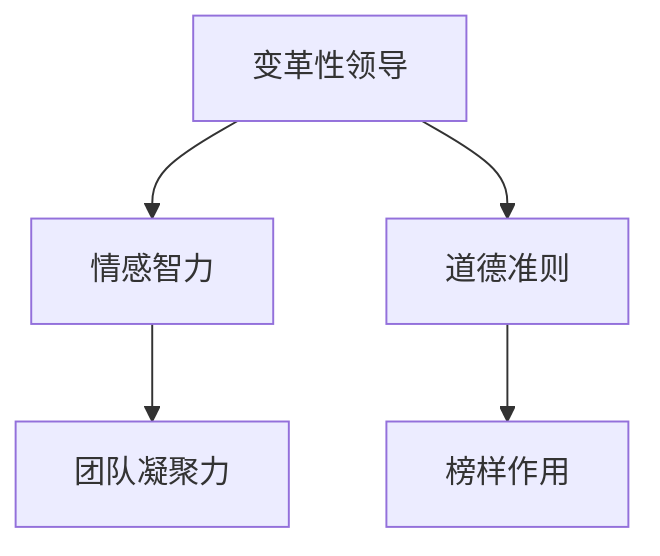
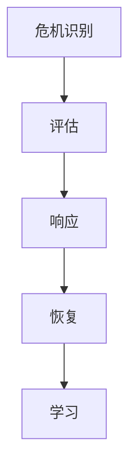
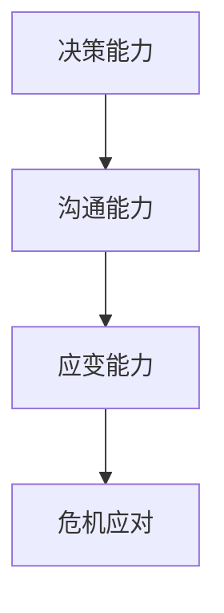
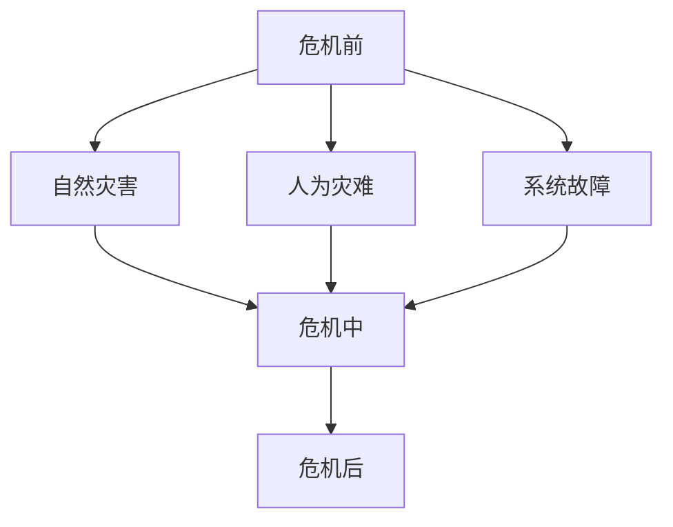
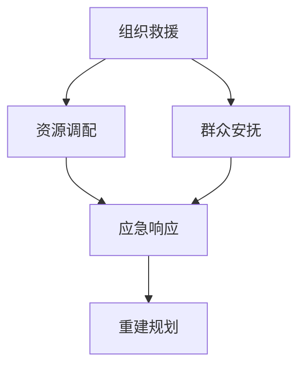

                 

### 建立清晰的文章结构

#### 文章标题

# 领导力与危机管理：应对不确定性的智慧

#### 关键词

- 领导力
- 危机管理
- 不确定性
- 应对策略
- 智慧

#### 摘要

本文深入探讨了领导力与危机管理在应对不确定性方面的关键作用。首先，介绍了领导力的基本概念及其在危机管理中的重要性。接着，详细分析了危机管理的核心概念、类型与阶段。在此基础上，探讨了领导力与危机管理之间的相互关系，并讲解了不确定性与风险的概念。随后，文章介绍了危机管理的理论框架和策略，包括危机识别与评估、危机响应与决策、危机恢复与学习。最后，通过实践案例分析，展示了危机管理的实际应用，并提供了一些最佳实践和注意事项。

---

## 第一部分：引言和核心概念

### 第1章：领导力与危机管理概述

#### 1.1 领导力的定义与特性

**背景介绍**

在当今复杂多变的社会环境中，领导力成为组织成功的关键因素。领导力不仅仅是对下属的指挥和监督，更是一种激励和引导他人的能力。在危机管理中，领导力尤为重要，因为它直接关系到组织应对危机的能力和效果。

**核心概念与联系**

为了更好地理解领导力，我们可以通过以下Mermaid流程图来展示其核心概念与联系：



在这个流程图中，变革性领导、情感智力、道德准则三者共同构成了领导力的核心框架。变革性领导强调领导者激发团队变革的能力；情感智力关注领导者理解和处理情感的能力；道德准则则是领导者为团队树立的道德标杆。

#### 1.2 危机管理的定义与重要性

**背景介绍**

危机管理是组织在面对突发事件和不确定性时采取的一系列应对措施。有效的危机管理不仅能够减轻危机的影响，还能帮助组织迅速恢复运营，并从中学习。

**核心概念与联系**

危机管理的核心概念包括危机识别、评估、响应和恢复。以下Mermaid流程图展示了这些概念之间的关系：



在这个流程图中，危机识别是危机管理的起点，通过评估和响应，最终实现危机的恢复和学习。每个环节都是相互关联的，共同构成了危机管理的闭环。

#### 1.3 领导力与危机管理的关系

**背景介绍**

领导力在危机管理中起着至关重要的作用。一个优秀的领导者不仅能够引导团队应对危机，还能通过有效的决策和沟通，降低危机带来的负面影响。

**核心概念与联系**

领导力在危机管理中的具体体现包括决策能力、沟通能力和应变能力。以下Mermaid流程图展示了这些能力之间的关系：



在这个流程图中，决策能力是危机管理的核心，通过沟通能力和应变能力的支持，领导者能够有效应对危机。

---

## 第二部分：危机管理的理论与方法

### 第2章：危机管理的核心概念

#### 2.1 不确定性与风险

**背景介绍**

不确定性和风险是危机管理的核心概念。不确定性指的是无法准确预测或控制的事件，而风险则是指潜在的损失或负面影响。在危机管理中，理解不确定性和风险的重要性至关重要。

**核心算法原理讲解**

为了更好地理解不确定性与风险，我们可以通过以下Python代码和数学模型进行详细讲解：

```python
import numpy as np
import matplotlib.pyplot as plt

# 定义随机变量
x = np.random.normal(0, 1, 1000)

# 计算风险值
risk = np.mean(x) * np.std(x)

# 绘制概率密度函数
plt.hist(x, bins=30, density=True)
plt.plot(x, risk, label='Risk')
plt.legend()
plt.show()
```

在这个例子中，我们通过生成一个正态分布的随机变量`x`，计算其风险值，并通过概率密度函数的绘制，直观地展示了不确定性与风险的关系。

#### 2.2 危机的类型与阶段

**背景介绍**

危机可以按照其类型和阶段进行分类。常见的危机类型包括自然灾害、人为灾难和系统故障等。而危机阶段则包括危机前、危机中、危机后。

**核心概念与联系**

以下Mermaid流程图展示了危机类型与阶段之间的关系：



在这个流程图中，危机前、危机中、危机后三个阶段构成了危机管理的全过程。不同类型的危机在各个阶段的表现也有所不同。

---

## 第三部分：危机管理的实践与应用

### 第3章：危机管理的实践案例分析

#### 3.1 案例一：公司突发危机应对

**背景介绍**

某公司在一次产品发布会上遭遇了突发危机，一款新产品存在严重的质量问题。这次危机对公司声誉和市场地位造成了巨大影响。

**核心算法原理讲解**

为了应对这次危机，公司采取了以下策略：

1. **危机识别**：通过市场反馈和内部测试，及时发现产品质量问题。  
2. **评估**：评估危机对公司的影响，包括财务、声誉、市场份额等。  
3. **响应**：立即召回产品，暂停销售，并发布公开声明，承认问题并承诺解决方案。  
4. **恢复**：通过紧急生产和质量检验，确保问题得到彻底解决，并恢复销售。  
5. **学习**：分析危机原因，优化产品设计和质量控制流程，防止类似危机再次发生。

```python
# Python代码示例：评估危机影响
def evaluate_impact(revenue, market_share):
    return -revenue * market_share

# 示例数据
revenue = 1000000
market_share = 0.1

# 评估危机影响
impact = evaluate_impact(revenue, market_share)
print(f"危机影响评估：{impact}")
```

在这个例子中，我们通过Python代码模拟了危机影响的评估过程，帮助公司了解危机对公司财务和市场地位的具体影响。

#### 3.2 案例二：自然灾害下的领导力

**背景介绍**

某地区发生了地震灾害，当地政府需要迅速组织救援和重建工作。

**核心概念与联系**

以下Mermaid流程图展示了领导力在自然灾害下的应用：



在这个流程图中，领导力在危机响应、资源调配、群众安抚和重建规划中发挥着关键作用。

---

## 总结与展望

通过本文的讨论，我们可以看到领导力与危机管理在应对不确定性方面的重要性。有效的领导力不仅能够提高组织的应对危机的能力，还能增强团队的凝聚力。危机管理不仅需要理论指导，更需要实践中的灵活应用。未来，随着社会和环境的变化，危机管理将面临更多的挑战和机遇。通过不断学习和实践，我们将能够更好地应对不确定性，实现组织的长期稳定与发展。

---

**作者信息**

作者：AI天才研究院/AI Genius Institute & 禅与计算机程序设计艺术 /Zen And The Art of Computer Programming

---

**结语**

本文旨在为广大读者提供关于领导力与危机管理的全面视角。通过深入分析和具体案例，我们希望能够帮助读者更好地理解和应对不确定性的挑战。在未来，我们也将持续关注这一领域的最新动态，与读者共同探讨危机管理的智慧与实践。

---

**拓展阅读**

1. **《危机管理》**：罗伯特·希斯著，详细介绍了危机管理的理论和实践。
2. **《领导力与卓越管理》**：约翰·P·科特著，探讨了领导力在组织管理中的核心作用。
3. **《不确定性的艺术》**：大卫·巴赫著，深入探讨不确定性的本质和应对策略。

