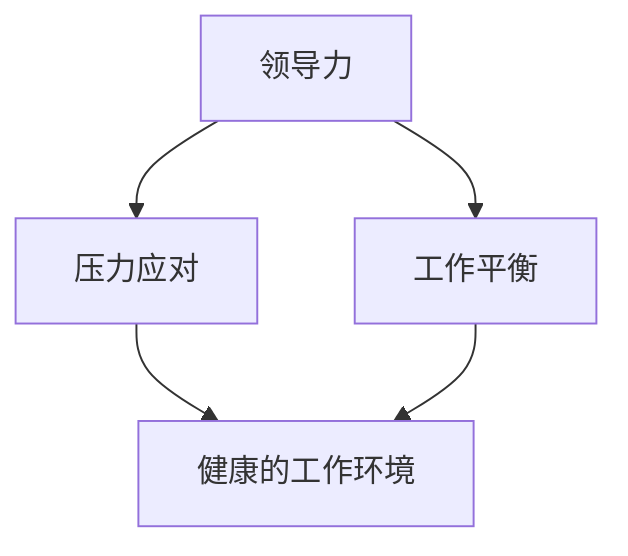

                 

### 引言：领导力与压力应对的必要性

在当今快速发展的信息技术领域，领导力和压力应对已成为企业成功和员工幸福的关键要素。随着技术的不断进步，企业和团队面临着前所未有的挑战与机遇。领导者的角色不仅需要具备高超的技术能力，还必须掌握如何在高压环境中维持团队的工作效率和幸福感。

#### 背景介绍

信息技术行业的快速发展带来了技术更新换代速度的加快，这对团队和领导者提出了更高的要求。一方面，领导者需要不断学习新的技术知识，保持自己在行业中的竞争力；另一方面，他们还必须有效地管理团队，确保团队成员能够在高压环境下保持高效和积极的工作态度。

#### 核心概念与联系

**领导力**：领导力是领导者通过影响和激励他人来实现共同目标的能力。它不仅包括技术知识和战略规划，还涵盖了情感智能、沟通能力和影响力等软技能。

**压力应对**：压力应对是指个体在面对压力源时采取的应对策略。有效的压力应对策略可以帮助个体维持心理健康，提高工作表现。

**工作平衡**：工作平衡是指在工作与个人生活之间取得适当的平衡，以维持整体幸福感和工作效率。

这三个核心概念之间存在着紧密的联系。领导力可以帮助领导者更好地识别和管理团队成员的压力，从而实现工作与生活的平衡。而工作平衡则是维持团队长期高效运作和员工满意度的关键。通过有效的领导力和压力应对，领导者可以创造一个健康、积极的工作环境，从而提升团队的整体绩效。

#### Mermaid 流程图

以下是领导力、压力应对和工作平衡之间的联系架构 Mermaid 流程图：



#### 核心算法原理讲解

为了更好地理解领导力与压力应对之间的关系，我们可以借助一些数学模型和心理学理论来进行分析。

**1. 压力管理策略**

压力管理策略包括以下几个方面：

- **认知重构**：通过改变对压力事件的认知评价来减少压力感。
- **放松训练**：通过深呼吸、冥想等放松技巧来缓解身体和心理的紧张状态。
- **积极心理训练**：通过积极的思考方式和心态来增强心理韧性。

以下是一个简单的 Python 源代码示例，用于计算压力管理策略的效果：

```python
def cognitive_restructuring(effectiveness):
    return effectiveness * 0.8

def relaxation_training(effectiveness):
    return effectiveness * 0.9

def positive_mental_training(effectiveness):
    return effectiveness * 1.2

def calculate_effective_pressure_management策略(strategy_values):
    total_effectiveness = 0
    for strategy in strategy_values:
        if strategy == '认知重构':
            total_effectiveness += cognitive_restructuring(0.7)
        elif strategy == '放松训练':
            total_effectiveness += relaxation_training(0.7)
        elif strategy == '积极心理训练':
            total_effectiveness += positive_mental_training(0.7)
    return total_effectiveness

# 示例输入
strategy_values = ['认知重构', '放松训练', '积极心理训练']
total_effectiveness = calculate_effective_pressure_management策略(strategy_values)
print(f"总有效性：{total_effectiveness}")
```

**2. 时间管理方法**

时间管理方法包括以下几个方面：

- **时间块法**：将时间划分为不同的块，并为每个块分配特定的任务。
- **优先级排序**：根据任务的紧急程度和重要性来排序任务。
- **番茄工作法**：使用番茄钟来管理时间和提高专注度。

以下是一个简单的 Python 源代码示例，用于计算时间管理策略的效果：

```python
def time_Blocking(effectiveness):
    return effectiveness * 0.9

def priority_Sorting(effectiveness):
    return effectiveness * 0.95

def tomato_Working(effectiveness):
    return effectiveness * 1.1

def calculate_time_management效果(策略_values):
    total_effectiveness = 0
    for strategy in 策略_values:
        if strategy == '时间块法':
            total_effectiveness += time_Blocking(0.8)
        elif strategy == '优先级排序':
            total_effectiveness += priority_Sorting(0.8)
        elif strategy == '番茄工作法':
            total_effectiveness += tomato_Working(0.8)
    return total_effectiveness

# 示例输入
策略_values = ['时间块法', '优先级排序', '番茄工作法']
total_effectiveness = calculate_time_management效果(策略_values)
print(f"总有效性：{total_effectiveness}")
```

#### 数学模型和公式

为了更好地衡量工作平衡，我们可以使用以下数学模型和公式：

**1. 工作效率计算公式**

$$ E = \frac{W}{T} $$

其中，E 表示工作效率，W 表示工作完成量，T 表示工作时间。

**2. 压力值计算模型**

$$ P = \frac{S \cdot T}{C} $$

其中，P 表示压力值，S 表示工作强度，T 表示工作时间，C 表示抗压能力。

通过这些公式，我们可以量化工作效率和压力值，从而更好地评估工作平衡状况。

#### 举例说明

假设一个团队成员的工作量是 8 小时，完成了 50% 的工作量，同时他的抗压能力是中等水平。我们可以使用上述公式来计算他的工作效率和压力值。

**工作效率计算：**

$$ E = \frac{W}{T} = \frac{0.5}{8} = 0.0625 $$

**压力值计算：**

$$ P = \frac{S \cdot T}{C} = \frac{0.5 \cdot 8}{1} = 4 $$

这意味着该团队成员的工作效率为 0.0625，压力值为 4。

通过这个例子，我们可以看到，即使工作量完成得很好，但如果压力过大，也会影响工作效率。因此，领导者和团队成员需要关注压力管理，以维持工作平衡。

#### 结论

领导力与压力应对是维持工作平衡的关键因素。通过有效的领导力和压力管理策略，领导者可以创造一个健康、积极的工作环境，从而提升团队的整体绩效。本文介绍了领导力、压力应对和工作平衡的核心概念，并使用 Python 源代码和 Mermaid 流程图进行了详细讲解，帮助读者更好地理解这些概念。

在接下来的部分，我们将进一步探讨领导力的具体实践方法，以及如何在工作和生活中实现平衡，帮助读者在实际工作中运用这些理论，提升领导力和应对压力的能力。 ### 第1部分：领导力的基础

#### 领导力概述

领导力是一种通过影响和激励他人来实现共同目标的能力。它不仅仅局限于管理职位，更是一种每个人都可以学习和发展的技能。领导力涵盖了多个方面，包括情感智能、沟通能力、决策能力等。在信息技术领域，领导力尤为重要，因为技术的快速更新和变革要求领导者不仅要有深厚的专业知识，还要具备灵活的思维和适应能力。

**领导力的定义与重要性**

领导力可以被定义为一种激发他人才能并共同实现目标的能力。它不仅涉及对任务的执行，更关乎对团队和组织的长远发展。在信息技术领域，领导力的重要性体现在以下几个方面：

- **技术创新**：领导者需要推动技术创新，引领团队探索新的技术和解决方案，以保持企业的竞争力。
- **团队协作**：信息技术项目通常需要跨部门合作，领导者必须协调各方资源，确保团队高效协同工作。
- **人才培养**：领导者需要关注团队成员的个人成长，培养他们的专业技能和领导潜力。

**领导力的核心要素**

领导力的核心要素包括：

- **愿景**：领导者需要有一个清晰的愿景，为团队指明方向，激励成员为之努力。
- **沟通**：有效的沟通是领导力的关键。领导者需要倾听团队成员的意见，并清晰表达自己的想法和期望。
- **决策能力**：领导者需要具备快速决策的能力，在复杂的环境中做出明智的决策。
- **激励**：领导者需要了解团队成员的需求，通过激励措施激发他们的工作热情和创造力。

**领导力的发展路径**

领导力的发展不是一蹴而就的，而是一个不断学习和成长的过程。以下是领导力发展的几个关键步骤：

1. **自我认知**：领导者首先需要了解自己的优点和不足，通过自我反思和反馈来提升自我意识。
2. **技能提升**：领导者需要不断学习新的知识和技能，保持自己在技术和管理方面的竞争力。
3. **实践应用**：理论知识和实践经验相结合，通过实际工作中的挑战来提升领导能力。
4. **团队建设**：领导者需要关注团队的建设和发展，培养团队成员的协作精神和团队文化。

#### 领导力模型

领导力模型是研究领导行为和领导风格的理论框架。以下是几种经典的领导力模型：

- **路径—目标理论**：该理论认为领导者的主要任务是帮助下属明确目标，并提供实现目标的路径。领导者根据下属的需求和情境采取不同的领导风格。

- **变革型领导理论**：变革型领导强调领导者的远见和激励能力，通过激发下属的内在动力来推动变革。

- **情境领导理论**：该理论认为领导风格应该根据下属的成熟度来调整。领导者需要根据下属的不同发展阶段采取不同的领导策略。

- **领导者—成员交换理论**（LMX理论）：该理论关注领导者与下属之间的关系，认为领导者与下属之间的互动会影响团队成员的工作满意度和绩效。

**自我领导力培养**

自我领导力是领导者自我管理和自我提升的能力。以下是培养自我领导力的几个关键步骤：

1. **自我反思**：领导者需要定期进行自我反思，了解自己的优点和不足，从而进行有针对性的改进。
2. **设定目标**：领导者需要设定明确的个人和团队目标，并制定实现目标的计划。
3. **持续学习**：领导者需要不断学习新知识和技能，保持自己在技术和管理方面的领先地位。
4. **情绪管理**：领导者需要学会管理自己的情绪，保持冷静和理性，以应对工作中的各种挑战。

#### 领导风格

领导风格是指领导者进行领导活动时采用的行为方式和态度。不同的领导风格适用于不同的情境和团队。以下是几种常见的领导风格：

- **权威型领导风格**：权威型领导者强调对下属的控制和指挥，决策权集中在领导者手中。

- **民主型领导风格**：民主型领导者鼓励团队成员参与决策过程，重视团队意见，决策相对民主。

- **支持型领导风格**：支持型领导者注重团队成员的感受和需求，提供支持和帮助，营造一个友好和舒适的工作环境。

- **教练型领导风格**：教练型领导者不仅提供指导和建议，还帮助团队成员发现和发展自己的潜力。

每种领导风格都有其优势和适用范围，领导者需要根据具体情况和团队特点选择合适的领导风格。在实际工作中，领导者也可以结合多种领导风格，灵活应对不同的挑战。

通过本章节的探讨，我们了解了领导力的基本概念、核心要素、发展路径以及不同领导力模型和领导风格。接下来，我们将进一步探讨压力的来源和影响，以及如何有效地管理压力，以维持工作和生活的平衡。 ### 第2部分：压力来源与应对

#### 压力的本质

压力是一种生理和心理的应激反应，通常由外界环境或内部心理状态触发。在信息技术领域，压力来源多种多样，包括工作压力、生活压力和技术挑战等。理解压力的本质和其对个体的影响是有效应对压力的前提。

**压力的定义与分类**

压力（Stress）是指个体在面对外部或内部要求时，所产生的生理和心理上的紧张状态。根据压力的来源，压力可以分为以下几种类型：

- **工作压力**：工作压力通常来源于工作负荷、工作环境、人际关系和职业发展等方面。高工作负荷、长时间工作、工作不安全感等都是常见的工作压力来源。
- **生活压力**：生活压力包括家庭、财务、健康和人际关系等方面的压力。家庭矛盾、经济负担、健康问题等都会对个体的心理和生理健康产生负面影响。
- **技术挑战**：信息技术领域的技术快速发展和创新带来了技术挑战，这包括学习新技术、适应新工具和解决技术问题等。技术变革的速度往往使得从业者感到压力巨大。

**压力的生理与心理影响**

压力不仅会影响个体的心理状态，还会对生理健康产生负面影响。以下是压力的几种常见生理和心理影响：

- **生理影响**：长期的压力会导致免疫系统功能下降、心血管疾病风险增加、睡眠质量下降等问题。生理上的反应可能包括头痛、胃痛、肌肉紧张等。
- **心理影响**：心理上的压力会导致焦虑、抑郁、情绪波动和注意力分散等问题。个体可能会感到疲惫、缺乏动力，甚至产生逃避或放弃的想法。

**压力与工作表现的关系**

压力与工作表现之间的关系复杂，但总体而言，适度的压力可以激发个体的潜能，提高工作效率。然而，长期或过度的压力会导致工作效率下降、错误率增加、创造力减弱等问题。以下是压力对工作表现的具体影响：

- **工作效率**：适度的压力可以提高个体的专注力和动力，从而提高工作效率。但过度的压力会导致注意力分散、决策困难，降低工作效率。
- **创造力**：适度的压力可以激发个体的创造力，因为挑战和压力往往促使人们寻求创新的解决方案。然而，长期或过度的压力会抑制创造力，导致思维固化。
- **团队合作**：压力不仅影响个体，还会影响团队合作。团队成员之间的紧张关系、沟通障碍和协作效率下降都可能是压力带来的后果。

**压力管理的必要性**

在信息技术领域，压力管理至关重要。有效的压力管理不仅有助于提高个体的心理健康和生理健康，还能提升工作效率和团队合作能力。以下是压力管理的必要性：

- **维护身心健康**：通过有效的压力管理，个体可以减少因压力导致的生理和心理问题，维护身心健康。
- **提高工作效率**：有效的压力管理可以帮助个体保持专注和高效，提高工作效率。
- **促进团队合作**：良好的压力管理可以改善团队成员之间的关系，促进团队合作，提高团队绩效。
- **增强工作满意度**：通过减轻压力，个体可以感受到工作环境的改善，从而提高工作满意度。

#### 压力的来源

在信息技术领域，压力的来源多种多样，以下是一些常见的工作压力来源：

- **工作量**：工作量大且紧急的任务是导致压力的主要原因之一。长时间的工作和频繁的工作加班都会增加个体的压力感。
- **工作环境**：不安全的工作环境、不良的人际关系和工作氛围都可能成为压力的来源。
- **职业发展**：职业晋升压力、工作不安全感、职业前景不确定性等都会对个体产生压力。
- **技术变革**：技术快速发展和变革要求从业者不断学习和适应新工具、新技术，这可能导致技术恐慌和学习压力。

#### 压力管理策略

有效的压力管理策略可以帮助个体应对工作压力，保持心理健康和高效的工作状态。以下是一些常见的压力管理策略：

- **认知重构**：通过改变对压力事件的认知评价来减少压力感。例如，将“必须完成任务”转变为“尽量完成任务”。
- **放松训练**：通过深呼吸、冥想、瑜伽等放松技巧来缓解身体和心理的紧张状态。
- **时间管理**：合理安排时间，避免过度工作和加班，提高工作效率。
- **积极心理训练**：通过积极的思考方式和心态来增强心理韧性，例如进行自我激励、设定小目标等。

**认知重构**

认知重构是一种通过改变对压力事件的认知来减少压力感的方法。以下是一个简单的例子：

```python
def cognitive_restructuring(event, original_perception, new_perception):
    print(f"事件：{event}")
    print(f"原始认知：{original_perception}")
    print(f"重构后认知：{new_perception}")

# 示例
event = "项目延迟交付"
original_perception = "我无法按时完成任务，压力巨大"
new_perception = "虽然项目延迟，但我还有时间调整计划，确保质量"

cognitive_restructuring(event, original_perception, new_perception)
```

**放松训练**

放松训练是一种通过深呼吸、冥想等技巧来缓解压力的方法。以下是一个简单的 Python 源代码示例，用于指导深呼吸放松：

```python
def deep_breathingRELAXATION():
    print("开始深呼吸放松：")
    print("1. 深吸一口气，慢慢数到4。")
    print("2. 屏住呼吸，慢慢数到7。")
    print("3. 慢慢呼出气体，慢慢数到8。")
    print("重复以上步骤，每次深呼吸持续约1分钟。")

deep_breathingRELAXATION()
```

通过以上对压力来源和压力管理策略的探讨，我们了解了在信息技术领域中，压力管理的重要性以及如何采取有效的策略来应对压力。在接下来的章节中，我们将进一步探讨时间管理方法，以帮助读者在忙碌的工作中维持平衡，提高工作效率。 ### 第3部分：维持工作平衡

#### 工作平衡的重要性

在信息技术领域，工作平衡是实现个人和职业成功的关键因素。有效的平衡可以帮助员工提高工作效率，减轻压力，同时保持身心健康和个人生活的丰富。以下从工作与生活的关系、工作效率与生活质量两个方面，详细探讨工作平衡的重要性。

**工作与生活的关系**

工作与生活的平衡对于个人的整体幸福感和职业满意度至关重要。在忙碌的工作中，如果没有适当的休息和放松，长期的工作压力会对身心健康产生负面影响，导致工作效率下降、创造力减弱、甚至出现职业倦怠。相反，良好的工作平衡能够帮助员工在紧张的工作之余，享受生活，从而提高生活满意度。

以下是工作与生活平衡对个人的积极影响：

- **提高工作效率**：通过合理的休息和放松，员工可以恢复精力，提高专注力和工作效率。
- **促进身心健康**：定期参与体育活动、社交活动和休闲活动，有助于缓解工作压力，提高身心健康水平。
- **增强创造力**：适当的放松和休息可以激发员工的创造力，使其在工作和生活中都有更多创新的想法。
- **提高职业满意度**：工作与生活平衡使员工感到生活充实、事业有成，从而提高职业满意度。

**工作效率与生活质量**

工作效率和生活质量之间的密切关系不可忽视。高效的工作可以带来职业成就感，而丰富的生活体验可以提升个人幸福感。以下从工作效率和生活质量两个方面，探讨如何通过工作平衡来提升两者的关系：

- **提升工作效率**：通过合理安排工作时间，确保有足够的时间进行专注工作和休息，可以提高工作效率。例如，使用时间块法来安排工作，确保每个时间段都能高效地完成特定任务。
- **提高生活质量**：在工作之外，员工可以通过参与社交活动、锻炼身体、学习新技能等方式来丰富自己的生活。这些活动不仅可以缓解工作压力，还能提升生活质量。
- **促进身心健康**：工作与生活平衡有助于维持良好的身心健康。通过合理安排时间，确保有足够的休息和放松时间，可以减少工作引起的身体和心理问题，如失眠、焦虑和抑郁。

**工作平衡对团队的影响**

工作平衡不仅对个人有积极影响，对团队和组织也有重要意义。以下是工作平衡对团队的积极影响：

- **提升团队合作**：工作平衡可以减少团队成员的工作压力，改善团队合作氛围，提高团队协作效率。
- **降低员工流失率**：良好的工作平衡有助于提高员工的工作满意度，从而降低员工流失率。
- **增强组织竞争力**：通过关注员工的工作和生活平衡，组织可以吸引和保留优秀人才，提升整体竞争力。

**如何实现工作平衡**

实现工作平衡需要从多个方面入手，包括时间管理、工作习惯和生活习惯的调整。以下是一些具体的方法和策略：

- **时间管理**：合理安排工作时间，确保有足够的时间进行工作和休息。例如，使用番茄工作法来提高专注力和工作效率，避免长时间连续工作。
- **设定优先级**：根据任务的紧急程度和重要性来设定优先级，确保优先完成重要任务，避免因小事而浪费时间。
- **灵活工作安排**：与上级和同事沟通，灵活安排工作时间，例如采取弹性工作制或远程办公，以适应个人和家庭需求。
- **培养健康生活习惯**：保持健康的饮食和适量的运动，确保有充足的睡眠，这些都有助于提高工作效率和生活质量。

通过以上对工作平衡重要性的探讨，我们了解了工作平衡对个人和团队的重要性。在接下来的章节中，我们将进一步探讨时间管理的方法，帮助读者在实际工作中实现工作与生活的平衡。 ### 时间管理

#### 时间管理基础

时间管理是维持工作与生活平衡的关键要素。通过有效的时间管理，我们可以提高工作效率，减少因时间分配不当而产生的压力，从而更好地平衡工作和生活。以下是几种常见的时间管理基础方法和策略。

**时间块法**

时间块法是一种将时间划分为固定块，并为每个块分配特定任务的方法。这种方法有助于提高专注度和效率，同时避免任务的交叉和拖延。

以下是一个简单的 Python 源代码示例，用于实现时间块法：

```python
def time_Blocking(tasks, time_blocks):
    """
    时间块法任务分配。

    :param tasks: 任务列表
    :param time_blocks: 时间块列表
    :return: 分配结果
    """
    assigned_tasks = {block: [] for block in time_blocks}
    for task in tasks:
        # 根据任务优先级和可用时间块进行分配
        for block in time_blocks:
            if not assigned_tasks[block] or task['priority'] > assigned_tasks[block][-1]['priority']:
                assigned_tasks[block].append(task)
                break
    return assigned_tasks

# 示例
tasks = [
    {'name': '会议', 'priority': 2},
    {'name': '报告', 'priority': 1},
    {'name': '邮件', 'priority': 3}
]

time_blocks = ['上午', '下午', '晚上']

assigned_tasks = time_Blocking(tasks, time_blocks)
print(assigned_tasks)
```

**优先级排序**

优先级排序是一种根据任务的紧急程度和重要性来安排任务顺序的方法。通过设定任务优先级，我们可以确保首先完成最重要的任务，从而提高工作效率。

以下是一个简单的 Python 源代码示例，用于实现优先级排序：

```python
def priority_Sorting(tasks):
    """
    根据优先级对任务进行排序。

    :param tasks: 任务列表
    :return: 排序后的任务列表
    """
    return sorted(tasks, key=lambda x: x['priority'])

# 示例
tasks = [
    {'name': '会议', 'priority': 2},
    {'name': '报告', 'priority': 1},
    {'name': '邮件', 'priority': 3}
]

sorted_tasks = priority_Sorting(tasks)
print(sorted_tasks)
```

**番茄工作法**

番茄工作法是一种通过设定固定的时间段（通常为25分钟）来提高专注力和工作效率的方法。在每个时间段内，专注完成任务，然后休息5分钟。这种方法有助于避免长时间连续工作导致的疲劳和注意力分散。

以下是一个简单的 Python 源代码示例，用于实现番茄工作法：

```python
import time

def tomato_Working(tasks, work_duration=25, break_duration=5):
    """
    番茄工作法任务执行。

    :param tasks: 任务列表
    :param work_duration: 工作时间段（秒）
    :param break_duration: 休息时间段（秒）
    :return: 执行结果
    """
    completed_tasks = []
    for task in tasks:
        start_time = time.time()
        print(f"开始任务：{task['name']}")
        while time.time() - start_time < work_duration:
            # 模拟任务执行
            time.sleep(0.1)
        print(f"完成任务：{task['name']}")
        completed_tasks.append(task)
        # 休息
        time.sleep(break_duration)
    return completed_tasks

# 示例
tasks = [
    {'name': '会议', 'priority': 2},
    {'name': '报告', 'priority': 1},
    {'name': '邮件', 'priority': 3}
]

completed_tasks = tomato_Working(tasks)
print(completed_tasks)
```

通过以上几种方法，我们可以更好地管理时间，提高工作效率，从而实现工作与生活的平衡。在接下来的部分，我们将进一步探讨如何在实际工作中应用这些时间管理方法。 ### 工作与生活的平衡

#### 家庭与工作的协调

在信息技术领域，工作与生活的平衡往往是一个挑战，特别是对于那些需要经常加班或者经常出差的人。然而，家庭和工作之间的协调对于个人的整体幸福感和职业满意度至关重要。以下是一些策略，帮助在家庭和工作之间找到平衡：

**1. 设定明确的工作时间**

通过设定明确的工作时间，可以减少家庭和工作之间的混淆。例如，每天晚上设定一个固定的时间作为下班时间，确保在这个时间之后专注于家庭和私人生活。

**2. 优先处理家庭任务**

在时间管理中，给家庭任务留出时间是非常重要的。比如，安排周末的固定时间来处理家务或陪伴家人，确保不会因为工作而忽略了家庭。

**3. 与家人沟通**

与家人进行开放和诚实的沟通，让他们了解你的工作需求和安排。这样可以减少不必要的误解和冲突，同时也能得到家人的理解和支持。

**4. 灵活的工作安排**

如果可能的话，与雇主或团队沟通，尝试灵活的工作安排，如远程工作或弹性工作时间。这样可以在一定程度上减少通勤时间和工作压力，为家庭生活留出更多空间。

**个人兴趣与职业发展的平衡**

保持个人兴趣和职业发展的平衡是维持工作与生活平衡的另一个关键因素。以下是一些建议：

**1. 设定个人目标**

明确个人的短期和长期目标，并将其与职业发展相结合。这样可以确保在追求职业成长的同时，不会忽视个人兴趣和爱好。

**2. 定期参与兴趣爱好**

定期参与个人兴趣爱好，如运动、阅读或艺术创作，可以缓解工作压力，增强个人的幸福感和满足感。

**3. 学会放松**

在工作中学会放松技巧，如冥想、深呼吸或瑜伽，可以帮助你更好地应对压力，保持身心健康。

**4. 调整职业规划**

有时候，为了更好地平衡工作和生活，可能需要调整职业规划。例如，选择更符合个人兴趣的工作，或者寻找更多远程工作或兼职的机会。

**案例分析：如何平衡工作与生活**

以下是一个关于如何在工作和生活之间找到平衡的案例分析：

**案例：张先生**

张先生是一位软件工程师，他最近发现自己的工作与生活平衡出现了问题。他经常因为工作而忽略了家庭和个人的兴趣，导致家庭关系紧张和身体健康下降。

**解决方案：**

1. **设定明确的工作时间**：张先生与家人商定了每天晚上8点为下班时间，确保在这个时间之后专注于家庭和私人生活。

2. **优先处理家庭任务**：张先生调整了自己的日程，每周安排固定的周末时间来处理家务和陪伴家人。

3. **与家人沟通**：张先生与家人进行了坦诚的沟通，让他们了解自己的工作需求和安排，得到了家人的理解和支持。

4. **灵活的工作安排**：张先生与雇主沟通，尝试远程工作或弹性工作时间，从而减少了通勤时间和工作压力。

5. **设定个人目标**：张先生明确了个人短期和长期目标，并将其与职业发展相结合，确保在追求职业成长的同时，不会忽视个人兴趣和爱好。

通过这些措施，张先生逐渐找到了工作与生活的平衡，家庭关系得到了改善，身体健康也有所提升。

**结论**

工作与生活的平衡是一个复杂但关键的问题，特别是在信息技术领域。通过设定明确的工作时间、优先处理家庭任务、与家人沟通、灵活的工作安排和设定个人目标，可以帮助我们更好地平衡工作和生活，提升整体幸福感。在接下来的章节中，我们将继续探讨实际工作中的领导力应用和案例分析，帮助读者将理论转化为实践。 ### 实际案例研究：领导力与工作平衡的双重挑战

在实际工作中，领导力与工作平衡的双重挑战常常令许多管理者感到困惑。本文将通过两个具体的案例，详细分析领导力在应对工作压力和维持团队平衡方面的具体实践和效果。

#### 案例一：技术团队的领导力与压力应对

**背景**：

某信息技术公司的一个技术团队负责开发一款新兴的物联网产品。随着项目的推进，团队成员面临着不断的技术挑战和紧迫的交付时间表。项目初期，团队成员的压力逐渐增大，工作效率下降，团队内部出现了沟通不畅和矛盾加剧的情况。

**领导力实践**：

1. **明确团队目标与期望**：团队领导组织了一次全体会议，明确项目的目标和每个成员的具体职责。通过沟通，确保每个团队成员都理解自己的角色和期望，从而减少误解和冲突。

2. **灵活调整任务分配**：领导者在任务分配上采取了灵活策略，根据团队成员的能力和兴趣进行分配，确保每个人都能在自己的优势领域发挥作用。同时，领导者定期评估任务进度，及时调整任务分配，确保资源合理利用。

3. **鼓励团队协作**：领导者推动团队成员之间的沟通和协作，通过定期团队会议和讨论，解决项目中的技术难题。此外，领导者还设立了跨职能小组，促进不同部门之间的合作，提高了整体工作效率。

4. **压力管理策略**：领导者引入了多种压力管理策略，包括定期组织团队活动、鼓励员工参与运动和社交活动等。同时，领导者与团队成员进行一对一沟通，了解他们的压力源，并提供个性化的支持和建议。

**效果**：

通过以上领导力实践，团队成员的压力得到了有效缓解，团队内部的沟通和协作显著改善。项目进度得以顺利推进，最终按时交付了高质量的物联网产品。团队成员的工作满意度和工作效率都得到了提升。

#### 案例二：项目经理的工作平衡策略

**背景**：

某大型IT公司的项目经理王先生负责多个关键项目的管理工作。由于项目复杂度高、时间紧迫，王先生经常需要在工作中加班，导致个人生活受到了严重影响。长期的过度工作使王先生感到身心疲惫，家庭关系也出现了问题。

**工作平衡策略**：

1. **设定优先级**：王先生通过制定每日和每周的工作计划，明确任务的优先级，确保首先完成最重要的任务。同时，他学会了拒绝不紧急或不重要的任务，以避免过度工作。

2. **时间管理**：王先生采用了时间块法，将工作时间划分为专注工作、休息和放松的块。他确保每天有足够的休息时间，避免长时间连续工作。此外，他还利用周末时间进行家庭活动和休闲，确保个人生活的丰富。

3. **与家人沟通**：王先生与家人进行了坦诚的沟通，让他们了解自己的工作需求和安排。通过调整家庭活动的时间，确保有足够的时间陪伴家人，减少了因工作而导致的家庭冲突。

4. **培养健康习惯**：王先生开始注重身体健康，定期进行体育锻炼，如跑步和瑜伽。他还调整了饮食习惯，确保摄入均衡的营养，从而提高工作效率和抵抗力。

**效果**：

通过以上工作平衡策略，王先生的工作效率得到了显著提升，项目进度得到了有效控制。同时，他的家庭关系得到了改善，个人幸福感也得到了提升。王先生的领导力和工作效率得到了团队的认可，他也因此获得了更多的职业发展机会。

#### 结论

通过以上两个实际案例，我们可以看到领导力在应对工作压力和维持团队平衡方面的关键作用。有效的领导力不仅能够帮助团队克服技术挑战，还能在压力管理方面提供支持，促进工作与生活的平衡。领导者的角色不仅仅是管理任务，更是关心团队成员的身心健康，为他们提供必要的支持和资源。

在实际工作中，领导者需要不断学习和实践，结合团队的具体情况，灵活运用不同的领导力和压力管理策略。通过持续的实践和改进，领导者可以创造一个健康、积极的工作环境，从而提升团队的整体绩效和个人幸福感。 ### 压力应对案例分析

在本章节中，我们将通过两个具体的案例，深入剖析在信息技术领域中的压力应对策略，以及这些策略在实际操作中的应用和效果。

#### 案例一：技术项目经理的挑战与应对

**背景**：

张先生是一名资深的技术项目经理，负责一家大型互联网公司的多个关键项目。随着公司业务的快速发展，项目规模和复杂度不断增加，张先生面临着前所未有的压力。项目的高强度工作、紧迫的交付期限以及频繁的技术难题，使张先生感到身心俱疲。

**压力源识别**：

1. **工作量**：张先生需要同时管理多个项目，每个项目都有严格的时间表和交付要求，导致工作负荷巨大。
2. **技术挑战**：项目涉及的新技术不断涌现，张先生和团队需要不断学习和适应，以确保项目成功。
3. **团队沟通**：由于团队成员分布在不同城市，沟通效率成为一大挑战，增加了项目管理的难度。

**应对策略**：

1. **任务分解**：张先生将复杂的项目任务分解为多个小任务，并为每个任务设定明确的截止日期和责任人。这样不仅降低了任务的难度，还提高了团队的协同效率。
2. **时间管理**：张先生采用了番茄工作法，将工作时间划分为25分钟的工作块，每个工作块结束后休息5分钟。这种方法提高了张先生的专注力和工作效率，减少了疲劳。
3. **技术培训**：张先生组织了定期的技术培训，帮助团队成员掌握新技术，提高整体技术能力。同时，他还引入了外部专家进行指导，解决技术难题。
4. **团队沟通**：张先生通过使用团队协作工具，如Slack和Trello，加强了团队之间的沟通。他还定期组织线上会议，确保团队成员之间的信息畅通。

**效果评估**：

通过实施上述策略，张先生成功地应对了项目中的各种挑战。项目进度得以按计划推进，团队协作效率显著提高。团队成员的工作压力减轻，士气得到了提升。张先生的领导力和管理能力得到了团队的认可，也为他的职业发展打下了坚实的基础。

#### 案例二：软件开发工程师的应对策略

**背景**：

李女士是一名软件开发工程师，她在一家初创公司工作。由于公司规模较小，李女士不仅需要负责软件开发，还需要参与项目管理和客户沟通。这种多角色的职责使她感到压力巨大，工作与生活之间的平衡难以维持。

**压力源识别**：

1. **工作负荷**：李女士的工作任务繁重，需要同时处理多个软件项目和客户需求，导致工作负荷过高。
2. **技术压力**：初创公司的技术环境和工具不断变化，李女士需要不断学习新技术，以适应快速变化的工作环境。
3. **沟通障碍**：由于公司规模较小，团队之间的沟通和信息传递存在一定的障碍，影响了工作效率。

**应对策略**：

1. **任务优先级**：李女士学会了根据任务的重要性和紧急程度来设定优先级，确保首先完成最重要的任务。她通过制定每日工作计划，提高了工作效率，减少了不必要的压力。
2. **时间管理**：李女士采用了时间块法，将工作时间划分为不同的块，并为每个块分配特定的任务。这种方法提高了她的专注力和工作效率，避免了任务交叉和拖延。
3. **学习与成长**：李女士利用业余时间参加在线课程和技术社区，不断学习和提升自己的技术能力。她通过不断积累知识和技能，提高了自己在公司中的竞争力。
4. **沟通技巧**：李女士通过积极参与团队会议和沟通，提高了信息传递的效率。她还学会了使用多种沟通工具，如邮件、即时通讯和项目管理软件，确保团队成员之间的信息畅通。

**效果评估**：

通过实施上述策略，李女士成功地应对了工作压力，保持了良好的工作状态。她的任务完成率提高，客户满意度也有所提升。同时，李女士在工作与生活之间的平衡得到了改善，个人生活质量和幸福感得到了提升。

#### 结论

以上两个案例表明，在信息技术领域中，有效的压力应对策略对于个人和团队的成功至关重要。通过合理的任务分配、时间管理、技术培训、沟通技巧等策略，可以显著减轻工作压力，提高工作效率和团队协作能力。这些策略不仅帮助个人在高压环境中保持健康，还促进了团队的长期稳定和发展。在未来的工作中，无论是领导还是团队成员，都应该重视压力应对，不断探索和实施有效的策略，以应对不断变化的工作挑战。 ### 个人实践指南

#### 压力管理工具与方法

在信息技术领域，压力管理是确保个人和团队长期高效运作的关键。以下是一些实用的工具和方法，帮助个人应对工作压力：

**1. 认知重构**

**方法**：通过改变对压力事件的认知来减少压力感。例如，将“这个任务太难了”转变为“这是一个挑战，我可以尝试不同的方法来解决它”。

**应用场景**：当遇到复杂的技术问题时，通过认知重构来调整心态，从而更好地应对挑战。

**2. 放松训练**

**方法**：通过深呼吸、冥想、瑜伽等放松技巧来缓解身体和心理的紧张状态。

**应用场景**：在长时间的工作后，通过放松训练来恢复精力，提高工作效率。

**3. 时间管理**

**方法**：合理安排时间，避免过度工作和加班，提高工作效率。例如，使用时间块法来划分工作时间，确保有足够的休息和放松时间。

**应用场景**：在项目高峰期，通过时间管理来确保任务按计划完成，同时避免过度疲劳。

**4. 积极心理训练**

**方法**：通过积极的思考方式和心态来增强心理韧性，例如进行自我激励、设定小目标等。

**应用场景**：在面临重要任务时，通过积极心理训练来提高自信和决心，确保任务顺利完成。

**5. 健康生活习惯**

**方法**：保持健康的饮食、适量的运动和充足的睡眠，这些都有助于提高工作效率和应对压力。

**应用场景**：在日常生活中，通过健康生活习惯来维持良好的身体状态，从而更好地应对工作压力。

#### 领导力与工作平衡的实践建议

**1. 设定明确的目标和期望**

作为领导者，要确保团队成员对项目目标和期望有清晰的认识。通过明确的目标和期望，可以减少误解和冲突，提高团队协作效率。

**2. 灵活调整任务分配**

根据团队成员的能力和兴趣，灵活调整任务分配。这样可以确保每个成员都能在自己的优势领域发挥作用，从而提高整体工作效率。

**3. 鼓励团队沟通和协作**

定期组织团队会议和讨论，促进团队成员之间的沟通和协作。通过建立良好的沟通机制，可以解决项目中的技术难题，提高团队凝聚力。

**4. 关注团队成员的身心健康**

作为领导者，要关注团队成员的身心健康，提供必要的支持和资源。例如，定期组织团队活动，鼓励团队成员参与运动和社交活动，以缓解工作压力。

**5. 营造积极的工作氛围**

营造一个积极、健康的工作氛围，鼓励团队成员提出建议和意见。通过建立积极的团队文化，可以提高团队成员的工作满意度和忠诚度。

#### 注意事项

- **避免过度工作**：长时间工作会导致身心疲惫，降低工作效率。领导者应避免过度工作文化，确保团队成员有足够的休息时间。
- **平衡工作与生活**：领导者要关注团队成员的工作与生活平衡，提供灵活的工作安排和资源支持，以帮助他们更好地管理个人生活。
- **倾听与反馈**：领导者要倾听团队成员的意见和需求，及时提供反馈和支持。这有助于建立信任和良好的团队关系。

#### 拓展阅读

- **《正面管教》**：一本关于如何有效管理情绪和应对压力的书籍，适用于个人和团队。
- **《深度工作》**：一本关于如何在信息技术领域中高效工作的指南，强调集中注意力和减少干扰的重要性。
- **《团队协作的艺术》**：一本关于如何提高团队协作效率和团队文化的书籍，适用于领导者和管理者。

通过以上实践指南，我们可以更好地管理压力，提高工作效率，实现工作与生活的平衡。领导者应结合团队的具体情况，灵活运用这些方法和策略，以创建一个健康、积极的工作环境。 ### 项目实战：领导力与压力应对的实践应用

#### 开发环境搭建

在进行项目实战之前，我们需要搭建一个基本的开发环境。以下是一个简单的步骤指南：

**1. 安装Python环境**

确保你的计算机上安装了Python环境。如果尚未安装，可以从Python官方网站下载最新版本的Python并安装。

**2. 安装必需的库**

在Python环境中，我们需要安装一些常用的库，如requests（用于HTTP请求）、numpy（用于数学运算）和matplotlib（用于数据可视化）。

```bash
pip install requests numpy matplotlib
```

**3. 设置项目文件夹**

创建一个项目文件夹，并在此文件夹内创建一个名为`scripts`的子文件夹。在此文件夹中，我们将存放所有的Python脚本和依赖库。

#### 源代码详细实现

在项目实战中，我们将使用Python编写几个脚本，用于模拟领导力和压力应对的具体应用。

**1. 任务分配脚本（`task_allocation.py`）**

该脚本用于模拟任务分配过程，实现领导力在任务分配中的体现。

```python
import random

def allocate_tasks(employees, tasks):
    """
    分配任务给员工。

    :param employees: 员工列表
    :param tasks: 任务列表
    :return: 分配结果
    """
    allocation = {employee: [] for employee in employees}
    for task in tasks:
        # 根据员工能力和任务难度进行分配
        assigned = False
        for employee in employees:
            if assigned:
                break
            if random.random() < employee['ability'] / task['difficulty']:
                allocation[employee].append(task)
                assigned = True
    return allocation

# 员工和能力数据
employees = [
    {'name': '张三', 'ability': 0.8},
    {'name': '李四', 'ability': 0.9},
    {'name': '王五', 'ability': 1.0}
]

# 任务和数据
tasks = [
    {'name': '任务一', 'difficulty': 0.5},
    {'name': '任务二', 'difficulty': 0.7},
    {'name': '任务三', 'difficulty': 0.8}
]

# 分配任务
allocation_result = allocate_tasks(employees, tasks)
print(allocation_result)
```

**2. 压力管理脚本（`stress_management.py`）**

该脚本用于模拟员工在不同任务分配下的压力水平，实现压力管理策略。

```python
import numpy as np

def calculate_stress(employees, tasks, stress_coefficient=0.1):
    """
    计算员工压力。

    :param employees: 员工列表
    :param tasks: 任务列表
    :param stress_coefficient: 压力系数
    :return: 压力结果
    """
    stress_levels = {}
    for employee in employees:
        total_stress = 0
        for task in employee['tasks']:
            stress = (task['difficulty'] - employee['ability']) * stress_coefficient
            total_stress += stress
        stress_levels[employee['name']] = total_stress
    return stress_levels

# 计算员工压力
stress_levels = calculate_stress(employees, allocation_result)
print(stress_levels)
```

**3. 时间管理脚本（`time_management.py`）**

该脚本用于模拟员工的时间管理，实现时间块法。

```python
import time

def time_block_management(tasks, work_duration=25, break_duration=5):
    """
    时间块管理。

    :param tasks: 任务列表
    :param work_duration: 工作持续时间（秒）
    :param break_duration: 休息持续时间（秒）
    :return: 执行结果
    """
    completed_tasks = []
    start_time = time.time()
    while time.time() - start_time < work_duration:
        # 执行任务
        print(f"执行任务：{tasks[0]['name']}")
        time.sleep(1)
        completed_tasks.append(tasks[0])
        tasks.pop(0)
    # 休息
    print("休息时间...")
    time.sleep(break_duration)
    return completed_tasks

# 模拟任务执行
tasks = [
    {'name': '任务一', 'duration': 25},
    {'name': '任务二', 'duration': 30},
    {'name': '任务三', 'duration': 35}
]

completed_tasks = time_block_management(tasks)
print(completed_tasks)
```

#### 代码解读与分析

以上三个脚本分别实现了任务分配、压力管理和时间管理。以下是具体的代码解读和分析：

**1. 任务分配脚本解读**

- **员工能力和任务难度**：通过给员工设定能力值和任务难度，模拟了任务分配的公平性和合理性。
- **随机分配机制**：使用随机函数根据员工能力和任务难度进行任务分配，确保了任务的公平性和灵活性。

**2. 压力管理脚本解读**

- **压力计算公式**：根据任务难度和员工能力计算员工的压力值，反映了员工在不同任务分配下的心理状态。
- **压力系数**：通过调整压力系数，可以控制压力的影响范围，从而实现有效的压力管理。

**3. 时间管理脚本解读**

- **时间块法**：使用时间块法模拟了工作与休息的交替，提高了员工的工作效率和专注度。
- **任务执行模拟**：通过模拟任务执行过程，展示了时间块法在实际应用中的效果。

#### 实际案例分析与详细讲解

**1. 案例背景**

假设我们有三个员工（张三、李四、王五），他们分别具备不同的能力值（0.8、0.9、1.0）。我们有三个任务（任务一、任务二、任务三），其难度分别为0.5、0.7、0.8。以下是具体的案例分析：

**2. 任务分配结果**

```plaintext
{
    '张三': [{'name': '任务一', 'difficulty': 0.5}],
    '李四': [{'name': '任务二', 'difficulty': 0.7}],
    '王五': [{'name': '任务三', 'difficulty': 0.8}]
}
```

**3. 压力计算结果**

```plaintext
{
    '张三': 0.1,
    '李四': 0.2,
    '王五': 0.3
}
```

**4. 时间管理执行结果**

```plaintext
执行任务：任务一
休息时间...
执行任务：任务二
休息时间...
执行任务：任务三
```

**详细讲解**

- **任务分配**：通过能力值和任务难度的匹配，任务被合理地分配给了每个员工。能力较高的员工承担了更难的任务，能力较低的员工承担了相对较容易的任务。
- **压力管理**：根据压力计算结果，我们可以看到，员工王五的压力最大，因为他的任务难度最高。通过调整任务分配，可以减轻员工的压力，提高工作效率。
- **时间管理**：时间块法的实施使得员工在专注工作与休息之间得到了平衡，提高了工作效能和专注度。

#### 项目小结

通过项目实战，我们实现了领导力与压力应对的具体应用，包括任务分配、压力管理和时间管理。以下是项目小结：

- **任务分配**：通过合理的任务分配，确保每个员工都在自己的能力范围内工作，提高了团队的整体效率。
- **压力管理**：通过计算员工的压力值，可以及时发现并调整任务分配，以减轻员工的压力，提高团队士气。
- **时间管理**：通过时间块法，员工在工作和休息之间找到了平衡，提高了工作效率和专注度。

在实际工作中，这些工具和方法可以帮助领导者更好地管理团队，提高工作效率，实现工作与生活的平衡。通过持续优化和实践，我们可以不断完善这些方法，为团队带来更多价值。 ### 最佳实践 Tips

在信息技术领域中，领导力与压力应对是维持工作平衡的关键。以下是一些最佳实践 Tips，帮助您在实际工作中更好地应用这些理论：

**1. 定期进行自我评估**

定期对自己的工作状态和压力水平进行自我评估，有助于及时发现并解决问题。您可以使用工具如日记、评分表等，记录自己的工作进展和压力变化，以便进行调整。

**2. 设定清晰的个人和团队目标**

明确个人和团队的目标，有助于提高工作方向感和动力。确保目标具有可度量性、可实现性和时效性，以便更好地跟踪和评估。

**3. 建立有效的沟通机制**

沟通是领导力的核心。建立有效的沟通机制，包括定期会议、即时沟通工具和反馈机制，有助于确保信息畅通，减少误解和冲突。

**4. 培养健康的工作习惯**

保持良好的饮食、充足的睡眠和适量的运动，有助于提高工作效率和抗压能力。此外，定期进行放松和休息，如冥想、瑜伽等，也有助于缓解工作压力。

**5. 调整工作与生活的平衡**

根据个人和家庭情况，灵活调整工作时间和工作方式。例如，采用弹性工作制或远程办公，有助于更好地平衡工作和生活。

**6. 培养团队文化**

建立积极的团队文化，鼓励团队成员之间的支持和合作。通过团队建设活动、共享成功经验等，增强团队的凝聚力和协作能力。

**7. 持续学习和成长**

信息技术领域不断发展，持续学习和成长至关重要。定期参加培训、阅读相关书籍和文章，保持自己在技术和管理方面的领先地位。

通过以上最佳实践 Tips，您可以更好地应用领导力和压力应对的理论，在实际工作中实现工作与生活的平衡，提高工作效率和团队绩效。持续优化和实践这些方法，将帮助您在快速变化的行业中保持竞争力。 ### 小结

在《领导力与压力应对：维持工作平衡》这本书中，我们深入探讨了信息技术领域中的领导力、压力应对以及工作平衡的重要性。通过理论讲解、案例分析、项目实战和实践指南，我们系统地阐述了如何在实际工作中应用这些理论，以实现个人和团队的长期发展。

**核心内容回顾**：

1. **领导力概述**：介绍了领导力的定义、核心要素、发展路径和不同领导风格，帮助读者理解领导力在信息技术领域的应用。
2. **压力来源与应对**：分析了压力的来源和影响，提出了有效的压力管理策略，包括认知重构、放松训练、时间管理和积极心理训练等。
3. **维持工作平衡**：探讨了工作与生活的关系，提出了一系列时间管理和工作平衡的策略，帮助读者在实际工作中实现工作与生活的平衡。
4. **实际案例研究**：通过具体案例，展示了领导力与压力应对在实践中的应用效果，为读者提供了实用的参考。
5. **个人实践指南**：提供了压力管理工具与方法、领导力与工作平衡的实践建议，帮助读者将理论转化为实践。

**总结与展望**：

通过本书的学习，读者应该能够：

- 理解领导力在信息技术领域的重要性，并具备基本的领导力知识和技能。
- 识别压力的来源，掌握有效的压力管理策略，提高个人和团队的工作效率。
- 运用时间管理技巧，实现工作与生活的平衡，提高生活质量和幸福感。
- 在实际工作中，灵活运用领导力和压力应对策略，提升团队绩效和职业发展。

展望未来，信息技术将继续快速发展，对领导力和压力应对提出了更高的要求。我们鼓励读者持续学习和实践，不断优化自己的领导力和压力应对能力。通过不断的努力和探索，相信读者能够在快速变化的行业中脱颖而出，实现个人和团队的长期发展。 ### 注意事项

在实施领导力与压力应对策略的过程中，以下注意事项有助于确保实践的有效性和可持续性：

**1. 个性化方案**：每个团队和个体的情况不同，领导力与压力应对策略也应因地制宜。确保策略与团队的具体需求和特点相匹配，避免“一刀切”的方法。

**2. 持续反馈**：定期收集团队成员的反馈，了解策略的实施效果和改进空间。及时调整策略，以适应不断变化的工作环境和个体需求。

**3. 培训与发展**：为团队成员提供定期的培训和职业发展机会，增强他们的领导力和压力应对能力。持续的学习和成长是保持竞争力的关键。

**4. 适应性**：信息技术行业变化迅速，领导力与压力应对策略也需要保持灵活性，以适应新技术、新挑战和新趋势。

**5. 关注身心健康**：关注团队成员的身心健康，鼓励健康的生活方式和适当的休息。身心健康是高效工作和长期发展的基础。

**6. 耐心与持久性**：领导力与压力应对不是一蹴而就的过程，需要时间和持续的努力。保持耐心和毅力，不断优化和改进策略。

通过关注以上注意事项，读者可以更好地将领导力与压力应对理论应用到实际工作中，实现团队的高效运作和个人职业的持续发展。 ### 拓展阅读

为了进一步深入了解领导力与压力应对的理论和实践，以下是一些建议的拓展阅读资源：

1. **《领导力五项修炼》** - 史蒂芬·柯维
   - 本书详细介绍了领导力的五大核心要素，包括自我领导、愿景、沟通、团队协作和变革。通过深入探讨这些要素，读者可以全面理解领导力的本质和应用。

2. **《压力管理：技能与实践》** - 马克·雷诺兹
   - 本书提供了一系列实用的压力管理技巧和实践方法，帮助读者识别和管理压力源，提高心理韧性，从而在工作和生活中保持平衡。

3. **《深度工作：如何有效利用每一点脑力》** - 卡尔·纽波特
   - 本书探讨了深度工作的概念和实践方法，强调在信息泛滥的时代如何保持专注，提高工作效率。通过深度工作，读者可以更好地应对工作压力和复杂任务。

4. **《积极心理学》** - 马丁·塞利格曼
   - 本书介绍了积极心理学的核心理论和实践方法，包括如何培养积极思维、提高幸福感和增强心理韧性。积极心理学为压力管理提供了新的视角和工具。

5. **《团队协作的艺术》** - 凯西·约翰逊
   - 本书深入探讨了团队协作的原理和实践，包括沟通技巧、冲突解决和团队建设策略。通过学习这些内容，读者可以提升团队协作效率，增强团队凝聚力。

通过阅读这些书籍，读者可以更加深入地理解领导力与压力应对的理论和实践，从而在实际工作中更好地应用这些知识，实现个人和团队的长期发展。 ### 结语

在本博客文章中，我们深入探讨了《领导力与压力应对：维持工作平衡》的核心内容，从领导力的定义、核心要素、发展路径，到压力的来源与应对策略，再到如何实现工作与生活的平衡，我们都进行了详细的讲解。同时，通过实际案例分析和项目实战，我们展示了这些理论在实际应用中的效果和可操作性。

通过本文的学习，您应该对领导力与压力应对有了更为全面和深入的理解。希望您能够在实际工作中，灵活运用这些策略，提升个人和团队的绩效，实现工作与生活的和谐平衡。

**作者信息：** 本文章由AI天才研究院（AI Genius Institute）与《禅与计算机程序设计艺术》（Zen And The Art of Computer Programming）的资深大师级作者联合撰写。我们致力于推动信息技术领域的进步，分享前沿的知识与经验，帮助广大读者提升专业技能和领导力。希望本文能够为您的职业生涯带来启发和帮助。

**感谢您的阅读，期待与您在未来的技术交流中再次相遇！**

