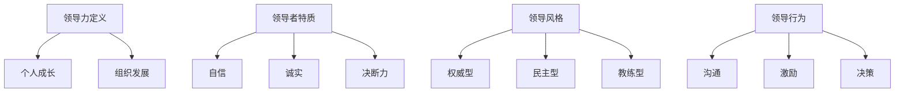

                 

# 领导力与压力管理：保持冷静的艺术

## 关键词
领导力、压力管理、冷静、团队管理、领导技巧

## 摘要
本文旨在探讨领导力与压力管理之间的关系，以及如何通过保持冷静来实现有效的领导。文章首先介绍了领导力的核心概念和压力管理的必要性，接着通过具体案例和策略，探讨了领导者在面对压力时如何保持冷静，以及如何帮助团队成员应对压力。文章末尾，总结了保持冷静的艺术，并给出了相关的实践建议和拓展阅读。

## 引言
在当今快节奏的工作环境中，领导者不仅要承担着繁重的工作任务，还要应对来自各个方面的压力。这种压力可能会对他们的决策能力、团队管理和个人健康产生负面影响。因此，如何保持冷静成为了领导者成功的关键因素。本文将从领导力的定义、压力管理的必要性、保持冷静的策略和实际案例分析等方面，深入探讨领导力与压力管理的关系，并探讨如何通过保持冷静来实现有效的领导。

## 第1章 领导力的基础

### 1.1 领导力的定义与重要性

领导力是指一个人或组织通过影响、激励和引导他人来实现共同目标的能力。它不仅仅是一种职位或角色的象征，更是一种综合的能力，包括领导者的个人品质、领导风格和领导行为。

- **领导力的定义**：
  - 领导力是一种影响力，它使领导者能够引导和激励他人，达成共同的目标。
  - 领导力是一种能力，它使领导者能够在不同的环境和情境下，做出明智的决策。

- **领导力的重要性**：
  - 对个人成长：领导力能够帮助个人提升自我认知、沟通能力和决策能力，从而实现个人职业发展和成长。
  - 对组织发展：领导力能够帮助组织实现目标、提高团队效率和优化组织结构，从而实现组织的发展。

### 1.2 领导力的核心要素

领导力的核心要素包括领导者的特质、领导风格和领导行为。

- **领导者的特质**：
  - **自信**：领导者需要对自己和团队有信心，能够在压力和困难面前保持冷静。
  - **诚实**：领导者需要诚实守信，以赢得团队的信任和支持。
  - **决断力**：领导者需要能够快速做出决策，并承担相应的责任。

- **领导风格**：
  - **权威型**：领导者通过权力和地位来指导和影响团队。
  - **民主型**：领导者鼓励团队成员参与决策，并重视团队的意见和建议。
  - **教练型**：领导者通过指导和培训，帮助团队成员提升能力和素质。

- **领导行为**：
  - **沟通**：领导者需要有效沟通，确保信息的传递和理解。
  - **激励**：领导者需要激励团队成员，提升团队的士气和动力。
  - **决策**：领导者需要做出明智的决策，并确保决策的执行。

### Mermaid 流程图



## 第2章 压力管理的必要性

### 2.1 压力的定义与来源

压力是一种身体、心理和情绪上的紧张状态，通常由外部环境或内部需求引起。它可能来源于工作、家庭、社交、健康等方面。

- **压力的定义**：
  - 压力是一种身体、心理和情绪上的紧张状态。
  - 压力是一种对个体或组织产生影响的负面因素。

- **压力的来源**：
  - **工作压力**：工作负担、工作环境、工作压力等。
  - **家庭压力**：家庭关系、家庭责任等。
  - **社交压力**：社交关系、社交环境等。
  - **健康压力**：身体健康、心理压力等。

### 2.2 压力的类型与影响

压力可以分为临时压力、慢性压力和突发压力。每种类型的压力都有其特定的表现和影响。

- **临时压力**：
  - 表现：焦虑、紧张、头痛等。
  - 影响：影响工作效率、决策能力和情绪状态。

- **慢性压力**：
  - 表现：疲劳、抑郁、免疫力下降等。
  - 影响：影响身体健康、心理健康和工作表现。

- **突发压力**：
  - 表现：恐慌、焦虑、失眠等。
  - 影响：对个人生活和工作产生重大影响。

### 2.3 压力管理的重要性

压力管理是领导者保持冷静和有效领导的关键。以下是压力管理的重要性和好处：

- **提高工作效率**：
  - 减少因压力导致的疲劳和焦虑，提高工作效率和生产力。

- **改善心理健康**：
  - 帮助领导者应对心理健康问题，如抑郁、焦虑等。

- **增强决策能力**：
  - 减少因压力导致的决策失误，提高决策质量和效率。

- **提升团队士气**：
  - 帮助团队成员应对压力，提高团队凝聚力和工作效率。

### 伪代码

```python
def manage_pressure():
    # 定义压力管理方法
    reduce_workload()
    practice_time_management()
    improve_communication()
    provide_support()

def reduce_workload():
    # 减少工作负担
    prioritize_tasks()
    delegate Responsibilities()

def practice_time_management():
    # 时间管理技巧
    plan_daily_tasks()
    set_realistic_goals()

def improve_communication():
    # 提高沟通能力
    active Listening()
    express_ideas Clearly()

def provide_support():
    # 提供支持
    offer_resources()
    provide_training()
```

### 数学模型和公式

$$
压力 = 工作负担 \times 时间压力 \times 个人素质
$$

- 工作负担：工作量和任务难度。
- 时间压力：工作完成时间紧迫程度。
- 个人素质：个人的抗压能力。

### 举例说明

假设一个领导者在短时间内需要完成一个重要的项目，工作负担很高，时间压力很大，而他的个人素质较低。根据上述公式，他的压力值会很高，容易导致决策失误和情绪波动。

### 第3章 领导者如何保持冷静

### 3.1 领导者的压力应对策略

领导者需要具备有效的压力应对策略，以保持冷静和有效领导。

- **时间管理**：
  - 计划每日任务，合理安排工作。
  - 设定可实现的目标，避免过度压力。

- **情绪管理**：
  - 学会放松，进行冥想、呼吸练习等。
  - 保持积极心态，学会从困境中寻找机会。

- **沟通能力**：
  - 倾听他人意见，避免误解和冲突。
  - 表达自己的想法和感受，建立有效的沟通。

### 3.2 如何在团队中传递积极的情绪

领导者需要通过以下方法，在团队中传递积极的情绪：

- **激励**：
  - 表扬团队成员的成就，提升团队士气。
  - 鼓励团队成员，增强自信心。

- **支持**：
  - 提供必要的资源和支持，帮助团队成员解决问题。
  - 关注团队成员的需求，提供心理支持。

- **信任**：
  - 建立信任，让团队成员感受到领导者的关心和支持。
  - 鼓励团队成员之间的合作和沟通。

### 3.3 领导者如何帮助员工应对压力

领导者需要关注员工的心理健康，提供以下帮助：

- **培训**：
  - 开展压力管理培训，提高员工的抗压能力。
  - 提供心理咨询服务，帮助员工解决心理问题。

- **反馈**：
  - 及时给予员工反馈，肯定他们的努力和成果。
  - 鼓励员工寻求帮助，关注他们的心理健康。

- **沟通**：
  - 建立有效的沟通渠道，让员工感受到领导者的关心和支持。
  - 定期组织团队活动，增强团队凝聚力。

### 案例分析

**案例一**：某公司CEO在面临市场竞争加剧的情况下，通过以下方法保持冷静并帮助团队应对压力：

- **时间管理**：
  - 制定详细的工作计划，合理安排时间。
  - 设定短期和长期目标，确保目标的可实现性。

- **情绪管理**：
  - 学会放松，进行冥想和呼吸练习。
  - 保持积极心态，鼓励团队面对挑战。

- **沟通能力**：
  - 倾听团队成员的意见和建议，尊重他们的想法。
  - 定期组织会议，确保信息的传递和理解。

- **激励和支持**：
  - 表扬团队成员的成就，提升团队士气。
  - 提供必要的资源和支持，帮助团队成员解决问题。

通过以上措施，该公司的CEO成功保持了冷静，并帮助团队应对了市场竞争的压力，实现了公司的持续发展。

### 第4章 压力管理策略

### 4.1 时间管理

时间管理是压力管理的重要部分，通过合理安排时间，可以减少工作压力。

- **计划每日任务**：
  - 制定每日工作计划，明确任务和优先级。
  - 避免在短时间内安排过多的任务，确保工作进度。

- **设定可实现的目标**：
  - 设定短期和长期目标，确保目标的可实现性。
  - 分解目标，将大目标分解为小目标，逐步实现。

### 4.2 情绪管理

情绪管理是压力管理的关键，通过以下方法可以保持情绪稳定：

- **学会放松**：
  - 进行冥想、呼吸练习等放松技巧。
  - 在工作间隙进行短暂的休息，避免疲劳和焦虑。

- **保持积极心态**：
  - 学会从困境中寻找机会，保持乐观的态度。
  - 避免过度自我批评，建立自信。

### 4.3 健康管理

健康管理是压力管理的基石，通过以下方法可以保持身体健康：

- **身体健康**：
  - 保持适当的运动，提高身体素质。
  - 保持良好的作息时间，确保充足的睡眠。

- **心理健康**：
  - 进行心理调适，减少心理压力。
  - 寻求心理咨询，解决心理问题。

### 最佳实践 tips

- **合理安排时间**：
  - 避免在短时间内安排过多的任务，确保工作进度。
  - 设定短期和长期目标，确保目标的可实现性。

- **学会放松**：
  - 定期进行冥想、呼吸练习等放松技巧。
  - 在工作间隙进行短暂的休息，避免疲劳和焦虑。

- **保持积极心态**：
  - 学会从困境中寻找机会，保持乐观的态度。
  - 避免过度自我批评，建立自信。

### 小结

本文探讨了领导力与压力管理的关系，以及如何通过保持冷静来实现有效的领导。通过介绍领导力的核心概念、压力管理的必要性、保持冷静的策略和实际案例分析，本文为领导者提供了一系列实用的方法和技巧。希望本文能够帮助领导者更好地应对压力，保持冷静，实现个人和团队的成长和发展。

### 注意事项

- 领导者在面对压力时，应保持冷静，避免情绪波动。
- 定期进行身体和心理检查，确保身体健康。
- 学会从困境中寻找机会，保持积极心态。

### 拓展阅读

- 《如何管理压力》（作者：詹姆斯·马奇）
- 《积极心理学：如何在逆境中保持乐观》（作者：马丁·塞利格曼）
- 《领导力：如何影响和激励他人》（作者：约翰·麦克斯韦尔）

## 附录

### 附录 A：压力管理工具与方法

- **冥想应用**：如“冥想星球”（Mandala）
- **压力测试**：如“压力测试器”（Stress Test）

### 附录 B：参考资料与拓展阅读

- **书籍**：
  - 《领导力与心理学》（作者：詹姆斯·马奇）
  - 《时间管理：如何高效利用时间》（作者：艾伦·拉金）
- **在线资源**：
  - TED演讲：《如何面对生活中的压力》（作者：谢丽尔·桑德伯格）
  - 心理健康网：https://www.mind.org/

## 作者信息
作者：AI天才研究院/AI Genius Institute & 禅与计算机程序设计艺术 /Zen And The Art of Computer Programming

## 文章标题
领导力与压力管理：保持冷静的艺术

## 关键词
领导力、压力管理、冷静、团队管理、领导技巧

## 摘要
本文旨在探讨领导力与压力管理之间的关系，以及如何通过保持冷静来实现有效的领导。文章首先介绍了领导力的核心概念和压力管理的必要性，接着通过具体案例和策略，探讨了领导者在面对压力时如何保持冷静，以及如何帮助团队成员应对压力。文章末尾，总结了保持冷静的艺术，并给出了相关的实践建议和拓展阅读。

