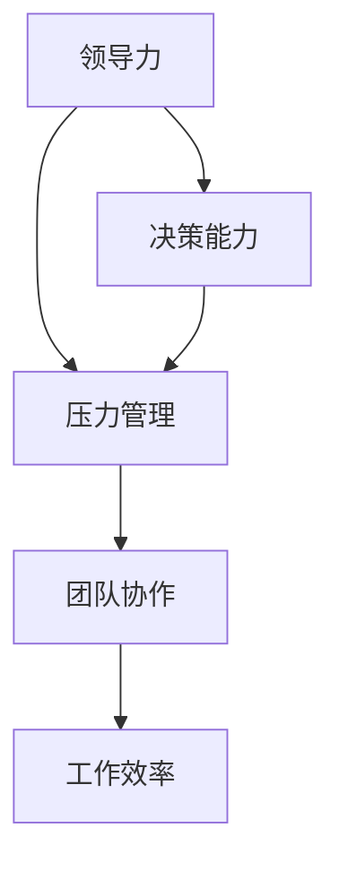

                 

### 概念与架构

在探讨领导力与压力管理的复杂关系时，首先需要对这两个核心概念进行明确的定义，并理解它们在组织架构中的作用与联系。

#### 核心概念

**领导力**：领导力是一种通过影响力、沟通和激励来引导和激励团队实现组织目标的能力。它不仅涉及领导者个人素质和技能的提升，还包括对团队成员的引导和激励，以确保团队目标的实现。领导力包括多个维度，如战略思维、决策能力、沟通技巧、团队合作以及情感智慧等。

**压力管理**：压力管理是指应对和处理工作压力、心理压力的方法和策略，以保持身心健康和工作效率。在现代工作环境中，压力是不可避免的，但有效的压力管理可以帮助员工保持良好的心理状态，提高工作效率，减少疾病风险，从而对组织和个人都有益。

#### 架构联系

领导力与压力管理之间存在着紧密的联系。有效的领导力可以帮助团队更好地应对压力，提高团队的整体绩效。以下是它们之间的一些关键联系：

1. **领导风格的适应**：不同的领导风格会对团队的压力感知和应对产生不同的影响。一些领导风格，如民主式领导和参与式领导，可以增加团队成员的参与感和自主性，从而减少压力感。

2. **沟通与支持**：有效的领导力包含良好的沟通和支持，这可以帮助员工更好地理解工作目标和期望，减少因不确定性而产生的压力。

3. **团队建设**：领导力在团队建设过程中发挥着关键作用。一个强大的团队可以在面对压力时提供相互支持和协作，从而减轻个人压力。

4. **决策能力**：领导力中的决策能力有助于在压力情境中做出合理和有效的决策，避免因决策失误而增加压力。

5. **情感智慧**：情感智慧是领导力的一个重要组成部分，它帮助领导者识别和理解员工的情感状态，从而更好地管理团队情绪，减轻压力。

通过这些联系，我们可以看到，领导力不仅仅是实现组织目标的工具，也是管理团队压力的重要手段。领导者的角色不仅仅是战略决策者，更是团队情感和心理健康的守护者。

### Mermaid 流程图

下面是一个用 Mermaid 语言编写的流程图，用于展示领导力与压力管理之间的架构联系：

在这个流程图中，领导力通过团队协作、工作效率和决策能力影响压力管理，而压力管理又通过这些途径反作用于领导力，形成了一个相互影响的动态系统。

通过这种架构的联系，我们可以更加深入地理解领导力和压力管理的内在机制，为实际应用提供理论支持和实践指导。

---

**本文的下一节将深入探讨领导力的本质及其在组织中的作用，并进一步分析领导力与压力管理之间的互动关系。**

---

# 第一部分：领导力基础

## 第1章 领导力的本质与重要性

### 1.1 领导力的定义与核心要素

领导力是一种通过影响力、沟通和激励来引导和激励团队实现组织目标的能力。它不仅仅是管理职位所必需的技能，更是一种个人素质和能力的综合体现。在技术飞速发展的今天，领导力的定义和内涵也在不断演变，但其核心要素始终如一。

**定义**：
领导力是一种复杂的现象，可以理解为在特定的社会和文化背景下，通过个体或群体的行为和决策，影响、激励和引导他人共同实现目标的能力。这种能力不仅体现在管理岗位上，也存在于各个层级和领域。

**核心要素**：

1. **影响力**：影响力是领导力的核心要素之一。领导者通过自身的行为、价值观和决策来影响他人。这种影响力不仅体现在正式权力上，还包括非正式的影响力和个人魅力。

2. **沟通**：良好的沟通能力是领导力的重要组成部分。领导者需要能够清晰、准确地表达自己的想法和目标，同时也要善于倾听和理解团队成员的需求和意见。

3. **激励**：激励能力是领导者激励团队成员、提高团队绩效的关键。领导者通过设置目标、奖励机制和认可等方式，激发团队成员的内在动机和外在动力。

4. **决策能力**：决策能力是领导力的重要表现。领导者需要在压力和不确定性下做出合理、有效的决策，以应对复杂的问题和挑战。

5. **情感智慧**：情感智慧是领导者理解和管理自身及他人情感的能力。它帮助领导者建立信任关系，增强团队凝聚力，提高工作效率。

6. **变革管理**：随着外部环境和内部需求的不断变化，领导者需要具备变革管理能力，推动组织适应和变革，实现长期发展。

### 1.2 领导力在组织中的作用

领导力在组织中扮演着至关重要的角色，它不仅影响团队绩效，还对组织的长远发展具有深远的影响。

**团队建设**：领导力是团队建设的基础。通过明确团队目标、建立团队文化、促进团队协作和沟通，领导者可以增强团队的凝聚力和战斗力。

**战略决策**：领导力在组织战略决策中起到关键作用。领导者需要具备敏锐的洞察力和战略思维，能够在复杂的市场环境中制定正确的战略方向，引领组织前进。

**创新推动**：在技术创新飞速发展的时代，领导力是推动组织创新的重要动力。领导者需要鼓励创新思维，激发团队成员的创新潜力，推动组织持续创新。

**文化塑造**：领导力在塑造组织文化中起到关键作用。领导者通过自身的价值观和行为，影响和塑造组织文化，形成积极向上的工作氛围。

**员工激励**：领导力是激励员工的重要手段。通过有效的激励机制和认可，领导者可以激发员工的积极性和创造力，提高员工的工作满意度和忠诚度。

**危机管理**：在面临危机和挑战时，领导力是组织应对危机、保持稳定的重要保障。领导者需要具备冷静的头脑和果断的行动力，带领团队克服困难，转危为安。

### 1.3 领导力与个人发展

领导力不仅对组织至关重要，也对个人发展产生深远影响。一个具备强大领导力的人，不仅能够在职场中取得成功，还能在个人生活中获得更多的成就和满足感。

**职业成长**：领导力是职业成长的重要推动力。通过提升领导力，个人可以更有效地管理项目和团队，提升职业地位和薪资水平。

**人际交往**：领导力是人际交往的重要工具。良好的沟通和影响力能力可以帮助个人在职场和社会中获得更多机会，建立更广泛的人际关系网络。

**自信心提升**：领导力可以增强个人的自信心。通过克服困难和挑战，领导者可以积累经验，提升自我认知和自我效能感。

**心理健康**：领导力对心理健康也有积极影响。通过有效管理和应对压力，领导者可以保持良好的心理状态，减少焦虑和抑郁。

**社会责任**：领导力可以激发个人的社会责任感。通过影响和激励他人，领导者可以积极参与社会事务，为社会做出贡献。

综上所述，领导力是一种多维度、多层次的能力，它不仅对组织发展具有重要意义，也对个人成长和幸福感产生深远影响。在接下来的章节中，我们将进一步探讨领导风格、沟通技巧以及团队建设等方面的内容，帮助读者深入了解领导力的本质和应用。

---

**在下一章中，我们将详细探讨不同的领导风格，分析它们的特点和应用，以及如何选择最适合的领导风格来提高团队绩效和员工满意度。**

---

## 第2章 领导风格与团队建设

### 2.1 不同领导风格的特点与应用

领导风格是领导者通过行为和决策方式影响团队成员的方式，不同风格的领导会对团队产生不同的影响。了解并选择合适的领导风格，对于提高团队绩效和员工满意度至关重要。以下是几种常见的领导风格及其特点和应用：

#### 1. 授权型领导（Delegative Leadership）

**特点**：
- 授权型领导将决策权下放给团队成员，鼓励成员参与决策过程。
- 领导者通过提供支持和资源，帮助团队成员做出更好的决策。

**应用**：
- 适用于需要创新和团队合作的项目。
- 增强团队成员的责任感和参与感，提高决策的质量和执行力。

#### 2. 参与型领导（Participative Leadership）

**特点**：
- 参与型领导注重团队成员的参与和意见，通过集体讨论和协商来做出决策。
- 领导者鼓励团队成员提出建议和解决问题。

**应用**：
- 适用于需要高度团队协作和民主决策的环境。
- 提高团队成员的满意度和忠诚度，增强团队的凝聚力。

#### 3. 指导型领导（Directive Leadership）

**特点**：
- 指导型领导通过明确的指示和指导来指导团队成员，确保任务按计划进行。
- 领导者通常会设定具体的目标和期望，并对团队成员的行为进行监督。

**应用**：
- 适用于需要快速执行和严格控制的任务。
- 在紧急情况下，指导型领导可以迅速确定行动方向，减少不确定性。

#### 4. 情境型领导（Situational Leadership）

**特点**：
- 情境型领导根据不同的情境和团队成员的特点，采取不同的领导风格。
- 领导者会根据团队的任务和成员的能力，灵活调整领导方式。

**应用**：
- 适用于多变和复杂的工作环境。
- 可以提高领导者在不同情境下的应变能力和适应性。

#### 5. 超越型领导（Transformational Leadership）

**特点**：
- 超越型领导通过激励和引导团队成员，实现个人和团队的目标。
- 领导者通过愿景和价值观激励团队成员，推动变革和创新。

**应用**：
- 适用于需要创新和变革的组织。
- 可以提高团队的士气和创新能力，推动组织的持续发展。

### 2.2 团队建设的策略与实践

团队建设是领导力的重要组成部分，一个高效的团队可以在面对挑战时展现出强大的凝聚力。以下是几种有效的团队建设策略和实践：

#### 1. 明确团队目标

- 团队目标应具体、明确，并与组织目标保持一致。
- 领导者需要与团队成员共同制定目标，确保每个人对目标有清晰的认识。

#### 2. 建立团队文化

- 团队文化是团队内部共同价值观和行为准则的体现。
- 领导者可以通过活动和仪式来强化团队文化，如团队建设活动、庆祝成功等。

#### 3. 提高团队沟通

- 沟通是团队协作的基础，领导者需要确保团队成员之间的沟通畅通无阻。
- 可以通过定期的团队会议、信息共享平台等方式来提高团队沟通效率。

#### 4. 激励和认可

- 领导者需要通过激励和认可来增强团队成员的积极性和满意度。
- 可以设立奖励机制，对表现突出的成员给予表彰和奖励。

#### 5. 解决团队冲突

- 团队冲突是不可避免的，领导者需要及时解决冲突，避免影响团队绩效。
- 可以通过调解、对话等方式，帮助团队成员找到共同点，化解分歧。

#### 6. 培养团队成员

- 领导者需要关注团队成员的成长和发展，提供培训和指导。
- 可以通过职业规划、技能提升等方式，帮助团队成员实现个人和职业发展。

### 2.3 领导者在团队冲突解决中的作用

团队冲突是团队建设过程中不可避免的一部分，有效的冲突解决能力对于维护团队稳定和提升团队绩效至关重要。以下是领导者在解决团队冲突中的作用：

#### 1. 中立调解

- 领导者应以中立者的身份介入冲突，避免偏袒任何一方。
- 通过倾听双方意见，帮助双方找到共同点和解决方案。

#### 2. 事实分析

- 领导者需要以客观、理性的态度分析冲突的原因和事实。
- 通过事实和数据，帮助团队成员认清问题，找到解决冲突的路径。

#### 3. 沟通促进

- 领导者应促进双方的沟通，确保双方都有机会表达自己的观点。
- 通过有效的沟通，帮助团队成员理解对方的立场和需求。

#### 4. 制定解决方案

- 领导者需要与团队成员共同制定解决方案，确保解决方案可行且有效。
- 通过引导团队成员参与解决方案的制定，增强他们对解决方案的认同感。

#### 5. 持续关注

- 冲突解决后，领导者需要持续关注团队氛围，确保冲突没有留下负面影响。
- 可以通过定期的团队会议和反馈机制，了解团队成员的满意度和建议。

总之，领导风格和团队建设是领导力的重要组成部分，它们直接影响团队的绩效和员工满意度。领导者应根据不同情境和团队成员的特点，选择合适的领导风格，并采取有效的团队建设策略，以建立高效、和谐的团队。

---

**在下一章中，我们将探讨沟通技巧的重要性，以及如何通过有效的沟通来提升领导力。**

---

## 第3章 沟通技巧与影响力

### 3.1 高效沟通的基本原则

沟通是领导力的核心要素之一，高效的沟通技巧不仅能够提升领导者的影响力，还能增强团队凝聚力和工作效果。以下是高效沟通的几个基本原则：

#### 1. 明确沟通目标

在每次沟通之前，领导者需要明确沟通的目标，确保信息传达的准确性和针对性。明确的目标有助于双方集中注意力，提高沟通效率。

#### 2. 倾听和理解

倾听是有效沟通的关键，领导者需要给予团队成员充分的发言机会，并努力理解他们的观点和需求。通过倾听，领导者可以建立信任，提高沟通的质量。

#### 3. 信息清晰

信息传达应简洁明了，避免使用过于复杂或模糊的语言。领导者需要确保信息被正确理解和接收，避免产生误解或歧义。

#### 4. 主动沟通

领导者应主动发起沟通，及时反馈团队成员的意见和建议。主动沟通可以减少信息滞后，提高决策效率。

#### 5. 适时的反馈

及时给予团队成员反馈，可以帮助他们了解自己的工作表现，并促使他们持续改进。反馈应具体、客观，避免负面情绪的影响。

#### 6. 文化敏感性

领导者需要考虑到团队成员的文化背景和沟通习惯，尊重差异，避免文化冲突。在跨文化团队中，文化敏感性尤为重要。

### 3.2 提升领导影响力的策略

领导影响力是领导者通过沟通和行动影响他人，达成共同目标的能力。提升领导影响力，不仅能够增强领导者的个人魅力，还能提高团队绩效和执行力。以下是几种提升领导影响力的策略：

#### 1. 建立信任

信任是领导影响力的基础。领导者需要通过诚信和透明度，建立与团队成员之间的信任关系。信任的建立需要时间和耐心，领导者应始终保持一致的行为和承诺。

#### 2. 设定清晰愿景

领导者应具备远见卓识，设定清晰、有吸引力的愿景，激励团队成员为之努力。一个明确的愿景可以帮助团队明确方向，凝聚力量。

#### 3. 激励和认可

领导者应通过激励和认可来提升团队成员的积极性和工作热情。适时的奖励和表彰可以增强团队成员的归属感和成就感。

#### 4. 倡导变革

领导者应敢于挑战现状，推动变革和创新。通过倡导变革，领导者可以激发团队的潜力和创造力，推动组织的发展。

#### 5. 倾听和反馈

领导者应保持开放心态，倾听团队成员的意见和建议，并给予及时的反馈。通过倾听和反馈，领导者可以更好地理解团队需求，提升领导力。

#### 6. 培养团队成员

领导者应关注团队成员的成长和发展，提供培训和指导。通过培养团队成员，领导者可以提升团队的整体能力和竞争力。

### 3.3 情境沟通技巧

不同的沟通情境需要采用不同的沟通策略。以下是一些情境沟通技巧：

#### 1. 紧急情况

在紧急情况下，沟通应简洁、直接，确保信息快速传达。领导者需要保持冷静，确保团队成员了解紧急情况的严重性和应对措施。

#### 2. 冲突解决

在解决冲突时，领导者应采取中立的态度，倾听双方意见，寻找共同点。通过有效的沟通技巧，领导者可以化解冲突，维护团队和谐。

#### 3. 演讲和报告

在演讲和报告场合，领导者需要结构清晰、表达生动，确保信息传达的准确性和感染力。领导者可以通过故事、案例和数据来增强报告的说服力。

#### 4. 跨文化沟通

在跨文化沟通中，领导者需要了解不同文化的沟通习惯和价值观，尊重差异，避免误解。通过文化敏感性的提升，领导者可以促进跨文化团队的合作。

通过掌握高效沟通技巧和提升领导影响力，领导者可以更好地应对各种挑战，推动团队和组织的持续发展。在下一章中，我们将进一步探讨领导力与压力管理之间的关系，以及如何通过有效的压力管理来提升领导力。

---

**在下一章中，我们将深入探讨领导力与压力管理之间的关系，并分析如何通过有效的压力管理来提升领导力。**

---

## 第4章 领导力与压力管理

### 4.1 领导力与压力管理的关系

领导力与压力管理之间存在着密切的联系。有效的领导力可以减少员工的工作压力，提高心理健康和工作效率，从而提升领导力本身。以下是领导力与压力管理之间的几个关键关系：

#### 1. 领导力对压力感知的影响

领导力对员工的压力感知有着重要的影响。一个具备高效沟通能力和同理心的领导者可以帮助员工更好地理解工作目标和期望，减少因不确定性而产生的压力。此外，领导者通过积极的支持和鼓励，可以提升员工的心理弹性，使他们更好地应对压力。

#### 2. 压力管理对领导力表现的影响

良好的压力管理能力是领导者有效行使职责的保障。当领导者能够有效地管理自己的压力时，他们能够更清晰地思考，做出更合理的决策，并且能够更好地应对突发事件。相反，如果领导者无法有效管理压力，可能会导致情绪失控、决策失误，甚至影响团队的整体绩效。

#### 3. 团队压力与领导力

领导力在团队压力管理中起着关键作用。一个有效的领导者可以建立支持性的团队文化，鼓励团队成员分享感受和困难，从而减轻个体压力。此外，领导者可以通过制定合理的任务分配和时间管理策略，减少团队整体的工作压力，提高工作效率。

### 4.2 压力管理对领导力的提升

通过有效的压力管理，领导者可以提升自身的领导力，以下是一些具体的提升方法：

#### 1. 时间管理

时间管理是压力管理的重要方面。领导者可以通过优先级排序、设定明确的目标和截止日期，合理安排时间，减少不必要的压力。例如，使用时间管理工具如日历、待办事项列表和项目管理软件，可以帮助领导者更好地规划工作和休息时间。

#### 2. 自我反思

自我反思是领导者提升压力管理能力的重要途径。通过定期反思自己的行为和决策，领导者可以识别出可能导致压力的潜在问题，并采取相应的措施进行改进。自我反思还可以帮助领导者更好地理解自己的情绪和行为，提高自我调节能力。

#### 3. 睡眠和锻炼

充足的睡眠和定期的锻炼对压力管理至关重要。睡眠不足会导致情绪波动和认知能力下降，而定期锻炼可以提高身体素质和情绪稳定性。领导者应确保每天有足够的睡眠，并定期进行体育锻炼，如散步、跑步或瑜伽等。

#### 4. 寻求支持

领导者不应独自承担所有压力，而应寻求支持和帮助。这可以包括与团队成员、同事或专业顾问的沟通，以及参加压力管理培训和工作坊。通过寻求外部支持，领导者可以学习新的压力管理技巧，并获得情感上的支持。

### 4.3 实际案例分析

以下是一个实际案例，展示了领导力与压力管理之间的互动关系，以及如何通过有效的压力管理提升领导力：

**案例背景**：
一家大型科技公司的高管团队面临着巨大的市场压力和内部管理挑战。由于市场竞争激烈，公司需要快速响应市场变化，同时还要保持内部运营的高效和稳定。这种高强度的压力导致团队成员感到疲惫和焦虑，影响了工作效率和团队凝聚力。

**解决方案**：

1. **领导力提升**：公司聘请了一位具有丰富经验和良好沟通技巧的CEO，他通过定期的团队会议和一对一沟通，与团队成员建立信任关系，并明确工作目标和期望。他鼓励团队成员提出建议和意见，积极参与决策过程。

2. **压力管理培训**：公司为全体员工提供了压力管理培训，包括时间管理技巧、情绪调节方法和健康生活方式的培养。培训帮助员工更好地应对工作压力，提高心理弹性。

3. **健康福利政策**：公司推出了健康福利政策，包括提供健身设施、员工心理咨询和健康体检等，以支持员工的身心健康。

4. **灵活工作时间**：为了减少工作压力，公司实施了灵活工作时间政策，允许员工根据个人情况安排工作时间，平衡工作和生活。

**结果**：
通过上述措施，公司的团队凝聚力得到了显著提升，员工的工作满意度增加，工作效率也得到了提高。同时，领导者的领导力得到了显著提升，他们在面对压力和挑战时能够保持冷静和清晰的思考，做出更合理的决策。

**案例分析小结**：
这个案例展示了领导力与压力管理之间的紧密联系，以及如何通过有效的压力管理来提升领导力。有效的领导力不仅可以帮助员工更好地应对压力，提高工作效率，还能提升领导者的决策能力和整体管理效能。

---

**在下一章中，我们将探讨如何通过培养情感智慧来提升领导力，并分析情感智慧在领导力发展中的关键作用。**

---

## 第5章 情感智慧与领导力

### 5.1 情感智慧的定义与作用

情感智慧，也被称作情商（Emotional Intelligence，简称EQ），是指个体识别、理解、管理自己和他人情感的能力。情感智慧在领导力发展中起着关键作用，它不仅影响领导者的人际关系，还直接影响领导效果和团队绩效。以下是情感智慧的核心要素和其在领导力中的作用：

#### 1. 自我意识

自我意识是指领导者对自己情感状态的认识和理解。具备自我意识的领导者能够清晰地认识到自己的情绪反应，并能够有效地管理这些情绪。这种能力帮助领导者在压力情境中保持冷静和客观，避免情绪化决策。

#### 2. 自我调节

自我调节是指领导者管理自己情绪和行为的能力。一个能够自我调节的领导者能够在遇到挑战和挫折时保持积极的态度，并通过自我反思和调整来提升自己的情绪状态。这种能力有助于提升领导者的决策质量和整体领导效能。

#### 3. 社会意识

社会意识是指领导者识别和理解他人情感状态的能力。具备社会意识的领导者能够站在他人的角度思考问题，理解他人的需求和感受。这种能力有助于建立和维护良好的人际关系，增强团队的凝聚力和协作效率。

#### 4. 建立人际关系

建立人际关系是指领导者与他人建立和维持积极关系的能力。一个善于建立人际关系的领导者能够有效地沟通和协调，促进团队合作，提高团队的整体绩效。

#### 5. 情绪管理

情绪管理是指领导者控制和调节自己和他人的情绪，以实现共同目标的能力。领导者通过情绪管理，能够激励团队成员，缓解冲突，增强团队的动力和创造力。

### 5.2 情感智慧在领导力发展中的关键作用

情感智慧是领导力的核心组成部分，它在领导力发展中的关键作用体现在以下几个方面：

#### 1. 增强人际关系

情感智慧有助于领导者建立和维护良好的人际关系。通过理解他人的情感状态和需求，领导者可以更好地激励和支持团队成员，增强团队的凝聚力和合作效率。

#### 2. 提高团队绩效

具备情感智慧的领导者能够识别团队成员的情绪状态，并采取适当的措施来调节和激励他们。这种能力有助于提升团队的整体绩效，实现组织目标。

#### 3. 应对压力和挑战

情感智慧帮助领导者更好地应对工作压力和挑战。通过自我调节和情绪管理，领导者能够在压力情境中保持冷静和理性，做出更合理的决策。

#### 4. 促进个人成长

情感智慧不仅有助于提升领导力，还能促进个人成长和发展。领导者通过自我反思和不断学习，提升自己的情感智慧和领导能力，实现个人和职业的双重提升。

### 5.3 培养情感智慧的方法

为了提升领导力，领导者需要积极培养自己的情感智慧。以下是一些培养情感智慧的方法：

#### 1. 自我反思

定期进行自我反思，了解自己的情绪状态和行为模式。通过自我反思，领导者可以识别出情感智慧提升的切入点，并采取相应的措施进行改进。

#### 2. 倾听和理解他人

领导者应积极倾听他人的意见和感受，并努力理解他们的需求。通过有效的倾听和理解，领导者可以建立更深层次的人际关系，提高团队的协作效率。

#### 3. 情绪调节训练

领导者可以通过阅读相关书籍、参加培训课程或咨询专业顾问，学习情绪调节的方法和技巧。通过训练，领导者可以提高自我调节和情绪管理的能力。

#### 4. 建立支持网络

领导者可以建立和维护一个支持网络，包括同事、朋友和家庭成员。这个网络可以在领导者面临压力和挑战时提供情感支持和建议。

#### 5. 培养同理心

同理心是情感智慧的重要组成部分。领导者可以通过阅读、观察和体验来培养同理心，更好地理解他人的情感状态和需求。

通过培养情感智慧，领导者可以提升自己的领导力，建立更和谐的人际关系，提高团队绩效，实现个人和组织的共同成长。

---

**在下一章中，我们将探讨如何通过有效的变革管理来提升领导力，并分析变革管理在领导力发展中的关键作用。**

---

## 第6章 变革管理

### 6.1 变革管理的定义与重要性

变革管理是指在组织内部引入新政策、新流程、新技术或新战略时，确保这些变革能够被有效执行和管理的过程。在当今快速变化的市场环境中，变革管理成为领导力的重要组成部分。有效的变革管理可以帮助组织适应外部环境的变化，保持竞争力和创新能力。

#### 1. 变革管理的定义

变革管理是指通过系统化、结构化的方法，引导和推动组织从当前状态向预期状态转变的过程。它包括识别变革需求、规划变革策略、沟通变革信息、管理变革过程和评估变革效果等环节。

#### 2. 变革管理的重要性

变革管理对领导力的重要性体现在以下几个方面：

- **提升组织适应性**：通过有效的变革管理，组织能够更好地应对外部环境的变化，保持灵活性和适应性。
- **增强创新能力**：变革管理鼓励组织内部尝试新的想法和方法，推动创新，提升组织的竞争力和市场地位。
- **促进员工参与**：有效的变革管理可以让员工更好地理解变革的目的和意义，提高他们的参与感和认同感，从而减少变革的阻力和冲突。
- **提升领导力**：通过变革管理，领导者可以展示其战略思维、决策能力和沟通技巧，提升个人的领导力和影响力。

### 6.2 变革管理的步骤

有效的变革管理需要遵循一系列步骤，以下是一个典型的变革管理过程：

#### 1. 识别变革需求

- **评估外部环境**：领导者需要评估市场趋势、竞争对手、技术变革等因素，确定组织是否需要变革。
- **内部审计**：通过对组织内部流程、资源、文化等方面进行审计，识别变革的潜在需求和优先级。

#### 2. 制定变革策略

- **明确变革目标**：确定变革的最终目标，包括改进流程、提升绩效、增强竞争力等。
- **制定变革计划**：制定详细的变革计划，包括时间表、责任分配、预算和资源需求等。

#### 3. 沟通变革信息

- **制定沟通策略**：确保沟通策略能够覆盖所有相关利益相关者，包括员工、管理层、客户和供应商等。
- **传递正面信息**：通过积极的沟通，传递变革的正面信息和预期效果，减少误解和恐惧。

#### 4. 管理变革过程

- **建立变革团队**：组建专门的变革管理团队，负责监督和推动变革过程的实施。
- **管理变革阻力**：通过识别和解决变革过程中出现的阻力和问题，确保变革的顺利进行。

#### 5. 评估变革效果

- **设定评估标准**：根据变革目标和预期效果，设定评估标准和指标。
- **收集反馈**：通过员工调查、绩效评估等方式，收集变革效果的反馈，不断优化变革过程。

### 6.3 变革管理的挑战与对策

在变革管理过程中，领导者可能会面临一系列挑战，以下是一些常见的挑战及其对策：

#### 1. 挑战：员工抵触

**对策**：通过积极的沟通和参与机制，让员工了解变革的必要性和预期效果，增强他们的参与感和认同感。

#### 2. 挑战：资源不足

**对策**：合理分配资源，确保变革所需的资金、人力和物资等得到充分支持。

#### 3. 挑战：时间紧迫

**对策**：制定详细的时间表和计划，确保变革过程有条不紊地进行，同时保持灵活性，以应对突发情况。

#### 4. 挑战：沟通不畅

**对策**：建立多层次的沟通机制，确保信息传递的准确性和及时性，减少误解和冲突。

### 6.4 变革管理在领导力发展中的关键作用

有效的变革管理对领导力发展具有关键作用：

#### 1. 提升战略思维

通过识别和应对变革需求，领导者可以培养敏锐的战略思维，提升组织的前瞻性和竞争力。

#### 2. 增强决策能力

在变革过程中，领导者需要做出一系列决策，这些决策的成败直接影响变革的效果。有效的决策能力是领导力的核心要素。

#### 3. 提高沟通技巧

变革管理过程中，领导者需要与各种利益相关者进行有效沟通，提升沟通技巧是领导力的重要组成部分。

#### 4. 增强团队协作

通过推动变革，领导者可以增强团队的协作能力和凝聚力，提升团队的整体绩效。

总之，变革管理是领导力的重要组成部分，通过有效的变革管理，领导者可以提升组织竞争力，实现长期发展。在下一章中，我们将探讨领导力与工作满意度的关系，并分析如何通过提升领导力来提高员工满意度。

---

**在下一章中，我们将探讨领导力与工作满意度之间的关系，并分析如何通过提升领导力来提高员工满意度。**

---

## 第7章 领导力与工作满意度

### 7.1 领导力对工作满意度的影响

领导力对员工的工作满意度具有深远的影响。有效的领导力可以创造一个积极的工作环境，提高员工的工作满意度和忠诚度，从而对组织的长期发展产生积极影响。

#### 1. 明确的期望和目标

领导者通过明确传达组织的期望和目标，帮助员工理解自己在工作中的角色和责任。这种清晰的目标设定有助于员工更好地规划自己的工作，提高工作满意度和成就感。

#### 2. 支持和鼓励

有效的领导者会为员工提供必要的支持和鼓励，帮助他们克服工作中的困难和挑战。通过鼓励员工，领导者可以增强他们的自信心和积极性，提高工作满意度。

#### 3. 有效的沟通

领导者通过积极的沟通，确保信息在组织内畅通无阻。有效的沟通可以帮助员工更好地理解组织的战略和目标，提高他们的工作满意度和参与度。

#### 4. 公平对待

领导者通过公平对待每位员工，建立了一个公正的工作环境。公平对待不仅有助于提高员工的工作满意度，还能增强团队的凝聚力和信任感。

#### 5. 职业发展机会

领导者关注员工的职业发展，提供培训和学习机会，帮助员工提升技能和职业素养。这种关注有助于提高员工的工作满意度和忠诚度。

### 7.2 提升领导力以增加工作满意度

为了提升员工的工作满意度，领导者需要不断提升自己的领导力，以下是一些具体的方法：

#### 1. 增强情感智慧

领导者需要具备高水平的情感智慧，能够理解员工的情感状态和需求。通过有效的情感沟通，领导者可以建立更紧密的人际关系，提高员工的工作满意度。

#### 2. 优化领导风格

领导者应根据团队和员工的特点，选择合适的领导风格。灵活运用不同的领导风格，可以更好地满足员工的需求，提高工作满意度。

#### 3. 强化团队合作

领导者需要鼓励团队合作，确保每位员工都有机会参与和贡献。通过团队合作，员工可以感受到自己的价值，提高工作满意度。

#### 4. 关注员工成长

领导者应关注员工的职业发展，提供必要的支持和资源。通过帮助员工实现个人和职业发展，领导者可以提高员工的工作满意度和忠诚度。

#### 5. 建立积极的工作文化

领导者需要通过建立积极的工作文化，营造一个充满活力和正向氛围的工作环境。这种文化可以增强员工的归属感和自豪感，提高工作满意度。

### 7.3 实际案例分析

以下是一个实际案例，展示了如何通过提升领导力来增加员工的工作满意度：

**案例背景**：
一家大型制造业公司在过去几年中，由于领导力不足，员工的工作满意度持续下降。员工感到缺乏动力，工作效率低下，离职率也不断上升。

**解决方案**：

1. **领导力培训**：公司为全体领导者提供了领导力培训，帮助他们提升情感智慧、沟通技巧和团队合作能力。
2. **员工反馈机制**：公司建立了定期的员工反馈机制，领导者通过一对一的沟通和调查问卷，了解员工的需求和建议。
3. **职业发展计划**：公司制定了详细的职业发展计划，为员工提供培训和学习机会，帮助他们提升技能和职业素养。
4. **团队建设活动**：公司定期组织团队建设活动，增强团队凝聚力和合作精神。
5. **绩效管理**：公司引入了基于结果的绩效管理系统，通过明确的绩效目标和激励措施，提高员工的工作积极性和满意度。

**结果**：
通过上述措施，公司员工的工作满意度显著提升，工作效率和团队凝聚力也得到增强。离职率下降，员工流失情况得到明显改善。

**案例分析小结**：
这个案例展示了通过提升领导力来增加员工工作满意度的有效方法。领导者通过增强情感智慧、优化领导风格、关注员工成长和建立积极的工作文化，成功提升了员工的工作满意度和忠诚度。

---

**在下一章中，我们将探讨领导力在团队发展中的作用，分析团队发展的关键因素，并探讨如何通过有效的领导力策略推动团队发展。**

---

## 第8章 领导力在团队发展中的作用

### 8.1 团队发展的关键因素

团队发展是一个复杂而动态的过程，需要领导者扮演关键角色。团队发展的关键因素包括以下几个方面：

#### 1. 明确的目标

明确的目标是团队发展的基石。一个有明确目标的团队可以更好地集中精力，协调行动，提高工作效率。领导者需要确保团队目标与组织目标保持一致，并能够清晰地传达给每个团队成员。

#### 2. 有效的沟通

沟通是团队协作的基础。领导者需要建立开放、透明、及时的沟通渠道，确保团队成员能够充分交流信息、分享观点，并能够及时反馈问题和建议。

#### 3. 团队成员的信任

信任是团队合作的润滑剂。领导者需要通过建立信任机制，如公平对待、公开透明、尊重差异等，增强团队成员之间的信任感，从而提高团队的协作效率和凝聚力。

#### 4. 明确的角色和责任

每个团队成员都应在团队中扮演明确的角色，并承担相应的责任。领导者需要确保每个团队成员都清楚自己的职责和工作范围，以便更好地协作和配合。

#### 5. 持续的学习和成长

团队发展是一个不断学习和成长的过程。领导者需要鼓励团队成员不断提升自己的技能和知识，通过培训、实践和反思等方式，促进团队成员的持续成长。

#### 6. 积极的工作氛围

积极的工作氛围可以激发团队成员的创造力和动力。领导者需要营造一个支持性、鼓励性和合作性的工作环境，减少负面情绪和冲突，提高团队的整体士气。

### 8.2 领导力策略在团队发展中的应用

有效的领导力策略可以推动团队发展，提升团队绩效。以下是几种关键领导力策略在团队发展中的应用：

#### 1. 领导力教练

领导者作为团队教练，可以帮助团队成员明确个人目标，提供指导和支持，帮助他们克服困难和挑战。通过教练式领导，领导者可以激发团队成员的潜力，提升整个团队的绩效。

#### 2. 情感领导

情感领导是指领导者通过情感智慧，理解和管理团队成员的情感状态，建立积极的人际关系。情感领导可以增强团队的凝聚力，提高团队的合作效率和创新能力。

#### 3. 变革领导

在团队发展的过程中，领导者需要具备变革领导的能力，推动团队适应外部环境和内部需求的变化。通过有效的变革领导，领导者可以帮助团队克服变革阻力，实现持续发展。

#### 4. 协作领导

协作领导是指领导者通过建立有效的协作机制，促进团队成员之间的沟通和合作。通过协作领导，领导者可以激发团队的协同效应，提高团队的绩效和创新能力。

#### 5. 资源调配

领导者需要具备资源调配的能力，确保团队在发展过程中能够获得必要的资源和支持。通过合理分配资源，领导者可以确保团队在关键任务和项目上得到充分的支持，提高团队的整体绩效。

### 8.3 团队发展中的挑战与对策

在团队发展的过程中，领导者可能会面临一系列挑战。以下是一些常见的挑战及其对策：

#### 1. 团队成员的不满和抱怨

**对策**：领导者需要通过积极的沟通和反馈机制，了解团队成员的不满和抱怨，并采取相应的措施进行解决。通过建立信任和尊重，领导者可以减少团队成员的不满和抱怨。

#### 2. 团队协作不足

**对策**：领导者可以通过加强团队建设和协作培训，提高团队成员的协作意识和能力。同时，领导者需要建立有效的协作机制，促进团队成员之间的沟通和合作。

#### 3. 团队成员的流失

**对策**：领导者需要关注团队成员的满意度和职业发展，提供具有竞争力的薪酬和福利，以及良好的工作环境和培训机会。通过提升员工的工作满意度和忠诚度，领导者可以减少团队成员的流失。

#### 4. 变革阻力

**对策**：领导者需要通过有效的变革沟通和激励措施，降低团队成员对变革的抵触情绪。通过明确变革的目标和好处，以及提供必要的支持和资源，领导者可以推动团队克服变革阻力。

总之，领导力在团队发展中起着至关重要的作用。通过有效的领导力策略，领导者可以推动团队发展，提高团队绩效，实现组织目标。在下一章中，我们将探讨如何通过有效的团队协作来提升团队绩效，并分析团队协作在领导力发展中的关键作用。

---

**在下一章中，我们将探讨如何通过有效的团队协作来提升团队绩效，并分析团队协作在领导力发展中的关键作用。**

---

## 第9章 团队协作与绩效提升

### 9.1 团队协作的重要性

团队协作是组织成功的关键因素之一。通过有效的团队协作，可以提升团队的绩效、创新能力和工作满意度。以下是团队协作在领导力发展中的关键作用：

#### 1. 提升团队绩效

团队协作有助于提高团队的整体绩效。通过团队成员之间的协作和资源整合，团队能够更快速、更高效地完成任务。有效的团队协作可以减少重复劳动和资源浪费，提高工作效率。

#### 2. 促进知识共享

团队协作提供了一个平台，使团队成员能够共享知识和经验。这种知识共享有助于团队不断学习和进步，提高创新能力，从而在竞争激烈的市场中保持领先地位。

#### 3. 增强工作满意度

团队协作可以增强团队成员的归属感和工作满意度。在一个和谐、支持性的工作环境中，团队成员更愿意合作和付出，从而提高工作积极性和投入度。

#### 4. 培养领导能力

团队协作过程中，领导者需要发挥协调、激励和支持的作用，这有助于培养领导能力。通过实践和反馈，领导者可以提升自己的沟通技巧、决策能力和团队管理能力。

### 9.2 提升团队协作的方法

为了提升团队协作，领导者可以采取以下几种方法：

#### 1. 明确目标

领导者需要确保团队成员对团队目标有清晰的理解和认同。明确的目标有助于团队成员集中精力，协同努力，提高工作效率。

#### 2. 分配角色

根据团队成员的技能和兴趣，合理分配角色和责任，确保每个成员都有明确的职责和任务。这有助于提高团队成员的参与感和责任感。

#### 3. 加强沟通

建立有效的沟通渠道，鼓励团队成员之间进行开放、坦诚的沟通。通过定期的团队会议、项目进展报告和反馈机制，确保团队成员之间的信息畅通无阻。

#### 4. 建立信任

信任是团队协作的基石。领导者需要通过公平、透明和诚信的行为，建立团队成员之间的信任。通过团队建设活动、团队旅行和团队合作项目，增强团队凝聚力。

#### 5. 提供支持

领导者需要为团队成员提供必要的资源和支持，帮助他们克服工作中的困难和挑战。这包括培训、技术支持和心理辅导等。

#### 6. 激励和奖励

通过激励和奖励机制，激发团队成员的积极性和创造力。这可以包括奖金、晋升机会和公开表彰等，以表彰团队成员的贡献和成绩。

### 9.3 团队协作工具与技术

现代科技为团队协作提供了丰富的工具和技术，以下是一些常用的团队协作工具：

#### 1. 项目管理软件

如Trello、Asana和Jira等项目管理软件，可以帮助团队管理任务、跟踪进度和协作。这些工具可以提供可视化的任务板和报告，提高团队协作效率。

#### 2. 即时通讯工具

如Slack、Microsoft Teams和WhatsApp等即时通讯工具，可以帮助团队成员快速沟通、分享信息和协调工作。这些工具可以提供聊天室、语音和视频通话等功能。

#### 3. 文档共享平台

如Google Docs、Office 365和Dropbox等文档共享平台，可以帮助团队成员实时协作、编辑和共享文档。这些工具可以提供版本控制和权限管理功能，确保文档的协同和安全性。

#### 4. 视频会议工具

如Zoom、Microsoft Teams和Google Meet等视频会议工具，可以帮助团队成员远程协作、召开会议和培训。这些工具可以提供高清视频、语音和屏幕共享功能。

通过使用这些团队协作工具，领导者可以更好地协调团队成员的工作，提高团队协作效率和绩效。

### 9.4 团队协作中的挑战与对策

在团队协作过程中，领导者可能会面临一系列挑战。以下是一些常见的挑战及其对策：

#### 1. 沟通不畅

**对策**：建立定期沟通机制，鼓励团队成员分享观点和问题。同时，使用多种沟通工具，如电子邮件、即时通讯和视频会议，确保信息畅通无阻。

#### 2. 任务分配不均

**对策**：领导者需要根据团队成员的技能和兴趣，合理分配任务。通过定期的任务评估和调整，确保任务分配公平合理。

#### 3. 冲突和分歧

**对策**：领导者需要及时解决团队冲突和分歧，避免影响团队协作。通过中立调解、对话和共识建设，帮助团队成员找到共同点和解决方案。

#### 4. 激励不足

**对策**：领导者需要通过激励和认可来提高团队成员的积极性和投入度。通过设立目标、奖励和表彰，激发团队成员的内在动机和外在动力。

通过有效的团队协作，领导者可以提升团队绩效，促进知识共享，增强工作满意度，培养领导能力。在下一章中，我们将探讨领导力在危机管理中的作用，并分析如何通过有效的危机管理来提升领导力。

---

**在下一章中，我们将探讨领导力在危机管理中的作用，并分析如何通过有效的危机管理来提升领导力。**

---

## 第10章 领导力在危机管理中的作用

### 10.1 危机管理的定义与重要性

危机管理是指组织在面对突发事件、危机或紧急情况时，采取的一系列预防、应对和恢复措施。有效的危机管理可以帮助组织减少损失，保护声誉，恢复运营，并确保员工的身心健康。在危机管理中，领导力起着至关重要的作用。

#### 1. 领导力在危机管理中的定义

领导力在危机管理中指的是领导者在面对危机时的决策能力、沟通技巧和危机应对策略。有效的领导者能够迅速应对危机，做出合理的决策，并带领团队共同克服困难。

#### 2. 领导力在危机管理中的重要性

领导力在危机管理中的重要性体现在以下几个方面：

- **决策能力**：在危机情况下，领导者需要迅速做出决策，以减少损失和影响。高效的决策能力可以帮助组织在危机中保持稳定和有序。
- **沟通技巧**：危机管理过程中，领导者需要与内部员工、外部利益相关者以及媒体进行有效沟通。良好的沟通技巧可以传递信心，减少恐慌，确保信息的透明度。
- **危机应对策略**：领导者需要制定和执行有效的危机应对策略，确保组织能够迅速反应，有效应对危机，并尽快恢复正常运营。
- **团队领导**：在危机情况下，领导者需要带领团队共同应对危机，提供支持和指导。有效的团队领导可以增强团队的凝聚力和协作能力，提高应对危机的效率。

### 10.2 危机管理的步骤

有效的危机管理需要遵循一系列步骤，以下是一个典型的危机管理流程：

#### 1. 风险识别

- **评估外部环境**：领导者需要评估外部环境，识别可能引发危机的风险因素，如市场变化、政策法规、自然灾害等。
- **内部审计**：通过对内部流程、资源、文化和组织结构进行审计，识别可能引发危机的内部因素。

#### 2. 风险评估

- **风险分析**：领导者需要对识别出的风险进行详细分析，评估其可能的影响和发生的概率。
- **制定应对策略**：根据风险评估结果，领导者需要制定相应的应对策略，包括预防措施和应急计划。

#### 3. 预防和准备

- **实施预防措施**：领导者需要根据应对策略，实施预防措施，降低风险发生的概率和影响。
- **建立应急响应团队**：领导者需要建立应急响应团队，明确团队成员的职责和角色，并制定应急预案。

#### 4. 应对和缓解

- **启动应急响应**：在危机发生时，领导者需要迅速启动应急响应，执行应急预案，采取有效的应对措施。
- **沟通和协调**：领导者需要与内部员工、外部利益相关者和媒体进行有效沟通，确保信息的透明度和一致性。

#### 5. 恢复和重建

- **恢复运营**：领导者需要确保组织能够尽快恢复正常运营，减少危机对业务的影响。
- **评估和改进**：领导者需要对危机管理过程进行评估，总结经验教训，并制定改进措施，以提高未来的危机应对能力。

### 10.3 领导力在危机管理中的关键作用

在危机管理中，领导力发挥着关键作用，以下是领导力在危机管理中的几个关键作用：

#### 1. 快速决策

领导者需要具备快速决策的能力，以应对危机带来的不确定性。有效的决策可以帮助组织迅速采取行动，减少损失。

#### 2. 强烈的心理素质

在危机情况下，领导者需要保持冷静、果断和坚定的态度。强烈的心理素质可以帮助领导者克服恐慌和焦虑，带领团队共同应对危机。

#### 3. 有效的沟通

领导者需要具备良好的沟通技巧，以确保信息的透明度和一致性。有效的沟通可以帮助组织内部和外部利益相关者保持信心，增强合作。

#### 4. 团队领导

领导者需要带领团队共同应对危机，提供支持和指导。有效的团队领导可以增强团队的凝聚力和协作能力，提高应对危机的效率。

#### 5. 持续学习和改进

领导者需要从危机管理中不断学习和改进，以提高未来的危机应对能力。通过总结经验教训，制定改进措施，领导者可以不断提高组织的危机管理能力。

### 10.4 实际案例分析

以下是一个实际案例，展示了领导力在危机管理中的作用：

**案例背景**：

某大型航空公司面临一次严重的危机，由于技术故障导致数百个航班取消，大量乘客受到影响。

**解决方案**：

1. **快速决策**：航空公司CEO迅速召开紧急会议，制定了一系列应对措施，包括调整航班计划、提供退款和免费改签服务。

2. **沟通和协调**：CEO通过新闻发布会、社交媒体和客服热线，与乘客、媒体和员工进行了有效沟通，确保信息的透明度和一致性。

3. **团队领导**：CEO带领高管团队和员工，共同应对危机，提供支持和指导，确保运营恢复正常。

4. **恢复和重建**：CEO在危机缓解后，组织了一个专门团队，对技术系统进行彻底检查和升级，以防止类似事件再次发生。

**结果**：

通过有效的危机管理，航空公司成功恢复了运营，乘客和员工的信任度得到恢复，公司声誉得到保护。

**案例分析小结**：

这个案例展示了领导力在危机管理中的关键作用。通过快速决策、有效沟通、团队领导和持续改进，领导者成功应对了危机，保护了组织的声誉和利益。

总之，领导力在危机管理中起着至关重要的作用。通过有效的危机管理，领导者可以减少损失，保护组织声誉，恢复运营，并确保员工的身心健康。在下一章中，我们将探讨如何通过有效的绩效管理来提升领导力，并分析绩效管理在领导力发展中的关键作用。

---

**在下一章中，我们将探讨如何通过有效的绩效管理来提升领导力，并分析绩效管理在领导力发展中的关键作用。**

---

## 第11章 绩效管理

### 11.1 绩效管理的定义与重要性

绩效管理是指通过设定明确的目标、监控绩效表现、提供反馈和改进措施，以实现个人和组织的绩效目标的过程。有效的绩效管理对领导力的发展具有关键作用，以下是对绩效管理的定义和其在领导力发展中的重要性：

#### 1. 绩效管理的定义

绩效管理是一个系统的过程，涉及以下关键环节：

- **目标设定**：与员工一起设定具体、可衡量的绩效目标，确保目标与组织的整体战略一致。
- **绩效监控**：定期跟踪员工的绩效表现，确保目标得到有效执行。
- **反馈与沟通**：通过定期反馈，帮助员工了解自己的表现，识别优势和改进点。
- **改进与激励**：提供改进机会和激励机制，鼓励员工不断提升绩效。

#### 2. 绩效管理在领导力发展中的重要性

绩效管理对领导力发展具有以下几个重要影响：

- **明确方向**：通过设定明确的目标，绩效管理帮助领导者与员工保持一致，确保团队朝正确的方向努力。
- **提升沟通**：绩效管理过程中的反馈和沟通，有助于建立良好的沟通渠道，增强领导者与员工之间的信任和理解。
- **激励员工**：通过设定合理的绩效目标和激励机制，领导者可以激发员工的积极性和创造力，提高工作满意度和绩效。
- **培养能力**：绩效管理为领导者提供了培养和发展员工能力的机会，通过反馈和改进，帮助员工不断提升技能和绩效。

### 11.2 有效绩效管理的策略

为了实现有效的绩效管理，领导者可以采取以下策略：

#### 1. 设定明确的目标

明确的目标是绩效管理的基础。领导者需要与员工一起设定具体、可衡量的绩效目标，确保目标与组织的整体战略一致。这有助于员工明确自己的工作重点和期望。

#### 2. 定期监控和反馈

领导者需要定期监控员工的绩效表现，并提供及时的反馈。这可以帮助员工了解自己的优势和改进点，及时调整工作策略。定期的监控和反馈可以增强员工的动力和积极性。

#### 3. 激励和认可

领导者应通过激励机制和认可，鼓励员工不断提升绩效。这可以包括奖金、晋升机会、表彰和培训等。激励和认可可以增强员工的自信心和动力，提高工作满意度和绩效。

#### 4. 发展和培养

绩效管理不仅仅是为了衡量绩效，更是为了培养和发展员工的能力。领导者应通过反馈和改进，帮助员工识别和发展自己的潜力，提供培训和成长机会。

#### 5. 透明和公平

绩效管理应该是透明和公平的。领导者需要确保绩效评估和反馈过程公开透明，避免偏见和歧视。这有助于建立信任，提高员工的满意度和忠诚度。

### 11.3 绩效管理与领导力的互动关系

绩效管理不仅影响员工的绩效，还直接影响领导力的发展。以下是绩效管理与领导力之间的互动关系：

- **反馈和改进**：绩效管理过程中的反馈和改进，有助于领导者提升自身的沟通技巧和决策能力，增强领导力。
- **激励和认可**：通过激励机制和认可，领导者可以激发员工的潜力，提升团队绩效，增强自身的领导影响力。
- **目标设定**：明确的目标设定有助于领导者提升战略思维和目标导向的能力，增强领导力。
- **团队建设**：绩效管理过程中的沟通和协作，有助于领导者建立和维护良好的团队关系，提升团队凝聚力。

### 11.4 实际案例分析

以下是一个实际案例，展示了如何通过有效的绩效管理提升领导力：

**案例背景**：

某科技公司由于内部管理混乱，员工绩效低下，公司面临巨大的业务压力。

**解决方案**：

1. **明确目标**：公司CEO与各部门负责人一起设定了具体的绩效目标，确保目标与公司整体战略一致。
2. **监控和反馈**：CEO定期召开绩效会议，监控各部门的绩效表现，并提供及时的反馈，帮助部门经理和员工了解自己的优势和改进点。
3. **激励和认可**：CEO设立了奖金和晋升机制，对绩效优异的员工给予表彰和奖励，鼓励员工积极提升绩效。
4. **发展和培养**：CEO通过提供培训和职业发展机会，帮助员工提升技能和知识，增强员工的职业素养。
5. **透明和公平**：CEO确保绩效评估过程公开透明，避免偏见和歧视，建立信任，提高员工的满意度和忠诚度。

**结果**：

通过有效的绩效管理，公司员工的工作积极性显著提升，绩效水平不断提高，业务压力得到有效缓解，公司整体运营得到显著改善。

**案例分析小结**：

这个案例展示了如何通过有效的绩效管理提升领导力。通过明确目标、监控和反馈、激励和认可、发展和培养以及透明和公平，领导者不仅提升了员工绩效，还增强了自身的领导影响力，实现了公司的持续发展。

总之，有效的绩效管理是提升领导力的重要手段。通过设定明确的目标、监控和反馈、激励和认可、发展和培养以及透明和公平，领导者可以提升员工的绩效，增强领导影响力，推动组织的持续发展。在下一章中，我们将探讨如何通过领导力的培养和提升来打造高效团队，并分析领导力培养在团队建设中的关键作用。

---

**在下一章中，我们将探讨如何通过领导力的培养和提升来打造高效团队，并分析领导力培养在团队建设中的关键作用。**

---

## 第12章 领导力的培养与提升

### 12.1 领导力培养的重要性

领导力是一种可以通过培养和提升的能力。在一个组织中，领导力的培养不仅有助于提升领导者的个人素质，还能增强团队的整体绩效和凝聚力。以下是从多个角度分析领导力培养的重要性：

#### 1. 提升团队绩效

领导力培养可以帮助领导者更好地理解和管理团队，提高团队的工作效率和绩效。通过培训和实践，领导者可以学习到先进的领导理念和管理方法，从而在实际工作中更有效地推动团队达成目标。

#### 2. 增强团队凝聚力

领导力的培养有助于建立积极的团队文化，增强团队成员之间的信任和协作。通过培养领导力，领导者可以更好地激发员工的潜力和创造力，提高团队的凝聚力，形成协同作战的团队氛围。

#### 3. 促进个人发展

领导力培养不仅有助于提升领导者的管理技能，还能促进其个人成长和发展。通过领导力培养，领导者可以不断拓展自己的视野和思维方式，提升自我认知和自我效能感，实现职业生涯的全面发展。

#### 4. 应对变化和挑战

在快速变化的市场环境中，领导力的培养可以帮助领导者更好地应对各种变化和挑战。通过学习和实践，领导者可以提升适应能力和创新思维，带领团队在不断变化的环境中保持竞争优势。

### 12.2 领导力培养的方法

为了有效提升领导力，领导者可以采取以下几种培养方法：

#### 1. 在职培训

在职培训是一种常见的领导力培养方法。通过参加各种领导力培训课程，领导者可以学习到最新的领导理论、管理技巧和实践经验。例如，领导力发展课程、管理培训工作坊、团队建设训练等，都是有效的在职培训形式。

#### 2. 实践锻炼

实践是提升领导力的关键途径。领导者可以通过担任项目管理、跨部门协作等任务，实践自己的领导力。在实际工作中，领导者可以面对各种挑战和问题，锻炼自己的决策能力、沟通技巧和团队管理能力。

#### 3. 反馈和反思

有效的反馈和反思可以帮助领导者识别自己的优势和不足，不断提升领导力。领导者可以通过定期自我反思、参与360度反馈和领导力评估，了解自己的领导风格和管理方法，找到改进的方向。

#### 4. 指导和辅导

导师和辅导是领导力培养的重要支持。通过导师的指导和辅导，领导者可以学习到宝贵的经验教训，提升自己的领导能力。导师可以提供个性化的指导，帮助领导者克服困难，实现个人和职业发展。

#### 5. 案例学习和模拟演练

案例学习和模拟演练可以帮助领导者从实际案例中学习经验和教训，提升领导力。通过分析成功或失败的领导案例，领导者可以更好地理解领导力的关键要素和实践方法。模拟演练则可以让领导者在一个安全的环境中实践和检验自己的领导力。

### 12.3 领导力培养在团队建设中的关键作用

领导力培养在团队建设中起着关键作用，以下是其关键作用的分析：

#### 1. 建立领导梯队

通过领导力培养，组织可以建立一支强大的领导梯队，确保在领导者退休或离职时，有足够的接替人选。这有助于保持组织的稳定性和连续性，确保领导力的传承。

#### 2. 提升团队凝聚力

领导力培养有助于建立积极向上的团队文化，增强团队成员之间的信任和协作。通过领导力的培养，团队成员可以更好地理解组织的目标和愿景，形成共同的目标和价值，提升团队的凝聚力。

#### 3. 促进个人成长

领导力培养不仅有助于提升领导者的个人素质，还能促进其个人成长和发展。通过领导力的培养，领导者可以不断提升自己的能力和素质，实现职业发展的目标。

#### 4. 增强适应能力

领导力培养可以帮助领导者提升适应能力和创新思维，使团队能够在快速变化的市场环境中保持竞争优势。通过培养领导力，团队可以更好地应对外部挑战和内部变革，实现持续发展。

#### 5. 提高团队绩效

领导力培养有助于提升团队的整体绩效。通过领导力的培养，领导者可以更有效地管理和激励团队，提高工作效率和质量，实现组织的目标。

总之，领导力的培养在团队建设中具有重要作用。通过有效的领导力培养，组织可以建立强大的领导梯队，提升团队凝聚力，促进个人成长，增强适应能力，提高团队绩效，实现组织的长期发展。在下一章中，我们将探讨如何通过领导力的实践来巩固和应用所学知识，并分析领导力实践在团队发展中的关键作用。

---

**在下一章中，我们将探讨如何通过领导力的实践来巩固和应用所学知识，并分析领导力实践在团队发展中的关键作用。**

---

## 第13章 领导力的实践与应用

### 13.1 领导力实践的重要性

领导力不仅是一种理论，更是一种实践。通过领导力的实践，领导者可以将理论知识应用到实际工作中，巩固所学知识，并不断提升自己的领导能力。以下是领导力实践在团队发展中的重要性：

#### 1. 巩固理论知识

通过实践，领导者可以将学到的领导理论、管理方法和技巧应用到实际工作中，巩固和加深对理论的理解。这种实践不仅有助于领导者更好地掌握领导力知识，还能帮助他们发现理论中的不足之处，提出改进建议。

#### 2. 提升实际操作能力

领导力实践是提升领导者实际操作能力的重要途径。通过面对实际的工作挑战和问题，领导者可以锻炼自己的决策能力、沟通技巧和团队管理能力。实践中的失败和成功经验都是宝贵的财富，有助于领导者不断提升自己的操作水平。

#### 3. 应用所学知识

领导力实践是应用所学知识的关键环节。领导者需要将理论知识和实践相结合，灵活运用各种领导方法和技巧，解决实际问题。通过实践，领导者可以更好地理解和运用领导力，提高团队的整体绩效。

#### 4. 提高团队绩效

领导力实践有助于提高团队的整体绩效。通过有效的领导力实践，领导者可以激发团队成员的积极性和创造力，提高工作效率和质量。在实践中，领导者可以不断优化团队的工作流程和协作方式，提升团队的绩效。

#### 5. 增强团队凝聚力

领导力实践有助于增强团队的凝聚力。通过领导者的示范作用和实际行动，团队成员可以感受到领导者的信任和支持，增强对团队的归属感和认同感。在实践中，领导者可以通过团队建设活动和共同目标，提高团队的凝聚力。

### 13.2 领导力实践的方法

为了有效地进行领导力实践，领导者可以采取以下几种方法：

#### 1. 项目管理

项目管理是一种有效的领导力实践方法。通过担任项目经理，领导者可以锻炼自己的规划、协调和沟通能力，提高项目管理的效率和质量。在实际项目管理中，领导者需要面对各种挑战和问题，从中学习经验和教训，提升自己的领导能力。

#### 2. 跨部门协作

跨部门协作是提升领导力的重要途径。通过参与跨部门项目或团队，领导者可以锻炼自己的跨部门沟通和协调能力，了解不同部门的工作流程和需求。跨部门协作有助于领导者从全局视角思考和解决问题，提高领导力。

#### 3. 团队建设活动

团队建设活动是一种有效的领导力实践方法。通过组织团队建设活动，如团队培训、团建游戏和户外拓展等，领导者可以增强团队的凝聚力，提升团队的合作精神和执行力。团队建设活动有助于领导者更好地了解团队成员，建立信任关系，提高领导力。

#### 4. 挑战性任务

挑战性任务是提升领导力的重要方法。领导者可以主动承担具有挑战性的任务，如处理突发事件、应对市场变化或推进重大项目。通过面对挑战性任务，领导者可以锻炼自己的决策能力、应对能力和创新思维，提升领导力。

#### 5. 反思和总结

反思和总结是领导力实践的重要环节。通过定期反思自己的领导行为和决策，领导者可以识别自己的优点和不足，找到改进的方向。总结过去的经验和教训，领导者可以不断完善自己的领导策略和方法，提升领导力。

### 13.3 领导力实践中的常见问题与解决策略

在领导力实践中，领导者可能会遇到各种问题和挑战。以下是一些常见问题及其解决策略：

#### 1. 缺乏实际经验

**问题**：许多领导者可能在理论方面有深厚的积累，但在实际操作中缺乏经验。

**解决策略**：领导者可以通过参与实际项目、跨部门协作和担任志愿者等途径，积累实际经验。此外，领导者还可以寻求导师或教练的指导，从经验丰富的领导者那里学习宝贵的经验和技巧。

#### 2. 沟通不畅

**问题**：在实际工作中，沟通不畅可能导致误解、冲突和团队协作问题。

**解决策略**：领导者可以加强沟通技巧的培训，建立有效的沟通渠道，如定期会议、工作汇报和反馈机制。领导者还应该鼓励团队成员主动沟通，建立开放、坦诚的沟通氛围。

#### 3. 应对压力和挑战

**问题**：领导者在面对压力和挑战时，可能会感到焦虑和不安，影响决策和表现。

**解决策略**：领导者可以通过时间管理、情绪调节和锻炼等方式，提高自己的抗压能力。此外，领导者还可以建立支持网络，寻求同事和下属的帮助，共同应对压力和挑战。

#### 4. 缺乏决策能力

**问题**：有些领导者可能在面对复杂问题时，缺乏决策能力，导致决策犹豫或错误。

**解决策略**：领导者可以通过学习决策技巧、分析工具和案例研究等方式，提升自己的决策能力。在实际决策过程中，领导者还可以寻求团队意见和反馈，提高决策的准确性和有效性。

通过领导力的实践，领导者可以巩固理论知识，提升实际操作能力，应用所学知识，提高团队绩效，增强团队凝聚力。在下一章中，我们将探讨如何通过反思与自我提升来持续优化领导力，并分析反思与自我提升在领导力发展中的关键作用。

---

**在下一章中，我们将探讨如何通过反思与自我提升来持续优化领导力，并分析反思与自我提升在领导力发展中的关键作用。**

---

## 第14章 反思与自我提升

### 14.1 反思与自我提升的重要性

在领导力的发展过程中，反思与自我提升是不可或缺的一环。通过不断地反思和自我提升，领导者可以深入分析自己的行为和决策，发现不足和改进空间，从而实现个人和职业发展的不断进步。以下是反思与自我提升在领导力发展中的重要性：

#### 1. 深入理解自身行为和决策

反思与自我提升使领导者能够深入分析自己的行为和决策，了解这些行为和决策背后的动机和影响。这种深入理解有助于领导者更好地理解自己和团队成员的需求，提升人际沟通和团队管理能力。

#### 2. 发现不足和改进空间

通过反思，领导者可以发现自己在领导力方面的不足和改进空间。这种自我发现有助于领导者制定个人发展计划，针对性地提升自己的领导能力，从而在工作和生活中取得更好的成绩。

#### 3. 促进个人成长和职业发展

持续的反思与自我提升可以促进领导者的个人成长和职业发展。通过不断地学习和改进，领导者可以不断提升自己的能力和素质，适应不断变化的工作环境，实现个人和职业的持续进步。

#### 4. 提升团队绩效和凝聚力

反思与自我提升不仅有助于领导者的个人发展，还可以提升团队的绩效和凝聚力。领导者通过自我提升，可以更好地激发团队成员的潜力，建立积极的团队文化，提升团队的整体表现。

### 14.2 反思与自我提升的方法

为了有效地进行反思与自我提升，领导者可以采取以下几种方法：

#### 1. 写反思日志

写反思日志是领导者反思自己行为和决策的一种有效方法。通过记录每天的工作和思考，领导者可以清晰地看到自己的行为模式，识别出需要改进的方面。同时，反思日志也可以作为个人发展计划的重要依据。

#### 2. 定期进行360度反馈

360度反馈是一种多角度的评估方法，通过收集来自上级、同事、下属和其他利益相关者的反馈，领导者可以全面了解自己的表现和影响。定期进行360度反馈有助于领导者发现自身的不足和改进方向。

#### 3. 参加领导力培训和工作坊

领导力培训和工作坊为领导者提供了学习和交流的平台。通过参加这些活动，领导者可以学习最新的领导力理论和实践方法，与同行交流经验，拓宽视野，提升领导能力。

#### 4. 寻求导师和教练的指导

导师和教练可以提供有针对性的指导和反馈，帮助领导者提升领导能力。通过导师和教练的指导，领导者可以更好地理解自己的优势和不足，找到个人发展的方向。

#### 5. 定期进行自我评估

自我评估是领导者反思和自我提升的重要环节。通过定期进行自我评估，领导者可以了解自己的成长进度和目标实现情况，及时调整发展计划，确保持续进步。

### 14.3 反思与自我提升在领导力发展中的关键作用

反思与自我提升在领导力发展中具有关键作用，以下是其关键作用的分析：

#### 1. 提升自我认知

通过反思，领导者可以深入了解自己的行为和决策，提升自我认知。这种自我认知有助于领导者更好地理解自己和团队成员的需求，建立更好的人际关系，提高领导力。

#### 2. 促进持续学习

自我提升是一个持续学习的过程。通过反思和自我提升，领导者可以不断学习新的知识和技能，适应不断变化的工作环境，保持竞争优势。

#### 3. 提高决策能力

反思与自我提升有助于领导者提高决策能力。通过分析自己的决策过程和结果，领导者可以识别出有效的决策方法和策略，提高决策的质量和准确性。

#### 4. 增强团队凝聚力

反思与自我提升可以帮助领导者更好地了解团队成员的需求和期望，建立积极的团队文化，提高团队的凝聚力和执行力。

#### 5. 实现个人和职业发展

持续的反思与自我提升有助于领导者实现个人和职业发展的目标。通过不断提升自己的能力和素质，领导者可以更好地应对职业挑战，实现职业晋升和职业发展。

总之，反思与自我提升是领导力发展的重要途径。通过深入理解自身行为和决策、发现不足和改进空间、促进个人成长和职业发展，反思与自我提升有助于领导者提升领导能力，实现个人和团队的持续进步。在下一章中，我们将探讨领导力与工作满意度的关系，并分析如何通过提升领导力来提高员工满意度。

---

**在下一章中，我们将探讨领导力与工作满意度的关系，并分析如何通过提升领导力来提高员工满意度。**

---

## 第15章 领导力与工作满意度

### 15.1 领导力对工作满意度的影响

领导力在员工的工作满意度中起着至关重要的作用。有效的领导力不仅能够提升员工的工作表现，还能增强员工的工作满意度，从而对组织的长期发展产生积极影响。以下是领导力对工作满意度的影响：

#### 1. 明确的期望和目标

有效的领导者会为员工设定明确的工作目标和期望。这有助于员工理解自己的工作职责和期望，从而提高工作满意度。明确的期望可以减少工作中的不确定性，提高员工的自我效能感。

#### 2. 支持和鼓励

领导者通过提供支持和鼓励，帮助员工克服工作中的困难和挑战，提高工作满意度。支持包括提供资源、培训和心理支持，鼓励则包括认可和表扬员工的成就和努力。

#### 3. 有效的沟通

领导者通过有效的沟通，确保员工了解组织的战略、目标和期望，减少误解和冲突。有效的沟通可以提高员工的工作满意度，增强员工的归属感和参与感。

#### 4. 公平对待

领导者公平对待每位员工，建立公正的工作环境，有助于提高员工的工作满意度。公平对待不仅包括薪酬和奖励的公平分配，还包括对员工的尊重和信任。

#### 5. 职业发展机会

领导者关注员工的职业发展，提供培训和学习机会，有助于提高员工的工作满意度。职业发展机会可以激发员工的积极性和创造力，增强员工对组织的忠诚度。

### 15.2 提升领导力以增加工作满意度

为了提升员工的工作满意度，领导者需要不断提升自己的领导力，以下是一些具体的方法：

#### 1. 增强情感智慧

领导者需要具备高水平的情感智慧，能够理解员工的情感状态和需求。通过有效的情感沟通，领导者可以建立更紧密的人际关系，提高员工的工作满意度。

#### 2. 优化领导风格

领导者应根据团队和员工的特点，选择合适的领导风格。灵活运用不同的领导风格，可以更好地满足员工的需求，提高工作满意度。

#### 3. 强化团队合作

领导者需要鼓励团队合作，确保每位员工都有机会参与和贡献。通过团队合作，员工可以感受到自己的价值，提高工作满意度。

#### 4. 关注员工成长

领导者应关注员工的职业发展，提供必要的支持和资源。通过帮助员工实现个人和职业发展，领导者可以提高员工的工作满意度和忠诚度。

#### 5. 建立积极的工作文化

领导者需要通过建立积极的工作文化，营造一个充满活力和正向氛围的工作环境。这种文化可以增强员工的归属感和自豪感，提高工作满意度。

### 15.3 实际案例分析

以下是一个实际案例，展示了如何通过提升领导力来提高员工的工作满意度：

**案例背景**：

某大型科技公司在过去几年中，由于领导力不足，员工的工作满意度持续下降。员工感到缺乏动力，工作效率低下，离职率也不断上升。

**解决方案**：

1. **领导力培训**：公司为全体领导者提供了领导力培训，帮助他们提升情感智慧、沟通技巧和团队合作能力。
2. **员工反馈机制**：公司建立了定期的员工反馈机制，领导者通过一对一的沟通和调查问卷，了解员工的需求和建议。
3. **职业发展计划**：公司制定了详细的职业发展计划，为员工提供培训和学习机会，帮助他们提升技能和职业素养。
4. **团队建设活动**：公司定期组织团队建设活动，增强团队凝聚力和合作精神。
5. **绩效管理**：公司引入了基于结果的绩效管理系统，通过明确的绩效目标和激励措施，提高员工的工作积极性和满意度。

**结果**：

通过上述措施，公司员工的工作满意度显著提升，工作效率和团队凝聚力也得到增强。离职率下降，员工流失情况得到明显改善。

**案例分析小结**：

这个案例展示了通过提升领导力来提高员工工作满意度的有效方法。领导者通过增强情感智慧、优化领导风格、关注员工成长和建立积极的工作文化，成功提升了员工的工作满意度和忠诚度。

总之，领导力对工作满意度具有显著影响。通过提升领导力，领导者可以增强员工的满意度，提高工作效率和团队绩效，从而推动组织的长期发展。在下一章中，我们将探讨如何通过领导力的实践来巩固和应用所学知识，并分析领导力实践在团队发展中的关键作用。

---

**在下一章中，我们将探讨如何通过领导力的实践来巩固和应用所学知识，并分析领导力实践在团队发展中的关键作用。**

---

## 第16章 领导力的实践与巩固

### 16.1 实践的重要性

领导力作为一种实践性很强的能力，仅仅停留在理论层面是远远不够的。领导力的实践是将理论知识和实际工作相结合，通过不断尝试、反思和改进，逐步提升领导技能的过程。以下是领导力实践中的一些关键点：

#### 1. 理论与实践的结合

领导力的实践要求领导者将学到的理论知识应用到实际工作中，通过具体的工作情境来检验和巩固这些知识。这种结合不仅有助于深化对领导理论的理解，还能提高领导者的实际操作能力。

#### 2. 反思与改进

领导力的实践是一个不断反思和改进的过程。通过反思，领导者可以识别自己在领导过程中的优点和不足，找到改进的方向。反思不仅是对过去的总结，更是对未来的规划和调整。

#### 3. 持续学习

领导力的实践要求领导者具备持续学习的意识。在实践过程中，领导者需要不断更新自己的知识和技能，以适应快速变化的工作环境。通过持续学习，领导者可以不断提升自己的领导水平。

### 16.2 实践方法

为了有效地实践领导力，领导者可以采取以下几种方法：

#### 1. 在职实践

在职实践是领导力培养的主要途径。领导者可以在日常工作中，承担更多的责任和挑战，通过实际的工作任务来锻炼和提升自己的领导能力。例如，领导一个项目团队、处理突发事件、参与战略决策等。

#### 2. 模拟练习

模拟练习是一种安全、有效的实践方法。通过模拟真实的领导情境，领导者可以在一个受控的环境中练习和检验自己的领导技能。模拟练习可以帮助领导者更好地理解领导力理论，提高应对复杂问题的能力。

#### 3. 案例研究

案例研究是通过对成功或失败领导案例的分析，来提升领导能力的一种方法。通过学习他人的经验和教训，领导者可以避免重复错误，学习有效的领导策略和方法。

#### 4. 360度反馈

360度反馈是一种全面的评估方法，通过收集来自上级、同事、下属和其他利益相关者的反馈，领导者可以全面了解自己的领导行为和效果。这种反馈有助于领导者识别自己的优点和不足，找到改进的方向。

#### 5. 反思日志

反思日志是领导者记录自己的领导实践和反思的一种方法。通过定期记录反思，领导者可以更好地理解自己的领导行为，识别问题和改进点。反思日志可以作为个人发展计划的依据，帮助领导者持续提升领导能力。

### 16.3 实践在团队发展中的作用

领导力的实践在团队发展中起着至关重要的作用，以下是其关键作用的分析：

#### 1. 提升团队绩效

通过领导力的实践，领导者可以提升团队的整体绩效。有效的领导实践可以帮助团队更高效地完成任务，提高工作效率和质量。

#### 2. 增强团队凝聚力

领导力的实践有助于增强团队的凝聚力。通过有效的沟通和团队合作，领导者可以建立积极的团队文化，增强团队成员之间的信任和合作。

#### 3. 促进个人成长

领导力的实践不仅有助于提升团队绩效，还能促进团队成员的个人成长。通过提供培训、指导和反馈，领导者可以帮助团队成员提升技能和知识，实现个人和职业发展。

#### 4. 增强适应能力

领导力的实践可以帮助团队在面对外部挑战和内部变化时，保持灵活性和适应性。通过不断学习和改进，领导者可以带领团队在变化的环境中保持竞争优势。

#### 5. 提高员工满意度

领导力的实践有助于提高员工的工作满意度。通过关注员工的需求和提供支持，领导者可以增强员工的归属感和满意度，减少员工流失率。

### 16.4 团队发展的关键因素

为了实现有效的团队发展，领导者需要关注以下几个关键因素：

#### 1. 明确的目标

团队发展需要一个明确的目标，确保团队成员都朝着相同的方向努力。领导者需要与团队成员一起设定具体、可衡量的目标，并确保目标与组织的整体战略一致。

#### 2. 有效的沟通

沟通是团队协作的基础。领导者需要建立开放、透明、及时的沟通渠道，确保团队成员能够充分交流信息、分享观点，并能够及时反馈问题和建议。

#### 3. 信任和尊重

信任和尊重是团队合作的基石。领导者需要通过公平对待、尊重差异、建立信任机制等方式，增强团队成员之间的信任感，从而提高团队的协作效率和凝聚力。

#### 4. 角色和责任

每个团队成员都应在团队中扮演明确的角色，并承担相应的责任。领导者需要确保每个团队成员都清楚自己的职责和工作范围，以便更好地协作和配合。

#### 5. 持续学习

团队发展是一个不断学习和成长的过程。领导者需要鼓励团队成员不断提升自己的技能和知识，通过培训、实践和反思等方式，促进团队成员的持续成长。

通过有效的领导力实践，领导者可以提升团队绩效、增强团队凝聚力、促进个人成长、增强适应能力，提高员工满意度。在下一章中，我们将探讨如何通过有效的团队建设来提升团队绩效，并分析团队建设在领导力发展中的关键作用。

---

**在下一章中，我们将探讨如何通过有效的团队建设来提升团队绩效，并分析团队建设在领导力发展中的关键作用。**

---

## 第17章 团队建设

### 17.1 团队建设的定义与目标

团队建设是指通过一系列有计划和有组织的活动，增强团队成员之间的相互了解、信任和协作，提高团队的整体绩效和凝聚力。有效的团队建设旨在实现以下几个目标：

#### 1. 增强团队凝聚力

团队凝聚力是指团队成员之间的紧密联系和合作精神。通过团队建设活动，领导者可以促进团队成员之间的交流和互动，增强团队的凝聚力。

#### 2. 提高团队协作效率

团队建设可以帮助团队成员了解彼此的特长和优势，优化任务分配，提高团队协作效率。通过建立有效的协作机制，团队成员可以更高效地完成工作任务。

#### 3. 促进个人成长

团队建设不仅有助于提升团队整体绩效，还能促进团队成员的个人成长。通过参与团队活动，团队成员可以学习新的技能和知识，提升自己的职业素养。

#### 4. 增强团队创新能力

团队建设活动可以激发团队成员的创造力和创新思维。在一个积极、开放的环境中，团队成员可以分享自己的想法和观点，共同探讨解决问题的方法。

### 17.2 团队建设的策略

为了实现团队建设的目标，领导者可以采取以下几种策略：

#### 1. 团队活动

团队活动是增强团队凝聚力的重要手段。领导者可以组织团队建设活动，如团队拓展训练、团建游戏和团队比赛等，帮助团队成员建立信任，增强团队合作精神。

#### 2. 定期会议

定期会议是团队协作和沟通的重要平台。领导者可以通过定期召开团队会议，讨论团队目标、工作进展和遇到的问题，确保团队成员之间的信息畅通无阻。

#### 3. 角色明确

在团队建设过程中，领导者需要确保每个团队成员的角色和责任明确。通过明确团队成员的职责和工作范围，可以减少工作冲突，提高团队协作效率。

#### 4. 培训与学习

培训与学习是促进个人成长和团队发展的重要途径。领导者可以提供各种培训和学习机会，帮助团队成员提升技能和知识，增强团队的综合素质。

#### 5. 反馈与改进

团队建设过程中，领导者需要及时收集团队成员的反馈，并根据反馈进行改进。通过定期评估团队建设的效果，领导者可以不断完善团队建设策略，提高团队绩效。

### 17.3 团队建设在领导力发展中的关键作用

团队建设在领导力发展中具有关键作用，以下是其关键作用的分析：

#### 1. 提升领导能力

通过团队建设，领导者可以提升自己的领导能力。在实际的团队活动中，领导者需要面对各种挑战和问题，这有助于他们锻炼决策能力、沟通技巧和团队管理能力。

#### 2. 增强领导影响力

有效的团队建设可以提高领导者在团队中的影响力。通过建立积极的团队文化和有效的沟通机制，领导者可以增强对团队成员的引导和激励，提高团队绩效。

#### 3. 促进个人成长

团队建设不仅有助于提升团队整体绩效，还能促进团队成员的个人成长。通过参与团队活动，团队成员可以学习新的技能和知识，提升自己的职业素养。

#### 4. 增强团队凝聚力

团队建设可以增强团队的凝聚力，提高团队成员之间的信任和合作。在一个团结协作的团队中，领导者可以更有效地发挥领导作用，推动团队发展。

#### 5. 提高领导力评估标准

通过团队建设，领导者可以建立一套科学的评估标准，用于衡量团队绩效和个人成长。这有助于领导者更客观地评估自己的领导能力，找到改进的方向。

### 17.4 实际案例分析

以下是一个实际案例，展示了如何通过有效的团队建设来提升团队绩效：

**案例背景**：

某科技公司由于内部沟通不畅、团队协作不足，导致项目进度缓慢，团队士气低落。

**解决方案**：

1. **团队拓展训练**：公司组织了一次团队拓展训练，通过户外活动和团队合作项目，增强了团队成员之间的信任和合作。
2. **定期会议**：公司建立了定期会议制度，每月召开一次团队会议，讨论项目进展和遇到的问题，确保团队成员之间的信息畅通无阻。
3. **角色明确**：公司明确了每个团队成员的角色和责任，确保任务分配合理，减少工作冲突。
4. **培训与学习**：公司提供了各种培训和学习机会，帮助团队成员提升技能和知识，提高团队的整体素质。
5. **反馈与改进**：公司建立了反馈机制，定期收集团队成员的反馈，并根据反馈进行改进，不断提高团队建设的效果。

**结果**：

通过上述措施，公司项目进度明显加快，团队士气得到显著提升，团队协作效率提高，团队绩效显著提升。

**案例分析小结**：

这个案例展示了如何通过有效的团队建设来提升团队绩效。通过团队拓展训练、定期会议、角色明确、培训与学习和反馈与改进，公司成功增强了团队的凝聚力和协作效率，提高了团队绩效。

总之，团队建设是提升领导力的重要途径。通过有效的团队建设，领导者可以提升领导能力、增强领导影响力、促进个人成长、增强团队凝聚力和提高领导力评估标准。在下一章中，我们将探讨如何通过领导力的应用来优化团队绩效，并分析领导力在团队优化中的关键作用。

---

**在下一章中，我们将探讨如何通过领导力的应用来优化团队绩效，并分析领导力在团队优化中的关键作用。**

---

## 第18章 领导力在团队优化中的作用

### 18.1 领导力优化团队绩效的原理

领导力在团队优化中起着至关重要的作用。有效的领导力不仅可以提高团队绩效，还能优化团队的工作流程和协作模式，使团队在复杂和多变的环境中保持高效运作。以下是领导力优化团队绩效的原理：

#### 1. 明确目标与方向

领导力首先体现在对目标的明确和方向的指引上。有效的领导者能够与团队成员共同设定清晰、具体的目标，确保团队成员了解团队的目标和期望，从而集中精力，高效地完成任务。

#### 2. 激励与激励

领导力通过激励和激励手段，激发团队成员的积极性和创造力。领导者可以通过设定奖励机制、认可和表彰等手段，激励团队成员发挥最佳水平，提升团队的整体绩效。

#### 3. 沟通与协作

领导力在沟通和协作中发挥着关键作用。有效的领导者能够建立开放的沟通渠道，促进团队成员之间的信息交流，减少误解和冲突，提高团队协作效率。

#### 4. 变革与创新

在快速变化的环境中，领导力需要推动变革和创新。有效的领导者能够引导团队适应外部环境的变化，推动团队不断尝试新的方法和策略，以保持竞争优势。

#### 5. 决策与执行

领导力在决策和执行中起到核心作用。有效的领导者能够在关键时刻做出明智的决策，并确保决策能够得到有效的执行，从而实现团队目标。

### 18.2 领导力优化团队绩效的方法

为了优化团队绩效，领导者可以采取以下几种方法：

#### 1. 设定明确的目标和期望

领导者需要与团队成员共同设定明确、具体的目标和期望。通过明确的目标，团队成员可以更清晰地了解自己的工作方向和任务，提高工作效率。

#### 2. 建立高效的沟通机制

领导者需要建立高效的沟通机制，确保团队成员之间的信息畅通无阻。通过定期会议、团队讨论、信息共享平台等方式，领导者可以促进团队成员之间的交流，减少误解和冲突。

#### 3. 激励和认可

领导者需要通过激励和认可来激励团队成员。通过设定奖励机制、认可和表彰等方式，领导者可以激发团队成员的积极性和创造力，提高团队的整体绩效。

#### 4. 推动变革和创新

领导者需要具备推动变革和创新的能力。通过引导团队不断尝试新的方法和策略，领导者可以帮助团队适应外部环境的变化，保持竞争优势。

#### 5. 提高决策质量和执行力

领导者需要提高决策质量和执行力。通过合理的决策过程和有效的执行策略，领导者可以确保团队的决策能够得到有效的执行，从而实现团队目标。

### 18.3 领导力在团队优化中的关键作用

领导力在团队优化中具有关键作用，以下是其关键作用的分析：

#### 1. 提升团队绩效

领导力通过明确目标、激励和认可、沟通和协作、变革和创新等手段，可以显著提升团队的整体绩效。有效的领导力可以帮助团队更高效地完成任务，提高工作效率和质量。

#### 2. 增强团队凝聚力

领导力可以增强团队的凝聚力。通过建立信任、尊重和公平的团队文化，领导者可以增强团队成员之间的信任和合作，提高团队的凝聚力和协作效率。

#### 3. 促进个人成长

领导力通过激励和认可、培训和学习等方式，可以促进团队成员的个人成长。领导者可以提供必要的支持和资源，帮助团队成员提升技能和知识，实现个人和职业发展。

#### 4. 提高团队适应能力

领导力可以帮助团队提高适应能力。通过推动变革和创新、应对外部环境的变化，领导者可以帮助团队保持灵活性，迅速适应新环境和挑战。

#### 5. 实现组织目标

领导力通过优化团队绩效、增强团队凝聚力、促进个人成长和提高团队适应能力，可以最终实现组织的目标。有效的领导力可以帮助组织在竞争激烈的市场中保持竞争优势，实现长期发展。

### 18.4 实际案例分析

以下是一个实际案例，展示了如何通过领导力来优化团队绩效：

**案例背景**：

某大型科技公司由于项目进展缓慢、团队协作不足，导致公司业绩下滑，团队士气低落。

**解决方案**：

1. **明确目标和期望**：公司CEO与团队成员共同设定了明确的目标和期望，确保每个团队成员都了解自己的工作方向和任务。
2. **建立高效的沟通机制**：公司CEO建立了定期的团队会议和信息共享平台，确保团队成员之间的信息畅通无阻，减少误解和冲突。
3. **激励和认可**：公司CEO通过设立奖励机制、表彰和认可等方式，激励团队成员发挥最佳水平，提高团队的整体绩效。
4. **推动变革和创新**：公司CEO鼓励团队成员尝试新的方法和策略，推动团队不断进行变革和创新，提高团队适应外部环境的能力。
5. **提高决策质量和执行力**：公司CEO通过合理的决策过程和有效的执行策略，确保团队的决策能够得到有效的执行，从而实现团队目标。

**结果**：

通过上述措施，公司项目进展明显加快，团队士气得到显著提升，团队协作效率提高，团队绩效显著提升。

**案例分析小结**：

这个案例展示了如何通过领导力来优化团队绩效。通过明确目标和期望、建立高效的沟通机制、激励和认可、推动变革和创新以及提高决策质量和执行力，公司成功优化了团队绩效，提升了团队的整体竞争力。

总之，领导力在团队优化中具有关键作用。通过有效的领导力，领导者可以提升团队绩效、增强团队凝聚力、促进个人成长、提高团队适应能力，最终实现组织的目标。在下一章中，我们将探讨领导力在组织变革中的关键作用，并分析如何通过领导力推动组织变革。

---

**在下一章中，我们将探讨领导力在组织变革中的关键作用，并分析如何通过领导力推动组织变革。**

---

## 第19章 领导力在组织变革中的作用

### 19.1 组织变革的定义与重要性

组织变革是指组织为了适应外部环境的变化或实现内部改进，而进行的结构、流程、文化等方面的调整。有效的组织变革可以帮助组织保持竞争力、提高绩效和实现持续发展。以下是对组织变革的定义和其在组织发展中的重要性：

#### 1. 定义

组织变革是指组织在战略、结构、流程、文化等方面进行的系统性调整，以适应外部环境的变化或实现内部优化。组织变革可能涉及组织结构的调整、流程的优化、文化的重塑以及领导层的更替等。

#### 2. 重要性

组织变革在组织发展中具有重要作用，主要体现在以下几个方面：

- **适应外部环境**：外部环境的变化，如市场需求、技术进步、法律法规等，要求组织不断进行调整和变革，以保持竞争优势。
- **提升组织绩效**：通过组织变革，可以优化流程、提高效率、降低成本，从而提升组织绩效和盈利能力。
- **推动创新**：组织变革可以激发员工的创新思维和创造力，推动组织不断进行技术创新和管理创新。
- **提高员工满意度**：通过变革，可以提供新的发展机会和职业晋升路径，提高员工的工作满意度和忠诚度。

### 19.2 领导力在组织变革中的作用

领导力在组织变革中起着至关重要的作用。有效的领导力可以推动组织变革，确保变革顺利进行，并最大化变革的收益。以下是领导力在组织变革中的关键作用：

#### 1. 指明变革方向

领导力能够为组织变革指明方向，确保变革与组织的战略目标一致。领导者通过明确变革的目标和愿景，为组织提供清晰的方向和指引，帮助团队成员理解变革的意义和目标。

#### 2. 激发变革动力

领导力能够激发组织内部变革的动力。领导者通过激励和鼓舞团队成员，传递变革的紧迫感和重要性，激发员工的积极性和参与度，推动变革的顺利进行。

#### 3. 解决变革阻力

组织变革往往面临各种阻力和挑战，领导力在解决变革阻力中起到关键作用。领导者需要识别和解决变革过程中可能遇到的困难和问题，通过沟通、协商和调解等方式，化解团队和员工的抵触情绪，确保变革的顺利进行。

#### 4. 建立变革文化

领导力在建立变革文化中起到重要作用。领导者需要通过塑造积极向上的变革文化，鼓励员工勇于尝试和接受变革，培养员工的创新精神和合作意识，为组织变革创造良好的氛围。

#### 5. 促进变革执行

领导力能够促进组织变革的执行。领导者通过制定详细的变革计划、明确责任分配、提供必要的资源和支持，确保变革策略得到有效执行，推动组织实现变革目标。

### 19.3 领导力推动组织变革的方法

为了有效地推动组织变革，领导者可以采取以下几种方法：

#### 1. 明确变革目标和愿景

领导者需要与团队成员共同明确变革的目标和愿景，确保团队成员对变革的方向和目标有清晰的理解。通过明确的目标和愿景，可以统一团队成员的思想和行动，提高变革的执行力。

#### 2. 建立变革团队

领导者需要建立一支专业的变革团队，负责推动和组织变革工作。变革团队应包括不同部门和层级的成员，确保变革的全面性和广泛性。

#### 3. 制定详细的变革计划

领导者需要制定详细的变革计划，包括变革的时间表、任务分配、资源需求等。详细的变革计划可以帮助团队成员明确自己的职责和任务，确保变革的有序进行。

#### 4. 沟通和宣传

领导者需要通过有效的沟通和宣传，向团队成员传达变革的目标、愿景和计划，提高团队成员对变革的理解和支持。通过定期的沟通会议、宣传材料和培训等方式，确保团队成员充分了解变革的相关信息。

#### 5. 解决变革阻力

领导者需要识别和解决变革过程中可能遇到的阻力和问题，通过沟通、协商和调解等方式，化解团队和员工的抵触情绪，确保变革的顺利进行。

#### 6. 监控和评估变革效果

领导者需要监控和评估变革的效果，及时发现和解决变革过程中的问题，确保变革目标的实现。通过定期的反馈和评估，可以及时调整变革策略，提高变革的效率和质量。

### 19.4 实际案例分析

以下是一个实际案例，展示了如何通过领导力推动组织变革：

**案例背景**：

某大型制造企业由于长期依赖传统的生产方式，导致生产效率低下，成本高企，面临严重的市场竞争力挑战。

**解决方案**：

1. **明确变革目标和愿景**：公司CEO与团队成员共同明确了变革的目标和愿景，即通过引入精益生产方式和自动化技术，提高生产效率，降低成本。
2. **建立变革团队**：公司CEO组建了一支由生产、技术、人力资源等各部门组成的变革团队，负责推动和组织变革工作。
3. **制定详细的变革计划**：变革团队制定了详细的变革计划，包括实施精益生产、引入自动化技术、优化生产流程等。
4. **沟通和宣传**：公司CEO通过定期沟通会议、内部培训和宣传材料，向全体员工传达变革的目标、愿景和计划，提高员工对变革的理解和支持。
5. **解决变革阻力**：公司CEO通过沟通、协商和调解等方式，解决了变革过程中可能遇到的阻力和问题，确保变革的顺利进行。
6. **监控和评估变革效果**：公司CEO定期监控和评估变革的效果，通过数据分析和员工反馈，及时调整变革策略，提高变革的效率和质量。

**结果**：

通过上述措施，公司成功引入了精益生产方式和自动化技术，生产效率显著提高，成本明显降低，市场竞争力得到大幅提升。

**案例分析小结**：

这个案例展示了如何通过领导力推动组织变革。通过明确变革目标和愿景、建立变革团队、制定详细的变革计划、沟通和宣传、解决变革阻力和监控评估变革效果，公司成功实现了组织变革，提高了生产效率和竞争力。

总之，领导力在组织变革中具有关键作用。通过有效的领导力，领导者可以推动组织变革，确保变革的顺利进行，提高组织的绩效和竞争力。在下一章中，我们将探讨如何通过领导力的实践来巩固和应用所学知识，并分析领导力实践在团队发展中的关键作用。

---

**在下一章中，我们将探讨如何通过领导力的实践来巩固和应用所学知识，并分析领导力实践在团队发展中的关键作用。**

---

## 第20章 领导力的实践巩固与发展

### 20.1 领导力实践的重要性

领导力是一种需要在实际工作中不断练习和发展的能力。通过实践，领导者可以将理论知识转化为具体的行动，不断提升自己的领导技能，实现个人和团队的持续发展。以下是领导力实践中的一些关键要点：

#### 1. 实践与理论相结合

领导力实践是将理论知识应用到实际工作中的过程。通过实践，领导者可以检验和巩固所学知识，发现理论中的不足之处，并对其进行改进。这种理论与实践相结合的方法，有助于领导者更好地理解和应用领导力。

#### 2. 反思与持续改进

反思是领导力实践的重要环节。通过反思，领导者可以回顾自己的领导行为和决策，识别成功和不足之处，找到改进的方向。持续的反思和改进，可以帮助领导者不断提升自己的领导能力。

#### 3. 学习与成长

领导力实践是一个不断学习和成长的过程。领导者需要保持开放的心态，不断学习新的知识和技能，以适应不断变化的工作环境。通过不断学习和成长，领导者可以提升自己的领导力，应对各种挑战。

#### 4. 应对变化和挑战

在快速变化的市场环境中，领导者需要具备应对变化和挑战的能力。通过实践，领导者可以锻炼自己的决策能力、沟通技巧和团队管理能力，提高应对复杂问题的能力。

### 20.2 领导力实践的方法

为了有效地进行领导力实践，领导者可以采取以下几种方法：

#### 1. 在职实践

在职实践是领导力培养的主要途径。领导者可以在日常工作中，承担更多的责任和挑战，通过实际的工作任务来锻炼和提升自己的领导能力。例如，领导一个项目团队、处理突发事件、参与战略决策等。

#### 2. 模拟练习

模拟练习是一种安全、有效的实践方法。通过模拟真实的领导情境，领导者可以在一个受控的环境中练习和检验自己的领导技能。模拟练习可以帮助领导者更好地理解领导力理论，提高应对复杂问题的能力。

#### 3. 案例研究

案例研究是通过对成功或失败领导案例的分析，来提升领导能力的一种方法。通过学习他人的经验和教训，领导者可以避免重复错误，学习有效的领导策略和方法。

#### 4. 反思日志

反思日志是领导者记录自己的领导实践和反思的一种方法。通过定期记录反思，领导者可以更好地理解自己的领导行为，识别问题和改进点。反思日志可以作为个人发展计划的依据，帮助领导者持续提升领导能力。

#### 5. 学习与培训

学习与培训是提升领导力的有效途径。领导者可以通过参加各种领导力培训课程、阅读相关书籍和文章，不断学习新的知识和技能，提升自己的领导能力。

### 20.3 实践在团队发展中的作用

领导力的实践在团队发展中起着至关重要的作用。以下是其关键作用的分析：

#### 1. 提升团队绩效

通过领导力的实践，领导者可以提升团队的整体绩效。有效的领导实践可以帮助团队更高效地完成任务，提高工作效率和质量。

#### 2. 增强团队凝聚力

领导力的实践有助于增强团队的凝聚力。通过有效的沟通和团队合作，领导者可以建立积极的团队文化，增强团队成员之间的信任和合作。

#### 3. 促进个人成长

领导力的实践不仅有助于提升团队绩效，还能促进团队成员的个人成长。通过提供培训、指导和反馈，领导者可以帮助团队成员提升技能和知识，实现个人和职业发展。

#### 4. 提高团队适应能力

领导力的实践可以帮助团队提高适应能力。通过不断学习和改进，领导者可以带领团队在面对外部挑战和内部变化时，保持灵活性和适应性。

#### 5. 提升领导力评估标准

通过领导力的实践，领导者可以建立一套科学的评估标准，用于衡量团队绩效和个人成长。这有助于领导者更客观地评估自己的领导能力，找到改进的方向。

### 20.4 团队发展的关键因素

为了实现有效的团队发展，领导者需要关注以下几个关键因素：

#### 1. 明确的目标

团队发展需要一个明确的目标，确保团队成员都朝着相同的方向努力。领导者需要与团队成员一起设定具体、可衡量的目标，并确保目标与组织的整体战略一致。

#### 2. 有效的沟通

沟通是团队协作的基础。领导者需要建立开放、透明、及时的沟通渠道，确保团队成员能够充分交流信息、分享观点，并能够及时反馈问题和建议。

#### 3. 信任和尊重

信任和尊重是团队合作的基石。领导者需要通过公平对待、尊重差异、建立信任机制等方式，增强团队成员之间的信任感，从而提高团队的协作效率和凝聚力。

#### 4. 角色和责任

每个团队成员都应在团队中扮演明确的角色，并承担相应的责任。领导者需要确保每个团队成员都清楚自己的职责和工作范围，以便更好地协作和配合。

#### 5. 持续学习

团队发展是一个不断学习和成长的过程。领导者需要鼓励团队成员不断提升自己的技能和知识，通过培训、实践和反思等方式，促进团队成员的持续成长。

通过领导力的实践，领导者可以提升团队绩效、增强团队凝聚力、促进个人成长、提高团队适应能力，建立科学的评估标准，推动团队的持续发展。在下一章中，我们将探讨领导力的持续发展，并分析如何通过不断学习与实践来保持领导力的活力。

---

**在下一章中，我们将探讨领导力的持续发展，并分析如何通过不断学习与实践来保持领导力的活力。**

---

## 第21章 领导力的持续发展

### 21.1 领导力持续发展的定义

领导力的持续发展是指领导者通过不断学习、实践和反思，持续提升自己的领导能力，以适应不断变化的外部环境，实现个人和组织的长期发展。领导力的发展不是一蹴而就的，而是一个长期的、动态的过程。以下是领导力持续发展的几个关键方面：

#### 1. 学习与知识更新

在快速变化的世界中，知识更新的速度越来越快，领导者需要不断学习新的知识和技术，以保持自己的竞争力。通过参加培训课程、阅读书籍、参与研讨会等方式，领导者可以不断更新自己的知识体系。

#### 2. 实践与经验积累

理论联系实际是领导力发展的关键。领导者需要在实际工作中不断实践和应用所学知识，通过解决实际问题来积累经验。实践中的失败和成功都是宝贵的财富，可以帮助领导者更好地理解领导力的应用。

#### 3. 反思与自我提升

反思是领导力发展的重要环节。领导者需要定期反思自己的领导行为和决策，识别成功和不足之处，并制定改进计划。通过自我提升，领导者可以不断完善自己的领导能力，实现持续发展。

#### 4. 网络与资源共享

领导力的发展不仅依赖于个人的努力，还需要借助外部资源和网络。通过建立和维护专业网络，领导者可以获取最新的行业信息、交流经验和资源，从而加速自己的发展。

### 21.2 保持领导力活力的策略

为了保持领导力的活力，领导者可以采取以下策略：

#### 1. 不断学习

领导者需要保持学习的心态，不断学习新的知识和技能。通过参加培训课程、阅读书籍、观看在线讲座等方式，领导者可以不断更新自己的知识体系，保持竞争力。

#### 2. 实践与反思

领导者需要在实际工作中不断实践和应用所学知识，通过解决实际问题来积累经验。在实践过程中，领导者需要保持反思的习惯，及时总结和反思自己的领导行为和决策，找到改进的方向。

#### 3. 建立学习型组织

领导者可以推动组织建立学习型组织，鼓励员工持续学习和成长。通过建立学习机制、提供学习资源、组织学习活动等方式，领导者可以促进组织成员的持续学习和能力提升。

#### 4. 跨界交流与合作

领导者可以通过参与跨界交流与合作，拓宽自己的视野和思维。通过与不同领域的专家和同行交流，领导者可以学习到新的观点和经验，从而提升自己的领导力。

#### 5. 借助科技工具

科技的发展为领导者提供了新的工具和方法。通过使用各种科技工具，如项目管理软件、沟通平台、数据分析工具等，领导者可以更高效地管理团队和项目，提升领导力。

### 21.3 领导力持续发展的关键作用

领导力的持续发展对个人和组织都具有重要意义，以下是其关键作用的分析：

#### 1. 提升个人竞争力

通过持续学习、实践和反思，领导者可以不断提升自己的领导能力，增强个人竞争力。在竞争激烈的环境中，拥有持续发展能力的领导者更容易脱颖而出，实现职业发展。

#### 2. 促进组织创新

领导力的持续发展可以激发组织的创新思维和创造力。通过不断学习和实践，领导者可以带领团队探索新的方法和技术，推动组织的创新和进步。

#### 3. 增强团队凝聚力

领导者通过持续发展，可以不断提升自己的领导能力，增强团队的凝聚力。一个有活力的领导者能够更好地激发团队成员的潜力，提高团队的整体绩效。

#### 4. 实现组织目标

领导力的持续发展可以帮助组织实现长期目标。通过不断提升领导者的能力和素质，组织可以更好地适应外部环境的变化，实现持续发展。

#### 5. 培养接班人

领导力的持续发展有助于培养和组织内部的接班人。通过培养和发展新一代领导者，组织可以确保领导力的传承，保持组织的稳定和持续发展。

总之，领导力的持续发展是领导者不断提升自己能力和素质的过程。通过不断学习、实践和反思，领导者可以保持领导力的活力，推动个人和组织的持续发展。在下一章中，我们将探讨领导力的挑战与应对策略，并分析领导者如何面对复杂的挑战和不确定性。

---

**在下一章中，我们将探讨领导力的挑战与应对策略，并分析领导者如何面对复杂的挑战和不确定性。**

---

## 第22章 领导力的挑战与应对策略

### 22.1 领导力的挑战

领导力在实践过程中面临诸多挑战，这些挑战既来自内部，也源于外部环境。以下是领导力面临的一些主要挑战：

#### 1. 沟通障碍

有效的沟通是领导力的核心要素之一。然而，在复杂和多元化的组织中，沟通障碍可能成为领导力发展的瓶颈。语言障碍、文化差异、信息不对称等都可能导致沟通不畅，影响领导力的发挥。

#### 2. 队伍管理

领导者在管理团队时可能会遇到各种挑战，如团队成员的能力差异、工作动力不足、团队合作问题等。这些问题需要领导者具备高度的情感智慧和有效的管理技能来应对。

#### 3. 变革阻力

在推动组织变革时，领导者往往面临变革阻力的挑战。团队成员可能对新政策或新流程持怀疑态度，甚至抵触变革。领导者需要具备强烈的决心和有效的策略来克服这些阻力。

#### 4. 时间管理

领导者在工作中需要处理大量事务，时间管理成为一大挑战。如何合理分配时间，确保重要任务得到及时处理，是领导者需要解决的问题。

#### 5. 压力与情绪管理

领导者在面对压力和挑战时，也需要进行有效的情绪管理。长期的压力可能导致情绪波动，影响领导者的决策能力和工作表现。

### 22.2 领导力的应对策略

面对上述挑战，领导者可以采取以下策略来提升自己的领导能力，克服挑战：

#### 1. 提升沟通能力

领导者可以通过参加沟通技巧培训、学习跨文化沟通策略等方式，提升自己的沟通能力。建立开放、透明、及时的沟通渠道，确保信息在组织内有效传递。

#### 2. 管理多元化团队

领导者需要了解团队成员的差异，并善于利用这些差异来增强团队的创新力和合作能力。通过建立公平、包容的团队文化，鼓励多元化思考，提升团队的整体绩效。

#### 3. 推动变革

领导者需要具备变革推动者的素质，善于识别变革的需求，制定切实可行的变革计划，并通过有效沟通和激励机制，赢得团队成员的支持和参与。

#### 4. 优化时间管理

领导者可以通过设定优先级、制定工作计划、合理分配时间等方式，优化时间管理。学会委托任务、拒绝不必要的事务，确保重要任务得到充分关注和完成。

#### 5. 进行情绪管理

领导者需要学会识别和管理自己的情绪，通过自我反思、锻炼和咨询等方式，提升情绪调节能力。保持冷静、积极的心态，以更好地应对工作中的挑战。

### 22.3 面对复杂挑战和不确定性的策略

在快速变化和高度不确定性的环境中，领导者需要具备更高的应变能力和适应能力。以下是一些策略，帮助领导者应对复杂挑战和不确定性：

#### 1. 灵活应变

领导者需要具备灵活应变的能力，能够迅速适应环境变化，调整战略和策略。通过建立敏捷的组织结构、鼓励创新思维，领导者可以带领团队快速应对变化。

#### 2. 风险管理

领导者需要具备良好的风险管理能力，能够识别和评估潜在风险，制定有效的风险应对策略。通过提前预警、制定应急预案，领导者可以减少不确定性带来的影响。

#### 3. 持续学习

领导者需要持续学习，不断更新自己的知识和技能，以适应不断变化的环境。通过参加培训、学习新理论、实践新方法，领导者可以保持自己的竞争力。

#### 4. 建立信任

在不确定性的环境中，领导者需要建立信任，增强团队的凝聚力。通过坦诚沟通、公平对待、尊重差异，领导者可以赢得团队成员的信任和支持。

#### 5. 创新思维

领导者需要培养创新思维，鼓励团队成员提出新的观点和解决方案。通过创新思维，领导者可以带领团队突破传统思维模式，寻找新的发展机遇。

总之，领导力在面对挑战和不确定性时，需要领导者具备多方面的能力和策略。通过提升沟通能力、管理多元化团队、推动变革、优化时间管理、进行情绪管理以及灵活应变、风险管理、持续学习、建立信任和创新思维，领导者可以更好地应对复杂挑战和不确定性，带领团队实现长期发展。在下一章中，我们将总结全文，回顾关键要点，并给出未来领导力发展的建议。

---

**在下一章中，我们将总结全文，回顾关键要点，并给出未来领导力发展的建议。**

---

## 第23章 总结与未来展望

### 23.1 文章核心要点回顾

本文从多个角度探讨了领导力与压力管理的复杂关系，以及如何通过有效的领导力提升个人和团队的绩效。以下是文章的核心要点回顾：

1. **领导力的定义与重要性**：领导力是通过影响力、沟通和激励来引导和激励团队实现组织目标的能力。有效的领导力在组织中的作用包括团队建设、战略决策、创新推动和文化塑造。

2. **压力管理的概念与联系**：压力管理是应对和处理工作压力、心理压力的方法和策略。有效的压力管理对于保持身心健康和工作效率至关重要，它与领导力之间存在紧密的联系。

3. **领导风格与团队建设**：不同的领导风格对团队绩效和员工满意度有显著影响。通过明确的目标设定、有效的沟通和团队合作，领导者可以提升团队凝聚力和工作效率。

4. **沟通技巧与影响力**：高效的沟通技巧是领导力的重要组成部分，包括倾听、理解、明确表达和反馈。良好的沟通可以增强领导影响力，提升团队协作效率。

5. **情感智慧与变革管理**：情感智慧在领导力发展中起着关键作用，它帮助领导者理解和管理自己和他人的情感。变革管理则是领导力在适应外部环境变化中的关键应用。

6. **绩效管理**：有效的绩效管理通过设定明确的目标、监控绩效、提供反馈和改进措施，提升团队绩效和员工满意度。

7. **领导力实践与持续发展**：通过在职实践、模拟练习、案例研究和反思日志，领导者可以不断提升自己的领导能力。持续学习、实践和反思是领导力发展的重要途径。

8. **应对挑战与不确定性**：领导者需要具备灵活应变、风险管理、持续学习、建立信任和创新思维的能力，以应对复杂挑战和不确定性。

### 23.2 未来领导力发展的建议

为了在未来保持竞争优势，领导者需要持续提升自己的领导力，以下是一些建议：

1. **持续学习与知识更新**：领导者应保持学习的心态，不断更新自己的知识和技能，以适应快速变化的环境。

2. **关注员工发展**：领导者应关注员工的职业发展，提供培训、指导和反馈，帮助员工提升技能和知识。

3. **建立信任关系**：通过坦诚沟通、尊重差异、公平对待，领导者可以建立信任关系，增强团队的凝聚力。

4. **培养创新思维**：鼓励团队成员提出新的观点和解决方案，通过创新思维推动组织持续发展。

5. **优化时间管理**：领导者应优化时间管理，确保重要任务得到及时处理，提高工作效率。

6. **强化跨部门协作**：通过跨部门协作，领导者可以增强团队的整体绩效和创新能力。

7. **关注心理健康**：领导者应关注团队成员的心理健康，提供心理支持和辅导，帮助员工应对工作压力。

8. **建立学习型组织**：领导者应推动组织建立学习型文化，鼓励员工持续学习和成长。

通过持续学习和实践，关注员工发展，建立信任关系，培养创新思维，优化时间管理，强化跨部门协作，关注心理健康，以及建立学习型组织，领导者可以不断提升自己的领导力，带领团队实现长期发展。

---

**结语：**

领导力是一种不断发展和提升的能力。通过本文的探讨，我们认识到领导力与压力管理、团队建设、沟通技巧、情感智慧、变革管理、绩效管理等多方面密切相关。有效的领导力不仅可以提升个人和团队的绩效，还能推动组织的持续发展。希望本文能为读者提供有价值的启示，帮助您在未来的领导实践中取得更大的成功。

**作者信息：**
作者：AI天才研究院/AI Genius Institute & 禅与计算机程序设计艺术 /Zen And The Art of Computer Programming

---

**感谢您的阅读，祝您在领导力的发展道路上不断前行，收获更多的成就与喜悦！**

