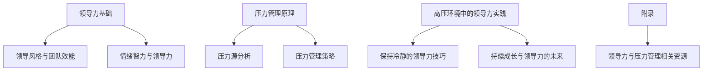

                 

### 文章标题

《领导力与压力管理：在高压环境中保持冷静》

### 关键词

领导力，压力管理，高压环境，情绪智力，自我调节，团队效能，组织文化

### 摘要

本文深入探讨了领导力与压力管理之间的关系，特别是在高压环境中如何保持冷静。通过对领导力基础、压力管理原理以及高压环境中的领导力实践的详细分析，文章揭示了如何在复杂的工作环境中保持高效能和心理健康。本文旨在为企业管理者、职场人士提供实用的策略和技巧，帮助他们在面对压力时能够冷静应对，从而提升领导力和团队绩效。

## 第一部分：领导力基础

### 第1章 领导力与组织行为学

#### 1.1 领导力的定义与类型

领导力是指一种影响他人一起实现目标的能力。在不同的情境中，领导力可以采取多种形式。约翰·肯尼迪·格雷（John Kenneth Galbraith）将领导力定义为“通过与他人合作来达到共同目标的能力”。而沃伦·本尼斯（Warren Bennis）则认为领导力是一种激励和引导他人去实现他们自身都不曾想到的成就的能力。

领导力可以根据不同的分类标准分为多种类型。例如，根据领导者的行为模式，可以将其分为变革型领导（Transformational Leadership）和交易型领导（Transactional Leadership）。变革型领导强调领导者的愿景和创新，通过激发团队成员的内在动机来推动变革。而交易型领导则侧重于通过奖励和惩罚来影响团队成员的行为。

#### 1.2 组织行为学的基础理论

组织行为学是研究组织内部个体、团队以及整个组织行为的一个领域。其基础理论主要包括以下几个方面：

1. **个体行为理论**：研究个体在组织中的行为模式，包括动机、态度、人格特征等。
2. **团队行为理论**：研究团队的形成、功能以及团队内部的合作与冲突。
3. **领导理论**：探讨领导者的行为对团队和组织的影响，以及如何提升领导力。
4. **组织文化理论**：研究组织内部的价值观、信念和行为规范，以及它们如何影响组织绩效。

#### 1.3 领导力与组织文化的关联

领导力与组织文化密切相关。组织文化是指组织成员共享的价值观、信念和行为规范。一个积极健康的组织文化可以促进领导力的发挥，提升团队绩效。例如，谷歌（Google）以其独特的公司文化而闻名，这种文化鼓励创新、合作和自我提升，为领导力的有效发挥提供了良好的环境。

领导力也可以影响组织文化。领导者通过其行为和决策，塑造组织的价值观和行为规范。例如，一个以客户为中心的领导者会鼓励团队成员关注客户需求，从而形成一个以客户为中心的文化。

### 第2章 领导风格与团队效能

#### 2.1 领导风格的理论与实践

领导风格是指领导者如何影响和指导团队成员的方式。根据不同的分类标准，领导风格可以有多种类型。例如，根据权力和控制程度，可以将其分为民主型领导、权威型领导和放任型领导。每种领导风格都有其优缺点。

1. **民主型领导**：领导者鼓励团队成员参与决策，尊重他们的意见。这种风格有助于提高团队士气和工作满意度，但可能缺乏决策效率。
2. **权威型领导**：领导者集中权力，独自做出决策。这种风格可以迅速作出决策，但可能导致团队成员的被动和不满。
3. **放任型领导**：领导者给予团队成员极大的自由度，让他们自主决策。这种风格有助于激发团队成员的创造力和主动性，但可能缺乏统一的目标和方向。

#### 2.2 团队效能的提升策略

团队效能是指团队实现其目标的能力。提升团队效能需要综合考虑团队建设、沟通、协作等因素。以下是一些提升团队效能的策略：

1. **明确目标**：确保团队成员明确了解团队的目标和期望。
2. **有效沟通**：建立有效的沟通机制，确保信息准确、及时地传达。
3. **分工协作**：合理分配任务，确保每个成员都能发挥其优势。
4. **激励与反馈**：提供适当的激励和反馈，激励团队成员努力工作。
5. **冲突管理**：妥善处理团队内部的冲突，避免影响团队效能。

#### 2.3 案例分析：不同领导风格的效果

为了更好地理解不同领导风格对团队效能的影响，我们可以通过以下案例分析：

1. **案例一：变革型领导**  
   某公司的新任CEO采用变革型领导风格，提出新的愿景和目标，激发团队成员的内在动机。结果，公司的创新能力和市场竞争力显著提升。

2. **案例二：交易型领导**  
   另一家公司采用交易型领导风格，通过明确的奖励和惩罚机制管理团队。虽然短期内团队效率有所提升，但长期来看，团队成员的主动性和创造力受到压制。

3. **案例三：民主型领导**  
   一家初创公司的创始人采用民主型领导风格，鼓励团队成员参与决策。这种风格促进了团队的凝聚力和创新能力，使得公司在竞争激烈的市场中迅速崛起。

### 第3章 情绪智力与领导力

#### 3.1 情绪智力的概念与重要性

情绪智力（Emotional Intelligence，简称EQ）是指个体识别、理解、管理自己情绪的能力，以及识别、理解、影响他人情绪的能力。与传统的智力（IQ）不同，情绪智力更多地关注情感和人际交往能力。情绪智力包括以下五个核心能力：

1. **自我意识**：了解自己的情绪，并能够对其进行合理的处理。
2. **自我管理**：控制自己的情绪，保持冷静和专注。
3. **社交意识**：理解他人的情绪，并能够有效地与他人沟通。
4. **关系管理**：建立和维护良好的人际关系，处理冲突和合作。
5. **动机**：利用情感来驱动自己的行为，实现个人和团队的目标。

情绪智力对于领导力至关重要。一个高情绪智力的领导者能够更好地理解自己和他人，处理复杂的人际关系，从而提升领导效能。

#### 3.2 提高情绪智力的发展路径

提高情绪智力需要长期的努力和实践。以下是一些提高情绪智力的发展路径：

1. **自我反思**：定期反思自己的情绪和行为，了解情绪的来源和影响。
2. **情感识别**：学习如何识别和理解自己的情绪，以及如何识别他人的情绪。
3. **情感调节**：学习如何调节和管理自己的情绪，保持冷静和专注。
4. **沟通技巧**：提高沟通能力，学会有效地表达自己的想法和情感。
5. **人际交往**：积极参与社交活动，提高人际交往能力。

#### 3.3 情绪智力在领导力中的应用

情绪智力在领导力中有着广泛的应用。以下是一些具体的应用场景：

1. **团队建设**：通过了解团队成员的情绪，领导者可以更好地促进团队的凝聚力和合作。
2. **冲突管理**：领导者可以利用情绪智力来识别和解决团队内部的冲突。
3. **激励与反馈**：领导者可以更好地理解团队成员的情感需求，提供有针对性的激励和反馈。
4. **领导风格**：高情绪智力的领导者可以更灵活地调整自己的领导风格，以适应不同的情境和团队需求。

## 第二部分：压力管理原理

### 第4章 压力管理的理论基础

#### 4.1 压力的定义与分类

压力是指一种心理和生理的反应，通常由外部环境的要求和个体的应对能力之间的不平衡引起。压力可以来自多种来源，包括工作、家庭、社会关系等。

根据压力的来源和特点，可以将压力分为以下几类：

1. **工作压力**：由工作环境、工作性质、工作负荷等因素引起。
2. **生活压力**：由家庭、朋友、健康、财务等问题引起。
3. **社会压力**：由社会关系、文化背景、社会地位等因素引起。
4. **心理压力**：由个人的心理状态、自我认知等因素引起。

#### 4.2 压力对个体与组织的影响

压力对个体和组织都有着深远的影响。对于个体来说，长期的压力可能导致心理健康问题，如焦虑、抑郁、睡眠障碍等。此外，压力还可能影响个体的工作表现和生活质量。

对于组织来说，压力可能导致以下问题：

1. **员工流失**：长期的压力可能导致员工离职，影响组织的稳定和发展。
2. **工作效率下降**：压力可能导致员工的工作效率下降，影响组织绩效。
3. **团队冲突**：压力可能导致团队内部冲突增加，影响团队协作和绩效。
4. **组织文化问题**：长期的压力可能导致组织文化恶化，影响组织的整体氛围。

#### 4.3 压力管理的核心要素

压力管理是一个复杂的过程，需要综合考虑多个方面。压力管理的核心要素包括：

1. **识别压力源**：了解压力的来源，有助于有针对性地进行管理。
2. **调整工作环境**：改善工作环境，减少工作压力。
3. **提升应对能力**：提高个体的应对能力，增强抗压能力。
4. **提供支持**：组织和个人都应提供必要的支持，帮助个体应对压力。

### 第5章 压力源分析

#### 5.1 工作压力源的类型与特点

工作压力源是引起工作压力的主要因素。以下是一些常见的工作压力源及其特点：

1. **工作负荷**：工作量大、任务紧急可能导致工作负荷增加，引起压力。
2. **工作环境**：不良的工作环境，如噪音、拥挤、高温等，可能引起压力。
3. **人际关系**：工作中的冲突和紧张的人际关系可能导致压力。
4. **工作不确定性**：工作中的不确定性，如职位变动、裁员等，可能引起压力。
5. **工作与生活的平衡**：工作与生活的不平衡，如加班、出差等，可能引起压力。

#### 5.2 个人压力源的认知与应对

个人压力源是个人在工作、生活中面临的压力因素。以下是一些常见的个人压力源及其应对策略：

1. **健康问题**：健康问题，如疾病、伤痛等，可能引起压力。应对策略包括及时就医、调整生活方式等。
2. **家庭问题**：家庭问题，如婚姻、子女教育等，可能引起压力。应对策略包括沟通、寻求专业帮助等。
3. **财务问题**：财务问题，如债务、投资等，可能引起压力。应对策略包括合理规划财务、寻求财务咨询等。
4. **职业发展**：职业发展问题，如职位晋升、职业规划等，可能引起压力。应对策略包括设定目标、寻求职业发展指导等。

#### 5.3 组织层面的压力源与对策

组织层面的压力源主要来自组织内部的管理和组织文化。以下是一些常见的组织层面压力源及其对策：

1. **不明确的工作要求**：对策包括明确工作要求、提供指导和支持。
2. **工作与生活的冲突**：对策包括弹性工作时间、提供家庭支持等。
3. **缺乏反馈与认可**：对策包括建立反馈机制、提供奖励和认可等。
4. **组织文化的压力**：对策包括营造积极健康的组织文化、提供心理辅导等。

### 第6章 压力管理策略

#### 6.1 压力预警机制与预警信号

压力预警机制是指通过识别和监测压力的预警信号，及时采取干预措施，以减轻压力对个体和组织的影响。以下是一些常见的压力预警信号：

1. **身体信号**：如头痛、失眠、消化不良等。
2. **情绪信号**：如易怒、焦虑、沮丧等。
3. **行为信号**：如工作效率下降、离职倾向增加等。
4. **心理信号**：如自我怀疑、缺乏动力等。

建立压力预警机制有助于及时发现和应对压力，减轻其对个体和组织的负面影响。

#### 6.2 压力缓解技巧与放松方法

压力缓解技巧和放松方法是减轻压力的有效手段。以下是一些常见的方法：

1. **呼吸练习**：通过深呼吸、缓慢呼吸等方式，帮助放松身体和情绪。
2. **运动**：定期进行有氧运动，如跑步、游泳、瑜伽等，有助于释放压力。
3. **冥想**：通过冥想、正念等方法，帮助提高情绪智力，减轻压力。
4. **社交**：与家人、朋友进行社交活动，分享自己的压力和困扰。
5. **娱乐**：进行自己喜欢的娱乐活动，如看电影、听音乐、阅读等，有助于放松身心。

#### 6.3 压力管理计划与实施

压力管理计划是指为了减轻压力，采取一系列有针对性的措施和策略。以下是一些实施压力管理计划的步骤：

1. **评估压力源**：了解个体和组织面临的压力源，确定优先级。
2. **制定目标**：根据评估结果，制定明确的压力管理目标。
3. **设计策略**：设计具体的压力管理策略，如调整工作环境、提供心理辅导等。
4. **实施计划**：按照计划执行压力管理策略，并及时调整。
5. **监控与评估**：定期监控压力管理的效果，评估计划的实施情况，及时调整策略。

## 第三部分：高压环境中的领导力实践

### 第7章 高压环境下的领导力挑战

#### 7.1 高压环境的特点与挑战

高压环境通常具有以下特点：

1. **高期望**：对个体和团队的工作表现有较高的期望。
2. **快速变化**：环境变化迅速，要求个体和团队能够迅速适应。
3. **高竞争**：竞争激烈，要求个体和团队保持竞争优势。
4. **高风险**：面临较高的风险，可能导致重大损失或失败。

高压环境对领导力提出了以下挑战：

1. **决策压力**：在高压环境中，领导者需要快速做出决策，但决策失误可能导致严重后果。
2. **资源分配**：在资源有限的情况下，领导者需要合理分配资源，确保关键任务的优先处理。
3. **团队管理**：高压环境可能导致团队成员产生焦虑和压力，领导者需要有效管理团队，保持团队的凝聚力和工作效率。
4. **个人应对**：领导者本身也需要具备良好的压力管理能力，以保持冷静和清晰的思维。

#### 7.2 高压环境下的领导策略

为了在高压环境中有效领导，领导者可以采取以下策略：

1. **明确目标与期望**：确保团队成员明确了解团队的目标和期望，以减少误解和焦虑。
2. **提供支持与资源**：确保团队成员有足够的支持和资源来应对压力，提高工作效率。
3. **激励与认可**：通过激励和认可，提高团队成员的积极性和满意度，减轻压力。
4. **有效沟通**：建立有效的沟通机制，确保信息准确、及时地传达，避免误解和焦虑。
5. **团队建设**：通过团队建设活动，增强团队的凝聚力和合作精神，提高团队效能。

#### 7.3 案例研究：成功应对高压环境的领导力案例

以下是一个成功应对高压环境的领导力案例：

某科技公司的CEO在面临市场变化和竞争压力时，采取了以下措施：

1. **快速决策**：在市场变化时，CEO迅速做出决策，调整产品线和市场策略，以适应新的市场环境。
2. **资源整合**：CEO重新评估公司的资源，将资源集中在关键领域，确保公司的核心竞争力和市场地位。
3. **团队激励**：CEO通过设立激励机制，鼓励团队成员积极参与公司发展，提高团队成员的积极性和创造力。
4. **有效沟通**：CEO建立了一个透明的沟通机制，确保团队成员了解公司的战略和决策，减少误解和焦虑。
5. **团队建设**：CEO定期组织团队建设活动，增强团队的凝聚力和合作精神，提高团队效能。

通过以上措施，该公司成功应对了高压环境，保持了市场竞争力和持续发展。

### 第8章 保持冷静的领导力技巧

#### 8.1 自我调节与情绪控制

自我调节是指个体通过认知和行为策略来调节自己的情绪和情感。情绪控制是指个体在面临压力和挑战时，保持冷静和理智，有效管理自己的情绪。以下是一些自我调节与情绪控制的技巧：

1. **认知重构**：通过改变对压力事件的认识和解释，减少负面情绪。
2. **放松训练**：通过深呼吸、冥想、瑜伽等放松训练，减轻压力和焦虑。
3. **积极心态**：培养积极的心态，关注解决问题的方法，而不是问题本身。
4. **情绪表达**：找到合适的渠道和方式，表达自己的情绪，避免情绪压抑。
5. **寻求支持**：在遇到困难时，主动寻求他人帮助，分享自己的压力和困惑。

#### 8.2 有效沟通与冲突管理

有效沟通是领导者保持冷静和应对压力的重要手段。以下是一些有效沟通与冲突管理的技巧：

1. **倾听**：倾听是有效沟通的基础，通过倾听了解他人的观点和需求。
2. **表达**：清晰、准确地表达自己的观点和需求，避免误解和冲突。
3. **非语言沟通**：注意自己的身体语言和表情，以增强沟通效果。
4. **冲突管理**：通过妥协、谈判、寻求共识等方式，妥善处理冲突。
5. **建立信任**：建立信任关系，增强团队成员之间的合作和信任。

#### 8.3 培养团队成员的应对压力能力

培养团队成员的应对压力能力是领导者保持冷静和应对压力的关键。以下是一些培养团队成员应对压力能力的策略：

1. **培训与教育**：提供压力管理和情绪智力的培训，提高团队成员的应对压力能力。
2. **团队建设**：通过团队建设活动，增强团队成员之间的信任和合作，提高团队的应对压力能力。
3. **心理辅导**：为团队成员提供心理辅导和支持，帮助他们应对压力和挑战。
4. **工作环境优化**：改善工作环境，减少工作压力，提高团队成员的满意度和幸福感。
5. **激励与认可**：通过激励和认可，提高团队成员的积极性和应对压力的能力。

### 第9章 持续成长与领导力的未来

#### 9.1 领导力的持续发展

领导力是一个持续发展的过程，领导者需要不断学习和成长。以下是一些领导力持续发展的途径：

1. **自我反思**：通过定期反思自己的行为和决策，了解自己的优点和不足，不断改进。
2. **学习与培训**：参加培训课程、阅读相关书籍、参加研讨会等，不断更新自己的知识和技能。
3. **实践经验**：通过实际工作，积累领导经验，提高自己的领导能力。
4. **反思与调整**：在领导实践中，不断反思和调整自己的策略和方式，以适应不断变化的环境。

#### 9.2 压力管理与领导力的未来趋势

随着社会和科技的发展，压力管理和领导力面临着新的挑战和机遇。以下是一些压力管理与领导力的未来趋势：

1. **心理健康的重要性**：随着心理健康问题日益突出，领导者和组织将更加重视心理健康管理，提供更多的支持和资源。
2. **数字化领导力**：随着数字化技术的发展，领导力将更加依赖于数字化工具和平台，领导者需要具备数字领导力能力。
3. **个性化和定制化**：领导者将更加关注个体的需求和差异，提供个性化的领导和管理方式。
4. **跨界合作**：在全球化背景下，领导者需要具备跨界合作能力，能够与不同背景和文化的人有效沟通和合作。

#### 9.3 领导者的自我反思与提升路径

作为领导者，自我反思和提升是持续成长的关键。以下是一些自我反思和提升的路径：

1. **设定目标**：明确自己的职业目标和领导力提升目标，制定具体的行动计划。
2. **学习与成长**：不断学习新的知识和技能，提升自己的领导力和管理能力。
3. **寻求反馈**：主动寻求他人的反馈和建议，了解自己的优点和不足，不断改进。
4. **实践反思**：在领导实践中，不断反思和总结经验，将理论知识转化为实际能力。
5. **持续创新**：保持开放和创新的心态，不断探索新的领导和管理方法。

## 附录

### 附录A：领导力与压力管理相关资源

#### A.1 学术文献与研究报告

1. **《领导力：理论与实践》（Leadership: Theory and Practice）** - Peter Northouse
2. **《压力管理：理论与实践》（Stress Management: Concepts and Strategies）** - Michael P. Leiter 和 Susan N. Spencer
3. **《情绪智力：理解与提升》（Emotional Intelligence: Understanding and Managing Your Emotions to Succeed in Life）** - John D. Mayer、Peter Salovey 和 David R. Caruso

#### A.2 在线资源与工具

1. **MindTools** - 提供各种领导力、时间管理和压力管理工具和资源。
2. **Harvard Business Review** - 包含大量关于领导力和组织管理的文章和案例研究。
3. **LinkedIn Learning** - 提供各种领导力和个人发展的在线课程。

#### A.3 推荐阅读与进一步学习

1. **《禅与计算机程序设计艺术》（Zen and the Art of Motorcycle Maintenance）** - Robert M. Pirsig
2. **《领导力的五个层次》（The Five Levels of Leadership）** - John C. Maxwell
3. **《压力与心灵》（Stress and the Heart）** - Michael Miller

## Mermaid 流程图



### 核心算法原理讲解伪代码

```plaintext
// 压力管理算法伪代码

// 定义压力等级函数
function calculatePressureLevel(stressFactors, copingMechanisms) {
    pressureLevel = 0;
    for (factor in stressFactors) {
        pressureLevel += factor.weight * factor.value;
    }
    for (mechanism in copingMechanisms) {
        pressureLevel -= mechanism.effectiveness;
    }
    return pressureLevel;
}

// 主函数
function pressureManagementStrategy() {
    stressFactors = gatherStressFactors();
    copingMechanisms = gatherCopingMechanisms();
    
    currentPressureLevel = calculatePressureLevel(stressFactors, copingMechanisms);
    if (currentPressureLevel > threshold) {
        applyCopingMechanisms(copingMechanisms);
    }
}
```

## 文章结语

本文深入探讨了领导力与压力管理的关系，特别是在高压环境中如何保持冷静。通过分析领导力基础、压力管理原理以及高压环境中的领导力实践，文章揭示了如何通过有效的领导力和压力管理策略，提升团队效能和个体心理健康。领导者和职场人士可以从中获得实用的策略和技巧，帮助他们在高压环境中保持冷静和高效。随着社会和科技的发展，领导力和压力管理将面临新的挑战和机遇。希望本文能够为读者提供有价值的启示，助力他们在职业生涯中取得更好的成就。作者：AI天才研究院/AI Genius Institute & 禅与计算机程序设计艺术 /Zen And The Art of Computer Programming

----------------------------------------------------------------

### 作者信息

作者：AI天才研究院/AI Genius Institute & 禅与计算机程序设计艺术 /Zen And The Art of Computer Programming

AI天才研究院是一家专注于人工智能领域研究和教育的机构，致力于推动人工智能技术的创新和应用。同时，作者是《禅与计算机程序设计艺术》一书的作者，以深入浅出的方式将禅宗智慧与计算机编程相结合，为读者提供了独特的编程哲学和思维方法。在本文中，作者结合其丰富的技术背景和领导力经验，为广大读者提供了关于领导力与压力管理的专业见解和实用策略。

