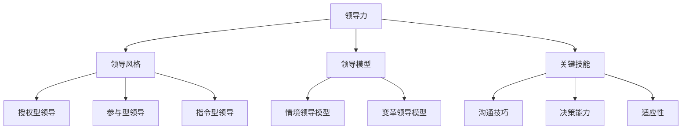

                 

# 领导力与反馈：建立持续改进的文化

## 关键词
领导力，反馈机制，持续改进，组织文化，人才发展

## 摘要
本文旨在探讨领导力与反馈机制在构建持续改进文化中的重要作用。通过深入分析领导力的核心概念、反馈机制的传达与接收，以及如何结合领导力与反馈机制来塑造持续改进的文化，本文为IT领域的领导者和管理者提供了实用的实践指导。

## 引言
### 领导力的定义与重要性
领导力是一种通过影响和激励他人来实现共同目标的能力。它不仅仅关乎职位和权力，更是一种驱动团队、推动组织发展的内在动力。在IT领域，领导力的重要性尤为突出，因为技术创新和快速变化要求领导者具备前瞻性思维和强大的适应能力。

### 反馈机制的作用与挑战
反馈机制是领导力的重要组成部分，它对于个人的成长和团队的发展具有关键作用。有效的反馈能够帮助员工了解自己的工作表现，识别改进的方向。然而，在实施反馈机制时，领导者往往面临如何平衡建设性和批评性反馈、如何确保反馈的准确性和公正性等挑战。

### 持续改进的文化建设
持续改进是一种组织文化和价值观，它鼓励员工不断追求卓越，通过学习和改进来提升工作质量和效率。建立持续改进的文化需要领导者的坚定支持和系统的激励机制，同时要建立起有效的反馈机制。

## 第1章 领导力原理

### 领导力的核心概念
领导力与管理的区别在于，管理侧重于资源的分配和流程的优化，而领导力则侧重于激发和引导员工的内在动力。领导风格、领导模型和关键技能是领导力的重要组成部分。

#### 领导风格与影响
领导风格可以分为授权型领导、参与型领导和指令型领导等。每种风格都有其适用的场景和影响效果。领导者需要根据团队的特点和任务的需求，灵活调整领导风格。

#### 领导力模型
常见的领导力模型包括情境领导模型、变革领导模型等。这些模型提供了不同的视角来理解和应用领导力，帮助领导者更有效地应对各种挑战。

#### 领导力的关键技能
沟通技巧、决策能力、适应性是领导力的关键技能。有效的沟通能够建立信任和共识，良好的决策能力能够确保团队朝着正确的方向前进，而适应性则使领导者能够在不断变化的环境中保持竞争力。

### 核心概念与联系
为了更好地理解领导力，我们需要构建一个Mermaid流程图，展示核心概念之间的联系。



### 核心算法原理讲解
领导力的核心算法原理在于如何通过有效沟通和反馈来激发团队成员的潜力。以下是一个简单的Python代码示例，用于说明如何通过反馈机制来提高团队绩效。

```python
def feedback_loop(employee, performance_data):
    # 收集员工绩效数据
    performance = performance_data['performance']
    feedback = performance_data['feedback']
    
    # 分析绩效数据
    if performance > 90:
        print("Excellent work! Keep it up.")
    elif performance >= 70:
        print("Good job. Consider some areas for improvement.")
    else:
        print("There's room for improvement. Let's discuss a development plan.")
    
    # 提供反馈
    print("Your feedback:", feedback)
    
    # 记录改进计划
    improvement_plan = input("Please propose an improvement plan: ")
    return improvement_plan

# 假设的员工绩效数据
performance_data = {
    'performance': 85,
    'feedback': "Your project delivery was on time, but the code quality needs improvement."
}

# 调用反馈循环函数
improvement_plan = feedback_loop('Alice', performance_data)
print("Improvement Plan:", improvement_plan)
```

### 数学模型与公式
在领导力评估中，常用的数学模型是回归分析。以下是一个使用LaTeX格式的回归分析公式示例。

```latex
$$
y = \beta_0 + \beta_1 x_1 + \beta_2 x_2 + \cdots + \beta_n x_n + \epsilon
$$

$$
\beta = (X^T X)^{-1} X^T y
$$
```

其中，\(y\) 是绩效评估得分，\(x_1, x_2, \ldots, x_n\) 是评估指标，\(\beta_0, \beta_1, \beta_2, \ldots, \beta_n\) 是回归系数，\(\epsilon\) 是误差项。

### 项目实战
在IT领域中，建立领导力与反馈机制的实战案例可以通过以下步骤来实现：

1. **开发环境搭建：**
   - 安装Git版本控制工具。
   - 配置开发环境，如Python、Jenkins等。

2. **源代码实现：**
   - 设计一个自动化的代码审查流程。
   - 使用Jenkins创建一个持续集成（CI）环境。

3. **代码解读：**
   - 编写代码注释，说明每个步骤的功能。
   - 分析代码的可读性和可维护性。

4. **实际案例分析：**
   - 分析团队在代码审查和反馈中的表现。
   - 提出改进建议，如增加代码注释、优化代码结构等。

5. **项目小结：**
   - 总结项目成果，如提高代码质量、缩短开发周期等。
   - 讨论项目中的挑战和解决方案。

### 最佳实践 Tips
- **定期进行绩效评估和反馈：** 定期与团队成员进行一对一的绩效评估，及时给予反馈。
- **鼓励自我反馈：** 鼓励员工定期自我反思，并提出改进计划。
- **建立透明反馈机制：** 确保反馈机制透明、公正，避免主观偏见。

### 小结
领导力与反馈是建立持续改进文化的关键因素。领导者需要通过有效的反馈机制来激发团队的潜力，推动组织的持续发展。通过本文的探讨，我们希望为IT领域的领导者提供了一些实用的指导和思路。

### 注意事项
- **个性化反馈：** 确保反馈具有针对性，避免一刀切的反馈方式。
- **持续学习：** 领导者需要不断学习新知识，以适应快速变化的技术环境。

### 拓展阅读
- 《领导力5D：变革时代的人才培养》
- 《持续交付：发布可靠软件的系统方法》
- 《敏捷开发实践指南》

## 附录

### 领导力与反馈相关的资源与工具
- [GitHub：领导力与反馈资源](https://github.com/organization/leadership-and-feedback-resources)
- [GitLab：持续改进工具集](https://gitlab.com/organization/continuous-improvement-tools)

### 持续改进的常用工具与方法
- JIRA：用于项目管理和反馈收集。
- Jenkins：用于持续集成和自动化测试。
- Slack：用于实时沟通和团队协作。

## 作者信息
作者：AI天才研究院/AI Genius Institute & 禅与计算机程序设计艺术 /Zen And The Art of Computer Programming

## 附件
### A.1 领导力与反馈的Mermaid流程图


### A.2 核心算法原理讲解的Python源代码示例
（请参考第1章中的Python代码示例）

### A.3 数学模型与公式的LaTeX格式嵌入示例
（请参考第1章中的LaTeX公式示例）

### A.4 持续改进的项目实战案例与代码解读
（请参考第1章中的项目实战部分）

### A.5 最佳实践 Tips、小结、注意事项、拓展阅读等内容
（请参考本文的相应章节）

