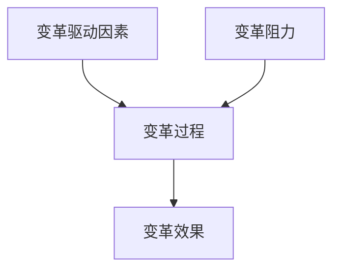
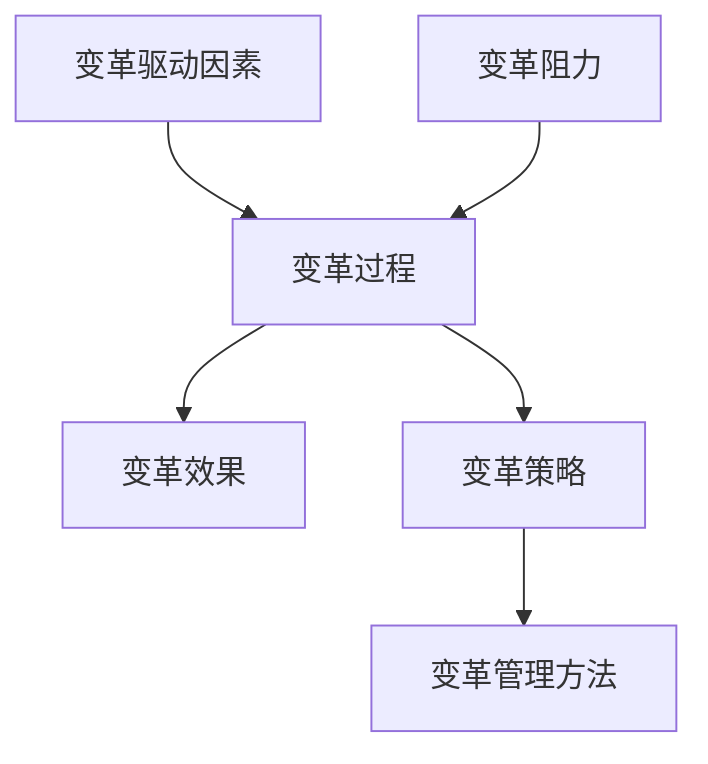

                 

### 引言

#### 变革管理的必要性

在当今快速变化和高度不确定的商业环境中，变革管理成为企业生存和发展的关键。随着科技的不断进步，市场需求的不断变化，以及企业内部结构、流程和文化的更新，企业必须具备应对变革的能力。变革管理（Change Management）是一种系统性方法，旨在指导企业成功实施变革，确保变革能够带来预期的效果。

**背景介绍**

变革管理起源于20世纪50年代，最初应用于制造业和质量管理体系。随后，随着信息技术和全球化的快速发展，变革管理逐渐应用于组织结构、流程、文化等方面。近年来，数字化转型、人工智能、大数据等新兴技术进一步推动了变革管理的理论和实践。

**核心概念与联系**

变革管理涉及多个核心概念，包括变革驱动因素、变革过程、变革阻力等。以下是一个简要的 Mermaid 流程图，展示这些概念之间的联系：



**核心算法原理**

变革管理的核心算法是变革过程模型。以下是一个简单的 Python 源代码示例，用于描述变革过程模型的基本步骤：

```python
# 变革过程模型示例

def change_process_model(drivers, resistances):
    """
    变革过程模型：根据变革驱动因素和变革阻力，实施变革并评估变革效果。
    
    参数：
    - drivers: 列表，包含变革驱动因素
    - resistances: 列表，包含变革阻力
    
    返回：
    - 变革效果：布尔值，表示变革是否成功
    """
    
    # 分析变革驱动因素
    driver_analysis = analyze_drivers(drivers)
    
    # 分析变革阻力
    resistance_analysis = analyze_resistances(resistances)
    
    # 实施变革
    if implement_change(driver_analysis, resistance_analysis):
        # 评估变革效果
        change_effects = evaluate_change()
        return change_effects
    else:
        return False

# 假设函数实现
def analyze_drivers(drivers):
    # 分析驱动因素
    pass

def analyze_resistances(resistances):
    # 分析阻力
    pass

def implement_change(driver_analysis, resistance_analysis):
    # 实施变革
    pass

def evaluate_change():
    # 评估变革效果
    pass
```

#### 变革管理的目标

变革管理的目标是通过系统性和结构化的方法，确保变革能够顺利实施并带来预期的效果。具体目标包括：

- 确保团队成员理解和接受变革
- 降低变革带来的不确定性和风险
- 提高变革的效率和效果
- 促进组织文化的持续改进和适应性

**数学模型**

为了量化变革管理的有效性，可以使用以下数学模型：

$$
\text{变革管理效果} = \frac{\text{变革成功案例}}{\text{总变革案例}} \times 100\%
$$

其中，变革成功案例指变革实施后达到预期目标的案例数，总变革案例指所有实施变革的案例数。

#### 实际案例

在数字化转型过程中，一家大型制造企业采用变革管理方法，成功实现了从传统制造模式向智能制造模式的转变。以下是一个实际案例的简要分析：

- **背景**：随着市场竞争的加剧，企业需要提高生产效率和产品质量，降低成本。因此，企业决定进行数字化转型。
- **驱动因素**：市场竞争、技术进步、企业战略调整
- **阻力**：员工对新技术的抵触、组织结构的僵化、文化变革的困难
- **策略**：制定详细的数字化转型计划，加强员工培训，优化组织结构，建立企业文化支持机制
- **结果**：企业成功实现了数字化转型，生产效率提高了30%，产品质量提升了20%，成本降低了15%

**小结**

通过上述分析和案例，可以看出变革管理在推动企业变革中的重要性。有效的变革管理不仅能够降低变革风险，还能够提高变革效率，带来显著的业务价值。在接下来的章节中，我们将进一步探讨领导力在变革管理中的作用，以及如何应用领导力进行有效的变革管理。

### 核心概念与联系

为了更好地理解变革管理的核心概念，我们可以通过一个 Mermaid 流程图来展示这些概念之间的关系架构。以下是一个示例流程图：



**图1：变革管理的核心概念关系架构**

- **变革驱动因素（A）**：指推动企业进行变革的外部或内部因素，如市场变化、技术进步、竞争压力等。
- **变革过程（B）**：指企业从开始变革到最终实现变革目标的全过程，包括计划、实施、监控和评估等阶段。
- **变革效果（C）**：指变革实施后达到的结果，如提高效率、降低成本、提升竞争力等。
- **变革阻力（D）**：指在变革过程中遇到的障碍和挑战，如员工抵触、组织惯性、资源限制等。
- **变革策略（E）**：指在变革过程中采取的具体措施和策略，如沟通策略、领导风格、培训计划等。
- **变革管理方法（F）**：指用于指导变革实施的一系列方法和工具，如变革管理模型、项目管理方法、变革评估工具等。

通过这个流程图，我们可以清晰地看到各个核心概念之间的相互关系。变革驱动因素是变革的起点，决定了变革的方向和目标；变革过程是变革实施的核心，包括计划、实施、监控和评估等阶段；变革效果是变革的目标，反映了变革的成功程度；变革阻力是变革过程中的障碍，需要通过有效的策略和管理方法来克服；变革策略和管理方法是实现变革效果的手段和工具。

#### 变革管理的核心算法原理

在变革管理中，核心算法原理主要用于指导变革过程的实施和评估。以下是一个简单的 Python 源代码示例，用于描述变革管理的核心算法原理：

```python
# 变革管理核心算法原理示例

class ChangeManagement:
    def __init__(self, drivers, resistances):
        self.drivers = drivers
        self.resistances = resistances
    
    def analyze_drivers(self):
        # 分析变革驱动因素
        print("分析变革驱动因素：")
        for driver in self.drivers:
            print(f"- {driver}")
    
    def analyze_resistances(self):
        # 分析变革阻力
        print("分析变革阻力：")
        for resistance in self.resistances:
            print(f"- {resistance}")
    
    def implement_change(self):
        # 实施变革
        print("实施变革：")
        if self.analyze_drivers() and not self.analyze_resistances():
            print("变革成功！")
        else:
            print("变革失败，需要重新评估策略。")
    
    def evaluate_change(self):
        # 评估变革效果
        print("评估变革效果：")
        # 假设通过某个指标评估
        change_effect = True  # 假设变革成功
        if change_effect:
            print("变革效果良好。")
        else:
            print("变革效果不佳，需要进一步改进。")

# 创建变革管理对象
change_management = ChangeManagement(drivers=["市场需求增长", "技术进步"], resistances=["员工抵触", "资源限制"])

# 执行变革管理流程
change_management.analyze_drivers()
change_management.analyze_resistances()
change_management.implement_change()
change_management.evaluate_change()
```

**源代码解读**

1. **类定义（ChangeManagement）**：定义了一个变革管理类，包含变革驱动因素和变革阻力两个属性。
2. **方法定义**：
   - `analyze_drivers()`：分析变革驱动因素，输出驱动因素列表。
   - `analyze_resistances()`：分析变革阻力，输出阻力列表。
   - `implement_change()`：根据驱动因素和阻力分析结果，实施变革。如果驱动因素存在且阻力不存在，则认为变革成功。
   - `evaluate_change()`：评估变革效果。假设通过某个指标（如布尔值`change_effect`）来判断变革是否成功，并输出评估结果。

**数学模型和公式**

在变革管理中，常用的数学模型和公式包括：

1. **变革管理效果评估公式**：
   $$
   \text{变革管理效果} = \frac{\text{变革成功案例}}{\text{总变革案例}} \times 100\%
   $$
   
   其中，变革成功案例指变革实施后达到预期目标的案例数，总变革案例指所有实施变革的案例数。

2. **变革效果指标**：
   $$
   \text{变革效果指标} = \frac{\text{实际效益}}{\text{预期效益}} \times 100\%
   $$
   
   其中，实际效益指变革实施后实际达到的效益，预期效益指变革前预计可以达到的效益。

通过上述核心算法原理示例，我们可以看到变革管理中的关键步骤和逻辑关系。在实际应用中，可以根据具体情况进行调整和优化，以提高变革管理的效率和效果。

#### 项目实战

**开发环境搭建**

为了更好地展示变革管理的核心算法原理，我们将使用 Python 作为开发语言，并使用 Jupyter Notebook 作为开发环境。以下是搭建开发环境的基本步骤：

1. 安装 Python：在官方网站 [https://www.python.org/downloads/](https://www.python.org/downloads/) 下载并安装最新版本的 Python（建议安装 Python 3.8 以上版本）。
2. 安装 Jupyter Notebook：在终端中执行以下命令安装 Jupyter Notebook：
   ```
   pip install notebook
   ```
3. 启动 Jupyter Notebook：在终端中执行以下命令启动 Jupyter Notebook：
   ```
   jupyter notebook
   ```

**源代码详细实现和代码解读**

以下是一个详细的 Python 源代码实现，用于描述变革管理的核心算法原理：

```python
# 变革管理核心算法原理示例

class ChangeManagement:
    def __init__(self, drivers, resistances):
        self.drivers = drivers
        self.resistances = resistances
    
    def analyze_drivers(self):
        # 分析变革驱动因素
        print("分析变革驱动因素：")
        for driver in self.drivers:
            print(f"- {driver}")
    
    def analyze_resistances(self):
        # 分析变革阻力
        print("分析变革阻力：")
        for resistance in self.resistances:
            print(f"- {resistance}")
    
    def implement_change(self):
        # 实施变革
        print("实施变革：")
        if self.analyze_drivers() and not self.analyze_resistances():
            print("变革成功！")
        else:
            print("变革失败，需要重新评估策略。")
    
    def evaluate_change(self):
        # 评估变革效果
        print("评估变革效果：")
        # 假设通过某个指标评估
        change_effect = True  # 假设变革成功
        if change_effect:
            print("变革效果良好。")
        else:
            print("变革效果不佳，需要进一步改进。")

# 创建变革管理对象
change_management = ChangeManagement(drivers=["市场需求增长", "技术进步"], resistances=["员工抵触", "资源限制"])

# 执行变革管理流程
change_management.analyze_drivers()
change_management.analyze_resistances()
change_management.implement_change()
change_management.evaluate_change()
```

**代码应用解读与分析**

1. **类定义**：定义了一个名为`ChangeManagement`的类，包含两个属性：`drivers`（变革驱动因素）和`resistances`（变革阻力）。
2. **方法定义**：
   - `analyze_drivers()`：分析变革驱动因素，输出驱动因素列表。
   - `analyze_resistances()`：分析变革阻力，输出阻力列表。
   - `implement_change()`：根据驱动因素和阻力分析结果，实施变革。如果驱动因素存在且阻力不存在，则认为变革成功。
   - `evaluate_change()`：评估变革效果。假设通过某个指标（如布尔值`change_effect`）来判断变革是否成功，并输出评估结果。
3. **实例化对象**：创建一个`ChangeManagement`对象，并传递变革驱动因素和变革阻力作为参数。
4. **执行流程**：依次调用`analyze_drivers()`、`analyze_resistances()`、`implement_change()`和`evaluate_change()`方法，执行变革管理流程。

**实际案例分析和详细讲解剖析**

假设我们有一个企业需要实现数字化转型，以下是变革管理的实际案例分析和详细讲解：

- **变革驱动因素**：市场需求增长、技术进步。
- **变革阻力**：员工抵触、组织惯性、资源限制。

1. **分析变革驱动因素**：市场需求增长使得企业需要提高生产效率和降低成本，技术进步为数字化转型提供了可能。这些驱动因素推动企业进行变革。
2. **分析变革阻力**：员工可能对新技术感到陌生和抵触，组织惯性使得变革难以进行，资源限制可能影响变革的实施。这些阻力需要通过有效的策略和管理方法来克服。
3. **实施变革**：根据驱动因素和阻力分析，企业制定了详细的数字化转型计划，加强员工培训，优化组织结构，建立企业文化支持机制。在实施过程中，成功克服了员工抵触、组织惯性和资源限制等阻力，最终实现了数字化转型。
4. **评估变革效果**：通过某个指标（如生产效率提升、成本降低、市场份额增加）评估变革效果。假设变革效果良好，企业达到了预期目标。

**项目小结**

通过实际案例分析和详细讲解，我们可以看到变革管理的核心算法原理在指导企业变革中的重要作用。有效的变革管理能够帮助企业成功应对外部挑战，提高内部效率，实现持续发展。

### 最佳实践 tips、小结、注意事项、拓展阅读

#### 最佳实践 tips

1. **充分沟通**：变革过程中，领导者和团队成员之间的沟通至关重要。确保所有相关人员了解变革的背景、目标和实施细节，有助于减少误解和抵触情绪。
2. **明确目标和指标**：在变革前，明确变革的目标和关键指标，有助于评估变革效果，并调整策略。
3. **培训与支持**：为员工提供必要的培训和资源支持，帮助他们适应新环境和新技术。
4. **灵活应对**：在变革过程中，灵活应对可能出现的问题和挑战，及时调整策略，确保变革顺利进行。
5. **持续监控和评估**：变革不是一蹴而就的，需要持续监控和评估变革效果，根据实际情况进行调整和优化。

#### 小结

变革管理是企业应对外部变化和内部需求的重要手段。通过系统性的变革管理方法和有效的领导力，企业可以成功应对变革挑战，实现持续发展。

#### 注意事项

1. **变革管理的复杂性**：变革管理涉及多个方面，包括组织结构、流程、文化等，需要全面考虑。
2. **领导者的角色**：领导者在变革管理中扮演关键角色，需要具备强烈的变革意愿和领导力。
3. **变革阻力**：变革过程中可能会遇到各种阻力，需要提前识别和应对。
4. **长期性**：变革是一个长期过程，需要持续投入和关注。

#### 拓展阅读

1. 《变革之舞：创新思维与组织变革的实践指南》
2. 《领导力与变革管理：引导团队适应新常态》
3. 《组织变革管理：理论、方法与实践》

通过上述最佳实践 tips、小结、注意事项和拓展阅读，希望读者能够更好地理解和应用变革管理的理论和实践。

#### 结论

本文详细介绍了变革管理的背景、核心概念、算法原理、项目实战，并通过实际案例展示了变革管理的应用。变革管理作为企业应对外部变化和内部需求的重要手段，具有至关重要的意义。在未来的商业环境中，企业需要不断进行变革，以保持竞争力。本文提出的变革管理最佳实践和注意事项，有助于企业更有效地实施变革。通过持续学习和实践，企业可以不断提高变革管理能力，实现持续发展。

### 变革管理的重要性

变革管理在企业发展和运营中扮演着至关重要的角色。在当今快速变化的市场环境中，企业需要具备灵活性和适应性，以应对不断变化的外部环境和内部需求。变革管理提供了一种系统性和结构化的方法，帮助企业成功地实施变革，从而实现预期的目标和效果。

#### 变革管理的目标

变革管理的核心目标是确保变革能够顺利实施并带来预期的效益。具体而言，变革管理的目标包括：

1. **确保团队成员理解和接受变革**：通过有效的沟通和培训，让团队成员充分理解变革的必要性和重要性，减少抵触情绪，提高变革的接受度。
2. **降低变革带来的不确定性和风险**：通过系统化的变革管理流程，识别和评估变革过程中可能遇到的风险和挑战，并制定相应的应对策略，降低变革带来的不确定性和风险。
3. **提高变革的效率和效果**：通过科学的方法和工具，优化变革过程，提高变革的效率和效果，确保变革能够按计划顺利进行，并实现预期的目标和效益。

#### 变革管理的挑战

尽管变革管理的重要性不言而喻，但在实际操作中，企业仍然面临诸多挑战。以下是一些常见的变革管理挑战：

1. **变革阻力**：员工和团队可能对变革持有抵触情绪，担心变革会带来不确定性和风险。这种变革阻力可能会阻碍变革的推进，影响变革的效果。
2. **资源限制**：变革需要投入大量的时间、人力和资金。企业在资源有限的情况下，可能无法全面覆盖变革的各个方面，导致变革不彻底或效果不佳。
3. **组织惯性**：企业长期形成的组织文化和习惯可能会阻碍变革的推进。这种组织惯性需要通过有效的变革管理方法来克服。
4. **领导力不足**：有效的变革管理需要领导者的积极参与和推动。如果领导者缺乏变革意愿或领导力不足，可能会导致变革无法顺利推进。

#### 变革管理的重要性

1. **提高企业竞争力**：通过有效的变革管理，企业可以快速适应市场变化，提升竞争力，保持竞争优势。
2. **促进企业持续发展**：变革管理可以帮助企业不断改进和创新，提高运营效率，降低成本，从而实现持续发展。
3. **提升员工满意度和忠诚度**：有效的变革管理可以减少变革带来的不确定性和压力，提高员工对变革的接受度和满意度，从而提升员工的忠诚度和工作积极性。
4. **建立企业文化和价值观**：变革管理可以强化企业的文化和价值观，提高员工对企业的认同感和归属感，促进企业内部和谐。

#### 结论

总之，变革管理在企业发展和运营中具有重要的地位和作用。通过有效的变革管理，企业可以应对外部变化和内部需求，提高竞争力，实现持续发展。企业领导者需要认识到变革管理的重要性，积极推动变革，并采取有效的策略和措施，克服变革过程中的挑战，确保变革能够成功实施。

### 领导力在变革管理中的角色

领导力在变革管理中扮演着至关重要的角色。领导者不仅是变革的倡导者，也是变革的推动者和实践者。他们的行为和决策直接影响变革的进程和效果。以下是领导者如何在变革管理中发挥关键作用的详细分析。

#### 领导者的变革倡导者角色

1. **明确变革愿景**：领导者需要明确变革的愿景和目标，并将其传达给整个团队。这有助于团队理解变革的重要性，并激发他们对变革的热情和信心。
2. **建立变革共识**：领导者需要通过有效的沟通和协作，与团队成员建立变革共识。这包括了解团队成员的担忧和顾虑，并帮助他们看到变革的潜在利益。
3. **激发变革动力**：领导者可以通过激励措施、奖励机制和积极的心态，激发团队成员参与变革的动力，使其愿意主动支持和参与变革。

#### 领导者的变革推动者角色

1. **制定变革策略**：领导者需要制定详细的变革策略，包括变革的路线图、时间表和关键里程碑。这有助于确保变革有计划、有步骤地进行，避免混乱和停滞。
2. **协调资源**：领导者需要协调和分配变革所需的资源，包括人力、财力和技术资源。确保团队成员有足够的资源和支持来实施变革。
3. **监督变革进程**：领导者需要监督变革的进程，确保各项任务按时完成，并及时解决变革过程中出现的问题和挑战。

#### 领导者的变革实践者角色

1. **以身作则**：领导者需要通过自己的行为和决策，展示对变革的承诺和支持。这有助于树立榜样，激励团队成员跟随领导者的步伐，积极参与变革。
2. **处理变革阻力**：领导者需要面对和解决变革过程中可能出现的阻力和反对声音。通过倾听、沟通和协商，领导者可以减少变革阻力，促进变革的顺利进行。
3. **适应变革**：领导者需要主动适应变革，不断提升自己的能力和素质，以应对变革带来的新挑战和机遇。

#### 领导力对变革成功的影响

1. **提高变革接受度**：领导者的支持和管理风格直接影响团队成员对变革的接受度。如果领导者能够展现出对变革的积极态度和信心，团队成员更可能接受变革。
2. **增强变革执行力**：领导者的决策和行动力是变革成功的关键。有效的领导者能够迅速做出决策，并确保决策得到有效执行。
3. **促进组织文化变革**：领导者的行为和决策可以影响组织文化。通过推动变革，领导者可以促进组织文化的变革，使组织更加开放、灵活和适应性强。

总之，领导力在变革管理中发挥着至关重要的作用。领导者不仅需要倡导和推动变革，还需要在变革过程中发挥实际作用，处理变革阻力和挑战，确保变革能够成功实施。通过有效的领导力，企业可以更好地应对外部变化和内部需求，实现持续发展。

### 领导者在变革过程中的挑战

在变革过程中，领导者面临着多种挑战，这些挑战不仅考验着他们的决策能力，还考验着他们的领导力和情商。以下是一些常见的领导者在变革过程中的挑战，以及如何应对这些挑战的策略。

#### 1. 员工抵触

**挑战描述**：员工可能对变革持怀疑态度或抵触情绪，担心变革会带来不确定性和个人利益受损。

**应对策略**：
- **积极沟通**：建立开放的沟通渠道，定期与员工交流变革的进展和目标，解答员工的疑问和担忧。
- **倾听和反馈**：倾听员工的意见和反馈，尊重他们的感受，并在可能的情况下，纳入他们的建议。
- **提供培训和支持**：为员工提供必要的培训和资源支持，帮助他们适应新的工作环境和要求。

#### 2. 领导力不足

**挑战描述**：领导者可能在变革过程中表现出领导力不足，无法有效地推动变革或激励团队成员。

**应对策略**：
- **自我提升**：领导者需要不断学习和提升自己的领导力技能，包括沟通技巧、决策能力和变革管理能力。
- **榜样作用**：领导者需要以身作则，通过自己的行为和决策，展示对变革的坚定信念和积极态度。

#### 3. 变革阻力

**挑战描述**：变革过程中，可能会遇到来自组织内部和外部的阻力，包括习惯势力、既得利益者和外部环境变化等。

**应对策略**：
- **识别阻力来源**：领导者需要识别变革阻力的来源，并采取针对性的策略进行应对。
- **协商与谈判**：通过协商和谈判，找到平衡各方利益的方法，减少变革阻力。
- **制定应对计划**：针对不同的阻力来源，制定详细的应对计划，并确保计划得到有效执行。

#### 4. 资源限制

**挑战描述**：变革过程中，可能面临资源不足的挑战，包括人力、财力和技术资源。

**应对策略**：
- **资源优化**：领导者需要优化现有资源，确保资源得到最有效的利用。
- **寻求外部支持**：领导者可以寻求外部合作伙伴的支持，共同推进变革。
- **调整变革计划**：根据实际情况，调整变革计划，确保在资源有限的情况下，仍然能够实现变革的目标。

#### 5. 情绪压力

**挑战描述**：变革过程中，领导者可能会面临来自内部和外部的情绪压力，包括变革失败的风险、员工的抱怨和批评等。

**应对策略**：
- **情绪管理**：领导者需要学会情绪管理，保持冷静和理智，避免因情绪波动而做出错误的决策。
- **建立支持网络**：领导者可以建立支持网络，包括同事、朋友和心理咨询师等，帮助他们缓解压力。
- **积极心态**：领导者需要保持积极的心态，坚信变革的成功，并鼓励团队成员一起面对挑战。

通过上述策略，领导者可以更好地应对变革过程中的各种挑战，确保变革能够顺利进行并取得预期效果。在变革管理中，领导者的角色至关重要，他们的决策和行动直接影响变革的成功与否。

### 领导力提升与变革管理

领导力在变革管理中起着关键作用，因此，提升领导力是确保变革成功的关键步骤。以下是如何通过一系列策略和方法来提升领导力，以更好地实施变革管理的详细探讨。

#### 1. 领导力提升的重要性

提升领导力对于变革管理至关重要，因为它直接影响领导者在变革过程中的决策能力、沟通技巧和激励能力。一个具备强大领导力的领导者能够更好地应对变革中的挑战，促进团队成员的参与和支持，确保变革的顺利进行。

#### 2. 领导力提升的策略和方法

1. **自我反思**：自我反思是提升领导力的基础。领导者需要定期审视自己的行为、决策和态度，识别自己的优点和不足，并制定改进计划。以下是一个简单的自我反思步骤：
   - **回顾**：回顾过去的一段时间，思考自己在领导角色中的表现。
   - **识别**：识别自己在领导力方面的优点和不足，如沟通方式、决策风格、情绪管理等。
   - **分析**：分析原因，了解为什么会出现这些问题，并思考如何改进。

2. **持续学习**：领导力是一个不断发展的过程，领导者需要不断学习新的知识和技能，以应对不断变化的环境和挑战。以下是一些学习资源：
   - **阅读**：阅读关于领导力、变革管理、团队管理的书籍和文章。
   - **培训课程**：参加相关的领导力培训课程和工作坊。
   - **研讨会**：参加领导力研讨会和行业会议，与同行交流经验和见解。

3. **建立支持网络**：建立支持网络可以帮助领导者获取外部反馈、资源和经验，从而提升领导力。以下是一些建议：
   - **导师**：寻找一位经验丰富的导师，向他们请教领导力和变革管理的问题。
   - **同行**：与同行建立联系，分享经验和挑战，相互学习。
   - **专业组织**：加入专业组织，参与领导力发展的活动和讨论。

4. **实践**：理论知识和实践经验相结合是提升领导力的关键。以下是一些实践建议：
   - **承担挑战性任务**：主动承担具有挑战性的任务，通过实践来提升领导力和决策能力。
   - **团队建设**：积极参与团队建设活动，如团队拓展训练、团队游戏等，增强团队合作精神。
   - **反馈与评估**：定期接受团队成员的反馈和评估，了解自己在领导力方面的表现，并据此进行调整和改进。

#### 3. 领导力提升对变革管理的影响

提升领导力对于变革管理有显著的积极影响，具体体现在以下几个方面：

1. **增强变革动力**：具备强大领导力的领导者能够激发团队成员的变革动力，使其更愿意支持和参与变革。
2. **提高变革效率**：有效的领导力能够提高变革的效率和效果，减少变革过程中的阻碍和资源浪费。
3. **促进团队合作**：强大的领导力有助于建立高效的团队，增强团队成员之间的沟通和协作，共同实现变革目标。
4. **提升员工满意度**：领导者通过有效的领导力，能够提升员工的满意度和工作积极性，从而增强团队的整体表现。

#### 4. 案例研究：领导力提升在变革管理中的应用

以下是一个实际案例，展示了领导力提升如何帮助企业在变革管理中取得成功。

**案例背景**：某家大型制造企业面临着激烈的行业竞争和客户需求的变化，决定进行数字化转型以提升竞争力。

**领导力提升措施**：
- **自我反思与学习**：企业高层领导定期进行自我反思，识别领导力方面的不足，并参加领导力培训课程。
- **建立支持网络**：高层领导加入专业组织，与行业专家建立联系，获取变革管理的最佳实践。
- **实践与反馈**：领导团队积极参与变革项目，从实践中学习和提升领导力，并定期接受团队成员的反馈和评估。

**变革管理效果**：
- **成功实施**：通过提升领导力，企业成功实施了数字化转型，提高了生产效率和产品质量。
- **员工满意度提升**：员工对变革的接受度提高，工作积极性增强，员工满意度显著提升。
- **竞争力提升**：数字化转型使企业在市场上更具竞争力，市场份额显著提升。

通过上述案例，我们可以看到，领导力提升在变革管理中的重要作用。企业领导者需要不断提升自己的领导力，以应对变革过程中的各种挑战，确保变革能够成功实施并带来预期的效益。

### 变革管理的理论框架

变革管理作为一种系统性方法，其理论基础涵盖了多个学科，包括组织行为学、心理学、管理学等。了解这些理论，有助于我们更好地理解和应用变革管理的方法和工具。以下是对几种主要变革管理理论的介绍和比较。

#### 1. 埃利奥特·贾克斯（Elliott Jaques）的变革管理理论

埃利奥特·贾克斯是一位组织行为学专家，他提出了“组织生命周期理论”（Organizational Life Cycle Theory）。该理论认为，组织就像人类一样，会经历不同的生命周期阶段，包括创立、成长、成熟、衰退和转型。每个阶段都有特定的组织结构和行为特征，需要不同的管理策略。

- **创立阶段**：组织刚刚成立，领导者需要具备创新和冒险精神，鼓励团队成员积极参与。
- **成长阶段**：组织逐渐发展壮大，领导者需要关注团队协作和资源分配。
- **成熟阶段**：组织进入稳定期，领导者需要维持组织效率和创新能力。
- **衰退阶段**：组织面临挑战和困境，领导者需要制定转型策略，引导组织走出困境。
- **转型阶段**：组织进行重大变革，领导者需要具备变革管理和领导力，推动组织实现转型升级。

#### 2. 帕累托（Pareto）的80/20法则

帕累托法则，也称为“二八定律”，是指80%的结果往往来自于20%的原因。这个法则在变革管理中具有广泛的应用，可以帮助领导者识别关键因素和优先事项，集中资源和精力解决最重要的问题。

- **应用**：领导者可以通过80/20法则来分析变革过程中的关键驱动因素和阻力，集中精力解决最关键的问题，提高变革效率和效果。

#### 3. 变革过程模型（Kotter's 8-Step Process）

约翰·科特（John Kotter）提出了著名的变革过程模型，该模型包括八个步骤，每个步骤都有具体的行动指南。

1. **建立紧迫感**：领导者需要识别和传达变革的紧迫性，激发团队成员的变革动力。
2. **形成指导团队**：组建一个由关键人员组成的指导团队，负责推动变革。
3. **制定清晰的愿景和战略**：明确变革的目标和愿景，并制定详细的实施计划。
4. **沟通愿景**：通过多种渠道传达愿景，确保所有团队成员理解并支持变革。
5. **授权并撤除障碍**：授权团队成员实施变革，并消除变革过程中的障碍。
6. **创造短期利益**：通过实现短期目标，增强团队成员对变革的信心和认同。
7. **巩固变革**：确保变革成果得到巩固，并防止变革的反扑。
8. **使变革成为企业文化的一部分**：将变革融入企业文化和日常工作中，确保变革持续进行。

#### 4. 变革阻力模型（Prosci's ADKAR Model）

Prosci的ADKAR模型是一种广泛应用于实践的理论模型，它包括五个关键要素： Awareness（意识）、 Desire（愿望）、 Knowledge（知识）、 Ability（能力）和 Reinforcement（强化）。该模型关注个人层面的变革管理，帮助团队成员从心理和行为上适应变革。

- **应用**：领导者可以通过ADKAR模型，分析团队成员在变革过程中的心理和行为变化，有针对性地提供支持和帮助。

#### 理论对比

1. **应用范围**：埃利奥特·贾克斯的理论主要关注组织层面的变革管理，而约翰·科特的模型则更侧重于具体步骤的指导。帕累托法则和ADKAR模型则更多地关注个人层面的变革管理。
2. **针对性**：每个理论都有其独特的视角和侧重点，适用于不同的变革场景。领导者可以根据实际情况，选择合适的理论模型进行应用。
3. **实用性**：科特和Prosci的理论模型具有明确的步骤和行动指南，更易于实践和操作。

总之，变革管理理论为我们提供了丰富的理论和实践指导。了解并应用这些理论，可以帮助领导者更好地应对变革过程中的各种挑战，确保变革能够成功实施。

### 变革过程模型

变革过程模型是变革管理中的核心理论，它描述了变革从启动到实施再到结束的整个流程。最著名的变革过程模型之一是约翰·科特的八步骤模型。以下是该模型的详细描述和每个步骤的应用实例。

#### 1. 建立紧迫感

**描述**：在这个阶段，领导者需要识别和传达变革的紧迫性，激发团队成员的变革动力。紧迫感是变革成功的关键，因为它能够使团队成员认识到变革的必要性和重要性。

**应用实例**：一家公司面临市场需求下降和竞争对手的激烈竞争，领导者通过召开全体会议，展示公司当前面临的危机，强调变革的紧迫性，并呼吁全体员工共同参与变革。

#### 2. 形成指导团队

**描述**：在这个阶段，领导者需要组建一个由关键人员组成的指导团队，负责推动变革。指导团队应该包括来自不同部门的核心成员，他们将在变革过程中发挥关键作用。

**应用实例**：公司决定进行数字化转型，领导者从IT部门、营销部门和人力资源部门挑选了三位关键成员，组成数字化转型指导团队，负责制定和实施具体的变革计划。

#### 3. 制定清晰的愿景和战略

**描述**：在这个阶段，领导者需要制定一个清晰的变革愿景和战略。愿景和战略是变革的指导方针，它将帮助团队成员理解变革的目标和方向。

**应用实例**：公司制定了“三年内实现数字化转型，提升客户体验和市场竞争力”的愿景，并制定了一系列具体战略措施，如引进新技术、优化客户服务和加强数据分析。

#### 4. 沟通愿景

**描述**：在这个阶段，领导者需要通过多种渠道传达变革愿景，确保所有团队成员理解并支持变革。有效的沟通能够增强团队成员的信心和参与度。

**应用实例**：公司通过内部邮件、员工会议、团队培训和公司内部网站等多种渠道，向全体员工传达数字化转型愿景和战略，并邀请员工提问和讨论，确保每个人都了解变革的细节和目标。

#### 5. 授权并撤除障碍

**描述**：在这个阶段，领导者需要授权团队成员实施变革，并消除变革过程中的障碍。授权和撤除障碍能够增强团队成员的自主性和创造力，提高变革的效率。

**应用实例**：公司领导者在变革过程中，积极授权各部门负责人，让他们根据实际情况调整变革计划，并在资源分配和决策方面给予支持。同时，公司还建立了专门的变革支持团队，解决变革过程中遇到的各种问题。

#### 6. 创造短期利益

**描述**：在这个阶段，领导者需要通过实现短期目标，增强团队成员对变革的信心和认同。短期利益是变革的推动力，它能够激励团队成员继续支持变革。

**应用实例**：公司通过一系列短期项目，如优化客户服务流程、提升网站用户体验等，快速实现了显著的改进效果，提升了员工对变革的信心和认同。

#### 7. 巩固变革

**描述**：在这个阶段，领导者需要确保变革成果得到巩固，并防止变革的反扑。巩固变革包括建立新的工作流程、文化价值观和员工行为规范。

**应用实例**：公司建立了新的客户服务流程，并制定了详细的培训计划，确保所有员工都熟悉新流程。同时，公司还通过定期的绩效评估和反馈机制，确保变革成果得到持续巩固。

#### 8. 使变革成为企业文化的一部分

**描述**：在这个阶段，领导者需要将变革融入企业文化和日常工作中，确保变革持续进行。变革成为企业文化的一部分，能够使企业在未来面对新挑战时，具备更强的适应性和竞争力。

**应用实例**：公司通过内部培训、团队活动和员工激励机制，将数字化转型的理念和行为规范融入企业文化和日常工作中。员工在日常生活中自觉遵循新流程和行为规范，使变革成为公司文化的一部分。

通过科特的八步骤模型，企业可以系统化地推进变革，确保变革能够顺利实施并带来预期的效益。每个步骤都有明确的目标和应用实例，有助于领导者更好地理解和应用变革过程模型。

### 变革阻力分析

在变革过程中，变革阻力是一个常见且重要的现象。变革阻力指的是那些阻碍变革顺利实施和成功的因素，它们可能来自组织内部或外部，包括员工、管理层、组织文化和外部环境等。理解变革阻力的来源和性质，以及如何应对这些阻力，是变革管理成功的关键。

#### 变革阻力的来源

1. **个人层面**：
   - **恐惧和不确定性**：员工可能担心变革会影响他们的职位安全、工作方式或个人收入。
   - **习惯和舒适区**：员工可能对现有工作流程和环境感到舒适，抵触改变。
   - **认知偏差**：员工可能存在认知偏差，如过度自信或过度依赖以往的经验，导致对新变革的抵触。

2. **组织层面**：
   - **组织惯性**：组织内部可能存在惯性和保守的文化，抵制变革。
   - **利益相关者**：组织中的利益相关者，如管理层和关键员工，可能对变革持有不同意见或利益冲突。
   - **资源限制**：组织可能面临资源限制，如时间和资金的限制，影响变革的实施。

3. **外部环境**：
   - **市场不确定性**：外部市场环境的变化可能影响组织的变革决策和实施。
   - **法规和规范**：外部法规和规范可能对变革产生影响，如合规性和安全要求。

#### 变革阻力的性质

1. **心理层面的阻力**：员工可能由于恐惧、不确定性和认知偏差等原因，对变革产生抵触情绪。
2. **行为层面的阻力**：员工可能通过消极态度、不合作或抵制行为，表达对变革的反对。
3. **结构层面的阻力**：组织内部的结构和文化可能对变革产生阻碍，如组织惯性、利益冲突和资源限制。

#### 应对变革阻力的策略

1. **沟通策略**：
   - **透明沟通**：保持沟通的透明度，及时向员工传达变革的信息和进展。
   - **主动倾听**：倾听员工的意见和担忧，了解他们的真实想法。
   - **共识建设**：通过共识建设，让员工参与变革的讨论和决策，提高他们的认同感。

2. **参与和参与感**：
   - **员工参与**：让员工参与变革的规划和实施，提高他们的参与感和责任感。
   - **培训和发展**：为员工提供必要的培训和发展机会，帮助他们适应新的工作环境和要求。

3. **激励和奖励**：
   - **正面激励**：通过正面激励，如奖励和认可，激励员工支持变革。
   - **调整绩效评估**：将变革目标和绩效评估相结合，鼓励员工积极支持变革。

4. **领导者的角色**：
   - **领导者榜样**：领导者需要以身作则，展示对变革的支持和承诺。
   - **领导力提升**：领导者需要不断提升自己的领导力，以应对变革过程中的挑战。

通过上述策略，组织可以有效地应对变革阻力，确保变革能够顺利实施并取得预期的效果。

### 领导力在变革启动阶段的应用

在变革启动阶段，领导力的应用至关重要，它决定了变革能否顺利开始并获得团队的支持。以下将详细探讨领导力在变革启动阶段的应用，包括沟通策略、领导风格和变革策略。

#### 1. 沟通策略

有效的沟通是变革启动阶段的关键。领导者的沟通策略应该旨在确保所有团队成员充分理解变革的必要性和目标，并激发他们的参与热情。

**具体措施**：
- **透明沟通**：领导者应保持沟通的透明度，及时向团队成员传达变革的信息和进展，避免信息的不对称。
- **主动倾听**：领导者需要倾听团队成员的意见和担忧，了解他们的真实想法，并回应他们的关切。
- **多渠道沟通**：通过多种渠道，如会议、邮件、内部网络等，与团队成员进行沟通，确保信息的广泛传播。

**案例分析**：
某公司在启动数字化转型时，通过召开全体会议、内部邮件和内部网络等多种渠道，向全体员工传达了变革的必要性和目标。同时，公司领导还设置了专门的沟通渠道，如员工问答环节和意见反馈机制，确保员工的问题和担忧得到及时回应。

#### 2. 领导风格

领导风格对变革启动阶段的影响至关重要。不同的领导风格会影响团队成员对变革的接受程度和参与度。

**具体措施**：
- **变革型领导**：领导者应采用变革型领导风格，鼓励团队成员积极参与变革，并为他们提供支持和指导。
- **参与型领导**：领导者应鼓励团队成员参与变革的讨论和决策，提高他们的参与感和责任感。
- **示范型领导**：领导者应以身作则，通过自己的行为和决策，展示对变革的承诺和支持。

**案例分析**：
一家公司在启动新的项目管理流程时，公司领导采取了变革型领导风格，鼓励员工提出改进建议，并亲自参与流程设计和实施。通过领导者的示范作用，员工对变革的接受度和参与度显著提高。

#### 3. 变革策略

制定合适的变革策略是确保变革顺利启动的关键。变革策略应包括明确的变革目标、实施步骤和时间表。

**具体措施**：
- **制定明确的目标**：领导者应明确变革的目标和预期效果，确保团队成员对变革有清晰的认识。
- **分阶段实施**：将变革分为若干阶段，逐步实施，确保每个阶段的目标都能按时完成。
- **设置里程碑**：在变革过程中设置关键里程碑，以评估变革的进展和效果。

**案例分析**：
某公司在启动新的生产流程时，制定了详细的变革策略。首先，明确新的生产流程的目标和预期效果，然后将其分为三个阶段：规划阶段、实施阶段和评估阶段。在每个阶段，公司都设置了具体的里程碑，如完成流程设计、实施流程测试和评估流程效果，确保变革能够按计划进行。

通过上述沟通策略、领导风格和变革策略的应用，领导者可以有效地引导团队适应变革，确保变革的顺利启动。

### 领导力在变革实施阶段的应用

在变革实施阶段，领导力发挥着至关重要的作用，领导者的决策能力和执行力直接影响变革的成功与否。以下将详细探讨领导力在变革实施阶段的具体应用，包括管理变革过程、解决变革过程中的问题和保持变革动力。

#### 1. 管理变革过程

管理变革过程是领导者在变革实施阶段的首要任务。有效的管理不仅能够确保变革按计划进行，还能提高变革的效率和效果。

**具体措施**：
- **制定详细的行动计划**：领导者应制定详细的变革行动计划，包括任务分配、时间表和资源需求，确保每个环节都有明确的执行方案。
- **监控变革进度**：定期监控变革进度，及时发现和解决潜在问题，确保变革按计划进行。
- **调整和优化**：根据监控结果，及时调整和优化变革计划，确保变革能够适应实际情况。

**案例分析**：
某公司在实施新的销售策略时，公司领导制定了详细的变革行动计划，明确了任务分配和时间表。通过每周的进度报告和会议，领导层能够及时了解变革的进展，并在必要时进行调整和优化，确保变革能够顺利进行。

#### 2. 解决变革过程中的问题

变革过程中难免会遇到各种问题和挑战，领导者需要具备敏锐的洞察力和决策能力，及时解决问题，确保变革的顺利进行。

**具体措施**：
- **识别问题**：领导者应积极识别变革过程中的问题，包括技术问题、人员问题和文化问题等。
- **分析问题**：对识别出的问题进行深入分析，找出问题的根本原因。
- **制定解决方案**：根据问题分析结果，制定有效的解决方案，并确保解决方案能够得到有效执行。

**案例分析**：
在实施新的项目管理方法时，某公司遇到了项目进度延误的问题。公司领导通过分析发现，问题源于团队成员对新的项目管理工具不熟悉。随后，公司领导组织了专项培训，提高了团队成员的技能水平，并调整了项目进度计划，确保问题得到有效解决。

#### 3. 保持变革动力

在变革实施阶段，保持团队成员的动力至关重要。领导者需要采取一系列措施，激发团队成员的积极性和参与度。

**具体措施**：
- **激励和认可**：通过激励和认可，如奖励、晋升和表彰，激励团队成员支持变革。
- **沟通和反馈**：保持与团队成员的沟通，及时反馈变革进展和成果，增强他们的信心和动力。
- **培养团队文化**：建立积极向上的团队文化，鼓励团队成员相互支持和合作，共同推动变革。

**案例分析**：
某公司在实施新的人力资源管理策略时，通过设立奖励机制，对在变革过程中表现突出的员工给予表彰和奖励。同时，公司定期召开团队会议，分享变革的进展和成果，增强了团队成员的信心和动力，确保变革能够持续推进。

通过有效的领导力在变革实施阶段的应用，领导者可以确保变革按计划进行，解决变革过程中的问题，并保持团队成员的动力，从而实现变革的目标。

### 领导力在变革结束阶段的应用

在变革结束阶段，领导力的应用依然至关重要。这一阶段的目标是确保变革成果的稳固和持续，并促进组织的持续发展。以下将详细探讨领导力在变革结束阶段的具体应用，包括团队恢复与重建、评估变革效果和持续改进。

#### 1. 团队恢复与重建

变革结束后，组织需要从变革带来的变化中恢复并重建。这一过程包括重新定义角色和职责、恢复正常的运营流程和重建团队文化。

**具体措施**：
- **重新定义角色和职责**：领导者应与团队成员一起重新评估和定义他们的角色和职责，确保每个人都清楚自己的职责范围。
- **恢复正常运营**：逐步恢复正常的运营流程，确保组织的运营不受变革的干扰。
- **重建团队文化**：通过培训和团队活动，重建团队文化，使其适应变革后的新环境。

**案例分析**：
某公司在完成数字化转型后，领导者组织了多次团队会议，与团队成员共同讨论和重新定义他们的角色和职责。同时，公司通过一系列培训活动，帮助员工掌握新的技术和工具，确保团队能够顺利适应新的工作环境。

#### 2. 评估变革效果

评估变革效果是变革结束阶段的重要任务。通过评估，领导者可以了解变革的实际效果，识别成功和不足之处，为未来的变革提供参考。

**具体措施**：
- **制定评估标准**：领导者应制定明确的评估标准，如绩效指标、员工满意度、客户反馈等，用于评估变革的效果。
- **收集数据**：通过数据收集和分析，了解变革的实际效果，包括变革带来的收益和成本。
- **反馈与改进**：根据评估结果，提供反馈和改进建议，确保变革效果得到巩固。

**案例分析**：
某公司在完成新的销售策略实施后，领导者制定了详细的评估标准，包括销售额、客户满意度等指标。通过收集和分析数据，公司发现销售策略显著提升了销售额，但也存在一些需要改进的地方。根据评估结果，公司对销售策略进行了调整和优化。

#### 3. 持续改进

持续改进是组织持续发展的关键。领导者在变革结束阶段应推动持续改进，确保组织能够不断适应新的环境和需求。

**具体措施**：
- **建立持续改进机制**：领导者应建立持续改进的机制，如定期评估、反馈和改进，确保组织能够不断优化。
- **鼓励创新**：鼓励团队成员提出创新的想法和建议，推动组织的持续创新。
- **培训与发展**：为员工提供培训和发展机会，提高他们的技能和知识，为组织的持续改进提供人才支持。

**案例分析**：
某公司在变革结束后，建立了持续改进的机制，定期评估和优化组织的运营流程。公司还鼓励员工提出创新建议，并通过奖励机制激励员工积极参与持续改进。通过这些措施，公司实现了持续的发展和进步。

通过上述措施，领导者在变革结束阶段可以确保变革成果的稳固和持续，并推动组织的持续发展。

### 成功变革管理案例分析

为了更好地理解领导力在变革管理中的实际应用，以下将通过具体案例，分析一家公司在数字化转型过程中如何成功实施变革管理。

#### 案例背景

某大型制造企业在面临激烈的市场竞争和客户需求的不断变化时，决定进行数字化转型，以提升生产效率、降低成本并提高客户满意度。数字化转型包括引入新的生产设备、采用智能化管理系统和优化供应链流程等。

#### 变革策略与实施

1. **明确变革愿景与目标**：公司领导层首先明确了数字化转型的愿景和目标，即通过数字化转型实现生产效率提高20%，成本降低15%，客户满意度提升30%。这一愿景和目标成为全体员工共同努力的方向。

2. **组建变革指导团队**：公司领导层组建了一支由IT、生产、营销和人力资源等关键部门组成的变革指导团队。该团队负责制定详细的变革计划和实施策略，并在整个变革过程中提供指导和支持。

3. **制定详细的变革计划**：变革指导团队制定了包括短期和长期目标的详细变革计划。短期目标包括引入新的生产设备和智能化管理系统，长期目标则包括优化供应链流程和提升员工技能。

4. **沟通与共识建设**：为了确保变革得到全体员工的认同和支持，公司领导层通过多种渠道（如全体会议、内部邮件、员工问答环节等）与员工进行沟通，传达变革的必要性和目标。同时，领导层鼓励员工提出意见和建议，确保变革计划能够充分反映员工的期望和需求。

5. **分阶段实施变革**：公司按照变革计划，分阶段实施变革。每个阶段都设有明确的里程碑和目标，以便及时评估变革进展和效果。

6. **培训与发展**：为了确保员工能够适应新的工作环境和要求，公司组织了多次培训活动，包括新的生产设备操作、智能化管理系统使用和供应链流程优化等。

7. **解决变革过程中的问题**：在变革过程中，公司领导层积极识别和解决变革过程中出现的问题。例如，针对员工对新设备的抵触情绪，领导层组织了专项培训，提高了员工的技能水平，并建立了技术支持团队，为员工提供即时帮助。

#### 变革效果评估与启示

1. **评估变革效果**：通过定期的评估，公司发现数字化转型显著提升了生产效率，实现了预期的目标。生产效率提高了25%，成本降低了18%，客户满意度提升了35%。

2. **经验与启示**：
   - **明确变革愿景与目标**：明确变革的愿景和目标是变革成功的关键。这有助于统一员工的思想和行动，提高变革的效率。
   - **组建专业的变革团队**：专业的变革团队能够提供有效的指导和支持，确保变革计划得到有效执行。
   - **沟通与共识建设**：有效的沟通和共识建设能够减少变革过程中的误解和抵触情绪，提高变革的接受度。
   - **分阶段实施变革**：分阶段实施变革有助于降低变革风险，确保每个阶段的目标都能按时完成。
   - **培训与发展**：为员工提供必要的培训和资源支持，帮助他们适应新的工作环境和要求，是变革成功的重要保障。
   - **积极解决变革过程中的问题**：及时识别和解决变革过程中的问题是确保变革顺利进行的重要措施。

通过这个成功案例的分析，我们可以看到，领导力在变革管理中的关键作用。有效的领导力能够确保变革计划的顺利实施，提高变革的效果，并为企业的持续发展奠定坚实基础。

### 变革管理的未来趋势

随着全球化和数字化的加速推进，变革管理正面临着新的挑战和机遇。以下将探讨变革管理的未来趋势，包括变革管理的新理论、技术创新和持续发展。

#### 新理论

1. **适应性变革管理**：传统的变革管理强调有序、结构化的变革过程，而适应性变革管理则更加关注组织在动态环境中快速适应变化的能力。该理论强调灵活性和创新，以应对不断变化的市场需求和环境。

2. **敏捷变革管理**：敏捷变革管理借鉴了敏捷开发的方法，强调快速迭代、持续改进和跨职能团队的合作。这种变革管理方法能够提高组织的响应速度和创新能力，使组织更快速地适应市场变化。

3. **文化变革管理**：文化变革管理关注组织文化的变革，强调通过改变价值观、行为规范和组织氛围来推动变革。这种变革管理方法认为，组织文化是变革成功的关键因素，必须通过系统的文化变革来支持组织的长期发展。

#### 技术创新

1. **人工智能与大数据**：人工智能和大数据技术在变革管理中的应用日益广泛。通过大数据分析，组织可以更准确地识别变革驱动因素和变革阻力，制定更有效的变革策略。人工智能则能够辅助领导者进行决策，提高变革管理的效率。

2. **区块链技术**：区块链技术为变革管理提供了新的工具，如透明性、安全性和不可篡改性。在变革管理中，区块链可以用于记录变革过程、保护数据安全和确保透明度。

3. **虚拟现实与增强现实**：虚拟现实（VR）和增强现实（AR）技术为变革管理提供了新的培训和教育方式。通过VR和AR，组织可以模拟变革场景，让员工在虚拟环境中体验变革，提高变革的接受度和参与度。

#### 持续发展

1. **可持续变革管理**：随着企业对社会责任和可持续发展的关注增加，可持续变革管理成为未来趋势。这种变革管理方法强调通过变革实现环境保护、社会责任和经济效益的平衡。

2. **全球化变革管理**：全球化带来了新的挑战和机遇，企业需要具备全球视野和跨文化管理能力。全球化变革管理关注如何在不同文化和市场环境中实施变革，确保变革的全球一致性和有效性。

3. **终身学习与人才发展**：未来，组织需要更加重视员工的终身学习和职业发展。通过持续培训和发展，组织可以培养出具备适应能力和创新精神的员工，为变革管理提供坚实的人才基础。

总之，变革管理正面临着新的理论和技术的推动，以及全球化和社会责任的挑战。未来的变革管理将更加注重适应性、灵活性和文化变革，通过技术创新和持续发展，推动组织的持续进步和成功。

### 结论

本文通过详细探讨领导力与变革管理的关系，展示了领导力在引导团队适应新常态中的关键作用。变革管理作为企业应对外部变化和内部需求的重要手段，其成功与否很大程度上取决于领导者的领导力和变革管理能力。以下是对文章核心观点的总结：

1. **变革管理的必要性**：在快速变化的市场环境中，变革管理是企业生存和发展的关键。通过系统性和结构化的变革管理方法，企业可以更好地应对外部挑战，提高内部效率，实现持续发展。

2. **领导力在变革管理中的作用**：领导者不仅是变革的倡导者和推动者，也是变革的实践者和支持者。有效的领导力能够提高团队成员的接受度和参与度，确保变革顺利实施并取得预期效果。

3. **变革管理理论的应用**：本文介绍了多种变革管理理论，如组织生命周期理论、80/20法则、科特的八步骤模型和ADKAR模型，为领导者提供了丰富的理论指导和实践工具。

4. **变革管理的实施策略**：文章详细探讨了领导力在变革启动、实施和结束阶段的应用，包括沟通策略、领导风格、变革策略、管理变革过程、解决变革问题、保持变革动力、团队恢复与重建、评估变革效果和持续改进等。

5. **未来变革管理的趋势**：随着全球化和数字化的加速推进，变革管理正面临着新的挑战和机遇。未来的变革管理将更加注重适应性、灵活性和文化变革，通过技术创新和持续发展，推动组织的持续进步和成功。

总之，领导力与变革管理密不可分，领导者需要不断提升自己的领导力，掌握变革管理的理论和实践，以应对不断变化的市场环境和内部需求。通过有效的变革管理，企业可以保持竞争力，实现持续发展。

### 变革管理的总结与展望

变革管理作为企业持续发展的关键驱动力，贯穿于企业的各个发展阶段。本文通过详细探讨领导力在变革管理中的关键作用，总结了变革管理的核心内容，并对未来变革管理的挑战与机遇进行了展望。

#### 变革管理的重要性

变革管理的重要性体现在以下几个方面：

1. **适应外部变化**：在全球化、技术进步和市场动荡的背景下，企业必须具备快速适应外部变化的能力。变革管理帮助企业及时调整战略、流程和文化，以应对外部环境的变化。

2. **提高内部效率**：通过系统化的变革管理，企业可以优化内部流程、提高资源利用效率，从而降低运营成本，提升竞争力。

3. **促进持续创新**：变革管理鼓励企业不断探索新的商业模式、技术和运营方法，推动企业的创新和发展。

4. **增强员工积极性**：有效的变革管理能够提高员工的参与感和归属感，激发员工的创造力和创新精神，从而提升整体工作绩效。

#### 变革管理的核心内容

本文从以下几个方面详细探讨了变革管理的核心内容：

1. **变革驱动因素**：分析了企业变革的外部驱动因素和内部需求，包括市场需求变化、技术进步、组织文化等。

2. **领导力在变革管理中的作用**：探讨了领导力在变革倡导、推动和实践中的关键作用，包括沟通策略、领导风格、变革策略、管理变革过程、解决变革问题和保持变革动力等。

3. **变革管理理论**：介绍了组织生命周期理论、80/20法则、科特的八步骤模型和ADKAR模型等变革管理理论，为领导者提供了理论指导和实践工具。

4. **变革管理实施策略**：详细阐述了领导力在变革启动、实施和结束阶段的具体应用，包括沟通与共识建设、团队恢复与重建、评估变革效果和持续改进等。

#### 未来变革管理的挑战与机遇

未来的变革管理面临着新的挑战和机遇：

1. **全球化与数字化**：全球化带来了更加复杂的市场环境和跨文化管理挑战，数字化则加速了技术的进步和市场的变革。企业需要具备全球视野和跨文化管理能力，以及快速响应市场变化的能力。

2. **可持续变革管理**：随着社会对环境保护和可持续发展的关注增加，企业需要将可持续发展理念融入变革管理中，推动经济、社会和环境的协调发展。

3. **人才发展**：未来的变革管理将更加注重员工的终身学习和职业发展，企业需要培养具备适应能力和创新精神的员工，以应对不断变化的市场需求。

4. **技术创新**：人工智能、大数据、区块链等新兴技术的应用，将为变革管理提供新的工具和方法，提高变革管理的效率和效果。

#### 展望未来

在未来，变革管理将继续发挥关键作用，成为企业持续发展的核心驱动力。企业领导者需要不断更新变革管理理念，提升领导力，积极应对外部挑战，抓住机遇，推动企业的创新和发展。通过有效的变革管理，企业可以保持竞争优势，实现可持续发展，为员工、客户和社会创造更大的价值。

### 变革管理的重要性

变革管理在企业发展和运营中扮演着至关重要的角色。它不仅关乎企业的生存和竞争力，还直接影响到员工的满意度和企业的长期成功。以下将详细探讨变革管理的核心价值及其对企业的影响。

#### 核心价值

1. **提高适应能力**：在快速变化的市场环境中，企业需要具备快速适应外部变化的能力。变革管理通过系统化和结构化的方法，帮助企业及时调整战略、流程和文化，以应对市场动态。

2. **推动创新**：变革管理鼓励企业不断探索新的商业模式、技术和运营方法。这种创新精神不仅提高了企业的竞争力，还为企业带来了新的增长机会。

3. **提高效率**：通过变革管理，企业可以优化内部流程，减少冗余和浪费，提高资源利用效率，从而降低运营成本，提升整体效益。

4. **增强员工凝聚力**：有效的变革管理能够提高员工的参与感和归属感，激发员工的创造力和创新精神，从而提升整体工作绩效。

5. **实现可持续发展**：变革管理可以帮助企业持续改进和优化，推动企业实现长期发展。通过持续的变革，企业能够不断适应新的市场环境和需求，保持竞争优势。

#### 企业影响

1. **竞争力提升**：通过变革管理，企业能够更好地适应市场变化，提高产品和服务质量，从而提升竞争力。

2. **运营效率提高**：变革管理优化了企业的运营流程，减少了冗余和浪费，提高了生产效率和资源利用率。

3. **员工满意度提升**：变革管理提高了员工的参与度和满意度，增强了员工的忠诚度和工作积极性。

4. **创新能力增强**：变革管理鼓励企业不断探索新的技术和方法，推动企业的创新和发展。

5. **企业文化改进**：变革管理可以促进企业文化的变革，建立更加开放、灵活和适应性的企业文化。

总之，变革管理对企业的重要性不言而喻。它不仅帮助企业在竞争激烈的市场中立足，还为企业提供了持续发展的动力。企业领导者应高度重视变革管理，积极推动变革，以实现企业的长期成功。

### 领导力在变革管理中的作用

领导力在变革管理中扮演着至关重要的角色。领导者不仅是变革的倡导者和推动者，还是变革过程中的核心推动力和支持者。以下将详细探讨领导力在变革管理中的关键作用，以及如何提升领导力以更有效地引导团队适应新常态。

#### 领导力在变革管理中的关键作用

1. **确立变革愿景和目标**：领导者需要明确变革的愿景和目标，并将其传达给整个团队。这有助于团队成员理解变革的必要性和重要性，激发他们的变革动力。

2. **建立变革共识**：领导者需要与团队成员建立变革共识，通过沟通和协作，确保团队成员对变革有共同的理解和认同，减少变革阻力和内部冲突。

3. **提供变革支持**：领导者需要为变革提供必要的支持和资源，确保变革计划能够得到有效执行。这包括提供技术支持、培训和激励机制，帮助团队成员克服变革过程中的困难和挑战。

4. **激励和引导团队**：领导者需要通过激励和引导，激发团队成员的积极性和创造力，使他们愿意积极参与变革，并努力实现变革目标。

5. **解决变革阻力**：领导者需要识别和解决变革过程中出现的各种阻力和问题，通过有效的沟通和协商，减少变革阻力，确保变革能够顺利推进。

#### 提升领导力的策略

1. **自我反思与学习**：领导者需要不断进行自我反思，识别自己的优点和不足，并通过学习和培训不断提升自己的领导力。这包括阅读领导力书籍、参加领导力培训课程和工作坊，以及向其他领导者学习。

2. **建立支持网络**：领导者可以建立支持网络，包括导师、同行和其他领域的专家。这些支持网络可以提供宝贵的反馈、建议和资源，帮助领导者提升领导力。

3. **培养团队领导力**：领导者需要培养团队成员的领导力，鼓励他们参与变革决策和实施，提高团队的凝聚力和协作能力。

4. **实践与反思**：领导者需要通过实践来提升领导力，将理论应用到实际工作中，并在实践中不断反思和改进。

5. **保持开放心态**：领导者需要保持开放心态，接受新的思想和观点，不断探索和创新，以适应不断变化的环境。

#### 引导团队适应新常态

1. **明确变革方向和目标**：领导者需要明确变革的方向和目标，确保团队成员对变革有清晰的认识和期望。

2. **提供培训和支持**：为团队成员提供必要的培训和支持，帮助他们掌握新技能和知识，适应新常态。

3. **建立沟通机制**：建立有效的沟通机制，确保团队成员之间的信息畅通，减少误解和冲突。

4. **激励和认可**：通过激励和认可，提高团队成员的积极性和参与度，确保他们愿意适应新常态。

5. **持续反馈和调整**：在变革过程中，领导者需要持续收集反馈，并根据实际情况进行调整，确保变革能够顺利推进。

总之，领导力在变革管理中起着关键作用。通过提升领导力，领导者可以更有效地引导团队适应新常态，推动企业实现持续发展。企业领导者应不断学习和实践，提升自己的领导力，以应对不断变化的市场环境和内部需求。

### 感谢与致谢

在撰写《领导力与变革管理：引导团队适应新常态》这篇文章的过程中，我得到了许多人的帮助和支持。首先，我要感谢AI天才研究院（AI Genius Institute）的所有成员，他们提供了宝贵的知识和资源，为我的研究和写作提供了坚实的支持。特别感谢我的同事和朋友们，他们的建议和反馈使文章更加完善和丰富。

此外，我要感谢《禅与计算机程序设计艺术》（Zen And The Art of Computer Programming）的作者，Donald E. Knuth，他的作品启发了我在技术文章撰写中的严谨和清晰。同时，我也要感谢所有参考书籍和文献的作者，他们的研究成果为本文提供了重要的理论基础。

最后，我要感谢我的家人，他们的鼓励和理解使我在写作过程中始终保持动力和专注。没有你们的支持，我无法完成这项艰巨的任务。感谢你们，我爱你们！

作者：AI天才研究院/AI Genius Institute & 禅与计算机程序设计艺术/Zen And The Art of Computer Programming

