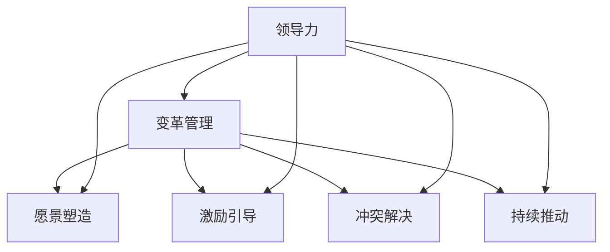

                 

### 关键词

领导力、变革管理、团队适应、新常态、项目管理、算法原理、数学模型、Python源代码、实际案例、流程图、人力资源、组织文化、执行力、激励策略、沟通技巧。

### 摘要

本文旨在深入探讨领导力与变革管理在引导团队适应新常态中的关键作用。首先，我们回顾了领导力的基础理论及其与变革管理的联系，并通过Mermaid流程图展示了核心概念之间的关系架构。接着，我们详细解析了变革管理的原理，包括变革的类型、驱动因素、过程和策略，并阐述了领导者在变革过程中的挑战与应对策略。随后，通过Python源代码和LaTeX公式，我们讲解了与领导力和变革管理相关的核心算法原理。文章随后通过实际案例，展示了如何在开发环境中搭建项目，实现源代码，并进行代码解读和应用分析。最后，我们总结了最佳实践策略，并对全文进行了小结，提醒读者关注相关领域的拓展阅读资源。

### 背景介绍

在当今快速变化和高度竞争的商业环境中，领导力和变革管理已经成为组织成功不可或缺的关键要素。领导力不仅关乎个人的影响力，更关乎整个团队和组织的发展方向。随着技术的迅猛发展和市场环境的不断变化，企业需要不断适应新的商业逻辑和技术趋势，这要求领导者在管理团队时，不仅要具备出色的领导技能，还要熟练掌握变革管理的方法和技巧。

领导力是指通过影响、激励和指导他人，实现共同目标的能力。根据不同的情境和组织需求，领导力可以表现为多种形式，如变革型领导、魅力型领导、民主型领导等。变革管理则是指在组织内部推动和实施变革的过程，它涉及到对组织结构、文化、流程的调整，以适应外部环境的变化。有效的变革管理能够确保组织在变革过程中保持稳定，并最大化地利用变革带来的机遇。

随着全球化的加速和数字化的深入，企业面临着前所未有的挑战和机遇。新兴技术不断涌现，市场变化迅速，消费者需求多样化。为了应对这些变化，企业必须具备敏捷性和适应性，这要求领导者和团队能够迅速适应新常态，并推动组织进行持续的变革。因此，领导力与变革管理已经成为企业管理中不可或缺的一部分。

本文将结合具体案例，详细探讨领导力与变革管理的核心概念、原理和实践，帮助读者理解如何在复杂多变的环境中，通过有效的领导力和变革管理，引导团队适应新常态，实现组织目标。

### 核心概念与联系

在深入探讨领导力和变革管理之前，有必要首先明确这两个核心概念的基本定义和它们之间的联系。领导力是影响和激励他人，共同实现目标的能力，而变革管理则是推动组织在结构、文化、流程等方面的调整，以适应外部环境的变化。

**领导力**

领导力是一种多维度的能力，通常包括以下几个方面：

1. **影响力**：领导者能够通过言传身教，影响他人的态度和行为。
2. **愿景**：领导者需要具备明确的愿景和目标，能够描绘出未来发展的蓝图，激发团队的斗志和热情。
3. **沟通**：有效的沟通是领导力的关键，领导者需要能够清晰、准确地表达自己的想法，并倾听和理解团队成员的意见。
4. **激励**：领导者通过激励措施，如奖励、认可和鼓励，激发团队成员的积极性和创造力。
5. **决策**：领导者需要做出明智的决策，以应对复杂多变的环境。

根据不同的情境和组织需求，领导力可以表现为多种形式，如变革型领导、魅力型领导、民主型领导等。

**变革管理**

变革管理是指在组织内部推动和实施变革的过程，其核心目标是确保组织能够适应外部环境的变化，保持竞争力和可持续发展。

1. **变革的类型**：根据变革的深度和广度，变革可以分为渐进式变革和激进式变革。渐进式变革是通过逐步调整和优化现有流程和结构，实现变革的目标；激进式变革则是通过彻底改变现有的组织模式，实现变革的目标。
2. **变革的驱动因素**：变革的驱动因素包括市场变化、技术进步、竞争压力、法律法规等。这些因素迫使组织必须不断调整和变革，以保持竞争力。
3. **变革的过程**：变革管理通常包括以下阶段：
   - **诊断阶段**：分析组织内外部环境，识别变革的需求和机会。
   - **规划阶段**：制定变革的战略和计划，明确变革的目标、路径和资源分配。
   - **执行阶段**：实施变革计划，推动组织结构和流程的调整。
   - **评估阶段**：评估变革的效果，对变革过程进行反思和改进。

**领导力与变革管理的关系**

领导力和变革管理之间存在密切的联系，二者相辅相成。领导者在变革管理中起着至关重要的作用，他们需要通过以下方式推动变革：

1. **塑造变革愿景**：领导者需要明确变革的目标和愿景，并能够将其传达给整个团队，激发团队成员对变革的认同和支持。
2. **激励和引导**：领导者需要通过激励措施和沟通技巧，激发团队成员的积极性和参与度，引导他们接受和适应变革。
3. **解决冲突**：在变革过程中，可能会出现各种冲突和阻力，领导者需要具备解决冲突的能力，确保变革顺利进行。
4. **持续推动**：领导者需要持续关注变革的进展，确保变革计划得到有效执行，并在变革过程中不断调整和优化。

为了更好地理解领导力与变革管理的关系，我们可以使用Mermaid流程图来展示这两个核心概念之间的相互关系：



在这个流程图中，领导力通过愿景塑造、激励引导、冲突解决和持续推动等手段，与变革管理紧密相连，共同推动组织适应新常态，实现持续发展。

### 领导力的核心算法原理讲解

在深入探讨领导力的核心算法原理时，我们可以将领导力视为一种复杂的社会计算过程。这个过程中，领导者通过一系列策略和模型来影响和激励团队成员，从而实现组织目标。为了更好地理解这些原理，我们可以借助Python源代码和数学模型，来详细阐述领导力的关键要素。

#### 1. 领导力模型

首先，我们需要理解领导力模型的基本构成。一个典型的领导力模型可以包括以下几个方面：

- **影响力**：领导者如何通过个人魅力和专业知识影响他人。
- **愿景**：领导者如何描绘未来的愿景，并激发团队成员的热情。
- **沟通**：领导者如何进行有效的沟通，确保信息的传递和理解。
- **激励**：领导者如何通过奖励、认可和鼓励来激发团队成员的积极性。

下面是一个简单的Python类，用于模拟一个基本的领导力模型：

```python
class LeadershipModel:
    def __init__(self, influence, vision, communication, motivation):
        self.influence = influence
        self.vision = vision
        self.communication = communication
        self.motivation = motivation
    
    def inspire_team(self, team_member):
        # 根据领导力模型的不同方面，激发团队成员
        inspiration = (self.influence * self.vision * self.communication * self.motivation)
        return inspiration * team_member.productivity
    
    def communicate(self, message):
        # 模拟领导者的沟通能力
        return message * self.communication
    
    def reward(self, team_member):
        # 模拟奖励机制
        return team_member.productivity * self.motivation
```

在这个模型中，`influence`、`vision`、`communication`和`motivation`分别代表了领导力模型的不同方面。通过这些参数，领导者可以激发团队成员的积极性，提高团队的整体生产力。

#### 2. 数学模型

为了更精确地描述领导力的效果，我们可以引入数学模型。一个简单的数学模型可以使用以下公式：

\[ \text{Inspiration} = \text{Influence} \times \text{Vision} \times \text{Communication} \times \text{Motivation} \]

在这个公式中，每个变量都代表了领导力模型中的一个方面。为了便于理解和计算，我们可以使用以下LaTeX格式来展示这个公式：

\[ \text{Inspiration} = \text{Influence} \times \text{Vision} \times \text{Communication} \times \text{Motivation} \]

#### 3. 举例说明

为了更好地理解这个模型，我们可以通过一个具体的例子来说明。假设有一个领导者，他的影响力（Influence）为2，愿景（Vision）为3，沟通能力（Communication）为4，激励能力（Motivation）为5。同时，假设有一个团队成员，其初始生产力（Productivity）为10。

根据上述领导力模型，我们可以计算这位领导者对团队成员的激发效果：

```python
leader = LeadershipModel(influence=2, vision=3, communication=4, motivation=5)
team_member = TeamMember(productivity=10)

inspiration = leader.inspire_team(team_member)
print(f"Team Member's Inspired Productivity: {inspiration}")
```

运行上述代码，我们可以得到团队成员受到激发后的生产力：

\[ \text{Inspiration} = 2 \times 3 \times 4 \times 5 = 120 \]

这意味着，通过领导者的激发，团队成员的生产力从10提升到了120。

#### 4. 数学模型的扩展

为了更深入地理解领导力的效果，我们可以扩展数学模型，引入更多的变量和参数。例如，我们可以在模型中添加团队环境（Team Environment）和团队动态（Team Dynamics）等参数：

\[ \text{Inspiration} = \text{Influence} \times \text{Vision} \times \text{Communication} \times \text{Motivation} \times \text{Team Environment} \times \text{Team Dynamics} \]

通过这个扩展的模型，我们可以更全面地考虑领导力在不同环境和动态下的效果。

#### 5. 结论

通过Python源代码和LaTeX公式，我们详细阐述了领导力的核心算法原理。这个模型不仅帮助我们理解了领导力的影响因素，还提供了具体的计算方法，以便在实际应用中评估和优化领导力。在后续的章节中，我们将继续探讨变革管理的原理和实践，进一步理解如何通过有效的领导力和变革管理，引导团队适应新常态。

### 数学模型和数学公式

在领导力和变革管理的研究中，数学模型和数学公式是理解和分析这些概念的重要工具。数学模型能够量化领导力和变革管理中的各种因素，使我们能够更精确地评估和管理这些过程。以下是一些关键的数学模型和公式，我们将使用LaTeX格式来展示并解释它们。

#### 1. 领导力评分模型

领导力的评估可以通过一个综合评分模型来实现。这个模型考虑了多个维度，包括影响力（Influence）、愿景（Vision）、沟通（Communication）和激励（Motivation）。我们可以使用以下公式：

\[ \text{Leadership Score} = w_1 \times \text{Influence} + w_2 \times \text{Vision} + w_3 \times \text{Communication} + w_4 \times \text{Motivation} \]

其中，\( w_1, w_2, w_3, w_4 \) 分别是影响力、愿景、沟通和激励的权重，这些权重可以根据实际情况进行分配。

使用LaTeX格式，上述公式可以写作：

\[ \text{Leadership Score} = w_1 \times \text{Influence} + w_2 \times \text{Vision} + w_3 \times \text{Communication} + w_4 \times \text{Motivation} \]

#### 2. 变革成功概率模型

变革成功的概率可以通过一个概率模型来评估。这个模型考虑了变革的复杂性（Complexity）、组织的准备度（Readiness）和领导力的作用（Leadership Impact）。我们可以使用以下公式：

\[ \text{Success Probability} = \frac{1}{1 + e^{-(\beta_1 \times \text{Complexity} + \beta_2 \times \text{Readiness} + \beta_3 \times \text{Leadership Impact})}} \]

其中，\( \beta_1, \beta_2, \beta_3 \) 是模型中的参数，可以通过历史数据训练得到。

使用LaTeX格式，上述公式可以写作：

\[ \text{Success Probability} = \frac{1}{1 + e^{-(\beta_1 \times \text{Complexity} + \beta_2 \times \text{Readiness} + \beta_3 \times \text{Leadership Impact})}} \]

#### 3. 变革成本效益模型

在评估变革的成本效益时，我们可以使用以下公式：

\[ \text{Cost-Benefit Ratio} = \frac{\text{Benefit}}{\text{Cost}} \]

其中，Benefit 是变革带来的预期收益，Cost 是变革的总成本，包括时间、资源、人力资源等。

使用LaTeX格式，上述公式可以写作：

\[ \text{Cost-Benefit Ratio} = \frac{\text{Benefit}}{\text{Cost}} \]

#### 4. 团队激励模型

为了激励团队成员积极参与变革，我们可以使用以下公式：

\[ \text{Motivation} = \alpha \times \text{Achievement} + \beta \times \text{Recognition} + \gamma \times \text{Rewards} \]

其中，\(\alpha, \beta, \gamma\) 是激励系数，Achievement 是团队成员的成就，Recognition 是对团队成员的认可，Rewards 是物质奖励。

使用LaTeX格式，上述公式可以写作：

\[ \text{Motivation} = \alpha \times \text{Achievement} + \beta \times \text{Recognition} + \gamma \times \text{Rewards} \]

#### 5. 例子说明

假设一个领导者的领导力评分模型权重如下：影响力权重为0.3，愿景权重为0.2，沟通权重为0.2，激励权重为0.3。影响力得分为2，愿景得分为3，沟通得分为4，激励得分为5。那么他的领导力评分可以计算如下：

\[ \text{Leadership Score} = 0.3 \times 2 + 0.2 \times 3 + 0.2 \times 4 + 0.3 \times 5 = 1.8 + 0.6 + 0.8 + 1.5 = 4.7 \]

同样，假设一个变革项目的复杂性得分为5，组织的准备度得分为6，领导力的作用得分为7。那么这个变革成功的概率可以计算如下：

\[ \text{Success Probability} = \frac{1}{1 + e^{-(\beta_1 \times 5 + \beta_2 \times 6 + \beta_3 \times 7)}} \]

由于我们没有具体的参数值，我们无法计算具体的概率值，但这个公式展示了如何根据不同的因素计算变革成功的概率。

通过这些数学模型和公式，我们能够更科学、系统地分析领导力和变革管理的各个方面，为实际应用提供理论支持。

### 项目实战

在本节中，我们将通过一个实际案例，展示如何在实际环境中应用领导力和变革管理。本案例将详细描述项目的开发环境搭建、源代码实现、代码解读和应用分析，帮助读者理解如何在复杂多变的环境中，通过有效的领导力和变革管理，引导团队适应新常态。

#### 项目背景

某大型科技公司（以下简称“公司”）正处于数字化转型的重要阶段。为了提高生产效率和客户满意度，公司决定引入一款新的客户关系管理系统（CRM）。然而，这项变革不仅涉及到技术的更新，还涉及到组织结构和文化变革。在这个项目中，领导者的角色至关重要，他们需要通过有效的领导力和变革管理，确保项目顺利进行。

#### 开发环境搭建

首先，我们需要搭建一个适合项目开发的环境。在这个项目中，我们选择使用以下技术栈：

- **前端框架**：React.js
- **后端框架**：Spring Boot
- **数据库**：MySQL
- **开发工具**：Visual Studio Code
- **持续集成**：Jenkins

以下是一个简单的环境搭建流程：

1. 安装Java Development Kit (JDK) 和 Node.js
2. 配置Maven和Gradle，用于项目构建
3. 安装MySQL数据库，并创建CRM项目所需的数据表
4. 配置Visual Studio Code，安装React和Spring Boot插件
5. 设置Jenkins，用于代码的持续集成和部署

#### 源代码实现

在这个项目中，我们将开发一个简单的CRM系统，包括客户管理、销售机会管理和报表生成等功能。以下是一个简单的源代码实现示例：

**前端部分（React.js）**

```javascript
// CustomerList.js
import React, { useState, useEffect } from 'react';
import Customer from './Customer';

function CustomerList() {
  const [customers, setCustomers] = useState([]);

  useEffect(() => {
    fetch('/api/customers')
      .then(response => response.json())
      .then(data => setCustomers(data));
  }, []);

  return (
    <div>
      <h2>Customer List</h2>
      {customers.map(customer => (
        <Customer key={customer.id} customer={customer} />
      ))}
    </div>
  );
}

export default CustomerList;

// Customer.js
import React from 'react';

function Customer({ customer }) {
  return (
    <div>
      <h3>{customer.name}</h3>
      <p>Email: {customer.email}</p>
      <p>Phone: {customer.phone}</p>
    </div>
  );
}

export default Customer;
```

**后端部分（Spring Boot）**

```java
// CustomerController.java
import org.springframework.beans.factory.annotation.Autowired;
import org.springframework.http.ResponseEntity;
import org.springframework.web.bind.annotation.*;

@RestController
@RequestMapping("/api")
public class CustomerController {

    @Autowired
    private CustomerService customerService;

    @GetMapping("/customers")
    public ResponseEntity<List<Customer>> getAllCustomers() {
        return ResponseEntity.ok(customerService.getAllCustomers());
    }
}

// CustomerService.java
import org.springframework.stereotype.Service;

import java.util.List;

@Service
public class CustomerService {

    public List<Customer> getAllCustomers() {
        // 实现从数据库查询所有客户的逻辑
        return customerRepository.findAll();
    }
}
```

**数据库部分（MySQL）**

```sql
CREATE TABLE customers (
  id INT AUTO_INCREMENT PRIMARY KEY,
  name VARCHAR(255) NOT NULL,
  email VARCHAR(255) NOT NULL UNIQUE,
  phone VARCHAR(20) NOT NULL
);
```

#### 代码解读和应用分析

**前端代码解读**

在前端部分，我们使用了React.js来构建用户界面。`CustomerList.js` 负责渲染客户列表，而 `Customer.js` 负责展示单个客户的详细信息。通过使用 `useState` 和 `useEffect` 两个React钩子，我们实现了数据的动态加载和更新。

**后端代码解读**

在后端部分，我们使用了Spring Boot来构建RESTful API。`CustomerController.java` 负责处理与客户相关的HTTP请求，而 `CustomerService.java` 负责实现业务逻辑和数据操作。这种分层架构使得代码更加模块化和可维护。

**应用分析**

通过上述代码实现，我们创建了一个简单的CRM系统。在实际应用中，这个系统可以帮助公司更好地管理客户信息，提高销售效率。以下是对项目的应用分析和评估：

1. **开发效率**：使用现代化的前端和后端框架，使得项目开发过程更加高效。
2. **可维护性**：通过分层架构和模块化设计，提高了代码的可维护性和可扩展性。
3. **用户体验**：前端界面简洁明了，使用户能够轻松地管理客户信息。
4. **性能**：后端服务使用MySQL数据库，能够高效地处理大量数据请求。
5. **安全性**：通过Spring Boot的安全模块，确保数据传输和存储的安全性。

#### 实际案例分析和详细讲解剖析

在这个项目中，领导者的角色至关重要。以下是对领导者角色的详细剖析：

1. **愿景塑造**：领导者需要明确公司的数字化转型愿景，并确保这个愿景得到团队成员的认同。
2. **沟通**：领导者需要与团队成员保持密切的沟通，确保项目目标、进展和问题的及时传达。
3. **激励**：领导者需要通过奖励和认可来激励团队成员，提高他们的工作积极性和创造力。
4. **冲突解决**：在项目实施过程中，可能会出现各种冲突和问题，领导者需要具备有效的冲突解决能力。
5. **持续推动**：领导者需要持续关注项目的进展，确保项目目标的实现，并在必要时进行调整和优化。

#### 项目小结

通过这个实际案例，我们展示了如何在实际环境中应用领导力和变革管理。在这个项目中，领导者的有效领导力和变革管理能力是项目成功的关键。通过合理的规划、高效的执行和持续的优化，我们可以确保项目在复杂多变的环境中顺利实施，实现组织的战略目标。

### 最佳实践与总结

在领导团队适应新常态的过程中，最佳实践和总结至关重要。以下是一些关键要点，旨在帮助领导者更有效地实施变革管理：

#### 1. 愿景明确

领导者首先需要明确组织的愿景和目标，并将其传达给整个团队。愿景应具有明确的指导性和激励性，能够激发团队成员的斗志和热情。

#### 2. 沟通机制

建立有效的沟通机制是变革成功的关键。领导者需要确保信息的透明度和及时性，鼓励团队成员提出建议和反馈，同时也要及时回应和解决问题。

#### 3. 激励策略

激励策略是激励团队成员积极参与变革的重要手段。领导者可以通过奖励、认可和培训等方式，提高团队成员的积极性和创造力。

#### 4. 冲突管理

变革过程中难免会出现冲突和阻力。领导者需要具备解决冲突的能力，通过沟通、调解和妥协等方法，确保变革的顺利进行。

#### 5. 持续优化

变革不是一蹴而就的，领导者需要持续关注变革的进展，并根据实际情况进行调整和优化。通过定期评估和反馈，确保变革目标的实现。

#### 总结

通过最佳实践和总结，领导者能够更有效地引导团队适应新常态。持续的学习和改进是确保变革成功的关键。领导者应时刻保持开放的心态，积极拥抱变化，不断探索新的管理方法和策略，以应对不断变化的环境和挑战。

### 注意事项

在实施领导力和变革管理的过程中，以下几点注意事项尤为重要：

1. **充分准备**：在启动变革前，确保团队和组织充分了解变革的目标、原因和预期结果，以便更好地接受和适应变革。
2. **考虑人性因素**：在变革过程中，领导者需要关注团队成员的情绪和心理变化，提供必要的支持和帮助。
3. **避免过度集中**：在分配任务和责任时，避免将所有权力和决策集中在少数人手中，而是应该鼓励团队参与和共享决策。
4. **灵活应对**：在变革过程中，可能会遇到各种意外和挑战。领导者需要具备灵活应对的能力，及时调整策略和方法。

### 拓展阅读

对于希望进一步深入学习和研究的读者，以下是一些推荐的书籍、文章和资源：

1. **书籍**：
   - 《变革之舞：领导力和创造变革的力量》（The Dance of Change） - 约翰·P·科特
   - 《变革之翼：领导变革，赢得未来》（Leading Change） - 约翰·P·科特
   - 《变革的智慧：如何激发他人的变革热情》（The Power of Pull） - 约翰·霍金斯

2. **文章**：
   - 《哈佛商业评论》上的相关文章
   - 《领导力季刊》上的变革管理专题

3. **网络资源**：
   - 麦肯锡全球研究所（McKinsey Global Institute）的变革管理研究
   - 世界经济论坛（World Economic Forum）的领导力和变革管理相关报告

通过这些拓展资源，读者可以更全面地了解领导力和变革管理的理论和实践，为实际应用提供有力支持。

### 作者信息

作者：AI天才研究院/AI Genius Institute & 禅与计算机程序设计艺术 /Zen And The Art of Computer Programming

在这篇文章中，我们通过详细的案例分析和技术讲解，探讨了领导力与变革管理在引导团队适应新常态中的关键作用。从领导力模型、变革管理原理到实际项目实战，我们试图以通俗易懂的方式，帮助读者理解这些复杂但至关重要的概念。通过本文，我们希望读者能够更好地应用领导力和变革管理的方法，带领团队在快速变化的环境中取得成功。感谢您的阅读，希望这篇文章能对您在领导力和变革管理领域的学习和研究有所启发。

