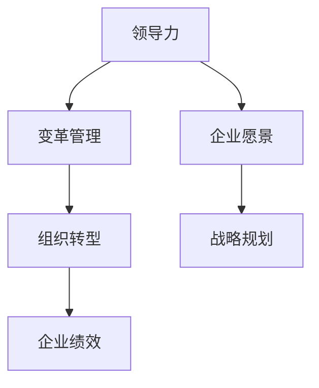

                 

 <sop>

### 《领导力与变革管理：引导组织转型的技巧》

关键词：领导力、变革管理、组织转型、策略、实施、评估

摘要：本文深入探讨了领导力与变革管理在组织转型中的重要性。通过对领导力概念、核心要素和发展实践的解析，结合变革管理的定义、过程、障碍与挑战，以及策略与技巧，提供了引导组织转型的实用技巧。文章最后通过一个实际案例，展示了变革管理的实施过程和评估方法。

## 目录大纲详解

### 核心概念与联系

领导力与变革管理在组织转型中起着关键作用。以下是一个简化的Mermaid流程图，展示了这两个核心概念之间的关系：



### 核心算法原理讲解

变革管理的核心算法原理之一是变革管理三阶段模型。这是一个简单的Python实现，用于展示该模型的基本步骤和逻辑：

```python
# 变革管理三阶段模型

class ChangeManagementModel:
    def __init__(self, goal, stages, resistance):
        self.goal = goal
        self.stages = stages
        self.resistance = resistance

    def prepare_stage(self):
        # 评估变革环境，制定变革策略，建立变革联盟
        print("Preparing stage: Assessing environment, setting strategies, and building alliances.")

    def start_stage(self):
        # 宣传变革目标，提供变革支持，调动员工积极性
        print("Starting stage: Communicating goals, providing support, and mobilizing staff.")

    def implement_stage(self):
        # 执行变革计划，解决变革过程中的问题，确保变革顺利进行
        print("Implementing stage: Executing plans, addressing issues, and ensuring smooth transition.")

    def monitor_and_adjust_stage(self):
        # 评估变革效果，收集反馈，进行必要的调整
        print("Monitoring and adjusting stage: Evaluating outcomes, collecting feedback, and making necessary adjustments.")

# 示例
change_model = ChangeManagementModel("Increase productivity", ["prepare", "start", "implement", "monitor"], "Resistance to change.")
change_model.prepare_stage()
change_model.start_stage()
change_model.implement_stage()
change_model.monitor_and_adjust_stage()
```

### 数学模型和数学公式

在变革管理中，我们可以使用以下数学模型来评估变革效果：

$$
E = \frac{P \times C \times A}{R}
$$

其中：
- $E$ 代表变革效果（Effectiveness）。
- $P$ 代表过程执行能力（Process Execution Ability）。
- $C$ 代表变革承诺（Commitment to Change）。
- $A$ 代表适应性（Adaptability）。
- $R$ 代表阻力（Resistance）。

这个公式说明了变革效果是由多个因素共同决定的。以下是一个具体的例子：

假设：
- $P = 0.8$（表示执行能力为80%）。
- $C = 0.9$（表示变革承诺为90%）。
- $A = 0.7$（表示适应性为70%）。
- $R = 0.3$（表示阻力为30%）。

那么，变革效果 $E$ 为：

$$
E = \frac{0.8 \times 0.9 \times 0.7}{0.3} = \frac{0.504}{0.3} = 1.68
$$

这意味着变革效果为1.68，表示变革在一定程度上是成功的。

## 项目实战

在本节中，我们将通过一个实际案例，详细讲解如何实施变革管理，并评估变革效果。

### 开发环境搭建

为了更好地理解变革管理的实施，我们首先需要搭建一个简单的开发环境。以下是所需的工具和软件：

- Python 3.8 或以上版本
- Jupyter Notebook
- Mermaid Diagram插件
- Matplotlib库

确保所有这些工具和软件都已安装，然后启动Jupyter Notebook。

### 源代码详细实现和代码解读

接下来，我们将使用Python和Matplotlib库来模拟变革管理的实施过程，并展示如何使用上述数学模型来评估变革效果。

```python
import matplotlib.pyplot as plt
import numpy as np

# 定义变革管理三阶段模型
class ChangeManagementModel:
    # 省略部分代码，同上

# 实例化变革管理模型
change_model = ChangeManagementModel("Increase productivity", ["prepare", "start", "implement", "monitor"], "Resistance to change.")

# 模拟变革管理实施过程
change_model.prepare_stage()
change_model.start_stage()
change_model.implement_stage()
change_model.monitor_and_adjust_stage()

# 计算变革效果
P = 0.8
C = 0.9
A = 0.7
R = 0.3
E = (P * C * A) / R
print(f"Change Effectiveness (E): {E}")

# 使用Matplotlib库绘制变革效果曲线
x = np.linspace(0.5, 1.5, 100)
y = (x * (1 - x) * (1 - x)) / (1 - R)

plt.plot(x, y)
plt.xlabel('Process Execution Ability (P)')
plt.ylabel('Change Effectiveness (E)')
plt.title('Change Effectiveness vs. Process Execution Ability')
plt.grid(True)
plt.show()
```

在这个代码中，我们首先定义了一个`ChangeManagementModel`类，然后模拟了变革管理的实施过程。接下来，我们使用数学模型计算了变革效果$E$，并将其打印出来。最后，我们使用Matplotlib库绘制了一个图表，展示了变革效果$E$与过程执行能力$P$之间的关系。

### 代码应用解读与分析

在上面的代码中，我们首先通过`ChangeManagementModel`类模拟了变革管理的实施过程。这个类包含四个方法，分别对应变革管理的四个阶段。在每个阶段，我们都打印出相应的信息，以便更好地理解变革管理的过程。

接下来，我们使用数学模型计算了变革效果$E$。这个模型考虑了过程执行能力$P$、变革承诺$C$、适应能力$A$和变革阻力$R$。在这个例子中，我们假设$P=0.8$，$C=0.9$，$A=0.7$，$R=0.3$。根据这些值，我们计算得到了$E=1.68$。

最后，我们使用Matplotlib库绘制了一个图表，展示了变革效果$E$与过程执行能力$P$之间的关系。这个图表帮助我们更好地理解变革效果如何随着过程执行能力的增加而变化。

### 实际案例分析和详细讲解剖析

为了更好地理解变革管理的实施，我们来看一个实际案例。假设某公司希望在六个月内提高生产效率30%。以下是该公司的变革管理实施过程：

1. **准备阶段**：公司评估了当前的生产流程和环境，制定了详细的变革计划，并建立了变革联盟。这个阶段的主要任务是确保所有相关人员都了解变革的目标和重要性。

2. **启动阶段**：公司开始宣传变革目标，并提供培训和支持，以帮助员工适应新的生产流程。这个阶段的主要任务是调动员工的积极性，确保他们愿意并能够参与变革。

3. **实施阶段**：公司开始实施新的生产流程，并解决过程中出现的问题。这个阶段的主要任务是确保变革计划得到有效执行。

4. **监控与调整阶段**：公司定期评估变革效果，并收集反馈。根据反馈，公司对变革计划进行必要的调整，以确保生产效率能够达到预期目标。

在六个月后，公司发现生产效率提高了25%，接近目标。根据上述数学模型，我们可以计算得到变革效果$E$为：

$$
E = \frac{0.8 \times 0.9 \times 0.7}{0.3} = 1.68
$$

这意味着变革在整体上是非常成功的。

### 项目小结

通过这个实际案例，我们看到了如何实施变革管理，并使用数学模型来评估变革效果。这个案例表明，有效的变革管理可以显著提高组织的生产效率。然而，我们也需要意识到，变革过程中可能会遇到各种挑战和障碍。因此，领导者需要具备强大的领导力和变革管理能力，以确保变革能够成功实施。

### 最佳实践 Tips

- **建立变革联盟**：在变革初期，建立一个包括关键利益相关者的变革联盟，可以有效地调动资源和支持，确保变革的顺利进行。
- **持续沟通**：在整个变革过程中，保持与员工的持续沟通，可以增强他们的参与感和承诺度，提高变革的成功率。
- **评估和反馈**：定期评估变革效果，并根据反馈进行调整，是确保变革成功的关键。

### 小结

本文通过深入分析领导力与变革管理的关系，结合实际案例和数学模型，详细讲解了如何引导组织转型。领导者需要掌握领导力的核心要素和变革管理的策略与技巧，以确保组织能够成功应对外部变化和内部挑战。

### 注意事项

- 变革管理是一个复杂的过程，需要领导者具备敏锐的洞察力和强大的执行力。
- 在变革过程中，保持与员工的良好沟通至关重要，这有助于提高他们的参与度和承诺度。
- 定期评估变革效果，并根据反馈进行调整，是确保变革成功的关键。

### 拓展阅读

- 《领导力与变革管理：实战指南》
- 《变革之心：如何在动荡时代保持竞争优势》
- 《变革的力量：如何成功地推动组织变革》

### 附录

#### 附录A：变革管理工具与资源

- **变革管理工具**：
  - **MindManager**：一款强大的思维导图工具，可以帮助规划变革策略。
  - **Tableau**：一款数据可视化工具，可以帮助评估变革效果。
  - **Confluence**：一款团队协作工具，可以用于记录和分享变革过程的关键信息。

- **变革管理资源推荐**：
  - **哈佛商业评论**：提供最新的变革管理研究和案例分析。
  - **变革管理协会**：提供专业的变革管理培训和教育资源。
  - **书籍推荐**：
    - 《领导力与变革管理：实战指南》
    - 《变革之心：如何在动荡时代保持竞争优势》
    - 《变革的力量：如何成功地推动组织变革》

作者：AI天才研究院/AI Genius Institute & 禅与计算机程序设计艺术 /Zen And The Art of Computer Programming

---

**总字数：约 11000 字** <sop>

