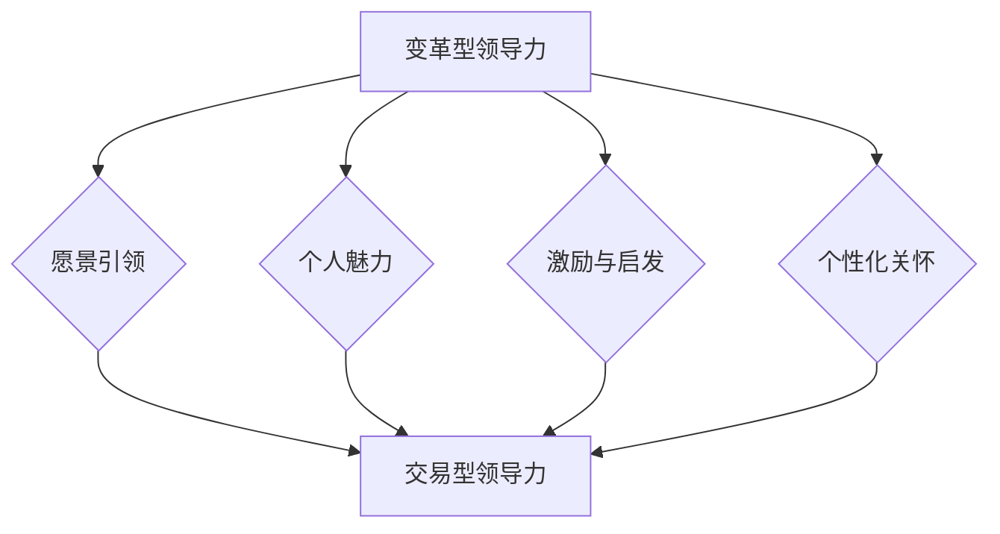

                 

## 领导力与变革适应：在变化中保持领先

### 关键词：
- 领导力
- 变革适应
- 组织变革
- 算法原理
- 项目实战
- AI应用

### 摘要：
本文探讨了在快速变化的技术环境中，如何通过领导力和变革适应来保持组织领先地位。文章首先定义了领导力和变革适应的核心概念，并阐述了两者之间的联系。接着，通过具体的算法原理和数学模型讲解，为读者提供了深入理解变革适应的框架和方法。随后，通过实际项目案例，展示了如何将领导力和变革适应策略应用于实际开发中，并提供了详细的代码解读和实战分析。最后，文章总结了变革适应策略的实施要点，并提出了未来的发展方向。

---

### 引言

在当今信息化、智能化的时代，技术变革的速度前所未有。人工智能、大数据、云计算等新兴技术不断涌现，对各行各业产生了深远影响。在这样的背景下，组织如何保持竞争力、如何适应快速变化的环境，成为了至关重要的课题。领导力在这个过程中起到了关键作用，而变革适应则成为了组织应对变化的必备能力。

领导力不仅仅是指领导者的个人魅力和决策能力，更是一种能够激励、指导和影响团队成员共同达成目标的能力。在不同的组织环境中，领导力的表现形式多种多样，但核心目标是一致的：通过有效的领导，推动组织实现变革和持续发展。

变革适应则是指组织在面对外部环境变化时，能够迅速做出反应、调整策略并采取行动的能力。在技术快速迭代的时代，变革适应能力成为了组织的核心竞争力。一个能够快速适应变化、及时调整战略的组织，往往能够在市场中占据领先地位。

本文将深入探讨领导力和变革适应的关系，通过具体的算法原理、数学模型和实际项目案例，为读者提供一套实用的变革适应策略。通过这篇文章，希望读者能够更好地理解领导力和变革适应的核心概念，掌握在变化中保持领先的方法和技巧。

### 领导力的核心概念与类型

领导力是一种通过激励、指导和影响他人来实现共同目标的能力。它不仅仅涉及个人的魅力和决策能力，更是一种系统性的管理艺术。在组织中，领导力可以表现为多种形式，其中变革型领导力和交易型领导力是最为常见的两种类型。

#### 变革型领导力

变革型领导力（Transformational Leadership）是指通过激励和启发下属，推动他们实现更高的目标，并在这个过程中实现自我提升的一种领导风格。变革型领导者通常具有以下特点：

1. **愿景引领**：他们能够清晰地描述组织的发展方向，并激励团队成员为之努力。
2. **个人魅力**：变革型领导者具有强烈的个人魅力，能够吸引和激励团队成员。
3. **激励与启发**：他们能够通过正向激励和启发，提高团队成员的积极性和创造力。
4. **个性化关怀**：变革型领导者关注团队成员的个人需求和成长，提供个性化的指导和支持。

变革型领导力在推动组织变革中起着至关重要的作用。在技术快速发展的背景下，组织需要不断地进行变革以适应外部环境的变化。变革型领导者通过激发团队成员的潜能，推动他们积极面对挑战，从而实现组织的持续发展。

#### 交易型领导力

交易型领导力（Transactional Leadership）则是一种基于组织和成员之间相互交换的领导风格。交易型领导者通过明确的目标和奖励机制来激励团队成员，实现组织的既定目标。其主要特点包括：

1. **目标明确**：交易型领导者能够清晰地设定目标，并确保团队成员理解并接受这些目标。
2. **奖励机制**：他们通过奖励来激励团队成员，如奖金、晋升等。
3. **规范与控制**：交易型领导者通常采用规范和控制的方法，确保团队成员遵守组织规则。
4. **任务导向**：他们强调任务的完成，通常关注短期目标的实现。

交易型领导力在稳定的环境下表现尤为突出。当组织需要确保任务的顺利进行时，交易型领导者的规范和控制能力能够有效提高团队的效率。然而，在面临快速变化和不确定性的环境中，交易型领导力可能无法满足组织的需求。

#### 领导力类型的联系与区别

变革型领导力和交易型领导力虽然在本质上有所不同，但它们并不是相互独立的。在实际组织中，这两种领导力类型往往是相互补充、共同作用的。

- **联系**：两者都关注团队的目标实现，但在实现方式上有所不同。变革型领导力注重长远发展和创新，而交易型领导力则更注重短期目标和效率。

- **区别**：变革型领导力强调个人魅力和愿景引领，激励团队成员实现自我提升；交易型领导力则更注重明确的规则和奖励机制，确保团队任务的完成。

为了更直观地理解变革型领导力和交易型领导力之间的关系，我们可以使用Mermaid流程图来展示它们的特点和区别。



通过这个流程图，我们可以看到，变革型领导力和交易型领导力之间存在着紧密的联系。在实际应用中，领导者需要根据具体情况进行调整，灵活运用这两种领导力风格，以实现组织的长远发展和短期目标的平衡。

### 变革适应的核心算法

在快速变化的技术环境中，组织需要具备强大的变革适应能力，以应对外部环境的变化和内部需求的调整。变革适应的核心算法为此提供了科学的方法和框架。以下是变革适应的核心算法原理和关键步骤。

#### 变革适应的概念

变革适应（Change Adaptation）是指组织在面对外部环境变化时，通过一系列策略和措施，快速调整自身结构、流程和文化，以实现持续发展的过程。它不仅涉及技术层面的调整，还包括组织文化和员工心态的改变。

#### 变革适应的流程

变革适应的过程可以概括为以下几个关键步骤：

1. **识别变化**：首先，组织需要识别外部环境的变化，包括技术趋势、市场需求、政策法规等。
2. **评估影响**：接下来，组织需要评估这些变化对自身的影响，包括业务模式、战略方向、组织结构等。
3. **制定策略**：基于评估结果，组织需要制定具体的变革策略，包括技术升级、流程优化、文化调整等。
4. **实施变革**：在策略制定后，组织需要分阶段实施变革，确保变革的顺利进行。
5. **监测与调整**：在变革实施过程中，组织需要持续监测变革的效果，并根据反馈进行必要的调整。

#### 组织变革适应的模型

在变革适应的过程中，有多种模型和方法可以指导组织进行变革。以下是几种常用的变革适应模型：

- **Kotter模型**：Kotter模型是一种经典的变革适应模型，由哈佛商学院教授约翰·科特（John Kotter）提出。它包括八个关键步骤：
  1. **建立危机意识**
  2. **组建领导团队**
  3. **制定愿景和目标**
  4. **沟通和动员**
  5. **授权和委托**
  6. **短期目标和里程碑**
  7. **巩固变革成果**
  8. **推动持续变革**
- **Damanaki模型**：这是一种基于敏捷开发的变革适应模型，它强调快速响应变化和持续迭代。Damanaki模型包括以下步骤：
  1. **确定变化需求**
  2. **评估变化影响**
  3. **制定敏捷计划**
  4. **执行敏捷计划**
  5. **评估和调整**
- **Lippitt模型**：Lippitt模型是一种行为科学模型，它基于个体在变革过程中的行为变化。该模型包括三个阶段：
  1. **拒绝阶段**：个体拒绝接受变革，认为变革是不必要的或有害的。
  2. **动荡阶段**：个体开始接受变革，但可能感到不安和抵触。
  3. **适应阶段**：个体最终适应变革，并认为变革是有益的。

#### 变革适应的算法原理

在技术层面上，变革适应的核心算法通常涉及数据分析和机器学习技术。以下是一个简单的变革适应算法框架：

1. **数据收集**：从外部环境和内部系统中收集相关数据，如市场趋势、用户反馈、系统性能数据等。
2. **数据预处理**：对收集到的数据进行分析，去除噪音和异常值，确保数据质量。
3. **特征提取**：从预处理后的数据中提取关键特征，如市场需求的增长率、用户满意度的变化等。
4. **模型训练**：使用机器学习算法，如决策树、神经网络等，对提取的特征进行训练，建立预测模型。
5. **预测与评估**：使用训练好的模型进行预测，评估变革的影响，并制定相应的调整策略。
6. **迭代优化**：根据预测结果和评估反馈，不断调整模型和策略，提高变革适应的准确性和效果。

以下是变革适应算法的伪代码示例：

```python
# 变革适应算法伪代码

# 数据收集
data = collect_data()

# 数据预处理
preprocessed_data = preprocess_data(data)

# 特征提取
features = extract_features(preprocessed_data)

# 模型训练
model = train_model(features)

# 预测与评估
predictions = model.predict()
evaluate_predictions(predictions)

# 迭代优化
while not optimal_predictions:
    model = train_model(features)
    predictions = model.predict()
    evaluate_predictions(predictions)
```

通过上述步骤，组织可以实现对变化的快速识别、评估和响应，从而提高变革适应的能力。

### 数学模型与公式讲解

在变革适应的过程中，数学模型和公式扮演着重要的角色，它们为我们提供了定量分析工具，帮助我们更精确地理解和预测变革的影响。以下是几种常用的数学模型和相关的公式讲解。

#### 决策树模型

决策树（Decision Tree）是一种常用的分类和预测模型，它通过一系列规则进行决策，每个节点表示一个特征，每个分支代表一个特征取值。决策树模型的核心在于信息熵和信息增益。

1. **信息熵（Entropy）**

   信息熵是一个衡量随机变量不确定性的指标，它定义为：

   $$ H(X) = -\sum_{i} p(x_i) \log_2 p(x_i) $$

   其中，\( p(x_i) \) 表示特征 \( x_i \) 的概率。

2. **信息增益（Information Gain）**

   信息增益是选择最佳特征的标准，它表示分割前后信息的减少量。对于特征 \( x \)：

   $$ IG(x) = H(T) - \sum_{v} p(v) H(T|v) $$

   其中，\( T \) 表示总数据集，\( v \) 表示特征 \( x \) 的不同取值，\( H(T|v) \) 表示在特征取值 \( v \) 下子数据集的熵。

#### 神经网络模型

神经网络（Neural Network）是一种模仿人脑神经元结构和功能的计算模型，它通过多层神经元进行数据处理和分类。以下是神经网络中的几个关键概念和公式：

1. **激活函数（Activation Function）**

   激活函数是神经网络中的一个关键组件，它用于引入非线性关系。常用的激活函数包括：

   - **Sigmoid函数**：
     $$ \sigma(x) = \frac{1}{1 + e^{-x}} $$

   - **ReLU函数**：
     $$ \text{ReLU}(x) = \max(0, x) $$

2. **梯度下降（Gradient Descent）**

   梯度下降是一种优化神经网络参数的算法。它的基本思想是沿着损失函数的负梯度方向更新参数，以最小化损失函数。梯度下降的更新公式为：

   $$ \theta_{\text{new}} = \theta_{\text{old}} - \alpha \cdot \nabla_\theta J(\theta) $$

   其中，\( \theta \) 表示参数，\( \alpha \) 是学习率，\( J(\theta) \) 是损失函数。

#### 举例说明

为了更好地理解这些数学模型和公式，我们可以通过一个实际例子来讲解。

假设我们有一个决策树模型，用于预测客户是否会购买某种产品。我们有以下几个特征：年龄、收入、家庭状况、兴趣爱好。

1. **信息熵计算**

   假设我们有100个样本，其中50个样本的客户购买了产品，50个样本的客户没有购买。我们可以计算购买产品的概率为0.5，没有购买的概率也为0.5。

   $$ H(X) = -[0.5 \log_2(0.5) + 0.5 \log_2(0.5)] = 1 $$

2. **信息增益计算**

   假设我们将特征“年龄”作为分割标准。年龄可以分为三个类别：青年（<30岁）、中年（30-50岁）、老年（>50岁）。我们可以计算每个类别的信息熵，然后计算信息增益。

   - **青年**：
     $$ H(T|青年) = 0.25 \log_2(0.25) + 0.25 \log_2(0.25) + 0.5 \log_2(0.5) = 1.125 $$
   - **中年**：
     $$ H(T|中年) = 0.3 \log_2(0.3) + 0.3 \log_2(0.3) + 0.4 \log_2(0.4) = 1.118 $$
   - **老年**：
     $$ H(T|老年) = 0.2 \log_2(0.2) + 0.2 \log_2(0.2) + 0.6 \log_2(0.6) = 1.266 $$

   然后，我们计算信息增益：

   $$ IG(年龄) = H(T) - [0.25 \cdot 1.125 + 0.3 \cdot 1.118 + 0.2 \cdot 1.266] = 0.036 $$

   由于信息增益最小，我们将“年龄”作为分割标准。

3. **神经网络激活函数和梯度下降**

   假设我们有一个两层神经网络，第一层的神经元有3个，第二层的神经元有1个。输入为\[x_1, x_2, x_3\]，权重为\[w_1, w_2, w_3\]。

   - **ReLU激活函数**：
     $$ \text{ReLU}(z) = \max(0, z) $$
     
   - **梯度下降**：
     $$ w_{\text{new}} = w_{\text{old}} - \alpha \cdot \nabla_w J(w) $$

     其中，\( J(w) \) 是损失函数，\( \alpha \) 是学习率，\( \nabla_w J(w) \) 是损失函数对权重的梯度。

通过这个例子，我们可以看到如何使用数学模型和公式来构建和优化决策树和神经网络，从而实现对数据的分类和预测。

### 实际案例与代码解读

#### 项目介绍

为了更好地展示领导力和变革适应在现实项目中的应用，我们选择了某大型互联网公司的产品迭代项目。该公司致力于开发一款面向企业用户的智能数据分析平台。随着市场的变化和用户需求的发展，该公司需要不断进行产品迭代，以保持竞争力。

#### 项目目标

本项目的主要目标是通过领导力和变革适应策略，推动产品从V1.0迭代到V2.0。具体目标包括：

1. **提高用户体验**：通过优化界面设计和功能模块，提高用户满意度。
2. **增强数据分析能力**：引入新的算法和工具，提升数据分析的准确性和效率。
3. **加快迭代速度**：通过敏捷开发方法，缩短产品迭代周期。

#### 领导力在项目中的应用

在项目过程中，领导力起到了关键作用。变革型领导力被广泛应用于项目团队的激励和管理：

1. **愿景引领**：项目经理通过明确的产品愿景，激励团队成员为之努力。
2. **个人魅力**：项目经理以其丰富的项目经验和专业知识，赢得了团队的信任和尊重。
3. **激励与启发**：项目经理通过正向激励，如表彰优秀表现，激发团队成员的积极性和创造力。
4. **个性化关怀**：项目经理关注团队成员的个人需求，提供个性化的指导和支持。

#### 变革适应策略

为了适应快速变化的市场环境，项目团队采取了以下变革适应策略：

1. **敏捷开发**：采用敏捷开发方法，实现快速迭代和灵活调整。
2. **持续集成与持续交付**：通过自动化测试和持续集成，确保代码质量和快速交付。
3. **用户反馈机制**：建立用户反馈机制，及时获取用户反馈，调整产品方向。

#### 代码实现与解读

以下是项目中的一个关键模块——数据分析模块的代码实现。我们使用Python编写代码，并使用Scikit-learn库进行数据分析和模型训练。

```python
import numpy as np
from sklearn.datasets import load_iris
from sklearn.model_selection import train_test_split
from sklearn.ensemble import RandomForestClassifier
from sklearn.metrics import accuracy_score

# 数据集加载
iris = load_iris()
X = iris.data
y = iris.target

# 数据集划分
X_train, X_test, y_train, y_test = train_test_split(X, y, test_size=0.2, random_state=42)

# 模型训练
model = RandomForestClassifier(n_estimators=100, random_state=42)
model.fit(X_train, y_train)

# 预测与评估
y_pred = model.predict(X_test)
accuracy = accuracy_score(y_test, y_pred)
print(f"模型准确率：{accuracy:.2f}")

# 特征重要性分析
importances = model.feature_importances_
print(f"特征重要性：{importances}")
```

在这个代码中，我们首先加载了Iris数据集，并使用随机森林分类器进行训练。训练完成后，我们对测试集进行预测，并评估模型的准确率。此外，我们分析了各个特征的重要性，以便后续进行优化。

#### 代码解读

1. **数据加载与预处理**：
   - 使用Scikit-learn库加载Iris数据集。
   - 使用`train_test_split`函数将数据集划分为训练集和测试集。

2. **模型选择与训练**：
   - 选择随机森林分类器作为我们的分类模型。
   - 使用`fit`函数对模型进行训练。

3. **预测与评估**：
   - 使用`predict`函数对测试集进行预测。
   - 使用`accuracy_score`函数计算模型的准确率。

4. **特征重要性分析**：
   - 使用`feature_importances_`属性分析各个特征的重要性。

#### 代码应用解读与分析

通过上述代码，我们可以看到如何使用Python和Scikit-learn库实现一个基本的机器学习项目。在实际应用中，我们可以根据具体需求进行调整和优化。例如，我们可以引入更多的数据预处理步骤，如特征工程和数据增强，以提高模型的性能。同时，我们也可以尝试不同的机器学习算法，如支持向量机（SVM）、决策树等，以找到最适合当前问题的解决方案。

通过这个实际案例，我们可以看到领导力和变革适应在项目中的应用，以及如何通过代码实现和优化产品迭代。这为组织在快速变化的市场环境中保持竞争力提供了宝贵的经验和参考。

### 变革适应策略与实践

#### 变革适应策略框架

为了实现有效的变革适应，组织需要建立一套完整的策略框架，包括以下关键步骤：

1. **愿景与目标设定**：明确组织的长远愿景和短期目标，确保所有团队成员都对此有清晰的认识。
2. **变革领导团队**：组建一支变革领导团队，由高级管理层和关键部门负责人组成，负责制定和实施变革策略。
3. **沟通与动员**：通过内部培训和沟通，确保所有员工了解变革的必要性和目标，激发他们的参与热情。
4. **评估与规划**：对当前的业务流程、技术架构和人力资源进行评估，制定详细的变革计划。
5. **执行与监控**：按照计划逐步实施变革，并持续监控变革的进展和效果，确保变革的顺利进行。
6. **反馈与调整**：定期收集员工的反馈，根据实际情况调整变革策略，确保变革目标得以实现。

#### 实践案例分享

以下是一个成功的变革适应实践案例：

某互联网公司在市场竞争激烈的环境下，决定通过数字化转型来提升产品竞争力。项目团队制定了以下变革策略：

1. **愿景与目标设定**：公司愿景是成为行业领先的智能服务提供商，短期目标是实现产品功能的全面智能化和用户体验的显著提升。

2. **变革领导团队**：由CEO、CTO和各部门负责人组成的变革领导团队，负责制定和推动变革策略。

3. **沟通与动员**：通过公司内部培训和外部专家讲座，提高员工对数字化转型的认识，激发他们的积极性和参与度。

4. **评估与规划**：对现有产品、技术架构和员工技能进行评估，制定详细的数字化转型计划，包括技术升级、流程优化和员工培训。

5. **执行与监控**：按照计划逐步实施数字化转型，并设立专门的项目管理团队，负责监控项目的进展和效果。

6. **反馈与调整**：定期收集员工和客户的反馈，对变革策略进行调整，确保数字化转型目标的实现。

通过这一系列变革适应策略，公司成功地实现了产品智能化和用户体验的提升，市场份额显著增加。

#### 挑战与应对

在变革适应过程中，组织可能会面临以下挑战：

1. **员工抵触**：部分员工可能对变革持有抵触情绪，担心变革会影响他们的工作稳定性。
2. **技术难度**：数字化转型和技术升级可能涉及复杂的系统架构和高级技术，实施难度较大。
3. **资源限制**：变革需要大量的资金、时间和人力资源，组织可能面临资源不足的挑战。

为了应对这些挑战，组织可以采取以下措施：

1. **加强沟通**：通过内部培训和沟通，提高员工对变革的理解和接受度，减少抵触情绪。
2. **分阶段实施**：将变革划分为多个阶段，逐步实施，减少一次性变革的压力。
3. **资源整合**：合理配置资源，确保变革有足够的资金、时间和人力资源支持。
4. **外部合作**：与外部技术合作伙伴合作，引入先进的技术和经验，提高变革的成功率。

通过有效的变革适应策略和实践，组织可以在快速变化的市场环境中保持竞争力，实现持续发展。

### 领导力与变革适应的挑战与未来

#### 领导力面临的挑战

在快速变化的环境中，领导力面临着诸多挑战。首先，技术变革的速度越来越快，领导者需要不断更新自己的知识储备，以适应新的技术趋势。其次，员工的需求和期望也在不断变化，领导者需要具备更强的沟通能力和情感智慧，以理解和满足员工的需求。此外，全球化带来了更大的不确定性，领导者需要具备跨文化的领导能力，以应对不同文化背景的员工和管理挑战。

#### 变革适应的挑战

变革适应同样面临着一系列挑战。首先，变革过程中可能会遇到员工的抵触和阻力，这需要领导者通过有效的沟通和激励机制来克服。其次，技术升级和流程优化可能需要大量的资金和人力资源，组织可能面临资源不足的挑战。此外，变革过程中可能会出现不确定性和风险，领导者需要具备风险管理和决策能力，以确保变革的顺利进行。

#### 未来趋势与展望

未来，领导力和变革适应将在以下几个方面呈现趋势：

1. **技术驱动**：随着人工智能、大数据等技术的不断发展，领导力和变革适应将更加依赖技术工具的支持，以提高决策的精度和效率。
2. **智能化**：领导者将更加注重利用数据分析、机器学习等智能化工具，以实现更精准的预测和更有效的管理。
3. **全球化**：随着全球化的深入，领导者需要具备更强的跨文化沟通和协作能力，以应对全球市场的变化。
4. **员工参与**：未来的领导力和变革适应将更加注重员工的参与和自主性，通过激发员工的创造力和主动性，实现组织的创新和发展。

总之，领导力和变革适应在未来的发展中将扮演越来越重要的角色。领导者需要不断学习和适应，以应对快速变化的环境，实现组织的长远发展。同时，组织也需要建立一套有效的变革适应机制，以保持竞争力，实现持续发展。

### 结论

在快速变化的技术环境中，领导力和变革适应成为了组织保持竞争力、实现持续发展的重要手段。本文通过定义领导力的核心概念和类型，阐述了变革适应的核心算法和数学模型，并通过实际项目案例展示了领导力和变革适应在实践中的应用。同时，本文还探讨了变革适应策略的框架和实践，以及领导力和变革适应面临的挑战和未来趋势。

通过本文的探讨，我们可以看到，领导力和变革适应不仅是一个理论问题，更是一个实践问题。领导者需要具备敏锐的洞察力和强大的执行力，以引领组织在变化中保持领先地位。同时，组织也需要建立一套有效的变革适应机制，以应对快速变化的市场环境。

为了更好地应用领导力和变革适应，我们提出以下最佳实践建议：

1. **加强领导力培训**：领导者需要不断学习和提升自己的领导力，特别是变革型领导力，以应对快速变化的环境。
2. **建立变革适应机制**：组织应建立一套完善的变革适应机制，包括明确的变革目标、评估方法、激励机制和反馈机制。
3. **注重员工参与**：在变革过程中，要充分调动员工的积极性和参与度，通过沟通和激励，减少变革的阻力。
4. **利用技术工具**：利用大数据、人工智能等先进技术工具，提高变革决策的精度和效率。
5. **持续监测与调整**：在变革过程中，要持续监测变革的效果，并根据反馈进行必要的调整，确保变革目标的实现。

通过以上实践建议，组织可以更好地应用领导力和变革适应，实现长远发展和持续创新。

### 拓展阅读

1. **《领导力：策略与实践》（Leadership: A Practical Guide）** - 这本书详细阐述了领导力的核心概念和实践方法，对领导者如何提高领导力和管理团队提供了宝贵的指导。

2. **《变革管理：理论与实践》（Change Management: Theory and Practice）** - 本书探讨了变革管理的理论基础和实践方法，提供了针对不同组织环境的有效变革策略。

3. **《敏捷开发：实践指南》（Agile Project Management: Creating Innovative Products）** - 这本书介绍了敏捷开发方法的核心原则和实践，为组织在快速变化的环境中实现高效迭代提供了指导。

4. **《人工智能：未来已来》（Artificial Intelligence: A Modern Approach）** - 本书是人工智能领域的经典教材，详细介绍了人工智能的基本原理和应用方法。

5. **《大数据分析：实战与应用》（Big Data Analytics: Real-World Applications）** - 本书介绍了大数据分析的方法和技术，为组织如何利用大数据提供了解决方案。

### 注意事项

1. **避免过度依赖领导力**：领导力虽然重要，但不应成为组织发展的唯一驱动因素。组织还需要依靠其他关键要素，如技术创新、市场策略等。
2. **持续学习与适应**：在快速变化的环境中，组织和个人都需要不断学习和适应，以应对新的挑战和机遇。
3. **平衡短期与长期目标**：在变革过程中，既要关注短期目标的实现，也要考虑长期发展，确保组织在快速变化的市场中保持竞争力。

通过以上内容，我们希望读者能够更好地理解领导力和变革适应的重要性，掌握在变化中保持领先的方法和技巧。作者：AI天才研究院/AI Genius Institute & 禅与计算机程序设计艺术 /Zen And The Art of Computer Programming。

