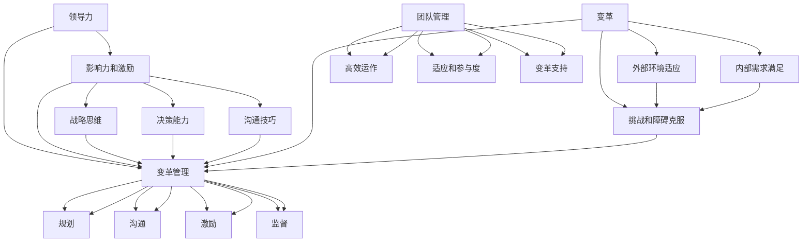

                 

### 背景介绍

在当今快速变化且竞争激烈的商业环境中，企业要想保持竞争优势，就必须不断进行变革。变革不仅包括技术创新、市场策略的调整，还涉及到组织结构、企业文化等多方面的变革。然而，变革并非一帆风顺，常常伴随着挑战和阻力。在这一过程中，领导力成为关键因素，决定了变革的成败。

领导力与变革的关系可以追溯到领导者的角色和责任。领导者不仅是企业的决策者，更是变革的推动者和倡导者。他们需要具备洞察力、决策力、沟通能力和团队管理能力，才能在变革中引导团队、克服障碍，确保变革的顺利进行。因此，领导力在变革中的作用至关重要。

本篇文章旨在探讨领导力在变革中的作用，以及如何通过有效的领导力策略，引导团队度过转型期。我们将首先介绍领导力的基本概念和理论，接着讨论变革管理的基本概念和方法，然后深入探讨团队管理在变革中的角色和策略。此外，还将通过实践案例和挑战与解决部分，提供实际的变革管理经验和策略。最后，文章将总结全书内容并提出未来展望。

通过本文的阅读，读者将能够了解领导力在变革中的重要性，掌握变革管理的基本方法和策略，以及如何在实际工作中运用这些知识，成功引导团队度过转型期。

### 核心概念与联系

在深入探讨领导力与变革的关系之前，我们需要明确几个核心概念，并理解它们之间的联系。以下是本文将涉及的关键概念及其相互关系：

#### 1. 领导力

领导力是一种影响和激励他人实现共同目标的能力。它不仅包括个人魅力和影响力，还涉及战略思维、决策能力和沟通技巧。领导力可以定义为一个动态过程，它涉及领导者与追随者之间的相互作用。

#### 2. 变革

变革是指组织为适应外部环境或内部需求而进行的一系列调整和改进。变革可以是渐进的，也可以是革命性的，但无论形式如何，都需要克服一系列挑战和障碍。

#### 3. 变革管理

变革管理是确保变革过程顺利进行的一系列策略和方法。它包括规划、沟通、激励和监督等方面，目的是确保变革对组织产生积极影响。

#### 4. 团队管理

团队管理是确保团队高效运作的关键。在变革过程中，团队管理尤为重要，因为它关系到团队成员的适应和参与度。

#### 关系架构

为了更好地理解这些核心概念之间的联系，我们可以使用Mermaid流程图来展示它们之间的关系：

Mermaid流程图展示了领导力如何通过变革管理和团队管理影响变革的过程。领导力为变革管理提供了战略方向和决策支持，而变革管理则为团队管理提供了框架和方法，确保团队成员在变革过程中能够高效适应和积极参与。

通过理解这些核心概念及其相互关系，读者将能够更好地把握领导力在变革中的作用，并在实际工作中应用这些理论，成功引导团队度过转型期。

#### 领导力理论

领导力作为影响和激励他人的能力，其理论基础丰富多样。本文将介绍几种主要的领导力理论，并探讨它们在变革管理中的应用。

**1. 领导风格理论**

领导风格理论是研究领导者的行为模式及其对团队绩效影响的重要理论。最著名的领导风格理论包括：

- **勒温的领导风格理论**：勒温将领导风格分为专制型、民主型和放任型三种。专制型领导者强调权威和控制，民主型领导者鼓励团队参与决策，而放任型领导者则较少干预团队活动。在变革管理中，民主型领导风格通常更有效，因为它可以促进团队成员的参与感和责任感，从而提高变革的接受度和成功率。

- **赫塞与布兰查德的情境领导理论**：该理论认为领导者的风格应根据团队成员的不同成熟度进行调整。在变革过程中，领导者需要根据团队成员的适应能力和心理状态，灵活运用不同的领导风格，以应对不同的变革阶段和挑战。

**2. 领导行为理论**

领导行为理论关注领导者的具体行为及其对团队绩效的影响。两种主要的领导行为理论包括：

- **俄亥俄州立大学的领导行为连续统一体理论**：该理论认为领导行为可以从低度结构化到高度结构化进行连续变化。在变革管理中，领导者需要根据具体情况，在结构化和灵活性之间找到平衡点。例如，在初期阶段，领导者可能需要更多地进行规划和指导，而在后期阶段，领导者则需要更多地鼓励和激励团队成员。

- **费德勒的领导权变理论**：费德勒提出，领导者的效能取决于领导者与团队情境的匹配程度。在变革管理中，领导者需要评估外部和内部环境，选择最合适的领导策略。例如，在高度控制的环境下，领导者可能需要采取更加结构化的领导方式，而在开放和自由的环境下，领导者则可以更多地鼓励创新和自主性。

**3. 领导影响力的理论**

领导影响力理论探讨领导者如何影响他人并实现目标。以下是几种主要的理论：

- **路径-目标理论**：该理论认为领导者通过设定目标和提供路径来影响团队成员。在变革管理中，领导者需要明确变革的目标，并制定实现目标的路径和策略，以激励团队成员积极投入变革过程。

- **变革型领导理论**：变革型领导强调领导者的愿景和创新精神，通过激励和启发团队成员来实现变革。在变革管理中，领导者需要具备变革型领导能力，能够激发团队成员的潜力和创造力，共同推动变革的顺利进行。

**应用在变革管理中**

理解不同的领导力理论，有助于领导者选择最合适的领导风格和策略，以应对变革中的挑战。以下是一些具体的建议：

- **识别团队成员的成熟度**：根据情境领导理论，领导者应识别团队成员的成熟度，并调整领导风格。在变革初期，领导者可能需要更多地进行指导和控制，而在后期，则应更多地鼓励团队成员的自主性和创新能力。

- **建立愿景和路径**：根据路径-目标理论，领导者应明确变革的目标，并制定具体的实现路径。这有助于团队成员了解变革的方向和步骤，从而提高他们的参与度和积极性。

- **培养变革型领导能力**：变革型领导能够激发团队成员的潜力和创造力，推动变革的顺利进行。领导者应通过培训和自我提升，培养自己的变革型领导能力。

总之，领导力理论为变革管理提供了理论基础和实践指导。通过理解并应用这些理论，领导者可以更有效地引导团队度过转型期，实现组织的变革目标。

#### 变革管理的基本概念

变革管理是确保组织在变化过程中顺利过渡的一系列策略和方法。理解变革管理的基本概念对于领导者来说至关重要，因为它直接影响到变革的成功与否。以下是变革管理中的几个核心概念：

**1. 变革的必然性**

在快速发展的商业环境中，变革成为组织持续成长和保持竞争力的关键。无论是技术进步、市场变化还是内部需求，变革都是不可避免的。例如，随着人工智能和大数据技术的兴起，许多企业开始重新评估其业务流程和组织结构，以适应新的技术趋势。变革的必然性要求领导者具备预见性和前瞻性，能够及时识别外部环境和内部需求的变化，并制定相应的变革策略。

**2. 变革的类型**

变革可以分为渐进性和革命性两大类型：

- **渐进性变革**：这种变革通常是在不改变组织基本结构和文化的前提下，逐步引入新的方法和策略。例如，通过优化工作流程、改进产品设计和提升员工技能，企业可以在保持稳定性的同时，逐步适应外部环境的变化。

- **革命性变革**：这种变革涉及组织结构、文化、战略等根本性改变。例如，企业可能需要大规模重组、引入全新的管理模式或进行技术创新。革命性变革通常更具挑战性，因为它需要打破现有的平衡，引入全新的思维模式和运营方式。

**3. 变革的过程**

变革是一个动态过程，通常包括以下几个阶段：

- **阶段一：觉醒**：在这一阶段，组织意识到需要变革，并开始探讨变革的必要性和目标。领导者需要激发团队成员的觉醒意识，使他们认识到变革的重要性和紧迫性。

- **阶段二：规划**：在觉醒之后，组织进入规划阶段，制定具体的变革策略和计划。这一阶段包括明确变革的目标、制定实施方案、分配资源和建立时间表。

- **阶段三：执行**：在执行阶段，组织开始实施变革计划，并解决执行过程中出现的各种问题。领导者需要确保团队成员按照计划行动，并及时调整策略以应对突发情况。

- **阶段四：评估**：在变革完成后，组织需要对变革效果进行评估，包括评估变革目标的实现情况、团队成员的反馈以及变革对组织绩效的影响。评估结果将为未来的变革提供重要参考。

**4. 变革的挑战**

在变革过程中，组织常常会面临各种挑战：

- **抗拒变革**：团队成员可能对变革持有抵触情绪，担心变革会带来不确定性和风险。领导者需要通过有效的沟通和激励策略，降低团队成员的抗拒情绪，增强他们对变革的接受度。

- **资源不足**：变革通常需要大量的资源投入，包括人力、物力和财力。领导者需要合理规划和分配资源，确保变革计划的顺利实施。

- **沟通不畅**：变革过程中，沟通是关键。如果沟通不畅，团队成员可能会产生误解和疑虑，从而影响变革的推进。领导者需要建立有效的沟通机制，确保信息传递的准确和及时。

**5. 变革的策略与方法**

为了应对变革中的挑战，领导者可以采取以下策略和方法：

- **建立变革愿景**：明确变革的目标和愿景，激发团队成员的积极性和参与感。

- **加强领导力**：通过提升自己的领导力和团队管理能力，领导者可以更好地引导和激励团队成员。

- **建立支持系统**：建立支持变革的制度和流程，为团队成员提供必要的帮助和资源。

- **加强培训和教育**：通过培训和教育活动，提高团队成员的技能和知识，增强他们对变革的信心和适应性。

总之，变革管理是一个复杂且动态的过程，涉及多个阶段和多个方面。理解变革的基本概念和策略，有助于领导者更好地应对变革中的挑战，实现组织的持续发展和成功。

#### 变革管理的基本过程

变革管理是一个复杂且多维度的过程，涉及多个关键步骤和具体方法。以下我们将详细探讨变革管理的基本过程，从规划到实施再到监控和调整，为领导者提供详细的变革管理指导。

**1. 规划阶段**

在规划阶段，领导者需要明确变革的目标、策略和资源分配。以下是具体的步骤和方法：

- **确定变革目标**：首先，领导者需要与团队共同明确变革的目标，这些目标应具体、可衡量和具有挑战性。例如，提高生产效率20%或提升客户满意度至90%。

- **评估当前状况**：对组织的现状进行评估，包括业务流程、组织结构、文化氛围等。这一步骤有助于领导者了解变革的起点和基准。

- **制定变革策略**：基于目标评估，制定具体的变革策略，包括变革的范围、时间表、关键里程碑和资源配置。例如，制定详细的实施计划，确定每个阶段的任务和责任人。

- **资源分配**：确保变革所需的人力、物力和财力资源得到合理分配。这包括预算分配、人员调配和时间安排。

**2. 实施阶段**

在实施阶段，领导者需要确保变革计划得到有效执行，并解决实施过程中出现的问题。以下是关键步骤和方法：

- **沟通和宣传**：通过有效的沟通策略，向团队成员宣传变革的必要性和目标，提高他们的接受度和参与度。可以使用多种沟通渠道，如会议、邮件、内部刊物等。

- **培训和激励**：提供必要的培训，帮助团队成员掌握新技能和知识，增强他们的变革适应能力。同时，运用激励措施，如奖励和表彰，鼓励团队成员积极参与变革。

- **建立支持系统**：确保团队成员在变革过程中得到支持和帮助。可以设立支持团队或专门人员，解决变革过程中出现的技术问题和管理问题。

- **监督执行**：通过定期检查和反馈，确保变革计划按照预定时间表和里程碑进行。领导者需要及时识别和解决执行过程中出现的问题，调整策略以应对突发情况。

**3. 监控和调整阶段**

在变革实施后，领导者需要持续监控变革的效果，并根据反馈进行调整。以下是关键步骤和方法：

- **效果评估**：建立评估机制，定期评估变革目标的实现情况。可以采用关键绩效指标（KPI）和用户满意度调查等工具，收集数据和反馈。

- **反馈机制**：建立反馈渠道，让团队成员和利益相关者能够表达意见和建议。这有助于发现变革过程中的问题和改进空间。

- **持续改进**：基于评估和反馈，不断调整和优化变革策略和计划。这包括修正目标、调整资源配置和改进执行方法。

- **总结和记录**：在变革完成后，总结变革过程的经验和教训，记录变革管理的方法和工具。这些总结将为未来的变革提供宝贵的参考。

通过以上步骤和方法，领导者可以系统地管理变革过程，确保变革目标的实现，并提高团队在变革中的适应能力和绩效水平。

### 团队管理在变革中的角色和策略

在变革管理中，团队管理扮演着至关重要的角色。团队成员不仅是变革的执行者，更是变革的推动者和受益者。因此，领导者需要制定有效的团队管理策略，以确保团队成员在变革过程中能够适应和积极参与。以下是团队管理在变革中的关键角色和策略：

#### 1. 明确团队角色和责任

在变革初期，领导者需要明确团队成员的角色和责任，确保每个成员都了解自己的任务和目标。这可以通过以下步骤实现：

- **任务分配**：根据团队成员的技能和经验，将任务合理分配给每位成员，确保他们能够在各自的领域发挥作用。

- **责任界定**：明确每位成员的责任，确保他们在变革过程中的行为有明确的指导。

- **沟通渠道**：建立有效的沟通渠道，确保团队成员可以及时交流信息和反馈意见，提高协作效率。

#### 2. 建立信任和协作

信任是团队在变革中高效运作的基础。领导者需要采取措施建立团队成员之间的信任，并促进团队协作：

- **透明沟通**：保持沟通的透明度，确保团队成员了解变革的进展和决策过程，减少误解和猜疑。

- **共同目标**：确保团队成员有共同的目标和愿景，鼓励他们为实现共同目标而努力。

- **激励和奖励**：通过激励和奖励机制，鼓励团队成员积极参与变革，提高他们的积极性和满意度。

#### 3. 提供支持和资源

团队成员在变革过程中可能会面临各种挑战和障碍，领导者需要提供必要的支持和资源，帮助他们克服困难：

- **技能培训**：提供相关的技能培训，帮助团队成员掌握新技能和知识，提高他们的变革适应能力。

- **心理支持**：关注团队成员的心理状态，提供心理咨询和支持，帮助他们应对变革带来的压力和焦虑。

- **资源配置**：确保团队成员在变革过程中得到足够的资源，包括人力、物力和财力支持。

#### 4. 激发创新和自主性

在变革过程中，领导者需要鼓励团队成员发挥创新精神，自主解决问题：

- **自主权**：给予团队成员一定的自主权，让他们在变革中发挥创造力和主动性。

- **开放反馈**：建立开放的反馈机制，鼓励团队成员提出建议和意见，促进团队的持续改进。

- **创新奖励**：对在变革中表现突出的团队成员给予奖励，激励他们继续创新。

#### 5. 监控和调整

在变革过程中，领导者需要持续监控团队的表现，并根据反馈进行调整：

- **定期评估**：定期评估团队在变革中的表现，包括任务完成情况、团队成员的适应度和团队协作水平。

- **调整策略**：根据评估结果，及时调整团队管理策略，优化变革过程。

- **持续改进**：鼓励团队成员不断反思和改进，推动团队的持续发展和进步。

通过以上策略，领导者可以有效地管理团队在变革过程中的角色，确保团队成员能够适应和积极参与变革，从而提高变革的成功率。

### 实践案例

为了更好地理解领导力与变革管理的实际应用，以下是两个具体的变革管理案例，包括背景、变革过程、成功因素和经验教训。

#### 案例一：某大型制造企业的数字化转型

**背景**：
某大型制造企业在面对全球化和技术变革的挑战时，意识到必须进行数字化转型，以提高生产效率、降低成本和提升客户体验。

**变革过程**：
1. **制定变革愿景**：公司高层制定了清晰的数字化转型愿景，包括提高生产自动化水平、实现供应链的数字化和提升客户互动体验。
2. **组织结构调整**：公司进行了组织结构调整，设立了专门的项目团队负责数字化转型，并明确了各团队的责任和目标。
3. **技能培训**：公司投入大量资源进行员工技能培训，包括自动化技术、数据分析和管理信息系统等。
4. **试点项目**：在确定变革策略后，公司选择了一条生产线进行试点项目，通过实际操作验证变革方案的有效性。
5. **全面实施**：试点项目成功后，公司逐步将数字化转型方案推广至其他生产线和部门。

**成功因素**：
- **清晰的变革愿景**：明确的变革目标使团队成员有共同的方向和动力。
- **有效的组织结构**：专门的项目团队确保了变革的顺利进行和高效执行。
- **全面培训**：技能培训增强了员工的适应能力，提高了变革的接受度。
- **试点项目**：通过试点项目，公司能够及时发现问题并进行调整，确保变革方案的可行性。

**经验教训**：
- **重视试点项目**：通过试点项目验证变革方案，可以降低全面实施的风险。
- **持续沟通**：在变革过程中，持续与团队成员沟通，确保他们了解变革的进展和目标。
- **资源投入**：数字化转型需要大量资源投入，领导者必须确保资源得到合理分配。

#### 案例二：某金融企业的客户体验优化

**背景**：
某金融企业意识到，随着市场竞争的加剧和客户需求的变化，必须优化客户体验，以提升客户满意度和忠诚度。

**变革过程**：
1. **客户需求分析**：公司通过调研和数据分析，深入了解客户的需求和痛点。
2. **服务流程优化**：基于客户需求，公司对服务流程进行优化，包括简化开户流程、提高服务响应速度和个性化定制服务等。
3. **技术支持**：引入新的客户关系管理（CRM）系统和自动化工具，提升服务效率和客户满意度。
4. **员工培训**：公司对员工进行培训，提高他们的服务技能和客户沟通能力。
5. **持续改进**：公司建立持续改进机制，定期评估和调整客户体验优化方案。

**成功因素**：
- **客户需求导向**：深入了解客户需求，使变革更加符合客户的期望和需求。
- **技术支持**：引入先进技术，提升服务效率和客户满意度。
- **员工培训**：员工技能的提升保证了服务质量的提高。
- **持续改进**：通过持续改进机制，公司能够不断优化客户体验。

**经验教训**：
- **客户调研**：深入了解客户需求是变革成功的关键。
- **技术整合**：先进技术的应用必须与实际业务需求相结合，确保效果最大化。
- **员工激励**：通过激励机制，提高员工参与变革的积极性和创造力。

通过以上两个案例，我们可以看到领导力与变革管理在实际应用中的重要作用。成功的变革不仅依赖于明确的愿景和策略，还需要有效的团队管理、资源投入和持续改进。这些案例为其他企业在进行变革时提供了宝贵的经验和借鉴。

### 挑战与解决策略

在变革管理过程中，领导者常常会面临各种挑战和障碍，这些挑战不仅会影响变革的顺利进行，还可能导致变革失败。以下是一些常见的挑战以及相应的解决策略：

#### 1. 团队成员的抗拒

团队成员对变革的抗拒是变革管理中最常见的挑战之一。这种抗拒可能源于对未知的恐惧、对工作流程的改变以及对个人利益的担忧。为了应对这一挑战，领导者可以采取以下策略：

- **有效的沟通**：通过定期沟通，向团队成员解释变革的必要性和目标，让他们了解变革对他们和组织的意义。
- **提供培训和指导**：为团队成员提供必要的培训，帮助他们适应新的工作流程和技能要求。
- **激励措施**：通过奖励和认可，鼓励团队成员积极参与变革，并分享成功案例，增强他们的信心。

#### 2. 资源不足

变革通常需要大量的人力、物力和财力资源，而组织可能面临资源短缺的问题。解决这一挑战的策略包括：

- **资源优先配置**：在资源有限的情况下，领导者需要合理规划和优先配置资源，确保关键领域的资源得到充分保障。
- **外部合作**：寻求外部合作伙伴或资金支持，以弥补内部资源的不足。
- **优化现有资源**：通过改进工作流程和提高资源利用率，最大限度地发挥现有资源的作用。

#### 3. 沟通不畅

在变革过程中，沟通不畅可能导致误解和冲突，从而影响变革的顺利进行。以下是一些解决策略：

- **建立沟通渠道**：建立多层次的沟通渠道，确保团队成员之间的信息传递畅通无阻。
- **透明化决策过程**：在决策过程中保持透明度，让团队成员了解变革的进展和原因。
- **定期反馈机制**：建立定期反馈机制，让团队成员有机会表达意见和建议，及时调整变革策略。

#### 4. 领导力的不足

变革的成功在很大程度上依赖于领导者的领导力。如果领导者缺乏有效的领导力，变革过程可能会受阻。以下是一些解决策略：

- **领导力培训**：为领导者提供领导力培训，提升他们的沟通能力、决策能力和激励能力。
- **领导力支持**：为领导者提供必要的支持和资源，帮助他们更好地应对变革中的挑战。
- **树立榜样**：领导者通过自己的行为树立榜样，带动团队成员积极参与变革。

#### 5. 变革策略的不当

不当的变革策略可能导致变革方向偏差，甚至失败。以下是一些解决策略：

- **全面评估**：在制定变革策略前，进行全面评估，确保变革目标明确、策略可行。
- **灵活调整**：根据实际情况灵活调整变革策略，确保变革过程能够适应外部环境的变化。
- **专家咨询**：寻求变革管理专家的建议，优化变革策略，提高变革的成功率。

通过以上策略，领导者可以有效地应对变革管理过程中的各种挑战，确保变革的顺利进行，并最终实现组织的变革目标。

### 解决策略总结

总结上述挑战与解决策略，我们可以得出以下关键点：

1. **有效沟通**：保持透明和持续的沟通，确保团队成员了解变革的目标和意义，增强他们对变革的接受度。
2. **资源合理配置**：在有限资源下，优先配置关键资源，确保变革的关键领域得到充分支持。
3. **领导力提升**：通过培训和支持，提升领导者的领导力，确保他们具备应对变革挑战的能力。
4. **策略灵活调整**：根据实际情况灵活调整变革策略，确保变革过程能够适应外部环境的变化。

这些策略不仅有助于应对变革中的挑战，还能提高变革的成功率和组织的整体效能。通过持续优化和改进这些策略，领导者可以更好地引导团队度过转型期，实现组织的持续发展和成功。

### 总结与未来展望

通过本文的探讨，我们深入分析了领导力在变革中的作用、变革管理的基本概念和方法，以及团队管理在变革中的关键角色和策略。总结如下：

1. **领导力的重要性**：领导力是变革成功的关键因素。通过明确愿景、建立信任和提供支持，领导者可以有效地引导团队度过转型期。
2. **变革管理的策略**：从规划、实施到监控和调整，每一个环节都需要细致的规划和执行。通过合理配置资源、灵活调整策略和加强沟通，可以确保变革的顺利进行。
3. **团队管理的角色**：团队管理在变革中至关重要。明确团队角色、提供支持和资源、激发创新精神，有助于提升团队的适应能力和参与度。

未来，随着外部环境和内部需求的变化，变革将成为组织持续发展的必要手段。领导者应不断提升自身的领导力，掌握变革管理的方法和策略，灵活应对各种挑战。同时，组织应建立持续改进的机制，不断优化变革过程，以适应不断变化的市场和技术环境。

为了进一步深入理解领导力与变革管理，以下建议供读者参考：

1. **阅读相关书籍**：《变革之舞》、《领导者的变革之路》等书籍提供了丰富的变革管理理论和实践案例。
2. **参与培训**：参加变革管理培训课程，提升自己的领导力和变革管理能力。
3. **实践经验**：通过实际项目或案例研究，将理论应用于实践，积累变革管理的经验和技巧。

通过不断学习和实践，领导者可以更好地应对变革中的挑战，推动组织的持续发展和成功。让我们携手前行，共同探索领导力与变革管理的无限可能。

### 作者信息

作者：AI天才研究院/AI Genius Institute & 禅与计算机程序设计艺术 /Zen And The Art of Computer Programming

AI天才研究院（AI Genius Institute）是一家专注于人工智能研究和技术创新的机构，致力于推动人工智能技术的进步和应用。研究院汇聚了一批世界级人工智能专家，在计算机视觉、自然语言处理、机器学习等领域取得了显著的成就。

禅与计算机程序设计艺术（Zen And The Art of Computer Programming）是由知名计算机科学家唐纳德·克努特（Donald E. Knuth）撰写的一系列计算机科学经典著作。这些著作不仅涵盖了计算机程序设计的基础理论和实践方法，还蕴含了深刻的哲学思想和人生智慧，对全球计算机科学界产生了深远的影响。

