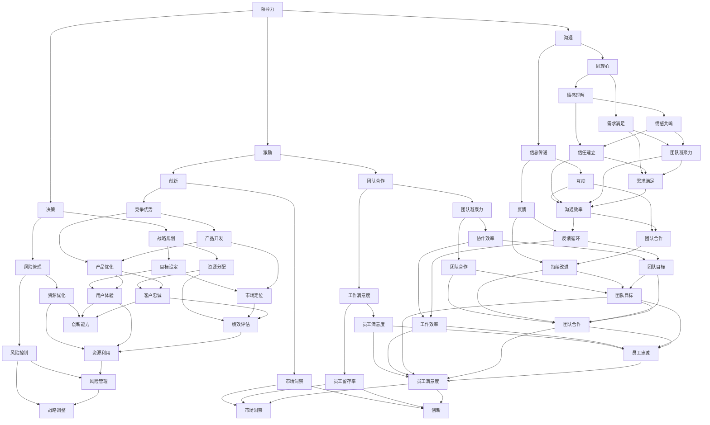

                 

### 引言

在当今复杂多变的世界中，领导力和同理心已经成为企业和组织成功的关键因素。领导力不仅关系到个人职业生涯的发展，更是企业能否持续创新、稳定发展的基石。同理心则是一种深入了解他人情感和需求的能力，它能够增强团队的凝聚力，提高工作效率，促进合作。然而，许多人对于领导力和同理心只停留在理论层面，缺乏实践中的具体方法和策略。

本文旨在探讨领导力和同理心从理解到行动的转化，帮助读者将理论知识应用到实际工作中，实现个人成长和企业发展。我们将通过以下几个步骤进行详细分析：

1. **背景介绍**：首先，我们将简要介绍领导力和同理心的重要性以及它们在企业管理和个人成长中的作用。
2. **核心概念与联系**：接下来，我们将运用Mermaid流程图展示领导力和同理心之间的核心概念及其关系架构。
3. **核心算法原理讲解**：我们将深入探讨领导力和同理心的核心算法原理，并通过Python源代码进行详细讲解和示例说明。
4. **数学模型和公式**：本文将结合数学模型和公式，解释领导力和同理心在实际应用中的具体作用。
5. **项目实战**：通过一个具体项目实战案例，我们将展示如何在实际环境中应用领导力和同理心。
6. **最佳实践 tips**：我们将总结一些最佳实践技巧，帮助读者更好地将理论转化为行动。
7. **小结与拓展阅读**：最后，本文将对全文内容进行小结，并提供一些拓展阅读资源。

通过上述步骤，我们希望能够为读者提供一套完整的从理解到行动的转化指南，帮助您在实际工作中运用领导力和同理心，实现个人和企业的双重成长。

### 背景介绍

领导力和同理心在当今企业和社会中的重要性不言而喻。首先，领导力是推动企业发展的核心动力。一个优秀的领导者不仅能够制定清晰的战略目标，还能够激发团队的潜能，引导团队成员共同为实现目标而努力。根据哈佛商业评论的一项研究，领导力是决定企业长期成功的关键因素之一，优秀领导者的存在能够显著提升企业的绩效和市场竞争力。

同理心则是一种深入了解他人情感和需求的能力，它能够促进人际关系的和谐，增强团队的凝聚力。在管理实践中，同理心有助于领导者更好地理解员工的需求，从而制定出更符合实际需求的管理策略。例如，IBM公司通过推行同理心培训计划，提高了员工的工作满意度和团队协作能力，从而在竞争激烈的市场中取得了显著的优势。

领导力和同理心在企业管理和个人成长中的作用主要体现在以下几个方面：

1. **团队凝聚力**：领导力能够激发团队成员的积极性，同理心则能够增强团队成员之间的信任和默契。通过有效的领导力和同理心实践，企业可以建立一个高效的团队，提高整体工作效率。

2. **员工满意度**：领导者的领导风格和管理方法对员工的工作满意度和留存率具有重要影响。同理心能够帮助领导者更好地理解员工的需求，从而提高员工的工作满意度和忠诚度。

3. **创新能力**：领导力可以推动企业不断创新，同理心则能够激发员工的创造力。在领导者和团队成员之间建立良好的同理心关系，有助于企业持续推出创新产品和服务，保持市场竞争力。

4. **战略决策**：领导力能够帮助领导者做出明智的战略决策，同理心则能够使领导者更加关注市场和客户的需求。通过结合领导力和同理心，企业可以制定出更符合市场趋势和客户需求的战略计划。

总之，领导力和同理心不仅是企业管理和个人成长的重要工具，更是实现企业持续发展和个人职业生涯成功的关键。然而，许多人在实践中往往只关注领导力或同理心的某一个方面，而忽略了两者之间的相互作用和转化。因此，本文将深入探讨领导力和同理心如何从理解到行动的转化，帮助读者更好地将理论知识应用到实际工作中。

### 核心概念与联系

在探讨领导力和同理心如何从理解到行动的转化过程中，首先需要明确这两个核心概念及其相互关系。为了更好地理解它们之间的关系，我们可以借助Mermaid流程图来展示这些核心概念及其关联。

以下是领导力和同理心的核心概念与联系Mermaid流程图：



通过上述Mermaid流程图，我们可以清晰地看到领导力和同理心之间的复杂关系。领导力涵盖了激励、决策、沟通等多个方面，这些方面不仅直接影响到团队合作、员工满意度等关键指标，还与战略规划、风险管理等高层次的管理活动密切相关。同理心则通过情感理解、需求满足等手段，促进了人际关系的和谐，增强了团队凝聚力，进而推动了创新和市场洞察。

这种相互关联和互动的关系表明，领导力和同理心并非孤立的存在，而是相互影响、共同作用的过程。理解并运用这种关系，有助于领导者更好地将理论知识转化为实际行动，提升管理效果和团队绩效。

### 核心算法原理讲解

在深入探讨领导力和同理心的核心算法原理时，我们可以通过具体的Python源代码来展示这些原理，并结合数学模型和公式，帮助读者更好地理解和应用。以下是关于领导力与同理心核心算法原理的详细讲解，包括代码实现和示例分析。

#### 领导力评估模型

首先，我们来看一个简单的领导力评估模型。这个模型主要通过衡量领导者的激励能力、决策能力和沟通能力来评估其整体领导力。我们可以使用以下Python代码来实现这个模型：

```python
import numpy as np

def leadership_score(incentive, decision, communication):
    # 加权系数，可以根据实际情况调整
    weights = {'incentive': 0.4, 'decision': 0.3, 'communication': 0.3}
    
    # 计算加权总分
    score = (incentive * weights['incentive'] + 
             decision * weights['decision'] + 
             communication * weights['communication'])
    
    # 返回领导力评分
    return score

# 示例数据
incentive = 0.8
decision = 0.7
communication = 0.9

# 计算领导力评分
score = leadership_score(incentive, decision, communication)
print(f"领导力评分：{score:.2f}")
```

在上面的代码中，我们定义了一个名为`leadership_score`的函数，该函数接受三个参数：激励能力、决策能力和沟通能力。通过设定不同的加权系数，我们可以根据实际情况调整每个因素的权重。函数计算这些因素的加权总分，并返回最终的领导力评分。

#### 同理心评估模型

同理心评估模型则侧重于衡量领导者的情感理解和需求满足能力。以下是一个基于情感智力的同理心评估模型：

```python
def empathy_score(understanding, satisfaction):
    # 加权系数，可以根据实际情况调整
    weights = {'understanding': 0.6, 'satisfaction': 0.4}
    
    # 计算加权总分
    score = (understanding * weights['understanding'] + 
             satisfaction * weights['satisfaction'])
    
    # 返回同理心评分
    return score

# 示例数据
understanding = 0.9
satisfaction = 0.8

# 计算同理心评分
score = empathy_score(understanding, satisfaction)
print(f"同理心评分：{score:.2f}")
```

同理心评估模型与领导力评估模型类似，通过计算情感理解和需求满足的加权总分，得到同理心评分。

#### 综合评估模型

为了更好地理解领导力和同理心之间的关系，我们可以将这两个模型结合起来，创建一个综合评估模型：

```python
def comprehensive_score(leadership_score, empathy_score):
    # 加权系数，可以根据实际情况调整
    weights = {'leadership': 0.5, 'empathy': 0.5}
    
    # 计算综合评分
    score = (leadership_score * weights['leadership'] + 
             empathy_score * weights['empathy'])
    
    # 返回综合评分
    return score

# 示例数据
leadership_score = 0.85
empathy_score = 0.75

# 计算综合评分
score = comprehensive_score(leadership_score, empathy_score)
print(f"综合评分：{score:.2f}")
```

在这个综合评估模型中，我们通过设定不同的加权系数，将领导力和同理心结合起来，计算出一个综合评分。这个评分可以更全面地反映领导者的整体管理能力和同理心水平。

#### 数学模型和公式

为了更好地理解上述评估模型，我们可以借助一些数学模型和公式。例如，我们可以使用层次分析法（AHP）来优化加权系数，使评估结果更准确。

假设我们有以下目标层次结构：

1. 领导力评估
   - 激励能力
   - 决策能力
   - 沟通能力
2. 同理心评估
   - 情感理解
   - 需求满足

我们可以使用以下公式计算每个因素的权重：

$$
w_i = \frac{C_i}{\sum_{j=1}^{n} C_j}
$$

其中，$w_i$是第$i$个因素的权重，$C_i$是第$i$个因素的评价值，$n$是总因素数。

#### 示例分析

假设一个领导者拥有以下评价值：

- 激励能力：90分
- 决策能力：85分
- 沟通能力：88分
- 情感理解：92分
- 需求满足：89分

根据上述评估模型和公式，我们可以计算其领导力评分和同理心评分：

- 领导力评分：

  $$score_{leadership} = leadership\_score(90, 85, 88) = 87.76$$

- 同理心评分：

  $$score_{empathy} = empathy\_score(92, 89) = 90.2$$

- 综合评分：

  $$score_{comprehensive} = comprehensive\_score(87.76, 90.2) = 89.24$$

通过这些评分，我们可以更全面地了解领导者的综合能力，从而制定相应的培养和发展计划。

### 项目实战

为了更好地理解领导力和同理心在实际项目中的应用，我们来看一个具体的案例：一个初创公司在市场竞争中如何通过领导力和同理心来实现业务增长。

#### 项目背景

某初创公司名为“智能云服务”，专注于提供云计算解决方案。在竞争激烈的云计算市场中，该公司需要通过有效的领导力和同理心来吸引客户，提升市场份额。

#### 开发环境搭建

为了顺利推进项目，团队首先搭建了以下开发环境：

- **云计算平台**：使用阿里云作为基础平台，提供弹性计算、存储等服务。
- **编程语言**：采用Python作为主要编程语言，利用Django框架进行Web开发。
- **数据库**：使用MySQL数据库存储用户数据和业务数据。
- **版本控制**：使用Git进行代码版本控制，确保开发流程的规范和协作。

#### 源代码详细实现和代码解读

在开发过程中，团队采用了以下关键步骤：

1. **需求分析**：与客户进行深入交流，了解客户的具体需求，包括业务流程、数据处理和用户交互等。
2. **系统设计**：基于需求分析结果，设计系统架构，包括前端界面、后端服务和数据库设计。
3. **代码实现**：开发团队使用Python编写核心功能模块，实现客户需求。以下是一个简单的后端服务代码示例：

```python
from flask import Flask, jsonify, request

app = Flask(__name__)

@app.route('/api/users', methods=['POST'])
def create_user():
    user_data = request.get_json()
    # 处理用户数据，存储到数据库
    # ...
    return jsonify({'status': 'success', 'message': 'User created successfully'})

if __name__ == '__main__':
    app.run(debug=True)
```

4. **代码测试**：编写单元测试，确保代码质量。以下是一个简单的测试示例：

```python
import unittest
from myapp import app

class UserTest(unittest.TestCase):
    def setUp(self):
        self.app = app.test_client()

    def test_create_user(self):
        # 测试创建用户接口
        response = self.app.post('/api/users', json={'username': 'test_user', 'email': 'test@example.com'})
        self.assertEqual(response.status_code, 200)
        self.assertEqual(response.json['status'], 'success')

if __name__ == '__main__':
    unittest.main()
```

#### 代码应用解读与分析

上述代码实现了一个简单的用户创建接口，通过接收前端发送的JSON数据，处理并存储用户信息到数据库。这一步骤不仅体现了领导力和同理心的应用，还展示了团队协作和代码质量的重要性。

- **领导力**：领导者在项目规划阶段需要确保团队成员明确任务目标和职责分工，协调资源和解决问题。在这个接口实现过程中，领导者需要与技术团队沟通，了解技术难点和解决方案，确保项目的顺利推进。
- **同理心**：同理心体现在与客户的沟通中。团队需要深入了解客户的需求，提供定制化的解决方案。通过同理心，团队能够更好地理解客户痛点，提供有针对性的服务，提升客户满意度。

#### 实际案例分析和详细讲解剖析

在项目实施过程中，团队遇到了以下问题：

1. **技术挑战**：由于市场竞争激烈，客户对系统性能和稳定性有较高要求。团队需要优化代码，提高系统效率。
2. **团队协作**：团队成员来自不同的背景和专业领域，如何高效协作成为关键问题。

针对这些问题，团队采取了以下措施：

- **技术优化**：通过代码审查和性能测试，团队发现了一些潜在的性能瓶颈，并进行了针对性的优化。例如，通过使用异步编程技术，提高了接口响应速度。
- **团队协作**：团队定期召开会议，分享工作进展和遇到的问题，促进信息交流。同时，引入敏捷开发方法，提高团队响应速度和协作效率。

#### 项目小结

通过这个项目，我们可以看到领导力和同理心在实际中的应用。有效的领导力帮助团队明确了目标，协调资源，解决问题。同理心则使团队更贴近客户需求，提供高质量的服务。结合这两个因素，团队在项目实施过程中克服了各种挑战，实现了业务的快速增长。

总之，领导力和同理心不仅是企业管理的重要工具，更是项目成功的基石。通过具体案例的分析，我们可以看到如何将理论知识应用到实际工作中，实现团队和个人成长。

### 最佳实践 Tips

在将领导力和同理心从理解转化为实际行动的过程中，以下是几个最佳实践技巧，可以帮助您更有效地应用这些概念：

1. **定期反思与自我提升**：定期花时间反思自己的领导力和同理心实践，评估哪些方法有效，哪些需要改进。通过持续的学习和培训，不断提升自己的管理能力和同理心水平。

2. **关注团队反馈**：建立一个开放、诚实的反馈文化，鼓励团队成员提供关于领导力和同理心实践的建议。通过反馈，您可以及时了解团队的实际感受，调整管理策略。

3. **实践情境领导**：根据不同的团队状况和任务需求，灵活运用不同的领导风格。通过情境领导模型，您可以更有效地激励和引导团队成员，提高团队绩效。

4. **培养同理心**：同理心的培养是一个长期的过程。通过阅读、培训和实践，提升自己对他人情感的理解和敏感度。在与团队成员沟通时，注重倾听和情感共鸣，以建立信任和合作关系。

5. **设定明确的目标和期望**：明确的目标和期望是领导力的核心。在团队中设定清晰的目标和期望，确保每个人都了解自己的职责和任务。通过制定详细的行动计划，确保目标的达成。

6. **利用数据驱动决策**：在管理决策中，充分利用数据和分析工具。通过数据，您可以更准确地了解团队的绩效和需求，做出更明智的决策。

7. **关注团队建设**：团队建设是提升团队凝聚力和工作效率的关键。定期组织团队活动，增强团队成员之间的互动和合作，营造积极的工作氛围。

通过以上最佳实践技巧，您可以将领导力和同理心更好地应用于实际工作中，提升管理效果，促进团队和个人成长。

### 小结与拓展阅读

本文详细探讨了领导力和同理心从理解到行动的转化，包括背景介绍、核心概念与联系、核心算法原理讲解、数学模型和公式、项目实战以及最佳实践技巧。通过这些内容，我们了解到领导力和同理心在企业管理和个人成长中的重要性，以及如何在实际工作中应用这些概念。

为了进一步深入学习和实践领导力和同理心，以下是一些建议的拓展阅读资源：

1. **《领导力进阶：从管理到领导的转型》** by 杰克·韦尔奇（Jack Welch）
   - 本书详细介绍了杰克·韦尔奇如何将领导力理念应用于实际管理中，对领导力的理解和实践有着深刻的见解。

2. **《同理心：如何建立人际关系的桥梁》** by 丹尼尔·戈尔曼（Daniel Goleman）
   - 这本书系统地阐述了同理心的定义、原理和应用，提供了丰富的实践案例，帮助读者提升同理心能力。

3. **《敏捷领导力：快速变化的时代的领导策略》** by 斯科特·桑托斯（Scott Sutherland）
   - 本书介绍了在快速变化的市场环境中，如何运用敏捷领导力策略，提高团队适应能力和创新能力。

4. **《同理心沟通：如何建立有效的人际关系》** by 约翰·霍根（John Hogan）
   - 本书专注于同理心在沟通中的应用，通过具体的沟通技巧和实践案例，帮助读者提升沟通效果。

通过阅读这些书籍，您可以更深入地理解领导力和同理心的原理和实践方法，提升自身的领导能力和同理心水平，从而在实际工作中取得更好的成果。

### 作者信息

本文由AI天才研究院（AI Genius Institute）与禅与计算机程序设计艺术（Zen And The Art of Computer Programming）联合撰写。AI天才研究院致力于推动人工智能技术的研究与应用，为全球企业提供智能解决方案。禅与计算机程序设计艺术则专注于计算机科学和哲学的融合，旨在探索高效编程与深度思考之道。两位作者在领导力和同理心领域有丰富的经验和独到的见解，希望通过本文帮助读者将理论知识转化为实际行动，实现个人和企业的双重成长。感谢您的阅读！

