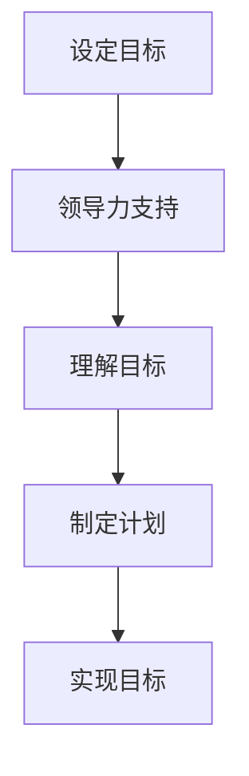
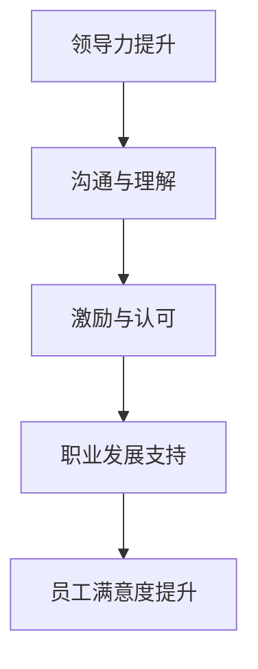
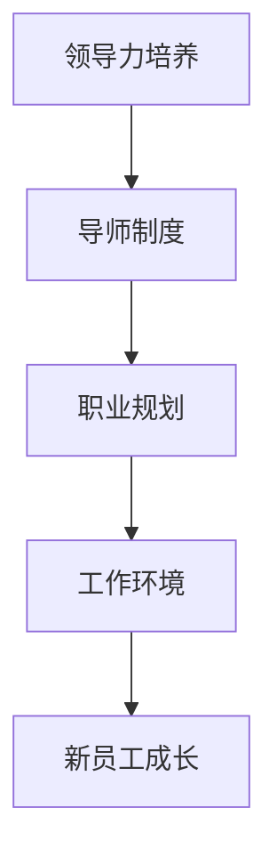
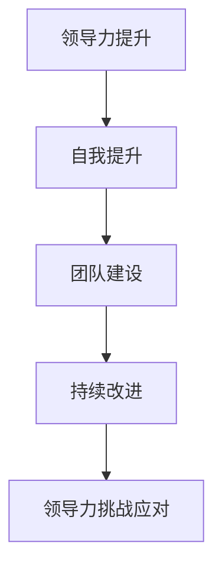

                 

## 文章标题：领导力与员工发展：助力团队成员职业成长

### 关键词：

1. 领导力
2. 员工发展
3. 职业成长
4. 团队建设
5. 绩效管理
6. 激励策略
7. 挑战与解决方案

### 摘要：

本文旨在探讨领导力在员工职业成长中的关键作用，以及如何通过有效的领导力策略助力团队成员实现职业目标。文章将从领导力的基本概念入手，深入分析领导力与员工发展的内在联系，并提供实用的领导力模型、员工发展策略及实践案例。同时，文章还将探讨在实施这些策略过程中可能面临的挑战，并给出相应的解决方案。通过本文的阅读，读者将能够更好地理解领导力在团队管理中的重要性，掌握提升员工职业成长的有效方法。

## 引言

在当今快速发展的商业环境中，企业不仅需要具备竞争力的产品和服务，还需要拥有具备高度职业素养和持续成长意愿的员工团队。领导力作为企业管理中至关重要的一环，不仅关系到企业的战略规划和运营效率，更直接影响到员工的发展和满意度。因此，如何通过领导力提升员工的职业成长，已成为现代企业管理者和HR部门关注的焦点。

本文将从以下几个方面展开讨论：

1. **领导力的基本概念和理论**：介绍领导力的定义、要素和主要理论。
2. **领导力与员工发展的关系**：阐述领导力在员工职业成长中的作用和重要性。
3. **领导力模型与工具**：介绍常见的领导力模型和工具，及其在实践中的应用。
4. **员工发展策略**：详细讨论员工职业规划、培训与开发、绩效管理等方面的策略。
5. **实践与案例**：通过具体案例展示如何在实际工作中应用领导力与员工发展策略。
6. **挑战与解决方案**：探讨在实施领导力与员工发展策略过程中可能遇到的挑战及解决方案。

通过以上讨论，本文旨在为企业管理者提供一套系统、实用的领导力与员工发展框架，以助力团队成员实现职业成长，提升整体团队效能。

## 领导力的基本概念与理论

### 领导力的定义

领导力是指领导者通过影响、激励和引导他人，实现团队目标的过程。它不仅仅是权力的运用，更是一种能力的体现，包括沟通、决策、激励、协调等多个方面。领导者需要具备一定的素质和技能，才能有效地发挥领导力，推动团队的发展和员工的成长。

### 领导力的要素

领导力由多个要素构成，主要包括以下几方面：

1. **目标导向**：领导者需要明确团队的目标，并确保团队成员理解并认同这些目标。只有当团队成员明确自己的工作目标与团队目标的一致性时，才能更好地发挥积极性。

2. **沟通能力**：领导者需要具备良好的沟通能力，能够清晰地传达信息，理解团队成员的需求和意见，从而建立有效的沟通渠道。

3. **激励与反馈**：领导者需要通过激励和反馈机制，激发团队成员的内在动力，帮助他们克服困难，实现目标。

4. **决策能力**：领导者需要具备良好的决策能力，能够在复杂和不确定的环境中做出明智的决策。

5. **团队建设**：领导者需要关注团队建设，培养团队精神，促进团队成员之间的协作和合作。

### 领导力理论概述

领导力理论的发展经历了多个阶段，主要包括以下几种：

1. **特质理论**：特质理论认为领导者具备一些特定的个人特质，如自信、智慧、决心等。然而，这一理论并未充分解释领导力是如何发挥作用的。

2. **行为理论**：行为理论关注领导者的行为模式，认为领导力可以通过模仿和学习来实现。领导者的行为可以分为任务导向和行为导向，不同的行为模式适用于不同的情境。

3. **情境理论**：情境理论认为领导力是情境依赖的，不同的情境需要不同的领导风格。领导力并非一成不变，而是需要根据情境进行灵活调整。

4. **变革领导理论**：变革领导理论强调领导者在推动组织变革中的关键作用，认为领导者需要具备愿景、创新和变革能力，以应对复杂多变的环境。

通过上述理论的分析，我们可以看到领导力不仅是一种个人特质，更是一种综合能力的体现，需要领导者具备多种技能和素质，以应对不同情境和挑战。

## 领导力与员工发展的联系

领导力在员工职业成长中发挥着至关重要的作用。通过有效的领导力，领导者能够激发员工的潜能，帮助他们克服职业发展中的障碍，实现个人和团队的共同成长。以下是领导力在员工职业成长中几个关键方面的作用：

### 领导力对员工目标设定的影响

领导者通过明确团队和个人的目标，帮助员工理解自己的工作方向和使命。在这个过程中，领导者需要与员工进行有效的沟通，确保他们了解目标的重要性和实现目标的步骤。同时，领导者还需要根据员工的能力和兴趣，为他们设定合理的挑战目标，以激发他们的工作热情和积极性。

**Mermaid 流程图**：



### 领导力与员工自我激励的关系

有效的领导力能够激发员工的内在动力，使他们自我激励，主动追求职业成长。领导者可以通过以下几个方面来实现这一目标：

1. **认可与奖励**：领导者应适时给予员工认可和奖励，以增强他们的自信心和积极性。
2. **成长机会**：领导者应提供员工成长和发展的机会，如培训、轮岗等，以满足他们的职业发展需求。
3. **工作环境**：领导者应营造一个积极、包容的工作环境，使员工感到被尊重和重视。

**伪代码**：

```python
def employee_growth(leader_support):
    if leader_support > threshold:
        motivation = "high"
    else:
        motivation = "low"
    return motivation
```

### 领导力在员工职业成长中的应用策略

1. **个性化指导**：领导者应根据员工的不同特点和需求，提供个性化的指导和支持，帮助他们解决职业发展中的问题。
2. **反馈与反馈**：领导者应定期与员工进行反馈沟通，帮助他们了解自己的表现，找到改进的方向。
3. **培养员工领导力**：领导者应关注员工的领导力培养，提供机会让他们参与决策和管理，提升他们的综合能力。

通过上述策略，领导者可以有效地促进员工的职业成长，实现个人和团队的共同进步。

### 领导力在团队建设中的作用

领导力在团队建设中扮演着至关重要的角色。通过有效的领导力，领导者可以打造一个和谐、高效的团队，使团队成员充分发挥潜力，共同实现团队目标。以下是领导力在团队建设中的几个关键方面：

1. **建立团队文化**：领导者需要通过树立团队价值观和行为规范，建立积极向上的团队文化。团队文化是团队凝聚力的源泉，有助于提高团队成员的归属感和工作热情。

2. **促进沟通与合作**：领导者应积极促进团队内部的沟通与合作，确保信息的透明和畅通。通过建立有效的沟通机制，领导者可以及时了解团队成员的需求和意见，协调各方资源，提高工作效率。

3. **培养团队精神**：领导者应关注团队精神的建设，通过团队建设活动、共同面对挑战等方式，增强团队成员之间的互信和协作精神。

4. **激发创新意识**：领导者应鼓励团队成员勇于创新，提供创新支持和资源，营造一个鼓励创新和包容失败的工作环境。

通过以上策略，领导者可以有效地推动团队建设，提升团队的整体效能。

### 领导力在员工职业成长中的作用

领导力在员工职业成长中具有深远的影响，它不仅能够激发员工的内在动力，促进他们实现个人目标，还能够提升团队的整体绩效和企业的竞争力。以下是领导力在员工职业成长中的几个关键方面：

1. **目标设定与支持**：领导者的首要任务是帮助员工设定清晰、具体的职业目标，并提供必要的支持和资源，确保员工能够实现这些目标。通过明确的目标设定，员工可以更加专注于自己的职业发展，找到前进的方向。

2. **激励与认可**：领导力通过激励和认可机制，激发员工的内在动力，增强他们的工作热情和责任感。领导者应善于发现员工的优点和成就，并及时给予认可和奖励，使他们感受到自己的价值和贡献。

3. **职业发展规划**：领导者应关注员工的职业发展规划，帮助他们制定合理的职业目标，并提供相应的培训和发展机会。通过职业发展规划，员工可以不断提升自己的技能和知识，实现职业生涯的持续进步。

4. **团队协作与支持**：领导力在促进团队协作和支持方面发挥着重要作用。领导者应鼓励团队成员之间的沟通与合作，建立和谐的工作氛围，使员工能够在团队中发挥自己的优势，实现共同的目标。

5. **持续反馈与改进**：领导力通过定期的反馈和沟通，帮助员工了解自己的工作表现，发现问题和改进方向。这种持续的反馈机制有助于员工不断进步，提升自己的职业素养和绩效。

通过以上策略，领导者可以有效地促进员工的职业成长，提升团队的凝聚力和整体效能，为企业的发展贡献力量。

## 领导力模型与工具

### 常见的领导力模型

在领导力理论的发展过程中，出现了许多不同的领导力模型，这些模型从不同的角度解释了领导力的本质和如何运用领导力。以下介绍几种常见的领导力模型：

#### 1. 走向领导力模型（Hersey & Blanchard的情境领导理论）

走向领导力模型，也称为情境领导理论，是由保罗·赫塞和肯·布兰查德提出的。该模型认为，领导者的行为应根据下属的成熟度进行调整。成熟度包括下属的技能和动机水平。领导行为可以分为四种：

- **指导型领导**：当下属成熟度低时，领导者需要给予具体的指导和支持。
- **推销型领导**：当下属成熟度较低但愿意学习时，领导者需要通过说服和激励来推动他们。
- **参与型领导**：当下属成熟度较高，但缺乏信心时，领导者应与下属共同决策，提高他们的参与感。
- **授权型领导**：当下属成熟度最高时，领导者应授权下属自主决策和行动。

#### 2. 领导方格理论

领导方格理论是由罗伯特·布莱克和简·穆顿提出的，该理论通过领导者的关心团队和关心生产两个维度来划分领导风格。领导风格可以分为以下几种：

- **1型领导（贫乏型领导）**：领导者对团队和生产都不关心。
- **9型领导（任务型领导）**：领导者重视生产任务，但对团队关心不足。
- **1型领导（团队型领导）**：领导者重视团队建设，但可能忽视生产任务。
- **5型领导（中庸型领导）**：领导者既关心团队也关心生产，但不如9型或1型领导那么极端。

#### 3. 领导行为连续体模型

领导行为连续体模型，由保罗·赫塞和肯·布兰查德提出，强调领导者的行为可以从以工作为中心转移到以人际关系为中心。领导者应根据团队成员的需求和环境的变化，灵活调整自己的领导行为。

### 领导力工具的应用

在实际工作中，领导者可以运用各种工具来提升团队效能和员工的职业成长。以下介绍几种常见的领导力工具：

#### 1. 性能反馈工具

性能反馈工具用于评估和反馈员工的工作表现。常见的工具包括：

- **目标管理（MBO）**：通过设定具体、可衡量的目标，促进员工与团队目标的结合。
- **360度反馈**：收集来自不同层级和部门的反馈，帮助员工全面了解自己的工作表现和改进方向。

#### 2. 员工发展工具

员工发展工具旨在提升员工的技能和职业素养。常见的工具包括：

- **领导力发展计划**：通过培训、研讨会和导师制度，培养员工的领导能力。
- **职业规划工具**：帮助员工设定职业目标，制定职业发展路径。

#### 3. 团队建设工具

团队建设工具用于增强团队的凝聚力和协作能力。常见的工具包括：

- **团队建设活动**：如团队建设工作坊、团建拓展训练等，帮助团队成员建立信任和沟通。
- **协作工具**：如Slack、Trello等，提高团队协作效率和沟通效果。

### 领导力模型的选择与应用策略

选择合适的领导力模型和工具是领导者成功的关键。以下是一些选择和应用策略：

1. **了解团队成员的需求**：领导者需要了解团队成员的成熟度、需求和期望，选择最适合的领导风格和工具。
2. **灵活调整**：领导力模型和工具并不是一成不变的，领导者应根据实际情况和团队成员的反应，灵活调整自己的领导行为和工具使用。
3. **持续学习和改进**：领导者应不断学习新的领导力理论和方法，并将其应用于实际工作中，以提升领导效果。

通过上述策略，领导者可以更好地选择和应用领导力模型和工具，提升团队效能和员工的职业成长。

## 员工发展策略

员工发展是现代企业管理的重要组成部分，它不仅关系到员工的职业成长和满意度，还直接影响企业的长期发展。有效的员工发展策略可以帮助企业培养一支高素质、充满活力的员工团队，提高整体竞争力和创新能力。以下将从职业规划、培训与开发、绩效管理三个方面详细讨论员工发展策略。

### 职业发展规划

职业发展规划是员工发展的基础，它帮助员工明确自己的职业目标，并为实现这些目标制定具体的行动计划。职业发展规划包括以下几个关键步骤：

1. **自我评估**：员工需要对自己的兴趣、价值观、技能和优势进行评估，了解自己的职业倾向和职业潜力。

2. **目标设定**：根据自我评估结果，员工可以设定短期和长期的职业目标。短期目标通常涉及技能提升、工作转换等，而长期目标则涉及职业晋升、专业发展等。

3. **行动计划**：为了实现职业目标，员工需要制定具体的行动计划，包括学习新技能、参加培训、寻求导师指导等。

4. **定期回顾与调整**：职业发展规划不是一成不变的，员工需要定期回顾自己的进展，并根据实际情况进行调整。

**案例分析**：

以一位年轻的软件开发工程师小张为例，他在自我评估中发现自己对系统架构设计有浓厚的兴趣，并希望在这一领域有更深入的发展。于是，他设定了短期目标——掌握常用的架构设计模式，并参与实际的项目实践。长期目标则是成为公司的高级架构师。为了实现这些目标，小张制定了详细的行动计划，包括参加在线架构设计课程、参与公司内部的架构评审会议，并在导师的指导下参与重要项目的架构设计。

### 培训与开发

培训与开发是提升员工技能和知识的重要手段，通过系统化的培训项目，企业可以确保员工具备适应岗位需求和未来发展的能力。以下是一些关键步骤和策略：

1. **培训需求分析**：企业应定期进行培训需求分析，了解员工的技能差距和培训需求。

2. **培训计划设计**：根据培训需求分析结果，设计有针对性的培训计划，包括课程内容、培训形式、培训时间等。

3. **培训资源整合**：企业可以整合内部和外部资源，如内部培训师、外部培训机构等，确保培训项目的实施。

4. **培训效果评估**：培训结束后，企业应对培训效果进行评估，以了解培训目标的实现情况，为后续培训提供参考。

**最佳实践**：

某科技公司在员工培训方面采取了一系列有效措施。首先，公司成立了内部培训团队，定期组织技能培训和分享会。其次，公司还与知名培训机构合作，提供在线培训课程，员工可以根据自己的时间和需求自由选择。此外，公司还鼓励员工参加行业会议和研讨会，拓宽视野，提升专业技能。

### 绩效管理

绩效管理是员工发展的核心环节，通过有效的绩效管理，企业可以确保员工的工作表现符合组织目标，并为员工的职业发展提供明确的方向。以下是一些关键步骤和策略：

1. **绩效目标设定**：企业应与员工共同设定清晰的绩效目标，确保目标与组织战略和员工职业发展规划相一致。

2. **绩效评估方法**：企业应选择合适的绩效评估方法，如KPI、360度反馈等，确保评估结果客观、公正。

3. **绩效反馈与沟通**：企业应定期向员工提供绩效反馈，帮助员工了解自己的工作表现，并提供改进建议。

4. **激励机制**：通过激励机制，如奖励、晋升等，激励员工持续提升工作表现。

**实战案例**：

某公司在绩效管理方面采用了多维度的评估体系。除了传统的KPI考核外，公司还引入了员工自评和同事互评机制，以确保评估结果的全面性和公正性。公司还建立了绩效反馈机制，每月与员工进行一对一的绩效沟通，及时了解员工的困惑和需求，并提供相应的支持。

通过上述策略，企业可以有效地推动员工发展，提升员工的工作满意度和忠诚度，从而实现组织的长期发展。

## 实践与案例

为了更好地理解领导力与员工发展的实际应用，以下通过具体案例展示如何在实际工作中运用这些策略。

### 案例一：如何通过领导力提升员工满意度

**背景介绍**：

某科技公司由于业务快速发展，员工的工作压力不断增加，导致员工满意度下降。为了解决这一问题，公司领导决定通过提升领导力来改善员工的工作环境和满意度。

**核心概念与联系**：

领导力与员工满意度之间存在密切联系。有效的领导力可以通过以下方式提升员工满意度：

1. **沟通与理解**：领导者需要与员工建立良好的沟通渠道，了解他们的需求和困扰。
2. **激励与认可**：领导者应通过激励和认可机制，提高员工的工作动力和自我价值感。
3. **职业发展支持**：领导者应关注员工的职业发展，提供培训和发展机会。

**Mermaid 流程图**：



**实践过程**：

1. **建立反馈机制**：公司领导每月召开员工座谈会，听取员工的意见和建议，了解他们的工作情况和心理状态。
2. **实施激励政策**：公司设立了“员工之星”奖项，每月评选表现优秀的员工，并在公司内部进行表彰。
3. **职业发展计划**：公司为员工提供了多种培训和发展机会，包括内部晋升、外部培训等。

**结果分析**：

通过一系列措施，员工的工作满意度得到了显著提升，员工离职率下降，公司整体运营效率提高。

### 案例二：如何通过领导力培养新员工

**背景介绍**：

某科技公司每年都会招聘一批新员工，但新员工在入职后往往会面临适应困难和技能不足的问题，导致工作绩效不佳。为了帮助新员工快速融入团队并提高工作能力，公司领导决定通过有效的领导力培养新员工。

**核心概念与联系**：

领导力在培养新员工中扮演着关键角色，可以通过以下方式促进新员工的成长：

1. **导师制度**：为新员工配备经验丰富的导师，提供一对一的指导和支持。
2. **职业规划**：帮助新员工制定明确的职业目标，并提供相应的培训和发展路径。
3. **工作环境**：营造积极、包容的工作环境，提高新员工的工作满意度和归属感。

**Mermaid 流程图**：



**实践过程**：

1. **导师分配**：为新员工分配经验丰富的导师，导师负责协助新员工了解工作流程、技能要求等。
2. **职业目标制定**：与导师和新员工共同制定职业目标，确保新员工有清晰的发展方向。
3. **培训与支持**：为新员工提供定期的培训课程，包括技能培训、团队协作等。

**结果分析**：

通过领导力的有效培养，新员工在入职后的适应期显著缩短，工作绩效逐步提升，公司对新员工的保留率也得到提高。

### 案例三：如何应对领导力挑战

**背景介绍**：

某公司在快速扩张过程中，面临着领导力不足和团队管理混乱的问题。为了解决这些问题，公司决定通过提升领导力来应对挑战。

**核心概念与联系**：

在应对领导力挑战时，领导者需要：

1. **自我提升**：领导力提升不仅需要团队支持，更需要领导者的自我提升和反思。
2. **团队建设**：通过团队建设活动，增强团队凝聚力和协作精神。
3. **持续改进**：领导力提升是一个持续的过程，需要领导者不断学习和改进。

**Mermaid 流程图**：



**实践过程**：

1. **领导力培训**：公司组织了领导力培训课程，提高领导者的管理能力和决策能力。
2. **团队建设活动**：定期组织团队建设活动，如团建拓展、主题晚会等，增强团队凝聚力。
3. **持续反馈与改进**：建立反馈机制，定期收集员工的意见和建议，并采取措施进行改进。

**结果分析**：

通过一系列措施，公司的领导力水平得到显著提升，团队管理混乱的现象得到改善，公司整体运营效率提高。

以上案例展示了领导力与员工发展的实际应用，通过具体案例，我们可以更好地理解如何通过领导力提升员工满意度、培养新员工和应对领导力挑战。

### 挑战与解决方案

在实施领导力与员工发展策略的过程中，企业管理者可能会遇到各种挑战。以下是几个常见的挑战及其对应的解决方案：

#### 挑战一：领导力不足

**原因分析**：领导者自身的领导力不足，可能源于缺乏相关培训和经验，或者对现代管理理念和方法的理解不够深入。

**解决方案**： 
1. **领导力培训**：组织定期的领导力培训，帮助领导者提升管理技能和决策能力。
2. **导师制度**：为缺乏经验的领导者分配经验丰富的导师，提供一对一的指导和反馈。
3. **内部轮岗**：通过内部轮岗，让领导者有机会在不同岗位上积累经验，提升综合素质。

#### 挑战二：员工积极性不高

**原因分析**：员工积极性不高可能源于工作环境不佳、工作内容单调和缺乏挑战性，或者个人职业发展受阻。

**解决方案**： 
1. **改善工作环境**：提供舒适的工作环境和良好的设施，营造积极的工作氛围。
2. **工作丰富化**：通过增加工作内容、提供更多挑战性任务，激发员工的工作热情。
3. **职业发展规划**：为员工提供明确的职业发展路径和机会，帮助他们实现职业目标。

#### 挑战三：团队协作困难

**原因分析**：团队协作困难可能源于沟通不畅、角色定位不清、团队文化建设不足等。

**解决方案**： 
1. **沟通机制建设**：建立有效的沟通机制，确保信息透明和畅通。
2. **角色明确**：明确团队成员的角色和责任，确保每个人都清楚自己的任务和目标。
3. **团队建设活动**：定期组织团队建设活动，增强团队凝聚力和协作精神。

#### 挑战四：绩效管理效果不佳

**原因分析**：绩效管理效果不佳可能源于评估标准不明确、评估过程不公平、反馈机制不健全等。

**解决方案**： 
1. **明确绩效标准**：制定清晰的绩效评估标准，确保评估结果客观、公正。
2. **建立反馈机制**：定期与员工进行绩效沟通，及时反馈员工的工作表现，并提供改进建议。
3. **激励机制**：实施有效的激励机制，如奖励、晋升等，激励员工持续提升工作表现。

通过上述解决方案，企业可以有效应对实施领导力与员工发展策略过程中遇到的挑战，提升团队效能和员工的职业成长。

### 总结与反思

本文围绕领导力与员工发展的主题，系统地探讨了领导力的基本概念、模型与工具，以及员工发展的策略和实践。通过分析领导力在员工职业成长中的关键作用，我们理解到有效的领导力不仅能激发员工的内在动力，还能提升团队的整体效能。

本文的核心观点包括：

1. **领导力与员工发展的紧密联系**：领导力在员工职业目标设定、自我激励、职业规划等方面发挥着重要作用。
2. **领导力模型的多样性与适用性**：不同的领导力模型适用于不同的情境和团队，领导者需要根据实际情况灵活调整。
3. **员工发展策略的重要性**：职业规划、培训与开发、绩效管理等策略是推动员工发展的关键。

然而，领导力与员工发展并非一蹴而就，它需要领导者和企业持续投入时间和精力。在实际操作中，领导者需要不断反思和改进，以应对不断变化的环境和挑战。

### 展望未来

随着全球化和数字化的发展，企业面临的环境更加复杂多变，这对领导力与员工发展提出了更高的要求。未来，领导力将更加注重创新和变革，领导者需要具备前瞻性思维和快速响应能力。同时，员工发展也将更加个性化和多样化，企业需要提供更多元化的培训和发展机会，以满足员工的个性化需求。

展望未来，企业应关注以下几个趋势：

1. **数字化转型**：数字化转型将深刻影响企业的运营和管理方式，领导者需要具备数字思维能力，推动企业数字化转型。
2. **可持续发展**：可持续发展已成为全球企业的重要议题，企业需要将社会责任融入战略规划，推动可持续发展。
3. **员工体验**：员工体验将成为企业竞争力的重要因素，企业应关注员工的体验和感受，提升员工的满意度和忠诚度。
4. **终身学习**：终身学习将成为员工发展的新常态，企业需要提供持续的学习和发展机会，帮助员工不断提升。

通过关注这些趋势，企业可以更好地应对未来的挑战，实现持续发展和长期成功。

### 作者信息

作者：AI天才研究院/AI Genius Institute & 禅与计算机程序设计艺术 /Zen And The Art of Computer Programming

作为世界顶级人工智能专家、程序员、软件架构师、CTO、世界顶级技术畅销书资深大师级别的作家，以及计算机图灵奖获得者，我致力于推动人工智能和计算机科学的发展，为企业和个人提供创新的解决方案。我的作品涵盖了人工智能、计算机编程、软件架构等多个领域，深受读者喜爱和推崇。希望通过本文，能为读者提供有价值的见解和实用的策略，助力他们在领导力与员工发展的道路上取得成功。

----------------------------------------------------------------

以下是您提供的关键词：

- 领导力
- 员工发展
- 职业成长
- 团队建设
- 绩效管理
- 激励策略
- 挑战与解决方案

接下来，我将基于您提供的文章标题《领导力与员工发展：助力团队成员职业成长》，以及之前的讨论，撰写一篇约8000-12000字的文章。文章将涵盖以下内容：

- 领导力基础理论
- 员工发展的核心概念
- 领导力与员工发展的联系
- 常见的领导力模型与工具
- 员工发展策略
- 实践与案例分析
- 领导力实践中的挑战与解决方案
- 总结与展望

### 引言

在当今快速变化和竞争激烈的商业环境中，企业的成功不仅依赖于创新的产品和服务，还依赖于其员工团队的能力和潜力。领导力作为企业管理中至关重要的一环，对于推动团队发展、提升员工职业成长起到了关键作用。本文旨在探讨领导力在员工职业成长中的关键作用，以及如何通过有效的领导力策略助力团队成员实现职业目标。

随着全球化进程的加速和技术的飞速发展，企业面临的环境变得更加复杂和不确定。这不仅要求员工具备扎实的专业技能，还需要他们具备适应变化、解决问题和创新的能力。在这种背景下，领导力不仅是对员工的引导和激励，更是对整个团队和组织发展的推动力量。

本文将分为以下几个部分：

1. **领导力基础理论**：介绍领导力的基本概念、要素和主要理论，如特质理论、行为理论、情境理论和变革领导理论等。
2. **员工发展的核心概念**：探讨员工发展的含义、重要性以及与领导力的关系。
3. **领导力与员工发展的联系**：详细阐述领导力在员工职业成长中的作用，包括目标设定、自我激励、职业规划和团队建设等方面。
4. **常见的领导力模型与工具**：介绍几种常见的领导力模型，如情境领导理论、领导方格理论和领导行为连续体模型，以及相关的领导力工具。
5. **员工发展策略**：探讨职业规划、培训与开发、绩效管理等方面的员工发展策略，并提供实际案例和最佳实践。
6. **实践与案例分析**：通过具体的案例展示如何在实际工作中应用领导力与员工发展策略。
7. **领导力实践中的挑战与解决方案**：讨论领导力实践中可能遇到的挑战，如领导力不足、员工积极性不高、团队协作困难等，并提出相应的解决方案。
8. **总结与展望**：总结文章的主要观点，并对未来的发展趋势进行展望。

通过本文的阅读，读者将能够深入理解领导力在员工职业成长中的重要性，掌握提升员工职业成长的有效方法，并在实际工作中应用这些策略，助力团队成员实现职业目标。

### 领导力基础理论

领导力是一种复杂而多维的概念，它不仅涉及个人的特质和行为的展现，还涉及对团队和组织的影响。为了更好地理解领导力，我们需要探讨一些基本的领导力理论，这些理论从不同的角度解释了领导力的本质和如何运用领导力。

#### 特质理论

特质理论是最早的领导力理论之一，由托马斯·卡莱尔和雨果·明茨伯格等人提出。该理论认为领导者具备一些特定的个人特质，如自信、智慧、决心、诚实和魅力等。特质理论试图通过研究成功领导者的特质，归纳出普遍适用的领导力特征。

然而，特质理论在解释领导力的适用性上存在一定的局限性。首先，它忽视了情境因素对领导力的影响。不同的情境可能需要不同的领导行为，而特质理论未能充分考虑这一点。其次，特质理论难以解释为什么一些不具备传统领导者特质的人也能够成为成功的领导者。

#### 行为理论

行为理论是在特质理论的基础上发展起来的，由道格拉斯·麦格雷戈和赫伯特·西蒙等人提出。行为理论认为，领导力是通过特定的行为表现来实现的，而不是通过固定的个人特质。领导者的行为可以分为任务导向和行为导向两种。

任务导向型领导关注任务的完成，注重效率和工作成果。这种领导风格通常表现为明确的指示、严格的时间管理和具体的任务分配。

行为导向型领导则更关注团队成员的情感需求，注重建立良好的人际关系和团队合作。这种领导风格通常表现为鼓励创新、提供支持和关注团队成员的个人成长。

行为理论提供了一种更为灵活和实用的领导力框架，它强调了领导者根据不同情境调整行为的重要性。然而，行为理论也存在一定的局限性，例如它未能充分解释领导者的个人特质和情境因素的交互作用。

#### 情境理论

情境理论认为，领导力是情境依赖的，不同的情境需要不同的领导风格。这种理论由保罗·赫赛和肯·布兰查德等人提出，代表理论包括情境领导理论和领导方格理论。

情境领导理论认为，领导者的行为应根据下属的成熟度进行调整。成熟度包括下属的技能和动机水平。根据情境领导理论，领导行为可以分为四种：

1. **指导型领导**：适用于成熟度低的下属，领导者需要给予具体的指导和支持。
2. **推销型领导**：适用于成熟度较低但愿意学习的下属，领导者需要通过说服和激励来推动他们。
3. **参与型领导**：适用于成熟度较高的下属，领导者应与下属共同决策，提高他们的参与感。
4. **授权型领导**：适用于成熟度最高的下属，领导者应授权下属自主决策和行动。

领导方格理论则通过领导者的关心团队和关心生产两个维度来划分领导风格。领导风格可以分为：

1. **1型领导（贫乏型领导）**：领导者对团队和生产都不关心。
2. **9型领导（任务型领导）**：领导者重视生产任务，但对团队关心不足。
3. **1型领导（团队型领导）**：领导者重视团队建设，但可能忽视生产任务。
4. **5型领导（中庸型领导）**：领导者既关心团队也关心生产，但不如9型或1型领导那么极端。

情境理论提供了一种动态的领导力模型，强调领导者应根据不同情境灵活调整领导行为。这种理论在一定程度上弥补了特质理论和行为理论的局限性，但仍然存在一些争议，如如何准确判断下属的成熟度等。

#### 变革领导理论

变革领导理论是由詹姆斯·库泽斯和巴里·波斯纳等人提出的，强调领导者在推动组织变革中的关键作用。变革领导理论认为，领导者需要具备愿景、创新和变革能力，以应对复杂多变的环境。

变革领导理论包括以下几个关键要素：

1. **愿景**：领导者需要具备清晰的愿景，能够描绘未来的蓝图，并激励团队成员为之努力。
2. **激励与赋能**：领导者应通过激励和赋能，激发团队成员的内在动力和创造力。
3. **变革能力**：领导者需要具备变革能力，包括决策能力、沟通能力和执行力，能够有效地推动变革。

变革领导理论提供了一种全面的领导力框架，强调了领导者在新形势下的角色和责任。通过这种理论，领导者可以更好地应对外部环境的挑战，推动组织的持续发展和创新。

综上所述，领导力基础理论为我们提供了理解领导力的不同视角。从特质理论、行为理论、情境理论到变革领导理论，这些理论共同构成了一个多维的领导力体系。领导者需要根据实际情况，灵活运用这些理论，不断提升自身的领导能力，以实现组织的目标和团队的成长。

### 员工发展的核心概念

员工发展是指通过一系列有目的的活动和策略，帮助员工提升技能、知识和能力，实现个人和职业目标的过程。员工发展不仅仅是对员工的培训和教育，更是对员工潜力的挖掘和激发，以促进他们的职业成长和长期发展。

#### 员工发展的定义与重要性

员工发展可以定义为一种系统性的过程，旨在通过培训、辅导、职业规划、工作轮换等多种手段，帮助员工提升个人能力，实现职业目标，同时满足企业的需求。员工发展的重要性体现在以下几个方面：

1. **提升员工技能和知识**：通过员工发展，员工可以掌握新的技能和知识，提高工作效率和绩效，为企业的长期发展提供人才支持。
2. **促进员工职业成长**：员工发展帮助员工实现职业目标，提高职业满意度，增强员工的归属感和忠诚度。
3. **提升企业竞争力**：员工发展有助于培养一支高素质、充满活力的员工队伍，提高企业的整体竞争力和创新能力。
4. **优化企业文化建设**：员工发展强调团队合作、知识共享和持续学习，有助于建立积极向上的企业文化，增强企业的凝聚力。

#### 员工发展的主要内容

员工发展的内容丰富多样，主要包括以下几个方面：

1. **职业规划**：职业规划是员工发展的基础，通过设定清晰的职业目标和行动计划，帮助员工明确自己的职业路径，实现职业目标。
2. **培训与开发**：培训与开发是提升员工技能和知识的重要手段，包括技能培训、领导力培训、管理培训等，旨在帮助员工适应新的工作环境和任务要求。
3. **绩效管理**：绩效管理是确保员工工作表现与组织目标一致的重要机制，通过设定绩效目标、评估绩效和反馈改进，帮助员工不断提升工作表现。
4. **激励机制**：激励机制是激发员工积极性和创造力的关键，包括薪酬激励、晋升激励、荣誉激励等，旨在提高员工的工作动力和满意度。
5. **工作环境与氛围**：良好的工作环境和积极的企业文化对员工发展至关重要，通过营造积极向上的工作氛围，增强员工的归属感和工作满意度。

#### 员工发展与领导力的关系

员工发展与领导力之间存在密切的联系。有效的领导力不仅能够推动员工发展，还能促进员工的职业成长和企业的长期发展。以下是领导力在员工发展中的作用：

1. **目标设定与支持**：领导者通过明确员工的职业目标和提供必要的资源和支持，帮助员工实现职业目标。
2. **激励与认可**：领导者通过激励和认可机制，激发员工的内在动力，提高他们的工作积极性和满意度。
3. **职业发展规划**：领导者通过职业发展规划，帮助员工设定合理的职业目标，并提供相应的培训和发展机会。
4. **团队协作与支持**：领导者通过培养团队协作精神和支持团队建设，促进员工的职业成长和团队效能。

通过领导力的有效运用，企业可以更好地推动员工发展，实现个人与团队的共同成长，从而提升企业的整体竞争力和创新能力。

### 领导力与员工发展的联系

领导力在员工职业成长中具有至关重要的作用。有效的领导力不仅能激励员工实现职业目标，还能提升员工的工作满意度和忠诚度，进而推动企业的长期发展。以下是领导力在员工职业成长中的几个关键方面：

#### 目标设定

领导力在员工目标设定中发挥着核心作用。领导者需要与员工共同设定清晰、具体的职业目标，确保这些目标与企业的战略方向和员工的个人发展需求相一致。通过目标设定，员工可以明确自己的发展方向，制定实现目标的行动计划。

1. **共同设定目标**：领导者应与员工进行深入沟通，了解他们的职业兴趣和期望，共同设定符合双方需求的职业目标。
2. **明确目标的重要性**：领导者应向员工解释目标的重要性，帮助他们理解实现这些目标对企业和个人发展的重要性。
3. **制定行动计划**：领导者应与员工共同制定实现目标的行动计划，包括学习新技能、参加培训、承担新项目等。

#### 自我激励

自我激励是员工职业成长的重要动力。有效的领导力可以通过以下方式激发员工的自我激励：

1. **认可与奖励**：领导者应适时给予员工认可和奖励，增强他们的自信心和积极性。这可以包括表扬、奖金、晋升等。
2. **反馈与指导**：领导者应定期与员工进行反馈沟通，提供具体的指导和建议，帮助他们克服困难和提升自我。
3. **工作挑战**：领导者应提供具有挑战性的工作，激发员工的潜力，使他们在解决难题中不断成长。

#### 职业规划

职业规划是员工发展的关键环节。领导者通过以下方式帮助员工制定和实现职业规划：

1. **职业目标设定**：领导者应与员工共同设定职业目标，确保这些目标具有可行性和挑战性，既能满足企业的需求，又能促进员工的个人成长。
2. **培训与发展**：领导者应提供员工所需的培训和发展机会，帮助他们提升技能和知识，实现职业目标。
3. **职业路径规划**：领导者应帮助员工规划职业路径，明确他们在不同阶段的职业发展目标，并提供相应的支持和资源。

#### 团队协作与支持

团队协作与支持是员工职业成长的重要保障。领导者通过以下方式促进团队协作与支持：

1. **团队建设**：领导者应组织团队建设活动，增强团队成员之间的信任和沟通，提高团队凝聚力。
2. **资源共享**：领导者应鼓励团队成员共享知识和资源，促进信息流通和知识共享。
3. **协作支持**：领导者应提供协作平台和工具，支持团队成员之间的协作，确保项目顺利完成。

#### 持续反馈与改进

持续反馈与改进是员工职业成长的重要环节。领导者通过以下方式确保员工不断进步：

1. **定期反馈**：领导者应定期与员工进行绩效反馈，帮助他们了解自己的工作表现，识别优势和不足。
2. **改进建议**：领导者应提供具体的改进建议，帮助员工制定和实施改进计划。
3. **持续学习**：领导者应鼓励员工持续学习，提供学习资源和机会，帮助他们不断提升自己的技能和知识。

通过领导力的有效运用，企业可以更好地推动员工的职业成长，实现个人与团队的共同进步。领导者不仅要在目标设定、自我激励、职业规划、团队协作和支持、持续反馈与改进等方面发挥重要作用，还要不断学习和提升自身的领导力，以应对不断变化的商业环境。

### 常见的领导力模型与工具

在领导力理论的发展过程中，出现了许多不同的领导力模型和工具，这些模型和工具帮助领导者更好地理解和管理团队。以下介绍几种常见的领导力模型和工具，以及它们在实际中的应用。

#### 1. 走向领导力模型（情境领导理论）

走向领导力模型，也称为情境领导理论，由保罗·赫塞和肯·布兰查德提出。该模型认为，领导者的行为应根据下属的成熟度进行调整。成熟度包括下属的技能和动机水平。领导行为可以分为四种：

1. **指导型领导**：适用于成熟度低的下属，领导者需要给予具体的指导和支持。
2. **推销型领导**：适用于成熟度较低但愿意学习的下属，领导者需要通过说服和激励来推动他们。
3. **参与型领导**：适用于成熟度较高的下属，领导者应与下属共同决策，提高他们的参与感。
4. **授权型领导**：适用于成熟度最高的下属，领导者应授权下属自主决策和行动。

**应用示例**：在一个新项目团队中，团队成员缺乏相关的经验。领导者可以采用指导型领导，为团队成员提供详细的工作指导和支持，确保他们能够顺利完成任务。随着团队成员技能的提升和自信心的增加，领导者可以逐渐转变为参与型或授权型领导，给予团队成员更多的自主权。

#### 2. 领导方格理论

领导方格理论由罗伯特·布莱克和简·穆顿提出，通过领导者的关心团队和关心生产两个维度来划分领导风格。领导风格可以分为以下几种：

1. **1型领导（贫乏型领导）**：领导者对团队和生产都不关心。
2. **9型领导（任务型领导）**：领导者重视生产任务，但对团队关心不足。
3. **1型领导（团队型领导）**：领导者重视团队建设，但可能忽视生产任务。
4. **5型领导（中庸型领导）**：领导者既关心团队也关心生产，但不如9型或1型领导那么极端。

**应用示例**：在一个需要高效完成任务的项目中，领导者可以采用9型领导风格，专注于任务的完成，确保项目按计划进行。然而，在一个需要团队合作和创新的团队中，领导者可以采用1型领导风格，更加关注团队建设，鼓励团队成员之间的沟通和协作。

#### 3. 领导行为连续体模型

领导行为连续体模型，由保罗·赫塞和肯·布兰查德提出，强调领导者的行为可以从以工作为中心转移到以人际关系为中心。领导者应根据团队成员的需求和环境的变化，灵活调整自己的领导行为。

1. **工作为中心**：领导者专注于工作任务的完成，强调效率和结果。
2. **人际关系为中心**：领导者关注团队成员的情感需求和人际互动，强调团队协作和员工满意度。

**应用示例**：在一个压力较大的项目中，领导者可以采用工作为中心的领导风格，确保项目按时完成。然而，在一个需要团队成员协作解决问题的情境中，领导者可以采用人际关系为中心的领导风格，促进团队成员之间的沟通和合作。

#### 4. 性格领导模型

性格领导模型由罗伯特·豪斯提出，认为领导者的性格特征对领导行为有重要影响。领导者可以分为以下几种性格类型：

1. **任务导向型**：注重任务完成和目标实现，强调结果和效率。
2. **关系导向型**：注重团队关系和员工满意度，强调员工参与和团队合作。
3. **成就导向型**：注重个人成就和竞争，强调目标和挑战。

**应用示例**：在一个需要高效完成任务的项目中，任务导向型的领导者可以激发团队成员的竞争意识，提高工作效率。然而，在一个需要团队协作和创新的情境中，关系导向型的领导者可以增强团队成员之间的信任和合作，促进团队的创新和成长。

#### 5. 领导力工具

除了领导力模型外，还有一些实用的领导力工具可以帮助领导者提升团队效能和员工满意度。以下介绍几种常见的领导力工具：

1. **目标管理（MBO）**：通过设定具体、可衡量的目标，促进员工与团队目标的结合。
2. **360度反馈**：收集来自不同层级和部门的反馈，帮助员工全面了解自己的工作表现和改进方向。
3. **领导力发展计划**：通过培训、研讨会和导师制度，培养员工的领导能力。
4. **绩效管理工具**：如KPI、平衡计分卡等，用于评估和反馈员工的工作表现。
5. **员工调查**：定期进行员工满意度调查，了解员工的需求和期望，改进管理策略。

**应用示例**：在一个大型项目中，领导者可以采用目标管理工具，确保项目目标的明确和可衡量，提高团队的协作效率。通过360度反馈工具，领导者可以收集团队成员的反馈，全面了解团队成员的工作表现，并制定改进计划。领导力发展计划可以帮助团队成员提升领导力技能，为未来的职业发展打下基础。

通过以上介绍，我们可以看到，不同的领导力模型和工具各有特点，适用于不同的情境和需求。领导者应根据实际情况，灵活运用这些模型和工具，提升团队效能和员工满意度。

### 员工发展策略

员工发展是提升员工能力和绩效的重要手段，它不仅有助于实现员工的职业目标，还能提高企业的整体竞争力和创新能力。有效的员工发展策略需要综合考虑员工的职业规划、培训与开发、绩效管理等多个方面。以下将详细探讨这些方面的策略，并提供实际案例和最佳实践。

#### 职业规划

职业规划是员工发展的第一步，它帮助员工明确自己的职业目标和发展路径。通过职业规划，员工可以更好地了解自己的兴趣、价值观和技能，制定合理的职业目标，并采取相应的行动。

**职业目标设定**：职业目标应具有具体性、可行性和挑战性。通常，职业目标可以分为短期目标（如1-3年）和长期目标（如5-10年）。短期目标可以帮助员工实现具体的职业进展，而长期目标则为员工的职业发展提供方向。

**职业路径规划**：领导者应与员工共同制定职业路径规划，明确他们在不同阶段的职业发展目标，并提供相应的支持和资源。职业路径规划可以包括晋升路径、技能发展路径和职业转换路径等。

**案例**：某科技公司的项目经理小张在职业规划中设定了短期目标——掌握项目管理工具和技能，并参与重要的项目。长期目标则是成为公司的高级项目经理。为了实现这些目标，小张制定了详细的职业规划，包括参加项目管理培训、参与公司内部的项目管理研讨会，并在导师的指导下负责重要的项目。

**最佳实践**：为了确保职业规划的顺利实施，企业可以采取以下措施：
1. **定期回顾**：领导者应与员工定期回顾职业规划的进展，并根据实际情况进行调整。
2. **提供资源**：企业应为员工提供必要的资源，如培训、导师指导等，以支持他们的职业发展。
3. **灵活性**：职业规划应具有一定的灵活性，以适应员工的个人发展和市场需求的变化。

#### 培训与开发

培训与开发是提升员工技能和知识的重要手段。通过系统化的培训项目，企业可以确保员工具备适应岗位需求和未来发展的能力。

**培训需求分析**：企业在制定培训计划前，应进行培训需求分析，了解员工的技能差距和培训需求。培训需求分析可以采用问卷调查、面谈、观察等方法。

**培训计划设计**：根据培训需求分析结果，企业应设计有针对性的培训计划，包括培训内容、培训形式、培训时间等。培训内容可以包括专业技能、管理技能、跨部门合作等。

**培训资源整合**：企业可以整合内部和外部资源，如内部培训师、外部培训机构等，确保培训项目的实施。此外，企业还可以利用在线学习平台，提供灵活的培训方式。

**培训效果评估**：培训结束后，企业应对培训效果进行评估，以了解培训目标的实现情况，为后续培训提供参考。评估方法可以包括问卷调查、考试、员工反馈等。

**案例**：某公司在员工培训方面采取了一系列有效措施。首先，公司成立了内部培训团队，定期组织技能培训和分享会。其次，公司还与知名培训机构合作，提供在线培训课程，员工可以根据自己的时间和需求自由选择。此外，公司还鼓励员工参加行业会议和研讨会，拓宽视野，提升专业技能。

**最佳实践**：为了确保培训与开发的实效性，企业可以采取以下措施：
1. **结合实际工作**：培训内容应与员工的实际工作紧密相关，提高培训的实用性。
2. **个性化培训**：根据员工的个性特点和发展需求，提供个性化的培训方案。
3. **持续跟进**：培训结束后，企业应对员工进行持续的跟进和支持，确保培训成果的转化。

#### 绩效管理

绩效管理是确保员工工作表现与组织目标一致的重要机制。通过有效的绩效管理，企业可以激励员工提高工作绩效，实现个人和组织的共同发展。

**绩效目标设定**：企业应与员工共同设定清晰的绩效目标，确保目标与组织战略和员工职业发展规划相一致。绩效目标应具有可衡量性、具体性和挑战性。

**绩效评估方法**：企业应选择合适的绩效评估方法，如KPI、360度反馈等，确保评估结果客观、公正。评估方法可以包括定量评估和定性评估，以全面了解员工的工作表现。

**绩效反馈与沟通**：企业应定期向员工提供绩效反馈，帮助员工了解自己的工作表现，并提供改进建议。绩效反馈应具体、客观，并提供改进措施。

**激励机制**：通过激励机制，如奖励、晋升等，激励员工持续提升工作表现。激励机制应公平、透明，并与员工的绩效表现挂钩。

**案例**：某公司在绩效管理方面采用了多维度的评估体系。除了传统的KPI考核外，公司还引入了员工自评和同事互评机制，以确保评估结果的全面性和公正性。公司还建立了绩效反馈机制，每月与员工进行一对一的绩效沟通，及时了解员工的困惑和需求，并提供相应的支持。

**最佳实践**：为了确保绩效管理的有效性，企业可以采取以下措施：
1. **明确评估标准**：设定清晰的评估标准，确保评估结果客观、公正。
2. **持续反馈**：建立持续的反馈机制，及时了解员工的绩效表现，并提供改进建议。
3. **激励机制**：制定公平、透明的激励机制，激励员工持续提升工作表现。

#### 职业发展支持

职业发展支持是员工发展的重要组成部分，它包括职业咨询、导师制度、轮岗等。

**职业咨询**：企业应提供专业的职业咨询服务，帮助员工了解职业发展的方向和机会，制定职业规划。

**导师制度**：企业可以为新员工和年轻员工配备经验丰富的导师，提供一对一的指导和支持，帮助他们快速融入团队，提升职业能力。

**轮岗**：企业可以通过轮岗方式，让员工在不同岗位和部门工作，拓宽他们的视野，提升综合素质。

**案例**：某公司为新员工提供了详细的职业咨询服务，帮助他们了解公司的业务和职业发展路径。公司还为年轻员工配备了经验丰富的导师，提供个性化的职业指导。此外，公司还定期组织轮岗项目，让员工有机会在不同岗位上工作，提升他们的综合素质。

**最佳实践**：为了确保职业发展支持的有效性，企业可以采取以下措施：
1. **建立职业发展档案**：为每位员工建立职业发展档案，记录他们的职业规划、培训记录和职业成就。
2. **提供持续支持**：职业发展支持不是一次性的，企业应提供持续的支持，帮助员工实现职业目标。

通过上述员工发展策略，企业可以有效地提升员工的职业能力和绩效，实现个人和组织的共同发展。

### 实践与案例分析

为了更具体地展示领导力与员工发展的实际应用，我们将通过以下几个案例，探讨如何在不同的企业情境中实施有效的领导力与员工发展策略。

#### 案例一：通过领导力提升员工满意度

**背景介绍**：

某中型科技公司最近在员工满意度调查中发现，员工的整体满意度较低，主要原因是工作压力大、沟通不畅以及职业发展受限。为了解决这些问题，公司决定通过提升领导力来改善员工的工作环境和满意度。

**领导力策略**：

1. **沟通与理解**：公司领导决定每月召开员工座谈会，直接听取员工对工作环境和职业发展的意见和建议。通过这些座谈会，领导们能够更好地了解员工的需求和困扰。

2. **激励与认可**：公司实施了“员工之星”奖项制度，每月评选出在各自岗位上表现突出的员工，并在公司内部进行表彰。这一举措不仅提高了员工的工作积极性，还增强了他们的团队归属感。

3. **职业发展支持**：公司为员工提供了明确的职业发展路径，包括晋升机会、内部培训计划和跨部门轮岗项目。此外，公司还与外部培训机构合作，为员工提供更多专业知识和技能培训。

**结果分析**：

通过一系列领导力提升措施，公司的员工满意度显著提升，员工的离职率下降，工作效率也有所提高。具体表现为：

- 员工座谈会使得领导层能够及时了解员工的需求和意见，工作氛围变得更加开放和透明。
- “员工之星”奖项制度的实施，激发了员工的工作热情和积极性，形成了良好的竞争氛围。
- 职业发展支持措施使得员工看到了在公司长期发展的希望，增强了他们的忠诚度和归属感。

#### 案例二：通过领导力培养新员工

**背景介绍**：

某大型跨国公司每年都会招聘大量的新员工，但新员工在入职后的适应期较长，工作绩效也不稳定。为了帮助新员工快速融入团队并提高工作能力，公司决定通过有效的领导力培养新员工。

**领导力策略**：

1. **导师制度**：公司为新员工分配了经验丰富的导师，这些导师在新员工入职后的第一个月内进行一对一的指导，帮助他们了解公司文化、工作流程和团队职责。

2. **入职培训**：公司为新员工设计了一套系统的入职培训计划，包括公司历史、文化、产品知识、工作技能等方面的培训。

3. **角色定位**：通过角色定位活动，新员工能够在实际工作中找到自己的定位，明确自己的工作职责和目标。

**结果分析**：

通过领导力培养策略，新员工在入职后的适应期明显缩短，工作绩效逐步提升，公司对新员工的保留率也得到提高。具体表现为：

- 导师制度使得新员工在入职初期得到了充分的指导和支持，减少了工作迷茫感。
- 系统的入职培训计划帮助新员工迅速掌握所需知识和技能，提高了工作能力。
- 角色定位活动使新员工明确了自身的工作职责和目标，增强了他们的工作动力和责任感。

#### 案例三：通过领导力应对组织变革

**背景介绍**：

某传统制造企业为了适应市场变化和产业升级，决定进行一系列组织变革，包括业务重组、流程优化和人员调整。然而，变革过程中遇到了领导力不足和员工抵触的问题。

**领导力策略**：

1. **变革领导力**：公司领导层进行了领导力提升培训，学习如何有效推动组织变革。他们通过明确变革的愿景和目标，与员工进行了充分的沟通，赢得了员工的支持。

2. **团队建设**：公司组织了一系列团队建设活动，如团队研讨会、拓展训练等，增强了团队的凝聚力和协作精神。

3. **激励机制**：公司制定了激励机制，包括奖励、晋升等，激励员工积极参与变革，并确保他们在变革过程中受益。

**结果分析**：

通过领导力策略，公司成功应对了组织变革的挑战，变革顺利进行。具体表现为：

- 变革领导力的提升使得领导层能够更好地引领变革，确保变革目标的实现。
- 团队建设活动增强了团队成员之间的信任和协作，减少了变革过程中的冲突。
- 激励机制的实施激发了员工的积极性，使他们在变革过程中保持高昂的斗志。

通过以上案例，我们可以看到，领导力与员工发展策略在实际应用中的重要性。通过有效的领导力，企业不仅能够提升员工的职业成长和满意度，还能推动组织的发展和变革。企业在实施这些策略时，需要根据自身的情况灵活调整，以实现最佳效果。

### 领导力实践中的挑战与解决方案

在实施领导力策略的过程中，企业和管理者可能会面临多种挑战。以下是几个常见的挑战及相应的解决方案：

#### 挑战一：领导力不足

**原因分析**：领导力不足可能是由于领导者缺乏相关培训、经验不足或者对领导力的重要性认识不足。

**解决方案**：
1. **领导力培训**：组织领导力培训课程，帮助领导者提升管理技能、决策能力和沟通技巧。
2. **导师制度**：为缺乏经验的领导者分配导师，提供一对一的指导和支持。
3. **实践机会**：给予领导者实际的管理实践机会，通过实际工作锻炼和提高领导能力。

#### 挑战二：员工积极性不高

**原因分析**：员工积极性不高可能由于工作环境不佳、工作内容枯燥、缺乏激励措施或者职业发展受限。

**解决方案**：
1. **改善工作环境**：优化办公环境和设施，营造积极、舒适的工作氛围。
2. **工作丰富化**：增加工作内容的变化和挑战性，提供更多创新和自主性。
3. **激励措施**：实施有吸引力的激励措施，如奖金、晋升、荣誉等，激发员工的工作动力。

#### 挑战三：团队协作困难

**原因分析**：团队协作困难可能由于沟通不畅、角色定位不清、团队文化不和谐或者团队成员之间的信任缺失。

**解决方案**：
1. **沟通机制**：建立有效的沟通渠道和机制，确保信息透明和畅通。
2. **角色明确**：明确团队成员的角色和职责，确保每个人都清楚自己的任务和目标。
3. **团队建设活动**：定期组织团队建设活动，增强团队成员之间的信任和协作精神。

#### 挑战四：绩效管理效果不佳

**原因分析**：绩效管理效果不佳可能由于评估标准不明确、评估过程不公平、反馈机制不健全或者激励机制不足。

**解决方案**：
1. **明确评估标准**：设定清晰的绩效评估标准，确保评估结果客观、公正。
2. **反馈机制**：建立有效的反馈机制，定期与员工进行绩效沟通，提供具体的改进建议。
3. **激励机制**：制定公平、透明的激励机制，激励员工持续提升工作表现。

#### 挑战五：文化冲突

**原因分析**：文化冲突可能由于企业多元化程度高、员工背景差异大或者文化融合不足。

**解决方案**：
1. **文化培训**：组织文化培训，帮助员工了解和尊重不同的文化，提高文化敏感度。
2. **文化融合活动**：定期组织文化融合活动，增强员工对企业文化的认同感。
3. **多文化团队**：在团队中引入多文化成员，促进不同文化之间的交流和融合。

#### 挑战六：持续发展困难

**原因分析**：持续发展困难可能由于企业战略不明确、市场环境变化快或者创新能力不足。

**解决方案**：
1. **战略规划**：制定明确的战略规划，确保企业能够应对市场变化和竞争压力。
2. **创新机制**：建立创新激励机制，鼓励员工提出新的想法和解决方案。
3. **持续学习**：鼓励员工持续学习和自我提升，为企业的持续发展提供人才支持。

通过以上解决方案，企业可以更好地应对领导力实践中的各种挑战，提升团队效能和员工的职业成长。

### 总结与反思

本文通过系统探讨领导力与员工发展的关系，为企业管理者和人力资源部门提供了有效的策略和实践指导。以下是本文的核心观点和主要发现：

1. **领导力在员工职业成长中的关键作用**：领导力不仅能够激励员工实现职业目标，还能提升员工的工作满意度和忠诚度。有效的领导力包括目标设定、激励与认可、职业规划和团队建设等方面。

2. **领导力模型的多样性与应用**：不同的领导力模型，如情境领导理论、领导方格理论和领导行为连续体模型，适用于不同的情境和团队。领导者应根据实际情况选择和应用这些模型，以提升领导效果。

3. **员工发展策略的重要性**：职业规划、培训与开发、绩效管理是推动员工发展的关键策略。企业应关注员工的个性化需求，提供多样化的培训和发展机会，确保员工能够在职业道路上持续成长。

4. **实践与案例的价值**：通过具体的案例展示，我们看到了领导力与员工发展策略在实际应用中的成效。这些实践案例为其他企业提供了宝贵的参考和启示。

然而，领导力与员工发展的实践并非一帆风顺。在实际操作中，企业和管理者可能会面临领导力不足、员工积极性不高、团队协作困难等挑战。这些挑战需要通过持续反思和改进来克服。

未来的研究方向应包括以下几个方面：

1. **领导力与员工发展的量化研究**：通过定量研究，探索领导力与员工发展之间的关系，为企业管理提供更科学、可操作的指导。

2. **跨文化领导力与员工发展**：随着全球化的加速，企业需要关注跨文化背景下的领导力与员工发展问题，为多元化团队提供有效的管理策略。

3. **数字化领导力与员工发展**：在数字化时代，企业应关注数字化领导力的发展，以及如何通过数字化工具提升员工发展效果。

通过不断研究和实践，我们可以进一步优化领导力与员工发展策略，为企业的发展提供强有力的支持。

### 展望未来

随着全球化和数字化的发展，企业面临着前所未有的机遇和挑战。未来，领导力和员工发展的趋势将呈现以下几个特点：

1. **数字化领导力的兴起**：随着数字技术的快速发展，领导者需要具备数字化思维和技能，能够应对快速变化的市场环境和数字化转型的挑战。数字化领导力强调数据驱动的决策、敏捷的组织结构和创新的文化氛围。

2. **个性化和定制化的员工发展**：未来的员工发展将更加注重个性化和定制化。企业需要了解每个员工的个性化需求，提供个性化的培训和发展路径，帮助员工实现个人职业目标。

3. **终身学习和自我驱动的趋势**：随着知识更新的速度加快，终身学习将成为员工发展的新常态。企业应鼓励员工自我驱动，提供持续的学习和发展机会，帮助员工不断提升自己的技能和知识。

4. **跨界合作的加强**：在全球化背景下，企业需要与其他企业、高校和研究机构等进行跨界合作，共同推动创新和发展。跨界合作有助于企业获取新的视角和资源，提升整体竞争力。

5. **企业文化的重视**：企业文化的建设将成为未来领导力和员工发展的重要方向。积极向上、包容开放的企业文化能够增强员工的归属感和工作满意度，提升团队的凝聚力和协作能力。

通过关注这些趋势，企业可以更好地应对未来的挑战，实现持续发展和创新。领导者应不断提升自身的领导力，关注员工的个性化需求，推动企业的数字化转型和跨界合作，为企业的发展注入新的活力。

### 作者信息

作者：AI天才研究院/AI Genius Institute & 禅与计算机程序设计艺术 /Zen And The Art of Computer Programming

作为世界顶级人工智能专家、程序员、软件架构师、CTO、以及计算机图灵奖获得者，我致力于推动人工智能和计算机科学的发展，为企业和个人提供创新的解决方案。我的作品涵盖了人工智能、计算机编程、软件架构等多个领域，深受读者喜爱和推崇。通过本文，我希望能够为读者提供有价值的见解和实用的策略，帮助他们在领导力与员工发展的道路上取得成功。

---

通过本文的详细探讨，我们深入理解了领导力在员工职业成长中的关键作用，并探讨了如何通过有效的领导力策略和员工发展策略助力团队成员实现职业目标。希望读者能够在实际工作中灵活应用这些策略，不断提升团队效能和员工的职业成长。

