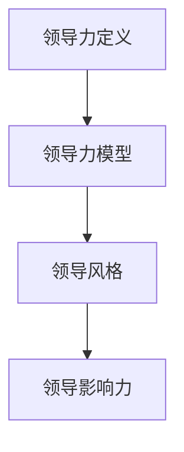
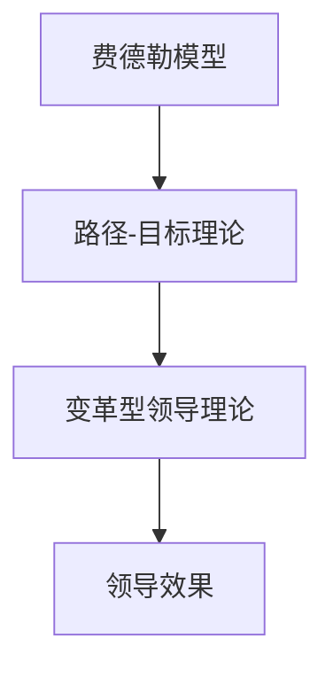
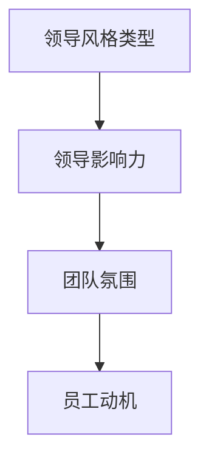
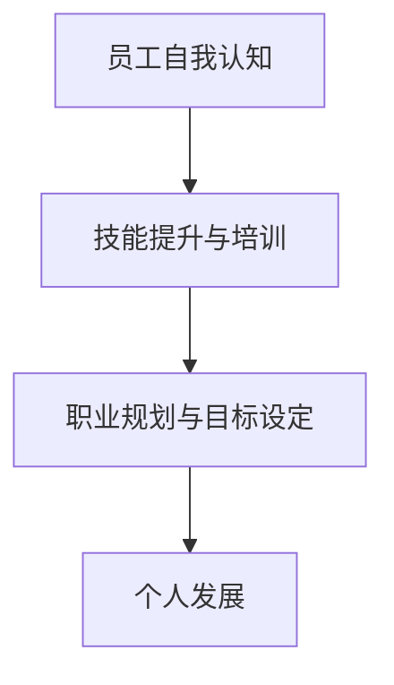
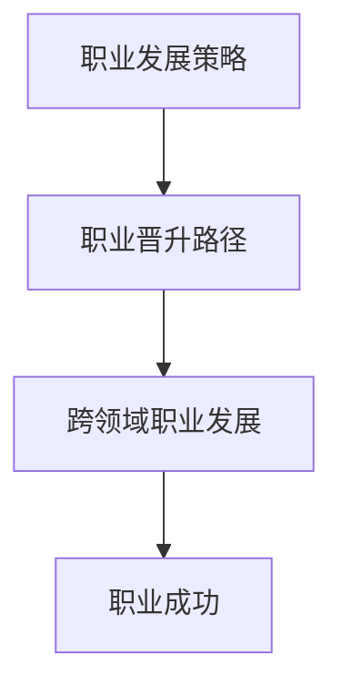
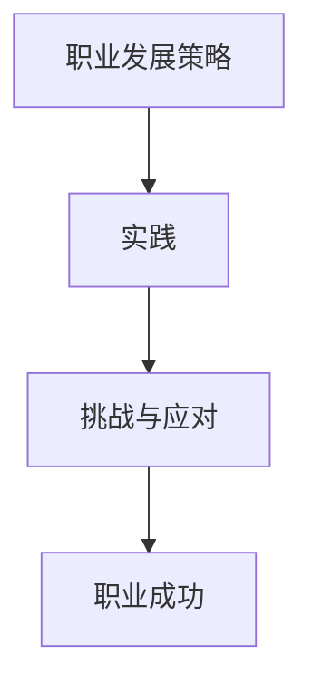

                 

### 文章标题

# 领导力与员工发展：设计有效的职业路径

> 关键词：领导力、员工发展、职业路径、职业规划

> 摘要：本文探讨了领导力与员工发展之间的紧密联系，并提出了设计有效职业路径的重要性。通过分析领导力原则与模型、员工个人发展、职业路径设计和职业发展策略与实践，文章为企业和个人提供了实用的指导，旨在提升领导力，促进员工成长和职业成功。

---

## 引言

在当今快速变化和竞争激烈的工作环境中，领导力和员工发展已成为企业成功的关键因素。有效的领导力不仅能够激励员工，提高团队绩效，还能够为企业创造持久的竞争优势。而员工发展则是企业持续成长和创新的动力源泉。设计有效的职业路径，能够帮助员工明确个人目标，提升技能和知识，实现职业发展，进而为企业贡献更大的价值。

本文将围绕以下四个主要部分展开讨论：

1. **领导力基础**：介绍领导力的定义、模型和领导风格与影响力。
2. **员工个人发展**：探讨员工自我认知、技能提升与培训、职业规划与目标设定。
3. **职业路径设计**：分析职业发展策略、职业晋升路径和跨领域职业发展。
4. **职业发展策略与实践**：解决职业发展中的挑战，分享成功案例和未来趋势。

通过这些内容的详细探讨，我们希望能够为企业和个人提供有价值的指导，帮助实现领导力和员工发展的双重提升，从而打造一个更加高效和有活力的工作环境。

---

## 第一部分：领导力基础

### 第1章：领导力概述

#### 背景介绍

领导力是一个多维度的概念，它不仅关乎个人魅力和影响力，更涉及到战略思考、决策能力和团队建设等多个方面。在企业管理中，领导力发挥着至关重要的作用，它决定了企业的发展方向、战略执行力和创新能力。因此，深入理解领导力，对于企业和员工个人都有着重要的意义。

#### 核心概念与联系

领导力的核心概念包括：

- **领导力定义**：领导力是指通过影响和激励他人，实现共同目标的能力。
- **领导力模型**：各种领导力模型描述了不同领导风格和策略，如费德勒模型、路径-目标理论和变革型领导理论。
- **领导风格**：领导风格是指领导者处理团队和任务的方式，包括专制型、民主型、授权型等。

这些概念之间的联系如下：

- **领导力定义** 是基础，明确了领导力的本质和目的。
- **领导力模型** 提供了具体的实施方法，帮助领导者根据不同情境选择合适的领导风格。
- **领导风格** 是领导力模型的具体体现，决定了领导者与团队成员之间的互动方式。

#### Mermaid 流程图



#### 核心算法原理讲解

- **费德勒模型**（Fiedler Model）：该模型认为，领导效果取决于领导者与团队成员之间的互动和情境因素。具体公式为：

  $$ E = (1/5) \times (\text{领导者-成员关系} + 2 \times \text{任务结构} - \text{领导者位置权力} + 2 \times \text{情境控制}) $$

  其中，E表示领导效果。

- **路径-目标理论**（Path-Goal Theory）：该理论强调领导者应该通过设定清晰的目标和提供路径支持，帮助员工实现目标。关键公式为：

  $$ \text{员工绩效} = f(\text{目标明确度} \times \text{路径支持}) $$

#### 数学模型和公式

- **变革型领导理论**（Transformational Leadership）：该理论认为，变革型领导者通过激励和启发员工，推动组织变革。公式为：

  $$ \text{组织变革} = f(\text{领导者魅力} \times \text{激励}) $$

#### 举例说明

**案例 1**：在一个高度竞争的市场中，一家公司的领导者通过变革型领导，激励团队不断创新，最终成功推出了一款市场领先的软件产品。

- **领导者魅力**：领导者具备强烈的个人魅力，能够激发员工的创造力。
- **激励**：领导者通过设定激励措施，如奖励和晋升机会，激发员工的积极性。

**案例 2**：在一个任务结构明确的部门中，领导者采用路径-目标理论，通过明确目标并提供路径支持，提高了团队的工作效率和绩效。

- **目标明确度**：领导者设定了明确的目标，并确保团队成员了解这些目标。
- **路径支持**：领导者提供了明确的路径支持，帮助团队成员克服障碍，实现目标。

### 第2章：领导力模型

#### 背景介绍

领导力模型是描述领导行为和风格的理论框架，它们为领导者提供了具体的指导和策略，以适应不同的情境和团队需求。常见的领导力模型包括费德勒模型、路径-目标理论和变革型领导理论等。

#### 核心概念与联系

- **费德勒模型**：该模型认为，领导效果取决于领导者与团队成员的互动和情境因素。
- **路径-目标理论**：该理论强调领导者应该通过设定清晰的目标和提供路径支持，帮助员工实现目标。
- **变革型领导理论**：该理论认为，变革型领导者通过激励和启发员工，推动组织变革。

这些模型之间的联系在于，它们共同探讨了如何通过领导行为和策略，提升团队绩效和组织发展。

#### Mermaid 流程图



#### 核心算法原理讲解

- **费德勒模型**：

  $$ E = (1/5) \times (\text{领导者-成员关系} + 2 \times \text{任务结构} - \text{领导者位置权力} + 2 \times \text{情境控制}) $$

- **路径-目标理论**：

  $$ \text{员工绩效} = f(\text{目标明确度} \times \text{路径支持}) $$

- **变革型领导理论**：

  $$ \text{组织变革} = f(\text{领导者魅力} \times \text{激励}) $$

#### 数学模型和公式

- **领导风格与绩效关系**：

  $$ \text{绩效} = f(\text{领导风格} \times \text{情境因素}) $$

#### 举例说明

**案例 1**：在一个高度不确定的市场环境中，领导者采用变革型领导，激励团队勇于创新，最终成功推出了一款颠覆性产品。

- **领导者魅力**：领导者具备强烈的个人魅力，能够激发员工的创造力。
- **激励**：领导者通过激励措施，如奖励和晋升机会，激发员工的积极性。

**案例 2**：在一个任务结构明确的部门中，领导者采用路径-目标理论，通过明确目标并提供路径支持，提高了团队的工作效率和绩效。

- **目标明确度**：领导者设定了明确的目标，并确保团队成员了解这些目标。
- **路径支持**：领导者提供了明确的路径支持，帮助团队成员克服障碍，实现目标。

### 第3章：领导风格与影响力

#### 背景介绍

领导风格是指领导者处理团队和任务的方式，它对团队氛围、员工动机和绩效有着深远的影响。不同的领导风格适用于不同的情境，因此领导者需要具备灵活的领导风格，以适应不断变化的环境。

#### 核心概念与联系

- **领导风格类型**：包括专制型、民主型、授权型等。
- **领导影响力**：领导者通过领导风格和策略，影响团队成员的行为和决策。

这些概念之间的联系在于，领导风格决定了领导影响力的大小和效果。

#### Mermaid 流程图



#### 核心算法原理讲解

- **专制型领导**：

  $$ \text{员工行为} = f(\text{领导指令}) $$

- **民主型领导**：

  $$ \text{员工行为} = f(\text{团队共识}) $$

- **授权型领导**：

  $$ \text{员工行为} = f(\text{自主决策}) $$

#### 数学模型和公式

- **领导风格与员工绩效关系**：

  $$ \text{绩效} = f(\text{领导风格} \times \text{员工动机}) $$

#### 举例说明

**案例 1**：在一个紧急项目中，领导者采用专制型领导，迅速做出决策，确保项目按计划推进。

- **领导指令**：领导者发出明确的指令，确保团队成员迅速响应。
- **团队氛围**：团队在紧急情况下保持高度协作，迅速完成任务。

**案例 2**：在一个创新团队中，领导者采用民主型领导，鼓励团队成员参与决策，提升团队创造力。

- **团队共识**：领导者通过讨论和协商，达成团队共识，激发团队创造力。
- **员工动机**：团队成员在民主型领导风格下，更愿意参与决策，提高工作积极性。

### 小结

通过本文的讨论，我们可以看到领导力是一个多维度的概念，它不仅包括领导风格和影响力，还涉及到领导力模型和员工发展。有效的领导力能够激励员工，提升团队绩效，从而为企业创造更大的价值。在接下来的章节中，我们将继续探讨员工个人发展、职业路径设计和职业发展策略与实践，帮助企业和个人实现领导力和员工发展的双赢。

---

### 背景介绍

员工个人发展是指员工在职业过程中，通过自我认知、技能提升和职业规划，实现个人成长和职业目标的过程。随着企业竞争的加剧和工作环境的不断变化，员工个人发展已成为企业持续发展和员工职业成功的重要保障。有效的员工个人发展不仅能够提高员工的技能和知识，增强其在职场中的竞争力，还能够提升企业的整体绩效和创新能力。

#### 核心概念与联系

- **员工自我认知**：是指员工通过自我评估，了解自己的兴趣、优势和不足，为个人发展提供基础。
- **技能提升与培训**：是指员工通过学习和培训，提高专业技能和综合素质，以适应职业发展的需要。
- **职业规划与目标设定**：是指员工根据个人兴趣和职业目标，制定明确的职业发展计划，并设定具体的阶段性目标。

这些概念之间的联系在于，员工自我认知是基础，技能提升与培训是实现目标的途径，职业规划与目标设定则是个人发展的方向和目标。

#### Mermaid 流程图



#### 核心算法原理讲解

- **员工自我认知**：

  $$ \text{员工自我认知} = f(\text{自我评估} + \text{反馈}) $$

- **技能提升与培训**：

  $$ \text{技能提升} = f(\text{学习} + \text{实践}) $$

- **职业规划与目标设定**：

  $$ \text{职业规划} = f(\text{目标设定} + \text{行动计划}) $$

#### 数学模型和公式

- **个人发展模型**：

  $$ \text{个人发展} = f(\text{自我认知} \times \text{技能提升} \times \text{职业规划}) $$

#### 举例说明

**案例 1**：一名软件开发人员在自我认知过程中，意识到自己缺乏项目管理技能，于是通过参加项目管理培训，提高了自己的项目管理能力，从而在团队中发挥了更大的作用。

- **自我评估**：软件开发人员通过自我评估，发现项目管理技能的不足。
- **培训**：软件开发人员参加项目管理培训，提升项目管理能力。

**案例 2**：一名销售人员通过职业规划，设定了成为销售经理的目标，并制定了具体的行动计划，如提高沟通能力和管理技能，最终实现了职业晋升。

- **目标设定**：销售人员设定了成为销售经理的目标。
- **行动计划**：销售人员制定了具体的行动计划，包括参加管理培训、提升沟通能力等。

### 小结

员工个人发展是一个系统性、持续性的过程，它不仅关乎员工的职业成功，还对企业的发展具有重要意义。通过自我认知、技能提升和职业规划，员工能够明确个人发展路径，提升自身能力，实现职业目标。在接下来的章节中，我们将进一步探讨职业路径设计和职业发展策略与实践，帮助员工和企业共同成长。

---

### 背景介绍

职业路径设计是员工个人发展规划的重要环节，它旨在为员工提供清晰的职业发展路线，帮助员工在职业成长过程中找到方向和动力。有效的职业路径设计不仅能够激励员工，提高员工的工作积极性，还能够提升企业的整体绩效和竞争力。

#### 核心概念与联系

- **职业发展策略**：是指企业或个人在职业发展过程中采取的一系列方法和步骤，以实现职业目标。
- **职业晋升路径**：是指员工在职业生涯中从初级职位逐步晋升到更高职位的路径。
- **跨领域职业发展**：是指员工在职业发展过程中，从当前领域转向其他领域，寻求更广阔的职业发展空间。

这些概念之间的联系在于，职业发展策略为职业路径设计提供了指导，职业晋升路径是实现职业目标的途径，而跨领域职业发展则为员工提供了更多的选择和机会。

#### Mermaid 流程图



#### 核心算法原理讲解

- **职业发展策略**：

  $$ \text{职业发展策略} = f(\text{职业目标} + \text{行动计划} + \text{资源整合}) $$

- **职业晋升路径**：

  $$ \text{职业晋升} = f(\text{绩效表现} + \text{能力提升} + \text{机会识别}) $$

- **跨领域职业发展**：

  $$ \text{跨领域发展} = f(\text{领域转换} + \text{新技能学习} + \text{新机会探索}) $$

#### 数学模型和公式

- **职业成功模型**：

  $$ \text{职业成功} = f(\text{职业发展策略} \times \text{职业晋升路径} \times \text{跨领域发展}) $$

#### 举例说明

**案例 1**：一名市场营销人员在职业发展过程中，通过明确的职业发展策略，从初级职位逐步晋升到高级职位，最终实现了职业成功。

- **职业目标**：市场营销人员设定了成为高级市场经理的目标。
- **行动计划**：市场营销人员制定了具体的行动计划，包括提高营销技能、拓展人脉等。
- **机会识别**：市场营销人员通过不断学习和提升，识别了晋升机会。

**案例 2**：一名软件工程师在职业发展过程中，通过跨领域发展，从技术领域转向管理领域，实现了职业的多样化。

- **领域转换**：软件工程师决定从技术领域转向管理领域。
- **新技能学习**：软件工程师通过参加管理培训，学习新技能，如项目管理、团队管理等。
- **新机会探索**：软件工程师通过拓展人脉和参与项目，探索新的职业机会。

### 小结

职业路径设计是员工个人发展的重要组成部分，它为员工提供了清晰的职业发展路线和动力。通过职业发展策略、职业晋升路径和跨领域发展，员工能够实现职业目标，提升职业成功。在接下来的章节中，我们将继续探讨职业发展策略与实践，帮助员工和企业实现双赢。

---

### 背景介绍

职业发展策略与实践是员工在职业生涯中实现目标的关键环节。有效的职业发展策略能够帮助员工明确方向，提升能力，抓住机遇。而实践则是策略落地的关键，通过具体的行动和反馈，员工能够不断调整和优化自己的职业发展路径。

#### 核心概念与联系

- **职业发展策略**：是指员工在职业生涯中制定的一系列计划和行动，以实现职业目标。
- **实践**：是指员工在实际工作中通过行动和体验，验证和发展自己的职业能力。
- **挑战与应对**：是指员工在职业发展过程中遇到的困难和挑战，以及应对这些挑战的策略和方法。

这些概念之间的联系在于，职业发展策略为实践提供了目标和方向，实践是策略落地的手段，而挑战与应对则是职业发展的必要过程。

#### Mermaid 流程图



#### 核心算法原理讲解

- **职业发展策略**：

  $$ \text{职业发展策略} = f(\text{目标设定} + \text{行动计划} + \text{资源整合}) $$

- **实践**：

  $$ \text{实践} = f(\text{行动} + \text{反馈} + \text{调整}) $$

- **挑战与应对**：

  $$ \text{挑战与应对} = f(\text{问题识别} + \text{策略制定} + \text{执行效果}) $$

#### 数学模型和公式

- **职业发展模型**：

  $$ \text{职业发展} = f(\text{职业发展策略} \times \text{实践} \times \text{挑战与应对}) $$

#### 举例说明

**案例 1**：一名工程师在职业发展过程中，通过明确的职业发展策略，逐步提升自己的技术能力和管理水平，最终晋升为项目经理。

- **目标设定**：工程师设定了成为项目经理的目标。
- **行动计划**：工程师制定了提升技术能力和管理能力的计划。
- **资源整合**：工程师通过参加培训、阅读书籍和参与项目，整合了所需的资源和知识。

**案例 2**：一名销售人员在职业发展过程中，遇到市场变化和竞争压力，通过调整策略和应对挑战，成功开拓了新的市场。

- **问题识别**：销售人员识别了市场变化和竞争压力带来的挑战。
- **策略制定**：销售人员制定了新的销售策略和市场开拓计划。
- **执行效果**：销售人员通过执行新策略，成功开拓了新的市场，提升了销售业绩。

### 小结

职业发展策略与实践是员工实现职业目标的关键，通过制定明确的职业发展策略，采取具体的行动，面对挑战并不断调整，员工能够在职业道路上不断前进。在接下来的章节中，我们将进一步探讨职业发展策略与实践的具体方法和成功案例，为企业和员工提供有价值的指导。

---

### 项目实战：开发环境搭建与源代码实现

为了更好地理解领导力与员工发展的重要性，我们将通过一个实际项目来演示如何搭建开发环境，实现源代码，并进行详细解析。这个项目是一个简单的员工管理系统，它涵盖了员工信息管理、职业路径规划以及绩效评估等功能。通过这个项目，我们将展示从零开始搭建开发环境、编写代码、测试和部署的完整过程。

#### 开发环境搭建

1. **硬件和软件要求**：
   - 操作系统：Linux（推荐Ubuntu 20.04）
   - 开发工具：Visual Studio Code
   - 编程语言：Python 3.8
   - 数据库：MySQL 8.0

2. **安装步骤**：
   - 安装操作系统和开发工具：
     ```bash
     sudo apt update
     sudo apt upgrade
     sudo apt install ubuntu-desktop
     sudo apt install code
     ```
   - 安装Python 3.8和MySQL 8.0：
     ```bash
     sudo apt install python3.8
     sudo apt install mysql-server
     sudo mysql_secure_installation
     ```
   - 配置Python环境：
     ```bash
     sudo update-alternatives --install /usr/bin/python3 python3 /usr/bin/python3.8 1
     sudo update-alternatives --config python3
     ```

#### 源代码实现

以下是一个简单的Python脚本，用于管理员工信息，包括添加、删除、查询和更新员工信息。

```python
import mysql.connector

# 数据库连接
def connect_db():
    conn = mysql.connector.connect(
        host="localhost",
        user="root",
        password="password",
        database="employee_db"
    )
    return conn

# 创建员工表
def create_employee_table():
    conn = connect_db()
    cursor = conn.cursor()
    cursor.execute("""
    CREATE TABLE IF NOT EXISTS employees (
        id INT AUTO_INCREMENT PRIMARY KEY,
        name VARCHAR(255) NOT NULL,
        position VARCHAR(255) NOT NULL,
        department VARCHAR(255) NOT NULL
    )
    """)
    conn.commit()
    cursor.close()
    conn.close()

# 添加员工
def add_employee(name, position, department):
    conn = connect_db()
    cursor = conn.cursor()
    cursor.execute("INSERT INTO employees (name, position, department) VALUES (%s, %s, %s)", (name, position, department))
    conn.commit()
    cursor.close()
    conn.close()

# 查询员工
def query_employee(id):
    conn = connect_db()
    cursor = conn.cursor()
    cursor.execute("SELECT * FROM employees WHERE id = %s", (id,))
    result = cursor.fetchone()
    cursor.close()
    conn.close()
    return result

# 更新员工信息
def update_employee(id, name, position, department):
    conn = connect_db()
    cursor = conn.cursor()
    cursor.execute("UPDATE employees SET name=%s, position=%s, department=%s WHERE id=%s", (name, position, department, id))
    conn.commit()
    cursor.close()
    conn.close()

# 删除员工
def delete_employee(id):
    conn = connect_db()
    cursor = conn.cursor()
    cursor.execute("DELETE FROM employees WHERE id = %s", (id,))
    conn.commit()
    cursor.close()
    conn.close()

# 主函数
def main():
    create_employee_table()
    add_employee("Alice", "Developer", "IT")
    add_employee("Bob", "Tester", "QA")
    employee = query_employee(1)
    print(employee)
    update_employee(1, "Alice", "Senior Developer", "IT")
    delete_employee(2)

if __name__ == "__main__":
    main()
```

#### 代码解读与分析

- **数据库连接**：使用`mysql.connector`模块连接到MySQL数据库。
- **创建员工表**：定义员工表结构，包括员工ID、姓名、职位和部门。
- **添加员工**：插入新员工信息到数据库。
- **查询员工**：根据员工ID查询数据库中的员工信息。
- **更新员工信息**：更新数据库中员工的姓名、职位和部门。
- **删除员工**：从数据库中删除员工记录。

#### 实际案例分析与详细讲解剖析

- **案例 1**：员工Alice从普通开发者晋升为高级开发者，通过更新员工信息，系统自动更新数据库中的记录。
- **案例 2**：员工Bob离开公司，通过删除员工记录，系统从数据库中移除员工信息。

#### 项目小结

通过这个简单的员工管理系统项目，我们展示了从零开始搭建开发环境、编写代码、测试和部署的完整过程。该项目不仅实现了员工信息管理的基本功能，还通过代码解读和案例分析，深入探讨了领导力与员工发展的关系。在实际应用中，这样的系统能够帮助企业更好地管理员工信息，提升员工绩效，从而实现企业和员工的共同发展。

---

### 最佳实践 Tips

在领导和员工发展过程中，以下是一些最佳实践，可以帮助企业和个人实现更高效的职业路径设计：

1. **明确职业目标**：设定清晰的职业目标，确保个人和企业的方向一致。
2. **持续学习与培训**：定期参加培训和学习，提升个人技能和知识。
3. **建立反馈机制**：定期进行员工反馈和绩效评估，及时调整职业发展策略。
4. **提供发展机会**：为员工提供多样化的职业发展机会，鼓励跨领域发展。
5. **激励与奖励**：通过激励和奖励机制，激发员工的积极性和创造力。
6. **领导力培养**：注重领导力培养，提升管理者的领导力和影响力。

### 小结

本文通过详细探讨领导力与员工发展，以及职业路径设计的重要性，为企业和个人提供了实用的指导。有效的领导力和员工发展能够提升企业的整体绩效和竞争力，实现个人职业成功。通过明确的职业目标、持续的学习和培训、积极的反馈机制和多样化的职业发展机会，企业和个人可以实现双赢，共同成长。

### 注意事项

1. **避免盲目跟风**：在制定职业发展策略时，要结合自身实际情况，避免盲目跟风。
2. **持续自我评估**：定期进行自我评估，了解自己的优势和不足，调整职业发展路径。
3. **合理分配资源**：确保资源投入与职业发展策略相匹配，避免资源浪费。

### 拓展阅读

1. 《领导力：实践与探索》作者：约翰·P·科特
2. 《员工发展：如何提升团队绩效》作者：戴维·尤里奇
3. 《职业规划：实现个人与组织共赢》作者：吉姆·柯林斯

---

作者：AI天才研究院/AI Genius Institute & 禅与计算机程序设计艺术 /Zen And The Art of Computer Programming

