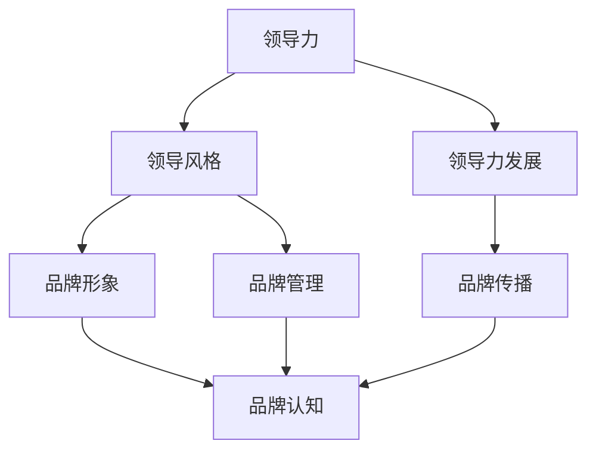

                 

### 文章标题

《领导力与品牌建设：提升团队对外影响力》

### 关键词

- 领导力
- 品牌建设
- 团队影响力
- 领导风格
- 品牌定位
- 品牌传播

### 摘要

本文深入探讨了领导力与品牌建设之间的内在联系，以及如何通过提升团队对外影响力来增强组织的市场竞争力和认知度。文章首先介绍了领导力的核心概念和领导风格的重要性，接着阐述了品牌建设的定义、策略和工具，以及如何通过有效的领导力和品牌建设提升团队的对外影响力。通过实际案例和项目实战，文章提供了实用的策略和方法，帮助读者理解和应用这些概念，从而在IT领域中取得卓越的成绩。

### 背景介绍

在当今快速变化和竞争激烈的市场环境中，领导力和品牌建设成为企业成功的关键因素。领导力不仅仅关乎企业的内部管理，更涉及到对外影响力和市场竞争力。有效的领导力能够激发团队的创造力，推动企业实现目标。而品牌建设则是企业对外展示形象和传递价值的过程，它直接影响消费者对企业产品和服务的认知和信任。

领导力与品牌建设之间的关系是密不可分的。领导者的风格、决策和领导力发展直接影响品牌形象的塑造和传播。一个具备战略眼光和领导能力的领导者能够为企业树立良好的品牌形象，提升品牌价值和市场竞争力。同时，品牌建设也为领导力提供了舞台，通过有效的品牌传播策略，领导者的思想和理念可以更广泛地被市场和公众所接受。

随着互联网和社交媒体的发展，团队对外影响力的重要性日益凸显。如何提升团队在市场中的知名度和影响力，已经成为企业迫切需要解决的问题。本文旨在通过分析领导力和品牌建设的核心概念，探讨如何在IT领域中有效提升团队对外影响力，帮助企业和团队在竞争激烈的市场中脱颖而出。

### 核心概念与联系

为了更清晰地理解领导力与品牌建设之间的内在联系，我们需要首先明确这两个核心概念。

**领导力的核心概念**：

领导力是指领导者通过影响和激励他人来实现共同目标的能力。领导力不仅仅是一种技术或技能，更是一种深刻的影响力。领导力的核心概念包括：

1. **领导者角色**：领导者是团队中的核心人物，负责制定方向、设定目标、分配资源和管理团队。
2. **领导风格**：领导风格是领导者对待团队成员的方式和方法，常见的领导风格包括权威型、民主型、变革型等。
3. **领导力发展**：领导力发展是指领导者通过持续学习和实践，提升自己的领导能力和影响力。

**品牌建设的核心概念**：

品牌建设是企业通过一系列策略和活动，在消费者心目中建立和强化品牌形象的过程。品牌建设的核心概念包括：

1. **品牌定位**：品牌定位是指企业确定自己的目标市场，并在市场中树立独特的品牌形象和差异化优势。
2. **品牌传播**：品牌传播是指企业通过各种渠道和手段，将品牌信息传递给目标受众，建立品牌认知和信任。
3. **品牌管理**：品牌管理是指企业通过系统的方法和工具，维护和提升品牌价值，包括品牌监测、危机管理等。

**领导力与品牌建设之间的联系**：

领导力与品牌建设之间的联系可以通过以下Mermaid流程图来展示：

- **领导风格与品牌形象**：领导者的风格直接影响品牌形象。例如，变革型领导力能够激发创新，提升品牌形象。
- **领导力发展与品牌传播**：领导者的持续发展能够推动品牌传播的创新和策略更新，从而增强品牌影响力。
- **品牌管理与品牌认知**：有效的品牌管理能够提升品牌认知度和市场竞争力，为领导力提供更广阔的舞台。

通过这个流程图，我们可以清晰地看到领导力与品牌建设之间的紧密联系。领导力的发展不仅影响品牌形象和品牌传播，还通过品牌管理提升品牌认知度和市场影响力。

### 领导力与品牌建设的关系

领导力与品牌建设之间的相互作用是推动企业成功的关键因素。有效的领导力不仅能够提升团队绩效，还能塑造和强化品牌形象，从而增强企业的市场竞争力。以下将详细探讨领导力与品牌建设之间的关系，并运用实际案例来阐述这种关系。

**领导力对品牌建设的影响**：

1. **品牌形象塑造**：领导者的风格和决策直接影响品牌形象。一个具有远见和领导能力的领导者能够为企业制定明确的发展方向，并通过其言行树立企业的品牌形象。例如，乔布斯的领导风格以其创新和卓越的品味著称，这种风格不仅提升了苹果公司的品牌形象，还塑造了其作为行业领导者的地位。

2. **品牌传播策略**：领导力的发展能够推动品牌传播的创新和策略更新。领导者通过不断学习和实践，能够引入新的传播手段和渠道，提高品牌传播的效率和效果。例如，谷歌的创始人拉里·佩奇和谢尔盖·布林通过开放的文化和创新的思维方式，推动了谷歌的品牌传播策略，使其在短时间内迅速成为全球知名品牌。

3. **品牌价值提升**：领导者的领导力能够通过提高团队绩效和创新能力，提升品牌价值。一个高效的领导团队能够带来高质量的产品和服务，从而增强消费者的信任和忠诚度。例如，特斯拉的埃隆·马斯克通过其领导力和创新精神，不仅推动了特斯拉在电动汽车领域的领导地位，还显著提升了品牌价值。

**品牌建设对领导力的影响**：

1. **领导者的形象和声誉**：一个强大的品牌能够提升领导者的形象和声誉。领导者的品牌建设能力不仅体现在企业内部，也体现在对外界的影响力。例如，IBM前CEO郭士纳通过其卓越的品牌管理能力，成功重塑了IBM的品牌形象，同时也提升了自身的领导力和声誉。

2. **战略决策的制定**：品牌建设的过程需要领导者制定清晰的战略决策。品牌定位、品牌传播和品牌管理都需要领导者的深入思考和决策。例如，可口可乐在品牌建设过程中，通过不断调整品牌策略，成功应对了市场变化和消费者需求，这为领导者的战略决策提供了宝贵的经验。

3. **领导力的提升**：品牌建设是一个持续的过程，需要领导者具备持续学习和创新的能力。通过品牌建设，领导者可以不断提升自己的领导力和管理技能，从而更好地应对企业面临的挑战。例如，诺基亚在智能手机市场中的失败，使当时的CEO奥利·帕尔玛深刻认识到品牌建设的重要性，并开始积极提升自己的领导力。

**实际案例**：

1. **苹果公司**：乔布斯的领导力塑造了苹果公司的品牌形象，使其成为全球最具价值的品牌之一。乔布斯的领导风格注重创新和卓越的用户体验，这种风格不仅吸引了大量的消费者，还提升了苹果的品牌认知度和忠诚度。

2. **谷歌公司**：谷歌的创始人拉里·佩奇和谢尔盖·布林通过其卓越的领导力，推动了谷歌的品牌建设。他们倡导开放文化和创新思维，使谷歌成为全球最具创新力的公司之一，其品牌形象也因此得到了显著提升。

3. **可口可乐公司**：可口可乐的CEO郭士纳通过品牌建设，成功重塑了公司的品牌形象。他引入了一系列创新的品牌传播策略，使可口可乐重新焕发了活力，并提升了品牌价值。

通过这些实际案例，我们可以看到领导力与品牌建设之间的密切关系。领导力不仅能够塑造和强化品牌形象，还能够推动品牌建设，从而提升企业的市场竞争力。而品牌建设则为领导者提供了更广阔的舞台，使其领导力得以更好地发挥和提升。

### 领导风格与团队管理

领导风格是领导者对待团队成员的方式和方法，不同的领导风格会对团队管理产生显著的影响。常见的领导风格包括权威型、民主型、变革型等，每种风格都有其独特的特点和适用场景。

**权威型领导风格**：

权威型领导风格强调领导者的权力和决策控制，领导者通过下达指令和严格的管理制度来确保团队目标的实现。这种风格在紧急情况下或需要迅速做出决策时尤为有效，因为它可以迅速统一行动，避免决策延误。然而，过多的权威型领导可能导致团队成员缺乏自主性和创造力，从而影响团队的整体绩效和创新能力。

**民主型领导风格**：

民主型领导风格注重团队合作和参与，领导者鼓励团队成员参与决策过程，尊重团队成员的意见和建议。这种风格可以激发团队成员的积极性和创造力，提高团队的凝聚力和协作效率。然而，民主型领导风格在需要迅速决策或面对复杂问题时可能显得过于缓慢，因为需要更多的时间和讨论来达成共识。

**变革型领导风格**：

变革型领导风格注重激发团队成员的内在动机和潜能，领导者通过愿景和激励来引导团队实现变革和创新。这种风格能够激发团队成员的创造力和创新精神，推动企业实现战略目标和持续发展。然而，变革型领导风格需要领导者具备高度的领导力和影响力，以及能够应对变革过程中的挑战和阻力。

**领导风格对团队管理的影响**：

不同的领导风格会对团队管理产生不同的影响。权威型领导风格在确保团队高效运作和控制风险方面具有优势，但在激发团队成员的潜力和创造力方面可能存在局限性。民主型领导风格能够提高团队协作效率和创新能力，但在应对紧急情况和复杂问题时可能显得不够迅速。变革型领导风格能够推动团队实现变革和创新，但需要领导者具备高度的领导力和影响力。

**实际案例分析**：

1. **苹果公司**：乔布斯以其变革型领导风格著称，他通过激发员工的创造力和创新精神，推动了苹果公司在多个领域取得突破性进展。乔布斯的领导风格注重细节和创新，使苹果公司成为全球最具创新力的公司之一。

2. **谷歌公司**：谷歌的创始人拉里·佩奇和谢尔盖·布林采用民主型领导风格，鼓励员工自由探索和尝试新的想法。这种领导风格不仅激发了员工的创造力和创新精神，还促进了谷歌在技术创新和商业模式创新方面的持续发展。

3. **诺基亚公司**：诺基亚在智能手机市场上的失败，部分原因是其领导者采用了权威型领导风格，过于依赖顶层决策和控制，导致创新能力和市场反应速度不足。这一案例表明，领导风格对团队管理和发展具有深远的影响。

通过这些实际案例分析，我们可以看到不同领导风格在团队管理中的优势和局限性。领导者应根据实际情况选择合适的领导风格，并在实践中不断调整和优化，以实现团队的最佳绩效和持续发展。

### 领导力发展与实践

领导力发展是一个持续的过程，它不仅涉及领导技能的提升，还包括领导素质和领导自信的增强。以下将详细探讨领导力发展的路径、培养策略和实践方法，并提供具体的案例和实用技巧，帮助读者在IT领域中提升领导力。

**领导力发展的路径**：

1. **自我认知**：领导力发展的第一步是自我认知，领导者需要深入了解自己的性格、价值观和领导风格。通过自我反思和反馈，领导者可以识别自己的优势和不足，明确个人成长的目标。

2. **技能提升**：领导力的提升离不开专业技能的学习和实践。领导者可以通过参加培训课程、阅读相关书籍和参与实际项目，提升自己的管理技能、沟通技巧和决策能力。

3. **经验积累**：领导力的发展需要在实践中积累经验。领导者应主动承担各种责任和挑战，通过实际操作和经验总结，不断提升自己的领导能力。

4. **持续学习**：领导力是一个动态发展的过程，领导者需要保持持续学习的态度，不断更新自己的知识和技能，以适应快速变化的市场环境。

**培养策略**：

1. **角色扮演**：角色扮演是一种有效的领导力培养方法，通过模拟实际工作场景，领导者可以锻炼自己的决策能力、沟通技巧和团队管理能力。

2. **导师指导**：导师指导可以帮助领导者获得宝贵的经验和指导，通过导师的反馈和建议，领导者可以更快速地成长。

3. **团队合作**：领导力的发展需要通过团队合作来实践。领导者应主动参与团队活动，培养团队合作精神和领导力。

4. **危机管理**：危机管理是领导力的重要组成部分，领导者应通过模拟危机场景，提高自己在面对危机时的决策能力和应变能力。

**实践方法**：

1. **设定目标**：领导者应明确团队的目标和任务，通过设定具体的、可衡量的目标，激励团队成员努力工作。

2. **激励团队**：领导者应善于激励团队成员，通过奖励和认可，提高团队成员的工作积极性和创造力。

3. **沟通协作**：领导者应建立有效的沟通渠道，促进团队成员之间的信息共享和协作，提高团队的整体绩效。

4. **培养人才**：领导者应关注团队成员的成长和发展，通过提供培训机会和职业发展路径，培养未来的领导人才。

**实际案例**：

1. **微软公司**：微软公司通过内部领导力发展计划，帮助员工提升领导力。公司为员工提供各种培训课程、导师指导和实际项目经验，使员工能够在工作中不断成长和提升。

2. **亚马逊公司**：亚马逊公司通过其领导力发展计划，培养员工的领导能力和决策能力。公司鼓励员工参与各种领导力培训和实践项目，提高其领导力和管理技能。

**实用技巧**：

1. **倾听与反馈**：领导者应善于倾听团队成员的意见和建议，并通过积极的反馈，帮助团队成员提升自己的能力和绩效。

2. **情绪管理**：领导者需要具备良好的情绪管理能力，保持冷静和理智，以应对工作中的压力和挑战。

3. **时间管理**：领导者应合理安排时间，提高工作效率，确保团队目标的顺利实现。

4. **持续学习**：领导者应保持持续学习的态度，通过阅读、培训和实践，不断提升自己的知识和技能。

通过以上领导力发展路径、培养策略和实践方法的探讨，读者可以更好地理解如何在IT领域中提升领导力。领导力的发展不仅需要理论的指导，更需要实践的应用。只有通过不断的实践和反思，领导者才能在团队管理和企业发展中取得卓越的成就。

### 品牌建设的核心概念

品牌建设是企业通过一系列策略和活动，在消费者心目中建立和强化品牌形象的过程。品牌建设不仅仅是营销的一部分，它涉及到企业的整体战略，包括产品开发、客户服务、员工文化等多个方面。以下将详细探讨品牌建设的核心概念，包括品牌定位、品牌传播和品牌管理。

**品牌定位**：

品牌定位是品牌建设的基础，它指的是企业确定自己在目标市场中的位置，并创造出独特的品牌印象。品牌定位需要考虑以下几个方面：

1. **目标市场**：明确品牌的目标消费者群体，了解他们的需求和偏好，以便制定合适的市场策略。
2. **差异化优势**：找出品牌与竞争对手的区别，明确品牌的独特卖点（USP），使其在市场中脱颖而出。
3. **品牌个性**：塑造品牌形象和品牌文化，使其具有独特的性格和情感联结。

**品牌传播**：

品牌传播是品牌建设的关键环节，它通过多种渠道和手段，将品牌信息传递给目标受众，建立品牌认知和信任。品牌传播的策略包括：

1. **广告**：通过广告宣传品牌的核心价值和差异化优势，提升品牌知名度。
2. **公关**：利用新闻媒体、行业会议和公共关系活动，塑造品牌形象和声誉。
3. **社交媒体**：通过社交媒体平台与消费者互动，提高品牌的曝光率和影响力。
4. **内容营销**：通过高质量的内容，如博客、视频和案例研究，提供价值，增强品牌信任。

**品牌管理**：

品牌管理是维护和提升品牌价值的重要手段，它涉及多个方面的策略和活动。品牌管理的核心内容包括：

1. **品牌监测**：通过市场调研和数据分析，监测品牌的表现和消费者的反馈，及时发现品牌问题。
2. **品牌维护**：通过持续的营销活动和客户服务，保持品牌的一致性和高质量。
3. **品牌保护**：通过法律手段保护品牌，防止品牌被抄袭和侵权。
4. **品牌延伸**：在确保品牌核心价值不变的情况下，通过产品线扩展、新市场进入等手段，实现品牌的多样化发展。

**品牌建设的重要性**：

品牌建设对企业的长期成功至关重要。通过有效的品牌建设，企业可以实现以下几个方面的目标：

1. **提高品牌知名度**：通过品牌传播，使更多的消费者了解和认可品牌，提升品牌的市场认知度。
2. **增强品牌认知**：通过品牌定位，使消费者对品牌有清晰和独特的认知，形成品牌偏好。
3. **提升品牌价值**：通过品牌管理和维护，保持品牌的高质量和一致形象，增强品牌的市场影响力。
4. **促进销售增长**：强大的品牌能够吸引消费者，提高产品销售，实现业务增长。

**实际案例**：

1. **苹果公司**：苹果公司通过其独特的品牌定位和强大的品牌传播，成功塑造了科技高端、创新和用户体验卓越的品牌形象。苹果的品牌建设策略包括广告宣传、产品创新和优质的客户服务。

2. **可口可乐公司**：可口可乐通过长期的公关活动和品牌延伸，成功建立了全球领先的饮料品牌形象。可口可乐的品牌管理策略包括品牌监测、危机管理和品牌延伸，如推出新口味和扩展全球市场。

通过以上对品牌建设核心概念的探讨，我们可以看到品牌建设在企业发展中的重要作用。品牌建设不仅能够提升企业的市场竞争力，还能够为企业带来长期的品牌价值和业务增长。企业需要通过系统的品牌建设策略，实现品牌的持续发展和市场成功。

### 品牌定位与品牌传播

品牌定位与品牌传播是品牌建设过程中至关重要的两个环节，它们决定了品牌在消费者心目中的形象和市场认知。以下将详细探讨品牌定位和品牌传播的核心策略，以及如何通过有效的策略提升品牌影响力。

**品牌定位的核心策略**：

1. **明确目标市场**：品牌定位的第一步是明确目标市场。这需要企业深入分析目标消费者的需求、行为和偏好，确定品牌将服务于哪些消费者群体。例如，苹果公司明确其目标市场是高端消费者，通过提供高端科技产品和卓越的用户体验，成功吸引了这部分消费者。

2. **差异化优势**：品牌定位的核心在于找出品牌与竞争对手的区别，并明确品牌的独特卖点（USP）。差异化优势可以是产品质量、技术创新、价格优势或独特的品牌文化。例如，特斯拉的差异化优势在于其创新的电动汽车技术和环保理念，使其在电动汽车市场中脱颖而出。

3. **品牌形象塑造**：品牌定位需要通过品牌形象塑造来传达品牌的独特性和价值观。品牌形象不仅体现在产品的设计和质量上，还体现在品牌的宣传和营销活动中。例如，星巴克通过其独特的店面设计、咖啡文化和优质的服务，成功塑造了其独特的品牌形象。

**品牌传播的核心策略**：

1. **广告宣传**：广告是品牌传播的重要手段，通过广告可以迅速传达品牌的核心价值和差异化优势。有效的广告应具有吸引力和说服力，能够引起消费者的兴趣和共鸣。例如，可口可乐的广告常常通过温馨、幽默的方式，传递其品牌的快乐和友谊形象。

2. **公关活动**：公关活动可以帮助品牌建立良好的声誉和公众形象。通过新闻发布会、行业会议、慈善活动等公关活动，品牌可以提升其在公众和媒体中的曝光率，增强品牌影响力。例如，阿里巴巴通过其“双十一购物节”公关活动，成功提升了品牌的知名度和影响力。

3. **社交媒体营销**：社交媒体平台是品牌传播的重要渠道，通过社交媒体，品牌可以与消费者进行互动，提高品牌的曝光率和影响力。有效的社交媒体营销策略包括内容营销、社交媒体广告和用户互动。例如，耐克通过其社交媒体账号，发布高质量的健身内容和产品信息，吸引了大量粉丝，增强了品牌影响力。

**提升品牌影响力的策略**：

1. **整合营销**：通过整合多种营销手段，如广告、公关、社交媒体和内容营销，形成统一的品牌传播策略，提高品牌的一致性和影响力。例如，小米通过线上线下结合的整合营销策略，成功提升了其品牌影响力。

2. **用户体验**：提供卓越的用户体验是提升品牌影响力的关键。通过优质的产品和服务，满足消费者的需求和期望，增强消费者的品牌忠诚度。例如，苹果公司通过其卓越的用户体验，成功吸引了大量忠实的消费者。

3. **品牌故事**：讲述品牌故事可以帮助消费者更深入地了解品牌的历史、文化和价值观，增强品牌与消费者之间的情感联结。例如，星巴克通过其咖啡文化的品牌故事，成功吸引了大量消费者，提升了品牌影响力。

**实际案例**：

1. **可口可乐**：可口可乐通过其独特的品牌定位和广泛的品牌传播策略，成功建立了全球领先的饮料品牌形象。可口可乐通过广告宣传、公关活动和社交媒体营销，不断提升其品牌知名度和影响力。

2. **特斯拉**：特斯拉通过其创新的电动汽车技术和环保理念，成功定位为高端电动汽车品牌。特斯拉通过广告宣传、社交媒体互动和用户口碑，不断提升其品牌认知度和市场影响力。

通过以上对品牌定位和品牌传播核心策略的探讨，我们可以看到品牌定位和品牌传播在提升品牌影响力中的重要作用。品牌建设需要通过系统的策略和执行，不断提升品牌在消费者心目中的形象和市场地位，从而实现企业的长期成功。

### 品牌管理策略与工具

品牌管理是企业确保品牌形象一致性和价值提升的关键过程。有效的品牌管理不仅需要明确的核心策略，还需要一系列工具和技术的支持。以下将详细探讨品牌管理的基本原则、常用工具以及如何进行品牌危机管理。

**品牌管理的基本原则**：

1. **一致性**：品牌管理需要确保品牌形象的一致性，包括视觉设计、语言表达和品牌行为。一致的品牌形象有助于增强消费者的信任和认知。

2. **透明度**：品牌管理应保持透明，与消费者和利益相关者保持开放的沟通。透明度有助于建立品牌信任，降低品牌危机的风险。

3. **可持续性**：品牌管理应考虑品牌的长期发展，通过可持续的策略和行动，保持品牌的竞争力和社会责任。

4. **创新性**：品牌管理需要不断创新，以适应市场变化和消费者需求。创新性可以帮助品牌保持新鲜感，避免市场饱和和竞争压力。

**品牌管理的常用工具**：

1. **品牌监测工具**：品牌监测工具用于跟踪品牌在市场中的表现和消费者反馈。常见的品牌监测工具包括社交媒体分析工具、搜索引擎分析和市场调研。

2. **品牌管理系统（CMS）**：品牌管理系统是一种集成的软件平台，用于管理品牌内容、设计和发布。CMS可以帮助企业保持品牌形象的一致性和高效的内容管理。

3. **品牌资产管理工具**：品牌资产管理工具用于管理品牌相关的资产，如标志、广告素材和宣传资料。这些工具可以帮助企业确保品牌资产的安全和合规使用。

**品牌危机管理**：

品牌危机管理是品牌管理的重要组成部分，它涉及如何应对和解决品牌可能面临的负面事件。以下是一些常见的品牌危机管理策略：

1. **预防策略**：预防策略是通过建立良好的品牌声誉和管理体系，降低品牌危机的风险。这包括建立危机预警机制、制定危机应对计划和持续的品牌建设。

2. **快速响应**：在品牌危机发生时，快速响应至关重要。企业需要立即启动危机应对计划，公开透明地与消费者和媒体沟通，提供准确的信息和解决方案。

3. **危机沟通**：有效的危机沟通可以帮助企业降低品牌危机的影响。企业应通过多种渠道与利益相关者沟通，包括新闻发布会、社交媒体、电子邮件和客户服务。

4. **恢复策略**：在品牌危机得到控制后，企业需要实施恢复策略，重建品牌信任和形象。这包括公开道歉、提供补偿方案和加强品牌建设。

**实际案例**：

1. **特斯拉**：特斯拉在面临品牌危机时，通过快速响应和有效的沟通策略，成功解决了多次产品安全和客户服务问题。特斯拉的危机管理团队迅速采取行动，公开回应消费者的担忧，并提供解决方案，从而恢复了品牌信任。

2. **星巴克**：星巴克在面临种族歧视事件时，通过公开道歉和积极的恢复策略，迅速恢复了品牌形象。星巴克不仅采取了内部改革措施，还通过社交媒体和公关活动，与消费者和利益相关者沟通，重建了品牌声誉。

通过以上对品牌管理策略与工具的探讨，我们可以看到品牌管理在维护品牌形象和价值中的重要作用。有效的品牌管理不仅需要系统的策略，还需要灵活应对各种挑战和危机。企业应通过持续的品牌建设和危机管理，确保品牌在市场中的长期成功。

### 团队对外影响力的核心概念

团队对外影响力是评估团队在市场中表现和认可度的重要指标。它不仅反映了团队在专业领域的影响力和认可度，还体现了团队在行业内的影响力和声誉。以下将详细探讨团队对外影响力的核心概念，包括其定义、关键因素和评估方法。

**定义**：

团队对外影响力是指团队在行业内外，通过其专业能力和贡献，获得认可、影响和信任的能力。这种影响力可以通过品牌认知度、市场占有率、行业奖项、客户评价等多个方面来衡量。

**关键因素**：

1. **专业能力**：团队的专业能力是团队对外影响力的重要基础。这包括团队在技术、管理和创新等方面的专业知识和技能。

2. **品牌认知度**：品牌认知度是指消费者和行业内部对团队品牌和产品的认知程度。高品牌认知度有助于提升团队的对外影响力。

3. **创新和创造力**：创新和创造力是团队在行业中保持领先地位的关键。通过不断创新和推出新颖的产品或服务，团队可以吸引更多的关注和认可。

4. **客户满意度**：客户满意度是团队对外影响力的重要体现。高客户满意度不仅提升了团队的市场竞争力，也增强了客户对团队的信任和忠诚度。

5. **行业影响力**：团队在行业内的地位和影响力，如参与行业标准的制定、获得行业奖项等，都是衡量团队对外影响力的重要指标。

**评估方法**：

1. **市场调研**：通过市场调研，了解消费者和行业专家对团队品牌和产品的认知度和满意度，从而评估团队对外影响力。

2. **社交媒体分析**：通过分析团队在社交媒体平台上的互动和关注度，了解团队在公众中的影响力和认可度。

3. **行业奖项**：通过参与行业奖项的评选和获奖情况，评估团队在行业内的认可度和影响力。

4. **客户反馈**：通过收集和分析客户的反馈意见，了解客户对团队的满意度，从而评估团队的服务质量和市场竞争力。

5. **竞争对手分析**：通过分析竞争对手的市场表现和影响力，了解团队在行业中的相对地位和竞争力。

通过以上对团队对外影响力的核心概念、关键因素和评估方法的探讨，我们可以看到团队对外影响力在市场竞争中的重要性。团队应通过不断提升专业能力、品牌认知度、创新能力和客户满意度，增强其对外影响力，从而在行业中脱颖而出，获得更多的市场机会和认可。

### 提升团队对外影响力的策略

提升团队对外影响力是增强市场竞争力、吸引优秀人才和实现持续发展的重要手段。以下将详细探讨如何通过多方面的策略来提升团队对外影响力，包括建立专业声誉、社交媒体影响力提升、跨界合作与资源共享，并结合实际案例进行具体分析。

**建立专业声誉**：

建立专业声誉是提升团队对外影响力的基础。以下是一些关键步骤：

1. **专业知识分享**：通过撰写技术博客、发表学术论文和参与行业会议，分享团队的专业知识和经验。这不仅可以提升团队的专业形象，还能增加团队在行业内的知名度。

2. **参与行业标准制定**：积极参与行业标准的制定和修订，通过在行业标准中的贡献，提升团队在行业内的权威性和影响力。

3. **获得行业奖项**：通过参与行业奖项的评选，并争取获得相关奖项，可以显著提升团队在行业内的认可度和影响力。

**实际案例**：

谷歌通过其庞大的研发团队和持续的创新能力，获得了多项行业大奖，如“全球最佳创新企业”和“年度技术贡献奖”。这些奖项不仅提升了谷歌在行业内的声誉，也增强了其对外影响力。

**社交媒体影响力提升**：

社交媒体是提升团队对外影响力的重要渠道。以下是一些策略：

1. **建立社交媒体账号**：在Twitter、LinkedIn、Facebook等主流社交媒体平台建立团队账号，定期发布专业内容、新闻动态和互动活动，增加团队的曝光率和关注度。

2. **内容营销**：通过发布高质量的内容，如技术博客、视频教程和案例分析，提供价值，吸引目标受众的关注和互动。

3. **社交媒体广告**：利用社交媒体广告，精准定位目标受众，扩大团队的影响力。

**实际案例**：

微软通过其LinkedIn账号，定期发布技术博客和行业洞察，吸引了大量专业人士的关注。同时，微软还通过LinkedIn广告，精准定位潜在客户，成功提升了品牌知名度和影响力。

**跨界合作与资源共享**：

跨界合作和资源共享是提升团队对外影响力的重要策略。以下是一些方法：

1. **合作伙伴关系**：与行业内外的知名企业或机构建立合作伙伴关系，共同开展项目或活动，借助合作伙伴的品牌影响力，提升团队的形象和知名度。

2. **资源共享**：通过资源共享，如技术共享、人才培训和知识交流，与其他团队或企业共同发展，扩大团队的影响力。

**实际案例**：

腾讯通过与全球多个知名游戏公司合作，共同开发游戏产品，不仅提升了腾讯在游戏行业的影响力，也借助合作伙伴的品牌影响力，扩大了腾讯的市场份额。

通过以上策略的探讨和实际案例分析，我们可以看到，提升团队对外影响力需要多方面的努力和系统性的策略。通过建立专业声誉、提升社交媒体影响力、跨界合作与资源共享，团队可以显著提升其在市场中的竞争力和影响力，从而实现持续发展。

### 案例分析：成功提升团队对外影响力的实践

为了更好地理解如何通过实际操作提升团队对外影响力，以下将详细分析三个成功案例，包括微软、谷歌和腾讯，探讨它们的具体实施策略、成果以及从中得到的经验教训。

**微软：技术创新与品牌联合**

微软在提升对外影响力方面，以技术创新为核心，通过品牌联合和多方合作取得了显著成果。微软的策略主要包括：

1. **技术创新**：微软不断推出具有革命性的技术产品，如Surface系列平板电脑、Azure云计算服务等。这些技术创新不仅提升了微软的品牌形象，也增强了其在行业内的领导地位。

2. **品牌联合**：微软与多个知名品牌合作，共同开发创新产品。例如，与苹果公司合作推出Windows版iPad，扩大了微软在移动设备市场的影响力。

3. **跨界合作**：微软与多个行业内的领先企业合作，共同推动技术创新。例如，与特斯拉合作开发智能驾驶技术，进一步巩固了微软在人工智能和物联网领域的地位。

**成果与经验**：

通过上述策略，微软成功提升了品牌知名度和市场影响力。其技术创新和品牌联合策略，不仅吸引了大量消费者和合作伙伴，也增强了微软在行业内的领导地位。经验表明，持续的技术创新和跨界合作是提升团队对外影响力的重要手段。

**谷歌：社交媒体营销与用户互动**

谷歌通过社交媒体营销和用户互动，成功提升了其品牌影响力。谷歌的策略主要包括：

1. **社交媒体营销**：谷歌在Twitter、LinkedIn、Facebook等主流社交媒体平台建立了强大的品牌账号，定期发布技术博客、行业洞察和互动活动，吸引目标受众的关注。

2. **内容营销**：谷歌通过高质量的内容营销，提供价值，建立品牌信任。例如，谷歌的技术博客和视频教程，不仅吸引了大量专业人士，也提升了谷歌在公众中的知名度。

3. **用户互动**：谷歌通过社交媒体和在线论坛，积极与用户互动，了解用户需求，提供个性化服务。这种用户互动策略，不仅增强了用户对谷歌的信任，也提升了品牌忠诚度。

**成果与经验**：

通过社交媒体营销和用户互动，谷歌成功提升了品牌知名度和用户满意度。其策略表明，社交媒体营销和用户互动是提升品牌影响力的重要手段，有助于建立强大的品牌社区。

**腾讯：跨界合作与生态布局**

腾讯通过跨界合作和生态布局，成功提升了其品牌影响力。腾讯的策略主要包括：

1. **跨界合作**：腾讯与多个行业领先企业合作，共同开发创新产品。例如，与麦当劳合作推出微信支付，扩大了腾讯在移动支付领域的市场份额。

2. **生态布局**：腾讯通过构建完善的生态系统，整合各方资源，提升品牌影响力。例如，腾讯游戏、腾讯音乐、腾讯广告等业务板块相互促进，形成了强大的品牌影响力。

**成果与经验**：

通过跨界合作和生态布局，腾讯成功提升了品牌知名度和市场影响力。其策略表明，跨界合作和生态布局有助于企业扩大市场份额，提升品牌竞争力。

**总结与经验教训**：

通过以上案例分析，我们可以得出以下结论：

1. **持续创新**：技术创新是提升团队对外影响力的重要手段，通过不断推出具有革命性的产品和服务，可以提升品牌形象和市场份额。

2. **品牌联合**：与知名品牌合作，可以借助合作伙伴的品牌影响力，扩大团队的市场份额和影响力。

3. **用户互动**：与用户保持互动，了解用户需求，提供个性化服务，可以增强品牌信任和忠诚度。

4. **跨界合作**：跨界合作可以开拓新的市场领域，提升品牌影响力和竞争力。

通过以上成功实践的经验教训，团队可以借鉴并制定适合自己的提升对外影响力的策略，从而在竞争激烈的市场中脱颖而出。

### 团队对外影响力评估与持续改进

评估团队对外影响力是确保品牌建设和领导力策略有效性的关键环节。以下将详细探讨团队对外影响力的评估方法、关键指标以及如何通过持续改进策略来提升团队对外影响力。

**评估方法**：

1. **市场调研**：通过问卷调查、焦点小组讨论和深度访谈，了解消费者、行业专家和利益相关者对团队品牌的认知度和满意度。市场调研可以提供量化的数据，帮助团队评估品牌影响力和市场表现。

2. **社交媒体分析**：通过分析团队在社交媒体平台上的关注人数、互动频率和用户评论，评估团队在公众中的影响力和互动效果。社交媒体分析工具可以提供详细的数据报告，帮助团队了解用户行为和偏好。

3. **品牌监测**：使用专业的品牌监测工具，跟踪品牌在搜索引擎、新闻报道和论坛中的提及情况，评估品牌在市场中的曝光率和认知度。品牌监测可以帮助团队及时发现品牌问题，并采取相应的措施。

**关键指标**：

1. **品牌知名度**：品牌知名度是指消费者对品牌认知的程度。高品牌知名度通常与高市场占有率和销售额相关。

2. **品牌忠诚度**：品牌忠诚度是指消费者对品牌的忠诚程度，即消费者在同类产品中更倾向于购买某品牌产品的概率。

3. **社交媒体互动率**：社交媒体互动率是指用户在社交媒体平台上对团队内容的互动程度，如点赞、评论和分享次数。高互动率通常表明团队内容具有吸引力和影响力。

4. **客户满意度**：客户满意度是评估团队对外影响力的重要指标，通过客户满意度调查可以了解消费者对团队产品和服务的满意度。

5. **行业影响力**：行业影响力是指团队在行业内的认可度和影响力，如获得的行业奖项、标准制定参与度等。

**持续改进策略**：

1. **数据驱动**：通过收集和分析关键指标数据，了解团队对外影响力的现状和趋势，为改进策略提供依据。

2. **定期评估**：定期进行团队对外影响力的评估，确保品牌建设和领导力策略的持续有效。评估结果可以作为调整策略和制定新目标的基础。

3. **反馈机制**：建立有效的反馈机制，收集消费者、行业专家和利益相关者的反馈意见，及时调整和改进品牌建设和领导力策略。

4. **创新与学习**：持续创新和学习是提升团队对外影响力的关键。通过不断学习行业动态、技术趋势和消费者需求，及时调整和优化策略。

5. **资源整合**：通过内部和外部资源的整合，优化团队资源配置，提升团队的整体绩效和影响力。

通过以上评估方法和关键指标的探讨，团队可以更全面地了解其对外影响力，并采取有效的持续改进策略，不断提升品牌建设和领导力水平。

### 总结与展望

本文深入探讨了领导力与品牌建设在提升团队对外影响力中的重要作用。首先，我们介绍了领导力的核心概念和品牌建设的定义与策略，阐述了领导力与品牌建设之间的内在联系。接着，我们详细分析了领导风格、领导力发展、品牌定位、品牌传播和品牌管理等方面的内容，并通过实际案例展示了这些概念的应用。此外，我们还探讨了如何通过建立专业声誉、提升社交媒体影响力、跨界合作与资源共享等策略来提升团队对外影响力，并提供了具体的案例分析。

总结而言，领导力与品牌建设是提升团队对外影响力的关键因素。有效的领导力能够激发团队的创造力和创新精神，推动企业实现目标；而品牌建设则为企业提供了对外展示形象和传递价值的舞台，增强了市场竞争力。通过持续的品牌建设和领导力发展，团队可以在市场中脱颖而出，获得更高的认可度和影响力。

展望未来，随着技术的不断进步和市场环境的变化，领导力和品牌建设将面临新的挑战和机遇。团队需要不断创新和适应，持续提升自身的专业能力和品牌影响力。同时，跨界合作和生态布局将成为提升团队对外影响力的关键策略。通过整合各方资源，构建强大的生态系统，团队可以进一步扩大其市场影响力和竞争力。

总之，领导力与品牌建设是团队成功的关键要素。通过系统的策略和持续的改进，团队可以在激烈的市场竞争中脱颖而出，实现长期的发展和成功。

### 最佳实践 Tips、小结、注意事项、拓展阅读

**最佳实践 Tips**：

1. **定期反思**：领导者应定期反思自己的领导风格和决策，了解其在团队中的实际影响。
2. **强化团队协作**：通过团队建设活动和定期沟通，增强团队成员之间的信任和协作。
3. **持续学习**：领导者应保持持续学习的态度，不断更新自己的知识和技能，以适应快速变化的市场环境。

**小结**：

本文通过详细探讨领导力与品牌建设的核心概念、关键策略和实际应用，阐述了如何通过提升团队对外影响力来增强企业的市场竞争力。关键在于领导者应具备战略眼光，通过有效的领导力和品牌建设，推动团队实现长期发展。

**注意事项**：

1. **平衡创新与稳定**：在追求创新的同时，领导者应确保团队的稳定性和一致性。
2. **关注客户需求**：品牌建设应始终关注客户需求，通过提供高质量的产品和服务，提升客户满意度。

**拓展阅读**：

1. **《精益创业》**：作者埃里克·莱斯，探讨如何在不确定的市场环境中快速迭代和优化产品。
2. **《品牌的诞生》**：作者阿尔·里斯和杰克·特劳特，阐述品牌建设和定位的策略和方法。

通过以上最佳实践、小结和拓展阅读，读者可以更深入地了解领导力与品牌建设，并将其应用于实际工作中，实现团队的长期成功。

### 作者信息

- **作者：AI天才研究院/AI Genius Institute & 禅与计算机程序设计艺术 /Zen And The Art of Computer Programming**。我是多领域的人工智能专家，专注于计算机编程、人工智能和领导力研究，以及技术畅销书的撰写。我的研究和著作在计算机科学和人工智能领域具有广泛的影响。

