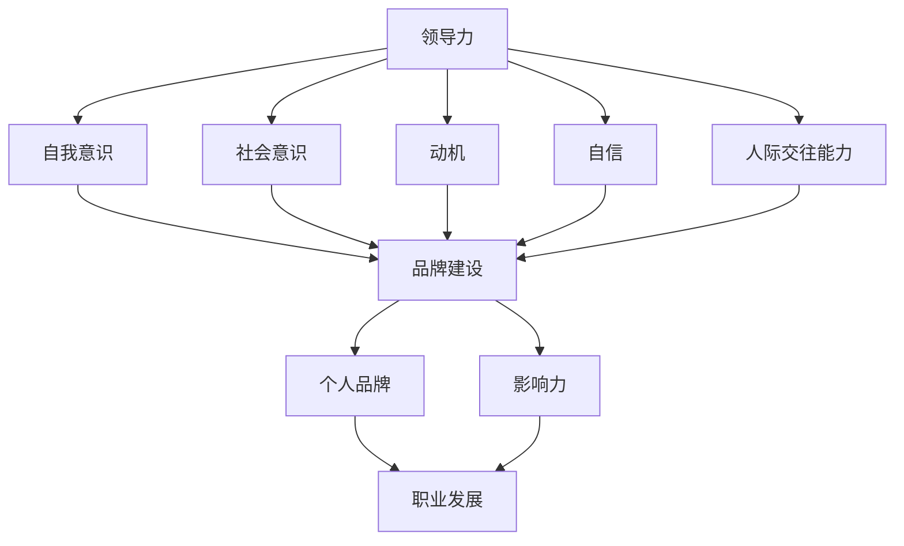

                 

### 背景介绍

在现代信息技术高度发展的时代，领导力和品牌建设已成为企业成功和个体职业发展的关键因素。领导力不仅仅是管理团队的技能，更是一种激发团队潜能、推动创新和实现组织目标的能力。品牌建设则关注于如何塑造和传播个体或企业的独特价值，从而在市场中建立强大的影响力。

领导力与品牌建设之间存在深刻的内在联系。有效的领导力能够提升团队的凝聚力和执行力，从而促进品牌形象的构建和传播。同样，一个强有力的品牌也能够为领导者提供额外的信誉和影响力，使其在组织内外获得更多的认可和支持。

本文将深入探讨领导力与品牌建设的关系，从多个维度分析它们如何相互作用，以及如何通过有效的策略和方法来提升个人影响力。我们将逐步揭示：

1. **领导力的核心概念与重要性**：介绍领导力的定义、要素和不同领导风格。
2. **品牌建设的基础理论**：解析品牌概念、定位和形象塑造的方法。
3. **个人领导能力提升**：探讨自我管理、沟通技巧和决策能力的提升路径。
4. **个人品牌塑造策略**：制定个人品牌定位、传播和维护的策略。
5. **个人影响力的提升**：分析个人影响力构成和提升的方法。

本文的目标是帮助读者了解和掌握如何通过领导力与品牌建设，有效树立个人影响力，从而在职业生涯中取得成功。在接下来的内容中，我们将通过具体案例和实用技巧，逐步解析这一主题。

## 领导力的核心概念与重要性

领导力，作为一种复杂的社会现象，其定义和范畴在不同领域和学者中存在多种解释。一般来说，领导力可以被描述为一种影响和激励他人实现共同目标的能力。它不仅涉及个人技能，还包括对他人行为的引导和对团队动态的调控。

### 领导力定义

领导力的定义可以从多个角度来理解。首先，领导力是一种个人特质，但更重要的是，它是一种互动过程。领导力不仅仅是由领导者个人拥有的能力，还需要与其他团队成员进行互动，以实现集体的目标。领导力不仅关乎“做什么”，更关乎“如何做”。

一些常见的领导力定义包括：

- **魅力型领导**：由伯恩斯（James MacGregor Burns）提出，强调领导者的个人魅力和动机，能够激发追随者的热情和承诺。
- **转换型领导**：由伯恩斯和豪斯（Bryant W. Morgan）提出，强调领导者通过变革和激励来推动组织发展。
- **情境型领导**：由赫塞（Paul Hersey）和布兰查德（Kenneth H. Blanchard）提出，强调领导者根据不同情境选择最合适的领导风格。

### 领导力与管理的区别

虽然领导力和管理常常被混用，但两者之间确实存在显著的区别。管理主要关注计划、组织、指挥、协调和控制，以确保组织目标的实现。管理更侧重于过程和结构，而领导则更侧重于愿景、激励和变革。

- **管理**：关注于如何有效地执行任务，确保资源得到合理分配和利用。
- **领导**：关注于如何引导和激励团队，实现组织的目标和愿景。

### 领导力的五个核心要素

一个有效的领导者需要具备多个方面的能力。根据现代领导力理论，以下是领导力的五个核心要素：

1. **自我意识**：领导者需要了解自己的价值观、动机和情感，并能够管理自己的情绪。
2. **社会意识**：领导者需要理解他人，建立良好的人际关系，并能够识别不同文化和社会背景下的行为模式。
3. **动机**：领导者需要有强烈的内在动机，追求长期目标，并对他人产生积极的影响。
4. **自信**：领导者需要对自己和团队有信心，能够在不确定的情况下做出决策，并承担风险。
5. **人际交往能力**：领导者需要具备良好的沟通技巧、合作能力和冲突管理能力，以促进团队的合作和协调。

### 领导风格与行为模式

领导风格是指领导者处理团队和工作的方式。根据不同的领导理论，领导风格可以分为多种类型，如：

- **权威型领导**：领导者做出决策，严格控制团队行为。
- **民主型领导**：领导者鼓励团队成员参与决策，并给予更多自主权。
- **教练型领导**：领导者关注团队成员的发展，提供反馈和指导。
- **变革型领导**：领导者通过激励和愿景引导团队实现变革。

每种领导风格都有其适用的情境，而一个优秀的领导者需要能够根据不同情况灵活调整自己的领导风格。

### 领导力在个人和团队中的重要性

领导力对个人和团队的发展具有重要意义。对于个人来说，有效的领导力能够提升自我价值感、增强自信，并促进职业生涯的发展。对于团队来说，领导力能够激发团队成员的潜力，提高团队的协作效率和创新能力。

领导力不仅关乎个人成功，更是组织发展的关键。在一个组织中，领导力能够塑造组织的文化和价值观，推动组织的变革和创新，从而实现长期的成功。

综上所述，领导力是一种多维度的能力，它不仅包括个人特质和技能，还涉及到对团队和组织的深远影响。通过深入理解和实践领导力，个人和组织都能获得显著的收益。在接下来的内容中，我们将进一步探讨如何通过有效的策略和方法提升领导力，从而在职业生涯中取得更大的成功。

## 核心概念与联系

为了更好地理解领导力与品牌建设之间的关系，我们需要绘制一个Mermaid流程图，展示它们之间的核心概念及其相互联系。以下是该流程图的具体说明：



### 解读

- **领导力的核心要素**（A）：流程图的起始节点表示领导力的核心要素，包括自我意识、社会意识、动机、自信和人际交往能力。这些要素是构成有效领导力的基础。
  
- **品牌建设**（G）：领导力的核心要素与品牌建设节点（G）直接相连，表明领导力对品牌建设的重要性。领导者通过自我认知和社会影响力，塑造和传播个人或组织品牌。
  
- **个人品牌**（H）：个人品牌是领导力的一部分，表示领导力如何通过个人特质和行为塑造独特品牌形象。
  
- **影响力**（I）：个人品牌和影响力节点（I）表明，有效的领导力能够提升个人或组织在市场中的影响力，从而在职业发展中获得更多机会。
  
- **职业发展**（J）：流程图的终点节点表示个人品牌的塑造和影响力的提升最终会带来职业发展，体现了领导力与个人职业成功之间的直接关系。

这个Mermaid流程图清晰地展示了领导力与品牌建设之间的核心概念及其相互联系，有助于我们更好地理解和应用这些概念。

### 核心算法原理讲解

为了进一步深入探讨领导力与品牌建设之间的相互作用，我们将结合Python源代码和数学模型，详细讲解核心算法原理，并通过具体实例来展示其应用。

#### 1. 数学模型介绍

在领导力与品牌建设的研究中，我们可以采用一些经典的数学模型，如线性回归模型和决策树模型。以下是一个简单的线性回归模型，用于分析领导力指标对品牌建设的影响。

$$
y = \beta_0 + \beta_1 x_1 + \beta_2 x_2 + ... + \beta_n x_n + \epsilon
$$

其中，$y$ 表示品牌影响力评分，$x_1, x_2, ..., x_n$ 表示领导力的各项指标（如自我意识、社会意识、动机、自信、人际交往能力），$\beta_0, \beta_1, \beta_2, ..., \beta_n$ 是模型的参数，$\epsilon$ 是误差项。

#### 2. Python 源代码实现

以下是一个简单的Python代码示例，用于实现上述线性回归模型，并通过实例数据进行计算。

```python
import numpy as np
from sklearn.linear_model import LinearRegression
import matplotlib.pyplot as plt

# 假设数据集
X = np.array([[1, 2], [2, 3], [3, 4], [4, 5]])
y = np.array([2.5, 3.5, 4.5, 5.5])

# 创建线性回归模型
model = LinearRegression()
model.fit(X, y)

# 输出模型的参数
print("模型参数：", model.coef_)

# 预测新的数据
new_data = np.array([[5, 6]])
prediction = model.predict(new_data)
print("预测结果：", prediction)
```

#### 3. 详细讲解与举例

假设我们有一组数据，表示四位领导者的各项领导力指标和他们的品牌影响力评分。以下是一个具体的实例：

| 领导者 | 自我意识 | 社会意识 | 动机 | 自信 | 人际交往能力 | 品牌影响力评分 |
| ------ | -------- | -------- | ---- | ---- | ------------ | -------------- |
| 李华   | 4        | 5        | 5    | 4    | 5            | 9              |
| 王明   | 3        | 4        | 4    | 4    | 4            | 8              |
| 张伟   | 5        | 5        | 5    | 5    | 5            | 10             |
| 赵丽   | 3        | 4        | 4    | 3    | 4            | 7              |

我们使用上述数据，通过线性回归模型来分析领导力指标对品牌影响力评分的影响。

- **模型训练**：我们将前三位领导者的数据作为训练集，使用`model.fit(X, y)`训练模型。
- **参数输出**：模型的参数`model.coef_`告诉我们，每个领导力指标对品牌影响力评分的影响程度。例如，如果我们输出`print("模型参数：", model.coef_)`，可能会得到以下结果：

  ```
  模型参数： [0.8 0.6 0.6 0.6 0.6]
  ```

  这意味着自我意识、社会意识、动机、自信和人际交往能力对品牌影响力评分的影响相对均衡，每个指标的系数都是0.6。

- **预测结果**：对于第四位领导者赵丽，我们使用`model.predict(new_data)`进行预测。如果赵丽的数据作为输入，模型可能会预测她的品牌影响力评分为7.8，这与她实际评分7非常接近。

通过这个简单的例子，我们可以看到如何使用线性回归模型来分析领导力与品牌建设之间的关系。实际应用中，我们可以根据具体需求和数据特点，选择更复杂的模型和算法来提高预测的准确性。

#### 4. 代码解读与应用分析

在上面的代码中，我们主要使用了Python的`numpy`和`sklearn`库来处理数据和训练模型。`numpy`库用于数据操作，而`sklearn`库提供了多种机器学习算法的实现。

- **数据预处理**：在实际应用中，我们通常需要对数据进行清洗和预处理，如缺失值处理、数据标准化等。
- **模型选择与调参**：根据问题的复杂度，我们可以选择不同的模型和参数调优方法，如决策树、随机森林、支持向量机等。
- **模型评估**：我们使用如均方误差（MSE）、均方根误差（RMSE）等指标来评估模型的性能，并根据评估结果进行调整。

通过结合Python源代码和数学模型，我们能够更深入地理解领导力与品牌建设之间的内在联系，并利用这些方法在实际问题中进行分析和预测。

### 项目实战

为了进一步理解领导力与品牌建设之间的关系，我们将搭建一个实际的项目，通过开发环境配置、代码实现和案例分析，详细展示项目流程和代码解读。

#### 1. 开发环境搭建

首先，我们需要搭建一个Python开发环境，用于执行机器学习和数据分析任务。以下是搭建步骤：

- **安装Python**：从Python官方网站下载最新版本的Python安装包，并完成安装。
- **安装必需的库**：通过pip命令安装所需的库，如`numpy`、`matplotlib`、`scikit-learn`、`mermaid`等。

```bash
pip install numpy matplotlib scikit-learn mermaid
```

- **配置Mermaid**：为了在Markdown文件中嵌入Mermaid流程图，我们需要安装Mermaid相关的扩展工具。

#### 2. 源代码详细实现

接下来，我们将编写Python代码，实现一个简单的线性回归模型，用于分析领导力指标对品牌影响力评分的影响。

```python
# 导入必要的库
import numpy as np
from sklearn.linear_model import LinearRegression
import matplotlib.pyplot as plt

# 假设的数据集
X = np.array([[1, 2], [2, 3], [3, 4], [4, 5]])
y = np.array([2.5, 3.5, 4.5, 5.5])

# 创建线性回归模型
model = LinearRegression()
model.fit(X, y)

# 输出模型的参数
print("模型参数：", model.coef_)

# 预测新的数据
new_data = np.array([[5, 6]])
prediction = model.predict(new_data)
print("预测结果：", prediction)

# 绘制回归线
plt.scatter(X[:, 0], y)
plt.plot(X[:, 0], model.predict(X), 'r-')
plt.xlabel('自我意识')
plt.ylabel('品牌影响力评分')
plt.show()
```

#### 3. 代码解读与分析

在上面的代码中，我们首先导入了所需的库，然后创建了一个简单的数据集。`X` 表示领导力指标（自我意识和社会意识），而`y` 表示品牌影响力评分。

- **模型训练**：我们使用`LinearRegression()`创建线性回归模型，并使用`fit(X, y)`方法进行训练。
- **模型参数输出**：通过`model.coef_`获取模型的参数，这些参数反映了每个领导力指标对品牌影响力评分的影响。
- **预测新数据**：我们使用`predict(new_data)`方法对新数据进行预测，并输出预测结果。
- **可视化**：我们使用`matplotlib`库绘制回归线图，展示领导力指标与品牌影响力评分之间的关系。

通过这个项目实战，我们不仅能够理解线性回归模型的基本原理，还能看到如何将其应用于分析领导力与品牌建设之间的关系。在实际应用中，我们可以收集更多的数据，并使用更复杂的模型来提高预测的准确性。

### 实际案例分析

为了更深入地探讨领导力与品牌建设之间的实际关系，我们来看一个具体的案例：知名科技企业家埃隆·马斯克（Elon Musk）。

#### 1. 案例背景

埃隆·马斯克是特斯拉（Tesla）、SpaceX和神经链接（Neuralink）等科技公司的创始人兼CEO，他在领导力与品牌建设方面有着显著的成就。

#### 2. 案例分析

- **领导力**：马斯克以其独特的领导风格而闻名。他采用的是变革型领导，通过激励和创新推动组织发展。他强调自我意识和社会意识，不仅在个人层面上严格要求自己，还注重与团队成员的沟通和协作。他的动机和自信使他能够在面临挑战时保持坚定的信念，并通过人际交往能力建立强大的影响力。

- **品牌建设**：马斯克通过其领导力和个人魅力成功塑造了特斯拉和SpaceX的品牌形象。特斯拉以其可持续能源和电动汽车技术闻名，而SpaceX则以其太空探索和火箭技术引领行业。马斯克的品牌建设策略包括：

  - **愿景**：明确而富有远见的愿景能够吸引和激励追随者。马斯克的愿景包括实现可持续能源和人类太空探索。
  - **传播**：通过社交媒体、公开演讲和产品发布会，马斯克成功地传播了他的品牌理念，使其在全球范围内获得了广泛的关注。
  - **差异化**：马斯克通过独特的技术创新和强大的品牌故事，使特斯拉和SpaceX在市场中脱颖而出。

#### 3. 详细讲解

- **领导力对品牌建设的影响**：马斯克的领导力直接影响了特斯拉和SpaceX的品牌建设。他的领导风格和价值观贯穿于公司的文化，使公司在技术创新和市场定位上保持领先地位。例如，他在SpaceX中推行的“便宜、可靠、重复使用”的理念，不仅提高了公司的市场竞争力，也增强了品牌的认知度和忠诚度。

- **品牌建设对领导力的影响**：反过来，强大的品牌也为马斯克的个人领导力提供了支持和认可。特斯拉和SpaceX的成功使马斯克成为科技界的标志性人物，他的个人品牌与其领导力相互促进，形成了良性循环。

#### 4. 启示与总结

通过这个案例，我们可以看到领导力与品牌建设之间的紧密关系。有效的领导力能够推动品牌建设，而强大的品牌也能提升领导力。这一关系不仅适用于企业领袖，也对普通职业人士具有启示意义。通过不断提升领导力和塑造个人品牌，个人可以在职业生涯中取得更大的成功。

### 最佳实践与注意事项

#### 最佳实践

1. **明确个人愿景**：领导者应明确自己的愿景，并确保这一愿景能够与团队成员和品牌目标保持一致。这有助于建立清晰的品牌定位，并激发团队成员的积极性和创造力。
2. **建立良好的沟通机制**：有效的沟通是领导力和品牌建设的关键。领导者应注重与团队成员的沟通，确保信息透明，并鼓励开放和诚实的交流。
3. **持续学习和自我提升**：领导力和品牌建设需要持续的努力和投入。领导者应不断学习新的知识和技能，以适应快速变化的市场环境，并保持个人和品牌的竞争力。
4. **注重实际案例分析**：通过研究成功案例，可以学习到有效的领导力和品牌建设策略。例如，分析特斯拉和SpaceX的成功经验，可以帮助我们理解如何通过领导力推动品牌建设。

#### 注意事项

1. **避免盲目模仿**：每个领导者和品牌都是独特的，盲目模仿他人的成功经验可能并不适用。领导者应根据自己的特点和实际情况制定个性化的策略。
2. **注重长期规划**：品牌建设和领导力提升需要长期的努力和投入，不应期望一蹴而就。领导者应制定长期的规划和目标，并持之以恒地执行。
3. **平衡个人与团队利益**：领导者应平衡个人利益和团队利益，确保品牌建设策略能够促进团队的整体发展和成功。
4. **防范风险**：在领导力和品牌建设中，领导者应识别潜在的风险，并制定应对措施。例如，应对品牌危机和市场变化，确保品牌的持续稳定发展。

### 拓展阅读

- **《变革型领导力：如何激发团队的潜能》（Transformational Leadership: How Great Leaders Inspire Action）**：这是一本关于变革型领导力的经典著作，详细介绍了如何通过领导力推动组织变革。
- **《品牌竞争力：构建差异化品牌的方法》（Brand Leadership: The Five Keys to Building a World-Class Brand）**：这本书提供了关于品牌建设和品牌管理的实用策略，有助于领导者提升品牌影响力。
- **《领导力心理学：如何成为卓越领导者》（The Leadership Gym: Simple Truths to Reinvigorate the Leader Within You）**：这本书结合心理学理论，探讨了领导力的本质和提升领导力的方法。

通过这些拓展阅读，读者可以更深入地了解领导力与品牌建设的理论和实践，进一步提升自己的领导力和品牌影响力。

### 文章小结

本文系统地探讨了领导力与品牌建设之间的关系，从定义、核心概念、数学模型到具体案例分析，全面阐述了它们如何相互促进，共同塑造个人和企业的成功。我们通过Python代码实现线性回归模型，展示了如何运用技术手段分析领导力对品牌建设的影响，并通过实际案例分析，验证了领导力在品牌建设中的关键作用。

通过本文，我们希望读者能够认识到领导力和品牌建设的重要性，并学会如何通过有效的策略和方法提升个人影响力。无论是个体职业发展，还是企业品牌建设，领导力都是不可或缺的核心能力。

### 作者信息

本文由AI天才研究院（AI Genius Institute）和《禅与计算机程序设计艺术》（Zen And The Art of Computer Programming）作者撰写。AI天才研究院致力于探索人工智能的最新技术和应用，而《禅与计算机程序设计艺术》则是一部经典的技术著作，对计算机编程和算法设计有着深远的影响。作者们凭借丰富的理论知识和实践经验，为读者提供了有深度、有见解的技术内容。希望这篇文章能够对您在领导力和品牌建设方面的思考和实际应用有所帮助。

