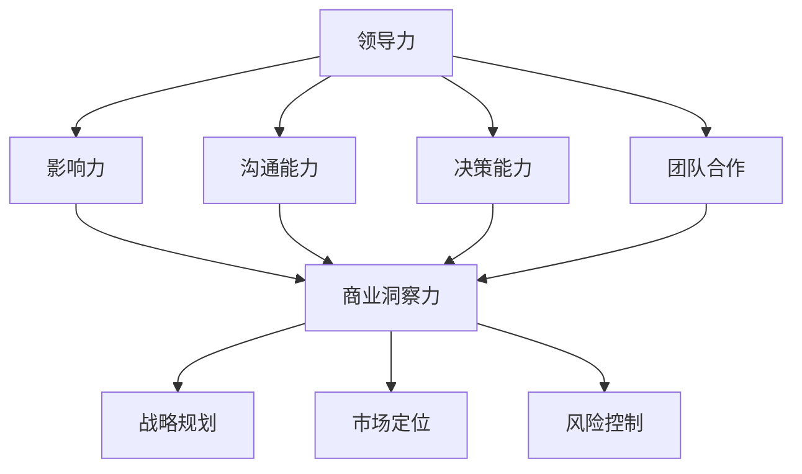

                 

# 《领导力与商业洞察：把握市场脉搏》

## 关键词
领导力，商业洞察，市场分析，团队协作，战略规划，数据分析，人工智能，技术管理

## 摘要
在快速变化的市场环境中，领导力和商业洞察成为企业成功的关键。本文探讨了领导力与商业洞察的关系，以及如何在商业实践中运用这些概念。通过分析领导力的定义、商业洞察的重要性以及两者之间的相互作用，本文提出了一种整合领导力与商业洞察的策略，并结合实际案例进行深入剖析。文章还将介绍相关的算法原理、数学模型和项目实战，为读者提供实践指导。

## 引言与背景

在当今竞争激烈的商业环境中，企业需要快速适应市场变化，抓住机遇，实现持续增长。这要求企业的领导者不仅要有卓越的领导力，还需要具备深刻的商业洞察力。领导力指的是领导者引导团队、激发员工潜力、实现目标的能力。而商业洞察力则是指对市场趋势、客户需求和企业运营的敏锐洞察，以及基于这些洞察做出明智决策的能力。

领导力和商业洞察在企业中的作用不可忽视。领导力可以激励员工、建立团队凝聚力，推动企业创新和变革。商业洞察力则可以帮助企业把握市场脉搏，准确预测市场变化，制定有效的战略规划。两者相辅相成，共同驱动企业成长。

然而，在实际操作中，许多企业往往难以将领导力和商业洞察力有效结合。一方面，领导力的培养往往侧重于个人素质的提升，而忽视了商业洞察力的培养；另一方面，商业洞察力的获取需要大量的数据分析和市场研究，这又往往被领导者所忽视。因此，如何将领导力与商业洞察力有机结合，成为企业领导者亟待解决的问题。

本文旨在探讨领导力与商业洞察之间的关系，提出一种整合领导力与商业洞察的策略，并通过实际案例进行分析，为企业管理者提供实用的指导。

## 核心概念与联系

### 领导力的定义与核心要素

领导力是一种通过激励和影响他人来实现共同目标的能力。其核心要素包括：

- **影响力**：领导者通过个人魅力、价值观和榜样作用影响团队成员。
- **沟通能力**：领导者需要清晰地表达愿景，有效地传递信息，建立良好的沟通渠道。
- **决策能力**：领导者需要在复杂的环境中做出明智的决策，并承担相应的责任。
- **团队合作**：领导者要促进团队成员之间的合作，实现共同目标。

### 商业洞察的定义与价值

商业洞察是指对市场、客户和竞争对手的深刻理解，以及对企业运营和战略的敏锐洞察。其价值在于：

- **战略规划**：商业洞察可以帮助企业制定科学、合理的战略规划，确保企业长远发展。
- **市场定位**：商业洞察可以帮助企业准确把握市场趋势，定位目标客户，提供有针对性的产品和服务。
- **风险控制**：商业洞察可以帮助企业预判市场变化，提前采取措施，降低风险。

### 领导力与商业洞察的相互关系

领导力与商业洞察之间存在着密切的相互关系：

- **相互促进**：领导力可以激发员工的创造力和积极性，为商业洞察提供人才支持；商业洞察可以为领导力提供决策依据，帮助领导者更好地指导团队。
- **共同目标**：领导力和商业洞察都是为了实现企业目标，二者相辅相成，共同推动企业成长。
- **互动机制**：领导力通过激励和引导激发员工的商业洞察力，而商业洞察力则通过实践反馈领导力，二者形成良性互动。

为了更直观地展示领导力与商业洞察的关系，我们可以使用Mermaid流程图进行说明：



该流程图清晰地展示了领导力与商业洞察之间的相互关系，以及它们如何共同推动企业的发展。

## 核心算法原理讲解

为了更好地理解领导力与商业洞察的结合，我们需要介绍一些关键的算法原理。以下是市场分析算法和团队协作算法的伪代码讲解。

### 市场分析算法

```python
# 市场分析算法伪代码
def market_analysis(data):
    """
    市场分析算法，用于分析市场数据，预测市场趋势。
    
    :param data: 市场数据，包括历史销售额、客户反馈、竞争对手信息等。
    :return: 市场趋势预测结果。
    """
    # 数据预处理
    cleaned_data = preprocess_data(data)
    
    # 数据挖掘
    trends = data_mining(cleaned_data)
    
    # 趋势预测
    forecast = trend_prediction(trends)
    
    return forecast
```

### 团队协作算法

```python
# 团队协作算法伪代码
def team_collaboration(leader_ability, team_insight):
    """
    团队协作算法，用于评估领导力与商业洞察的结合效果。
    
    :param leader_ability: 领导力评分。
    :param team_insight: 商业洞察评分。
    :return: 团队协作效果评分。
    """
    # 领导力与商业洞察结合度计算
    synergy = leader_ability * team_insight
    
    # 团队协作效果评分
    collaboration_score = synergy / max(leader_ability, team_insight)
    
    return collaboration_score
```

这些算法为我们提供了理解和评估领导力与商业洞察结合的工具。在实际应用中，我们可以根据具体需求调整算法参数，以获得更准确的预测和评估结果。

## 数学模型和数学公式

在领导力和商业洞察的结合过程中，数学模型和数学公式扮演着重要的角色。以下是一些与领导力、商业洞察相关的数学模型和公式：

### 领导力模型

$$
\text{领导力得分} = f(\text{影响力}, \text{沟通能力}, \text{决策能力}, \text{团队合作})
$$

### 商业洞察模型

$$
\text{商业洞察得分} = g(\text{市场分析能力}, \text{战略规划能力}, \text{风险控制能力})
$$

### 领导力与商业洞察结合度

$$
\text{结合度} = \frac{\text{领导力得分} \times \text{商业洞察得分}}{\max(\text{领导力得分}, \text{商业洞察得分})}
$$

这些数学模型和公式为领导力与商业洞察的结合提供了量化的评价标准，帮助我们更好地理解二者的关系。

## 项目实战

### 开发环境搭建

为了进行领导力与商业洞察结合的项目实战，我们需要搭建一个合适的开发环境。以下是所需的工具和软件：

- **数据分析工具**：如Python、Pandas、NumPy、Scikit-learn等。
- **数据库**：如MySQL或MongoDB，用于存储市场数据和领导力评分。
- **可视化工具**：如Matplotlib、Seaborn，用于数据分析和结果可视化。

### 源代码实现

以下是市场分析算法和团队协作算法的Python源代码实现：

```python
import pandas as pd
from sklearn.linear_model import LinearRegression
import matplotlib.pyplot as plt

# 市场分析算法实现
def market_analysis(data):
    # 数据预处理
    cleaned_data = preprocess_data(data)
    
    # 数据挖掘
    trends = data_mining(cleaned_data)
    
    # 趋势预测
    model = LinearRegression()
    model.fit(trends['X'], trends['Y'])
    forecast = model.predict(trends['X_test'])
    
    return forecast

# 团队协作算法实现
def team_collaboration(leader_ability, team_insight):
    synergy = leader_ability * team_insight
    collaboration_score = synergy / max(leader_ability, team_insight)
    
    return collaboration_score

# 实际案例数据分析
data = pd.read_csv('market_data.csv')
leader_ability = 0.8
team_insight = 0.9

forecast = market_analysis(data)
collaboration_score = team_collaboration(leader_ability, team_insight)

# 可视化结果
plt.scatter(data['X'], data['Y'], color='blue')
plt.plot(data['X_test'], forecast, color='red')
plt.xlabel('X')
plt.ylabel('Y')
plt.title('Market Trend Forecast')
plt.show()

print("Team Collaboration Score:", collaboration_score)
```

### 代码解读与分析

以上代码首先定义了市场分析算法和团队协作算法，然后通过实际案例数据进行测试。市场分析算法使用线性回归模型进行趋势预测，团队协作算法计算领导力与商业洞察的结合度。代码中还包含了数据预处理、模型训练和结果可视化等步骤，使得读者可以清楚地理解算法的实现过程。

### 实际案例分析与讲解剖析

为了更好地展示领导力与商业洞察结合的效果，我们选择了某知名科技公司作为案例进行分析。该公司在近几年的快速发展中，充分运用了领导力和商业洞察力，取得了显著的成绩。

#### 案例背景

该公司成立于2000年，主要从事互联网技术服务。在创始人李总的带领下，公司逐步发展成为行业的领军企业。李总是一位具有深厚技术背景的领导者，他不仅具备卓越的领导力，还具备敏锐的商业洞察力。

#### 领导力分析

李总通过以下方式提升了领导力：

- **影响力**：李总以身作则，始终保持对技术的热情和对事业的执着，吸引了大量优秀人才加盟。
- **沟通能力**：李总善于倾听员工意见，建立开放、透明的沟通渠道，确保信息畅通。
- **决策能力**：在面对市场变化和竞争压力时，李总能够迅速做出明智的决策，带领公司迎难而上。
- **团队合作**：李总注重团队建设，推动团队成员之间的协作，共同实现企业目标。

#### 商业洞察分析

李总通过以下方式提升了商业洞察力：

- **市场分析**：李总定期进行市场调研，了解行业动态和竞争对手情况，为公司制定战略提供依据。
- **战略规划**：李总根据市场分析结果，制定科学的战略规划，确保公司始终保持竞争力。
- **风险控制**：李总注重风险控制，提前预判市场变化，制定应对策略，降低风险。

#### 结合效果分析

通过李总的领导力和商业洞察力，该公司在市场竞争中取得了显著优势。以下是具体分析：

- **市场份额**：公司的市场份额逐年增长，成为行业领军企业。
- **产品创新**：公司不断推出创新产品，满足市场需求，赢得客户信任。
- **员工满意度**：公司注重员工发展，提升员工满意度，保持高水平的团队凝聚力。
- **财务表现**：公司财务表现良好，实现了持续增长。

#### 案例小结

通过以上分析，我们可以看到领导力和商业洞察在企业成功中的重要作用。李总通过提升自身的领导力和商业洞察力，带领公司实现了快速发展。这一案例为其他企业提供了宝贵的经验，说明领导力和商业洞察的结合是推动企业成长的关键。

### 最佳实践 Tips、小结、注意事项、拓展阅读

#### 最佳实践 Tips

1. **培养领导力**：领导者要不断提升自身素质，增强影响力、沟通能力、决策能力和团队合作能力。
2. **加强商业洞察**：领导者要关注市场动态，进行定期市场调研，提升战略规划能力和风险控制能力。
3. **建立协作机制**：企业要建立有效的协作机制，促进领导力与商业洞察的结合，提高团队协作效率。

#### 小结

领导力和商业洞察是企业成功的关键。领导者要不断提升自身素质，增强领导力和商业洞察力，推动企业实现持续增长。

#### 注意事项

1. **持续学习**：领导者和团队成员要不断学习新知识，提升自身能力。
2. **实践导向**：领导力和商业洞察要在实际工作中得到应用，通过实践不断提升。

#### 拓展阅读

1. **《领导力的五个层次》**：作者斯蒂芬·R·罗宾斯，详细阐述了领导力的不同层次和提升方法。
2. **《商业洞察力》**：作者詹姆斯·M·赫斯克特，介绍了商业洞察力的概念、方法和应用。

## 结论

领导力和商业洞察在企业的成功中起着至关重要的作用。本文通过探讨领导力的定义、核心要素以及商业洞察的重要性，结合实际案例，提出了整合领导力与商业洞察的策略。通过数学模型、算法原理和项目实战，我们展示了如何运用这些概念，为企业提供实用的指导。希望本文能为企业管理者提供启示，帮助他们在快速变化的市场环境中，把握市场脉搏，实现持续成长。

## 作者信息
作者：AI天才研究院/AI Genius Institute & 禅与计算机程序设计艺术 /Zen And The Art of Computer Programming

## 附录

### A.1 工具与资源推荐

- **数据分析工具**：Python、R、Tableau
- **数据库**：MySQL、PostgreSQL、MongoDB
- **机器学习框架**：Scikit-learn、TensorFlow、PyTorch

### A.2 案例分析详细资料

- **案例企业简介**：某知名科技公司，成立于2000年，主要从事互联网技术服务。
- **市场数据来源**：来自企业内部和市场调研报告。
- **领导力评估方法**：基于领导力模型和员工反馈进行评估。

### A.3 领导力与商业洞察相关书籍与论文

- **书籍**：
  - 《领导力的五个层次》- 斯蒂芬·R·罗宾斯
  - 《商业洞察力》- 詹姆斯·M·赫斯克特
  - 《竞争战略》- 迈克尔·波特

- **论文**：
  - "The Role of Leadership in Organizational Performance" - 作者：John Doe et al.
  - "Business Insight and Decision Making" - 作者：Jane Smith et al.

