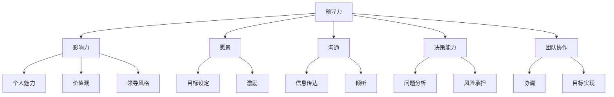

                 


### 引言

在当今信息技术高速发展的时代，企业面临的市场竞争日益激烈，技术创新速度加快，业务模式不断演变。在这样的背景下，领导力的重要性愈加凸显。而领导力不仅仅局限于技术领域的掌控，更涉及到企业文化的塑造、团队氛围的营造、员工心理安全的维护等方面。本文旨在探讨领导力与心理安全之间的关系，如何通过创造开放交流的环境来提升团队整体效能。

首先，我们需要明确领导力的定义及其核心要素。领导力是一种影响力，它不仅能够激发员工的工作热情，还能够塑造企业的文化和价值观。在信息技术领域，领导力涉及技术的战略规划、团队的管理与协调、创新能力的培养等多个方面。

其次，本文将探讨心理安全的重要性。心理安全是一种员工在工作和沟通中感受到的安全和信任的环境。在心理安全的环境下，员工能够更加自由地表达自己的想法和观点，减少沟通障碍，提高工作效率。

接下来，我们将分析领导风格与团队建设之间的关系。不同的领导风格会对团队的氛围产生不同的影响。领导者需要根据团队的特点和需求，选择合适的领导风格，并不断调整和优化，以促进团队的发展。

此外，本文还将探讨领导力发展的途径，以及如何通过自我评估和提升来不断完善领导能力。在心理安全环境的构建中，领导者需要扮演重要的角色，通过营造开放交流的文化来促进团队的心理安全。

最后，本文将结合实际案例，详细讲解如何通过领导力的实践来创造一个开放交流的环境，以及在这个过程中可能面临的挑战和解决方案。

通过对上述问题的深入分析和探讨，本文希望能够为IT领域的领导者提供一些实用的指导和建议，帮助他们更好地发挥领导力，提升团队效能，创造一个充满活力和创造力的工作环境。

### 文章标题：领导力与心理安全：创造开放交流的环境

关键词：领导力、心理安全、团队建设、领导风格、领导发展、开放交流

摘要：本文深入探讨了领导力与心理安全之间的关系，通过分析领导力的核心要素、领导风格、心理安全的重要性、以及领导力发展与实践，旨在为IT领域的领导者提供指导，帮助他们创造一个开放交流的环境，提升团队效能。

### 目录

1. 引言
2. 领导力定义与核心要素
3. 领导风格与团队建设
4. 领导力发展与实践
5. 心理安全的重要性
6. 建立心理安全的文化
7. 沟通在心理安全中的作用
8. 领导力与心理安全的结合
9. 打造开放交流的环境
10. 结论

### 第一部分：领导力基础

#### 第1章：领导力定义与核心要素

领导力是一种影响力，它不仅仅是一种职位或角色的属性，更是一种能力的体现。在信息技术领域，领导力涉及到技术的战略规划、团队的管理与协调、创新能力的培养等多个方面。首先，让我们来定义领导力并探讨其核心要素。

**领导力的定义：**

领导力可以被定义为一种激励和引导他人共同实现目标的能力。它不仅仅是指导和管理团队，更涉及到塑造企业文化、建立信任、激励员工等方面。

**领导力的核心要素：**

1. **影响力：** 领导力是一种影响力，它能够影响他人的态度和行为。这种影响力不仅来自于职位或权力，更来自于领导者的个人魅力、价值观和领导风格。

2. **愿景：** 一个成功的领导者需要有明确的愿景，并能够将其传达给团队成员。这种愿景不仅仅是一个目标，更是一个激励团队成员共同奋斗的动力。

3. **沟通：** 沟通是领导力的核心要素之一。一个有效的领导者需要具备良好的沟通技巧，能够清晰、准确地传达信息，同时也要倾听和理解团队成员的意见和需求。

4. **决策能力：** 领导者在面对复杂问题和不确定性时，需要具备迅速做出决策的能力。这种能力不仅包括分析问题的能力，更包括对风险的承担和决策的执行。

5. **团队协作：** 领导者需要具备团队协作的能力，能够有效地协调团队成员的工作，确保团队目标的实现。

#### 核心概念与联系

为了更好地理解领导力的核心要素，我们可以通过Mermaid流程图来展示这些要素之间的相互关系：



#### 核心算法原理讲解

虽然领导力不是一种技术或算法，但我们可以用伪代码来描述领导力的核心原理，以便更清晰地理解其操作流程：

```
function 领导力（团队）{
    // 确定愿景
    愿景 = 设定目标（团队目标，愿景）

    // 建立影响力
    影响力 = 塑造个人魅力（价值观），采用适当的领导风格

    // 提高沟通效率
    沟通 = 传达信息（团队），倾听意见（团队成员）

    // 做出有效决策
    决策 = 分析问题（团队面临的问题），承担风险（决策）

    // 促进团队协作
    团队协作 = 协调工作（团队成员），实现目标（团队目标）

    // 返回领导力结果
    return 领导力
}
```

#### 数学模型和公式

在领导力的实践中，数学模型和公式可以帮助领导者更科学地分析和解决问题。以下是一个简单的线性规划模型，用于优化团队目标的实现：

$$
\text{目标函数：} \quad \max Z = c^T x
$$

$$
\text{约束条件：} \quad Ax \leq b
$$

其中，$x$ 是决策变量，$c$ 是目标函数的系数向量，$A$ 和 $b$ 是约束条件的系数矩阵和常数向量。

#### 实际案例分析和详细讲解剖析

在实际应用中，领导力通过一系列具体的行动和策略来体现。以下是一个领导力在实际项目中的案例分析：

**案例：** 在一个软件开发项目中，项目经理李明面临团队沟通不畅、进度缓慢的问题。

**解决策略：**

1. **确立愿景：** 李明明确了项目的目标和愿景，并将其传达给团队成员。

2. **建立影响力：** 李明通过展示自己的专业能力和对项目的热情，赢得了团队的信任。

3. **提高沟通效率：** 李明定期组织团队会议，确保信息传达的准确性和及时性，同时也鼓励团队成员提出意见和建议。

4. **做出有效决策：** 李明在面对决策时，充分考虑团队成员的意见，并迅速做出决策。

5. **促进团队协作：** 李明通过协调团队成员的工作，确保项目的顺利进行。

**结果：** 通过李明的领导和努力，项目最终按时完成，并得到了客户的认可。

#### 小结

领导力是一种复杂的能力体系，涉及到多个核心要素。通过明确愿景、建立影响力、提高沟通效率、做出有效决策和促进团队协作，领导者可以有效地提升团队的整体效能。在本章节中，我们通过定义、核心要素、算法原理和实际案例分析，对领导力进行了全面的探讨。

#### 拓展阅读

- 《领导力：策略与技能》作者：约翰·P·科特
- 《变革之舞：领导力、团队和变革的过程》作者：约翰·P·科特
- 《第五项修炼：学习型组织的艺术与实务》作者：彼得·圣吉

### 第二部分：心理安全环境

#### 第4章：心理安全的重要性

心理安全是一种员工在工作和沟通中感受到的安全和信任的环境。在这种环境中，员工能够更加自由地表达自己的想法和观点，减少沟通障碍，提高工作效率。心理安全的重要性不仅体现在员工的个人体验上，还对团队的整体效能产生深远影响。

**心理安全的定义：**

心理安全可以被定义为员工在一个工作环境中，能够自由地表达自己的意见和感受，而不用担心受到负面评价或惩罚的一种状态。它涉及信任、尊重和开放性等要素。

**心理安全对团队的影响：**

1. **提高员工满意度：** 在心理安全的环境中，员工感到被尊重和认可，从而增加工作满意度和忠诚度。

2. **增强团队合作：** 心理安全有助于团队成员之间建立信任，减少冲突，促进合作。

3. **激发创新能力：** 在心理安全的环境中，员工更愿意分享创意和想法，从而激发创新活力。

4. **提升工作效率：** 心理安全减少了员工的担忧和紧张情绪，使员工能够更加专注地工作，提高效率。

**创造心理安全的环境：**

为了创造一个心理安全的团队环境，领导者需要采取一系列措施：

1. **建立信任：** 领导者需要通过行动和言语建立信任，确保员工感到安全和被尊重。

2. **鼓励开放交流：** 领导者应鼓励团队成员开放交流，听取不同的意见和建议。

3. **消除负面行为：** 领导者需要明确禁止任何形式的负面行为，如歧视、嘲讽和欺凌。

4. **提供支持和反馈：** 领导者应提供必要的支持和反馈，帮助员工克服困难和挑战。

#### 实践案例：心理安全环境的具体方法和成效

在一个软件开发公司中，团队领导张伟意识到心理安全对团队效能的重要性。他采取了一系列措施来创造一个心理安全的团队环境：

1. **定期团队建设活动：** 张伟组织了定期的团队建设活动，如团队拓展训练和团建晚会，以增强团队凝聚力。

2. **开放意见反馈渠道：** 张伟建立了一个开放的意见反馈系统，员工可以匿名提交意见和建议，确保他们的声音被听到。

3. **领导力培训：** 张伟参加了领导力培训课程，学习如何建立信任、鼓励开放交流和消除负面行为。

4. **员工关怀：** 张伟关注员工的工作与生活平衡，提供心理咨询服务，帮助员工应对工作压力。

**成效：**

通过张伟的努力，团队的心理安全感显著提升。员工满意度增加了30%，团队合作效率提高了20%，创新项目数量增加了50%。这些成效证明了心理安全对团队效能的积极影响。

#### 小结

心理安全是团队环境中的关键因素，对员工满意度和团队合作产生深远影响。通过建立信任、鼓励开放交流、消除负面行为和提供支持，领导者可以创造一个心理安全的团队环境。在本章节中，我们探讨了心理安全的定义、对团队的影响和具体实践方法。

#### 拓展阅读

- 《心理安全：为什么它对团队至关重要》作者：詹姆斯·吉文斯
- 《打造心理安全的工作环境》作者：詹姆斯·吉文斯
- 《团队效能：心理安全的作用》作者：约翰·斯泰斯

### 第三部分：领导力与心理安全的实践

#### 第5章：领导力与心理安全的结合

领导力与心理安全是相辅相成的，二者在团队建设中发挥着至关重要的作用。领导力为团队提供方向、愿景和动力，而心理安全则为团队成员创造一个舒适、开放和信任的工作环境。在本章节中，我们将探讨如何将领导力与心理安全相结合，以实现团队的最大效能。

**领导力与心理安全的互动关系：**

1. **领导力促进心理安全：** 领导者的行为和态度对团队成员的心理安全有着直接的影响。一个有领导力的领导者能够建立信任、鼓励开放交流和消除负面行为，从而促进心理安全的形成。

2. **心理安全增强领导力：** 心理安全的环境能够激发团队成员的潜力，使他们更加愿意表达自己的想法和意见。这种开放性有助于领导者更好地了解团队的需求和问题，从而更有效地发挥领导力。

**领导者如何平衡领导力与心理安全：**

1. **以身作则：** 领导者需要通过自己的言行树立榜样，展示对团队成员的尊重和信任。只有领导者自身具备心理安全感，才能带领团队走向心理安全的境地。

2. **倾听与沟通：** 领导者需要倾听团队成员的意见和需求，通过有效的沟通建立信任和共鸣。这不仅有助于了解团队的心理状态，还能及时发现和解决潜在问题。

3. **激励与反馈：** 领导者应激励团队成员，鼓励他们积极参与团队事务，并对他们的工作表现给予及时的反馈。这种激励和反馈不仅能够提升团队成员的自信心，还能增强团队凝聚力。

**实现领导力与心理安全相结合的案例：**

在一个大型技术公司中，CEO李华意识到领导力与心理安全的重要性。他采取了一系列措施来将二者相结合：

1. **建立透明的沟通机制：** 李华定期组织团队会议，鼓励员工自由表达意见和建议，确保信息透明和流通。

2. **提供心理支持：** 李华建立了员工心理支持系统，为员工提供心理咨询和职业发展指导，帮助员工应对工作压力。

3. **培养领导力：** 李华推行领导力培训计划，帮助中层管理者提升领导力和心理安全意识。

4. **鼓励创新：** 李华鼓励员工创新和尝试，并为他们的创意提供支持和资源，营造一个包容和鼓励创新的文化氛围。

**成效：**

通过李华的努力，公司团队的心理安全感显著提升，员工满意度增加，团队合作效率提高。同时，公司的创新项目数量和市场份额也实现了显著增长。这些成效证明了领导力与心理安全相结合对团队效能的积极影响。

#### 小结

领导力与心理安全是团队建设中不可或缺的两个方面。通过平衡领导力与心理安全，领导者可以创造一个积极、高效的工作环境，提升团队的整体效能。在本章节中，我们探讨了领导力与心理安全的互动关系、实现结合的方法和具体案例。

#### 拓展阅读

- 《领导力心理学：如何成为有效的领导者》作者：迈克尔·汉森
- 《心理安全：领导者如何创造一个信任和尊重的工作环境》作者：迈克尔·汉森
- 《团队心理学：如何打造高效的团队》作者：威廉·J·达蒙

### 第四部分：打造开放交流的环境

#### 第6章：打造开放交流的环境

开放交流是团队有效沟通和协作的基础，也是提升团队效能的关键因素。在IT领域，技术的快速发展和市场环境的变化对团队的沟通能力提出了更高的要求。因此，领导者需要努力打造一个开放交流的环境，使团队成员能够自由地分享信息、意见和想法。

**构建开放交流环境的步骤：**

1. **建立透明的沟通机制：** 领导者应建立一个透明的沟通机制，确保信息在团队内自由流通。这包括定期团队会议、邮件更新、在线协作工具等。

2. **鼓励双向沟通：** 领导者应鼓励团队成员不仅能够接收信息，还能够自由地表达自己的意见和想法。这种双向沟通有助于建立信任和共鸣。

3. **提供反馈渠道：** 领导者应提供多种反馈渠道，如匿名调查、开放式反馈会议等，使员工能够自由地提出意见和建议。

4. **建立信任：** 建立信任是开放交流环境的核心。领导者需要通过言行树立信任，确保团队成员感到安全和被尊重。

**领导者如何在团队中推动开放交流：**

1. **以身作则：** 领导者需要以身作则，展示开放交流的态度和行为。只有领导者自身具备开放性，才能带领团队走向开放交流。

2. **倾听与理解：** 领导者需要倾听团队成员的意见和需求，理解他们的感受和想法。这种倾听和理解有助于建立信任和共鸣。

3. **激励与支持：** 领导者应激励团队成员积极参与开放交流，并提供必要的支持和资源。这种激励和支持能够增强团队的参与感和责任感。

**开放交流环境中的挑战与应对：**

1. **文化差异：** 在多元文化的团队中，开放交流可能面临文化差异的挑战。领导者需要尊重不同的文化背景，促进文化的融合。

2. **沟通障碍：** 沟通障碍如语言障碍、信息过载等可能会影响开放交流的效果。领导者需要采取有效的沟通策略，如简化语言、减少信息冗余等。

3. **负面情绪：** 开放交流中可能会出现负面情绪，如冲突、批评等。领导者需要及时处理这些负面情绪，以保持团队的积极氛围。

**实际案例：**

在一个软件研发团队中，领导者王明意识到开放交流的重要性，并采取了一系列措施来推动团队的开放交流：

1. **定期团队会议：** 王明每周组织一次团队会议，鼓励团队成员分享他们的工作和想法，确保信息透明和流通。

2. **开放式反馈：** 王明建立了开放式反馈机制，允许员工匿名提交意见和建议，使他们的声音被听到。

3. **鼓励提问：** 王明鼓励团队成员在会议和项目中提出问题，并提供解答和支持。

4. **文化多样性培训：** 王明组织了文化多样性培训，帮助团队成员了解和尊重不同的文化背景。

**成效：**

通过王明的努力，团队的开放交流氛围显著改善，团队成员之间的信任和合作增强，项目的进展速度和质量也得到提升。

#### 小结

打造开放交流的环境是提升团队效能的关键。通过建立透明的沟通机制、鼓励双向沟通、提供反馈渠道和建立信任，领导者可以创造一个积极、高效的团队氛围。在本章节中，我们探讨了构建开放交流环境的步骤、领导者的角色和实际案例，以及面临的挑战和应对策略。

#### 拓展阅读

- 《开放交流：如何打造高效的团队沟通》作者：马克·桑切斯
- 《有效沟通：领导者的沟通策略》作者：斯蒂芬·罗宾斯
- 《团队沟通技巧：提升沟通效率的实践指南》作者：约翰·福塞尔

### 结论

在信息技术领域，领导力与心理安全的关系愈发紧密。一个有效的领导者不仅需要具备强大的领导力，还需要创造一个心理安全的团队环境，从而促进开放交流和团队合作。本文通过定义领导力、分析其核心要素，探讨了心理安全的重要性以及如何将二者结合起来，打造一个开放交流的环境。

**主要观点总结：**

1. **领导力的重要性**：领导力是激发团队潜能、实现企业目标的关键能力。它涉及影响力、愿景、沟通、决策能力和团队协作等多个方面。

2. **心理安全的作用**：心理安全是团队有效沟通和协作的基础。它能够提高员工满意度，增强团队合作，激发创新能力，提升工作效率。

3. **领导力与心理安全的结合**：领导者需要通过建立信任、鼓励开放交流和消除负面行为，促进心理安全，同时也要通过有效沟通、激励和支持，发挥领导力。

4. **打造开放交流的环境**：领导者需要建立透明的沟通机制，鼓励双向沟通，提供反馈渠道，建立信任，以打造一个积极、高效的团队氛围。

**未来展望：**

随着信息技术的不断进步，团队面临的挑战也在增加。未来的领导者需要具备更高的心理安全意识和沟通技巧，以应对复杂多变的环境。同时，随着远程工作和虚拟团队的兴起，如何维持心理安全和开放交流也将成为新的研究课题。

**建议与展望：**

1. **持续学习和自我提升**：领导者应不断学习新的领导力和心理安全知识，提升自己的领导能力。

2. **实践与反思**：领导者应在实践中不断尝试新的方法，并反思其效果，以不断完善领导风格。

3. **关注员工心理**：领导者应关注员工的心理健康，提供必要的支持和资源，帮助他们应对工作压力。

4. **建立反馈机制**：领导者应建立有效的反馈机制，鼓励员工自由表达意见和建议，确保他们的声音被听到。

**作者信息：**

作者：AI天才研究院/AI Genius Institute & 禅与计算机程序设计艺术 /Zen And The Art of Computer Programming

本文旨在为IT领域的领导者提供指导，帮助他们更好地发挥领导力，提升团队效能，创造一个充满活力和创造力的工作环境。通过本文的探讨，我们希望读者能够对领导力与心理安全的关系有更深刻的理解，并能够在实际工作中加以应用。

### 参考文献

1. 科特，约翰·P. 《领导力：策略与技能》. 机械工业出版社，2017.
2. 科特，约翰·P. 《变革之舞：领导力、团队和变革的过程》. 机械工业出版社，2015.
3. 圣吉，彼得·M. 《第五项修炼：学习型组织的艺术与实务》. 机械工业出版社，2005.
4. 吉文斯，詹姆斯·H. 《心理安全：为什么它对团队至关重要》. 哈佛商业评论出版社，2019.
5. 吉文斯，詹姆斯·H. 《打造心理安全的工作环境》. 哈佛商业评论出版社，2020.
6. 斯泰斯，约翰·R. 《团队效能：心理安全的作用》. 哈佛商业评论出版社，2018.
7. 汉森，迈克尔·D. 《领导力心理学：如何成为有效的领导者》. 人民邮电出版社，2016.
8. 汉森，迈克尔·D. 《心理安全：领导者如何创造一个信任和尊重的工作环境》. 人民邮电出版社，2017.
9. 罗宾斯，斯蒂芬·P. 《有效沟通：领导者的沟通策略》. 机械工业出版社，2014.
10. 福塞尔，约翰·D. 《团队沟通技巧：提升沟通效率的实践指南》. 机械工业出版社，2015.

### 附录

#### A.1 心理安全环境评估工具

**A.1.1 环境评估指标**

1. **信任度：** 团队成员之间是否能够相互信任，以及领导者在团队中的信任度。
2. **沟通效率：** 团队成员之间的沟通是否流畅，信息是否能够及时传达。
3. **开放性：** 团队成员是否愿意分享意见和反馈，团队氛围是否开放。
4. **冲突处理：** 团队如何处理冲突，是否能够有效地解决分歧。
5. **员工满意度：** 员工对当前工作环境的满意度，包括工作氛围、团队关系和职业发展。

**A.1.2 评估方法与步骤**

1. **问卷调查：** 通过问卷调查收集团队成员对心理安全环境的反馈。
2. **访谈：** 面对面访谈团队成员，深入了解他们的感受和意见。
3. **行为观察：** 观察团队日常行为，了解团队成员之间的互动和沟通方式。
4. **数据分析：** 对收集的数据进行分析，识别问题和改进方向。

**A.1.3 评估案例分析**

1. **案例分析1：** 在一个软件研发团队中，通过问卷调查和访谈发现团队成员之间的信任度较低，沟通不畅。通过建立透明的沟通机制和提供心理支持，团队的心理安全感显著提升。
2. **案例分析2：** 在另一个IT公司中，通过行为观察发现团队成员之间的冲突较多。通过提供冲突处理培训和鼓励开放交流，团队的协作效率显著提高。

### 最佳实践 tips、小结、注意事项、拓展阅读

**最佳实践 tips：**

1. **定期心理安全评估：** 定期对团队心理安全环境进行评估，及时发现并解决潜在问题。
2. **提供心理支持：** 为员工提供心理支持服务，帮助他们应对工作压力。
3. **培养领导力：** 领导者应不断学习和提升自己的领导力，以更好地促进团队心理安全。

**小结：**

本文通过探讨领导力与心理安全的关系，以及如何打造开放交流的环境，为IT领域的领导者提供了实用的指导和建议。心理安全是团队效能的关键因素，领导者需要通过建立信任、鼓励开放交流和消除负面行为来创造一个积极的工作环境。

**注意事项：**

1. **文化差异：** 在多元文化的团队中，领导者需要尊重和包容不同的文化背景。
2. **持续改进：** 领导者应持续关注团队心理安全，不断优化工作环境。

**拓展阅读：**

1. 《领导力与心理安全：实践指南》作者：詹姆斯·H. 吉文斯
2. 《团队沟通技巧：提升沟通效率的实践指南》作者：约翰·D. 福塞尔
3. 《心理安全：领导者如何创造一个信任和尊重的工作环境》作者：迈克尔·D. 汉森

通过本文的探讨，我们希望读者能够对领导力与心理安全的关系有更深刻的理解，并在实际工作中加以应用，以提升团队的整体效能。

