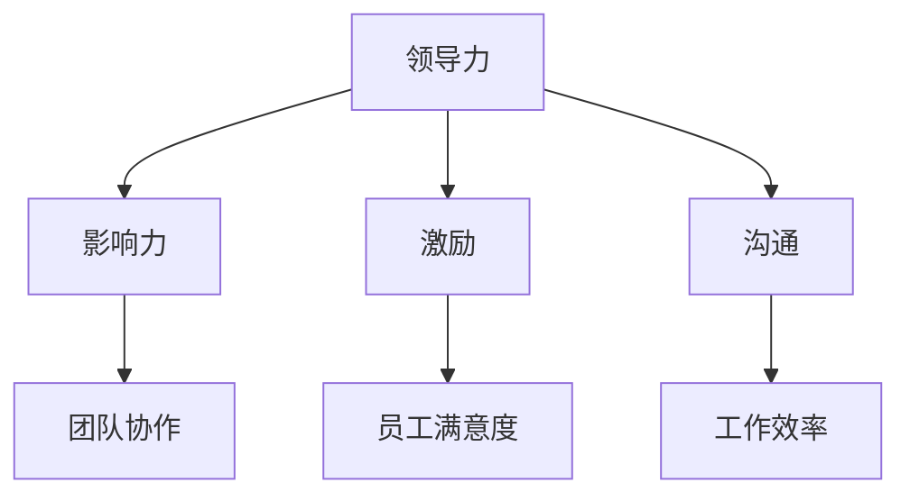
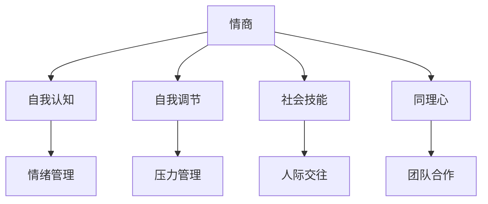
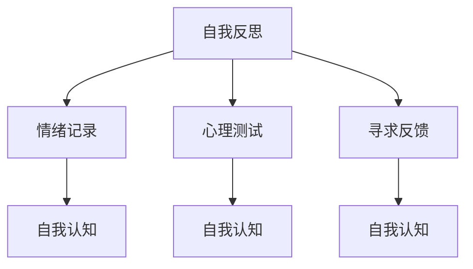
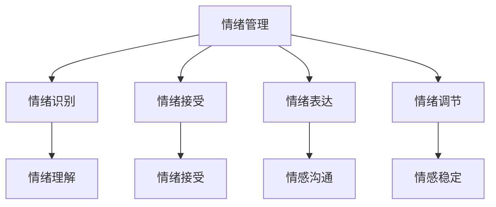
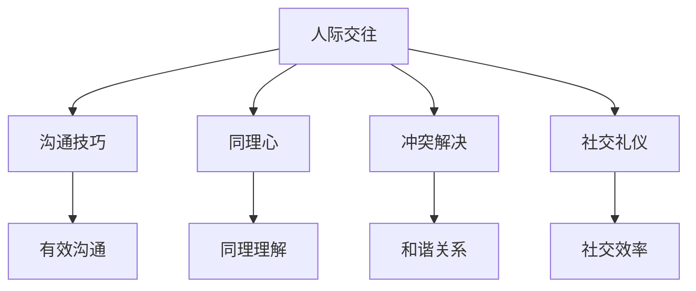
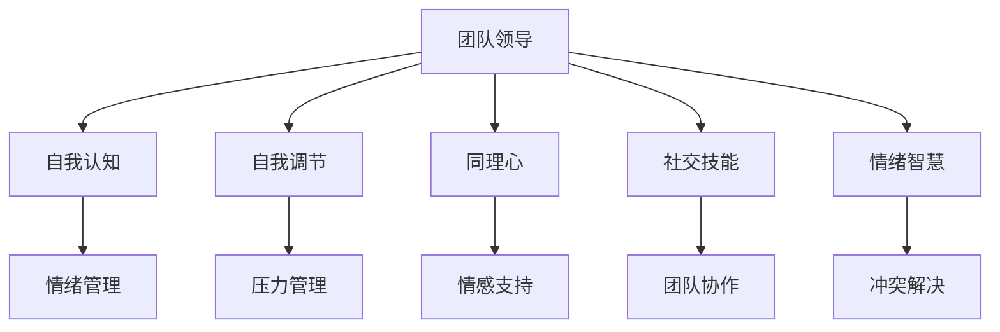

                 

### 文章标题

《领导力与情商发展：提升人际影响力的途径》

### 关键词

- 领导力
- 情商
- 人际影响力
- 自我认知
- 情绪管理
- 团队领导

### 摘要

本文将探讨领导力与情商发展对于提升人际影响力的重要性。通过分析领导力的定义与类型、情商的构成与重要性，以及情商在领导力发展中的应用，本文旨在为读者提供一套完整的领导力与情商提升方案，帮助读者在职场中更好地发挥自身影响力。

### 目录大纲

#### 第一部分：领导力与情商的基础概念

##### 第1章 领导力的定义与类型
- 领导力的基本概念
- 领导力的不同类型
- 领导力在组织中的作用

##### 第2章 情商的构成与重要性
- 情商的定义
- 情商的四个维度
- 情商在领导力发展中的重要性

#### 第二部分：情商在领导力发展中的应用

##### 第3章 情商提升与自我认知
- 自我认知的重要性
- 情商提升的步骤
- 增强自我认知的实践方法

##### 第4章 情商提升与情绪管理
- 情绪的类型与特征
- 情绪管理的策略
- 情绪调节技巧与案例分析

##### 第5章 情商提升与人际交往
- 人际关系的重要性
- 人际交往的技巧
- 人际交往中的情感智慧

##### 第6章 情商提升与团队领导
- 团队领导的情商要素
- 建立高效的团队
- 情商在团队领导中的应用

#### 第三部分：领导力与情商发展的实践路径

##### 第7章 领导力发展的策略与行动
- 领导力发展的策略
- 领导力发展的行动计划
- 领导力发展的案例分析

##### 第8章 情商发展的实践路径
- 情商发展的实践方法
- 情商发展中的挑战与解决策略
- 情商发展的实际应用案例

##### 第9章 领导力与情商的综合提升
- 综合提升的方法与技巧
- 领导力与情商的协同发展
- 领导力与情商发展的未来趋势

##### 附录：领导力与情商发展工具与资源
- 领导力与情商评估工具
- 情商发展课程推荐
- 领导力与情商发展相关书籍与文章

#### 第一部分：领导力与情商的基础概念

##### 第1章 领导力的定义与类型

**1.1 领导力的基本概念**

领导力是一种能够影响和激励他人实现共同目标的能力。它不仅仅存在于企业高层管理者中，而是贯穿于各个层级和领域。有效的领导力能够促进团队协作，提高工作效率，实现组织目标。

**1.2 领导力的不同类型**

- **权威型领导**：依赖职位和权力来影响他人。
- **参与型领导**：鼓励团队成员参与决策，增强团队凝聚力。
- **变革型领导**：通过激励和启发来推动变革，引领团队走向新的高度。
- **情境型领导**：根据团队的不同情境，灵活调整领导风格。

**1.3 领导力在组织中的作用**

领导力在组织中的作用至关重要。它不仅影响着组织的战略方向，还影响着员工的满意度和工作效率。有效的领导力能够激发员工的潜力，提高团队的整体绩效。

**核心概念与联系**

领导力、影响力、激励和沟通是领导力的核心概念，它们相互联系，共同构成了领导力的基本框架。

**Mermaid 流程图**

**核心算法原理讲解**

- **领导力指数（LI）**：一个用于评估领导力的量化模型。
  $$ \text{LI} = \frac{\text{激励得分} + \text{沟通得分} + \text{团队协作得分}}{3} $$
  - **激励得分**：评价领导激励员工的能力。
  - **沟通得分**：评价领导沟通与团队互动的能力。
  - **团队协作得分**：评价领导对团队目标的关注程度。

**数学模型和数学公式 & 详细讲解 & 举例说明**

假设一个团队的领导力指数（LI）为80分，其中激励得分为30分，沟通得分为25分，团队协作得分为25分。

- **激励得分**：领导通过鼓励和认可，激发了团队成员的积极性，提高了团队的凝聚力。
- **沟通得分**：领导通过有效的沟通，确保了团队成员对组织目标的清晰理解，减少了误解和冲突。
- **团队协作得分**：领导通过协调和分配任务，确保了团队的高效运作，实现了组织的目标。

**项目实战**

假设有一个项目团队，团队成员对项目的目标和方向不够清晰，导致工作效率低下。作为领导，可以通过以下步骤来提升团队领导力：

1. **激励**：通过鼓励和认可，激发团队成员的积极性，让他们明白项目的目标和重要性。
2. **沟通**：定期组织会议，确保团队成员对项目的进展和问题有清晰的认识，及时调整策略。
3. **团队协作**：通过协调和分配任务，确保团队成员能够高效合作，共同实现项目目标。

通过以上步骤，团队的领导力得到了提升，项目效率也得到了显著提高。

**最佳实践 tips**

- **定期反馈**：定期与团队成员交流，了解他们的需求和困惑，及时给予反馈和支持。
- **以身作则**：作为领导，要树立良好的榜样，通过自己的行为来影响和激励团队成员。
- **持续学习**：领导力是一个不断发展的过程，要持续学习和实践，不断提升自己的领导能力。

**小结**

领导力是组织成功的关键，而情商则是提升领导力的重要工具。通过深入理解和应用领导力的定义和类型，我们可以更好地提升自身的人际影响力，实现组织的长期发展。

#### 第2章 情商的构成与重要性

**2.1 情商的定义**

情商（Emotional Intelligence，简称EQ）是指个体识别、理解、管理自己和他人情绪，以及识别和区分不同情绪，并有效地使用这些信息指导自己的思维和行为的能力。

**2.2 情商的四个维度**

- **自我认知**：个体对自己情绪的识别和理解，包括了解自己的情绪状态、需求、价值观和动机。
- **自我调节**：个体控制自己情绪的能力，包括情绪调节和压力管理。
- **社会技能**：个体与他人建立积极关系、沟通和协作的能力，包括人际交往、团队合作和领导能力。
- **同理心**：个体理解他人情绪和需求，并给予适当支持和同情的能力。

**2.3 情商在领导力发展中的重要性**

情商在领导力发展中扮演着至关重要的角色。一个高情商的领导者能够更好地理解员工的需求，有效地沟通和激励团队，提高团队的凝聚力和工作效率。同时，情商也有助于领导者识别和解决团队中的冲突，建立积极的工作环境。

**核心概念与联系**

情商的四个维度相互联系，共同构成了情商的基本框架。

**Mermaid 流程图**

**核心算法原理讲解**

- **情商指数（EQI）**：一个用于评估情商的量化模型。
  $$ \text{EQI} = \frac{\text{自我认知得分} + \text{自我调节得分} + \text{社会技能得分} + \text{同理心得分}}{4} $$
  - **自我认知得分**：评价个体对自己情绪的识别和理解能力。
  - **自我调节得分**：评价个体控制自己情绪的能力。
  - **社会技能得分**：评价个体与他人建立积极关系、沟通和协作的能力。
  - **同理心得分**：评价个体理解他人情绪和需求，并给予适当支持和同情的能力。

**数学模型和数学公式 & 详细讲解 & 举例说明**

假设一个情商指数（EQI）为85分，其中自我认知得分为25分，自我调节得分为20分，社会技能得分为22分，同理心得分为18分。

- **自我认知得分**：个体能够准确识别和理解自己的情绪，对自己的需求有清晰的认识。
- **自我调节得分**：个体能够有效控制自己的情绪，即使在压力下也能保持冷静。
- **社会技能得分**：个体能够与他人建立积极的关系，有效沟通和协作，提高团队效率。
- **同理心得分**：个体能够理解他人的情绪和需求，并给予适当的支持和同情，增强团队凝聚力。

**项目实战**

假设一个团队中的成员经常因为意见不合而产生冲突，作为领导者，可以通过以下步骤来提升情商：

1. **自我认知**：通过自我反思，识别自己在冲突中的情绪反应，了解自己的需求和价值观。
2. **自我调节**：通过情绪调节技巧，控制自己的情绪，避免在冲突中情绪失控。
3. **社会技能**：通过有效的沟通和协商，与团队成员建立共识，解决冲突。
4. **同理心**：通过倾听和理解团队成员的情绪和需求，给予适当的支持和同情，增强团队凝聚力。

通过以上步骤，团队的情商得到了提升，成员之间的冲突减少，团队氛围更加和谐。

**最佳实践 tips**

- **定期自我反思**：通过日记、反思日志等方式，定期自我反思，提高自我认知。
- **情绪调节训练**：通过深呼吸、冥想等训练，提高自我调节能力，更好地控制情绪。
- **学习人际交往技巧**：通过阅读相关书籍、参加培训课程等，学习人际交往技巧，提高社会技能。
- **培养同理心**：通过倾听、观察等方式，培养同理心，更好地理解他人的情绪和需求。

**小结**

情商是领导力发展的重要组成部分，它帮助领导者更好地理解和管理自己和他人情绪，提高人际交往能力，实现组织的长期发展。

#### 第3章 情商提升与自我认知

**3.1 自我认知的重要性**

自我认知是情商的核心维度之一，它关系到个体对自身情绪、需求和价值观的理解。一个高自我认知的人能够更好地识别自己的情绪，理解自己的需求和价值观，从而更好地应对各种挑战。

**3.2 情商提升的步骤**

提升自我认知是一个逐步的过程，需要通过以下几个步骤来实现：

1. **自我反思**：定期对自己的行为和情绪进行反思，了解自己的反应和需求。
2. **情绪记录**：记录自己的情绪变化，分析情绪产生的原因和影响。
3. **心理测试**：通过心理测试，了解自己的性格和价值观，提高自我认知。
4. **寻求反馈**：从他人那里获取反馈，了解自己在他人眼中的形象，进一步深化自我认知。

**3.3 增强自我认知的实践方法**

1. **日记记录**：每天花几分钟时间，写下自己的情绪变化和思考过程，有助于加深对自我的理解。
2. **冥想**：通过冥想，提高自我意识和情绪管理能力，有助于识别和理解自己的情绪。
3. **阅读**：阅读心理学、自我成长类书籍，了解自己的行为模式和心理机制。
4. **交流**：与他人交流，分享自己的感受和想法，通过倾听他人的观点，丰富自己的认知。

**核心概念与联系**

自我认知、情绪记录、心理测试和寻求反馈是提升自我认知的关键步骤，它们相互联系，共同构成了提升自我认知的完整路径。

**Mermaid 流程图**

**核心算法原理讲解**

- **自我认知模型**：一个用于评估自我认知能力的量化模型。
  $$ \text{SCA} = \frac{\text{自我反思得分} + \text{情绪记录得分} + \text{心理测试得分} + \text{寻求反馈得分}}{4} $$
  - **自我反思得分**：评价个体反思自身行为和情绪的能力。
  - **情绪记录得分**：评价个体记录情绪变化和分析情绪原因的能力。
  - **心理测试得分**：评价个体接受心理测试并从中了解自己的能力。
  - **寻求反馈得分**：评价个体从他人处获取反馈并从中获得自我认知提升的能力。

**数学模型和数学公式 & 详细讲解 & 举例说明**

假设一个自我认知能力（SCA）为80分，其中自我反思得分为25分，情绪记录得分为20分，心理测试得分为22分，寻求反馈得分为13分。

- **自我反思得分**：个体能够定期反思自己的行为和情绪，对自己的行为有清晰的认识。
- **情绪记录得分**：个体能够记录自己的情绪变化，分析情绪产生的原因和影响。
- **心理测试得分**：个体能够接受心理测试，并从中了解自己的性格和价值观。
- **寻求反馈得分**：个体能够从他人处获取反馈，了解自己在他人眼中的形象，进一步深化自我认知。

**项目实战**

假设一个职场新人，想要提升自己的自我认知，可以按照以下步骤进行：

1. **自我反思**：每天晚上花几分钟时间，反思当天的工作表现和情绪变化，记录在日记中。
2. **情绪记录**：在情绪波动较大的情况下，记录情绪的起因和影响，分析自己的情绪反应。
3. **心理测试**：参加心理测试，了解自己的性格和价值观，为自己的职业发展提供参考。
4. **寻求反馈**：向同事和上司寻求反馈，了解自己在团队中的角色和表现，明确自己的优势和不足。

通过以上步骤，职场新人的自我认知能力得到了显著提升，对自己的职业规划有了更清晰的认识。

**最佳实践 tips**

- **定期自我反思**：每天或每周定期进行自我反思，有助于加深对自我的理解。
- **情绪记录**：在情绪波动时，记录情绪的起因和影响，有助于情绪管理和自我认知。
- **心理测试**：定期参加心理测试，有助于了解自己的性格和价值观，为自己的职业发展提供参考。
- **寻求反馈**：向他人寻求反馈，有助于了解自己在他人眼中的形象，进一步提升自我认知。

**小结**

自我认知是情商提升的关键，通过自我反思、情绪记录、心理测试和寻求反馈等方法，我们可以逐步提升自我认知，更好地理解和管理自己，提高人际交往能力和领导力。

#### 第4章 情商提升与情绪管理

**4.1 情绪的类型与特征**

情绪是人类心理和生理状态的一种复杂反应，通常分为四大类：喜、怒、哀、惧。

- **喜悦**：积极的情绪，通常与愉快、满足和幸福感相关。
- **愤怒**：消极的情绪，通常与不满、挫折和攻击性相关。
- **悲伤**：消极的情绪，通常与失落、绝望和悲伤相关。
- **恐惧**：消极的情绪，通常与危险、不确定和威胁相关。

**4.2 情绪管理的策略**

情绪管理是指通过一系列策略和技巧，有效地识别、理解、接受和调节情绪，以保持积极的心态和行为。

- **情绪识别**：识别和理解自己的情绪，包括识别情绪的起因、影响和特点。
- **情绪接受**：接受自己的情绪，而不是试图逃避或压抑。
- **情绪表达**：以适当的方式表达自己的情绪，避免伤害他人或自己。
- **情绪调节**：通过策略和技巧，调节情绪的强度和持续时间，以适应不同情境。

**4.3 情绪调节技巧与案例分析**

情绪调节技巧包括：

1. **深呼吸**：通过深呼吸，降低心率，缓解紧张和焦虑。
2. **冥想**：通过冥想，提高自我意识，减少情绪波动。
3. **积极思考**：通过积极思考，改变对事物的看法，减轻负面情绪。
4. **运动**：通过运动，释放身体内的紧张和压力，提高情绪稳定性。

**案例分析**

假设一个职场人士，在一场重要会议中，因为紧张而感到焦虑。他可以采取以下情绪调节技巧：

1. **深呼吸**：在会议前，通过深呼吸，缓解紧张情绪。
2. **冥想**：在会议过程中，通过短暂的冥想，保持冷静和专注。
3. **积极思考**：在会议前，通过积极思考，提升自信心，减少紧张感。
4. **运动**：在会议后，通过运动，释放紧张和压力，恢复精力。

**核心概念与联系**

情绪管理、情绪识别、情绪接受、情绪表达和情绪调节是情绪管理的核心概念，它们相互联系，共同构成了情绪管理的完整路径。

**Mermaid 流程图**

**核心算法原理讲解**

- **情绪调节模型**：一个用于评估情绪调节能力的量化模型。
  $$ \text{ERI} = \frac{\text{情绪识别得分} + \text{情绪接受得分} + \text{情绪表达得分} + \text{情绪调节得分}}{4} $$
  - **情绪识别得分**：评价个体识别和理解情绪的能力。
  - **情绪接受得分**：评价个体接受和认可情绪的能力。
  - **情绪表达得分**：评价个体表达情绪的方式和效果。
  - **情绪调节得分**：评价个体调节情绪的能力。

**数学模型和数学公式 & 详细讲解 & 举例说明**

假设一个情绪调节能力（ERI）为85分，其中情绪识别得分为20分，情绪接受得分为25分，情绪表达得分为20分，情绪调节得分为20分。

- **情绪识别得分**：个体能够准确识别和理解自己的情绪，包括情绪的起因、影响和特点。
- **情绪接受得分**：个体能够接受和认可自己的情绪，而不是试图逃避或压抑。
- **情绪表达得分**：个体能够以适当的方式表达自己的情绪，避免伤害他人或自己。
- **情绪调节得分**：个体能够通过策略和技巧，有效地调节情绪的强度和持续时间，以适应不同情境。

**项目实战**

假设一个职场人士，在一场重要会议中，因为紧张而感到焦虑。他可以按照以下步骤进行情绪调节：

1. **情绪识别**：在会议前，通过自我反思，识别和理解自己的情绪，包括情绪的起因、影响和特点。
2. **情绪接受**：接受自己的情绪，而不是试图逃避或压抑，理解情绪是人类正常反应的一部分。
3. **情绪表达**：在会议中，通过适当的肢体语言和表情，表达自己的情绪，保持积极的态度。
4. **情绪调节**：在会议后，通过深呼吸、冥想和积极思考，调节情绪的强度和持续时间，恢复平静。

通过以上步骤，职场人士的情绪调节能力得到了提升，能够更好地应对重要场合的压力和挑战。

**最佳实践 tips**

- **定期情绪记录**：通过日记或情绪记录表，定期记录自己的情绪变化，分析情绪产生的原因和影响。
- **情绪调节训练**：通过冥想、深呼吸、运动等训练，提高情绪调节能力，保持情绪稳定。
- **情绪沟通技巧**：通过积极倾听、表达和理解他人的情绪，提高情感沟通能力，建立良好的人际关系。
- **情绪管理课程**：参加情绪管理课程或研讨会，学习情绪管理知识和技巧，提升情绪管理能力。

**小结**

情绪管理是情商提升的重要组成部分，通过情绪识别、情绪接受、情绪表达和情绪调节，我们可以更好地理解和管理自己的情绪，提高人际交往能力和领导力。有效的情绪管理有助于我们应对各种挑战，实现个人和职业目标。

#### 第5章 情商提升与人际交往

**5.1 人际关系的重要性**

人际关系是情感智慧和情商的重要组成部分，它直接影响我们的情绪状态、心理健康和生活质量。良好的人际关系能够带来积极的情绪体验，提高生活质量，增强心理韧性，促进个人成长。

**5.2 人际交往的技巧**

人际交往技巧是情商的核心内容，它包括以下方面：

1. **沟通技巧**：有效的沟通是建立良好人际关系的基础，包括倾听、表达、非语言沟通和沟通障碍的解决。
2. **同理心**：同理心是理解他人情感和需求的能力，通过同理心，我们能够更好地与他人建立联系，增进信任和理解。
3. **冲突解决**：冲突是人际关系中的常见问题，有效的冲突解决技巧能够帮助我们化解矛盾，维护良好的人际关系。
4. **社交礼仪**：社交礼仪是社交活动中的一种规范，它有助于我们更好地与他人交往，提高社交效率。

**5.3 人际交往中的情感智慧**

情感智慧是指个体在人际交往中处理情感和人际关系的能力。它包括自我认知、自我调节、同理心和社交技巧。高情感智慧的个体能够更好地处理人际关系中的挑战，建立和谐的人际关系。

**核心概念与联系**

沟通技巧、同理心、冲突解决和社交礼仪是人际交往中的核心概念，它们相互联系，共同构成了人际交往的基本框架。

**Mermaid 流程图**

**核心算法原理讲解**

- **情感智慧模型**：一个用于评估情感智慧的量化模型。
  $$ \text{EWI} = \frac{\text{沟通技巧得分} + \text{同理心得分} + \text{冲突解决得分} + \text{社交礼仪得分}}{4} $$
  - **沟通技巧得分**：评价个体在沟通中的表达、倾听和非语言沟通能力。
  - **同理心得分**：评价个体理解他人情感和需求的能力。
  - **冲突解决得分**：评价个体在冲突解决中的策略和技巧。
  - **社交礼仪得分**：评价个体在社交活动中的规范和礼仪。

**数学模型和数学公式 & 详细讲解 & 举例说明**

假设一个情感智慧指数（EWI）为90分，其中沟通技巧得分为25分，同理心得分为30分，冲突解决得分为20分，社交礼仪得分为15分。

- **沟通技巧得分**：个体能够有效表达自己的观点，积极倾听他人的意见，使用恰当的非语言沟通。
- **同理心得分**：个体能够理解他人的情感和需求，给予适当的关心和支持。
- **冲突解决得分**：个体能够采用有效的策略和技巧，解决人际关系中的冲突，维护和谐关系。
- **社交礼仪得分**：个体在社交活动中遵守规范，表现出得体的礼仪，增强社交效果。

**项目实战**

假设一个职场人士，在团队项目中遇到了与同事的冲突，他可以按照以下步骤进行：

1. **沟通技巧**：通过有效表达自己的观点，积极倾听同事的意见，解决沟通中的误解和障碍。
2. **同理心**：通过理解同事的情感和需求，给予关心和支持，建立信任和理解。
3. **冲突解决**：采用适当的策略和技巧，如妥协、合作和沟通，解决冲突，达成共识。
4. **社交礼仪**：在冲突解决过程中，保持礼貌和尊重，避免言语和行为上的冲突。

通过以上步骤，职场人士成功解决了与同事的冲突，维护了良好的人际关系。

**最佳实践 tips**

- **定期沟通练习**：通过日常沟通练习，提高沟通技巧，增强人际交往能力。
- **同理心训练**：通过阅读、观察和练习，提高同理心，增进人际关系。
- **冲突解决策略**：学习并应用有效的冲突解决策略，解决人际关系中的矛盾。
- **社交礼仪课程**：参加社交礼仪课程，学习并实践社交礼仪，提高社交效果。

**小结**

人际交往是情商提升的重要方面，通过沟通技巧、同理心、冲突解决和社交礼仪，我们可以更好地与他人建立联系，处理人际关系中的挑战，提升生活质量。有效的人际交往有助于我们建立和谐的人际关系，实现个人和职业目标。

#### 第6章 情商提升与团队领导

**6.1 团队领导的情商要素**

团队领导在情商方面需要具备以下几个要素：

1. **自我认知**：领导者需要了解自己的情绪、需求和价值观，以便更好地管理自己的情绪和行为。
2. **自我调节**：领导者需要能够控制自己的情绪，避免在压力下做出冲动的决策。
3. **同理心**：领导者需要理解团队成员的情感和需求，给予适当的关心和支持。
4. **社交技能**：领导者需要具备有效的沟通和人际交往能力，以促进团队协作和关系建立。
5. **情绪智慧**：领导者需要具备处理团队中情绪问题的能力，包括识别、理解和调节情绪。

**6.2 建立高效的团队**

建立高效的团队是团队领导的重要任务，以下是一些关键步骤：

1. **明确目标**：领导者需要明确团队的目标和愿景，确保团队成员对目标有清晰的理解和认同。
2. **分工合作**：领导者需要根据团队成员的能力和特长，合理分配任务，确保任务的高效完成。
3. **建立信任**：领导者需要通过诚信和透明度，建立团队成员之间的信任，促进团队合作。
4. **激励团队**：领导者需要运用激励技巧，激发团队成员的积极性和创造力，提高团队绩效。
5. **沟通与反馈**：领导者需要保持与团队成员的沟通，及时给予反馈，解决团队中的问题和挑战。

**6.3 情商在团队领导中的应用**

情商在团队领导中的应用主要体现在以下几个方面：

1. **情绪识别**：领导者需要识别团队成员的情绪，包括情绪的起因、影响和特点，以便采取适当的干预措施。
2. **情绪调节**：领导者需要通过策略和技巧，调节团队成员的情绪，帮助团队成员保持积极的心态。
3. **同理心**：领导者需要理解团队成员的情感和需求，给予关心和支持，增强团队的凝聚力。
4. **冲突解决**：领导者需要具备处理团队冲突的能力，通过有效沟通和协商，化解团队矛盾。
5. **情感智慧**：领导者需要运用情感智慧，处理团队中的情绪问题，维护团队的和谐与稳定。

**核心概念与联系**

自我认知、自我调节、同理心、社交技能和情绪智慧是团队领导情商的核心要素，它们相互联系，共同构成了团队领导情商的基本框架。

**Mermaid 流程图**

**核心算法原理讲解**

- **团队情商指数（TEI）**：一个用于评估团队领导情商的量化模型。
  $$ \text{TEI} = \frac{\text{自我认知得分} + \text{自我调节得分} + \text{同理心得分} + \text{社交技能得分} + \text{情绪智慧得分}}{5} $$
  - **自我认知得分**：评价领导者了解自己情绪、需求和价值观的能力。
  - **自我调节得分**：评价领导者控制自己情绪、管理压力的能力。
  - **同理心得分**：评价领导者理解他人情感和需求的能力。
  - **社交技能得分**：评价领导者沟通和人际交往的能力。
  - **情绪智慧得分**：评价领导者处理团队中情绪问题的能力。

**数学模型和数学公式 & 详细讲解 & 举例说明**

假设一个团队情商指数（TEI）为85分，其中自我认知得分为25分，自我调节得分为20分，同理心得分为20分，社交技能得分为15分，情绪智慧得分为5分。

- **自我认知得分**：领导者能够准确识别和理解自己的情绪，对自己的需求有清晰的认识。
- **自我调节得分**：领导者能够有效控制自己的情绪，即使在压力下也能保持冷静。
- **同理心得分**：领导者能够理解团队成员的情感和需求，给予关心和支持。
- **社交技能得分**：领导者能够有效沟通和协调，促进团队协作。
- **情绪智慧得分**：领导者能够处理团队中的情绪问题，维护团队的和谐与稳定。

**项目实战**

假设一个团队在项目进展中遇到了困难，作为领导者，可以通过以下步骤提升情商：

1. **自我认知**：通过自我反思，识别自己在团队中的情绪反应，了解自己的需求和价值观。
2. **自我调节**：通过深呼吸和冥想，控制自己的情绪，避免在压力下做出冲动的决策。
3. **同理心**：通过倾听和理解团队成员的情感和需求，给予关心和支持，增强团队的凝聚力。
4. **社交技能**：通过有效沟通和协调，解决团队中的矛盾和问题，促进团队协作。
5. **情绪智慧**：通过策略和技巧，处理团队中的情绪问题，维护团队的和谐与稳定。

通过以上步骤，领导者的情商得到了提升，团队的情绪氛围得到了改善，项目进展也变得更加顺利。

**最佳实践 tips**

- **定期自我反思**：领导者需要定期反思自己的情绪和行为，了解自己在团队中的表现和影响。
- **情绪调节训练**：领导者可以通过冥想、深呼吸等训练，提高情绪调节能力，更好地管理自己的情绪。
- **同理心培养**：领导者可以通过阅读、观察和练习，提高同理心，更好地理解他人的情感和需求。
- **社交技能提升**：领导者可以通过参加培训课程、阅读相关书籍等，提升自己的社交技能，促进团队协作。
- **情感智慧实践**：领导者需要通过实际案例分析和实践，提高处理团队中情绪问题的能力，维护团队的和谐与稳定。

**小结**

情商在团队领导中扮演着至关重要的角色，通过提升自我认知、自我调节、同理心、社交技能和情绪智慧，领导者可以更好地管理自己和团队的情绪，促进团队协作，实现团队目标。情商的提升有助于领导者更好地发挥自身影响力，推动团队的长期发展。

### 第7章 领导力发展的策略与行动

**7.1 领导力发展的策略**

领导力发展是一个持续的过程，需要通过一系列策略和行动来实现。以下是一些关键的领导力发展策略：

1. **自我认知**：领导者需要了解自己的优势和劣势，明确自己的价值观和目标。通过自我反思和反馈，领导者可以更好地了解自己，从而制定个性化的领导力发展计划。
2. **持续学习**：领导力是一个不断发展的领域，领导者需要不断学习新的知识和技能，以适应不断变化的环境。这包括参加培训课程、阅读相关书籍、参加行业会议等。
3. **积极反馈**：领导者需要寻求并接受积极的反馈，以了解自己的领导风格和效果。通过反馈，领导者可以识别需要改进的领域，并采取相应的措施。
4. **建立团队**：领导者需要建立并维护一个高效的团队，激发团队成员的潜力，促进团队合作。这包括合理分工、建立信任、激励员工等。

**7.2 领导力发展的行动计划**

为了实现领导力发展，领导者可以制定以下行动计划：

1. **设定目标**：明确自己的领导力发展目标，包括短期和长期目标。这些目标应该具体、可衡量、可实现、相关性强、有时间限制（SMART原则）。
2. **制定计划**：根据目标，制定具体的行动计划，包括学习计划、实践计划、反馈计划等。
3. **行动实施**：按照计划执行行动，并保持持续的努力。领导者需要不断反思和调整行动，以适应新的挑战和变化。
4. **评估效果**：定期评估领导力发展的效果，包括通过反馈、自我评估和团队评估等方式。根据评估结果，调整行动计划，以实现更好的领导力发展。

**7.3 领导力发展的案例分析**

以下是一个领导力发展的案例分析：

**案例背景**：某公司的项目经理李明在项目管理中遇到了挑战，他意识到自己需要提升领导力，以更好地应对项目中的复杂问题。

**案例分析**：

1. **自我认知**：李明通过自我反思和同事反馈，了解到自己在决策和沟通方面存在不足。他意识到自己需要提升决策能力、沟通能力和团队合作能力。
2. **持续学习**：李明参加了一系列项目管理培训和领导力培训课程，学习新的知识和技能。他还阅读了相关书籍，如《高效能人士的七个习惯》和《领导力》等。
3. **积极反馈**：李明主动寻求同事和上级的反馈，了解自己在项目管理和领导力方面的表现。通过反馈，他识别出需要改进的领域，并制定了具体的改进计划。
4. **建立团队**：李明开始建立和培养团队，鼓励团队成员积极参与项目决策，建立信任和合作。他还制定了一套明确的沟通机制，确保团队成员之间的信息畅通。
5. **评估效果**：李明定期评估自己的领导力发展效果，通过自我评估和团队评估等方式。他发现，自己的决策能力、沟通能力和团队合作能力得到了显著提升，项目的成功率也提高了。

**最佳实践 tips**

- **定期自我反思**：领导者需要定期反思自己的领导行为，了解自己的优点和不足，不断改进。
- **持续学习**：领导者需要保持学习的心态，不断学习新的知识和技能，以适应不断变化的环境。
- **积极反馈**：领导者需要主动寻求反馈，以了解自己的领导风格和效果，并据此进行调整。
- **建立团队**：领导者需要建立和培养团队，激发团队成员的潜力，促进团队合作。

**小结**

领导力发展是一个持续的过程，需要通过自我认知、持续学习、积极反馈和建立团队等策略和行动来实现。通过案例分析，我们可以看到，有效的领导力发展可以显著提升领导者的能力和团队绩效。领导者应该制定明确的行动计划，并持续努力，以实现领导力发展的目标。

### 第8章 情商发展的实践路径

**8.1 情商发展的实践方法**

情商的发展是一个持续的过程，需要通过一系列实践方法来实现。以下是一些关键的情商发展实践方法：

1. **自我认知**：通过自我反思和反馈，了解自己的情绪、需求和价值观。这有助于提升自我认知，为情商发展奠定基础。
2. **情绪识别**：学习如何识别和理解自己的情绪，包括情绪的起因、影响和特点。这有助于更好地管理情绪，避免情绪失控。
3. **情绪表达**：学习如何以适当的方式表达自己的情绪，避免伤害他人或自己。这有助于建立良好的人际关系，提高社交能力。
4. **同理心培养**：通过倾听、观察和模仿，提高理解他人情感和需求的能力。同理心是情商的核心，有助于建立深厚的人际关系。
5. **社交技能提升**：通过学习有效的沟通技巧、冲突解决技巧和团队协作技巧，提升社交技能。这有助于在社交场合中更好地与他人交往。
6. **情绪调节**：通过策略和技巧，如深呼吸、冥想、积极思考等，提高情绪调节能力。这有助于保持情绪稳定，应对压力和挑战。

**8.2 情商发展中的挑战与解决策略**

情商发展过程中可能会遇到一些挑战，以下是一些常见的挑战及解决策略：

1. **情绪压抑**：一些人在面对负面情绪时，会选择压抑而不是表达。解决策略是学习如何合理表达情绪，避免情绪压抑对身体和心理健康的影响。
2. **社交障碍**：一些人可能由于缺乏社交技巧或害怕社交，导致社交障碍。解决策略是通过练习和培训，提高社交技巧，增强社交自信。
3. **同理心不足**：一些人可能由于缺乏同理心，导致人际关系的疏离。解决策略是通过阅读、观察和练习，提高同理心，增强人际关系。
4. **情绪失控**：一些人在面对压力和挑战时，可能会情绪失控。解决策略是通过情绪调节技巧，如深呼吸、冥想、积极思考等，提高情绪调节能力，保持情绪稳定。

**8.3 情商发展的实际应用案例**

以下是一个情商发展的实际应用案例：

**案例背景**：某公司的一名销售人员小王在工作中遇到了困难，他发现自己的情绪管理能力不足，导致销售业绩不佳。

**案例分析**：

1. **自我认知**：小王通过自我反思和同事反馈，意识到自己在情绪管理方面存在不足，包括情绪压抑和情绪失控。
2. **情绪识别**：小王开始学习如何识别和理解自己的情绪，包括情绪的起因、影响和特点。他通过记录情绪日志，了解自己的情绪变化。
3. **情绪表达**：小王学习如何以适当的方式表达自己的情绪，避免伤害他人或自己。他通过沟通技巧培训，提高了情绪表达的技巧。
4. **同理心培养**：小王通过阅读心理学书籍和观察同事，提高了同理心。他学会了如何理解客户的需求和情感，提高了客户满意度。
5. **社交技能提升**：小王通过参加社交技巧培训，提高了社交技能。他在销售过程中，能够更好地与他人建立联系，提高销售业绩。
6. **情绪调节**：小王通过深呼吸、冥想和积极思考，提高了情绪调节能力。他在面对压力和挑战时，能够更好地保持情绪稳定。

**项目小结**：

通过情商发展，小王成功地提升了情绪管理能力，改善了销售业绩。这个案例表明，情商发展对个人的职业发展具有显著影响。通过自我认知、情绪识别、情绪表达、同理心培养、社交技能提升和情绪调节，我们可以更好地管理自己和他人情绪，提高人际交往能力和职业绩效。

**最佳实践 tips**：

- **定期自我反思**：通过日记或反思日志，定期反思自己的情绪和行为，提高自我认知。
- **情绪调节训练**：通过冥想、深呼吸和积极思考，提高情绪调节能力，保持情绪稳定。
- **同理心培养**：通过阅读、观察和练习，提高同理心，增强人际关系。
- **社交技能提升**：通过参加培训课程、模拟练习，提高社交技能，增强社交自信。
- **情绪管理课程**：参加情绪管理课程，学习情绪管理的理论和实践技巧，提升情绪管理能力。

**小结**：

情商发展是一个持续的过程，需要通过自我认知、情绪识别、情绪表达、同理心培养、社交技能提升和情绪调节等方法来实现。通过实际应用案例，我们可以看到情商发展对个人职业发展的积极影响。领导者应该重视情商发展，通过不断学习和实践，提升自身情商，实现个人和职业目标。

### 第9章 领导力与情商的综合提升

**9.1 综合提升的方法与技巧**

领导力与情商的综合提升需要结合理论学习和实践应用，以下是一些有效的方法与技巧：

1. **理论学习**：通过阅读相关书籍、参加培训课程、观看讲座视频等方式，系统地学习领导力和情商的理论知识。
2. **实践应用**：将理论知识应用于实际工作场景，通过实践来检验和提升自己的领导力和情商。例如，在实际工作中运用情绪管理技巧、沟通技巧和同理心。
3. **自我反思**：定期进行自我反思，评估自己在领导力和情商方面的进步，识别需要改进的领域。
4. **寻求反馈**：主动向同事、下属和上级寻求反馈，了解自己的领导风格和情商水平，以便进行针对性的提升。
5. **持续学习**：领导力和情商是一个不断发展的领域，需要持续学习和更新知识，以适应不断变化的环境。

**9.2 领导力与情商的协同发展**

领导力与情商的协同发展能够显著提升领导者的综合能力，以下是一些协同发展的策略：

1. **情绪管理**：领导力中的决策制定和问题解决往往与情绪管理密切相关。情商中的情绪调节技巧有助于领导者更好地控制情绪，做出理性决策。
2. **同理心**：同理心是领导力的关键要素，能够帮助领导者更好地理解团队成员的需求和情感，建立信任和合作关系。情商中的同理心培养有助于提升这种能力。
3. **沟通技巧**：有效的沟通是领导力的核心能力，通过提升沟通技巧，领导者可以更好地传达信息、解决冲突和激励团队。情商中的社交技能提升有助于这一目标的实现。
4. **团队合作**：领导力强调团队合作和团队建设，而情商则关注团队合作中的情感智慧。通过协同发展，领导者可以更好地激励团队，促进团队合作。

**9.3 领导力与情商发展的未来趋势**

领导力与情商发展的未来趋势将受到以下几个因素的影响：

1. **数字化时代**：随着数字化技术的发展，领导者需要具备数据分析和数字化管理能力，以适应快速变化的市场环境。
2. **全球化**：全球化使得领导者需要具备跨文化沟通和领导能力，以管理多元化的团队。
3. **人工智能**：人工智能的发展将改变领导者的工作方式，领导者需要学会与人工智能合作，提高决策效率和团队效能。
4. **可持续发展**：可持续发展成为全球共识，领导者需要关注环境、社会和经济的平衡，推动组织的可持续发展。

**最佳实践 tips**

- **定期学习**：领导者应该定期学习新的知识和技能，以适应快速变化的环境。
- **实践应用**：将理论知识应用于实际工作，通过实践来提升领导力和情商。
- **自我反思**：定期进行自我反思，识别需要改进的领域，制定提升计划。
- **寻求反馈**：主动向同事、下属和上级寻求反馈，了解自己的领导风格和情商水平。
- **培养同理心**：通过倾听、观察和练习，提高同理心，建立深厚的人际关系。

**小结**

领导力与情商的综合提升是一个持续的过程，需要结合理论学习、实践应用、自我反思和不断学习。通过协同发展，领导者可以提升自身的综合能力，更好地应对复杂的职场挑战。未来，领导者需要适应数字化、全球化、人工智能和可持续发展等趋势，不断更新知识和技能，以实现个人和组织的长期发展。

### 附录：领导力与情商发展工具与资源

**1. 领导力与情商评估工具**

- **迈尔斯-布里格斯性格类型指标（MBTI）**：用于评估个体的性格类型，帮助领导者了解团队成员的个性和工作风格。
- **戈尔曼情商测验（EQ-i 2.0）**：评估个体的情商水平，包括自我认知、自我调节、社会技能和同理心。

**2. 情商发展课程推荐**

- **哈佛大学公开课《领导力心理学》**：介绍领导力心理学的基础知识，包括情商在领导力中的作用。
- **斯坦福大学公开课《同理心与社会影响力》**：探讨同理心在社会互动和领导力发展中的重要性。

**3. 领导力与情商发展相关书籍与文章**

- **《情商：为什么情商比智商更重要》**：丹尼尔·戈尔曼著，详细介绍了情商的概念、构成和提升方法。
- **《领导力的五项修炼》**：彼得·圣吉著，提出了领导力发展的五个核心领域，包括自我认知、团队协作、变革管理等。

**最佳实践 tips**

- **定期评估**：通过评估工具定期评估自身的领导力和情商水平，了解自己的优势和不足。
- **持续学习**：通过课程和书籍不断学习新的知识和技能，提升领导力和情商。
- **实践应用**：将所学知识应用于实际工作，通过实践来提升领导力和情商。
- **寻求反馈**：向同事、下属和上级寻求反馈，以便更好地了解自己的领导风格和情商水平。

**小结**

附录部分提供了领导力与情商发展的工具和资源，包括评估工具、推荐课程和书籍。这些资源有助于读者了解自己的领导力和情商水平，并通过持续学习和实践不断提升自己的能力。通过应用这些工具和资源，读者可以在职场中更好地发挥领导力和情商，实现个人和职业目标。

