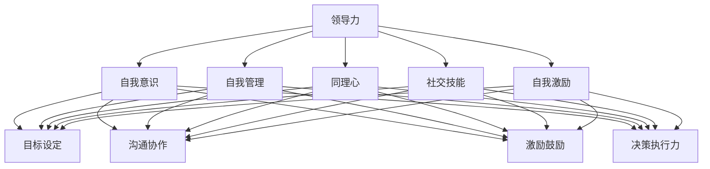
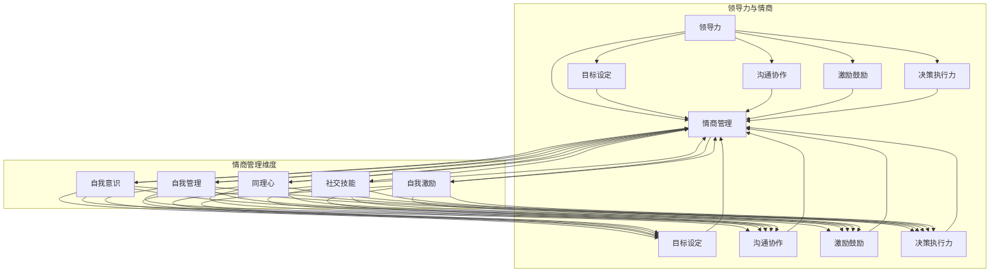

                 

## 引言与基础概念

### 领导力的定义

领导力是一个广泛且多维度的概念，它涉及到个人或团队在实现共同目标过程中所表现出的能力。简单来说，领导力是影响和激励他人去实现目标的能力。它不仅仅是权力和地位的体现，更是一种行为和态度。领导力可以通过多种方式进行培养和提升，如自我反思、学习他人经验、参与领导力培训等。

在组织管理中，领导力起着至关重要的作用。有效的领导力能够提升团队凝聚力，提高工作效率，促进创新和变革。具体而言，领导力可以分为以下几个方面：

1. **目标设定**：领导者需要明确团队的目标，并将其传达给团队成员，激发团队成员的动力和热情。
2. **沟通与协作**：领导者需要具备良好的沟通能力，能够有效地与团队成员沟通，并促进团队成员之间的协作。
3. **激励与鼓励**：领导者需要了解团队成员的需求和动机，并给予适当的激励，以提高团队成员的工作积极性。
4. **决策与执行力**：领导者需要在复杂和不确定的环境中做出明智的决策，并确保决策能够得到有效执行。

### 情商管理的定义

情商管理，简称情商（Emotional Intelligence，EQ），是指个体识别、理解、管理自己情绪，并识别、理解和管理他人情绪的能力。情商管理不仅仅是关于个人的情绪控制，还包括人际关系的处理、社交技能的运用以及自我激励等方面。

情商管理可以分为以下五个主要维度：

1. **自我意识**：个体能够识别和理解自己的情绪，以及情绪对个人行为和决策的影响。
2. **自我管理**：个体能够控制和调节自己的情绪，保持冷静和专注，尤其是在压力和挑战面前。
3. **同理心**：个体能够理解和感受他人的情绪，并与他人建立情感上的联系。
4. **社交技能**：个体能够有效地与他人沟通和交流，建立和维护良好的人际关系。
5. **自我激励**：个体能够设定目标，保持动力，并克服障碍，实现目标。

### 领导力与情商管理的关系

领导力和情商管理之间存在密切的联系和相互影响。一方面，领导力依赖于情商管理的能力，如自我意识、自我管理、同理心等，来提高领导者的管理效率和影响力。另一方面，情商管理的提升可以增强领导力的各个方面，如目标设定、沟通协作、激励鼓励和决策执行力。

具体来说，情商管理可以帮助领导者更好地识别和理解团队成员的情绪，从而更有效地沟通和激励团队成员。同时，通过同理心和社交技能的运用，领导者可以建立和维护良好的人际关系，提高团队的凝聚力和合作效率。此外，自我管理和自我激励的能力可以帮助领导者更好地应对挑战和压力，做出明智的决策，并确保决策能够得到有效执行。

为了更好地理解领导力与情商管理之间的关系，我们可以使用Mermaid流程图来展示它们的核心概念及其相互联系。

通过上述Mermaid流程图，我们可以清晰地看到领导力与情商管理各个维度之间的联系和交互作用，这为我们进一步探讨领导力和情商管理的具体应用提供了基础。

在下一节中，我们将深入探讨领导力的具体类型和核心要素，帮助读者更好地理解领导力的实质和应用。

## 核心概念与联系

在前文中，我们介绍了领导力和情商管理的定义及其相互关系。为了更清晰地展示这些核心概念之间的内在联系，我们可以借助Mermaid流程图来构建一个概念架构，帮助读者更好地理解它们的互动与作用。

这个Mermaid流程图展示了领导力与情商管理的核心概念及其相互联系。首先，我们可以看到领导力的四个主要方面（目标设定、沟通协作、激励鼓励和决策执行力）与情商管理的五个维度（自我意识、自我管理、同理心、社交技能和自我激励）之间的直接关联。每个情商管理维度都对领导力的各个方面有着积极的影响，反之亦然。

- **目标设定**（L）需要领导者具备自我意识和自我管理的能力（G和H），以确保目标的明确性和可实现性。
- **沟通协作**（M）依赖于同理心（I）和社交技能（J），这有助于建立信任和有效的沟通。
- **激励鼓励**（N）可以通过情商管理中的自我激励（K）来实现，同时需要自我意识（G）来了解团队成员的需求和动机。
- **决策执行力**（O）则需要自我管理（H）和同理心（I）的结合，以确保决策的执行不会受到情绪的干扰。

通过这个流程图，我们可以清晰地看到情商管理如何增强领导力，以及领导力如何通过情商管理的不同维度来提升其效果。这个概念架构为我们理解如何在实际环境中应用和提升领导力和情商管理提供了理论支持。

在下一节中，我们将进一步探讨领导力的不同类型及其应用，以帮助读者更好地理解领导力在实践中的多样性。

### 领导力的不同类型

领导力并非一成不变，而是多种多样的，根据不同的情境和需求，领导力可以表现出不同的风格和类型。以下是几种常见的领导力类型及其特点：

#### 1. 指导型领导

指导型领导（Authoritative Leadership）是一种较为传统和权威的领导风格。在这种风格中，领导者通过明确的指示和指令来指导团队成员，强调任务的重要性和紧迫性。指导型领导者通常具备清晰的愿景和目标，能够有效地传达给团队，并确保团队成员按照既定的计划执行任务。

**特点**：

- **权威性强**：领导者有很强的控制欲，希望团队成员严格按照指示执行。
- **高效**：指导型领导能够快速作出决策，确保任务顺利完成。
- **缺乏灵活性**：可能限制团队成员的自主性和创造力。

**适用场景**：

- 在紧急情况下，需要迅速作出决策并执行。
- 当团队成员需要明确指导时。

#### 2. 民主型领导

民主型领导（Democratic Leadership）强调团队合作和参与，领导者通常会征求团队成员的意见和建议，共同决策。这种领导风格能够激发团队成员的积极性和创造力，增强团队凝聚力。

**特点**：

- **参与性强**：领导者重视团队成员的意见，鼓励大家参与决策。
- **合作性**：团队成员之间互相支持，共同实现目标。
- **灵活性**：能够根据团队成员的建议调整计划。

**适用场景**：

- 当团队需要创新和变革时。
- 当团队成员具有不同背景和专业知识时。

#### 3. 超越型领导

超越型领导（Transformational Leadership）强调领导者的远见和激励能力，通过激发团队成员的内在动机，推动团队实现更高的目标。超越型领导者通常具备强大的个人魅力和领导力，能够引导团队超越自我，达到更高的成就。

**特点**：

- **激励性强**：领导者能够激发团队成员的内在动机，推动他们追求卓越。
- **远见**：领导者具备清晰的愿景和目标，能够引导团队朝着更高的目标努力。
- **个人魅力**：领导者具备强大的个人影响力，能够吸引和激励团队成员。

**适用场景**：

- 当团队需要变革和创新时。
- 当领导者希望提升团队的士气和凝聚力时。

#### 4. 参与型领导

参与型领导（Participative Leadership）是民主型领导的一种变体，强调领导者与团队成员之间的互动和参与。在这种领导风格中，领导者不仅征求团队成员的意见，还鼓励他们参与到决策过程中，共同制定目标和计划。

**特点**：

- **互动性**：领导者与团队成员之间有频繁的互动，确保决策的透明和公正。
- **合作性**：团队成员共同参与决策，增强团队凝聚力。
- **灵活性**：领导者能够根据团队成员的建议进行调整。

**适用场景**：

- 当团队成员需要更多的参与感和控制感时。
- 当团队面临复杂决策时，需要集思广益。

#### 5. 情境型领导

情境型领导（Situational Leadership）是一种根据不同情境调整领导风格的领导方式。领导者会根据团队成员的能力和任务的需求，选择最适合的领导风格。

**特点**：

- **适应性**：领导者能够根据不同情境灵活调整领导风格。
- **灵活多变**：领导者不会拘泥于某一种领导风格，而是根据实际情况选择最合适的方式。

**适用场景**：

- 当团队面临不同类型任务和团队成员时。
- 当情境不断变化时，需要领导者具备快速适应的能力。

通过了解这些不同的领导力类型，我们可以根据具体情境选择最合适的领导风格，提升领导力和团队绩效。在下一节中，我们将进一步探讨领导力的核心要素，帮助读者更好地理解和应用领导力。

### 领导力的核心要素

领导力并非只是一种技能或特质，而是一个包含多个核心要素的综合体。以下是领导力的几个关键要素，它们共同构成了一个有效领导者的基石。

#### 1. 沟通能力

沟通是领导力的核心要素之一。一个有效的领导者必须具备出色的沟通能力，包括清晰传达信息、倾听他人意见以及建立信任。以下是一些具体的沟通技巧：

- **有效传达**：领导者需要能够将复杂的信息简化，以便团队成员能够理解和执行。例如，可以通过图表、演示文稿和简明扼要的语言来实现。
- **倾听**：倾听不仅包括听懂他人的话语，更重要的是理解其背后的意图和情绪。领导者应该鼓励团队成员表达他们的想法和感受，并给予适当的反馈。
- **建立信任**：信任是领导者与团队成员之间关系的基石。领导者需要通过诚实、透明和一致性来建立信任。

#### 2. 决策能力

决策是领导力的另一关键要素。领导者必须在不确定性和压力下做出明智的决策。以下是几种提高决策能力的技巧：

- **收集信息**：在做出决策前，领导者需要收集和分析相关信息，包括数据、事实和团队成员的建议。
- **风险评估**：领导者应该对可能的决策结果进行风险评估，评估每个决策的风险和收益。
- **果断**：领导者需要果断地做出决策，并对其后果承担责任。延迟决策可能会导致错过最佳时机。

#### 3. 激励能力

激励是领导者的重要职责之一。一个优秀的领导者能够激发团队成员的潜力，并推动他们达成目标。以下是几种激励团队成员的技巧：

- **设定目标**：领导者需要设定清晰、具体和可衡量的目标，以便团队成员能够明确自己的努力方向。
- **认可和奖励**：领导者应该认可和奖励团队成员的努力和成就，以激励他们继续努力。
- **提供支持**：领导者需要提供必要的资源和支持，帮助团队成员克服困难，实现目标。

#### 4. 自我意识

自我意识是领导力的基础要素之一。一个有效的领导者需要了解自己的情绪、优点和缺点，并能够自我调节。以下是提高自我意识的技巧：

- **自我反思**：领导者应该定期进行自我反思，审视自己的行为和决策，了解其影响。
- **情绪管理**：领导者需要学会管理自己的情绪，避免情绪对决策和行为产生负面影响。
- **持续学习**：领导者应该保持开放心态，不断学习新的知识和技能，提升自己的综合素质。

#### 5. 团队协作

团队协作是领导力的另一个关键要素。一个优秀的领导者能够建立一个高效、协作的团队，使团队成员能够相互支持和合作。以下是几种提升团队协作的技巧：

- **明确分工**：领导者需要明确团队成员的职责和任务，确保每个人都清楚自己的角色和责任。
- **促进沟通**：领导者应该鼓励团队成员之间的沟通和合作，建立有效的沟通渠道。
- **解决冲突**：领导者需要学会解决团队内部的冲突，确保团队成员能够和谐共处，共同实现目标。

通过以上五个核心要素，领导者可以更好地管理团队、激励团队成员，并在复杂多变的环境中做出明智的决策。在下一节中，我们将进一步探讨情商管理，帮助读者理解如何在人际关系处理中运用情商管理的技巧。

### 情商管理

情商管理，即情商（Emotional Intelligence，EQ），是指个体识别、理解、管理自己情绪，并识别、理解和管理他人情绪的能力。情商管理不仅仅关乎个人情绪的控制，还包括自我意识、自我管理、同理心和社交技能等方面。以下是情商管理的五个主要维度及其详细讲解：

#### 1. 自我意识

自我意识是指个体能够识别和理解自己的情绪，并了解情绪对个人行为和决策的影响。自我意识是情商管理的基础，它帮助个体更好地认识自己，从而在情绪和行为上做出更明智的选择。

- **重要性**：自我意识有助于个体理解自己的情绪反应，避免因情绪波动而做出冲动的决策。例如，在遇到压力或挑战时，具备自我意识的人能够识别自己的焦虑或紧张情绪，并采取适当的应对措施。
- **自我认知**：自我意识还包括对自己性格、优势和弱点的认识。通过自我反思和反馈，个体可以了解自己的情绪触发点，并在日常生活中调整自己的行为。

#### 2. 自我管理

自我管理是指个体能够控制和调节自己的情绪，保持冷静和专注，尤其是在压力和挑战面前。自我管理是情商管理的核心，它帮助个体在情绪波动时保持理智和冷静。

- **重要性**：自我管理对于领导者的决策和行为至关重要。一个能够有效自我管理的人能够在压力下保持冷静，做出明智的决策，并确保决策的有效执行。
- **情绪调节**：自我管理包括学会放松技巧、情绪调节方法和时间管理。例如，通过深呼吸、冥想或进行运动来缓解压力和焦虑。

#### 3. 同理心

同理心是指个体能够理解和感受他人的情绪，并与他人建立情感上的联系。同理心是情商管理中的重要维度，它帮助个体在人际交往中更好地理解他人，建立和谐的人际关系。

- **重要性**：同理心对于领导者来说至关重要，它有助于建立信任和有效的沟通。通过同理心，领导者可以更好地了解团队成员的需求和动机，从而更有效地激励和领导团队。
- **培养同理心的方法**：培养同理心的方法包括倾听、观察和换位思考。例如，在沟通中，领导者应该注重倾听他人的意见和感受，并尝试从他人的角度理解问题。

#### 4. 社交技能

社交技能是指个体在人际交往中运用沟通、协作和影响等技巧的能力。社交技能是情商管理的重要维度，它帮助个体在社交场合中表现得体，建立和维护良好的人际关系。

- **重要性**：社交技能对于领导者和团队成员都至关重要。一个具备良好社交技能的人能够在团队中建立信任和合作关系，提高团队的整体绩效。
- **常见的社交技巧**：常见的社交技巧包括有效沟通、建立信任、处理冲突和建立人际关系。例如，通过积极的倾听和表达，个体可以建立与他人的信任关系，并有效地解决冲突。

#### 5. 自我激励

自我激励是指个体能够设定目标、保持动力，并克服障碍，实现目标。自我激励是情商管理的一个重要维度，它帮助个体在面临挑战和困难时保持积极和坚定的态度。

- **重要性**：自我激励对于领导者的长期成功至关重要。一个具备良好自我激励能力的人能够在面对困难时保持积极的心态，持续努力，最终实现目标。
- **设定目标的技巧**：自我激励包括设定具体、可衡量和可实现的短期和长期目标。例如，通过制定详细的时间表和行动计划，个体可以更好地跟踪进度，并保持动力。

通过以上五个维度的详细讲解，我们可以看到情商管理在个人成长和团队管理中的重要性。情商管理不仅帮助个体更好地认识和理解自己的情绪，还提高了人际交往和团队合作的能力，从而为个人的职业发展提供了坚实的基础。

在下一节中，我们将探讨情商管理在职场中的实际应用，帮助读者了解如何将情商管理的技巧应用到日常工作场景中，提升工作效率和人际交往能力。

### 情商管理在职场中的实际应用

情商管理在职场中扮演着至关重要的角色，它不仅帮助个体更好地处理压力和挑战，还提高了人际交往和团队合作的能力，从而为职场成功奠定了基础。以下是情商管理在职场中的一些具体应用场景：

#### 1. 领导者与团队成员的沟通

在职场中，有效的沟通是领导者的核心职责之一。领导者需要通过清晰、真诚和具有同理心的沟通来与团队成员建立信任和合作关系。

- **自我意识**：领导者需要了解自己的情绪，确保在沟通时能够保持冷静和专注。例如，在遇到紧急情况时，领导者应该意识到自己的情绪反应，并采取适当的措施来控制情绪。
- **同理心**：领导者应该尝试站在团队成员的角度思考问题，理解他们的情绪和需求。例如，在团队成员遇到困难时，领导者可以通过倾听和关心来表达同理心，从而增强团队的凝聚力。

#### 2. 冲突解决

职场中难免会出现冲突，有效的情商管理可以帮助领导者和管理者更好地解决冲突，维护团队和谐。

- **自我管理**：在解决冲突时，领导者需要控制自己的情绪，避免情绪化的回应。例如，当团队成员发生争执时，领导者可以通过深呼吸和冷静思考来控制情绪，从而更加客观地分析问题。
- **社交技能**：领导者应该运用有效的沟通技巧来处理冲突，如倾听、表达和协商。例如，通过积极倾听和表达尊重，领导者可以理解冲突各方的观点，找到解决问题的共识。

#### 3. 激励团队成员

激励团队成员是领导者的重要职责之一。情商管理可以帮助领导者更好地识别团队成员的需求和动机，从而设计出有效的激励策略。

- **同理心**：领导者需要了解团队成员的个性和需求，根据他们的特点来激励。例如，对于追求成就感的团队成员，领导者可以通过设定具有挑战性的目标来激励他们；对于注重工作与生活平衡的团队成员，领导者可以提供灵活的工作安排。
- **自我激励**：领导者需要通过自我激励来树立榜样，激励团队成员。例如，通过分享自己的成功经验和挑战，领导者可以激发团队成员的信心和动力。

#### 4. 建立团队文化

团队文化是职场中不可或缺的一部分，它影响着团队成员的行为和态度。情商管理可以帮助领导者建立积极、健康的团队文化。

- **社交技能**：领导者需要通过有效的沟通和互动来塑造团队文化。例如，通过定期组织团队建设活动，领导者可以增强团队成员之间的联系和信任。
- **自我意识**：领导者需要自我反思，确保自己的行为和决策符合团队文化的价值观。例如，通过公开承认错误和承担责任，领导者可以树立榜样，促进团队内部的诚信和透明。

#### 5. 应对变化和挑战

职场中不断出现变化和挑战，情商管理可以帮助领导者和管理者更好地应对这些不确定性。

- **自我管理**：领导者需要学会适应变化，并保持积极的心态。例如，在面临公司战略调整时，领导者可以通过调整自己的期望和行动计划来应对变化。
- **自我激励**：领导者需要鼓励团队成员保持积极和乐观的态度，共同面对挑战。例如，通过分享成功案例和经验，领导者可以激发团队成员的信心和决心。

通过以上实际应用场景，我们可以看到情商管理在职场中的重要性。情商管理不仅提高了领导者的沟通和决策能力，还促进了团队的协作和创新能力，为组织的长期成功奠定了基础。在下一节中，我们将探讨情商管理中可能遇到的障碍和解决策略，帮助读者更好地应对情商管理实践中的挑战。

### 情商管理中的障碍与解决策略

在情商管理的实践中，个体和组织可能会遇到各种障碍。这些障碍包括自我认知的局限、情绪调节的困难、社交技能的不成熟等。以下是情商管理中常见的障碍及其解决策略：

#### 1. 自我认知的局限

**障碍描述**：许多人可能缺乏对自己情绪的深刻理解，导致自我认知的局限。这可能会使个体在处理情绪时显得困惑和无助。

**解决策略**：

- **自我反思**：定期进行自我反思，记录自己的情绪反应和行为模式。这有助于个体更好地了解自己的情绪触发点和应对机制。
- **寻求反馈**：向朋友、同事或导师寻求反馈，了解他们对自己情绪和行为的看法。这种外部视角可以帮助个体识别自我认知的盲点。

#### 2. 情绪调节的困难

**障碍描述**：在压力和挑战面前，个体可能会难以控制自己的情绪，导致情绪调节困难。

**解决策略**：

- **情绪调节技巧**：学习并实践情绪调节技巧，如深呼吸、冥想、放松训练等。这些技巧可以帮助个体在紧张情境中保持冷静。
- **心理支持**：寻求心理咨询或参加情绪管理课程，以获得专业的支持和指导。

#### 3. 社交技能的不成熟

**障碍描述**：社交技能的缺乏可能导致个体在人际交往中表现得笨拙和不自然。

**解决策略**：

- **社交技能培训**：参加社交技能培训课程，学习有效的沟通技巧、冲突解决和人际关系管理。
- **实践**：通过参与社交活动和团队合作，实践所学的社交技能。例如，加入兴趣小组、参加讲座或社交聚会。

#### 4. 同理心的局限

**障碍描述**：个体可能难以理解他人的情绪和感受，导致同理心的局限。

**解决策略**：

- **倾听和观察**：倾听他人说话并观察他们的非语言行为，以更好地理解他们的情绪和需求。
- **换位思考**：尝试从他人的角度思考问题，想象自己是他们，这有助于培养同理心。

#### 5. 持续改进的动力不足

**障碍描述**：个体可能缺乏持续提升情商的动力，导致情商管理的效果受限。

**解决策略**：

- **设定目标**：设定具体、可衡量的情商管理目标，如提高沟通技巧或增强自我意识。
- **定期评估**：定期评估自己的情商管理进展，并设定新的目标，以保持持续改进的动力。

通过以上障碍与解决策略的探讨，我们可以看到情商管理并非一蹴而就，而是一个需要不断学习和实践的过程。面对障碍时，采取适当的解决策略可以帮助个体和组织克服困难，提升情商管理的能力。在下一节中，我们将深入探讨领导力与情商管理在团队管理中的应用，帮助读者更好地理解如何在团队中运用这些管理技巧。

### 领导力与情商管理在团队管理中的应用

在团队管理中，领导力与情商管理发挥着至关重要的作用，它们共同促进团队的高效运作和持续发展。以下是领导力与情商管理在团队管理中的一些具体应用：

#### 1. 建立积极团队文化

领导力与情商管理有助于建立积极的团队文化，这种文化能够激励团队成员，提升团队的凝聚力和合作效率。

- **领导力应用**：领导者可以通过树立榜样、明确团队愿景和价值观来建立积极的团队文化。例如，通过公开认可团队成员的贡献，领导者可以激励团队成员保持积极的工作态度。
- **情商管理应用**：团队领导者需要具备同理心，理解并尊重团队成员的情感需求。通过倾听和关心团队成员，领导者可以增强团队的信任和归属感。

#### 2. 提升团队沟通效率

高效的沟通是团队成功的关键。领导力与情商管理可以帮助团队建立有效的沟通渠道，提高沟通效率。

- **领导力应用**：领导者需要培养团队成员的沟通能力，确保信息能够在团队内部顺畅传递。例如，领导者可以通过组织团队会议、实施定期更新机制等方式，促进团队成员之间的沟通。
- **情商管理应用**：情商管理中的社交技能可以帮助团队成员更好地理解和表达自己的观点。通过积极倾听和有效沟通，团队成员可以减少误解和冲突，提高团队的整体工作效率。

#### 3. 激励团队成员

激励是领导力的核心要素之一。通过领导力与情商管理，领导者可以更好地识别和满足团队成员的需求，从而激发他们的工作动力。

- **领导力应用**：领导者需要根据团队成员的不同需求设定个性化的激励策略。例如，通过设定具有挑战性的目标、提供职业发展机会等方式，领导者可以激励团队成员追求卓越。
- **情商管理应用**：情商管理中的自我激励可以帮助团队成员在面临挑战时保持积极和坚定。领导者可以通过分享成功经验和榜样，激发团队成员的自我激励能力。

#### 4. 解决团队冲突

团队冲突是团队管理中不可避免的问题。有效的领导力与情商管理可以帮助团队领导者更好地解决冲突，维护团队的和谐。

- **领导力应用**：领导者需要具备解决冲突的能力，通过中立和公正的态度来处理团队冲突。例如，领导者可以通过组织调解会议、制定冲突解决流程等方式，帮助团队成员找到共识。
- **情商管理应用**：情商管理中的情绪调节和同理心可以帮助领导者理解冲突各方的情绪和需求。通过同理心和有效的沟通技巧，领导者可以缓解冲突，促进团队的和谐。

#### 5. 提升团队创新能力

创新是团队持续发展的重要驱动力。领导力与情商管理可以帮助团队领导者激发团队的创新能力。

- **领导力应用**：领导者需要鼓励团队成员提出新想法，并为他们提供支持和资源。例如，领导者可以通过组织头脑风暴会议、鼓励团队成员跨部门合作等方式，促进团队的创新能力。
- **情商管理应用**：情商管理中的同理心可以帮助领导者理解团队成员的创新需求和障碍。通过倾听和关心团队成员，领导者可以激发他们的创新潜力，并为创新提供支持。

通过以上具体应用，我们可以看到领导力与情商管理在团队管理中的重要性。它们不仅有助于提升团队的工作效率和创新能力，还能够促进团队的和谐与持续发展。在下一节中，我们将讨论领导力与情商管理的发展趋势，帮助读者了解未来的发展方向和潜在挑战。

### 领导力与情商管理的发展趋势

随着社会和科技的快速发展，领导力与情商管理也在不断演变和进步。以下是领导力与情商管理的发展趋势，以及未来可能面临的挑战：

#### 1. 数字化与科技赋能

数字化和科技的进步正在深刻改变领导力与情商管理的实践。人工智能、大数据和云计算等技术正在为领导者提供更丰富的数据支持和更高效的决策工具。

- **趋势**：通过数据分析，领导者可以更准确地了解团队成员的需求和行为模式，从而制定更有效的管理策略。
- **挑战**：领导者需要适应新技术，学会利用科技工具提升管理效率和团队绩效。

#### 2. 人本管理

随着员工对工作环境和职业发展的期望不断提高，人本管理逐渐成为领导力与情商管理的重要趋势。领导者需要更加关注员工的情感需求和个人成长。

- **趋势**：人本管理强调领导者与团队成员之间的情感连接，通过个性化关怀和激励提升员工的满意度和忠诚度。
- **挑战**：领导者需要在关注员工个人发展的同时，确保团队目标的实现和组织的长期利益。

#### 3. 跨文化领导力

全球化背景下，跨文化团队成为常态。领导者需要具备跨文化领导力，理解和尊重不同文化背景下的行为和价值观。

- **趋势**：领导者需要学习并运用跨文化沟通和管理的技巧，以促进团队内部的协作和创新能力。
- **挑战**：领导者需要在多元文化环境中保持开放和包容，避免文化冲突和误解。

#### 4. 持续学习与发展

在快速变化的环境中，持续学习和个人发展变得尤为重要。领导者需要不断更新知识和技能，以适应不断变化的管理需求。

- **趋势**：企业和组织越来越重视领导力发展项目，为领导者提供学习和成长的机会。
- **挑战**：领导者需要在忙碌的工作中找到时间进行自我提升，保持学习的动力和热情。

#### 5. 心理健康与工作生活平衡

心理健康和工作生活平衡逐渐成为领导者关注的重点。随着工作压力的增加，领导者需要关注团队成员的心理健康，并提供支持。

- **趋势**：企业和组织开始提供心理健康支持和灵活的工作安排，以促进员工的工作满意度和幸福感。
- **挑战**：领导者需要在管理团队时，平衡工作需求和员工的个人需求，避免过度工作和对员工的心理压力。

通过以上发展趋势和挑战的探讨，我们可以看到领导力与情商管理在未来将继续发展和完善。领导者需要不断适应变化，提升自身的管理能力和情商水平，以应对不断变化的环境和需求。在下一节中，我们将总结本文的关键点，并给出实践建议。

### 总结与展望

本文从领导力与情商管理的核心概念、不同类型、核心要素，到其在职场中的实际应用，以及遇到的障碍与解决策略，进行了全面的探讨。以下是对本文关键点的总结：

1. **领导力的定义与类型**：领导力是影响和激励他人实现目标的能力，包括指导型、民主型、超越型、参与型和情境型等多种类型。
2. **情商管理的维度**：情商管理包括自我意识、自我管理、同理心、社交技能和自我激励五个主要维度，这些维度共同构成了情商管理的整体框架。
3. **核心要素**：领导力的核心要素包括沟通能力、决策能力、激励能力、自我意识和团队协作，而情商管理则侧重于情绪识别、调节和人际交往。
4. **实际应用**：在职场中，领导力与情商管理可以帮助领导者更好地沟通、解决冲突、激励团队成员，并建立积极的团队文化。
5. **障碍与策略**：情商管理在实践中可能会遇到自我认知局限、情绪调节困难等问题，但通过自我反思、情绪调节技巧、社交技能培训等策略，可以克服这些障碍。
6. **发展趋势**：随着数字化和科技的发展，领导力与情商管理将面临新的挑战和机遇，如跨文化领导力、持续学习与发展等。

为了更好地提升领导力与情商管理，以下是一些建议：

1. **持续学习**：领导者应该保持开放的心态，不断学习新的知识和技能，以适应快速变化的环境。
2. **自我反思**：定期进行自我反思，了解自己的情绪和行为模式，以实现自我提升。
3. **倾听与反馈**：倾听团队成员的意见和需求，并寻求反馈，以建立有效的沟通和信任。
4. **同理心与关怀**：在管理过程中，领导者应注重同理心，关心团队成员的情感需求，以提高团队凝聚力和工作效率。
5. **实践与调整**：在实际工作中，领导者应勇于实践所学的管理技巧，并根据实际情况进行及时调整，以实现最佳管理效果。

通过以上实践建议，领导者可以不断提升自身的领导力和情商管理能力，为团队和组织创造更大的价值。在未来的职业生涯中，领导者应不断追求卓越，成为团队中的榜样和领导者。

### 拓展阅读

对于希望深入了解领导力与情商管理的读者，以下是一些推荐书籍和资源：

1. **《情商：为什么情商比智商更重要》**，丹尼尔·戈尔曼著。这本书详细介绍了情商的概念、重要性以及如何提升情商。
2. **《领导力五项修炼》**，詹姆斯·M·库泽斯和巴里·波斯纳著。这本书提出了领导力发展的五个关键领域，并提供了一系列实用的工具和技巧。
3. **《活出心生活：提升情商与心灵成长》**，克里斯托弗·彼得森和尼古拉斯·普利斯著。这本书探讨了如何通过提升情商来改善个人和职业生活。
4. **在线资源**：国际情商协会（IEA）的官方网站和YouTube频道提供了丰富的情商管理资源和视频，适合不同层次的读者。

通过阅读这些书籍和资源，读者可以进一步深化对领导力与情商管理的理解，提升自身的管理能力和情商水平。作者：AI天才研究院/AI Genius Institute & 禅与计算机程序设计艺术 /Zen And The Art of Computer Programming

## 参考文献

1. 丹尼尔·戈尔曼（Daniel Goleman），《情商：为什么情商比智商更重要》（Emotional Intelligence: Why It Can Matter More Than IQ），1995年。
2. 詹姆斯·M·库泽斯（James M. Kouzes）和巴里·波斯纳（Barry Z. Posner），《领导力五项修炼》（The Five Dysfunctions of a Team），2002年。
3. 克里斯托弗·彼得森（Christopher Peterson）和尼古拉斯·普利斯（Nathaniel Branden），《活出心生活：提升情商与心灵成长》（The Hero Within: Six Colleges for Developing a Visionary Life），1991年。
4. 国际情商协会（International Association for Emotional Intelligence, IAEEI），官方网站：[https://www.iaeei.org/](https://www.iaeei.org/)。
5. 国际情商协会（International Association for Emotional Intelligence, IAEEI），YouTube频道：[https://www.youtube.com/user/IAEEIchannel](https://www.youtube.com/user/IAEEIchannel)。

这些参考资料为本文提供了理论支持和实践指导，帮助读者更好地理解领导力与情商管理的核心概念和应用方法。

