                 

## 文章标题

### 领导力与情商管理：提升人际关系处理能力

#### 关键词

- 领导力
- 情商管理
- 人际关系处理
- 自我提升
- 团队协作

#### 摘要

本文深入探讨了领导力与情商管理在人际关系处理中的重要性，通过系统的分析、实例讲解和实践指导，帮助读者理解并提升领导力与情商，从而在个人发展和团队协作中更加得心应手。

---

### 第一部分：领导力基础

#### 1.1 领导力的定义与重要性

**背景介绍**

领导力是组织中至关重要的要素，它不仅决定了团队的效能，也影响着组织的长期发展。在技术迅速变革、市场竞争激烈的今天，领导力已经从传统的权威管理转变为更加注重人际关系和团队协作的能力。

**核心概念与联系**

领导力的核心概念包括：影响力、决策力、沟通能力、激励能力等。这些概念相互联系，共同构成了领导力的整体框架。例如，影响力是领导力的基础，而沟通能力和激励能力则是实现影响力的手段。

**Mermaid 流程图**

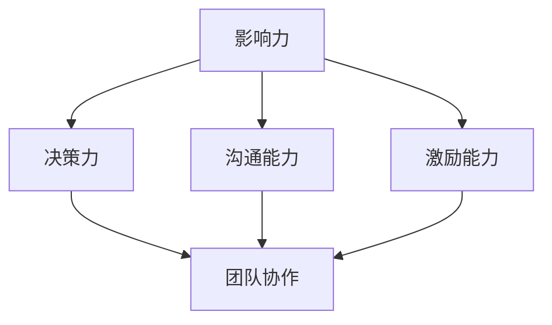

**核心算法原理讲解**

领导力的算法原理可以概括为：

1. **识别目标**：明确团队的目标和愿景。
2. **建立信任**：通过诚信和透明建立团队成员之间的信任。
3. **有效沟通**：使用清晰、准确的沟通技巧传达目标和期望。
4. **激励团队**：根据团队成员的特点和需求，设计激励措施。
5. **持续反馈**：通过定期的反馈机制，帮助团队成员持续成长。

**数学模型和公式**

领导力模型可以表示为：

\[ L = f(I, D, C, M) \]

其中，\( L \) 代表领导力，\( I \) 代表影响力，\( D \) 代表决策力，\( C \) 代表沟通能力，\( M \) 代表激励能力。

**详细讲解与举例说明**

- **案例1**：某技术公司的CTO通过每周的技术分享会议，提升团队的决策力和沟通能力，从而提高了团队的协作效率。
- **案例2**：一位项目经理在项目初期，通过建立明确的里程碑和定期进度汇报，有效地激励团队按时完成项目。

#### 1.2 领导力的发展历程

**背景介绍**

领导力的发展历程可以从传统的权威管理到现代的变革领导，再到当前的共享领导。每个阶段都有其独特的特点和影响。

**核心概念与联系**

领导力的发展历程涉及领导者的角色转变、领导风格的演变以及领导实践的进步。

**Mermaid 流程图**

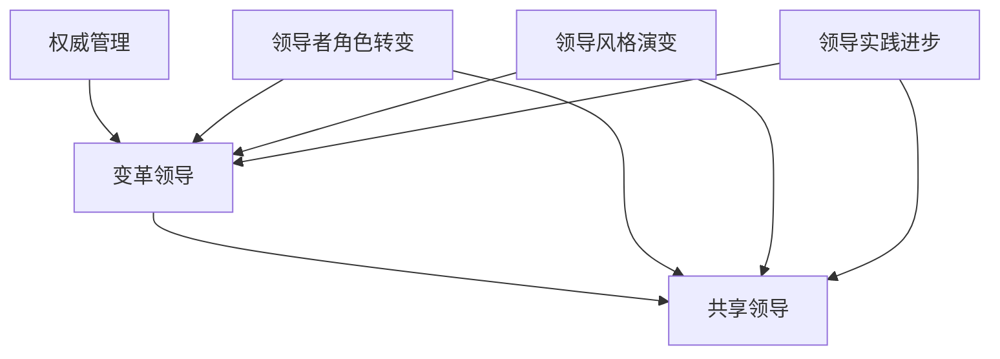

**核心算法原理讲解**

领导力的发展历程可以视为一个动态的适应过程，领导者需要不断调整自己的领导风格和实践方法，以适应不断变化的环境。

**数学模型和公式**

领导力发展历程可以表示为：

\[ L_{\text{发展}} = f(\text{环境变化}, \text{领导者适应}) \]

**详细讲解与举例说明**

- **案例1**：在20世纪初期，泰勒的科学管理理论强调标准化和效率，这是权威管理的体现。
- **案例2**：在21世纪初，扁平化组织和员工参与决策成为趋势，共享领导逐渐流行。

#### 1.3 领导风格与特质

**背景介绍**

领导风格和特质是领导者成功的关键因素。不同的领导风格适用于不同的环境和团队，而特质则是领导者的内在品质。

**核心概念与联系**

领导风格包括权威式、民主式、参与式等，而特质包括自信、诚实、责任心等。

**Mermaid 流程图**

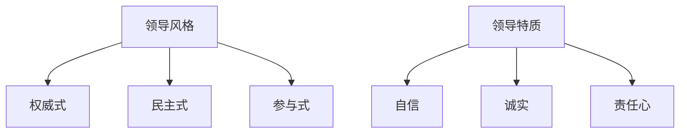

**核心算法原理讲解**

领导风格和特质的关系可以视为一种匹配模型，领导者需要根据团队和环境选择合适的风格，并发挥自己的特质。

**数学模型和公式**

领导风格与特质匹配模型可以表示为：

\[ \text{匹配度} = f(\text{领导风格}, \text{团队特质}, \text{环境要求}) \]

**详细讲解与举例说明**

- **案例1**：一位具有创新精神的CEO在初创公司中采用参与式领导风格，激发了团队的创造力。
- **案例2**：在大型企业中，一位重视执行力的CEO采用权威式领导风格，确保了项目的顺利进行。

#### 1.4 领导力与情商管理的关系

**背景介绍**

领导力与情商管理之间存在密切的联系。情商管理是领导力的重要组成部分，它帮助领导者更好地处理人际关系，提升领导效能。

**核心概念与联系**

情商管理包括自我意识、自我调节、社交意识和情绪管理，这些能力直接影响领导者的决策和团队协作。

**Mermaid 流程图**

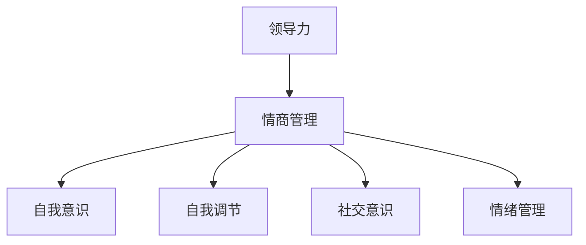

**核心算法原理讲解**

领导力与情商管理的关系可以视为一种相互促进的过程，情商管理能力的提升有助于增强领导力，反之亦然。

**数学模型和公式**

领导力与情商管理的关系可以表示为：

\[ L = f(\text{情商管理能力}) \]

**详细讲解与举例说明**

- **案例1**：一位具备高情商的领导者能够更好地理解和激励团队成员，从而提高团队的凝聚力。
- **案例2**：在危机管理中，一位具备高情商的领导者能够保持冷静，迅速做出正确的决策。

---

### 第二部分：情商管理基础

#### 2.1 情商的概念与分类

**背景介绍**

情商（Emotional Intelligence，简称EQ）是指个体识别、理解、管理和调节自己以及他人情绪的能力。情商在个人发展和职业成功中起着至关重要的作用。

**核心概念与联系**

情商的分类主要包括自我意识、自我调节、社交意识和情绪管理。

**Mermaid 流程图**

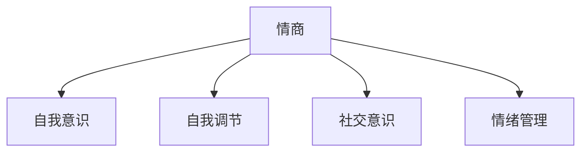

**核心算法原理讲解**

情商的算法原理可以概括为：

1. **自我意识**：了解自己的情绪状态，识别情绪的来源。
2. **自我调节**：控制情绪，以适应不同的环境和情境。
3. **社交意识**：理解他人的情绪，识别社交线索。
4. **情绪管理**：调节情绪，以改善人际关系和团队协作。

**数学模型和公式**

情商模型可以表示为：

\[ EQ = f(\text{自我意识}, \text{自我调节}, \text{社交意识}, \text{情绪管理}) \]

**详细讲解与举例说明**

- **案例1**：一位具备高自我意识的员工能够更好地识别自己的情绪，从而避免在工作中的情绪失控。
- **案例2**：一位具备高情绪管理能力的领导者在团队中能够更好地调节情绪，营造积极的工作氛围。

#### 2.2 情绪识别与管理

**背景介绍**

情绪识别与管理是情商管理的基础。通过有效的情绪识别和管理，个体可以更好地控制自己的情绪，提升个人和团队的表现。

**核心概念与联系**

情绪识别与管理涉及情绪的识别、理解、表达和控制。

**Mermaid 流程图**

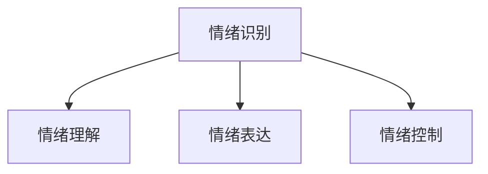

**核心算法原理讲解**

情绪识别与管理的算法原理可以概括为：

1. **情绪识别**：通过生理、心理和行为表现识别情绪。
2. **情绪理解**：通过分析情绪的来源和影响理解情绪。
3. **情绪表达**：以合适的方式表达情绪。
4. **情绪控制**：通过自我调节和控制情绪，以适应不同的情境。

**数学模型和公式**

情绪识别与管理的模型可以表示为：

\[ EM = f(\text{情绪识别}, \text{情绪理解}, \text{情绪表达}, \text{情绪控制}) \]

**详细讲解与举例说明**

- **案例1**：一位在项目中遇到挫折的员工通过情绪识别和管理，避免了情绪的负面扩散，保持了工作效率。
- **案例2**：一位领导者在团队冲突中通过情绪管理，化解了紧张局势，恢复了团队的和谐。

#### 2.3 自我意识与自我调节

**背景介绍**

自我意识与自我调节是情商管理的关键组成部分。自我意识帮助个体了解自己的情绪和行为，自我调节则帮助个体更好地控制这些情绪和行为。

**核心概念与联系**

自我意识与自我调节涉及自我认知、自我评价和自我控制。

**Mermaid 流程图**

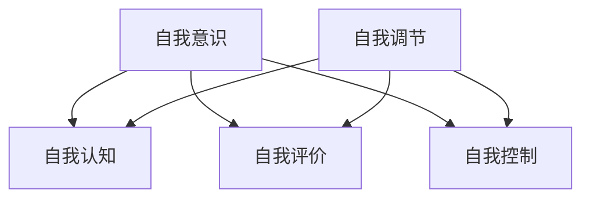

**核心算法原理讲解**

自我意识与自我调节的算法原理可以概括为：

1. **自我认知**：通过内省和反馈了解自己的内在状态。
2. **自我评价**：通过比较和反思评价自己的行为和情绪。
3. **自我控制**：通过自我调节和控制行为，以实现目标。

**数学模型和公式**

自我意识与自我调节的模型可以表示为：

\[ SO = f(\text{自我认知}, \text{自我评价}, \text{自我控制}) \]

**详细讲解与举例说明**

- **案例1**：一位员工通过自我认知，意识到自己在团队合作中存在沟通障碍，进而采取措施改善沟通。
- **案例2**：一位领导者在面对压力时，通过自我调节，保持了冷静和理智，做出了正确的决策。

#### 2.4 社交意识与关系管理

**背景介绍**

社交意识与关系管理是情商管理的重要组成部分。通过社交意识，个体能够更好地理解他人，通过关系管理，个体能够建立和维护积极的人际关系。

**核心概念与联系**

社交意识与关系管理涉及社交认知、社交技能和人际沟通。

**Mermaid 流程图**

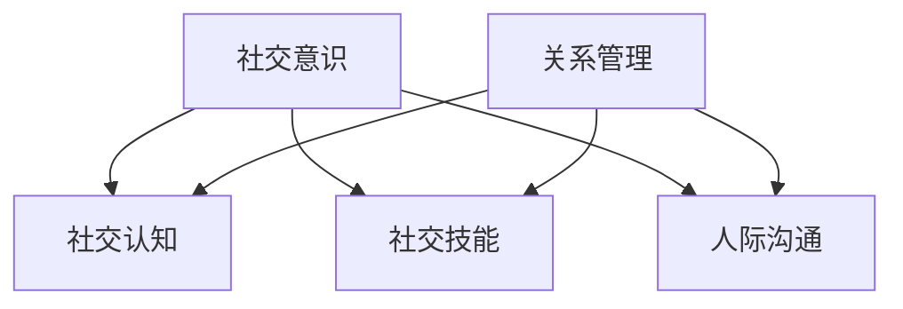

**核心算法原理讲解**

社交意识与关系管理的算法原理可以概括为：

1. **社交认知**：通过观察和倾听理解他人的情绪和行为。
2. **社交技能**：通过练习和反馈提升社交互动的能力。
3. **人际沟通**：通过有效的沟通技巧建立和维护人际关系。

**数学模型和公式**

社交意识与关系管理的模型可以表示为：

\[ SO = f(\text{社交认知}, \text{社交技能}, \text{人际沟通}) \]

**详细讲解与举例说明**

- **案例1**：一位员工通过社交认知，理解了同事在项目中的困难，提供了有效的帮助，增强了团队合作。
- **案例2**：一位领导者通过关系管理，建立了与团队成员的信任关系，提升了团队的凝聚力。

---

### 第三部分：人际关系处理技巧

#### 3.1 倾听与沟通

**背景介绍**

倾听与沟通是人际关系处理的核心技巧。有效的倾听和沟通能够增强人际理解，促进合作，解决冲突。

**核心概念与联系**

倾听与沟通涉及听力技巧、非语言沟通、反馈技巧和有效表达。

**Mermaid 流程图**

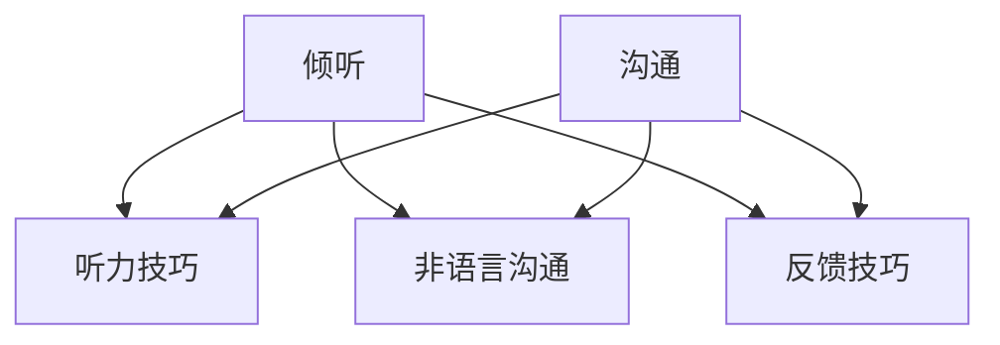

**核心算法原理讲解**

倾听与沟通的算法原理可以概括为：

1. **听力技巧**：通过全神贯注、避免打断和积极反馈提升倾听效果。
2. **非语言沟通**：通过肢体语言、面部表情和语音语调增强沟通效果。
3. **反馈技巧**：通过提问、总结和确认确保沟通的准确性。
4. **有效表达**：通过清晰、简洁、有条理的表达传达信息。

**数学模型和公式**

倾听与沟通的模型可以表示为：

\[ C = f(\text{听力技巧}, \text{非语言沟通}, \text{反馈技巧}, \text{有效表达}) \]

**详细讲解与举例说明**

- **案例1**：在一次团队会议中，一位团队成员通过积极的倾听，理解了项目经理的需求，从而提供了有效的解决方案。
- **案例2**：在一次跨部门合作中，一位项目经理通过有效的沟通技巧，确保了项目的顺利进行。

#### 3.2 解决冲突与谈判

**背景介绍**

解决冲突与谈判是人际关系处理中的重要环节。有效的冲突解决和谈判能够减少误解，增强合作，提升团队效能。

**核心概念与联系**

解决冲突与谈判涉及冲突识别、谈判策略、情绪管理和合作共赢。

**Mermaid 流程图**

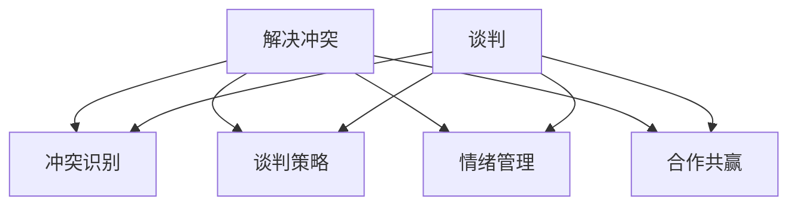

**核心算法原理讲解**

解决冲突与谈判的算法原理可以概括为：

1. **冲突识别**：通过观察和倾听识别潜在和现有的冲突。
2. **谈判策略**：通过合理的策略和技巧进行有效的谈判。
3. **情绪管理**：通过调节情绪，保持冷静和理智。
4. **合作共赢**：通过寻求共同点，实现双方利益的最大化。

**数学模型和公式**

解决冲突与谈判的模型可以表示为：

\[ S = f(\text{冲突识别}, \text{谈判策略}, \text{情绪管理}, \text{合作共赢}) \]

**详细讲解与举例说明**

- **案例1**：在一次项目评估中，团队通过积极的冲突解决，明确了项目的关键问题和改进方向。
- **案例2**：在一次合同谈判中，双方通过有效的谈判策略，达成了互利共赢的协议。

#### 3.3 领导团队协作

**背景介绍**

领导团队协作是领导力的关键体现。有效的团队协作能够提高团队效能，实现组织目标。

**核心概念与联系**

领导团队协作涉及团队建设、任务分配、激励机制和沟通协调。

**Mermaid 流程图**

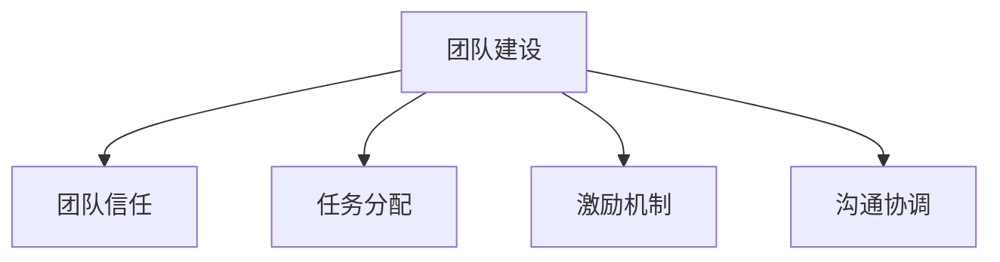

**核心算法原理讲解**

领导团队协作的算法原理可以概括为：

1. **团队建设**：通过共同目标和团队活动增强团队凝聚力。
2. **任务分配**：根据团队成员的能力和兴趣进行任务分配。
3. **激励机制**：通过奖励和认可激励团队成员。
4. **沟通协调**：通过有效的沟通确保团队目标的实现。

**数学模型和公式**

领导团队协作的模型可以表示为：

\[ T = f(\text{团队建设}, \text{任务分配}, \text{激励机制}, \text{沟通协调}) \]

**详细讲解与举例说明**

- **案例1**：一位项目经理通过团队建设活动，提升了团队的合作精神，实现了项目目标。
- **案例2**：一位领导者在任务分配中，充分考虑了团队成员的特长，提高了项目效率。

#### 3.4 情商在跨文化管理中的应用

**背景介绍**

跨文化管理是全球化背景下的一项重要任务。情商在跨文化管理中发挥着重要作用，它能够帮助管理者更好地理解、适应和融合不同文化。

**核心概念与联系**

情商在跨文化管理中的应用涉及文化认知、文化适应和跨文化沟通。

**Mermaid 流程图**

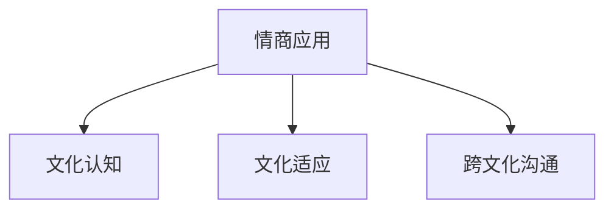

**核心算法原理讲解**

情商在跨文化管理中的应用算法原理可以概括为：

1. **文化认知**：通过学习和了解不同文化的特点和差异。
2. **文化适应**：通过调整行为和思维方式，适应不同文化环境。
3. **跨文化沟通**：通过有效的沟通技巧，促进不同文化之间的理解和合作。

**数学模型和公式**

情商在跨文化管理中的应用模型可以表示为：

\[ CM = f(\text{文化认知}, \text{文化适应}, \text{跨文化沟通}) \]

**详细讲解与举例说明**

- **案例1**：一位跨国公司的CEO通过文化认知和适应，成功管理了来自不同国家的团队成员，提升了公司的国际化水平。
- **案例2**：在一次国际项目中，一位项目经理通过跨文化沟通，解决了团队成员之间的文化冲突，确保了项目的顺利进行。

---

### 第四部分：情商提升与实践

#### 4.1 情商自我评估与提升策略

**背景介绍**

情商自我评估是提升情商的第一步。通过自我评估，个体可以了解自己的情商水平，并制定相应的提升策略。

**核心概念与联系**

情商自我评估与提升策略涉及自我评估工具、评估标准和提升方法。

**Mermaid 流程图**

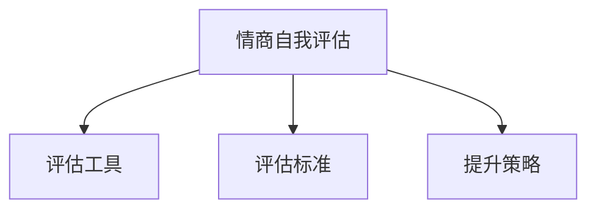

**核心算法原理讲解**

情商自我评估与提升策略的算法原理可以概括为：

1. **评估工具**：通过标准化问卷和自我反思工具进行评估。
2. **评估标准**：根据情商的分类，设定具体的评估指标。
3. **提升策略**：通过针对性的训练和实践，提升情商。

**数学模型和公式**

情商自我评估与提升策略的模型可以表示为：

\[ EQ_{\text{提升}} = f(\text{评估工具}, \text{评估标准}, \text{提升策略}) \]

**详细讲解与举例说明**

- **案例1**：一位员工通过自我评估，识别出自己在情绪管理方面的不足，并制定了针对性的提升计划。
- **案例2**：一位领导者通过自我评估，发现了团队中存在的情商问题，并采取了一系列措施提升团队情商。

#### 4.2 情商训练方法与实践

**背景介绍**

情商训练是提升情商的重要手段。通过系统的训练方法，个体可以逐步提升自己的情商能力。

**核心概念与联系**

情商训练方法涉及认知训练、情感训练和行为训练。

**Mermaid 流程图**

**核心算法原理讲解**

情商训练方法的算法原理可以概括为：

1. **认知训练**：通过思考和反思提升自我意识。
2. **情感训练**：通过体验和表达提升情感管理能力。
3. **行为训练**：通过实践和反馈提升社交技能。

**数学模型和公式**

情商训练方法的模型可以表示为：

\[ ET = f(\text{认知训练}, \text{情感训练}, \text{行为训练}) \]

**详细讲解与举例说明**

- **案例1**：一位员工通过认知训练，学会了如何更有效地识别和管理自己的情绪。
- **案例2**：一位领导者通过行为训练，提高了自己的社交技能，增强了团队的合作能力。

#### 4.3 情商在日常生活中的应用

**背景介绍**

情商不仅在工作场所中发挥重要作用，也在日常生活中有着广泛的应用。通过情商管理，个体可以更好地处理家庭关系、社交活动和自我成长。

**核心概念与联系**

情商在日常生活中的应用涉及情绪管理、人际交往和自我提升。

**Mermaid 流程图**

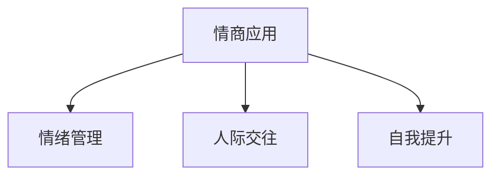

**核心算法原理讲解**

情商在日常生活中的应用算法原理可以概括为：

1. **情绪管理**：通过调节情绪，提升生活质量和幸福感。
2. **人际交往**：通过有效的沟通技巧，建立和维护良好的人际关系。
3. **自我提升**：通过自我反思和持续学习，提升个人素质。

**数学模型和公式**

情商在日常生活中的应用模型可以表示为：

\[ L_{\text{生活}} = f(\text{情绪管理}, \text{人际交往}, \text{自我提升}) \]

**详细讲解与举例说明**

- **案例1**：一位家庭成员通过情绪管理，改善了家庭氛围，提升了家庭幸福感。
- **案例2**：一位社交活动参与者通过有效的沟通技巧，建立了广泛的社交网络。

#### 4.4 情商提升的案例分析

**背景介绍**

案例分析是理解情商提升过程的有效方法。通过具体案例，读者可以更直观地了解情商提升的方法和效果。

**核心概念与联系**

情商提升的案例分析涉及个体案例、团队案例和组织案例。

**Mermaid 流�图**

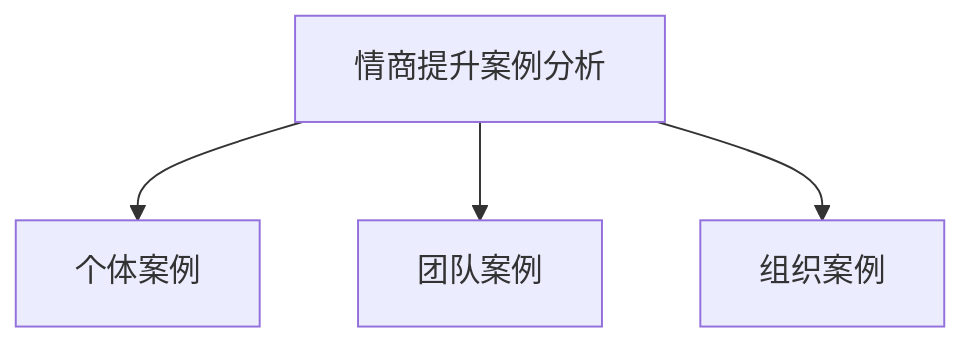

**核心算法原理讲解**

情商提升的案例分析算法原理可以概括为：

1. **个体案例**：通过个体情商提升的历程，了解提升策略和效果。
2. **团队案例**：通过团队情商提升的历程，了解团队协作和领导力。
3. **组织案例**：通过组织情商提升的历程，了解企业文化和管理策略。

**数学模型和公式**

情商提升的案例分析模型可以表示为：

\[ CA = f(\text{个体案例}, \text{团队案例}, \text{组织案例}) \]

**详细讲解与举例说明**

- **案例1**：一位企业高管通过情商提升，成功领导了企业转型，提升了企业的竞争力。
- **案例2**：一个团队通过情商提升，增强了团队合作，完成了复杂的项目。

---

### 附录：情商管理工具与资源

**A.1 情商管理相关书籍推荐**

- 《情商：为什么情商比智商更重要》（Daniel Goleman）
- 《情绪智力》（Peter Salovey & John D. Mayer）
- 《掌控自我：情商自我提升指南》（Jeffrey J. Mayer）

**A.2 情商管理在线课程与培训**

- Coursera：情商管理课程
- edX：情绪智力与人际关系课程
- Udemy：提升情商与领导力课程

**A.3 情商管理工具与应用**

- **工具**：Myers-Briggs 类型指标（MBTI）、迪斯克行为评估（DiSC）
- **应用**：情商管理软件（如Emotionate、EQ Edge）

---

### 总结与展望

本文通过系统的分析和实例讲解，探讨了领导力与情商管理在人际关系处理中的重要性。通过理解和应用这些概念和技巧，读者可以提升个人和团队的表现，实现更好的个人发展和组织效能。

展望未来，随着技术的进步和社会的发展，情商管理将越来越受到重视。我们期待读者能够将这些理论和实践应用到实际生活中，不断提升自己的情商能力，成为一个更好的领导者、团队成员和个体。

### 作者信息

作者：AI天才研究院/AI Genius Institute & 禅与计算机程序设计艺术 /Zen And The Art of Computer Programming

---

通过这篇文章，我们希望读者能够深入理解领导力与情商管理的重要性，并掌握提升人际关系处理能力的具体方法和实践策略。希望这篇文章能够对您在个人发展和团队协作中起到积极的指导作用。感谢您的阅读！

