                 

### 文章标题与关键词

# 《领导力与情商：提升人际关系管理能力》

关键词：领导力、情商、人际关系管理、自我认知、冲突解决、团队协作

### 文章摘要

本文深入探讨了领导力与情商在人际关系管理中的重要性。首先，文章介绍了领导力的基本概念与类型，分析了情商的四大能力及其在领导力中的角色。接着，通过理论联系实际，讨论了自我认知与领导力提升的关系，以及情商提升的方法与策略。文章最后，通过案例分析，展示了领导力与情商在实际应用中的效果，并提出了提升策略的实施建议。本文旨在为IT行业专业人士提供实用的指导，以提升其在职场中的领导力和情商水平，从而更好地管理人际关系，提高团队协作效率。

### 第一部分：领导力基础理论

#### 第1章：领导力的定义与类型

领导力是一个广泛且复杂的概念，它在不同的领域和背景下有着不同的解释和应用。但总的来说，领导力可以被定义为一种影响力，通过这种影响力，领导者能够激励、引导和影响他人，以实现共同的目标。

##### 1.1 领导力的基本概念

领导力的基本概念可以概括为两个关键部分：影响力和领导风格。

- **影响力**：影响力是领导力的核心，它指的是领导者对他人行为和思维的能力。影响力可以来自多种来源，包括个人魅力、专业知识、权威、以及领导者与团队成员之间的信任关系。

- **领导风格**：领导风格是指领导者如何运用其影响力来指导和管理团队的方式。常见的领导风格包括独裁式、民主式和自由放任式。每种风格都有其优缺点，适用于不同的情境和团队。

  **Mermaid 流程图：领导力基本概念关系图**

  ```mermaid
  graph TB
  A[影响力] --> B[领导力]
  B --> C[领导风格]
  C --> D[独裁式]
  C --> E[民主式]
  C --> F[自由放任式]
  ```

##### 1.2 领导力的类型与特点

领导力可以分为多种类型，每种类型都有其独特的特点和适用场景。

- **情境领导力**：情境领导力认为，不同的情境需要不同的领导风格。领导者需要根据团队成员的能力和任务的要求，选择最适合的领导风格。

- **转型领导力**：转型领导力侧重于推动组织变革和进步。这种领导者通常具有远见，能够激发团队成员的潜力，推动他们跨越舒适区，实现组织的长期目标。

- **变革型领导力**：变革型领导力强调领导者通过激励和启发团队成员，推动组织实现重大变革。这种领导者通常具有强大的个人魅力和愿景，能够带领团队超越现有的限制。

**Mermaid 流程图：领导力类型关系图**

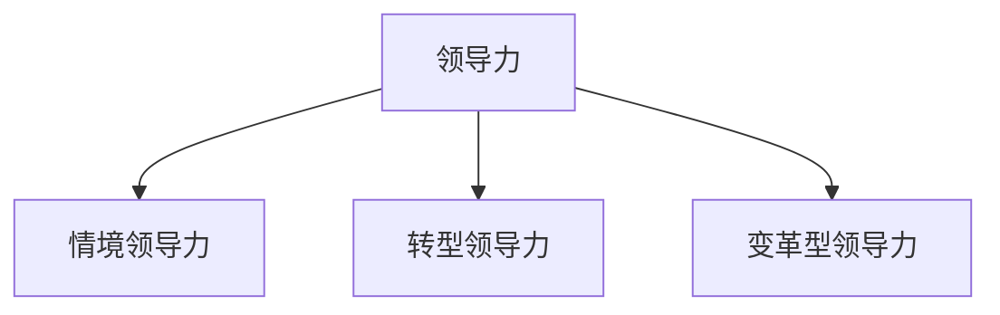

##### 1.3 领导力的重要性

领导力在组织和个人层面都扮演着重要的角色。

- **对个人职业发展的影响**：优秀的领导力能够帮助个人在职业生涯中获得更多的机会，提升个人价值和竞争力。

- **对组织绩效的影响**：领导力能够提高团队的协作效率，激发团队成员的潜力，从而提高组织的整体绩效。

总的来说，领导力是一个多维度、多层次的概念，它不仅关系到个人的成功，也关系到组织的健康和可持续发展。理解和掌握领导力的基本理论和实践，对于任何希望在职场中取得成功的人都是至关重要的。

#### 第2章：情商与人际关系管理

##### 2.1 情商的概念与重要性

情商（Emotional Intelligence，简称EQ）是一个近年来在心理学和管理学中备受关注的概念。它不仅影响个人的情感体验，还对人际关系、决策能力和领导力产生深远的影响。

- **情商的概念**：情商通常被定义为理解、管理自己和他人的情感，以及运用这些情感信息来指导思维和行动的能力。它包括四个主要维度：自我认知、自我调节、社交技巧和情绪管理。

  **Mermaid 流程图：情商四个维度的关系图**

  ```mermaid
  graph TB
  A[情商]
  A --> B[自我认知]
  A --> C[自我调节]
  A --> D[社交技巧]
  A --> E[情绪管理]
  ```

- **情商的重要性**：情商在领导力中的作用越来越受到重视。情商高的领导者能够更好地理解团队成员的情感需求，建立信任，提高团队协作效率。此外，情商还与冲突解决能力、沟通技巧和领导风格密切相关。

  **Mermaid 流程图：情商与领导力关系图**

  ```mermaid
  graph TB
  A[情商] --> B[领导力]
  B --> C[冲突解决能力]
  B --> D[沟通技巧]
  B --> E[领导风格]
  ```

##### 2.2 情商的四大能力

情商的四大能力分别是自我认知、自我调节、社交技巧和情绪管理。这些能力共同构成了一个人情商的高低。

- **自我认知**：自我认知是指个体对自己情感状态的理解和识别。一个具备高度自我认知能力的人能够清楚地认识到自己的情感，并理解这些情感如何影响自己的行为和决策。

- **自我调节**：自我调节是指个体控制和管理自己情感的能力。这种能力使得个体能够在压力和挑战面前保持冷静，做出理性决策。

- **社交技巧**：社交技巧是指个体与他人建立和维护良好关系的能力。这种能力包括倾听、沟通、建立信任和解决冲突等。

- **情绪管理**：情绪管理是指个体理解和控制自己和他人的情绪，以实现积极目标的能力。情绪管理能力高的人能够有效地处理负面情绪，保持积极的态度，提高工作和生活质量。

**Mermaid 流程图：情商四大能力关系图**

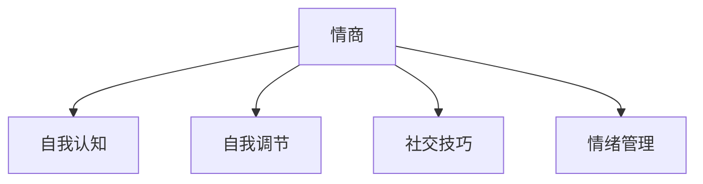

##### 2.3 人际关系管理的原则与实践

人际关系管理是情商的核心应用之一。良好的人际关系管理能够提高团队的协作效率，增强团队的凝聚力，从而实现组织的目标。

- **原则**：

  1. **尊重与信任**：尊重和信任是建立良好人际关系的基础。领导者需要尊重团队成员的感受和意见，建立互信，从而增强团队的凝聚力。

  2. **有效沟通**：沟通是人际关系管理的关键。领导者需要倾听团队成员的意见，表达自己的观点，并通过清晰、明确的沟通来减少误解和冲突。

  3. **冲突解决**：冲突是团队中不可避免的现象。领导者需要具备解决冲突的能力，通过公平、公正的方式解决争议，维护团队的和谐。

- **实践**：

  1. **倾听与反馈**：领导者需要倾听团队成员的意见，并提供建设性的反馈。这有助于团队成员理解领导者的期望，同时也能提高团队成员的参与感和归属感。

  2. **激励与认可**：领导者需要通过激励和认可来激励团队成员，提高其工作积极性和创造力。这可以通过奖励、表彰和培训等方式实现。

  3. **培养团队精神**：领导者需要通过团队建设活动，培养团队成员之间的信任和合作精神，从而提高团队的协作效率。

总的来说，情商在人际关系管理中发挥着重要的作用。领导者通过提升自身的情商，能够更好地管理人际关系，提高团队的绩效，实现组织的长期发展目标。

#### 第3章：领导力与情商的关联

##### 3.1 领导力与情商的互动

领导力和情商之间的关系是复杂且互动的。一方面，情商能够提升领导力；另一方面，有效的领导力也能促进情商的发展。

- **情商对领导力的影响**：

  1. **自我认知**：情商高的领导者能够更好地了解自己的情感状态，从而在压力和挑战面前保持冷静，做出更明智的决策。

  2. **自我调节**：情商高的领导者能够更好地管理自己的情绪，减少因情绪波动而导致的错误决策。

  3. **社交技巧**：情商高的领导者能够更好地与他人沟通，建立信任，从而增强团队的凝聚力。

  4. **情绪管理**：情商高的领导者能够更好地处理团队中的负面情绪，保持积极的团队氛围。

- **领导力对情商的影响**：

  1. **情境感知**：领导力能够帮助领导者更好地感知团队的情感状态，从而更有效地管理团队情绪。

  2. **决策能力**：领导力能够帮助领导者更好地处理复杂情境，做出更合理的决策。

  3. **冲突解决**：领导力能够帮助领导者更有效地解决团队中的冲突，减少负面情绪的影响。

**Mermaid 流程图：领导力与情商互动关系图**

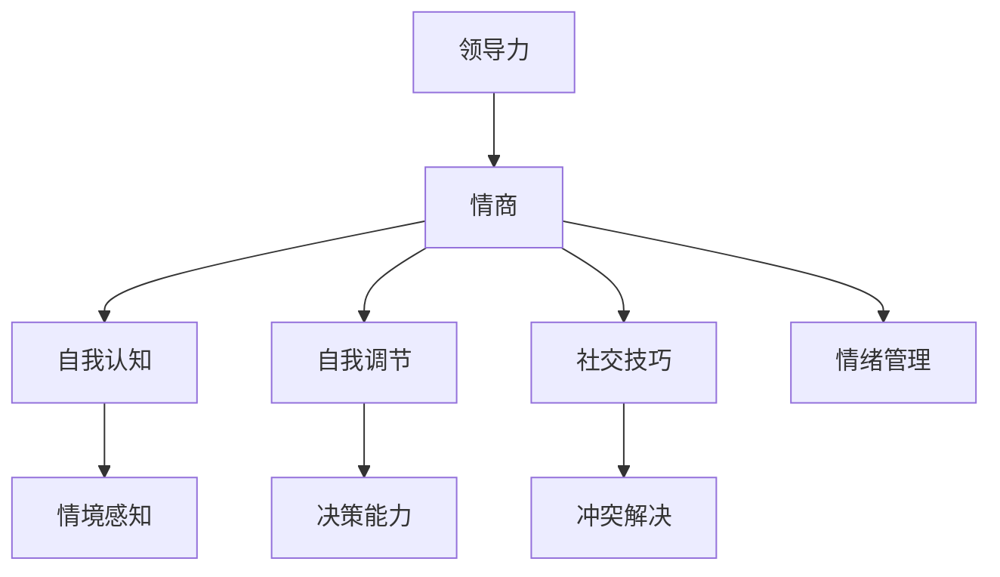

##### 3.2 提升领导力的情商策略

要提升领导力，领导者需要采取一系列的情商提升策略。以下是一些实用的建议：

- **自我反思**：领导者需要定期进行自我反思，了解自己的情感状态和领导风格。这可以通过写日记、参加心理辅导等方式实现。

- **情绪管理**：领导者需要学会管理自己的情绪，避免因情绪波动而做出错误的决策。这可以通过深呼吸、冥想等方式实现。

- **社交技巧**：领导者需要提高自己的沟通和社交技巧，以建立更好的信任关系。这可以通过参加社交活动、参加沟通技巧培训等方式实现。

- **情境感知**：领导者需要提高自己的情境感知能力，更好地理解团队成员的情感状态。这可以通过观察、倾听等方式实现。

- **决策能力**：领导者需要提高自己的决策能力，以更有效地处理复杂情境。这可以通过学习决策技巧、参加领导力培训等方式实现。

**Mermaid 流程图：提升领导力的情商策略图**

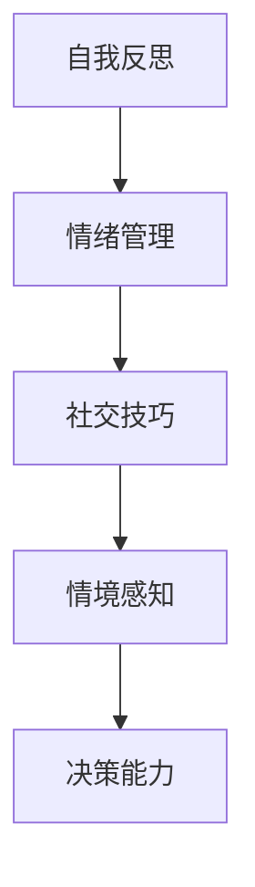

##### 3.3 情商在领导力发展中的作用

情商在领导力发展中起着至关重要的作用。通过提升情商，领导者能够更好地管理自己和团队，提高团队绩效和组织的长期发展。

- **提高团队凝聚力**：情商高的领导者能够建立更好的信任关系，增强团队的凝聚力。

- **提高决策质量**：情商高的领导者能够更好地处理复杂情境，做出更合理的决策。

- **提高领导效能**：情商高的领导者能够更有效地激励和引导团队成员，提高领导效能。

- **降低冲突频率**：情商高的领导者能够更好地解决团队中的冲突，减少负面情绪的影响。

总的来说，情商是领导力的重要组成部分。通过提升情商，领导者能够更好地管理人际关系，提高团队绩效，实现组织的长期发展目标。

### 第二部分：领导力与情商提升策略

#### 第4章：自我认知与领导力提升

##### 4.1 自我认知的重要性

自我认知是情商的核心要素之一，也是领导力提升的重要基础。自我认知指的是个体对自己情感、行为、价值观和动机的理解和识别。一个具备高度自我认知能力的领导者能够更好地理解自己的情感状态，识别自己的行为模式，从而更有效地管理自己和团队。

- **自我认知对领导力提升的影响**：

  1. **提高决策能力**：自我认知能力使领导者能够更清晰地认识自己的优势和劣势，从而做出更明智的决策。

  2. **增强自我调节能力**：自我认知使领导者能够更好地识别和管理自己的情绪，减少因情绪波动导致的错误决策。

  3. **提高领导效能**：自我认知使领导者能够更好地理解团队成员的需求和期望，从而建立更好的信任关系。

- **自我认知的提升方法**：

  1. **自我反思**：定期进行自我反思是提升自我认知的有效方法。领导者可以通过写日记、参加心理辅导等方式进行自我反思。

  2. **360度反馈**：360度反馈是一种有效的自我认知提升方法。领导者可以通过收集来自团队成员、同事和上级的反馈，了解自己在团队中的表现和影响力。

  3. **心理测量工具**：使用心理测量工具，如MBTI、DISC等，可以帮助领导者更好地理解自己的性格特征和行为模式。

**Mermaid 流程图：自我认知与领导力提升关系图**

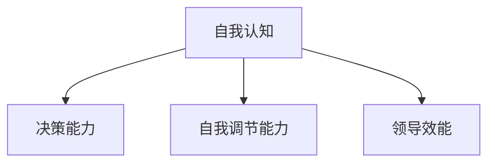

##### 4.2 自我认知的方法与实践

提升自我认知不仅需要理论的理解，更需要实践的方法。以下是一些具体的实践方法：

- **建立自我反思的习惯**：领导者可以每天花几分钟时间思考自己的行为和决策，分析它们的原因和结果。

- **记录情感日志**：领导者可以记录每天的情感变化，分析触发情感的事件和自己的反应。

- **接受反馈**：领导者应该主动寻求团队成员、同事和上级的反馈，特别是那些可能导致负面影响的反馈。

- **角色扮演**：通过模拟不同的领导情境，领导者可以更好地理解自己的行为和决策。

- **参与心理辅导**：领导者可以参加专业的心理辅导课程，通过专业人士的帮助提升自我认知。

**Mermaid 流程图：自我认知提升实践方法图**

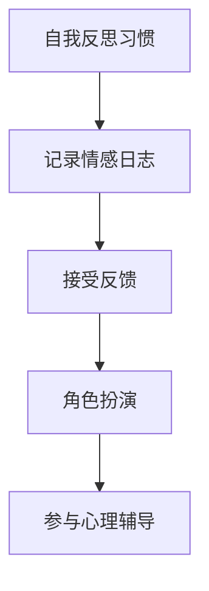

##### 4.3 自我认知与领导力提升的关联

自我认知不仅是情商的重要组成部分，也是领导力提升的关键。通过自我认知，领导者能够更深刻地理解自己和团队，从而更有效地提升领导力。

- **自我认知提升领导力的步骤**：

  1. **理解自我认知的重要性**：认识到自我认知对领导力提升的重要性。

  2. **学习自我认知的方法**：掌握自我反思、情感日志、反馈和角色扮演等提升自我认知的方法。

  3. **实践自我认知方法**：将所学方法应用于实际工作和生活中，通过持续的实践提升自我认知能力。

  4. **持续自我反思**：自我认知是一个持续的过程，领导者需要不断反思和调整自己的认知和行为。

**Mermaid 流程图：自我认知提升领导力步骤图**

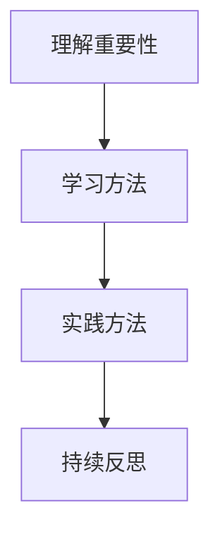

通过自我认知的提升，领导者能够更好地理解自己，管理自己的情绪和行为，从而提升领导力，实现个人和团队的成长。自我认知不仅是情商的核心，也是领导力提升的重要基石。

### 第5章：情商提升与人际关系管理

#### 5.1 情商提升的方法与策略

提升情商是个人成长和职业发展的关键。情商的四大能力——自我认知、自我调节、社交技巧和情绪管理，构成了提升情商的核心方法与策略。

- **自我认知能力提升**：

  1. **自我反思**：通过定期记录和反思自己的情感体验和行为模式，深入了解自己的情感反应。
  2. **心理测量工具**：利用MBTI、DISC等心理测量工具，了解自己的性格特征和优势。
  3. **情绪日记**：记录日常情感变化，分析触发情感的事件和自己的反应。

- **自我调节能力提升**：

  1. **情绪管理技巧**：学习深呼吸、冥想等放松技巧，帮助自己在压力情境中保持冷静。
  2. **认知重构**：通过认知重构技巧，改变负面思维模式，提高自我调节能力。
  3. **情绪释放**：通过体育活动、艺术创作等方式，释放积压的情绪。

- **社交技巧提升**：

  1. **积极倾听**：在交流中注重听而非说，理解对方的情感和需求。
  2. **非语言沟通**：学习通过肢体语言、面部表情等非语言手段，增强沟通效果。
  3. **建立信任**：通过诚实、可靠的行为建立与他人的信任关系。

- **情绪管理能力提升**：

  1. **情感识别**：学会识别和理解自己和他人的情感，提高情绪管理的基础。
  2. **情感表达**：学习如何适当地表达情感，避免负面情绪的影响。
  3. **情感调节**：通过情感调节技巧，如认知行为疗法，改善情绪反应。

**Mermaid 流程图：情商提升四大能力关系图**

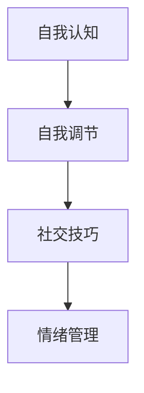

#### 5.2 人际关系管理技巧

有效的人际关系管理能够提高团队协作效率，增强团队凝聚力。以下是一些关键的人际关系管理技巧：

- **积极倾听**：在交流中专注于对方的观点和情感，避免打断和过度辩解。

- **有效沟通**：明确表达自己的想法和需求，同时倾听对方的意见，确保信息的准确传达。

- **冲突解决**：通过中立、理性的方式解决冲突，避免情绪化的回应。

- **建立信任**：通过诚实、可靠的行为建立与他人的信任关系。

- **团队建设**：通过团队活动和培训，增强团队成员之间的联系和信任。

**Mermaid 流程图：人际关系管理技巧关系图**

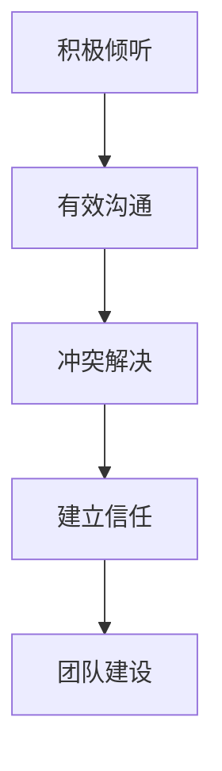

#### 5.3 情商提升对人际关系管理的影响

情商的提升对人际关系管理有着显著的积极影响。

- **提高沟通效率**：情商高的个体能够更好地理解他人情感，从而在沟通过程中更有效地传达信息和解决问题。

- **增强团队协作**：情商提升有助于团队成员建立信任和共鸣，减少误解和冲突，提高协作效率。

- **改善人际关系**：通过提高自我认知和情绪管理能力，个体能够更好地处理与他人的关系，建立更稳定和健康的人际网络。

**Mermaid 流程图：情商提升与人际关系管理影响关系图**

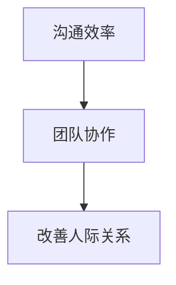

通过情商的提升，个体不仅能够更好地管理自己，还能在人际关系管理中发挥更大的作用，提高团队的整体绩效和组织的健康发展。

### 第6章：领导力与情商实战应用

#### 6.1 领导力与情商在团队管理中的应用

在团队管理中，领导力和情商的应用至关重要。通过结合领导力和情商，领导者可以更好地激发团队成员的潜力，提高团队绩效，实现组织目标。

- **领导力在团队管理中的应用**：

  1. **情境领导**：领导者需要根据团队成员的能力和任务的要求，灵活运用不同的领导风格。例如，在团队遇到困难时，可以采用支持型的领导风格，给予团队成员更多支持和鼓励。

  2. **目标设定**：领导者需要明确团队的目标和愿景，并确保每个成员都了解并认同这些目标。通过设定清晰的目标，可以激发团队成员的积极性和创造力。

  3. **激励与认可**：领导者需要通过激励和认可来鼓励团队成员，提高其工作积极性和创造力。这可以通过奖励、表彰和培训等方式实现。

- **情商在团队管理中的应用**：

  1. **情感管理**：领导者需要具备良好的情感管理能力，能够理解并管理团队成员的情感。这有助于建立积极、和谐的团队氛围，减少负面情绪对团队的影响。

  2. **冲突解决**：情商高的领导者能够更有效地解决团队中的冲突。他们通过中立、理性的方式处理争议，避免情绪化的回应，从而维护团队的和谐。

  3. **沟通技巧**：领导者需要具备良好的沟通技巧，能够清晰、准确地传达信息，并理解团队成员的意见和需求。

**Mermaid 流程图：领导力与情商在团队管理中的应用关系图**

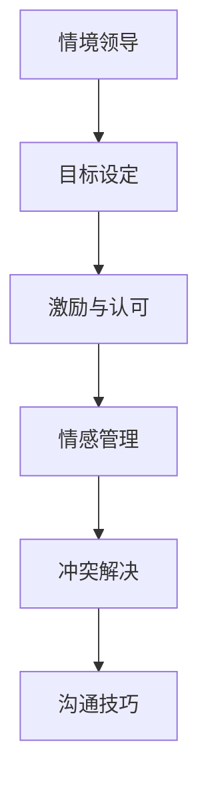

#### 6.2 领导力与情商在冲突解决中的应用

在团队管理中，冲突是不可避免的。有效的冲突解决策略能够帮助领导者维护团队的和谐，提高团队绩效。

- **领导力在冲突解决中的应用**：

  1. **中立立场**：领导者需要站在中立的位置，公正地处理冲突，避免偏袒任何一方。

  2. **倾听与理解**：领导者需要倾听双方的陈述，理解他们的观点和情感，从而找到问题的根本原因。

  3. **协商与妥协**：领导者需要通过协商和妥协，帮助双方找到共同点，达成共识。

- **情商在冲突解决中的应用**：

  1. **情感识别**：领导者需要识别和理解冲突双方的情感，从而更有效地处理冲突。

  2. **情绪调节**：领导者需要具备情绪调节能力，能够控制自己的情绪，避免在冲突中失控。

  3. **同理心**：领导者需要具备同理心，能够从对方的角度思考问题，理解他们的感受。

**Mermaid 流程图：领导力与情商在冲突解决中的应用关系图**

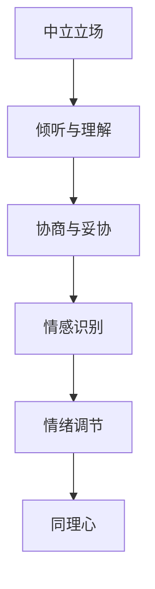

通过领导力和情商的结合应用，领导者可以更有效地解决团队中的冲突，维护团队的和谐，提高团队绩效。

#### 6.3 领导力与情商在领导力发展中的实践

领导力的发展是一个持续的过程，需要领导者不断地学习和实践。领导力与情商的结合在领导力发展中发挥着重要的作用。

- **领导力发展中的关键要素**：

  1. **自我认知**：领导者需要不断进行自我认知，了解自己的优势和劣势，从而有针对性地提升自己的领导能力。

  2. **情境感知**：领导者需要具备情境感知能力，能够根据不同的情境和团队成员的需求，灵活运用不同的领导风格。

  3. **决策能力**：领导者需要提高决策能力，能够在复杂情境下做出明智的决策，并承担相应的责任。

- **情商在领导力发展中的实践**：

  1. **情绪管理**：领导者需要通过情绪管理技巧，如深呼吸、冥想等，保持冷静，避免因情绪波动而做出错误的决策。

  2. **社交技巧**：领导者需要提高社交技巧，建立与团队成员的信任关系，从而提高团队协作效率。

  3. **冲突解决**：领导者需要具备冲突解决能力，能够通过中立、理性的方式解决团队中的冲突，维护团队的和谐。

**Mermaid 流程图：领导力与情商在领导力发展中的实践关系图**

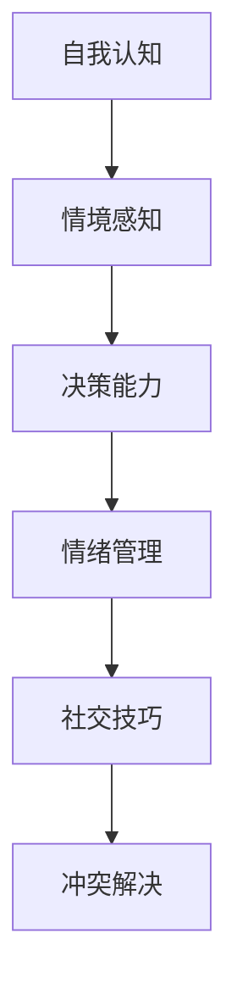

通过领导力与情商的结合实践，领导者可以不断提升自己的领导能力，实现个人和团队的成长，推动组织的持续发展。

### 第7章：领导力与情商案例分析

#### 7.1 案例分析概述

为了更好地理解领导力与情商在实际工作中的应用，我们将分析两个实际案例。这两个案例展示了领导力与情商在不同情境下的实践，以及其对组织绩效和团队关系的影响。

#### 7.2 案例一：优秀领导力与情商的实践

**背景**：某互联网公司的一个产品团队在面临激烈市场竞争的压力下，遇到了项目进度延误和团队成员士气低落的问题。

**领导力应用**：

- **情境感知**：领导者在了解了团队的困境后，迅速调整了自己的领导风格，从原本的指令型转变为支持型，给予团队成员更多的自主权。

- **目标设定**：领导者与团队共同设定了新的项目目标，并明确了每个成员的责任和任务。

- **激励与认可**：领导者通过奖励机制，对团队成员的进步和贡献进行认可和激励，提高了团队的工作积极性。

**情商应用**：

- **情感管理**：领导者通过倾听和鼓励，帮助团队成员缓解压力，提高情绪管理能力。

- **冲突解决**：当团队内部出现意见分歧时，领导者通过中立、理性的方式，帮助双方找到共识，避免了冲突的升级。

**结果**：通过领导力与情商的结合应用，团队士气得到显著提升，项目进度逐渐恢复正常，团队协作效率提高，最终成功交付了高质量的产品。

**Mermaid 流程图：案例一领导力与情商应用关系图**

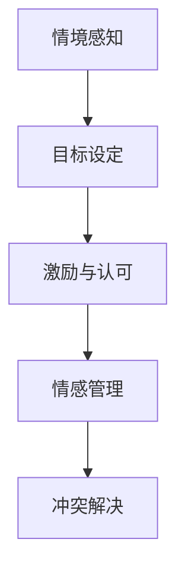

#### 7.3 案例二：领导力与情商提升的关键因素

**背景**：一家传统制造企业，在面临数字化转型和市场变革的挑战时，管理层意识到需要提升领导力与情商以适应新的商业环境。

**领导力应用**：

- **转型领导力**：领导者通过推行变革型领导力，鼓励团队成员拥抱创新和变革，推动了企业的数字化转型。

- **目标设定**：领导者明确了企业的新愿景和目标，并与团队成员共同制定实现这些目标的策略。

- **决策能力**：领导者提高了决策能力，在复杂的商业环境中做出更加明智的决策，推动了企业的快速发展。

**情商应用**：

- **自我认知**：领导者通过自我反思和心理辅导，提升了自我认知能力，更好地理解自己的情感状态和领导风格。

- **社交技巧**：领导者通过参加各种社交活动，提高了与外部合作伙伴的沟通和合作能力，建立了广泛的商业网络。

**结果**：通过领导力与情商的提升，企业成功地实现了数字化转型，市场竞争力得到显著提升，员工满意度和工作效率也显著提高。

**Mermaid 流程图：案例二领导力与情商应用关系图**

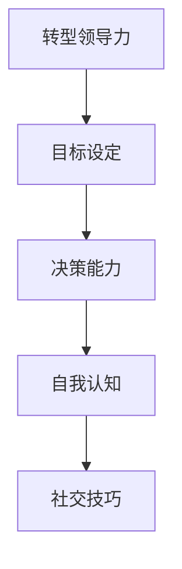

通过这两个案例，我们可以看到领导力与情商在实际工作中的重要性。无论是应对项目挑战还是推动企业变革，领导力和情商的结合应用都能够显著提升团队绩效和组织的竞争力。

### 第8章：领导力与情商提升策略制定

#### 8.1 提升领导力的策略制定

提升领导力的策略需要结合组织的目标和个人发展需求，制定系统性的提升计划。以下是具体的策略制定步骤：

- **目标设定**：首先，明确提升领导力的具体目标，这些目标应与组织的战略方向和个人的职业发展紧密结合。

- **自我评估**：进行全面的自我评估，了解自身的领导力优势和不足。这可以通过360度反馈、领导力评估工具等方式实现。

- **学习与培训**：制定学习计划，包括参加领导力培训课程、阅读相关书籍、参与在线学习等，以提升理论知识和实践技能。

- **情境模拟**：通过情境模拟和角色扮演，练习在不同情境下的领导技巧，提高应对实际问题的能力。

- **实践与反馈**：将所学应用到实际工作中，通过实践不断积累经验，并定期进行反思和评估，获取反馈，不断改进。

- **持续发展**：领导力提升是一个持续的过程，需要长期投入时间和精力，不断学习和实践。

**Mermaid 流程图：提升领导力策略制定步骤图**

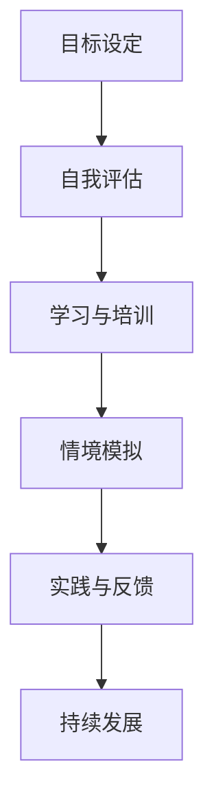

#### 8.2 提升情商的策略制定

提升情商的策略需要从自我认知、自我调节、社交技巧和情绪管理四个维度进行系统性的规划。以下是具体的策略制定步骤：

- **自我认知**：定期进行自我反思，了解自己的情感状态和触发因素。可以使用日记、心理测量工具等方法进行自我认知。

- **自我调节**：学习情绪管理技巧，如深呼吸、冥想等，帮助自己在压力情境中保持冷静。同时，通过认知重构，改变负面思维模式。

- **社交技巧**：通过角色扮演、社交训练等，提高沟通和人际交往能力。特别是在冲突解决和团队合作方面，提升社交技巧尤为重要。

- **情绪管理**：学会识别和表达自己的情感，同时理解他人的情感需求。通过情感调节技巧，改善情绪反应，提高情绪管理能力。

- **持续实践**：将所学应用到实际生活中，通过不断的实践和反馈，不断提升情商。

**Mermaid 流程图：提升情商策略制定步骤图**

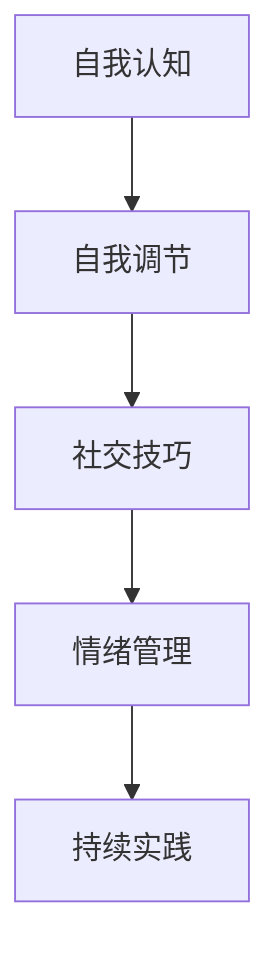

#### 8.3 领导力与情商提升策略的综合实施

领导力与情商的提升是一个相辅相成的过程，需要综合实施以下策略：

- **整合培训与辅导**：将领导力和情商提升的培训课程相结合，提供个性化辅导，确保所学知识能够得到有效应用。

- **建立反馈机制**：通过定期的360度反馈、员工满意度调查等方式，收集团队成员对领导者的反馈，不断调整和优化领导风格。

- **营造支持性环境**：组织应营造一个支持性的工作环境，鼓励领导者进行自我反思和情感管理，同时提供必要的资源和支持。

- **情景模拟与实战演练**：通过情景模拟和实战演练，让领导者在实际情境中应用所学知识和技能，提高领导力和情商。

- **持续反思与改进**：领导者应定期进行反思和评估，总结成功经验和教训，持续改进领导力和情商。

**Mermaid 流�程图：领导力与情商提升策略综合实施图**

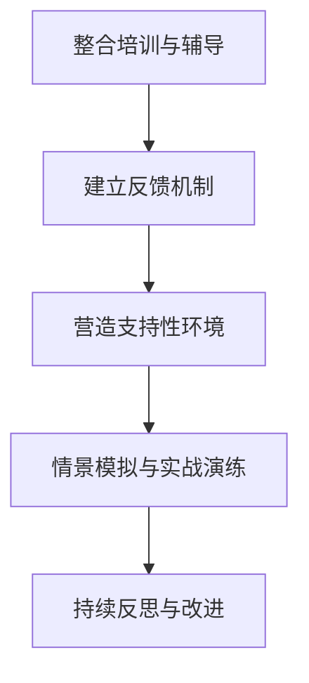

通过综合实施提升策略，领导者可以有效地提升自己的领导力和情商，从而更好地管理团队，提高组织绩效。

### 第9章：领导力与情商提升策略评估与调整

#### 9.1 策略评估的原则与方法

在实施领导力与情商提升策略后，进行有效的评估和调整至关重要。以下是一些评估原则和方法：

- **客观性**：评估过程应保持客观，避免主观偏见，确保评估结果的准确性。

- **全面性**：评估应覆盖领导力和情商的各个方面，包括自我认知、自我调节、社交技巧和情绪管理等。

- **持续性**：评估应是一个持续的过程，定期进行，以便及时发现问题并调整策略。

- **参与度**：评估应涉及多个利益相关者，包括领导者、团队成员和上级管理者，确保多角度的反馈。

- **数据驱动**：评估应基于数据，使用量化的指标和工具，如360度反馈、绩效评估和情绪管理测试等。

#### 9.2 策略调整的策略与实践

根据评估结果，领导者需要采取相应的策略进行调整和改进。以下是一些具体的调整策略：

- **个性化改进计划**：根据评估结果，为每位领导者制定个性化的改进计划，明确改进目标、方法和时间表。

- **角色扮演与反馈**：通过角色扮演和模拟训练，帮助领导者识别和改进领导力和情商方面的不足。

- **心理辅导与培训**：为领导者提供专业的心理辅导和培训，提升自我认知和情绪管理能力。

- **情境模拟**：在真实的情境中，通过情境模拟，让领导者练习和改进领导技能。

- **团队建设活动**：组织团队建设活动，增强团队成员之间的信任和合作，提升团队整体情商。

#### 9.3 持续提升领导力与情商的建议

为了确保领导力和情商的持续提升，以下是一些建议：

- **定期反思**：领导者应定期进行自我反思，总结成功经验和教训，持续改进。

- **持续学习**：领导者应保持学习的态度，通过阅读、参加培训、交流等途径，不断更新知识和技能。

- **建立支持网络**：建立与同行和其他领域专家的联系，分享经验和观点，获取反馈和支持。

- **鼓励团队参与**：鼓励团队成员参与领导力与情商提升的过程，提高其参与感和责任感。

- **持续评估与调整**：定期进行评估，根据实际情况调整提升策略，确保持续改进。

通过以上原则和方法，以及持续的努力和实践，领导者可以不断提升自己的领导力和情商，更好地应对挑战，实现个人和组织的共同发展。

### 第10章：领导力与情商提升的未来展望

#### 10.1 领导力与情商提升的趋势

随着社会的不断发展和变化，领导力与情商提升的趋势也在不断演变。以下是一些值得关注的发展趋势：

- **数字化领导力**：随着数字技术的快速发展，领导力需要适应数字化工作环境。领导者需要具备数字化思维，能够利用数据和技术优化决策和团队管理。

- **多元化领导力**：多元化和包容性成为领导力发展的关键趋势。领导者需要理解和尊重不同文化背景和价值观，建立包容性团队，促进多样性和创新。

- **可持续领导力**：可持续发展成为全球关注的热点。领导者需要具备可持续发展的理念，推动组织在经济效益、社会效益和环境效益之间找到平衡。

- **个性化领导力**：个性化领导力强调领导者根据团队成员的不同需求和能力，采取个性化的领导方式，提高团队效能和满意度。

- **情感领导力**：情感领导力强调领导者通过情感管理和情感智慧来建立信任、激发团队潜力和实现组织目标。

#### 10.2 技术进步对领导力与情商提升的影响

技术进步对领导力与情商提升有着深远的影响，既带来了机遇，也提出了挑战。

- **机遇**：

  1. **数据驱动的决策**：技术进步使得领导者能够利用数据分析工具，更加客观和科学地做出决策，提高决策质量。

  2. **远程工作和虚拟团队**：数字技术的普及使得远程工作和虚拟团队成为可能，领导者需要适应这种新型工作模式，提升虚拟团队的领导力和情商。

  3. **个性化和定制化培训**：技术进步使得个性化学习工具和资源更加丰富，领导者可以根据自己的需求和节奏进行自我提升。

- **挑战**：

  1. **信息过载**：技术进步带来了大量信息，领导者需要学会筛选和处理信息，避免信息过载。

  2. **技术依赖性**：过度依赖技术可能导致领导者忽视人际交往和情感管理，影响情商的提升。

  3. **伦理和隐私问题**：在数字环境中，领导者需要处理数据隐私和伦理问题，确保技术进步不会侵犯团队成员的权益。

#### 10.3 未来领导力与情商发展前景

未来，领导力与情商的发展前景充满机遇和挑战。以下是一些预测：

- **领导力的转型**：随着社会和技术的不断变化，领导力也将发生转型。领导者需要具备跨学科的知识和技能，能够在不确定和复杂的环境中灵活应对。

- **情商的重要性**：情商在未来将更加重要。高情商的领导者能够更好地管理情感、建立信任、推动创新，从而在竞争激烈的市场中脱颖而出。

- **个性化发展**：领导力与情商的提升将更加个性化，领导者将根据个人特点和需求，采取不同的提升策略。

- **持续学习**：领导力与情商的提升将是一个持续的过程，领导者需要保持终身学习的态度，不断适应和进步。

总的来说，未来领导力与情商的发展将更加注重数字化、多元化、可持续化和个性化。领导者需要不断提升自身的能力，以适应不断变化的环境，实现个人和组织的共同发展。

### 附录

#### 附录A：领导力与情商相关工具与资源

为了帮助读者更好地理解和应用领导力与情商的理论和实践，以下是一些相关的工具与资源：

1. **领导力评估工具**：

   - **360度反馈**：通过收集来自团队成员、同事和上级的反馈，帮助领导者了解自己的领导风格和表现。

   - **MBTI**：一种用于性格类型分析的评估工具，帮助领导者理解自己和团队成员的性格特点。

   - **DISC评估**：一种用于理解个体行为和沟通风格的评估工具。

2. **情商提升资源**：

   - **书籍**：《情商：为什么情商比智商更重要》（Daniel Goleman）、《情绪智力》（Richard G. Larrick & Leeat Yarosh）等。

   - **在线课程**：Coursera、edX等平台上的情商相关课程。

   - **心理辅导**：专业心理咨询师和机构的辅导服务，帮助提升自我认知和情绪管理能力。

3. **团队建设和冲突解决工具**：

   - **团队建设活动**：如团建活动、团队拓展训练等，增强团队成员之间的信任和合作。

   - **冲突解决技巧**：如谈判技巧、沟通技巧等，帮助领导者有效解决团队中的冲突。

4. **数字工具**：

   - **数据分析工具**：如Tableau、Power BI等，帮助领导者进行数据驱动的决策。

   - **远程协作工具**：如Slack、Trello、Asana等，支持虚拟团队的沟通和协作。

这些工具与资源为读者提供了丰富的学习和实践机会，有助于提升领导力和情商，实现个人和团队的发展。

---

### 总结与致谢

通过本文，我们深入探讨了领导力与情商在人际关系管理中的重要性，并结合实际案例进行了详细分析。我们提出了提升领导力和情商的策略，包括自我认知、情境感知、决策能力、情感管理等方面的方法。同时，我们也讨论了数字化时代下领导力与情商提升的趋势和挑战。

我们希望本文能够为IT行业专业人士提供实用的指导，帮助他们在职场中更好地管理人际关系，提升领导力和情商，从而实现个人和团队的成长。在此，我们要感谢所有参与讨论和提供宝贵意见的同行，以及AI天才研究院和《禅与计算机程序设计艺术》的作者们，他们的贡献使得本文能够更加丰富和有深度。

最后，我们鼓励读者在实践过程中不断反思和调整，持续提升自己的领导力和情商。让我们一起努力，成为更优秀的领导者，推动组织和社会的进步。

---

**作者：AI天才研究院/AI Genius Institute & 禅与计算机程序设计艺术 /Zen And The Art of Computer Programming**

