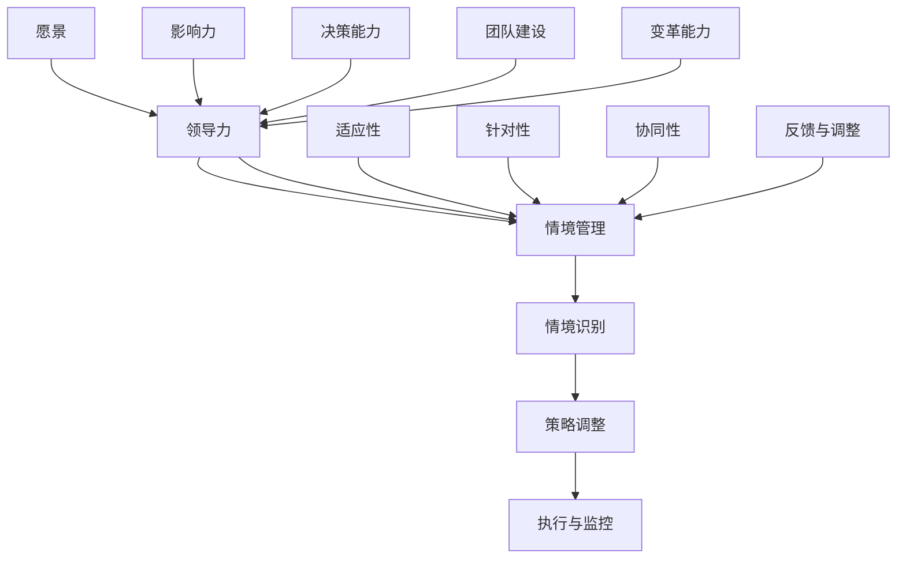

                 

### 第1章 引言

#### 1.1 时代背景

在现代信息技术的飞速发展和社会的快速变革中，领导力与情境管理的重要性日益凸显。随着全球化、数字化转型、人工智能等新趋势的不断涌现，组织面临着前所未有的复杂性和不确定性。因此，领导力与情境管理成为企业成功的关键因素。

##### 1.1.1 领导力的演变

领导力的概念和模式在历史上经历了多次演变。从传统的权威型领导到现代的参与型领导，再到当下的变革型领导，每一种领导模式都反映了特定时代的背景和需求。

- **权威型领导**：强调领导者的权威和决策权，以命令和控制为主要手段。
- **参与型领导**：鼓励团队成员参与决策，注重沟通和协作。
- **变革型领导**：推动组织创新和变革，激发团队成员的潜能和创造力。

##### 1.1.2 情境管理的概念

情境管理是一种根据不同情境灵活调整管理策略的方法。其核心思想是，管理者应根据具体的情境需求，采取相应的管理措施，以提高组织的适应能力和效率。

- **情境识别**：识别和评估当前情境的特点和需求。
- **策略调整**：根据情境特点，调整管理策略和方法。
- **执行与监控**：实施管理策略，并持续监控效果，进行必要的调整。

##### 1.1.3 领导力与情境管理的联系

领导力与情境管理之间存在密切的联系。领导力为情境管理提供了理论基础和实践指导，而情境管理则为领导力提供了具体的操作方法和策略。在实际应用中，优秀的领导者会根据不同的情境需求，灵活运用领导力，实施情境管理。

#### 1.2 领导力概述

##### 1.2.1 领导力的定义

领导力是指领导者通过影响和激励他人，实现组织目标和愿景的能力。它不仅包括技术能力和管理技能，更重要的是情感智慧和人际交往能力。

- **技术能力**：指领导者在特定领域内的专业知识和技能。
- **管理技能**：包括计划、组织、领导和控制等基本管理职能。
- **情感智慧**：涉及自我意识、自我管理、社交意识和关系管理等方面。

##### 1.2.2 领导力的重要性

领导力对组织和个人都具有深远的影响。对于组织而言，优秀的领导力可以推动创新、提高效率、增强团队凝聚力；对于个人而言，领导力可以提升职业发展、增强个人魅力、实现自我价值。

- **组织层面**：领导力可以促进组织变革、提升竞争力、实现可持续发展。
- **个人层面**：领导力可以培养自信、提升影响力、实现职业发展。

##### 1.2.3 领导力的核心要素

领导力的核心要素包括：

- **愿景**：明确组织的长远目标和愿景，为团队成员提供方向和动力。
- **影响力**：通过沟通、激励和示范，影响团队成员的行为和态度。
- **决策能力**：在面对复杂多变的环境时，做出明智的决策。
- **团队建设**：培养团队精神，提高团队协作效率。
- **变革能力**：推动组织创新和变革，应对外部环境的挑战。

#### 1.3 情境管理概述

##### 1.3.1 情境管理的定义

情境管理是一种根据不同情境灵活调整管理策略的方法。它强调管理者应根据具体的情境需求，采取相应的管理措施，以提高组织的适应能力和效率。

- **情境识别**：识别和评估当前情境的特点和需求。
- **策略调整**：根据情境特点，调整管理策略和方法。
- **执行与监控**：实施管理策略，并持续监控效果，进行必要的调整。

##### 1.3.2 情境管理的原则

情境管理遵循以下原则：

- **适应性**：根据情境需求，灵活调整管理策略。
- **针对性**：针对不同情境，采取相应的管理措施。
- **协同性**：管理者与团队成员协同合作，共同应对挑战。
- **反馈与调整**：及时收集反馈，根据反馈调整管理策略。

##### 1.3.3 情境管理的方法

情境管理的方法包括：

- **SWOT分析**：分析组织的优势、劣势、机会和威胁，为情境管理提供依据。
- **情景模拟**：通过模拟不同情境，评估管理策略的有效性。
- **关键绩效指标（KPI）**：设定关键绩效指标，监控管理效果。
- **跨部门协作**：促进不同部门之间的沟通与协作，提高整体效率。

#### 1.4 领导力与情境管理的综合应用

##### 1.4.1 不同情境下的领导力策略

在不同的情境下，领导者需要采取不同的领导策略：

- **稳定情境**：采用指导型领导，明确任务目标和要求。
- **变化情境**：采用变革型领导，推动组织创新和变革。
- **竞争情境**：采用竞争型领导，激发团队竞争力和创新能力。

##### 1.4.2 情境管理在团队管理中的应用

情境管理在团队管理中具有重要意义。管理者应根据团队的特点和需求，灵活运用情境管理方法，提高团队绩效：

- **团队建设**：通过情境管理，增强团队凝聚力，提高团队协作效率。
- **任务分配**：根据团队成员的能力和特点，合理安排任务。
- **激励制度**：根据情境需求，制定合理的激励政策，激发团队成员的积极性。

##### 1.4.3 领导力与情境管理在组织变革中的角色

在组织变革中，领导力和情境管理发挥着关键作用：

- **领导力**：激发员工的变革意识和参与意愿，推动变革的顺利进行。
- **情境管理**：通过灵活调整管理策略，应对变革过程中的各种挑战和风险。

**总结**：领导力与情境管理是现代管理的重要组成部分。通过了解领导力与情境管理的核心概念、原则和方法，领导者可以更好地应对不同情境的挑战，推动组织的持续发展和成功。

### 关键词

- 领导力
- 情境管理
- 变革型领导
- 参与型领导
- 权威型领导
- 团队管理
- 变革管理

### 摘要

本文深入探讨了领导力与情境管理的核心概念、原则和方法。通过分析不同情境下的领导力策略和情境管理在团队管理中的应用，以及领导力与情境管理在组织变革中的角色，本文旨在为领导者提供有价值的实践指导，帮助他们更好地应对复杂多变的环境，实现组织的持续发展和成功。

---

作者：AI天才研究院/AI Genius Institute & 禅与计算机程序设计艺术 /Zen And The Art of Computer Programming

---

**附录：领导力与情境管理之间的关系架构 Mermaid 流程图**

**图 1-1：领导力与情境管理之间的关系架构**

### 第1章 引言

**1.1 时代背景**

在当今快速变革的时代，领导力和情境管理成为企业成功的关键要素。全球化、数字化转型、人工智能等新趋势不断涌现，给企业带来了前所未有的复杂性和不确定性。为了在激烈的市场竞争中脱颖而出，企业需要具备强大的领导力和情境管理能力。

##### **1.1.1 领导力的演变**

领导力的概念和模式在历史长河中经历了多次演变。从传统的权威型领导到现代的参与型领导，再到变革型领导，每一种领导模式都反映了特定时代的背景和需求。

- **权威型领导**：强调领导者的权威和决策权，通过命令和控制来管理团队。这种领导模式在工业革命时期较为常见，但随着时代的变迁，其局限性也逐渐显现。
- **参与型领导**：鼓励团队成员参与决策，注重沟通和协作。这种领导模式在知识经济时代逐渐兴起，通过增强团队凝聚力和创新力来提高组织绩效。
- **变革型领导**：推动组织创新和变革，激发团队成员的潜能和创造力。这种领导模式在当前快速变化的市场环境中尤为重要，它能够帮助组织适应外部环境的变化，实现持续发展。

##### **1.1.2 情境管理的概念**

情境管理是一种根据不同情境灵活调整管理策略的方法。其核心思想是，管理者应根据具体的情境需求，采取相应的管理措施，以提高组织的适应能力和效率。

- **情境识别**：首先需要识别和评估当前情境的特点和需求。这包括对内部和外部环境的分析，以及对团队成员能力和心态的了解。
- **策略调整**：根据情境特点，调整管理策略和方法。这需要管理者具备灵活应变的能力，能够根据不同情境制定出最合适的管理策略。
- **执行与监控**：实施管理策略，并持续监控效果，根据反馈进行必要的调整。这要求管理者具备执行力和监控能力，确保管理策略的有效实施。

##### **1.1.3 领导力与情境管理的联系**

领导力与情境管理之间存在密切的联系。领导力为情境管理提供了理论基础和实践指导，而情境管理则为领导力提供了具体的操作方法和策略。在实际应用中，优秀的领导者会根据不同的情境需求，灵活运用领导力，实施情境管理。

- **领导力在情境管理中的应用**：领导力中的愿景、影响力、决策能力、团队建设和变革能力等要素，都可以在情境管理中发挥作用。领导者通过激发团队成员的潜力，推动组织变革，实现组织目标。
- **情境管理对领导力的影响**：情境管理为领导者提供了具体的操作指南，帮助他们根据不同情境调整管理策略，提高组织适应能力。同时，情境管理也要求领导者具备灵活应变的能力，不断学习和适应新的管理方法。

**1.2 领导力概述**

##### **1.2.1 领导力的定义**

领导力是指领导者通过影响和激励他人，实现组织目标和愿景的能力。它不仅包括技术能力和管理技能，更重要的是情感智慧和人际交往能力。

- **技术能力**：指领导者在特定领域内的专业知识和技能。这是领导者胜任工作的基础，但仅凭技术能力还不足以成为优秀的领导者。
- **管理技能**：包括计划、组织、领导和控制等基本管理职能。这些技能是领导者必须掌握的，它们有助于确保组织目标的实现。
- **情感智慧**：涉及自我意识、自我管理、社交意识和关系管理等方面。情感智慧是领导者影响力的关键，它有助于建立信任、增强团队凝聚力和推动组织变革。

##### **1.2.2 领导力的重要性**

领导力对组织和个人都具有深远的影响。对于组织而言，优秀的领导力可以推动创新、提高效率、增强团队凝聚力；对于个人而言，领导力可以提升职业发展、增强个人魅力、实现自我价值。

- **组织层面**：领导力可以促进组织变革、提升竞争力、实现可持续发展。优秀领导者能够激发团队的创造力和创新能力，推动组织不断适应外部环境的变化。
- **个人层面**：领导力可以培养自信、提升影响力、实现职业发展。领导者通过影响和激励他人，不仅提升了组织的绩效，也实现了个人的成长和成就。

##### **1.2.3 领导力的核心要素**

领导力的核心要素包括：

- **愿景**：明确组织的长远目标和愿景，为团队成员提供方向和动力。愿景是领导者影响团队的核心要素，它能够激发团队成员的使命感和责任感。
- **影响力**：通过沟通、激励和示范，影响团队成员的行为和态度。影响力是领导者实现组织目标的关键，它有助于建立信任、增强团队凝聚力和推动组织变革。
- **决策能力**：在面对复杂多变的环境时，做出明智的决策。决策能力是领导者必须具备的，它关系到组织的成败和未来发展。
- **团队建设**：培养团队精神，提高团队协作效率。团队建设是领导者的重要职责，它有助于提高团队的凝聚力和合作能力。
- **变革能力**：推动组织创新和变革，应对外部环境的挑战。变革能力是领导者适应时代变化的关键，它能够帮助组织实现持续发展和成功。

**1.3 情境管理概述**

##### **1.3.1 情境管理的定义**

情境管理是一种根据不同情境灵活调整管理策略的方法。它强调管理者应根据具体的情境需求，采取相应的管理措施，以提高组织的适应能力和效率。

- **情境识别**：首先需要识别和评估当前情境的特点和需求。这包括对内部和外部环境的分析，以及对团队成员能力和心态的了解。
- **策略调整**：根据情境特点，调整管理策略和方法。这需要管理者具备灵活应变的能力，能够根据不同情境制定出最合适的管理策略。
- **执行与监控**：实施管理策略，并持续监控效果，根据反馈进行必要的调整。这要求管理者具备执行力和监控能力，确保管理策略的有效实施。

##### **1.3.2 情境管理的原则**

情境管理遵循以下原则：

- **适应性**：根据情境需求，灵活调整管理策略。适应性是情境管理的核心原则，它要求管理者能够快速适应不断变化的环境，采取相应的管理措施。
- **针对性**：针对不同情境，采取相应的管理措施。针对性是情境管理的重要原则，它要求管理者能够根据具体情境制定出最有效的管理策略。
- **协同性**：管理者与团队成员协同合作，共同应对挑战。协同性是情境管理的重要原则，它要求管理者与团队成员建立良好的合作关系，共同应对挑战。
- **反馈与调整**：及时收集反馈，根据反馈调整管理策略。反馈与调整是情境管理的重要环节，它要求管理者能够及时获取反馈，根据反馈进行必要的调整，确保管理策略的有效性。

##### **1.3.3 情境管理的方法**

情境管理的方法包括：

- **SWOT分析**：分析组织的优势、劣势、机会和威胁，为情境管理提供依据。SWOT分析是一种常用的情境分析方法，它有助于管理者全面了解组织的内外部环境，为情境管理提供指导。
- **情景模拟**：通过模拟不同情境，评估管理策略的有效性。情景模拟是一种有效的情境管理方法，它通过模拟不同的情境，帮助管理者评估管理策略的有效性，为实际操作提供参考。
- **关键绩效指标（KPI）**：设定关键绩效指标，监控管理效果。关键绩效指标是情境管理的重要工具，它有助于管理者监控管理策略的实施效果，为调整管理策略提供依据。
- **跨部门协作**：促进不同部门之间的沟通与协作，提高整体效率。跨部门协作是情境管理的重要方法，它有助于不同部门之间建立良好的合作关系，共同应对挑战，提高整体效率。

**1.4 领导力与情境管理的综合应用**

##### **1.4.1 不同情境下的领导力策略**

在不同的情境下，领导者需要采取不同的领导策略：

- **稳定情境**：采用指导型领导，明确任务目标和要求。在稳定情境下，领导者可以通过明确任务目标和要求，指导团队成员完成任务。
- **变化情境**：采用变革型领导，推动组织创新和变革。在变化情境下，领导者需要激发团队成员的创造力，推动组织创新和变革。
- **竞争情境**：采用竞争型领导，激发团队竞争力和创新能力。在竞争情境下，领导者需要激发团队的竞争力和创新能力，以应对外部竞争。

##### **1.4.2 情境管理在团队管理中的应用**

情境管理在团队管理中具有重要意义。管理者应根据团队的特点和需求，灵活运用情境管理方法，提高团队绩效：

- **团队建设**：通过情境管理，增强团队凝聚力，提高团队协作效率。情境管理可以帮助管理者识别和解决团队中的问题，增强团队凝聚力，提高协作效率。
- **任务分配**：根据团队成员的能力和特点，合理安排任务。情境管理要求管理者根据团队成员的能力和特点，合理安排任务，确保任务的有效完成。
- **激励制度**：根据情境需求，制定合理的激励政策，激发团队成员的积极性。情境管理要求管理者根据不同情境制定出合理的激励政策，激发团队成员的积极性。

##### **1.4.3 领导力与情境管理在组织变革中的角色**

在组织变革中，领导力和情境管理发挥着关键作用：

- **领导力**：激发员工的变革意识和参与意愿，推动变革的顺利进行。领导力可以激发员工的变革意识和参与意愿，推动组织变革的顺利进行。
- **情境管理**：通过灵活调整管理策略，应对变革过程中的各种挑战和风险。情境管理可以帮助管理者根据变革过程中的实际情况，灵活调整管理策略，应对各种挑战和风险。

**总结**：领导力与情境管理是现代管理的重要组成部分。通过了解领导力与情境管理的核心概念、原则和方法，领导者可以更好地应对不同情境的挑战，推动组织的持续发展和成功。

## 第2章 情境分析

在领导力与情境管理的实践中，情境分析是至关重要的一步。它为领导者提供了对当前环境和团队状态的深刻理解，从而能够制定出更加精准和有效的管理策略。本章将详细讨论情境分析的各个方面，包括内部情境分析和外部情境分析，以及情境分析的工具与方法。

### 2.1 内部情境分析

内部情境分析主要关注组织内部的结构、文化和资源状况。通过深入分析这些因素，领导者可以更好地理解组织的现状，为后续的决策提供依据。

#### 2.1.1 组织结构分析

组织结构是组织内部资源配置和权力分配的基础。它决定了信息的流通、决策的流程以及责任和权力的分配。领导者需要分析组织结构的特点，包括：

- **层级结构**：分析组织中的层级关系，了解权力和责任的分配情况。
- **部门设置**：评估各部门的职能和协作情况，确保资源的高效利用。
- **团队协作**：分析团队之间的协作模式，找出协作中的障碍和瓶颈。

##### 实例：分析公司组织结构

以某科技公司为例，其组织结构分为三个层级：高层管理、中层管理和基层员工。高层管理负责公司战略规划和重大决策；中层管理负责部门运营和项目执行；基层员工负责具体的工作任务。

通过组织结构分析，领导者可以发现如下问题：

- **沟通障碍**：高层管理和中层管理之间存在信息不对称，导致决策流程缓慢。
- **部门协作**：某些部门之间的职能重叠，资源浪费严重。

针对这些问题，领导者可以采取以下策略：

- **改进沟通机制**：建立定期的沟通会议，确保信息的高效传递。
- **优化部门设置**：合并职能重叠的部门，优化资源分配。

#### 2.1.2 文化氛围分析

组织文化是组织成员共同遵守的价值观念和行为规范。它对员工的态度、行为和工作效率产生深远影响。领导者需要分析组织文化的现状，包括：

- **核心价值观**：识别组织文化中的核心价值观，确保它们与组织目标一致。
- **行为规范**：了解员工在日常工作中的行为规范，评估其是否符合组织文化要求。
- **激励机制**：分析组织的激励机制，确保它们能够促进积极的文化氛围。

##### 实例：分析公司文化氛围

以某创业公司为例，其核心价值观是创新、协作和客户至上。然而，在实际运营中，公司存在以下问题：

- **创新不足**：员工缺乏创新的动力和机会，导致创新意识不强。
- **协作不畅**：部门之间缺乏有效的协作机制，导致项目进展缓慢。

针对这些问题，领导者可以采取以下策略：

- **激励创新**：设立创新奖，鼓励员工提出创新想法。
- **改善协作机制**：建立跨部门协作项目组，提高项目执行效率。

#### 2.1.3 资源状况分析

资源状况是组织运营的重要基础。领导者需要分析组织的资源状况，包括：

- **人力资源**：评估员工的专业技能和素质，了解团队的能力结构。
- **财务资源**：分析组织的财务状况，确保财务健康。
- **技术资源**：评估组织的技术水平，确保技术资源满足业务需求。

##### 实例：分析公司资源状况

以某互联网公司为例，其人力资源结构如下：

- **技术开发团队**：具备高水平的技术能力，但部分成员的专业技能较为单一。
- **市场营销团队**：员工经验丰富，但缺乏创新思维。
- **财务部门**：财务状况稳定，但预算控制较为严格。

针对这些问题，领导者可以采取以下策略：

- **提升技能多样性**：通过培训和外部招聘，提升技术开发团队的专业技能多样性。
- **培养创新思维**：组织市场营销团队进行创新思维培训，提高创新能力。

### 2.2 外部情境分析

外部情境分析主要关注组织外部环境的变化，包括市场环境、竞争对手和法律法规等方面。领导者需要密切关注外部环境的变化，以便及时调整组织策略。

#### 2.2.1 市场环境分析

市场环境是组织运营的重要外部因素。领导者需要分析市场环境，包括：

- **市场规模**：评估目标市场的规模和增长潜力。
- **市场趋势**：分析市场的最新趋势，了解消费者的需求和偏好。
- **竞争状况**：了解竞争对手的规模、策略和市场占有率。

##### 实例：分析市场环境

以某电子商务公司为例，其市场环境如下：

- **市场规模**：电子商务市场持续增长，消费者购买习惯逐渐线上化。
- **市场趋势**：社交媒体购物成为新的趋势，消费者越来越依赖线上渠道。
- **竞争状况**：主要竞争对手包括京东、淘宝和拼多多，市场份额较为稳定。

针对这些市场环境，领导者可以采取以下策略：

- **扩大市场份额**：通过优化产品和服务，提高客户满意度，扩大市场份额。
- **拓展新市场**：抓住社交媒体购物趋势，拓展新市场。

#### 2.2.2 竞争对手分析

竞争对手分析是了解外部环境的重要环节。领导者需要分析竞争对手的规模、策略、优势和劣势，以便制定出有效的竞争策略。

- **竞争对手规模**：分析竞争对手的市场份额和业务规模，了解其市场地位。
- **竞争对手策略**：了解竞争对手的市场策略、产品定位和营销手段。
- **竞争对手优势与劣势**：评估竞争对手的优势和劣势，为自身发展提供借鉴。

##### 实例：分析竞争对手

以某在线教育平台为例，其主要竞争对手包括：

- **竞争对手规模**：同行业领先，市场份额较大。
- **竞争对手策略**：通过大规模广告投放和明星教师资源，吸引大量用户。
- **竞争对手优势与劣势**：优势在于品牌影响力和市场占有率；劣势在于课程质量参差不齐，用户体验有待提升。

针对竞争对手的分析，领导者可以采取以下策略：

- **差异化竞争**：通过提升课程质量和用户体验，形成差异化优势。
- **品牌建设**：加强品牌宣传，提升品牌知名度和美誉度。

#### 2.2.3 政策法规分析

政策法规是组织运营的重要外部约束。领导者需要关注政策法规的变化，确保组织的合法合规运营。

- **政策法规**：了解国家和地区的相关政策法规，包括行业规范、税收政策和环保要求等。
- **合规风险**：评估政策法规对组织运营的影响，识别潜在的合规风险。
- **应对策略**：制定应对策略，确保组织在政策法规框架内运营。

##### 实例：分析政策法规

以某制造企业为例，其面临的政策法规如下：

- **政策法规**：环境保护法规严格，要求企业降低污染物排放。
- **合规风险**：未达到环保标准可能导致高额罚款和停产整顿。
- **应对策略**：加强环保设施建设，提高环保意识，确保合规运营。

通过外部情境分析，领导者可以全面了解组织外部环境的变化，为制定有效的管理策略提供依据。结合内部情境分析，领导者可以制定出更具针对性和有效性的管理计划，推动组织的持续发展和成功。

### 2.3 情境分析工具与方法

情境分析是一个复杂而系统的过程，需要使用多种工具和方法。以下介绍几种常用的情境分析工具与方法。

#### 2.3.1 SWOT分析

SWOT分析是一种常用的情境分析工具，它通过分析组织的优势（Strengths）、劣势（Weaknesses）、机会（Opportunities）和威胁（Threats），帮助领导者全面了解组织的现状。

- **优势**：分析组织在资源、能力、品牌等方面的优势。
- **劣势**：识别组织在运营、管理、技术等方面的劣势。
- **机会**：评估外部环境中可能带来的机遇。
- **威胁**：分析外部环境中可能带来的风险和挑战。

##### 实例：SWOT分析

以下是对某科技公司的SWOT分析：

- **优势**：具备强大的研发能力，拥有多项专利技术。
- **劣势**：市场份额较小，品牌知名度不高。
- **机会**：随着5G技术的普及，市场潜力巨大。
- **威胁**：竞争对手强大，技术更新速度快。

通过SWOT分析，领导者可以明确组织的战略方向，制定出相应的发展策略。

#### 2.3.2 PEST分析

PEST分析是一种用于外部环境分析的工具，它通过分析政治（Political）、经济（Economic）、社会（Social）和技术（Technological）四个方面的因素，帮助领导者了解外部环境的变化。

- **政治**：分析国家和地区的政治稳定性、政策法规变化等。
- **经济**：评估宏观经济环境、市场需求变化等。
- **社会**：了解消费者行为、文化价值观变化等。
- **技术**：分析新技术的发展趋势、技术成熟度等。

##### 实例：PEST分析

以下是对某电子商务平台的PEST分析：

- **政治**：政府鼓励电子商务发展，降低市场准入门槛。
- **经济**：经济增长稳定，消费者购买力提高。
- **社会**：线上购物成为主流，消费者习惯改变。
- **技术**：5G和人工智能技术的发展，提升了电子商务体验。

通过PEST分析，领导者可以了解外部环境的趋势和变化，为组织的发展提供依据。

#### 2.3.3 其他情境分析工具

除了SWOT分析和PEST分析，还有许多其他的情境分析工具，如：

- **五力模型**：分析行业竞争格局，了解潜在竞争者、供应商、客户、替代品和现有竞争者的威胁。
- **矩阵分析**：通过分析组织内部的各项指标，评估组织的运营状况和潜力。
- **情境模拟**：通过模拟不同的情境，评估管理策略的有效性。

##### 实例：五力模型分析

以下是对某餐饮行业的五力模型分析：

- **潜在竞争者**：新进入者较多，市场竞争力较大。
- **供应商**：食材供应商较多，但议价能力较低。
- **客户**：消费者需求多样化，对品质和服务要求较高。
- **替代品**：外卖服务和超市食品对传统餐饮业构成威胁。
- **现有竞争者**：同行业竞争激烈，市场份额较为稳定。

通过五力模型分析，领导者可以全面了解行业现状，为制定战略提供参考。

通过以上情境分析工具与方法，领导者可以全面、深入地了解组织的内外部环境，为制定有效的管理策略提供依据。在领导力与情境管理的实践中，情境分析是至关重要的一步，它为领导者提供了对当前环境和团队状态的深刻理解，从而能够制定出更加精准和有效的管理策略。

## 第3章 领导风格

领导风格是领导者管理团队和处理事务的方式，直接影响组织的效率和员工的工作满意度。不同的领导风格适用于不同的情境和团队，因此，领导者需要根据具体情境选择合适的领导风格。本章将介绍不同领导风格的特点及其适用情境。

### 3.1 领导风格概述

#### 3.1.1 领导风格的概念

领导风格是指领导者在其管理过程中所表现出来的行为模式和管理方式。不同的领导风格具有不同的特点和优缺点，适用于不同的团队和情境。

- **权威型领导风格**：强调领导者的权威和决策权，通过命令和控制来管理团队。
- **指导型领导风格**：领导者提供明确的目标和具体的指导，帮助团队成员完成任务。
- **参与型领导风格**：鼓励团队成员参与决策，注重沟通和协作。
- **支持型领导风格**：领导者关心团队成员的需求和感受，提供必要的支持和帮助。
- **变革型领导风格**：领导者推动组织创新和变革，激发团队成员的创造力和潜力。
- **挑战型领导风格**：领导者设定高目标，激励团队成员挑战自我，追求卓越。

#### 3.1.2 领导风格的重要性

领导风格对组织的管理效率和员工的工作满意度具有重大影响。合适的领导风格可以激发团队成员的积极性和创造力，提高团队的凝聚力和工作效率，从而推动组织的持续发展。

- **管理效率**：不同的领导风格在决策速度、执行力和协调能力等方面存在差异，适合的领导风格可以提高管理效率。
- **员工工作满意度**：合适的领导风格可以满足员工的心理需求，提高员工的工作满意度和忠诚度。
- **团队凝聚力**：领导风格对团队氛围和成员之间的协作关系有重要影响，适合的领导风格可以增强团队的凝聚力。

#### 3.1.3 领导风格的影响因素

领导风格的形成受到多种因素的影响，包括个人的性格、价值观、经验和情境等。

- **个人因素**：领导者的性格、价值观和经验对其领导风格有重要影响。例如，外向的领导者可能更适合指导型或变革型领导风格，而内向的领导者可能更适合参与型或支持型领导风格。
- **情境因素**：不同的情境需求对领导风格有不同要求。例如，在面临紧急任务时，权威型领导风格可能更为有效；而在需要创新和变革时，变革型领导风格则更具优势。
- **团队因素**：团队成员的个性和能力也会影响领导风格的选择。例如，对于能力较强的团队，领导者可以采取参与型或挑战型领导风格，以激发团队成员的潜力；对于能力较弱的团队，领导者可能需要采取指导型或支持型领导风格，以确保任务的有效完成。

### 3.2 不同领导风格的特点与应用

#### 3.2.1 权威型领导风格

权威型领导风格强调领导者的权威和决策权，通过命令和控制来管理团队。这种领导风格适用于需要迅速决策和执行的情境，例如紧急事件、危机管理或军事指挥。

- **特点**：
  - 领导者拥有绝对的决策权和控制权。
  - 工作指令明确，团队成员按照指令执行。
  - 领导者负责解决团队中的问题和冲突。

- **适用情境**：
  - 紧急事件：需要迅速做出决策，确保任务顺利进行。
  - 军事指挥：需要严格纪律和高效执行。

- **优缺点**：
  - 优点：决策迅速，执行高效，适用于紧急和高压情境。
  - 缺点：可能导致团队成员缺乏自主性和创造力，影响团队凝聚力。

#### 3.2.2 指导型领导风格

指导型领导风格领导者提供明确的目标和具体的指导，帮助团队成员完成任务。这种领导风格适用于需要明确目标和具体指导的情境，例如新员工培训、项目启动或团队转型。

- **特点**：
  - 领导者设定明确的目标和期望。
  - 提供具体的指导和建议，帮助团队成员完成任务。
  - 注重工作过程的监督和反馈。

- **适用情境**：
  - 新员工培训：帮助新员工快速熟悉工作流程和职责。
  - 项目启动：确保项目团队了解项目目标和预期成果。
  - 团队转型：帮助团队成员适应新的工作模式和环境。

- **优缺点**：
  - 优点：有助于提高团队成员的工作效率，确保任务顺利完成。
  - 缺点：可能导致团队成员过度依赖领导者，缺乏自主性和创新能力。

#### 3.2.3 参与型领导风格

参与型领导风格鼓励团队成员参与决策，注重沟通和协作。这种领导风格适用于需要团队协作和创新的情境，例如产品研发、市场推广或团队建设。

- **特点**：
  - 领导者鼓励团队成员参与决策，尊重团队成员的意见和建议。
  - 强调团队合作，注重团队成员之间的沟通和协作。
  - 通过民主决策，提高团队凝聚力和创造力。

- **适用情境**：
  - 产品研发：通过团队合作，提高产品创新和研发效率。
  - 市场推广：发挥团队成员的专业知识和经验，提高市场竞争力。
  - 团队建设：增强团队凝聚力和合作精神，提高团队绩效。

- **优缺点**：
  - 优点：提高团队成员的参与感和积极性，促进团队创新和协作。
  - 缺点：决策过程可能较慢，需要花费更多时间进行沟通和协调。

#### 3.2.4 支持型领导风格

支持型领导风格领导者关心团队成员的需求和感受，提供必要的支持和帮助。这种领导风格适用于需要关怀和支持的情境，例如员工心理辅导、职业发展和员工激励。

- **特点**：
  - 领导者关注团队成员的身心健康，提供心理支持和帮助。
  - 注重员工的个人发展和职业规划，帮助团队成员实现自我价值。
  - 通过激励和奖励，提高员工的工作动力和满意度。

- **适用情境**：
  - 员工心理辅导：帮助员工缓解工作压力，提高心理健康水平。
  - 职业发展：为员工提供培训和学习机会，促进职业成长。
  - 员工激励：通过激励措施，提高员工的工作积极性和满意度。

- **优缺点**：
  - 优点：有助于增强员工的工作满意度和忠诚度，提高团队凝聚力。
  - 缺点：可能导致员工对领导者的依赖性增加，影响工作效率。

#### 3.2.5 挑战型领导风格

挑战型领导风格领导者设定高目标，激励团队成员挑战自我，追求卓越。这种领导风格适用于需要创新和突破的情境，例如项目攻关、市场拓展或企业变革。

- **特点**：
  - 领导者设定具有挑战性的目标，激励团队成员追求卓越。
  - 鼓励团队成员尝试新的方法和思路，激发创新和创造力。
  - 通过奖励和认可，激励团队成员克服困难和挑战。

- **适用情境**：
  - 项目攻关：鼓励团队成员勇于尝试，突破技术难题。
  - 市场拓展：激励团队成员开拓新市场，提高市场占有率。
  - 企业变革：推动团队成员适应变革，实现企业转型。

- **优缺点**：
  - 优点：有助于激发团队成员的潜力和创造力，推动组织创新和突破。
  - 缺点：高目标可能带来较大的压力，需要关注团队成员的心理状态。

### 3.3 领导风格的选择与适应

#### 3.3.1 领导风格的选择原则

选择适合的领导风格需要考虑以下原则：

- **情境适配**：根据具体情境选择最合适的领导风格。不同的情境要求不同的领导风格，领导者应根据情境变化灵活调整管理方式。
- **团队特点**：考虑团队成员的个性和能力，选择能够激发团队成员潜力和积极性的领导风格。
- **个人能力**：领导者应根据自己的能力和经验，选择能够充分发挥自身优势的领导风格。

#### 3.3.2 领导风格的适应策略

为了适应不同的领导情境，领导者可以采取以下策略：

- **自我认知**：了解自己的性格、价值观和领导风格，明确自己的优势和劣势，以便在情境变化时做出相应调整。
- **持续学习**：不断学习和更新自己的管理知识和技能，提高领导能力和适应性。
- **灵活应变**：在情境变化时，能够迅速调整自己的领导风格，采取合适的策略和方法。

通过了解不同领导风格的特点和应用，领导者可以根据具体情境和团队特点，选择合适的领导风格，提高管理效率和团队绩效。

## 第4章 团队管理

团队管理是领导力的重要组成部分，它涉及到团队的组建、建设、沟通和协作等方面。一个高效的团队可以带来更高的生产力和创新力，从而推动组织的持续发展和成功。本章将详细探讨团队管理的核心概念、策略和实施步骤。

### 4.1 团队概述

#### 4.1.1 团队的定义

团队是由一组人员组成的，共同为某个特定目标而努力工作的集合体。团队成员之间相互依赖、相互协作，通过共同努力实现团队目标。团队的特征包括：

- **共同目标**：团队拥有共同的目标和愿景，每个成员都明确自己的职责和贡献。
- **相互依赖**：团队成员之间的工作相互依赖，一个人的工作成果直接影响其他成员的工作。
- **协作**：团队成员通过协作和沟通，共同解决问题，提高工作效率和质量。
- **多样性**：团队成员具有不同的背景、技能和经验，这种多样性有助于团队的创新和决策。

#### 4.1.2 团队的类型

团队可以根据不同的分类标准划分为多种类型，常见的团队类型包括：

- **功能团队**：根据组织的功能划分，如研发团队、市场团队、财务团队等。
- **项目团队**：根据项目需求组建，团队成员专门负责某个项目的实施和完成。
- **跨功能团队**：由来自不同部门和领域的成员组成，共同解决复杂问题或推动创新。
- **虚拟团队**：团队成员分布在不同的地理位置，通过远程协作完成工作。
- **自我管理团队**：团队成员自主管理、自我决策，具有较高的自主性和责任感。

#### 4.1.3 团队的核心要素

一个高效的团队需要具备以下几个核心要素：

- **共同目标**：明确团队的目标和愿景，确保团队成员对团队目标的认同和追求。
- **团队文化**：建立积极向上的团队文化，促进团队成员之间的信任、尊重和合作。
- **团队协作**：通过有效的沟通和协作，确保团队成员能够共同解决问题，提高工作效率。
- **团队领导**：优秀的团队领导能够激发团队成员的潜力，提供必要的支持和指导，确保团队目标的实现。
- **激励机制**：建立合理的激励机制，激发团队成员的积极性和创造力，提高团队绩效。

### 4.2 团队建设

#### 4.2.1 团队建设的重要性

团队建设是团队管理的重要环节，它关系到团队的稳定性和绩效。有效的团队建设可以提高团队的凝聚力、协作效率和创新能力，从而推动组织的持续发展和成功。团队建设的重要性体现在以下几个方面：

- **提高团队凝聚力**：通过团队建设活动，增强团队成员之间的信任和合作关系，提高团队的凝聚力。
- **提升协作效率**：通过有效的沟通和协作，减少团队成员之间的摩擦和冲突，提高团队的工作效率。
- **增强创新能力**：团队建设可以激发团队成员的创造力和创新意识，推动团队不断寻求新的解决方案，提高组织的竞争力。
- **促进个人成长**：团队建设有助于团队成员的技能提升和个人成长，增强他们的职业发展和成就感。

#### 4.2.2 团队建设的策略

有效的团队建设需要采取一系列策略和方法，以下是一些常见的团队建设策略：

- **建立共同目标**：明确团队的目标和愿景，确保团队成员对团队目标的认同和追求。共同目标是团队凝聚力的基础，有助于团队成员共同为团队目标努力。
- **加强团队沟通**：通过定期的沟通和会议，确保团队成员之间的信息畅通和及时反馈。良好的沟通是团队协作的前提，有助于解决团队中的问题和矛盾。
- **培养团队文化**：建立积极向上的团队文化，促进团队成员之间的信任、尊重和合作。团队文化是团队的灵魂，有助于团队成员在共同价值观的引导下开展工作。
- **提供培训和发展机会**：为团队成员提供培训和发展机会，提升他们的专业技能和素质。通过培训和发展，团队成员可以不断成长，为团队的发展做出更大的贡献。
- **激励和认可**：建立合理的激励机制，对团队成员的成绩和贡献进行认可和奖励。通过激励和认可，可以激发团队成员的积极性和创造力，提高团队绩效。

#### 4.2.3 团队建设的实施步骤

团队建设是一个系统的过程，需要遵循一定的实施步骤。以下是一个典型的团队建设实施步骤：

1. **团队诊断**：通过问卷调查、访谈等方式，了解团队的现状和存在的问题，明确团队建设的目标和方向。
2. **制定计划**：根据团队诊断的结果，制定具体的团队建设计划，包括团队建设活动的内容、时间安排和责任分配等。
3. **组织实施**：按照计划组织实施团队建设活动，确保活动的顺利进行。在活动过程中，及时关注团队成员的反馈和需求，进行调整和优化。
4. **评估反馈**：活动结束后，对团队建设效果进行评估，收集团队成员的反馈和建议，为下一次团队建设提供参考。
5. **持续优化**：根据评估和反馈，不断优化团队建设策略和方法，确保团队建设的效果和持续性。

通过以上团队建设策略和实施步骤，领导者可以有效地提升团队的凝聚力和协作效率，推动团队的持续发展和成功。

### 4.3 团队沟通

#### 4.3.1 团队沟通的重要性

团队沟通是团队协作的基础，它直接影响团队的工作效率和绩效。有效的团队沟通可以确保团队成员之间的信息畅通、理解一致和合作顺畅。以下是一些团队沟通的重要性：

- **信息传递**：团队沟通是信息传递的重要渠道，确保团队成员了解团队目标和任务，明确各自的角色和职责。
- **协调合作**：通过有效的沟通，团队成员可以协调各自的行动，避免重复工作和资源浪费，提高团队协作效率。
- **解决问题**：团队沟通有助于团队成员共同面对问题和挑战，集思广益，找到最佳的解决方案。
- **增强信任**：良好的沟通可以增强团队成员之间的信任和理解，提高团队的凝聚力。
- **创新思维**：通过沟通，团队成员可以分享自己的想法和经验，激发创新思维，推动团队的创新和发展。

#### 4.3.2 团队沟通的障碍

尽管团队沟通至关重要，但在实际工作中，往往存在一些沟通障碍，影响团队沟通的效果。以下是一些常见的团队沟通障碍：

- **信息不对称**：团队成员之间的信息不对称，导致沟通不畅和误解。
- **文化差异**：团队成员来自不同的文化背景，可能导致沟通方式和理解上的差异。
- **沟通渠道不畅**：沟通渠道不畅通，导致信息传递延迟和失真。
- **个人情绪**：团队成员的情绪波动，如焦虑、紧张或沮丧，可能影响沟通的效果。
- **时间压力**：时间压力可能导致团队成员忽视沟通，影响沟通的深度和效果。

#### 4.3.3 团队沟通的策略

为了克服团队沟通的障碍，提高团队沟通的效果，领导者可以采取以下策略：

- **明确沟通目标**：在沟通前明确沟通的目标和内容，确保团队成员了解沟通的重点和目的。
- **选择合适的沟通方式**：根据沟通的内容和情境选择合适的沟通方式，如面对面会议、邮件、即时通讯工具等。
- **提供沟通培训**：为团队成员提供沟通技巧的培训，提高他们的沟通能力和技巧。
- **建立沟通机制**：建立定期的沟通机制，确保团队成员之间的信息畅通和及时反馈。
- **鼓励开放沟通**：鼓励团队成员积极参与沟通，分享自己的想法和建议，营造开放、包容的沟通氛围。
- **关注非语言沟通**：注意团队成员的非语言沟通，如肢体语言、面部表情等，避免误解和冲突。

通过有效的团队沟通策略，领导者可以克服沟通障碍，提高团队沟通的效果，推动团队的协作和成功。

### 4.4 团队协作

#### 4.4.1 团队协作的原理

团队协作是指团队成员共同合作，为实现共同目标而协同工作的过程。团队协作的原理包括以下几个方面：

- **分工与协作**：团队协作建立在分工与协作的基础上，每个成员负责自己的任务，同时协同合作，共同完成任务。
- **资源共享**：团队协作要求团队成员共享资源，包括信息、知识和技能，以提高工作效率和质量。
- **目标一致性**：团队协作要求团队成员具有共同的目标和愿景，确保团队成员的努力方向一致。
- **相互信任**：团队协作需要团队成员之间的信任和尊重，确保沟通畅通、合作顺畅。
- **共同决策**：团队协作中的决策通常是共同决策，通过团队讨论和协商，找到最佳的解决方案。

#### 4.4.2 团队协作的工具

为了提高团队协作的效率，可以使用以下工具：

- **项目管理软件**：如Trello、Jira、Asana等，帮助团队管理和追踪项目进展。
- **沟通工具**：如Slack、Microsoft Teams、Zoom等，方便团队成员之间的实时沟通和协作。
- **文档协作工具**：如Google Docs、Microsoft Office 365等，支持团队成员实时编辑和共享文档。
- **知识共享平台**：如Confluence、Notion等，帮助团队成员共享知识、经验和最佳实践。
- **协作平台**：如Miro、Mural等，支持团队进行远程头脑风暴和协作。

#### 4.4.3 团队协作的实践

以下是一些团队协作的实践方法：

- **明确角色和职责**：在团队组建初期，明确每个成员的角色和职责，确保团队成员了解自己的工作内容和责任。
- **定期会议**：定期召开团队会议，讨论项目进展、问题解决和下一步计划，确保团队成员之间的信息畅通和协作。
- **分工协作**：根据团队成员的技能和兴趣，合理分配任务，确保团队成员能够在各自领域内发挥最佳作用。
- **沟通反馈**：建立有效的沟通反馈机制，鼓励团队成员之间的积极沟通和反馈，提高团队协作效果。
- **共同解决问题**：面对问题和挑战，团队成员共同参与，集思广益，找到最佳解决方案。

通过有效的团队协作，可以提高团队的工作效率和质量，推动团队的持续发展和成功。

### 总结

团队管理是领导力的重要组成部分，它涉及到团队的组建、建设、沟通和协作等方面。一个高效的团队可以带来更高的生产力和创新力，从而推动组织的持续发展和成功。有效的团队管理需要领导者关注团队的核心要素，采取合适的团队建设策略，建立良好的团队沟通机制，并推动团队协作。通过持续优化团队管理，领导者可以打造一支具有凝聚力和协作精神的团队，为组织的长远发展奠定坚实基础。

## 第5章 情境变革管理

在当今快速变化的市场环境中，组织必须具备敏捷的变革管理能力，以适应不断变化的外部环境和内部需求。情境变革管理是一种根据组织内外部情境动态调整变革策略的方法。本章将探讨情境变革管理的概念、重要性、原则和策略。

### 5.1 变革管理概述

#### 5.1.1 变革管理的定义

变革管理是指通过系统的方法和工具，引导组织在应对外部变化和内部需求时，实现平稳过渡和持续改进的过程。变革管理不仅仅关注变革的实施，更强调变革的规划和变革过程中的沟通、领导力和组织文化。

#### 5.1.2 变革管理的重要性

变革管理在组织发展中具有重要地位，原因如下：

- **适应外部环境**：市场环境不断变化，组织需要通过变革来适应外部挑战，保持竞争力和生存能力。
- **提升内部效率**：内部变革有助于优化组织结构、流程和资源分配，提高运营效率。
- **推动创新**：变革管理鼓励组织创新，推动新技术、新产品和服务的开发，增强组织的创新能力。
- **增强员工参与感**：有效的变革管理可以激发员工的参与感和积极性，提高员工对组织变革的认同和接受度。

#### 5.1.3 变革管理的原则

成功的变革管理需要遵循以下原则：

- **愿景引导**：明确变革的目标和愿景，确保变革方向与组织战略一致。
- **领导支持**：领导者的积极参与和坚定支持是变革成功的关键。
- **沟通透明**：确保变革过程中的信息透明，减少不确定性和误解。
- **员工参与**：鼓励员工参与变革过程，提供培训和资源支持，增强员工的变革意识和能力。
- **分阶段实施**：将变革过程分解为若干阶段，逐步实施，避免变革压力过大。
- **持续改进**：变革不是一次性的活动，而是一个持续的过程，需要不断评估和改进。

### 5.2 情境变革管理策略

情境变革管理强调根据不同情境采取相应的变革策略。以下是一些常见的情境变革管理策略：

#### 5.2.1 变革前的准备

在启动变革前，需要进行充分的准备，包括：

- **情境分析**：通过SWOT分析、PEST分析等方法，全面了解组织的内部和外部情境，为变革提供依据。
- **变革目标设定**：明确变革的目标和预期成果，确保变革方向与组织战略一致。
- **变革计划制定**：制定详细的变革计划，包括变革步骤、时间表、资源需求等。
- **领导团队建设**：组建变革领导团队，明确领导者的角色和责任，确保领导者的积极参与和坚定支持。

#### 5.2.2 变革过程管理

在变革过程中，需要采取以下策略：

- **沟通与透明**：建立有效的沟通机制，确保员工了解变革的原因、目标和进展情况，减少误解和担忧。
- **培训与发展**：为员工提供培训和发展机会，提高他们的技能和变革能力，增强员工的变革意识和参与度。
- **激励机制**：建立合理的激励机制，鼓励员工积极参与变革，并对变革过程中的优秀表现给予认可和奖励。
- **持续评估**：定期评估变革效果，收集员工反馈，根据实际情况调整变革计划。

#### 5.2.3 变革后的持续改进

变革完成后，仍需进行持续改进，以确保变革效果的长期稳定：

- **绩效评估**：评估变革后的绩效和成果，识别存在的问题和改进机会。
- **反馈机制**：建立反馈机制，收集员工和客户的反馈，持续改进产品和流程。
- **组织文化**：通过持续的文化建设，巩固变革成果，确保变革在组织文化中得到传承和延续。
- **持续创新**：鼓励组织创新，推动新技术、新产品和服务的开发，保持组织的竞争力和创新能力。

### 5.3 情境变革管理的案例分析

#### 5.3.1 案例一：企业组织架构变革

某大型企业在面对市场竞争压力和内部效率问题时，决定进行组织架构变革。以下是变革过程中的关键步骤：

1. **情境分析**：通过SWOT分析，发现企业的劣势在于组织结构过于复杂，决策效率低下。
2. **变革目标**：明确变革目标是简化组织结构，提高决策效率和运营效率。
3. **变革计划**：制定详细的变革计划，包括组织结构调整、职能优化、岗位调整等。
4. **领导支持**：企业高层领导积极参与变革，明确变革方向和目标。
5. **沟通与培训**：通过内部培训和沟通，确保员工理解变革的原因和目标，提供必要的技能培训。
6. **执行与评估**：按照变革计划逐步实施，定期评估变革效果，并根据反馈进行调整。

最终，该企业的组织架构变革取得了显著成效，决策效率提高，运营成本降低，员工的工作满意度和积极性也有所提升。

#### 5.3.2 案例二：产品创新项目变革

某科技公司为应对市场变化，决定进行产品创新项目。以下是变革过程中的关键步骤：

1. **情境分析**：通过市场调研和竞争分析，发现市场上存在新的需求，但公司的产品创新能力不足。
2. **变革目标**：明确变革目标是提升产品创新能力，开发符合市场需求的创新产品。
3. **变革计划**：制定创新项目计划，包括创新团队组建、研发资源投入、创新流程优化等。
4. **领导支持**：公司领导层明确表示支持创新项目，为项目提供充分的资源和支持。
5. **沟通与协作**：建立跨部门协作机制，确保创新团队成员之间的沟通和协作。
6. **持续评估**：定期评估创新项目的进展和成果，根据市场反馈进行调整。

最终，该科技公司的产品创新项目取得了成功，推出了一系列创新产品，市场份额和品牌知名度都有了显著提升。

通过以上案例，可以看出情境变革管理在组织变革中的重要作用。领导者应根据不同的情境，采取合适的变革策略，确保变革的顺利进行和成功实施。

### 总结

情境变革管理是组织适应外部变化和内部需求的重要手段。通过情境变革管理，组织可以灵活应对不同情境的挑战，实现平稳过渡和持续改进。成功的情境变革管理需要领导者具备敏锐的情境感知能力、坚定的变革决心和有效的变革策略。通过不断优化变革管理，组织可以保持竞争力，实现长期可持续发展。

## 第6章 领导力发展

领导力的发展是组织和个人成长的重要部分。一个优秀的领导者不仅需要具备出色的管理技能，还需要持续提升自身的领导能力，以应对不断变化的环境和挑战。本章将探讨领导力发展的定义、意义以及发展的方法。

### 6.1 领导力发展概述

#### 6.1.1 领导力发展的定义

领导力发展是指通过学习和实践，提升领导者在领导能力、情感智慧和人际关系等方面的素质，以更好地实现组织目标和推动组织发展的过程。领导力发展不仅关注技术和管理技能的提升，更强调领导者的个人成长和领导风格的优化。

#### 6.1.2 领导力发展的意义

领导力发展对组织和个人都具有深远的意义：

- **组织层面**：领导力发展可以提高组织的整体领导水平，推动组织的创新和变革，增强组织的竞争力和可持续发展能力。
- **个人层面**：领导力发展可以提升领导者的自信和影响力，增强个人的职业发展和成就感。

#### 6.1.3 领导力发展的方法

领导力发展可以通过以下几种方法进行：

- **培训与学习**：通过参加领导力培训课程、研讨会和工作坊，学习领导力理论和实践技巧。
- **实践经验**：通过实际工作，积累领导经验，不断反思和改进领导方式。
- **导师指导**：寻找有经验的导师，通过一对一的指导和反馈，提升领导能力。
- **阅读与研究**：通过阅读领导力相关书籍和学术论文，了解最新的领导力理论和研究成果。
- **自我反思**：定期进行自我反思，识别自身的优势和不足，制定改进计划。

### 6.2 领导力培训

#### 6.2.1 领导力培训的目标

领导力培训的目标包括：

- **提升管理技能**：通过培训，提升领导者在计划、组织、领导和控制等方面的技能。
- **增强决策能力**：通过模拟和案例学习，提高领导者在复杂情境下的决策能力。
- **培养情感智慧**：通过情感智慧培训，提升领导者在自我意识、自我管理和人际关系方面的能力。
- **增强团队建设能力**：通过团队建设培训，提高领导者在团队管理、沟通和协作方面的能力。

#### 6.2.2 领导力培训的内容

领导力培训的内容通常包括：

- **领导力理论**：介绍领导力的基本概念、类型和理论。
- **管理技能**：包括时间管理、沟通技巧、冲突解决、团队合作等。
- **决策能力**：通过模拟和案例分析，提高领导者在不同情境下的决策能力。
- **情感智慧**：培养领导者在自我意识、自我管理和人际关系方面的能力。
- **领导风格**：分析不同领导风格的特点和应用，帮助领导者找到最适合自己的领导风格。
- **情境领导**：根据不同情境，调整领导策略和方法。

#### 6.2.3 领导力培训的实施策略

实施领导力培训时，可以采取以下策略：

- **定制化培训**：根据不同领导者的需求和特点，设计个性化的培训课程。
- **案例分析**：通过实际案例的讨论和分析，帮助领导者理解领导力在实践中的应用。
- **角色扮演**：通过角色扮演和模拟演练，提升领导者的实战能力和情境适应能力。
- **反馈与评估**：建立反馈机制，定期评估培训效果，并根据反馈进行调整。
- **持续跟进**：培训结束后，提供持续的跟进和支持，帮助领导者将所学知识和技能应用到实际工作中。

### 6.3 领导力评估

#### 6.3.1 领导力评估的方法

领导力评估是衡量领导者能力和发展潜力的重要手段。以下是一些常见的领导力评估方法：

- **360度反馈**：通过团队成员、上级和下属的反馈，全面评估领导者的能力和行为。
- **行为事件访谈**：通过访谈领导者过去的行为事件，评估其在特定情境下的领导能力。
- **能力评估中心**：通过模拟工作情境和任务，评估领导者的实际能力和适应能力。
- **心理评估**：通过心理测试，评估领导者的性格、情绪管理和人际关系能力。

#### 6.3.2 领导力评估的应用

领导力评估可以应用于以下几个方面：

- **人才选拔**：通过评估结果，选拔具有潜力的领导者，为组织的未来发展提供人才支持。
- **发展计划**：根据评估结果，为领导者制定个性化的发展计划，提升其领导能力。
- **绩效管理**：将领导力评估结果纳入绩效管理体系，激励领导者不断提升自身能力。
- **继任计划**：通过评估，确定潜在的继任者，确保组织领导力的平稳传承。

### 总结

领导力发展是领导者持续成长的重要途径。通过领导力培训、实践经验、导师指导、阅读和研究等方法，领导者可以不断提升自身的领导能力，更好地应对复杂多变的环境和挑战。领导力评估则为领导力发展提供了反馈和指导，帮助领导者找到改进的方向和策略。通过持续发展和优化领导力，领导者可以推动组织的成功和发展。

## 第7章 领导力与情境管理的综合应用

领导力与情境管理的综合应用是现代管理实践中的一项关键技能，它要求领导者能够根据不同情境灵活调整领导策略，以实现组织目标的最大化。本章将探讨领导力与情境管理的综合应用概述、具体步骤、关键点和案例分析，以提供实践指导。

### 7.1 综合应用概述

领导力与情境管理的综合应用是指在管理过程中，领导者不仅运用领导力来影响和激励团队成员，还根据具体情境灵活调整管理策略，以应对复杂多变的环境。这种综合应用的核心在于：

- **适应性**：领导者能够根据不同情境快速调整领导风格和管理方法，确保管理策略的有效性。
- **系统性**：将领导力与情境管理的方法系统化，形成一套完整的决策框架和执行流程。
- **协同性**：领导者与团队成员之间建立良好的协同关系，共同应对挑战，实现组织目标。

### 7.1.1 综合应用的意义

领导力与情境管理的综合应用对于组织的成功具有重要意义：

- **提升管理效率**：通过灵活应用领导力和情境管理，领导者可以更有效地应对复杂情境，提高管理效率。
- **增强团队凝聚力**：综合应用能够激发团队成员的积极性和创造力，增强团队凝聚力和协作精神。
- **实现组织目标**：综合应用有助于确保管理策略与组织目标的一致性，实现组织战略的有效执行。

### 7.1.2 综合应用的步骤

领导力与情境管理的综合应用通常包括以下步骤：

1. **情境识别**：通过SWOT分析、PEST分析等工具，全面了解内部和外部情境，识别关键因素和潜在挑战。
2. **目标设定**：根据情境分析结果，明确组织的目标和预期成果，确保领导策略与目标的一致性。
3. **策略选择**：根据不同的情境，选择合适的领导风格和管理方法。例如，在稳定情境下采用指导型领导，在变化情境下采用变革型领导。
4. **执行与监控**：实施领导策略，并持续监控执行效果，根据反馈进行调整和优化。
5. **反馈与评估**：定期收集团队成员和客户的反馈，评估领导策略的效果，根据实际情况进行必要的调整。

### 7.1.3 综合应用的关键点

领导力与情境管理的综合应用需要关注以下几个关键点：

- **灵活性**：领导者应根据不同情境灵活调整领导策略，避免僵化地执行某一领导风格。
- **协同性**：领导者与团队成员之间应建立良好的协同关系，共同应对挑战。
- **持续改进**：通过不断反思和评估，持续优化领导策略和管理方法，提高组织的适应能力。
- **有效沟通**：领导者应确保沟通渠道畅通，及时传达信息，减少误解和冲突。

### 7.2 综合应用案例分析

#### 7.2.1 案例一：企业领导力与情境管理综合应用

某大型企业在进行数字化转型时，遇到了一系列挑战。以下是该企业如何综合应用领导力与情境管理的实践：

1. **情境识别**：通过SWOT分析，企业识别出数字化转型的优势、劣势、机会和威胁，明确了数字化转型的重要性和紧迫性。
2. **目标设定**：企业设定了明确的数字化转型目标，包括提升业务效率、优化客户体验和增强竞争力。
3. **策略选择**：企业领导层根据情境选择变革型领导风格，推动员工积极参与变革，鼓励创新和尝试。
4. **执行与监控**：企业通过制定详细的数字化转型计划，实施一系列措施，如引入新的技术、优化业务流程、培训员工等，并持续监控进展和效果。
5. **反馈与评估**：企业定期收集员工和客户的反馈，评估数字化转型效果，根据反馈进行必要的调整和优化。

最终，该企业的数字化转型取得了显著成效，业务效率大幅提升，客户满意度显著提高，企业在市场上的竞争力也得到了增强。

#### 7.2.2 案例二：团队情境管理与领导力综合应用

某软件公司在项目开发过程中，遇到了团队成员沟通不畅、进度缓慢的问题。以下是该团队如何综合应用情境管理与领导力的实践：

1. **情境识别**：团队通过分析发现，沟通不畅和进度缓慢的主要原因是团队成员对项目目标和要求不明确，沟通渠道不畅。
2. **目标设定**：团队明确了项目目标和预期成果，确保所有成员对项目有清晰的理解。
3. **策略选择**：领导层采用了参与型领导风格，鼓励团队成员参与决策，提供明确的指导和支持，同时建立了定期的沟通机制。
4. **执行与监控**：团队建立了每日站会、每周例会等沟通机制，确保团队成员之间的信息畅通，及时解决问题和调整计划。
5. **反馈与评估**：团队定期收集成员的反馈，评估沟通机制的效果，并根据反馈进行优化。

通过这些措施，团队的沟通效率显著提高，项目进度加快，最终项目提前完成，质量也得到了保证。

### 总结

领导力与情境管理的综合应用是现代管理实践中的重要策略，它要求领导者根据具体情境灵活调整管理策略，以实现组织目标。通过案例分析可以看出，领导力与情境管理的综合应用能够显著提升组织的管理效率、团队凝聚力和创新能力，从而推动组织的持续发展和成功。

## 第8章 结论

通过本文的探讨，我们可以清晰地看到领导力与情境管理在组织发展中的重要作用。领导力不仅是领导者个人素质的体现，更是组织成功的关键因素。情境管理则提供了根据不同情境灵活调整管理策略的方法，确保组织能够迅速适应外部变化和内部需求。

### 8.1 主要观点回顾

本文主要观点包括：

- **领导力的核心要素**：领导力包括愿景、影响力、决策能力、团队建设和变革能力等要素，这些要素共同构成了领导力的基础。
- **情境管理的原则**：情境管理遵循适应性、针对性、协同性和反馈与调整等原则，通过这些原则，管理者可以更有效地应对不同情境的挑战。
- **领导风格的选择**：不同的领导风格适用于不同的情境，领导者应根据具体情境选择合适的领导风格，以提高管理效率。
- **团队管理的策略**：团队管理包括团队建设、团队沟通和团队协作等方面，通过有效的团队管理，可以提高团队绩效和团队凝聚力。
- **情境变革管理的策略**：情境变革管理强调在变革前进行充分准备、变革过程中的有效执行和变革后的持续改进，确保变革的顺利进行。
- **领导力发展的方法**：领导力发展可以通过培训、实践经验、导师指导、阅读和研究等方法进行，不断提升领导者的能力。
- **综合应用的意义**：领导力与情境管理的综合应用有助于提升管理效率、增强团队凝聚力和实现组织目标。

### 8.2 未来发展趋势

在未来，领导力与情境管理的发展趋势将呈现以下特点：

- **数字化赋能**：随着数字化技术的快速发展，领导力和情境管理将更加依赖于数字化工具和平台，实现更加高效的管理和协作。
- **个性化和定制化**：领导力与情境管理将更加注重个性化，根据不同组织、团队和领导者的特点，提供定制化的解决方案。
- **持续学习与反思**：领导者和组织将更加重视持续学习和反思，通过不断学习和反思，提升领导力和情境管理能力。
- **社会责任和可持续发展**：随着社会责任和可持续发展成为全球趋势，领导力和情境管理将更加关注企业的社会责任和可持续发展。

### 结论

领导力与情境管理是现代管理实践中不可或缺的重要部分。通过深入理解和应用领导力和情境管理，领导者可以更好地应对复杂多变的环境，推动组织的持续发展和成功。在未来，随着数字化和个性化趋势的增强，领导力和情境管理将不断创新和发展，为组织的未来发展提供更强大的支持。作者：AI天才研究院/AI Genius Institute & 禅与计算机程序设计艺术 /Zen And The Art of Computer Programming

