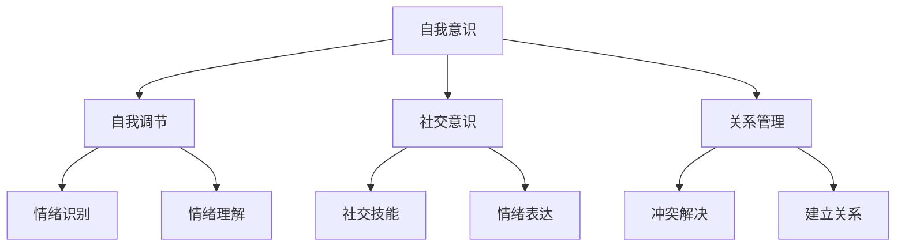

                 

## 控制情绪的智慧：领导力与情绪智商

### 关键词：领导力、情绪智商、自我意识、情绪调节、团队管理、决策质量

#### 摘要：

在当今快速变化和竞争激烈的工作环境中，领导力与情绪智商已经成为企业成功的关键因素。领导力不仅仅关乎战略规划和决策能力，更关乎如何有效地管理自己和团队的情绪。情绪智商，即情商，指的是识别、理解、管理和调节自己及他人情绪的能力。本文将深入探讨情绪智商的概念、构成与培养，以及它在领导力中的关键应用，通过案例分析为读者提供实用的情绪管理技巧和策略。

### 引言

领导力，作为组织成功的核心要素，一直以来都是管理学研究和实践的重要主题。然而，传统的领导力模型往往忽略了情绪智商的作用。情绪智商，或者说情商，是一个人识别、理解、管理和调节自己及他人情绪的能力。它包括自我意识、自我调节、社交意识和关系管理四个方面，是领导力的重要组成部分。

在本文中，我们将从以下几个方面展开讨论：

1. 领导力概述
2. 情绪智商的概念
3. 控制情绪的技巧
4. 情绪智商在领导力中的应用
5. 实战案例分析

### 第一部分：领导力概述

#### 第1章：领导力的定义与类型

**1.1 领导力的定义**

领导力是指领导者通过影响力、沟通能力和决策能力等手段，引导和激励团队成员共同实现目标的能力。它不仅仅是职位和权力的象征，更是一种能力和艺术。

**1.2 领导力的类型**

根据不同的划分标准，领导力可以分为多种类型，如任务型领导、关系型领导、变革型领导和魅力型领导等。每种类型的领导力都有其独特的特点和应用场景。

### 第二部分：情绪智商的概念

#### 第2章：情绪智商的定义与结构

**2.1 情绪智商的定义**

情绪智商是指一个人识别、理解、管理和调节自己及他人情绪的能力。它通常包括自我意识、自我调节、社交意识和关系管理四个方面。

**2.2 情绪智商的结构**

情绪智商的结构如下图所示，它包括自我意识、自我调节、社交意识和关系管理四个方面。

### 第三部分：控制情绪的技巧

#### 第3章：认识情绪

**3.1 情绪的类型**

情绪可以分为正面情绪和负面情绪。正面情绪如喜悦、兴奋和满足，而负面情绪如焦虑、愤怒和沮丧。

**3.2 情绪的来源**

情绪的来源可以追溯到个体的内在心理状态和环境刺激。例如，工作中的压力、人际关系的冲突等都可能导致负面情绪的产生。

#### 第4章：情绪调节技巧

**4.1 自我意识**

自我意识是指个体对自己情绪和行为的认识和理解。提高自我意识是情绪调节的第一步。

**4.2 正念练习**

正念练习，如冥想和深呼吸，可以帮助个体专注于当前的情绪状态，从而更好地进行情绪调节。

**4.3 呼吸调节**

呼吸调节是一种简单而有效的情绪调节技巧。通过控制呼吸节奏，个体可以缓解紧张和焦虑。

### 第四部分：情绪智商在领导力中的应用

#### 第5章：情绪智商在团队管理中的应用

**5.1 建立高绩效团队**

情绪智商在团队管理中起着关键作用。领导者通过提高情绪智商，可以建立高绩效团队，提高团队的整体工作效率和满意度。

**5.2 提高团队凝聚力**

情绪智商可以帮助领导者识别和解决团队中的情绪问题，从而提高团队的凝聚力。

**5.3 解决团队冲突**

情绪智商在解决团队冲突中起着重要作用。领导者可以通过调节自己和他人的情绪，找到冲突的根源，并采取有效的解决策略。

#### 第6章：情绪智商在领导决策中的应用

**6.1 提高决策质量**

情绪智商可以帮助领导者更好地分析问题、评估风险和制定决策。

**6.2 应对压力**

情绪智商在应对工作压力和压力管理中起着关键作用。领导者可以通过调节自己的情绪，更好地应对压力和挑战。

**6.3 提高领导魅力**

情绪智商可以提高领导者的魅力和影响力，从而更好地实现领导目标。

### 第五部分：实战案例分析

#### 第7章：成功领导者的情绪智商实践

**7.1 案例一：乔布斯的情绪智商**

乔布斯作为苹果公司的创始人之一，以其独特的领导风格和强大的情绪智商著称。他的成功部分得益于其对情绪管理的深刻理解和应用。

**7.2 案例二：奥巴马的领导力与情绪智商**

奥巴马作为美国的前总统，以其卓越的领导力和情绪智商赢得了全球的赞誉。他的领导风格和决策过程都充分体现了情绪智商的重要性。

**7.3 案例三：其他成功领导者的情绪智商实践**

除了乔布斯和奥巴马，还有许多其他成功领导者，如比尔·盖茨、马云等，他们的成功经验都证明了情绪智商在领导力中的关键作用。

### 结论

情绪智商是领导力的重要组成部分。通过提高情绪智商，领导者可以更好地管理自己和团队的情绪，提高决策质量和团队绩效。本文通过理论和实践案例的深入探讨，为读者提供了实用的情绪管理技巧和策略。希望本文能为读者在领导力的发展中提供有益的启示和帮助。

### 作者信息

作者：AI天才研究院/AI Genius Institute & 禅与计算机程序设计艺术 /Zen And The Art of Computer Programming

---

以下是对每个章节的核心内容进行详细讲解：

## 第1章 领导力的定义与核心要素

### 1.1.1 领导力的定义

领导力是一种复杂的社会现象，涉及个体或集体在实现共同目标过程中所表现出的影响力、激励和引导能力。领导力不仅仅局限于领导岗位，它可以在各种组织和环境中发挥作用。根据著名的领导力研究者詹姆斯·库泽斯（James M. Kouzes）和巴里·波斯纳（Barry Z. Posner）的定义，领导力是“通过影响他人达成共同目标的过程”。这意味着领导力不仅仅是个人特质，更是一种能够影响他人思想和行动的能力。

在组织管理中，领导力的重要性体现在以下几个方面：

1. **激励和鼓舞团队**：领导者能够激发团队成员的积极性和创造力，使团队在面对困难和挑战时保持高昂的士气和信心。
2. **制定和实现战略目标**：领导者需要制定明确的战略目标，并引导团队成员共同为实现这些目标而努力。
3. **促进创新和变革**：领导者在推动组织创新和变革中起着关键作用，他们能够预见未来的趋势，并带领团队进行必要的调整和转型。
4. **提升团队绩效**：通过有效的领导，团队的整体绩效可以得到显著提升，从而实现组织的长期发展目标。

### 1.1.2 领导力的类型

领导力可以根据不同的标准进行分类，常见的类型包括：

1. **任务型领导（Task-oriented leadership）**：这种类型的领导者强调任务的完成，他们通过明确的目标和任务分配来指导团队成员。任务型领导者通常会设定具体的任务和时间表，并要求团队成员按照既定的计划执行。
2. **关系型领导（Relationship-oriented leadership）**：与任务型领导相反，关系型领导者更注重团队成员之间的关系和情感。他们通过建立信任和支持，激发团队成员的内在动力。
3. **变革型领导（Transformational leadership）**：变革型领导者通过激励和启发团队成员，推动组织进行重大的变革和创新。这种类型的领导者具有强大的愿景和影响力，能够激发团队成员的潜能。
4. **魅力型领导（Charismatic leadership）**：魅力型领导者具有强烈的个人魅力和影响力，他们通过个人的热情和信念来激励团队成员，带领团队实现目标。

每种类型的领导力都有其独特的特点和适用场景。在实际工作中，领导者可能需要根据不同的情况和需求，灵活运用不同的领导力类型。

### 1.2 领导力的核心要素

领导力并不是孤立存在的，它依赖于一系列核心要素的支持。以下是领导力的几个核心要素：

1. **沟通能力**：沟通是领导力的基础。领导者需要具备清晰、有效的沟通能力，以便传达愿景、目标和指令，同时也要倾听团队成员的意见和反馈。
2. **决策能力**：领导者在面对复杂问题时，需要做出明智的决策。决策能力包括收集信息、分析问题、评估选项和做出决策的过程。
3. **影响力**：领导者需要具备一定的影响力，以便能够引导和激励团队成员。影响力来源于领导者的专业知识、道德品质和人际关系。
4. **情绪智商**：情绪智商，即情商，是领导力的重要组成部分。它包括识别、理解、管理和调节自己及他人情绪的能力。高情商的领导者能够更好地管理自己和团队的情绪，提升领导效果。

情绪智商与领导力的关系非常密切。一个高情商的领导者能够更好地理解自己和团队成员的情绪，从而在沟通、决策和团队管理中取得更好的效果。情绪智商不仅影响领导者的个人表现，也对整个团队的绩效产生重要影响。

## 第2章 情绪智商的概念与重要性

### 2.1.1 情绪智商的定义

情绪智商，通常被称为情商（Emotional Intelligence，简称EQ），是指个体识别、理解、管理和调节自己及他人情绪的能力。情绪智商的概念由心理学家约翰·梅耶（John D. Mayer）和彼得·萨洛维（Peter Salovey）于1990年提出。他们认为，情绪智商包括四个核心能力：自我意识、自我调节、社交意识和关系管理。

1. **自我意识（Self-awareness）**：自我意识是指个体对自己情绪和情感的认识和理解。一个具有高自我意识的人能够清楚地认识到自己的情绪状态，并能够对其进行合理的解释。
2. **自我调节（Self-regulation）**：自我调节是指个体管理和调节自己情绪和行为的能力。高自我调节能力的人能够有效地控制自己的情绪，保持冷静和理智。
3. **社交意识（Social awareness）**：社交意识是指个体对他人情绪和情感的认识和理解。具有高社交意识的人能够敏锐地察觉他人的情绪变化，并能够根据这些信息调整自己的行为。
4. **关系管理（Relationship management）**：关系管理是指个体建立和维护人际关系的能力。高关系管理能力的人能够有效地与他人沟通，解决冲突，建立积极的人际关系。

### 2.1.2 情绪智商的结构

情绪智商的结构如下图所示：

在这个结构中，自我意识是情绪智商的基础，自我调节、社交意识和关系管理则构成了情绪智商的核心能力。情绪识别和情绪理解属于自我意识的范畴，社交技能和情绪表达属于社交意识的范畴，冲突解决和建立关系则属于关系管理的范畴。

### 2.2 情绪智商的重要性

情绪智商在领导力中的重要性不可忽视。高情绪智商的领导者能够更好地管理自己和团队的情绪，从而提升领导效果。以下是情绪智商在领导力中的几个重要方面：

1. **情绪识别**：领导者需要能够识别自己的情绪，包括正面情绪和负面情绪。这种能力有助于领导者更好地理解自己的行为和决策，从而避免因情绪波动而导致的错误。
2. **情绪理解**：领导者需要理解团队成员的情绪，包括他们的需求和动机。这种能力有助于领导者更好地激励和引导团队成员，提高团队的凝聚力和工作效率。
3. **情绪调节**：领导者需要能够调节自己的情绪，以保持冷静和理智。这种能力有助于领导者应对工作中的压力和挑战，做出明智的决策。
4. **情绪表达**：领导者需要能够恰当地表达自己的情绪，以建立积极的人际关系。这种能力有助于领导者与团队成员建立信任，促进沟通和合作。
5. **冲突解决**：领导者需要能够有效解决团队内部的冲突。高情绪智商的领导者能够理解冲突的根源，并采取适当的策略来化解冲突，维护团队的和谐。
6. **建立关系**：领导者需要建立和维护良好的人际关系。高情绪智商的领导者能够通过有效的沟通和社交技能，建立积极的人际网络，为组织的发展提供支持。

情绪智商不仅是领导力的核心要素，也是个人成长和职业发展的关键能力。通过提升情绪智商，领导者可以更好地管理自己和团队的情绪，提高领导效果，推动组织的发展。

### 第3章 自我意识与情绪管理

#### 3.1 自我意识的培养

自我意识是情绪智商的核心要素之一，它指的是个体对自己情绪和情感的认识和理解。培养自我意识是情绪管理的基础，有助于个体更好地了解自己的情绪状态，从而进行有效的情绪调节。

以下是一些培养自我意识的方法：

1. **反思**：通过定期反思自己的情绪和行为，个体可以更好地了解自己的情绪触发点和情绪反应模式。反思可以是书面的，也可以是口头的，关键是要认真思考和分析自己的情绪体验。
2. **记录情绪日志**：记录情绪日志是一种有效的自我意识培养方法。个体可以每天或每周记录自己的情绪状态、情绪触发点和情绪反应，通过这种方式，个体可以更加清晰地看到自己的情绪模式，并找到情绪调节的方法。
3. **情绪反馈**：与他人分享自己的情绪体验，获得他人的反馈，可以帮助个体更好地理解自己的情绪。他人的观点和看法可能会提供新的视角，帮助个体更全面地认识自己的情绪状态。
4. **正念练习**：正念练习，如冥想和深呼吸，可以帮助个体专注于当前的情绪状态，提高自我意识。通过正念练习，个体可以学会如何在繁忙和压力中保持冷静和清醒，更好地管理自己的情绪。

#### 3.2 情绪管理

情绪管理是指个体识别、理解、管理和调节自己情绪的过程。有效的情绪管理有助于个体保持心理健康，提高生活质量和工作效率。

以下是一些情绪管理的技巧：

1. **情绪识别**：情绪识别是情绪管理的第一步。个体需要学会识别自己的情绪，包括正面情绪和负面情绪。通过情绪识别，个体可以更好地了解自己的情绪状态，并找到情绪的触发点。
2. **情绪理解**：情绪理解是指个体对情绪的深入认识，包括情绪的来源、影响和可能的解决方法。通过情绪理解，个体可以更好地理解自己的情绪，从而进行更有效的情绪调节。
3. **情绪调节**：情绪调节是指个体采取的方法和策略来管理自己的情绪。以下是一些常见的情绪调节技巧：
   - **认知重构**：通过改变对事物的看法和解释，个体可以调节自己的情绪。例如，将一个挑战视为一个成长机会，而不是一个威胁。
   - **情绪释放**：情绪释放是指个体通过适当的方式释放积压的情绪，如通过运动、写日记或与朋友倾诉。
   - **放松技巧**：如深呼吸、冥想和瑜伽等放松技巧可以帮助个体缓解紧张和焦虑，提高情绪稳定性。
4. **情绪表达**：情绪表达是指个体如何表达自己的情绪。有效的情绪表达可以增强人际关系的质量，减少误解和冲突。以下是一些情绪表达的建议：
   - **清晰表达**：在表达情绪时，个体应尽量清晰、具体地表达自己的感受，避免使用模糊或负面的语言。
   - **控制语速和音量**：在表达情绪时，个体应控制自己的语速和音量，避免过度激动或压抑。
   - **倾听他人**：在表达情绪时，个体也应倾听他人的观点和感受，以建立更有效的人际沟通。

情绪管理不仅有助于个体的心理健康，也有助于提高生活质量和工作效率。通过培养自我意识和掌握情绪管理技巧，个体可以更好地应对生活中的挑战，实现个人和职业目标。

### 第4章 正念练习与情绪调节

#### 4.1 正念的原理与实践

正念（Mindfulness）是一种古老的冥想实践，起源于佛教。它强调对当前时刻的注意力，以及对情绪和思维的非评判性观察。正念的核心是培养一种对当前体验的清醒和接受的态度。

**正念的原理：**

1. **注意力训练**：正念练习通过引导个体将注意力集中在呼吸、身体感受或当前的活动上，以增强对当前时刻的觉察和注意力。
2. **非评判性观察**：正念鼓励个体对自己的思维和情绪保持非评判性的态度，而不是陷入自我批评或过度分析。
3. **接纳**：正念练习帮助个体接纳当前的感受和体验，而不是试图逃避或改变它们。

**正念的实践方法：**

1. **坐姿冥想**：选择一个安静的环境，坐在舒适的姿势中，将注意力集中在呼吸上。当思绪飘离时，温和地将注意力引回呼吸。
2. **行走冥想**：在行走时，将注意力集中在脚步与地面的接触、身体的感觉和呼吸上。这种方式有助于结合身体活动与冥想。
3. **身体扫描**：从脚开始，逐渐扫描全身，观察身体的感受，接受它们而不做评判。

正念练习可以帮助个体提高自我意识，减少压力，增强情绪调节能力。

#### 4.2 呼吸调节与情绪管理

呼吸调节是一种简单而有效的情绪管理技巧。通过有意识的呼吸练习，个体可以影响自己的生理状态，从而调节情绪。

**呼吸调节的原理：**

1. **生理反应**：深呼吸可以激活副交感神经系统，减少应激激素的分泌，从而缓解紧张和焦虑。
2. **心理放松**：深呼吸有助于放松身心，减少心理压力。

**呼吸调节的技巧：**

1. **深呼吸**：缓慢地吸气，感受肺部逐渐膨胀，然后缓慢地呼气，感受肺部逐渐收缩。专注于呼吸的感觉，保持节奏均匀。
2. **腹式呼吸**：通过腹式呼吸，即深呼吸时让腹部鼓起，可以增强呼吸调节的效果。这种方式有助于更深入地放松身体。
3. **呼吸冥想**：结合冥想练习，通过专注于呼吸，个体可以更好地管理自己的情绪。呼吸冥想可以是坐姿或站姿，关键在于保持呼吸的均匀和深入。

呼吸调节不仅有助于缓解压力和焦虑，还可以提高情绪稳定性，增强个体的自我调节能力。

### 第5章 情绪转化与情绪释放

#### 5.1 情绪转化的方法

情绪转化是指将负面情绪转化为积极的情绪或中性的情绪。以下是一些情绪转化的方法：

1. **认知重构**：认知重构是通过改变对事件的看法和解释来改变情绪。例如，将一个挑战视为一个成长机会，而不是一个威胁，可以帮助个体从负面情绪中解脱出来。
2. **正念练习**：通过正念练习，个体可以学会接受当前的情绪，而不是抗拒或逃避。这种接受的态度有助于减少负面情绪的影响。
3. **情绪表达**：适当地表达情绪，无论是通过言语还是非言语的方式，可以帮助个体释放情绪，避免情绪积累。
4. **替代性情绪**：通过引入替代性情绪，个体可以暂时从负面情绪中解脱。例如，当感到焦虑时，可以尝试感受平静或快乐的情绪。

#### 5.2 情绪释放的技巧

情绪释放是指通过适当的方式释放积压的情绪，以减轻心理压力和情绪困扰。以下是一些情绪释放的技巧：

1. **运动**：运动是一种有效的情绪释放方式。通过身体活动，个体可以释放紧张和焦虑，提高情绪稳定性。
2. **艺术创作**：艺术创作，如绘画、写作或音乐，可以帮助个体表达和释放情绪。通过创作，个体可以将情绪转化为具体的形式，从而减轻情绪负担。
3. **谈话**：与信任的朋友或专业人士交谈，可以帮助个体倾诉情绪，获得支持和建议。谈话是一种直接的情绪释放方式，有助于缓解情绪困扰。
4. **情绪释放技巧**：情绪释放技巧，如深呼吸、冥想和渐进性肌肉放松，可以帮助个体放松身体和心灵，释放情绪。

情绪转化和情绪释放是情绪管理的重要环节。通过有效的情绪转化和情绪释放技巧，个体可以更好地管理自己的情绪，提高心理健康和生活质量。

### 第6章 情绪智商在团队管理中的应用

#### 6.1 建立高绩效团队

情绪智商在团队管理中起着至关重要的作用。一个高绩效团队不仅需要明确的愿景和目标，更需要成员之间的良好沟通、信任和协作。以下是如何利用情绪智商建立高绩效团队的方法：

1. **培养自我意识**：团队成员需要了解自己的情绪和反应模式。通过自我意识的培养，成员可以更好地管理自己的情绪，减少情绪波动对团队的影响。
2. **提升社交意识**：社交意识是理解他人情绪和需求的能力。通过提升社交意识，团队成员可以更好地理解他人，从而在沟通和协作中更加有效。
3. **建立信任**：信任是团队协作的基石。通过开放、坦诚的沟通和相互支持，团队成员可以建立深厚的信任关系，从而提高团队的凝聚力和工作效率。
4. **解决冲突**：冲突是团队管理中不可避免的问题。情绪智商高的领导者可以更好地识别和解决冲突，避免冲突升级，维护团队的和谐与稳定。
5. **激励团队成员**：领导者需要了解每个成员的需求和动机，通过个性化的激励措施，激发团队成员的积极性和创造力。

#### 6.2 提高团队凝聚力

团队凝聚力是指团队成员之间相互吸引、信任和支持的程度。情绪智商在提高团队凝聚力方面发挥着重要作用。以下是一些提高团队凝聚力的策略：

1. **增强团队沟通**：有效的沟通是团队凝聚力的重要基础。通过开放、坦诚的沟通，团队成员可以更好地理解彼此，建立信任和合作关系。
2. **培养团队文化**：团队文化是团队成员共同遵守的价值观和行为准则。通过建立积极、包容的团队文化，可以增强团队成员的归属感和认同感。
3. **团队建设活动**：定期组织团队建设活动，如团建活动、培训和工作坊，可以增强团队成员之间的互动和了解，提高团队凝聚力。
4. **鼓励合作与支持**：鼓励团队成员之间的合作与支持，可以增强团队的凝聚力。当团队成员面临困难时，相互帮助和支持可以增强团队的团结和协作。
5. **认可与奖励**：对团队成员的成就和贡献给予认可和奖励，可以增强团队成员的积极性和归属感，提高团队凝聚力。

通过利用情绪智商，领导者可以有效地建立高绩效团队和提高团队凝聚力，从而实现团队的长期发展和成功。

#### 6.3 解决团队冲突

团队冲突是团队管理中不可避免的现象，它可能源于目标不明确、沟通不畅、资源分配不均等多种原因。解决团队冲突需要领导者具备高情绪智商，以下是一些解决团队冲突的策略：

1. **识别冲突**：首先，领导者需要识别冲突的根源和表现形式。这可以通过观察团队成员的行为和沟通，以及直接询问团队成员来实现。
2. **倾听与理解**：在解决冲突时，领导者需要倾听各方的意见和感受，理解冲突的实质。这有助于建立信任，为冲突的解决创造良好的氛围。
3. **中立立场**：领导者应保持中立立场，避免偏袒任何一方，以免加剧冲突。中立立场有助于领导者客观地分析和解决问题。
4. **寻求共识**：通过引导团队成员寻求共识，领导者可以找到解决问题的共同点。共识的达成有助于缓解冲突，促进团队的和谐与稳定。
5. **采取行动**：在解决冲突后，领导者需要采取具体的行动来确保问题的解决。这可能包括调整资源分配、改善沟通机制或提供额外的培训和支持。

通过有效解决团队冲突，领导者可以维护团队的和谐与稳定，提高团队的整体绩效和满意度。

### 第7章 情绪智商在领导决策中的应用

#### 7.1 提高决策质量

情绪智商在领导决策中起着关键作用，它有助于领导者提高决策质量，降低决策风险。以下是如何利用情绪智商提高决策质量的方法：

1. **情绪识别**：领导者需要识别自己在决策过程中的情绪反应，如焦虑、兴奋或压力。了解自己的情绪状态有助于领导者更加客观地评估决策选项。
2. **情绪调节**：领导者需要学会调节自己的情绪，以保持冷静和理智。情绪调节能力有助于领导者避免因情绪波动而做出错误决策。
3. **全面评估**：领导者应全面评估决策的潜在影响，包括正面和负面结果。通过情绪智商，领导者可以更好地理解决策可能带来的情绪影响，从而做出更全面、更合理的决策。
4. **团队参与**：领导者应鼓励团队成员参与决策过程，利用团队成员的情绪智商，共同评估决策选项。团队参与有助于降低决策风险，提高决策的接受度。

#### 7.2 应对压力

领导者在决策过程中常常面临各种压力，如工作负荷、时间限制和不确定性。情绪智商可以帮助领导者有效应对压力，以下是一些策略：

1. **情绪调节**：领导者需要学会在压力下保持情绪稳定。情绪调节技巧，如深呼吸、冥想和运动，可以帮助领导者缓解压力，提高应对能力。
2. **寻求支持**：领导者应寻求同事、朋友或专业咨询的支持，分享自己的压力和困扰。通过倾诉和寻求帮助，领导者可以减轻心理负担，提高应对压力的能力。
3. **时间管理**：领导者需要有效管理时间，合理安排工作和休息时间。时间管理技巧有助于减轻工作压力，提高工作效率。
4. **积极思维**：领导者应培养积极思维，将压力视为一种挑战和成长机会。积极思维有助于领导者保持乐观，提高应对压力的能力。

#### 7.3 提高领导魅力

领导魅力是指领导者通过个人特质和影响力吸引和激励他人的能力。情绪智商在提高领导魅力方面发挥着重要作用。以下是一些提高领导魅力的策略：

1. **建立信任**：信任是领导魅力的基础。领导者需要通过诚实、透明和可信的行为赢得团队成员的信任。
2. **展示真诚**：领导者需要展示真诚的情感，包括对团队成员的关心和支持。真诚的情感可以增强领导者与团队成员之间的联系。
3. **积极沟通**：领导者需要具备有效的沟通能力，包括倾听、表达和反馈。积极沟通有助于建立良好的沟通渠道，增强团队凝聚力。
4. **个人品牌**：领导者需要建立自己的个人品牌，通过专业知识和领导能力展示自己的价值。个人品牌有助于提升领导者的魅力和影响力。

通过提升情绪智商，领导者可以更好地管理自己的情绪，提高决策质量，应对压力，增强领导魅力，从而实现个人和团队的成功。

### 第8章 成功领导者的情绪智商实践

#### 8.1 案例一：乔布斯的情绪智商

史蒂夫·乔布斯（Steve Jobs）是苹果公司的创始人之一，以其卓越的领导才能和独特的情绪智商而著称。乔布斯在领导苹果公司的过程中，成功地将情感智商应用于团队管理和产品创新，从而推动苹果公司成为全球科技巨头。

1. **自我意识**：乔布斯具有极高的自我意识，他能够深刻地认识和理解自己的情绪和动机。这种自我意识帮助他在面对挑战和压力时保持冷静和理智，做出明智的决策。
2. **自我调节**：乔布斯在自我调节方面表现出色，他能够有效地控制自己的情绪，不被负面情绪所左右。这种能力使他能够在高强度的工作环境中保持高效和专注。
3. **社交意识**：乔布斯具备出色的社交意识，他能够敏锐地察觉团队成员的情绪和需求。通过与团队成员建立深厚的信任关系，他能够激励他们发挥最佳水平。
4. **关系管理**：乔布斯在关系管理方面也非常擅长，他能够建立和维护强大的人际网络。这些关系不仅为他的个人成功提供了支持，也为苹果公司的发展创造了有利条件。

乔布斯的情绪智商使其成为一位杰出的领导者，他通过运用情绪智商，成功地推动了苹果公司的发展和创新，成为科技领域的传奇人物。

#### 8.2 案例二：奥巴马的领导力与情绪智商

巴拉克·奥巴马（Barack Obama）是美国历史上第一位非洲裔总统，他的领导力和情绪智商在国际上得到了广泛的认可。奥巴马以其冷静、沉着和充满智慧的领导风格，成功地应对了各种复杂的国内外挑战。

1. **情绪识别**：奥巴马具备出色的情绪识别能力，他能够迅速察觉自己的情绪波动，并对其进行合理的解释。这种能力使他能够在压力下保持冷静，做出明智的决策。
2. **情绪调节**：奥巴马在情绪调节方面表现出色，他能够通过深呼吸、冥想等技巧，有效地控制自己的情绪，避免情绪对决策过程产生负面影响。
3. **社交意识**：奥巴马具有高度社交意识，他能够深入理解他人的情绪和需求。通过与公众和政府官员建立良好的沟通渠道，他能够有效地调动社会资源，推动政策的实施。
4. **关系管理**：奥巴马在关系管理方面也非常擅长，他能够建立和维护广泛的人际网络。这些关系不仅为他的政治生涯提供了支持，也为他推动国内外政策目标提供了有力保障。

奥巴马的领导力和情绪智商的结合，使他成为一位备受尊敬的领导者。他通过运用情绪智商，成功地推动了美国的改革和发展，成为全球政治舞台上的杰出人物。

#### 8.3 案例三：其他成功领导者的情绪智商实践

除了乔布斯和奥巴马，还有许多其他成功领导者，如比尔·盖茨、马云等，他们的领导实践都充分证明了情绪智商在领导力中的关键作用。

1. **比尔·盖茨**：微软公司的创始人比尔·盖茨以其强烈的使命感和对技术的深刻理解而闻名。他在领导过程中，通过情绪智商，成功地激励和引导团队成员，推动公司不断创新和成长。
2. **马云**：阿里巴巴集团的创始人马云以其独特的领导风格和敏锐的商业洞察力而著称。他通过情绪智商，成功地建立了一个充满活力和创新精神的团队，推动了阿里巴巴的快速发展。

这些成功领导者的案例表明，情绪智商是领导力的关键要素。通过提高情绪智商，领导者可以更好地管理自己和团队的情绪，提高决策质量和团队绩效，从而实现个人和组织的成功。

### 第9章 情绪智商在项目管理中的应用

#### 9.1 提高决策质量

情绪智商在项目管理中发挥着重要作用，它有助于项目经理在复杂的环境中做出明智的决策。以下是如何利用情绪智商提高决策质量的方法：

1. **情绪识别**：项目经理需要识别自己在决策过程中的情绪反应，如焦虑、兴奋或压力。了解自己的情绪状态有助于更加客观地评估决策选项。
2. **情绪调节**：项目经理需要学会调节自己的情绪，以保持冷静和理智。情绪调节能力有助于避免因情绪波动而做出错误决策。
3. **全面评估**：项目经理应全面评估决策的潜在影响，包括正面和负面结果。通过情绪智商，项目经理可以更好地理解决策可能带来的情绪影响，从而做出更全面、更合理的决策。
4. **团队参与**：项目经理应鼓励团队成员参与决策过程，利用团队成员的情绪智商，共同评估决策选项。团队参与有助于降低决策风险，提高决策的接受度。

#### 9.2 应对项目压力

项目管理工作充满挑战和压力，项目经理需要具备高情绪智商，以有效应对项目压力。以下是一些应对项目压力的策略：

1. **情绪调节**：项目经理需要学会在压力下保持情绪稳定。情绪调节技巧，如深呼吸、冥想和运动，可以帮助项目经理缓解压力，提高应对能力。
2. **寻求支持**：项目经理应寻求同事、朋友或专业咨询的支持，分享自己的压力和困扰。通过倾诉和寻求帮助，项目经理可以减轻心理负担，提高应对压力的能力。
3. **时间管理**：项目经理需要有效管理时间，合理安排工作和休息时间。时间管理技巧有助于减轻工作压力，提高工作效率。
4. **积极思维**：项目经理应培养积极思维，将压力视为一种挑战和成长机会。积极思维有助于项目经理保持乐观，提高应对压力的能力。

#### 9.3 提高项目团队凝聚力

项目团队凝聚力是项目成功的关键因素。情绪智商在提高项目团队凝聚力方面发挥着重要作用。以下是一些提高项目团队凝聚力的策略：

1. **增强团队沟通**：有效的沟通是团队凝聚力的重要基础。通过开放、坦诚的沟通，团队成员可以更好地理解彼此，建立信任和合作关系。
2. **培养团队文化**：团队文化是团队成员共同遵守的价值观和行为准则。通过建立积极、包容的团队文化，可以增强团队成员的归属感和认同感。
3. **团队建设活动**：定期组织团队建设活动，如团建活动、培训和工作坊，可以增强团队成员之间的互动和了解，提高团队凝聚力。
4. **鼓励合作与支持**：鼓励团队成员之间的合作与支持，可以增强团队的凝聚力。当团队成员面临困难时，相互帮助和支持可以增强团队的团结和协作。

通过提升情绪智商，项目经理可以更好地管理自己和团队的情绪，提高决策质量，应对项目压力，增强团队凝聚力，从而实现项目的成功。

### 第10章 情绪智商在危机管理中的应用

#### 10.1 提高危机应对能力

情绪智商在危机管理中起着关键作用，它有助于个人和组织在危机中保持冷静、有效应对。以下是如何利用情绪智商提高危机应对能力的方法：

1. **情绪识别**：在危机发生时，个体需要迅速识别自己的情绪反应，如焦虑、恐慌或愤怒。通过情绪识别，个体可以更好地理解自己的情绪状态，从而采取适当的应对措施。
2. **情绪调节**：情绪调节技巧，如深呼吸、冥想和放松练习，可以帮助个体在危机中保持冷静和理智。情绪调节能力有助于减少情绪对决策过程的负面影响。
3. **理性分析**：在危机中，个体需要运用理性分析，全面评估危机的潜在影响，并制定有效的应对策略。情绪智商有助于个体在危机中保持清晰的头脑，做出明智的决策。
4. **团队协作**：在危机管理中，团队协作至关重要。情绪智商高的团队成员可以更好地理解他人，协调各方资源，共同应对危机。

#### 10.2 应对危机中的压力

危机管理往往伴随着巨大的压力，情绪智商在应对危机中的压力方面发挥着重要作用。以下是一些应对危机中压力的策略：

1. **情绪调节**：通过情绪调节技巧，如深呼吸、冥想和运动，个体可以缓解压力，提高应对能力。情绪调节有助于个体在危机中保持冷静和集中注意力。
2. **寻求支持**：在危机中，个体需要寻求同事、朋友或专业人士的支持和帮助。通过倾诉和寻求帮助，个体可以减轻心理负担，提高应对压力的能力。
3. **时间管理**：在危机管理中，有效的时间管理至关重要。通过合理安排时间和资源，个体可以减轻工作压力，提高工作效率。
4. **积极思维**：培养积极思维，将危机视为一种成长和进步的机会。积极思维有助于个体在危机中保持乐观和信心，提高应对压力的能力。

#### 10.3 提高危机沟通能力

危机沟通是危机管理的重要组成部分，情绪智商在提高危机沟通能力方面发挥着关键作用。以下是一些提高危机沟通能力的策略：

1. **情绪识别**：在危机沟通中，个体需要识别对方的情绪反应，包括焦虑、愤怒或恐惧。通过情绪识别，个体可以更好地理解对方的心理状态，从而采取更有效的沟通策略。
2. **情绪表达**：在表达自己情绪时，个体需要掌握情绪表达的技巧，如清晰、具体地表达自己的感受，避免使用攻击性语言。情绪表达有助于建立信任，促进有效沟通。
3. **倾听与理解**：在危机沟通中，倾听和理解对方的观点和需求至关重要。通过倾听和理解，个体可以建立良好的沟通渠道，增进合作与信任。
4. **透明沟通**：在危机中，保持透明沟通有助于建立信任，减少误解和猜测。透明沟通包括及时、准确地传达信息，以及公开讨论问题。

通过提升情绪智商，个人和组织可以更好地应对危机，提高危机应对能力，应对危机中的压力，以及提高危机沟通能力，从而实现更有效的危机管理。

### 第11章 本书总结

情绪智商是领导力的重要组成部分，它关乎领导者如何识别、理解和管理自己及他人的情绪。通过提高情绪智商，领导者可以更好地管理自己和团队的情绪，提高决策质量和团队绩效。本书从多个角度探讨了情绪智商的概念、构成与培养，以及在领导力、团队管理、项目管理和危机管理中的应用。

### 11.1 核心观点回顾

1. **领导力与情绪智商的关系**：领导力不仅仅是职位和权力的象征，更是一种能力和艺术。情绪智商在领导力中起着关键作用，它帮助领导者更好地管理自己和团队的情绪，提高决策质量和团队绩效。
2. **情绪智商的构成与培养**：情绪智商包括自我意识、自我调节、社交意识和关系管理四个方面。通过反思、正念练习和情绪调节技巧，领导者可以提升自己的情绪智商。
3. **情绪智商在团队管理中的应用**：领导者需要利用情绪智商建立高绩效团队、提高团队凝聚力和解决团队冲突。这有助于提升团队的协作能力和整体绩效。
4. **情绪智商在项目管理和危机管理中的应用**：情绪智商在项目管理和危机管理中也发挥着重要作用，它有助于提高决策质量、应对压力和改善沟通能力。

### 11.2 未来展望

随着组织和社会环境的不断变化，情绪智商的重要性将越来越凸显。未来的领导者需要具备更高的情绪智商，以应对复杂的工作环境和多样化的团队需求。以下是对未来领导力发展的展望：

1. **个性化和定制化领导**：未来的领导力将更加注重个性化，领导者需要根据团队成员的个性和需求，提供定制化的领导和支持。
2. **持续学习和自我提升**：领导者需要持续学习和自我提升，不断提升自己的情绪智商和领导能力，以适应不断变化的工作环境。
3. **注重心理健康**：随着对心理健康重视程度的提高，未来的领导者将更加关注团队成员的心理健康，提供必要的支持和资源。
4. **多元化与包容性**：未来的领导者需要具备多元化思维和包容性，能够理解和尊重不同背景和文化的人，从而建立更加和谐的团队。

通过不断提升情绪智商，未来的领导者将能够更好地应对挑战，实现个人和团队的成功。

### 第12章 反思与启示

#### 12.1 情绪智商的自我评估

情绪智商是领导者不可或缺的能力，但它并非一成不变。通过自我评估，领导者可以了解自己在情绪智商方面的优势和劣势，从而有针对性地进行改进。以下是一些自我评估的步骤：

1. **反思情绪反应**：回想一下在最近的工作中，你面对压力、冲突或困难时的情绪反应。记录下你的情绪体验，包括情绪的类型、强度和持续时间。
2. **识别情绪触发点**：分析你的情绪反应，找出触发这些情绪的常见情境或事件。这些触发点可能包括工作负荷、人际冲突或时间压力等。
3. **评估情绪调节能力**：评估自己在面对负面情绪时的调节能力。你是否能够迅速恢复平静，或者情绪波动对你的工作和决策产生了负面影响？
4. **寻求反馈**：向同事、朋友或下属征求意见，了解他们对你情绪智商的看法。他们的反馈可以提供新的视角，帮助你更全面地认识自己。

通过自我评估，领导者可以更清楚地了解自己的情绪智商状况，从而制定改进计划。

#### 12.2 提高情绪智商的策略

为了提高情绪智商，领导者可以采取以下策略：

1. **定期反思和自我提升**：通过定期反思自己的情绪和行为，领导者可以更好地了解自己的情绪模式，从而进行有针对性的自我提升。
2. **培养正念和冥想**：正念冥想是一种有效的情绪调节技巧，可以帮助领导者提高自我意识和情绪调节能力。领导者可以每天花几分钟时间进行冥想练习，以增强自己的正念。
3. **加强沟通和倾听**：沟通是情绪管理的关键。领导者需要加强沟通技巧，学会倾听和理解他人的情绪和需求。这有助于建立信任，改善人际关系。
4. **寻求专业指导**：领导者可以考虑寻求专业的情绪智商培训或咨询，以获得更深入的理解和指导。专业人士可以提供个性化的建议和训练，帮助领导者提升情绪智商。

#### 12.3 情绪智商对领导力和团队绩效的影响

情绪智商不仅影响领导者的个人表现，也对团队绩效产生深远的影响。以下是一些关键点：

1. **情绪智商与领导魅力**：高情绪智商的领导者能够通过情感共鸣和激励，增强领导魅力。这有助于吸引和保留人才，提升团队的凝聚力。
2. **情绪智商与决策质量**：情绪智商有助于领导者更好地识别和评估情绪因素，从而做出更明智的决策。领导者通过情绪调节，可以避免因情绪波动而导致的错误决策。
3. **情绪智商与团队协作**：情绪智商高的领导者能够更好地理解团队成员的情绪和需求，促进团队协作和沟通。这有助于建立积极的团队文化，提高团队的整体绩效。

通过提升情绪智商，领导者可以更好地管理自己和团队的情绪，提高决策质量和团队绩效，从而实现个人和组织的成功。

### 12.4 拓展阅读

为了进一步深入了解情绪智商和领导力，以下是几本推荐阅读的书籍：

1. **《情商：为什么情商比智商更重要》（Emotional Intelligence）** - 丹尼尔·戈尔曼（Daniel Goleman）
   这本书是情绪智商领域的经典之作，详细介绍了情商的概念、结构和重要性。

2. **《领导力与影响力》（The Leadership Challenge）** - 詹姆斯·库泽斯（James M. Kouzes）和巴里·波斯纳（Barry Z. Posner）
   本书通过丰富的案例和实践，深入探讨了领导力的本质和实践方法。

3. **《正念：通往内心的旅程》（The Power of Now）** - 埃克哈特·托勒（Eckhart Tolle）
   这本书介绍了正念冥想的原理和实践，对提升自我意识和情绪调节能力有很好的指导作用。

通过阅读这些书籍，读者可以进一步扩展对情绪智商和领导力的理解，为自己的个人和职业发展提供有力支持。

