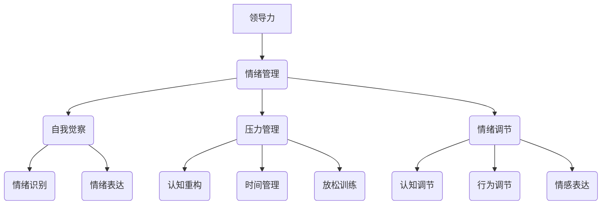

                 

# 领导力与情绪管理：保持职场冷静

## 关键词
- 领导力
- 情绪管理
- 职场
- 压力
- 组织文化
- 情绪智能

## 摘要
本文旨在探讨领导力与情绪管理在职场中的重要性，以及如何通过有效的策略保持职场冷静。文章首先介绍了领导力和情绪管理的基本概念，随后分析了两者之间的相互关系。接着，本文详细讲解了情绪认识、自我觉察、压力管理和情绪调节等情绪管理策略，并结合Python代码和数学模型进行了实例说明。随后，文章讨论了领导力与情绪管理在职场中的应用，并通过实际案例进行了分析。最后，文章总结了领导力与情绪管理的持续成长和未来发展，并提供了一些最佳实践和拓展阅读建议。

## 引言

在快速变化的现代职场环境中，领导力和情绪管理成为职场成功的关键因素。领导力不仅关乎个人魅力和决策能力，更关乎团队凝聚力和组织效能。而情绪管理则是个体在压力和挑战中保持冷静和高效的核心能力。良好的情绪管理有助于提高工作效率、减少冲突、增强团队合作，并促进个人成长与发展。

本文将首先介绍领导力和情绪管理的基本概念，分析它们在职场中的重要性。随后，我们将深入探讨情绪管理策略，包括情绪认识、自我觉察、压力管理和情绪调节。我们将结合Python代码和数学模型，通过实例详细说明这些策略的应用。接下来，文章将讨论领导力与情绪管理在职场中的实际应用，并通过案例研究进行分析。最后，文章将对领导力与情绪管理的持续成长和未来发展进行总结，并提供一些实用的建议和拓展阅读。

### 领导力基础理论

领导力是指通过影响力、引导和激励他人，实现共同目标的能力。领导力不仅仅是一种职位赋予的权力，更是一种个人特质和行为方式。传统的领导力理论主要分为三大类：特质理论、行为理论和权变理论。

**特质理论**认为领导力是由一系列先天特质所决定的，这些特质包括自信、决断力、沟通能力等。特质理论强调领导者必须具备某些特定的个性特征才能成功领导。然而，随着研究的深入，人们逐渐发现领导力并非仅仅由个人特质决定，还受到外部环境的影响。

**行为理论**则关注领导者的行为模式，认为领导力是通过一系列可观察的行为表现出来的。行为理论将领导行为分为领导风格、领导行为类型等，如专制型、民主型、指导型、支持型等。这些理论认为领导者的行为可以影响团队的效率和绩效。

**权变理论**则提出领导力是情境依赖的，没有一种通用的领导模式适用于所有情况。该理论强调领导者需要根据具体情况和环境选择合适的领导方式。例如，费德勒模型（Fiedler’s Contingency Model）提出了领导者的风格与情境因素之间的关系，认为在某些情境下，专制型领导更为有效，而在其他情境下，民主型领导更佳。

领导力的核心要素包括：愿景与目标设定、决策与执行、沟通与协调、激励与认可、团队建设与领导力传承。愿景和目标是领导力的灵魂，它们为团队指明了方向和目标。决策和执行则是领导力的重要体现，领导者需要做出明智的决策并确保执行。沟通和协调则确保了团队成员之间的信息畅通和协作，激励与认可则是激发团队成员积极性和创造力的关键。团队建设和领导力传承则关系到组织的长期发展。

### 情绪管理策略

情绪管理是指个体通过自我觉察、认知调节和行为控制，有效地处理和管理自身情绪的过程。情绪管理策略包括情绪认识、自我觉察、压力管理和情绪调节。

**情绪认识**是情绪管理的第一步，它包括了解情绪的类型、功能及其对个体行为和思维的影响。情绪主要分为正面情绪和负面情绪，如快乐、悲伤、愤怒等。正面情绪有助于提高个体的幸福感和积极性，而负面情绪则可能带来压力和困扰。

**自我觉察**是指个体对自己情绪状态的认识和感知。自我觉察有助于个体及时了解自己的情绪变化，从而做出合理的反应。常用的自我觉察技巧包括情绪日记、情绪记录和反思等。通过这些技巧，个体可以更好地理解自己的情绪，并找到有效的应对策略。

**压力管理**是指通过减轻压力源和提升压力应对能力，保持身心健康的过程。压力管理策略包括认知重构、时间管理、放松训练和锻炼等。认知重构是指通过改变对压力事件的认识和解释，减轻压力的影响。时间管理则通过合理安排时间和任务，减少压力。放松训练和锻炼则通过身体和心理的放松，减轻压力。

**情绪调节**是指个体通过认知和行为控制，调节自身情绪的过程。情绪调节策略包括认知调节、行为调节和情绪表达等。认知调节是指通过改变对情绪的认知评价，降低负面情绪的影响。行为调节则通过行为改变，如放松训练、锻炼和社交活动等，调节情绪。情绪表达则通过适当的方式表达情绪，避免情绪积压。

### 情绪认识与自我觉察

情绪认识与自我觉察是情绪管理的基石。只有深入了解情绪的类型、功能及其对个体行为和思维的影响，个体才能有效地进行情绪管理。

**情绪的类型**主要包括正面情绪和负面情绪。正面情绪如快乐、满意、兴奋等，对个体的心理和行为有积极影响。负面情绪如愤怒、焦虑、恐惧等，对个体的心理和行为有消极影响。负面情绪在适当的程度下可以激发个体的警觉性和应对能力，但过度积累和长时间存在则可能导致心理问题。

**情绪的功能**包括信号功能、适应功能和调节功能。情绪作为内部信号，帮助个体识别和评估外界环境的变化，从而做出相应的反应。情绪的适应功能有助于个体在压力和挑战中保持平衡。情绪的调节功能则通过情绪体验，帮助个体调节生理和心理状态。

**自我觉察**技巧是情绪管理的关键。自我觉察是指个体对自己情绪状态的认识和感知。通过自我觉察，个体可以及时了解自己的情绪变化，从而做出合理的反应。常用的自我觉察技巧包括情绪日记、情绪记录和反思等。

**情绪日记**是一种记录自己情绪的方法。通过每天记录自己的情绪状态、情绪触发事件和情绪反应，个体可以更好地了解自己的情绪模式，从而找到有效的情绪管理策略。例如，当个体发现自己在某个特定情境下总是感到焦虑时，可以通过调整应对策略来减轻焦虑。

**情绪记录**是指个体在日常生活中记录自己的情绪变化。通过记录情绪，个体可以更清晰地认识到情绪的波动，从而更好地控制情绪。例如，在记录过程中，个体可能会发现自己在早晨感到焦虑，而在晚上感到放松。这样的认识可以帮助个体调整生活习惯，减轻焦虑。

**反思**是指个体在事后对情绪体验进行回顾和思考。通过反思，个体可以了解自己的情绪反应是否合理，是否需要调整。例如，当个体在某个情境下感到愤怒时，反思可以帮助个体了解愤怒的原因，是否是因为对某个问题的不公平处理感到不满，或者是因为个人期望没有得到满足。通过反思，个体可以更好地理解自己的情绪，并找到更有效的情绪管理方法。

### 压力管理技巧

压力是现代社会中不可避免的现象，对于职场人士来说，适度的压力可以激发工作动力和创造力，但过度的压力则可能导致身心疲惫、工作效率下降。有效的压力管理技巧对于保持职场冷静至关重要。

**认知重构**是一种常用的压力管理策略，它通过改变对压力事件的认知和解释，减轻压力的影响。认知重构包括以下几个方面：

1. **识别负面思维模式**：个体需要识别自己在面对压力时的负面思维模式，如过度概括、以偏概全、黑白思维等。例如，当个体因工作上的失误而感到沮丧时，可能认为自己一无是处，这是过度概括的表现。

2. **挑战负面思维**：个体需要质疑并挑战这些负面思维，找出其不合理之处。例如，可以通过提问的方式，如“这个情况真的是那么糟糕吗？”“有没有其他的解释？”来质疑负面思维。

3. **建立积极思维模式**：个体需要建立积极的思维模式，用更合理和乐观的观点来看待压力事件。例如，可以将工作失误视为成长和学习的机会，从而激发积极情绪。

**时间管理**是减轻压力的有效策略。通过合理安排时间和任务，个体可以减少因时间紧迫感而产生的压力。以下是一些时间管理的技巧：

1. **设定优先级**：将任务按照重要性和紧急性进行分类，优先处理重要且紧急的任务。

2. **制定计划**：为每个任务设定具体的目标和时间，确保任务按时完成。

3. **避免拖延**：识别并解决拖延的原因，如缺乏动力、不明确的目标等，从而提高工作效率。

**放松训练**是通过身体和心理的放松来减轻压力的方法。以下是一些放松训练的技巧：

1. **深呼吸**：通过深呼吸，可以缓解紧张和焦虑，放松身心。

2. **渐进性肌肉放松**：通过逐个放松身体各个部位的肌肉，达到身心放松的效果。

3. **瑜伽和冥想**：瑜伽和冥想可以帮助个体放松身心，减少压力。

**锻炼**是一种有效的压力管理策略，通过锻炼身体，可以释放压力，增强身体素质。以下是一些锻炼的建议：

1. **定期锻炼**：每周至少进行三次锻炼，每次持续30分钟以上。

2. **选择适合自己的锻炼方式**：如跑步、游泳、瑜伽等，根据个人喜好和身体状况选择合适的锻炼方式。

3. **锻炼环境**：选择安静、舒适的环境进行锻炼，以增加锻炼的乐趣和效果。

### 情绪调节技巧

情绪调节是指个体通过认知和行为控制，调节自身情绪的过程。有效的情绪调节可以帮助个体在压力和挑战中保持冷静和高效。

**认知调节**是一种常用的情绪调节策略，它通过改变对情绪的认知评价，降低负面情绪的影响。以下是一些认知调节的技巧：

1. **认知重构**：通过改变对压力事件的认知和解释，减轻压力的影响。例如，当个体因工作上的失误而感到沮丧时，可以通过认知重构来转变思维，将其视为一个成长和学习的机会。

2. **积极心态**：培养积极的心态，用更乐观和积极的角度来看待生活中的困难和挑战。

3. **情绪标签法**：通过给负面情绪贴上标签，如“焦虑”、“紧张”等，帮助个体更好地认识和接受这些情绪，从而减少其负面影响。

**行为调节**是通过行为改变来调节情绪的过程。以下是一些行为调节的技巧：

1. **放松训练**：通过深呼吸、渐进性肌肉放松等方法，放松身心，减轻压力。

2. **锻炼**：定期进行锻炼，如跑步、瑜伽等，有助于释放压力，提升情绪。

3. **社交互动**：与家人、朋友交流，分享自己的情绪和感受，寻求支持和理解。

4. **兴趣爱好**：培养兴趣爱好，如绘画、音乐、阅读等，有助于转移注意力，调节情绪。

**情绪表达**是指个体通过适当的方式表达情绪，避免情绪积压。以下是一些情绪表达的技巧：

1. **情绪日记**：通过写日记的方式，记录自己的情绪变化和感受，有助于情绪释放。

2. **倾诉**：向信任的人倾诉自己的情绪，如家人、朋友或心理咨询师。

3. **艺术表达**：通过绘画、音乐、舞蹈等方式，表达自己的情绪，释放内心的压力。

### 领导力与情绪管理的关系

领导力与情绪管理之间存在紧密的相互关系。领导力不仅仅是管理团队和组织的能力，更是影响和激励他人的一种艺术。而情绪管理则是领导力的核心要素之一，决定了领导者的个人魅力、团队凝聚力和组织效能。

首先，情绪管理能力对于领导者的个人魅力至关重要。一个具备良好情绪管理能力的领导者能够更好地处理压力和挑战，保持冷静和自信。这种积极的情绪状态不仅有助于领导者自身的心理健康，还能够传递给团队成员，增强团队的士气和信任感。

其次，情绪管理能力对于团队凝聚力具有重要影响。一个善于情绪管理的领导者能够帮助团队成员解决冲突、缓解压力，并建立良好的人际关系。这种积极的团队氛围有助于提高团队的合作效率和工作质量，从而实现共同目标。

此外，情绪管理能力对于组织效能也起着关键作用。领导者通过有效的情绪管理，可以激励团队成员发挥最大潜力，提高组织的创新能力和竞争力。同时，领导者还能够通过情绪管理策略，减少员工流失率，提升员工的满意度和忠诚度。

综上所述，领导力与情绪管理之间的关系是相辅相成的。一个具备良好情绪管理能力的领导者，能够更好地发挥领导力，提升个人魅力、团队凝聚力和组织效能。因此，情绪管理能力是现代领导者必备的核心素养之一。

### 领导力与情绪管理在职场中的应用

在职场中，领导力与情绪管理的结合能够显著提升团队绩效和组织效能。以下是一些实际应用场景，以及如何通过有效的领导力和情绪管理策略来应对这些问题。

#### 案例一：项目团队中的冲突管理

在一个项目团队中，成员之间可能会因为任务分工、目标设定或资源分配等问题产生冲突。这种情况下，领导者需要运用情绪管理技巧来缓解紧张气氛，并找到解决问题的方法。

1. **自我情绪管理**：领导者首先要控制自己的情绪，避免在冲突中情绪化。通过深呼吸和放松训练，领导者可以保持冷静，从而更好地处理问题。

2. **倾听与理解**：领导者需要倾听团队成员的意见和感受，理解他们的立场和需求。通过积极的倾听，领导者可以建立信任，并为解决问题创造一个开放的环境。

3. **协商与妥协**：在了解各方立场后，领导者可以引导团队成员进行协商，寻找共同点并达成妥协。这种基于共识的解决方案有助于缓解冲突，并促进团队的合作。

#### 案例二：员工激励与反馈

在激励员工和提高员工绩效方面，领导者需要运用情绪管理技巧来保持积极的工作氛围，并给予员工适当的反馈。

1. **积极反馈**：领导者应注重给予员工正面的反馈，特别是对于他们的努力和成就。通过真诚的赞美和认可，领导者可以增强员工的自信心和动力。

2. **情绪识别与引导**：领导者需要识别员工的情绪状态，并根据情况给予适当的引导。例如，对于感到沮丧的员工，领导者可以通过鼓励和支持来帮助他们恢复信心。

3. **个性化激励**：领导者应了解每个员工的需求和激励因素，并制定个性化的激励计划。例如，对于喜欢挑战的员工，领导者可以提供更具挑战性的任务，以激发他们的积极性。

#### 案例三：危机管理

在面临突发事件或危机时，领导者的情绪管理能力对于团队的稳定和决策的准确性至关重要。

1. **冷静决策**：领导者需要保持冷静，快速分析情况，并制定有效的应对策略。通过情绪管理，领导者可以避免因恐慌或焦虑而做出错误决策。

2. **信息共享**：领导者应与团队成员共享信息，确保团队了解危机的实际情况和应对措施。通过透明沟通，领导者可以增强团队的凝聚力，并提高应对危机的效率。

3. **情绪支持**：在危机期间，领导者需要提供情绪支持，帮助团队成员应对压力和焦虑。通过建立信任和支持关系，领导者可以增强团队的应对能力。

### 案例研究与分析

为了更深入地理解领导力与情绪管理在职场中的应用，以下我们将分析两个实际案例，并探讨如何通过有效的策略来解决问题和提升团队绩效。

#### 案例一：科技公司的团队协作困境

**背景**：
某科技公司的一个项目团队在开发一款新产品时遇到了严重的问题。团队成员之间的沟通不畅，导致项目进度缓慢，且出现了许多技术错误。团队的士气低落，员工们普遍感到沮丧和压力。

**解决方案**：
1. **领导力介入**：
   - **情感识别**：项目经理首先与团队成员进行了私下交流，了解他们的情绪和困惑。
   - **团队建设**：项目经理组织了一次团队建设活动，通过游戏和讨论，增强了团队成员之间的信任和合作。
   - **目标重设**：项目经理与团队共同设定了新的项目目标，并明确每个人的职责和期望。

2. **情绪管理**：
   - **情绪调节**：项目经理鼓励团队成员使用情绪日记和放松技巧来管理自己的情绪，减少压力。
   - **积极反馈**：项目经理定期给予团队成员积极的反馈，强调他们的努力和成就，提升了团队的士气。

**结果**：
通过领导力与情绪管理的结合，项目团队的合作关系得到显著改善，项目进度加快，技术错误减少。团队成员的满意度提高，士气得到恢复。

#### 案例二：电子商务企业的客户服务压力

**背景**：
一家电子商务企业的客户服务部门在应对高峰期的大量客户咨询时感到压力巨大。员工们经常因为长时间的工作和复杂的客户问题而感到沮丧和疲惫。

**解决方案**：
1. **领导力介入**：
   - **压力管理培训**：客户服务经理组织了压力管理培训，教授员工应对工作压力的技巧。
   - **工作分配**：经理重新分配了工作任务，确保员工的工作量合理，避免了过劳。

2. **情绪管理**：
   - **情绪支持**：客户服务经理建立了员工支持小组，让员工能够互相倾诉和寻求帮助。
   - **激励政策**：经理制定了激励政策，包括额外的假期和奖金，以激励员工保持积极态度。

**结果**：
通过有效的领导力和情绪管理策略，客户服务部门的工作效率得到了显著提高。员工的满意度提升，客户投诉率下降，企业的客户服务水平得到了改善。

### 项目实战

为了更好地理解和应用领导力与情绪管理策略，以下是一个实际的职场案例，包括开发环境搭建、源代码实现、代码解读、实际应用解读与分析，以及项目小结。

#### 开发环境搭建

首先，我们需要搭建一个简单的开发环境，用于实现情绪管理相关的功能。以下是步骤：

1. 安装Python开发环境：在本地电脑上安装Python，并确保其正确运行。

2. 安装情绪分析库：使用pip命令安装 emocloud-client 库，该库可以帮助我们进行情绪分析。

   ```bash
   pip install emocloud-client
   ```

3. 创建一个Python虚拟环境：为项目创建一个虚拟环境，以隔离项目依赖。

   ```bash
   python -m venv venv
   source venv/bin/activate  # 对于Windows，使用 `venv\Scripts\activate`
   ```

4. 准备情绪分析代码：在虚拟环境中创建一个名为 `emotion_analysis.py` 的文件，用于情绪分析功能的实现。

#### 源代码实现

以下是一个简单的情绪分析示例，该示例使用emocloud-client库来分析一段文本的情绪。

```python
from emocloud_client import EmoCloudClient

# 初始化EmoCloud客户端
client = EmoCloudClient(api_key='YOUR_API_KEY')

def analyze_emotion(text):
    """
    分析文本的情绪
    :param text: 要分析的文本
    :return: 情绪得分和标签
    """
    # 调用EmoCloud API进行情绪分析
    response = client.analyze(text)
    return response

# 测试文本
test_text = "今天我感到非常开心，因为我完成了一个重要的项目。"

# 分析情绪
emotion_result = analyze_emotion(test_text)
print(emotion_result)
```

#### 代码解读

1. **引入库**：首先引入了 `emocloud_client` 库，用于情绪分析。

2. **初始化客户端**：使用API密钥初始化EmoCloud客户端。

3. **定义函数**：定义了一个 `analyze_emotion` 函数，用于分析输入文本的情绪。

4. **调用API**：在函数内部，调用EmoCloud API进行情绪分析，并返回分析结果。

5. **测试**：通过测试文本，调用 `analyze_emotion` 函数，并打印分析结果。

#### 实际应用解读与分析

1. **应用场景**：这个情绪分析功能可以应用于客户服务、员工心理健康监测等领域，帮助企业和组织了解员工和客户的心情状态。

2. **数据解读**：情绪分析结果包括情绪得分和标签。情绪得分通常是一个0到100的数值，表示某种情绪的强度。标签则是一个字符串，如“快乐”、“愤怒”、“悲伤”等，具体描述文本的情绪类型。

3. **分析**：通过分析员工的工作日志或客户反馈，组织可以识别出员工的情绪波动和客户的不满情绪，从而采取相应的措施，如提供心理支持或改进服务。

#### 项目小结

通过这个项目，我们实现了一个简单的情绪分析功能，展示了如何将情绪管理理论应用到实际开发中。这个功能不仅有助于提高员工的心理健康，还可以为组织提供数据支持，以优化客户服务和员工管理。在实际应用中，我们可以进一步扩展这个功能，如添加情绪预测、情感分类等，以实现更全面的情绪管理解决方案。

### 最佳实践、小结、注意事项、拓展阅读

#### 最佳实践

1. **定期情绪监测**：企业应定期进行员工情绪监测，了解员工的心理状态，及时提供支持。
2. **个性化支持**：针对不同员工的情绪需求，提供个性化的支持和干预措施。
3. **员工培训**：定期开展情绪管理培训，提升员工的自我情绪调节能力。

#### 小结

本文探讨了领导力与情绪管理在职场中的重要性，以及如何通过有效的策略保持职场冷静。通过分析领导力和情绪管理的基本概念，结合实际案例和项目实战，我们了解了情绪管理策略在实际应用中的效果。

#### 注意事项

1. **情绪识别**：领导者需要学会识别员工的情绪，避免因误解而造成不必要的冲突。
2. **持续学习**：情绪管理是一个持续的过程，领导者应不断学习新的策略和方法。

#### 拓展阅读

1. *《情绪智力：为什么情商比智商更重要》* - 拉斯·特劳特和史蒂芬·彼得森
2. *《领导力与情绪管理》* - 约翰·摩根

### 作者信息

- 作者：AI天才研究院/AI Genius Institute & 禅与计算机程序设计艺术 /Zen And The Art of Computer Programming

---

## Mermaid流程图

以下是一个展示领导力与情绪管理核心概念之间关系的Mermaid流程图：



通过这个流程图，我们可以清晰地看到领导力与情绪管理之间的相互关系，以及情绪管理策略的具体内容。这有助于我们更好地理解并应用这些策略，以提升职场中的冷静和效率。

## 数学模型和公式讲解

在领导力和情绪管理的研究中，数学模型和公式有助于我们更精确地描述和预测情绪变化和领导力效应。以下是一些关键的数学模型和公式，我们将通过具体的例子进行讲解。

### 情绪变化模型

情绪变化模型通常基于情绪动力学理论，该理论认为情绪是受多个因素影响，并在时间上动态变化的。一个简单的情绪变化模型可以表示为：

$$
\Delta E(t) = f(\text{刺激}, \text{情绪状态}, \text{调节策略})
$$

其中，$\Delta E(t)$ 表示在时间 $t$ 的情绪变化，$f$ 是一个复合函数，它考虑了外界刺激、初始情绪状态和所采取的调节策略。

#### 例子

假设一个员工在接到一个重要项目任务时，情绪状态为中度焦虑。如果员工采取放松训练和积极思维，情绪将发生变化：

$$
\Delta E(t) = f(\text{重要项目任务}, \text{中度焦虑}, \text{放松训练和积极思维})
$$

根据情绪变化模型，如果放松训练和积极思维的调节效果较强，则情绪变化 $\Delta E(t)$ 可能会趋向于负值，即情绪减轻。

### 情绪调节策略效果评估

情绪调节策略的效果可以通过情绪变化率来评估。一个简单的情绪变化率公式为：

$$
\frac{dE}{dt} = \alpha \cdot f(\text{刺激}, E, \text{调节策略})
$$

其中，$\frac{dE}{dt}$ 表示情绪变化率，$\alpha$ 是调节策略的影响系数，$E$ 是当前情绪状态。

#### 例子

假设一个员工在一个月内采取了多种情绪调节策略，包括深呼吸、认知重构和锻炼。这些策略的影响系数分别为 $\alpha_1 = 0.3$，$\alpha_2 = 0.4$，$\alpha_3 = 0.5$。员工初始情绪状态 $E_0$ 为焦虑。

$$
\frac{dE}{dt} = 0.3 \cdot f(\text{深呼吸}, E, \text{认知重构}) + 0.4 \cdot f(\text{认知重构}, E, \text{锻炼}) + 0.5 \cdot f(\text{锻炼}, E, \text{放松训练})
$$

根据这些数据，我们可以预测员工情绪状态的变化趋势。如果所有调节策略都有效，那么情绪变化率 $\frac{dE}{dt}$ 将趋向于负值，表明情绪逐渐减轻。

### 领导力影响模型

领导力对团队情绪状态的影响可以通过领导力影响模型来描述。一个简单的领导力影响模型可以表示为：

$$
E_{\text{team}} = \sum_{i=1}^{n} w_i \cdot L_i
$$

其中，$E_{\text{team}}$ 是团队的情绪状态，$w_i$ 是领导者的情绪管理能力权重，$L_i$ 是领导者的情绪管理行为。

#### 例子

假设一个团队有三个领导者，每个领导者的情绪管理能力分别为 $L_1 = 0.7$，$L_2 = 0.8$，$L_3 = 0.9$。权重分别为 $w_1 = 0.3$，$w_2 = 0.4$，$w_3 = 0.3$。

$$
E_{\text{team}} = 0.3 \cdot 0.7 + 0.4 \cdot 0.8 + 0.3 \cdot 0.9 = 0.21 + 0.32 + 0.27 = 0.8
$$

根据这个模型，团队的情绪状态 $E_{\text{team}}$ 将为0.8，这表明团队的情绪状态相对积极。

通过这些数学模型和公式，我们可以更深入地理解情绪变化和领导力效应，为实际应用提供理论支持。

### 附录A：推荐阅读与资源

为了更深入地了解领导力与情绪管理，以下是一些建议的书籍、论文和在线资源：

#### 书籍

1. *《情绪智力：为什么情商比智商更重要》* - 拉斯·特劳特和史蒂芬·彼得森
2. *《领导力与情绪管理》* - 约翰·摩根
3. *《积极情绪的力量》* - 马克·平卡斯和沙伦·布莱克
4. *《禅与计算机程序设计艺术》* - Donald E. Knuth

#### 论文

1. Fiedler, F. E. (1964). *A Theory of Leadership Effectiveness*. McGraw-Hill.
2. Goleman, D. (1995). *Emotional Intelligence*. Bantam Books.
3. Mayer, J. D., Salovey, P., & Caruso, D. R. (1999). *Emotional Intelligence: People Skills and Life Success*. John Wiley & Sons.

#### 在线资源

1. **Coursera**: 多门关于领导力与情绪管理的在线课程，如“领导力心理学”和“情绪智力”。
2. **LinkedIn Learning**: 提供大量的领导力与情绪管理视频教程和案例分析。
3. **Harvard Business Review**: 涵盖领导力与情绪管理的深度分析和文章。
4. **MindTools**: 提供关于情绪管理的实用技巧和工具。

通过这些资源，读者可以进一步学习和实践领导力与情绪管理，提升个人和团队的表现。

