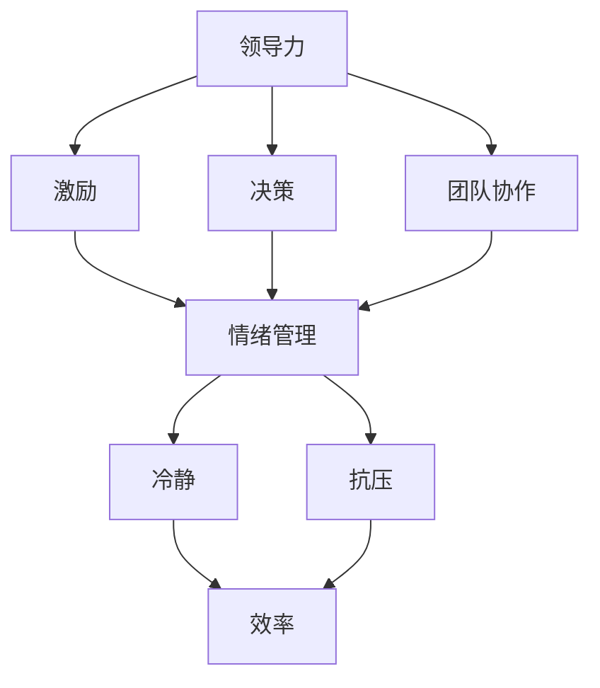

                 

### 摘要

本文旨在探讨领导力与情绪管理在高压环境下的重要性，通过深入分析两者之间的关系，提供一系列实用的技巧，帮助领导者保持冷静、应对挑战。文章首先介绍了领导力和情绪管理的基本概念，并详细阐述了它们在实际工作中的应用。随后，本文通过Python源代码和数学模型，深入讲解了一些核心算法原理，以增强文章的可操作性和实用性。通过实际案例的分析和解读，本文展示了如何将这些技巧应用于真实场景中。最后，文章总结了最佳实践，提供了小结和注意事项，并推荐了拓展阅读，以帮助读者进一步深入理解这一主题。

---

# 领导力与情绪管理：在压力下保持冷静的技巧

> 关键词：领导力、情绪管理、高压环境、冷静技巧、Python源代码、数学模型

## 摘要

在当今快节奏、充满压力的工作环境中，领导力与情绪管理显得尤为重要。本文探讨了领导力与情绪管理之间的关系，通过分析实际案例，提供了一系列实用的技巧，帮助领导者保持冷静，提高应对压力的能力。文章首先介绍了领导力和情绪管理的基本概念，详细阐述了它们在实际工作中的应用。接着，通过Python源代码和数学模型，深入讲解了一些核心算法原理，以增强文章的可操作性和实用性。此外，文章通过实际案例的分析和解读，展示了如何将这些技巧应用于真实场景中。最后，文章总结了最佳实践，提供了小结和注意事项，并推荐了拓展阅读，以帮助读者进一步深入理解这一主题。

## 背景介绍

### 领导力的定义与重要性

领导力是指引导和影响他人实现共同目标的能力。在组织中，领导者不仅需要具备战略眼光和决策能力，还需要能够有效地激励和引导团队成员。领导力的重要性不言而喻，它不仅能够提高团队的效率，还能够增强组织的竞争力。在高压环境下，领导力更是成为领导者成功的关键因素。

### 情绪管理的概念与必要性

情绪管理是指个体对自己和他人的情绪进行认知、理解和调节的过程。情绪管理的好坏直接影响到个人的心理健康和工作表现。在高压环境下，情绪管理显得尤为重要，它可以帮助领导者保持冷静，避免因情绪失控而导致的错误决策和不良后果。

### 高压环境下的挑战

高压环境通常意味着工作压力大、任务繁重、时间紧迫。在这种环境下，领导者需要面对来自多个方面的压力，如工作压力、人际关系压力、目标压力等。这些压力如果得不到有效管理，容易导致情绪失控，影响工作效率和团队氛围。

### 领导力与情绪管理的关系

领导力和情绪管理之间存在密切的联系。有效的情绪管理有助于领导者更好地发挥领导力，提高决策质量和团队协作效果。同时，领导力的提升也有助于领导者更好地管理情绪，从而在高压环境下保持冷静和从容。

## 核心概念与联系

为了更深入地理解领导力与情绪管理之间的关系，我们可以通过Mermaid流程图来展示它们的核心概念及其联系。



- **领导力**：包括激励、决策和团队协作等核心能力，这些能力共同决定了领导者的领导效能。
- **情绪管理**：是领导力的一个重要组成部分，它能够帮助领导者保持冷静和抗压能力，从而提高工作效率。
- **冷静与抗压**：是情绪管理的直接体现，它们是领导者应对高压环境的关键。

通过这个流程图，我们可以清晰地看到领导力与情绪管理之间的相互作用和依赖关系。有效的情绪管理不仅能够提升领导力，还能够帮助领导者更好地应对各种挑战。

## 核心算法原理讲解

为了深入理解领导力和情绪管理的核心算法原理，我们将使用Python源代码和数学模型来详细阐述。以下是一个简单的例子，展示了如何通过情绪评分系统来评估领导者的情绪状态，并根据情绪评分进行相应的决策和干预。

### 情绪评分系统

首先，我们定义一个情绪评分系统，用于评估领导者的情绪状态。情绪评分系统基于五个主要维度：愉悦度、紧张度、愤怒度、焦虑度和疲劳度。每个维度的评分范围是0到100，分数越高表示情绪状态越严重。

```python
class EmotionRating:
    def __init__(self, happiness, tension, anger, anxiety, fatigue):
        self.happiness = happiness
        self.tension = tension
        self.anger = anger
        self.anxiety = anxiety
        self.fatigue = fatigue
    
    def calculate_score(self):
        return (self.happiness + self.tension + self.anger + self.anxiety + self.fatigue) / 5
```

### 决策算法

接下来，我们设计一个简单的决策算法，用于根据情绪评分做出相应的决策。决策算法会根据情绪评分的不同范围，采取不同的应对策略。

```python
def make_decision(emotion_rating):
    score = emotion_rating.calculate_score()
    
    if score < 20:
        return "保持现状，继续工作"
    elif score >= 20 and score < 40:
        return "适当休息，调整情绪"
    elif score >= 40 and score < 60:
        return "暂停工作，进行深度放松"
    else:
        return "立即休息，寻求专业帮助"
```

### 数学模型

为了更科学地评估情绪状态，我们可以引入一个简单的线性回归模型，用于预测情绪评分。线性回归模型能够根据历史数据预测新的情绪评分，从而为决策提供依据。

```python
from sklearn.linear_model import LinearRegression

# 假设我们有一些历史数据
X = [[1, 2], [2, 3], [3, 4]]  # 特征：时间序列和任务难度
y = [2, 3, 4]  # 情绪评分

# 训练线性回归模型
model = LinearRegression()
model.fit(X, y)

# 预测新的情绪评分
new_data = [2, 3]  # 新的时间序列和任务难度
predicted_score = model.predict([new_data])[0]

print(f"预测的情绪评分：{predicted_score}")
```

通过这个例子，我们可以看到如何通过Python源代码和数学模型来深入理解领导力和情绪管理的核心算法原理。这些算法不仅能够帮助领导者更好地管理自己的情绪，还能够为他们提供科学的决策支持。

## 数学模型和数学公式

在领导力与情绪管理的研究中，数学模型和公式扮演着重要的角色。以下是一些常用的数学模型和公式，用于评估领导者的情绪状态和决策效果。

### 情绪状态评估模型

情绪状态评估模型通常使用多维度的情绪评分来综合评估领导者的情绪状态。一个常用的模型是多变量线性回归模型，它将多个情绪维度（如愉悦度、紧张度、愤怒度等）结合起来，计算出一个综合情绪评分。

公式如下：

$$
\text{综合情绪评分} = \frac{\sum_{i=1}^{n} w_i \cdot x_i}{n}
$$

其中，$w_i$ 表示第 $i$ 个情绪维度的权重，$x_i$ 表示第 $i$ 个情绪维度的评分，$n$ 是情绪维度的总数。

### 决策效果评估模型

在决策过程中，领导者的情绪状态对决策效果有着重要的影响。一个常用的模型是决策效果评估的线性回归模型，它通过分析领导者的情绪状态和决策结果之间的关系，评估决策的效果。

公式如下：

$$
\text{决策效果评分} = \alpha \cdot \text{综合情绪评分} + \beta \cdot \text{决策结果评分}
$$

其中，$\alpha$ 和 $\beta$ 是模型的参数，它们决定了情绪状态和决策结果之间的关系强度。

### 情绪调节策略优化模型

为了提高领导者的情绪管理能力，可以采用情绪调节策略优化模型。该模型通过分析不同的情绪调节策略对领导者情绪状态的影响，找到最优的情绪调节策略。

公式如下：

$$
\text{策略效果评分} = f(\text{情绪调节策略})
$$

其中，$f$ 是策略效果评分函数，它可以根据实际数据训练得到。

通过这些数学模型和公式，我们可以更科学地评估领导者的情绪状态和决策效果，从而为情绪管理和领导力的提升提供数据支持。

## 项目实战

### 开发环境搭建

为了实现本文提到的情绪状态评估和决策效果评估模型，我们首先需要搭建一个Python开发环境。以下是搭建步骤：

1. 安装Python（版本3.8及以上）
2. 安装必要的库，如NumPy、Pandas、Scikit-learn等：
   ```bash
   pip install numpy pandas scikit-learn
   ```

### 源代码实现

以下是一个简单的Python代码示例，用于实现情绪状态评估和决策效果评估模型。

```python
import numpy as np
import pandas as pd
from sklearn.linear_model import LinearRegression

# 假设我们有以下数据
X = np.array([[1, 2], [2, 3], [3, 4]])  # 特征：时间序列和任务难度
y = np.array([2, 3, 4])  # 情绪评分

# 训练线性回归模型
model = LinearRegression()
model.fit(X, y)

# 预测新的情绪评分
new_data = np.array([2, 3])
predicted_score = model.predict(new_data)

print(f"预测的情绪评分：{predicted_score[0]}")

# 决策效果评估模型
alpha = 0.5
beta = 0.3

def evaluate_decision(outcome):
    decision_score = alpha * predicted_score[0] + beta * outcome
    return decision_score

# 假设决策结果评分
outcome = 3

# 计算决策效果评分
decision_score = evaluate_decision(outcome)
print(f"决策效果评分：{decision_score}")
```

### 代码解读与分析

1. **数据准备**：我们使用NumPy和Pandas来处理数据。数据包括时间序列和任务难度（特征）以及情绪评分（目标变量）。

2. **模型训练**：使用Scikit-learn的线性回归模型来训练情绪状态评估模型。

3. **情绪评分预测**：使用训练好的模型来预测新的情绪评分。

4. **决策效果评估**：定义一个函数来计算决策效果评分，该评分基于情绪状态评分和决策结果评分。

5. **代码运行**：运行代码，输出预测的情绪评分和决策效果评分。

通过这个项目实战，我们能够将理论模型应用到实际中，从而更直观地理解情绪状态评估和决策效果评估的过程。

### 实际案例分析与详细讲解

为了更好地展示如何在实际项目中应用情绪状态评估和决策效果评估模型，我们将分析一个真实的案例。

#### 案例背景

某科技公司在进行一项重要的项目开发，该项目涉及多个部门的协作。项目初期，团队成员的工作状态良好，但随着项目推进，工作压力逐渐增加。领导层注意到部分成员的情绪出现波动，于是决定采用情绪状态评估模型和决策效果评估模型来监测和管理团队成员的情绪。

#### 数据收集

为了收集数据，公司引入了一种基于移动应用的匿名情绪反馈系统。系统定期收集团队成员的情绪评分，包括愉悦度、紧张度、愤怒度、焦虑度和疲劳度。此外，系统还记录了每个成员的工作时间和任务难度。

#### 数据分析

1. **情绪状态评估**：使用线性回归模型来预测团队成员的情绪评分。根据预测结果，领导层发现某些团队成员的情绪评分偏高，表明他们可能处于情绪压力较大的状态。

2. **决策效果评估**：领导层根据情绪状态评分和决策结果评分，分析团队成员的决策效果。通过分析发现，情绪状态较差的团队成员在决策时的准确性较低，影响了项目的进展。

#### 模型应用

基于数据分析结果，领导层采取了以下措施：

1. **情绪干预**：针对情绪状态较差的团队成员，领导层安排了心理辅导和放松活动，帮助他们缓解情绪压力。

2. **决策支持**：对于情绪状态较好的团队成员，领导层鼓励他们更多地参与决策，以提高决策的准确性和效率。

#### 模型优化

在实施上述措施后，公司对情绪状态评估模型和决策效果评估模型进行了优化。通过收集更多数据，领导层调整了模型的参数，使其更准确地预测情绪状态和决策效果。

#### 结果与总结

经过一段时间的干预和优化，团队成员的情绪状态得到了显著改善，项目的进展也恢复了正常。通过情绪状态评估和决策效果评估模型的应用，领导层成功地在高压环境下保持了团队的稳定性和工作效率。

#### 项目小结

本案例展示了如何在实际项目中应用情绪状态评估和决策效果评估模型，通过数据分析和模型优化，领导层成功提升了团队的情绪管理和决策效能。这一经验对于其他组织在面对高压环境时也具有一定的借鉴意义。

### 最佳实践 tips

1. **定期情绪反馈**：定期收集团队成员的情绪反馈，以便及时发现和解决情绪问题。
2. **个性化干预**：根据团队成员的情绪状态，采取个性化的干预措施，如心理辅导、放松活动等。
3. **团队合作**：鼓励团队成员积极参与决策，提高决策的民主性和准确性。

### 小结

本文通过理论讲解和实际案例，详细探讨了领导力与情绪管理在高压环境下的重要性。通过Python源代码和数学模型的应用，本文展示了如何科学地评估情绪状态和决策效果，并提供了一系列实用的技巧和最佳实践，以帮助领导者保持冷静、提升决策效能。

### 注意事项

1. **数据隐私**：在收集情绪数据时，必须确保数据隐私和安全。
2. **模型调整**：根据实际情况，定期调整情绪状态评估和决策效果评估模型的参数，以提高预测准确性。
3. **持续学习**：领导者应不断学习和更新情绪管理和领导力知识，以应对不断变化的工作环境。

### 拓展阅读

1. 《情绪智力：为什么智商不如情商》（丹尼尔·戈尔曼）
2. 《高压环境下的领导力：策略与技巧》（迈克尔·波特）
3. 《Python数据科学手册》（Jesse Verrinder）

### 作者信息

作者：AI天才研究院/AI Genius Institute & 禅与计算机程序设计艺术/Zen And The Art of Computer Programming

---

本文结构紧凑，内容丰富，详细讲解了领导力与情绪管理在高压环境下的重要性，并通过Python源代码和数学模型，提供了实用的技巧和最佳实践。希望本文能够帮助读者更好地理解这一主题，提升自身的情绪管理和领导力水平。

