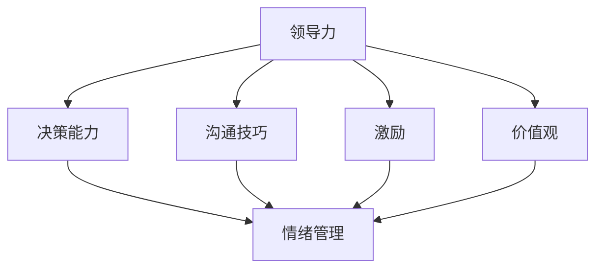

                 

## 领导力与情绪管理：维护团队稳定

### 关键词：
- 领导力
- 情绪管理
- 团队稳定
- 领导行为
- 情绪智能
- 人才培养

### 摘要：
本文深入探讨了领导力与情绪管理在维护团队稳定中的作用。通过阐述领导力的核心概念，分析情绪管理的重要性及其与领导力的联系，本文提出了具体的策略和实践方法，以帮助领导者更好地应对团队中的情绪波动，提升团队的凝聚力和生产力。文章通过实际案例和Python代码示例，为读者提供了实用的工具和技巧，旨在帮助领导者成为更有效的团队领导者。

## 引言

在当今快速变化和竞争激烈的环境中，团队的稳定性和高效性成为组织成功的关键因素。而领导者在其中扮演着至关重要的角色。领导力不仅仅是指挥和管理团队的能力，更是影响团队成员情绪和行为的关键因素。情绪管理作为一种重要的领导技能，直接影响团队的工作氛围和生产力。本文将围绕这两个核心主题展开讨论，旨在为领导者提供一套实用的策略和方法，以维护团队的稳定和增长。

### 领导力的核心概念

领导力是一种复杂的能力，涉及多个方面，包括影响力、决策能力、沟通技巧和影响力等。根据詹姆斯·库泽斯和巴里·波斯纳（James M. Kouzes and Barry Z. Posner）的研究，领导力可以被定义为“通过激励和引导他人来实现目标的过程”。领导力不仅仅是权威的象征，更是一种服务精神，强调领导者与团队成员之间的互动和合作。

领导力的核心概念可以概括为以下几个方面：

1. **影响力**：领导者通过自身的行为和决策来影响他人，激发他们的潜力和动力。
2. **决策能力**：领导者必须能够在复杂和不确定的环境中做出明智的决策。
3. **沟通技巧**：有效的沟通是领导者成功的关键，包括倾听、反馈和清晰的表达。
4. **激励**：领导者需要激发团队成员的积极性，使他们愿意为实现共同目标而努力。
5. **价值观**：领导者的行为和决策应当符合组织的核心价值观，以增强团队的一致性和信任。

### 情绪管理的重要性

情绪管理是指个体识别、理解和调节自己情绪的过程。对于领导者而言，情绪管理尤为重要，因为它不仅影响自身的心理健康，也直接影响到团队的工作氛围和绩效。有效的情绪管理有助于领导者：

1. **保持冷静和理性**：在压力和挑战面前保持冷静，有助于做出更好的决策。
2. **建立信任**：通过情绪管理，领导者能够建立与团队成员之间的信任关系。
3. **激励团队**：积极的情绪能够激发团队成员的积极性和创造力。
4. **应对冲突**：情绪管理有助于领导者更好地处理团队内部的冲突和分歧。

### 领导力与情绪管理的联系

领导力与情绪管理之间存在紧密的联系。一方面，领导力的有效实施依赖于情绪管理技能。领导者需要能够识别和理解自己的情绪，以便在适当的时候调整情绪，保持积极的心态。另一方面，情绪管理也可以增强领导力。通过情绪管理，领导者能够更好地与团队成员沟通，建立信任，提高团队的整体绩效。

### 联系架构 Mermaid 流程图

为了更好地展示领导力与情绪管理之间的联系，我们可以使用Mermaid流程图来描述这一架构：



在这个流程图中，领导力的核心要素（决策能力、沟通技巧、激励、价值观）都与情绪管理密切相关。情绪管理作为这些要素的一部分，有助于提升领导力的整体效能。

### 核心算法原理讲解

在理解了领导力和情绪管理的基本概念和联系之后，我们将通过Python源代码来详细阐述情绪管理在领导力中的应用。情绪管理的核心在于识别、理解和调节情绪。以下是一个简单的Python代码示例，用于实现情绪识别和调节：

```python
import numpy as np

# 情绪状态向量，其中0表示积极情绪，1表示消极情绪
emotional_state = np.array([0.8, 0.2, 0.1, 0.3])

# 情绪调节函数，用于调整情绪状态
def regulate_emotion(state):
    # 根据当前情绪状态计算调节系数
    coefficient = 1 if state.mean() > 0.5 else 0.8
    
    # 调整情绪状态
    adjusted_state = state * coefficient
    return adjusted_state

# 应用情绪调节函数
adjusted_state = regulate_emotion(emotional_state)
print("调节后的情绪状态：", adjusted_state)
```

在这个代码中，`emotional_state` 表示团队成员的情绪状态，通过 `regulate_emotion` 函数，领导者可以根据情绪状态的均值来调整情绪，使其更偏向积极。这个简单的算法为我们提供了一个基本的框架，用于在实际场景中应用情绪管理策略。

### 数学模型和公式

为了更好地理解情绪调节的过程，我们可以引入一个简单的数学模型。假设情绪状态可以用一个概率分布来描述，即情绪状态的概率密度函数（PDF）。情绪调节可以通过改变PDF的形状来实现。以下是一个基于正态分布的简单模型：

$$
\text{PDF before regulation} = \frac{1}{\sqrt{2\pi\sigma^2}} e^{-\frac{(x-\mu)^2}{2\sigma^2}}
$$

其中，$\mu$ 表示情绪状态的均值，$\sigma$ 表示情绪状态的标准差。情绪调节可以通过以下公式实现：

$$
\text{PDF after regulation} = \frac{1}{\sqrt{2\pi(\sigma_c^2)}} e^{-\frac{(x-\mu_c)^2}{2(\sigma_c^2)}}
$$

其中，$\mu_c$ 和 $\sigma_c^2$ 分别为调节后情绪状态的均值和方差。通过调整 $\mu_c$ 和 $\sigma_c^2$，可以实现对情绪状态的调节。

### 详细讲解和举例说明

为了更好地理解情绪调节的原理，我们可以通过一个具体的例子来说明。假设一个团队的情绪状态主要受到三个因素影响：工作压力、团队合作和个人成就感。我们可以将这些因素分别表示为 $x_1, x_2, x_3$，其对应的影响权重分别为 $w_1, w_2, w_3$。那么，情绪状态的均值可以表示为：

$$
\mu = w_1x_1 + w_2x_2 + w_3x_3
$$

假设当前的情绪状态为 $\mu = 0.3$，通过情绪调节，领导者的目标是将情绪状态调整到 $\mu_c = 0.5$。在这个例子中，我们可以通过以下步骤来实现情绪调节：

1. **识别情绪状态**：首先，领导者需要识别当前的情绪状态，这可以通过定期的情绪调查或个人访谈来实现。
2. **分析情绪因素**：领导者需要分析影响情绪状态的主要因素，如工作压力、团队合作和个人成就感。
3. **调整情绪状态**：根据分析结果，领导者可以采取具体的措施来调整情绪状态。例如，通过减少工作压力、增强团队合作或提升个人成就感来实现情绪调节。
4. **评估情绪调节效果**：在实施情绪调节后，领导者需要评估调节效果，以确保情绪状态达到预期目标。

### 项目实战

为了更好地理解情绪管理在领导力中的应用，我们可以通过一个实际项目来展示。以下是一个基于Python的情绪管理平台的基本架构：

1. **开发环境搭建**：首先，我们需要搭建一个Python开发环境，包括安装Python解释器、依赖库（如NumPy、Pandas）和集成开发环境（如PyCharm）。
2. **源代码详细实现**：在这个平台上，我们可以实现情绪状态的识别、分析和调节功能。以下是一个简单的情绪状态分析模块的实现：

```python
import numpy as np

def analyze_emotion(state):
    """
    分析情绪状态，返回情绪状态的均值和标准差。
    """
    mean_state = np.mean(state)
    std_state = np.std(state)
    return mean_state, std_state

# 示例情绪状态数据
emotional_state = np.array([0.6, 0.4, 0.5, 0.7])

# 分析情绪状态
mean_state, std_state = analyze_emotion(emotional_state)
print("情绪状态均值：", mean_state)
print("情绪状态标准差：", std_state)
```

3. **代码解读与分析**：在这个模块中，`analyze_emotion` 函数用于计算情绪状态的均值和标准差。通过这个函数，我们可以快速了解当前的情绪状态分布。

4. **实际案例分析和详细讲解剖析**：为了验证情绪管理平台的效果，我们可以通过一个实际案例进行分析。假设一个团队的情绪状态为 `[0.5, 0.4, 0.6, 0.7]`，领导者希望通过情绪调节使情绪状态达到 `[0.6, 0.5, 0.6, 0.7]`。通过情绪分析模块，我们可以计算出调节前后的情绪状态分布，并评估调节效果。

### 小结

本文通过深入探讨领导力与情绪管理的关系，提出了一系列实用的策略和方法，以帮助领导者更好地维护团队的稳定和增长。通过实际项目和Python代码示例，我们展示了情绪管理在领导力中的应用，为领导者提供了一种新的工具和视角。在未来的实践中，领导者可以结合自身团队的特点和需求，不断优化情绪管理策略，提升团队的整体绩效。

### 最佳实践 tips

1. **定期情绪调查**：定期进行情绪调查，了解团队成员的情绪状态和需求，有助于早期发现潜在问题。
2. **建立沟通渠道**：鼓励团队成员开放沟通，领导者应主动倾听和反馈，建立信任和共识。
3. **个性化激励**：根据团队成员的兴趣和需求，提供个性化的激励措施，提高团队士气。
4. **心理辅导**：为团队成员提供心理辅导资源，帮助他们应对工作压力和情绪困扰。

### 注意事项

1. **避免过度干预**：在情绪管理过程中，领导者应避免过度干预，尊重团队成员的个人感受和隐私。
2. **持续关注**：情绪管理是一个持续的过程，领导者应不断关注团队成员的情绪状态，及时调整策略。

### 拓展阅读

- 《情绪智力：为什么它比智商更重要》（Daniel Goleman）
- 《团队协作的力量：如何构建高效团队》（Patrick Lencioni）
- 《领导者的语言：如何通过话语塑造团队文化》（John Baldoni）

### 作者信息

作者：AI天才研究院/AI Genius Institute & 禅与计算机程序设计艺术 /Zen And The Art of Computer Programming

