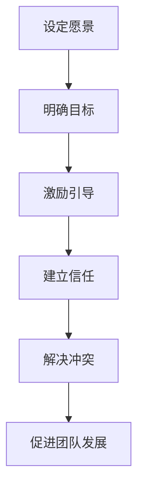
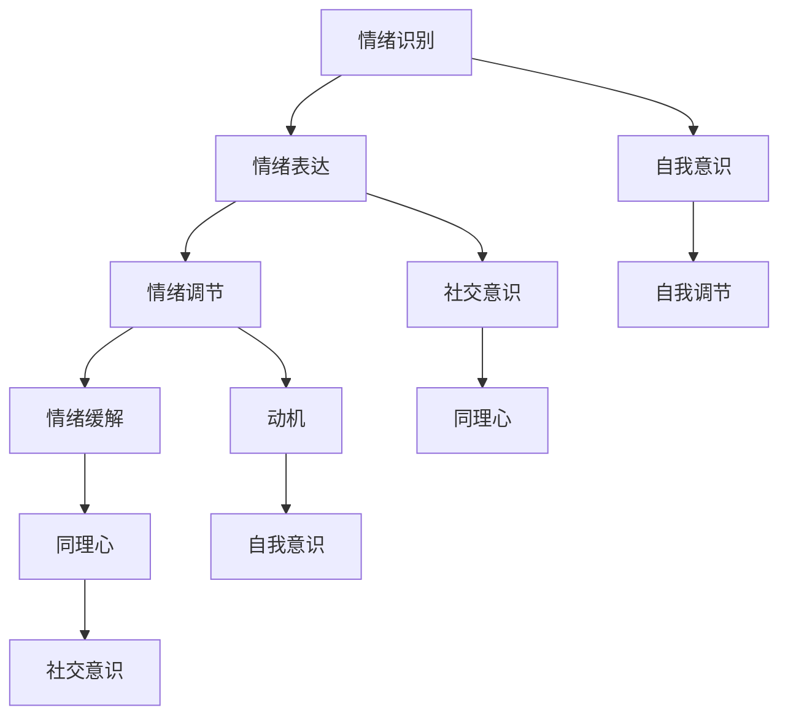
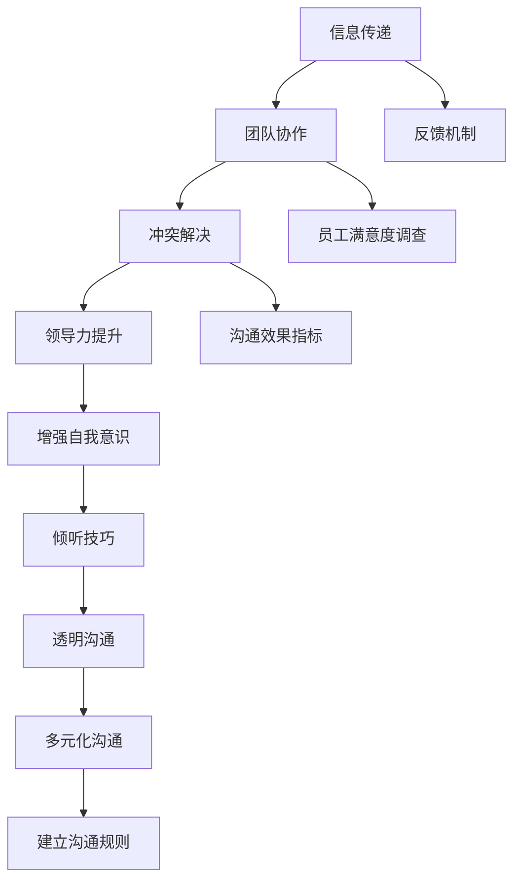
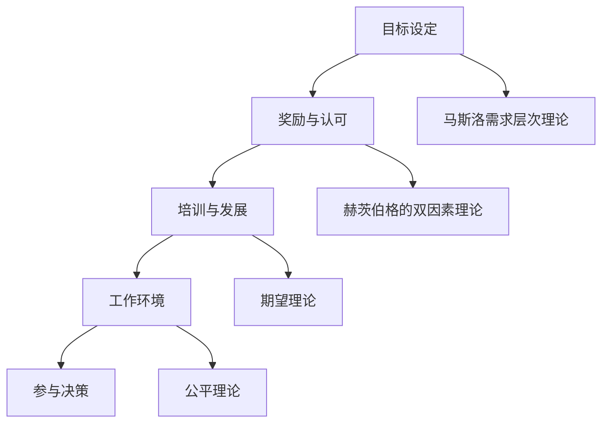
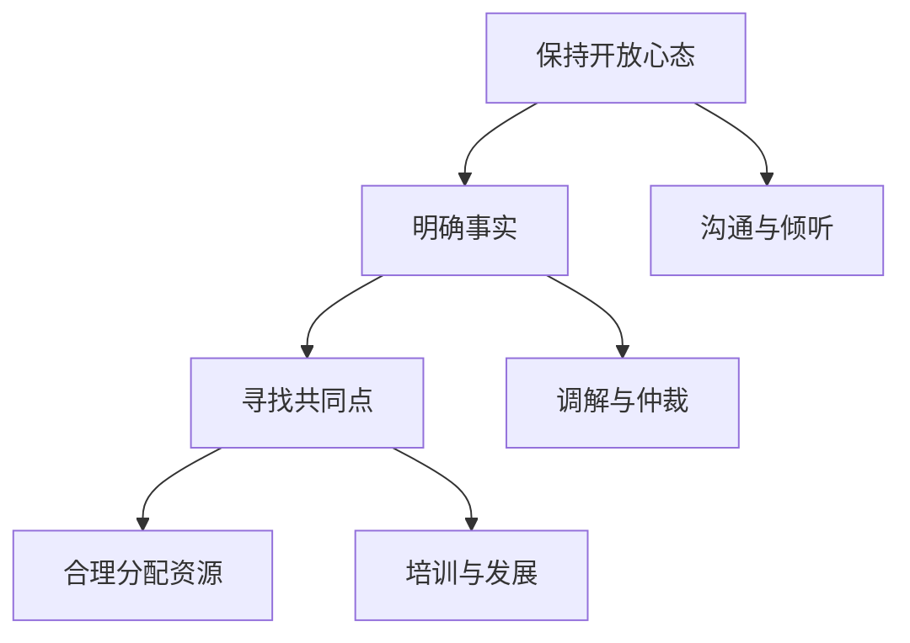
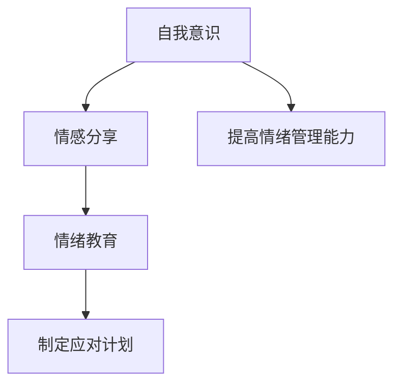
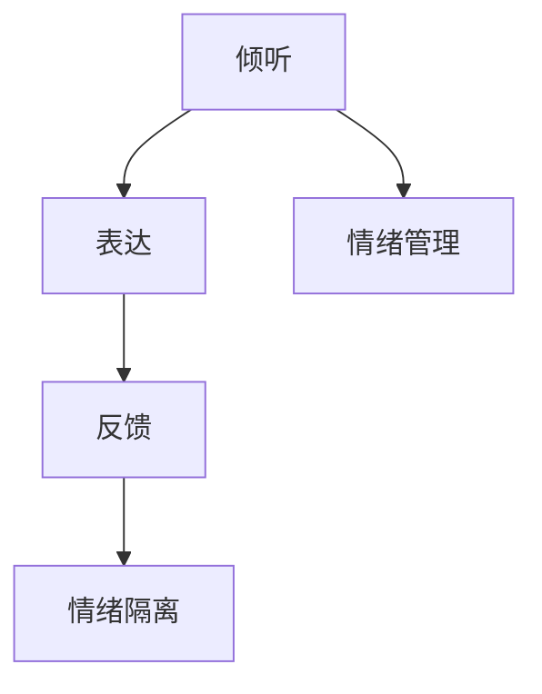
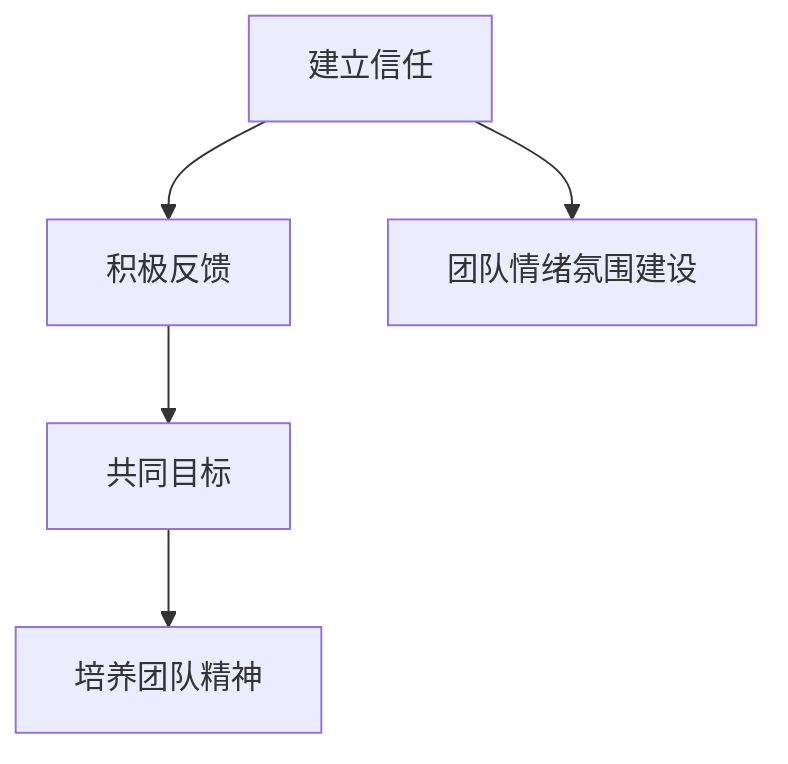
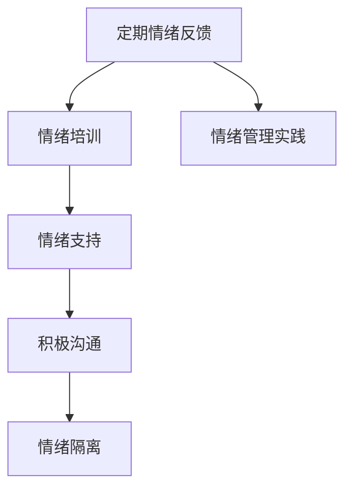

                 

### 引言

在当今快速发展的科技时代，领导力与情绪管理已成为维持团队稳定与促进组织成功的关键要素。有效的领导力不仅能够激发团队成员的潜力，提高团队的整体绩效，还能够有效应对复杂多变的工作环境和挑战。同样，情绪管理在领导过程中也起着至关重要的作用，它不仅关乎个人心理健康，更直接影响到团队氛围、工作效率和团队合作。

本文将以《领导力与情绪管理：维护团队稳定的关键》为标题，系统地探讨这两个核心主题。我们将首先定义领导力的基本概念，并分析其在团队中的作用与核心要素。接着，我们将深入研究情绪管理的定义、重要性以及理论基础。随后，文章将转向实践层面，探讨如何通过建立有效的沟通机制、激励团队与员工、解决冲突与化解矛盾来提升领导力。此外，领导力与情绪管理的自我提升也是至关重要的，文章将提供相关的策略和建议。最后，我们将详细阐述情绪管理在团队中的应用，并提供一系列实用的工具与资源，以帮助读者更好地理解和实践这些关键技能。

通过系统的分析和实践分享，本文旨在帮助读者全面了解领导力与情绪管理的核心内容，提升个人领导力，优化团队管理，从而实现组织的高效运营和持续发展。

### 关键词

- **领导力**
- **情绪管理**
- **团队稳定**
- **沟通机制**
- **激励策略**
- **冲突解决**
- **自我提升**
- **组织绩效**

### 摘要

本文旨在探讨领导力与情绪管理在维护团队稳定中的关键作用。首先，我们定义了领导力的基本概念，并分析了其在团队中的作用和核心要素。接着，我们深入探讨了情绪管理的定义、重要性以及理论基础。随后，文章转向实践层面，详细讨论了如何通过有效的沟通机制、激励策略和冲突解决方法来提升领导力。最后，我们探讨了情绪管理在团队中的应用，并提供了一系列实用的工具与资源。通过系统的分析和实践分享，本文旨在帮助读者提升个人领导力，优化团队管理，实现组织的高效运营和持续发展。

## 第一部分：领导力基础

### 第1章：领导力的定义与作用

领导力，是一种激励和引导他人共同实现目标的能力。在组织管理中，领导力扮演着至关重要的角色，它不仅影响团队的表现，还直接关系到组织的成功与否。首先，我们需要明确领导力的定义，以及它如何在团队中发挥作用。

#### 1.1 领导力的定义

领导力并不仅仅是指挥和控制，它是一种激励他人、建立信任、创造共同愿景的能力。根据哈佛商学院的领导力教授约翰·科特（John Kotter）的定义，领导力是“影响他人为了共同的目标而奋斗的一种过程”。这种过程涉及建立信任、激发潜力、解决冲突和推动变革。

#### 1.2 领导力在团队中的作用

领导力在团队中的作用是多方面的，包括：

- **激励与引导**：有效的领导者能够激励团队成员，引导他们朝着共同的目标前进。通过设定明确的目标和提供正面的反馈，领导者可以激发团队成员的积极性和创造力。

- **建立信任**：信任是团队合作的基础。领导者通过透明沟通、公正决策和诚实行为，建立和维护团队成员之间的信任关系。

- **解决冲突**：在团队中，冲突是不可避免的。领导者需要具备解决冲突的能力，以保持团队的和谐和高效运作。

- **促进团队发展**：领导者不仅仅是管理者，更是团队的发展推动者。他们通过培养团队成员的能力，推动团队的持续成长。

#### 1.3 领导力的核心要素

领导力的核心要素包括：

- **权威与信任**：领导者需要具备一定的权威，以便指导和影响团队成员。同时，领导者必须赢得团队成员的信任，这是领导力的基础。

- **愿景与目标**：领导者需要有一个清晰的愿景，并能够将这一愿景转化为具体的、可执行的目标。

- **沟通与协作**：有效的沟通和协作能力是领导力的关键要素。领导者需要能够清晰地传达信息，并与团队成员有效协作。

- **决策与执行**：领导者需要做出明智的决策，并确保这些决策能够得到有效执行。

下面是领导力影响的Mermaid流程图：



通过这个流程图，我们可以看到领导力如何通过一系列关键步骤影响团队的表现和目标实现。

#### 1.4 案例分析

例如，在谷歌公司，领导力被视为企业文化的重要组成部分。谷歌的创始人谢尔盖·布林（Sergey Brin）和拉里·佩奇（Larry Page）通过授权和鼓励创新，营造了一个充满活力和创造力的工作环境。他们通过设立明确的愿景和目标，激发员工的工作热情和创造力。同时，他们通过透明的沟通和公正的决策，赢得了员工的信任和支持。

总之，领导力是一种复杂而多维度的能力，它需要领导者具备多个方面的素质和技能。通过明确领导力的定义、理解其作用和核心要素，我们可以更好地应用领导力，提升团队绩效和组织效率。

### 第2章：情绪管理的概念与理论

情绪管理，是领导者必须掌握的一项关键技能。情绪管理不仅关乎个人的心理健康，更直接影响到团队的整体表现和氛围。因此，了解情绪管理的定义、重要性及其理论基础，对于提升领导力至关重要。

#### 2.1 情绪管理的定义

情绪管理，是指个体通过认知、行为和情感调节来管理和调整自身情绪的过程。具体来说，情绪管理包括情绪识别、情绪表达、情绪调节和情绪缓解。情绪识别，是指个体能够感知和理解自己的情绪状态；情绪表达，是指个体能够以适当的方式表达自己的情绪；情绪调节，是指个体通过认知和行为策略来调整情绪状态；情绪缓解，是指个体通过特定方法减轻负面情绪的影响。

#### 2.2 情绪管理的重要性

情绪管理的重要性体现在以下几个方面：

- **个人层面**：良好的情绪管理有助于提升个人的心理健康和幸福感。通过情绪管理，个体可以更好地应对压力和挑战，提高生活质量。

- **团队层面**：在团队中，领导者的情绪状态会直接影响到团队成员的情绪。如果领导者能够有效管理自己的情绪，保持积极乐观的态度，这将有助于营造积极向上的团队氛围，提高团队协作效率。

- **组织层面**：情绪管理对于组织的整体绩效和稳定性具有重要影响。领导者通过情绪管理，可以减少内部冲突，增强团队的凝聚力和协作性，从而提升组织的整体表现。

#### 2.3 情绪管理的理论基础

情绪管理的理论基础包括情绪智力、积极心理学和认知行为理论等。

- **情绪智力（Emotional Intelligence）**：情绪智力，是指个体识别、理解、管理和调节自身情绪，以及识别、理解和影响他人情绪的能力。根据戈尔曼（Daniel Goleman）的研究，情绪智力包括自我意识、自我调节、社交意识、动机和同理心等五个维度。情绪智力对领导力有重要影响，领导者通过提高情绪智力，可以更好地应对各种挑战和复杂局面。

- **积极心理学（Positive Psychology）**：积极心理学关注个体的积极情绪和优势，通过研究积极情感、积极特质和积极行为，探索如何提升个体和群体的幸福感。领导者通过积极心理学的方法，可以培养积极情绪，激发团队成员的内在动力，提高团队的士气和工作效率。

- **认知行为理论（Cognitive Behavioral Theory）**：认知行为理论认为，个体的情绪和行为受到其认知过程的影响。通过认知行为疗法，个体可以识别和改变消极的认知模式，从而改善情绪和行为。在领导力中，认知行为理论可以帮助领导者识别和调整消极的情绪认知，提升情绪管理水平。

下面是情绪管理理论的Mermaid流程图：



通过这个流程图，我们可以清晰地看到情绪管理各个组成部分及其相互关系。

#### 2.4 情绪管理在领导力中的应用

在领导力中，情绪管理具有以下几个方面的应用：

- **自我管理**：领导者需要通过情绪管理，保持自我冷静和理智，避免因情绪波动而做出错误决策。

- **团队管理**：领导者通过情绪管理，营造积极的团队氛围，激发团队成员的积极性和创造力。

- **冲突解决**：在冲突发生时，领导者需要通过情绪管理，保持冷静和客观，有效地解决冲突。

- **激励员工**：领导者通过情绪管理，激发员工的内在动力，提高员工的工作满意度和绩效。

总之，情绪管理是领导力的重要组成部分，领导者通过有效管理自身和团队成员的情绪，可以提升团队绩效，实现组织目标。

### 第3章：建立有效的沟通机制

在领导力的实践中，沟通机制的作用至关重要。有效的沟通不仅能够增强团队协作，提高工作效率，还能增强团队成员之间的信任和凝聚力。本节将讨论如何建立有效的沟通机制，包括沟通的重要性、有效沟通的评估方法以及提升沟通能力的策略。

#### 3.1 沟通的重要性

沟通是领导力的核心要素之一，其重要性体现在以下几个方面：

- **信息传递**：沟通是信息传递的主要途径。有效的沟通可以确保信息准确无误地传递，避免误解和错误。

- **团队协作**：良好的沟通有助于团队成员更好地理解彼此的工作职责和目标，从而实现高效的协作。

- **冲突解决**：通过开放和透明的沟通，团队成员可以表达自己的观点和需求，有助于及时发现和解决潜在冲突。

- **领导力提升**：领导者通过有效的沟通，可以展示自己的领导能力和决策力，增强团队成员对领导者的信任和尊重。

#### 3.2 沟通的有效性评估

评估沟通的有效性是建立有效沟通机制的重要一步。以下是一些常用的评估方法：

- **反馈机制**：通过定期的团队反馈会议，收集团队成员对沟通效果的反馈，了解沟通中的问题和改进空间。

- **员工满意度调查**：通过满意度调查，评估员工对沟通渠道和沟通频率的满意度，发现潜在问题。

- **沟通效果指标**：如信息传达准确率、决策效率、团队协作效果等，通过这些指标评估沟通的实际效果。

#### 3.3 提高沟通能力的策略

为了提高沟通能力，领导者可以采取以下策略：

- **增强自我意识**：领导者需要认识到自己的沟通风格和潜在弱点，通过自我反思和培训，提升沟通技巧。

- **倾听技巧**：有效的沟通不仅仅是表达，更重要的是倾听。领导者需要学会倾听团队成员的意见和建议，理解和尊重不同观点。

- **透明沟通**：领导者应该保持沟通的透明度，避免信息不对称和误解。通过公开透明的方式分享信息，增强团队的信任感。

- **多元化沟通**：采用多样化的沟通方式，如面对面交流、电子邮件、即时通讯工具等，满足不同团队成员的沟通需求。

- **建立沟通规则**：制定明确的沟通规则和流程，确保沟通的规范性和效率。

下面是一个关于沟通机制的Mermaid流程图：



通过这个流程图，我们可以看到沟通机制如何通过各个环节相互作用，提升团队的整体绩效。

总之，建立有效的沟通机制是领导力的重要组成部分。领导者需要通过不断的学习和实践，提升沟通能力，确保信息的有效传递，促进团队协作，从而实现组织的目标。

### 第4章：激励团队与员工

激励是领导者的重要职责之一，它直接影响到团队成员的积极性和工作效率。有效的激励机制不仅能够提升员工的满意度和忠诚度，还能激发团队的创造力和创新能力。本章将探讨激励理论、激励策略以及实际案例分析，帮助领导者更好地理解和应用激励机制。

#### 4.1 激励理论

激励理论是理解员工行为和动机的重要基础。以下是一些经典的激励理论：

- **马斯洛需求层次理论**：马斯洛认为，人的需求可以分为五个层次，从基本的生理需求到最高级的自我实现需求。领导者可以通过满足员工的这些需求来激励他们。

- **赫茨伯格的双因素理论**：赫茨伯格将工作因素分为激励因素和保健因素。激励因素与工作本身相关，如成就感、认可等，而保健因素与工作环境相关，如薪资、工作条件等。领导者需要同时关注这两个方面，以实现有效的激励。

- **期望理论**：维克托·弗鲁姆提出的期望理论认为，员工的激励水平取决于他们对目标实现可能性的期望。领导者可以通过设定明确的目标和提供必要的支持来提高员工的期望值。

- **公平理论**：亚当斯的公平理论认为，员工会将自己的投入和回报与他人的投入和回报进行比较，以判断自己是否受到了公平对待。领导者需要确保激励机制是公平的，避免产生不公平感。

#### 4.2 激励策略

为了有效激励团队和员工，领导者可以采取以下策略：

- **目标设定**：领导者需要与员工共同设定具有挑战性但可实现的目标，并提供明确的方向和指导。

- **奖励与认可**：通过奖励和认可来表彰员工的成就和努力，如奖金、晋升、荣誉称号等，增强员工的积极性和归属感。

- **培训与发展**：提供员工培训和职业发展机会，满足员工自我实现的需求，提高员工的技能和知识水平。

- **工作环境**：创造一个良好的工作环境，包括合理的工作条件、团队合作氛围和开放的沟通渠道，以提升员工的工作满意度和忠诚度。

- **参与决策**：鼓励员工参与决策过程，增加他们的责任感和归属感，提高工作积极性。

下面是一个关于激励机制的Mermaid流程图：



通过这个流程图，我们可以看到各种激励策略如何相互关联，共同作用于员工的动机和行为。

#### 4.3 激励实践案例分析

以下是一个激励实践案例：

某科技公司为了激励员工，推出了一个“创新挑战”项目。项目鼓励员工提出创新的想法和解决方案，并设置了丰厚的奖金和公开表彰环节。该项目得到了员工的热烈响应，许多员工积极参与，提出了许多具有创新性的方案。通过这一项目，公司不仅激发了员工的创造力和创新精神，还提高了员工的工作满意度和忠诚度。

总之，激励团队与员工是领导力的关键组成部分。领导者需要结合激励理论，运用多种激励策略，以激发员工的积极性和创造力，实现组织的目标。

### 第5章：解决冲突与化解矛盾

在团队协作过程中，冲突与矛盾是不可避免的。有效的冲突解决与矛盾化解是维护团队稳定、提高工作效率和促进团队发展的重要手段。本章将探讨冲突的类型、原因、管理原则和方法，并通过实际案例进行分析，提供实用的解决策略。

#### 5.1 冲突的类型与原因

冲突可以分为以下几种类型：

- **目标冲突**：当团队成员对项目的目标或优先级有不同的看法时，会产生目标冲突。
- **价值观冲突**：团队成员在价值观或信念上存在差异，可能导致冲突。
- **资源冲突**：当团队成员争夺有限资源，如时间、资金、人力等时，会产生资源冲突。
- **沟通冲突**：由于沟通不畅或误解导致的冲突。

冲突的原因主要包括：

- **沟通不畅**：团队成员之间缺乏有效的沟通，导致信息传递不畅或误解。
- **资源分配不公**：资源分配不合理，导致部分团队成员感到不公平。
- **角色职责不清**：团队成员对各自的职责和角色理解不一致，导致工作冲突。
- **个人性格与风格差异**：团队成员的性格和沟通风格不同，容易产生冲突。

#### 5.2 冲突管理的原则与方法

有效的冲突管理需要遵循以下原则：

- **保持开放心态**：领导者应鼓励团队成员表达观点，保持开放和包容的态度，避免压制不同意见。
- **明确事实**：在解决冲突时，应基于事实和客观数据，而不是主观臆断。
- **寻找共同点**：寻找冲突双方的利益共同点，通过协商达成共识。
- **合理分配资源**：确保资源分配公平合理，避免因资源不足而产生的冲突。

冲突管理的方法包括：

- **沟通与倾听**：通过有效沟通，了解冲突双方的立场和需求，寻找解决方案。
- **调解与仲裁**：当冲突无法通过协商解决时，领导者可以充当调解者或仲裁者，提供中立的意见和决策。
- **培训与发展**：通过培训提高团队成员的沟通和协作能力，减少冲突发生的可能性。

下面是一个关于冲突管理的Mermaid流程图：



通过这个流程图，我们可以看到冲突管理的主要步骤和原则。

#### 5.3 冲突解决的案例分析

以下是一个冲突解决的案例分析：

某软件开发团队在项目进展过程中出现了严重的沟通不畅和目标冲突。团队成员对项目的优先级和进度安排存在分歧，导致工作进度滞后。团队领导者通过召开公开会议，邀请所有成员参与讨论，听取了不同观点，并基于项目的实际需求重新制定了目标。同时，团队领导者还提供了资源支持，确保团队成员能够按照新的计划高效工作。通过这一系列措施，团队最终解决了冲突，项目进度恢复正常。

总之，解决冲突与化解矛盾是团队管理中不可或缺的一部分。领导者需要掌握有效的冲突管理原则和方法，通过积极沟通、合理分配资源、调解仲裁和培训发展等措施，维护团队的稳定和高效运作。

### 第6章：领导力的自我提升

领导力的提升不仅需要外部的培训和指导，更需要领导者自身的自我提升。通过自我认知、自我管理和持续学习，领导者可以不断提升自己的领导能力，更好地应对复杂多变的工作环境和挑战。本章将探讨领导力的自我提升策略，包括自我认知、自我管理、自我成长与持续学习的方法和技巧。

#### 6.1 自我认知

自我认知是领导力自我提升的基础。领导者需要深入了解自己的性格、价值观、优势和不足，以便更好地发挥领导力。以下是一些自我认知的方法：

- **自我反思**：定期进行自我反思，回顾自己的行为和决策，分析成功和失败的原因，识别自己的优点和需要改进的地方。
- **反馈机制**：通过他人的反馈，了解自己在团队中的表现和影响，识别自己的盲点和不足。
- **心理测评**：通过心理测评工具，如MBTI（迈尔斯-布里格斯类型指标）和DISC（行为风格测评），了解自己的性格类型和行为倾向。

通过自我认知，领导者可以更清楚地了解自己的优势和不足，制定个性化的提升计划。

#### 6.2 自我管理

自我管理是领导力的重要组成部分。领导者需要学会自我管理，包括情绪管理、时间管理和目标管理。以下是一些自我管理的策略：

- **情绪管理**：领导者需要学会调节自己的情绪，保持冷静和理智，避免因情绪波动而做出错误决策。可以通过冥想、锻炼和放松技巧来管理情绪。
- **时间管理**：领导者需要合理安排时间，优先处理重要和紧急的任务，避免拖延和浪费时间。可以通过时间管理工具和技巧，如优先级矩阵和番茄工作法，提高时间利用效率。
- **目标管理**：领导者需要设定明确的目标，制定可行的计划，并跟踪进度，确保目标的实现。可以通过目标设定工具和技巧，如SMART（具体、可衡量、可实现、相关、时限性）目标设定法，提高目标管理的有效性。

通过自我管理，领导者可以更好地控制自己的行为和情绪，提高工作效率和决策质量。

#### 6.3 自我成长与持续学习

自我成长与持续学习是领导者保持竞争力的关键。以下是一些自我成长与持续学习的方法：

- **阅读和学习**：定期阅读相关书籍和文章，学习最新的管理理论和实践，了解行业动态和前沿技术。
- **培训与课程**：参加专业培训和课程，学习领导力理论和实践，提高自己的管理能力。
- **实践经验**：通过实际工作，积累经验，不断提升自己的领导能力。可以通过参与项目、担任项目负责人等实际工作，提升自己的管理技能。
- **交流与合作**：与他人交流和学习，分享经验和见解，通过合作实现共同成长。可以通过参加行业会议、加入专业组织等方式，与同行建立联系，扩展视野。

通过自我成长与持续学习，领导者可以不断提升自己的知识和技能，保持领导力的先进性和竞争力。

总之，领导力的自我提升是一个持续的过程。通过自我认知、自我管理、自我成长与持续学习，领导者可以不断提升自己的领导能力，更好地应对工作中的挑战和变化，实现个人和组织的共同发展。

### 第7章：情绪管理的基本原则

情绪管理是领导者必须掌握的一项关键技能，它不仅影响个人心理健康，还对团队氛围和整体绩效有着重要影响。本章将探讨情绪管理的基本原则，包括情绪识别与表达、情绪调节与缓解、以及情绪管理策略。

#### 7.1 情绪识别与表达

情绪识别与表达是情绪管理的基础。首先，领导者需要学会识别自己的情绪。以下是一些情绪识别的方法：

- **自我反思**：定期反思自己的情绪状态，了解自己在不同情境下的情绪反应。
- **情绪日记**：记录每天的情绪变化，分析情绪产生的原因和影响。
- **心理测评**：通过专业的心理测评工具，了解自己的情绪类型和特点。

在识别情绪后，领导者需要学会表达自己的情绪。以下是一些情绪表达的方法：

- **诚实表达**：在适当的情况下，直接而坦诚地表达自己的情绪，避免隐藏或压抑。
- **非暴力沟通**：使用非暴力沟通技巧，以尊重和理解的方式表达情绪，减少冲突。
- **身体语言**：通过身体语言，如眼神接触、肢体动作等，传达自己的情绪和态度。

通过情绪识别与表达，领导者可以更好地理解和管理自己的情绪，从而提高情绪管理水平。

#### 7.2 情绪调节与缓解

情绪调节与缓解是情绪管理的重要环节。以下是一些情绪调节与缓解的方法：

- **认知重构**：通过改变对事件的认知和解读，调整情绪反应。例如，将挑战视为成长机会，而不是威胁。
- **放松技巧**：使用深呼吸、冥想、瑜伽等放松技巧，缓解紧张和焦虑情绪。
- **运动**：通过运动释放压力，提高情绪稳定性。
- **正念练习**：通过正念练习，培养对当前情绪的觉察和接纳，减少情绪波动。

以下是一个关于情绪调节的伪代码示例：

```python
def regulate_emotion(current_emotion, desired_emotion):
    # 认知重构
    new_cognitive_frame = reframe_event(current_emotion)
    
    # 使用放松技巧
    relaxation = apply_relaxation_techniques()
    
    # 运动缓解
    exercise = engage_in_physical_activity()
    
    # 正念练习
    mindfulness_practice = practice_mindfulness(current_emotion)
    
    # 调整情绪状态
    if new_cognitive_frame and relaxation and exercise and mindfulness_practice:
        emotion_state = desired_emotion
    else:
        emotion_state = current_emotion
    
    return emotion_state
```

通过这些方法，领导者可以更好地调节和缓解情绪，保持心理平衡。

#### 7.3 情绪管理策略

为了提高情绪管理能力，领导者可以采取以下策略：

- **自我意识**：提升自我意识，了解自己的情绪触发点和反应模式，有意识地调整情绪。
- **情感分享**：与信任的同事或朋友分享自己的情绪，获得支持和建议。
- **情绪教育**：参加情绪管理培训，学习情绪管理的理论和实践方法。
- **制定应对计划**：提前制定应对情绪波动的计划，如遇到压力时采取的缓解措施。

以下是一个关于情绪管理策略的Mermaid流程图：



通过这些策略，领导者可以更有效地管理自己的情绪，提升领导力。

总之，情绪管理是领导者不可或缺的技能。通过情绪识别与表达、情绪调节与缓解以及情绪管理策略，领导者可以更好地管理自己的情绪，提高情绪稳定性，从而更好地领导团队，实现组织目标。

### 第8章：情绪管理技能培养

情绪管理技能的培养是领导者提升领导力的重要组成部分。通过自我意识、情绪应对策略和高效沟通，领导者可以更好地管理自身和团队成员的情绪，提升团队整体绩效和协作效果。以下将详细探讨这些技能的培养方法。

#### 8.1 自我意识与情绪觉察

自我意识是情绪管理的基石。领导者需要培养自我意识，了解自己的情绪状态和情绪反应模式。以下是一些培养自我意识的方法：

- **情绪日记**：记录每天的的情绪变化，分析情绪产生的原因和影响，有助于提高情绪觉察。
- **情绪温度计**：使用情绪温度计（情绪评分量表）评估当前情绪状态，了解情绪的波动。
- **反思与冥想**：定期进行自我反思和冥想，培养对情绪的觉察和接纳。

通过这些方法，领导者可以更好地了解自己的情绪状态，从而有意识地调整和调节情绪。

#### 8.2 情绪应对策略

情绪应对策略是处理情绪波动的重要手段。以下是一些有效的情绪应对策略：

- **深呼吸**：深呼吸可以帮助放松身体，缓解紧张情绪。当感到焦虑或压力时，可以进行几次深呼吸，帮助情绪平复。
- **认知重构**：通过改变对事件的认知和解读，调整情绪反应。例如，将挑战视为成长机会，而不是威胁。
- **积极心态**：培养积极心态，对困难和挑战持开放态度，相信自己能够克服困难。
- **转移注意力**：当情绪波动时，转移注意力到其他事情上，如进行运动、听音乐或与朋友交流，有助于缓解情绪。

以下是一个关于情绪应对策略的伪代码示例：

```python
def emotion_management_strategy(current_emotion):
    # 深呼吸
    deep_breathing = perform_deep_breathing()
    
    # 认知重构
    new_cognitive_frame = reframe_event(current_emotion)
    
    # 积极心态
    positive_mindset = cultivate_positive_mindset()
    
    # 转移注意力
    distraction = divert_attention()

    # 调整情绪状态
    if deep_breathing and new_cognitive_frame and positive_mindset and distraction:
        emotion_state = "stable"
    else:
        emotion_state = "unstable"

    return emotion_state
```

通过这些策略，领导者可以更好地应对情绪波动，保持情绪稳定。

#### 8.3 高效沟通与情绪管理

高效沟通是情绪管理的重要环节。以下是一些高效沟通与情绪管理的技巧：

- **倾听**：倾听是沟通的关键，领导者需要学会倾听团队成员的意见和感受，理解他们的情绪状态。
- **表达**：在表达自己观点时，使用非暴力沟通技巧，以尊重和理解的方式表达情绪和意见，减少冲突。
- **反馈**：提供积极和建设性的反馈，帮助团队成员了解自己的情绪和表现，共同提升情绪管理水平。
- **情绪隔离**：在沟通中，领导者需要学会情绪隔离，避免将个人情绪带入工作中，保持客观和公正。

以下是一个关于高效沟通与情绪管理的Mermaid流程图：



通过这些技巧，领导者可以更好地管理自身和团队成员的情绪，提升沟通效果和团队协作。

总之，情绪管理技能的培养对于领导者至关重要。通过自我意识、情绪应对策略和高效沟通，领导者可以更好地管理自身和团队成员的情绪，提升团队绩效和协作效果。领导者应不断学习和实践，提升情绪管理技能，成为更有效的领导者。

### 第9章：情绪管理在团队中的应用

情绪管理在团队中的应用是确保团队稳定和高效协作的关键。通过团队情绪氛围的建设、团队冲突与情绪处理的案例分析和情绪管理在团队协作中的实践，领导者可以更好地管理团队情绪，提升团队绩效。

#### 9.1 团队情绪氛围的建设

团队情绪氛围是团队文化的重要组成部分，对团队的整体绩效和成员满意度有显著影响。以下是一些建设积极团队情绪氛围的方法：

- **建立信任**：信任是团队情绪氛围的基石。领导者通过透明沟通、公正决策和诚实行为，建立和维护团队成员之间的信任关系。
- **积极反馈**：领导者通过积极的反馈和认可，激励团队成员，增强他们的自信心和归属感。
- **共同目标**：设定明确的共同目标，帮助团队成员感受到自己在团队中的价值和角色，增强团队凝聚力。
- **培养团队精神**：通过团队建设活动和团队文化活动，培养团队精神，增强团队成员之间的互动和合作。

以下是一个关于团队情绪氛围建设的Mermaid流程图：



通过这些方法，领导者可以营造一个积极、和谐和富有凝聚力的团队氛围。

#### 9.2 团队冲突与情绪处理的案例分析

团队冲突是不可避免的，但如何处理冲突是领导者的关键能力。以下是一个团队冲突与情绪处理的案例分析：

**案例**：某软件团队在项目开发过程中，由于任务分工不清和沟通不畅，导致团队成员之间出现了严重的冲突。团队成员情绪高涨，工作效率大幅下降。

**处理方法**：
1. **倾听与理解**：领导者首先与冲突双方进行一对一沟通，倾听他们的意见和感受，理解他们的立场和需求。
2. **事实分析**：领导者基于事实和数据，分析冲突的原因和影响，找出关键问题。
3. **调解与仲裁**：领导者充当调解者，提出解决方案，确保冲突双方都能接受。同时，通过仲裁确保公正和公平。
4. **情绪调节**：领导者指导团队成员进行情绪调节，如深呼吸、认知重构等，帮助他们冷静下来。
5. **制定改进计划**：领导者与团队共同制定改进计划，包括改进沟通机制和任务分工，以防止类似冲突再次发生。

通过这一案例，我们可以看到领导者如何通过倾听、事实分析、调解和情绪调节等方法，有效地处理团队冲突，恢复团队情绪和生产力。

#### 9.3 情绪管理在团队协作中的实践

情绪管理在团队协作中的实践，可以帮助团队成员更好地应对工作压力和挑战，提高协作效率和绩效。以下是一些具体实践方法：

- **定期情绪反馈**：领导者可以定期组织情绪反馈会议，让团队成员分享自己的情绪状态和感受，倾听他们的意见和需求。
- **情绪培训**：为团队成员提供情绪管理培训，帮助他们掌握情绪识别、表达和调节的技巧。
- **情绪支持**：建立情绪支持系统，如员工援助计划（EAP），为团队成员提供专业的情绪支持。
- **积极沟通**：鼓励团队成员积极沟通，通过非暴力沟通技巧，减少误解和冲突。
- **情绪隔离**：在团队项目中，领导者应鼓励团队成员学会情绪隔离，避免将个人情绪带入工作中。

以下是一个关于情绪管理在团队协作中的实践Mermaid流程图：



通过这些实践方法，领导者可以有效地管理团队情绪，提升团队协作和绩效。

总之，情绪管理在团队中的应用，对于提升团队稳定性和协作效率至关重要。通过团队情绪氛围的建设、冲突与情绪处理的案例分析以及情绪管理在团队协作中的实践，领导者可以更好地管理团队情绪，实现团队的高效运作和持续发展。

### 附录A：领导力与情绪管理工具与资源

为了帮助读者更深入地理解和应用领导力与情绪管理，以下推荐一系列实用的工具与资源：

#### A.1 常用领导力评估工具

- **领导力360度评估**：通过收集团队成员和外部专家的反馈，全面评估领导者的领导力水平。
- **Lumina Spark**：基于色彩理论和心理学，帮助领导者了解自身的领导风格和优势。

#### A.2 情绪管理相关资源与书籍推荐

- **《情绪智力》（Emotional Intelligence）**：丹尼尔·戈尔曼的经典著作，详细介绍了情绪智力的五个维度。
- **《情绪管理》（Emotional Management）**：詹姆斯·马奇和迈克尔·马奇合著，提供实用的情绪管理策略。
- **《正念：一种全新的生活方式》（The Power of Now）**：艾克哈特·塔鲁尔的作品，介绍了正念练习对情绪管理的重要性。

#### A.3 在线课程与培训

- **Coursera**：提供多种领导力与情绪管理相关的在线课程，涵盖从基础到高级的不同层次。
- **edX**：由哈佛大学和麻省理工学院合办的在线学习平台，提供高质量的领导力与心理学课程。

#### A.4 实践指南与工具

- **情绪温度计**：一种简单的工具，用于实时评估和记录情绪状态。
- **Mindfulness Apps**：如Headspace和Calm，提供正念冥想和放松练习，帮助管理情绪。

通过这些工具与资源，读者可以更好地提升自己的领导力与情绪管理能力，从而实现个人和团队的发展。

### 参考文献

1. Kotter, J. P. (1990). **Leadership: The Inner Game.** Harvard Business Review.
2. Goleman, D. (1995). **Emotional Intelligence: Why It Can Matter More Than IQ.** Bantam Books.
3. Maslow, A. H. (1943). **A Theory of Human Motivation.** Psychological Review, 50(4), 370-396.
4. Herzberg, F., Mausner, B., & Snyderman, B. B. (1959). **The Motivation to Work.** John Wiley & Sons.
5. Vroom, V. H. (1964). **Work and Motivation.** Wiley.
6. Adams, J. S. (1963). **Inequality in Social Exchange.** In Behavioral Science and Public Policy (pp. 122-139). Stanford University Press.
7. Mindell, A. (2007). **Leadership and the New Science: Learning About Organization from an Orderly Universe.** Berrett-Koehler Publishers.
8. McCall, M. W., & lumberg, P. M. (1978). **The Seven Faces of Leadership.** Organizational Dynamics, 26(3), 23-44.
9. Locke, E. A., & Latham, G. P. (1990). **A Theory of Goal Setting & Task Performance.** Prentice Hall.
10. Goleman, D., Boyatzis, R., & McKee, A. (2002). **Primal Leadership: Learning to Lead with Emotional Intelligence.** Harvard Business School Press.

