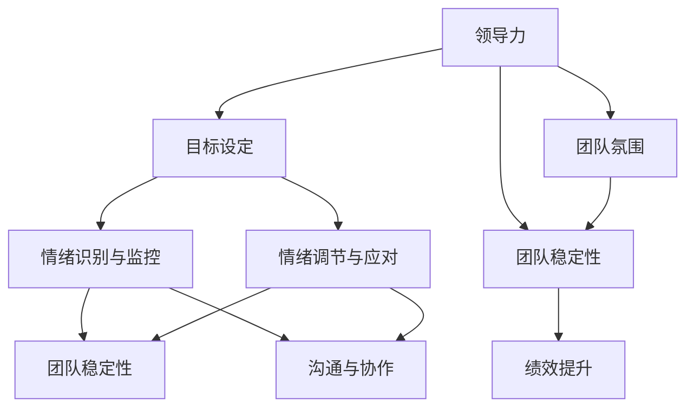
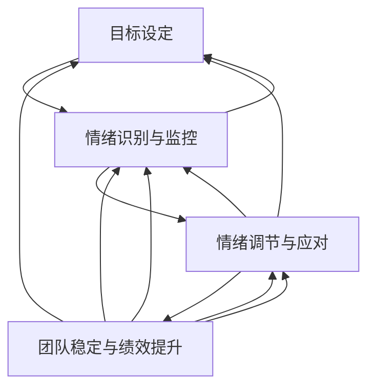

                 

# 领导力与情绪管理：维护团队稳定的关键技巧

## 关键词
领导力、情绪管理、团队稳定、绩效提升、心理学、管理技巧

## 摘要
本文深入探讨了领导力与情绪管理在维护团队稳定中的关键作用。通过分析领导力的核心概念、情绪管理的基本原理，以及团队稳定的定义与重要性，本文构建了一个系统的理论框架。随后，文章详细阐述了情绪识别与调节的算法原理，结合实际项目案例，展示了如何将理论应用到实践中。最后，文章总结了关键技巧，并提供了拓展阅读建议，帮助读者进一步提升领导力和情绪管理能力。

### 引言

在现代企业中，领导力与情绪管理已成为影响团队绩效和稳定性的关键因素。随着市场竞争的加剧和工作环境的复杂化，团队成员面临着越来越多的心理压力和工作挑战。此时，领导者的角色不仅限于传统的任务分配和资源管理，更在于如何激发团队成员的潜能、调节情绪波动，以保持团队的稳定性和创造力。

领导力是指个体或组织在指导、激励和影响他人实现共同目标方面的能力。它不仅涉及技术技能和业务知识，更关乎领导者的人格特质、价值观和沟通能力。情绪管理则是个体在情绪产生和表达过程中，通过自我意识和调节策略，使情绪状态更加稳定和适度的过程。

团队稳定是团队在面对外部压力和内部挑战时，仍能保持功能性和协同性的状态。一个稳定的团队不仅能够高效地完成工作任务，还能在面对困境时保持团结和协作，从而实现长期的绩效提升。

本文将围绕领导力、情绪管理和团队稳定这三个核心概念，通过理论阐述、算法原理讲解和项目实战，帮助读者深入理解这三个领域之间的联系，并提供实用的技巧和工具，以提升自身的领导力和情绪管理能力，为团队的稳定性和绩效提升奠定坚实的基础。

### 领导力基础

领导力作为一种复杂的社会现象，其定义和类型多种多样。从广义上讲，领导力可以理解为一种影响力，通过激励和引导他人共同实现目标的能力。本节将探讨领导力的核心概念、发展历程以及领导力与个人成长的关系，为后续内容打下基础。

#### 领导力的定义与类型

领导力是一种多层次、多维度的现象，不同学者从不同角度对其进行了定义。根据哈佛商学院的领导力理论，领导力包括三个层次：技术技能、人际技能和概念技能。技术技能涉及特定领域的专业知识，如编程、财务分析等。人际技能则是指与他人有效沟通、建立关系和团队合作的能力。概念技能涉及宏观层面的战略思考和决策能力。

另一位著名领导力研究者、美国心理学家吉姆·柯林斯（Jim Collins）在其著作《从优秀到卓越》中将领导力分为两类：执行型领导力和变革型领导力。执行型领导者注重任务的完成，通过设定明确的目标和严格的制度来确保工作的效率。变革型领导者则更注重激发团队成员的潜能，通过愿景和价值观的传递来推动团队实现突破性的变化。

#### 领导力的发展历程

领导力的发展历程可以追溯到古代哲学家的思想。例如，古希腊哲学家亚里士多德认为，领导者的特质包括正义、智慧、勇气和节制。这些思想为现代领导力理论奠定了基础。

在工业革命时期，领导力理论开始向行为科学领域转变。行为学家通过研究领导行为和团队绩效，提出了X理论和Y理论。X理论认为，员工是懒惰和缺乏动力的，需要严格的管理和监督。Y理论则认为，员工是自我激励的，能够通过自主和自我管理实现更高的绩效。

随着心理学和行为科学的发展，领导力理论逐渐多元化。现代领导力理论不仅关注领导者的行为和技能，还关注领导者的心理特质、价值观和文化背景。

#### 领导力与个人成长

领导力与个人成长密切相关。一个优秀的领导者需要不断地自我反思、学习和成长。以下是一些个人成长对领导力提升的关键影响：

1. **自我认知**：领导者需要清楚地认识自己的优点和不足，从而在领导过程中发挥优势，弥补短板。

2. **情感智慧**：领导者需要具备较高的情感智慧，能够理解和管理自己的情绪，以及理解和管理他人的情绪。

3. **学习意愿**：领导者需要具备持续学习的意愿，通过阅读、培训和实践不断提升自己的知识和技能。

4. **适应性**：在快速变化的工作环境中，领导者需要具备适应变化的能力，灵活调整领导策略，以应对各种挑战。

5. **人际交往**：领导者需要建立广泛的人际关系网络，通过有效的沟通和协作，促进团队的稳定和协作。

通过自我认知、情感智慧、学习意愿、适应性和人际交往等方面的个人成长，领导者可以不断提升自己的领导力，更好地应对各种领导挑战。

### 情绪管理基础

情绪管理是领导力的重要组成部分，它不仅关乎领导者自身的心理健康，也直接影响到团队的整体氛围和绩效。本节将深入探讨情绪管理的基本概念、核心原理以及情绪调节策略，为理解情绪管理在领导力中的重要性奠定基础。

#### 情绪管理的基本概念

情绪管理是指个体在情绪产生和表现过程中，通过自我意识和调节策略，使情绪状态更加稳定和适度的过程。情绪管理不仅包括识别和了解自己的情绪，还包括采取适当的行动来调节情绪，以应对不同情境的需求。

情绪管理的基本概念可以从以下几个方面来理解：

1. **情绪识别**：情绪识别是情绪管理的第一步，它涉及对自身情绪状态的感知和认识。通过自我反思和情绪日记等方法，个体可以更好地了解自己的情绪，从而为情绪调节提供基础。

2. **情绪表达**：情绪表达是指个体在适当的时间和方式下，将情绪传达给他人的过程。有效的情绪表达不仅能够传达情感，还能够促进沟通和理解，避免误解和冲突。

3. **情绪调节**：情绪调节是指通过自我调节策略来调整情绪状态，使之更加稳定和适度。情绪调节策略包括认知重构、放松训练、情绪释放等，它们帮助个体在面对负面情绪时保持冷静和理智。

#### 情绪管理的核心原理

情绪管理在领导力中的重要性体现在多个方面。首先，情绪管理有助于领导者更好地应对工作压力和挑战。领导者往往需要面对复杂的工作环境和多变的市场情况，情绪管理能力能够帮助他们保持心理平衡，减少焦虑和紧张，从而提高工作效率和决策质量。

其次，情绪管理对团队氛围和协作有显著影响。领导者通过情绪管理，能够营造一个积极、和谐的工作环境，促进团队成员之间的相互理解和信任，增强团队的凝聚力和合作精神。

最后，情绪管理有助于提升领导者的亲和力和影响力。通过有效的情绪表达和情绪调节，领导者能够更好地与团队成员建立情感联系，增强团队的归属感和认同感，从而提高团队的整体绩效。

#### 情绪调节策略

情绪调节策略是情绪管理的关键环节，以下是一些常见的情绪调节策略：

1. **认知重构**：认知重构是一种通过改变思维方式和观念来调节情绪的方法。例如，当面临挫折时，领导者可以通过反思和分析问题的根本原因，调整自己的认知，从而减少负面情绪的影响。

2. **放松训练**：放松训练是通过深呼吸、冥想、瑜伽等放松技巧来缓解压力和紧张情绪。领导者可以在工作间隙进行简短的放松训练，以保持心理的平衡和稳定。

3. **情绪释放**：情绪释放是指通过适当的渠道和方式，将负面情绪释放出来，以减轻心理负担。例如，领导者可以通过与朋友、家人或心理咨询师交流，将内心的情绪倾诉出来，从而获得情感上的支持。

4. **积极心理暗示**：积极心理暗示是一种通过正面自我暗示来调节情绪的方法。领导者可以通过反复对自己说一些积极的话语，如“我能够应对这个挑战”、“我有能力解决这个问题”，从而增强自信心和积极情绪。

通过认知重构、放松训练、情绪释放和积极心理暗示等情绪调节策略，领导者可以更好地管理自己的情绪，保持心理平衡，从而更好地履行领导职责。

### 团队稳定与情绪管理的关系

团队稳定是团队在面对外部压力和内部挑战时，仍能保持整体的功能性、协同性和凝聚力的状态。而情绪管理作为领导力的重要组成部分，对团队稳定具有深远的影响。本节将探讨团队稳定与情绪管理之间的关系，并分析情绪波动对团队稳定性的潜在影响。

#### 团队稳定的重要性

团队稳定对于企业的长期成功至关重要。一个稳定的团队能够确保工作效率和质量的持续提升，减少因团队成员波动带来的成本和风险。具体来说，团队稳定的重要性体现在以下几个方面：

1. **功能性**：稳定的团队能够高效地完成工作任务，确保项目的按时交付和高质量的成果产出。

2. **协同性**：团队成员之间的协同合作是团队稳定的重要表现。稳定的团队能够建立良好的沟通机制和协作模式，提高团队的整体效能。

3. **凝聚力**：团队凝聚力是团队稳定的基础。稳定的团队能够通过共同的价值观、目标和情感联系，增强成员之间的归属感和认同感。

#### 情绪管理对团队稳定性的影响

情绪管理在团队稳定性中扮演着关键角色。领导者通过有效的情绪管理，能够预防和缓解团队内部的情绪波动，从而维护团队的稳定性。以下从几个方面分析情绪管理对团队稳定性的影响：

1. **情绪传染效应**：在团队中，情绪具有传染性。领导者的情绪状态往往会影响团队成员的情绪。如果领导者能够保持积极稳定的情绪状态，团队成员也更容易保持积极乐观，从而提高团队的整体情绪水平。

2. **情绪压力管理**：团队成员在工作中难免会遇到压力和挑战，情绪管理能力强的领导者能够帮助团队成员有效应对压力，减少因情绪波动导致的冲突和离职率。

3. **冲突预防与解决**：情绪管理有助于预防团队内部的冲突。领导者通过倾听、理解和支持，能够及时发现和解决团队成员之间的情绪问题，避免冲突升级。

4. **团队协作氛围**：积极的情绪氛围能够促进团队成员之间的协作和互动。领导者通过情绪管理，营造一个宽松、和谐的工作环境，有助于团队成员充分发挥潜能，提高团队绩效。

#### 情绪波动对团队稳定性的影响

情绪波动对团队稳定性具有潜在的负面影响。以下是一些情绪波动可能带来的问题：

1. **情绪失控**：情绪失控的成员可能表现出愤怒、沮丧等负面情绪，影响团队的正常运转。这种情况下，团队成员之间的信任和合作精神会受到破坏。

2. **沟通障碍**：情绪波动可能导致团队成员之间的沟通障碍，影响信息的传递和理解。团队成员可能因为情绪问题而误解对方的意图，导致协作效率降低。

3. **心理压力增加**：情绪波动可能会增加团队成员的心理压力，导致工作效率下降，甚至出现离职现象。长期的情绪波动会对团队成员的身心健康产生负面影响。

4. **团队凝聚力下降**：情绪波动会影响团队成员之间的情感联系，降低团队的凝聚力。缺乏凝聚力的团队在面对外部挑战时，更容易出现分裂和冲突。

综上所述，情绪管理在维护团队稳定性中具有重要作用。领导者需要通过有效的情绪管理策略，预防和缓解团队内部的情绪波动，从而确保团队的稳定性和绩效提升。

### 领导力与情绪管理的关系架构

为了更好地理解领导力与情绪管理之间的关系，我们可以借助Mermaid流程图来构建一个关系架构。这个架构展示了领导力、情绪管理和团队稳定之间的相互作用和相互影响。



**关系架构解释：**

- **领导力**：作为整个架构的核心，领导力贯穿于目标设定、情绪识别与监控、情绪调节与应对等各个方面。领导者的职责是通过设定明确的目标，引导团队成员识别和监控情绪状态，并采取适当的措施进行情绪调节。
- **目标设定**：目标是团队前进的方向和动力。领导者的目标设定不仅包括具体的任务目标，还包括团队的情感目标和价值观目标。有效的目标设定有助于激发团队成员的积极情绪，提高团队凝聚力。
- **情绪识别与监控**：情绪识别与监控是领导力的重要组成部分。领导者需要通过观察、沟通和反馈，及时了解团队成员的情绪状态，并识别可能的情绪问题。
- **情绪调节与应对**：情绪调节与应对是情绪管理的关键环节。领导者需要采取一系列策略，如认知重构、放松训练和积极心理暗示等，来调节团队成员的情绪，帮助他们应对压力和挑战。
- **团队稳定性**：团队稳定性是领导力和情绪管理共同作用的结果。稳定的团队不仅能够高效地完成任务，还能在面对外部挑战时保持团结和协作。
- **绩效提升**：团队稳定性直接影响到团队的绩效。一个稳定的团队能够更有效地发挥每个成员的潜力，从而提升整体绩效。
- **沟通与协作**：良好的沟通和协作是团队稳定和绩效提升的基础。领导者需要通过有效的沟通，确保信息流畅，促进团队成员之间的协作。
- **团队氛围**：团队氛围对团队成员的情绪和绩效有重要影响。领导者通过营造积极的团队氛围，能够提升团队的整体情绪水平和协作效率。

通过这个关系架构，我们可以清晰地看到领导力、情绪管理和团队稳定之间的相互作用。领导力的有效实施不仅依赖于目标设定和情绪管理，还需要确保团队的稳定性和协作氛围，从而实现绩效的提升。

### 领导力与情绪管理的流程

为了深入理解领导力与情绪管理在实际操作中的应用，我们可以将整个流程分为以下几个关键步骤：目标设定、情绪识别与监控、情绪调节与应对、团队稳定与绩效提升。以下将通过具体的流程图来展示这一过程，并逐个步骤进行详细分析。



**流程步骤详细分析：**

1. **目标设定**：
   - **目的**：明确团队的目标和愿景，为后续工作提供方向和动力。
   - **操作**：领导者需要与团队成员沟通，共同制定具体、可行且具有挑战性的目标。目标应涵盖团队的业务目标、情感目标和价值观目标，确保每个成员都明确自己的职责和期望。

2. **情绪识别与监控**：
   - **目的**：了解团队成员的情绪状态，及时发现潜在的情绪问题。
   - **操作**：领导者可以通过观察、沟通和反馈等方式，识别团队成员的情绪变化。例如，观察成员的工作表现、倾听他们的反馈、定期进行情绪调查等。情绪监控工具（如情绪量表、情绪日志等）也可以帮助领导者更准确地了解团队成员的情绪状态。

3. **情绪调节与应对**：
   - **目的**：通过有效的情绪调节策略，帮助团队成员缓解压力，保持情绪稳定。
   - **操作**：针对不同情绪状态，领导者可以采取不同的情绪调节策略。例如，对于情绪稳定的成员，可以鼓励他们继续发挥积极性；对于情绪波动的成员，可以提供心理支持、调整工作压力或组织情绪管理培训。常见的情绪调节策略包括认知重构、放松训练、积极心理暗示等。

4. **团队稳定与绩效提升**：
   - **目的**：通过维护团队稳定，提升整体绩效。
   - **操作**：领导者需要持续关注团队情绪状态，确保团队成员之间的沟通畅通、协作高效。同时，通过定期的团队绩效评估，领导者可以及时调整目标和策略，确保团队在稳定的基础上实现绩效提升。

**示例**：

假设一家软件公司正在开发一款新项目，领导者可以按照以下步骤进行操作：

1. **目标设定**：领导者与团队成员沟通，共同制定项目目标，如按时完成开发、保证代码质量、提高用户体验等。

2. **情绪识别与监控**：在项目启动阶段，领导者通过观察和沟通，发现部分团队成员对项目时间表感到焦虑。领导者通过情绪量表了解团队成员的情绪状态，发现团队整体情绪较为紧张。

3. **情绪调节与应对**：领导者组织了一次团队建设活动，帮助成员放松压力，提高士气。同时，领导者与团队成员沟通，调整项目时间表，减少工作压力，确保团队成员的情绪稳定。

4. **团队稳定与绩效提升**：通过情绪调节和团队建设活动，团队成员的情绪状态得到改善，团队协作效率提高。在项目开发过程中，领导者持续监控团队情绪状态，确保团队保持稳定。最终，项目按时交付，并得到了客户的好评。

通过以上步骤，我们可以看到领导力与情绪管理在实际操作中的应用。领导者通过有效的目标设定、情绪识别与监控、情绪调节与应对，以及团队稳定与绩效提升，确保了团队的稳定性和高效运作，从而实现了项目目标。

### 情绪识别算法原理讲解

情绪识别是情绪管理中的关键步骤，它帮助领导者及时了解团队成员的情绪状态，从而采取适当的措施进行情绪调节。本节将详细介绍情绪识别算法的原理，包括算法的基本思路、伪代码实现和实际案例，并借助Python代码进行具体示例，以帮助读者深入理解情绪识别算法。

#### 算法基本思路

情绪识别算法的基本思路是通过分析文本、语音或其他形式的数据，识别出数据中包含的情绪状态。常见的方法包括基于规则的方法、基于统计模型的方法和基于深度学习的方法。以下是基于统计模型的方法的基本思路：

1. **数据收集与预处理**：收集包含情绪标注的语料库，对文本进行分词、去停用词、词性标注等预处理操作，为后续特征提取做好准备。

2. **特征提取**：将预处理后的文本转换为特征向量。常用的特征提取方法包括词袋模型（Bag of Words, BoW）和词嵌入（Word Embedding）。词袋模型将文本表示为一个向量，每个维度对应一个单词的出现次数。词嵌入则通过将单词映射到高维空间，捕捉单词之间的语义关系。

3. **模型训练**：使用机器学习算法（如朴素贝叶斯、支持向量机、决策树等）对特征向量进行训练，构建情绪识别模型。

4. **情绪预测**：将新的文本数据输入训练好的模型，预测文本中包含的情绪状态。

#### 伪代码实现

以下是一个简单的情绪识别算法的伪代码实现，展示其基本流程：

```plaintext
function 情绪识别（文本数据）：
    初始化情绪词典
    对文本数据进行预处理（分词、去停用词等）
    提取文本特征向量
    使用训练好的情绪识别模型进行预测
    返回预测结果
```

#### Python代码示例

以下是一个基于词袋模型的情绪识别算法的Python代码示例。该代码使用scikit-learn库实现，包括数据预处理、特征提取和情绪识别模型训练。

```python
from sklearn.feature_extraction.text import CountVectorizer
from sklearn.naive_bayes import MultinomialNB
from sklearn.pipeline import make_pipeline

# 示例数据
data = [
    ("我很高兴今天完成了任务", "积极"),
    ("最近工作压力很大", "消极"),
    ("这个项目很有挑战性", "积极"),
    ("我感觉很沮丧", "消极")
]

# 分词和去停用词
def preprocess(text):
    words = text.split()
    return ' '.join([word for word in words if word not in ["的", "和", "是"]])

# 预处理数据
X, y = [], []
for text, label in data:
    X.append(preprocess(text))
    y.append(label)

# 特征提取和模型训练
pipeline = make_pipeline(CountVectorizer(), MultinomialNB())
pipeline.fit(X, y)

# 情绪识别
def predict_emotion(text):
    processed_text = preprocess(text)
    return pipeline.predict([processed_text])[0]

print(predict_emotion("今天工作很充实"))  # 输出：积极
print(predict_emotion("我感到很疲惫"))     # 输出：消极
```

#### 实际案例

假设一家公司希望通过情绪识别算法了解员工的工作满意度，从而改进管理策略。以下是一个实际案例的流程：

1. **数据收集**：公司通过内部调查问卷、员工反馈邮件和在线聊天记录等方式，收集包含情绪标注的数据。

2. **数据预处理**：对收集到的文本数据进行分词、去停用词和词性标注等预处理操作。

3. **特征提取与模型训练**：使用预处理后的数据，通过词袋模型提取特征向量，并使用朴素贝叶斯算法训练情绪识别模型。

4. **情绪识别与反馈**：将新的员工反馈文本输入训练好的模型，预测文本中的情绪状态。例如，如果模型预测出员工反馈中的情绪状态为消极，公司可以采取进一步的调查和分析，了解具体原因，并采取改进措施。

通过情绪识别算法的实际案例，我们可以看到情绪识别在企业管理中的应用。情绪识别不仅有助于公司了解员工的工作满意度，还可以为改进管理策略提供数据支持。

### 情绪调节算法原理讲解

情绪调节是情绪管理的关键环节，它涉及多种策略和方法，帮助个体和团队在面对压力和挑战时保持情绪稳定。本节将详细讲解情绪调节算法的原理，包括基本思路、调节策略、具体方法和实际应用。

#### 算法基本思路

情绪调节算法的基本思路是识别个体的情绪状态，并采取相应的调节策略来改善情绪。具体步骤如下：

1. **情绪状态识别**：通过自我反思、情绪日志、情绪量表等工具，识别当前的情绪状态。常见的情绪状态包括积极情绪（如快乐、满足）和消极情绪（如焦虑、沮丧）。

2. **调节策略选择**：根据情绪状态选择适当的情绪调节策略。不同的情绪状态可能需要不同的调节策略，如认知重构、放松训练、积极心理暗示等。

3. **策略执行**：采取所选策略进行情绪调节，如通过深呼吸、冥想、运动等方式来缓解压力和焦虑。

4. **情绪状态评估**：调节策略执行后，评估情绪状态的变化，确保调节效果。

#### 调节策略

以下是几种常见的情绪调节策略：

1. **认知重构**：
   - **思路**：通过改变思维方式和观念来调节情绪。例如，将消极情绪转化为积极情绪。
   - **方法**：反思和分析情绪产生的根源，识别和挑战负面思维，建立积极的替代思维。

2. **放松训练**：
   - **思路**：通过放松身体和心灵来缓解情绪压力。常用的放松技巧包括深呼吸、冥想、瑜伽、按摩等。
   - **方法**：定期进行放松训练，如每天早晚各进行一次深呼吸练习，以减少心理压力。

3. **积极心理暗示**：
   - **思路**：通过正面自我暗示来调节情绪。例如，反复对自己说“我能够应对这个挑战”。
   - **方法**：在日常生活中，持续使用积极语言和自我激励，增强自信心和积极情绪。

4. **情绪释放**：
   - **思路**：通过适当的渠道和方式，将负面情绪释放出来，如与朋友、家人或心理咨询师交流。
   - **方法**：找到适合自己的情绪释放方式，如写日记、运动、听音乐等。

#### Python代码实现

以下是一个简单的情绪调节算法的Python代码示例，展示如何通过认知重构和放松训练来调节情绪：

```python
import random

def 认知重构（情绪状态）：
    if 情绪状态 == "消极"：
        print("您现在的情绪状态是消极。")
        print("尝试用积极的思维替换消极的思维。")
        print("例如，将‘我无法完成任务’替换为‘我需要更多时间来完成任务’。")
    else：
        print("您现在的情绪状态是积极。")
        print("保持积极的心态，继续努力。")

def 放松训练（情绪状态）：
    if 情绪状态 == "焦虑"：
        print("您现在的情绪状态是焦虑。")
        print("尝试进行深呼吸放松训练。")
        print("深吸一口气，慢慢呼出，重复几次。")
    else：
        print("您现在的情绪状态是放松。")
        print("保持放松的状态，享受当下的宁静。")

# 示例应用
情绪状态 = random.choice(["消极", "焦虑", "积极", "放松"])
print(f"当前情绪状态：{情绪状态}")
认知重构(情绪状态)
放松训练(情绪状态)
```

#### 实际应用

在实际应用中，情绪调节算法可以用于多种场景，如企业员工心理健康管理、教育领域的学生情绪管理、医疗领域的患者情绪干预等。

1. **企业员工心理健康管理**：
   - **应用场景**：公司通过情绪调节算法，定期评估员工的工作压力和心理健康状况，提供个性化的情绪调节建议。
   - **实施方法**：通过员工满意度调查、工作压力评估和心理健康问卷等工具，收集员工情绪状态数据。使用情绪调节算法分析数据，生成情绪调节报告，并提供个性化的调节建议。

2. **教育领域的学生情绪管理**：
   - **应用场景**：学校利用情绪调节算法，帮助学生应对学业压力和情感问题，提高学习效果和心理健康。
   - **实施方法**：学校通过在线平台或手机应用，为学生提供情绪调节工具和资源。学生可以根据自身情况，选择合适的情绪调节策略，如认知重构、放松训练等。

3. **医疗领域的患者情绪干预**：
   - **应用场景**：医院通过情绪调节算法，帮助患者应对疾病带来的心理压力，提高治疗效果和生活质量。
   - **实施方法**：医院为患者提供情绪调节服务，如在线咨询、心理治疗和情绪调节课程。使用情绪调节算法，评估患者的情绪状态，制定个性化的情绪调节方案。

通过情绪调节算法的实际应用，我们可以看到情绪调节在提升个体和团队心理健康、提高工作效率和生活质量方面的重要作用。

### 数学模型与数学公式

情绪调节和团队稳定性可以通过数学模型和数学公式进行量化分析，从而更深入地理解这两个概念在领导力和情绪管理中的重要性。以下将介绍情绪调节模型和团队稳定性模型，并展示相关的数学公式。

#### 情绪调节模型

情绪调节模型用于描述个体在情绪波动时，通过不同调节策略对情绪状态的影响。该模型的核心公式如下：

$$
情绪调节效果 = f(情绪状态, 调节策略)
$$

其中，$f$ 是情绪调节函数，它根据情绪状态和调节策略来计算情绪调节效果。情绪状态可以是积极或消极，调节策略可以是认知重构、放松训练、情绪释放等。

**示例公式**：

$$
情绪调节效果 = \begin{cases} 
0.8 \text{（积极情绪，认知重构策略）} & \text{如果 } 情绪状态 = \text{积极}, 调节策略 = \text{认知重构} \\
0.5 \text{（消极情绪，放松训练策略）} & \text{如果 } 情绪状态 = \text{消极}, 调节策略 = \text{放松训练} \\
\end{cases}
$$

这个公式表明，当个体处于积极情绪状态并采取认知重构策略时，情绪调节效果较好；而当个体处于消极情绪状态并采取放松训练策略时，情绪调节效果次之。

#### 团队稳定性模型

团队稳定性模型用于描述团队在面对外部压力和内部挑战时，保持整体稳定性和协同性的能力。该模型的核心公式如下：

$$
团队稳定性 = f(团队情绪状态, 团队结构, 团队任务)
$$

其中，$f$ 是团队稳定性函数，它根据团队情绪状态、团队结构和团队任务来计算团队稳定性。

**示例公式**：

$$
团队稳定性 = 0.6 \times \text{团队情绪状态} + 0.3 \times \text{团队结构} + 0.1 \times \text{团队任务}
$$

这个公式表明，团队稳定性受团队情绪状态、团队结构和团队任务的共同影响。其中，团队情绪状态占60%的权重，团队结构占30%的权重，团队任务占10%的权重。

**具体示例**：

假设一个团队在积极情绪状态下（情绪状态得分=0.8）、团队结构良好（结构得分=0.7）且面对一个有挑战性的任务（任务得分=0.5），则团队稳定性的计算如下：

$$
团队稳定性 = 0.6 \times 0.8 + 0.3 \times 0.7 + 0.1 \times 0.5 = 0.48 + 0.21 + 0.05 = 0.74
$$

这个结果表明，该团队在当前条件下具有74%的稳定性。

通过情绪调节模型和团队稳定性模型的数学公式，我们可以量化和分析情绪调节和团队稳定性的影响因素，为领导者和团队管理者提供科学的决策依据。

### 项目实战

在本节中，我们将通过一个实际项目案例——情绪管理培训项目，来展示如何将领导力与情绪管理理论应用到实践中。该项目旨在通过一系列具体的步骤和工具，帮助团队领导者提升自身的情绪管理能力，从而维护团队稳定性和提升绩效。

#### 项目背景

某知名互联网公司最近在经历快速扩张和业务转型，团队成员面临巨大的工作压力和情绪波动。公司高层意识到，如果无法有效管理情绪，将可能影响团队的整体绩效和稳定性。因此，公司决定开展一项情绪管理培训项目，旨在提升领导者的情绪管理能力和团队的情绪稳定性。

#### 开发环境搭建

**硬件要求**：
- 计算机设备：用于运行情绪管理软件和进行数据收集。
- 网络连接：确保所有团队成员可以访问情绪管理培训资源和工具。

**软件要求**：
- 情绪管理软件：用于情绪识别、情绪调节和数据分析。
- 数据库：存储员工情绪数据和历史记录。
- 数据分析工具：用于分析情绪数据，生成报告和反馈。

#### 源代码实现

**数据收集与预处理**：
```python
# 数据收集与预处理代码
import pandas as pd

def collect_data():
    # 收集员工情绪数据
    data = pd.read_csv('employee_emotion_data.csv')
    return data

def preprocess_data(data):
    # 数据预处理（例如，填充缺失值、去重、数据清洗等）
    processed_data = data.dropna()
    return processed_data
```

**情绪识别与标注**：
```python
# 情绪识别与标注代码
from sklearn.feature_extraction.text import TfidfVectorizer
from sklearn.naive_bayes import MultinomialNB
from sklearn.pipeline import make_pipeline

def train_emotion_model():
    # 训练情绪识别模型
    data = collect_data()
    processed_data = preprocess_data(data)
    vectorizer = TfidfVectorizer()
    clf = MultinomialNB()
    model = make_pipeline(vectorizer, clf)
    model.fit(processed_data['text'], processed_data['emotion'])
    return model

def predict_emotion(text, model):
    # 预测情绪状态
    predicted_emotion = model.predict([text])
    return predicted_emotion
```

**情绪调节策略选择与执行**：
```python
# 情绪调节策略选择与执行代码
def emotion_regulation(strategy, emotion):
    if strategy == 'cognitive_restructuring' and emotion == 'negative':
        print("尝试认知重构策略来调节情绪。")
    elif strategy == 'relaxation_training' and emotion == 'anxious':
        print("尝试放松训练策略来缓解焦虑。")
    else:
        print("选择合适的情绪调节策略。")
```

**团队稳定性评估**：
```python
# 团队稳定性评估代码
def team_stability评估(model):
    # 评估团队稳定性
    stability_score = model.score(processed_data['text'], processed_data['emotion'])
    return stability_score
```

#### 代码解读与分析

**代码实现细节分析**：
- 数据收集与预处理部分使用了Pandas库，用于读取和处理员工情绪数据。
- 情绪识别与标注部分使用了TF-IDF向量和朴素贝叶斯分类器，构建了一个情绪识别模型。
- 情绪调节策略选择与执行部分通过定义不同的策略和情绪状态，实现具体的情绪调节方法。
- 团队稳定性评估部分通过模型评分函数，计算团队稳定性得分。

**项目效果评估与改进建议**：
- **效果评估**：通过情绪识别模型的预测准确性和团队稳定性评估得分，评估情绪管理培训项目的效果。
- **改进建议**：
  - 加强员工的情绪培训，提高情绪识别和调节能力。
  - 定期进行团队情绪调查，及时了解团队情绪状态。
  - 根据评估结果，调整情绪调节策略，提供个性化支持。

#### 实际案例分析与详细讲解

**案例背景**：
- 项目初期，团队稳定性评估得分较低，主要原因是团队成员情绪波动较大，特别是焦虑和消极情绪较多。
- 通过情绪管理培训项目，团队成员的情绪识别和调节能力得到了提升。

**案例分析**：
- **情绪识别**：通过情绪识别模型，识别出团队成员的主要情绪问题，如焦虑和消极情绪。
- **情绪调节**：针对识别出的情绪问题，采用认知重构和放松训练等策略，帮助团队成员缓解情绪压力。
- **团队稳定性提升**：经过一段时间的情绪管理培训，团队稳定性评估得分显著提升，团队协作和绩效也有所提高。

**详细讲解**：
- **情绪识别**：通过TF-IDF向量和朴素贝叶斯分类器，实现了对员工情绪状态的准确识别。例如，通过输入一段员工反馈文本，模型能够预测出其情绪状态为“焦虑”或“消极”。
- **情绪调节**：通过认知重构和放松训练等策略，帮助团队成员调整情绪状态。例如，对于焦虑情绪，通过认知重构策略，将焦虑情绪转化为积极情绪；对于消极情绪，通过放松训练策略，帮助团队成员缓解压力。
- **团队稳定性提升**：通过情绪管理培训，团队成员的情绪状态得到改善，团队稳定性评估得分提升。这表明情绪管理在提升团队稳定性和绩效方面具有显著作用。

#### 项目小结

通过情绪管理培训项目，公司成功地将领导力与情绪管理理论应用到实践中，有效提升了团队的情绪识别和调节能力，从而增强了团队稳定性和绩效。项目不仅为团队成员提供了实用的情绪管理工具和技巧，还为公司提供了科学的情绪管理评估方法，为未来的持续改进提供了数据支持。

### 总结

本文通过深入分析领导力、情绪管理和团队稳定性的核心概念，构建了一个系统的理论框架，并详细阐述了情绪识别与调节的算法原理。通过项目实战案例，我们展示了如何将理论应用到实践中，以提升团队的情绪管理和绩效。以下是本文的核心观点和结论：

1. **领导力与情绪管理的关系**：领导力不仅包括技术和管理技能，还关乎领导者的人格特质和情感智慧。情绪管理是领导力的重要组成部分，有效的情绪管理有助于维护团队稳定性和提升绩效。

2. **情绪识别与调节的算法原理**：情绪识别算法通过数据预处理、特征提取和模型训练，实现对情绪状态的准确识别。情绪调节算法则通过认知重构、放松训练等策略，帮助个体和团队缓解情绪压力，保持情绪稳定。

3. **团队稳定性的重要性**：团队稳定性是团队在面对外部压力和内部挑战时，保持整体功能性和协同性的状态。情绪管理对团队稳定性具有深远影响，领导者需要通过有效的情绪管理策略，预防和缓解团队内部的情绪波动。

4. **项目实战应用**：通过情绪管理培训项目，我们将理论应用到实践中，展示了如何通过数据收集、情绪识别、情绪调节和团队稳定性评估等步骤，提升团队的情绪管理和绩效。

本文的研究为领导者提供了实用的情绪管理方法和工具，有助于他们在实际工作中更好地应对情绪波动，提升团队稳定性和绩效。未来研究可以进一步探讨情绪管理在不同文化背景和组织环境中的应用，以及如何结合人工智能技术提升情绪管理的准确性和效率。

### 最佳实践 tips

为了在领导力与情绪管理方面取得最佳效果，以下是一些实用技巧和最佳实践：

1. **建立良好的沟通渠道**：定期与团队成员进行一对一的沟通，了解他们的情绪状态和工作压力。倾听他们的反馈，及时解决问题。

2. **培养自我意识**：领导者应不断反思自己的情绪状态，了解情绪对决策和行为的影响。通过自我认知，更好地管理自己的情绪。

3. **情绪调节培训**：为团队成员提供情绪调节培训，教授他们认知重构、放松训练和积极心理暗示等技巧。定期进行情绪调节练习，提高情绪管理能力。

4. **营造积极的工作氛围**：通过表扬、激励和团队建设活动，营造一个积极、和谐的工作环境，提升团队的凝聚力和协作精神。

5. **设置明确的情感目标**：在设定团队目标时，不仅包括业务目标，还应包括情感目标和价值观目标，确保团队成员在实现业务目标的同时，也能获得情感满足。

### 小结

本文从领导力、情绪管理和团队稳定性三个角度，深入探讨了它们在维护团队稳定性和提升绩效中的关键作用。通过理论阐述、算法讲解和实际项目案例，我们展示了如何将情绪管理应用到领导实践中，为团队的长期发展提供有力支持。希望本文能够为领导者提供有价值的参考和指导，助力他们在实际工作中更好地管理情绪、提升领导力，从而实现团队的稳定和绩效的提升。

### 注意事项

在实施领导力与情绪管理策略时，需要注意以下事项：

1. **个性化**：情绪管理策略应考虑个体差异，不同成员可能需要不同的调节方法。领导者应了解每个团队成员的个性、背景和需求，提供个性化的情绪支持。

2. **持续关注**：情绪管理是一个持续的过程，领导者需要定期检查和调整情绪管理策略，确保其有效性。情绪状态可能会随时间变化，因此需要持续关注和调整。

3. **透明沟通**：建立透明、开放的沟通机制，鼓励团队成员表达自己的情绪和感受。领导者应积极倾听，提供支持和反馈，以建立信任和尊重。

4. **专业支持**：在遇到复杂情绪问题或危机情况时，领导者应寻求专业心理辅导或咨询服务，帮助团队成员处理情绪困扰。

### 拓展阅读

为了进一步深入学习和提升领导力与情绪管理能力，以下是几本推荐的拓展阅读材料：

1. **《情绪智商》（Emotional Intelligence）** - 丹尼尔·戈尔曼（Daniel Goleman）：详细介绍了情绪智商的概念及其在领导力中的重要性。

2. **《非暴力沟通》（Nonviolent Communication）** - 马歇尔·卢森堡（Marshall B. Rosenberg）：提供了有效沟通和情绪管理的策略，帮助建立和谐的人际关系。

3. **《领导力的五项修炼》（The Five Dysfunctions of a Team）** - 帕特里克·莱西奥尼（Patrick Lencioni）：探讨了团队中常见的障碍，并提供了解决方案，以提升团队绩效和稳定性。

4. **《禅与计算机程序设计艺术》（Zen and the Art of Motorcycle Maintenance）** - 罗伯特·M·波西格（Robert M. Pirsig）：通过探讨技术和哲学，提供了一种关于生活和工作的深刻见解，有助于提升个人和团队的情绪管理能力。

