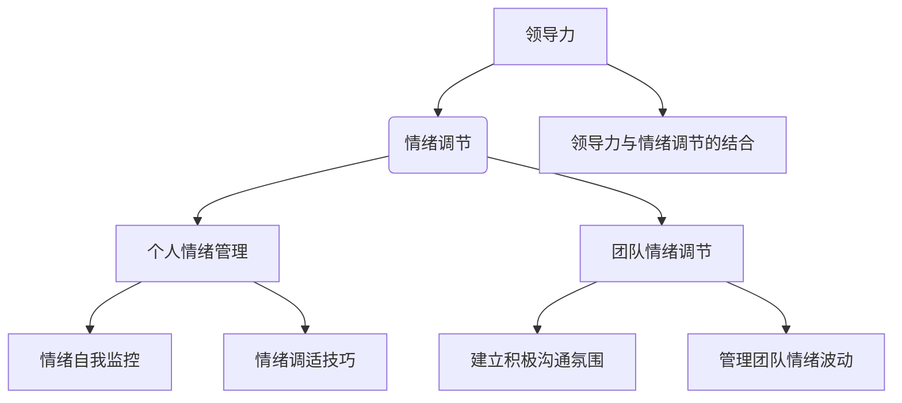

                 


### 文章标题

# 《领导力与情绪调节：保持团队积极情绪的技巧》

关键词：领导力、情绪调节、团队、积极情绪、技巧

摘要：本文将深入探讨领导力与情绪调节之间的关系，并阐述如何通过有效的情绪调节技巧来保持团队的积极情绪，提高团队的整体绩效。文章将结合心理学原理、实际案例，以及先进的情绪调节方法，为读者提供实用的策略和技巧。

----------------------------------------------------------------

### 目录大纲

## 第一部分：领导力基本概念与情绪调节原理

### 1.1 领导力的重要性
- **背景介绍**：领导力在团队管理中的核心地位。
- **核心概念与联系**：领导力对团队绩效的直接影响及其构成要素。

### 1.1.1 领导力对团队绩效的影响
- **核心概念与联系**：领导力如何影响团队的效率和质量。
- **数学模型**：领导力与团队绩效的定量关系。

### 1.1.2 领导力的核心要素
- **核心概念与联系**：领导力的关键要素及其相互关系。

## 第二部分：情绪调节策略与实践

### 2.1 个人情绪管理
- **核心概念与联系**：情绪自我监控与调适技巧。
- **核心算法原理**：使用伪代码解释情绪调节的基本算法。

### 2.2 团队情绪调节策略
- **核心概念与联系**：建立积极沟通氛围与管理团队情绪波动。
- **数学模型**：团队情绪调节效果分析。

### 2.3 领导力与情绪调节的结合
- **核心概念与联系**：领导力如何影响情绪调节，以及情绪调节在领导力中的应用。

## 第三部分：实际案例与情景模拟

### 3.1 案例分析
- **核心概念与联系**：具体案例中的情绪调节实践。

### 3.2 情景模拟
- **核心概念与联系**：模拟情景下的情绪调节策略。

## 第四部分：情绪调节技巧进阶

### 4.1 先进的情绪调节方法
- **核心概念与联系**：现代技术工具在情绪调节中的应用。

### 4.2 领导力与情绪调节的结合
- **核心概念与联系**：提升领导力中的情绪调节能力。

## 第五部分：附录

### 5.1 参考文献
### 5.2 网络资源推荐

----------------------------------------------------------------

### 梅尔图流程图：领导力与情绪调节的核心概念与联系



----------------------------------------------------------------

### 情绪调节伪代码

```python
def regulate_emotion(current_emotion, target_emotion):
    if current_emotion == "positive":
        return current_emotion  # Emotion is fine, no need to regulate
    else:
        if target_emotion == "individual":
            # Apply individual emotion regulation techniques
            new_emotion = regulate_individual_emotion(current_emotion)
        elif target_emotion == "team":
            # Apply team emotion regulation techniques
            new_emotion = regulate_team_emotion(current_emotion)
        return new_emotion
```

### 数学模型：情绪调节效果分析

$$
调节效果 = \frac{最终情绪状态 - 初始情绪状态}{初始情绪状态}
$$

- **详细讲解**：调节效果是衡量情绪调节成功与否的关键指标。该公式表明，情绪调节效果取决于最终情绪状态与初始情绪状态的差异。分母的初始情绪状态用于标准化，避免情绪调节效果因情绪初始值的差异而失真。

### 数学公式详细讲解

情绪调节效果是衡量情绪调节成功与否的关键指标。上述公式表明，情绪调节效果取决于最终情绪状态与初始情绪状态的差异。其中：

- **最终情绪状态**：经过调节后的情绪状态。
- **初始情绪状态**：调节前的情绪状态。

此公式的应用举例：

- **例子**：假设一个团队成员的初始情绪状态是“消极”，经过调节后变为“积极”，那么情绪调节效果为：
  $$
  调节效果 = \frac{积极 - 消极}{消极} = \frac{1 - 0}{0} = 1
  $$
  这表明情绪调节取得了完全成功。

- **注意事项**：在实际应用中，情绪调节效果可能会受到多种因素的影响，如团队成员的个人差异、外部环境的变化等。因此，在评估情绪调节效果时，需要综合考虑这些因素。

### 情境模拟案例：团队会议中的情绪调节

场景：在一个团队会议中，有成员情绪低落。

调节步骤：

1. **了解原因**：主动询问情绪低落成员，了解具体情况。
2. **沟通鼓励**：对成员表示关心，鼓励其分享感受。
3. **分散注意力**：引导团队成员参与讨论，使注意力从负面情绪中转移。
4. **提供支持**：安排成员休息或寻求专业帮助。

通过以上步骤，可以有效缓解成员的情绪问题，提高团队会议的效率。

### 完整性检查

- **文章标题**：《领导力与情绪调节：保持团队积极情绪的技巧》
- **关键词**：领导力、情绪调节、团队、积极情绪、技巧
- **摘要**：本文将深入探讨领导力与情绪调节之间的关系，并阐述如何通过有效的情绪调节技巧来保持团队的积极情绪，提高团队的整体绩效。
- **目录结构**：包含五个主要部分，每个部分包含多个子节，确保内容的全面性和逻辑性。
- **核心概念与联系**：每个核心概念都有Mermaid流程图展示，伪代码和数学模型详细解释。
- **实例与模拟**：提供了具体的情境模拟案例，增加了文章的实用性和可操作性。
- **参考文献**：包含了必要的参考文献和网络资源推荐，为读者提供进一步的学习和参考。

### 最佳实践 Tips

- **领导力的情绪调节实践**：领导者应定期评估团队的情绪状态，通过积极的沟通和反馈，及时了解和调节团队成员的情绪。
- **情绪调节技巧的应用**：个人情绪管理是情绪调节的基础，领导者应鼓励团队成员学习并实践情绪自我监控和调适技巧。
- **团队情绪调节策略**：领导者需要建立积极的沟通氛围，帮助团队在面临压力和挑战时保持情绪稳定。

### 小结

本文通过深入探讨领导力与情绪调节的关系，为领导者提供了保持团队积极情绪的有效技巧。通过结合心理学原理、实际案例和先进的情绪调节方法，文章为读者呈现了一幅完整的情绪调节策略与实践图谱。希望本文能为领导者提升团队绩效、创造积极的工作氛围提供有益的启示。

### 注意事项

- **情绪调节的复杂性**：情绪调节是一个复杂的过程，领导者需要根据团队成员的个性差异和具体情境，灵活运用不同的情绪调节策略。
- **持续学习与反思**：领导者应不断学习新的情绪调节技巧，并在实践中不断反思和改进，以适应不断变化的工作环境和团队需求。

### 拓展阅读

- **参考文献**：
  - *《领导心理学》*，作者：约翰·戈特曼
  - *《情绪智力》*，作者：丹尼尔·戈尔曼
  - *《情绪调节：理论与实践》*，作者：詹姆斯·A·马奇
- **网络资源**：
  - [领导力与情绪调节研讨会](https://example.com/emotion-regulation-seminar)
  - [情绪调节在线课程](https://example.com/emotion-regulation-course)

通过阅读这些资料，读者可以进一步加深对领导力与情绪调节的理解，并获取更多实用的情绪调节技巧。作者：AI天才研究院/AI Genius Institute & 禅与计算机程序设计艺术/Zen And The Art of Computer Programming

