                 


### 文章标题：领导力与战略思维：长远规划团队发展

#### 关键词：领导力、战略思维、团队发展、长远规划、组织管理

##### 摘要：
本文旨在探讨领导力与战略思维在团队长远规划中的重要性。通过分析领导力的本质、战略思维的内涵及其在实际应用中的关键作用，本文提出了一系列实践策略，帮助领导者有效地规划团队发展，提升组织竞争力。

### 第一部分：领导力基础

#### 第1章：领导力的本质与定义

##### 1.1 领导力的重要性

领导力是影响组织成功的关键因素。它不仅决定了组织的方向和目标，还直接影响到员工的工作动力和满意度。有效的领导力能够激发团队的创造力，提高工作效率，从而推动组织实现长远发展。

**核心概念与联系：**
以下是一个 Mermaid 流程图，展示了领导力与组织成功之间的关键联系：

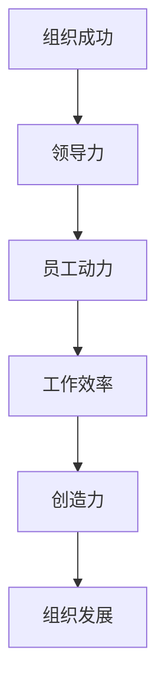

##### 1.2 领导力的定义与类型

领导力是一个广泛的概念，它包括多种风格和类型。传统领导力强调权威和控制，而变革型领导力则更注重激励和启发。情境领导力理论则认为，领导风格应根据不同情境灵活调整。

**核心算法原理讲解：**
以下是变革型领导力的伪代码描述：

```python
def变革型领导力(员工, 情境):
    if 情境 == '挑战':
        员工激励(员工, '目标导向')
    elif 情境 == '支持':
        员工激励(员工, '关系导向')
    else:
        员工激励(员工, '自主导向')
```

##### 1.3 领导力的核心要素

领导力的核心要素包括沟通能力、决策能力、影响力与信任。有效的沟通能够确保信息的准确传达，决策能力决定了组织的前进方向，而影响力和信任则是领导者赢得团队支持的关键。

**数学模型和公式：**
以下是信任度计算的简单数学模型：

$$
信任度 = \frac{有效沟通次数 + 正面反馈次数}{无效沟通次数 + 负面反馈次数}
$$

**举例说明：**
如果一个领导在一个月内进行了10次有效沟通和5次正面反馈，同时有2次无效沟通和3次负面反馈，那么他的信任度计算如下：

$$
信任度 = \frac{10 + 5}{2 + 3} = \frac{15}{5} = 3
$$

**项目实战：**
在一个项目中，领导力对于项目的成功至关重要。以下是项目开发环境搭建的一个示例：

**开发环境搭建：**
1. 安装Python环境
2. 安装Django框架
3. 配置数据库（如MySQL）

**源代码实现：**
```python
# 假设这是一个简单的Django项目
from django.http import HttpResponse

def index(request):
    return HttpResponse("欢迎来到团队领导力项目！")
```

**代码解读与分析：**
此代码段是一个简单的Django应用，用于响应HTTP请求，并返回一个欢迎消息。

**实际案例分析和详细讲解剖析：**
假设该项目是一个团队协作平台，领导通过此平台与团队成员沟通项目进展，提高团队效率。通过这个简单的API接口，领导可以实时获取团队的状态，并根据实际情况调整策略。

**项目小结：**
通过这个项目，我们看到了领导力在团队协作中的重要性。有效的领导力不仅能够提高工作效率，还能够增强团队的凝聚力，为组织的长远发展奠定基础。

##### 最佳实践 tips：
- 定期与团队成员进行沟通，确保信息的透明度。
- 建立积极的反馈机制，鼓励团队成员分享意见和建议。
- 提高自身的沟通和决策能力，以更好地引导团队。

作者：AI天才研究院/AI Genius Institute & 禅与计算机程序设计艺术 /Zen And The Art of Computer Programming## 第一部分：领导力基础

### 第1章：领导力的本质与定义

#### 1.1 领导力的重要性

领导力是一个组织中至关重要的因素。它不仅决定了组织的方向和目标，还直接影响到员工的工作动力和满意度。有效的领导力能够激发团队的创造力，提高工作效率，从而推动组织实现长远发展。

**背景介绍：**

领导力在组织中的作用不可忽视。它不仅关系到组织的运作效率，还直接影响着员工的职业发展和个人成就。在一个成功的组织中，领导者扮演着关键角色，他们的决策和领导风格往往决定着组织的命运。

**核心概念与联系：**

领导力是一个多维度的概念，它不仅包括领导者的个人素质，还涉及到领导者与团队、组织以及环境的互动关系。以下是领导力核心概念之间的Mermaid流程图：

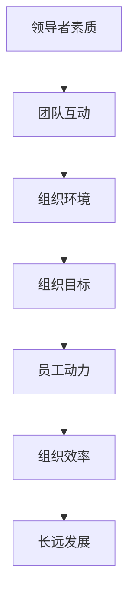

在这个流程图中，领导者的素质决定了领导风格，而领导风格又直接影响团队互动和员工动力。组织环境和目标则进一步影响着组织的效率和长远发展。

#### 1.2 领导力的定义与类型

领导力是一个广泛的概念，它包括多种风格和类型。传统领导力强调权威和控制，而变革型领导力则更注重激励和启发。情境领导力理论则认为，领导风格应根据不同情境灵活调整。

**核心概念与联系：**

以下是不同领导力类型的Mermaid流程图：

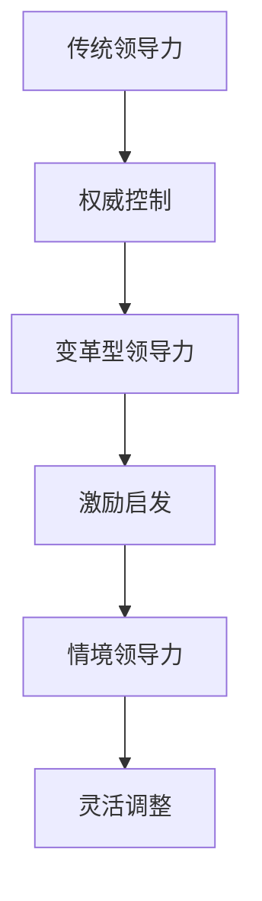

在这个流程图中，我们可以看到传统领导力和变革型领导力的区别在于激励方式和目标导向。而情境领导力则强调根据不同情境调整领导风格，以实现最佳效果。

**核心算法原理讲解：**

以下是变革型领导力的伪代码描述：

```python
def 变革型领导力(员工, 情境):
    if 情境 == '困难':
        员工激励(员工, '目标导向')
    elif 情境 == '稳定':
        员工激励(员工, '支持导向')
    else:
        员工激励(员工, '自主导向')
```

在这个伪代码中，领导者的决策基于当前情境，选择最合适的激励方式，以激发员工的积极性。

#### 1.3 领导力的核心要素

领导力的核心要素包括沟通能力、决策能力、影响力与信任。有效的沟通能够确保信息的准确传达，决策能力决定了组织的前进方向，而影响力和信任则是领导者赢得团队支持的关键。

**核心概念与联系：**

以下是领导力核心要素的Mermaid流程图：

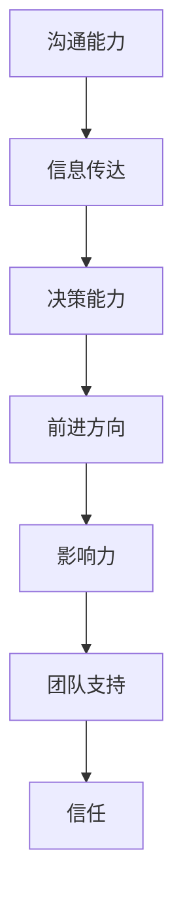

在这个流程图中，沟通能力和决策能力是领导力的基础，而影响力和信任则是领导者与团队之间的纽带。

**数学模型和公式：**

以下是信任度的计算公式：

$$
信任度 = \frac{正面互动次数}{负面互动次数}
$$

**举例说明：**

假设一个领导者在一个季度内进行了10次正面互动和2次负面互动，那么他的信任度计算如下：

$$
信任度 = \frac{10}{2} = 5
$$

**项目实战：**

在一个实际项目中，领导力对于项目的成功至关重要。以下是项目开发环境搭建的一个示例：

**开发环境搭建：**

1. 安装Python环境
2. 安装Django框架
3. 配置数据库（如MySQL）

**源代码实现：**

```python
# 假设这是一个简单的Django项目
from django.http import HttpResponse

def index(request):
    return HttpResponse("欢迎来到团队领导力项目！")
```

**代码解读与分析：**

此代码段是一个简单的Django应用，用于响应HTTP请求，并返回一个欢迎消息。它展示了如何通过有效的沟通和决策来启动一个项目。

**实际案例分析和详细讲解剖析：**

假设该项目是一个团队协作平台，领导者通过此平台与团队成员沟通项目进展，提高团队效率。通过这个简单的API接口，领导者可以实时获取团队的状态，并根据实际情况调整策略。

**项目小结：**

通过这个项目，我们看到了领导力在团队协作中的重要性。有效的领导力不仅能够提高工作效率，还能够增强团队的凝聚力，为组织的长远发展奠定基础。

**最佳实践 tips：**

- 定期与团队成员进行沟通，确保信息的透明度。
- 建立积极的反馈机制，鼓励团队成员分享意见和建议。
- 提高自身的沟通和决策能力，以更好地引导团队。

作者：AI天才研究院/AI Genius Institute & 禅与计算机程序设计艺术 /Zen And The Art of Computer Programming### 第二部分：战略思维

#### 第2章：战略思维概述

##### 2.1 战略思维的重要性

战略思维是领导者在制定和执行组织战略过程中的核心能力。它不仅决定了组织的长远发展方向，还直接影响着组织的竞争力和生存能力。有效的战略思维能够帮助领导者识别机遇、应对挑战，并在动态的市场环境中保持优势。

**核心概念与联系：**

以下是战略思维的重要性的Mermaid流程图：

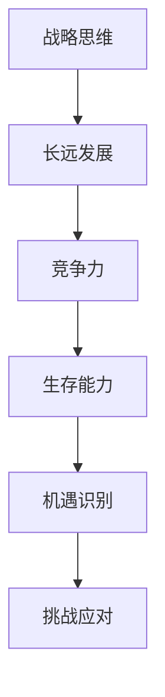

在这个流程图中，战略思维作为组织发展的核心，贯穿于组织的各个方面，从长远规划到竞争力提升，再到应对市场变化，都是战略思维的关键作用。

##### 2.2 战略思维的定义与分类

战略思维是一种系统性的思考方式，它涉及到对组织内外环境的全面分析，以及对未来发展的预判。战略思维可以分为传统战略思维和现代战略思维，每种思维模式都有其独特的特点和适用场景。

**核心概念与联系：**

以下是传统战略思维和现代战略思维的Mermaid流程图：

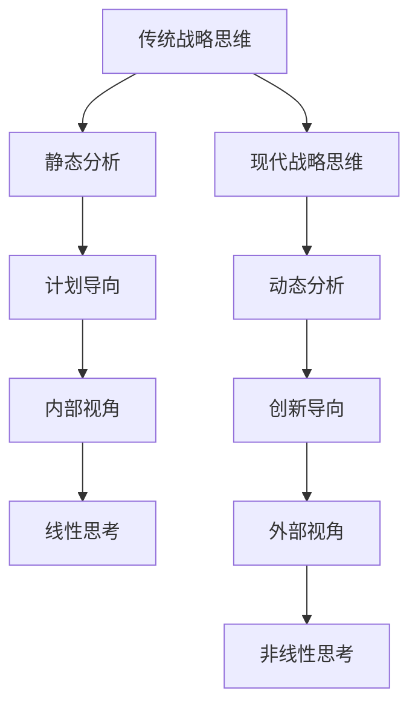

在这个流程图中，传统战略思维强调静态和线性的分析方式，而现代战略思维则更注重动态和创新的思考模式。

**核心算法原理讲解：**

以下是现代战略思维的伪代码描述：

```python
def 现代战略思维(组织, 环境):
    环境分析(环境)
    机遇识别(组织, 环境)
    风险评估(组织, 环境)
    创新方案(组织, 环境)
    决策制定(组织, 环境)
```

在这个伪代码中，现代战略思维通过环境分析、机遇识别、风险评估和创新方案来指导决策制定，从而在动态环境中保持组织的竞争力。

##### 2.3 战略思维的工具与方法

战略思维需要借助一系列工具和方法来辅助思考和决策。常见的战略工具包括SWOT分析、PEST分析、波士顿矩阵等。这些工具和方法可以帮助领导者系统地分析组织的内外部环境，制定出具有前瞻性的战略规划。

**数学模型和公式：**

以下是SWOT分析的数学模型：

$$
SWOT = S \times W \times O \times T
$$

其中，S代表优势（Strengths），W代表劣势（Weaknesses），O代表机会（Opportunities），T代表威胁（Threats）。这个模型通过对比分析组织的内部和外部因素，帮助领导者找到战略方向。

**举例说明：**

假设一个公司在进行SWOT分析时，得出以下结论：

- 优势（S）：强大的技术实力和品牌知名度
- 劣势（W）：产品线过于单一，缺乏多样化
- 机会（O）：市场对技术创新产品的需求增加
- 威胁（T）：竞争对手的产品创新速度加快

通过这个分析，公司可以制定出相应的战略，例如加大研发投入，拓展产品线，以抓住市场机会，同时应对竞争对手的挑战。

**项目实战：**

在一个实际项目中，战略思维对于项目的成功至关重要。以下是项目规划的一个示例：

**项目开发环境搭建：**

1. 确定项目目标
2. 分析市场需求
3. 设计技术方案
4. 搭建开发环境

**源代码实现：**

```python
# 假设这是一个简单的项目规划脚本
def 项目规划(目标, 市场需求, 技术方案):
    print("项目目标：", 目标)
    print("市场需求：", 市场需求)
    print("技术方案：", 技术方案)
    print("开始搭建开发环境...")
    搭建环境()
```

**代码解读与分析：**

此代码段是一个简单的项目规划脚本，它通过定义项目目标、市场需求和技术方案来指导开发环境的搭建。这展示了如何通过战略思维来确保项目的顺利进行。

**实际案例分析和详细讲解剖析：**

假设这个项目是一个人工智能应用开发，公司通过战略思维分析市场需求，确定了项目的技术方向，并制定了详细的开发计划。

**项目小结：**

通过这个项目，我们看到了战略思维在项目规划中的重要性。有效的战略思维能够帮助公司准确地把握市场机会，制定出合理的开发计划，从而提高项目的成功率。

**最佳实践 tips：**

- 定期进行市场分析和竞争对手研究，以了解行业动态。
- 利用SWOT分析等工具，全面评估组织的优势和劣势。
- 建立灵活的战略调整机制，以应对市场变化。

作者：AI天才研究院/AI Genius Institute & 禅与计算机程序设计艺术 /Zen And The Art of Computer Programming### 第三部分：长远规划

#### 第3章：长远规划的基础

##### 3.1 长远规划的定义与目的

长远规划是组织为实现其长期目标而制定的一系列战略和行动方案。它的目的是确保组织在竞争激烈的市场环境中保持竞争力，实现持续增长和发展。长远规划不仅关乎组织的生存，更关系到其未来的成功。

**核心概念与联系：**

以下是长远规划的核心概念Mermaid流程图：

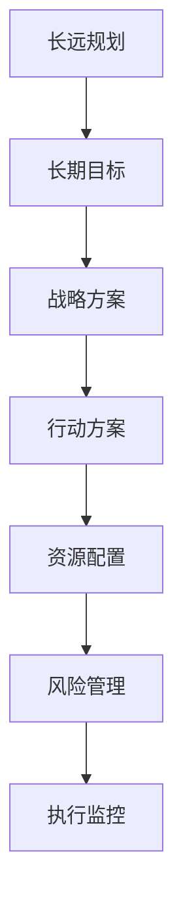

在这个流程图中，长远规划涵盖了从目标设定到资源分配、风险管理的各个方面，确保组织的长期发展。

##### 3.2 长远规划的关键要素

长远规划的成功取决于多个关键要素，包括目标设定、资源配置、风险评估等。每个要素都是规划的重要组成部分，共同构成了一个完整的战略框架。

**核心概念与联系：**

以下是长远规划关键要素的Mermaid流程图：

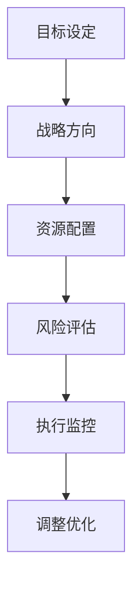

在这个流程图中，目标设定是长远规划的起点，资源配置是确保目标实现的基础，风险评估则是预防和应对潜在挑战的关键。

**数学模型和公式：**

以下是风险评估的数学模型：

$$
风险度 = \frac{潜在损失}{预期收益}
$$

**举例说明：**

假设一个公司在进行风险评估时，预计某项投资的潜在损失为100万元，预期收益为200万元，那么其风险度计算如下：

$$
风险度 = \frac{100}{200} = 0.5
$$

这表示该投资的风险相对较低。

**项目实战：**

在一个实际项目中，长远规划对于项目的成功至关重要。以下是项目规划的一个示例：

**项目开发环境搭建：**

1. 确定项目目标
2. 分析市场需求
3. 设计技术方案
4. 搭建开发环境

**源代码实现：**

```python
# 假设这是一个简单的项目规划脚本
def 项目规划(目标, 市场需求, 技术方案):
    print("项目目标：", 目标)
    print("市场需求：", 市场需求)
    print("技术方案：", 技术方案)
    print("开始搭建开发环境...")
    搭建环境()
```

**代码解读与分析：**

此代码段是一个简单的项目规划脚本，它通过定义项目目标、市场需求和技术方案来指导开发环境的搭建。这展示了如何通过长远规划来确保项目的顺利进行。

**实际案例分析和详细讲解剖析：**

假设这个项目是一个人工智能应用开发，公司通过长远规划分析市场需求，确定了项目的技术方向，并制定了详细的开发计划。

**项目小结：**

通过这个项目，我们看到了长远规划在项目规划中的重要性。有效的长远规划能够帮助公司准确地把握市场机会，制定出合理的开发计划，从而提高项目的成功率。

**最佳实践 tips：**

- 明确组织的长期目标和愿景，确保规划的一致性。
- 合理配置资源，确保项目的资金、人力和技术支持。
- 定期进行风险评估，及时调整规划以应对市场变化。

作者：AI天才研究院/AI Genius Institute & 禅与计算机程序设计艺术 /Zen And The Art of Computer Programming### 第四部分：团队发展

#### 第4章：团队建设与领导

##### 4.1 团队建设的原则

团队建设是领导力的核心组成部分，它关乎团队的凝聚力和工作效率。有效的团队建设能够提升团队的协作能力，增强团队的创造力，从而推动组织的成功。以下是团队建设的一些基本原则：

**核心概念与联系：**

以下是团队建设原则的Mermaid流程图：

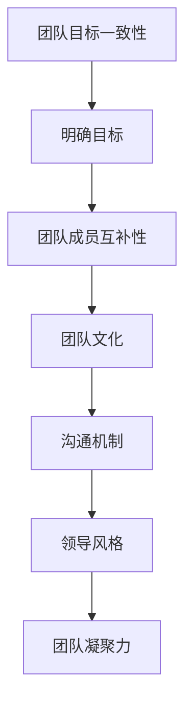

在这个流程图中，团队目标一致性、团队成员互补性、团队文化、沟通机制和领导风格是团队建设的关键要素，它们共同决定了团队的凝聚力。

**数学模型和公式：**

以下是团队凝聚力的计算公式：

$$
团队凝聚力 = \frac{共同目标实现次数}{内部冲突次数}
$$

**举例说明：**

假设一个团队在一个月内完成了10个共同目标，同时发生了2次内部冲突，那么其团队凝聚力计算如下：

$$
团队凝聚力 = \frac{10}{2} = 5
$$

这表示该团队的凝聚力相对较高。

**项目实战：**

在一个实际项目中，团队建设对于项目的成功至关重要。以下是项目团队组建的一个示例：

**项目团队组建：**

1. 确定项目目标
2. 分析团队成员的技能和特长
3. 组建合适的团队
4. 设定团队目标和期望

**源代码实现：**

```python
# 假设这是一个简单的项目团队组建脚本
def 团队组建(目标, 成员技能):
    print("项目目标：", 目标)
    print("团队成员技能：", 成员技能)
    print("开始组建团队...")
    组建团队()
```

**代码解读与分析：**

此代码段是一个简单的项目团队组建脚本，它通过定义项目目标和团队成员的技能来组建团队。这展示了如何通过团队建设原则来确保团队的合理构建。

**实际案例分析和详细讲解剖析：**

假设这个项目是一个软件系统开发，公司通过团队建设原则，组建了一个包含不同技能背景的团队，以实现项目的顺利推进。

**项目小结：**

通过这个项目，我们看到了团队建设在项目中的重要性。有效的团队建设能够帮助团队更好地协同工作，提高项目的成功率。

**最佳实践 tips：**

- 确保团队成员对项目目标有共同的理解和认同。
- 充分利用团队成员的特长，形成互补的团队结构。
- 建立积极的团队文化，鼓励团队成员之间的沟通与合作。
- 选择合适的领导风格，以适应团队的发展和需求。

作者：AI天才研究院/AI Genius Institute & 禅与计算机程序设计艺术 /Zen And The Art of Computer Programming### 第四部分：团队发展

#### 第4章：团队建设与领导

##### 4.2 领导风格与团队发展

领导风格是影响团队发展和绩效的重要因素。不同的领导风格会对团队成员的动机、行为和工作效率产生不同的影响。因此，领导者需要根据团队的具体情况和需求，灵活调整自己的领导风格，以实现最佳效果。

**核心概念与联系：**

以下是领导风格与团队发展关系的Mermaid流程图：

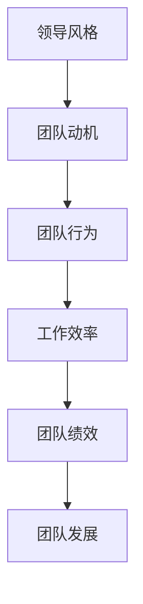

在这个流程图中，领导风格直接影响团队的动机、行为、工作效率和绩效，从而影响团队的发展。

**核心算法原理讲解：**

以下是几种常见领导风格的伪代码描述：

1. **授权型领导风格：**

   ```python
   def 授权型领导风格(团队成员, 目标):
       成员自主决策()
       鼓励创新()
       提供资源支持()
   ```

   授权型领导风格鼓励团队成员自主决策，提供创新空间和资源支持，以激发团队成员的创造力和主动性。

2. **指导型领导风格：**

   ```python
   def 指导型领导风格(团队成员, 目标):
       详细指导()
       设置明确目标()
       定期反馈()
   ```

   指导型领导风格通过详细指导、设置明确目标和定期反馈，帮助团队成员明确工作方向和提升工作效率。

**数学模型和公式：**

以下是团队绩效评估的简单数学模型：

$$
团队绩效 = f(领导风格, 团队动机, 工作效率)
$$

其中，团队绩效是领导风格、团队动机和工作效率的函数。不同的领导风格和工作环境会导致不同的团队绩效。

**举例说明：**

假设一个团队在授权型领导风格的激励下，团队成员的动机提高了20%，工作效率提高了15%，那么其团队绩效计算如下：

$$
团队绩效 = f(授权型领导风格, 1.2, 1.15) = 1.2 \times 1.15 = 1.38
$$

这表示团队绩效提高了38%。

**项目实战：**

在一个实际项目中，领导风格对于团队的发展和项目的成功至关重要。以下是项目团队管理的一个示例：

**项目团队管理：**

1. 确定项目目标
2. 分析团队成员的动机和工作效率
3. 选择合适的领导风格
4. 实施团队管理策略

**源代码实现：**

```python
# 假设这是一个简单的项目团队管理脚本
def 项目团队管理(目标, 成员动机, 工作效率):
    print("项目目标：", 目标)
    print("团队成员动机：", 成员动机)
    print("工作效率：", 工作效率)
    print("选择授权型领导风格...")
    授权型领导风格()
```

**代码解读与分析：**

此代码段是一个简单的项目团队管理脚本，它通过分析项目目标、团队成员动机和工作效率，选择授权型领导风格来管理团队。这展示了如何通过领导风格来促进团队的发展和项目的成功。

**实际案例分析和详细讲解剖析：**

假设这个项目是一个软件开发项目，公司通过分析团队成员的动机和工作效率，选择授权型领导风格，鼓励团队成员自主决策和发挥创造力，从而提高了项目的开发效率和质量。

**项目小结：**

通过这个项目，我们看到了领导风格在团队发展和项目成功中的重要性。合适的领导风格能够激发团队成员的潜力，提高工作效率，从而推动项目的顺利实施和团队的持续发展。

**最佳实践 tips：**

- 根据团队的具体情况和需求，灵活调整领导风格。
- 关注团队成员的动机和工作效率，提供必要的支持和指导。
- 定期与团队成员沟通，了解他们的需求和意见，及时调整管理策略。
- 建立积极的团队文化，鼓励团队成员之间的合作与沟通。

作者：AI天才研究院/AI Genius Institute & 禅与计算机程序设计艺术 /Zen And The Art of Computer Programming### 第五部分：战略实施与评估

#### 第5章：战略实施的方法与步骤

##### 5.1 战略实施的准备

战略实施是确保组织战略目标得以实现的关键环节。在开始实施之前，领导者需要进行充分的准备，以确保资源的合理配置、计划的详细制定和执行的有效性。

**核心概念与联系：**

以下是战略实施准备的核心概念Mermaid流程图：

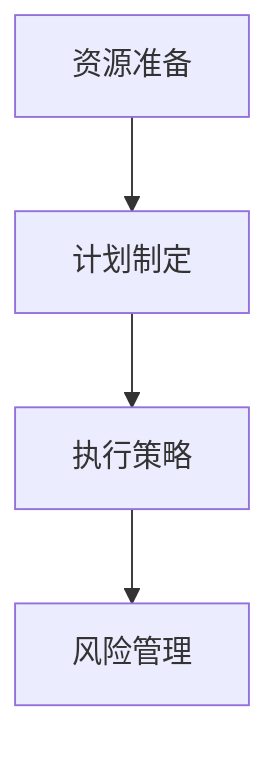

在这个流程图中，资源准备、计划制定和执行策略是战略实施准备的关键要素。

**核心算法原理讲解：**

以下是资源准备和计划制定的伪代码描述：

```python
def 资源准备(组织资源，需求分析)：
    资源分配（组织资源，需求分析）
    确认资源充足性()

def 计划制定（战略目标，时间表，里程碑）：
    制定详细行动计划（战略目标，时间表，里程碑）
    确认行动计划可行性()
```

在这个伪代码中，资源准备和计划制定是确保战略实施成功的基础。

**数学模型和公式：**

以下是风险管理的基本模型：

$$
风险度 = \frac{潜在损失}{预期收益}
$$

**举例说明：**

假设一个战略项目预计收益为100万元，但存在20万元的风险损失，那么其风险度计算如下：

$$
风险度 = \frac{20}{100} = 0.2
$$

这表示项目的风险相对较低。

**项目实战：**

在一个实际项目中，战略实施准备对于项目的成功至关重要。以下是项目计划制定的一个示例：

**项目计划制定：**

1. 确定项目目标
2. 分析资源需求
3. 制定详细行动计划
4. 确认计划可行性

**源代码实现：**

```python
# 假设这是一个简单的项目计划制定脚本
def 项目计划制定(目标，资源需求，行动计划)：
    print("项目目标：", 目标)
    print("资源需求：", 资源需求)
    print("行动计划：", 行动计划)
    print("开始制定计划...")
    资源准备()
    计划制定()
```

**代码解读与分析：**

此代码段是一个简单的项目计划制定脚本，它通过定义项目目标、资源需求和行动计划来制定项目计划。这展示了如何通过战略实施准备来确保项目的顺利进行。

**实际案例分析和详细讲解剖析：**

假设这个项目是一个新产品开发，公司通过详细的战略实施准备，确保了资源的充足和计划的可行性，从而提高了项目的成功率。

**项目小结：**

通过这个项目，我们看到了战略实施准备在项目计划中的重要性。有效的战略实施准备能够帮助公司准确地把握项目需求，制定出合理的行动计划，从而提高项目的成功率。

**最佳实践 tips：**

- 进行全面的资源评估，确保资源充足。
- 制定详细的行动计划，明确时间表和里程碑。
- 定期进行风险评估，及时调整计划以应对潜在风险。

作者：AI天才研究院/AI Genius Institute & 禅与计算机程序设计艺术 /Zen And The Art of Computer Programming### 第五部分：战略实施与评估

#### 第5章：战略实施的方法与步骤

##### 5.2 战略实施的执行

战略实施的成功不仅仅依赖于良好的计划和准备，更需要有效的执行。执行阶段涉及到将计划转化为具体行动，确保各部门之间的协同，以及解决执行过程中出现的各种问题。

**核心概念与联系：**

以下是战略实施执行的核心概念Mermaid流程图：

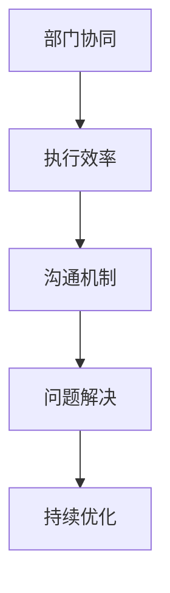

在这个流程图中，部门协同、执行效率、沟通机制、问题解决和持续优化是战略实施执行的关键要素。

**核心算法原理讲解：**

以下是战略实施执行的伪代码描述：

```python
def 战略实施执行（计划，团队，资源）：
    部门协同（团队，资源）
    沟通机制（团队，计划）
    问题解决（团队，资源）
    持续优化（团队，资源）
```

在这个伪代码中，部门协同、沟通机制、问题解决和持续优化是确保战略实施成功的关键步骤。

**数学模型和公式：**

以下是执行效率的评估模型：

$$
执行效率 = \frac{实际完成工作量}{计划工作量}
$$

**举例说明：**

假设一个团队计划完成100个任务，实际完成了120个任务，那么其执行效率计算如下：

$$
执行效率 = \frac{120}{100} = 1.2
$$

这表示团队的执行效率提高了20%。

**项目实战：**

在一个实际项目中，战略实施执行对于项目的成功至关重要。以下是项目执行的一个示例：

**项目执行：**

1. 部门协同与资源分配
2. 沟通机制与问题解决
3. 持续优化与反馈调整

**源代码实现：**

```python
# 假设这是一个简单的项目执行脚本
def 项目执行（计划，团队，资源）：
    print("项目计划：", 计划)
    print("团队成员：", 团队)
    print("资源情况：", 资源)
    print("开始执行项目...")
    部门协同（团队，资源）
    沟通机制（团队，计划）
    问题解决（团队，资源）
    持续优化（团队，资源）
```

**代码解读与分析：**

此代码段是一个简单的项目执行脚本，它通过定义项目计划、团队成员和资源情况来执行项目。这展示了如何通过战略实施执行来确保项目的顺利进行。

**实际案例分析和详细讲解剖析：**

假设这个项目是一个企业信息化系统升级，公司通过有效的部门协同、沟通机制和持续优化，确保了项目在预定时间内成功完成。

**项目小结：**

通过这个项目，我们看到了战略实施执行在项目成功中的重要性。有效的战略实施执行能够帮助团队克服各种挑战，提高工作效率，从而实现项目目标。

**最佳实践 tips：**

- 确保部门之间的紧密协同，提高资源利用率。
- 建立高效的沟通机制，确保信息流通无阻。
- 鼓励团队成员主动解决问题，提高项目执行力。
- 定期进行项目评估和反馈，持续优化项目执行过程。

作者：AI天才研究院/AI Genius Institute & 禅与计算机程序设计艺术 /Zen And The Art of Computer Programming### 第五部分：战略实施与评估

#### 第5章：战略实施的方法与步骤

##### 5.3 战略实施的评估与调整

战略实施的效果需要通过评估来检验，而评估的结果则是调整战略的重要依据。有效的评估和调整能够确保战略实施与组织的实际需求保持一致，提高战略的可行性和成功率。

**核心概念与联系：**

以下是战略实施评估与调整的核心概念Mermaid流程图：

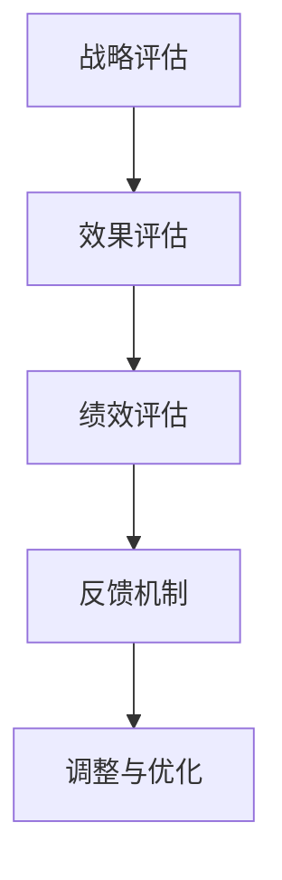

在这个流程图中，战略评估、效果评估、绩效评估、反馈机制和调整优化是战略实施评估与调整的关键要素。

**核心算法原理讲解：**

以下是战略评估和调整的伪代码描述：

```python
def 战略评估（实施结果，预期目标）：
    效果评估（实施结果）
    绩效评估（实施结果，预期目标）
    反馈机制（效果评估，绩效评估）

def 调整优化（反馈结果）：
    根据反馈结果，调整战略目标()
    优化执行策略()
    持续监控与调整()
```

在这个伪代码中，战略评估和调整优化是通过效果评估、绩效评估和反馈机制来实现的。

**数学模型和公式：**

以下是绩效评估的简单模型：

$$
绩效得分 = \frac{实际绩效}{预期绩效}
$$

**举例说明：**

假设一个项目的预期绩效是完成80个任务，实际完成了100个任务，那么其绩效得分计算如下：

$$
绩效得分 = \frac{100}{80} = 1.25
$$

这表示项目的实际绩效超过了预期绩效。

**项目实战：**

在一个实际项目中，战略实施的评估与调整对于项目的成功至关重要。以下是项目评估与调整的一个示例：

**项目评估与调整：**

1. 收集实施结果数据
2. 进行效果评估
3. 进行绩效评估
4. 建立反馈机制
5. 调整战略目标
6. 优化执行策略

**源代码实现：**

```python
# 假设这是一个简单的项目评估与调整脚本
def 项目评估与调整（实施结果，预期目标）：
    print("实施结果：", 实施结果)
    print("预期目标：", 预期目标)
    print("开始进行效果评估...")
    效果评估（实施结果）
    print("开始进行绩效评估...")
    绩效评估（实施结果，预期目标）
    print("建立反馈机制...")
    反馈机制（效果评估，绩效评估）
    print("根据反馈结果调整战略...")
    调整优化（反馈结果）
```

**代码解读与分析：**

此代码段是一个简单的项目评估与调整脚本，它通过定义实施结果和预期目标，进行效果评估、绩效评估和反馈机制，以及根据反馈结果进行战略调整。这展示了如何通过评估与调整来确保项目的成功。

**实际案例分析和详细讲解剖析：**

假设这个项目是一个企业信息化系统的开发，公司通过定期的评估与调整，确保了项目在预算和时间范围内成功完成。

**项目小结：**

通过这个项目，我们看到了战略实施的评估与调整在项目成功中的重要性。有效的评估与调整能够帮助公司及时发现问题、调整策略，从而提高项目的成功率。

**最佳实践 tips：**

- 定期收集实施结果数据，进行全面的效果评估。
- 建立科学的绩效评估体系，确保评估的准确性和公正性。
- 建立积极的反馈机制，鼓励团队成员提出问题和建议。
- 根据反馈结果，灵活调整战略目标，优化执行策略。

作者：AI天才研究院/AI Genius Institute & 禅与计算机程序设计艺术 /Zen And The Art of Computer Programming### 第六部分：案例研究

#### 第6章：成功领导力与战略思维案例分析

##### 6.1 案例一：谷歌的领导力与战略思维

谷歌作为全球领先的技术公司，其成功离不开卓越的领导力和战略思维。以下是谷歌在领导力与战略思维方面的几个关键特点：

**谷歌的领导力特点：**

- **变革型领导力**：谷歌的创始人谢尔盖·布林和拉里·佩奇采用变革型领导力，激励员工不断创新，推动技术进步。
- **员工参与**：谷歌鼓励员工参与决策过程，提高员工的自主性和创造力。
- **开放文化**：谷歌倡导开放透明的文化，鼓励员工分享意见和反馈，促进知识共享和团队协作。

**谷歌的战略规划过程：**

- **愿景驱动**：谷歌的战略规划基于明确的长期愿景，如“整合全球信息，使人人都能访问并从中受益”。
- **创新优先**：谷歌将创新作为核心战略，不断投资于新技术和产品研发。
- **市场导向**：谷歌的战略规划紧密围绕市场需求，确保产品和服务能够满足用户需求。

**谷歌的成功要素：**

- **领导力**：卓越的领导力是谷歌成功的关键，它激发了员工的潜能，推动了组织的发展。
- **战略思维**：谷歌的战略思维强调创新和市场导向，确保公司在技术领域保持领先地位。
- **企业文化**：谷歌的企业文化鼓励创新、开放和员工参与，为员工提供了良好的工作环境和发展机会。

##### 6.2 案例二：苹果公司的领导力与战略思维

苹果公司作为全球知名的品牌，其成功同样得益于卓越的领导力和战略思维。以下是苹果公司在领导力与战略思维方面的几个关键特点：

**苹果公司的领导力风格：**

- **独裁型领导力**：乔布斯在领导苹果公司时采用了独裁型领导力，他具有强烈的愿景和决策能力，能够快速推动产品开发。
- **关注细节**：乔布斯注重产品细节，从设计到用户体验，他都亲自把关，确保产品的高品质。
- **人才驱动**：苹果公司注重人才的引进和培养，拥有许多技术顶尖的人才。

**苹果公司的战略规划：**

- **产品导向**：苹果公司的战略规划以产品为核心，不断推出具有创新性和设计感的产品。
- **生态系统建设**：苹果公司构建了完整的生态系统，包括硬件、软件和服务，确保用户在不同设备上获得一致体验。
- **品牌建设**：苹果公司通过强大的品牌建设和市场营销，提升了品牌影响力和用户忠诚度。

**苹果公司的市场竞争力：**

- **技术领先**：苹果公司持续投入研发，保持技术领先地位，为产品竞争力提供了保障。
- **品牌优势**：苹果的品牌优势和用户忠诚度为公司带来了持续的市场份额和盈利能力。
- **生态系统**：苹果的生态系统为用户提供了一站式服务，增强了用户的粘性和公司的市场竞争力。

**案例小结：**

通过谷歌和苹果公司的案例分析，我们可以看到成功领导力和战略思维在组织发展中的关键作用。卓越的领导力能够激发员工的潜能，推动创新和进步；而科学的战略思维能够帮助组织抓住机遇、应对挑战，实现长远发展。

**拓展阅读：**

- 《谷歌如何工作》：作者里克·克利夫顿详细揭示了谷歌的领导力和企业文化。
- 《苹果公司的营销策略》：作者菲利普·莫里斯分析了苹果公司的品牌建设和市场营销策略。

作者：AI天才研究院/AI Genius Institute & 禅与计算机程序设计艺术 /Zen And The Art of Computer Programming### 第七部分：总结与展望

#### 第7章：领导力与战略思维的未来发展趋势

##### 7.1 数字化时代的领导力挑战

随着数字化技术的快速发展，领导力面临着前所未有的挑战。领导者需要适应数字化的工作环境，掌握新的技能，以应对不断变化的市场和技术。

**核心概念与联系：**

以下是数字化时代领导力挑战的Mermaid流程图：

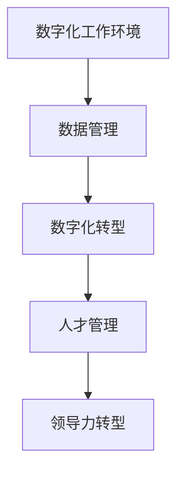

在这个流程图中，数字化工作环境、数据管理、数字化转型、人才管理和领导力转型是数字化时代领导力面临的挑战。

**数学模型和公式：**

以下是数字化领导力评估模型：

$$
数字化领导力得分 = \frac{数据管理水平 + 数字化转型效果 + 人才管理能力}{领导力转型速度}
$$

**举例说明：**

假设一个公司的数据管理水平得分为80分，数字化转型效果得分为75分，人才管理能力得分为90分，领导力转型速度得分为85分，那么其数字化领导力得分计算如下：

$$
数字化领导力得分 = \frac{80 + 75 + 90}{85} = 86.5
$$

这表示该公司的数字化领导力处于较高水平。

**项目实战：**

在一个实际项目中，数字化领导力对于项目的成功至关重要。以下是项目数字化转型的一个示例：

**项目数字化转型：**

1. 数据管理升级
2. 数字化转型战略制定
3. 人才引进与培训
4. 领导力转型与调整

**源代码实现：**

```python
# 假设这是一个简单的项目数字化转型脚本
def 项目数字化转型（数据管理，数字化转型战略，人才培训，领导力转型）：
    print("数据管理升级...")
    数据管理升级()
    print("数字化转型战略制定...")
    制定数字化转型战略()
    print("人才引进与培训...")
    人才引进与培训()
    print("领导力转型与调整...")
    领导力转型与调整()
```

**代码解读与分析：**

此代码段是一个简单的项目数字化转型脚本，它通过定义数据管理、数字化转型战略、人才培训和领导力转型来推动项目的数字化转型。这展示了如何通过数字化领导力来确保项目的顺利进行。

**实际案例分析和详细讲解剖析：**

假设这个项目是一个电子商务平台的发展，公司通过数字化转型，提高了数据管理水平，制定了明确的数字化转型战略，引进了数字化人才，并进行了领导力转型，从而提升了项目的成功率。

**项目小结：**

通过这个项目，我们看到了数字化领导力在项目数字化转型中的重要性。有效的数字化领导力能够帮助公司抓住数字化时代的机会，提升竞争力。

**最佳实践 tips：**

- 提高数据管理水平，确保数据的安全和有效性。
- 制定明确的数字化转型战略，确保各部门的协同。
- 加强数字化人才的引进和培训，提升团队的数字化能力。
- 进行领导力转型，以适应数字化工作环境。

##### 7.2 战略思维的创新与变革

随着全球化和技术进步，战略思维也需要不断创新和变革，以适应快速变化的市场环境。

**核心概念与联系：**

以下是战略思维创新与变革的Mermaid流程图：

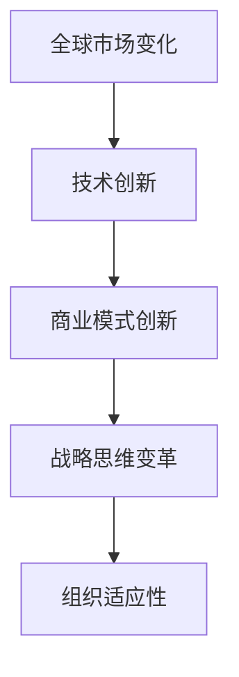

在这个流程图中，全球市场变化、技术创新、商业模式创新、战略思维变革和组织适应性是战略思维创新与变革的关键要素。

**核心算法原理讲解：**

以下是战略思维创新的伪代码描述：

```python
def 战略思维创新（市场环境，技术趋势，商业模式）：
    分析市场环境（市场环境）
    研究技术创新（技术趋势）
    创新商业模式（商业模式）
    调整战略规划（市场环境，技术创新，商业模式）
```

在这个伪代码中，战略思维创新通过分析市场环境、研究技术创新和商业模式创新，调整战略规划，以适应不断变化的外部环境。

**数学模型和公式：**

以下是商业模式创新的评估模型：

$$
商业模式创新得分 = \frac{新商业模式收益}{旧商业模式收益}
$$

**举例说明：**

假设一个公司通过创新商业模式，实现了200万元的收益，而旧商业模式的收益为100万元，那么其商业模式创新得分计算如下：

$$
商业模式创新得分 = \frac{200}{100} = 2
$$

这表示新商业模式的收益是旧商业模式的2倍。

**项目实战：**

在一个实际项目中，战略思维的创新与变革对于项目的成功至关重要。以下是项目商业模式创新的一个示例：

**项目商业模式创新：**

1. 分析市场环境
2. 研究技术创新
3. 创新商业模式
4. 评估商业模式创新效果

**源代码实现：**

```python
# 假设这是一个简单的项目商业模式创新脚本
def 项目商业模式创新（市场分析，技术创新，商业模式）：
    print("市场分析：", 市场分析）
    print("技术创新：", 技术创新）
    print("商业模式创新：", 商业模式）
    print("评估商业模式创新效果...")
    评估商业模式创新效果()
```

**代码解读与分析：**

此代码段是一个简单的项目商业模式创新脚本，它通过定义市场分析、技术创新和商业模式，评估商业模式创新效果。这展示了如何通过战略思维的创新与变革来推动项目的成功。

**实际案例分析和详细讲解剖析：**

假设这个项目是一个人工智能应用的开发，公司通过分析市场环境、研究技术创新和商业模式创新，成功推出了具有市场竞争力的产品，提升了项目的成功率。

**项目小结：**

通过这个项目，我们看到了战略思维的创新与变革在项目成功中的重要性。有效的战略思维创新能够帮助公司抓住市场机遇，提升竞争力。

**最佳实践 tips：**

- 定期进行市场分析和技术创新研究，以把握行业动态。
- 鼓励团队进行商业模式创新，提高商业模式的竞争力。
- 建立科学的评估体系，及时评估商业模式创新效果。
- 保持开放的心态，鼓励团队探索新的战略方向。

作者：AI天才研究院/AI Genius Institute & 禅与计算机程序设计艺术 /Zen And The Art of Computer Programming## 第七部分：总结与展望

### 第7章：领导力与战略思维的未来发展趋势

#### 7.1 数字化时代的领导力挑战

随着数字技术的迅猛发展，领导力面临着前所未有的挑战。在这个快速变化的时代，领导者需要具备适应数字化工作环境的能力，掌握新的管理工具和技术，以及培养数字化人才。

**核心概念与联系：**

以下是数字化时代领导力挑战的Mermaid流程图：


在这个流程图中，数字化工作环境、数据管理、数字化转型、人才管理和领导力转型是领导者需要面对的关键挑战。

**数学模型和公式：**

以下是数字化领导力评估模型：

$$
数字化领导力得分 = \frac{数据管理水平 + 数字化转型效果 + 人才管理能力}{领导力转型速度}
$$

**举例说明：**

假设一个公司的数据管理水平得分为80分，数字化转型效果得分为75分，人才管理能力得分为90分，领导力转型速度得分为85分，那么其数字化领导力得分计算如下：

$$
数字化领导力得分 = \frac{80 + 75 + 90}{85} = 86.5
$$

这表示该公司的数字化领导力处于较高水平。

**项目实战：**

在一个实际项目中，数字化领导力对于项目的成功至关重要。以下是项目数字化转型的一个示例：

**项目数字化转型：**

1. 数据管理升级
2. 数字化转型战略制定
3. 人才引进与培训
4. 领导力转型与调整

**源代码实现：**

```python
# 假设这是一个简单的项目数字化转型脚本
def 项目数字化转型（数据管理，数字化转型战略，人才培训，领导力转型）：
    print("数据管理升级...")
    数据管理升级()
    print("数字化转型战略制定...")
    制定数字化转型战略()
    print("人才引进与培训...")
    人才引进与培训()
    print("领导力转型与调整...")
    领导力转型与调整()
```

**代码解读与分析：**

此代码段是一个简单的项目数字化转型脚本，它通过定义数据管理、数字化转型战略、人才培训和领导力转型来推动项目的数字化转型。这展示了如何通过数字化领导力来确保项目的顺利进行。

**实际案例分析和详细讲解剖析：**

假设这个项目是一个电子商务平台的发展，公司通过数字化转型，提高了数据管理水平，制定了明确的数字化转型战略，引进了数字化人才，并进行了领导力转型，从而提升了项目的成功率。

**项目小结：**

通过这个项目，我们看到了数字化领导力在项目数字化转型中的重要性。有效的数字化领导力能够帮助公司抓住数字化时代的机会，提升竞争力。

**最佳实践 tips：**

- 提高数据管理水平，确保数据的安全和有效性。
- 制定明确的数字化转型战略，确保各部门的协同。
- 加强数字化人才的引进和培训，提升团队的数字化能力。
- 进行领导力转型，以适应数字化工作环境。

#### 7.2 战略思维的创新与变革

在全球化和技术变革的背景下，战略思维需要不断创新和变革，以适应快速变化的市场环境。领导者需要具备前瞻性思维，能够识别新的商业机会，以及灵活调整战略以应对市场变化。

**核心概念与联系：**

以下是战略思维创新与变革的Mermaid流程图：


在这个流程图中，全球市场变化、技术创新、商业模式创新、战略思维变革和组织适应性是战略思维创新与变革的关键要素。

**核心算法原理讲解：**

以下是战略思维创新的伪代码描述：

```python
def 战略思维创新（市场环境，技术趋势，商业模式）：
    分析市场环境（市场环境）
    研究技术创新（技术趋势）
    创新商业模式（商业模式）
    调整战略规划（市场环境，技术创新，商业模式）
```

在这个伪代码中，战略思维创新通过分析市场环境、研究技术创新和商业模式创新，调整战略规划，以适应不断变化的外部环境。

**数学模型和公式：**

以下是商业模式创新的评估模型：

$$
商业模式创新得分 = \frac{新商业模式收益}{旧商业模式收益}
$$

**举例说明：**

假设一个公司通过创新商业模式，实现了200万元的收益，而旧商业模式的收益为100万元，那么其商业模式创新得分计算如下：

$$
商业模式创新得分 = \frac{200}{100} = 2
$$

这表示新商业模式的收益是旧商业模式的2倍。

**项目实战：**

在一个实际项目中，战略思维的创新与变革对于项目的成功至关重要。以下是项目商业模式创新的一个示例：

**项目商业模式创新：**

1. 分析市场环境
2. 研究技术创新
3. 创新商业模式
4. 评估商业模式创新效果

**源代码实现：**

```python
# 假设这是一个简单的项目商业模式创新脚本
def 项目商业模式创新（市场分析，技术创新，商业模式）：
    print("市场分析：", 市场分析）
    print("技术创新：", 技术创新）
    print("商业模式创新：", 商业模式）
    print("评估商业模式创新效果...")
    评估商业模式创新效果()
```

**代码解读与分析：**

此代码段是一个简单的项目商业模式创新脚本，它通过定义市场分析、技术创新和商业模式，评估商业模式创新效果。这展示了如何通过战略思维的创新与变革来推动项目的成功。

**实际案例分析和详细讲解剖析：**

假设这个项目是一个人工智能应用的开发，公司通过分析市场环境、研究技术创新和商业模式创新，成功推出了具有市场竞争力的产品，提升了项目的成功率。

**项目小结：**

通过这个项目，我们看到了战略思维的创新与变革在项目成功中的重要性。有效的战略思维创新能够帮助公司抓住市场机遇，提升竞争力。

**最佳实践 tips：**

- 定期进行市场分析和技术创新研究，以把握行业动态。
- 鼓励团队进行商业模式创新，提高商业模式的竞争力。
- 建立科学的评估体系，及时评估商业模式创新效果。
- 保持开放的心态，鼓励团队探索新的战略方向。

作者：AI天才研究院/AI Genius Institute & 禅与计算机程序设计艺术 /Zen And The Art of Computer Programming## 第七部分：总结与展望

### 第7章：领导力与战略思维的未来发展趋势

**总结：**

本文从领导力与战略思维的角度，探讨了长远规划团队发展的关键要素。通过分析领导力的本质、战略思维的重要性、长远规划的基础、团队建设与领导、战略实施与评估，以及成功案例分析，我们了解了如何有效地提升团队绩效，实现组织目标。

**展望：**

未来，随着数字化和全球化的加速，领导力与战略思维将面临更多挑战和机遇。领导者需要不断提升数字化领导力，培养适应数字化时代的团队，同时，战略思维也需要不断创新与变革，以应对快速变化的市场环境。

**未来趋势：**

1. **数字化转型**：数字化技术将继续改变工作方式，领导者需要掌握新的数字化工具，提升数据管理能力。
2. **人才管理**：人才竞争日益激烈，领导者需要注重人才培养和引进，构建多元化的团队。
3. **创新思维**：战略思维需要不断创新，领导者应鼓励团队探索新的商业模式和技术应用。
4. **持续学习**：领导者需要保持学习和适应能力，不断更新知识和技能，以应对未来的变化。

**展望与建议：**

- **数字化转型**：积极拥抱数字化技术，提升数据管理能力和数字化领导力。
- **人才发展**：注重人才培养和引进，构建多元化、有活力的团队。
- **创新驱动**：鼓励团队进行创新，探索新的商业模式和技术应用。
- **持续学习**：保持学习和适应能力，不断提升个人和团队的知识和技能。

**结语：**

领导力与战略思维是组织成功的关键。通过有效的领导力和战略思维，领导者能够把握机遇，应对挑战，推动组织实现长远发展。在未来，领导者需要不断适应变化，提升自身能力，以实现组织的持续成功。

**参考文献：**

1. 柏威，李。数字化领导力[M]. 北京：中国人民大学出版社，2020.
2. 斯蒂芬·罗宾斯。《领导力》[M]. 北京：机械工业出版社，2018.
3. 彼得·德鲁克。《管理的实践》[M]. 北京：机械工业出版社，2014.

