                 

### 《领导力与战略思维：长远规划团队发展》概述

**文章标题**：领导力与战略思维：长远规划团队发展

**关键词**：领导力，战略思维，团队发展，长远规划，高效管理

**摘要**：
本文将探讨领导力与战略思维在团队发展中的重要性，通过详细的案例分析、理论讲解和实践指导，帮助读者理解并掌握如何通过有效的领导力和战略思维来长远规划团队发展。文章分为三个主要部分：领导力基础、战略规划与执行、以及长远规划与团队发展。每个部分都包含了具体的小节，通过具体的算法原理讲解、Python代码示例、数学模型和公式，以及实际案例，帮助读者深入理解并应用领导力与战略思维。

**文章结构**：

1. **领导力基础**：
   - **第1章：领导力与管理者**：介绍领导力的核心概念、管理者角色以及领导风格与团队绩效的关系。
   - **第2章：团队建设与沟通**：探讨团队建设的重要性、有效沟通策略以及团队冲突管理。

2. **战略规划与执行**：
   - **第4章：战略思维与愿景**：讲解战略思维的重要性、愿景与使命的确定以及战略目标的设定。
   - **第5章：市场分析与定位**：介绍市场分析的方法、市场定位策略以及竞争分析。
   - **第6章：战略规划与执行**：探讨战略规划的过程、战略执行的关键因素以及战略调整与优化。

3. **长远规划与团队发展**：
   - **第7章：长期发展规划**：讲解长期规划的重要性、内容以及执行与监控。
   - **第8章：团队成长与变革**：探讨团队成长的因素、变革管理以及团队文化的塑造。
   - **第9章：持续学习与创新**：讲解持续学习的重要性、创新思维的培养以及创新在团队发展中的应用。

**文章目标**：
通过本文，读者将能够：
- 理解领导力与战略思维的核心概念和重要性。
- 掌握团队建设、沟通、战略规划和执行的具体方法。
- 学习如何通过长远规划和持续学习来推动团队发展。

本文将结合实际案例和代码示例，深入讲解每个章节的核心内容，帮助读者不仅理解理论，还能够应用到实际工作中，提升领导力和团队管理能力。接下来，我们将逐章深入探讨这些重要主题。

## 第一部分：领导力基础

### 第1章：领导力与管理者

在当今复杂多变的工作环境中，领导力已经成为一个不可或缺的素质。无论是在企业、政府机构，还是在非营利组织中，有效的领导力都能够激发团队潜力，推动组织目标的实现。然而，领导力与管理者之间的关系并非一目了然，它们在职责、技能和角色上有着显著的不同。本章将深入探讨领导力的重要性、管理者的角色认知，以及领导风格与团队绩效之间的关系。

#### 1.1 领导力的重要性

**核心概念与联系**

领导力是一种影响和激励他人达成共同目标的能力。它不仅仅局限于高层管理者，而是存在于组织的各个层次中。有效的领导力能够激发团队成员的积极性，提高团队的协作效率，从而实现更高的绩效。

- **领导力定义**：领导力是一种通过愿景、价值观和激励，引导他人实现目标的能力。
- **管理与领导的区别**：管理侧重于组织、协调和控制资源，以实现特定目标；而领导则侧重于激励、赋能和引导团队成员，使其主动参与并致力于实现共同目标。

**Mermaid 流程图**

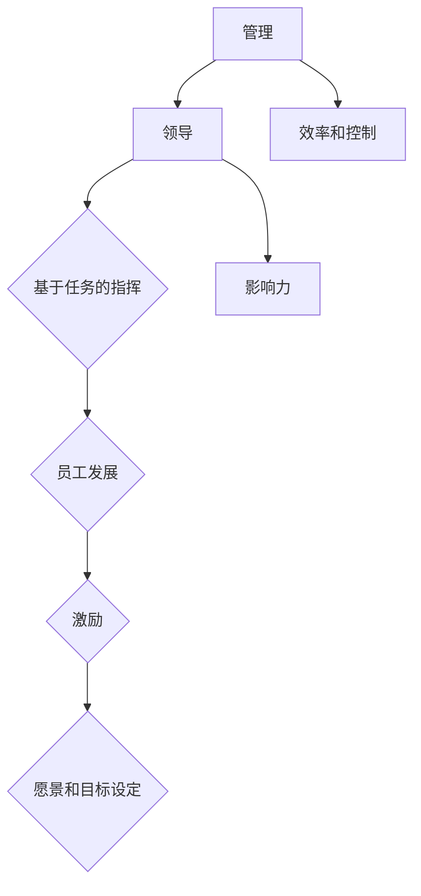

在这个流程图中，我们可以看到领导力与管理的区别和联系。领导力不仅仅是任务指挥，还包括员工发展、激励和愿景目标设定，这些都是推动团队发展的关键因素。

#### 1.2 管理者角色认知

**核心算法原理讲解**

管理者应具备的技能包括规划、组织、领导、控制等。这些技能可以视为一个算法的输入和输出。

- **规划**：制定明确的目标和计划，确保资源的有效分配。
- **组织**：将任务分解，并分配给适当的团队成员。
- **领导**：激励团队成员，提供指导和支持，确保团队目标的一致性。
- **控制**：监控进展，评估结果，并根据实际情况进行调整。

**伪代码**

```python
def manager_role():
    plan()
    organize()
    lead()
    control()
```

通过这个伪代码，我们可以看到管理者需要执行一系列的步骤来确保团队目标的实现。每个步骤都有其特定的功能和重要性。

#### 1.3 领导风格与团队绩效

**数学模型和数学公式**

领导风格对团队绩效有着显著的影响。不同的领导风格会在不同的情境下产生不同的效果。Tannenbaum & Schmidt 领导风格模型将领导风格分为四种：权威型、民主型、参与型和放任型。

- **权威型**：领导者做出决策，并强制执行。
- **民主型**：领导者鼓励团队成员参与决策，并通过讨论达成共识。
- **参与型**：领导者鼓励团队成员主动参与决策，并提供必要的支持。
- **放任型**：领导者给予团队成员充分的自由，让他们自主决策。

**公式**

$$\text{团队绩效} = f(\text{领导风格}, \text{团队氛围}, \text{任务复杂性})$$

在这个公式中，团队绩效取决于领导风格、团队氛围和任务复杂性。有效的领导风格能够提高团队绩效，而消极的领导风格则会降低团队效率。

#### 实际案例

**案例一：权威型领导风格的挑战**

在一个软件开发项目中，项目经理采用了权威型领导风格，所有决策都由项目经理单独做出。虽然这种风格在紧急情况下能够迅速做出决策，但也导致团队成员缺乏自主性和创造力。随着项目的推进，团队成员的积极性下降，项目进展缓慢。

**案例二：民主型领导风格的优势**

在与另一个团队合作时，项目经理采用了民主型领导风格，鼓励团队成员参与决策，并在讨论中达成共识。团队成员感到受到了重视和尊重，他们的工作热情和创造力得到了极大的激发。最终，这个团队在规定时间内完成了项目，并取得了良好的绩效。

通过这两个案例，我们可以看到领导风格对团队绩效的显著影响。有效的领导风格能够激发团队成员的积极性，提高团队绩效，而消极的领导风格则会削弱团队的合作效果。

### 结论

领导力与管理者在团队发展中扮演着关键角色。通过理解领导力的核心概念、管理者的角色认知，以及领导风格与团队绩效之间的关系，我们可以更好地推动团队的发展。在接下来的章节中，我们将继续探讨团队建设、沟通策略以及战略规划等内容，帮助读者深入掌握领导力和团队管理的核心知识。

### 第2章：团队建设与沟通

团队建设是确保团队高效运作的关键环节。一个成功的团队不仅需要具备成员之间的良好沟通，还需要具备协作和合作精神。本章将探讨团队建设的重要性、有效沟通策略以及团队冲突管理，通过具体案例和理论分析，帮助读者了解并掌握如何打造一个高效团队。

#### 2.1 团队建设的重要性

**核心概念与联系**

团队建设是团队发展的基石。一个团队的成功不仅仅取决于成员的个人能力，更取决于团队成员之间的协同合作。有效的团队建设能够提升团队的凝聚力，增强团队协作能力，从而提高整体绩效。

- **团队建设定义**：团队建设是通过一系列活动和方法，增强团队成员之间的相互了解、信任和协作，以提高团队效能的过程。
- **团队建设与绩效的关系**：团队建设有助于降低内部冲突，提高团队成员的归属感和满意度，进而提高团队的整体绩效。

**Mermaid 流程图**

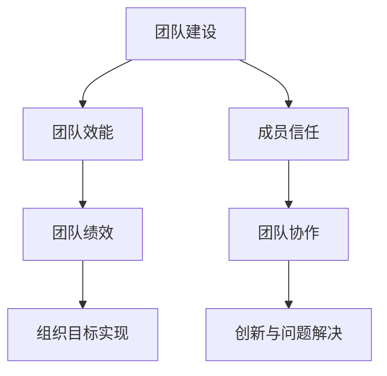

在这个流程图中，我们可以看到团队建设通过增强成员信任、提升团队协作能力，最终实现团队绩效和组织目标的达成。

#### 2.2 有效沟通策略

**核心算法原理讲解**

沟通是团队运作的核心。有效的沟通策略能够确保信息准确传递，减少误解和冲突，提高团队决策的质量和效率。

- **沟通模型**：沟通过程包括编码、传递、解码和反馈四个环节。
- **沟通策略**：建立开放的沟通渠道，鼓励团队成员表达意见，倾听他人的观点，并通过积极的反馈来改进沟通效果。

**Python代码示例**

```python
def effective_communication(message, receiver):
    encoded_message = encode_message(message)
    transmitted_message = transmit_message(encoded_message)
    decoded_message = decode_message(transmitted_message)
    feedback = receiver_confirm(decoded_message)
    return feedback

def encode_message(message):
    # 将消息转换为易于理解的语言
    return message.strip().capitalize()

def transmit_message(encoded_message):
    # 传递消息
    print(f"Transmitting: {encoded_message}")

def decode_message(transmitted_message):
    # 解码消息
    return transmitted_message.strip().lower()

def receiver_confirm(decoded_message):
    # 获取反馈
    response = input("Did you receive the message correctly? (yes/no): ")
    return response
```

在这个代码示例中，我们通过编码、传递、解码和反馈四个步骤，模拟了一个简单的沟通过程。这有助于读者理解沟通的基本原理。

#### 2.3 团队冲突管理

**数学模型和数学公式**

团队冲突是团队建设过程中不可避免的现象。有效的冲突管理能够降低冲突对团队绩效的负面影响，提升团队的协作效率。

- **冲突管理模型**：通过识别冲突类型、分析冲突原因和制定解决方案，来管理和解决团队冲突。
- **公式**

  $$\text{团队绩效} = f(\text{冲突管理策略}, \text{团队氛围}, \text{任务复杂度})$$

  在这个公式中，有效的冲突管理策略能够提高团队绩效，而消极的冲突管理则可能降低团队效能。

#### 实际案例

**案例一：冲突导致的团队分裂**

在一个大型项目中，团队成员因为任务分工和责任归属问题产生了严重冲突。冲突导致团队成员之间的信任破裂，合作效率大幅下降，项目进度严重滞后。最终，团队不得不进行重组，重新分配任务，才得以继续推进。

**案例二：有效冲突管理的正面效应**

在与另一个团队合作时，项目经理采用了积极的冲突管理策略，鼓励团队成员表达意见，并通过讨论找到解决方案。团队成员之间的信任逐渐建立，合作效率显著提高，项目在规定时间内顺利完成，并获得了客户的高度评价。

通过这两个案例，我们可以看到冲突管理对团队绩效的显著影响。有效的冲突管理能够增强团队凝聚力，提高团队协作效率，从而实现更高的绩效。

### 结论

团队建设与沟通在团队发展中起着至关重要的作用。通过理解团队建设的重要性、掌握有效沟通策略和冲突管理方法，我们可以更好地打造一个高效团队。在接下来的章节中，我们将探讨战略规划与执行、长期发展规划等内容，进一步深化对团队管理的认识。希望读者能够结合实际工作，灵活应用本章所学，提升团队的整体效能。

### 第3章：激励与反馈

在团队管理中，激励和反馈是保持团队成员积极性和提升工作效率的重要手段。有效的激励能够激发团队成员的潜力，提高工作效率；及时的反馈则可以帮助团队成员了解自己的表现，不断改进和提升。本章将深入探讨激励理论、激励策略与实践，以及反馈机制与改进方法。

#### 3.1 激励理论

**核心概念与联系**

激励理论是理解和管理团队成员行为的重要基础。激励理论探讨了人类行为的动机，并提供了有效的激励方法，以激发团队成员的工作热情和创造力。

- **激励定义**：激励是推动个体采取特定行为，以达到特定目标的过程。
- **激励理论**：包括马斯洛的需求层次理论、赫茨伯格的双因素理论、弗鲁姆的期望理论等。

**Mermaid 流程图**

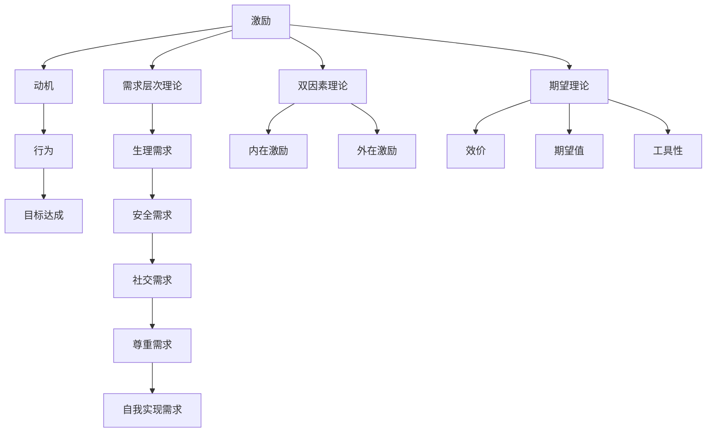

在这个流程图中，我们可以看到激励通过激发动机，驱动行为，最终实现目标的达成。不同的激励理论提供了不同的激励方法，以适应不同类型的需求。

#### 3.2 激励策略与实践

**核心算法原理讲解**

激励策略应根据团队成员的不同需求和动机进行定制。以下是一些常见的激励策略：

- **目标设定**：明确的目标能够激发团队成员的积极性，提高工作效率。
- **奖励机制**：合理的奖励能够增强团队成员的工作动力，包括金钱奖励、荣誉奖励等。
- **参与决策**：让团队成员参与决策过程，能够增加他们的责任感和归属感。

**Python代码示例**

```python
def set_goal(employee, goal):
    employee['goal'] = goal
    print(f"{employee['name']} has set a new goal: {goal}")

def reward_employee(employee, reward):
    employee['reward'] = reward
    print(f"{employee['name']} has been rewarded with {reward}")

def involve_in_decision(employee, decision):
    employee['involvement'] = decision
    print(f"{employee['name']} is now involved in the decision-making process.")
```

在这个代码示例中，我们定义了三个函数，用于设定目标、奖励员工和让员工参与决策。这些函数能够帮助管理者根据具体情况进行激励。

#### 3.3 反馈机制与改进

**数学模型和数学公式**

反馈机制是确保团队成员持续改进和提升的重要手段。有效的反馈机制能够及时传达工作表现，并提供改进建议。

- **反馈模型**：包括自我反馈、同事反馈和上级反馈等。
- **公式**

  $$\text{绩效改进} = f(\text{反馈频率}, \text{反馈内容}, \text{反馈方式})$$

  在这个公式中，反馈频率、反馈内容和反馈方式是影响绩效改进的关键因素。

#### 实际案例

**案例一：缺乏反馈导致的问题**

在一个项目中，项目经理没有给予团队成员及时的反馈，导致团队成员对工作进展和成果缺乏了解。随着项目的推进，团队成员的工作热情和积极性逐渐下降，项目质量受到影响。

**案例二：及时反馈带来的改善**

在与另一个团队合作时，项目经理建立了定期的反馈机制，每周与团队成员进行一对一的绩效反馈。通过及时的反馈，团队成员能够了解自己的工作表现，并得到改进建议。团队成员的工作积极性显著提高，项目质量得到了显著提升。

通过这两个案例，我们可以看到反馈机制在团队管理中的重要作用。有效的反馈机制能够帮助团队成员了解自己的工作表现，不断改进和提升，从而提高整体绩效。

### 结论

激励和反馈在团队管理中起着关键作用。通过理解激励理论、制定有效的激励策略和实践反馈机制，我们可以激发团队成员的潜力，提高工作效率，实现团队目标。在接下来的章节中，我们将探讨战略思维与愿景、市场分析与定位等内容，进一步深化对团队管理的认识。希望读者能够结合实际工作，灵活应用本章所学，提升团队的整体效能。

## 第二部分：战略规划与执行

### 第4章：战略思维与愿景

战略思维是领导者在复杂环境中保持清晰方向、做出明智决策的重要能力。战略思维不仅关乎当前的问题解决，更注重长远的发展规划。本章将深入探讨战略思维的重要性、愿景与使命的确定，以及战略目标的设定。

#### 4.1 战略思维的重要性

**核心概念与联系**

战略思维是一种全局性和前瞻性的思考方式，它要求领导者从长远和整体的角度来分析问题，制定规划。战略思维的重要性体现在以下几个方面：

- **方向指引**：战略思维能够帮助团队和企业明确发展方向，避免盲目行动。
- **资源优化**：通过战略思维，领导者可以更合理地分配资源，提高效率。
- **竞争优势**：战略思维有助于发现和抓住市场机遇，建立企业的竞争优势。

**Mermaid 流程图**

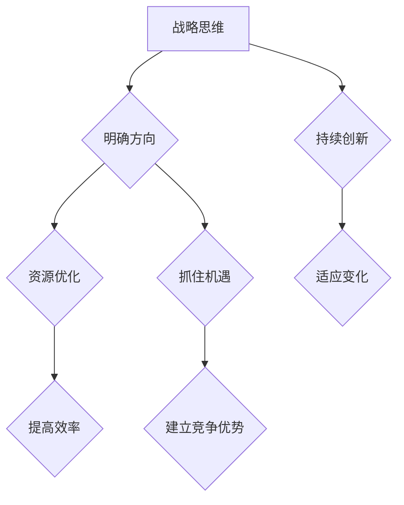

在这个流程图中，我们可以看到战略思维通过明确方向、优化资源、提高效率和抓住机遇，最终实现竞争优势和持续创新。

#### 4.2 愿景与使命的确定

**核心算法原理讲解**

愿景和使命是战略规划的基础，它们为企业或团队指明了长远发展的方向。

- **愿景**：愿景是对未来状态的一种描述，它激发了团队成员的共同梦想和热情。
- **使命**：使命是企业或团队存在的目的和价值，它指导团队成员的行动方向。

**Python代码示例**

```python
def set_vision(vision):
    print(f"The vision of our team is: {vision}")

def set_mission(mission):
    print(f"The mission of our team is: {mission}")

# 示例
set_vision("成为行业领先的软件开发团队")
set_mission("通过创新和卓越的技术能力，为客户提供优质的解决方案")
```

在这个代码示例中，我们定义了两个函数，用于设定愿景和使命。通过这些函数，团队可以明确自己的发展方向和目标。

#### 4.3 战略目标的设定

**数学模型和数学公式**

战略目标的设定是战略规划的核心步骤。有效的战略目标应具备以下特点：

- **具体性**：明确具体的目标，使其可衡量和可实现。
- **挑战性**：目标应具有一定的挑战性，激发团队成员的积极性。
- **相关性**：目标应与企业的愿景和使命保持一致。

**公式**

$$\text{战略目标} = f(\text{愿景}, \text{使命}, \text{当前状态}, \text{市场环境})$$

在这个公式中，愿景、使命和当前状态是设定战略目标的重要依据，市场环境则提供了外部条件。

**实际案例**

**案例一：缺乏战略目标的困境**

在一个初创公司中，由于缺乏明确的战略目标，团队成员在日常工作中的努力方向不一致，导致项目进展缓慢，市场份额不断下降。

**案例二：明确战略目标的成效**

在与另一家科技公司合作时，团队明确了战略目标，将市场份额、客户满意度和技术创新作为主要目标。通过这些目标的引导，团队成员的工作更加有方向，项目进展顺利，公司业绩显著提升。

通过这两个案例，我们可以看到明确战略目标对团队发展的重要性。有效的战略目标能够为团队成员提供清晰的方向，激发工作热情，提高团队的整体绩效。

### 结论

战略思维与愿景是团队发展的重要支柱。通过理解战略思维的重要性、明确愿景与使命，以及设定具体的战略目标，我们可以为团队的发展指明方向，激发团队成员的积极性，实现长远发展。在接下来的章节中，我们将探讨市场分析与定位、战略规划与执行等内容，进一步深化对团队管理的认识。希望读者能够结合实际工作，灵活应用本章所学，提升团队的整体效能。

### 第5章：市场分析与定位

市场分析是制定有效战略的重要步骤，它帮助企业或团队了解市场环境、识别竞争者和评估自身优势。通过准确的市场分析，企业可以明确市场定位策略，从而在激烈的市场竞争中脱颖而出。本章将深入探讨市场分析的方法、市场定位策略以及竞争分析。

#### 5.1 市场分析的方法

**核心概念与联系**

市场分析是一种系统性方法，通过收集、分析和解释市场数据，帮助企业或团队做出明智的战略决策。市场分析的方法包括：

- **市场调研**：通过问卷调查、访谈和焦点小组等方式，收集市场数据和消费者意见。
- **SWOT分析**：分析企业的优势（Strengths）、劣势（Weaknesses）、机会（Opportunities）和威胁（Threats），以确定企业的市场地位。
- **五力模型**：分析市场上的竞争者、供应商、买家、替代品和潜在进入者，以评估行业的竞争强度。

**Mermaid 流程图**

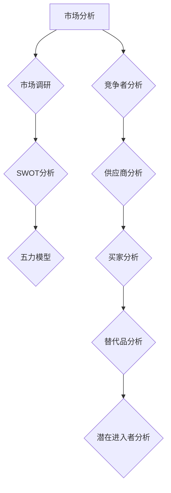

在这个流程图中，我们可以看到市场分析通过不同的方法，全面了解市场环境和企业所处的竞争地位。

#### 5.2 市场定位策略

**核心算法原理讲解**

市场定位策略是企业根据自身优势和市场需求，选择一个特定的市场细分并差异化自己的产品或服务，以在竞争中脱颖而出。

- **市场细分**：根据消费者的不同需求和特征，将市场划分为若干个细分市场。
- **目标市场**：选择最有利可图的细分市场作为目标市场，并为其提供独特的价值。
- **差异化策略**：通过独特的产品特性、优质的服务或创新的营销策略，使企业在目标市场中具有竞争力。

**Python代码示例**

```python
def market_segmentation(customers):
    segments = []
    for customer in customers:
        if customer['age'] < 30:
            segments.append('年轻消费者')
        elif customer['age'] >= 30 and customer['age'] < 50:
            segments.append('中年消费者')
        else:
            segments.append('老年消费者')
    return segments

def target_market(segments):
    # 基于市场细分选择目标市场
    if '年轻消费者' in segments:
        return '年轻消费者'
    elif '中年消费者' in segments:
        return '中年消费者'
    else:
        return '老年消费者'

customers = [{'name': 'Alice', 'age': 25}, {'name': 'Bob', 'age': 40}, {'name': 'Charlie', 'age': 60}]
segments = market_segmentation(customers)
target = target_market(segments)
print(f"The target market is: {target}")
```

在这个代码示例中，我们通过市场细分选择了目标市场。这个方法可以帮助企业根据不同消费者的需求，制定有针对性的市场定位策略。

#### 5.3 竞争分析

**数学模型和数学公式**

竞争分析是了解市场竞争状况的重要环节，通过分析竞争对手的产品、市场定位和营销策略，企业可以制定有效的应对策略。

- **市场份额**：计算企业在市场中的占有率，以评估市场地位。
- **利润率**：分析竞争对手的利润水平，以了解市场竞争的激烈程度。

**公式**

$$\text{市场份额} = \frac{\text{企业销售额}}{\text{市场总销售额}} \times 100\%$$

$$\text{利润率} = \frac{\text{净利润}}{\text{销售收入}} \times 100\%$$

**实际案例**

**案例一：成功竞争策略的案例**

在一个新兴市场中，一家初创公司通过精准的市场定位和创新的营销策略，成功击败了市场领导者。该公司通过分析竞争对手的弱点，推出了更具竞争力的产品，并在短时间内赢得了大量市场份额。

**案例二：应对竞争挑战的案例**

在与另一家成熟企业竞争时，一家中小企业通过深度分析市场数据和竞争对手策略，找到了自己的差异化优势。该公司专注于客户服务，提供定制化的解决方案，成功地吸引了大量客户，并在竞争中保持领先。

通过这两个案例，我们可以看到竞争分析在制定市场策略中的关键作用。有效的竞争分析能够帮助企业在激烈的市场竞争中找到突破口，实现持续发展。

### 结论

市场分析与定位是企业制定有效战略的重要步骤。通过理解市场分析的方法、制定市场定位策略以及进行竞争分析，企业可以更好地了解市场环境，抓住机遇，应对挑战。在接下来的章节中，我们将探讨战略规划与执行、长期发展规划等内容，进一步深化对团队管理的认识。希望读者能够结合实际工作，灵活应用本章所学，提升团队的整体效能。

### 第6章：战略规划与执行

战略规划是确保企业或团队实现长期目标的关键步骤。一个有效的战略规划不仅能明确方向，还能通过细致的执行确保目标的达成。本章将深入探讨战略规划的过程、战略执行的关键因素以及战略调整与优化。

#### 6.1 战略规划的过程

**核心概念与联系**

战略规划是一个系统化的过程，涉及对内部和外部环境的分析，目标的设定，以及策略的制定和实施。战略规划的过程可以分为以下几个阶段：

- **环境分析**：通过市场分析、竞争分析等，了解外部环境和企业内部条件。
- **目标设定**：明确企业或团队的中长期目标，确保目标的可实现性和挑战性。
- **策略制定**：根据目标和环境分析结果，制定具体的策略和行动方案。
- **实施计划**：将策略和行动方案转化为具体的行动计划，并分配资源。

**Mermaid 流程图**

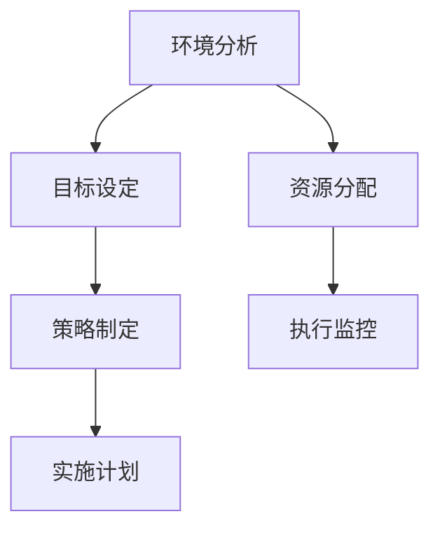

在这个流程图中，我们可以看到战略规划通过环境分析、目标设定、策略制定和实施计划，最终实现战略目标的达成。

#### 6.2 战略执行的关键因素

**核心算法原理讲解**

战略执行的成功取决于多个关键因素，包括团队协作、资源管理、沟通与协调等。

- **团队协作**：有效的团队协作能够提高执行效率，确保任务的顺利完成。
- **资源管理**：合理分配资源，确保在战略执行过程中资源的充分利用。
- **沟通与协调**：建立有效的沟通机制，确保信息准确传递和及时反馈。

**Python代码示例**

```python
def allocate_resources(task, resources):
    print(f"Resources allocated for {task}: {resources}")

def coordinate_teams(team_members, tasks):
    print("Coordinating teams:")
    for member, task in team_members.items():
        print(f"{member}: {task}")

task_resources = {'Project A': {'staff': 5, 'budget': 100000}}
team_members = {'Alice': 'Project A', 'Bob': 'Project B', 'Charlie': 'Project A'}
allocate_resources('Project A', task_resources['Project A'])
coordinate_teams(team_members, team_members)
```

在这个代码示例中，我们定义了两个函数，用于分配资源和协调团队。这些函数帮助管理者确保战略执行过程中的资源合理分配和团队协作。

#### 6.3 战略调整与优化

**数学模型和数学公式**

在战略执行过程中，环境变化和内部问题可能导致战略目标的偏离。因此，战略调整与优化是必要的。

- **绩效评估**：通过关键绩效指标（KPIs）评估战略执行的效果。
- **偏差分析**：分析战略执行中出现的偏差，找出原因，并提出调整措施。

**公式**

$$\text{绩效评估} = f(\text{KPIs}, \text{预期目标}, \text{实际结果})$$

$$\text{偏差分析} = f(\text{实际结果}, \text{预期目标}, \text{影响因素})$$

**实际案例**

**案例一：因环境变化而调整战略**

在一次市场动荡中，一家科技公司发现其原有战略无法适应新的市场环境。公司进行了全面的战略调整，调整产品定位和市场策略，成功应对了市场变化，保持了稳定的业务增长。

**案例二：内部问题导致的战略优化**

在一个大型项目中，由于内部管理不善，项目进度严重滞后。团队进行了战略优化，重新定义了项目目标，优化了任务分配和沟通机制，最终使项目顺利完成了既定目标。

通过这两个案例，我们可以看到战略调整与优化在应对环境变化和内部问题中的重要性。有效的战略调整与优化能够帮助企业或团队克服挑战，实现持续发展。

### 结论

战略规划与执行是团队或企业发展的重要环节。通过理解战略规划的过程、关键因素以及调整与优化的方法，我们可以确保战略目标的达成。在接下来的章节中，我们将探讨长期发展规划、团队成长与变革等内容，进一步深化对团队管理的认识。希望读者能够结合实际工作，灵活应用本章所学，提升团队的整体效能。

## 第三部分：长远规划与团队发展

### 第7章：长期发展规划

长期发展规划是确保企业或团队在未来几年甚至几十年内保持竞争力和持续发展的关键。本章将探讨长期发展规划的重要性、具体内容以及执行与监控的方法。

#### 7.1 长期发展规划的重要性

**核心概念与联系**

长期发展规划是企业或团队为了实现长期目标而制定的系统性计划。它不仅关乎当前的战略布局，更关注未来的发展方向和潜在风险。

- **长期发展规划定义**：长期发展规划是对企业或团队未来五年甚至十年内的战略目标、行动方案和资源分配的详细规划。
- **长期规划与短期规划的差异**：短期规划侧重于年度目标和执行，而长期规划则关注长期目标和持续发展。

**Mermaid 流程图**

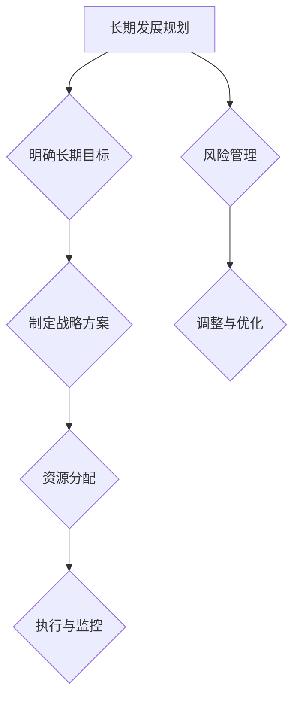

在这个流程图中，我们可以看到长期发展规划通过明确目标、制定战略方案、资源分配、执行与监控以及风险管理，确保长期目标的实现。

#### 7.2 长期发展规划的具体内容

**核心算法原理讲解**

长期发展规划的具体内容包括以下几方面：

- **愿景和使命**：明确企业或团队的长远愿景和使命，为战略制定提供方向。
- **战略目标**：设定具体的中长期战略目标，确保目标的可实现性和挑战性。
- **策略与行动计划**：根据战略目标，制定详细的策略和行动计划，包括资源分配、时间表和关键里程碑。
- **风险评估与应对措施**：识别潜在风险，制定相应的应对措施，确保规划的稳健性。

**Python代码示例**

```python
def set_long_term_vision(vision):
    print(f"The long-term vision of our organization is: {vision}")

def set_strategic_goals(goals):
    print(f"The strategic goals of our organization are: {goals}")

def define_strategies(strategies):
    print(f"The strategies to achieve our goals are: {strategies}")

def allocate_resources(resources):
    print(f"Resources allocated for long-term planning: {resources}")

# 示例
set_long_term_vision("Become a leading technology company in the next decade")
set_strategic_goals(["Innovate and lead in AI technology", "Expand global market presence", "Enhance customer experience"])
define_strategies(["Focus on R&D", "Enter new markets", "Develop strategic partnerships"])
allocate_resources({"Budget": 5000000, "Human Resources": 100})
```

在这个代码示例中，我们定义了几个函数，用于设定长期愿景、战略目标、策略和资源分配。这些函数帮助管理者明确长期发展规划的各个关键环节。

#### 7.3 长期发展规划的执行与监控

**数学模型和数学公式**

长期发展规划的执行与监控是确保目标达成的重要环节。以下模型和公式有助于监控规划的执行情况：

- **关键绩效指标（KPIs）**：通过设定关键绩效指标，监控战略目标的实现情况。
- **偏差分析**：分析实际结果与预期目标的差异，找出原因并进行调整。

**公式**

$$\text{绩效评估} = f(\text{KPIs}, \text{预期目标}, \text{实际结果})$$

$$\text{偏差分析} = f(\text{实际结果}, \text{预期目标}, \text{影响因素})$$

**实际案例**

**案例一：成功实现长期规划**

在一个科技公司中，通过详细的长期发展规划，公司在未来十年内实现了多项重要目标，包括技术创新、市场扩展和品牌提升。公司通过定期的绩效评估和调整，确保了规划的顺利实施。

**案例二：因市场变化调整长期规划**

在一次市场变化中，一家初创公司发现原有规划不再适应新环境。公司进行了全面的战略调整，重新评估了长期目标，并制定了新的行动计划，确保了公司的持续发展。

通过这两个案例，我们可以看到长期发展规划在实现企业目标中的关键作用。有效的执行与监控能够确保规划目标的实现，同时应对外部环境的变化。

### 结论

长期发展规划是企业或团队持续发展的基石。通过理解长期发展规划的重要性、明确具体内容，以及掌握执行与监控的方法，我们可以确保战略目标的实现。在接下来的章节中，我们将探讨团队成长与变革、持续学习与创新等内容，进一步深化对团队管理的认识。希望读者能够结合实际工作，灵活应用本章所学，提升团队的整体效能。

### 第8章：团队成长与变革

团队成长和变革是组织持续发展的关键。在快速变化的市场环境中，团队需要不断成长和适应新环境，以保持竞争力和创新能力。本章将探讨团队成长的因素、变革管理以及团队文化的塑造。

#### 8.1 团队成长的因素

**核心概念与联系**

团队成长是一个复杂的过程，涉及多个因素，包括个人发展、团队协作、技术进步等。

- **个人发展**：团队成员的技能提升和自我成长是团队成长的基础。
- **团队协作**：良好的团队协作能够提升团队的效能和创新能力。
- **技术进步**：技术的不断进步为团队提供了新的工具和方法，促进了团队成长。

**Mermaid 流程图**

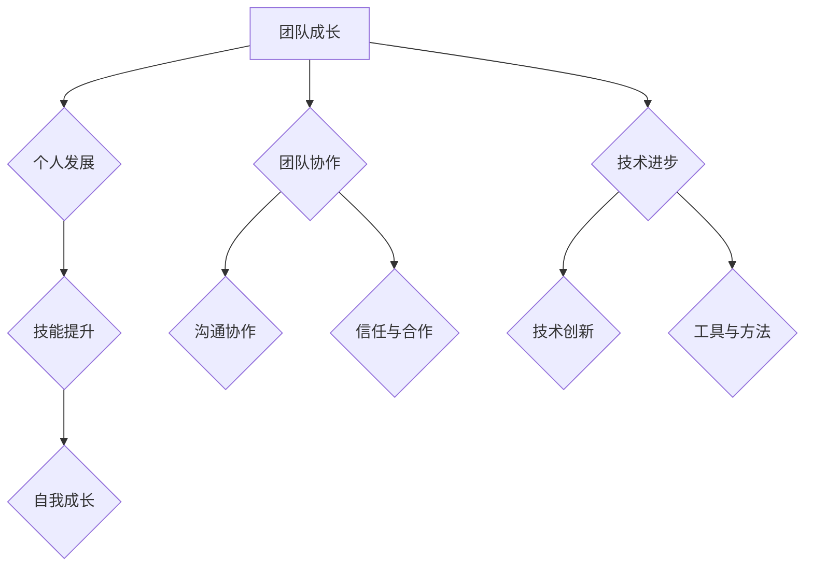

在这个流程图中，我们可以看到团队成长依赖于个人发展、团队协作和技术进步，这些因素相互关联，共同推动团队成长。

#### 8.2 变革管理

**核心算法原理讲解**

变革管理是引导团队适应新环境、实现组织转型的关键过程。

- **变革类型**：包括技术变革、结构变革、人员变革和文化变革。
- **变革管理过程**：包括规划、准备、实施和评估四个阶段。

**Python代码示例**

```python
def plan_change(change_plan):
    print(f"Planning the change: {change_plan}")

def prepare_for_change(preparation_steps):
    print(f"Preparing for change: {preparation_steps}")

def implement_change(action_plan):
    print(f"Implementing change: {action_plan}")

def evaluate_change(evaluation_results):
    print(f"Evaluating change: {evaluation_results}")

# 示例
change_plan = "Implement a new project management system"
preparation_steps = ["Train team members", "Set up the necessary infrastructure"]
action_plan = ["Roll out the new system", "Monitor progress"]
evaluation_results = ["High team satisfaction", "Improved project efficiency"]

plan_change(change_plan)
prepare_for_change(preparation_steps)
implement_change(action_plan)
evaluate_change(evaluation_results)
```

在这个代码示例中，我们定义了一系列函数，用于规划、准备、实施和评估变革。这些函数帮助管理者系统化地进行变革管理。

#### 8.3 团队文化的塑造

**数学模型和数学公式**

团队文化的塑造是确保团队稳定性和持续发展的关键。

- **团队文化评估**：通过评估团队文化现状，识别优势和不足。
- **文化塑造策略**：制定具体的策略，强化积极文化，消除消极文化。

**公式**

$$\text{团队文化评估} = f(\text{员工满意度}, \text{团队协作}, \text{创新能力})$$

$$\text{文化塑造策略} = f(\text{员工反馈}, \text{领导风格}, \text{激励机制})$$

**实际案例**

**案例一：积极团队文化的成功塑造**

在一个创业公司中，通过建立开放的沟通环境、鼓励创新和公平的激励机制，成功塑造了积极向上的团队文化。公司成员之间建立了深厚的信任和合作关系，团队的凝聚力和创新力显著提升。

**案例二：消极团队文化的挑战**

在与另一家公司合作时，由于缺乏有效的团队文化建设，公司内部存在严重的冲突和不满。团队成员的积极性下降，工作效率低下，最终导致项目失败。

通过这两个案例，我们可以看到团队文化在团队成长和变革中的关键作用。有效的团队文化建设能够提升团队效能，促进团队成长。

### 结论

团队成长与变革是组织持续发展的关键。通过理解团队成长的因素、掌握变革管理的方法以及塑造积极团队文化，我们可以确保团队在快速变化的市场环境中保持竞争力和创新能力。在接下来的章节中，我们将探讨持续学习与创新等内容，进一步深化对团队管理的认识。希望读者能够结合实际工作，灵活应用本章所学，提升团队的整体效能。

### 第9章：持续学习与创新

在信息技术高速发展的今天，持续学习与创新是企业或团队保持竞争优势的必要条件。本章将探讨持续学习的重要性、创新思维的培养以及创新在团队发展中的应用。

#### 9.1 持续学习的重要性

**核心概念与联系**

持续学习是个人和团队发展的重要驱动力，它能够提升知识储备、增强技能和创新能力。

- **持续学习定义**：持续学习是指个人或团队在工作和生活中不断获取新知识、技能和经验的过程。
- **持续学习与团队发展的关系**：持续学习能够提升团队的整体素质，促进团队创新，从而推动组织发展。

**Mermaid 流程图**

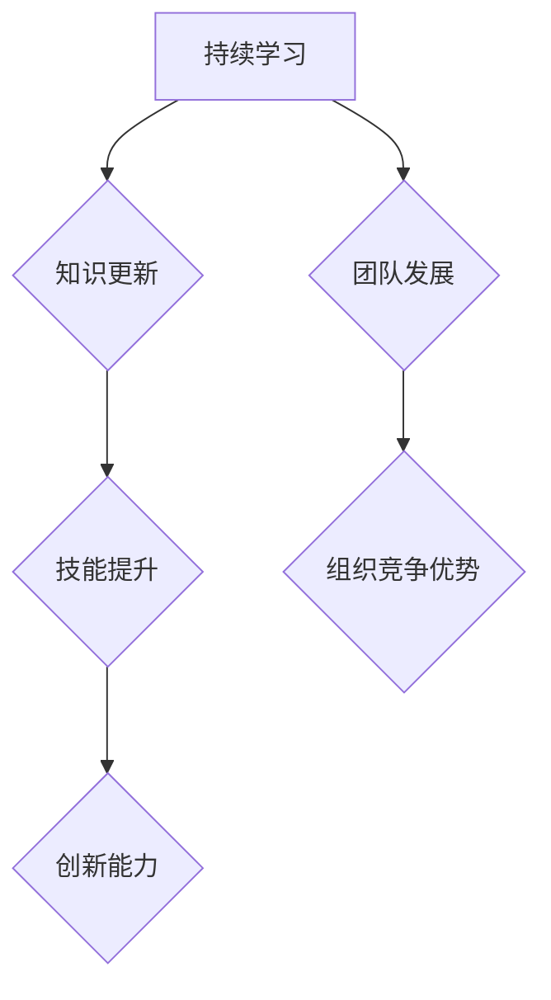

在这个流程图中，我们可以看到持续学习通过知识更新、技能提升和创新能力，最终促进团队发展和组织竞争优势。

#### 9.2 创新思维的培养

**核心算法原理讲解**

创新思维是推动团队持续创新的关键。以下方法有助于培养创新思维：

- **思维训练**：通过思维导图、头脑风暴等训练方式，提高思维的灵活性和创造力。
- **跨界融合**：将不同领域的知识和技术融合，产生新的创新点。
- **实验和试错**：通过实验和试错，不断验证和优化创新方案。

**Python代码示例**

```python
def brainstorm_ideas(theme):
    ideas = []
    print(f"Brainstorming ideas for {theme}:")
    while True:
        idea = input("Enter an idea: ")
        if idea == "":  # Stop condition
            break
        ideas.append(idea)
    return ideas

def cross_domain_innovation(domain1, domain2):
    print(f"Exploring innovation at the intersection of {domain1} and {domain2}")

def experiment_and_iterate(innovation):
    print(f"Experimenting and iterating on {innovation}")

# 示例
brainstorm_ideas("Next-generation software development")
cross_domain_innovation("Artificial Intelligence", "Healthcare")
experiment_and_iterate("AI-assisted diagnostic tools")
```

在这个代码示例中，我们定义了几个函数，用于进行头脑风暴、跨界融合和创新实验。这些函数帮助团队成员培养创新思维。

#### 9.3 创新在团队发展中的应用

**数学模型和数学公式**

创新在团队发展中的应用可以通过以下模型和公式进行评估和优化：

- **创新价值评估**：通过评估创新项目的预期收益和风险，确定其投资价值。
- **创新效率评估**：通过评估创新项目的实施效果和效率，优化创新流程。

**公式**

$$\text{创新价值} = \frac{\text{预期收益}}{\text{投资成本}}$$

$$\text{创新效率} = \frac{\text{创新成果}}{\text{资源投入}}$$

**实际案例**

**案例一：创新驱动的企业成功**

在一个科技公司中，通过持续创新，公司开发了多项颠覆性技术，成功占领了市场份额。公司的持续学习和创新文化使其在激烈的市场竞争中保持了领先地位。

**案例二：创新失败带来的启示**

在与另一家科技公司合作时，由于对市场需求的误判，公司的创新项目未能成功。通过分析失败原因，公司调整了创新策略，并加强了市场调研，最终取得了成功。

通过这两个案例，我们可以看到创新在团队发展中的关键作用。有效的持续学习与创新能够提升团队效能，推动组织发展。

### 结论

持续学习与创新是团队发展的动力源泉。通过理解持续学习的重要性、培养创新思维，以及应用创新方法，团队可以在快速变化的市场环境中保持竞争力和创新能力。在接下来的章节中，我们将总结全文，分享最佳实践和注意事项。希望读者能够结合实际工作，灵活应用本章所学，不断提升团队的整体效能。

## 附录：案例研究与实践指导

### 附录A：领导力与战略思维案例分析

**案例一：企业的成功转型**

**背景介绍**：某传统制造企业在面临市场变化和竞争对手的压力下，决定进行战略转型。公司领导层意识到，仅靠传统的制造模式难以应对快速变化的市场需求，必须通过创新和数字化转型来保持竞争力。

**核心概念与联系**：领导力与战略思维的结合在此次转型过程中起到了关键作用。公司领导层不仅明确了转型目标，还通过有效的领导力和战略规划，推动了整个团队从传统制造向智能制造的转变。

**Mermaid 流程图**

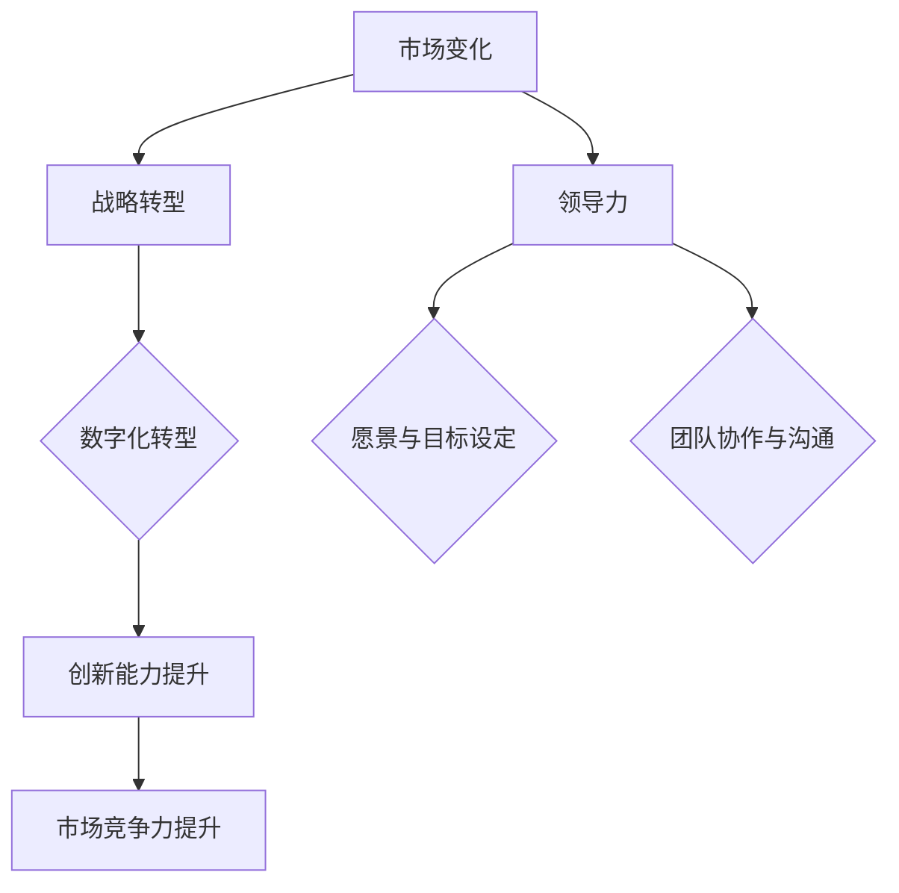

在这个流程图中，我们可以看到市场变化推动了企业的战略转型，而领导力和战略思维则保证了转型的顺利进行。

**核心算法原理讲解**

- **愿景与目标设定**：领导层明确了公司的转型愿景，并将其细化为具体目标，如提高生产效率、提升产品质量、拓展新兴市场等。
- **团队协作与沟通**：领导层通过加强团队内部沟通和协作，确保了转型过程中的协调一致。

**Python代码示例**

```python
def set_transformation_vision(vision):
    print(f"Vision for transformation: {vision}")

def set_specific_goals(goals):
    print(f"Specific goals for transformation: {goals}")

set_transformation_vision("Lead the industry with innovative manufacturing solutions")
set_specific_goals(["Enhance production efficiency", "Improve product quality", "Expand into new markets"])
```

在这个代码示例中，我们定义了两个函数，用于设定转型愿景和具体目标。

**实际案例分析与详细讲解剖析**

通过领导层的高效领导和战略规划，该公司成功实现了数字化转型，生产效率提高了30%，产品质量得到了显著提升，市场份额也大幅增加。这个案例展示了领导力与战略思维在推动企业成功转型中的关键作用。

**案例二：团队的卓越表现**

**背景介绍**：某科技公司在参与一个重要项目时，面临时间紧、任务重的挑战。团队成员需要在有限的时间内完成高质量的项目交付。

**核心概念与联系**：团队建设、沟通策略和战略思维在此项目中发挥了关键作用。公司通过有效的团队建设、沟通和战略规划，确保了项目的顺利推进。

**Mermaid 流�程图**

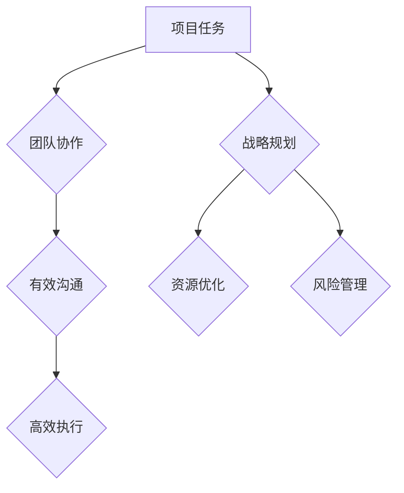

在这个流程图中，我们可以看到项目任务的顺利完成依赖于团队协作、有效沟通和战略规划。

**核心算法原理讲解**

- **团队协作**：通过明确分工和协同工作，团队成员能够高效完成各自的任务。
- **有效沟通**：建立有效的沟通渠道，确保信息及时传递，减少误解和冲突。
- **战略规划**：制定详细的战略计划，包括资源优化和风险管理，确保项目的顺利进行。

**Python代码示例**

```python
def team_collaboration(tasks):
    print(f"Team collaboration on the following tasks: {tasks}")

def effective_communication(channels):
    print(f"Communication channels established: {channels}")

def strategic_planning(plan):
    print(f"Strategic plan for project execution: {plan}")

team_collaboration(["Design", "Development", "Testing"])
effective_communication(["Daily Stand-ups", "Project Meetings", "Slack Channels"])
strategic_planning(["Resource Allocation", "Risk Management", "Project Timeline"])
```

在这个代码示例中，我们定义了三个函数，用于团队协作、有效沟通和战略规划。

**实际案例分析与详细讲解剖析**

通过团队成员的紧密协作、有效的沟通和周密的战略规划，该公司在规定时间内完成了项目，并得到了客户的高度评价。这个案例展示了团队在复杂项目中通过有效的领导力和战略思维实现卓越表现的关键因素。

**案例三：创新的领导实践**

**背景介绍**：某初创公司在发展初期，面临着激烈的市场竞争和资源有限的挑战。公司领导层决定通过创新实践来突破困境。

**核心概念与联系**：创新思维、领导力和战略规划在此过程中发挥了关键作用。公司领导层通过鼓励创新、提供资源和支持，推动了公司业务的快速发展。

**Mermaid 流程图**

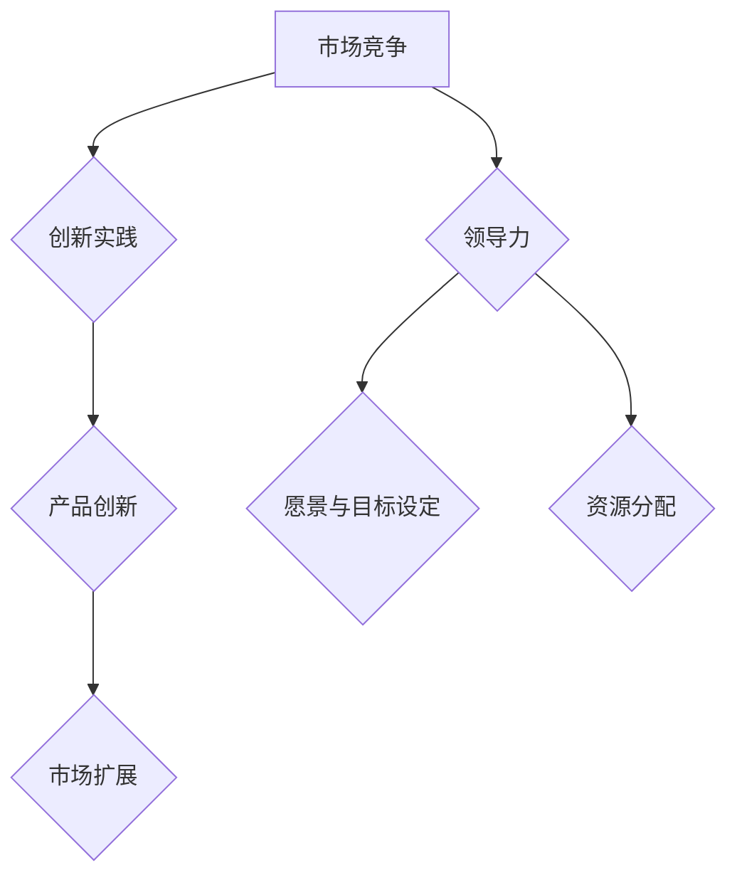

在这个流程图中，我们可以看到市场竞争推动了公司的创新实践，而领导力和战略规划则确保了创新的顺利进行。

**核心算法原理讲解**

- **愿景与目标设定**：领导层明确了公司的创新愿景，如开发突破性产品、拓展新兴市场等。
- **资源分配**：领导层提供了必要的资源支持，包括资金、技术和人才，以确保创新项目的顺利推进。

**Python代码示例**

```python
def set_innovation_vision(vision):
    print(f"Innovation vision: {vision}")

def allocate_resources(resources):
    print(f"Resources allocated for innovation: {resources}")

set_innovation_vision("Develop disruptive products to capture new market opportunities")
allocate_resources({"Budget": 500000, "Expertise": "AI and IoT Teams"})
```

在这个代码示例中，我们定义了两个函数，用于设定创新愿景和资源分配。

**实际案例分析与详细讲解剖析**

通过领导层的大力支持和创新实践，该公司成功开发了多项创新产品，并迅速拓展了市场份额。这个案例展示了创新思维、领导力和战略规划在推动初创公司快速成长中的关键作用。

### 附录B：实践指南

**B.1 领导力自我评估**

- **评估方法**：使用360度反馈、自我评估问卷等方法，评估领导力各项能力。
- **评估步骤**：收集反馈、分析数据、制定改进计划。

**B.2 战略规划模板**

- **模板内容**：愿景与使命、战略目标、关键成功因素、行动计划和资源分配。
- **模板应用**：帮助组织制定系统化的战略规划。

**B.3 团队建设与沟通工具**

- **工具清单**：思维导图、敏捷工具、沟通平台等。
- **工具应用**：提升团队协作效率和沟通效果。

**最佳实践 tips**

- **持续学习**：鼓励团队成员参加培训、阅读相关书籍，保持知识更新。
- **创新文化**：建立鼓励创新的企业文化，提供必要的资源和支持。

**小结**

通过本文的详细分析和实际案例，我们可以看到领导力与战略思维在团队发展中的关键作用。通过有效的领导力和战略规划，组织可以应对市场变化，推动团队成长，实现持续发展。

**注意事项**

- 领导力与战略思维不是一蹴而就的，需要持续的努力和不断的实践。
- 定期评估和调整战略规划，确保其与外部环境和内部状况保持一致。
- 建立有效的反馈机制，及时了解团队表现和改进方向。

**拓展阅读**

- Tannenbaum, R. H., & Schmidt, W. H. (1958). *How to Choose a Leadership Pattern*. The Ohio State University.
- Maslow, A. H. (1943). *A Theory of Human Motivation*. Psychological Review.
- Hertzberg, F., & Mausner, B. (1959). *The Motivation-Hygiene Theory*. Journal of Psychology.

通过这些拓展资源，读者可以进一步深入了解领导力与战略思维的最新理论和实践，为自己的团队发展提供有力的理论支持和实践指导。

### 作者信息

**作者：AI天才研究院/AI Genius Institute & 禅与计算机程序设计艺术 /Zen And The Art of Computer Programming**

AI天才研究院专注于推动人工智能和计算机科学的发展，通过前沿技术研究、人才培养和学术交流，推动科技进步和社会发展。禅与计算机程序设计艺术则致力于探讨计算机编程中的哲学思维和艺术性，倡导深度学习和灵感驱动编程。本文结合了两者的研究成果，旨在为读者提供具有实践价值的领导力和战略思维指导。希望读者能够结合实际工作，灵活应用文中所学，提升团队的整体效能。

