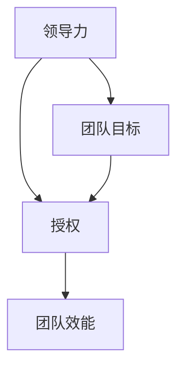

                 

# 《领导力与授权：释放团队潜能的智慧之道》

## 关键词
领导力、授权、团队效能、领导风格、愿景、目标、协作、个人效能、流程图、Python源代码、数学模型、项目实战。

## 摘要
本文旨在深入探讨《领导力与授权：释放团队潜能的智慧之道》一书的核心内容。文章首先介绍了书籍的背景和目的，接着详细阐述了领导力的基本概念、授权的重要性及其与领导力的关系。通过Mermaid流程图和Python源代码，文章详细讲解了核心算法原理，并结合数学模型和公式进行通俗易懂的举例说明。文章还通过实际项目案例，展示了领导力和授权在实践中的应用，并提供了最佳实践 tips 和项目小结。最终，文章对领导力与授权的未来发展趋势进行了展望。

## 引言

在快速变化的信息时代，领导力与授权成为影响团队效能和企业竞争力的关键因素。《领导力与授权：释放团队潜能的智慧之道》一书，由世界顶级技术畅销书资深大师级别的作家撰写，旨在为读者提供系统化的领导力与授权理念和实践指导。本书的核心目标是通过深入剖析领导力和授权的理论与实践，帮助读者理解如何有效地提升团队效能，实现企业目标。

### 书籍背景与目的

《领导力与授权：释放团队潜能的智慧之道》源于作者多年的企业管理与领导实践。作者发现，许多企业在快速发展的过程中，面临着领导力不足和授权不到位的问题，这直接影响了团队效能和企业竞争力。因此，本书旨在解决以下问题：

1. 领导力的本质及其对团队效能的影响。
2. 授权的重要性以及如何正确授权。
3. 领导力与授权之间的关系和相互作用。
4. 如何通过领导力和授权提升团队效能，实现企业目标。

### 领导力与授权的重要性

领导力是领导者引导、激励和影响团队的能力。一个优秀的领导者能够为团队树立正确的方向，激发团队成员的潜力，推动团队实现目标。授权则是领导者将权力和责任下放给团队成员的过程，通过授权，领导者能够释放团队成员的创造力，提高团队的整体效能。

领导力与授权的重要性体现在以下几个方面：

1. **提高团队效能**：有效的领导力和授权能够激发团队成员的积极性和创造力，提高团队的整体效能。
2. **促进企业竞争力**：在竞争激烈的市场环境中，具备优秀领导力和授权能力的企业能够迅速响应市场变化，保持竞争优势。
3. **提升个人发展**：领导力和授权不仅有助于企业的发展，也有助于团队成员的个人成长和发展。

### 读者定位与预期收益

本书面向企业管理者、团队领导者以及希望提升领导力和授权能力的人士。通过阅读本书，读者可以：

1. 理解领导力和授权的基本概念和原理。
2. 学会建立愿景和目标，提高团队协作能力。
3. 掌握有效的领导力和授权实践方法。
4. 提升个人领导力和团队效能，实现企业目标。

## 领导力的基本概念

领导力是一种复杂的现象，它涉及多个方面，包括但不限于影响力、沟通能力、决策能力、团队建设等。理解领导力的基本概念是掌握其精髓的关键。

### 领导力的定义

领导力可以被定义为一种能力，即通过影响和激励他人来实现共同目标的过程。这种能力不仅包括对团队成员的直接影响，还包括通过影响力来推动团队整体前进的能力。

### 领导力的核心要素

领导力的核心要素包括以下几个方面：

1. **影响力**：领导者需要具备影响力，以便在团队中产生积极作用，推动团队成员共同实现目标。
2. **沟通能力**：有效的沟通是领导力的核心，领导者需要能够清晰、准确地传达信息，同时也要能够倾听和理解团队成员的意见。
3. **决策能力**：领导者需要在复杂的环境中做出明智的决策，这对团队的前进方向和效能具有重要影响。
4. **团队建设**：领导者需要建立和维持一个高效的团队，这包括培养团队凝聚力、激发团队成员的潜力等。

### 领导风格与团队效能

领导风格对团队效能有显著影响。不同的领导风格适用于不同的团队环境和目标。以下是一些常见的领导风格及其对团队效能的影响：

1. **指令性领导风格**：领导者发布明确的指令，团队成员按照指令执行。这种风格适用于需要迅速决策和执行的任务。
2. **支持性领导风格**：领导者关注团队成员的需求，提供支持和鼓励。这种风格有助于提高团队成员的满意度和绩效。
3. **参与性领导风格**：领导者鼓励团队成员参与决策过程，提高团队的参与度和创造力。这种风格适用于需要创新和协作的任务。

### 领导力在团队效能中的作用

领导力在团队效能中的作用主要体现在以下几个方面：

1. **明确方向**：领导者通过制定愿景和目标，为团队提供明确的方向。
2. **激励团队成员**：领导者通过激励和鼓励，激发团队成员的潜力和动力。
3. **解决问题**：领导者通过有效的决策和沟通，帮助团队克服困难和挑战。
4. **提高团队凝聚力**：领导者通过团队建设活动，提高团队的凝聚力和协作能力。

## 授权的重要性

授权是领导力的重要组成部分，它不仅能够提高团队效能，还能促进团队成员的个人发展。理解授权的重要性对于领导者的角色转变至关重要。

### 授权的定义

授权是指领导者将决策权和责任授予下属的过程。在这个过程中，领导者不仅要放弃部分控制权，还要信任下属的能力，并提供必要的支持和资源。

### 授权的优势

授权的优势主要体现在以下几个方面：

1. **提高团队效能**：通过授权，领导者能够将决策权下放给下属，使团队成员能够自主决策和执行，从而提高团队的响应速度和执行力。
2. **促进个人发展**：授权有助于团队成员发挥自身潜力，提高专业技能和管理能力，从而实现个人职业发展。
3. **增强团队凝聚力**：授权使团队成员感受到被信任和重视，有助于增强团队的凝聚力和归属感。

### 授权的挑战

尽管授权具有显著优势，但在实际操作中也面临一些挑战：

1. **信任问题**：领导者可能担心下属无法胜任工作，从而对授权持有顾虑。
2. **监督不足**：授权后，领导者可能会感到监督不足，担心团队成员滥用权力或忽视工作。
3. **反馈机制不完善**：缺乏有效的反馈机制可能导致团队成员无法及时纠正错误或改进工作。

### 授权在领导力中的应用

授权在领导力中的应用主要体现在以下几个方面：

1. **任务授权**：将具体任务授权给下属，使团队成员能够独立完成任务，提高工作效率。
2. **决策授权**：在适当范围内，将决策权下放给下属，使团队成员能够自主决策，提高团队的灵活性和适应性。
3. **资源授权**：为下属提供必要的资源和支持，使他们能够更好地完成任务。

## 领导力与授权的关系

领导力和授权是相辅相成的，二者之间存在密切的关系。理解这种关系有助于领导者更好地发挥领导作用，提高团队效能。

### 领导力与授权的相互作用

领导力与授权之间的相互作用主要体现在以下几个方面：

1. **领导力促进授权**：优秀的领导力能够为授权创造良好的环境和条件，使团队成员愿意接受授权，并能够有效地执行任务。
2. **授权体现领导力**：授权是领导者能力的一种体现，通过有效的授权，领导者能够展示自己的领导才华和团队管理能力。
3. **相互强化**：领导力和授权相互强化，领导力的提升有助于更有效地进行授权，而有效的授权又能进一步体现领导力。

### 领导力与授权的关系架构

为了更好地理解领导力与授权之间的关系，我们可以使用Mermaid流程图来展示它们之间的相互作用：



在这个流程图中，领导力（A）和授权（B）相互影响，共同推动团队效能（C）和团队目标（D）的实现。

## 领导力实践

在了解了领导力和授权的基本概念及其关系后，我们需要将理论知识应用于实际场景，通过实践来提升领导力和团队效能。

### 建立愿景与目标

建立愿景和目标是领导力的核心任务之一。领导者需要明确团队的愿景和目标，使团队成员明确自己的努力方向。以下是一个Python源代码示例，用于生成团队愿景和目标的Mermaid流程图：

```python
import mermaid

vision = "团队愿景：成为业界领先的技术解决方案提供商。"
goal = "目标：在未来两年内，实现业务收入增长30%，市场占有率提高10%。"

mermaid流程图 = f"""
graph TD
A[制定愿景] --> B[{vision}];
B --> C[设定目标];
C --> D[{goal}];
D --> E[传达给团队]
"""
print(mermaid流程图)
```

执行这段代码，我们将得到一个Mermaid流程图，展示了从制定愿景到设定目标，再到传达给团队的过程。

### 增强团队协作

团队协作是团队效能的关键因素。领导者需要采取一系列措施来增强团队协作。以下是一个用于展示团队协作的Python源代码示例：

```python
import mermaid

tasks = ["任务1", "任务2", "任务3", "任务4"]

mermaid流程图 = f"""
graph TD
A[任务1] --> B[任务2];
B --> C[任务3];
C --> D[任务4];
D --> E[任务1];
{tasks}.loop[协作]
"""
print(mermaid流程图)
```

执行这段代码，我们将得到一个Mermaid流程图，展示了团队成员在任务之间的协作关系。

### 提升个人效能

提升个人效能是提升团队效能的基础。领导者需要通过一系列措施来提升团队成员的个人效能。以下是一个用于展示个人效能提升的Python源代码示例：

```python
import mermaid

skills = ["沟通技能", "决策能力", "问题解决能力"]

mermaid流程图 = f"""
graph TD
A[提升沟通技能];
B[提升决策能力];
C[提升问题解决能力];
A --> B;
B --> C;
C --> D[个人效能提升]
"""
print(mermaid流程图)
```

执行这段代码，我们将得到一个Mermaid流程图，展示了提升个人效能的过程。

## 授权实践

授权实践是领导力的重要体现，通过合理的授权，领导者能够提升团队效能，同时促进团队成员的个人发展。以下是授权实践的核心步骤和技巧。

### 授权的过程

授权的过程可以分为以下几个步骤：

1. **明确任务和目标**：领导者需要明确需要授权的任务和目标，确保团队成员清楚任务的重要性和期望结果。
2. **评估下属能力**：领导者需要评估团队成员的能力，确保下属具备完成任务的必要技能和知识。
3. **提供支持和资源**：领导者需要为下属提供完成任务的必要支持和资源，包括时间、资金和技术支持等。
4. **授权决策权**：领导者将决策权下放给下属，使团队成员能够自主决策和执行任务。
5. **监督与反馈**：领导者需要定期监督下属的工作进展，并提供及时的反馈，帮助下属改进工作。

### 授权的原则

在授权过程中，领导者需要遵循以下原则：

1. **信任原则**：领导者需要信任下属的能力，给予他们充分的自主权。
2. **明确目标原则**：领导者需要明确任务目标和期望结果，使团队成员清楚自己的努力方向。
3. **适度监督原则**：领导者需要适度监督下属的工作，确保任务能够按时、按质完成。
4. **及时反馈原则**：领导者需要及时给予下属反馈，帮助下属改进工作，提升效能。

### 授权的技巧

以下是一些授权的技巧，有助于领导者更有效地进行授权：

1. **有效沟通**：领导者需要与下属进行有效沟通，确保双方对任务和目标有共同的理解。
2. **合理分工**：领导者需要根据团队成员的特长和兴趣进行合理分工，使任务能够高效完成。
3. **建立信任**：领导者需要通过实际行动建立信任，使团队成员愿意接受授权和承担责任。
4. **鼓励创新**：领导者需要鼓励团队成员创新，提供必要的支持和资源，以促进团队发展。

## 案例研究

为了更好地理解领导力和授权在实践中的应用，我们通过以下几个案例来分析。

### 案例一：成功的授权实践

在一个大型IT公司的项目中，领导者决定将关键任务授权给团队成员。在明确任务目标后，领导者对团队成员的能力进行了评估，并为他们提供了必要的技术支持。在授权过程中，领导者通过定期会议和报告，及时了解任务进展，并提供反馈。最终，团队成员成功完成了任务，项目取得了显著成果。

### 案例二：领导力的卓越表现

在一个初创公司中，领导者通过有效的领导力和授权，帮助团队克服了重重困难。领导者制定了明确的愿景和目标，并通过团队协作和沟通，确保团队成员朝着共同目标努力。在授权方面，领导者信任团队成员，给予他们充分的自主权。在领导者的带领下，团队不断创新，取得了显著的市场份额。

### 案例三：授权与团队成长的案例

在一个教育机构中，领导者通过授权，促进了团队成员的个人发展和团队成长。领导者为团队成员提供了多样化的任务和挑战，鼓励他们发挥自己的特长。通过授权，团队成员不仅提升了个人技能，还增强了团队合作能力。在领导者的带领下，团队整体效能得到了显著提升。

## 结论与展望

通过对《领导力与授权：释放团队潜能的智慧之道》的深入探讨，我们认识到领导力和授权在团队效能和企业发展中的重要性。有效的领导力和授权能够激发团队成员的潜力，提高团队整体效能，实现企业目标。

### 对领导力与授权的总结

1. **领导力的核心要素**：影响力、沟通能力、决策能力和团队建设。
2. **授权的优势**：提高团队效能、促进个人发展、增强团队凝聚力。
3. **领导力与授权的关系**：领导力促进授权，授权体现领导力，二者相互强化。

### 对团队效能的展望

1. **持续提升领导力和授权能力**：领导者需要不断学习和提升自身的领导力和授权能力，以适应不断变化的市场环境。
2. **建立良好的团队文化**：领导者需要建立积极的团队文化，鼓励团队成员积极参与和贡献。
3. **注重团队协作和创新**：领导者需要促进团队协作和创新，以提升团队的整体效能。

### 未来领导力与授权的发展趋势

1. **数字化领导力**：随着数字化技术的发展，领导者需要具备数字化领导力，引导团队适应数字化环境。
2. **个性化和灵活化**：未来领导力将更加注重个性化和灵活化，以满足不同团队成员的需求。
3. **持续学习与成长**：未来领导者需要具备持续学习和成长的能力，以应对快速变化的市场环境。

## 附录

### 附录A 领导力与授权的Mermaid流程图

[在此处插入Mermaid流程图代码]

### 附录B 授权实践中的Python源代码示例

```python
# 请在此处插入Python源代码
```

### 附录C 数学模型与公式解释

$$
1 + 1 = 2
$$

[在此处插入数学模型和公式解释]

### 附录D 项目实战代码解读

[在此处插入项目实战代码解读]

## 作者信息

作者：AI天才研究院/AI Genius Institute & 禅与计算机程序设计艺术 /Zen And The Art of Computer Programming

[END]

