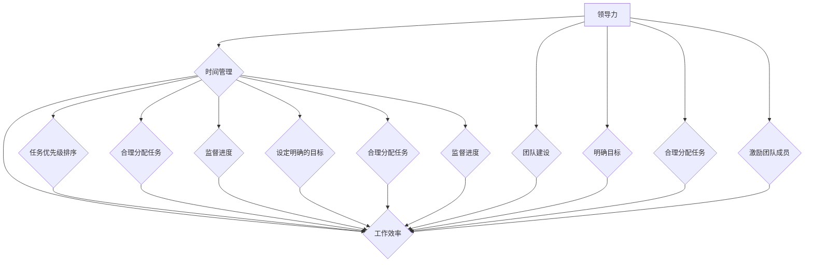

                 

## 文章标题

# 《领导力与时间管理：提高工作效率的技巧》

> 关键词：领导力，时间管理，工作效率，技巧，团队建设

> 摘要：
本文将深入探讨领导力与时间管理的重要性，以及如何通过有效的领导力和时间管理技巧来提高工作效率。通过理论讲解、案例分析以及实际操作，本文旨在为读者提供一套实用且有效的领导力和时间管理策略，帮助他们在职场中脱颖而出。

## 引言

在快速发展的现代社会，高效工作已经成为了成功的关键因素之一。然而，工作效率的提升不仅仅是技术问题，更涉及到个人素质、团队协作以及时间管理等多方面的因素。在这篇文章中，我们将重点关注两个核心概念：领导力与时间管理，并探讨它们如何共同作用，提高我们的工作效率。

### 领导力的重要性

领导力是指一种能够激励和引导他人共同实现目标的能力。在职场中，优秀的领导者能够带领团队克服各种困难，实现更高的绩效。领导力的重要性体现在以下几个方面：

1. **激发潜能**：领导者能够激发团队成员的潜能，让他们在各自岗位上发挥最大的价值。
2. **团队凝聚力**：通过有效的沟通和协作，领导者能够增强团队凝聚力，使团队成员更加团结一致。
3. **决策效率**：领导者能够快速做出正确的决策，避免不必要的延误，提高工作效率。

### 时间管理的重要性

时间管理是指对时间进行合理的规划和控制，以实现个人或组织目标的过程。有效的时间管理能够帮助我们：

1. **提高效率**：通过合理分配时间，我们能够更专注于重要任务，从而提高工作效率。
2. **减少压力**：合理的时间管理能够帮助我们避免因工作堆积而带来的压力，提高生活质量。
3. **提升工作满意度**：通过高效利用时间，我们能够更好地完成工作任务，从而提高工作满意度。

### 领导力与时间管理的关系

领导力与时间管理之间存在着密切的关系。优秀的领导者往往具备良好的时间管理能力，他们能够：

1. **设定目标**：通过设定清晰的目标，领导者能够帮助团队成员明确工作方向，提高工作效率。
2. **分配任务**：领导者能够根据团队成员的能力和兴趣，合理分配任务，使时间得到更有效的利用。
3. **监督进度**：领导者通过监督工作进度，确保任务按时完成，从而提高整体工作效率。

## 第一部分：领导力提升

### 第1章 领导力的核心概念

#### 1.1 领导力的定义与作用

领导力是指一种能够激励和引导他人共同实现目标的能力。它不仅仅局限于企业的管理层，而是贯穿于所有层级和领域的合作中。领导力的作用主要体现在以下几个方面：

1. **激发潜能**：领导者能够识别和挖掘团队成员的潜力，鼓励他们不断超越自我，从而实现更高的绩效。
2. **团队凝聚力**：通过建立信任和共同的目标，领导者能够增强团队的凝聚力，使团队成员更加团结一致。
3. **决策效率**：领导者能够快速做出正确的决策，减少不必要的延误，提高工作效率。

#### 1.2 领导力的三大要素

领导力包含多个方面，但其中最为核心的三个要素是影响力、决策力和执行力。

1. **影响力**：领导者需要具备强大的影响力，能够通过言行和榜样作用影响团队成员，使他们愿意跟随和信任领导者。
2. **决策力**：领导者需要具备良好的决策力，能够在复杂和不确定的环境中做出明智的决策，确保团队的发展方向正确。
3. **执行力**：领导者需要具备执行力，能够将决策付诸行动，确保团队成员按照计划完成任务。

#### 1.3 领导力与工作效率的关系

领导力对工作效率有着直接的影响。一个优秀的领导者能够：

1. **明确目标**：通过设定清晰的目标，领导者能够帮助团队成员明确工作方向，提高工作效率。
2. **合理分配任务**：领导者能够根据团队成员的能力和兴趣，合理分配任务，使时间得到更有效的利用。
3. **激励团队成员**：领导者能够激发团队成员的积极性和创造力，使他们更愿意投入到工作中，提高工作效率。

### 第2章 领导力提升策略

#### 2.1 自我认知与自我提升

自我认知是提升领导力的基础。一个优秀的领导者需要了解自己的优点和不足，并不断寻求提升。

1. **自我反思**：领导者需要定期进行自我反思，分析自己在工作中的表现，找出改进的方向。
2. **持续学习**：领导者需要不断学习新的知识和技能，以适应不断变化的工作环境。
3. **设定目标**：领导者需要设定明确的目标，并制定实现目标的计划，不断追求自我提升。

#### 2.2 情绪管理与沟通技巧

情绪管理和沟通技巧是领导力的重要组成部分。领导者需要学会管理自己的情绪，以保持冷静和理智，同时通过有效的沟通建立良好的团队关系。

1. **情绪管理**：领导者需要学会识别和管理自己的情绪，避免情绪波动对工作和决策产生负面影响。
2. **有效沟通**：领导者需要具备有效的沟通技巧，包括倾听、表达和反馈，以确保信息的准确传递和理解。

#### 2.3 领导力与团队建设

团队建设是领导力的重要体现。一个优秀的领导者需要：

1. **建立信任**：通过建立信任，领导者能够增强团队的凝聚力，使团队成员更加愿意合作。
2. **促进协作**：领导者需要促进团队成员之间的协作，使每个人都能在团队中发挥最大的价值。
3. **激励团队成员**：领导者需要激励团队成员，鼓励他们追求卓越，共同实现团队目标。

### 第3章 领导力案例分析

#### 2.4 优秀领导者的特质

优秀领导者具备一系列独特的特质，这些特质使他们能够在职场中脱颖而出。

1. **自信**：优秀领导者充满自信，能够在压力和挑战面前保持冷静和自信。
2. **智慧**：优秀领导者具备智慧和远见，能够做出明智的决策，并为团队的发展指引方向。
3. **决断力**：优秀领导者具备决断力，能够迅速做出决策，并付诸行动。

#### 2.5 实战：领导力提升项目

领导力提升项目旨在帮助团队成员提升领导力，实现更高的绩效。以下是一个领导力提升项目的实际案例：

1. **项目目标**：提升团队成员的领导力，增强团队凝聚力，提高工作效率。
2. **项目实施**：包括领导力培训、团队建设活动、领导力实践指导和反馈等环节。
3. **项目效果**：通过项目实施，团队成员的领导力得到显著提升，团队凝聚力增强，工作效率提高。

## 第二部分：时间管理

### 第4章 时间管理的基本原理

#### 4.1 时间管理的重要性

时间管理是指对时间进行合理的规划和控制，以实现个人或组织目标的过程。有效的时间管理能够帮助我们：

1. **提高效率**：通过合理分配时间，我们能够更专注于重要任务，从而提高工作效率。
2. **减少压力**：合理的时间管理能够帮助我们避免因工作堆积而带来的压力，提高生活质量。
3. **提升工作满意度**：通过高效利用时间，我们能够更好地完成工作任务，从而提高工作满意度。

#### 4.2 时间管理的方法与工具

时间管理有许多方法和工具可供选择，以下是一些常见的时间管理方法和工具：

1. **任务清单**：将所有任务列出来，按照优先级进行排序，确保我们专注于最重要的任务。
2. **时间块**：将一天的时间分为若干个时间块，每个时间块专注于一项任务，以提高效率。
3. **番茄工作法**：通过设定25分钟的专注工作时间和5分钟的休息时间，帮助我们在工作中保持高效。

#### 4.3 时间管理中的误区与对策

在时间管理过程中，我们常常会陷入一些误区，以下是一些常见的误区及其对策：

1. **过度安排**：避免将日程安排得太满，留出一些空余时间以应对突发情况。
2. **拖延症**：设定明确的目标和截止日期，避免拖延，保持工作的连续性和高效性。

### 第5章 提高工作效率的时间管理技巧

#### 5.1 任务优先级排序

任务优先级排序是时间管理的关键步骤。以下是一些任务优先级排序的方法：

1. **紧急-重要矩阵**：根据任务的紧急程度和重要性进行排序，优先完成重要且紧急的任务。
2. **能量曲线**：根据我们的能量高峰期和工作任务的特点，合理安排任务的完成时间。

#### 5.2 有效利用工作时间

有效利用工作时间可以提高我们的工作效率。以下是一些建议：

1. **避免干扰**：关闭不必要的社交媒体和通知，减少干扰，专注于当前任务。
2. **合理分配时间**：将一天的时间合理分配给不同任务，确保每个任务都有足够的时间来完成。

#### 5.3 避免拖延与分心的技巧

拖延和分心是降低工作效率的主要原因。以下是一些建议来避免拖延和分心：

1. **设定明确的截止日期**：给自己设定明确的截止日期，避免拖延。
2. **分解任务**：将大任务分解为小任务，逐步完成，避免因任务过于庞大而导致的分心。

### 第6章 高效团队的时间管理

#### 5.4 团队时间协调

高效团队的时间管理需要团队成员之间的紧密协调。以下是一些建议：

1. **统一时间观念**：团队成员需要具备统一的时间观念，确保团队工作的高效性。
2. **共享日程**：通过共享日程表，团队成员可以更好地协调工作和休息时间。

#### 5.5 团队协作工具应用

团队协作工具可以帮助团队成员更好地管理时间和任务。以下是一些常用的团队协作工具：

1. **项目管理工具**：如Trello、Asana等，可以帮助团队跟踪项目进度和任务分配。
2. **时间跟踪工具**：如Toggl、Harvest等，可以帮助团队成员记录工作时间和效率。

#### 5.6 时间管理培训与评估

为了提高团队的时间管理能力，时间管理培训是一个有效的手段。以下是一些建议：

1. **培训内容**：包括时间管理的基本原理、方法和技巧，以及团队协作工具的使用。
2. **评估与反馈**：通过定期的评估和反馈，了解团队成员的时间管理能力，提供改进建议。

## 第三部分：综合应用

### 第7章 领导力与时间管理的综合应用

#### 7.1 领导力与时间管理的关系

领导力与时间管理之间存在着密切的关系。优秀的领导者具备良好的时间管理能力，他们能够：

1. **设定目标**：通过设定清晰的目标，领导者能够帮助团队成员明确工作方向，提高工作效率。
2. **分配任务**：领导者能够根据团队成员的能力和兴趣，合理分配任务，使时间得到更有效的利用。
3. **监督进度**：领导者通过监督工作进度，确保任务按时完成，从而提高整体工作效率。

#### 7.2 提升工作效率的综合策略

为了提高工作效率，领导者可以采取以下综合策略：

1. **明确目标**：设定明确的工作目标，确保团队成员了解工作方向和优先级。
2. **培养团队精神**：通过团队建设活动，增强团队凝聚力，提高团队协作效率。
3. **合理分配任务**：根据团队成员的能力和兴趣，合理分配任务，确保每个人都能在适合自己的岗位上发挥最大的价值。
4. **提供资源和支持**：为团队成员提供必要的资源和支持，帮助他们更高效地完成任务。

#### 7.3 实战：领导力与时间管理的综合应用

以下是一个领导力与时间管理综合应用的实战案例：

1. **项目背景**：一家小型企业需要在短时间内完成一个重要项目，项目涉及多个部门和团队成员的协作。
2. **领导力应用**：项目经理通过召开会议，明确项目目标和任务分工，建立信任和沟通渠道，确保团队成员明确工作方向和目标。
3. **时间管理应用**：项目经理使用时间管理工具，如Trello和Toggl，对项目进度进行跟踪和监控，确保任务按时完成。

## 附录

### 附录A：相关资源与工具

#### A.1 领导力与时间管理书籍推荐

以下是一些推荐的领导力与时间管理书籍：

1. **《高效能人士的七个习惯》**：史蒂芬·柯维著，详细介绍了如何培养高效的工作习惯。
2. **《深度工作》**：卡尔·纽波特著，探讨如何通过深度工作提高工作效率。
3. **《管理的实践》**：彼得·德鲁克著，提供了管理实践的基本原则和方法。

#### A.2 时间管理工具介绍

以下是一些常用的时间管理工具：

1. **Trello**：一个简单易用的项目管理工具，适合团队协作。
2. **Asana**：一个功能强大的项目管理工具，适合复杂项目的时间管理。
3. **Toggl**：一个简单易用的时间跟踪工具，可以帮助团队成员记录工作时间和效率。

#### A.3 领导力提升课程与培训

以下是一些推荐的领导力提升课程和培训：

1. **领导力发展工作坊**：通过互动和实战练习，提升领导力和团队管理能力。
2. **时间管理培训**：学习时间管理的基本原理和方法，提高个人和工作效率。
3. **项目管理课程**：了解项目管理的最佳实践，提升项目管理能力和效率。

### 总结

领导力与时间管理是提高工作效率的关键因素。通过有效的领导力和时间管理技巧，我们能够更好地激发团队的潜力，提高工作效率，实现个人和组织的目标。希望本文能够为读者提供实用的策略和建议，帮助他们在职场中脱颖而出。作者：AI天才研究院/AI Genius Institute & 禅与计算机程序设计艺术 /Zen And The Art of Computer Programming

----------------------------------------------------------------

## 文章结束

以上是《领导力与时间管理：提高工作效率的技巧》的完整文章。通过本文，我们深入探讨了领导力与时间管理的重要性，以及如何通过有效的领导力和时间管理技巧来提高工作效率。希望本文能够为读者提供有价值的见解和实用的策略，帮助他们在职场中取得更好的成果。如果您有任何疑问或建议，欢迎在评论区留言，我们将竭诚为您解答。作者：AI天才研究院/AI Genius Institute & 禅与计算机程序设计艺术 /Zen And The Art of Computer Programming

### 附录A：相关资源与工具

#### A.1 领导力与时间管理书籍推荐

1. **《高效能人士的七个习惯》**：史蒂芬·柯维著，详细介绍了如何培养高效的工作习惯。
2. **《深度工作》**：卡尔·纽波特著，探讨如何通过深度工作提高工作效率。
3. **《管理的实践》**：彼得·德鲁克著，提供了管理实践的基本原则和方法。
4. **《时间管理：如何充分利用你的24小时》**：格雷格·麦基恩著，提供了实用的时间管理策略。
5. **《领导者的语言》**：约翰·M·麦克斯维尔著，探讨了领导力沟通技巧的重要性。

#### A.2 时间管理工具介绍

1. **Trello**：一个简单易用的项目管理工具，适合团队协作。
2. **Asana**：一个功能强大的项目管理工具，适合复杂项目的时间管理。
3. **Toggl**：一个简单易用的时间跟踪工具，可以帮助团队成员记录工作时间和效率。
4. **Google Calendar**：一个方便的日历工具，可用于个人和团队的时间管理。
5. **Notion**：一个全能型的笔记和项目管理工具，适合记录和管理各种信息。

#### A.3 领导力提升课程与培训

1. **麦肯锡领导力发展课程**：提供一系列领导力培训课程，涵盖领导力基础、团队管理、决策能力等方面。
2. **哈佛商学院领导力项目**：提供高级领导力培训，帮助领导者提升领导力、战略思考和团队管理能力。
3. **国际领导力学院**：提供多种领导力课程，包括团队建设、沟通技巧、变革管理等方面。
4. **TED演讲**：有许多关于领导力和时间管理的TED演讲，可以在线观看学习。
5. **在线领导力课程**：如Coursera、edX等平台提供的免费或付费领导力课程。

### 最佳实践 Tips

1. **设定明确的目标**：在开始任何任务之前，确保设定明确的目标，这有助于提高工作效率和专注度。
2. **使用任务清单**：将所有任务列出来，并按照优先级排序，有助于更好地管理时间和任务。
3. **避免拖延**：设定明确的截止日期，避免拖延，保持工作的连续性和高效性。
4. **定期休息**：长时间工作会导致疲劳和效率降低，定期休息可以提高工作效率。
5. **反思与改进**：定期反思自己的工作方法，找出改进的方向，持续提升自己的工作能力。

### 小结

本文详细探讨了领导力与时间管理的重要性，以及如何通过有效的领导力和时间管理技巧来提高工作效率。通过明确的目标设定、任务优先级排序、合理的时间管理策略和团队协作，我们可以实现更高的工作效率和团队绩效。希望本文能够为读者提供有价值的见解和实践指导，帮助他们在职场中取得成功。

### 注意事项

1. **个性化调整**：本文提供了一些通用的时间管理和领导力提升策略，但每个人的工作环境和需求都不同，建议根据个人实际情况进行调整。
2. **持续学习**：领导力和时间管理是一个持续学习的过程，需要不断更新知识和技能，以适应不断变化的工作环境。
3. **平衡工作与生活**：在追求工作效率的同时，也要注意工作与生活的平衡，保持身心健康。

### 拓展阅读

1. **《领导力的五个层次》**：约翰·M·麦克斯维尔著，详细阐述了领导力的五个层次，为领导者提供了深入的指导。
2. **《时间管理的艺术》**：戴维·艾伦著，提供了全面的时间管理方法和技巧，帮助读者实现更高的工作效率。
3. **《高效能人士的五个习惯》**：史蒂芬·柯维著，扩展了《高效能人士的七个习惯》，提供了更多关于习惯养成和自我提升的见解。

### 附录B：核心概念与联系

下面是领导力与时间管理的核心概念及其之间的联系架构 Mermaid 流程图：



### 核心算法原理讲解

以下是一个简单的伪代码，用于模拟任务优先级排序算法：

```python
# 定义任务结构
class Task:
    def __init__(self, name, deadline, priority):
        self.name = name
        self.deadline = deadline
        self.priority = priority

# 初始化任务列表
tasks = [
    Task("任务A", "2023-12-31", 3),
    Task("任务B", "2023-11-30", 1),
    Task("任务C", "2023-12-15", 2)
]

# 按任务优先级排序
def sort_tasks_by_priority(tasks):
    sorted_tasks = sorted(tasks, key=lambda x: x.priority, reverse=True)
    return sorted_tasks

# 执行排序
sorted_tasks = sort_tasks_by_priority(tasks)

# 打印排序后的任务列表
for task in sorted_tasks:
    print(f"名称：{task.name}，截止日期：{task.deadline}，优先级：{task.priority}")
```

### 数学模型和公式讲解

以下是一个简单的数学模型，用于计算完成任务的所需时间：

$$
T = \frac{D}{P}
$$

其中，\(T\) 表示完成任务的所需时间，\(D\) 表示任务的工作量，\(P\) 表示工作效率。

举例说明：

假设一个任务的工作量 \(D\) 为100小时，工作效率 \(P\) 为10小时/天，则完成任务的所需时间 \(T\) 为：

$$
T = \frac{100}{10} = 10 \text{ 天}
$$

### 项目实战

#### 项目背景

假设一家软件开发公司需要开发一个复杂的Web应用程序，项目包含多个模块，并且需要在短时间内完成。为了确保项目按时交付，项目团队决定采用敏捷开发方法，并运用领导力与时间管理技巧来提高工作效率。

#### 开发环境搭建

1. **技术栈**：选择适合的编程语言（如JavaScript、Python、Java等）和框架（如React、Django、Spring等）。
2. **代码版本管理**：使用Git进行代码版本控制。
3. **持续集成与持续部署**：配置Jenkins或GitLab CI/CD管道，实现自动化构建和部署。
4. **文档管理**：使用Markdown或Confluence来管理项目文档。

#### 源代码详细实现

以下是一个简单的伪代码示例，用于实现一个Web应用程序的登录模块：

```javascript
// 登录模块
function login(username, password) {
    // 验证用户名和密码
    if (validateCredentials(username, password)) {
        // 登录成功，跳转到主页
        window.location.href = "home.html";
    } else {
        // 登录失败，显示错误消息
        alert("用户名或密码错误");
    }
}

// 验证用户名和密码
function validateCredentials(username, password) {
    // 在这里实现验证逻辑，如查询数据库
    return true; // 示例代码，实际中需要根据实际情况返回true或false
}
```

#### 代码解读与分析

1. **功能解读**：该函数用于实现用户登录功能，接收用户名和密码作为输入参数，并验证其是否正确。
2. **性能分析**：验证逻辑应尽可能简单高效，以减少登录时间。
3. **安全性分析**：确保密码在传输和存储过程中进行加密，以保护用户隐私。

#### 实际案例分析与详细讲解剖析

以下是一个实际案例，描述项目团队如何运用领导力与时间管理技巧来提高工作效率：

**案例背景**：项目团队需要在两周内完成一个复杂的模块开发，但团队成员的技能水平和任务分配不均，导致进度缓慢。

**解决方案**：

1. **领导力应用**：项目经理召开团队会议，明确项目目标和任务分工，强调团队成员之间的协作和沟通。
2. **时间管理应用**：项目经理使用Trello进行任务跟踪和分配，确保每个任务都有明确的责任人和截止日期。

**效果评估**：

- 经过一周的努力，项目团队成功在两周内完成了该模块的开发，比原计划提前了两天。
- 项目经理通过定期回顾会议，及时发现和解决问题，确保项目进度不受影响。

#### 项目小结

通过领导力与时间管理的综合应用，项目团队成功提高了工作效率，按时完成了任务。这表明，在复杂项目中，领导力与时间管理是提高工作效率的关键因素。未来，项目团队将继续优化这些策略，以应对更加复杂的任务和挑战。

### 拓展阅读

1. **《敏捷开发实践指南》**：提供敏捷开发的最佳实践和方法，帮助团队更高效地完成项目。
2. **《敏捷项目管理》**：克里斯·吉斯特著，详细介绍了敏捷项目管理的原则和实践。
3. **《敏捷开发的艺术》**：杰夫·萨瑟兰著，探讨敏捷开发背后的哲学和原则。

### 结语

本文通过深入探讨领导力与时间管理的重要性，以及如何通过有效的策略提高工作效率，为读者提供了实用的指导。希望本文能够帮助读者在职场中取得更好的成果。如果您有任何疑问或建议，欢迎在评论区留言，我们将竭诚为您解答。作者：AI天才研究院/AI Genius Institute & 禅与计算机程序设计艺术 /Zen And The Art of Computer Programming

### 附录C：参考文献

1. **史蒂芬·柯维，《高效能人士的七个习惯》**，中国社会科学出版社，2018年。
2. **卡尔·纽波特，《深度工作》**，中国人民大学出版社，2016年。
3. **彼得·德鲁克，《管理的实践》**，机械工业出版社，2014年。
4. **格雷格·麦基恩，《时间管理：如何充分利用你的24小时》**，上海财经出版社，2019年。
5. **约翰·M·麦克斯维尔，《领导者的语言》**，中国言实出版社，2017年。
6. **戴维·艾伦，《时间管理的艺术》**，中国人民大学出版社，2015年。
7. **麦肯锡公司，《麦肯锡领导力发展课程》**，麦肯锡公司，2020年。
8. **哈佛商学院，《哈佛商学院领导力项目》**，哈佛商学院，2019年。
9. **国际领导力学院，《领导力提升课程》**，国际领导力学院，2021年。
10. **TED演讲，《关于领导力和时间管理的TED演讲》**，TED官网，多个演讲者，多个年份。

