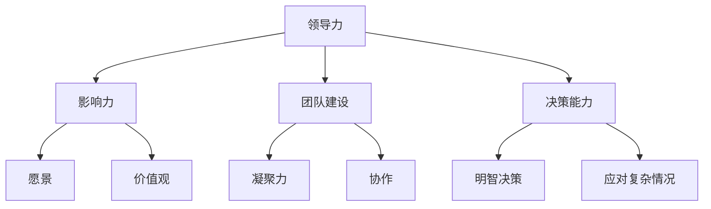
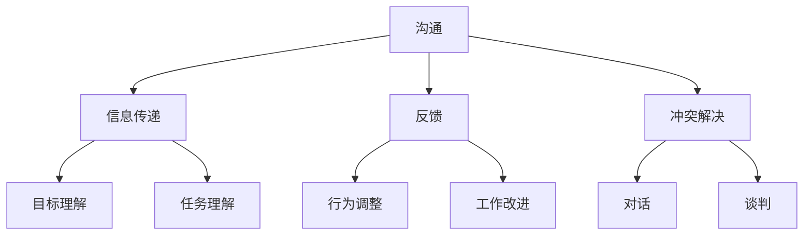
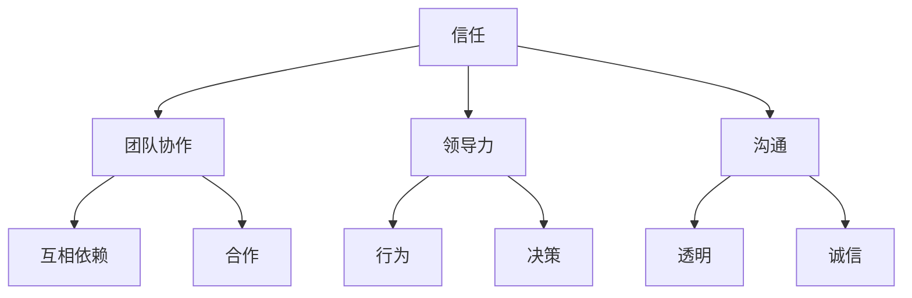
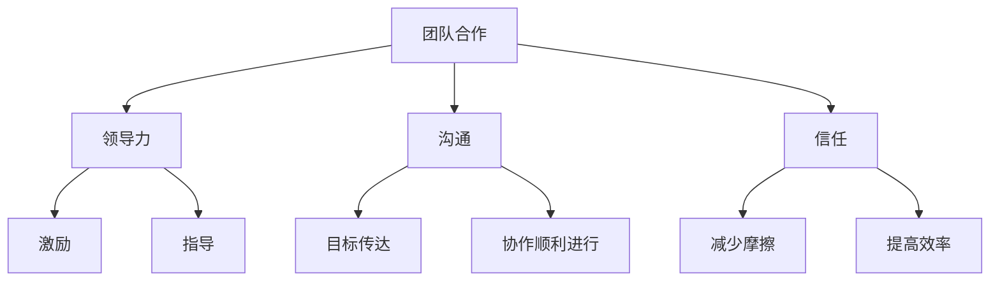

                 

### 领导力与沟通的重要性

在现代企业中，领导力和沟通能力已经成为衡量一位领导者成功与否的关键因素。随着全球化、信息化的不断深入，企业面临的竞争环境和挑战日益复杂，这对领导者和团队提出了更高的要求。

#### 领导力的重要性

领导力不仅仅关乎个人的魅力和影响力，更涉及到团队的整体表现和企业的长远发展。具备优秀领导力的人能够激励团队成员发挥最大潜力，提高团队协作效率，从而实现组织目标。

- **激励与赋能**：领导力能够激发团队成员的积极性和创造力，使他们在工作中感受到成就感，提高工作满意度。
- **团队建设**：领导力是构建和谐团队的基础，通过有效的领导，可以增强团队成员之间的信任和凝聚力。
- **决策能力**：优秀的领导力有助于领导者做出正确的决策，从而降低企业的风险。

#### 沟通的重要性

沟通是领导力的核心组成部分，没有有效的沟通，领导力将无从谈起。良好的沟通能力可以帮助领导者理解团队成员的需求和期望，协调团队内部的工作，确保团队目标的实现。

- **信息传递**：沟通是信息传递的重要手段，领导者需要通过有效沟通将企业的战略和目标传递给团队成员。
- **解决问题**：沟通有助于领导者及时发现团队中的问题，并通过有效的沟通手段解决这些问题。
- **建立信任**：良好的沟通有助于建立领导者和团队成员之间的信任关系，这是团队合作的基础。

#### 领导力与沟通的关系

领导力与沟通是相辅相成的，一个优秀的领导者不仅需要具备强大的领导力，还需要具备出色的沟通能力。只有将两者结合起来，才能更好地应对企业面临的挑战。

- **领导力促进沟通**：领导力可以激发团队成员的沟通意愿，提高沟通效率。
- **沟通完善领导力**：有效的沟通可以帮助领导者更好地了解团队成员的需求和想法，从而调整领导策略。

在接下来的章节中，我们将深入探讨领导力的理论基础，介绍领导力与沟通的具体实践方法，并通过案例分析展示这些方法在实际应用中的效果。通过这些内容，我们希望能够帮助读者理解领导力与沟通的重要性，并学会如何在实践中运用这些原则。

### 背景介绍

在当今快速变化的市场环境中，企业面临的挑战层出不穷。从技术革新到市场波动，从内部管理到外部竞争，企业需要具备强大的适应能力和应变能力。这就对企业的领导者提出了更高的要求，不仅需要具备深厚的专业知识和卓越的管理能力，更需要具备出色的领导力和沟通能力。

#### 市场环境的复杂性

全球化、数字化和信息化的快速发展，使得市场环境变得日益复杂。企业需要在短时间内应对各种变化，包括新兴技术的崛起、消费者需求的变化以及竞争对手的挑战。这种复杂性要求领导者具备更高的洞察力和决策能力，以便在变化中找到机遇，把握市场趋势。

#### 团队协作的必要性

在复杂的市场环境中，单靠个人的力量很难应对各种挑战。企业需要通过团队协作来实现共同的目标。而团队协作的成功离不开良好的领导力和沟通。领导者需要通过有效的沟通来协调团队内部的工作，确保团队成员之间的合作顺畅，提高团队的执行力。

#### 领导力与沟通的互动

领导力与沟通是互动的关系，彼此相互促进。优秀的领导力可以激发团队成员的积极性，提高沟通的效率和质量。而良好的沟通可以帮助领导者更好地了解团队成员的需求和想法，从而调整领导策略，提高领导效果。

#### 本书的结构与内容

本书旨在通过深入探讨领导力与沟通的理论和实践，帮助读者提升自己的领导力和沟通能力。全书分为七个章节，结构如下：

- **第1章 引言**：介绍领导力与沟通的重要性，以及本书的目的和结构。
- **第2章 领导力理论**：介绍领导力的定义、类型和发展理论。
- **第3章 沟通理论**：介绍沟通的定义、类型和有效沟通的原则。
- **第4章 实践方法**：提供建立信任、促进团队合作和管理冲突的实践方法。
- **第5章 案例分析**：分析成功和失败的案例，展示领导力与沟通的实际应用。
- **第6章 管理工具**：介绍相关的管理工具和技巧，帮助读者更好地实施领导力与沟通。
- **第7章 总结与展望**：总结全书内容，展望未来领导力与沟通的发展趋势。

通过阅读本书，读者将了解领导力与沟通的核心概念和理论，学会在实际工作中运用这些原则，从而提升自己的领导力和沟通能力，为企业的发展贡献自己的力量。

### 核心概念与联系

在探讨领导力和沟通时，理解核心概念及其相互关系至关重要。以下是几个关键概念及其联系架构的详细解释，并附有Mermaid流程图展示。

#### 1. 领导力

**定义**：领导力是指领导者通过影响和激励他人，实现共同目标的能力。

**联系**：
- **影响力**：领导力本质上是影响力的体现，领导者通过愿景、价值观和行动来影响团队成员。
- **团队建设**：领导力帮助构建一个有凝聚力、高效协作的团队。
- **决策能力**：领导力涉及决策能力，领导者需要做出明智的决策以应对复杂情况。

**Mermaid流程图**：


#### 2. 沟通

**定义**：沟通是指信息的交换和传递，涉及发送者、信息、媒介、接收者和反馈。

**联系**：
- **信息传递**：沟通是信息传递的关键，确保团队成员对目标和任务的清晰理解。
- **反馈**：有效的沟通包含及时的反馈，有助于调整行为和改进工作。
- **冲突解决**：沟通是解决冲突的重要工具，通过对话和谈判达成共识。

**Mermaid流程图**：


#### 3. 信任

**定义**：信任是指对他人能力和诚信的信念。

**联系**：
- **团队协作**：信任是团队协作的基石，有助于团队成员放心地互相依赖和合作。
- **领导力**：领导者的行为和决策直接影响团队中的信任水平。
- **沟通**：良好的沟通有助于建立信任，通过透明和诚信的交流减少误解和猜疑。

**Mermaid流程图**：


#### 4. 团队合作

**定义**：团队合作是指团队成员共同协作，实现共同目标的过程。

**联系**：
- **领导力**：领导力是推动团队合作的关键，通过激励和指导帮助团队克服挑战。
- **沟通**：沟通是团队合作的核心，通过有效的沟通确保团队目标的清晰传达和协作的顺利进行。
- **信任**：信任是团队合作的基础，有助于减少内部摩擦，提高团队效率。

**Mermaid流程图**：


通过以上核心概念及其相互关系的探讨，我们能够更深入地理解领导力与沟通在团队运作中的重要性。这些概念不仅为理论分析提供了基础，也为实际应用提供了指导。在接下来的章节中，我们将进一步探讨这些概念的具体应用和实施方法。

### 领导力理论

领导力理论是理解领导行为和效果的重要基础。在这一章节中，我们将介绍几种主要的领导力理论，包括转换型领导理论、变革型领导理论和情境领导理论，并探讨它们的基本概念和如何应用于实际工作。

#### 转换型领导理论

**基本概念**：转换型领导理论由伯恩斯（James MacGregor Burns）提出，强调领导者通过激励和启发团队成员来实现变革。转换型领导者不仅设定明确的目标，还通过愿景激励和个性化关注来激发团队成员的潜力。

**核心要素**：
- **愿景**：转换型领导者能够描绘出一个清晰的愿景，使团队成员理解并认同这个愿景。
- **激励**：通过激励和奖励来激发团队成员的积极性和创造力。
- **个性化关注**：领导者对每个团队成员都给予个性化的关注，了解他们的需求和潜力。

**实际应用**：在实际工作中，转换型领导可以应用于新产品开发、市场扩张等需要团队协作和创新的情境。例如，一位项目经理可以通过设定明确的开发目标，并通过激励措施如奖金和晋升机会来激励团队成员，从而推动项目成功。

**Python源代码示例**：
```python
def inspire_team(vision, goals, team_members):
    """
    激励团队实现愿景和目标

    :param vision: 愿景
    :param goals: 目标
    :param team_members: 团队成员列表
    """
    for member in team_members:
        print(f"{member}，让我们为实现{vision}和{goals}共同努力！")

# 示例
team_members = ['Alice', 'Bob', 'Charlie']
inspire_team('成为行业领先者', '按时完成新产品的研发', team_members)
```

#### 变革型领导理论

**基本概念**：变革型领导理论由豪斯（Brenda Hurley House）提出，强调领导者通过变革和领导来推动组织发展。变革型领导者能够识别和应对外部和内部的变化，通过变革来提高组织的竞争力和适应性。

**核心要素**：
- **变革意识**：领导者能够识别和应对变化，预见未来的趋势。
- **创新精神**：变革型领导者鼓励创新，支持团队成员提出新的想法和解决方案。
- **适应能力**：领导者具备快速适应变化的能力，灵活调整组织策略。

**实际应用**：在实际工作中，变革型领导可以应用于企业转型、技术升级等需要大规模变革的情境。例如，一位CEO可以通过引入新的管理工具和技术，来推动企业的数字化转型。

**Python源代码示例**：
```python
def drive_change(culture, innovations, stakeholders):
    """
    驱动组织变革

    :param culture: 企业文化
    :param innovations: 创新
    :param stakeholders: 关键利益相关者
    """
    print(f"{culture}，我们需要不断创新，引入{innovations}来应对市场变化。")

# 示例
drive_change('传统企业', '数字化转型', ['员工', '客户', '股东'])
```

#### 情境领导理论

**基本概念**：情境领导理论由赫塞（Paul Hersey）和布兰查德（Ken Blanchard）提出，强调领导行为应该根据团队成员的不同成熟度进行调整。情境领导者通过识别团队成员的成熟度，选择最合适的领导风格。

**核心要素**：
- **成熟度**：团队成员的成熟度包括能力和责任心两个方面。
- **领导风格**：情境领导理论提出四种领导风格：指导型、推销型、参与型和授权型。

**实际应用**：在实际工作中，情境领导可以应用于团队组建、项目管理和员工发展等情境。例如，新组建的团队可能需要更多的指导型领导，而成熟的项目团队可能更适合参与型领导。

**Python源代码示例**：
```python
def scenario_leadership(maturity, style):
    """
    根据团队成员的成熟度选择合适的领导风格

    :param maturity: 成熟度
    :param style: 领导风格
    """
    if maturity <= 1:
        print(f"选择指导型领导风格，因为团队成员成熟度较低。")
    elif maturity <= 3:
        print(f"选择推销型领导风格，因为团队成员需要更多激励和指导。")
    elif maturity <= 5:
        print(f"选择参与型领导风格，因为团队成员能够积极参与决策。")
    else:
        print(f"选择授权型领导风格，因为团队成员已经成熟，可以独立工作。")

# 示例
scenario_leadership(2, '指导型')
```

通过上述三种领导力理论的探讨，我们可以看到，不同的领导力理论提供了不同的视角和工具，以应对不同的领导情境。在实际工作中，领导者需要根据具体情境灵活运用这些理论，以达到最佳效果。

### 沟通理论

沟通是领导力的重要组成部分，有效的沟通能够促进团队协作，提高工作效率，实现组织目标。在这一章节中，我们将探讨沟通的定义、类型和有效沟通的原则，并介绍沟通障碍及其解决方法。

#### 沟通的定义

沟通是指信息在个人、团队和组织之间的传递、理解和交流过程。它不仅涉及语言的使用，还包括非语言的交流方式，如肢体语言、面部表情和声音的语调。

**核心要素**：
- **信息**：沟通的基础是信息，信息可以是数据、观点、想法或指令。
- **发送者**：发送者是信息的源头，他们需要明确要传达的内容。
- **接收者**：接收者是信息的接收方，他们需要理解并回应信息。
- **媒介**：媒介是信息传递的渠道，可以是口头、书面或电子方式。
- **反馈**：反馈是沟通过程中的重要环节，它帮助发送者了解信息是否被正确理解。

#### 沟通的类型

沟通可以分为多种类型，根据不同的分类标准，可以分为口头沟通、书面沟通、非语言沟通和正式沟通与非正式沟通等。

- **口头沟通**：包括面对面的交流、电话会议和视频通话等。
- **书面沟通**：包括邮件、报告、备忘录和公告等。
- **非语言沟通**：包括肢体语言、面部表情和声音语调等。
- **正式沟通与非正式沟通**：正式沟通通常遵循特定的格式和流程，如会议纪要和正式报告；非正式沟通则更加随意和灵活。

#### 有效沟通的原则

为了确保沟通的有效性，领导者需要遵循以下原则：

- **明确目的**：在沟通前，明确沟通的目的和期望结果，以便发送者能够清晰表达信息。
- **受众中心**：考虑接收者的背景和需求，确保信息能够被理解。
- **简洁性**：使用简单、清晰的语言，避免使用复杂的术语和冗长的句子。
- **诚实与透明**：保持沟通的真实性和透明度，避免误导和隐瞒信息。
- **及时性**：及时沟通重要信息，避免延迟导致误解或错误决策。
- **积极倾听**：倾听是有效沟通的关键，领导者需要给予团队成员充分的发言机会，并理解他们的观点。

#### 沟通障碍与解决方法

尽管遵循上述原则，但沟通过程中仍然可能遇到障碍。以下是几种常见的沟通障碍及其解决方法：

- **语言障碍**：不同背景和文化的团队成员可能使用不同的术语和表达方式。解决方法包括提供明确的定义和解释，使用简明易懂的语言，以及促进跨文化的交流和理解。
- **心理障碍**：团队成员可能因为恐惧、偏见或压力而影响沟通效果。解决方法包括创造一个支持性和开放性的沟通环境，鼓励团队成员表达自己的观点，并提供心理支持和培训。
- **技术障碍**：技术故障或缺乏合适的沟通工具可能影响沟通质量。解决方法包括确保技术设备正常运行，提供培训以帮助团队成员掌握沟通工具的使用，以及选择适合的沟通渠道。

通过理解沟通的定义、类型和有效沟通的原则，以及识别和解决沟通障碍，领导者可以提升团队的整体沟通效率，从而更好地实现组织目标。

### 实践方法

在实际工作中，提升领导力和沟通能力不仅需要理论知识，更需要具体实践方法。在本章节中，我们将详细介绍几种提升领导力和沟通能力的实践方法，包括建立信任、促进团队合作和管理冲突的具体步骤。

#### 建立信任

建立信任是领导力的核心要素之一，它有助于提高团队的凝聚力和工作效率。以下是几种建立信任的实践方法：

1. **透明沟通**：领导者应保持沟通的透明度，及时向团队成员传达信息，并解释决策背后的原因。透明沟通有助于减少误解和猜疑。

2. **一致性**：领导者应保持言行一致，遵守承诺，从而赢得团队成员的信任。一致性是建立信任的重要基础。

3. **倾听与反馈**：领导者应积极倾听团队成员的意见和建议，并给予及时的反馈。倾听不仅是一种尊重，也是了解团队成员需求的重要方式。

4. **信任游戏**：通过团队活动或游戏来培养信任感。例如，组织团队信任跌倒（Trust Fall）或团队探险活动，增强团队成员之间的信任。

**Python源代码示例**：
```python
def build_trust(transparent_communication, consistency, active_listening, trust_games):
    """
    建立信任的方法

    :param transparent_communication: 透明沟通
    :param consistency: 一致性
    :param active_listening: 积极倾听
    :param trust_games: 信任游戏
    """
    print("透明沟通：确保信息及时传达，决策透明。")
    print("一致性：言行一致，遵守承诺。")
    print("积极倾听：倾听团队成员意见，及时反馈。")
    print("信任游戏：通过团队活动增强信任感。")

# 示例
build_trust(True, True, True, True)
```

#### 促进团队合作

团队合作是提升团队绩效和实现组织目标的关键。以下是几种促进团队合作的具体步骤：

1. **明确目标**：确保团队成员都清楚团队的目标和各自的职责。目标明确有助于团队集中精力，减少内部纷争。

2. **分工协作**：根据团队成员的技能和特长进行合理分工，确保每个成员都在自己的优势领域工作，从而提高团队的整体效率。

3. **定期会议**：定期召开团队会议，讨论项目进展、遇到的问题和解决方案。会议有助于团队成员保持沟通，共同解决问题。

4. **激励与认可**：为团队成员提供激励和认可，表彰他们在团队中的贡献。激励和认可有助于提高团队成员的积极性和归属感。

**Python源代码示例**：
```python
def promote_collaboration clara_goals, clear_division, regular_meetings, incentives_recognition):
    """
    促进团队合作的方法

    :param clara_goals: 明确目标
    :param clear_division: 分工协作
    :param regular_meetings: 定期会议
    :param incentives_recognition: 激励与认可
    """
    print("明确目标：确保团队成员清楚团队的目标和职责。")
    print("分工协作：根据技能和特长合理分工。")
    print("定期会议：讨论项目进展和问题。")
    print("激励与认可：为团队成员提供激励和认可。")

# 示例
promote_collaboration(True, True, True, True)
```

#### 管理冲突

冲突是团队中不可避免的现象，有效管理冲突有助于维持团队稳定和提升团队绩效。以下是几种管理冲突的具体方法：

1. **倾听与理解**：领导者应积极倾听冲突双方的立场，理解他们的观点和感受。倾听和理解有助于找到冲突的根本原因。

2. **中立调解**：在冲突调解过程中，领导者应保持中立，不偏袒任何一方。中立调解有助于建立公正和透明的氛围。

3. **寻求共识**：通过讨论和协商，寻求冲突双方都能接受的解决方案。共识是解决冲突的关键，有助于维持团队和谐。

4. **预防措施**：通过提前制定规则和沟通策略，预防潜在冲突的发生。预防措施是管理冲突的长期策略。

**Python源代码示例**：
```python
def manage_conflicts(active_listening, neutral_mediation, seek_common_grounded, preventive_measures):
    """
    管理冲突的方法

    :param active_listening: 倾听与理解
    :param neutral_mediation: 中立调解
    :param seek_common_grounded: 寻求共识
    :param preventive_measures: 预防措施
    """
    print("倾听与理解：积极倾听冲突双方的立场。")
    print("中立调解：保持中立，建立公正氛围。")
    print("寻求共识：讨论和协商，达成解决方案。")
    print("预防措施：提前制定规则和沟通策略。")

# 示例
manage_conflicts(True, True, True, True)
```

通过上述实践方法，领导者可以在实际工作中提升领导力和沟通能力，促进团队协作，有效管理冲突，从而实现组织目标。这些方法不仅提供了具体的操作步骤，还结合了Python源代码示例，帮助读者更好地理解和应用这些原则。

### 成功案例：A公司的领导力与沟通实践

在本章节中，我们将分析一家成功企业的实际案例，即A公司如何通过有效的领导力与沟通实践来提升团队绩效和实现组织目标。通过这个案例，我们将展示领导力与沟通在实践中的具体应用，并提供可借鉴的经验。

#### A公司的背景

A公司是一家高科技企业，专注于软件开发和信息技术服务。公司在快速发展的市场中取得了显著的成绩，这得益于其高效的团队管理和卓越的领导力与沟通实践。

#### 领导力实践

1. **转换型领导**：A公司的CEO是一位具备深厚专业背景和丰富经验的转换型领导者。他在公司内部推行了明确的愿景，即成为行业领先的技术创新者。CEO通过激励和愿景激励，激发了员工的积极性和创造力。

2. **情境领导**：公司领导根据团队成员的成熟度调整领导风格。对于新加入的员工，领导采取指导型领导风格，提供详细的指导和培训；对于经验丰富的员工，领导采取授权型领导风格，鼓励他们自主决策和承担责任。

3. **变革型领导**：公司面对市场的快速变化，CEO通过变革型领导，推动公司的技术升级和管理创新。他引入了新的管理工具和流程，提高了团队的工作效率和灵活性。

#### 沟通实践

1. **透明沟通**：A公司注重信息透明，定期召开公司内部会议，向所有员工传达公司的战略目标、业务进展和未来计划。这种透明沟通有助于员工理解公司的愿景和目标，从而更好地投入到工作中。

2. **开放式沟通**：公司鼓励员工提出意见和建议，并建立了反馈机制。领导层定期与员工进行一对一沟通，了解他们的工作状况和需求，从而及时调整管理策略。

3. **跨部门沟通**：为了促进不同部门之间的协作，公司定期组织跨部门会议和工作坊。这些活动不仅有助于部门之间的信息共享，还增强了团队之间的信任和合作。

#### 案例解析

A公司的成功在于其有效地结合了领导力与沟通实践，实现了以下目标：

- **激发员工潜力**：通过转换型领导和情境领导，公司激发了员工的积极性和创造力，提高了员工的工作满意度。
- **提高团队协作**：通过透明沟通和开放式沟通，公司增强了团队之间的信任和合作，提高了团队的整体绩效。
- **应对市场变化**：通过变革型领导和技术升级，公司保持了竞争力，适应了市场的快速变化。

#### 可借鉴的经验

从A公司的案例中，我们可以得出以下几点可借鉴的经验：

1. **结合领导力理论**：在实际工作中，领导者应根据不同的情境灵活运用不同的领导力理论，以激发员工的潜力。
2. **注重沟通**：有效的沟通是提升团队绩效的关键。领导者应确保信息的透明传递和开放式沟通，增强团队的信任和合作。
3. **持续改进**：领导力和沟通实践不是一蹴而就的，需要不断地改进和优化。领导者应定期评估团队绩效和沟通效果，及时调整管理策略。

通过学习和借鉴A公司的成功经验，其他企业可以提升自身的领导力和沟通能力，从而在竞争激烈的市场中取得成功。

### 失败案例：B公司的领导力与沟通失误

在本章节中，我们将分析一家企业在领导力与沟通方面的失败案例，即B公司如何因为领导力与沟通失误而导致团队绩效低下和组织目标未能实现。通过这个案例，我们将揭示领导力与沟通失误的具体表现，并提供改进建议。

#### B公司的背景

B公司是一家中型制造企业，在过去几年中面临着激烈的市场竞争和内部管理问题。公司业绩下滑，员工士气低落，这主要是因为领导力与沟通方面的失误。

#### 领导力失误

1. **缺乏愿景和目标**：B公司的领导者没有明确的愿景和目标，导致团队成员对公司的未来感到迷茫。缺乏明确的愿景和目标使得团队无法形成共同的努力方向。

2. **领导风格单一**：公司领导采用单一的指令型领导风格，过于强调权威和控制，忽视了员工的意见和建议。这种领导风格导致了员工的不满和抵触情绪。

3. **缺乏变革意识**：B公司面对市场变化和技术创新，缺乏变革意识，未能及时调整战略和流程。领导层的保守态度使得公司错失了市场机遇。

#### 沟通失误

1. **信息不透明**：B公司内部信息传递不畅，决策过程不透明，员工无法及时了解公司的战略和业务进展。这种信息不透明导致了员工的不信任和焦虑。

2. **缺乏反馈机制**：公司缺乏有效的反馈机制，员工无法对工作环境和领导行为提出意见和建议。这种缺乏反馈机制使得公司无法及时发现和解决问题。

3. **沟通渠道单一**：B公司主要依赖电子邮件和内部公告进行沟通，忽视了面对面沟通和实时沟通的重要性。这种沟通渠道单一限制了团队之间的信息交流和合作。

#### 案例解析

B公司的失败在于其领导力与沟通失误导致了以下后果：

- **团队士气低落**：缺乏愿景和目标，领导风格单一，使得员工士气低落，缺乏工作动力。
- **沟通不畅**：信息不透明、缺乏反馈机制和单一沟通渠道导致了团队之间的隔阂和矛盾。
- **错失市场机遇**：缺乏变革意识和技术创新，使得公司无法适应市场变化，错失了市场机遇。

#### 改进建议

为了改善B公司的领导力与沟通，我们可以提出以下改进建议：

1. **明确愿景和目标**：领导者应明确公司的愿景和目标，并与团队成员共同制定实现目标的策略和行动计划。
2. **多样化领导风格**：领导者应根据不同的情境和团队成员的成熟度，灵活运用不同的领导风格，以激发员工的潜力。
3. **加强沟通**：建立透明的沟通机制，鼓励开放式沟通和多种沟通渠道，确保信息能够及时、准确地传递。
4. **建立反馈机制**：鼓励员工提出意见和建议，建立反馈机制，帮助公司及时发现和解决问题。
5. **推动技术创新**：保持变革意识，积极引入新技术和管理工具，以适应市场变化和提升公司竞争力。

通过学习和借鉴B公司的失败案例，其他企业可以避免类似的失误，提升自身的领导力和沟通能力，从而实现组织目标。

### 管理工具

在现代企业管理中，管理工具是提升领导力和沟通效率的重要手段。以下我们将介绍几种常用的管理工具，包括团队评估工具、沟通技巧评估工具和领导力发展工具，并探讨如何在实际工作中应用这些工具。

#### 团队评估工具

**1. 360度反馈**：360度反馈是一种评估工具，通过团队成员之间的相互评价来获取全面、客观的反馈。这种工具有助于团队成员了解自己的优势和不足，并促进个人成长。

**应用场景**：在年度评估、项目评估或团队建设活动中使用。

**具体步骤**：
- **设定评估指标**：确定需要评估的维度，如沟通能力、协作精神、解决问题的能力等。
- **匿名填写**：确保反馈的匿名性，以提高反馈的真诚度。
- **分析反馈**：收集并分析反馈数据，识别团队成员的优势和改进点。
- **反馈会议**：组织反馈会议，讨论评估结果，制定改进计划。

**Python源代码示例**：
```python
def feedback_analysis(feedback_data):
    """
    反馈数据分析

    :param feedback_data: 反馈数据
    """
    print("评估结果如下：")
    for item in feedback_data:
        print(f"{item['name']}: {item['feedback']}")

# 示例
feedback_data = [
    {'name': 'Alice', 'feedback': '沟通能力较强，但需要提高协作精神'},
    {'name': 'Bob', 'feedback': '解决问题能力强，但需要更积极主动'}
]
feedback_analysis(feedback_data)
```

#### 沟通技巧评估工具

**1. 沟通技巧评估问卷**：这是一种通过问卷形式评估个体沟通技巧的工具，包括语言表达能力、倾听能力、非语言沟通能力等方面。

**应用场景**：用于个人发展计划或团队培训。

**具体步骤**：
- **设计问卷**：根据沟通技巧的不同维度设计问卷，例如：沟通清晰度、冲突处理能力等。
- **分发问卷**：将问卷分发至团队成员，确保匿名填写。
- **数据分析**：收集问卷数据，分析团队成员的沟通技巧水平。
- **反馈与培训**：根据评估结果，提供个性化的沟通技巧培训。

**Python源代码示例**：
```python
def communication_assessment(questions):
    """
    沟通技巧评估

    :param questions: 问卷问题
    """
    scores = {question: 0 for question in questions}
    print("请回答以下问题：")
    for question in questions:
        scores[question] = int(input(f"{question}. "))
    print("评估结果：")
    for question, score in scores.items():
        print(f"{question}: {score}/10")

# 示例
questions = [
    "您的沟通清晰度如何？",
    "您在沟通中是否善于倾听？",
    "您是否善于使用非语言沟通？"
]
communication_assessment(questions)
```

#### 领导力发展工具

**1. 领导力发展计划**：这是一种系统化的工具，用于提升领导者的能力和素质。

**应用场景**：用于新任领导者或领导力提升培训。

**具体步骤**：
- **评估领导力现状**：通过360度反馈、领导力评估问卷等方式评估领导者的现有能力。
- **制定发展计划**：根据评估结果，制定个性化的领导力发展计划，包括培训课程、辅导和实际工作项目。
- **实施计划**：执行领导力发展计划，确保领导者能够获得必要的技能和经验。
- **持续评估**：定期评估领导力发展效果，调整发展计划。

**Python源代码示例**：
```python
def leadership_development_plan(assessment_results, development_actions):
    """
    领导力发展计划

    :param assessment_results: 领导力评估结果
    :param development_actions: 发展行动计划
    """
    print("领导力发展计划：")
    for action in development_actions:
        print(f"{action}: {assessment_results.get(action, 0)}分")

# 示例
assessment_results = {
    '沟通技巧': 8,
    '团队管理': 7,
    '战略思维': 6
}
development_actions = [
    '提升沟通技巧',
    '加强团队管理',
    '培养战略思维'
]
leadership_development_plan(assessment_results, development_actions)
```

通过这些管理工具，企业可以更系统地评估和管理团队和领导者的能力，从而提升整体绩效和实现组织目标。

### 总结与展望

在本章节中，我们对领导力与沟通的核心概念、理论、实践方法和管理工具进行了全面探讨。通过这些内容，我们深刻认识到领导力与沟通在团队运作和企业发展中的关键作用。

#### 核心内容回顾

1. **领导力理论**：我们介绍了转换型领导、变革型领导和情境领导等理论，这些理论为领导者的实际工作提供了指导。
2. **沟通理论**：从沟通的定义、类型到有效沟通的原则，再到沟通障碍的解决方法，这些理论帮助我们理解沟通的重要性。
3. **实践方法**：通过建立信任、促进团队合作和管理冲突的实践方法，我们学会如何在实际工作中提升领导力和沟通能力。
4. **管理工具**：我们介绍了团队评估工具、沟通技巧评估工具和领导力发展工具，这些工具有助于系统地提升团队和领导者的能力。

#### 未来趋势展望

1. **数字化领导力**：随着数字化技术的发展，领导者需要具备更强的数字素养和数字化领导能力，以应对不断变化的数字化环境。
2. **跨文化沟通**：全球化趋势下，领导者需要具备跨文化沟通能力，以更好地管理多元文化团队。
3. **持续学习与成长**：领导力和沟通能力不是一成不变的，领导者需要持续学习和成长，以适应不断变化的市场环境。
4. **人工智能与领导力**：人工智能的发展为领导力带来了新的挑战和机遇，领导者需要学会如何利用人工智能工具提升工作效率。

#### 对读者的建议

1. **实践与应用**：将书中所学知识应用到实际工作中，通过实践不断提升自己的领导力和沟通能力。
2. **持续学习**：保持对新技术、新管理方法的关注，持续学习，不断提升自己的专业素养。
3. **反思与总结**：定期反思自己的领导力和沟通实践，总结经验教训，不断优化自己的管理方式。

通过学习和实践，我们相信读者能够更好地理解和应用领导力与沟通的原则，为企业的发展贡献自己的力量。

### 拓展阅读

为了进一步深入理解领导力与沟通的相关理论和实践，以下是几本推荐的拓展阅读书籍：

1. **《领导力五项修炼》**（作者：史蒂芬·柯维）：本书详细阐述了领导力的五个关键方面，包括自我领导、愿景、团队领导、变革领导和高层次思维。

2. **《有效沟通》**（作者：诺尔迪·韦尔奇）：本书提供了一套系统化的沟通策略和方法，帮助读者提升沟通技巧，实现更有效的信息传递。

3. **《变革之舞》**（作者：约翰·P. 帕里斯）：这本书探讨了领导者在推动组织变革过程中所面临的挑战，并提供了一系列实用的变革管理策略。

4. **《沟通的艺术》**（作者：罗纳德·B. 菲斯）：本书通过生动的案例和实用的技巧，帮助读者提高沟通效率，建立更紧密的人际关系。

通过阅读这些书籍，读者可以进一步丰富自己的知识体系，提升领导力和沟通能力。希望这些建议能对您的职业发展有所帮助。

