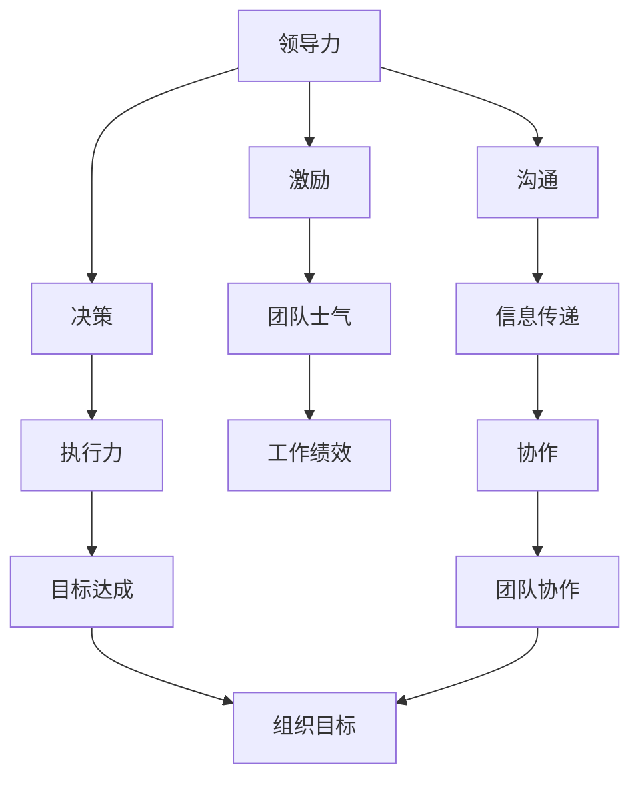

                 

### 背景介绍

在快速发展的IT行业，企业不仅面临着技术更新换代的速度加快，还需应对市场竞争的激烈程度不断提高。在这样的环境中，团队的有效管理显得尤为重要。而领导力和目标管理正是团队管理中不可或缺的两个核心要素。

领导力作为推动团队发展的关键动力，涵盖了领导者如何通过自身的素质、风格和策略来激励和引导团队成员，以实现共同的目标。有效的领导力不仅能够提升团队成员的工作积极性和创造力，还能在团队面临挑战和困难时，保持团队的一致性和凝聚力。

另一方面，目标管理则是确保团队工作方向一致、任务明确和高效执行的重要手段。通过科学的目标设定、分解和追踪，目标管理能够帮助团队明确各自的职责和任务，确保每个成员都朝着共同的目标努力。同时，目标管理还能为团队提供量化的评估标准，便于领导者及时调整团队策略，优化工作流程。

在这篇文章中，我们将深入探讨领导力与目标管理的重要性，并详细分析其在团队管理中的具体应用和实施方法。我们将从领导力的定义和重要性开始，逐步探讨领导风格的类型和适用场景，领导者的素质与自我提升路径。接下来，我们将重点介绍目标管理的核心原则，包括SMART原则、目标分解与任务分配的方法。随后，我们将讨论团队协作的重要性与挑战，以及团队成员的角色与职责。文章的最后，我们将结合实际案例，分析如何通过领导力和目标管理实现团队的高效运作，并总结最佳实践和注意事项。

通过本文的详细探讨，希望能够为读者提供一套系统化的团队管理思路，帮助他们在实际工作中更好地运用领导力和目标管理，确保团队方向一致，从而实现组织的目标。

### 核心概念与联系

在深入探讨领导力与目标管理之前，理解核心概念及其相互关系至关重要。以下我们将通过Mermaid流程图展示这些核心概念及其关联，以便更直观地理解。

**图1：领导力的核心概念与联系**

**领导力** 是一种通过激励、沟通和决策来引导团队成员实现共同目标的能力。它涵盖了多个方面：

- **激励（B）**：领导者通过激励来激发团队成员的积极性和创造力，提升团队士气（E）。
- **沟通（C）**：良好的沟通确保信息准确、及时地传递（F），为团队协作（K）打下基础。
- **决策（D）**：领导者在团队面临问题时作出决策，影响执行力和目标达成（G和J）。

**目标管理** 是确保团队工作方向一致和任务明确的重要手段，其核心原则包括：

- **团队士气（E）**：通过激励和沟通，提升团队士气，有助于工作绩效（H）。
- **团队协作（K）**：通过有效的协作和信息传递，确保团队成员在实现目标时能够协同作战。
- **执行力（G）**：执行力的强弱直接影响目标的达成（J）。

这些核心概念和关联共同构成了团队管理的基础，领导力通过激励和沟通推动团队协作，而目标管理确保团队工作方向一致和任务明确，从而实现组织的目标。

理解这些核心概念及其相互关系，不仅有助于领导者提升管理能力，还能帮助团队成员更好地理解和执行各自的角色，最终实现团队和组织的共同目标。

### 领导力的重要性

领导力作为团队管理的核心要素，其重要性不容忽视。首先，领导力是激励团队成员的关键。一个优秀的领导者能够通过激励策略，如明确目标、认可成就、提供反馈等，激发团队成员的积极性和创造力，从而提高整体工作表现。这种激励不仅能够提高团队成员的工作效率，还能增强他们的职业满意度和忠诚度，进而提升团队士气。

其次，领导力在促进团队协作方面发挥着至关重要的作用。有效的领导者能够搭建沟通平台，确保信息在团队内部流畅传递，减少误解和冲突。通过建立信任和共同价值观，领导者能够促进团队成员之间的协作，提高团队的整体执行力。这种协作不仅能够加快任务的完成速度，还能提高任务的完成质量，确保团队能够在面对复杂问题和挑战时，保持高效运作。

此外，领导力还在决策过程中起到了决定性作用。领导者通过收集和分析信息，权衡各种利弊，作出合理的决策。这些决策不仅关系到团队当前的任务，还影响到团队的长远发展。一个有远见的领导者能够在不确定的环境中，做出明智的决策，为团队指明方向，降低风险。

从数据来看，领导力对团队绩效的影响是显著的。根据哈佛商学院的研究，领导力对团队绩效的影响程度高达30%。另一项由麦肯锡公司进行的研究表明，具备高效领导力的团队，其项目成功率比普通团队高出20%。这些数据充分证明了领导力在团队管理中的重要性。

总之，领导力不仅是提升团队士气、促进协作和决策的关键，还直接关系到团队的整体绩效和成功。通过有效的领导力，团队能够更好地应对各种挑战，实现共同的目标。因此，领导者需要不断学习、提升自身领导力，以更好地引领团队走向成功。

### 领导风格的类型与适用场景

领导风格是领导者管理团队的方式和方法，不同类型的领导风格适用于不同的管理场景。以下我们将介绍几种常见的领导风格，并探讨它们在不同情境下的适用性。

**1. 权威型领导风格**

权威型领导风格是指领导者通过明确的指令和严格控制来管理团队。这种风格通常在紧急情况或需要快速决策时使用，因为权威型领导者能够迅速制定决策并执行。例如，当项目遇到突发问题时，权威型领导者能够迅速采取行动，避免问题进一步恶化。然而，这种风格如果过度使用，可能会导致团队成员失去自主性和创造力，从而影响团队的长期发展。

**2. 民主型领导风格**

民主型领导风格是指领导者鼓励团队成员参与决策过程，并尊重团队成员的意见。这种风格适用于需要广泛意见和协作的项目。例如，在开发新产品时，民主型领导者会组织团队讨论，收集团队成员的意见，从而制定出更全面和创新的解决方案。然而，民主型领导风格可能需要更多的时间来达成共识，因此在时间紧迫的情况下，可能不是最佳选择。

**3. 支持型领导风格**

支持型领导风格是指领导者关注团队成员的需求和感受，提供情感上的支持和鼓励。这种风格适用于需要高工作满意度和团队成员高度投入的项目。例如，在开发新软件时，支持型领导者会定期与团队成员交流，了解他们的困难和需求，并提供必要的帮助。这种领导风格有助于提升团队成员的满意度和忠诚度，但需要注意的是，过度关注个人需求可能会导致团队目标分散。

**4. 赏识型领导风格**

赏识型领导风格是指领导者通过表扬和奖励来激励团队成员。这种风格适用于需要高度激励和动机的项目。例如，在项目成功完成时，赏识型领导者会公开表扬团队成员的贡献，并给予奖励。这种领导风格能够迅速提高团队成员的积极性和工作热情，但需要注意的是，过度依赖赏识可能会导致团队成员对奖励产生依赖，影响长远发展。

**5. 个性化领导风格**

个性化领导风格是指领导者根据团队成员的不同特点和需求，采用不同的领导方式。这种风格适用于多元化团队，例如跨文化团队或拥有不同背景和技能的团队。个性化领导者会与每个团队成员建立良好的关系，了解他们的需求，并根据这些需求提供个性化的支持和激励。这种风格能够最大程度地发挥团队成员的潜力，提高团队的整体绩效。

**适用场景总结**

- 权威型领导风格：适用于紧急情况和需要快速决策的项目。
- 民主型领导风格：适用于需要广泛意见和协作的项目。
- 支持型领导风格：适用于需要高工作满意度和团队成员高度投入的项目。
- 赏识型领导风格：适用于需要高度激励和动机的项目。
- 个性化领导风格：适用于多元化团队，例如跨文化团队或拥有不同背景和技能的团队。

了解并运用不同类型的领导风格，有助于领导者根据不同情境和团队需求，选择最合适的领导方式，从而提高团队的整体表现和效率。

### 领导者的素质与自我提升

领导者的素质是决定其领导力强弱的关键因素。一个优秀的领导者需要具备一系列的素质，包括沟通能力、决策能力、情商、自信心和持续学习的意识。以下将详细探讨这些素质，并介绍一些自我提升的方法与途径。

**1. 沟通能力**

沟通能力是领导者必备的素质之一。有效的沟通能够确保信息准确、及时地传递，减少误解和冲突，提高团队的协作效率。领导者需要具备良好的口头和书面沟通技巧，能够在不同场合下清晰、简洁地表达自己的观点，并倾听和理解团队成员的意见。为了提升沟通能力，领导者可以参加沟通技巧培训课程，多进行角色扮演练习，或者阅读相关书籍和文章。

**2. 决策能力**

决策能力是领导者处理问题和推动团队发展的关键能力。领导者需要在压力和不确定性下做出明智的决策，以实现团队目标。提升决策能力的方法包括增强逻辑思维和分析能力、积累经验、学习不同的决策模型和方法，如SWOT分析、决策树等。此外，领导者可以参与模拟决策的练习，通过实战来提高自己的决策能力。

**3. 情商**

情商是领导者理解和管理自己及他人情感的能力。具备高情商的领导者能够更好地处理人际关系，提高团队的凝聚力。提升情商的方法包括学习情感识别和表达能力、增强同理心、培养积极的心态和情绪管理技巧。阅读心理学书籍、参加情商培训课程以及与他人进行深入的交流和反思，都是提高情商的有效途径。

**4. 自信心**

自信心是领导者面对挑战和压力时的心理素质。具备自信心的领导者能够坚定自己的信念，激发团队成员的信心和积极性。提升自信心的方法包括设定并实现小目标、正面肯定自己、学会从失败中汲取教训、培养乐观的态度。通过持续的自我提升和不断取得成功，领导者可以逐步建立并增强自信心。

**5. 持续学习**

持续学习是领导者保持竞争优势和适应快速变化环境的关键。领导者需要不断更新知识和技能，以应对新的挑战和机遇。自我提升的方法包括定期阅读专业书籍、参加行业研讨会和培训课程、学习新技能和工具，以及与他人进行知识分享和交流。此外，领导者还可以通过实践和反思，从实际工作中学习，不断提高自身的综合素质。

**案例分析：成功领导者的自我提升路径**

以苹果公司创始人史蒂夫·乔布斯为例，他在领导过程中展现了卓越的沟通能力、决策能力和持续学习的意识。乔布斯通过简洁有力的演讲和极具感染力的表达方式，成功地将苹果公司的愿景和使命传递给全球用户和员工。他凭借敏锐的洞察力和果断的决策能力，推动了苹果公司一系列创新产品的诞生。此外，乔布斯在领导过程中始终保持着对新技术和新趋势的高度关注，不断学习并引入新的理念和方法，为苹果公司带来了持续的创新和成功。

总之，领导者的素质是决定其领导力强弱的关键因素。通过自我提升的方法和途径，领导者可以不断提高自身的综合素质，从而更好地引领团队实现共同的目标。

### 目标管理的定义与作用

目标管理是一种通过明确目标、分配任务和监控进展来确保团队工作高效执行的管理方法。它不仅帮助团队明确方向，还能提高工作效率和达成率。以下是目标管理的定义及其作用的具体阐述。

**定义：**

目标管理（Management by Objectives, MBO）起源于20世纪50年代的美国，由管理大师彼得·德鲁克（Peter Drucker）提出。目标管理的核心理念是，通过设定明确、可量化的目标，使得每个团队成员都清楚自己的职责和任务，从而实现团队的整体目标。

目标管理的过程通常包括以下几个步骤：

1. **设定目标**：首先，领导者需要与团队成员共同讨论并确定团队的目标。这些目标应具有可量化、具体和时间限制的特点，以便于追踪和评估。
2. **分配任务**：在明确目标后，领导者需要将任务分解，并分配给相应的团队成员。每个成员应明确自己的职责和任务，以确保目标能够被有效执行。
3. **监控进展**：目标设定和任务分配完成后，领导者需要定期监控团队成员的工作进展，提供必要的支持和反馈。这有助于及时发现并解决问题，确保团队能够按计划完成任务。
4. **评估结果**：在任务完成后，领导者需要对目标达成情况进行评估，总结经验和教训，并为下一个目标管理周期做准备。

**作用：**

1. **明确方向**：目标管理通过设定明确的目标，使团队成员清晰了解团队的方向和期望，从而减少工作中的迷茫和困惑。
2. **提高效率**：明确的目标和任务分配有助于团队成员集中精力，提高工作效率。同时，定期的监控和反馈机制能够确保团队成员始终处于高效工作状态。
3. **优化资源**：通过目标管理，团队能够更有效地分配资源，确保每个资源都能用在最需要的地方，从而最大化资源利用效率。
4. **增强团队凝聚力**：目标管理不仅关注个人目标的实现，更强调团队整体目标的达成。这种共同目标的实现能够增强团队成员之间的协作和信任，提高团队凝聚力。
5. **持续改进**：目标管理的过程包括监控进展和评估结果，这为团队提供了持续改进的机会。通过总结经验和教训，团队能够不断优化工作流程，提高整体绩效。

总之，目标管理作为一种系统化的管理方法，不仅能够帮助团队明确方向和任务，提高工作效率和达成率，还能增强团队凝聚力和持续改进的能力。通过科学的设定和执行目标，团队能够更好地应对各种挑战，实现组织的目标。

### 目标设定的SMART原则

SMART原则是目标设定中的一种重要方法，旨在确保目标具有明确性、可实现性、相关性、时限性和具体性。以下是SMART原则的具体内容和如何应用这些原则来设定有效的目标。

**1. Specific（具体性）**

具体性原则要求目标必须明确具体，避免模糊和宽泛的描述。一个具体的目标应该回答以下问题：

- **谁**：涉及到目标执行的主体，明确是团队还是个人。
- **什么**：目标的具体内容，需要清晰明确。
- **何时**：目标的完成时间，确保有明确的时间节点。
- **哪里**：目标的实施地点，有助于确定资源需求。
- **如何**：实现目标的手段和方法。

例如，一个不具体的目标可能是“提高产品质量”，而一个具体的目标则是“在2023年底前，将产品缺陷率降低至0.5%以下”。

**2. Measurable（可衡量性）**

可衡量性原则要求目标必须具备可衡量的指标，以便于追踪和评估进展。这些指标可以是数量、质量、时间等。衡量指标应具体、量化，便于比较和分析。

例如，一个目标“提高销售额”可以具体化为“2023年销售额达到1000万美元”。

**3. Achievable（可实现性）**

可实现性原则强调目标应具有可实现性，即通过合理资源和努力可以达到。设定目标时需要考虑团队的能力、资源和外部环境因素。

例如，一个不切实际的目标是“在一个月内实现销售额翻倍”，而一个可实现的目标是“通过增加市场推广力度，使2023年第四季度的销售额相比去年同期增长20%”。

**4. Relevant（相关性）**

相关性原则要求目标应与团队的整体目标和战略方向保持一致。确保每个目标都是为了实现团队的核心价值和长远目标。

例如，一个与团队战略无关的目标是“组织一次年度员工旅游”，而一个相关的目标是“提高客户满意度，从而提升客户保留率”。

**5. Time-bound（时限性）**

时限性原则要求目标必须设定明确的时间限制，这有助于提高团队的紧迫感和责任感。时间限制应具体，以便于团队成员在特定时间内集中精力完成任务。

例如，一个无时限的目标是“提高团队工作效率”，而一个时限性的目标是“在2023年6月底前，实施新的项目管理工具，以提高团队工作效率”。

**应用实例**

假设一家IT公司的目标是“提升客户满意度”，可以按照SMART原则设定以下具体目标：

- **Specific**：提升客户对产品的满意度，特别是针对新功能的部分。
- **Measurable**：客户满意度评分从目前的70分提升至80分。
- **Achievable**：通过增加用户反馈机制和改进产品功能来实现。
- **Relevant**：提升客户满意度有助于提高客户保留率和市场占有率。
- **Time-bound**：在2023年第三季度末完成这一目标。

通过以上实例，可以看到SMART原则在目标设定中的具体应用，有助于确保目标的明确性、可实现性和时限性，从而提高目标管理的有效性。

### 目标分解与任务分配

目标分解与任务分配是目标管理中的关键环节，确保目标能够具体落地并有效执行。以下将详细介绍目标分解的方法、任务分配的原则和具体实施步骤。

**1. 目标分解的方法**

目标分解是将一个总体目标细分为多个可执行的任务的过程。具体方法如下：

- **自上而下分解**：从总体目标开始，逐层分解为更具体的子目标。例如，一个公司的年度目标是实现销售额增长20%，可以分解为每个季度的销售目标，再进一步分解为每月的销售任务。
- **自下而上分解**：首先确定具体任务，再逐步合并为更高层次的目标。这种方法适用于已经明确任务流程和责任分工的情况。
- **矩阵分解**：将目标分解为横向和纵向两个维度。横向是任务的分解，纵向是责任和时间的分解。这种方法有助于全面了解任务的具体执行情况和进度。

**2. 任务分配的原则**

任务分配需要遵循以下原则，以确保任务能够有效执行：

- **职责明确**：每个任务都应明确分配给具体的团队成员，确保每个成员都清楚自己的职责和任务。
- **能力匹配**：分配任务时应考虑团队成员的能力和技能，确保任务难度与成员能力相匹配，避免资源浪费或任务无法完成。
- **责任共担**：重要任务可以分配给多个团队成员，形成责任共担机制，降低单个成员的负担和风险。
- **优先级排序**：根据任务的重要性和紧急程度，对任务进行优先级排序，确保团队首先完成关键任务。

**3. 实施步骤**

目标分解与任务分配的具体实施步骤如下：

- **步骤一：明确总体目标**。首先，团队领导者需要明确团队的整体目标，确保所有成员对目标有清晰的理解。
- **步骤二：分解总体目标**。使用目标分解的方法，将总体目标细分为具体的子目标，并形成目标树或矩阵图。
- **步骤三：确定任务列表**。根据子目标，确定需要完成的任务，列出详细的任务列表，包括任务名称、执行人、任务描述和任务截止日期。
- **步骤四：分配任务**。根据团队成员的能力和职责，将任务合理分配，确保每个成员都有明确的任务和责任。
- **步骤五：沟通与确认**。与团队成员沟通任务分配情况，确保成员理解自己的任务和责任，并就任务细节达成共识。
- **步骤六：制定执行计划**。为每个任务制定详细的执行计划，包括执行步骤、所需资源、时间安排和质量要求。
- **步骤七：监控与调整**。在任务执行过程中，定期监控任务进展，及时发现并解决问题，必要时调整任务分配和执行计划。

通过以上步骤，团队可以确保目标分解与任务分配的合理性和有效性，从而实现总体目标的顺利达成。

### 团队协作的重要性与挑战

团队协作在实现项目成功中扮演着至关重要的角色。有效的团队协作能够整合团队成员的智慧和资源，提高整体工作效率和创新能力。以下是团队协作的重要性及其面临的挑战，以及提高团队协作效率的策略。

**团队协作的重要性**

1. **提升工作效率**：通过团队协作，团队成员可以共同分担工作负担，减少重复劳动，提高整体工作效率。团队成员能够互相补充技能，协同完成任务。
2. **增强创新能力**：团队成员之间共享知识和经验，能够激发新的创意和解决方案。多样化的视角和思考方式有助于提升项目的创新性。
3. **提高工作满意度**：团队协作能够增强成员之间的信任和归属感，提高工作满意度。成员在合作中感受到自己的价值和贡献，从而更加投入工作。
4. **减少沟通成本**：有效的团队协作减少了信息传递的环节和误解的可能性，降低了沟通成本，提高了决策速度。

**面临的挑战**

1. **沟通障碍**：团队成员之间可能存在语言、文化和背景差异，导致沟通不畅。信息传递中的误解和滞后会影响团队协作的效率。
2. **目标不一致**：团队成员对项目目标和优先级可能有不同的理解，导致工作方向不一致，影响项目进展。
3. **资源分配不均**：团队内资源分配不均可能导致某些成员工作负担过重，而另一些成员缺乏参与感，影响团队的整体表现。
4. **冲突与协作**：团队成员之间存在不同的意见和利益冲突，处理不当可能影响团队协作的和谐。

**提高团队协作效率的策略**

1. **明确目标和期望**：确保所有团队成员对项目目标、任务和优先级有共同的理解和认识，建立统一的工作方向。
2. **建立有效的沟通机制**：定期召开团队会议，设立明确的沟通渠道，鼓励团队成员主动分享信息、提出建议和解决问题。使用协作工具，如项目管理软件和即时通讯工具，确保信息传递及时、准确。
3. **平衡资源分配**：合理分配任务，确保每个成员的工作量适中，避免资源浪费或过度负担。
4. **培养团队文化**：建立积极向上的团队文化，鼓励成员之间的信任和尊重，促进合作和互助。通过团建活动和培训提升团队成员的团队协作能力。
5. **解决冲突**：及时识别和处理团队内部的冲突，通过沟通、协商和调解等方式，确保团队和谐。制定冲突解决机制，确保团队成员在遇到问题时能够顺利解决。

通过以上策略，团队能够克服协作中的障碍，提高整体协作效率，实现项目的成功完成。

### 团队成员的角色与职责

在团队协作中，明确团队成员的角色与职责是确保任务有效完成和团队目标顺利实现的关键。以下是团队成员常见角色及其职责的详细阐述。

**1. 项目经理（Project Manager）**

- **角色**：项目经理是团队的核心领导者，负责总体项目的规划、执行和监控。
- **职责**：
  - 制定项目计划，确保任务分配合理、进度可控。
  - 组织项目团队会议，协调团队成员的工作，解决项目中的问题。
  - 监控项目进展，及时调整计划和资源，确保项目按期完成。
  - 沟通与客户和利益相关者，确保项目需求的理解和满足。

**2. 技术专家（Technical Expert）**

- **角色**：技术专家是团队中的技术核心，负责技术问题的解决和方案的设计。
- **职责**：
  - 提供技术支持和解决方案，解决项目中遇到的技术难题。
  - 设计和开发关键技术组件，确保技术方案的可行性。
  - 撰写技术文档，为团队成员提供技术参考和指导。
  - 协助团队成员进行技术培训，提升团队整体技术能力。

**3. 设计师（Designer）**

- **角色**：设计师负责项目的视觉效果和用户体验设计。
- **职责**：
  - 设计用户界面和用户体验，确保产品的美观和易用性。
  - 根据项目需求，制定设计规范和标准。
  - 协调与前端开发人员，确保设计能够顺利实现。
  - 收集用户反馈，持续优化设计，提升用户体验。

**4. 开发人员（Developer）**

- **角色**：开发人员是项目的主要实施者，负责编码和实现项目功能。
- **职责**：
  - 根据设计文档和技术规范，编写代码，实现项目功能。
  - 与设计师和技术专家协作，确保代码的质量和功能的实现。
  - 定期进行代码审查，确保代码的可读性和可维护性。
  - 参与项目测试，修复发现的问题。

**5. 测试工程师（Test Engineer）**

- **角色**：测试工程师负责项目的质量控制和测试工作。
- **职责**：
  - 设计和执行测试用例，确保项目的功能和质量。
  - 发现并报告项目中存在的问题，与开发人员协作解决问题。
  - 进行回归测试，确保新代码的引入不会影响现有功能。
  - 提供测试报告，为项目验收和交付提供质量保障。

**6. 产品经理（Product Manager）**

- **角色**：产品经理负责产品的整体规划和策略。
- **职责**：
  - 确定产品需求和市场方向，制定产品规划和策略。
  - 沟通与客户和开发团队，确保需求的理解和满足。
  - 监控产品开发进度，确保产品按计划推进。
  - 收集市场反馈，持续优化产品设计和功能。

通过明确团队成员的角色与职责，团队能够更高效地分工合作，确保每个成员都能在各自的岗位上发挥最大价值，共同实现项目目标。

### 团队目标实现的步骤与方法

实现团队目标是一个系统化的过程，涉及多个关键步骤和策略。以下是团队目标实现的主要步骤和方法，详细说明如何通过科学的流程和策略确保目标的达成。

**1. 设定明确的目标**

明确的目标是团队实现目标的第一步。根据SMART原则，目标应具备具体性、可衡量性、可实现性、相关性和时限性。例如，一个明确的目标可以是“在2023年第三季度末，将产品缺陷率降低至0.5%以下”。设定目标时应确保所有团队成员对目标有清晰的认识和理解。

**2. 制定详细的计划**

在明确目标后，需要制定详细的执行计划，包括任务分解、时间安排、资源分配和风险评估。任务分解应将总体目标细分为具体的子任务，每个子任务应明确负责人和截止日期。例如，如果目标是降低产品缺陷率，可以分解为以下子任务：
- 设计并实施新的质量检测流程。
- 对现有测试流程进行优化。
- 对开发人员进行质量意识培训。
- 每周进行一次缺陷分析会议。

**3. 分配资源和职责**

根据执行计划，合理分配资源和职责，确保每个团队成员都清楚自己的任务和责任。资源分配应考虑团队成员的能力和技能，确保任务与能力相匹配。例如，可以安排技术专家负责质量检测流程的设计，测试工程师负责实施和优化测试流程。

**4. 监控进度与调整计划**

在执行过程中，定期监控任务进度，确保项目按计划推进。可以通过以下方法进行监控：
- **定期召开进度会议**：每周或每两周召开一次团队进度会议，检查任务完成情况，解决遇到的问题。
- **使用项目管理工具**：使用项目管理软件，如Trello、JIRA等，跟踪任务进度和资源使用情况。
- **实时沟通与反馈**：确保团队成员之间的沟通畅通，及时反馈问题和进展。

在监控过程中，如果发现计划与实际情况存在偏差，应及时调整计划。例如，如果某个任务延误，可以重新分配资源或调整任务优先级。

**5. 激励与反馈**

通过激励和反馈机制，提升团队成员的工作积极性和责任感。以下是一些激励和反馈的方法：
- **奖励与认可**：对完成任务的团队成员进行奖励，如奖金、荣誉证书或公开表扬。
- **定期的绩效评估**：定期对团队成员的工作进行评估，提供具体的反馈和建议。
- **团队建设活动**：组织团队建设活动，增强团队凝聚力和信任。

**6. 风险管理**

在目标实现过程中，风险管理是至关重要的。以下是一些风险管理的方法：
- **识别潜在风险**：在项目初期，识别可能影响目标实现的潜在风险，如技术难题、资源短缺或市场变化。
- **制定应对策略**：为每个潜在风险制定应对策略，如备用方案、资源调配或沟通策略。
- **定期评估风险**：在项目执行过程中，定期评估风险的变化和影响，及时调整应对策略。

**7. 持续改进**

目标实现不是一次性的过程，而是一个持续改进的过程。以下是一些持续改进的方法：
- **总结经验与教训**：在项目完成后，总结经验教训，识别成功因素和改进空间。
- **优化工作流程**：根据总结的经验，优化工作流程，提高工作效率和效果。
- **知识分享**：鼓励团队成员分享知识和经验，提升团队整体能力。

通过以上步骤和方法，团队可以确保目标实现的有序推进和高效完成，从而实现组织的目标。

### 项目实战：目标管理与领导力的应用

在本案例中，我们将通过一个真实的软件开发项目，详细讲解如何应用目标管理和领导力来确保项目成功。

**项目背景：**

某科技公司计划开发一款智能客户关系管理（CRM）系统，以提升客户管理效率和客户满意度。该项目涉及多个团队，包括开发团队、测试团队和产品管理团队。为了确保项目按期完成并达到预期目标，项目团队决定采用目标管理和领导力方法。

**目标设定：**

根据SMART原则，项目团队制定了以下目标：

- **具体性**：开发一个功能全面、用户友好的CRM系统。
- **可衡量性**：在2023年第三季度末，完成所有核心功能的开发和测试，并达到客户满意度评分80分以上。
- **可实现性**：通过合理分配资源和优化工作流程，确保项目按期完成。
- **相关性**：提升客户满意度，提高公司市场份额。
- **时限性**：2023年第三季度末。

**项目计划：**

1. **任务分解**：项目团队将总体目标分解为以下子任务：
   - 设计和开发用户界面
   - 实现客户信息管理功能
   - 实现销售管理功能
   - 实现客户服务管理功能
   - 完成系统测试
   - 收集客户反馈

2. **资源分配**：根据任务要求，合理分配资源：
   - 技术专家负责设计和开发核心功能
   - 测试工程师负责系统测试和问题跟踪
   - 产品经理负责收集客户反馈和需求调整

3. **时间安排**：每个子任务设置明确的截止日期，确保项目按计划推进。

**领导力应用：**

1. **沟通与协调**：项目经理定期召开团队会议，确保团队成员对任务和目标有清晰的理解，及时解决沟通障碍和资源冲突。

2. **激励与反馈**：项目经理通过奖励和认可机制，激励团队成员，如对完成任务出色的成员给予奖金和表扬。

3. **决策与调整**：在项目执行过程中，项目经理根据进展情况及时调整计划和资源，确保项目按期完成。

**实施过程：**

1. **设计和开发**：技术专家团队根据产品需求，设计并开发CRM系统的核心功能，如客户信息管理、销售管理和客户服务管理。

2. **测试**：测试工程师团队对系统进行全面的测试，包括功能测试、性能测试和安全测试，确保系统的稳定性和可靠性。

3. **反馈与优化**：产品经理团队收集客户反馈，与开发团队和测试团队协作，对系统进行优化，提升用户体验。

**项目结果：**

- 项目在2023年第三季度末成功完成，所有核心功能得到客户认可。
- 客户满意度评分达到85分，超过预期目标。
- 项目团队通过目标管理和领导力方法，高效完成了项目，提升了团队凝聚力和工作效率。

**项目小结：**

通过本案例，我们可以看到，目标管理和领导力在项目中的重要作用。通过明确的目标设定、合理的任务分解和科学的资源分配，项目团队能够高效地推进项目。领导者的沟通协调、激励反馈和决策调整能力，则确保了项目能够在面对挑战和问题时，保持方向一致，最终实现项目成功。

### 最佳实践 tips

在团队管理中，运用领导力和目标管理是实现高效运作的关键。以下是一些最佳实践，供读者参考：

1. **持续沟通**：建立高效的沟通机制，确保团队成员之间的信息传递畅通。定期召开团队会议，及时分享项目进展、问题和解决方案。

2. **明确目标**：根据SMART原则设定明确的目标，确保团队成员对目标有清晰的认识。定期回顾和调整目标，以适应项目变化。

3. **分配任务**：根据团队成员的能力和兴趣，合理分配任务，确保任务与能力的匹配。明确任务责任，确保每个任务都有明确的负责人。

4. **激励和认可**：通过奖励和认可机制，激励团队成员的积极性和创造力。同时，关注团队成员的职业发展和成长需求。

5. **团队建设**：定期组织团队建设活动，增强团队凝聚力和信任。鼓励团队成员分享经验和知识，提升团队整体能力。

6. **风险管理**：识别并管理项目中的潜在风险，制定应对策略。定期评估风险，确保项目在可控范围内推进。

7. **持续改进**：在项目完成后，总结经验和教训，持续优化工作流程和管理方法。鼓励团队成员提出改进建议，促进团队持续成长。

通过以上最佳实践，团队能够更好地运用领导力和目标管理，确保团队方向一致，实现高效运作。

### 小结

本文围绕领导力与目标管理进行了深入探讨，从背景介绍、核心概念与联系、领导力的重要性、领导风格的类型与适用场景、领导者的素质与自我提升、目标管理的定义与作用、目标设定的SMART原则、目标分解与任务分配、团队协作的重要性与挑战、团队成员的角色与职责、团队目标实现的步骤与方法以及项目实战等多个方面进行了详细阐述。通过本文的探讨，我们认识到领导力与目标管理在团队管理中的关键作用，它们不仅能够明确团队方向和任务，提高工作效率，还能增强团队凝聚力和创新能力。

在实际应用中，领导力和目标管理需要根据具体情境和团队特点进行灵活调整。领导者需要不断学习和提升自身素质，运用合适的领导风格和方法，确保团队成员的方向一致和高效协作。同时，目标管理应具备科学性和可操作性，通过明确的目标设定和任务分配，推动团队向共同目标努力。

未来，随着信息技术的发展和管理理念的更新，领导力和目标管理将在团队管理中发挥更加重要的作用。希望读者能够结合本文内容，结合自身实际工作，不断提升领导力和目标管理能力，为团队和组织创造更大的价值。

### 注意事项

在实际运用领导力和目标管理时，需要注意以下几个关键点：

1. **沟通的重要性**：确保团队内部沟通畅通，避免信息孤岛，及时解决沟通中的障碍。
2. **目标设定的科学性**：遵循SMART原则，设定具体、可衡量、可实现、相关和时限性的目标。
3. **合理分配资源**：根据团队成员的能力和任务需求，合理分配资源，避免资源浪费或过度负荷。
4. **持续监督与反馈**：定期监控项目进展，及时提供反馈和调整计划，确保团队始终朝着目标前进。
5. **团队协作的和谐**：培养积极向上的团队文化，鼓励合作与信任，解决团队内部的冲突和矛盾。
6. **风险管理的有效性**：识别和管理项目中的潜在风险，制定应对策略，确保项目在可控范围内推进。

通过遵循这些注意事项，团队能够更好地运用领导力和目标管理，实现高效运作和目标达成。

### 拓展阅读

对于希望进一步深入了解领导力和目标管理的读者，以下是一些推荐书籍和资源：

1. **《领导力五要素》（The Five Dysfunctions of a Team）** - 作者：帕特里克·莱西奥尼（Patrick Lencioni）。本书通过寓言故事的形式，深入探讨了团队协作中的五大障碍及其解决方法。

2. **《目标管理》（The One Minute Manager）** - 作者：肯尼斯·布兰查德（Kenneth Blanchard）和斯宾塞·约翰逊（Spencer Johnson）。本书介绍了目标管理的核心理念和实践方法，有助于提升个人和团队的目标设定和执行能力。

3. **《SMART目标设定》（SMART Goals）** - 作者：乔治·D·多伊奇（George D. Starnes）。本书详细阐述了SMART原则在目标设定中的应用，帮助读者制定更具体、更有效的目标。

4. **《敏捷团队管理》（Agile Project Management: Creating Innovative Products）** - 作者：杰夫·萨瑟兰（Jeff Sutherland）和乔·吉拉（Joel Breed）。本书介绍了敏捷开发中的团队管理方法，强调了目标管理和领导力在敏捷团队中的作用。

5. **《领导力的艺术》（The Art of Leadership）** - 作者：詹姆斯·M·凯恩（James M. Kouzes）和巴里·Z· Posner。本书通过多个案例研究，探讨了领导力的艺术和实践方法。

通过阅读这些书籍和资源，读者可以更深入地了解领导力和目标管理的理论与实践，为团队管理提供有力支持。作者：AI天才研究院/AI Genius Institute & 禅与计算机程序设计艺术 /Zen And The Art of Computer Programming。

