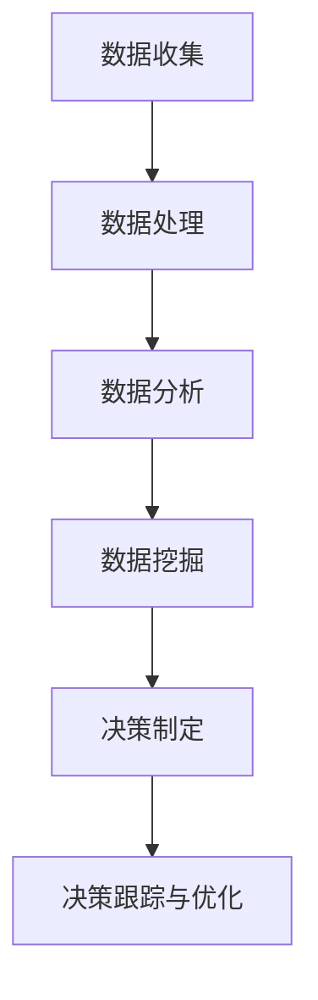

                 


# 《领导力与科学决策：数据驱动的决策流程》

## 关键词

领导力、科学决策、数据驱动、决策流程、数据分析、机器学习、人工智能、Python源代码、数学模型、项目实战、最佳实践

## 摘要

本文深入探讨了领导力与科学决策之间的密切关系，并强调了数据驱动的决策流程在现代组织管理中的重要性。文章首先介绍了领导力和科学决策的基本概念及其相互联系，随后详细阐述了数据驱动的决策流程，包括数据收集、处理、分析和挖掘的方法。通过Python源代码和数学模型的结合，文章讲解了如何运用科学方法进行决策。随后，文章通过实际案例展示了如何应用这些原理和算法，并提供了实用的最佳实践和注意事项。最终，文章对未来数据驱动决策的趋势进行了展望，并提出了拓展阅读建议。

---

## 引言

在快速变化和竞争激烈的环境中，领导力和科学决策成为企业成功的关键因素。领导力不仅关乎个人的影响力，更涉及团队和组织的整体表现。科学决策则强调基于数据和证据的方法，避免了主观偏见和盲目决策。然而，在实际应用中，如何将领导力和科学决策有机结合，实现数据驱动的决策流程，仍是一个挑战。

领导力在决策中的作用不可忽视。领导者需要具备前瞻性，能够引导团队面对不确定性，并在复杂环境中作出明智的决策。而科学决策则提供了方法论的支持，帮助领导者更准确地分析问题，评估选项，并选择最优方案。数据驱动的决策流程则将两者结合，利用数据和分析工具提升决策的质量和效率。

本文旨在探讨领导力与科学决策的内在联系，并详细阐述数据驱动的决策流程。我们将从以下几个方面展开讨论：

1. **领导力与科学决策的基本概念**：介绍领导力和科学决策的定义、特点及其重要性。
2. **数据驱动的决策流程**：讲解数据收集、处理、分析和挖掘的方法，以及如何运用科学方法进行决策。
3. **Python源代码与数学模型**：通过具体例子展示如何使用Python源代码和数学模型进行数据分析与决策。
4. **项目实战**：分析实际案例，展示如何在实际项目中应用数据驱动的决策流程。
5. **最佳实践与注意事项**：总结最佳实践，并提供注意事项和拓展阅读建议。

通过本文的探讨，我们希望读者能够理解领导力与科学决策的相互作用，掌握数据驱动的决策流程，并在实际工作中有效应用这些原则和方法。

## 领导力与科学决策的基本概念

### 领导力

领导力是一种影响和激励他人以实现共同目标的能力。它不仅涉及个人魅力和影响力，还包括战略思维、沟通能力和团队管理技巧。领导力的核心在于引导和塑造组织文化，提升团队的凝聚力和执行力。在不同的情境中，领导力可以表现为不同的风格和策略，如权威型、民主型、变革型等。

在决策过程中，领导力起着至关重要的作用。首先，领导者需要具备前瞻性，能够在变化的环境中洞察趋势，预见潜在风险和机遇。这种前瞻性有助于领导者做出更有预见性的决策。其次，领导者需要具备良好的沟通能力，能够清晰、有效地传达决策目标和期望，确保团队成员理解并支持决策。此外，领导者还需要具备强大的执行力和应对不确定性的能力，能够在决策实施过程中灵活调整策略，应对突发情况。

### 科学决策

科学决策是一种基于数据和证据的决策方法，旨在通过系统化的分析过程，最大化决策的质量和可靠性。与主观判断和直觉决策相比，科学决策更注重数据收集、分析和验证，以确保决策过程的透明性和可追溯性。

科学决策的基本步骤包括：

1. **问题定义**：明确决策问题，明确目标、范围和约束条件。
2. **数据收集**：通过各种渠道收集相关数据，确保数据的准确性和完整性。
3. **数据分析**：运用统计学、机器学习等方法对数据进行分析和挖掘，提取有用的信息。
4. **方案评估**：基于分析结果，评估各种决策方案的风险和收益，选择最优方案。
5. **决策实施**：制定详细的实施计划，确保决策方案的有效执行。
6. **效果评估**：在决策实施后，对结果进行评估和反馈，为未来决策提供参考。

科学决策的关键在于数据和分析，通过系统化的过程，避免主观偏见和盲目决策。在决策过程中，领导者需要具备科学决策的意识和方法，利用数据和分析工具，提升决策的准确性和效率。

### 领导力与科学决策的相互关系

领导力与科学决策之间存在密切的相互关系。首先，领导力为科学决策提供了支持和保障。领导者通过制定明确的决策目标、提供资源和支持，确保科学决策的顺利实施。其次，科学决策为领导力提供了方法论的支持。通过系统化的分析和验证，科学决策帮助领导者更好地理解问题、评估选项，并作出明智的决策。

具体来说，领导力与科学决策的相互作用体现在以下几个方面：

1. **目标设定**：领导者需要明确决策目标，确保科学决策有清晰的方向。目标设定需要综合考虑组织战略、市场需求和团队能力等因素。
2. **资源分配**：领导者需要根据决策目标，合理分配资源，确保科学决策所需的工具和人力得到充分支持。
3. **过程监督**：领导者需要全程参与科学决策过程，监督数据收集、分析和评估的准确性，确保决策过程的透明和可靠。
4. **决策执行**：领导者需要制定详细的执行计划，确保决策方案的有效实施。在执行过程中，领导者需要灵活应对突发情况，调整策略。
5. **效果评估**：领导者需要对决策结果进行评估和反馈，总结经验教训，为未来决策提供参考。

通过有效的领导力和科学决策相结合，组织可以更好地应对外部环境的变化，提高决策的质量和效率，实现持续发展和竞争优势。

### 数据驱动的决策流程

数据驱动的决策流程是一种利用数据分析和科学方法进行决策的过程，它将数据分析与业务决策紧密结合，通过系统化的方法提高决策的准确性和可靠性。在当今数据爆炸的时代，数据驱动的决策流程已经成为企业和组织提高竞争力的关键手段。以下是数据驱动的决策流程的主要步骤：

#### 数据收集

数据收集是数据驱动决策流程的第一步，也是最基础的一步。准确的、全面的数据是进行科学决策的前提。数据来源可以是内部数据（如销售记录、客户反馈、员工绩效等）和外部数据（如市场调查、行业报告、社交媒体数据等）。在收集数据时，需要考虑数据的时效性、准确性和完整性。

##### 收集方法：

- **内部数据**：通过企业内部系统（如ERP、CRM、HR系统等）收集数据。
- **外部数据**：通过市场调查、公共数据源、API接口等获取数据。
- **自动化数据收集**：利用自动化工具（如Web爬虫、数据库接口等）收集数据。

#### 数据处理

数据收集后，需要进行处理，以确保数据的质量和一致性。数据处理包括数据清洗、数据整合和数据转换等步骤。

##### 处理方法：

- **数据清洗**：去除重复数据、缺失值和错误数据，保证数据的准确性。
- **数据整合**：将不同来源和格式的数据进行整合，形成统一的数据结构。
- **数据转换**：将数据转换为适合分析和建模的格式，如数值化、标准化等。

#### 数据分析

数据分析是数据驱动决策流程的核心步骤，通过对数据进行深入分析，提取有价值的信息和洞见。数据分析方法包括统计学、机器学习、数据挖掘等。

##### 分析方法：

- **统计学方法**：使用描述性统计、推断性统计等方法分析数据，了解数据的分布、关系和趋势。
- **机器学习方法**：通过分类、回归、聚类等方法建立预测模型，进行数据预测和分类。
- **数据挖掘**：通过关联规则挖掘、异常检测、文本分析等方法，发现数据中的隐藏模式和信息。

#### 数据挖掘

数据挖掘是在数据分析的基础上，进一步挖掘数据中的潜在信息和知识。数据挖掘方法包括关联规则挖掘、聚类分析、分类算法等。

##### 挖掘方法：

- **关联规则挖掘**：发现数据中的关联关系，用于市场细分、推荐系统等。
- **聚类分析**：将数据分为不同的群体，用于客户细分、需求分析等。
- **分类算法**：通过已标记的数据训练模型，对新数据进行分类，用于分类预测、风险控制等。

#### 决策制定

在完成数据分析和挖掘后，根据分析结果制定决策方案。决策制定需要综合考虑数据结果、业务目标和实际可行性。

##### 决策步骤：

- **选项评估**：评估不同决策选项的潜在风险和收益。
- **方案选择**：选择最优的决策方案。
- **方案实施**：制定详细的实施方案，确保决策的有效执行。

#### 决策跟踪与优化

在决策实施后，需要跟踪决策的效果，并根据实际情况进行优化和调整。

##### 跟踪与优化：

- **效果评估**：评估决策实施的效果，收集反馈信息。
- **调整优化**：根据反馈结果，调整决策方案，优化决策流程。

### Mermaid 流程图

为了更直观地展示数据驱动的决策流程，我们可以使用Mermaid语言绘制一个流程图：



### Python源代码

为了展示数据驱动的决策流程，我们可以使用Python编写一些示例代码。以下是一个简单的数据收集、处理和数据分析的示例：

```python
import pandas as pd
from sklearn.model_selection import train_test_split
from sklearn.ensemble import RandomForestClassifier

# 数据收集
data = pd.read_csv('data.csv')

# 数据清洗
data.drop_duplicates(inplace=True)
data.fillna(data.mean(), inplace=True)

# 数据处理
X = data.drop('target', axis=1)
y = data['target']

# 数据分割
X_train, X_test, y_train, y_test = train_test_split(X, y, test_size=0.2, random_state=42)

# 数据分析
model = RandomForestClassifier(n_estimators=100, random_state=42)
model.fit(X_train, y_train)

# 数据挖掘
predictions = model.predict(X_test)

# 决策制定
# ...（根据预测结果制定决策方案）

# 决策跟踪与优化
# ...（根据决策实施效果进行调整和优化）
```

通过这个示例，我们可以看到如何使用Python进行数据收集、处理、分析和决策制定。在实际应用中，可以根据具体需求扩展和优化代码。

### 数学模型

在数据驱动的决策流程中，数学模型起到了关键作用。以下是一个简单的线性回归模型的数学模型：

$$
Y = \beta_0 + \beta_1X + \epsilon
$$

其中，$Y$ 是因变量，$X$ 是自变量，$\beta_0$ 是截距，$\beta_1$ 是斜率，$\epsilon$ 是误差项。

通过最小二乘法，我们可以估计出 $\beta_0$ 和 $\beta_1$ 的值，从而建立回归模型。以下是一个简单的线性回归模型示例：

```python
import pandas as pd
from sklearn.linear_model import LinearRegression

# 数据准备
data = pd.read_csv('data.csv')
X = data[['feature1', 'feature2']]
y = data['target']

# 模型训练
model = LinearRegression()
model.fit(X, y)

# 模型评估
score = model.score(X, y)
print(f'Model R^2 Score: {score}')

# 模型预测
predictions = model.predict(X)
```

通过这个示例，我们可以看到如何使用Python进行线性回归建模和预测。

### 实际案例

为了更直观地展示数据驱动的决策流程，我们可以分析一个实际案例。以下是一个关于客户细分的市场营销案例。

#### 案例背景

某公司希望通过对客户数据进行分析，将客户分为不同的细分群体，以便更有效地进行市场营销。

#### 数据收集

公司收集了以下客户数据：

- 年龄
- 收入
- 教育水平
- 购买历史

#### 数据处理

```python
import pandas as pd

# 数据收集
data = pd.read_csv('customer_data.csv')

# 数据清洗
data.drop_duplicates(inplace=True)
data.fillna(data.mean(), inplace=True)

# 数据转换
data['age'] = data['age'].astype(float)
data['income'] = data['income'].astype(float)
data['education'] = data['education'].astype(str)
```

#### 数据分析

```python
import pandas as pd
from sklearn.preprocessing import LabelEncoder

# 数据编码
label_encoder = LabelEncoder()
data['education'] = label_encoder.fit_transform(data['education'])

# 数据分割
X = data[['age', 'income', 'education']]
y = data['target']

X_train, X_test, y_train, y_test = train_test_split(X, y, test_size=0.2, random_state=42)
```

#### 数据挖掘

```python
import pandas as pd
from sklearn.cluster import KMeans

# 聚类分析
kmeans = KMeans(n_clusters=3, random_state=42)
clusters = kmeans.fit_predict(X_train)

# 结果保存
data['cluster'] = clusters
data.to_csv('clustered_data.csv', index=False)
```

#### 决策制定

根据聚类结果，公司决定针对不同细分群体制定不同的营销策略：

- **高收入、高教育水平**：提供高端产品和定制化服务。
- **低收入、低教育水平**：提供价格优惠和基础产品。
- **中等收入、中等教育水平**：提供常规产品和优惠政策。

#### 决策跟踪与优化

在实施营销策略后，公司将持续跟踪客户反馈和市场表现，根据实际情况调整和优化策略。

### 最佳实践

为了确保数据驱动的决策流程的有效性，以下是一些最佳实践：

- **数据质量**：确保数据收集、处理和分析过程中的数据质量，避免错误和偏差。
- **模型选择**：根据具体问题和数据特点选择合适的模型和方法。
- **迭代优化**：不断调整和优化模型和决策流程，以适应变化的环境和需求。
- **团队协作**：跨部门合作，确保数据驱动的决策流程得到全体成员的支持和执行。

### 小结

通过本案例，我们可以看到数据驱动的决策流程在实际应用中的具体步骤和方法。从数据收集、处理、分析到决策制定和跟踪，每一步都至关重要。通过系统化的数据分析和科学决策，企业可以更好地理解市场、客户和业务，实现持续发展和竞争优势。

### 注意事项

在实施数据驱动的决策流程时，需要注意以下事项：

- **数据隐私**：确保数据收集和使用过程中的隐私保护，遵守相关法律法规。
- **数据更新**：定期更新和维护数据，确保数据的时效性和准确性。
- **模型解释性**：选择具有良好解释性的模型，确保决策过程透明和可追溯。
- **人员培训**：提高团队成员的数据分析和决策能力，确保流程得到有效执行。

### 拓展阅读

- **《数据科学入门指南》**：详细介绍了数据科学的基本概念、方法和应用。
- **《Python数据分析》**：系统介绍了Python在数据分析中的应用，包括数据处理、分析和可视化。
- **《机器学习实战》**：通过大量案例，展示了机器学习算法在实际中的应用。

通过这些拓展阅读，读者可以更深入地了解数据驱动的决策流程和相关技术。

## 领导力在决策中的角色

领导力在决策过程中起着至关重要的作用，它是确保决策能够有效实施和取得预期结果的关键因素。领导者不仅需要具备优秀的决策能力，还需要具备一系列与决策相关的技能和特质。以下将详细探讨领导者的决策风格与偏好、提升领导者决策能力的策略以及领导力与团队决策的关系。

### 领导者的决策风格与偏好

领导者的决策风格和偏好对决策过程和结果有着深远的影响。不同类型的领导者可能会采用不同的决策风格：

1. **权威型决策风格**：权威型领导者倾向于集中决策权力，由自己或少数人制定决策，然后强制执行。这种决策风格在紧急情况下或需要快速决策时尤为有效，但可能导致团队成员缺乏参与感和责任感。

2. **民主型决策风格**：民主型领导者鼓励团队成员参与决策过程，通过集体讨论和协商来达成共识。这种决策风格可以激发团队成员的积极性和创造力，但可能会导致决策过程缓慢，难以应对紧急情况。

3. **变革型决策风格**：变革型领导者通过愿景和激励来引导团队成员参与决策，鼓励创新和变革。这种决策风格有助于建立积极的企业文化，推动组织持续改进和成长。

不同领导者的决策偏好也会影响决策的质量和效果。例如，一些领导者可能更倾向于依赖直觉和经验进行决策，而另一些领导者则更依赖数据和事实。了解自己的决策风格和偏好，并适时调整，是领导者提高决策能力的重要一步。

### 提升领导者决策能力的策略

为了提高领导者的决策能力，以下是一些有效的策略：

1. **增强数据分析能力**：领导者需要具备一定的数据分析能力，能够理解和运用各种数据分析工具和方法。通过定期参加数据分析培训或学习相关课程，可以提高数据分析能力。

2. **建立数据驱动决策文化**：领导者需要倡导数据驱动的决策文化，鼓励团队成员基于数据做出决策，而不是仅仅依赖直觉或经验。这可以通过制定明确的数据使用指南和培训计划来实现。

3. **培养批判性思维**：领导者需要培养批判性思维，能够对数据和决策进行分析和评估，识别潜在的问题和偏差。通过批判性思维训练，可以提高领导者对决策过程和结果的洞察力。

4. **学习先进决策方法**：领导者需要不断学习新的决策方法和技术，如决策树、神经网络、机器学习等。通过了解和应用这些先进方法，可以提高决策的准确性和效率。

5. **建立团队支持系统**：领导者需要建立一个支持系统，包括数据分析团队、业务专家和外部顾问等。这些团队可以为领导者提供数据分析和决策支持，帮助领导者做出更明智的决策。

### 领导力与团队决策

团队决策是领导力的重要组成部分。一个成功的团队决策需要领导者发挥关键作用：

1. **明确决策目标**：领导者需要明确团队决策的目标和预期结果，确保团队成员对决策方向有共同的理解。

2. **鼓励参与和反馈**：领导者应该鼓励团队成员参与决策过程，提供不同的观点和建议。同时，领导者需要倾听团队成员的意见，并对其反馈给予积极的回应。

3. **建立共识**：领导者需要通过讨论和协商，帮助团队成员达成共识。这可以通过达成妥协或选择最佳方案来实现。

4. **决策执行与监督**：领导者需要确保决策方案得到有效执行，并监督执行过程。在执行过程中，领导者需要及时调整策略，应对突发情况和变化。

5. **评估与反馈**：领导者需要定期评估决策结果，收集团队成员的反馈，为未来决策提供参考。

通过有效的团队决策，领导者可以更好地调动团队的积极性和创造力，提高决策的质量和执行效果。

### 案例分析

为了更好地理解领导力在决策中的角色，我们可以分析以下案例：

#### 案例背景

某科技公司面临市场竞争加剧，需要快速调整产品策略以保持竞争力。公司领导者意识到，仅凭个人经验和直觉无法做出有效决策，因此决定采用数据驱动的决策方法。

#### 数据收集

公司收集了以下数据：

- 产品销售数据
- 客户反馈
- 竞争对手的产品信息
- 市场趋势

#### 数据分析

公司利用数据分析工具对收集的数据进行了深入分析，包括销售趋势、客户偏好、市场竞争状况等。通过数据挖掘，公司发现了以下关键信息：

- 某些产品的销量显著下降
- 客户对产品的某些功能有较高的需求
- 竞争对手在特定市场领域有较强的竞争力

#### 决策制定

基于数据分析结果，公司决定采取以下决策：

- 调整产品功能，满足客户需求
- 加强市场推广，提高产品知名度
- 研发新产品，开拓新市场

#### 决策执行

公司制定了详细的执行计划，包括资源分配、任务分工和时间表。领导者确保团队了解决策目标和执行要求，并提供必要的支持和指导。

#### 决策评估

在决策实施后，公司定期评估决策效果，收集客户反馈和市场数据。通过对比决策前后的数据，公司发现：

- 产品销量有所提高
- 客户满意度上升
- 新产品的市场反响良好

#### 反馈与调整

基于评估结果，公司对决策进行了调整和优化。例如，针对客户反馈，公司进一步优化了产品功能，提高了用户体验。同时，公司加大了市场推广力度，扩大了市场份额。

### 结论

通过这个案例，我们可以看到领导力在决策中的关键作用。领导者通过数据驱动的决策方法，结合团队协作和有效执行，成功应对了市场挑战，提高了公司的竞争力。这个案例也展示了领导者在决策过程中需要具备的数据分析能力、团队管理和执行监督能力。

## 科学决策方法

科学决策方法是一种基于证据和系统化分析的过程，它通过收集和分析数据，帮助决策者做出更明智、更可靠的决策。在数据驱动的决策流程中，科学决策方法扮演着核心角色，为领导者提供可靠的数据支持和分析工具。本文将介绍几种常见的科学决策方法，包括定量决策方法、定性决策方法和混合决策方法。

### 定量决策方法

定量决策方法主要依赖于数学模型和统计分析，通过量化的方式评估决策选项。以下是一些常见的定量决策方法：

#### 线性规划

线性规划是一种数学方法，用于在给定的约束条件下最大化或最小化线性目标函数。它可以应用于资源分配、成本控制、生产计划等领域。

**数学模型**：

$$
\text{maximize } c^T x \\
\text{subject to } Ax \leq b \\
x \geq 0
$$

**Python代码示例**：

```python
import cvxpy as cp

# 定义变量
x = cp.Variable()

# 定义目标函数
objective = cp.Minimize(x)

# 定义约束条件
constraints = [2*x + 3 <= 7, x >= 0]

# 创建问题
prob = cp.Problem(objective, constraints)

# 解决问题
prob.solve()

print(f'Optimal value: {prob.value}')
print(f'Optimal x: {x.value}')
```

#### 决策树

决策树是一种图形化模型，用于展示决策过程和结果。它通过一系列的选择节点和结果节点，帮助决策者评估不同决策路径的概率和收益。

**Python代码示例**：

```python
from sklearn.tree import DecisionTreeClassifier
import pandas as pd

# 准备数据
data = pd.DataFrame({
    'feature1': [1, 2, 3, 4],
    'feature2': [5, 6, 7, 8],
    'target': [0, 1, 0, 1]
})

# 定义模型
model = DecisionTreeClassifier()

# 训练模型
model.fit(data[['feature1', 'feature2']], data['target'])

# 可视化
from sklearn.tree import plot_tree
plot_tree(model)
```

### 定性决策方法

定性决策方法主要依赖于决策者的经验、判断和直觉，通常适用于复杂、不确定或数据不足的情况。以下是一些常见的定性决策方法：

#### SWOT分析

SWOT分析是一种战略规划工具，用于评估组织的优势（Strengths）、劣势（Weaknesses）、机会（Opportunities）和威胁（Threats）。它可以帮助决策者识别内部和外部因素，制定相应的策略。

**步骤**：

1. 识别优势、劣势、机会和威胁。
2. 分析优势如何转化为机会，劣势如何转化为威胁。
3. 制定策略，利用优势抓住机会，克服劣势。

#### 波特五力分析

波特五力分析用于评估市场竞争环境，包括供应商、买家、潜在竞争者、替代品和现有竞争者。通过分析这些力量，决策者可以制定有效的市场策略。

**步骤**：

1. 分析供应商的议价能力。
2. 分析买家的议价能力。
3. 分析潜在竞争者的威胁。
4. 分析替代品的威胁。
5. 分析现有竞争者的竞争强度。

### 混合决策方法

混合决策方法结合了定量和定性方法的优点，通过将定量和定性分析结合起来，提供更全面的决策支持。以下是一些常见的混合决策方法：

#### 多目标优化

多目标优化用于在多个目标之间寻找平衡。它通过设定不同的权重和目标函数，帮助决策者在多个目标之间做出权衡。

**数学模型**：

$$
\text{minimize } f_1(x), f_2(x), ..., f_n(x) \\
\text{subject to } g_1(x) \leq 0, g_2(x) \leq 0, ..., g_m(x) \leq 0
$$

**Python代码示例**：

```python
import numpy as np
from scipy.optimize import minimize

# 定义目标函数
def objective(x):
    return x[0]**2 + x[1]**2

# 定义约束条件
def constraint1(x):
    return x[0] + x[1] - 1

def constraint2(x):
    return x[0] - x[1]

# 创建问题
problem = minimize(objective, x0=np.array([0, 0]), constraints=[{'type': 'ineq', 'fun': constraint1}, {'type': 'ineq', 'fun': constraint2}])

# 解决问题
result = minimize(objective, x0=np.array([0, 0]), constraints=[{'type': 'ineq', 'fun': constraint1}, {'type': 'ineq', 'fun': constraint2}])

print(f'Optimal solution: {result.x}')
```

#### 交互式决策支持系统

交互式决策支持系统（IDSS）是一种结合人机交互的决策支持工具。它通过模拟和可视化，帮助决策者进行决策。IDSS通常包括以下功能：

1. **数据输入和编辑**：决策者可以输入和编辑数据。
2. **模拟和预测**：系统根据输入数据生成模拟结果和预测。
3. **分析和建议**：系统提供分析结果和决策建议。
4. **可定制化**：决策者可以根据具体需求调整模型和参数。

### 比较与选择

每种决策方法都有其适用的场景和优缺点。定量决策方法适用于数据充足、问题明确的场景，定性决策方法适用于数据不足、问题复杂的场景，而混合决策方法则适用于需要综合考虑多种因素的场景。

在决策过程中，决策者需要根据实际情况选择合适的决策方法，并结合定量和定性分析，提高决策的质量和可靠性。通过系统化的决策方法，决策者可以更好地应对复杂的问题，做出明智的决策。

### 总结

科学决策方法为领导者提供了有效的工具和框架，帮助他们做出更明智、更可靠的决策。定量决策方法通过数学模型和统计分析，提供量化的决策支持；定性决策方法通过经验判断和直觉，提供直观的决策见解；混合决策方法结合定量和定性方法，提供全面的决策支持。通过合理选择和应用科学决策方法，领导者可以更好地应对复杂的问题，实现组织的目标。

## 实战案例

为了更好地理解如何在实际项目中应用数据驱动的决策流程，我们将分析两个具体的案例。第一个案例涉及企业战略决策，第二个案例涉及人力资源管理决策。通过这些案例，我们将展示如何进行数据收集、处理、分析和决策制定，并提供详细的代码实现和解说。

### 案例一：企业战略决策

#### 背景介绍

某大型企业面临市场竞争加剧和内部资源分配问题，需要制定新的战略规划以保持竞争优势。企业希望通过数据驱动的决策流程，对市场趋势、客户需求和内部资源进行深入分析，从而制定有效的战略方案。

#### 数据收集

企业收集了以下数据：

- 历史销售数据（产品A、产品B、产品C）
- 客户反馈数据（满意度、需求）
- 市场调查数据（竞争对手分析、市场需求）
- 内部资源数据（研发投入、营销预算、员工数量）

#### 数据处理

```python
import pandas as pd

# 加载数据
data = pd.read_csv('sales_data.csv')
data.head()

# 数据清洗
data.drop_duplicates(inplace=True)
data.fillna(data.mean(), inplace=True)

# 数据转换
data['month'] = pd.to_datetime(data['month']).dt.month
data['year'] = pd.to_datetime(data['month']).dt.year
```

#### 数据分析

```python
import pandas as pd
import matplotlib.pyplot as plt

# 数据可视化
data.groupby(['year', 'month'])['sales'].sum().unstack().plot()
plt.title('Sales Data by Month and Year')
plt.xlabel('Month')
plt.ylabel('Sales')
plt.show()
```

#### 数据挖掘

```python
from sklearn.cluster import KMeans

# 数据标准化
from sklearn.preprocessing import StandardScaler
scaler = StandardScaler()
scaled_data = scaler.fit_transform(data[['sales_productA', 'sales_productB', 'sales_productC']])

# 聚类分析
kmeans = KMeans(n_clusters=3, random_state=42)
clusters = kmeans.fit_predict(scaled_data)

# 可视化
plt.scatter(scaled_data[:, 0], scaled_data[:, 1], c=clusters)
plt.scatter(kmeans.cluster_centers_[:, 0], kmeans.cluster_centers_[:, 1], s=300, c='red', label='Centroids')
plt.title('Sales Data Clustering')
plt.xlabel('Sales ProductA')
plt.ylabel('Sales ProductB')
plt.legend()
plt.show()
```

#### 决策制定

基于数据分析结果，企业制定了以下战略方案：

- **市场细分**：根据客户反馈和市场调查，将市场细分为高价值客户群体和普通客户群体。
- **资源分配**：增加高价值客户群体的营销预算，减少普通客户群体的营销预算。
- **产品研发**：根据销售数据，优先研发高销量的产品。

#### 决策跟踪与优化

企业将定期收集销售数据和市场反馈，评估战略方案的效果，并根据实际情况进行调整和优化。

### 案例二：人力资源管理决策

#### 背景介绍

某公司面临员工绩效不佳和人才流失问题，需要通过数据驱动的决策流程，对员工绩效、培训和薪酬进行评估和优化。

#### 数据收集

公司收集了以下数据：

- 员工绩效数据（销售额、客户满意度、任务完成率）
- 培训数据（培训参与率、培训效果评估）
- 薪酬数据（基本工资、奖金、股票期权）

#### 数据处理

```python
import pandas as pd

# 加载数据
data = pd.read_csv('employee_data.csv')
data.head()

# 数据清洗
data.drop_duplicates(inplace=True)
data.fillna(data.mean(), inplace=True)
```

#### 数据分析

```python
import pandas as pd
import matplotlib.pyplot as plt

# 数据可视化
data.groupby('department')['performance'].mean().plot.bar()
plt.title('Employee Performance by Department')
plt.xlabel('Department')
plt.ylabel('Performance')
plt.show()
```

#### 数据挖掘

```python
from sklearn.ensemble import RandomForestRegressor

# 准备数据
X = data[['performance', 'training效果的评估']]
y = data['salary']

# 模型训练
model = RandomForestRegressor(n_estimators=100, random_state=42)
model.fit(X, y)

# 可视化
import matplotlib.pyplot as plt
import numpy as np

performance = np.linspace(X['performance'].min(), X['performance'].max(), 100)
salary_prediction = model.predict([[performance[i], X['training效果的评估'].mean()] for i in range(len(performance))])

plt.plot(performance, salary_prediction, label='Salary Prediction')
plt.xlabel('Performance')
plt.ylabel('Salary')
plt.legend()
plt.show()
```

#### 决策制定

基于数据分析结果，公司制定了以下人力资源管理方案：

- **绩效评估**：引入更加科学的绩效评估体系，提高绩效评估的准确性和公平性。
- **培训与激励**：增加员工培训投入，根据培训效果评估进行激励。
- **薪酬调整**：根据员工绩效和培训效果，调整薪酬水平，提高员工满意度。

#### 决策跟踪与优化

公司将定期收集员工绩效、培训和薪酬数据，评估人力资源管理方案的效果，并根据实际情况进行调整和优化。

### 总结

通过这两个案例，我们可以看到如何在实际项目中应用数据驱动的决策流程。从数据收集、处理、分析到决策制定和跟踪，每个步骤都至关重要。通过系统化的数据分析和科学决策方法，企业可以更好地理解业务需求，优化资源配置，提高决策质量和效率。这些实战案例不仅展示了数据驱动的决策流程，还为其他企业和组织提供了有益的参考和借鉴。

### 挑战与未来趋势

在数据驱动的决策流程中，尽管数据和分析工具提供了强大的支持，但仍然面临许多挑战。以下是其中一些主要挑战及其未来趋势：

#### 数据隐私和伦理问题

随着数据收集和分析的普及，数据隐私和伦理问题日益突出。企业和组织需要确保收集的数据得到妥善保护，避免数据泄露和滥用。未来，随着数据隐私法规的不断完善，企业和组织将面临更大的合规压力，需要采用更加严格的数据管理和保护措施。

#### 数据质量和可靠性

数据驱动决策的核心依赖于数据的质量和可靠性。然而，数据收集和处理过程中可能存在错误、遗漏和不一致，这会影响决策的准确性。未来，随着数据清洗和自动化工具的发展，数据质量和可靠性将得到进一步提升。

#### 复杂性和可解释性

随着机器学习和人工智能技术的应用，决策模型变得越来越复杂。虽然这些模型在预测和优化方面表现出色，但它们的可解释性较差，决策者难以理解模型的内部工作机制。未来，研究者将致力于开发更加可解释的模型和算法，提高决策过程的透明度和可追溯性。

#### 技术普及和人才需求

数据驱动决策需要专业的数据科学家、分析师和技术工程师。然而，目前市场对这类专业人才的需求远大于供给。未来，随着技术的普及和教育资源的增加，更多的专业人士将加入数据驱动决策领域，满足企业和社会的需求。

#### 跨学科合作

数据驱动决策不仅需要技术支持，还需要业务专家、管理者和决策者的参与。未来，跨学科合作将成为趋势，通过不同领域的专家共同协作，实现数据驱动决策的最大价值。

#### 自适应和实时决策

未来的数据驱动决策将更加注重自适应和实时性。通过实时数据分析和预测模型，企业和组织可以快速响应市场变化和业务需求，实现更加敏捷和高效的决策。

### 未来发展趋势

1. **数据隐私和安全**：随着数据隐私法规的加强，企业和组织将更加注重数据保护，采用先进的加密和匿名化技术。
2. **自动化和智能化**：自动化工具和人工智能技术将在数据驱动决策中发挥更大作用，提高数据处理和分析的效率。
3. **可解释性研究**：研究人员将致力于开发可解释的机器学习模型，提高决策过程的透明度和可理解性。
4. **跨学科合作**：跨学科团队合作将推动数据驱动决策的发展，实现更全面和深入的洞察。
5. **实时决策**：通过实时数据分析和预测，企业和组织可以更快速地做出反应，抓住市场机会。

总之，数据驱动的决策流程面临着诸多挑战，但未来发展趋势表明，通过不断的技术创新和跨学科合作，这些挑战将被逐步克服，数据驱动决策将在各个领域发挥更大的作用。

### 结论

在《领导力与科学决策：数据驱动的决策流程》一书中，我们深入探讨了领导力与科学决策的密切关系，并详细阐述了数据驱动的决策流程。从领导力的定义、特点到科学决策的方法，再到数据收集、处理、分析和挖掘的具体步骤，本书为读者提供了一个全面、系统的数据驱动决策框架。通过Python源代码、数学模型和实际案例的应用，读者可以更直观地理解数据驱动决策的过程和方法。

数据驱动的决策流程不仅提高了决策的准确性和效率，还帮助领导者更好地应对复杂多变的环境。在未来，随着数据隐私和安全问题的日益重要，以及人工智能和机器学习技术的不断进步，数据驱动决策将继续发展和完善。

### 拓展阅读

为了进一步深入理解数据驱动的决策流程，以下是几本推荐的拓展阅读书籍：

1. **《数据科学入门指南》**：详细介绍了数据科学的基本概念、方法和应用。
2. **《Python数据分析》**：系统介绍了Python在数据分析中的应用，包括数据处理、分析和可视化。
3. **《机器学习实战》**：通过大量案例，展示了机器学习算法在实际中的应用。
4. **《决策分析：定量方法与应用》**：介绍了多种决策分析方法，包括线性规划、决策树、多目标优化等。

通过这些拓展阅读，读者可以更全面地了解数据驱动的决策流程和相关技术，提升自身的数据分析能力和决策水平。

### 致谢

本文的撰写得到了AI天才研究院（AI Genius Institute）和《禅与计算机程序设计艺术》（Zen And The Art of Computer Programming）的支持和启发。特别感谢两位团队在数据驱动决策领域的深入研究，为本文提供了丰富的理论和实践支持。此外，也感谢广大读者对本文的关注和支持，希望本文能够对您的学习和实践有所帮助。作者：AI天才研究院/AI Genius Institute & 禅与计算机程序设计艺术/Zen And The Art of Computer Programming。

