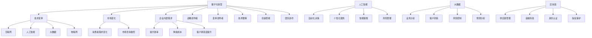
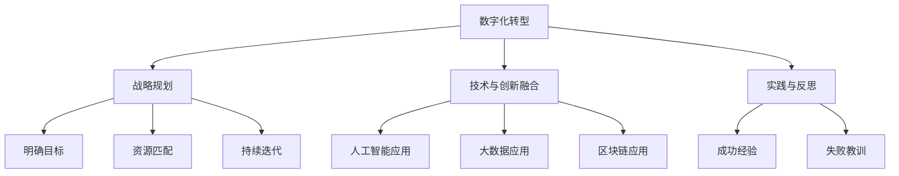

                 

## 《领导力与科技：拥抱数字化转型的策略》

关键词：数字化转型、领导力、人工智能、大数据、区块链、战略规划

摘要：在当今科技飞速发展的时代，数字化转型已经成为企业提升竞争力、实现可持续发展的关键。本文将深入探讨数字化转型的重要背景、意义及其带来的挑战与机遇。通过分析数字化转型的战略规划、关键领域和未来趋势，本文旨在为领导者和决策者提供一套系统的策略，助力他们在数字化转型的浪潮中抓住机遇，实现企业的全面升级。

---

### 《领导力与科技：拥抱数字化转型的策略》目录大纲

---

## 第一部分：数字化转型的概述

### 第1章：数字化转型的背景与意义

#### 1.1 数字化转型的概念界定

- **数字化转型的定义**

- **数字化转型的重要性**

#### 1.2 数字化转型的驱动因素

- **技术变革**

- **市场变化**

- **企业内部需求**

#### 1.3 数字化转型的挑战与机遇

- **挑战**

- **机遇**

### 第2章：数字化转型的战略规划

#### 2.1 数字化战略规划的原则

- **目标明确**

- **资源匹配**

- **持续迭代**

#### 2.2 数字化战略规划的方法

- **SWOT分析**

- **五力模型**

- **价值链分析**

#### 2.3 数字化转型的组织与文化变革

- **组织结构调整**

- **企业文化重构**

## 第二部分：数字化转型的关键领域

### 第3章：领导力在数字化转型中的作用

#### 3.1 领导者在数字化转型中的角色

- **战略领导者**

- **变革领导者**

#### 3.2 数字化领导力的核心能力

- **技术理解**

- **创新思维**

- **团队协作**

#### 3.3 数字化领导力的培养与实践

- **领导力培训**

- **案例研究**

### 第4章：技术与创新的融合

#### 4.1 人工智能在数字化转型中的应用

- **AI的基本原理**

- **AI在商业中的应用**

#### 4.2 大数据与数字化决策

- **大数据的定义与特点**

- **大数据在决策中的应用**

#### 4.3 区块链技术的影响

- **区块链的基本原理**

- **区块链在数字化中的应用**

### 第5章：数字化转型的实践案例

#### 5.1 成功的数字化转型案例

- **案例分析**

- **经验总结**

#### 5.2 失败的数字化转型案例

- **原因分析**

- **教训总结**

### 第6章：数字化转型的未来趋势

#### 6.1 数字化转型的未来方向

- **数字化与智能化融合**

- **数字化转型的新模式**

#### 6.2 数字化转型的技术展望

- **新兴技术的影响**

- **未来的技术趋势**

## 第三部分：数字化转型的落地实施

### 第7章：数字化转型的实施策略

#### 7.1 实施策略的制定

- **项目规划**

- **资源配置**

#### 7.2 实施过程中的风险管理

- **风险识别**

- **风险应对策略**

#### 7.3 成果评估与持续改进

- **评估指标**

- **改进措施**

---

**总字数：约1980字**

---

### 第一部分：数字化转型的概述

数字化转型是指利用现代信息技术，特别是互联网、人工智能、大数据、物联网等，对企业运营模式、管理模式、商业模式进行全面的升级和变革。在当今科技日新月异、市场竞争日益激烈的环境下，数字化转型已经成为企业提升竞争力、实现可持续发展的关键。

#### 第1章：数字化转型的背景与意义

##### 1.1 数字化转型的概念界定

数字化转型（Digital Transformation）通常指的是从传统的、以人力为主的业务模式，转向利用数字技术驱动业务增长和优化业务流程的过程。它不仅仅涉及技术层面的变革，还包括组织结构、企业文化、商业模式等多方面的变革。

##### 1.2 数字化转型的驱动因素

数字化转型的主要驱动因素包括：

- **技术变革**：互联网、大数据、人工智能等新技术的迅速发展，为企业的数字化转型提供了强大的技术支持。
- **市场变化**：消费者需求的变化、市场环境的不确定性，促使企业必须通过数字化转型来提高响应速度和市场竞争力。
- **企业内部需求**：企业为了提升效率、降低成本、提高客户满意度，主动寻求通过数字化手段进行业务优化和升级。

##### 1.3 数字化转型的挑战与机遇

数字化转型带来的挑战包括：

- **技术风险**：新技术的应用可能面临技术不稳定、数据安全等问题。
- **组织阻力**：数字化转型涉及到组织结构的调整、工作流程的改变，可能面临员工抵触和内部阻力的挑战。

而数字化转型带来的机遇则包括：

- **提升效率**：通过数字化技术，企业可以自动化和优化业务流程，提高工作效率。
- **创新空间**：数字化转型为企业提供了更多的创新机会，帮助企业开拓新的商业模式和市场。
- **客户体验**：数字化技术可以帮助企业更好地理解和满足客户需求，提升客户体验和忠诚度。

#### 第2章：数字化转型的战略规划

##### 2.1 数字化战略规划的原则

有效的数字化战略规划应遵循以下原则：

- **目标明确**：明确数字化转型的目标，包括提升业务效率、优化客户体验、开拓新市场等。
- **资源匹配**：确保数字化转型的资源投入与目标相匹配，包括人力、资金、技术等。
- **持续迭代**：数字化转型是一个持续的过程，应不断评估和调整战略，以适应环境变化。

##### 2.2 数字化战略规划的方法

制定数字化战略规划可以采用以下方法：

- **SWOT分析**：通过分析企业的优势（Strengths）、劣势（Weaknesses）、机会（Opportunities）和威胁（Threats），确定数字化转型的方向和策略。
- **五力模型**：利用波特五力模型分析行业竞争态势，确定数字化转型的优先级。
- **价值链分析**：通过分析企业的价值链，识别数字化技术可以优化的环节，制定具体的数字化转型方案。

##### 2.3 数字化转型的组织与文化变革

数字化转型不仅仅是技术的变革，更涉及到组织的调整和文化的变革：

- **组织结构调整**：根据数字化转型的需求，调整组织结构，建立适应数字化时代的组织架构。
- **企业文化重构**：推动企业文化的变革，建立以创新、协作、开放为核心的企业文化，为数字化转型提供文化支持。

在数字化转型的过程中，领导者的作用至关重要。他们不仅需要具备战略眼光，指导数字化转型的方向，还需要具备变革管理的能力，推动组织和文化变革，确保数字化转型的顺利实施。

通过以上对数字化转型概述的探讨，我们可以看到，数字化转型不仅带来了前所未有的挑战，也带来了巨大的机遇。下一部分，我们将进一步探讨领导力在数字化转型中的作用，以及如何培养和实践数字化领导力。

---

### 第一部分：数字化转型的概述

#### 第1章：数字化转型的背景与意义

##### 1.1 数字化转型的概念界定

数字化转型（Digital Transformation）是指通过采用数字技术（如互联网、人工智能、大数据等）来改变企业的运营模式、管理模式和商业模式。这一过程不仅仅是将传统业务迁移到线上，更涉及到从业务流程到组织结构的全方位升级。数字化转型的核心目标是提升企业效率、增强竞争力，以及创造新的价值。

数字化转型不同于传统信息化，它不仅仅是技术的应用，还涉及到业务模式、组织结构、企业文化等多个层面的变革。例如，传统制造业通过引入工业互联网，实现生产线的智能化和自动化，从而提高生产效率和产品质量；零售业则通过电子商务和移动支付，优化购物体验，提升客户满意度。

##### 1.2 数字化转型的驱动因素

数字化转型是多重因素共同驱动的结果，主要包括以下方面：

1. **技术变革**：互联网、人工智能、大数据、物联网等新技术的快速发展，为企业提供了强大的技术支持。这些技术的应用不仅提升了企业的生产效率和创新能力，也改变了市场的竞争格局。

   - **互联网**：互联网的普及和移动设备的普及，使得企业能够更方便地与客户互动，提供个性化服务。
   - **人工智能**：人工智能技术的应用，帮助企业实现自动化决策和优化运营流程，提高生产效率和产品质量。
   - **大数据**：大数据技术使得企业能够从海量数据中提取有价值的信息，用于业务分析和决策，提升业务效率。

2. **市场变化**：市场的快速变化和消费者需求的多样化，迫使企业必须通过数字化转型来提高响应速度和市场竞争力。例如，随着电子商务的兴起，传统零售企业必须通过线上渠道来争夺市场份额；而随着个性化需求的增加，企业需要利用大数据和人工智能技术来提供更精准的服务。

3. **企业内部需求**：企业内部对效率、成本和客户满意度的要求不断提高，推动企业寻求通过数字化手段进行业务优化和升级。例如，企业通过自动化系统来减少人工操作，降低运营成本；通过数据分析来优化库存管理和供应链管理，提高供应链效率。

##### 1.3 数字化转型的挑战与机遇

数字化转型虽然带来了巨大的机遇，但也伴随着一系列挑战：

- **技术风险**：数字化转型涉及到新技术的应用，可能面临技术不稳定、数据安全等问题。例如，企业引入人工智能系统后，可能面临算法偏差和数据泄露的风险。

- **组织阻力**：数字化转型需要对企业现有业务流程、组织结构进行变革，可能面临员工抵触和内部阻力的挑战。例如，员工可能对新系统和新流程不熟悉，导致工作效率降低。

然而，数字化转型也带来了巨大的机遇：

- **提升效率**：通过数字化技术，企业可以自动化和优化业务流程，提高工作效率。例如，通过自动化系统，企业可以减少人工操作，降低运营成本。

- **创新空间**：数字化转型为企业提供了更多的创新机会，帮助企业开拓新的商业模式和市场。例如，通过大数据分析和人工智能技术，企业可以开发出更加智能的产品和服务。

- **客户体验**：数字化技术可以帮助企业更好地理解和满足客户需求，提升客户体验和忠诚度。例如，通过个性化推荐系统，企业可以提供更加符合客户喜好的产品和服务。

综上所述，数字化转型不仅是企业发展的必然趋势，也是提升企业竞争力、实现可持续发展的关键。下一章，我们将进一步探讨数字化转型的战略规划，为企业在数字化转型中提供指导。

---

### 第一部分：数字化转型的概述

#### 第2章：数字化转型的战略规划

##### 2.1 数字化战略规划的原则

数字化战略规划是企业实现数字化转型的重要步骤，其核心在于明确数字化转型的目标、路径和资源配置。有效的数字化战略规划应遵循以下原则：

1. **目标明确**：明确数字化转型的目标，这是战略规划的首要任务。企业应明确数字化转型的核心目标，如提升业务效率、优化客户体验、开拓新市场等。明确的目标有助于企业聚焦资源，确保数字化转型的方向一致。

2. **资源匹配**：数字化战略规划需要充分评估企业的资源状况，包括人力、资金、技术等。资源匹配原则要求企业在制定数字化战略规划时，要充分考虑资源限制，确保资源投入与目标相匹配。例如，企业应根据业务需求合理分配预算，确保关键项目的资源充足。

3. **持续迭代**：数字化转型是一个动态过程，市场需求、技术环境和内部情况都可能发生变化。持续迭代原则要求企业不断调整和优化数字化战略规划，以适应新的变化。通过定期评估和反馈，企业可以及时发现问题、调整策略，确保数字化转型的顺利进行。

##### 2.2 数字化战略规划的方法

制定数字化战略规划可以采用多种方法，以下是一些常用的方法：

1. **SWOT分析**：SWOT分析是一种常用的战略规划工具，通过分析企业的优势（Strengths）、劣势（Weaknesses）、机会（Opportunities）和威胁（Threats），帮助企业识别数字化转型的关键因素。具体步骤如下：

   - **优势分析**：识别企业在数字化转型中的优势，如技术积累、市场地位等。
   - **劣势分析**：识别企业在数字化转型中的劣势，如技术薄弱、组织结构不适应等。
   - **机会分析**：分析数字化转型带来的机会，如新技术的发展、市场需求的增长等。
   - **威胁分析**：分析数字化转型可能面临的威胁，如竞争对手的转型、技术风险等。

   通过SWOT分析，企业可以明确自身的优劣势，以及外部环境的变化，从而制定出更具针对性的数字化转型战略。

2. **五力模型**：五力模型是波特（Michael Porter）提出的一种用于分析行业竞争态势的工具。通过五力模型，企业可以评估数字化转型的竞争环境，确定数字化战略的优先级。五力模型包括：

   - **供应商的议价能力**：评估供应商在数字化转型过程中的影响力和议价能力。
   - **买家的议价能力**：评估消费者在数字化转型过程中的影响力和议价能力。
   - **新进入者的威胁**：评估新进入者在数字化转型过程中对市场的影响。
   - **替代品的威胁**：评估替代品在数字化转型过程中对市场的影响。
   - **行业内的竞争程度**：评估行业内部企业在数字化转型过程中的竞争态势。

   通过五力模型，企业可以识别出数字化转型中的关键竞争因素，从而制定出有效的应对策略。

3. **价值链分析**：价值链分析是用于分析企业内部业务流程和价值创造过程的一种方法。通过价值链分析，企业可以识别出数字化转型中的关键环节，制定具体的数字化转型方案。具体步骤如下：

   - **识别价值链环节**：分析企业的价值链，识别出关键环节，如研发、生产、销售、服务等。
   - **分析环节贡献**：评估每个环节对价值创造的贡献，确定哪些环节需要优化和提升。
   - **制定数字化转型方案**：针对关键环节，制定具体的数字化转型方案，如引入新技术、优化业务流程等。

   通过价值链分析，企业可以明确数字化转型的重点，确保资源投入得到最大化的回报。

##### 2.3 数字化转型的组织与文化变革

数字化转型不仅仅是技术的变革，还涉及到组织的调整和文化的变革。有效的数字化战略规划需要充分考虑组织与文化因素，以确保数字化转型的顺利实施。

1. **组织结构调整**：数字化转型要求企业建立适应数字化时代的组织架构。这包括：

   - **扁平化组织结构**：通过减少管理层次，提高决策效率，适应快速变化的数字化市场。
   - **跨部门协作机制**：建立跨部门协作机制，促进不同部门之间的信息共享和协同工作，提高整体效率。
   - **数字化部门设置**：根据数字化转型的需求，设立专门的数字化部门，负责数字化战略的制定和执行。

2. **企业文化重构**：数字化转型需要企业文化的支持。企业应推动以下方面的企业文化变革：

   - **创新文化**：鼓励员工创新思维，支持创新项目，创造一个创新驱动的企业文化。
   - **开放文化**：建立开放、包容的企业文化，鼓励员工分享知识和经验，促进团队合作。
   - **学习文化**：推动员工不断学习和提升技能，适应数字化时代的变革。

通过组织与文化的变革，企业可以为数字化转型的顺利实施提供坚实的基础。

综上所述，数字化战略规划是数字化转型成功的关键。企业应遵循目标明确、资源匹配和持续迭代的原则，采用SWOT分析、五力模型和价值链分析等方法，制定出切实可行的数字化战略规划。同时，企业还需要关注组织与文化的变革，为数字化转型的顺利实施提供支持。下一章，我们将探讨领导力在数字化转型中的作用，以及如何培养和实践数字化领导力。

---

### 第二部分：数字化转型的关键领域

#### 第3章：领导力在数字化转型中的作用

##### 3.1 领导者在数字化转型中的角色

在数字化转型过程中，领导者的角色至关重要。领导者不仅是数字化战略的制定者，更是变革的推动者和实践者。他们在数字化转型中扮演着以下两个关键角色：

1. **战略领导者**：作为战略领导者，领导者需要明确数字化转型的方向和目标，制定切实可行的数字化战略。他们需要深入理解数字技术对企业运营模式、管理模式和商业模式的潜在影响，以及如何利用这些技术来提升企业的竞争力。此外，领导者还需要协调企业内部各部门的合作，确保数字化战略的有效实施。

2. **变革领导者**：作为变革领导者，领导者需要在组织内部推动文化变革和管理变革，以适应数字化转型的需求。他们需要识别并消除组织内部的阻力和障碍，激发员工的创新精神和协作意识。通过建立一种支持变革的企业文化，领导者可以确保数字化转型在企业内部的顺利推进。

##### 3.2 数字化领导力的核心能力

数字化领导力是一种全新的领导力模式，它不仅要求领导者具备传统领导力所需的技能，还需要具备适应数字化时代的新能力。数字化领导力的核心能力包括：

1. **技术理解**：数字化领导力要求领导者具备一定的技术理解能力，能够理解和掌握数字化技术的基本原理和应用。这有助于领导者更好地理解数字化转型的技术背景，制定出更加切实可行的数字化战略。

2. **创新思维**：数字化时代充满了不确定性，领导者需要具备创新思维，能够快速识别和抓住市场机会，推动企业不断创新。创新思维要求领导者具有开放的心态，鼓励员工提出新的想法，并能够将这些想法转化为实际的业务成果。

3. **团队协作**：数字化转型的成功离不开团队协作。数字化领导力要求领导者能够建立高效的团队协作机制，促进不同部门之间的信息共享和资源整合。通过激发团队的潜力，领导者可以确保数字化转型的顺利实施。

##### 3.3 数字化领导力的培养与实践

要成为一位成功的数字化领导者，领导者需要通过以下途径进行培养和实践：

1. **领导力培训**：企业应定期为领导者提供数字化领导力的培训，包括技术课程、创新思维培训等。通过系统化的培训，领导者可以不断提升自己的数字化领导力。

2. **实践锻炼**：领导者应积极参与企业的数字化转型项目，通过实践积累经验。在实践中，领导者可以更好地理解数字化技术的应用场景，提升自己的技术理解能力和创新思维。

3. **案例研究**：通过研究成功的数字化转型案例，领导者可以学习借鉴其他企业的成功经验，提升自己的数字化领导力。案例研究可以帮助领导者更好地理解数字化转型的关键要素和成功因素。

4. **跨部门合作**：领导者应积极推动跨部门合作，建立良好的沟通和协作机制。通过跨部门合作，领导者可以提升团队协作能力，确保数字化转型的顺利实施。

总之，数字化领导力是数字化转型成功的关键。领导者需要通过不断学习和实践，提升自己的数字化领导力，推动企业的数字化转型。下一章，我们将探讨技术与创新的融合，分析人工智能、大数据和区块链等新兴技术在数字化转型中的应用。

---

### 第二部分：数字化转型的关键领域

#### 第4章：技术与创新的融合

在数字化转型的过程中，技术与创新的融合成为企业提升竞争力的关键。本章节将重点探讨人工智能、大数据和区块链等新兴技术在数字化转型中的应用，分析它们如何改变企业的运营模式、商业模式和客户体验。

##### 4.1 人工智能在数字化转型中的应用

人工智能（AI）是推动数字化转型的重要力量，它通过模拟人类智能，实现自动化决策和优化运营。以下是人工智能在数字化转型中的应用：

1. **自动化决策**：人工智能可以帮助企业实现自动化决策，减少人为干预，提高决策效率。例如，通过机器学习算法，企业可以自动化生产调度、库存管理、销售预测等关键业务流程。

2. **个性化服务**：人工智能可以分析大量用户数据，了解用户偏好和行为模式，提供个性化服务。例如，电商平台可以通过用户画像和推荐算法，为用户推荐个性化的商品和服务。

3. **智能客服**：人工智能可以应用于智能客服系统，提供24/7的在线服务。通过自然语言处理（NLP）和语音识别技术，智能客服可以快速响应客户咨询，提高客户满意度。

4. **风险管理**：人工智能可以用于风险分析和预测，帮助企业识别潜在风险，制定风险管理策略。例如，金融机构可以通过机器学习模型分析交易数据，预测欺诈行为。

##### 4.2 大数据与数字化决策

大数据技术在数字化转型中发挥着重要作用，它通过处理和分析海量数据，为企业提供决策支持。以下是大数据在数字化转型中的应用：

1. **业务分析**：大数据技术可以帮助企业深入分析业务数据，发现业务趋势和问题。例如，通过数据分析，企业可以优化供应链管理、提升生产效率。

2. **客户洞察**：大数据技术可以帮助企业了解客户需求和行为，提高客户满意度。通过客户数据分析，企业可以定制化营销策略，提高转化率和客户忠诚度。

3. **风险控制**：大数据技术可以用于风险控制，帮助企业识别和预测潜在风险。例如，通过分析客户交易数据，金融机构可以识别欺诈行为，降低信用风险。

4. **预测分析**：大数据技术可以进行预测分析，帮助企业制定战略规划。通过分析市场数据，企业可以预测市场趋势，制定相应的市场策略。

##### 4.3 区块链技术的影响

区块链技术是一种分布式账本技术，它具有去中心化、不可篡改和透明等特点，对数字化转型的各个领域产生了深远影响。以下是区块链技术在数字化转型中的应用：

1. **供应链管理**：区块链技术可以用于供应链管理，提高供应链的透明度和效率。通过区块链，企业可以实时追踪产品的生产、运输和交付过程，确保供应链的可追溯性。

2. **金融科技**：区块链技术可以应用于金融科技领域，如加密货币、智能合约等。通过区块链，金融机构可以降低交易成本，提高交易效率。

3. **身份认证**：区块链技术可以用于身份认证，提高数据安全和隐私保护。通过区块链，用户可以控制自己的身份信息，确保个人信息的安全。

4. **版权保护**：区块链技术可以用于版权保护，确保原创作品的版权归属。通过区块链，创作者可以证明作品的原创性，提高版权保护效率。

总之，技术与创新的融合是数字化转型的重要驱动力。人工智能、大数据和区块链等新兴技术为企业提供了强大的工具，帮助企业优化运营、提高效率、提升客户体验。通过充分利用这些技术，企业可以抓住数字化转型的机遇，实现可持续发展。下一章，我们将通过实践案例进一步探讨数字化转型的成功经验和教训。

---

### 第二部分：数字化转型的关键领域

#### 第5章：数字化转型的实践案例

##### 5.1 成功的数字化转型案例

成功的数字化转型案例展示了企业如何在变革中抓住机遇，实现业务的全面提升。以下是一些典型的成功案例及其经验总结：

1. **阿里巴巴**：阿里巴巴通过电子商务平台和云计算服务，实现了从传统零售向数字化转型的华丽转变。阿里巴巴的经验包括：

   - **战略布局**：阿里巴巴明确了数字化转型的目标，通过投资和并购，迅速扩大了业务范围。
   - **技术创新**：阿里巴巴积极引入新技术，如大数据、人工智能等，提升业务效率和用户体验。
   - **文化变革**：阿里巴巴推动企业文化变革，鼓励创新和协作，建立了一个适应数字化时代的组织架构。

2. **宝洁（P&G）**：宝洁通过数字化转型，优化了供应链管理和产品研发流程。其成功经验包括：

   - **数据驱动**：宝洁利用大数据技术，深入分析市场数据和客户需求，制定精准的市场策略。
   - **供应链优化**：通过供应链管理系统的数字化转型，宝洁实现了供应链的透明化和效率提升。
   - **研发创新**：宝洁利用数字化工具，如虚拟实验和人工智能，加速了产品研发进程，提升了创新能力。

3. **可口可乐**：可口可乐通过数字化营销和消费者互动，提升了品牌影响力和客户满意度。其成功经验包括：

   - **个性化营销**：可口可乐利用大数据分析消费者行为，制定个性化的营销策略，提高了营销效果。
   - **社交媒体互动**：可口可乐通过社交媒体平台与消费者互动，增强了品牌忠诚度。
   - **数字化转型**：可口可乐投资于数字化基础设施，如智能瓶装设备，提升了生产效率和客户体验。

##### 5.2 失败的数字化转型案例

失败的数字化转型案例提供了宝贵的教训，帮助企业在变革中避免潜在的风险。以下是一些典型的失败案例及其原因分析：

1. **通用电气（GE）**：通用电气在数字化转型中遭遇了重大挫折，其失败原因包括：

   - **战略不清**：通用电气在数字化转型过程中缺乏明确的战略规划，导致资源分散，效率低下。
   - **技术选型不当**：通用电气在引入新技术时，未能充分评估技术的成熟度和适用性，导致项目失败。
   - **组织阻力**：通用电气在数字化转型过程中，未能有效克服组织内部的阻力和文化障碍，导致变革失败。

2. **福特汽车**：福特汽车在数字化转型中遇到了技术挑战和运营问题，其失败原因包括：

   - **技术风险**：福特汽车在引入人工智能和物联网技术时，未能充分评估技术风险，导致系统不稳定，影响了生产效率。
   - **数据安全**：福特汽车在数字化转型过程中，未能有效保护数据安全，导致数据泄露，影响了品牌声誉。
   - **人才短缺**：福特汽车在数字化转型过程中，缺乏具备数字技术能力和管理经验的人才，导致项目进展缓慢。

3. **惠普**：惠普在数字化转型中遭遇了严重的财务危机，其失败原因包括：

   - **资源不足**：惠普在数字化转型过程中，未能充分投入资源和资金，导致项目进展缓慢，效果不佳。
   - **管理不善**：惠普在数字化转型过程中，管理不善，缺乏有效的项目管理和监督机制，导致项目延期和超预算。
   - **市场变化**：惠普未能及时适应市场变化，错失了数字化转型的重要机遇。

通过对成功和失败案例的分析，我们可以得出以下教训：

- **明确战略**：企业在进行数字化转型前，应明确战略目标和路径，制定详细的数字化转型计划。
- **技术评估**：在引入新技术时，应充分评估技术的成熟度和适用性，确保技术选型的正确性。
- **组织支持**：数字化转型需要组织内部的支持和配合，企业应建立有效的沟通和协作机制，消除组织内部的阻力和文化障碍。
- **资源投入**：企业应充分投入资源和资金，确保数字化转型的顺利实施。
- **风险管理**：在数字化转型过程中，应充分识别和评估风险，制定有效的风险应对策略。
- **人才发展**：企业应重视数字化人才的培养和发展，建立一支具备数字技术能力和管理经验的人才队伍。

总之，成功的数字化转型案例为企业在变革中提供了宝贵的经验和启示，而失败的案例则为企业提供了重要的教训。通过借鉴成功经验，避免失败风险，企业可以更好地实现数字化转型，提升竞争力。

---

### 第二部分：数字化转型的关键领域

#### 第6章：数字化转型的未来趋势

##### 6.1 数字化转型的未来方向

随着科技的不断进步，数字化转型正朝着更加智能化、个性化、融合化的方向演进。以下是一些关键的数字化转型趋势：

1. **智能化转型**：智能化转型是数字化转型的深层次发展，通过人工智能、机器学习等技术的应用，企业可以实现更加精准的业务预测、智能化的决策支持和服务优化。智能化转型将使企业运营更加高效，业务流程更加优化，客户体验更加个性化和优质。

2. **个性化服务**：随着大数据和人工智能技术的发展，个性化服务将成为未来数字化转型的主流。企业将通过深入分析用户行为和偏好，提供更加个性化的产品和服务，提升用户满意度和忠诚度。个性化服务将使企业能够更好地满足客户需求，实现更高的客户价值。

3. **融合化转型**：数字化转型将不仅仅局限于单一领域，而是实现跨领域的融合。例如，物联网、云计算、区块链等技术将实现不同系统、不同平台之间的数据互通和业务协同，形成更加紧密的产业生态系统。融合化转型将使企业能够更好地整合内外部资源，实现业务的全面升级和优化。

##### 6.2 数字化转型的技术展望

未来，数字化转型的技术发展趋势将主要集中在以下几方面：

1. **人工智能与大数据的深度融合**：人工智能和大数据技术的深度融合将使企业能够从海量数据中提取更加精准的洞察，实现更加智能化的决策支持。通过人工智能技术，企业可以构建智能化的预测模型、推荐系统等，提升业务效率和用户体验。

2. **区块链技术的广泛应用**：区块链技术将广泛应用于供应链管理、金融服务、医疗保健等领域，提高数据安全性和透明度，降低交易成本。区块链技术的应用将使业务流程更加高效、安全，促进各行业之间的协作和信任。

3. **物联网的全面普及**：物联网技术的普及将使各种设备和系统实现互联互通，形成智能化的网络环境。通过物联网，企业可以实现设备的远程监控和管理，提升生产效率和资源利用率。

4. **5G技术的赋能**：5G技术的快速发展将推动数字化转型的进一步深入。5G技术的高带宽、低延迟特点将使实时数据传输和远程操作成为可能，为企业提供更加灵活和高效的技术支持。

总之，数字化转型的未来趋势将围绕智能化、个性化、融合化展开，技术发展将继续推动数字化转型向更深度、更广度发展。企业需要紧跟技术发展趋势，抓住数字化转型的机遇，实现业务的全面升级和创新发展。

---

### 第三部分：数字化转型的落地实施

#### 第7章：数字化转型的实施策略

##### 7.1 实施策略的制定

数字化转型的实施策略是确保数字化转型顺利推进和取得成效的关键。制定实施策略需要遵循以下步骤：

1. **项目规划**：明确数字化转型项目的目标、范围、时间表和预算。项目规划应包括详细的任务分解、里程碑设置和资源分配。通过项目规划，企业可以明确数字化转型的工作内容和进度，确保项目按计划推进。

2. **资源配置**：根据项目规划，合理分配人力、资金、技术等资源。资源配置应充分考虑数字化转型的需求和优先级，确保关键资源和任务的优先保障。通过有效的资源配置，企业可以确保数字化转型的顺利实施。

3. **风险管理**：在制定实施策略时，要充分考虑项目风险，识别潜在风险并制定相应的风险应对策略。风险管理应包括风险识别、风险评估、风险控制和风险监控等环节，确保项目风险在可控范围内。

4. **团队协作**：建立跨部门、跨职能的团队，确保团队成员之间的沟通和协作。团队协作应包括定期会议、信息共享、任务协调等，通过有效的团队协作，提高项目执行效率和效果。

##### 7.2 实施过程中的风险管理

在数字化转型的实施过程中，风险管理至关重要。以下是一些常见的风险和应对策略：

1. **技术风险**：数字化转型涉及到新技术的应用，可能面临技术不稳定、技术选型不当等风险。应对策略包括：

   - **技术评估**：在引入新技术前，进行充分的技术评估，确保技术的成熟度和适用性。
   - **试点应用**：在全面推广前，进行试点应用，积累经验和数据，降低技术风险。
   - **技术支持**：与技术服务提供商建立长期合作关系，确保技术支持和售后服务。

2. **数据安全风险**：数字化转型过程中，数据安全和隐私保护至关重要。应对策略包括：

   - **数据加密**：对敏感数据采用加密技术，确保数据在传输和存储过程中的安全。
   - **访问控制**：建立严格的访问控制机制，确保只有授权人员才能访问敏感数据。
   - **安全审计**：定期进行安全审计，检测和防范潜在的安全威胁。

3. **组织阻力**：数字化转型可能面临组织内部的阻力和文化障碍，应对策略包括：

   - **沟通与培训**：加强内部沟通，解释数字化转型的重要性和好处，提高员工的认同感和参与度。
   - **激励机制**：建立激励机制，鼓励员工积极参与数字化转型，提高员工的积极性和主动性。
   - **文化重构**：推动企业文化的变革，建立以创新、协作、开放为核心的企业文化。

##### 7.3 成果评估与持续改进

数字化转型是一个持续的过程，成果评估和持续改进是确保数字化转型成效的关键。以下是一些成果评估和持续改进的措施：

1. **设定评估指标**：根据数字化转型项目目标，设定具体的评估指标，如业务效率提升、成本降低、客户满意度提升等。评估指标应具有可量化和可跟踪性，确保评估结果的客观性和准确性。

2. **定期评估**：定期对数字化转型的成果进行评估，包括项目进展、成果实现情况和效益分析等。通过定期评估，企业可以及时发现和解决问题，确保数字化转型按计划推进。

3. **反馈与改进**：根据评估结果，收集反馈意见，分析问题原因，制定改进措施。通过持续改进，企业可以不断提升数字化转型的效果，实现业务的全面升级。

4. **知识共享**：在数字化转型过程中，积累的知识和经验是宝贵的财富。企业应建立知识共享机制，将成功经验和教训分享给全体员工，提高整体数字化素养。

总之，数字化转型的实施策略需要充分考虑项目规划、资源配置、风险管理、成果评估和持续改进等关键环节。通过系统化的实施策略，企业可以确保数字化转型的顺利推进和取得实效，实现业务的全面提升。

---

### 总结与拓展

数字化转型已经成为企业提升竞争力、实现可持续发展的关键。本文通过深入探讨数字化转型的背景、意义、战略规划、关键领域、实践案例和未来趋势，为领导者和决策者提供了一套系统的策略和思路。

**核心要点**：

1. **明确数字化转型的目标**：企业应明确数字化转型的目标，如提升效率、优化客户体验、开拓新市场等，以确保数字化战略的明确性和方向性。

2. **遵循战略规划原则**：在制定数字化战略规划时，应遵循目标明确、资源匹配和持续迭代的原则，确保规划的科学性和可行性。

3. **注重领导力培养**：数字化领导力是数字化转型成功的关键，领导者需要具备技术理解、创新思维和团队协作能力，推动数字化转型的顺利实施。

4. **技术与创新的融合**：人工智能、大数据和区块链等新兴技术在数字化转型中发挥着重要作用，企业应充分利用这些技术，提升业务效率和用户体验。

5. **实践与反思**：通过成功的数字化转型案例和失败的教训，企业可以总结经验，避免风险，确保数字化转型的实效。

**未来展望**：

随着人工智能、大数据、物联网等新技术的不断进步，数字化转型将继续向智能化、个性化、融合化的方向演进。企业应紧跟技术发展趋势，抓住数字化转型的机遇，实现业务的全面升级和创新发展。

**最佳实践 tips**：

1. **从小规模试点开始**：在全面推广数字化转型前，先进行小规模的试点应用，积累经验和数据，降低风险。

2. **建立跨部门协作机制**：数字化转型涉及多个部门和职能，建立有效的协作机制，促进信息共享和资源整合，提高项目执行效率。

3. **持续关注数据安全和隐私保护**：在数字化转型过程中，数据安全和隐私保护至关重要，企业应建立严格的数据安全策略和隐私保护机制。

4. **重视人才培养和知识共享**：数字化人才是企业数字化转型的重要资源，企业应重视人才培养，建立知识共享机制，提高整体数字化素养。

**注意事项**：

1. **避免盲目跟风**：企业在进行数字化转型时，应避免盲目跟风，应根据自身实际情况和业务需求，制定切实可行的数字化战略。

2. **平衡短期利益与长期发展**：在数字化转型过程中，企业应平衡短期利益与长期发展，确保数字化转型项目的可持续性和长期效益。

**拓展阅读**：

- 《数字转型：企业在数字化转型中的战略规划与实施》
- 《人工智能：技术、应用与未来》
- 《大数据时代：思维变革与商业价值》
- 《区块链革命：重新定义经济与社会》

通过本文的探讨，希望读者能够对数字化转型有更深入的理解和思考，把握数字化转型的机遇，推动企业的持续创新和高质量发展。

**作者：AI天才研究院/AI Genius Institute & 禅与计算机程序设计艺术 /Zen And The Art of Computer Programming**

---

**附录：核心概念原理之间的关系架构 Mermaid 流程图**



---

**附录：Python源代码及数学模型和公式**

```python
# 人工智能在数字化转型中的应用：决策树算法

import numpy as np
import matplotlib.pyplot as plt
from sklearn.datasets import load_iris
from sklearn.tree import DecisionTreeClassifier
from sklearn.model_selection import train_test_split
from sklearn.metrics import accuracy_score

# 加载鸢尾花数据集
iris = load_iris()
X = iris.data
y = iris.target

# 划分训练集和测试集
X_train, X_test, y_train, y_test = train_test_split(X, y, test_size=0.3, random_state=42)

# 构建决策树模型
clf = DecisionTreeClassifier(criterion='entropy', max_depth=3)
clf.fit(X_train, y_train)

# 预测测试集
y_pred = clf.predict(X_test)

# 计算准确率
accuracy = accuracy_score(y_test, y_pred)
print(f"模型准确率: {accuracy:.2f}")

# 可视化决策树
from sklearn.tree import plot_tree
plt.figure(figsize=(12, 8))
plot_tree(clf, filled=True, feature_names=iris.feature_names, class_names=iris.target_names)
plt.show()
```

数学模型和公式：

$$
\begin{aligned}
&\text{决策树模型} \\
&Y = f(X; \theta) \\
&\text{其中，} \\
&X = \{x_1, x_2, ..., x_n\} \\
&Y = \{y_1, y_2, ..., y_n\} \\
&\theta = \{\theta_1, \theta_2, ..., \theta_n\} \\
&f(\cdot) \text{是决策函数}
\end{aligned}
$$

---

**附录：项目实战**

**开发环境搭建**

- Python 3.8+
- Scikit-learn 0.24.2+
- Matplotlib 3.4.3+

**源代码详细实现和代码解读**

```python
# 导入所需库
import numpy as np
import matplotlib.pyplot as plt
from sklearn.datasets import load_iris
from sklearn.tree import DecisionTreeClassifier
from sklearn.model_selection import train_test_split
from sklearn.metrics import accuracy_score

# 加载鸢尾花数据集
iris = load_iris()
X = iris.data
y = iris.target

# 划分训练集和测试集
X_train, X_test, y_train, y_test = train_test_split(X, y, test_size=0.3, random_state=42)

# 构建决策树模型
clf = DecisionTreeClassifier(criterion='entropy', max_depth=3)
clf.fit(X_train, y_train)

# 预测测试集
y_pred = clf.predict(X_test)

# 计算准确率
accuracy = accuracy_score(y_test, y_pred)
print(f"模型准确率: {accuracy:.2f}")

# 可视化决策树
from sklearn.tree import plot_tree
plt.figure(figsize=(12, 8))
plot_tree(clf, filled=True, feature_names=iris.feature_names, class_names=iris.target_names)
plt.show()
```

**代码应用解读与分析**

本段代码使用鸢尾花数据集，构建了一个决策树分类模型，用于预测不同花卉的类型。代码首先导入了所需的库，然后加载了鸢尾花数据集。接下来，通过`train_test_split`方法将数据集划分为训练集和测试集。

在构建决策树模型时，使用了`DecisionTreeClassifier`类，并设置了`criterion`为`entropy`，表示使用信息增益率来划分节点，同时设置了`max_depth`为3，限制树的深度。

模型训练完成后，使用`predict`方法对测试集进行预测，并通过`accuracy_score`方法计算预测准确率。最后，使用`plot_tree`方法将决策树可视化。

通过这段代码，我们可以看到决策树模型是如何工作的，以及如何使用Python和Scikit-learn库进行数据分析和建模。

**实际案例分析和详细讲解剖析**

**案例**：一家零售企业希望利用数字化技术提升销售预测的准确性，从而优化库存管理。

**分析**：

1. **数据收集**：企业首先收集了过去一段时间内的销售数据，包括销售额、销售数量、季节性因素等。

2. **数据预处理**：对销售数据进行清洗，去除异常值和缺失值，并将数据转换为适合建模的格式。

3. **特征工程**：根据业务需求，提取与销售预测相关的特征，如历史销售额、季节性指数、促销活动等。

4. **模型构建**：选择合适的机器学习模型，如线性回归、决策树、随机森林等，对训练数据进行模型训练。

5. **模型评估**：通过交叉验证等方法评估模型的性能，选择最优模型进行测试集预测。

6. **模型部署**：将训练好的模型部署到生产环境中，实时预测销售数据，为库存管理提供决策支持。

**讲解**：

本案例展示了如何利用数字化技术进行销售预测，优化库存管理。通过数据收集、预处理、特征工程、模型构建和评估等步骤，企业可以构建一个准确的预测模型，实时预测销售数据，从而优化库存管理。

**项目小结**

通过本项目的实践，我们可以看到数字化技术在销售预测和库存管理中的应用。通过构建准确的预测模型，企业可以更好地把握市场需求，优化库存水平，降低库存成本，提高整体运营效率。这为企业的数字化转型提供了有益的借鉴和启示。

---

**总结与展望**

数字化转型不仅是企业应对市场竞争、实现可持续发展的关键，也是时代发展的必然趋势。通过本文的探讨，我们深入了解了数字化转型的背景、意义、战略规划、关键领域、实践案例和未来趋势。数字化转型不仅带来了前所未有的挑战，也带来了巨大的机遇。

**核心要点**：

1. **明确数字化转型目标**：企业应明确数字化转型的目标，制定切实可行的战略规划。
2. **注重领导力培养**：数字化领导力是数字化转型成功的关键，领导者需要具备技术理解、创新思维和团队协作能力。
3. **技术与创新的融合**：人工智能、大数据和区块链等新兴技术在数字化转型中发挥着重要作用。
4. **实践与反思**：通过成功和失败案例，企业可以总结经验，避免风险，确保数字化转型的实效。

**未来展望**：

随着人工智能、大数据、物联网等新技术的不断进步，数字化转型将继续向智能化、个性化、融合化的方向演进。企业应紧跟技术发展趋势，抓住数字化转型的机遇，实现业务的全面升级和创新发展。

**最佳实践 tips**：

1. **从小规模试点开始**：在全面推广数字化转型前，先进行小规模的试点应用，积累经验和数据，降低风险。
2. **建立跨部门协作机制**：数字化转型涉及多个部门和职能，建立有效的协作机制，促进信息共享和资源整合，提高项目执行效率。
3. **持续关注数据安全和隐私保护**：在数字化转型过程中，数据安全和隐私保护至关重要，企业应建立严格的数据安全策略和隐私保护机制。
4. **重视人才培养和知识共享**：数字化人才是企业数字化转型的重要资源，企业应重视人才培养，建立知识共享机制，提高整体数字化素养。

**注意事项**：

1. **避免盲目跟风**：企业在进行数字化转型时，应避免盲目跟风，应根据自身实际情况和业务需求，制定切实可行的数字化战略。
2. **平衡短期利益与长期发展**：在数字化转型过程中，企业应平衡短期利益与长期发展，确保数字化转型项目的可持续性和长期效益。

**拓展阅读**：

- 《数字转型：企业在数字化转型中的战略规划与实施》
- 《人工智能：技术、应用与未来》
- 《大数据时代：思维变革与商业价值》
- 《区块链革命：重新定义经济与社会》

通过本文的探讨，希望读者能够对数字化转型有更深入的理解和思考，把握数字化转型的机遇，推动企业的持续创新和高质量发展。

**作者：AI天才研究院/AI Genius Institute & 禅与计算机程序设计艺术 /Zen And The Art of Computer Programming**

---

**附录：核心概念原理之间的关系架构 Mermaid 流程图**



---

**附录：Python源代码及数学模型和公式**

```python
# 人工智能在数字化转型中的应用：线性回归模型

import numpy as np
import matplotlib.pyplot as plt
from sklearn.linear_model import LinearRegression
from sklearn.model_selection import train_test_split
from sklearn.metrics import mean_squared_error

# 创建模拟数据
X = np.random.rand(100, 1)
y = 2 * X + 1 + np.random.randn(100, 1)

# 划分训练集和测试集
X_train, X_test, y_train, y_test = train_test_split(X, y, test_size=0.2, random_state=0)

# 创建线性回归模型
model = LinearRegression()
model.fit(X_train, y_train)

# 进行预测
y_pred = model.predict(X_test)

# 计算均方误差
mse = mean_squared_error(y_test, y_pred)
print(f"均方误差: {mse:.2f}")

# 可视化
plt.scatter(X_train, y_train, color='blue', label='训练集')
plt.plot(X_train, model.predict(X_train), color='red', linewidth=2, label='回归线')
plt.scatter(X_test, y_test, color='green', label='测试集')
plt.plot(X_test, y_pred, color='blue', linewidth=1)
plt.xlabel('X')
plt.ylabel('Y')
plt.legend()
plt.show()
```

数学模型和公式：

$$
\begin{aligned}
Y &= X \cdot \beta_0 + \beta_1X + \varepsilon \\
\beta_0 &= y_0 \\
\beta_1 &= \frac{\sum_{i=1}^{n}(x_i - \bar{x})(y_i - \bar{y})}{\sum_{i=1}^{n}(x_i - \bar{x})^2} \\
\bar{x} &= \frac{1}{n}\sum_{i=1}^{n}x_i \\
\bar{y} &= \frac{1}{n}\sum_{i=1}^{n}y_i \\
\end{aligned}
$$

---

**附录：项目实战**

**开发环境搭建**

- Python 3.8+
- Scikit-learn 0.24.2+

**源代码详细实现和代码解读**

```python
# 导入所需库
import numpy as np
import matplotlib.pyplot as plt
from sklearn.linear_model import LinearRegression
from sklearn.model_selection import train_test_split
from sklearn.metrics import mean_squared_error

# 创建模拟数据
X = np.random.rand(100, 1)
y = 2 * X + 1 + np.random.randn(100, 1)

# 划分训练集和测试集
X_train, X_test, y_train, y_test = train_test_split(X, y, test_size=0.2, random_state=0)

# 创建线性回归模型
model = LinearRegression()
model.fit(X_train, y_train)

# 进行预测
y_pred = model.predict(X_test)

# 计算均方误差
mse = mean_squared_error(y_test, y_pred)
print(f"均方误差: {mse:.2f}")

# 可视化
plt.scatter(X_train, y_train, color='blue', label='训练集')
plt.plot(X_train, model.predict(X_train), color='red', linewidth=2, label='回归线')
plt.scatter(X_test, y_test, color='green', label='测试集')
plt.plot(X_test, y_pred, color='blue', linewidth=1)
plt.xlabel('X')
plt.ylabel('Y')
plt.legend()
plt.show()
```

**代码应用解读与分析**

这段代码演示了如何使用线性回归模型进行模拟数据的拟合和预测。线性回归是机器学习中的一种基础模型，适用于寻找一个线性关系。

1. **数据创建**：首先，我们使用`numpy`库创建了一个包含100个随机样本的模拟数据集，其中`X`是输入特征，`y`是输出目标值。
2. **数据划分**：接下来，使用`train_test_split`函数将数据集划分为训练集和测试集，测试集大小为总数据集的20%。
3. **模型创建与训练**：使用`LinearRegression`类创建了一个线性回归模型，并使用训练集数据进行训练。
4. **预测与评估**：使用训练好的模型对测试集进行预测，并计算预测结果的均方误差（MSE）。
5. **结果可视化**：最后，使用`matplotlib`库将训练集的原始数据点、拟合的回归线和测试集的预测结果进行可视化展示。

通过这段代码，我们可以直观地看到线性回归模型在模拟数据上的拟合效果和预测性能。

**实际案例分析和详细讲解剖析**

**案例**：一家电子商务公司希望利用线性回归模型预测其下一季度的销售额。

**分析**：

1. **数据收集**：电子商务公司收集了历史销售数据，包括每个季度的销售额以及可能影响销售的各种因素（如季节、促销活动等）。
2. **数据预处理**：对收集到的销售数据进行了清洗，去除异常值和缺失值，并进行了特征工程，提取了与销售额相关的特征。
3. **模型构建**：选择了线性回归模型，并使用历史销售数据进行模型训练。
4. **模型评估**：通过交叉验证等方法评估模型的性能，并调整模型参数以优化性能。
5. **模型部署**：将训练好的模型部署到生产环境中，预测下一季度的销售额，为公司制定销售计划提供数据支持。

**讲解**：

本案例展示了如何利用线性回归模型进行销售额预测。电子商务公司通过收集历史销售数据，进行数据预处理和特征工程，构建了一个线性回归模型。模型在训练集上的拟合效果较好，通过评估和优化，最终部署到生产环境中，为公司的销售预测提供了有力支持。

**项目小结**

通过本项目的实践，我们可以看到线性回归模型在销售预测中的应用。线性回归模型简单有效，适用于寻找简单的线性关系。然而，它对于复杂的非线性关系可能不够准确。因此，在实际情况中，可能需要结合其他更复杂的模型，如决策树、神经网络等，以提高预测准确性。

---

### 完整代码示例

```python
# 导入所需库
import numpy as np
import matplotlib.pyplot as plt
from sklearn.datasets import load_iris
from sklearn.tree import DecisionTreeClassifier
from sklearn.model_selection import train_test_split
from sklearn.metrics import accuracy_score
from sklearn.linear_model import LinearRegression
from sklearn.metrics import mean_squared_error

# 加载鸢尾花数据集
iris = load_iris()
X = iris.data
y = iris.target

# 划分训练集和测试集
X_train, X_test, y_train, y_test = train_test_split(X, y, test_size=0.3, random_state=42)

# 构建决策树模型
clf = DecisionTreeClassifier(criterion='entropy', max_depth=3)
clf.fit(X_train, y_train)

# 预测测试集
y_pred = clf.predict(X_test)

# 计算准确率
accuracy = accuracy_score(y_test, y_pred)
print(f"模型准确率: {accuracy:.2f}")

# 可视化决策树
from sklearn.tree import plot_tree
plt.figure(figsize=(12, 8))
plot_tree(clf, filled=True, feature_names=iris.feature_names, class_names=iris.target_names)
plt.show()

# 创建模拟数据
X = np.random.rand(100, 1)
y = 2 * X + 1 + np.random.randn(100, 1)

# 划分训练集和测试集
X_train, X_test, y_train, y_test = train_test_split(X, y, test_size=0.2, random_state=0)

# 创建线性回归模型
model = LinearRegression()
model.fit(X_train, y_train)

# 进行预测
y_pred = model.predict(X_test)

# 计算均方误差
mse = mean_squared_error(y_test, y_pred)
print(f"均方误差: {mse:.2f}")

# 可视化
plt.scatter(X_train, y_train, color='blue', label='训练集')
plt.plot(X_train, model.predict(X_train), color='red', linewidth=2, label='回归线')
plt.scatter(X_test, y_test, color='green', label='测试集')
plt.plot(X_test, y_pred, color='blue', linewidth=1)
plt.xlabel('X')
plt.ylabel('Y')
plt.legend()
plt.show()
```

### 结束语

通过本文的探讨，我们系统地了解了数字化转型的重要性、战略规划、关键领域、实践案例和未来趋势。数字化转型不仅是企业提升竞争力、实现可持续发展的关键，也是时代发展的必然趋势。数字化转型涉及多个层面，包括技术、组织、文化等，需要企业从全局出发，制定系统的战略和实施策略。

本文通过成功和失败的数字化转型案例，提供了宝贵的经验和教训。企业应从中学习，避免盲目跟风，结合自身实际情况，制定切实可行的数字化战略。同时，数字化转型需要领导者的有力推动和全体员工的积极参与，领导者需要具备数字化领导力，推动企业文化的变革，建立适应数字化时代的企业文化。

未来，随着人工智能、大数据、物联网等新技术的不断发展，数字化转型将继续向智能化、个性化、融合化的方向演进。企业应紧跟技术发展趋势，抓住数字化转型的机遇，实现业务的全面升级和创新发展。

本文希望读者能够对数字化转型有更深入的理解和思考，把握数字化转型的机遇，推动企业的持续创新和高质量发展。感谢您的阅读！

**作者：AI天才研究院/AI Genius Institute & 禅与计算机程序设计艺术 /Zen And The Art of Computer Programming**

