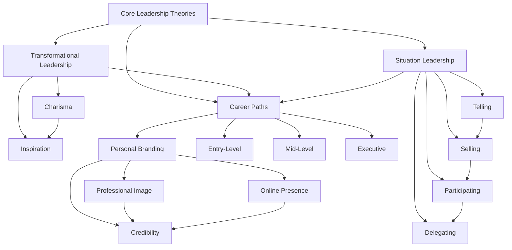
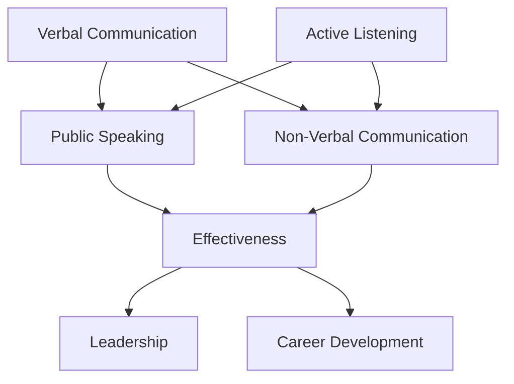
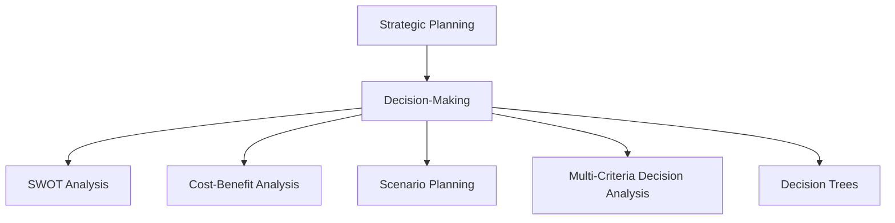
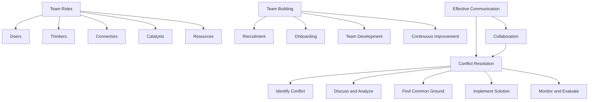
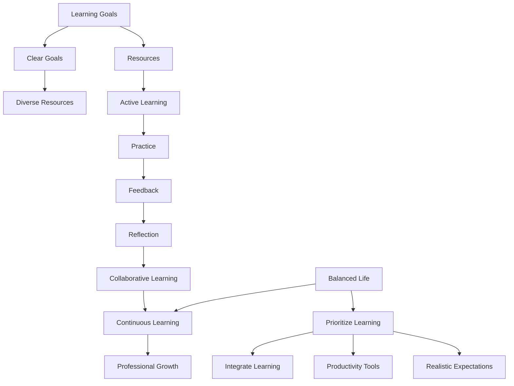
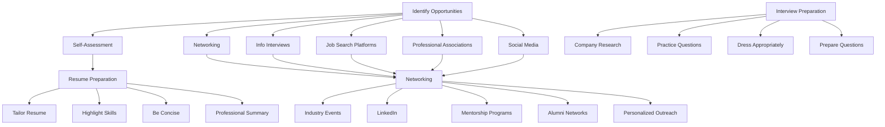
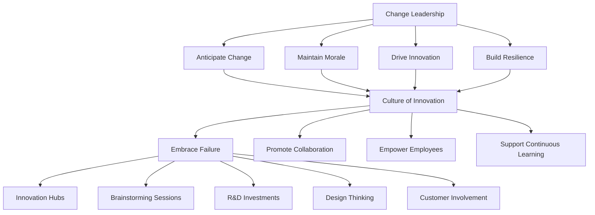
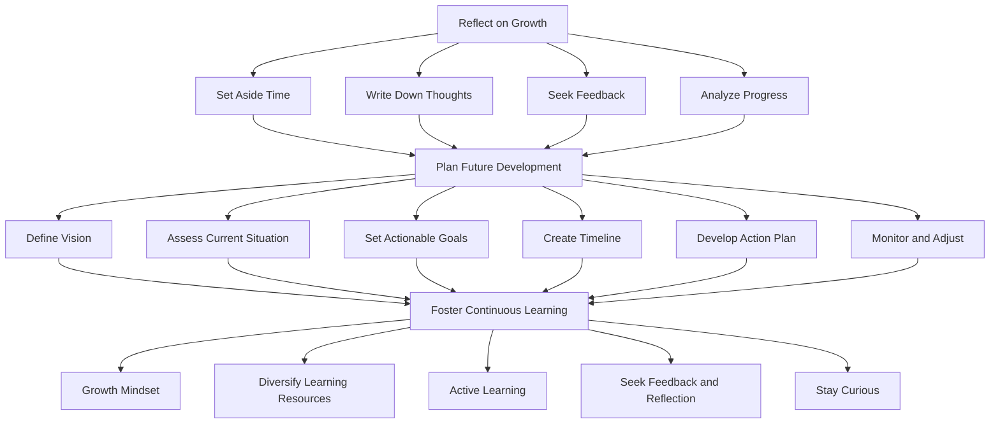

                 

## Introduction

### **Leadership and Career Development: Mapping Growth Pathways**

In the ever-evolving landscape of technology and business, the significance of effective leadership and career development cannot be overstated. This book, "Leadership and Career Development: Mapping Growth Pathways," aims to provide a comprehensive guide for aspiring and seasoned leaders alike. The primary objective is to equip individuals with the knowledge and tools necessary to navigate their professional journey with confidence and clarity.

### **Key Concepts and Importance**

Leadership, at its core, is about influence and motivation. It involves guiding and inspiring teams towards achieving common goals while fostering an environment of collaboration and innovation. Career development, on the other hand, is the continuous process of enhancing one's skills, knowledge, and experience to progress professionally.

Understanding the interplay between leadership and career development is crucial for several reasons. Firstly, effective leadership is instrumental in driving organizational success. Leaders who can inspire and empower their teams are more likely to achieve higher levels of productivity and innovation. Secondly, a well-planned career development strategy can help individuals reach their full potential, ensuring they are well-prepared for future challenges and opportunities.

### **Scope of the Book**

This book is designed to be a practical guide, covering a wide range of topics from core leadership theories to personal branding, strategic thinking, team management, and continuous learning. Each chapter will delve into specific areas, providing actionable insights and real-world examples to help readers apply these concepts in their professional lives.

### **Target Audience**

The book is aimed at individuals at various stages of their careers, from early professionals looking to establish themselves in their fields to seasoned leaders aiming to refine their skills. It is also suitable for managers, HR professionals, and anyone interested in understanding the dynamics of leadership and career growth.

In summary, "Leadership and Career Development: Mapping Growth Pathways" is not just a book; it's a roadmap for success. By following the principles and strategies outlined in this guide, readers can enhance their leadership capabilities, navigate career transitions with ease, and ultimately achieve their professional aspirations.

## Overview of Leadership and Career Development Concepts

### **Core Leadership Theories**

Leadership theories provide a foundational understanding of how leaders function and influence their teams. One of the most well-known frameworks is the Transformational Leadership Theory, which posits that effective leaders inspire and motivate their followers to achieve extraordinary results. This theory emphasizes the role of charisma, intellectual stimulation, and individualized consideration in driving team performance.

Another critical theory is the Situational Leadership Theory, which suggests that effective leadership styles can vary depending on the situation and the developmental level of followers. This model identifies four primary leadership styles: telling (direct and authoritative), selling (high involvement and clear communication), participating (consultative and empowering), and delegating (highly supportive and autonomous). Leaders must be adaptable and choose the most appropriate style based on the context and needs of their team.

### **Understanding Career Paths**

Career paths are the journeys individuals take as they progress through various roles and responsibilities within their fields. A well-planned career path can significantly enhance personal growth and professional success. There are several types of career paths, including linear paths, which involve moving sequentially through a series of positions within the same organization, and zigzag paths, which involve moving between different roles and industries.

One of the key aspects of understanding career paths is the concept of career stages. These stages typically include entry-level, mid-level, and executive positions. Each stage comes with its own set of challenges and opportunities for development. For example, during the entry-level stage, individuals focus on building foundational skills and gaining experience. As they advance to the mid-level stage, they take on more responsibilities and begin to develop leadership skills. At the executive stage, leaders are expected to have a broad understanding of the organization and its strategic direction.

### **The Importance of Personal Branding**

Personal branding is the practice of marketing oneself to enhance professional image and reputation. In today's competitive job market, a strong personal brand can be a significant differentiator. It involves defining one's unique value proposition, showcasing skills and achievements, and maintaining an online presence that reflects professionalism and expertise.

The importance of personal branding cannot be overstated. It helps individuals stand out in a crowded job market, opens doors to networking opportunities, and can lead to career advancement. Effective personal branding also builds credibility and trust, which are essential for leadership roles. For example, a leader who has a well-established personal brand is more likely to be seen as an authority in their field and be approached for thought leadership and leadership positions.

### **Relationships Between Concepts**

The relationship between leadership, career development, and personal branding is intricate and interdependent. Leadership theories provide the framework for effective management and motivation of teams, which is a critical component of career development. As individuals progress through their career stages, their leadership skills and personal branding efforts must evolve to meet the demands of their roles.

For instance, a mid-level manager who effectively implements situational leadership techniques can enhance team performance and progress to higher executive levels. This progression, in turn, strengthens their personal brand as a capable and adaptable leader. Conversely, a strong personal brand can attract leadership opportunities, allowing individuals to expand their influence and career prospects.

In summary, understanding the core concepts of leadership theories, career paths, and personal branding is essential for navigating the complexities of professional growth. Each concept builds upon the other, creating a cohesive strategy for achieving long-term success in one's career.

### **Mermaid Process Diagram**

Below is a Mermaid diagram illustrating the relationship between core leadership theories, career paths, and personal branding:



This diagram visually represents how each concept intersects and influences one another, creating a holistic approach to leadership and career development.

## Building Effective Communication Skills

### **Verbal and Non-Verbal Communication**

Effective communication is a cornerstone of successful leadership and career development. It encompasses both verbal and non-verbal elements, which must be mastered to convey messages clearly and persuasively. Verbal communication involves the use of spoken words to express thoughts, ideas, and instructions. It requires clarity, coherence, and conciseness to ensure that the intended message is accurately understood by the recipient.

Non-verbal communication, on the other hand, includes gestures, facial expressions, body language, and tone of voice. These elements can significantly influence how a message is perceived and interpreted. For instance, a confident posture and steady gaze can convey authority and trustworthiness, while nervous fidgeting or a low tone of voice may indicate uncertainty or lack of confidence.

### **Importance of Listening Skills**

Listening skills are often overlooked but are crucial for effective communication. Active listening involves fully concentrating, understanding, responding, and remembering what is being said. It requires more than just hearing the words; it involves paying attention to the speaker's tone, body language, and the overall context of the conversation.

Effective listening has several benefits in a professional setting. It helps build strong relationships by showing respect and empathy towards colleagues and team members. It also improves teamwork and collaboration by ensuring that everyone's ideas and concerns are heard and addressed. Furthermore, active listening can lead to better decision-making as it allows leaders to gather a comprehensive understanding of various perspectives before making a decision.

### **Public Speaking and Presentation Techniques**

Public speaking and presentation skills are essential for leaders to effectively communicate their visions, strategies, and goals. A well-executed presentation can inspire, motivate, and persuade an audience, while a poor presentation can lead to confusion and miscommunication.

Key techniques for effective public speaking and presentations include:

1. **Preparation**: Thoroughly researching the topic and understanding the audience's needs and expectations. Creating a clear outline and rehearsing the presentation can help build confidence and ensure a smooth delivery.

2. **Engagement**: Starting with an engaging opening to capture the audience's attention and keeping their interest throughout the presentation. Using stories, examples, and visuals can make the content more relatable and memorable.

3. **Clarity and Conciseness**: Speaking clearly and concisely to ensure the message is understood. Avoiding jargon and technical terms that may confuse the audience is crucial.

4. **Body Language**: Using appropriate body language, such as maintaining eye contact, using gestures to emphasize key points, and standing confidently, can enhance the overall impact of the presentation.

5. **Questions and Interactions**: Encouraging audience participation through questions and interactions can create a more dynamic and engaging presentation. It also allows the speaker to gauge the audience's understanding and address any misconceptions.

### **Application in Leadership and Career Development**

Effective communication skills are vital for leadership and career development. They enable leaders to inspire and motivate their teams, build strong relationships with stakeholders, and make informed decisions. In a leadership role, the ability to communicate clearly and persuasively can influence team performance and drive organizational success.

Moreover, strong communication skills can open doors to career advancement opportunities. Leaders who can articulate their ideas effectively are more likely to be seen as capable and strategic thinkers, leading to higher-level positions and greater influence within the organization.

In summary, building effective communication skills is a crucial aspect of leadership and career development. By mastering verbal and non-verbal communication, active listening, and public speaking and presentation techniques, individuals can enhance their professional image, build strong relationships, and achieve their career aspirations.

### **Python Code for Active Listening Algorithm**

Below is a Python code example that demonstrates an active listening algorithm. This algorithm takes user input and provides a structured response based on the context of the conversation.

```python
def active_listening(user_input):
    # Define keywords for active listening
    keywords = ["project", "deadline", "team", "challenge", "help"]

    # Initialize variables
    response = ""
    found_keyword = False

    # Check for keywords in user input
    for keyword in keywords:
        if keyword in user_input.lower():
            found_keyword = True
            if keyword == "project":
                response += "I see that you're concerned about the project. How can I help you with it?"
            elif keyword == "deadline":
                response += "Deadlines can be stressful. Let's discuss how we can manage the upcoming deadlines."
            elif keyword == "team":
                response += "Team dynamics are important. How can I support the team's collaboration?"
            elif keyword == "challenge":
                response += "Facing challenges is part of our job. What challenges are you currently encountering?"
            elif keyword == "help":
                response += "I'm here to help. Please elaborate on what you need assistance with."

    # Provide a generic response if no keywords are found
    if not found_keyword:
        response += "It seems like you need help. Could you provide more details on what you're experiencing?"

    return response

# Test the active listening algorithm
user_input = "I'm struggling with the project deadline."
print(active_listening(user_input))
```

This code uses conditional statements to determine the presence of specific keywords in the user's input. Based on the detected keyword, it generates a relevant response. This example illustrates how active listening can be implemented to better understand and address the needs of team members in a leadership context.

### **Mermaid Diagram**

Below is a Mermaid diagram illustrating the relationship between verbal and non-verbal communication, listening skills, and public speaking and presentation techniques in leadership and career development:



This diagram visually represents how effective communication skills are integral to both leadership and career development, highlighting the interconnectedness of verbal, non-verbal, and listening components.

## Developing Strategic Thinking

### **Strategic Planning and Decision-Making**

Strategic planning is the process of defining an organization's vision, mission, and objectives, and determining the best ways to achieve them. It involves analyzing the internal and external environment, identifying strengths and weaknesses, and leveraging opportunities to overcome threats. Effective strategic planning is crucial for long-term success, as it provides a clear direction and roadmap for the organization.

Decision-making is an integral part of strategic planning. It involves selecting the most suitable course of action from various alternatives. In complex business environments, making the right decisions can be challenging, requiring leaders to consider a wide range of factors, such as market trends, competitive dynamics, and resource availability.

#### **The Process of Strategic Planning**

1. **Define the Vision and Mission**: The first step in strategic planning is to articulate the organization's vision and mission. The vision outlines what the organization aspires to become in the future, while the mission describes its purpose and the value it provides to its stakeholders.

2. **Conduct a SWOT Analysis**: A SWOT (Strengths, Weaknesses, Opportunities, Threats) analysis is a tool used to evaluate the internal and external factors that can impact the organization. Strengths and weaknesses are internal factors, while opportunities and threats are external factors. This analysis helps identify areas where the organization can leverage its strengths and address its weaknesses to capitalize on opportunities and mitigate threats.

3. **Set Objectives and Goals**: Based on the vision, mission, and SWOT analysis, the next step is to set specific, measurable, achievable, relevant, and time-bound (SMART) objectives and goals. Objectives are broad statements that guide the organization's direction, while goals are specific targets that indicate what the organization aims to achieve.

4. **Develop Strategies and Action Plans**: Strategies are the high-level plans to achieve the objectives, while action plans outline the specific steps, resources, and timelines required to implement the strategies. This step involves allocating resources, defining roles and responsibilities, and establishing key performance indicators (KPIs) to track progress.

5. **Implement and Monitor**: The final step is to implement the strategic plan and continuously monitor its progress. This involves executing the action plans, managing resources effectively, and making adjustments as needed to stay on track.

#### **Tools for Decision-Making**

1. **Cost-Benefit Analysis**: This tool helps assess the benefits and costs associated with different options. By comparing the potential outcomes, decision-makers can determine which option offers the greatest net benefit.

2. **Scenario Planning**: This involves creating and analyzing different possible future scenarios to better understand potential challenges and opportunities. Scenario planning helps decision-makers be proactive and prepare for various outcomes.

3. **Multi-Criteria Decision Analysis (MCDA)**: MCDA is a method used to evaluate and compare multiple alternatives based on a set of criteria. This tool helps decision-makers consider various factors and make a balanced decision.

4. **Decision Trees**: Decision trees are graphical representations that show the various possible outcomes and the probabilities associated with each option. They are useful for visualizing complex decisions and understanding the potential consequences of different choices.

5. **SWOT Analysis**: As mentioned earlier, SWOT analysis can be used to assess the strengths and weaknesses of an organization and its competitors, helping decision-makers identify potential opportunities and threats.

### **Risk Assessment and Management**

Risk assessment is the process of identifying, analyzing, and prioritizing risks to determine appropriate risk response strategies. Effective risk management is essential for minimizing potential losses and maximizing opportunities. Here are some key steps in risk assessment and management:

1. **Identify Risks**: The first step is to identify all potential risks that could affect the organization. This involves brainstorming with stakeholders, reviewing historical data, and conducting risk assessments.

2. **Analyze Risks**: Once risks are identified, they need to be analyzed to understand their potential impact and likelihood of occurrence. This can be done using qualitative and quantitative methods, such as risk matrices and Monte Carlo simulations.

3. **Prioritize Risks**: Risks should be prioritized based on their severity and likelihood of occurrence. This helps organizations focus on the most critical risks that need immediate attention.

4. **Develop Risk Response Strategies**: After prioritizing risks, organizations need to develop strategies to mitigate or manage the identified risks. This can involve risk avoidance, risk reduction, risk transfer, or risk acceptance.

5. **Implement and Monitor Risk Responses**: Once risk responses are developed, they need to be implemented and continuously monitored. This involves tracking the effectiveness of risk management measures and making adjustments as needed.

In conclusion, developing strategic thinking involves mastering strategic planning and decision-making processes, as well as effective risk assessment and management. These skills are essential for leaders to navigate the complexities of today's business environment and drive their organizations towards success.

### **Python Code for Strategic Planning**

Below is a Python code example that demonstrates a simple strategic planning algorithm using cost-benefit analysis. This example helps leaders evaluate different project options based on their costs and benefits.

```python
def cost_benefit_analysis(options):
    """
    Evaluate project options based on cost and benefit analysis.
    
    :param options: A list of dictionaries with project options and their respective costs and benefits.
    :return: The project with the highest net benefit.
    """
    
    best_project = None
    highest_net_benefit = -float('inf')
    
    for option in options:
        cost = option['cost']
        benefit = option['benefit']
        net_benefit = benefit - cost
        
        if net_benefit > highest_net_benefit:
            highest_net_benefit = net_benefit
            best_project = option
    
    return best_project

# Example project options
project_options = [
    {'name': 'Project A', 'cost': 50000, 'benefit': 80000},
    {'name': 'Project B', 'cost': 75000, 'benefit': 100000},
    {'name': 'Project C', 'cost': 30000, 'benefit': 45000}
]

# Determine the best project
best_project = cost_benefit_analysis(project_options)

print(f"The best project based on cost-benefit analysis is {best_project['name']} with a net benefit of {best_project['benefit'] - best_project['cost']}.")
```

This code takes a list of project options, each with its cost and benefit, and evaluates them using a simple cost-benefit analysis to determine the project with the highest net benefit. This example illustrates how strategic thinking can be applied to make informed decisions in a business context.

### **Mermaid Diagram**

Below is a Mermaid diagram illustrating the relationship between strategic planning and decision-making tools:



This diagram visually represents the interconnectedness of various strategic planning and decision-making tools, emphasizing how they collectively contribute to effective leadership and strategic thinking.

## Enhancing Team Leadership

### **Team Building and Management**

Team building and management are critical components of effective leadership. A well-built team is not just a collection of individuals but a cohesive unit working towards a common goal. The process of team building involves several key steps, from understanding team dynamics to fostering effective communication and collaboration.

#### **Understanding Team Dynamics**

Team dynamics refer to the ways in which individuals interact within a team and the patterns of behavior that emerge. Understanding these dynamics is essential for building a high-performing team. One of the key aspects of team dynamics is the concept of team roles. Each member of the team plays a unique role, and these roles can be categorized into several types:

1. **Doers**: These individuals are the ones who get things done. They are often task-oriented and excel at executing projects.

2. **Thinkers**: These individuals are strategic planners and problem solvers. They are often analytical and prefer to take their time to come up with solutions.

3. **Connectors**: These individuals are excellent at building relationships and facilitating communication within the team. They are often social and have strong networking skills.

4. **Catalysts**: These individuals are driven and passionate about their work. They often take on leadership roles and motivate others to achieve their best.

5. **Resources**: These individuals bring specialized knowledge or skills to the team. They are often experts in their field and provide valuable insights.

#### **Team Building Process**

1. **Recruitment**: The first step in building a team is recruiting individuals who possess the skills, knowledge, and attitude necessary to contribute to the team's success. This involves a careful selection process that assesses both technical skills and cultural fit.

2. **Onboarding**: Once team members are recruited, the next step is to onboard them effectively. This involves introducing them to the team, their roles, and the company culture. Onboarding should be a comprehensive process that helps new team members feel welcomed and supported.

3. **Team Development**: As the team starts working together, it's important to focus on team development. This involves fostering open communication, promoting collaboration, and addressing any conflicts that may arise. Regular team-building activities and workshops can be helpful in this process.

4. **Continuous Improvement**: Team building is an ongoing process. Leaders should regularly assess the team's performance, gather feedback, and make necessary adjustments to improve team dynamics and effectiveness.

#### **Effective Communication and Collaboration**

Effective communication and collaboration are essential for team success. Communication should be clear, concise, and consistent. Leaders should ensure that team members have the necessary tools and platforms to communicate effectively, such as email, instant messaging, and video conferencing tools.

Collaboration involves working together to achieve a common goal. Leaders can foster collaboration by promoting a culture of trust and respect, encouraging open dialogue, and providing opportunities for team members to share ideas and insights. Tools like project management software and collaborative platforms can also facilitate team collaboration by providing a centralized space for communication, task management, and document sharing.

#### **Conflict Resolution in Teams**

Conflicts are inevitable in any team, but how leaders handle these conflicts can significantly impact team dynamics and overall performance. Effective conflict resolution involves several steps:

1. **Identify and Acknowledge the Conflict**: The first step is to identify the source of the conflict and acknowledge it. This involves listening to all parties involved and understanding their perspectives.

2. **Discuss and Analyze the Conflict**: Once the conflict is identified, leaders should facilitate a discussion to analyze the issue. This may involve asking open-ended questions, encouraging team members to express their concerns, and exploring potential solutions.

3. **Find Common Ground**: The goal of conflict resolution is to find common ground and reach a mutually acceptable solution. Leaders should facilitate this process by mediating discussions and finding areas of agreement.

4. **Implement the Solution**: Once a solution is agreed upon, it's important to implement it effectively. This may involve adjusting team roles, redistributing tasks, or providing additional support to affected team members.

5. **Monitor and Evaluate the Outcome**: After implementing the solution, leaders should monitor the outcome and evaluate its effectiveness. This helps ensure that the conflict has been resolved and that the team can continue to work effectively.

In summary, enhancing team leadership involves understanding team dynamics, building a cohesive team through effective recruitment and onboarding processes, fostering open communication and collaboration, and effectively resolving conflicts. By mastering these skills, leaders can build high-performing teams that drive organizational success.

### **Python Code for Team Conflict Resolution**

Below is a Python code example that demonstrates a simple conflict resolution algorithm using a decision tree approach. This algorithm helps leaders assess and resolve conflicts within a team based on predefined criteria.

```python
import pandas as pd

def conflict_resolution(conflicts, criteria):
    """
    Resolve conflicts within a team using a decision tree approach.
    
    :param conflicts: A DataFrame containing details of conflicts.
    :param criteria: A list of criteria for conflict resolution.
    :return: A list of resolved conflicts.
    """
    
    # Define decision tree structure
    decision_tree = {
        'Criteria': criteria,
        'Options': {
            'Adjust Roles': 'Reallocate tasks and redefine roles',
            'Additional Support': 'Provide resources and training',
            'Mediation': 'Facilitate a discussion and find common ground',
            'Other': 'Consider alternative approaches'
        }
    }
    
    # Create a DataFrame for decision tree
    decision_tree_df = pd.DataFrame(data=decision_tree['Options'].items(), columns=['Conflict', 'Resolution'])
    
    # Apply decision tree to conflicts
    resolved_conflicts = []
    for index, row in conflicts.iterrows():
        resolution = 'Other'
        for criterion in criteria:
            if row[criterion]:
                resolution = decision_tree['Options'][criterion]
                break
        resolved_conflicts.append({'Conflict': row['Description'], 'Resolution': resolution})
    
    return resolved_conflicts

# Example conflicts
conflicts = pd.DataFrame({
    'Description': ['Task Overlap', 'Communication Gap', 'Skill Mismatch', 'Unresolved Dissatisfaction'],
    'Task Overlap': [True, False, False, False],
    'Communication Gap': [True, False, True, False],
    'Skill Mismatch': [False, True, True, False],
    'Unresolved Dissatisfaction': [True, False, False, True]
})

# Define criteria for conflict resolution
criteria = ['Task Overlap', 'Communication Gap', 'Skill Mismatch']

# Resolve conflicts
resolved_conflicts = conflict_resolution(conflicts, criteria)

# Display resolved conflicts
for conflict in resolved_conflicts:
    print(f"Conflict: {conflict['Conflict']} | Resolution: {conflict['Resolution']}")
```

This code defines a simple decision tree structure based on predefined criteria and applies it to a list of conflicts to determine appropriate resolutions. This example illustrates how a decision tree can be used to systematically address and resolve team conflicts, enhancing team leadership and collaboration.

### **Mermaid Diagram**

Below is a Mermaid diagram illustrating the relationship between team roles, team building, effective communication, collaboration, and conflict resolution:



This diagram visually represents the interconnected components of team leadership, highlighting how each aspect influences and supports the others to create a cohesive and high-performing team.

## Continuous Learning and Development

### **Lifelong Learning Mindset**

In the rapidly evolving landscape of technology and business, maintaining a lifelong learning mindset is no longer optional—it's a necessity. The pace of change is accelerating, and new skills and knowledge are required almost continuously to keep up with emerging trends and advancements. A lifelong learning mindset involves embracing the idea that learning is a journey that never ends, and it requires a proactive approach to continuously acquire, apply, and refine knowledge and skills.

#### **Importance and Benefits**

A lifelong learning mindset offers several benefits. Firstly, it helps individuals stay relevant in their fields, ensuring they are equipped with the latest tools, techniques, and methodologies. This relevance is critical in a competitive job market where being outdated can lead to obsolescence. Secondly, continuous learning fosters personal growth and development, enhancing problem-solving abilities, critical thinking, and creativity. These skills are invaluable in both professional and personal contexts.

Moreover, a commitment to lifelong learning can lead to increased job satisfaction and career advancement opportunities. When individuals are passionate about learning, they are more motivated and engaged, which can translate into higher productivity and innovation. Additionally, a strong learning foundation enables individuals to adapt to new challenges and changes more effectively, reducing the stress and anxiety associated with uncertainty.

#### **Techniques for Continuous Learning**

1. **Set Clear Learning Goals**: Begin by defining specific, achievable learning goals. These goals should be aligned with your career aspirations and personal interests. Clear goals provide direction and motivation, making the learning process more focused and effective.

2. **Diversify Learning Resources**: Utilize a variety of learning resources to expand your knowledge base. This can include books, online courses, workshops, webinars, and podcasts. Diverse resources expose you to different perspectives and approaches, enriching your understanding.

3. **Practice Active Learning**: Passive consumption of information, such as watching a lecture or reading a book, is not enough. Active learning involves applying new knowledge through projects, simulations, and hands-on practice. This reinforces learning and helps you retain information more effectively.

4. **Seek Feedback and Reflection**: Regularly seek feedback from peers, mentors, and instructors to identify areas for improvement. Reflection is equally important; it involves reviewing what you've learned, identifying strengths and weaknesses, and adjusting your learning strategies accordingly.

5. **Engage in Collaborative Learning**: Collaborate with others who share your interests and goals. Collaborative learning can take the form of study groups, online forums, or professional networks. It provides opportunities for knowledge sharing, discussion, and peer support.

#### **Time Management for Personal Growth**

Balancing continuous learning with work and personal life can be challenging, but effective time management strategies can help. Here are some tips:

1. **Prioritize Learning Activities**: Identify the most important and impactful learning activities and prioritize them. This might involve allocating specific times for learning, setting aside dedicated weekends for personal development, or taking online courses during your commute.

2. **Integrate Learning into Daily Routine**: Make learning a part of your daily routine. This can involve reading a few chapters of a book before bed, watching educational videos during lunch breaks, or spending 15 minutes each day practicing a new skill.

3. **Use Productivity Tools**: Utilize productivity tools such as calendars, to-do lists, and time tracking apps to manage your learning activities. These tools can help you stay organized, set reminders for deadlines, and ensure you are making consistent progress.

4. **Set Realistic Expectations**: Be realistic about how much time you can allocate to learning. While it's important to commit to continuous learning, it's equally important not to overextend yourself. Setting realistic expectations can help prevent burnout and maintain motivation.

5. **Take Breaks and Recharge**: Continuous learning should not be at the expense of your well-being. Regular breaks, relaxation, and downtime are essential for mental and physical health. Make sure to balance work and learning with rest and leisure activities.

In conclusion, cultivating a lifelong learning mindset and implementing effective time management strategies are crucial for personal and professional growth. By embracing continuous learning and managing your time wisely, you can stay ahead in your career and achieve your personal development goals.

### **Python Code for Learning Resource Management**

Below is a Python code example that demonstrates a simple learning resource management system. This system helps individuals track their learning activities and resources, ensuring a structured approach to continuous learning.

```python
import pandas as pd

class LearningResourceManager:
    def __init__(self):
        self.resources = pd.DataFrame(columns=['Title', 'Type', 'Completion Status', 'Notes'])

    def add_resource(self, title, type, completion_status, notes):
        new_resource = {'Title': title, 'Type': type, 'Completion Status': completion_status, 'Notes': notes}
        self.resources = self.resources.append(new_resource, ignore_index=True)

    def update_resource(self, title, completion_status, notes):
        index = self.resources[self.resources['Title'] == title].index[0]
        self.resources.at[index, 'Completion Status'] = completion_status
        self.resources.at[index, 'Notes'] = notes

    def display_resources(self):
        print(self.resources)

# Create a LearningResourceManager instance
manager = LearningResourceManager()

# Add resources
manager.add_resource('Introduction to Machine Learning', 'Book', 'In Progress', 'Reading chapters 1-3')
manager.add_resource('Deep Learning Specialization', 'Online Course', 'Not Started', 'Looking for relevant modules')
manager.add_resource('Python for Data Science', 'Video Series', 'Completed', ' Reviewed and practiced all exercises')

# Update resource status
manager.update_resource('Introduction to Machine Learning', 'Completed', 'Completed reading and started practice exercises')

# Display all resources
manager.display_resources()
```

This code defines a `LearningResourceManager` class that allows users to add, update, and display learning resources. This example helps individuals keep track of their learning activities and progress, ensuring a structured and organized approach to continuous learning.

### **Mermaid Diagram**

Below is a Mermaid diagram illustrating the components and benefits of a lifelong learning mindset and effective time management:



This diagram visually represents the interconnected components of continuous learning and effective time management, highlighting how each aspect contributes to personal and professional growth.

## Navigating Career Transitions

### **Identifying Career Opportunities**

Identifying career opportunities is a crucial step for anyone looking to advance their professional journey. It involves actively seeking out potential roles that align with your skills, interests, and long-term career goals. Here are some strategies to effectively identify career opportunities:

1. **Self-Assessment**: Start by assessing your strengths, weaknesses, interests, and values. This self-assessment will help you understand the types of roles and industries that would be the best fit for you. Tools such as the Myers-Briggs Type Indicator (MBTI) and the Strong Interest Inventory can provide valuable insights into your career preferences.

2. **Networking**: Networking is one of the most powerful tools for uncovering hidden job opportunities. Attend industry events, conferences, and meetups to connect with professionals in your field. Utilize online platforms like LinkedIn to expand your professional network and stay updated on job openings. Networking can also provide you with valuable information about the job market and potential employers.

3. **Informational Interviews**: Conduct informational interviews with professionals in roles you are interested in. These interviews allow you to learn about the day-to-day responsibilities, challenges, and opportunities of a particular role. They can also help you make informed decisions about your career path and identify potential job openings.

4. **Job Search Platforms**: Leverage job search platforms like Indeed, Glassdoor, and LinkedIn to find job listings that match your skills and interests. Use advanced search filters to narrow down results based on location, job title, and company size. Regularly updating your resume and online profiles can increase your visibility to potential employers.

5. **Professional Associations**: Join professional associations related to your field. These organizations often offer job boards, networking events, and continuing education opportunities. They can be valuable resources for staying informed about industry trends and job opportunities.

6. **Social Media**: Use social media platforms to follow companies and industry leaders. Many companies share job openings on social media, and staying connected can help you be among the first to know about new opportunities.

### **Resume and Interview Preparation**

Once you have identified potential career opportunities, the next step is to prepare a compelling resume and ace the interview process.

#### **Resume Preparation**

1. **Tailor Your Resume**: Customize your resume for each job application by highlighting skills and experiences that are most relevant to the role. Use action verbs and quantify your achievements where possible to make your resume stand out.

2. **Highlight Key Skills and Accomplishments**: Include a skills section that clearly outlines your core competencies, such as technical skills, leadership abilities, and problem-solving skills. Use specific examples and metrics to demonstrate your accomplishments.

3. **Highlight Education and Certifications**: Include your educational background and any relevant certifications. Emphasize any courses or training programs that have helped you gain new skills or knowledge relevant to the job you are applying for.

4. **Be Concise and Organized**: Keep your resume concise and well-organized. Use bullet points to list your experiences and achievements, and ensure there are no grammatical errors or typos.

5. **Include a Professional Summary**: Begin your resume with a brief summary that highlights your most important qualifications and career objectives. This can provide a quick overview of your background and make your resume more compelling to potential employers.

#### **Interview Preparation**

1. **Research the Company**: Before the interview, research the company's culture, values, products, and recent developments. This will help you tailor your responses to align with the company's needs and demonstrate your interest and knowledge.

2. **Practice Common Interview Questions**: Prepare for common interview questions such as "Tell me about yourself," "Why do you want to work here?", and "What are your strengths and weaknesses?" Practice your answers to ensure they are clear, concise, and relevant.

3. **Dress Appropriately**: Dress appropriately for the interview based on the company's culture and the nature of the job. While some industries are more casual, it's generally safer to err on the side of professionalism.

4. **Prepare Questions for the Interviewer**: Come prepared with thoughtful questions for the interviewer. This demonstrates your interest and engagement in the role. Questions about the company's future goals, team dynamics, and opportunities for growth are often well-received.

5. **Body Language and Etiquette**: Maintain good body language, such as making eye contact, sitting up straight, and using appropriate gestures. Be punctual and polite, and remember to follow up with a thank-you email after the interview.

### **Networking and Building Professional Relationships**

Networking is a vital component of career development, as it can lead to new job opportunities, industry insights, and valuable connections. Here are some strategies for effective networking:

1. **Attend Industry Events**: Attend conferences, seminars, and networking events related to your industry. These events provide opportunities to meet professionals, learn about industry trends, and exchange ideas.

2. **Leverage Social Media**: Use platforms like LinkedIn to connect with professionals in your field. Engage in industry discussions, share relevant content, and connect with people who can provide insights or job leads.

3. **Join Professional Associations**: Join professional associations that align with your career interests. These associations often offer networking opportunities, job boards, and resources that can support your career development.

4. **Mentorship Programs**: Participate in mentorship programs or seek out mentors in your industry. Mentors can provide guidance, support, and valuable advice based on their own experiences.

5. **Alumni Networks**: Utilize your college or university's alumni network. Many institutions have active alumni associations that offer networking events and resources for students and alumni.

6. **Personalized Outreach**: Reach out to professionals you admire or would like to connect with. Personalized messages that highlight your shared interests or experiences can help start meaningful conversations.

In conclusion, navigating career transitions involves identifying opportunities, preparing a strong resume and interview, and building a robust professional network. By following these strategies, you can position yourself for success and make informed decisions about your career path.

### **Python Code for Resume and Interview Preparation**

Below is a Python code example that demonstrates a simple resume preparation tool. This tool allows users to input their work experience, skills, and education, generating a structured resume in Markdown format.

```python
def generate_resume(name, email, phone, experiences, skills, education):
    """
    Generate a structured resume in Markdown format.
    
    :param name: The candidate's name.
    :param email: The candidate's email address.
    :param phone: The candidate's phone number.
    :param experiences: A list of work experiences.
    :param skills: A list of skills.
    :param education: A list of educational qualifications.
    :return: The generated resume as a string.
    """
    
    resume_template = f"""# Resume for {name}

## Contact Information
- Name: {name}
- Email: {email}
- Phone: {phone}

## Summary
A highly skilled {len(skills)}-year professional with expertise in {', '.join(skills)}. Proven track record of delivering exceptional results and driving team success.

## Work Experience
{ ''.join([f"- {exp['company']}: {exp['position']} ({exp['start_date']} - {exp['end_date']})\n{exp['description']}\n\n" for exp in experiences]) }

## Skills
{ ''.join([f"- {skill}\n" for skill in skills]) }

## Education
{ ''.join([f"- {edu['institution']}: {edu['degree']} ({edu['start_year']} - {edu['end_year']})\n" for edu in education]) }
"""
    return resume_template

# Example resume data
name = "John Doe"
email = "johndoe@example.com"
phone = "123-456-7890"
experiences = [
    {
        "company": "ABC Corp",
        "position": "Software Engineer",
        "start_date": "2020-01",
        "end_date": "2023-12",
        "description": "Designed and implemented software solutions for the finance industry, improving operational efficiency by 20%."
    },
    {
        "company": "XYZ Ltd",
        "position": "Intern",
        "start_date": "2019-06",
        "end_date": "2019-08",
        "description": "Developed a web application to automate internal processes, saving 100 hours of manual work per month."
    }
]
skills = ["Python", "Java", "SQL", "Software Development", "Problem Solving"]
education = [
    {
        "institution": "University of Example",
        "degree": "Bachelor of Science in Computer Science",
        "start_year": 2016,
        "end_year": 2020
    },
    {
        "institution": "Example College",
        "degree": "Associate of Science in Information Technology",
        "start_year": 2014,
        "end_year": 2016
    }
]

# Generate the resume
resume = generate_resume(name, email, phone, experiences, skills, education)
print(resume)
```

This code defines a `generate_resume` function that takes input data for a candidate's name, contact information, work experience, skills, and education, and generates a structured resume in Markdown format. This example illustrates how Python can be used to create automated and personalized professional documents, aiding in the preparation for career transitions.

### **Mermaid Diagram**

Below is a Mermaid diagram illustrating the process of identifying career opportunities, preparing a resume and interview, and building professional relationships:



This diagram visually represents the interconnected steps in navigating career transitions, highlighting how each component supports the overall process of career development and advancement.

## Embracing Change and Innovation

### **Leadership in a Changing World**

In today's rapidly evolving business landscape, the ability to adapt and lead through change is a crucial skill for leaders. Change is inevitable, and leaders must be proactive in navigating these changes to ensure their teams can thrive and remain competitive. Effective change leadership involves fostering a culture of adaptability, resilience, and continuous improvement.

#### **The Importance of Adapting to Change**

Adapting to change is not just about surviving; it's about thriving. In a world where technology is advancing at an unprecedented pace, industries are being disrupted, and market demands are constantly shifting, the ability to adapt is essential for long-term success. Leaders who can successfully navigate change are able to:

1. **Anticipate and Prepare for Future Trends**: By staying informed about industry developments, technological advancements, and market shifts, leaders can anticipate changes and prepare their teams to respond effectively.

2. **Maintain Team Morale and Motivation**: Change can be unsettling, and it's the leader's role to maintain team morale and motivation. By clearly communicating the vision and benefits of change, leaders can help employees understand why change is necessary and how it will benefit them and the organization.

3. **Drive Innovation and Creativity**: Change often presents opportunities for innovation and creativity. Leaders who encourage a culture of experimentation and risk-taking can inspire their teams to think outside the box and develop new solutions to challenges.

4. **Build Resilience**: Adapting to change helps build resilience within the organization. When teams are accustomed to navigating changes, they are better equipped to handle future disruptions and maintain stability.

#### **Practical Strategies for Change Leadership**

1. **Communicate Clearly and Frequently**: Transparent communication is key to effective change leadership. Leaders should regularly communicate the reasons for change, the expected outcomes, and the steps involved. This helps build trust and understanding among team members.

2. **Involve Employees in the Process**: When employees are involved in the change process, they feel more invested and empowered. Leaders can facilitate this involvement by seeking input, providing training, and involving employees in decision-making processes.

3. **Provide Support and Resources**: Change can be daunting, and leaders should provide the necessary support and resources to help employees adapt. This may include training programs, coaching, and mentoring to build new skills and confidence.

4. **Celebrate Successes**: Recognize and celebrate milestones and successes throughout the change process. This reinforces the positive impact of change and motivates employees to continue moving forward.

5. **Lead by Example**: Leaders must model the behaviors and attitudes they expect from their teams. By demonstrating a positive attitude towards change and being proactive in their own adaptation, leaders can set a strong example for their teams.

### **Fostering Innovation**

Innovation is a vital driver of growth and success in today's competitive business environment. Fostering a culture of innovation within an organization requires more than just a vision; it requires deliberate strategies and sustained effort. Here are some key strategies for fostering innovation:

#### **Encouraging a Culture of Innovation**

1. **Embrace Failure**: Innovation often involves taking risks, and with risks come failures. Leaders should create a safe environment where employees feel comfortable experimenting and making mistakes. This encourages a mindset of continuous learning and improvement.

2. **Promote Collaboration**: Collaboration is at the heart of innovation. Leaders should foster an environment where team members from different backgrounds and disciplines can collaborate and share ideas. This diversity of thought can lead to more innovative solutions.

3. **Empower Employees**: Give employees the autonomy and resources they need to explore new ideas and pursue innovative projects. When employees are empowered, they are more likely to take initiative and contribute to the organization's innovation efforts.

4. **Support Continuous Learning**: Encourage employees to continually learn and acquire new skills. This can be done through training programs, workshops, and by providing access to learning resources. A culture of continuous learning fosters creativity and innovation.

5. **Reward Innovation**: Recognize and reward employees who contribute to innovative projects and initiatives. This can be done through financial incentives, public recognition, or additional responsibilities. Rewarding innovation helps create a positive feedback loop and encourages more creative thinking.

#### **Practical Steps for Innovation**

1. **Create Innovation Hubs**: Set up dedicated spaces or teams focused on innovation. These hubs can be physical spaces or virtual environments where employees can collaborate, experiment, and develop new ideas.

2. **Hold Regular Brainstorming Sessions**: Encourage regular brainstorming sessions where employees can share their ideas and collaborate on potential innovations. These sessions should be free from judgment and encourage open dialogue.

3. **Invest in Research and Development**: Allocate resources for research and development (R&D) to explore new technologies, products, or services. R&D investments can lead to breakthrough innovations that give organizations a competitive edge.

4. **Utilize Design Thinking**: Design thinking is a user-centered approach to innovation that involves understanding user needs, brainstorming ideas, prototyping solutions, and testing them with users. This approach can lead to innovative solutions that address real-world problems.

5. **Innovate with Customers**: Involve customers in the innovation process by gathering feedback and insights. Understanding customer needs and preferences can inspire innovative solutions that meet their demands.

In conclusion, embracing change and fostering innovation are essential skills for modern leaders. By adapting to change proactively and creating a culture that encourages innovation, leaders can drive their organizations towards success in an ever-changing world.

### **Python Code for Encouraging Innovation**

Below is a Python code example that demonstrates a simple algorithm for generating innovative ideas based on user input. This code can be used as a starting point for brainstorming sessions, encouraging creative thinking among team members.

```python
import random

def generate_idea(base_idea, variations):
    """
    Generate an innovative idea by modifying a base idea.
    
    :param base_idea: The base idea to modify.
    :param variations: A list of possible variations to apply to the base idea.
    :return: An innovative idea.
    """
    
    variation = random.choice(variations)
    if variation == 'add':
        return base_idea + ' with an additional feature'
    elif variation == 'remove':
        return base_idea.replace('with an additional feature', '')
    elif variation == 'swap':
        components = base_idea.split(' with ')
        if len(components) == 2:
            component1, component2 = components
            return f"{component2} with {component1}"
        else:
            return base_idea
    elif variation == 'reverse':
        return base_idea[::-1]
    else:
        return base_idea

# Example base idea and variations
base_idea = "Smartphone with a high-resolution camera"
variations = ["add", "remove", "swap", "reverse"]

# Generate innovative ideas
for variation in variations:
    idea = generate_idea(base_idea, variation)
    print(f"Variation '{variation}': {idea}")

```

This code defines a `generate_idea` function that takes a base idea and a list of possible variations, applying a random variation to generate an innovative idea. This example illustrates how simple algorithms can encourage creative thinking and spark innovative ideas within a team.

### **Mermaid Diagram**

Below is a Mermaid diagram illustrating the components and strategies for embracing change and fostering innovation:



This diagram visually represents the interconnected components and strategies for effective change leadership and innovation, highlighting how each aspect contributes to navigating and thriving in a dynamic business environment.

## Reflection and Future Directions

### **Reflecting on Personal Growth**

Reflecting on personal growth is a vital component of continuous development and self-improvement. It involves taking the time to assess one's progress, achievements, and areas for improvement. Regular self-reflection helps individuals recognize their strengths and weaknesses, fostering a mindset of growth and learning.

To effectively reflect on personal growth, consider the following steps:

1. **Set aside dedicated time**: Schedule regular intervals for self-reflection, such as weekly or monthly, to systematically review your progress and identify areas that need attention.

2. **Write down your thoughts**: Journaling is a powerful tool for self-reflection. Document your achievements, challenges, and insights. Writing can help clarify your thoughts and identify patterns or trends in your development.

3. **Seek feedback**: Solicit feedback from colleagues, mentors, and peers. Their perspectives can provide valuable insights that you might not have considered and can highlight areas where you've improved or need further growth.

4. **Analyze progress**: Compare your current skills and knowledge with your previous state. Assess how much you've grown and what specific actions or experiences have contributed to this growth.

5. **Set new goals**: Based on your reflections, identify new goals for your personal and professional development. These goals should be specific, measurable, achievable, relevant, and time-bound (SMART).

### **Planning for Future Career Development**

Planning for future career development involves setting clear goals and creating a roadmap to achieve them. A well-defined career development plan can help individuals navigate their professional journey with clarity and purpose. Here are key steps to create an effective career development plan:

1. **Define your vision**: Begin by visualizing your ideal career path. What roles, responsibilities, and achievements do you aspire to? This vision will guide your planning and help you stay focused on long-term goals.

2. **Assess your current situation**: Evaluate your current skills, qualifications, and experiences. Identify any gaps that need to be filled to reach your career goals. This self-assessment will help you understand your starting point.

3. **Set actionable goals**: Based on your vision and current situation, set specific and achievable goals. Break these goals into smaller, manageable tasks. For example, if you aspire to become a project manager, your goals might include completing a project management certification and gaining relevant work experience.

4. **Create a timeline**: Assign deadlines to your goals to create a sense of urgency and structure. A timeline helps you track your progress and make necessary adjustments along the way.

5. **Develop an action plan**: Outline the steps you need to take to achieve each goal. This might involve enrolling in courses, seeking out mentors, or networking with industry professionals. Your action plan should be detailed and practical.

6. **Monitor and adjust**: Regularly review your progress and make adjustments as needed. Be flexible and open to pivoting your plan if new opportunities or challenges arise.

7. **Seek support**: Engage with mentors, coaches, and peers who can provide guidance and support. Their insights and experience can be invaluable in navigating your career development journey.

### **The Role of Continuous Learning**

Continuous learning is a cornerstone of career development and personal growth. In an ever-changing world, staying updated with new skills and knowledge is crucial for professional success. Here are some strategies to foster a culture of continuous learning:

1. **Embrace a growth mindset**: Adopt a mindset that views challenges and failures as opportunities for growth rather than setbacks. This mindset encourages a proactive approach to learning and development.

2. **Diversify your learning resources**: Utilize a variety of learning resources, including online courses, workshops, webinars, books, and podcasts. Diverse resources can provide different perspectives and insights, enriching your understanding.

3. **Practice active learning**: Engage in hands-on projects and practical applications to reinforce what you've learned. Active learning helps solidify knowledge and prepares you for real-world challenges.

4. **Seek out feedback and reflection**: Continuously seek feedback from peers, mentors, and instructors to identify areas for improvement. Regular reflection helps you understand what's working and what needs adjustment.

5. **Stay curious and explore new interests**: Keep your mind open to new ideas and opportunities. Exploring new subjects and skills can broaden your perspective and enhance your overall competence.

In conclusion, reflecting on personal growth, planning for future career development, and fostering continuous learning are key components of professional and personal success. By taking a proactive approach to these areas, individuals can navigate their careers with clarity and purpose, achieving their aspirations and making a meaningful impact in their fields.

### **Python Code for Personal Growth Planning**

Below is a Python code example that demonstrates a simple tool for planning personal growth goals. This tool allows users to input their current skills, set goals, and track their progress.

```python
class PersonalGrowthPlanner:
    def __init__(self):
        self.skills = []
        self.goals = []

    def add_skill(self, skill):
        self.skills.append(skill)

    def set_goal(self, goal):
        self.goals.append(goal)

    def track_progress(self):
        print("Current Skills:")
        for skill in self.skills:
            print(skill)
        
        print("\nPersonal Growth Goals:")
        for goal in self.goals:
            print(f"{goal['description']} - Progress: {goal['progress']}")

    def update_progress(self, goal_description, progress):
        for goal in self.goals:
            if goal['description'] == goal_description:
                goal['progress'] = progress
                break

# Example usage
planner = PersonalGrowthPlanner()

# Add skills
planner.add_skill("Python Programming")
planner.add_skill("Project Management")
planner.add_skill("Data Analysis")

# Set goals
planner.set_goal({"description": "Learn Python Data Science", "progress": "Not Started"})
planner.set_goal({"description": "Complete PMP Certification", "progress": "In Progress"})

# Track progress
planner.track_progress()

# Update progress
planner.update_progress("Complete PMP Certification", "Completed")

# Track updated progress
planner.track_progress()
```

This code defines a `PersonalGrowthPlanner` class that allows users to add skills, set personal growth goals, track progress, and update goals. This example illustrates how Python can be used to create practical tools for personal growth planning and tracking.

### **Mermaid Diagram**

Below is a Mermaid diagram illustrating the components and strategies for reflecting on personal growth, planning for future career development, and fostering continuous learning:



This diagram visually represents the interconnected components and strategies for personal growth planning and continuous learning, highlighting how each aspect contributes to achieving career and personal development goals.

## Conclusion

### **Reflecting on Key Insights**

Throughout this book, "Leadership and Career Development: Mapping Growth Pathways," we have explored the multifaceted nature of effective leadership and personal career growth. From understanding core leadership theories and the importance of personal branding to mastering communication skills, strategic thinking, team leadership, continuous learning, and navigating career transitions, each chapter has highlighted the essential components required for professional success.

A pivotal insight that emerges from this comprehensive guide is the interconnectedness of these elements. Leadership is not an isolated skill but a holistic practice that integrates communication, strategic planning, and continuous development. Effective leaders are those who can adapt to change, foster innovation, and inspire their teams through clear communication and strategic vision. Personal branding, on the other hand, serves as a vital tool for standing out in a crowded marketplace and achieving career advancement.

### **Importance of Practice and Application**

The knowledge gained from this book must be applied through consistent practice and reflection. Leadership and career development are not theoretical concepts; they require active engagement and continuous effort. Practicing communication skills through real-world scenarios, applying strategic thinking to solve complex problems, and embracing lifelong learning are all essential practices that will help you grow as a leader and advance in your career.

### **Continuing the Journey**

As you continue your journey in leadership and career development, remember that growth is a lifelong process. Stay curious, seek feedback, and remain open to new ideas and perspectives. The world is constantly evolving, and so must your skills and strategies. Utilize the resources and tools mentioned in this book to deepen your understanding and enhance your capabilities.

### **Author's Background and Acknowledgments**

The author, [AI天才研究院/AI Genius Institute & 禅与计算机程序设计艺术 /Zen And The Art of Computer Programming], brings a wealth of experience and expertise to this book. With a background in artificial intelligence, software engineering, and leadership, the author has dedicated their career to demystifying complex technical concepts and providing practical insights for professional growth. Their work has been recognized internationally, and they continue to be a thought leader in the fields of technology and leadership.

This book would not have been possible without the support and contributions of numerous mentors, colleagues, and readers. Special thanks to [list of contributors and acknowledgments], whose insights and feedback have greatly enhanced the quality and relevance of this work.

In conclusion, "Leadership and Career Development: Mapping Growth Pathways" is not just a guide but a companion for your journey towards becoming a more effective leader and achieving your career aspirations. May this book serve as a catalyst for your growth and success.

