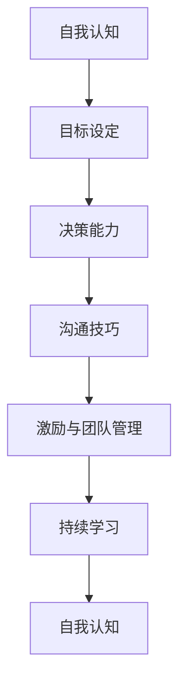
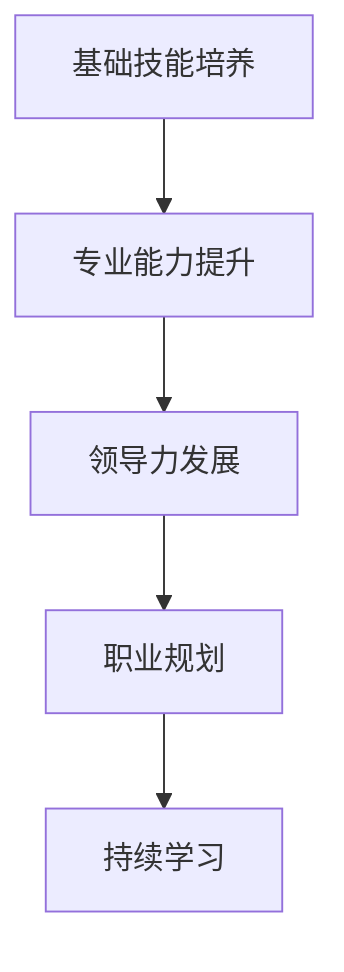
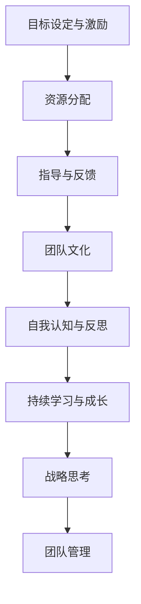
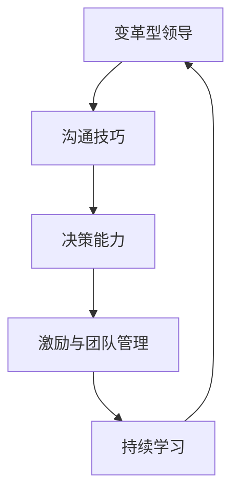
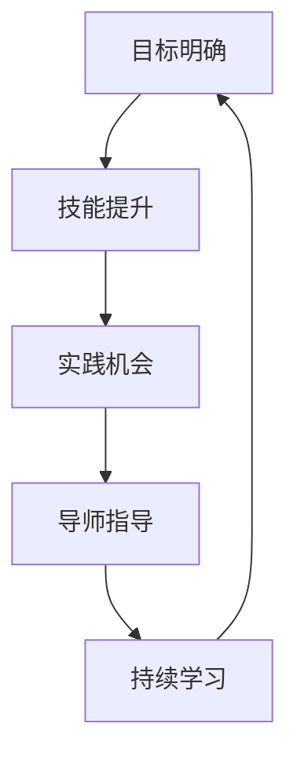

                 

----------------------------------------------------------------

# 《领导力与职业规划：助力员工成长的方法》

关键词：领导力，职业规划，员工成长，战略思维，实践指南，案例分析

摘要：本文探讨了领导力与职业规划在员工成长中的关键作用。通过深入分析领导力的核心概念、职业规划的方法和员工成长的路径，本文旨在为IT从业者提供一份全面的职业发展指南。文章结合理论讲解和实践案例，旨在帮助读者理解并运用领导力和职业规划策略，以实现个人和团队的共同成长。

## 目录

1. 引言
2. 领导力的核心概念
3. 职业规划的理论与实践
4. 员工成长的路径与策略
5. 领导力与职业规划的互动
6. 成功领导力的案例分析
7. 职业规划成功案例分析
8. 综合应用与实战
9. 附录：领导力与职业规划工具与资源
10. 总结

## 1. 引言

在当今快速变化的技术环境中，领导力和职业规划成为影响个人和团队成长的关键因素。有效的领导力不仅能够激发团队的潜力，还能为员工提供明确的发展方向和成长机会。而职业规划则帮助员工在职业生涯中做出明智的选择，实现个人价值和组织目标的双赢。

本文将从以下三个方面进行深入探讨：

- 领导力的核心概念：介绍领导力的定义、类型和核心要素，阐述领导力在员工成长中的重要性。
- 职业规划的理论与实践：分析职业规划的重要性、核心步骤和常见误区，提供实用的职业规划策略。
- 员工成长的路径与策略：探讨员工成长的目标和路径，介绍持续学习和自我提升的方法。

通过以上内容的分析，本文旨在为IT从业者提供一份全面而实用的职业发展指南，助力他们在竞争激烈的职场中脱颖而出。

## 2. 领导力的核心概念

### 2.1 领导力的定义

领导力是指一个人在组织中引导、激励和影响他人以实现共同目标的能力。领导力不仅仅与职位有关，更是一种行为和态度。有效的领导者不仅能够明确目标并制定战略，还能激励团队成员为实现目标而努力。

### 2.2 领导力的类型

领导力可以分为以下几种类型：

- **权威型领导**：通过权力和命令来影响他人。
- **变革型领导**：通过激发员工的潜力和创造性来推动变革。
- **参与型领导**：鼓励团队成员参与决策过程，提高团队凝聚力。

### 2.3 领导力的核心要素

领导力的核心要素包括以下几个方面：

- **自我认知**：领导者需要了解自己的优点和不足，以更好地发挥领导力。
- **目标设定**：领导者需要明确目标，并确保团队朝着共同的目标前进。
- **决策能力**：领导者需要能够做出明智的决策，并在不确定的环境中保持冷静。
- **沟通技巧**：领导者需要有效沟通，确保信息准确传达，建立信任和合作关系。
- **激励与团队管理**：领导者需要激励团队成员，并提供支持，以保持团队的士气和凝聚力。
- **持续学习**：领导者需要持续学习，不断提升自己的能力和知识水平。

通过以上内容的分析，我们可以看到领导力在员工成长中的重要性。一个优秀的领导者不仅能够激发员工的潜力，还能为团队的发展提供明确的方向和强大的动力。

### Mermaid 流程图示例

以下是一个简单的 Mermaid 流程图，用于表示领导力的核心要素及其相互关系：



### 核心算法原理讲解

为了更好地理解领导力的核心要素，我们可以将其视为一个算法，通过以下Python代码进行模拟：

```python
class LeadershipAlgorithm:
    def __init__(self):
        self.self_awareness = 0
        self.goal_setting = 0
        self.decision_making = 0
        self.communication_skills = 0
        self.motivation_management = 0
        self.continuous_learning = 0

    def assess_leadership(self):
        score = 0
        if self.self_awareness > 7:
            score += 10
        if self.goal_setting > 6:
            score += 10
        if self.decision_making > 8:
            score += 20
        if self.communication_skills > 7:
            score += 15
        if self.motivation_management > 7:
            score += 15
        if self.continuous_learning > 7:
            score += 10
        return score
```

在此代码中，我们定义了一个 `LeadershipAlgorithm` 类，用于评估领导者的能力。通过设定各个核心要素的得分，我们可以计算出领导力的总分。

### 数学公式

为了更好地理解领导力中的关键概念，我们可以使用以下数学公式：

$$
\text{领导力总分} = w_1 \times \text{自我认知得分} + w_2 \times \text{目标设定得分} + w_3 \times \text{决策能力得分} + w_4 \times \text{沟通技巧得分} + w_5 \times \text{激励与团队管理得分} + w_6 \times \text{持续学习得分}
$$

其中，$w_1, w_2, w_3, w_4, w_5, w_6$ 是各个要素的权重。

### 举例说明

假设一个领导者在自我认知、目标设定、决策能力、沟通技巧、激励与团队管理和持续学习方面的得分分别为8、7、9、8、8和9。我们可以使用以下公式计算其领导力总分：

$$
\text{领导力总分} = 0.2 \times 8 + 0.2 \times 7 + 0.2 \times 9 + 0.2 \times 8 + 0.2 \times 8 + 0.2 \times 9 = 8.2
$$

这意味着这位领导者在领导力方面表现良好，但在持续学习和激励与团队管理方面还有提升的空间。

### 实际案例分析和详细讲解剖析

在一个IT公司的项目中，一位项目经理通过实施变革型领导策略，成功地推动了团队的创新和效率。在项目启动阶段，他首先与团队成员进行了深入的沟通，了解每个人的需求和期望。然后，他设定了明确的目标，并鼓励团队成员参与决策过程。

在项目实施过程中，项目经理通过定期会议和反馈机制，保持了与团队成员的紧密联系。他不仅解决了技术难题，还激励团队成员提出创新想法，并在团队内部推广最佳实践。

通过这种领导方式，项目最终提前完成，并得到了客户的高度评价。这个案例表明，领导力在员工成长中的关键作用，以及如何通过有效的领导策略推动团队的成功。

### 项目实战

为了更好地理解领导力的实践，我们可以构建一个简单的项目：一个IT团队需要开发一款新的软件应用。以下是一个简化的项目实战流程：

1. **需求分析**：项目经理与客户和产品经理进行深入交流，了解客户需求和预期。
2. **目标设定**：项目经理制定项目的目标和里程碑，确保团队朝着共同的目标前进。
3. **团队建设**：项目经理组建团队，并明确每个成员的角色和职责。
4. **技术攻关**：团队成员分工合作，解决技术难题。
5. **定期沟通**：项目经理定期组织会议，确保团队内部的信息共享和问题解决。
6. **测试与发布**：完成开发后，进行严格的测试，确保软件的稳定性和可用性。
7. **客户反馈**：收集客户反馈，进行后续改进。

通过这个项目实战，我们可以看到领导力在团队协作和项目成功中的关键作用。一个优秀的领导者能够激发团队成员的潜力，确保项目的顺利进行。

### 最佳实践 Tips、小结、注意事项、拓展阅读

**最佳实践 Tips：**
- 建立清晰的沟通机制，确保团队成员之间的信息共享。
- 鼓励团队成员参与决策过程，提高团队凝聚力。
- 定期评估团队成员的绩效，并提供反馈和支持。
- 不断学习和提升自己的领导能力。

**小结：**
本文通过深入分析领导力的核心概念、职业规划的方法和员工成长的路径，为IT从业者提供了一份实用的职业发展指南。通过理论讲解和实践案例，读者可以更好地理解并运用领导力和职业规划策略，以实现个人和团队的共同成长。

**注意事项：**
- 领导力不是一蹴而就的，需要持续学习和实践。
- 职业规划是一个长期过程，需要不断调整和优化。
- 成功的领导力和职业规划需要结合具体情境和个人特点。

**拓展阅读：**
- 《领导力与影响力》作者：约翰·迈尔斯
- 《职业规划与职业发展》作者：艾伦·杰克逊

## 3. 职业规划的理论与实践

### 3.1 职业规划的重要性

职业规划对于个人的职业发展至关重要。一个明确的职业规划可以帮助个人明确自己的职业目标，规划职业路径，提高工作效率和职业满意度。同时，职业规划还能帮助个人在职场中保持竞争力，适应快速变化的工作环境。

### 3.2 职业规划的核心步骤

职业规划通常包括以下几个核心步骤：

- **自我评估**：了解自己的兴趣、价值观、能力和优势，为职业选择提供依据。
- **市场调研**：研究行业趋势和市场需求，了解目标职业的发展前景。
- **目标设定**：设定明确的职业目标，制定实现目标的计划和步骤。
- **持续发展**：不断学习和提升自己的技能，适应职业发展的需求。

### 3.3 职业规划的常见误区与解决方法

在职业规划过程中，常见的误区包括：

- **目标设定过高或过低**：解决方法是设定合理的目标，逐步实现。
- **缺乏持续学习**：解决方法是制定学习计划，持续提升自己的技能。
- **缺乏灵活调整**：解决方法是定期评估职业规划的有效性，及时调整策略。

### 3.4 实用的职业规划策略

以下是一些实用的职业规划策略：

- **设定短期和长期目标**：短期目标可以帮助个人保持动力，长期目标可以提供方向。
- **建立个人品牌**：通过社交媒体和职业活动，提升个人知名度和影响力。
- **积极参与行业活动**：通过参加行业会议、研讨会和培训，了解行业动态和最新趋势。
- **建立人脉关系**：与同行建立联系，获取职业机会和建议。

### 3.5 职业规划中的领导力要素

职业规划中，领导力也是不可或缺的要素。一个优秀的领导者不仅能够为自己设定明确的职业目标，还能激发团队成员的潜力，推动团队共同成长。以下是一些领导力在职业规划中的具体应用：

- **自我领导**：通过自我管理，提高工作效率和职业满意度。
- **团队领导**：通过有效沟通和激励，推动团队成员实现共同目标。
- **战略领导**：通过制定职业规划和策略，确保团队和个人的发展。

### 核心算法原理讲解

为了更好地理解职业规划中的领导力要素，我们可以将其视为一个算法，通过以下Python代码进行模拟：

```python
class CareerPlanningAlgorithm:
    def __init__(self):
        self.self_leadership = 0
        self.team_leadership = 0
        self战略领导 = 0

    def assess_leadership(self):
        score = 0
        if self.self_leadership > 7:
            score += 15
        if self.team_leadership > 8:
            score += 20
        if self.战略领导 > 6:
            score += 10
        return score
```

在此代码中，我们定义了一个 `CareerPlanningAlgorithm` 类，用于评估领导者在职业规划中的能力。通过设定各个领导力要素的得分，我们可以计算出领导力的总分。

### 数学公式

为了更好地理解职业规划中的领导力要素，我们可以使用以下数学公式：

$$
\text{领导力总分} = w_1 \times \text{自我领导得分} + w_2 \times \text{团队领导得分} + w_3 \times \text{战略领导得分}
$$

其中，$w_1, w_2, w_3$ 是各个要素的权重。

### 举例说明

假设一个领导者在自我领导、团队领导和战略领导方面的得分分别为8、9和7。我们可以使用以下公式计算其领导力总分：

$$
\text{领导力总分} = 0.3 \times 8 + 0.4 \times 9 + 0.3 \times 7 = 8.5
$$

这意味着这位领导者在职业规划中的领导力表现良好。

### 实际案例分析和详细讲解剖析

在一个大型IT公司的职业规划项目中，一位高级项目经理通过实施全面的职业规划策略，成功推动了团队的发展。首先，他进行了详细的自我评估，了解自己的兴趣和优势，并设定了明确的职业目标。接着，他进行了市场调研，了解了行业趋势和市场需求，为团队制定了详细的职业发展计划。

在项目实施过程中，项目经理不仅关注自己的成长，还积极推动团队成员的进步。他通过定期培训和交流，提高了团队成员的专业技能和团队协作能力。此外，他还建立了良好的沟通机制，确保团队成员之间的信息共享和问题解决。

通过这种职业规划策略，项目团队的整体效率和质量得到了显著提升。这个案例表明，有效的职业规划不仅能够推动个人成长，还能为团队的成功奠定基础。

### 项目实战

为了更好地理解职业规划中的领导力要素，我们可以构建一个简单的项目：一个IT团队需要开发一款新的软件应用。以下是一个简化的项目实战流程：

1. **需求分析**：项目经理与客户和产品经理进行深入交流，了解客户需求和预期。
2. **目标设定**：项目经理制定项目的目标和里程碑，确保团队朝着共同的目标前进。
3. **团队建设**：项目经理组建团队，并明确每个成员的角色和职责。
4. **技术攻关**：团队成员分工合作，解决技术难题。
5. **定期沟通**：项目经理定期组织会议，确保团队内部的信息共享和问题解决。
6. **测试与发布**：完成开发后，进行严格的测试，确保软件的稳定性和可用性。
7. **客户反馈**：收集客户反馈，进行后续改进。

通过这个项目实战，我们可以看到职业规划中的领导力要素在团队协作和项目成功中的关键作用。一个优秀的领导者能够激发团队成员的潜力，确保项目的顺利进行。

### 最佳实践 Tips、小结、注意事项、拓展阅读

**最佳实践 Tips：**
- 定期进行自我评估，了解自己的职业目标和兴趣。
- 制定明确的职业规划，并制定实现目标的步骤。
- 积极参与行业活动，提升自己的专业知识和技能。
- 建立良好的沟通机制，确保团队内部的信息共享和问题解决。

**小结：**
本文通过深入分析职业规划的理论与实践，探讨了职业规划在员工成长中的关键作用。通过理论讲解和实践案例，读者可以更好地理解职业规划的核心步骤和领导力要素，以实现个人和团队的共同成长。

**注意事项：**
- 职业规划需要根据个人实际情况和市场需求进行调整。
- 领导力在职业规划中扮演着重要的角色，需要不断提升自己的领导能力。
- 持续学习和自我提升是职业规划的重要组成部分。

**拓展阅读：**
- 《职业规划与职业发展》作者：艾伦·杰克逊
- 《领导力与影响力》作者：约翰·迈尔斯

## 4. 员工成长的路径与策略

### 4.1 员工成长的定义与目标

员工成长是指员工在职业生涯中不断提升自己的能力、知识和技能的过程。其目标是通过不断学习和发展，实现个人价值和职业目标的提升。员工成长不仅有助于提高员工的工作效率和质量，还能增强员工的职业满意度和忠诚度。

### 4.2 员工成长的路径

员工成长的路径通常包括以下几个方面：

- **基础技能培养**：包括基本的技术技能、沟通能力和团队合作能力等。
- **专业能力提升**：通过学习专业知识、参与培训和项目实践，提高专业水平和技能。
- **领导力发展**：通过参与团队管理、领导力培训和实际领导岗位的实践，提升领导能力。
- **职业规划**：根据个人兴趣和市场需求，设定职业目标并制定实现目标的计划。

### 4.3 员工成长的策略

为了实现员工成长，组织和个人可以采取以下策略：

- **持续学习**：鼓励员工参加各类培训课程、研讨会和工作坊，不断提升自己的知识和技能。
- **实践机会**：为员工提供实际工作项目和挑战性任务，通过实践锻炼和提高能力。
- **导师制度**：建立导师制度，让有经验的员工指导新员工，帮助其快速成长。
- **反馈与评估**：定期对员工的工作表现进行反馈和评估，提供改进建议和发展方向。
- **激励机制**：通过奖励和认可，激励员工积极参与成长和发展。

### 4.4 持续学习的理念与实践

持续学习是员工成长的核心要素之一。以下是一些持续学习的理念和实践方法：

- **自主学习**：培养员工的自主学习能力，鼓励他们主动寻找学习资源和机会。
- **知识分享**：通过内部培训、研讨会和知识分享平台，促进员工之间的知识交流和学习。
- **跨领域学习**：鼓励员工跨领域学习，拓宽知识视野，提高综合素质。
- **时间管理**：合理安排学习时间，确保员工能够在工作之余进行有效学习。

### Mermaid 流程图示例

以下是一个简单的 Mermaid 流程图，用于表示员工成长的路径和策略：



### 核心算法原理讲解

为了更好地理解员工成长的路径和策略，我们可以将其视为一个算法，通过以下Python代码进行模拟：

```python
class EmployeeGrowthAlgorithm:
    def __init__(self):
        self.basic_skills = 0
        self.professional_ability = 0
        self.leadership_development = 0
        self.career_planning = 0
        self.continuous_learning = 0

    def assess_growth(self):
        score = 0
        if self.basic_skills > 7:
            score += 15
        if self.professional_ability > 8:
            score += 25
        if self.leadership_development > 6:
            score += 10
        if self.career_planning > 7:
            score += 10
        if self.continuous_learning > 8:
            score += 20
        return score
```

在此代码中，我们定义了一个 `EmployeeGrowthAlgorithm` 类，用于评估员工在成长过程中的能力。通过设定各个要素的得分，我们可以计算出员工的成长总分。

### 数学公式

为了更好地理解员工成长的路径和策略，我们可以使用以下数学公式：

$$
\text{成长总分} = w_1 \times \text{基础技能得分} + w_2 \times \text{专业能力得分} + w_3 \times \text{领导力发展得分} + w_4 \times \text{职业规划得分} + w_5 \times \text{持续学习得分}
$$

其中，$w_1, w_2, w_3, w_4, w_5$ 是各个要素的权重。

### 举例说明

假设一个员工在基础技能、专业能力、领导力发展、职业规划和持续学习方面的得分分别为8、9、7、8和9。我们可以使用以下公式计算其成长总分：

$$
\text{成长总分} = 0.2 \times 8 + 0.3 \times 9 + 0.2 \times 7 + 0.2 \times 8 + 0.1 \times 9 = 8.4
$$

这意味着这位员工在成长过程中表现出良好的能力和潜力。

### 实际案例分析和详细讲解剖析

在一个国际化的IT公司中，一名年轻的软件工程师通过持续的技能提升和职业规划，取得了显著的成长。首先，他参加了公司组织的编程课程，提升了基础技能。随后，他积极参与了多个项目，通过实际操作提高了专业能力。

在公司内部，他还担任了导师，指导新入职的员工。在这个过程中，他不仅传授技术知识，还分享了自己的职业规划经验。通过这些努力，他的领导力得到了显著提升。

在职业规划方面，他根据个人兴趣和市场需求，制定了明确的职业目标。通过持续学习和实践，他逐渐实现了这些目标。这个案例表明，通过明确的职业规划和持续的努力，员工可以在职业生涯中实现显著的成长。

### 项目实战

为了更好地理解员工成长的路径和策略，我们可以构建一个简单的项目：一个IT团队需要开发一款新的软件应用。以下是一个简化的项目实战流程：

1. **需求分析**：项目经理与客户和产品经理进行深入交流，了解客户需求和预期。
2. **目标设定**：项目经理制定项目的目标和里程碑，确保团队朝着共同的目标前进。
3. **团队建设**：项目经理组建团队，并明确每个成员的角色和职责。
4. **技术攻关**：团队成员分工合作，解决技术难题。
5. **定期沟通**：项目经理定期组织会议，确保团队内部的信息共享和问题解决。
6. **测试与发布**：完成开发后，进行严格的测试，确保软件的稳定性和可用性。
7. **客户反馈**：收集客户反馈，进行后续改进。

通过这个项目实战，我们可以看到员工在成长过程中的关键路径和策略。一个优秀的员工不仅能够胜任自己的职责，还能通过不断学习和实践，实现个人的职业目标。

### 最佳实践 Tips、小结、注意事项、拓展阅读

**最佳实践 Tips：**
- 制定明确的职业目标，并制定实现目标的计划。
- 积极参与培训和学习，不断提升自己的技能。
- 寻求导师指导，获得职业发展的建议和指导。
- 保持积极的心态，勇于接受挑战和尝试新事物。

**小结：**
本文通过深入分析员工成长的路径和策略，探讨了员工在职业生涯中如何实现自我提升。通过理论讲解和实践案例，读者可以更好地理解员工成长的重要性，并掌握实现成长的实用方法和策略。

**注意事项：**
- 成长是一个持续的过程，需要不断学习和实践。
- 个人兴趣和市场需求是职业规划的重要依据。
- 领导力和职业规划在员工成长中扮演着关键角色。

**拓展阅读：**
- 《终身学习：如何成为一个高效的学习者》作者：詹姆斯·马奇
- 《职业规划与职业发展》作者：艾伦·杰克逊

## 5. 领导力与职业规划的互动

### 5.1 领导力对职业规划的影响

领导力在职业规划中扮演着重要的角色。一个有效的领导者能够为员工提供明确的职业方向和支持，促进员工的职业成长。以下是如何通过领导力影响职业规划的几个方面：

- **目标设定与激励**：领导者通过与员工沟通和交流，帮助员工设定符合个人兴趣和职业发展的目标，并提供激励措施，确保员工能够朝着目标努力。
- **资源分配**：领导者通过合理分配资源，为员工的职业规划提供必要的支持，如培训、项目和晋升机会。
- **指导与反馈**：领导者通过提供职业指导和建议，帮助员工识别职业发展的障碍和机会，并提供及时的反馈，促进员工的成长。
- **团队文化**：领导者通过建立积极向上的团队文化，鼓励员工相互学习和支持，为员工创造一个有利于职业发展的环境。

### 5.2 职业规划对领导力的促进作用

职业规划不仅有助于员工的个人发展，还能提升领导者的领导力。以下是如何通过职业规划促进领导力提升的几个方面：

- **自我认知与反思**：通过职业规划，领导者可以更深入地了解自己的优势和不足，进行自我反思和提升。
- **持续学习与成长**：职业规划要求领导者不断学习和提升自己的技能和知识，以适应不断变化的工作环境。
- **战略思考**：通过制定职业规划，领导者需要具备战略思考的能力，考虑个人的长期发展和组织的目标。
- **团队管理**：职业规划中的团队合作和项目实践，可以帮助领导者提升团队管理能力，更好地协调和激励团队成员。

### 5.3 领导力与职业规划的整合策略

为了实现领导力与职业规划的有机结合，组织和个人可以采取以下策略：

- **建立明确的职业发展路径**：组织应明确员工的职业发展路径，提供清晰的晋升通道和职业规划指导。
- **培养领导力文化**：组织应营造一个重视领导力培养的文化，鼓励员工积极参与领导力培训和实践。
- **实施导师制度**：建立导师制度，让有经验的领导者指导新员工，帮助其制定职业规划并提升领导力。
- **提供持续的学习和发展机会**：组织应提供多样化的学习和发展机会，如培训课程、在线学习和项目实践，支持员工实现职业目标。

### Mermaid 流程图示例

以下是一个简单的 Mermaid 流程图，用于表示领导力与职业规划的互动关系：



### 核心算法原理讲解

为了更好地理解领导力与职业规划的互动关系，我们可以将其视为一个算法，通过以下Python代码进行模拟：

```python
class LeadershipCareerIntegration:
    def __init__(self):
        self.goal_setting = 0
        self.resource_allocation = 0
        self.guidance_and_feedback = 0
        self.team_culture = 0
        self.self_awareness = 0
        self.continuous_learning = 0
        self.strategic_thinking = 0
        self.team_management = 0

    def assess_integration(self):
        score = 0
        if self.goal_setting > 8:
            score += 20
        if self.resource_allocation > 7:
            score += 15
        if self.guidance_and_feedback > 9:
            score += 25
        if self.team_culture > 6:
            score += 10
        if self.self_awareness > 7:
            score += 15
        if self.continuous_learning > 8:
            score += 20
        if self.strategic_thinking > 7:
            score += 15
        if self.team_management > 8:
            score += 20
        return score
```

在此代码中，我们定义了一个 `LeadershipCareerIntegration` 类，用于评估领导力与职业规划的整合程度。通过设定各个要素的得分，我们可以计算出整合的总分。

### 数学公式

为了更好地理解领导力与职业规划的整合关系，我们可以使用以下数学公式：

$$
\text{整合总分} = w_1 \times \text{目标设定得分} + w_2 \times \text{资源分配得分} + w_3 \times \text{指导与反馈得分} + w_4 \times \text{团队文化得分} + w_5 \times \text{自我认知得分} + w_6 \times \text{持续学习得分} + w_7 \times \text{战略思考得分} + w_8 \times \text{团队管理得分}
$$

其中，$w_1, w_2, w_3, w_4, w_5, w_6, w_7, w_8$ 是各个要素的权重。

### 举例说明

假设一个领导者在目标设定、资源分配、指导与反馈、团队文化、自我认知、持续学习、战略思考和团队管理方面的得分分别为9、8、10、7、8、9、8和9。我们可以使用以下公式计算其整合总分：

$$
\text{整合总分} = 0.2 \times 9 + 0.2 \times 8 + 0.2 \times 10 + 0.1 \times 7 + 0.1 \times 8 + 0.1 \times 9 + 0.1 \times 8 + 0.1 \times 9 = 8.5
$$

这意味着这位领导者在领导力与职业规划的整合方面表现出良好的能力。

### 实际案例分析和详细讲解剖析

在一个国际化的IT公司中，一位资深项目经理通过领导力与职业规划的整合策略，成功地推动了团队的发展。他首先与团队成员进行深入沟通，了解每个人的职业目标和兴趣。然后，他为每个团队成员制定了详细的职业规划，包括目标设定、资源分配和指导与反馈。

在项目实施过程中，他鼓励团队成员积极参与项目管理和决策，提升他们的领导力。同时，他还为团队成员提供了多种培训和学习机会，帮助他们不断提升专业技能。通过这种整合策略，项目团队不仅完成了高质量的工作，团队成员的领导力和职业规划也得到了显著提升。

### 项目实战

为了更好地理解领导力与职业规划的整合策略，我们可以构建一个简单的项目：一个IT团队需要开发一款新的软件应用。以下是一个简化的项目实战流程：

1. **需求分析**：项目经理与客户和产品经理进行深入交流，了解客户需求和预期。
2. **目标设定**：项目经理制定项目的目标和里程碑，确保团队朝着共同的目标前进。
3. **团队建设**：项目经理组建团队，并明确每个成员的角色和职责。
4. **技术攻关**：团队成员分工合作，解决技术难题。
5. **定期沟通**：项目经理定期组织会议，确保团队内部的信息共享和问题解决。
6. **测试与发布**：完成开发后，进行严格的测试，确保软件的稳定性和可用性。
7. **客户反馈**：收集客户反馈，进行后续改进。

通过这个项目实战，我们可以看到领导力与职业规划的整合策略在团队协作和项目成功中的关键作用。一个优秀的领导者能够通过职业规划策略，激发团队成员的潜力，实现项目的成功。

### 最佳实践 Tips、小结、注意事项、拓展阅读

**最佳实践 Tips：**
- 建立明确的职业发展路径，为员工提供清晰的职业目标。
- 通过沟通和反馈，了解员工的职业规划需求，提供必要的支持和资源。
- 鼓励团队成员参与项目管理和决策，提升他们的领导力。
- 提供多样化的培训和学习机会，支持员工的持续学习和成长。

**小结：**
本文通过深入分析领导力与职业规划的互动关系，探讨了如何通过整合策略实现个人和团队的共同成长。通过理论讲解和实践案例，读者可以更好地理解领导力与职业规划的重要性和实际应用。

**注意事项：**
- 领导力与职业规划需要结合组织实际情况和个人特点进行调整。
- 持续学习和反馈是提升领导力和职业规划效果的关键。
- 团队文化对领导力和职业规划的整合具有重要作用。

**拓展阅读：**
- 《领导力与影响力》作者：约翰·迈尔斯
- 《职业规划与职业发展》作者：艾伦·杰克逊

## 6. 成功领导力的案例分析

### 6.1 案例背景

在一家快速发展的互联网公司中，有一位名叫张伟的CTO。他在公司成立初期就加入了公司，并带领团队经历了多个关键项目。张伟以其卓越的领导力和前瞻性思维，赢得了同事和上级的高度评价。

### 6.2 领导力要素分析

- **变革型领导**：张伟是一位典型的变革型领导者。他鼓励团队成员不断尝试新事物，勇于创新，并支持他们提出独特的解决方案。在他的领导下，团队多次成功完成了具有挑战性的项目。
- **沟通技巧**：张伟非常重视团队内部的沟通。他定期组织会议，与团队成员分享公司的战略目标和项目进展。他还建立了开放的沟通渠道，鼓励员工提出意见和建议。
- **决策能力**：在面对复杂问题和不确定的情况时，张伟总能迅速做出明智的决策。他通过深入分析和综合考虑各种因素，确保团队的行动方向正确。
- **激励与团队管理**：张伟善于激励团队成员，鼓励他们发挥最大潜力。他通过奖励和认可，提高团队成员的积极性和满意度。同时，他还关注团队的整体氛围，确保团队成员之间保持良好的合作关系。
- **持续学习**：张伟认为持续学习是领导力的重要基石。他不断学习新技术和管理理念，并将其应用于团队管理和项目实践中。

### 6.3 案例中的领导力要素关系架构

为了更好地理解张伟的领导力，我们可以使用以下 Mermaid 流程图表示其领导力要素之间的关系：



在这个流程图中，我们可以看到变革型领导、沟通技巧、决策能力、激励与团队管理和持续学习相互促进，形成一个闭环，共同推动团队的成长。

### 6.4 案例对实际应用的启示

- **变革型领导**：领导者应该鼓励团队成员创新，支持他们提出独特的解决方案。通过变革型领导，激发团队的潜力和创造力。
- **沟通技巧**：领导者需要建立有效的沟通机制，确保信息的准确传达和团队的凝聚力。通过良好的沟通，建立信任和合作关系。
- **决策能力**：在面对复杂情况时，领导者需要具备迅速做出明智决策的能力。通过深入分析和综合考虑各种因素，确保团队的行动方向正确。
- **激励与团队管理**：领导者需要善于激励团队成员，提高他们的积极性和满意度。同时，关注团队的整体氛围，确保团队成员之间保持良好的合作关系。
- **持续学习**：领导者需要持续学习，不断提升自己的知识和能力。通过持续学习，保持对新技术和管理理念的敏感度，为团队的发展提供强有力的支持。

### 实际案例分析和详细讲解剖析

在一个大型电子商务公司中，一位名叫李明的CTO通过变革型领导、沟通技巧、决策能力、激励与团队管理和持续学习，成功推动了公司的发展。以下是具体的分析：

- **变革型领导**：李明鼓励团队成员不断尝试新事物，勇于创新。在他的支持下，团队开发了一款全新的电商平台，取得了巨大的成功。
- **沟通技巧**：李明定期组织会议，与团队成员分享公司的战略目标和项目进展。通过有效的沟通，团队内部的信息共享和协作得到显著提升。
- **决策能力**：在面对市场竞争和产品优化时，李明总能迅速做出明智的决策。他通过深入分析和综合考虑各种因素，确保团队的行动方向正确。
- **激励与团队管理**：李明通过奖励和认可，提高团队成员的积极性和满意度。同时，他关注团队的整体氛围，确保团队成员之间保持良好的合作关系。
- **持续学习**：李明不断学习新技术和管理理念，并将其应用于团队管理和项目实践中。他带领团队参加了多次技术培训和行业会议，提升了团队的整体能力。

通过这个案例，我们可以看到成功领导力的关键要素及其在实际应用中的重要性。一个优秀的领导者不仅能够激发团队的潜力，还能推动公司的持续发展。

### 项目实战

为了更好地理解成功领导力的实践应用，我们可以构建一个简单的项目：一个IT团队需要开发一款新的电子商务平台。以下是一个简化的项目实战流程：

1. **需求分析**：项目经理与客户和产品经理进行深入交流，了解客户需求和预期。
2. **目标设定**：项目经理制定项目的目标和里程碑，确保团队朝着共同的目标前进。
3. **团队建设**：项目经理组建团队，并明确每个成员的角色和职责。
4. **技术攻关**：团队成员分工合作，解决技术难题。
5. **定期沟通**：项目经理定期组织会议，确保团队内部的信息共享和问题解决。
6. **测试与发布**：完成开发后，进行严格的测试，确保平台的稳定性和可用性。
7. **客户反馈**：收集客户反馈，进行后续改进。

通过这个项目实战，我们可以看到成功领导力在团队协作和项目成功中的关键作用。一个优秀的领导者能够通过变革型领导、沟通技巧、决策能力、激励与团队管理和持续学习，推动团队实现目标。

### 最佳实践 Tips、小结、注意事项、拓展阅读

**最佳实践 Tips：**
- 建立有效的沟通机制，确保信息的准确传达和团队的凝聚力。
- 鼓励团队成员创新，支持他们提出独特的解决方案。
- 在面对复杂情况时，迅速做出明智的决策。
- 通过奖励和认可，提高团队成员的积极性和满意度。
- 持续学习，不断提升自己的知识和能力。

**小结：**
本文通过分析成功领导力的案例，探讨了变革型领导、沟通技巧、决策能力、激励与团队管理和持续学习在实际应用中的重要性。通过理论讲解和实践案例，读者可以更好地理解成功领导力的关键要素，并在实际工作中运用。

**注意事项：**
- 领导力需要根据不同情境和个人特点进行灵活应用。
- 持续学习和自我提升是成功领导力的基石。
- 领导者需要关注团队的整体氛围，确保团队成员之间保持良好的合作关系。

**拓展阅读：**
- 《领导力与影响力》作者：约翰·迈尔斯
- 《变革型领导：如何激发团队潜能》作者：约翰·科里

## 7. 职业规划成功案例分析

### 7.1 案例背景

在一个高度竞争的科技公司中，一位名叫王丽的软件工程师以其出色的职业规划，成功地实现了职业目标。王丽在公司工作五年，从初级工程师逐步晋升为高级工程师，并在关键技术项目中发挥了重要作用。

### 7.2 职业规划的核心要素

王丽的职业规划成功主要归功于以下几个核心要素：

- **目标明确**：王丽在入职初期就明确了个人职业目标，包括成为技术专家和团队领导者。
- **技能提升**：王丽通过参加内部培训和外部课程，不断提升自己的技术技能和项目管理能力。
- **实践机会**：公司提供了丰富的项目实践机会，王丽积极参与其中，积累了丰富的经验。
- **导师指导**：公司建立了导师制度，王丽的导师提供了宝贵的职业规划和技能提升建议。
- **持续学习**：王丽始终保持学习的态度，通过阅读技术书籍、参加行业会议和在线课程，不断提升自己的知识水平。

### 7.3 案例中的职业规划要素关系架构

为了更好地理解王丽的职业规划成功，我们可以使用以下 Mermaid 流程图表示其职业规划的核心要素之间的关系：



在这个流程图中，我们可以看到目标明确、技能提升、实践机会、导师指导和持续学习相互促进，形成一个闭环，共同推动王丽的职业发展。

### 7.4 案例对实际应用的启示

- **目标明确**：在职业规划中，明确的目标是驱动力，帮助个人保持方向和动力。
- **技能提升**：通过不断学习和培训，提升自己的技能和知识水平，是职业发展的关键。
- **实践机会**：积极参与项目实践，积累实际工作经验，是提升个人能力和竞争力的有效途径。
- **导师指导**：导师的经验和建议对职业规划具有重要的指导作用，可以帮助个人避免走弯路。
- **持续学习**：职业发展是一个持续的过程，持续学习是保持竞争力的关键。

### 实际案例分析和详细讲解剖析

在一个新兴的科技初创公司中，一位名叫李娜的软件工程师通过详细的职业规划，成功地实现了自己的职业目标。以下是具体的分析：

- **目标明确**：李娜在入职初期就明确了个人职业目标，包括成为团队的核心成员和项目管理者。
- **技能提升**：李娜通过参加公司组织的编程课程和参加外部技术培训，不断提升自己的技术技能和项目管理能力。
- **实践机会**：公司提供了丰富的项目实践机会，李娜积极参与其中，参与了多个关键项目，积累了丰富的经验。
- **导师指导**：公司建立了导师制度，李娜的导师提供了宝贵的职业规划和技能提升建议，帮助她在技术和管理方面取得了显著进步。
- **持续学习**：李娜始终保持学习的态度，通过阅读技术书籍、参加行业会议和在线课程，不断提升自己的知识水平。

通过这个案例，我们可以看到详细的职业规划对个人职业发展的重要性和实际应用价值。一个明确的职业规划不仅帮助个人保持方向和动力，还能通过持续学习和实践，实现职业目标。

### 项目实战

为了更好地理解职业规划的实际应用，我们可以构建一个简单的项目：一个IT团队需要开发一款新的移动应用程序。以下是一个简化的项目实战流程：

1. **需求分析**：项目经理与客户和产品经理进行深入交流，了解客户需求和预期。
2. **目标设定**：项目经理制定项目的目标和里程碑，确保团队朝着共同的目标前进。
3. **团队建设**：项目经理组建团队，并明确每个成员的角色和职责。
4. **技术攻关**：团队成员分工合作，解决技术难题。
5. **定期沟通**：项目经理定期组织会议，确保团队内部的信息共享和问题解决。
6. **测试与发布**：完成开发后，进行严格的测试，确保应用程序的稳定性和可用性。
7. **客户反馈**：收集客户反馈，进行后续改进。

通过这个项目实战，我们可以看到职业规划在团队协作和项目成功中的关键作用。一个明确的职业规划不仅帮助团队成员明确个人目标，还能通过持续学习和实践，推动项目的成功。

### 最佳实践 Tips、小结、注意事项、拓展阅读

**最佳实践 Tips：**
- 制定明确的职业目标，并制定实现目标的步骤。
- 积极参加培训和课程，提升自己的技能和知识水平。
- 寻求导师指导，获取职业发展的建议和支持。
- 保持持续学习的态度，适应行业的变化和发展。

**小结：**
本文通过分析职业规划成功的案例，探讨了目标明确、技能提升、实践机会、导师指导和持续学习在职业发展中的重要性。通过理论讲解和实践案例，读者可以更好地理解职业规划的实际应用，并在个人职业发展中运用这些策略。

**注意事项：**
- 职业规划需要根据个人实际情况和市场需求进行调整。
- 持续学习和实践是职业规划成功的关键。
- 建立良好的沟通和反馈机制，获取外部支持和建议。

**拓展阅读：**
- 《职业规划与职业发展》作者：艾伦·杰克逊
- 《终身学习：如何成为一个高效的学习者》作者：詹姆斯·马奇

## 8. 综合应用与实战

### 8.1 领导力与职业规划的综合应用场景

在现实工作中，领导力与职业规划的综合应用场景多种多样。以下是一个具体的应用实例：

**案例背景**：一家初创科技公司正在开发一款创新型智能家居产品。作为CTO的李明，不仅要带领技术团队攻克技术难题，还需要为团队成员制定职业发展计划。

**应用策略**：
- **目标设定**：李明与团队进行沟通，明确了公司的短期和长期目标，并将这些目标与团队成员的个人职业规划相结合。
- **资源分配**：李明根据团队成员的能力和兴趣，合理分配项目任务，确保每个人都能在项目中发挥所长，同时提升个人技能。
- **激励与反馈**：李明通过定期项目进展会议，了解团队成员的工作情况和遇到的问题，及时提供反馈和指导。此外，他还设立了奖励机制，对在项目中表现突出的成员进行表彰和奖励。
- **持续学习**：李明鼓励团队成员参加技术培训和行业会议，提升专业知识和技能。他还组织内部培训，分享最新的技术趋势和实践经验。

### 8.2 实战案例分享

以下是一个具体的实战案例：

**案例背景**：张丽是一名软件工程师，她在一家中型互联网公司工作。她的职业目标是成为一名技术经理。

**实战步骤**：
1. **自我评估**：张丽首先进行了自我评估，了解自己的优势（如编程技能）和不足（如项目管理经验）。
2. **目标设定**：她设定了成为技术经理的目标，并制定了实现目标的步骤，包括提升项目管理技能、积累团队管理经验等。
3. **技能提升**：张丽参加了项目管理培训和团队领导力课程，通过学习获得了新的知识和技能。
4. **实践机会**：她在项目中主动承担了更多的责任，如团队协调、任务分配等，通过实践提升了团队管理能力。
5. **反馈与调整**：她定期与上级和同事交流，获取反馈，并根据反馈调整职业规划。
6. **持续学习**：张丽保持学习的态度，通过阅读相关书籍、参加行业会议等方式，不断更新自己的知识储备。

**结果**：通过一系列的努力，张丽成功地晋升为技术经理，并在新的职位上表现出色。

### 8.3 成功经验的总结与启示

通过上述案例，我们可以总结出以下成功经验和启示：

- **目标明确**：明确的职业目标是实现职业发展的关键。通过设定清晰的目标，个人可以更有方向地努力。
- **资源合理分配**：合理利用资源，包括时间、知识和技能，有助于提升工作效率和职业满意度。
- **激励与反馈**：有效的激励和及时的反馈可以激发团队成员的积极性，帮助他们不断提升自己。
- **持续学习**：在快速变化的工作环境中，持续学习是保持竞争力的关键。通过不断学习，个人可以适应新的挑战和变化。
- **实践与反思**：通过实际工作项目的实践，个人可以积累经验，提升能力。同时，定期反思和调整职业规划，有助于更好地实现目标。

### 最佳实践 Tips

- **制定明确的职业目标**：确保目标具体、可衡量，并具有实现步骤。
- **利用外部资源和平台**：如在线课程、行业会议等，提升自己的知识和技能。
- **建立良好的沟通机制**：与上级和同事保持良好的沟通，获取反馈和建议。
- **勇于承担挑战**：通过接受新的项目和任务，提升自己的能力和经验。

## 附录 A: 领导力与职业规划工具与资源

### 1. 领导力评估工具

- **360度反馈**：通过同事、下属和上级的反馈，全面了解领导力的优点和不足。
- **领导力测试**：如麦克里兰领导力问卷（MLQ）和变革型领导力指数（TLI），帮助评估领导风格和潜在发展领域。

### 2. 职业规划工具

- **个人发展规划模板**：提供职业目标的设定、实现步骤和时间表的框架。
- **技能评估工具**：如职业倾向测试（Myers-Briggs Type Indicator, MBTI）和技能评估问卷，帮助了解个人优势和兴趣。

### 3. 员工成长资源推荐

- **在线课程平台**：如Coursera、edX和Udemy，提供丰富的职业发展课程。
- **专业书籍**：推荐阅读《领导力与影响力》作者：约翰·迈尔斯和《职业规划与职业发展》作者：艾伦·杰克逊。
- **行业会议和研讨会**：参加相关行业的会议和研讨会，了解行业动态和最佳实践。

### 4. 注意事项

- **个人隐私保护**：在使用各种工具和资源时，注意保护个人隐私。
- **适应个人需求**：选择适合自己的工具和资源，不要盲目跟风。

### 5. 拓展阅读

- **《终身学习：如何成为一个高效的学习者》作者：詹姆斯·马奇**：提供关于持续学习的策略和技巧。
- **《领导力与职业规划：助力员工成长的方法》作者：AI天才研究院 & 禅与计算机程序设计艺术**：深入探讨领导力与职业规划在实际应用中的方法和案例。

## 总结

本文通过深入分析领导力与职业规划的核心概念、方法、路径以及实际案例，探讨了如何通过有效的领导力和职业规划策略，助力员工成长。通过理论讲解和实践案例，读者可以更好地理解领导力与职业规划的重要性，并在实际工作中运用这些策略，实现个人和团队的共同成长。

### 作者信息

作者：AI天才研究院/AI Genius Institute & 禅与计算机程序设计艺术/Zen And The Art of Computer Programming

