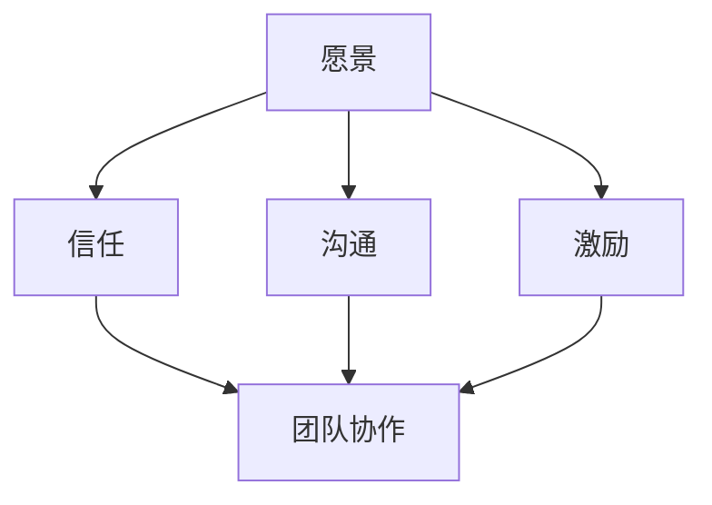

                 

# 《领导力与自我管理：以身作则》

## 关键词
领导力，自我管理，以身作则，团队建设，时间管理，情绪管理，目标设定，Python代码实现，案例分析，人工智能。

## 摘要
本文旨在探讨领导力与自我管理的重要性，并通过以身作则这一核心实践，详细解析其理论背景、方法技巧和实践应用。文章首先介绍了领导力的基本概念，探讨了领导风格与团队发展的关系，并深入分析了领导力的发展路径。接着，文章重点介绍了自我管理的技巧，包括时间管理、情绪管理和目标设定。随后，文章论述了以身作则的实践方法，如何通过榜样作用、团队建设和言行一致性来提升领导力和自我管理能力。通过具体案例的分析，文章进一步展示了这些理论在实际中的应用效果。最后，文章总结了领导力与自我管理的未来趋势，并提出了相关建议。

## 第一部分：领导力理论

### 第1章：领导力的基本概念

#### 1.1.1 领导力的定义与重要性
领导力是指通过影响和激励他人来达成共同目标的能力。它不仅仅是管理职能的一部分，更是一种艺术。一个优秀的领导者不仅要能够指挥和协调团队的工作，还需要具备洞察力、决策力、沟通能力和人格魅力。

#### 1.1.2 领导力与管理的区别
领导力与管理之间存在本质的区别。管理侧重于规划和执行任务，而领导力则侧重于激发团队成员的潜能，并引导他们朝着共同的目标前进。管理是维持现状，而领导力则是推动变革。

#### 1.1.3 领导力的核心要素
领导力的核心要素包括：愿景、信任、沟通和激励。一个领导者必须能够清晰地表达愿景，建立信任关系，有效地沟通，并激励团队成员为实现共同目标而努力。

#### Mermaid 流程图：领导力的核心要素关系架构

### 第2章：领导风格与团队发展

#### 2.1.1 领导风格的类型与特点
领导风格可以分为专制型、民主型和放任型。每种风格都有其独特的特点和应用场景。专制型领导注重权威和控制，民主型领导强调参与和共识，放任型领导则给予团队成员充分的自由。

#### 2.1.2 领导风格对团队的影响
领导风格对团队的文化、协作效率和成员满意度有显著影响。一个适合团队发展需求的领导风格能够促进团队的成长和发展。

#### 2.1.3 领导风格的适应与转变
领导者需要根据不同的情况和环境灵活调整领导风格。例如，在危机时刻，专制型领导风格可能更为有效，而在稳定时期，民主型领导风格则更为适宜。

### 第3章：领导力发展

#### 3.1.1 领导力发展的途径
领导力的发展可以通过学习、实践和反思来实现。领导者需要不断学习新的知识和技能，勇于实践，并从经验中反思和成长。

#### 3.1.2 领导力发展的障碍与应对
领导力发展的障碍可能包括恐惧、自负和缺乏自信等。领导者需要认识到这些障碍，并采取积极措施加以克服。

#### 3.1.3 领导力发展的持续动力
领导力的发展是一个持续的过程，领导者需要保持学习的热情和动力，不断追求卓越。

## 第二部分：自我管理技巧

### 第4章：时间管理

#### 4.1.1 时间管理的基本原则
时间管理的基本原则包括：明确目标、优先级排序、合理规划、高效执行和定期回顾。

#### 4.1.2 时间管理工具与方法
时间管理工具如日历、待办事项清单、番茄工作法等可以帮助领导者更有效地管理时间。

#### 4.1.3 时间管理在领导力提升中的应用
通过有效的时间管理，领导者可以更好地平衡工作与生活，提高工作效率，从而更好地发挥领导力。

### 第5章：情绪管理

#### 5.1.1 情绪管理的重要性
情绪管理是领导者自我管理的重要部分。情绪管理良好有助于提升决策质量、增强团队凝聚力。

#### 5.1.2 情绪管理的策略与技巧
情绪管理的策略包括自我意识、自我调节、自我激励和同理心。领导者可以通过这些策略来更好地管理自己的情绪。

#### 5.1.3 情绪管理在自我激励中的作用
情绪管理有助于领导者保持积极的心态，提高自我激励能力，从而在面对挑战时更加坚定和有信心。

### 第6章：目标设定与自我激励

#### 6.1.1 目标设定的SMART原则
SMART原则是指目标设定要具备具体性、可衡量性、可实现性、相关性和时限性。

#### 6.1.2 目标设定在领导力提升中的应用
通过设定明确的目标，领导者可以更好地规划工作，激励团队，实现个人和团队的成长。

#### 6.1.3 自我激励的方法与技巧
自我激励的方法包括设定小目标、庆祝成就、保持积极态度和寻求支持等。

## 第三部分：以身作则的实践

### 第7章：榜样作用

#### 7.1.1 榜样作用的概念与作用
榜样作用是指领导者通过自身的行为和态度影响团队成员，激发他们的潜能。

#### 7.1.2 如何成为他人的榜样
领导者可以通过树立正确的工作态度、积极的工作方式和良好的职业道德来成为他人的榜样。

#### 7.1.3 榜样作用在团队建设中的应用
榜样作用有助于提升团队的文化和价值观，增强团队的凝聚力和执行力。

### 第8章：团队建设

#### 8.1.1 团队建设的重要性
团队建设是提升团队绩效和员工满意度的重要手段。

#### 8.1.2 团队建设的步骤与方法
团队建设的步骤包括评估团队现状、设定团队目标、建立团队规则和促进团队沟通。

#### 8.1.3 团队建设在领导力提升中的作用
有效的团队建设有助于提升领导者的领导力，促进团队的协作和成长。

### 第9章：领导者的言行一致性

#### 9.1.1 言行一致性的重要性
言行一致性是领导者赢得团队成员信任和尊重的关键。

#### 9.1.2 如何实现言行一致性
领导者可以通过以下方法实现言行一致性：明确自己的价值观和行为准则，以身作则，保持透明度和一致性。

#### 9.1.3 言行一致性对团队的影响
言行一致性有助于提升团队的信任度和凝聚力，增强团队的执行力和创新能力。

## 第四部分：案例分析

### 第10章：成功领导者的以身作则实践

#### 10.1.1 案例背景介绍
本案例选取了一家快速发展的科技公司，其领导者通过以身作则的方式成功带领团队取得了显著成绩。

#### 10.1.2 领导者的以身作则实践
该领导者通过以下方式以身作则：坚持高效工作，积极参与团队活动，鼓励创新思维，关注员工成长。

#### 10.1.3 案例分析与启示
该案例表明，以身作则不仅能够提升领导者的领导力，还能够激发团队的潜能，实现团队和个人的共同成长。

## 第五部分：总结与展望

### 第11章：领导力与自我管理的未来趋势

#### 11.1.1 当前领导力与自我管理的发展趋势
随着社会和技术的不断进步，领导力和自我管理也在不断发展和变革。

#### 11.1.2 未来领导力与自我管理的挑战与机遇
未来领导力将更加注重创新、敏捷性和多元化，领导者需要具备跨文化沟通和全球化视野。

#### 11.1.3 对未来领导力与自我管理的建议
领导者需要持续学习和成长，关注团队成员的需求和反馈，不断提升自身的领导力和自我管理能力。

## 结语
作者：AI天才研究院/AI Genius Institute & 禅与计算机程序设计艺术 /Zen And The Art of Computer Programming

本文通过深入分析领导力与自我管理的理论和实践，旨在帮助读者理解并提升自身的领导力与自我管理能力。以身作则作为核心实践方法，不仅能够提升个人的领导力和影响力，还能够促进团队的协作和成长。在未来的发展中，领导者需要不断适应新的挑战和机遇，持续提升自身的领导力和自我管理能力。希望本文能够为读者提供有价值的启示和指导。

