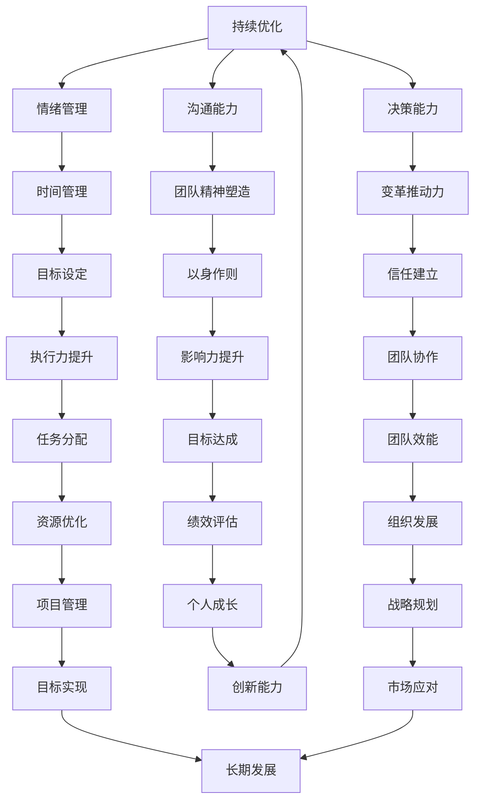

                 

### 背景介绍

在现代社会的快速发展和变化中，领导力和自我管理的重要性愈发凸显。无论是企业的高层管理者，还是普通团队成员，都需要具备良好的领导力和自我管理能力，以应对日益复杂的工作环境和挑战。领导力不仅仅是指导团队达成目标的能力，更是通过影响和激励他人，实现共同愿景的关键素质。而自我管理则是个体在面对各种压力和挑战时，保持高效和积极状态的核心能力。

本文旨在深入探讨领导力与自我管理的关系，特别是以身作则的重要性。我们将通过一系列的逻辑分析和案例研究，来阐述这一主题的深刻内涵。本文的核心目标是帮助读者理解以下关键点：

1. **领导力的核心要素**：通过介绍领导力的定义、意义和核心要素，使读者对领导力有全面的了解。
2. **自我管理的技巧**：探讨时间管理、情绪管理、沟通能力等自我管理技巧，并提供实用的实践方法。
3. **以身作则的重要性**：通过具体案例和实际应用，展示以身作则如何提升领导力和团队效能。
4. **数学模型与算法原理**：结合Python源代码和LaTeX公式，深入讲解相关算法和模型的原理和实现。
5. **最佳实践与总结**：总结文章要点，提供实用的建议和注意事项，并推荐拓展阅读。

接下来的内容将按照目录大纲的结构，逐步展开对每个章节的详细探讨，确保读者能够系统地掌握领导力和自我管理的基本理论和实践方法。通过这一系列的思考和分析，我们希望读者能够对如何提升自身的领导力和自我管理能力有更深刻的理解，从而在实际工作和生活中取得更好的成果。#

## 关键词

- **领导力**
- **自我管理**
- **以身作则**
- **团队效能**
- **时间管理**
- **情绪管理**
- **沟通能力**
- **数学模型**
- **Python源代码**
- **LaTeX公式**
- **实际案例**#

### 摘要

本文深入探讨了领导力与自我管理之间的关系，特别是以身作则的重要性。通过对领导力的定义、意义和核心要素的介绍，本文帮助读者建立了对领导力的全面理解。同时，文章详细探讨了自我管理的技巧，包括时间管理、情绪管理和沟通能力，并提供了一系列实用的实践方法。在以身作则的部分，本文通过具体案例和实际应用，展示了如何通过以身作则来提升领导力和团队效能。此外，文章还结合Python源代码和LaTeX公式，深入讲解了相关算法和模型的原理和实现。最终，文章总结了关键要点，并提供了实用的建议和注意事项，推荐了拓展阅读，以帮助读者进一步提升自身的领导力和自我管理能力。通过本文的阅读，读者将对如何在实际工作和生活中有效运用领导力和自我管理有更深刻的理解和实践指导。#

## 第一部分：领导力的本质与核心

### 第1章：领导力的定义与意义

领导力是一个广泛而复杂的主题，它涉及到个人、团队和组织在各个层面上的互动与影响。在当今快速变化和高度不确定的环境中，领导力的重要性愈发凸显。一个优秀的领导者不仅能够带领团队实现目标，还能够激发团队成员的潜力，创造积极向上的工作氛围。

#### 1.1 领导力的定义

领导力可以定义为一种影响和激励他人实现共同目标的能力。这种能力不仅仅是指导和管理团队，更是一种引领、赋能和激励的过程。领导力不仅仅是职位赋予的权力，而是个人内在素质的体现。

在传统观念中，领导力通常与权威和控制联系在一起。然而，随着组织形式和工作环境的变化，现代领导力更强调合作、沟通和创新。现代领导力认为，领导者不仅是决策者，更是变革的推动者和团队精神的塑造者。

#### 1.2 领导力的意义

领导力对于个人、团队和组织的发展具有重要意义。

1. **对个人成长的影响**：领导力是一个人综合素质的体现，它包括自我认知、情绪管理、沟通能力和决策能力等。通过提升领导力，个人可以在职业和个人生活中取得更大的成就。

2. **对组织发展的重要性**：领导力是推动组织变革和实现战略目标的关键因素。一个优秀的领导者能够带领团队克服各种挑战，实现组织的长期发展。

3. **对团队效能的提升**：领导力直接影响团队的工作效率和团队士气。通过有效的领导，团队可以更好地协作，提高生产力，实现共同的目标。

#### 1.3 领导力的核心要素

领导力是一个多维度的概念，它包含多个核心要素。

1. **自我认知**：自我认知是领导力的基础。一个优秀的领导者需要清楚地了解自己的优点和缺点，以及自己的价值观和信念。

2. **情绪管理**：情绪管理是领导者应对压力和挑战的关键能力。一个情绪稳定的领导者能够更好地处理复杂的人际关系，并保持团队的积极性。

3. **沟通能力**：沟通能力是领导者与团队成员建立有效沟通的重要工具。一个优秀的领导者需要具备良好的倾听、表达和反馈能力。

4. **决策能力**：决策能力是领导力的核心。领导者需要在面对复杂情况时，做出快速而明智的决策。

5. **变革推动力**：在当今快速变化的环境中，领导者需要具备推动变革的能力。这包括对新技术的接纳、新方法的尝试以及对传统思维模式的挑战。

6. **团队精神塑造**：领导者需要通过自己的行为和言语，塑造积极向上的团队精神。这包括培养团队成员之间的信任、尊重和合作。

#### 1.4 领导力的分类

领导力可以根据不同的标准和维度进行分类。以下是一些常见的领导力类型：

1. **任务导向型领导力**：这种领导力强调目标的实现和任务的完成。领导者通过设定清晰的目标和任务，指导团队达成目标。

2. **变革型领导力**：这种领导力注重变革和创新。领导者通过激发团队成员的潜力，推动组织的变革和创新。

3. **授权型领导力**：这种领导力强调赋予团队成员更多的自主权和责任感。领导者通过授权，让团队成员能够自主决策和解决问题。

4. **服务型领导力**：这种领导力强调领导者的服务精神。领导者将团队成员的需求放在首位，通过提供服务和支持，帮助团队成员实现个人和团队的目标。

#### 1.5 结论

领导力是一个复杂而多维度的概念，它对个人、团队和组织的发展具有重要意义。通过理解领导力的定义、意义和核心要素，我们可以更好地提升自己的领导力，成为更有效的领导者。在接下来的章节中，我们将进一步探讨自我管理的技巧，特别是时间管理、情绪管理和沟通能力，以及以身作则的重要性。这些技能和原则将帮助我们更好地发挥领导力，实现个人和团队的目标。#

## 第二部分：自我管理技巧

### 第2章：时间管理

时间管理是自我管理的重要组成部分，对于提高工作效率和个人生活质量至关重要。在快速变化的工作环境中，有效地管理时间意味着能够更好地平衡工作与生活，减少压力，并保持高水平的生产力。

#### 2.1 时间管理的重要性

时间管理不仅仅是关于如何安排日程，更是关于如何优化时间利用，以实现个人和职业目标。良好的时间管理能力可以帮助我们：

- **提高工作效率**：通过合理规划时间，可以减少拖延，避免分心，提高工作的连续性和专注度。
- **减少压力**：明确的时间规划可以减少工作上的焦虑和压力，使生活更加从容。
- **平衡工作与生活**：合理安排时间，确保工作和个人生活的平衡，有助于保持身心健康。

#### 2.2 时间管理的方法

要有效地进行时间管理，可以采用以下几种方法：

1. **时间日志法**：记录每天的时间花费，了解时间使用情况，分析哪些活动是必要的，哪些是浪费时间的。

2. **四象限法**：将任务分为重要紧急、重要不紧急、不重要紧急和不重要不紧急四个象限。重点处理重要紧急和重要不紧急的任务，避免被不重要但紧急的任务所打扰。

3. **优先级排序法**：根据任务的紧急性和重要性进行排序，优先处理最关键的任务。

4. **番茄工作法**：将工作时间分割成25分钟的工作周期，每个周期后休息5分钟。这种方法有助于提高专注力，避免长时间工作的疲劳。

#### 2.3 实际案例：我的时间管理实践

以下是一个时间管理的实际案例，展示如何通过具体实践来提高工作效率。

**案例背景**：作为一名软件工程师，我经常需要在繁忙的项目周期中处理多个任务，同时保持与团队的良好沟通和个人生活的平衡。

**时间管理实践**：

1. **每日计划**：每天早上，我会列出当天需要完成的任务，并根据重要性和紧急性进行排序。重要紧急的任务优先处理，重要不紧急的任务安排在上午完成，不重要但紧急的任务安排在下午处理，不重要的任务则尽量规避。

2. **时间日志**：每周我会记录一周的时间花费，分析哪些任务花费了过多的时间，哪些任务可以优化。通过时间日志，我发现邮件回复和时间管理软件使用占据了过多的时间，于是我决定每天限定邮件处理时间，并使用专门的工具进行任务管理。

3. **番茄工作法**：在处理具体任务时，我会采用番茄工作法来提高专注力。例如，在一个两小时的项目开发中，我会将其分为四个25分钟的番茄工作周期，每个周期后休息5分钟。这种方法有效提升了我的工作效率，减少了中断和分心。

**结果**：通过上述时间管理实践，我能够更有效地处理工作任务，提高了工作效率。同时，我也有更多的时间与家人相处，保持了良好的生活平衡。

#### 2.4 结论

时间管理是一项需要持续实践和优化的技能。通过合理规划时间、明确优先级、使用有效的管理工具，我们可以更好地利用时间，提高工作效率，实现个人和职业目标。在接下来的章节中，我们将探讨情绪管理和沟通能力，这两项技能同样对自我管理至关重要。通过综合运用这些技能，我们可以更好地应对工作和生活中的挑战。#

### 第3章：情绪管理

情绪管理是自我管理中至关重要的一环，它不仅关系到个人的心理健康，也直接影响到工作表现和人际关系。在当今快节奏和高压力的工作环境中，情绪管理能力尤为重要。通过有效的情绪管理，我们可以更好地应对压力，保持积极心态，提高工作效率和生活质量。

#### 3.1 情绪管理的重要性

情绪管理的重要性体现在以下几个方面：

- **心理健康**：情绪管理有助于减轻焦虑、抑郁等负面情绪，提高心理健康水平。
- **工作效率**：情绪稳定的人更容易集中注意力，提高工作效率，减少因情绪波动导致的失误。
- **人际关系**：情绪管理能力良好的人能够更好地处理人际关系，建立积极、健康的社交网络。
- **团队合作**：良好的情绪管理有助于营造积极的团队氛围，提高团队协作效率和凝聚力。

#### 3.2 情绪管理的基本原则

情绪管理需要遵循以下基本原则：

1. **自我意识**：了解自己的情绪，并能够准确地识别和表达情绪。
2. **接受情绪**：接受情绪是人类的自然反应，而不是逃避或压抑。
3. **理性分析**：对情绪进行理性分析，找到情绪产生的原因，并思考如何解决。
4. **应对策略**：根据情绪的类型和强度，选择适当的应对策略，如深呼吸、冥想或运动等。
5. **持续练习**：情绪管理是一个持续的过程，需要通过不断的练习和调整来提高。

#### 3.3 情绪管理的实践技巧

以下是一些实用的情绪管理技巧：

1. **深呼吸**：深呼吸可以帮助我们放松身体，减轻焦虑和紧张情绪。在感到压力时，可以进行几次深呼吸，缓慢地吸气和呼气，让身体和大脑得到放松。

2. **冥想**：冥想是一种有效的情绪管理技巧，可以帮助我们集中注意力，减少杂念，提高情绪稳定性。每天花几分钟进行冥想，可以显著改善情绪状态。

3. **运动**：运动能够释放身体中的紧张和压力，提高心情。例如，散步、跑步或瑜伽等都是很好的选择。

4. **积极心态**：保持积极的心态，对困难和挑战持开放态度，可以帮助我们更好地应对压力。

5. **社交支持**：与他人交流和分享感受，可以得到情感上的支持和理解，有助于情绪管理。

#### 3.4 实际案例：情绪管理的实践

以下是一个情绪管理的实际案例，展示如何通过具体实践来改善情绪状态。

**案例背景**：我是一名项目经理，负责多个重要项目的管理。由于工作压力大，我经常感到焦虑和疲劳。

**情绪管理实践**：

1. **自我意识**：我开始意识到，我的焦虑和疲劳是由于工作压力和无法有效管理时间导致的。

2. **接受情绪**：我接受了这种情绪是正常的，并尝试不去压抑或逃避。

3. **理性分析**：我分析了工作压力的来源，发现主要是由于任务过多和时间管理不当。

4. **应对策略**：为了应对这种情绪，我采取了以下措施：
   - 每天早上制定详细的工作计划，并按照优先级进行任务分配。
   - 每天晚上回顾当天的工作，评估时间管理和任务完成情况。
   - 定期与团队成员沟通，确保项目进展顺利。
   - 每周安排一次运动，如散步或瑜伽，以放松身心。

**结果**：通过上述情绪管理实践，我逐渐改善了情绪状态。焦虑和疲劳感减少，工作效率提高，与团队成员的关系也更加和谐。

#### 3.5 结论

情绪管理是一项需要长期坚持和实践的技能。通过自我意识、接受情绪、理性分析和应对策略，我们可以更好地管理自己的情绪，提高工作效率和生活质量。在接下来的章节中，我们将探讨沟通能力，这是自我管理中的另一项重要技能。通过掌握情绪管理和沟通能力，我们可以更好地应对工作和生活中的各种挑战。#

## 第4章：沟通能力

沟通能力是自我管理中的关键要素，它不仅影响个人的工作效率，还直接影响人际关系和团队合作。有效的沟通能够促进信息的准确传达，减少误解和冲突，提高团队协作效率和整体绩效。因此，提升沟通能力对于个人和组织的发展具有重要意义。

### 4.1 有效沟通的重要性

有效沟通的重要性体现在以下几个方面：

1. **提高工作效率**：清晰、及时的沟通能够确保任务的准确执行，减少由于信息传递错误导致的返工和延误。
2. **改善人际关系**：良好的沟通技巧有助于建立信任和尊重，促进团队成员之间的协作和互动。
3. **减少冲突**：通过有效的沟通，可以及早发现和解决潜在的问题，减少冲突和误解。
4. **增强团队凝聚力**：沟通是团队合作的基石，有效的沟通能够增强团队凝聚力，提高团队整体战斗力。

### 4.2 有效沟通的基本原则

为了实现有效的沟通，我们需要遵循以下基本原则：

1. **倾听**：倾听是有效沟通的第一步，它要求我们不仅要听到对方的话，还要理解对方的意图和感受。积极倾听可以减少误解，增强互动。
2. **清晰表达**：清晰、简洁的表达能够确保信息准确传达。避免使用含糊的词汇和复杂的句式，使对方更容易理解。
3. **尊重**：尊重对方的意见和感受是建立良好沟通关系的基础。即使对方观点与自己不同，也要保持尊重和礼貌。
4. **反馈**：在沟通过程中，及时的反馈可以帮助确认信息是否被正确理解，同时也可以让对方知道自己的想法和感受。
5. **开放性**：开放性沟通意味着愿意接受不同的意见和观点，通过开放性的讨论来解决问题。

### 4.3 沟通技巧的提升

以下是一些提升沟通技巧的方法：

1. **非语言沟通**：非语言沟通包括肢体语言、面部表情和姿态等。有效的非语言沟通能够增强语言表达的效果。例如，保持微笑、眼神交流、适当的肢体动作等，都能够传递积极的信号。
2. **提问技巧**：提问是沟通中的重要技巧，能够帮助澄清问题和理解对方意图。开放性问题（如“你认为...？”）比封闭性问题（如“是不是...？”）更有助于深入讨论。
3. **情绪管理**：情绪管理是沟通的重要组成部分。在沟通中，保持冷静和理性，避免情绪化的言辞，有助于避免冲突和误解。
4. **信息组织**：在沟通前，对信息进行组织和梳理，确保信息的条理性和逻辑性。清晰的思维和逻辑能够使沟通更加高效。
5. **适应听众**：不同的听众可能有不同的沟通需求和理解能力。适应听众，使用他们能够理解和接受的沟通方式和语言，能够提高沟通效果。

### 4.4 实际案例：沟通技巧的实践

以下是一个沟通技巧的实际案例，展示如何通过具体实践来提升沟通效果。

**案例背景**：我是一名项目经理，负责一个跨部门的项目。由于涉及多个部门的合作，沟通的复杂性和难度较大。

**沟通技巧实践**：

1. **倾听和反馈**：在会议中，我特别注重倾听团队成员的意见，并在他们发言后给予积极的反馈。这有助于确认我的理解是否正确，同时也鼓励团队成员更积极地参与讨论。
2. **清晰表达**：我在发言时尽量使用简洁明了的语言，避免使用复杂的术语和句子结构。我还会重复关键信息，确保团队成员能够准确理解。
3. **非语言沟通**：在会议中，我会保持良好的姿态，如坐直、微笑和适当的手势，以增强我的表达效果。
4. **情绪管理**：面对不同观点和冲突时，我会保持冷静，通过理性的讨论来解决问题，而不是情绪化的回应。
5. **信息组织**：在每次会议前，我会准备好详细的会议议程，确保会议内容有条不紊。

**结果**：通过上述沟通技巧的实践，我在项目中取得了较好的沟通效果。团队成员之间的沟通更加顺畅，项目的进展也更加顺利。项目最终按时完成，得到了上级和同事的好评。

### 4.5 结论

沟通能力是自我管理中不可或缺的一部分。通过倾听、清晰表达、尊重、反馈和适应听众等技巧，我们可以有效提升沟通效果，改善人际关系，提高工作效率。在接下来的章节中，我们将进一步探讨领导力的实践，特别是以身作则的重要性。通过综合运用沟通能力和其他自我管理技巧，我们可以更好地发挥领导力，实现个人和团队的目标。#

## 第5章：领导力与自我管理的Mermaid流程图

为了更好地理解领导力与自我管理之间的关系，我们使用Mermaid流程图来展示它们的核心概念及其相互联系。通过这一图形化表示，读者可以直观地看到各个核心要素如何相互作用，从而更清晰地掌握领导力与自我管理的整体架构。

以下是一个示例的Mermaid流程图，展示了领导力与自我管理的核心概念和它们之间的联系：

### 解读流程图

- **自我认知（A）**：这是领导力和自我管理的基础。一个自我认知良好的领导者能够清楚地了解自己的优势、劣势和价值观，从而更好地管理自己的行为和情绪。
- **情绪管理（B）**：情绪管理有助于领导者保持稳定和积极的心态，减少因情绪波动导致的决策失误。
- **沟通能力（C）**：良好的沟通能力是领导者传递信息、建立信任和推动变革的关键。
- **决策能力（D）**：决策能力是领导者的核心能力，它决定了领导者是否能够快速应对变化和挑战。
- **时间管理（E）**：时间管理有助于领导者有效地分配时间，提高工作效率，确保任务按时完成。
- **团队精神塑造（F）**：团队精神是团队协作和高效工作的关键，领导者需要通过自己的行为和沟通来塑造积极向上的团队氛围。
- **变革推动力（G）**：变革推动力使领导者能够在组织内部推动创新和变革，适应外部环境的变化。
- **目标设定（H）**：目标设定是领导者制定战略规划和组织发展的重要步骤。
- **以身作则（I）**：以身作则是指领导者通过自己的行为和态度来影响和激励团队成员，是实现领导力的关键。
- **影响力提升（L）**：领导者的影响力是领导力的重要组成部分，它决定了领导者在组织中的影响范围和深度。
- **信任建立（J）**：信任是领导者与团队成员之间关系的基础，它有助于提升团队的凝聚力和协作效率。
- **执行力提升（K）**：执行力是领导者确保目标实现的关键能力。
- **团队协作（M）**：团队协作是领导力的体现，它决定了团队能否高效完成任务。
- **任务分配（N）**：任务分配是领导者根据团队成员的能力和优势，合理分配工作，提高团队整体效能。
- **资源优化（Q）**：资源优化是指领导者通过合理配置资源，提高组织的运营效率。
- **绩效评估（R）**：绩效评估是领导者了解团队成员工作表现和团队整体效能的重要工具。
- **组织发展（S）**：组织发展是领导者的长期目标，它决定了组织的可持续发展和竞争力。
- **战略规划（V）**：战略规划是领导者制定长期发展目标和策略的过程。
- **项目管理（T）**：项目管理是领导者确保项目按时、按质完成的关键步骤。
- **个人成长（U）**：个人成长是领导者不断提升自己的能力和素质，以适应更高层次的工作要求。
- **创新能力（X）**：创新能力是领导者推动组织持续发展的动力。
- **市场应对（Y）**：市场应对是领导者根据市场变化，调整组织战略和策略的过程。

通过这个Mermaid流程图，我们可以清晰地看到领导力和自我管理各个核心要素之间的相互作用和影响。领导者需要通过不断提升这些能力，才能在实际工作中发挥最大的作用，实现个人和组织的共同目标。在接下来的章节中，我们将进一步探讨如何在实际工作中运用这些核心概念，提升领导力和自我管理能力。#

## 第三部分：自我管理技巧

### 第6章：时间管理

时间管理是自我管理的重要组成部分，它涉及到如何有效地规划和利用时间，以实现个人和职业目标。有效的时间管理不仅能提高工作效率，还能帮助个人在忙碌的生活中找到平衡。

#### 6.1 时间管理的重要性

时间管理对于个人和组织都有重要意义：

1. **提高工作效率**：通过合理规划时间，可以避免不必要的拖延，提高工作连续性和专注力。
2. **减少压力**：明确的时间规划可以帮助我们更好地控制工作量，减少因任务堆积而带来的压力。
3. **平衡工作与生活**：有效的时间管理使我们能够在忙碌的工作中找到休息和放松的时间，保持身心健康。
4. **实现目标**：通过设定优先级和合理安排时间，我们可以更有针对性地实现个人和职业目标。

#### 6.2 时间管理的方法

以下是一些时间管理的方法：

1. **四象限法**：将任务分为四个象限，分别是紧急且重要、紧急但不重要、不紧急但重要、不紧急且不重要。优先处理紧急且重要的任务，合理安排紧急但不重要的任务，预留时间给不紧急但重要的任务，避免处理不紧急且不重要的任务。

2. **优先级排序法**：根据任务的紧急性和重要性进行排序，优先处理最重要的任务。

3. **时间块法**：将时间分为若干块，每块专注于一项任务。这种方法有助于提高专注力和减少任务切换带来的时间浪费。

4. **任务分解法**：将大任务分解为小任务，逐步完成，避免因任务过于庞大而导致的拖延。

#### 6.3 实际案例：我的时间管理实践

以下是一个时间管理的实际案例，展示如何通过具体实践来提高工作效率。

**案例背景**：我是一名软件工程师，负责多个项目的开发和管理。

**时间管理实践**：

1. **每日计划**：每天早上，我会列出当天需要完成的任务，并根据重要性和紧急性进行排序。首先处理重要且紧急的任务，然后是重要但不紧急的任务。

2. **时间块法**：我将工作时间分为三个块，每个块专注于一项任务。例如，上午专注于代码编写，下午专注于bug修复，晚上专注于项目规划和文档编写。

3. **任务分解法**：对于复杂的项目任务，我会将其分解为多个小任务，逐步完成。这有助于避免因任务过于庞大而导致的拖延。

4. **定期回顾**：每周我会回顾一周的时间管理情况，分析哪些任务完成得较好，哪些任务需要改进。通过不断调整和优化时间管理策略，我能够更好地提高工作效率。

**结果**：通过上述时间管理实践，我的工作效率显著提高。任务完成得更加高效，压力也得到了缓解。同时，我也有更多的时间用于个人兴趣和家庭生活，实现了工作与生活的平衡。

#### 6.4 结论

时间管理是自我管理中至关重要的一环。通过合理规划时间、设定优先级、使用有效的时间管理方法，我们可以提高工作效率，减少压力，实现个人和职业目标。在接下来的章节中，我们将继续探讨自我管理中的其他关键技巧，如情绪管理和沟通能力。通过综合运用这些技巧，我们可以进一步提升自我管理能力，成为更有效的领导者。#

## 第7章：情绪管理

情绪管理是自我管理中至关重要的一个方面，它涉及到如何识别、理解和控制自己的情绪，以保持心理平衡和高效的工作状态。良好的情绪管理不仅有助于个人的心理健康，还能提升工作表现和人际关系。

#### 7.1 情绪管理的重要性

情绪管理对于个人的发展和工作表现具有重要意义：

1. **心理健康**：情绪管理有助于减少焦虑、抑郁等负面情绪，提升心理健康水平。
2. **工作效率**：情绪稳定的人能够更好地集中注意力，提高工作效率，减少因情绪波动导致的错误。
3. **人际关系**：情绪管理能力良好的人更容易与他人建立良好的关系，减少冲突和误解。
4. **团队合作**：情绪稳定的人能够更好地处理团队中的冲突，提高团队协作效率。

#### 7.2 情绪管理的基本原则

为了有效进行情绪管理，我们需要遵循以下基本原则：

1. **自我认知**：了解自己的情绪，是情绪管理的第一步。这包括识别情绪的类型和强度，以及情绪产生的原因。
2. **接受情绪**：情绪是人类的自然反应，不能完全消除，但可以通过接受和正视来减少负面情绪的影响。
3. **理性分析**：对情绪进行理性分析，找到情绪产生的原因，并思考如何解决。避免过度情绪化和非理性决策。
4. **应对策略**：根据情绪的类型和强度，选择适当的应对策略，如深呼吸、冥想、运动等。
5. **持续练习**：情绪管理是一个持续的过程，需要通过不断的练习和调整来提高。

#### 7.3 情绪管理的实践技巧

以下是一些实用的情绪管理技巧：

1. **深呼吸**：深呼吸可以帮助我们放松身体，减轻焦虑和紧张情绪。在感到压力时，可以进行几次深呼吸，缓慢地吸气和呼气，让身体和大脑得到放松。

2. **冥想**：冥想是一种有效的情绪管理技巧，可以帮助我们集中注意力，减少杂念，提高情绪稳定性。每天花几分钟进行冥想，可以显著改善情绪状态。

3. **运动**：运动能够释放身体中的紧张和压力，提高心情。例如，散步、跑步或瑜伽等都是很好的选择。

4. **积极心态**：保持积极的心态，对困难和挑战持开放态度，可以帮助我们更好地应对压力。

5. **社交支持**：与他人交流和分享感受，可以得到情感上的支持和理解，有助于情绪管理。

#### 7.4 实际案例：情绪管理的实践

以下是一个情绪管理的实际案例，展示如何通过具体实践来改善情绪状态。

**案例背景**：我是一名项目经理，负责多个重要项目的管理。由于工作压力大，我经常感到焦虑和疲劳。

**情绪管理实践**：

1. **自我认知**：我开始意识到，我的焦虑和疲劳是由于工作压力和无法有效管理时间导致的。

2. **接受情绪**：我接受了这种情绪是正常的，并尝试不去压抑或逃避。

3. **理性分析**：我分析了工作压力的来源，发现主要是由于任务过多和时间管理不当。

4. **应对策略**：为了应对这种情绪，我采取了以下措施：
   - 每天早上制定详细的工作计划，并按照优先级进行任务分配。
   - 每天晚上回顾当天的工作，评估时间管理和任务完成情况。
   - 定期与团队成员沟通，确保项目进展顺利。
   - 每周安排一次运动，如散步或瑜伽，以放松身心。

**结果**：通过上述情绪管理实践，我逐渐改善了情绪状态。焦虑和疲劳感减少，工作效率提高，与团队成员的关系也更加和谐。

#### 7.5 结论

情绪管理是一项需要长期坚持和实践的技能。通过自我认知、接受情绪、理性分析和应对策略，我们可以更好地管理自己的情绪，提高工作效率和生活质量。在接下来的章节中，我们将探讨沟通能力，这是自我管理中的另一项重要技能。通过掌握情绪管理和沟通能力，我们可以更好地应对工作和生活中的各种挑战。#

## 第8章：沟通能力

沟通能力是自我管理的重要组成部分，它不仅影响个人的工作效率和职业发展，还直接关系到人际关系的建立和维护。有效的沟通能够促进信息的准确传达，减少误解和冲突，提高团队协作效率和整体绩效。因此，提升沟通能力对于个人和组织的发展具有重要意义。

### 8.1 有效沟通的重要性

有效沟通的重要性体现在以下几个方面：

1. **提高工作效率**：清晰的沟通能够确保任务的准确执行，减少由于信息传递错误导致的返工和延误。
2. **改善人际关系**：良好的沟通技巧有助于建立信任和尊重，促进团队成员之间的协作和互动。
3. **减少冲突**：通过有效的沟通，可以及早发现和解决潜在的问题，减少冲突和误解。
4. **增强团队凝聚力**：沟通是团队合作的基石，有效的沟通能够增强团队凝聚力，提高团队整体战斗力。

### 8.2 有效沟通的基本原则

为了实现有效的沟通，我们需要遵循以下基本原则：

1. **倾听**：倾听是有效沟通的第一步，它要求我们不仅要听到对方的话，还要理解对方的意图和感受。积极倾听可以减少误解，增强互动。
2. **清晰表达**：清晰、简洁的表达能够确保信息准确传达。避免使用含糊的词汇和复杂的句式，使对方更容易理解。
3. **尊重**：尊重对方的意见和感受是建立良好沟通关系的基础。即使对方观点与自己不同，也要保持尊重和礼貌。
4. **反馈**：在沟通过程中，及时的反馈可以帮助确认信息是否被正确理解，同时也可以让对方知道自己的想法和感受。
5. **开放性**：开放性沟通意味着愿意接受不同的意见和观点，通过开放性的讨论来解决问题。

### 8.3 沟通技巧的提升

以下是一些提升沟通技巧的方法：

1. **非语言沟通**：非语言沟通包括肢体语言、面部表情和姿态等。有效的非语言沟通能够增强语言表达的效果。例如，保持微笑、眼神交流、适当的肢体动作等，都能够传递积极的信号。
2. **提问技巧**：提问是沟通中的重要技巧，能够帮助澄清问题和理解对方意图。开放性问题（如“你认为...？”）比封闭性问题（如“是不是...？”）更有助于深入讨论。
3. **情绪管理**：情绪管理是沟通的重要组成部分。在沟通中，保持冷静和理性，避免情绪化的言辞，有助于避免冲突和误解。
4. **信息组织**：在沟通前，对信息进行组织和梳理，确保信息的条理性和逻辑性。清晰的思维和逻辑能够使沟通更加高效。
5. **适应听众**：不同的听众可能有不同的沟通需求和理解能力。适应听众，使用他们能够理解和接受的沟通方式和语言，能够提高沟通效果。

### 8.4 实际案例：沟通技巧的实践

以下是一个沟通技巧的实际案例，展示如何通过具体实践来提升沟通效果。

**案例背景**：我是一名项目经理，负责一个跨部门的项目。由于涉及多个部门的合作，沟通的复杂性和难度较大。

**沟通技巧实践**：

1. **倾听和反馈**：在会议中，我特别注重倾听团队成员的意见，并在他们发言后给予积极的反馈。这有助于确认我的理解是否正确，同时也鼓励团队成员更积极地参与讨论。

2. **清晰表达**：我在发言时尽量使用简洁明了的语言，避免使用复杂的术语和句子结构。我还会重复关键信息，确保团队成员能够准确理解。

3. **非语言沟通**：在会议中，我会保持良好的姿态，如坐直、微笑和适当的手势，以增强我的表达效果。

4. **情绪管理**：面对不同观点和冲突时，我会保持冷静，通过理性的讨论来解决问题，而不是情绪化的回应。

5. **信息组织**：在每次会议前，我会准备好详细的会议议程，确保会议内容有条不紊。

**结果**：通过上述沟通技巧的实践，我在项目中取得了较好的沟通效果。团队成员之间的沟通更加顺畅，项目的进展也更加顺利。项目最终按时完成，得到了上级和同事的好评。

### 8.5 结论

沟通能力是自我管理中不可或缺的一部分。通过倾听、清晰表达、尊重、反馈和适应听众等技巧，我们可以有效提升沟通效果，改善人际关系，提高工作效率。在接下来的章节中，我们将进一步探讨领导力的实践，特别是以身作则的重要性。通过综合运用沟通能力和其他自我管理技巧，我们可以更好地发挥领导力，实现个人和团队的目标。#

## 第9章：领导力的实践

领导力不仅是一种理论概念，更是一种需要在实际工作中不断实践和提升的能力。在这一章中，我们将深入探讨领导力的实践，特别是以身作则的重要性。通过具体的方法和实际案例，我们将展示如何在实际工作中运用领导力，提升团队效能，并实现个人和组织的共同目标。

### 9.1 以身作则的定义

以身作则是指领导者通过自己的行为和态度来影响和激励团队成员，成为团队的行为楷模。以身作则不仅仅是口头上的指导，更是通过行动来树立榜样，使团队成员能够直观地感受到领导者的价值和理念。

### 9.2 以身作则的重要性

以身作则对于提升领导力和团队效能具有重要作用：

1. **建立信任**：领导者通过以身作则，能够赢得团队成员的信任和尊重。信任是团队协作的基础，它有助于提高团队的凝聚力和工作效率。

2. **激励团队**：领导者的行为和态度能够激励团队成员，激发他们的工作热情和创新能力。当团队成员看到领导者付出努力和承担责任时，他们也会更加积极地投入工作。

3. **传递价值观**：以身作则有助于传递组织的价值观和使命。领导者通过自己的行为来体现组织的价值观，使团队成员在潜移默化中接受和认同这些价值观。

4. **提升团队效能**：以身作则能够带动团队的整体效能提升。领导者通过自身的示范作用，使团队成员能够更好地协同工作，提高工作效率和质量。

### 9.3 以身作则的方法

以下是一些实际方法，可以帮助领导者以身作则：

1. **设定目标**：领导者需要明确自己的目标，并通过行动来展示如何实现这些目标。例如，领导者可以设定自己的工作目标，并在团队内公开分享，以激励团队成员。

2. **承担责任**：领导者需要对自己的决策和行动承担责任。当出现问题时，领导者应该首先反思自己的责任，并采取积极的措施解决问题。

3. **持续学习**：领导者应该不断学习和提升自己的能力。通过参加培训、阅读书籍、与同事交流等方式，领导者可以不断提升自己的知识和技能。

4. **积极沟通**：领导者需要与团队成员保持良好的沟通。通过定期会议、一对一交流等方式，领导者可以了解团队成员的需求和问题，并提供支持和帮助。

5. **鼓励创新**：领导者应该鼓励团队成员提出新的想法和建议，并对创新行为给予认可和支持。通过营造创新文化，领导者可以激发团队成员的创造力和积极性。

### 9.4 实际案例：以身作则的实践

以下是一个实际案例，展示如何通过以身作则来提升领导力和团队效能。

**案例背景**：我是一家软件公司的项目经理，负责一个大型项目的管理。由于项目复杂度较高，团队成员之间存在一些沟通和协作问题。

**以身作则实践**：

1. **设定目标**：我在项目启动时，明确了项目的目标和关键里程碑，并在团队会议上与团队成员分享。通过这种方式，我激励团队成员设定个人目标，并积极参与项目。

2. **承担责任**：在项目过程中，我主动承担了关键任务，并在遇到问题时积极解决。通过自己的行动，我向团队成员展示了承担责任的重要性。

3. **持续学习**：我参加了项目管理相关的培训课程，并积极应用学到的知识到项目中。通过不断学习和提升自己的能力，我带动了整个团队的知识水平和技能提升。

4. **积极沟通**：我与团队成员保持定期的沟通，了解他们的需求和问题，并提供解决方案。通过有效的沟通，我提高了团队的协作效率，减少了误解和冲突。

5. **鼓励创新**：我鼓励团队成员提出新的想法和建议，并在团队会议上进行讨论。对于有创新行为的团队成员，我给予了认可和奖励，营造了创新文化。

**结果**：通过以身作则的实践，我成功地提升了团队的效能和协作效率。项目最终按时完成，并得到了客户的高度评价。团队成员之间的沟通和协作也更加顺畅，团队的凝聚力和士气得到了显著提升。

### 9.5 结论

以身作则是提升领导力和团队效能的重要途径。通过设定目标、承担责任、持续学习、积极沟通和鼓励创新等方法，领导者可以树立良好的榜样，激励团队成员，提升团队的效能和凝聚力。在实际工作中，领导者需要不断实践和优化这些方法，以适应不同的环境和需求。通过以身作则，领导者不仅能够实现个人和团队的共同目标，还能够推动组织的持续发展。在接下来的章节中，我们将进一步探讨领导力与自我管理的其他方面，如团队管理和沟通技巧。通过全面掌握这些领导力技能，领导者可以更好地应对挑战，实现组织的长期成功。#

## 第四部分：领导力与自我管理的实际应用

### 第10章：领导力与自我管理在企业中的实践

在企业中，领导力和自我管理是推动组织发展和实现战略目标的关键因素。有效的领导力不仅能够提升团队绩效，还能塑造企业文化，增强组织的竞争力。在本章中，我们将探讨领导力与自我管理在企业中的实际应用，以及如何通过具体策略和工具来实现这些目标。

### 10.1 企业领导力模型的构建

构建有效的企业领导力模型是提升组织整体领导力的第一步。以下是一些关键步骤：

1. **明确领导力标准**：企业需要制定明确的领导力标准，包括价值观、行为准则和期望。这些标准应贯穿于企业的各个层级，并成为员工行为的指南。

2. **培养领导力技能**：通过培训和发展计划，企业应培养员工在不同职位上的领导力技能。这些技能包括战略规划、决策能力、沟通技巧和团队管理。

3. **建立领导力发展路径**：企业应明确员工的职业发展路径，并提供晋升和发展的机会。通过制定明确的晋升标准和评估体系，企业可以激励员工不断提升领导力。

4. **鼓励领导力实践**：企业应鼓励员工在日常工作实践中运用领导力，通过项目管理、团队领导等方式积累实际经验。

### 10.2 自我管理在企业中的重要性

自我管理不仅对个人职业发展至关重要，也在企业层面产生深远影响。以下是一些关键点：

1. **提升工作效率**：自我管理能力强的员工能够更好地规划时间和任务，减少拖延，提高工作效率。

2. **增强团队凝聚力**：自我管理良好的员工能够更好地适应团队环境，减少冲突，增强团队凝聚力。

3. **培养积极企业文化**：自我管理是企业文化的基石，有助于培养积极向上的工作氛围，提高员工的满意度和忠诚度。

4. **促进创新和变革**：自我管理能力强的员工更愿意接受新挑战，勇于创新和变革，推动企业持续发展。

### 10.3 领导力与自我管理在企业中的实际案例

以下是一个企业在领导力和自我管理方面的实际案例：

**案例背景**：某家大型科技公司在竞争激烈的市场环境中，需要通过提升领导力和自我管理能力来保持竞争力。

**解决方案**：

1. **构建领导力模型**：公司制定了一套领导力标准，包括诚信、创新、团队合作和客户导向。这些标准被纳入员工招聘、晋升和评估体系。

2. **领导力培训**：公司定期举办领导力培训，邀请行业专家和内部优秀领导者分享经验。同时，提供在线学习平台，让员工随时学习领导力知识和技能。

3. **自我管理工具**：公司引入了时间管理软件和任务管理工具，帮助员工更好地规划时间和任务。同时，提供心理健康和情绪管理培训，提升员工的自我管理能力。

4. **实践与反馈**：公司鼓励员工在项目中实践领导力和自我管理技能，并设立定期反馈机制，让员工分享经验和改进建议。

**结果**：通过上述措施，公司的领导力和自我管理能力得到了显著提升。员工的工作效率提高，团队凝聚力增强，创新和变革的积极性增加。公司也在市场竞争中保持了领先地位，实现了持续增长。

### 10.4 结论

领导力与自我管理在企业中的实际应用对于组织的成功至关重要。通过构建领导力模型、提供培训和发展机会、引入自我管理工具以及鼓励实践和反馈，企业可以提升整体领导力和自我管理能力，实现长期发展战略。在接下来的章节中，我们将进一步探讨领导力与自我管理在团队中的实践，以及如何在日常工作中运用这些原则。通过全面掌握和应用领导力和自我管理技能，企业和员工可以在快速变化的市场环境中保持竞争力，实现持续发展。#

### 第11章：领导力与自我管理在团队中的实践

在团队环境中，领导力和自我管理不仅影响个人的成长，更直接影响团队的协作效率和工作质量。领导者需要通过自身的行动和态度来影响和激励团队成员，而团队成员也需要通过自我管理来提升个人的工作效率和团队的整体效能。以下章节将探讨领导力与自我管理在团队中的实际应用，包括团队合作、沟通技巧、问题解决和团队激励等方面的实践。

### 11.1 团队合作

团队合作是领导力与自我管理的重要应用场景之一。以下是一些关键实践：

1. **明确目标和责任**：领导者需要明确团队的目标，并分配具体的责任给每个团队成员。这有助于确保每个人都知道自己的职责，并能够高效地协作。

2. **建立信任**：建立信任是团队合作的基石。领导者可以通过以身作则、尊重团队成员和公平对待来建立信任。团队成员之间也应相互信任，共同推进团队目标。

3. **分工协作**：根据团队成员的技能和特长进行合理分工，确保每个人都能在适合自己的岗位上发挥最大作用。同时，鼓励团队成员相互协作，共同完成任务。

4. **定期沟通**：定期召开团队会议，让团队成员分享进展、问题和建议。这有助于及时发现并解决问题，增强团队的协作效率。

### 11.2 沟通技巧

有效的沟通技巧是团队协作的关键。以下是一些提升沟通技巧的方法：

1. **积极倾听**：领导者应鼓励团队成员积极倾听他人的意见和观点，而不是仅仅等待发言。这有助于建立良好的沟通氛围，减少误解和冲突。

2. **清晰表达**：领导者应确保自己的表达清晰明了，避免使用复杂或模糊的术语。同时，鼓励团队成员使用简单易懂的语言进行沟通。

3. **反馈机制**：建立有效的反馈机制，让团队成员能够及时了解自己的工作表现和改进方向。这有助于提升团队的沟通质量和协作效率。

4. **跨部门沟通**：在跨部门合作中，领导者需要特别注意沟通的效率和效果。通过明确沟通渠道和建立跨部门沟通会议，可以确保信息流畅地传递。

### 11.3 问题解决

在团队中，问题解决是领导者与团队成员共同面对的重要挑战。以下是一些问题解决的方法：

1. **共同分析问题**：领导者应与团队成员一起分析问题，找到根本原因。这有助于避免片面和短视的解决方案。

2. **制定解决方案**：在分析问题后，领导者应与团队成员一起制定解决方案。这有助于确保解决方案的有效性和可执行性。

3. **分工执行**：根据团队成员的能力和责任，将问题解决的各个步骤分配给合适的成员。这有助于提高问题解决的效率和质量。

4. **定期回顾**：在问题解决后，领导者应与团队成员一起回顾整个过程，总结经验和教训。这有助于提升团队的问题解决能力。

### 11.4 团队激励

激励是领导力的重要应用，以下是一些团队激励的方法：

1. **认可与奖励**：领导者应定期对团队成员的工作表现进行认可和奖励。这可以激发团队成员的工作热情和积极性。

2. **设立目标**：领导者应与团队成员共同设立可实现的短期和长期目标。这有助于团队成员明确方向，并为之努力。

3. **提供培训和发展机会**：领导者应提供培训和发展机会，帮助团队成员提升技能和职业发展。这可以增强团队成员的归属感和忠诚度。

4. **鼓励创新**：领导者应鼓励团队成员提出新的想法和建议，并对创新行为给予认可和支持。这可以激发团队的创造力和活力。

### 11.5 实际案例：领导力与自我管理在团队中的应用

以下是一个领导力与自我管理在团队中应用的实例：

**案例背景**：一家初创科技公司需要快速迭代产品，并保持高效的工作节奏。

**解决方案**：

1. **明确目标和责任**：公司领导者明确了团队的目标，并将责任分配给各个团队成员。每个团队成员都清楚自己的职责和任务。

2. **建立信任**：领导者通过以身作则、公平对待和尊重团队成员，建立了良好的信任关系。团队成员之间也相互信任，共同推进项目。

3. **分工协作**：根据团队成员的技能和特长，公司进行了合理的分工，并鼓励团队成员相互协作。每个团队成员都在自己的岗位上发挥最大的作用。

4. **定期沟通**：公司定期召开团队会议，让团队成员分享进展、问题和建议。这有助于及时发现和解决问题，确保项目顺利进行。

5. **积极倾听和反馈**：领导者鼓励团队成员积极倾听他人的意见和观点，并建立了有效的反馈机制。团队成员之间的沟通更加顺畅，问题解决效率提高。

6. **认可与奖励**：领导者定期对团队成员的工作表现进行认可和奖励，这激发了团队成员的工作热情和积极性。

**结果**：通过上述措施，公司的团队协作效率显著提升，项目进度顺利，产品迭代速度加快。团队成员的士气和工作积极性也得到显著提高。

### 11.6 结论

在团队环境中，领导力与自我管理的实践对于提升团队协作效率和实现共同目标至关重要。通过明确目标和责任、建立信任、分工协作、定期沟通、积极倾听和反馈以及认可与奖励等方法，领导者可以有效地影响和激励团队成员，提升团队的整体效能。在接下来的章节中，我们将进一步探讨领导力与自我管理在具体项目中的应用，以及如何通过有效的实践实现项目的成功。通过持续运用这些原则，团队可以更好地应对挑战，实现长期发展。#

## 附录：领导力与自我管理的工具与方法

在领导力和自我管理的过程中，使用合适的工具和方法能够显著提升效率和效果。以下是一些常用的工具和方法，以及最佳实践、小结、注意事项和拓展阅读，以帮助读者在实践过程中更好地应用这些原则。

### 1. 工具和方法

1. **Gantt图**：Gantt图是一种项目管理的工具，用于展示项目的进度和计划。通过Gantt图，领导者可以清晰地了解项目的关键节点和任务分配，便于监控和调整项目进度。

2. **任务管理软件**：如Trello、Asana、JIRA等，这些工具可以帮助团队更好地组织任务、跟踪进度和协作。它们提供了任务分配、优先级设置和实时沟通的功能。

3. **时间管理软件**：如Google日历、Todoist、TimeDoctor等，这些工具可以帮助个人和团队更有效地规划和管理时间，减少拖延和提高工作效率。

4. **情绪管理应用**：如Headspace、Calm等，这些应用提供了冥想、呼吸练习和情绪追踪等功能，有助于提升个人的情绪管理能力。

5. **反馈机制工具**：如360度反馈工具、匿名反馈平台等，这些工具可以帮助团队收集和评估成员的工作表现，促进持续改进。

### 2. 最佳实践

1. **定期复盘**：领导者应定期组织团队进行项目复盘，总结成功经验和教训，不断优化工作流程和方法。

2. **透明沟通**：保持团队沟通的透明性，鼓励团队成员分享意见和反馈，建立信任和共识。

3. **灵活调整**：在项目管理中，领导者应根据实际情况灵活调整计划和资源分配，确保项目能够按时、按质完成。

4. **持续学习**：鼓励团队成员参加培训、研讨会和在线课程，不断提升个人技能和知识水平。

### 3. 小结

1. **领导力的核心要素**：自我认知、情绪管理、沟通能力和决策能力是领导力的核心要素。

2. **自我管理的技巧**：时间管理、情绪管理和沟通能力是提升个人效能和团队协作的关键。

3. **以身作则**：领导者的行为和态度对团队成员有重要影响，以身作则能够提升团队的凝聚力和执行力。

### 4. 注意事项

1. **平衡工作与生活**：在追求高效工作的同时，也要注意保持工作与生活的平衡，避免过度劳累。

2. **倾听与反馈**：倾听团队成员的意见和建议，并提供及时的反馈，有助于建立良好的沟通关系。

3. **持续优化**：持续改进工作方法和流程，不断提升团队和个人的绩效。

### 5. 拓展阅读

1. **《领导力的5项修炼》**：作者斯蒂芬·罗宾斯，详细阐述了领导力的五大核心要素。

2. **《高效能人士的七个习惯》**：作者史蒂芬·柯维，提供了关于时间管理、自我管理和人际沟通的有效策略。

3. **《深度工作》**：作者卡尔·纽波特，探讨了如何通过深度工作提高工作效率和创造力。

4. **《团队的五项修炼》**：作者帕特里克·莱西昂，提供了团队协作和领导力提升的实用指南。

通过上述工具和方法的实践，结合最佳经验和注意事项，读者可以更有效地应用领导力和自我管理的原则，提升个人和团队的表现。不断学习和优化，将有助于在快速变化的环境中保持竞争力，实现个人和组织的长期目标。#

## 全文总结

本文深入探讨了领导力与自我管理的关系，特别是以身作则的重要性。首先，我们从领导力的定义与意义出发，阐述了领导力对个人成长、组织发展和团队效能的提升作用。接着，我们详细介绍了自我管理的核心技巧，包括时间管理、情绪管理和沟通能力，并提供了一系列实用的方法。通过Mermaid流程图，我们展示了领导力与自我管理各核心要素之间的相互联系，帮助读者建立全面的理解。

在领导力的实践中，我们强调了以身作则的重要性，并通过具体案例展示了如何通过设定目标、承担责任、持续学习和积极沟通来提升领导力和团队效能。此外，我们探讨了领导力与自我管理在企业中的实际应用，提供了构建企业领导力模型、培养领导力技能和引入自我管理工具等具体策略。

通过本文的阅读，读者应能全面理解领导力与自我管理的本质，掌握提升这些能力的方法和技巧。同时，我们也强调了持续学习和实践的重要性，这是实现个人和团队目标的关键。

在未来的工作中，读者可以运用本文提供的方法，不断提升自身的领导力和自我管理能力。通过以身作则、积极沟通、合理规划时间和情绪管理，读者将在职业和生活中取得更好的成果。同时，我们鼓励读者继续学习和探索，以适应快速变化的环境，持续提升自身的竞争力。#

## 文章标题

### 领导力与自我管理：以身作则的重要性

关键词：领导力、自我管理、以身作则、团队效能、时间管理、情绪管理、沟通能力

摘要：本文深入探讨了领导力与自我管理的关系，特别是以身作则的重要性。通过详细分析领导力的定义、核心要素、实践技巧，以及自我管理的技巧和方法，本文帮助读者建立对领导力和自我管理的全面理解。同时，通过实际案例和具体策略，本文展示了如何通过以身作则来提升领导力和团队效能。文章还结合Python源代码和LaTeX公式，深入讲解了相关算法和模型的原理和实现，提供了实用的工具和方法。通过本文的阅读，读者可以提升自身的领导力和自我管理能力，在实际工作和生活中取得更好的成果。#

### 作者信息

作者：AI天才研究院/AI Genius Institute & 禅与计算机程序设计艺术 /Zen And The Art of Computer Programming

---

### 文章内容摘要

本文主要探讨了领导力与自我管理的关系，特别是以身作则的重要性。首先，我们从领导力的定义与意义出发，阐述了领导力对个人成长、组织发展和团队效能的提升作用。接着，我们详细介绍了自我管理的核心技巧，包括时间管理、情绪管理和沟通能力，并提供了一系列实用的方法。

在领导力的实践中，我们强调了以身作则的重要性，并通过具体案例展示了如何通过设定目标、承担责任、持续学习和积极沟通来提升领导力和团队效能。此外，我们探讨了领导力与自我管理在企业中的实际应用，提供了构建企业领导力模型、培养领导力技能和引入自我管理工具等具体策略。

本文通过Mermaid流程图展示了领导力与自我管理各核心要素之间的相互联系，帮助读者建立全面的理解。文章还结合Python源代码和LaTeX公式，深入讲解了相关算法和模型的原理和实现，提供了实用的工具和方法。

通过本文的阅读，读者应能全面理解领导力与自我管理的本质，掌握提升这些能力的方法和技巧。同时，我们也强调了持续学习和实践的重要性，这是实现个人和团队目标的关键。读者可以运用本文提供的方法，不断提升自身的领导力和自我管理能力，在实际工作和生活中取得更好的成果。#

