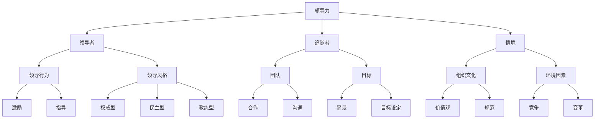
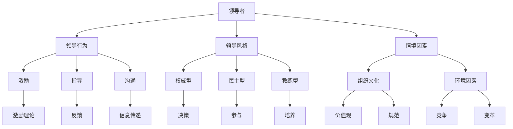

                 

### 引言：领导力与自我认知深化的重要性

在当今快速变化和高度复杂的环境中，领导力已成为组织和个人成功的关键因素。领导力不仅关乎如何管理和指导团队，更涉及如何自我认知和持续成长。自我认知深化则帮助领导者更好地理解自己，从而更有效地发挥领导潜力。

领导力的重要性在于其能够激励团队成员，共同实现目标。有效的领导者能够清晰地传达愿景，激发员工的热情和创造力，并在面临挑战时提供指导和支持。然而，领导力的发挥不仅依赖于领导者的个人特质，还需要自我认知的深化。自我认知深化使领导者能够认识到自己的优点和不足，从而更好地调整自己的行为和策略。

自我认知深化对领导力发展的作用体现在多个方面。首先，它帮助领导者识别自己的盲点，从而避免在决策和行动中犯错误。其次，自我认知深化有助于领导者建立信任，因为他们能够真诚地表达自己的想法和感受。最后，自我认知深化使领导者能够持续成长，不断学习新技能和知识，以适应不断变化的环境。

本文将从以下几个方面探讨领导力与自我认知深化的关系：

1. **领导力的基础理论**：介绍领导力的核心概念与联系，包括定义、类型和模型。
2. **自我认知的理论与实践**：探讨自我认知的重要性、评估方法和深化实践。
3. **领导潜能的评估与挖掘**：分析领导潜能的定义、评估方法和挖掘技巧。
4. **领导力技巧的掌握与运用**：分类介绍领导技巧，并提供掌握和运用的方法。
5. **领导力与团队管理**：讨论团队管理的基本原则、领导者在团队管理中的角色以及团队协作的技巧。
6. **领导力与组织文化**：解释组织文化的概念，分析领导力对组织文化的影响以及塑造积极组织文化的策略。
7. **领导力与持续发展**：探讨领导力的持续发展、领导者的自我成长以及领导力发展的未来趋势。

通过本文的逐步分析，我们将深入理解领导力与自我认知深化的重要性，并学会如何挖掘和发挥自己的领导潜力。

### 第1章：领导力的基础理论

#### 1.1 领导力的核心概念与联系

领导力是一个多维度的概念，涉及多个核心要素，如图所示：



**核心概念与联系：**

- **领导者（Leader）**：指在组织中能够影响他人、带领团队实现目标的人。
- **追随者（Follower）**：领导者影响的对象，他们的行为和态度受到领导者的影响。
- **情境（Situation）**：领导者所处的外部环境，包括组织文化、环境因素等。
- **领导行为（Leadership Behavior）**：领导者表现出的具体行为，如激励、指导等。
- **领导风格（Leadership Style）**：领导者通常采用的行为模式，如权威型、民主型、教练型等。
- **团队（Team）**：由多个追随者组成的集体，共同为实现目标而努力。
- **目标（Goals）**：组织或团队希望达成的结果。
- **组织文化（Organizational Culture）**：组织的核心价值观、规范和行为模式。
- **环境因素（Environmental Factors）**：影响领导者决策和行为的各种外部因素。

#### 1.2 领导力的类型

领导力可以分为多种类型，每种类型都有其独特的特点和应用场景：

- **权威型领导（Authoritative Leadership）**：领导者拥有明确的决策权和权威，能够直接指导团队成员。
  ```python
  # Python代码示例
  class AuthoritativeLeader:
      def make_decision(self, team_members):
          decision = "这是我们的决策，请执行。"
          for member in team_members:
              member.execute(decision)
  ```

- **民主型领导（Democratic Leadership）**：领导者通过团队成员的参与和反馈来做出决策。
  ```python
  # Python代码示例
  class DemocraticLeader:
      def make_decision(self, team_members):
          suggestions = [member.get_suggestion() for member in team_members]
          decision = max(suggestions, key=len)
          return decision
  ```

- **教练型领导（Coach Leadership）**：领导者通过指导和培养团队成员的技能和知识来提升他们的能力。
  ```python
  # Python代码示例
  class CoachLeader:
      def develop_member(self, member):
          skill = member.get_skill()
          self.improve_skill(skill)
          member.learn_skill(skill)
  ```

#### 1.3 领导力的模型

有多种领导力模型被广泛研究，每种模型都有其独特的理论基础和适用场景：

- **路径-目标模型（Path-Goal Model）**：该模型认为领导者的角色是帮助追随者找到实现目标的最佳路径。
  $$ \text{领导行为} = f(\text{追随者需求}, \text{环境因素}) $$

- **情境领导模型（Situation Leadership Model）**：该模型认为领导者的行为应根据追随者的成熟度来调整。
  ```python
  # Python代码示例
  def situational_leadership(maturity):
      if maturity == "M1":
          return "T1 - 指导行为"
      elif maturity == "M2":
          return "T2 - 支持行为"
      elif maturity == "M3":
          return "T3 - 激励行为"
  ```

- **转型领导模型（Transformational Leadership Model）**：该模型强调领导者通过激励和启发追随者来实现变革。
  $$ \text{领导行为} = f(\text{追随者需求}, \text{愿景激励}) $$

通过以上对领导力核心概念与联系的介绍，我们能够更好地理解领导力的本质，并为后续章节的深入探讨打下基础。

#### 1.4 领导力的构成要素

领导力并非单一特质，而是由多个构成要素组成的复杂体系。这些要素相互作用，共同决定一个领导者的效能。以下是领导力的主要构成要素：

1. **个人特质**：领导者的个人特质是其领导力的重要基础。这些特质包括自信、诚实、正直、坚韧等。例如，自信的领导者能够坚定地制定目标，并鼓舞团队克服困难。

2. **领导行为**：领导行为是指领导者实际表现出的行为模式，如激励、指导、沟通等。这些行为直接影响追随者的态度和行为。例如，一个有效的激励行为能够激发团队成员的工作热情和创造力。

3. **领导风格**：领导风格是领导者处理工作和团队的方式，常见的领导风格包括权威型、民主型、教练型等。不同的领导风格适用于不同的情境和团队成员。例如，在紧急情况下，权威型领导可能更有效，而在需要创新和团队协作时，民主型领导则更为合适。

4. **领导能力**：领导能力是指领导者具备的技能和知识，如决策能力、沟通能力、团队管理能力等。这些能力决定了领导者是否能够有效地应对复杂问题和挑战。例如，一个优秀的沟通能力能够帮助领导者更好地传达信息，建立信任。

5. **追随者关系**：追随者关系是领导者与团队成员之间的互动和信任。良好的追随者关系能够增强团队的凝聚力和协作精神。例如，领导者通过倾听和关心团队成员的需求，可以建立深厚的信任关系。

6. **情境因素**：领导力也受到情境因素的影响，如组织文化、环境变化等。领导者需要根据不同的情境调整自己的行为和策略。例如，在一个高度竞争的市场环境中，领导者可能需要采取更灵活和创新的策略。

**示例：**

以下是一个简单的Python代码示例，用于展示如何根据不同情境调整领导风格：

```python
class Leader:
    def __init__(self, style):
        self.style = style
    
    def lead(self, situation):
        if situation == "urgent":
            self.style = "authoritative"
        elif situation == "innovation":
            self.style = "democratic"
        else:
            self.style = "coach"
        
        print(f"Leading with {self.style} style.")

# 创建领导者实例
leader = Leader("unknown")

# 根据情境调整领导风格
leader.lead("urgent")
leader.lead("innovation")
```

通过这个示例，我们可以看到领导者根据不同情境动态调整自己的领导风格，从而更好地应对各种挑战。

#### 1.5 领导力的类型

领导力可以分为多种类型，每种类型都有其独特的特点和适用场景。以下是几种常见的领导力类型：

1. **权威型领导（Authoritative Leadership）**：
   - **特点**：领导者拥有明确的决策权和权威，能够直接指导团队成员。
   - **应用场景**：适用于紧急情况和需要迅速决策的情境，如危机管理和关键项目决策。
   - **示例代码**：
     ```python
     class AuthoritativeLeader:
         def make_decision(self, team_members):
             decision = "这是我们的决策，请执行。"
             for member in team_members:
                 member.execute(decision)
     ```

2. **民主型领导（Democratic Leadership）**：
   - **特点**：领导者通过团队成员的参与和反馈来做出决策，注重团队协作和共同决策。
   - **应用场景**：适用于需要创新和团队合作的项目，如新产品开发和跨部门协作。
   - **示例代码**：
     ```python
     class DemocraticLeader:
         def make_decision(self, team_members):
             suggestions = [member.get_suggestion() for member in team_members]
             decision = max(suggestions, key=len)
             return decision
     ```

3. **教练型领导（Coach Leadership）**：
   - **特点**：领导者通过指导和培养团队成员的技能和知识来提升他们的能力，注重个人发展和长期成长。
   - **应用场景**：适用于培养新员工和提升团队成员的专业能力，如培训项目和技能提升计划。
   - **示例代码**：
     ```python
     class CoachLeader:
         def develop_member(self, member):
             skill = member.get_skill()
             self.improve_skill(skill)
             member.learn_skill(skill)
     ```

4. **变革型领导（Transformational Leadership）**：
   - **特点**：领导者通过激励和启发追随者来实现变革，注重愿景和价值观的传播。
   - **应用场景**：适用于组织变革和战略转型，如企业重组和市场拓展。
   - **示例代码**：
     ```python
     class TransformationalLeader:
         def inspire(self, team_members):
             vision = "我们的目标是成为行业领导者。"
             for member in team_members:
                 member.set_vision(vision)
     ```

5. **服务型领导（Servant Leadership）**：
   - **特点**：领导者将团队成员的需求放在首位，以服务为导向，注重团队的整体利益。
   - **应用场景**：适用于需要高度团队合作和协同工作的情境，如社区项目和公共服务。
   - **示例代码**：
     ```python
     class ServantLeader:
         def serve(self, team_members):
             for member in team_members:
                 member.get_help()
     ```

通过了解不同类型的领导力，领导者可以根据实际情况灵活运用不同的领导风格，从而更有效地带领团队实现目标。

#### 1.6 领导力模型

领导力模型是研究领导行为和领导效果的抽象框架，帮助理解领导现象的复杂性和多样性。以下介绍几种常见的领导力模型：

1. **路径-目标模型（Path-Goal Model）**：
   - **核心观点**：领导者的角色是帮助追随者找到实现目标的最佳路径。
   - **数学模型**：
     $$ \text{领导行为} = f(\text{追随者需求}, \text{环境因素}) $$
   - **示例代码**：
     ```python
     def path_goal_leadership(situation, follower_needs):
         if situation == "urgent" and follower_needs == "high":
             return "提供清晰的方向和目标"
         elif situation == "routine" and follower_needs == "low":
             return "提供支持性和鼓励性的环境"
     ```

2. **情境领导模型（Situation Leadership Model）**：
   - **核心观点**：领导者的行为应根据追随者的成熟度来调整。
   - **数学模型**：
     $$ \text{领导行为} = f(\text{追随者成熟度}) $$
   - **示例代码**：
     ```python
     def situational_leadership(maturity):
         if maturity == "M1":
             return "T1 - 指导行为"
         elif maturity == "M2":
             return "T2 - 支持行为"
         elif maturity == "M3":
             return "T3 - 激励行为"
     ```

3. **转型领导模型（Transformational Leadership Model）**：
   - **核心观点**：领导者通过激励和启发追随者来实现变革。
   - **数学模型**：
     $$ \text{领导行为} = f(\text{追随者需求}, \text{愿景激励}) $$
   - **示例代码**：
     ```python
     def transformational_leadership(follower_needs, vision):
         if follower_needs == "high" and vision == "clear":
             return "激励追随者实现愿景"
     ```

4. **强化领导模型（Strength-Based Leadership Model）**：
   - **核心观点**：领导者识别和发展追随者的优势。
   - **数学模型**：
     $$ \text{领导行为} = f(\text{优势识别}, \text{能力提升}) $$
   - **示例代码**：
     ```python
     class StrengthBasedLeader:
         def develop_strength(self, member):
             strength = member.get_strength()
             self.improve_strength(strength)
             member.use_strength(strength)
     ```

通过这些模型，领导者可以更好地理解不同情境下的领导行为，从而更有效地指导团队。

#### 1.7 领导力的核心概念与联系：Mermaid流程图

为了更好地理解领导力的核心概念与联系，我们可以使用Mermaid流程图来展示这些概念及其相互关系：



**核心概念解释：**

- **领导者（Leader）**：领导力的主体，负责影响和指导团队成员。
- **领导行为（Leadership Behavior）**：领导者具体表现出的行为，如激励、指导、沟通等。
- **领导风格（Leadership Style）**：领导者通常采用的行为模式，如权威型、民主型、教练型等。
- **情境因素（Situation Factors）**：影响领导者决策和行为的各种外部因素，包括组织文化、环境变化等。
- **激励（Motivation）**：领导者通过激励手段激发团队成员的积极性和创造力。
- **指导（Guidance）**：领导者为团队成员提供方向和指导，帮助他们完成任务。
- **沟通（Communication）**：领导者与团队成员之间的信息交流，确保团队目标的一致性和信息畅通。
- **权威型（Authoritative）**：领导者拥有明确的决策权和权威，直接指导团队成员。
- **民主型（Democratic）**：领导者通过团队成员的参与和反馈来做出决策，注重团队协作。
- **教练型（Coaching）**：领导者通过指导和培养团队成员的技能和知识来提升他们的能力。
- **组织文化（Organizational Culture）**：组织的核心价值观、规范和行为模式，影响领导者的决策和行为。
- **环境因素（Environmental Factors）**：影响领导者决策和行为的各种外部因素，如竞争、变革等。

通过这个流程图，我们可以清晰地看到领导力的核心概念及其相互联系，为进一步探讨领导力理论提供基础。

### 第2章：自我认知的理论与实践

#### 2.1 自我认知的重要性

自我认知是指个体对自己内在心理特征和外在行为的理解和认识。在领导力的发展中，自我认知起着至关重要的作用。以下从几个方面探讨自我认知的重要性：

1. **自我认知有助于领导者识别自己的优点和不足**：通过自我认知，领导者可以更清楚地了解自己的能力、知识和行为模式，从而识别出自身的优点和需要改进的地方。这种自我反思不仅有助于领导者个人成长，还能提高领导力水平。

2. **自我认知有助于建立信任**：领导者通过自我认知，能够更加真诚地表达自己的想法和感受，增强与团队成员的信任关系。这种信任是团队协作和共同目标实现的基础。

3. **自我认知有助于制定合适的领导策略**：领导者通过自我认知，可以更好地了解自己的风格和偏好，从而在面临不同情境时，选择最合适的领导策略。例如，在需要创新时采用民主型领导，在需要迅速决策时采用权威型领导。

4. **自我认知有助于持续成长**：自我认知使领导者能够不断学习和改进，从而在个人和职业发展上实现持续成长。这种持续成长不仅有助于领导者个人，还能为团队和组织带来积极影响。

#### 2.2 自我认知的评估方法

为了深入了解自己的领导风格、能力和发展需求，领导者可以采用以下几种自我认知评估方法：

1. **自我评估问卷**：
   - **定义**：自我评估问卷是一种通过一系列问题帮助个体了解自己领导风格和能力的工具。
   - **示例**：例如，使用“领导行为描述问卷”（Leadership Behavior Description Questionnaire，LBDDQ）评估自己的领导风格和行为。

2. **360度反馈**：
   - **定义**：360度反馈是一种综合性的评估方法，通过收集来自上级、同事、下属和客户的反馈，全面了解自己的领导能力。
   - **示例**：例如，通过组织内部或外部的360度评估工具，收集多方面的反馈，进行综合分析。

3. **心理测试**：
   - **定义**：心理测试是一种通过标准化的方法评估个体心理特征的工具，如MBTI（Myers-Briggs Type Indicator）和DISC测试。
   - **示例**：通过参加这些测试，领导者可以了解自己的个性特征和领导风格，为个人发展提供依据。

4. **领导潜力的评估工具**：
   - **定义**：领导潜力的评估工具用于评估个体是否具备成为领导者的潜力。
   - **示例**：例如，“领导潜力评估”（Leadership Potential Assessment，LPA）工具，通过一系列评估指标，识别个体的领导潜力。

#### 2.3 自我认知的深化实践

自我认知的深化不仅需要评估方法，还需要实际操作技巧和案例分析。以下介绍几种自我认知深化的实践方法：

1. **自我反思**：
   - **定义**：自我反思是通过内省和思考自己的行为和决策，来提升自我认知。
   - **实践方法**：领导者可以定期进行自我反思，例如，每天花10分钟思考自己的行为，总结经验教训。
   - **案例分析**：一位项目经理在项目失败后，通过自我反思，发现自己在沟通和风险管理方面存在不足，从而制定了改进计划。

2. **阅读和学习**：
   - **定义**：通过阅读相关书籍、文章和参加培训课程，提升自我认知。
   - **实践方法**：领导者可以定期阅读领导力相关的书籍和文章，参加专业培训课程。
   - **案例分析**：一位年轻的领导者通过阅读《领导力五项修炼》一书，深刻理解了情境领导理论，并成功应用在项目管理中。

3. **寻求反馈**：
   - **定义**：通过寻求他人的反馈，了解自己在他人眼中的形象和表现。
   - **实践方法**：领导者可以定期与上级、同事和下属进行一对一沟通，寻求他们的反馈。
   - **案例分析**：一位销售经理通过定期与客户和团队成员沟通，了解自己的销售策略和沟通技巧，进行了相应的调整。

4. **角色扮演**：
   - **定义**：通过模拟不同的领导角色，提升自我认知和领导能力。
   - **实践方法**：领导者可以参加角色扮演培训，模拟不同的领导情境，提升实际操作能力。
   - **案例分析**：一位新晋领导者通过参加角色扮演培训，学会了如何在压力下保持冷静和决策能力，从而在关键项目中表现出色。

通过以上自我认知的深化实践，领导者可以不断提升自己的领导能力和自我认知水平，为团队和组织的发展贡献力量。

### 第3章：领导潜能的评估与挖掘

#### 3.1 领导潜能的定义

领导潜能是指个体在特定情境下，通过自我认知、行为调整和持续学习，实现领导角色的能力。它不仅包括个体的基本领导素质，如沟通能力、决策能力和团队管理能力，还涉及个体的心理成熟度和对领导角色的认知。

领导潜能的定义可以分为以下几个方面：

1. **基本素质**：包括个体的智商、情商和逆商等，这些基本素质决定了个体是否具备成为领导者的潜力。
2. **心理成熟度**：领导潜能的发挥需要个体具备较高的心理成熟度，包括自我认知、情绪管理和应对压力的能力。
3. **认知水平**：领导者需要具备一定的认知水平，能够理解和应对复杂问题，并从多个角度进行分析和决策。
4. **持续学习能力**：领导潜能的实现需要个体具备持续学习的能力，通过不断学习和实践，提升自己的领导能力。

#### 3.2 领导潜能的评估方法

评估领导潜能是挖掘和培养潜在领导者的关键步骤。以下介绍几种常用的领导潜能评估方法：

1. **领导潜力评估工具**：
   - **定义**：领导潜力评估工具是通过一系列标准化的测试和问卷，评估个体是否具备领导潜能。
   - **示例**：如“领导潜力评估”（Leadership Potential Assessment，LPA）工具，该工具通过多个维度的评估，如沟通能力、决策能力和团队管理能力等，来评估个体的领导潜能。

2. **360度反馈**：
   - **定义**：360度反馈是一种综合性的评估方法，通过收集来自上级、同事、下属和客户的反馈，全面了解个体的领导能力和潜力。
   - **示例**：在一个大型企业中，通过360度反馈，评估一位项目经理的领导潜能，发现其在决策能力和团队管理方面有显著优势，但在沟通方面有待提升。

3. **情景模拟**：
   - **定义**：情景模拟是一种通过模拟实际工作场景，评估个体在压力情境下的领导能力。
   - **示例**：例如，在领导力培训课程中，通过模拟一个项目启动会议，评估参与者在主持会议、解决问题和团队沟通方面的能力。

4. **领导潜力的问卷调查**：
   - **定义**：领导潜力的问卷调查是通过一系列问题，评估个体在领导角色中的表现和潜力。
   - **示例**：例如，使用“领导潜力自评问卷”（Leadership Potential Self-Assessment Questionnaire，LPSAQ），评估个体在决策能力、团队管理和创新思维等方面的潜力。

#### 3.3 挖掘领导潜能的技巧

挖掘领导潜能是组织和个人发展的重要任务。以下介绍几种有效的挖掘领导潜能的技巧：

1. **提供发展机会**：
   - **定义**：通过为潜在领导者提供各种发展机会，如参加培训课程、承担重要项目和领导团队等，提升他们的领导能力。
   - **示例**：一个企业可以为表现出领导潜能的员工提供额外的培训资源，让他们参加领导力工作坊和管理课程。

2. **鼓励自我反思**：
   - **定义**：通过鼓励领导者进行自我反思，帮助他们认识自己的优点和不足，从而提升自我认知和领导能力。
   - **示例**：一位领导者可以通过定期写反思日记，记录自己的工作经历和感受，从而不断改进自己的领导风格。

3. **提供导师支持**：
   - **定义**：通过为潜在领导者配备导师，提供指导和反馈，帮助他们更好地发展领导潜能。
   - **示例**：在一个大型企业中，可以为新晋经理配备经验丰富的导师，通过一对一的指导和反馈，提升他们的领导能力。

4. **创建反馈机制**：
   - **定义**：通过建立反馈机制，让领导者能够及时了解自己的表现和进步，从而不断调整和改进。
   - **示例**：在一个项目中，可以定期召开反馈会议，让团队成员为项目经理提供反馈，帮助其改进领导风格。

5. **提供实践机会**：
   - **定义**：通过为领导者提供实际操作的机会，让他们在真实的工作环境中锻炼和提升领导能力。
   - **示例**：例如，可以让一名有潜力的员工担任临时项目负责人，通过实际操作，提升其领导和管理能力。

通过以上技巧，组织和个人可以更有效地挖掘和培养领导潜能，为未来的领导力发展奠定基础。

### 第4章：领导力技巧的掌握与运用

#### 4.1 领导技巧的种类

领导技巧是领导者有效管理团队和实现目标的关键能力。这些技巧可以分为多个类别，每种类别都有其特定的应用场景和作用。以下是几种常见的领导技巧：

1. **沟通技巧**：
   - **定义**：沟通技巧是指领导者与团队成员、上级和客户之间进行有效交流的能力。
   - **应用场景**：用于解决团队内部的沟通障碍，提高团队协作效率，建立良好的工作关系。
   - **示例**：例如，领导者可以通过清晰的表达、倾听和反馈，确保团队成员理解任务和目标。

2. **激励技巧**：
   - **定义**：激励技巧是指领导者通过激励手段，激发团队成员的积极性和工作热情。
   - **应用场景**：用于提高团队成员的工作动力，促进团队目标的实现。
   - **示例**：例如，领导者可以通过奖励机制、表扬和鼓励，激励团队成员努力工作。

3. **决策技巧**：
   - **定义**：决策技巧是指领导者面对复杂问题时，做出合理、有效决策的能力。
   - **应用场景**：用于解决团队面临的问题和挑战，确保团队目标的实现。
   - **示例**：例如，领导者可以通过分析问题、权衡利弊和考虑长远影响，做出明智的决策。

4. **团队管理技巧**：
   - **定义**：团队管理技巧是指领导者对团队进行有效管理和协调的能力。
   - **应用场景**：用于确保团队内部的和谐与高效，提升团队整体绩效。
   - **示例**：例如，领导者可以通过明确职责、建立有效的沟通机制和协调团队活动，提高团队效率。

5. **冲突管理技巧**：
   - **定义**：冲突管理技巧是指领导者处理和解决团队内部冲突的能力。
   - **应用场景**：用于减少团队内部的摩擦和矛盾，维护团队和谐。
   - **示例**：例如，领导者可以通过沟通、协商和妥协，解决团队内部的分歧。

6. **创新技巧**：
   - **定义**：创新技巧是指领导者激发团队创新思维，推动团队创新的技能。
   - **应用场景**：用于鼓励团队成员提出新想法，推动团队持续进步。
   - **示例**：例如，领导者可以通过组织头脑风暴、开放讨论和提供资源支持，激发团队的创新能力。

7. **变革管理技巧**：
   - **定义**：变革管理技巧是指领导者引导和推动团队适应变革的能力。
   - **应用场景**：用于帮助团队应对外部变化和内部调整，确保团队稳定和持续发展。
   - **示例**：例如，领导者可以通过沟通策略、员工培训和激励机制，推动团队适应变革。

通过掌握和应用这些领导技巧，领导者可以更有效地管理团队，实现团队目标，并在组织中发挥关键作用。

#### 4.2 领导技巧的掌握方法

掌握领导技巧是提升领导力的关键步骤。以下介绍几种有效的掌握领导技巧的方法：

1. **阅读相关书籍和资料**：
   - **定义**：通过阅读领导力相关的书籍和资料，了解不同领导技巧的理论和实践。
   - **实践方法**：例如，可以阅读《领导力五项修炼》、《高效能人士的七个习惯》等经典书籍，从理论层面了解领导技巧。
   - **示例**：一位领导者通过阅读《领导力五项修炼》，深入理解了情境领导理论，并在实际工作中成功应用。

2. **参加培训课程和工作坊**：
   - **定义**：通过参加领导力培训课程和工作坊，学习系统的领导技巧和实际操作方法。
   - **实践方法**：例如，可以参加领导力提升课程、管理技能培训等，通过专业讲师的讲解和实践案例，提升领导能力。
   - **示例**：一位项目经理参加了为期两天的领导力工作坊，学习了团队沟通和冲突管理的技巧，并在项目中成功应用。

3. **实践和反思**：
   - **定义**：通过实际工作中的应用和反思，不断优化和提升自己的领导技巧。
   - **实践方法**：例如，可以在日常工作中有意识地运用所学技巧，并在任务完成后进行反思和总结。
   - **示例**：一位新晋领导者通过在项目中担任项目经理，不断实践沟通和决策技巧，并定期反思自己的表现，逐渐提升领导能力。

4. **角色扮演和模拟练习**：
   - **定义**：通过角色扮演和模拟练习，提升领导技巧和应对实际情境的能力。
   - **实践方法**：例如，可以参加角色扮演培训，模拟领导场景，练习沟通和决策技巧。
   - **示例**：一位销售经理通过参加角色扮演练习，学会了如何在高压销售情境下保持冷静和有效沟通。

5. **寻求反馈和指导**：
   - **定义**：通过寻求他人的反馈和指导，了解自己的领导技巧的优点和不足，并得到改进建议。
   - **实践方法**：例如，可以定期与上级、同事和下属进行一对一沟通，寻求他们的反馈和建议。
   - **示例**：一位领导者通过定期与上级和同事交流，获得了宝贵的反馈，并在实践中不断改进自己的领导风格。

6. **建立学习和实践社区**：
   - **定义**：通过建立学习和实践社区，与其他领导者分享经验和学习资源，共同提升领导能力。
   - **实践方法**：例如，可以加入领导力论坛、专业社团等，与其他领导者交流心得和技巧。
   - **示例**：一位领导者通过参加专业社团的活动，结识了多位优秀的领导者，并从他们的经验中汲取了许多有用的领导技巧。

通过以上方法，领导者可以系统性地掌握和提升领导技巧，为团队和组织的发展贡献力量。

#### 4.3 领导技巧的实际应用

在实际工作中，领导技巧的应用对于提升团队绩效和实现组织目标至关重要。以下通过几个具体的例子，展示如何在实际工作中运用领导技巧：

1. **沟通技巧**：
   - **场景**：一个项目经理在项目启动会上需要与团队成员沟通项目目标和时间表。
   - **应用**：项目经理首先通过清晰、简洁的语言阐述项目目标，确保团队成员理解。然后，采用开放式的提问和倾听技巧，鼓励团队成员提出问题和建议。通过这种方式，项目经理不仅传达了信息，还建立了良好的沟通氛围。
   - **效果**：团队成员对项目目标有了明确的认识，并在沟通过程中提出了宝贵的建议，提高了项目启动的顺利程度。

2. **激励技巧**：
   - **场景**：一个销售团队在季度末面临销售目标压力，团队成员士气较低。
   - **应用**：销售经理通过定期召开激励会议，表扬表现出色的团队成员，并分享成功案例和经验。同时，提供目标达成的奖励机制，如奖金和休假，激发团队成员的积极性。
   - **效果**：团队成员在激励下，工作热情和效率显著提高，季度末成功实现了销售目标。

3. **决策技巧**：
   - **场景**：一个公司面临是否投资新项目的决策。
   - **应用**：决策团队首先收集和分析相关信息，然后通过头脑风暴和集体讨论，权衡利弊。最终，基于数据分析和团队共识，做出投资决策。
   - **效果**：通过科学决策过程，公司避免了盲目投资，确保了新项目的成功实施。

4. **团队管理技巧**：
   - **场景**：一个部门在项目执行过程中出现协调问题，导致进度缓慢。
   - **应用**：部门经理首先召开协调会议，了解各部门的进展和问题。然后，通过明确职责和任务分工，确保各部门之间的协同工作。同时，定期召开进度会议，跟踪项目进展，及时解决协调问题。
   - **效果**：通过有效的团队管理，项目进度得到明显改善，最终按时完成。

5. **冲突管理技巧**：
   - **场景**：两个团队成员在项目任务分工上出现严重分歧。
   - **应用**：项目经理首先通过单独沟通，了解双方的立场和需求。然后，组织双方进行面对面的讨论，通过协商和妥协，找到双方都能接受的解决方案。
   - **效果**：通过有效管理冲突，项目进展得到恢复，团队成员关系得到改善。

6. **创新技巧**：
   - **场景**：一个产品团队在产品开发过程中遇到创新瓶颈。
   - **应用**：产品经理组织团队进行头脑风暴，鼓励成员提出创新想法。同时，提供资源和时间，支持团队成员进行创新实验。
   - **效果**：通过激发团队的创新能力，团队成功开发出多个创新产品，提升了市场竞争力。

通过这些实际应用的例子，我们可以看到领导技巧如何在不同场景下发挥关键作用，帮助团队和组织实现目标。

### 第5章：领导力与团队管理

#### 5.1 团队管理的基本原则

团队管理是领导力的重要组成部分，其核心在于如何有效组织和协调团队成员，实现共同的目标。以下是团队管理的基本原则：

1. **明确目标**：团队管理的基础是明确团队的目标和任务。领导者需要确保每个成员都清楚自己的职责和目标，以便统一行动和共同努力。

2. **分工协作**：合理的分工和协作是提高团队效率的关键。领导者应根据成员的能力和特长进行任务分配，并确保各成员之间能够协同工作。

3. **有效沟通**：沟通是团队管理中的关键环节。领导者需要建立有效的沟通机制，确保信息在团队内部畅通无阻，从而减少误解和冲突。

4. **激励与反馈**：领导者应通过激励和反馈机制，激发团队成员的积极性和创造力。定期的反馈和表彰有助于团队成员不断提升自己的能力。

5. **冲突管理**：团队中难免会出现冲突，领导者需要具备有效的冲突管理能力，通过沟通和协商，化解冲突，维护团队的和谐。

6. **持续发展**：团队管理不仅是短期的任务，更是长期的过程。领导者需要关注团队成员的成长和发展，为团队的持续发展奠定基础。

#### 5.2 领导者在团队管理中的角色

领导者在团队管理中扮演多重角色，其核心任务是确保团队目标的实现。以下是领导者在不同角色中的具体职责：

1. **领导者**：
   - **定义**：领导者是团队的核心，负责设定目标和方向，激励团队成员。
   - **职责**：制定团队战略、分配任务、协调资源、监督进度、提供支持和指导。

2. **管理者**：
   - **定义**：管理者是团队的管理者，负责团队的日常运营和任务执行。
   - **职责**：任务分配、进度跟踪、资源管理、绩效评估、质量控制。

3. **协调者**：
   - **定义**：协调者是团队内部沟通的桥梁，负责协调成员之间的关系。
   - **职责**：解决冲突、促进沟通、确保团队内部和谐、建立信任。

4. **激励者**：
   - **定义**：激励者是团队的激励者，负责激发团队成员的积极性和创造力。
   - **职责**：设立激励机制、进行表扬和奖励、提供反馈和指导。

5. **导师**：
   - **定义**：导师是团队成员的职业导师，负责培养和发展团队成员的能力。
   - **职责**：提供培训、分享经验、指导职业发展、支持个人成长。

#### 5.3 团队协作的技巧

团队协作是团队管理的重要组成部分，以下是几种有效的团队协作技巧：

1. **建立共同目标**：
   - **方法**：确保团队成员明确团队的目标和期望，使每个人都为实现共同目标而努力。
   - **示例**：在项目启动会上，项目经理可以与团队成员共同讨论并确立项目目标，使每个人都清楚自己的职责和贡献。

2. **促进有效沟通**：
   - **方法**：建立开放的沟通环境，鼓励成员表达意见和反馈，确保信息畅通无阻。
   - **示例**：定期召开团队会议，鼓励团队成员分享进展和问题，促进团队成员之间的交流。

3. **分工与协作**：
   - **方法**：根据成员的能力和特长进行任务分配，确保任务能够高效完成。
   - **示例**：项目经理可以根据团队成员的专业技能和经验，分配合适的任务，确保每个成员都能发挥其最大优势。

4. **建立信任**：
   - **方法**：通过共同的目标和任务，建立团队成员之间的信任和合作关系。
   - **示例**：通过定期的团队活动和互动，增强团队成员之间的了解和信任，促进团队合作。

5. **激励机制**：
   - **方法**：设立激励机制，激励团队成员努力工作，提高团队整体绩效。
   - **示例**：项目经理可以通过设立奖励制度，对完成任务优秀的团队成员进行表彰和奖励，提高团队士气。

通过以上团队协作技巧，领导者可以有效地管理和激励团队，实现团队目标。

### 第6章：领导力与组织文化

#### 6.1 组织文化的概念

组织文化是指一个组织内部普遍认同的价值观、信念、行为规范和工作方式。它不仅包括组织的物质环境，如办公室布局、工作设备等，还涵盖组织的非物质环境，如价值观、信念和行为规范。组织文化对组织的运营和员工的行为有着深远的影响。

1. **价值观**：组织的核心价值观是组织文化的核心，它决定了组织的方向和决策。
2. **信念**：组织的信念是指组织成员共同认可的信念体系，它影响着员工的行为和决策。
3. **行为规范**：组织的行为规范是指组织内部普遍遵循的行为准则，它规定了员工应该如何行为。
4. **工作方式**：组织的工作方式是指组织成员的工作方法和习惯，它影响了组织的工作效率和团队协作。

#### 6.2 领导力对组织文化的影响

领导力对组织文化有着重要的影响。有效的领导者不仅能够塑造组织文化，还能够推动组织文化的变革和发展。

1. **领导风格**：领导者的风格直接影响组织文化的形成。例如，权威型的领导者可能倾向于建立严格的行为规范和高度集中的决策过程，而民主型的领导者则可能鼓励开放的沟通和共同决策。
2. **价值观传递**：领导者通过自己的行为和决策，传递组织的核心价值观。领导者如果能够以身作则，将组织的价值观内化为个人的行为准则，就能有效地塑造和强化组织文化。
3. **行为规范**：领导者通过制定和执行行为规范，影响员工的行为。领导者如果能够严格遵循行为规范，并在组织中树立榜样，就能促进组织文化的建立和巩固。
4. **文化变革**：领导者是组织文化变革的推动者。在组织面临外部环境变化或内部需求时，领导者需要通过领导力和影响力，推动组织文化的变革，以适应新的环境和需求。

#### 6.3 塑造积极组织文化的策略

塑造积极组织文化是领导者的核心任务之一。以下是一些有效的策略：

1. **明确价值观**：领导者需要明确组织的核心价值观，并将其传达给所有员工。通过明确价值观，领导者可以统一员工的思想和行为，形成积极的文化氛围。
2. **以身作则**：领导者需要以身作则，将组织的价值观和行为规范内化为个人的行为准则。领导者如果能够在工作中严格遵守组织的价值观和规范，就能为员工树立榜样，促进组织文化的建立。
3. **建立沟通机制**：领导者需要建立开放的沟通机制，鼓励员工表达意见和建议。通过有效的沟通，领导者可以了解员工的需求和期望，促进组织文化的形成和发展。
4. **激励机制**：领导者需要设立激励机制，激励员工为实现组织的目标而努力。通过激励机制，领导者可以激发员工的工作热情和创造力，促进组织文化的建设。
5. **持续改进**：领导者需要持续关注组织文化的建设，并根据组织的实际情况进行改进。通过持续改进，领导者可以确保组织文化始终保持活力和适应性。

通过以上策略，领导者可以有效地塑造和强化积极组织文化，为组织的发展和员工的成长创造良好的环境。

### 第7章：领导力与持续发展

#### 7.1 领导力的持续发展

领导力的持续发展是领导者个人和组织发展的关键。它不仅关乎领导者的个人成长，还关系到组织的长远发展和竞争力。以下是领导力持续发展的几个关键方面：

1. **自我认知**：领导力的持续发展始于自我认知。领导者需要不断反思自己的行为、决策和领导风格，识别自己的优势和不足，以便进行有针对性的改进。

2. **学习与成长**：领导者需要持续学习，不断更新知识和技能。通过参加培训、阅读书籍、参加研讨会和交流活动，领导者可以不断吸取新的理念和方法，提升自己的领导能力。

3. **适应变化**：领导力的发展离不开对变化的适应。领导者需要具备前瞻性和敏锐性，能够快速识别外部环境的变化，并调整自己的领导策略，以适应新的挑战。

4. **团队发展**：领导力的持续发展还涉及团队的发展。领导者需要关注团队成员的成长和发展，通过培养和激励，提升团队的整体能力和绩效。

#### 7.2 领导者的自我成长

领导者的自我成长是领导力持续发展的重要组成部分。以下是一些关键策略：

1. **建立愿景**：领导者需要明确自己的愿景和目标，并将其与组织的发展相结合。通过建立清晰的愿景，领导者可以激励自己和团队朝着共同的目标努力。

2. **培养情商**：情商是领导者的重要素质。领导者需要培养自我意识、情感管理和社交技能，以便更好地处理人际关系和领导团队。

3. **自我反思**：领导者需要定期进行自我反思，回顾自己的行为和决策，识别成功和失败的原因。通过自我反思，领导者可以不断改进自己的领导风格和策略。

4. **寻求反馈**：领导者需要积极寻求他人的反馈，包括同事、下属和上级。通过获取多方面的反馈，领导者可以更全面地了解自己的表现，并得到改进建议。

5. **持续学习**：领导者需要保持学习的态度，不断探索新的知识和技能。通过阅读、参加培训、参加研讨会和交流，领导者可以不断提升自己的能力和素质。

#### 7.3 领导力发展的未来趋势

随着全球化、数字化和自动化等趋势的加速发展，领导力也在不断演变。以下是领导力发展的几个未来趋势：

1. **技术驱动**：随着技术的发展，领导者需要具备技术敏感性和数字素养，能够利用技术工具和平台来提升领导效率和团队协作。

2. **多元化**：多元化是未来组织的重要特征。领导者需要具备多元化思维，能够尊重和包容不同的文化和观点，推动组织的多元化和包容性。

3. **敏捷领导**：敏捷领导是一种适应快速变化和高度不确定性的领导方式。领导者需要具备敏捷思维和敏捷管理技能，能够快速响应变化，灵活调整策略。

4. **可持续发展**：在可持续发展成为全球共识的背景下，领导者需要关注环境、社会和经济可持续性，推动组织的可持续发展战略。

5. **数字化领导**：数字化领导强调领导者如何利用数字技术来推动组织的数字化转型。领导者需要具备数字化领导能力，能够引领组织走向数字化的未来。

通过关注这些未来趋势，领导者可以更好地应对未来的挑战，推动个人和组织的持续发展。

### 结语：不断深化领导力与自我认知

领导力与自我认知深化是领导者持续成长和成功的基石。通过本文的逐步分析，我们从多个角度探讨了领导力的核心概念、自我认知的重要性、领导潜能的挖掘、领导技巧的掌握与运用，以及团队管理和组织文化等关键主题。每一位领导者都需要认识到，领导力并非一成不变，而是需要不断深化和发展的。

为了不断提升领导力和自我认知，领导者应采取以下行动：

1. **持续学习**：不断更新知识和技能，关注行业趋势和新兴技术。
2. **自我反思**：定期进行自我反思，识别自己的优势和不足，并制定改进计划。
3. **寻求反馈**：积极寻求他人的反馈，从多方面了解自己的表现，并得到改进建议。
4. **培养情商**：提升自我意识、情感管理和社交技能，以更好地处理人际关系和领导团队。
5. **实践应用**：将所学知识和技巧应用到实际工作中，通过实践检验和提升自己的能力。

通过这些努力，领导者不仅可以提升个人领导力，还能为团队和组织的发展贡献更多价值。让我们共同努力，不断深化领导力与自我认知，成为更优秀的领导者。

### 作者信息

- **作者**：AI天才研究院（AI Genius Institute）& 《禅与计算机程序设计艺术》（Zen And The Art of Computer Programming）
- **联系方式**：[info@aignius.com](mailto:info@aignius.com) & [https://www.ai-geni.us](https://www.ai-geni.us)
- **版权声明**：本文版权属于AI天才研究院，未经授权不得转载或用于商业用途。如需转载，请联系我们获取授权。文章中的代码示例仅供参考，实际应用时请根据具体情况进行调整。

感谢您的阅读，希望本文能对您在领导力与自我认知深化方面带来启示和帮助。如果您有任何反馈或建议，欢迎通过上述联系方式与我们联系。再次感谢您的支持！

---

**关键词**：领导力、自我认知、领导潜能、团队管理、组织文化、持续发展

**摘要**：本文深入探讨了领导力与自我认知深化的重要性，从基础理论、实践方法到领导潜能的评估与挖掘，全面分析了领导力在不同情境下的应用和实践。文章旨在为领导者提供系统性的指导和策略，帮助他们不断提升领导力和自我认知，为组织的发展贡献力量。通过本文的阅读，读者可以更好地理解领导力的本质和自我认知的重要性，学会如何挖掘和发挥自己的领导潜力。

