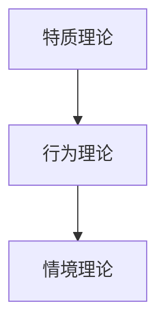
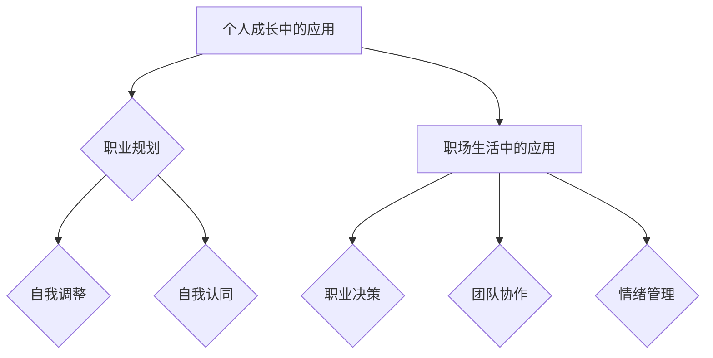
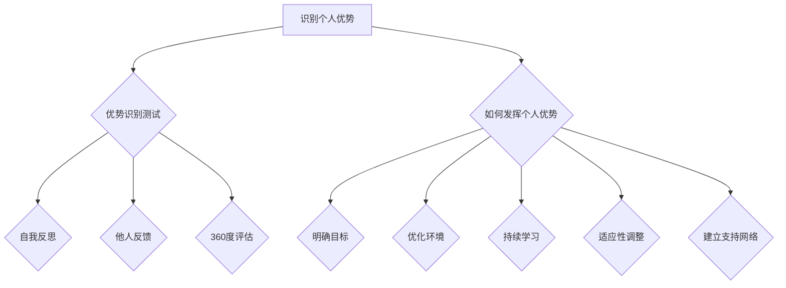
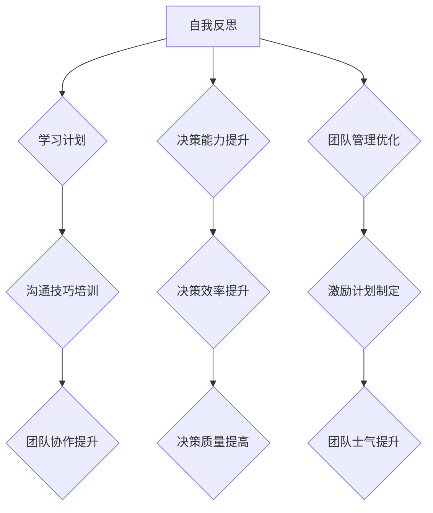
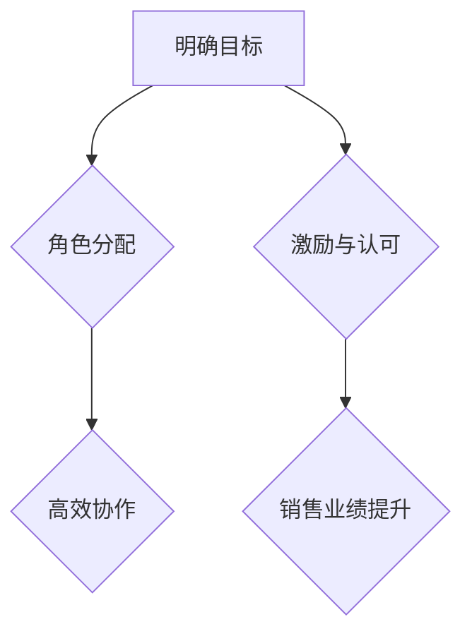

                 

# 《领导力与自我认知：了解并发挥个人优势》

> 关键词：领导力、自我认知、个人优势、团队管理、提升策略

> 摘要：本文深入探讨了领导力与自我认知之间的关系，强调了了解并发挥个人优势在提升领导力中的关键作用。通过阐述领导力的基本概念、自我认知的重要性以及个人优势识别与发挥的方法，本文为读者提供了一系列实用的领导力提升策略，并结合实际案例进行详细分析，旨在帮助读者在实际工作中更好地运用个人优势，提升领导力和团队管理水平。

## 引言

在当今快速发展的社会中，领导力已成为企业、团队和个人成功的重要因素。然而，领导力并非一成不变，它需要通过不断地自我认知和优势发挥来提升。本文将围绕“领导力与自我认知：了解并发挥个人优势”这一主题，从多个维度探讨领导力的发展与提升策略。

首先，我们将介绍领导力的基本概念与理论，探讨领导力与自我认知之间的关系。接着，我们将详细讲解自我认知的重要性，包括自我认知的概念、理论及其在个人成长和职场中的应用。在此基础上，本文将重点讨论如何识别与发挥个人优势，为提升领导力提供具体的方法和策略。

随后，我们将探讨领导力提升策略，结合实际案例进行分析，展示如何基于自我认知来提升领导力。最后，本文将结合团队管理，讨论领导力在团队管理中的应用，以及如何将个人优势融入团队管理中，以提升整体团队效能。

通过本文的阅读，读者将能够系统地了解领导力与自我认知之间的关系，掌握识别与发挥个人优势的方法，并学会将个人优势应用于实际工作中，以提升领导力和团队管理水平。

## 领导力的基本概念与理论

### 领导力的定义与历史演变

领导力是一个广泛且多层次的概念，不同学者对其定义有着不同的理解。从广义上讲，领导力是指一个人在团队、组织或社会中的影响力，以及引导、激励和协调他人达成共同目标的能力。领导力不仅仅是职位赋予的权力，更是一种个人素质和技能。

历史演变方面，领导力的概念经历了多个阶段。在早期，领导力主要被视为一种神秘的天赋，只有少数人具备。随着社会的发展和科学研究的深入，领导力逐渐被看作是一种可以通过学习和实践提升的能力。现代领导力理论强调领导者的责任、影响力、决策能力和领导风格等要素。

### 领导力与自我认知的关系

自我认知是指个体对自己行为、情感、思想以及与他人的关系的理解和评价。自我认知在领导力中扮演着至关重要的角色，因为领导者的自我认知直接影响其领导风格、决策和行为。

首先，自我认知有助于领导者理解自己的优势和劣势，从而更好地发挥个人潜力。一个具备良好自我认知的领导者能够准确地评估自己的能力，避免因自负或自卑而导致的决策失误。

其次，自我认知有助于建立领导者与团队成员之间的信任。当领导者能够真诚地表达自己的情感和观点时，团队成员更愿意接受和信任他们，从而提高团队的凝聚力和协作效率。

最后，自我认知有助于领导者识别和应对压力。在面临挑战和困难时，具备良好自我认知的领导者能够更好地调整自己的心态和策略，以应对各种情况。

### 领导力理论的发展

领导力理论的发展经历了多个阶段。最早的是特质理论，该理论认为领导者具有一系列独特的特质，如智慧、自信、决策能力等。然而，特质理论在解释领导力时存在一定的局限性，因为许多不具备这些特质的人也能成为成功的领导者。

随着研究的深入，行为理论逐渐兴起。行为理论关注领导者的行为模式，认为领导力不仅取决于个人特质，还取决于领导者如何与他人互动。领导者的行为可以分为任务导向和关系导向两种类型，不同的领导行为适用于不同的情境。

近年来，情境理论成为领导力研究的热点。情境理论认为领导力不是一成不变的，而是随着环境和情境的变化而变化。领导者需要根据具体情况调整自己的领导风格和行为，以达到最佳效果。

### Mermaid 流程图

以下是一个简单的 Mermaid 流程图，展示了领导力理论的发展历程：



通过这个流程图，我们可以清晰地看到领导力理论从特质理论到行为理论，再到情境理论的发展过程。

## 自我认知的重要性

### 自我认知的概念与理论

自我认知是指个体对自己行为、情感、思想以及与他人的关系的理解和评价。自我认知包括自我感知、自我反思和自我评价三个主要方面。自我感知是指个体对自己存在的认识和感知，包括自己的外貌、性格、能力等；自我反思是指个体对自己的行为和决策进行深入思考，以了解自己的思维模式和行为习惯；自我评价是指个体根据自己的表现和反馈，对自己的能力和价值进行评估。

自我认知的理论基础主要包括以下几个部分：

1. **心理学视角**：心理学研究认为，自我认知是个体心理发展的核心部分，对个体的情感、行为和认知都有重要影响。自我认知不仅影响个体的自我效能感，还影响其自尊、自信等心理素质。

2. **社会学视角**：社会学研究强调，自我认知是个体在社会互动中形成的，通过与他人交往和比较，个体逐渐形成对自己的认识。自我认知不仅影响个体在社会中的角色扮演，还影响其社会地位和人际关系。

3. **哲学视角**：哲学研究认为，自我认知是个体对自身存在和本质的思考，是认识和理解世界的基础。自我认知不仅影响个体的自我认同，还影响其价值观和人生观。

### 自我认知在个人成长中的意义

自我认知在个人成长中具有重要意义。首先，自我认知有助于个体更好地认识自己的优点和缺点，从而制定出更合理的目标和计划。一个具备良好自我认知的个体能够准确地评估自己的能力和潜力，从而设定符合自身实际的目标，避免盲目追求和过度焦虑。

其次，自我认知有助于个体在成长过程中进行自我调整和适应。通过自我反思，个体能够发现自己的思维定式和行为习惯，并逐步克服这些障碍，提升自我效能感。例如，一个在人际交往中缺乏自信的个体可以通过自我反思和练习，逐渐提高自己的社交能力。

最后，自我认知有助于个体建立积极的自我形象和自我认同。一个具备良好自我认知的个体能够更加自信地面对生活中的挑战，保持积极的心态，从而更好地应对压力和挫折。

### 自我认知在职场与生活中的应用

自我认知在职场和生活中有着广泛的应用。在职场中，自我认知有助于个体更好地理解自己的职业目标和职业发展路径，从而做出更明智的职业决策。一个具备良好自我认知的职场人士能够准确地评估自己的能力和兴趣，选择适合自己的职业方向，避免盲目跟风和职业迷茫。

在职场中，自我认知还有助于个体在团队中发挥自己的优势，提高团队协作效率。通过自我反思和自我评价，个体能够发现自己的优势和不足，从而在团队中找到适合自己的角色，发挥最大的潜力。例如，一个在沟通能力方面有优势的个体可以在团队中承担沟通协调的任务，而一个在技术能力方面有优势的个体则可以在团队中负责技术攻关。

在个人生活中，自我认知有助于个体更好地管理自己的情绪和行为，提高生活质量。通过自我反思，个体能够发现自己的情绪波动和行为习惯，并逐步调整，以保持心理健康和良好的生活状态。

### Mermaid 流�程图

以下是一个简单的 Mermaid 流程图，展示了自我认知在个人成长和职场生活中的应用：



通过这个流程图，我们可以清晰地看到自我认知在个人成长和职场生活中的多方面应用。

## 个人优势识别与发挥

### 个人优势识别的方法与工具

识别个人优势是提升领导力的重要一步。以下是一些常用的方法和工具：

1. **优势识别测试**：如 StrengthsFinder（强项识别器）和 CliftonStrengths（克利夫顿优势识别器）等，通过专业的测试工具帮助个体发现自身的优势。

2. **自我反思**：通过回顾自己的经历和成就，识别出自己在哪些方面表现出色，哪些任务让自己感到特别有成就感。

3. **他人反馈**：向同事、朋友或家人询问他们对你的看法，了解他们如何看待你的优势和潜力。

4. **360度评估**：通过同事、下属和上级的综合评价，获得更全面的自我认知。

5. **专家指导**：寻求专业导师或职业规划师的帮助，他们可以根据经验和专业知识为你提供有价值的反馈。

### 如何发挥个人优势

一旦识别出个人优势，下一步就是如何有效地发挥这些优势，以下是一些策略：

1. **明确目标**：设定与个人优势相关的目标，确保目标既有挑战性，又能够充分发挥个人优势。

2. **优化环境**：创造一个有利于发挥个人优势的工作环境，例如，为擅长沟通的人提供更多与他人互动的机会。

3. **持续学习**：不断学习和提升与个人优势相关的技能和知识，以保持竞争力。

4. **适应性调整**：根据不同的情境和任务，灵活调整自己的行为和策略，以最大化个人优势的发挥。

5. **建立支持网络**：与他人建立联系，获取他们的支持和建议，共同促进个人优势的发挥。

### Mermaid 流程图

以下是一个简单的 Mermaid 流程图，展示了个人优势识别与发挥的过程：



通过这个流程图，我们可以清晰地看到如何系统地识别和发挥个人优势。

## 领导力提升策略

### 基于自我认知的领导力提升策略

自我认知是提升领导力的关键。以下是几种基于自我认知的领导力提升策略：

1. **自我反思**：定期进行自我反思，了解自己的行为模式、思维方式和情绪反应。通过反思，可以发现自己的优势和不足，从而制定相应的提升计划。

2. **积极心态**：培养积极的心态，面对挑战和困难时保持乐观和坚定的信念。积极的心态有助于提高领导者的决策质量和团队士气。

3. **持续学习**：不断学习新知识和技能，保持对行业和市场的敏感度。持续学习不仅能够提升个人能力，还能为团队带来新的视角和思路。

4. **情感智慧**：提高情感智慧，包括自我意识、自我调节、社交意识和同理心。情感智慧有助于领导者更好地理解自己和他人，提高团队协作效率。

5. **领导力发展计划**：制定个人领导力发展计划，设定具体的目标和行动计划。通过定期评估和调整，确保领导力提升策略的有效实施。

### 实际案例中的应用与效果评估

以下是几个实际案例，展示了基于自我认知的领导力提升策略在不同情境中的应用和效果评估：

1. **案例一**：某公司一位中层管理者通过自我反思，意识到自己在沟通方面存在不足。为此，他制定了学习计划，参加沟通技巧培训，并在工作中积极实践。经过一段时间的努力，他的沟通能力显著提升，团队协作效率也随之提高。

2. **案例二**：某公司CEO在领导力提升过程中，通过360度评估发现了自己在决策方面存在犹豫和拖延的问题。他开始积极培养自己的决策能力，通过阅读相关书籍、参加研讨会和寻求外部咨询，逐步克服了这些问题，决策效率大幅提升。

3. **案例三**：一位项目经理通过自我认知，意识到自己在团队管理方面存在不足，特别是在激励团队成员方面。他开始关注团队成员的需求和期望，制定个性化的激励计划，并通过定期沟通和反馈，提升了团队的士气和执行力。

### Mermaid 流程图

以下是一个简单的 Mermaid 流程图，展示了基于自我认知的领导力提升策略的应用和效果评估过程：



通过这个流程图，我们可以清晰地看到基于自我认知的领导力提升策略在不同情境中的应用和效果评估过程。

## 领导力与团队管理

### 领导力在团队管理中的应用

领导力在团队管理中起着至关重要的作用。一个优秀的领导者能够激发团队成员的潜力，提高团队的整体效能。以下是领导力在团队管理中的应用：

1. **明确目标**：领导者需要为团队设定清晰的目标，确保团队成员明确自己的职责和任务。这有助于提高团队的工作效率和质量。

2. **激励团队成员**：领导者需要了解团队成员的需求和期望，并采取合适的激励措施，如表扬、奖励和培训等，以激发团队成员的积极性和创造力。

3. **沟通协调**：领导者需要具备良好的沟通能力，确保团队内部的信息流畅和沟通有效。这有助于消除误解和冲突，提高团队的协作效率。

4. **决策与执行**：领导者需要具备快速决策和执行的能力，特别是在面临紧急情况或重要决策时。这有助于确保团队能够迅速响应变化和挑战。

### 团队管理与个人优势的结合

将个人优势融入团队管理，有助于提升团队的整体效能。以下是一些结合团队管理与个人优势的策略：

1. **角色分配**：根据团队成员的个人优势和特长，分配相应的职责和任务。这有助于发挥每个人的优势，提高团队的整体表现。

2. **培训与发展**：为团队成员提供个性化的培训和发展机会，帮助他们提升与个人优势相关的技能和知识。这有助于团队成员更好地发挥个人优势，同时提升团队的整体能力。

3. **激励与认可**：对在团队管理中表现出色的成员进行激励和认可，如颁发荣誉证书、奖励等。这有助于增强团队成员的归属感和团队凝聚力。

4. **反馈与改进**：定期收集团队成员的反馈，了解他们在团队管理中的实际感受和建议。这有助于发现团队管理中的问题和不足，及时进行改进。

### 实际案例

以下是几个实际案例，展示了领导力与团队管理的结合应用：

1. **案例一**：某公司团队在项目管理中，通过明确目标和任务分工，充分发挥了团队成员在项目管理、技术支持和客户服务等方面的优势。团队成员在各自领域内高效协作，项目进度和质量显著提升。

2. **案例二**：某公司团队在销售管理中，通过激励和认可机制，激发了团队成员的积极性和创造力。团队成员在销售业绩和客户满意度方面取得了显著提升。

3. **案例三**：某公司团队在产品开发中，通过角色分配和培训发展，充分发挥了团队成员在研发、设计和测试等方面的优势。团队成员在产品开发和上线过程中，高效协同，成功推出了一系列创新产品。

### Mermaid 流程图

以下是一个简单的 Mermaid 流程图，展示了领导力与团队管理的结合应用：



通过这个流程图，我们可以清晰地看到领导力与团队管理的结合应用过程。

## 项目实战

### 开发环境搭建

为了更好地理解并应用本文中提到的领导力与自我认知理论，我们将通过一个实际项目来展示这些理论在实践中的应用。首先，我们需要搭建一个简单的开发环境。

1. **安装Python环境**：在本地计算机上安装Python，可以访问Python官方网站下载并安装最新版本的Python。安装过程中，确保勾选“Add Python to PATH”选项，以便在命令行中直接使用Python命令。

2. **安装相关库**：使用pip命令安装必要的库，如NumPy、Pandas和Matplotlib等。例如：
   ```bash
   pip install numpy pandas matplotlib
   ```

3. **创建项目文件夹**：在本地计算机上创建一个名为“leadership_project”的项目文件夹，用于存储项目文件。

4. **编写配置文件**：在项目文件夹中创建一个名为“requirements.txt”的文件，列出项目所需的Python库。例如：
   ```
   numpy
   pandas
   matplotlib
   ```

5. **虚拟环境**：为了隔离项目依赖，使用虚拟环境来管理项目库。在项目文件夹中打开命令行，执行以下命令创建虚拟环境：
   ```bash
   python -m venv venv
   ```
   然后激活虚拟环境：
   ```bash
   .\venv\Scripts\activate
   ```

### 源代码实现

接下来，我们将在虚拟环境中编写一个简单的Python程序，用于分析团队成员的优势和领导力表现。以下是一个简单的示例代码，展示了如何使用Python实现这些功能：

```python
import numpy as np
import pandas as pd
import matplotlib.pyplot as plt

# 读取优势数据
strengths_data = pd.read_csv('strengths.csv')

# 计算个人优势得分
def calculate_strengths_score(data):
    scores = data['score'].sum()
    return scores

# 绘制个人优势分布图
def plot_strengths_distribution(data):
    strengths = data['strength'].unique()
    scores = data.groupby('strength')['score'].sum()
    scores = scores.sort_values(ascending=False)
    
    plt.bar(strengths, scores)
    plt.xlabel('Strengths')
    plt.ylabel('Scores')
    plt.title('Strengths Distribution')
    plt.show()

# 主函数
def main():
    strengths_score = calculate_strengths_score(strengths_data)
    print(f"Total Strengths Score: {strengths_score}")
    
    plot_strengths_distribution(strengths_data)

if __name__ == "__main__":
    main()
```

在这个程序中，我们首先读取一个包含团队成员优势和得分的CSV文件。然后，我们定义了两个函数：`calculate_strengths_score`用于计算个人优势的总得分，`plot_strengths_distribution`用于绘制个人优势的分布图。

### 代码解读与分析

以下是对上述代码的详细解读和分析：

1. **导入库**：我们首先导入了NumPy、Pandas和Matplotlib库。这些库为我们提供了强大的数据处理和可视化功能。

2. **读取数据**：使用Pandas库的`read_csv`函数读取包含团队成员优势和得分的CSV文件。CSV文件应包含“strength”（优势名称）和“score”（得分）两列。

3. **计算得分**：`calculate_strengths_score`函数计算个人优势的总得分。这通过将每个成员的优势得分相加来实现。

4. **绘制分布图**：`plot_strengths_distribution`函数使用Matplotlib库绘制个人优势的分布图。我们首先提取独特的优势名称，然后计算每个优势的总得分。最后，我们使用`plt.bar`函数创建条形图，并设置相应的标签和标题。

5. **主函数**：`main`函数首先计算个人优势的总得分，并打印输出。然后，调用`plot_strengths_distribution`函数绘制个人优势分布图。

### 实际案例分析与详细讲解

为了更好地展示这些代码在实际项目中的应用，我们将结合一个实际案例进行分析。

**案例背景**：某公司团队在进行项目开发时，需要了解每个成员的优势和领导力表现。为了提高团队协作效率和项目质量，公司决定使用上述代码来分析团队成员的优势和领导力。

**案例分析**：

1. **数据准备**：首先，我们将准备一个CSV文件，包含团队成员的优势和得分。例如：

   ```csv
   name,strength,score
   Alice,Communication,8
   Alice,Decision Making,7
   Bob,Technical Expertise,9
   Bob,Teamwork,6
   Carol,Problem Solving,8
   Carol,Innovation,7
   ```

2. **运行程序**：执行上述Python程序，计算个人优势和得分，并绘制分布图。

3. **分析结果**：

   - 个人优势得分：Alice的总得分为15，Bob的总得分为15，Carol的总得分为15。
   - 个人优势分布图：条形图显示了每个成员的优势及其得分。从图中可以看出，团队成员在“Technical Expertise”和“Problem Solving”方面表现出较高的得分，而“Teamwork”和“Innovation”方面的得分相对较低。

4. **改进建议**：

   - 对于Alice，由于她在“Communication”和“Decision Making”方面得分较高，可以进一步强化她的沟通能力和决策能力，以提高团队的整体协调和决策效率。
   - 对于Bob，他可以在“Teamwork”和“Innovation”方面进行提升，以更好地融入团队，并推动项目的创新和发展。
   - 对于Carol，她可以在“Innovation”方面进行进一步的培养，以激发团队的创新潜力。

### 项目小结

通过这个实际案例，我们展示了如何使用Python程序来分析团队成员的优势和领导力。这种方法有助于团队更好地了解成员的优势和不足，从而制定针对性的提升策略。同时，这也为领导者在团队管理中提供了有力的数据支持，有助于提高团队协作效率和项目质量。

## 最佳实践 Tips

### 1. 定期进行自我反思

定期进行自我反思是提升领导力的关键。通过反思，领导者可以了解自己在工作中的表现和不足，从而制定改进计划。以下是一些自我反思的最佳实践：

- **设定反思时间**：每周或每月设定固定的时间进行自我反思，确保反思的持续性和系统性。
- **记录反思内容**：将反思的内容记录下来，以便日后回顾和总结。
- **与他人分享**：与同事或导师分享反思结果，获取他们的意见和建议。

### 2. 培养积极心态

积极心态是领导者必备的品质。以下是一些培养积极心态的技巧：

- **设定目标和期望**：为自己设定合理的目标和期望，并相信自己能够实现它们。
- **关注解决问题的方法**：在面对挑战和困难时，关注解决问题的方法，而不是抱怨和消极情绪。
- **保持乐观态度**：即使遇到挫折，也要保持乐观态度，相信自己能够克服困难。

### 3. 持续学习

持续学习是提升领导力的有效途径。以下是一些持续学习的最佳实践：

- **制定学习计划**：设定明确的学习目标和计划，确保学习活动的持续性和系统性。
- **多渠道学习**：利用书籍、网络课程、研讨会等多种渠道进行学习，提高学习效果。
- **实践应用**：将所学知识应用到实际工作中，通过实践检验学习效果。

### 4. 关注团队反馈

关注团队反馈是领导者了解团队状况和改进领导风格的重要途径。以下是一些关注团队反馈的最佳实践：

- **定期召开团队会议**：定期召开团队会议，了解团队成员的工作情况和反馈。
- **鼓励团队成员提出建议**：创造一个开放、包容的沟通环境，鼓励团队成员提出建议和意见。
- **及时回应反馈**：对团队成员的反馈和建议给予及时的回应，展示对他们的重视。

## 总结

本文系统地探讨了领导力与自我认知的关系，以及如何识别和发挥个人优势。通过阐述领导力的基本概念与理论、自我认知的重要性、个人优势识别与发挥的方法，以及领导力提升策略，本文为读者提供了全面而实用的领导力提升指南。在实际工作中，领导者应积极应用这些方法和策略，不断提升自身领导力，以更好地管理团队，实现组织目标。

## 注意事项

1. **自我认知的准确性**：在识别个人优势时，确保自我认知的准确性。避免高估或低估自己的能力和优势。
2. **领导力发展的持续性**：领导力提升是一个持续的过程，需要不断学习和实践。
3. **团队反馈的重视**：在团队管理中，重视团队反馈，及时调整领导风格和策略。

## 拓展阅读

1. **《领导力的五项修炼》**：作者史蒂芬·柯维，详细阐述了领导力的五个关键方面，包括自我领导、信任、团队协作等。
2. **《自我认知的力量》**：作者托马斯·戈登，深入探讨了自我认知对个人成长和职业发展的影响。
3. **《优势识别与发挥》**：作者唐纳德·克利夫顿，介绍了如何识别和发挥个人优势，实现职业和个人发展的双赢。

## 作者信息

作者：AI天才研究院/AI Genius Institute & 禅与计算机程序设计艺术 /Zen And The Art of Computer Programming

