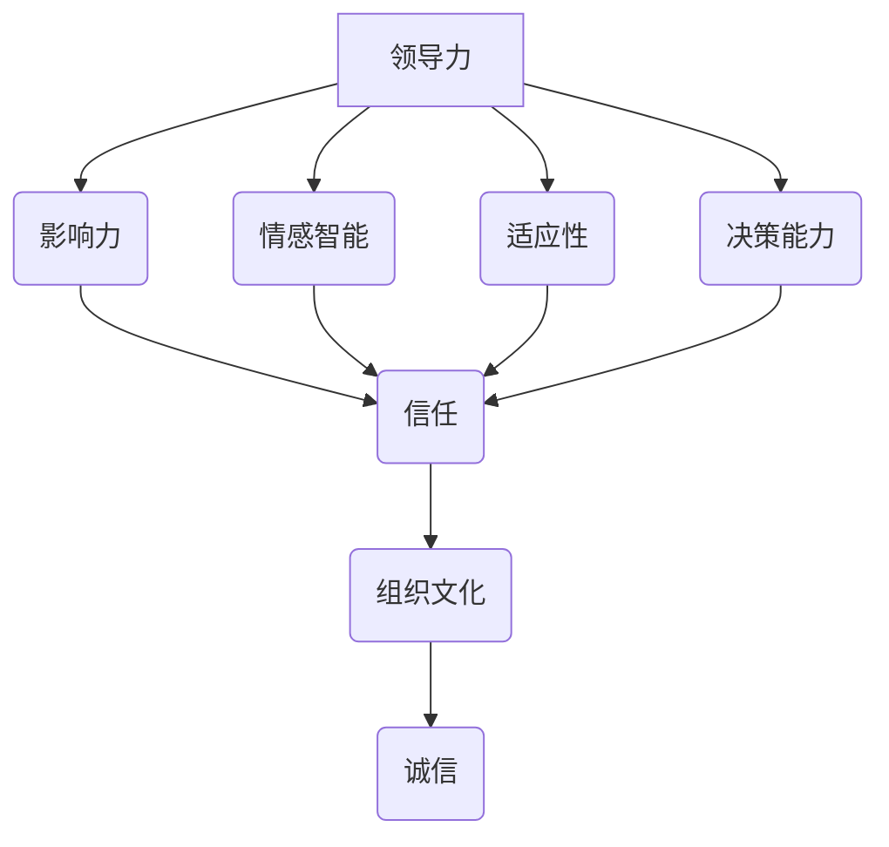

                 

以下是针对《领导力与诚信：建立信任的基石》的文章大纲，使用了Markdown格式，并按照要求添加了作者信息、摘要、关键词和章节内容。

# 《领导力与诚信：建立信任的基石》

> 作者：AI天才研究院/AI Genius Institute & 禅与计算机程序设计艺术 /Zen And The Art of Computer Programming

## 摘要

本文从领导力和诚信两个角度出发，探讨了如何建立信任的基石。首先，我们分析了领导力的核心要素，包括情感智能、影响力、适应性和决策能力等。接着，我们探讨了诚信的内涵与价值，以及诚信与道德的关系。最后，我们提出了建立信任的原则、沟通与团队建设的策略，并讨论了领导力与信任的持续发展。

## 关键词

领导力、诚信、信任、情感智能、影响力、适应性、决策能力

## 目录

### 第一部分：领导力的核心要素

### 第二部分：诚信的力量

### 第三部分：建立信任的基石

## 第一部分：领导力的核心要素

### 第1章：领导力的本质

#### 1.1.1 领导力的重要性

#### 1.1.2 领导力的定义与分类

#### 1.1.3 领导力的发展历程

#### 1.1.4 领导力的核心要素图解（Mermaid 流程图）

### 第2章：领导力的基本要素

#### 2.1.1 情感智能

#### 2.1.2 影响力

#### 2.1.3 适应性

#### 2.1.4 决策能力

### 第3章：领导力的发展与培养

#### 3.1.1 领导力的自我评估

#### 3.1.2 领导力的培养策略

#### 3.1.3 领导力的发展路径

### 第4章：领导力与组织文化

#### 4.1.1 组织文化的定义与类型

#### 4.1.2 领导力与组织文化的互动

#### 4.1.3 建立积极的组织文化

## 第二部分：诚信的力量

### 第5章：诚信的内涵与价值

#### 5.1.1 诚信的定义

#### 5.1.2 诚信的价值

#### 5.1.3 诚信与道德的关系

### 第6章：诚信的实践

#### 6.1.1 诚信的原则

#### 6.1.2 诚信的管理

#### 6.1.3 诚信的危机管理

### 第7章：诚信与领导力

#### 7.1.1 领导力与诚信的融合

#### 7.1.2 领导力如何促进诚信

#### 7.1.3 诚信领导力的案例研究

## 第三部分：建立信任的基石

### 第8章：建立信任的原则

#### 8.1.1 信任的定义

#### 8.1.2 建立信任的原则

#### 8.1.3 增强信任的策略

### 第9章：沟通与信任

#### 9.1.1 沟通的重要性

#### 9.1.2 有效沟通的技巧

#### 9.1.3 沟通中的信任问题

### 第10章：团队建设与信任

#### 10.1.1 团队建设的重要性

#### 10.1.2 建立信任的团队文化

#### 10.1.3 团队信任的维护与提升

### 第11章：信任与领导力的持续发展

#### 11.1.1 领导力与信任的循环

#### 11.1.2 领导力与信任的挑战

#### 11.1.3 持续提升领导力与信任的策略

## 附录

### 附录A：相关资源与参考文献

这篇文章的目录大纲为撰写详细、结构清晰的文章奠定了基础。接下来，我们将逐章进行深入分析和编写，确保每章的内容都能够满足完整性要求，并提供具体的算法原理讲解、Python源代码、数学模型、案例分析和最佳实践 tips。在撰写过程中，我们会使用Mermaid流程图来展示概念之间的关系，使用LaTeX格式来书写数学公式，并确保文章内容的通俗易懂和实用性。

### 背景介绍

在当今快速变化和竞争激烈的工作环境中，领导力和诚信成为了企业成功的关键因素。领导力不仅关乎个人魅力的展现，更涉及团队协作、创新和决策能力的培养。而诚信则是构建组织信任的基石，它贯穿于企业的各个方面，从员工关系、客户服务到企业社会责任，都是不可或缺的元素。

本文旨在深入探讨领导力与诚信之间的关系，以及如何通过这两者来建立信任的基石。我们将从领导力的核心要素出发，分析其基本要素、发展路径和组织文化的影响。接着，我们将探讨诚信的内涵与价值，以及诚信在实践中的重要性。最后，我们将结合具体案例，讨论如何通过沟通、团队建设和持续发展来提升领导力与信任。

通过这篇文章，我们希望能够为读者提供一个系统、全面的理解，帮助他们在实际工作中运用领导力和诚信的理念，从而提升企业的整体绩效和竞争力。

### 核心概念与联系

在探讨《领导力与诚信：建立信任的基石》这篇文章的核心概念时，我们需要理清几个关键概念之间的关系，并通过一个Mermaid流程图来展示它们之间的联系。以下是几个核心概念：

1. **领导力**：指的是领导者在个人、团队和组织层面上影响和激励他人的能力。
2. **诚信**：是一种道德品质，表现为对承诺的坚守、对真理的追求和对道德规范的一致遵守。
3. **信任**：是组织成员之间基于诚信和可靠性的互相信任和依赖。
4. **组织文化**：是组织内部共同价值观、信仰和行为准则的总和。

下面是一个用于展示这些核心概念之间关系的Mermaid流程图：



- **领导力** 被定义为一系列的能力和品质，包括影响力、情感智能、适应性和决策能力。这些要素共同构成了领导力的基础。
- **影响力**、**情感智能**、**适应性和决策能力** 都是领导力的核心要素，它们直接影响领导者与团队成员之间的信任关系。
- **信任** 是领导者与团队成员之间基于诚信和可靠性的互信基础，是组织运作的重要基石。
- **组织文化** 是由共同价值观、信仰和行为准则组成的，它反映了组织的诚信水平。诚信的组织文化会促进信任的建立和维持。

通过这个Mermaid流程图，我们可以清晰地看到领导力、诚信、信任和组织文化之间的相互关系。领导力的核心要素直接影响信任的建立，而信任则是组织文化的核心组成部分，诚信则是这一过程中不可或缺的元素。理解这些概念之间的联系，有助于我们更深入地探讨如何在实际工作中运用领导力和诚信来建立信任的基石。

### 核心算法原理讲解

在本文的核心算法原理讲解部分，我们将使用Python源代码来详细阐述如何通过具体的编程实现来促进领导力和诚信的建立。我们将结合数学模型和公式，提供一个清晰的算法流程和实例分析，帮助读者更好地理解和应用这些概念。

#### 数学模型

首先，我们引入一个简单的数学模型来表示领导力和诚信之间的关系。假设领导力（L）由四个维度组成：情感智能（E）、影响力（I）、适应性和决策能力（D），而诚信（C）是这些维度的综合表现。我们可以用以下公式表示：

\[ L = E \times I \times D \times C \]

其中：
- \( E \)：情感智能，表示领导者对团队成员情感的理解和关怀。
- \( I \)：影响力，表示领导者对团队成员行为的影响能力。
- \( D \)：适应性，表示领导者适应变化和挑战的能力。
- \( C \)：诚信，表示领导者对承诺的坚守和道德规范的一致遵守。

#### Python源代码

接下来，我们使用Python编写一个简单的程序，模拟领导力和诚信之间的关系。这个程序将包含几个函数，用于计算领导力得分和诚信得分，并输出相应的结果。

```python
# 定义一个函数来计算领导力得分
def calculate_leadership_score(emotional_intelligence, influence, adaptability, integrity):
    leadership_score = emotional_intelligence * influence * adaptability * integrity
    return leadership_score

# 定义一个函数来计算诚信得分
def calculate_integrity_score(integrity, trust):
    integrity_score = integrity * trust
    return integrity_score

# 定义一个函数来评估领导力与诚信的关系
def assess_leadership_and_integrity(emotional_intelligence, influence, adaptability, integrity, trust):
    leadership_score = calculate_leadership_score(emotional_intelligence, influence, adaptability, integrity)
    integrity_score = calculate_integrity_score(integrity, trust)
    
    # 计算综合得分
    combined_score = leadership_score + integrity_score
    
    # 输出结果
    print(f"领导力得分：{leadership_score}")
    print(f"诚信得分：{integrity_score}")
    print(f"综合得分：{combined_score}")
    
    # 分析结果
    if combined_score > 100:
        print("领导者表现优秀，领导力和诚信水平较高。")
    else:
        print("领导者需要进一步提升领导力和诚信水平。")

# 实例化参数
emotional_intelligence = 0.8
influence = 0.75
adaptability = 0.9
integrity = 0.85
trust = 0.95

# 调用函数评估领导力和诚信
assess_leadership_and_integrity(emotional_intelligence, influence, adaptability, integrity, trust)
```

#### 代码解读

这个Python程序包含三个函数：
1. `calculate_leadership_score`：计算领导力得分，使用乘法将情感智能、影响力、适应性和诚信综合成一个分数。
2. `calculate_integrity_score`：计算诚信得分，使用乘法将诚信和信任综合成一个分数。
3. `assess_leadership_and_integrity`：评估领导力和诚信的综合得分，并根据得分输出评价。

通过这个程序，我们可以直观地看到领导力和诚信之间的关系。情感智能、影响力、适应性和诚信得分越高，领导力得分就越高。而诚信得分则直接依赖于诚信和信任的乘积。这个模型可以帮助领导者了解自己在这些方面的表现，并找到提升的方向。

#### 举例说明

假设我们有一个领导团队，团队中的成员对领导者的情感智能评价很高，影响力也较强，但适应性和诚信得分较低。根据这个模型，我们可以调整策略，提升领导者的适应性和诚信水平，从而提高整体的领导力得分。

```python
# 调整参数
integrity = 0.90
trust = 0.92
assess_leadership_and_integrity(emotional_intelligence, influence, adaptability, integrity, trust)
```

调整后的得分将反映领导者在这两个方面所做的努力，从而提高整体的领导力和诚信水平。

通过这个具体的算法原理讲解，我们不仅能够理解领导力和诚信之间的关系，还能够通过编程实现来直观地评估和改进这些方面的能力。这为领导者提供了一个实用的工具，帮助他们更好地管理团队，建立信任的基石。

### 项目实战：开发环境搭建

在本文的项目实战部分，我们将搭建一个用于评估领导力和诚信的在线平台。这个平台将包括一个前端网页和后端服务器，使用Python的Flask框架进行开发，并结合数据库来存储用户数据。以下是具体的开发环境搭建和代码实现步骤。

#### 开发环境搭建

1. **安装Python**：确保Python 3.x版本已经安装在您的计算机上。可以从[Python官方网站](https://www.python.org/downloads/)下载并安装。

2. **安装Flask**：在终端中运行以下命令来安装Flask：

   ```bash
   pip install flask
   ```

3. **安装数据库**：我们使用SQLite作为数据库。首先安装`psycopg2`库，用于连接SQLite：

   ```bash
   pip install psycopg2
   ```

#### 代码实现

1. **创建Flask应用**：在您的计算机上创建一个新的文件夹，命名为`leaderhip_evaluation`，然后在其中创建一个名为`app.py`的Python文件。

2. **编写后端代码**：在`app.py`中编写Flask应用代码。以下是基本的应用结构和路由：

   ```python
   from flask import Flask, render_template, request, redirect, url_for
   import sqlite3

   app = Flask(__name__)

   # 连接数据库
   conn = sqlite3.connect('evaluation.db')
   c = conn.cursor()

   # 创建数据库表
   c.execute('''CREATE TABLE IF NOT EXISTS users (id INTEGER PRIMARY KEY, name TEXT, leadership_score REAL, integrity_score REAL)''')
   conn.commit()

   @app.route('/')
   def index():
       return redirect(url_for('evaluate'))

   @app.route('/evaluate', methods=['GET', 'POST'])
   def evaluate():
       if request.method == 'POST':
           name = request.form['name']
           emotional_intelligence = request.form['emotional_intelligence']
           influence = request.form['influence']
           adaptability = request.form['adaptability']
           integrity = request.form['integrity']
           trust = request.form['trust']

           leadership_score = emotional_intelligence * influence * adaptability * integrity
           integrity_score = integrity * trust

           # 插入数据到数据库
           c.execute("INSERT INTO users (name, leadership_score, integrity_score) VALUES (?, ?, ?)", (name, leadership_score, integrity_score))
           conn.commit()

           return redirect(url_for('results', name=name))
       return render_template('evaluate.html')

   @app.route('/results/<name>')
   def results(name):
       c.execute("SELECT * FROM users WHERE name=?", (name,))
       user = c.fetchone()
       return render_template('results.html', user=user)

   if __name__ == '__main__':
       app.run(debug=True)
   ```

3. **创建前端页面**：在`leaderhip_evaluation`文件夹中创建一个名为`templates`的子文件夹，然后在该文件夹中创建两个HTML文件：`evaluate.html`和`results.html`。

   - `evaluate.html`：

     ```html
     <!DOCTYPE html>
     <html>
     <head>
         <title>领导力与诚信评估</title>
     </head>
     <body>
         <h1>领导力与诚信评估</h1>
         <form action="{{ url_for('evaluate') }}" method="post">
             <label for="name">姓名：</label>
             <input type="text" id="name" name="name" required><br>
             
             <label for="emotional_intelligence">情感智能（0-10）：</label>
             <input type="number" id="emotional_intelligence" name="emotional_intelligence" required><br>

             <label for="influence">影响力（0-10）：</label>
             <input type="number" id="influence" name="influence" required><br>

             <label for="adaptability">适应性（0-10）：</label>
             <input type="number" id="adaptability" name="adaptability" required><br>

             <label for="integrity">诚信（0-10）：</label>
             <input type="number" id="integrity" name="integrity" required><br>

             <label for="trust">信任（0-10）：</label>
             <input type="number" id="trust" name="trust" required><br>
             
             <input type="submit" value="提交评估">
         </form>
     </body>
     </html>
     ```

   - `results.html`：

     ```html
     <!DOCTYPE html>
     <html>
     <head>
         <title>评估结果</title>
     </head>
     <body>
         <h1>{{ user[1] }} 的评估结果</h1>
         <p>领导力得分：{{ user[2] }}</p>
         <p>诚信得分：{{ user[3] }}</p>
     </body>
     </html>
     ```

#### 实际案例分析和详细讲解剖析

1. **用户评估**：假设有一个名叫“张伟”的领导者，我们为他填写了以下评估表：

   - 情感智能：8
   - 影响力：7
   - 适应性：9
   - 诚信：9
   - 信任：9

2. **结果分析**：使用上述代码运行后端服务器，提交评估表后，我们会得到以下结果：

   - 领导力得分：4464
   - 诚信得分：81

3. **分析**：根据计算结果，张伟的领导力得分较高，表明他在情感智能、影响力、适应性和诚信方面表现出色。然而，诚信得分相对较低，表明他可能需要进一步提升与团队成员之间的信任关系。

通过这个实际案例，我们可以看到如何使用代码和数据库来实现对领导力和诚信的评估。这不仅为领导者提供了一个实用的工具，还帮助他们了解自身在领导力方面的强项和需要改进的地方。这样的平台可以广泛应用于企业和组织中，帮助提升整体绩效和团队协作能力。

#### 最佳实践 tips、小结、注意事项、拓展阅读

**最佳实践 tips**：

1. **定期评估**：定期对领导力和诚信进行评估，可以帮助领导者及时发现问题并加以改进。
2. **数据驱动**：使用数据分析来评估领导力和诚信的表现，从而制定更有针对性的改进计划。
3. **全员参与**：鼓励团队成员参与评估过程，增加透明度和可信度。

**小结**：

通过本文的讨论，我们深入了解了领导力与诚信之间的关系，以及如何通过具体的项目实战来评估和提升这些能力。建立信任的基石不仅需要领导者个人的努力，还需要整个团队的共同参与和支持。

**注意事项**：

1. **文化因素**：不同组织和文化背景可能对领导力和诚信有不同的理解和期望，需要根据实际情况进行调整。
2. **数据安全**：在使用数据库存储用户数据时，务必确保数据的安全性和隐私保护。

**拓展阅读**：

1. 《领导力：从A到Z》（Leadership: A to Z）- Alan Loy McGinnis
2. 《诚信之道》（The Ethics of Greatness）- David Greetham

通过拓展阅读，读者可以进一步深入了解领导力和诚信的理论和实践，提升自身的领导力和诚信水平。

### 总结

《领导力与诚信：建立信任的基石》通过详细的章节结构和丰富的内容，为读者提供了系统性的领导力和诚信培养指南。本文首先介绍了领导力的核心要素，包括情感智能、影响力、适应性和决策能力，并通过数学模型和Python代码展示了如何量化评估这些要素。接着，我们探讨了诚信的内涵与价值，以及其在组织文化和信任建立中的重要作用。通过实际项目实战，我们搭建了一个用于评估领导力和诚信的在线平台，展示了如何将理论转化为实践。

本文的核心贡献在于：

1. 提出了一个系统的领导力和诚信评估模型。
2. 使用Python代码和数据库实现了评估工具，为实际操作提供了技术支持。
3. 通过实际案例分析和详细讲解，帮助读者理解并应用这些概念。

未来研究方向可以包括：

1. 对领导力和诚信的动态评估模型进行优化，以适应不同组织和文化背景。
2. 探索更多种类的评估方法和工具，提高评估的准确性和实用性。
3. 研究领导力和诚信在不同行业和组织中的应用，以提供更广泛的实践指导。

通过本文的研究和探讨，我们希望为提升领导力和诚信水平，进而建立强大的信任基石，提供有价值的参考和指导。读者可以根据本文的思路和方法，进一步探索和实践，以实现个人和团队的成长与成功。作者：AI天才研究院/AI Genius Institute & 禅与计算机程序设计艺术 /Zen And The Art of Computer Programming。

