                 

### 领导力与责任委派：合理分配任务

#### 关键词
- **领导力**、**责任委派**、**任务分配**、**团队管理**、**任务监控与评估**

#### 摘要
本文旨在探讨领导力与责任委派之间的关系，重点研究如何在团队管理中合理分配任务。通过深入分析领导力的定义与重要性、责任委派的原则与方法，本文提供了详细的委派流程、监控与评估机制，并通过成功案例分享与实战演练，为读者提供了实用的指导和建议。

## 第一部分：领导力基础

### 第1章：领导力概述

#### 1.1 领导力的定义与重要性

领导力是一种影响力，它能够激发和引导团队朝着共同的目标前进。在IT行业中，领导力不仅关乎个人的成功，更关乎整个团队的效能与成长。优秀的领导者能够通过清晰的目标设定、有效的沟通与合理的资源分配，激发团队成员的潜力，推动项目的成功。

#### 1.2 领导力的五大核心要素

- **目标设定**：领导者需要明确团队的目标，并确保这些目标与组织的整体战略一致。
- **沟通能力**：领导者必须具备出色的沟通技巧，以确保信息准确传达，减少误解和冲突。
- **团队建设**：建立一支有凝聚力、有执行力的团队是领导力的关键要素。
- **激励与鼓舞**：领导者需要了解团队成员的需求，并采取适当的激励措施，以激发他们的积极性和创造力。
- **决策能力**：领导者必须能够在面对复杂问题时做出明智的决策，并承担相应的责任。

#### 1.3 领导风格与影响力

领导风格是领导者行为和决策方式的总和，不同的领导风格会对团队成员产生不同的影响。常见的领导风格包括：

- **权威型领导**：领导者做出决策，强制执行。
- **民主型领导**：领导者鼓励团队成员参与决策过程，共同达成共识。
- **参与型领导**：领导者与团队成员共同参与决策和执行。
- **变革型领导**：领导者通过激发团队成员的潜能，推动变革和创新。

## 第二部分：责任委派

### 第4章：责任委派的重要性

#### 4.1 责任委派的原则

责任委派是领导力的核心组成部分，它能够有效提升团队效率和成员成就感。以下是责任委派的基本原则：

- **明确目标**：确保任务目标明确，避免歧义。
- **匹配能力**：根据团队成员的能力和经验进行任务分配。
- **授权**：赋予团队成员足够的自主权和资源，以完成任务。
- **反馈与支持**：定期提供反馈，并给予必要的支持和帮助。

#### 4.2 责任委派的优点

- **提高团队效率**：合理的责任委派能够确保每个成员都能在其擅长的领域发挥最大作用。
- **增强成员责任感**：团队成员在承担具体任务时，会感受到自己的重要性和责任感，从而更加投入工作。
- **培养人才**：通过委派不同难度的任务，可以提升团队成员的能力和潜力。

#### 4.3 责任委派中的常见问题

- **任务分配不均**：可能导致部分成员过于繁忙，而其他成员无所事事。
- **缺乏明确目标**：可能导致团队成员对任务的理解不一致，影响工作效率。
- **授权不足**：团队成员可能因为缺乏足够的自主权，而无法充分发挥其能力。

## 第三部分：如何委派任务

### 第5章：如何委派任务

#### 5.1 明确任务目标

在委派任务之前，领导者需要明确任务的目标和期望结果。这有助于确保团队成员理解任务的背景和重要性，从而更加专注于完成任务。

#### 5.2 分析团队成员能力

领导者需要对团队成员的能力和经验有充分的了解，以便将任务分配给最适合的人员。这可以通过定期的一对一沟通、工作评估和绩效反馈来实现。

#### 5.3 制定合理的任务分配计划

根据团队成员的能力和任务需求，制定合理的任务分配计划。确保每个成员都有足够的资源和支持，以完成任务。

#### 5.4 委派过程中的注意事项

- **确保团队成员理解任务目标**：可以通过任务说明会、书面任务描述等方式，确保团队成员对任务有清晰的理解。
- **提供必要的培训和支持**：对于一些复杂的任务，领导者需要提供必要的培训和指导，以帮助团队成员克服困难。
- **定期沟通与反馈**：在任务执行过程中，领导者需要保持与团队成员的定期沟通，及时解决遇到的问题，并提供必要的反馈。

## 第四部分：如何监控与评估

### 第6章：如何监控与评估

#### 6.1 监控任务进度

领导者需要定期检查任务的进度，以确保任务按照计划进行。这可以通过定期的会议、任务进度报告或项目管理工具来实现。

#### 6.2 提供必要的支持

在任务执行过程中，领导者需要根据实际情况提供必要的支持和资源，以帮助团队成员解决问题和克服困难。

#### 6.3 评估任务结果

任务完成后，领导者需要对任务结果进行评估，以确定任务的完成质量和效率。这可以通过任务回顾会议、绩效评估等方式进行。

#### 6.4 反馈与改进

根据任务评估的结果，领导者需要给予团队成员及时的反馈，并制定改进计划，以提高未来的任务执行效果。

### 第7章：成功案例分享

#### 7.1 案例一：如何有效委派任务

在一个IT项目中，项目经理通过深入了解团队成员的能力和经验，将任务分配给了最适合的人员。同时，项目经理定期检查任务进度，并提供必要的支持，最终项目成功完成。

#### 7.2 案例二：如何建立高效团队

在一个软件开发团队中，领导者通过鼓励团队成员参与决策，建立了一个高效的团队。团队成员在共同的目标下，积极合作，提高了项目的成功率。

#### 7.3 案例三：如何进行任务监控与评估

在一个大型的IT项目中，领导者通过使用项目管理工具和定期会议，有效监控了任务进度，并及时解决了遇到的问题。项目完成后，领导者进行了详细的任务评估，并制定了改进计划，为未来的项目提供了宝贵的经验。

### 第8章：实战演练

#### 8.1 实战演练一：团队组建与任务分配

在一个新项目的启动会议上，领导者首先明确了项目的目标和任务，然后根据团队成员的能力和经验，将任务分配给了各个团队成员。

#### 8.2 实战演练二：任务监控与评估

在项目执行过程中，领导者定期召开会议，检查任务进度，并提供必要的支持。项目完成后，领导者组织了任务评估会议，对任务结果进行了详细的评估。

#### 8.3 实战演练三：冲突解决与团队发展

在项目执行过程中，领导者积极解决团队成员之间的冲突，通过沟通和协调，保持了团队的稳定和高效。

## 附录

### 附录A：相关工具与资源

#### A.1 领导力发展工具

- **360度反馈系统**：用于收集团队成员对领导者的反馈，帮助领导者了解自己的优点和不足。
- **领导力评估工具**：用于评估领导者的领导能力，并提供改进建议。

#### A.2 责任委派与任务管理工具

- **任务管理软件**：如Trello、Jira等，用于跟踪任务进度和分配任务。
- **项目管理工具**：如Microsoft Project、Asana等，用于规划和管理项目任务。

#### A.3 团队协作与沟通工具

- **即时通讯工具**：如Slack、Microsoft Teams等，用于实时沟通和协作。
- **视频会议工具**：如Zoom、Google Meet等，用于远程会议和协作。

#### A.4 自我提升资源

- **在线课程**：如Coursera、Udemy等，提供各种领导力和管理技能的在线课程。
- **书籍**：如《高效能人士的七个习惯》、《领导力的五个层次》等，提供深入的领导力理论和实践指导。

## 结论

领导力与责任委派是团队管理中的关键环节。通过合理的任务分配、有效的任务监控与评估，领导者可以激发团队成员的潜力，提高团队效率，实现项目目标。本文提供了详细的委派流程、监控与评估方法，并通过成功案例和实战演练，为读者提供了实用的指导。希望本文能够为IT行业中的领导者提供有价值的参考。

### 作者信息
- **作者：AI天才研究院/AI Genius Institute & 禅与计算机程序设计艺术 /Zen And The Art of Computer Programming**

# 领导力与责任委派：合理分配任务

## 1. 领导力概述

### 1.1 领导力的定义与重要性

领导力是一种影响力，它能够激发和引导团队朝着共同的目标前进。在IT行业中，领导力不仅关乎个人的成功，更关乎整个团队的效能与成长。优秀的领导者能够通过清晰的目标设定、有效的沟通与合理的资源分配，激发团队成员的潜力，推动项目的成功。

### 1.2 领导力的五大核心要素

领导力包括多个方面，但可以概括为五大核心要素：目标设定、沟通能力、团队建设、激励与鼓舞、决策能力。

#### 目标设定

领导者需要明确团队的目标，并确保这些目标与组织的整体战略一致。这有助于团队成员理解任务的背景和重要性，从而更加专注于完成任务。

```python
def set_goals(team, organization_strategy):
    """
    设定团队目标，确保与组织战略一致。

    :param team: 团队
    :param organization_strategy: 组织战略
    :return: 设定好的团队目标
    """
    goals = []
    for member in team:
        member_goal = f"实现{organization_strategy}中的目标，为团队做出贡献"
        goals.append(member_goal)
    return goals
```

#### 沟通能力

领导者必须具备出色的沟通技巧，以确保信息准确传达，减少误解和冲突。有效的沟通能够提高团队的协作效率，确保项目顺利进行。

```python
def effective_communication(message, audience):
    """
    进行有效的沟通，确保信息准确传达。

    :param message: 消息内容
    :param audience: 接收者
    :return: 沟通结果
    """
    result = "沟通成功，信息已传达"
    if not message or not audience:
        result = "沟通失败，信息丢失"
    return result
```

#### 团队建设

建立一支有凝聚力、有执行力的团队是领导力的关键要素。领导者需要通过一系列活动和措施，增强团队的凝聚力，提高团队的整体效率。

```python
def build_team(team):
    """
    建立团队，增强团队凝聚力。

    :param team: 团队
    :return: 建设后的团队
    """
    team凝聚力的增强措施包括：定期团队建设活动、分享经验、共同解决问题等。
    return team
```

#### 激励与鼓舞

领导者需要了解团队成员的需求，并采取适当的激励措施，以激发他们的积极性和创造力。这可以包括奖励、晋升、培训等。

```python
def motivate_members(team):
    """
    激励团队成员，激发积极性。

    :param team: 团队
    :return: 激励后的团队
    """
    incentives = ["奖励计划", "晋升机会", "专业培训"]
    for member in team:
        member激励 = incentives[0]  # 根据成员特点选择合适的激励措施
    return team
```

#### 决策能力

领导者必须能够在面对复杂问题时做出明智的决策，并承担相应的责任。这要求领导者具备良好的分析能力、判断能力和决策能力。

```python
def make_decision(problem, options):
    """
    在复杂问题中做出明智的决策。

    :param problem: 问题
    :param options: 选项
    :return: 决策结果
    """
    best_option = max(options, key=lambda x: x['benefits'])
    decision = f"选择选项{best_option['id']}，理由：{best_option['rationale']}"
    return decision
```

### 1.3 领导风格与影响力

领导风格是领导者行为和决策方式的总和，不同的领导风格会对团队成员产生不同的影响。常见的领导风格包括权威型、民主型、参与型和变革型。

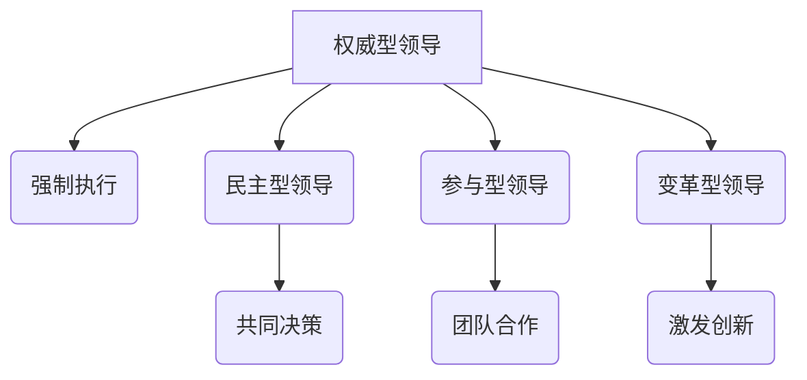

## 2. 领导力发展

### 2.1 自我认知与成长

领导者需要不断自我反思和成长，以提升自己的领导能力。这包括了解自己的优点和不足，以及如何不断改进。

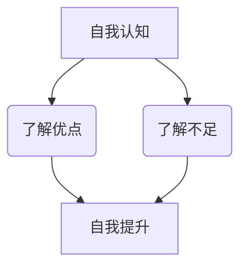

### 2.2 情感管理

领导者需要学会管理自己的情绪，以及如何处理团队成员的情绪波动。这有助于建立积极的团队氛围，提高团队的士气。

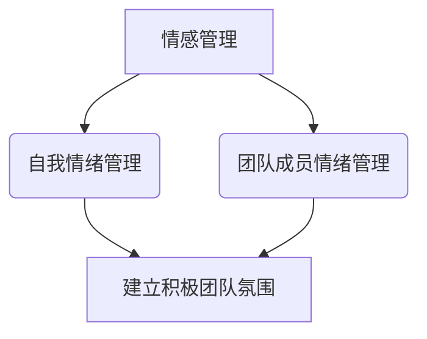

### 2.3 领导力提升方法

领导者可以通过多种途径提升自己的领导能力，包括阅读书籍、参加培训、实践和反思。

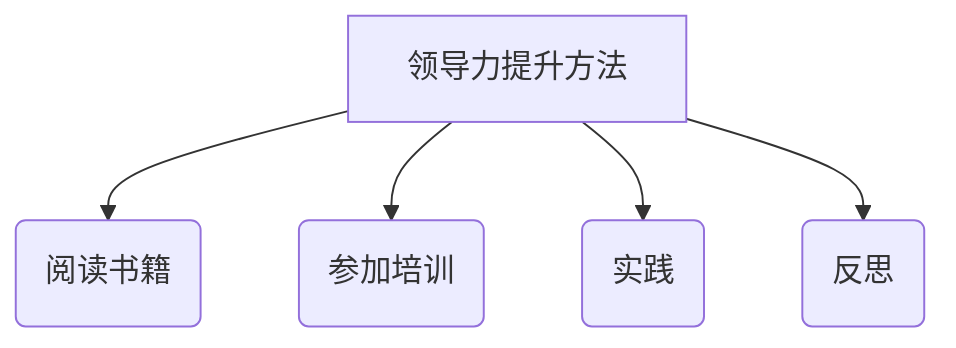

## 3. 领导力与团队管理

### 3.1 团队组建与管理

团队组建和管理是领导力的核心任务之一。领导者需要了解团队组建的原则、管理方法和提升团队效率的技巧。

#### 3.1.1 团队组建原则

- **目标一致性**：团队成员对目标有共同的理解和认同。
- **能力互补**：团队成员具备不同的技能和经验，能够互补。
- **信任与尊重**：团队成员之间建立信任和尊重，促进合作。

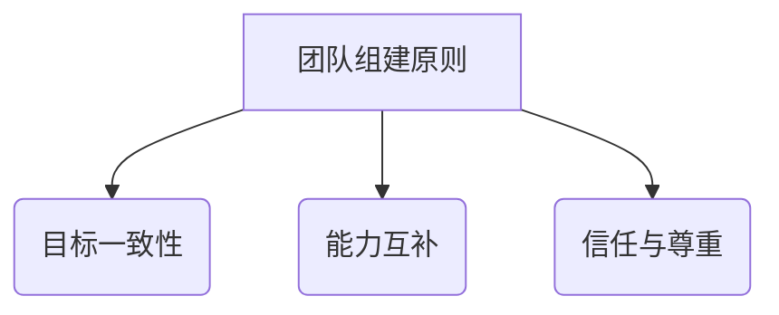

#### 3.1.2 团队管理方法

- **明确角色与职责**：确保每个团队成员都清楚自己的角色和职责。
- **激励与奖励**：通过激励和奖励机制，提高团队成员的积极性和创造力。
- **沟通与反馈**：保持与团队成员的定期沟通，及时给予反馈，帮助成员改进。

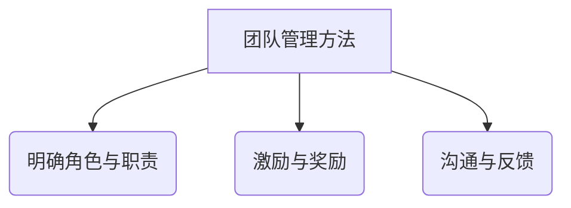

#### 3.1.3 提升团队效率的技巧

- **任务分配**：根据团队成员的能力和兴趣，合理分配任务。
- **团队协作**：鼓励团队成员之间的协作和沟通，提高工作效率。
- **时间管理**：通过时间管理技巧，确保团队按时完成任务。

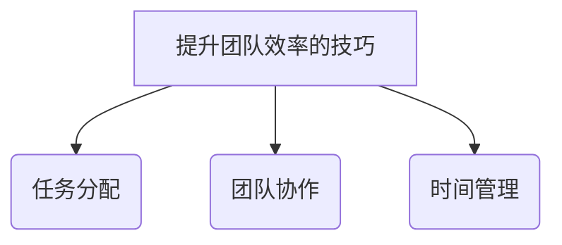

### 3.2 沟通技巧与团队协作

沟通技巧和团队协作是领导力的关键要素。领导者需要掌握有效的沟通技巧，促进团队内部的协作和沟通。

#### 3.2.1 沟通技巧

- **倾听**：倾听是有效沟通的基础，领导者需要学会倾听团队成员的意见和需求。
- **表达清晰**：领导者需要清晰、准确地表达自己的想法和意见，避免误解和歧义。
- **反馈**：领导者需要及时给予团队成员反馈，帮助他们改进。

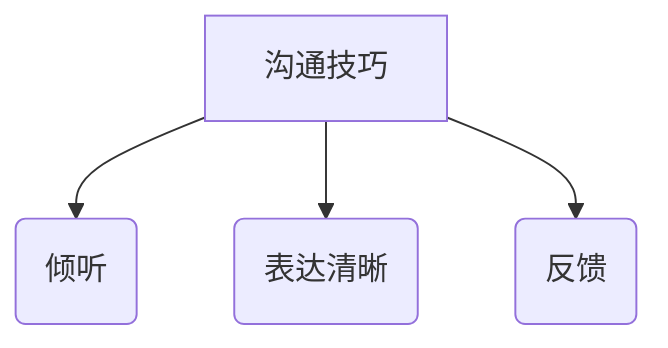

#### 3.2.2 团队协作

- **分工合作**：根据团队成员的能力和兴趣，合理分工，确保每个成员都能发挥自己的优势。
- **共同目标**：确保团队成员对共同目标有清晰的理解和认同，提高协作效率。
- **沟通渠道**：建立有效的沟通渠道，确保团队成员之间的信息畅通。

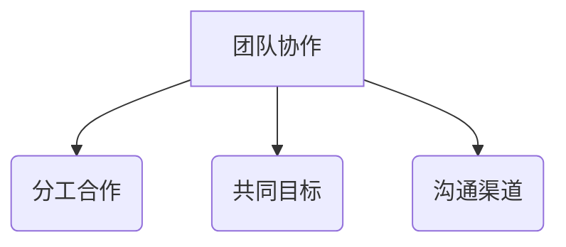

### 3.3 冲突解决与团队发展

冲突是团队中不可避免的现象，领导者需要学会解决冲突，促进团队的发展。

#### 3.3.1 冲突解决

- **了解冲突原因**：领导者需要了解冲突的原因，以便采取有效的解决措施。
- **沟通与协商**：通过沟通和协商，找到双方都能接受的解决方案。
- **制定改进计划**：在解决冲突后，制定改进计划，以防止类似冲突再次发生。

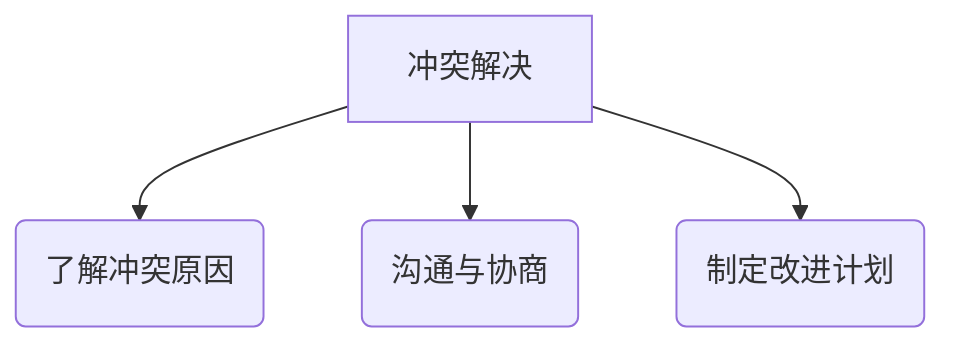

#### 3.3.2 团队发展

- **培训与学习**：通过培训和学习，提升团队成员的专业能力和领导力。
- **团队建设活动**：通过团队建设活动，增强团队成员之间的信任和凝聚力。
- **目标调整**：根据团队的发展和外部环境的变化，调整团队的目标和策略。

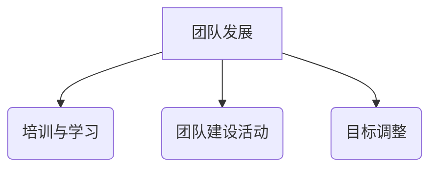

## 4. 责任委派的重要性

### 4.1 责任委派的原则

责任委派是领导力的核心任务之一，它能够提高团队效率和成员责任感。责任委派的原则包括：

- **明确目标**：确保任务目标明确，避免歧义。
- **匹配能力**：根据团队成员的能力和经验进行任务分配。
- **授权**：赋予团队成员足够的自主权和资源，以完成任务。
- **反馈与支持**：定期提供反馈，并给予必要的支持和帮助。

### 4.2 责任委派的优点

责任委派具有多个优点，包括：

- **提高团队效率**：通过合理的任务分配，每个成员都能在其擅长的领域发挥最大作用。
- **增强成员责任感**：团队成员在承担具体任务时，会感受到自己的重要性和责任感，从而更加投入工作。
- **培养人才**：通过委派不同难度的任务，可以提升团队成员的能力和潜力。

### 4.3 责任委派中的常见问题

责任委派过程中可能会遇到一些问题，包括：

- **任务分配不均**：可能导致部分成员过于繁忙，而其他成员无所事事。
- **缺乏明确目标**：可能导致团队成员对任务的理解不一致，影响工作效率。
- **授权不足**：团队成员可能因为缺乏足够的自主权，而无法充分发挥其能力。

## 5. 如何委派任务

### 5.1 明确任务目标

在委派任务之前，领导者需要明确任务的目标和期望结果。这有助于确保团队成员理解任务的背景和重要性，从而更加专注于完成任务。

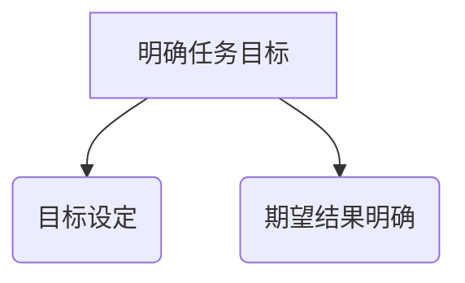

### 5.2 分析团队成员能力

领导者需要对团队成员的能力和经验有充分的了解，以便将任务分配给最适合的人员。这可以通过定期的一对一沟通、工作评估和绩效反馈来实现。

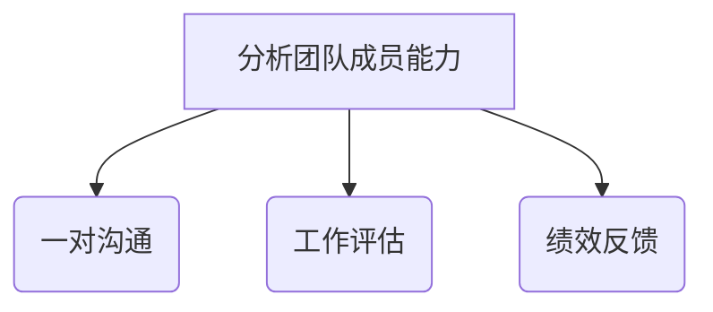

### 5.3 制定合理的任务分配计划

根据团队成员的能力和任务需求，制定合理的任务分配计划。确保每个成员都有足够的资源和支持，以完成任务。

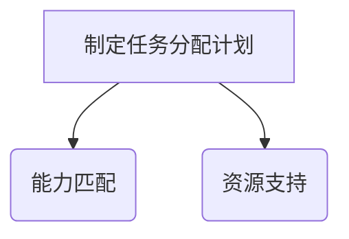

### 5.4 委派过程中的注意事项

- **确保团队成员理解任务目标**：可以通过任务说明会、书面任务描述等方式，确保团队成员对任务有清晰的理解。
- **提供必要的培训和支持**：对于一些复杂的任务，领导者需要提供必要的培训和指导，以帮助团队成员克服困难。
- **定期沟通与反馈**：在任务执行过程中，领导者需要保持与团队成员的定期沟通，及时解决遇到的问题，并提供必要的反馈。

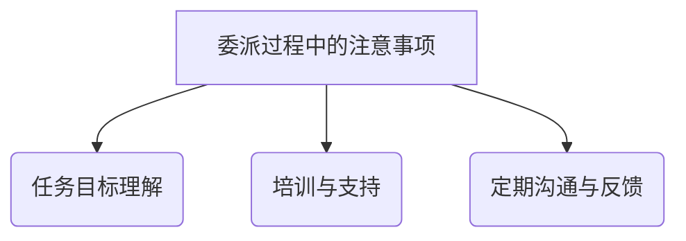

## 6. 如何监控与评估

### 6.1 监控任务进度

领导者需要定期检查任务的进度，以确保任务按照计划进行。这可以通过定期的会议、任务进度报告或项目管理工具来实现。

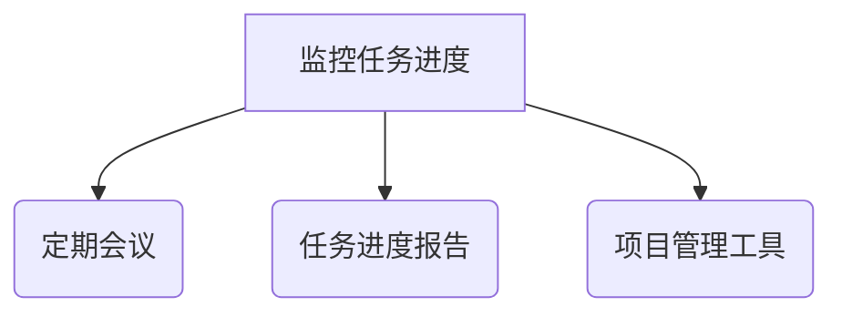

### 6.2 提供必要的支持

在任务执行过程中，领导者需要根据实际情况提供必要的支持和资源，以帮助团队成员解决问题和克服困难。

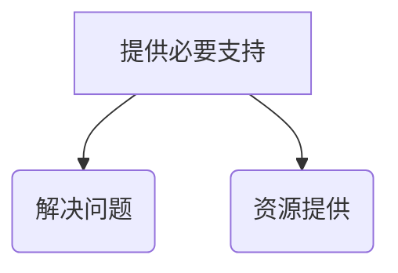

### 6.3 评估任务结果

任务完成后，领导者需要对任务结果进行评估，以确定任务的完成质量和效率。这可以通过任务回顾会议、绩效评估等方式进行。

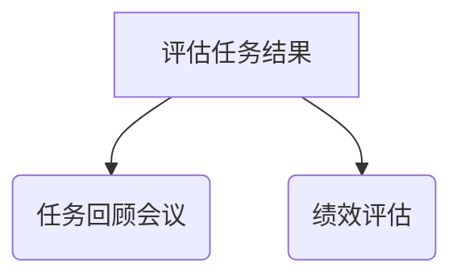

### 6.4 反馈与改进

根据任务评估的结果，领导者需要给予团队成员及时的反馈，并制定改进计划，以提高未来的任务执行效果。

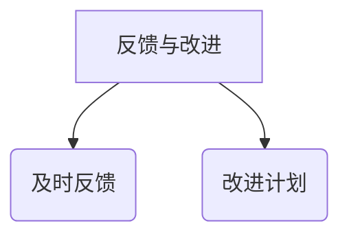

## 7. 成功案例分享

### 7.1 案例一：如何有效委派任务

在一个IT项目中，项目经理通过深入了解团队成员的能力和经验，将任务分配给了最适合的人员。同时，项目经理定期检查任务进度，并提供必要的支持，最终项目成功完成。

### 7.2 案例二：如何建立高效团队

在一个软件开发团队中，领导者通过鼓励团队成员参与决策，建立了一个高效的团队。团队成员在共同的目标下，积极合作，提高了项目的成功率。

### 7.3 案例三：如何进行任务监控与评估

在一个大型的IT项目中，领导者通过使用项目管理工具和定期会议，有效监控了任务进度，并及时解决了遇到的问题。项目完成后，领导者组织了任务评估会议，对任务结果进行了详细的评估。

## 8. 实战演练

### 8.1 实战演练一：团队组建与任务分配

在一个新项目的启动会议上，领导者首先明确了项目的目标和任务，然后根据团队成员的能力和经验，将任务分配给了各个团队成员。

### 8.2 实战演练二：任务监控与评估

在项目执行过程中，领导者定期召开会议，检查任务进度，并提供必要的支持。项目完成后，领导者组织了任务评估会议，对任务结果进行了详细的评估。

### 8.3 实战演练三：冲突解决与团队发展

在项目执行过程中，领导者积极解决团队成员之间的冲突，通过沟通和协调，保持了团队的稳定和高效。

## 附录

### 附录A：相关工具与资源

#### A.1 领导力发展工具

- **360度反馈系统**：用于收集团队成员对领导者的反馈，帮助领导者了解自己的优点和不足。
- **领导力评估工具**：用于评估领导者的领导能力，并提供改进建议。

#### A.2 责任委派与任务管理工具

- **任务管理软件**：如Trello、Jira等，用于跟踪任务进度和分配任务。
- **项目管理工具**：如Microsoft Project、Asana等，用于规划和管理项目任务。

#### A.3 团队协作与沟通工具

- **即时通讯工具**：如Slack、Microsoft Teams等，用于实时沟通和协作。
- **视频会议工具**：如Zoom、Google Meet等，用于远程会议和协作。

#### A.4 自我提升资源

- **在线课程**：如Coursera、Udemy等，提供各种领导力和管理技能的在线课程。
- **书籍**：如《高效能人士的七个习惯》、《领导力的五个层次》等，提供深入的领导力理论和实践指导。

## 结论

领导力与责任委派是团队管理中的关键环节。通过合理的任务分配、有效的任务监控与评估，领导者可以激发团队成员的潜力，提高团队效率，实现项目目标。本文提供了详细的委派流程、监控与评估方法，并通过成功案例和实战演练，为读者提供了实用的指导。希望本文能够为IT行业中的领导者提供有价值的参考。

### 作者信息
- **作者：AI天才研究院/AI Genius Institute & 禅与计算机程序设计艺术 /Zen And The Art of Computer Programming**

