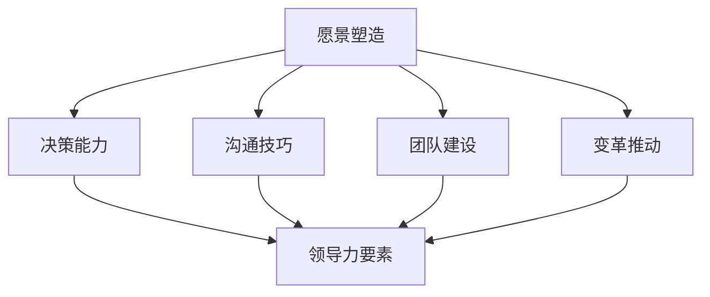
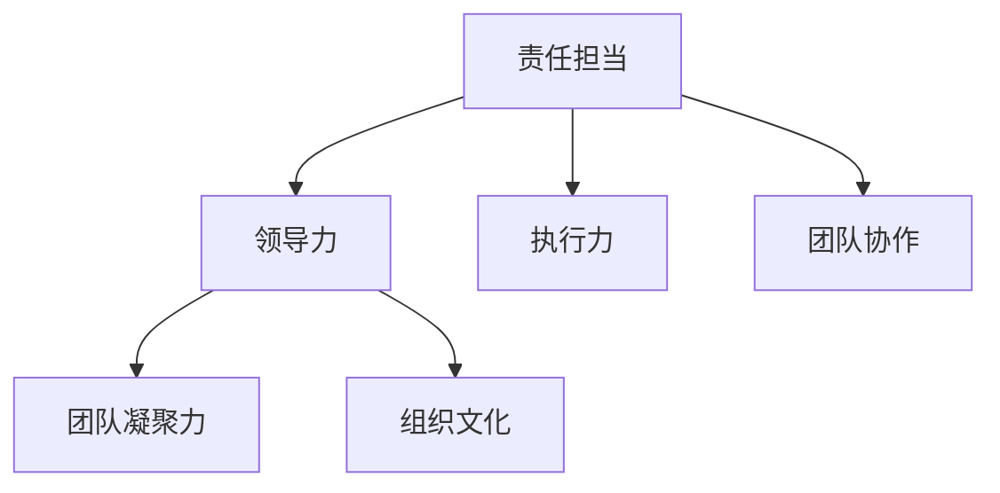
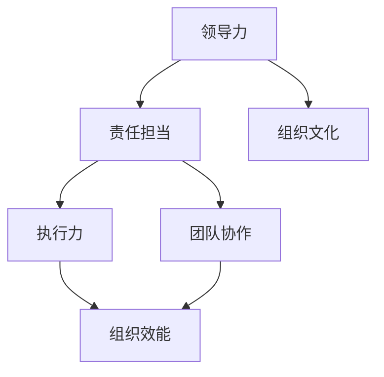
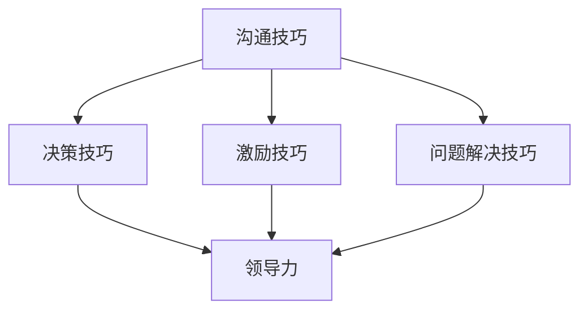
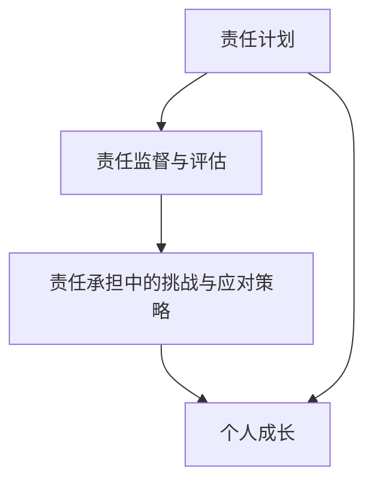
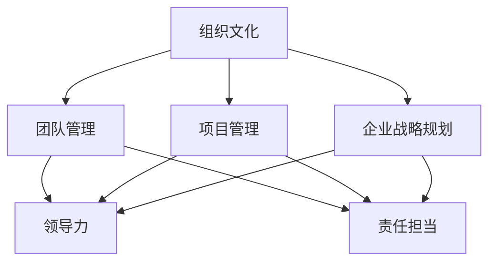
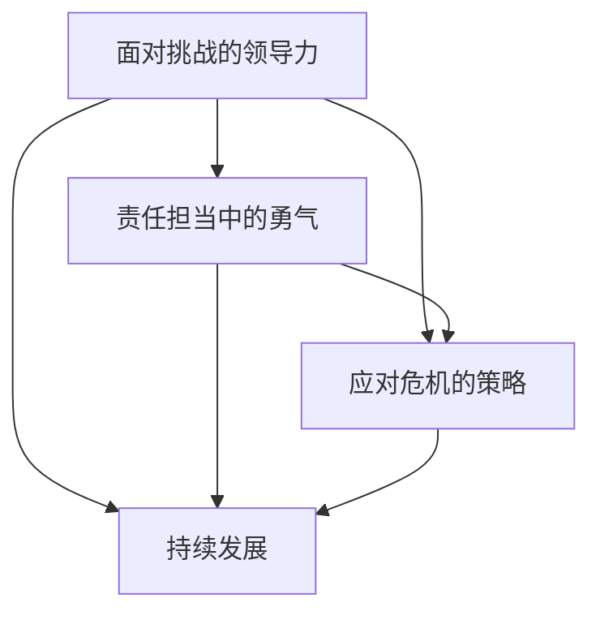

                 

## 第1章 引言

### 1.1 领导力与责任担当的重要性

在当今复杂多变的环境中，领导力与责任担当成为企业、团队和个人成功的关键因素。领导力不仅是管理者必备的能力，也是推动组织变革和创新的核心动力。责任担当则是确保组织目标实现、维护团队和谐与提升个人职业素养的基础。

#### 领导力的定义与作用

领导力是指引导和激励他人实现目标的能力。它包括但不限于：愿景塑造、决策能力、沟通技巧、团队建设、变革推动等。一个具备强大领导力的人，能够在困境中找到方向，在逆境中激励团队，带领组织克服重重困难，实现持续发展。

#### 责任担当的定义与作用

责任担当是指在面对工作任务时，勇于承担责任，积极采取行动，确保任务完成的一种态度和行为。它不仅体现在个人层面上，更体现在团队和组织层面。一个具备责任担当的人，能够提升团队信任度，增强组织执行力，确保组织目标的实现。

### 1.2 本书的目的与结构

本书旨在深入探讨领导力与责任担当的核心概念、相互关系、实践技巧，并通过案例分析帮助读者理解和掌握这些关键能力。全书共分为十章，结构如下：

- 第1章：引言，介绍领导力与责任担当的重要性。
- 第2章：领导力的核心概念，包括定义、要素、类型、与管理的关系等。
- 第3章：责任担当的基础，包括定义、重要性、层次、与权力的关系等。
- 第4章：领导力与责任担当的联系，探讨两者之间的互动与影响。
- 第5章：领导力与责任担当的核心技巧，包括沟通、决策、激励、问题解决等。
- 第6章：责任担当的具体实践，包括制定责任计划、责任监督与评估、挑战与应对等。
- 第7章：领导力与责任担当在组织中的应用，包括组织文化、团队管理、项目管理、企业战略规划等。
- 第8章：领导力与责任担当：勇于面对挑战，探讨面对挑战的策略与持续发展。
- 第9章：案例分析与讨论，分析成功与失败案例，深入探讨领导力与责任担当的实际应用。
- 第10章：结论，总结领导力与责任担当的重要性和未来展望。

### 1.3 如何阅读本书

本书适合希望提升领导力和责任担当能力的读者，包括企业领导者、管理者、团队成员以及个人职业发展者。建议读者按照以下步骤阅读：

1. **通读全书**：了解领导力与责任担当的核心概念、结构和内容。
2. **重点阅读**：针对自己感兴趣的章节或主题，深入阅读并思考。
3. **实践应用**：将书中所学应用到实际工作中，不断反思和调整。
4. **持续学习**：通过案例分析和讨论，加深对领导力与责任担当的理解。

通过以上步骤，读者将能够系统地掌握领导力与责任担当的核心知识和技能，为个人和组织的成功奠定坚实基础。

### 关键词

- 领导力
- 责任担当
- 组织管理
- 团队协作
- 决策能力
- 沟通技巧
- 创新与变革
- 企业文化
- 持续发展
- 挑战应对

### 摘要

本文旨在深入探讨领导力与责任担当的核心概念、相互关系和实践技巧。通过系统地分析领导力的定义、要素、类型及其与管理的关系，以及责任担当的定义、重要性、层次和与权力的关系，本文揭示了领导力与责任担当的互动与影响。同时，本书还详细介绍了沟通技巧、决策技巧、激励技巧和问题解决技巧等核心技巧，并通过具体实践、组织应用和案例分析，帮助读者理解和掌握这些关键能力。最后，本文总结了领导力与责任担当的重要性及其在持续发展中的角色，为读者提供了实用的指导和建议。通过本文的学习，读者将能够提升自身的领导力和责任担当能力，为个人和组织的成功奠定坚实基础。

## 第2章 领导力的核心概念

### 2.1 领导力定义

领导力是一种引导和影响他人实现共同目标的能力。它不仅包括对团队成员的指导与监督，还涉及对组织方向和愿景的塑造。领导力不仅仅是职位赋予的权力，更是一种态度和行为的体现。一个具备强大领导力的人，能够通过影响力激励他人，共同克服困难，实现卓越的成果。

#### 领导力的定义

- 领导力是一种能力，通过影响力和权威来实现团队和组织的目标。
- 领导力不仅仅关乎职位，更关乎个人素质和影响力。
- 领导力包括愿景塑造、决策能力、沟通技巧、团队建设和变革推动等多方面内容。

### 2.2 领导力的要素

领导力并非单一的能力，而是由多个要素构成的复杂体系。了解这些要素有助于深入理解领导力的本质，从而更好地提升自身领导力。

#### 要素一：愿景塑造

愿景是领导力的核心。一个优秀的领导者需要具备远见，能够清晰地描绘出组织的未来蓝图，并激励团队成员为之努力。

- **愿景的重要性**：愿景不仅为组织指引方向，还能激发团队成员的热情和创造力。
- **愿景的制定**：领导者需要从组织战略出发，结合市场趋势和团队特点，制定明确的愿景目标。

#### 要素二：决策能力

决策能力是领导力的关键要素之一。领导者需要在面对复杂问题时，快速做出明智的决策，并承担相应的责任。

- **决策的重要性**：决策直接影响组织的方向和成果，是领导者能力的集中体现。
- **决策的类型**：领导者需要掌握不同类型的决策模型和方法，包括情境决策、理性决策和直觉决策。

#### 要素三：沟通技巧

沟通技巧是领导者必须具备的核心能力之一。有效的沟通能够确保信息准确传达，增强团队凝聚力，提高工作效率。

- **沟通的重要性**：沟通不仅是信息传递的工具，更是建立信任和合作的基础。
- **沟通的障碍**：领导者需要识别并克服沟通中的障碍，如信息不对称、文化差异等。

#### 要素四：团队建设

团队建设是领导力的关键环节。领导者需要打造一个和谐、高效的团队，确保团队成员能够充分发挥各自的优势。

- **团队建设的重要性**：团队是组织的基本单元，团队效能直接关系到组织目标的实现。
- **团队建设的策略**：领导者需要通过培训、激励和团队活动等多种方式，提升团队凝聚力。

#### 要素五：变革推动

在快速变化的市场环境中，领导者需要具备推动变革的能力，引领组织不断进步和创新。

- **变革推动的重要性**：变革是组织持续发展的动力，能够提升组织的竞争力。
- **变革推动的挑战**：领导者需要面对变革中的阻力和挑战，如组织惯性和员工抵触。

### 2.3 领导力的类型

领导力并非一成不变，而是多种类型的综合体现。不同类型的领导力适用于不同的场景和需求，了解这些类型有助于灵活应对各种挑战。

#### 类型一：指令型领导力

指令型领导力是一种以权威和命令为导向的领导方式。领导者通过明确指示和严格监督，确保团队按照计划执行任务。

- **特点**：强调权威、效率和控制。
- **适用场景**：在紧急情况和需要快速决策的场合。

#### 类型二：民主型领导力

民主型领导力强调团队合作和参与决策。领导者鼓励团队成员提出意见和想法，共同制定决策。

- **特点**：强调参与、合作和民主。
- **适用场景**：在需要广泛讨论和集体智慧的场合。

#### 类型三：变革型领导力

变革型领导力以推动组织变革和创新为目标。领导者通过激励和示范，引导团队突破传统思维，实现组织创新。

- **特点**：强调创新、变革和愿景。
- **适用场景**：在需要创新和突破的场合。

#### 类型四：服务型领导力

服务型领导力以服务团队和组织为目标。领导者关注团队成员的需求，提供支持和资源，帮助他们实现个人和团队目标。

- **特点**：强调服务、关怀和支持。
- **适用场景**：在需要建立团队信任和增强凝聚力的场合。

### 2.4 领导力与管理的区别

领导力与管理密切相关，但两者存在本质区别。了解这些区别有助于更好地理解领导力的本质和作用。

#### 区别一：目的不同

- **领导力**：以愿景塑造和激励团队为目标，关注长期发展和创新。
- **管理**：以计划、执行和控制为目标，关注短期目标和资源管理。

#### 区别二：方式不同

- **领导力**：通过影响力和示范作用，激发团队成员的内在动力。
- **管理**：通过制度和流程，确保任务按时完成和资源合理配置。

#### 区别三：效果不同

- **领导力**：注重个人和团队的成长，促进组织变革和创新。
- **管理**：注重效率和效果，确保组织目标的实现。

### 2.5 领导力的历史发展与现状

领导力并非一成不变，而是随着历史发展和时代变迁不断演变。了解领导力的历史发展与现状有助于深入理解其本质和作用。

#### 历史发展

- **早期阶段**：领导力主要关注权威和命令，以实现组织目标。
- **现代阶段**：领导力逐渐转向关注团队和员工的发展，强调变革和创新。

#### 现状

- **多元化**：领导力类型和风格日益多样化，适应不同场景和需求。
- **重视人才**：领导者更加关注人才培养和发展，以提升组织竞争力。
- **持续发展**：领导力不仅是管理者的必备能力，也是个人职业发展的重要方向。

### 2.6 领导力在组织中的作用

领导力在组织中的作用至关重要，它不仅影响组织的绩效和竞争力，还影响组织的文化和发展方向。

#### 作用一：引导方向

领导者通过明确组织愿景和目标，为团队指明前进方向，确保组织资源集中在正确的领域。

#### 作用二：推动创新

领导力鼓励团队突破传统思维，探索新的解决方案，推动组织创新和发展。

#### 作用三：提升效能

领导者通过有效的沟通和团队建设，提高团队协作效率，提升组织整体绩效。

#### 作用四：传承文化

领导者通过行为和示范，传承组织文化，确保组织价值观和理念的传承。

### 核心概念与联系

为了更好地理解领导力的核心概念及其相互关系，我们可以使用Mermaid流程图来展示领导力各要素之间的关系：



在这个流程图中，愿景塑造、决策能力、沟通技巧、团队建设和变革推动是领导力的核心要素，它们相互关联，共同构成了一个完整的领导力体系。

### 核心算法原理讲解

为了更好地理解领导力的核心原理，我们可以使用Python源代码来详细阐述。以下是一个简单的示例代码，用于模拟领导力各要素之间的关系：

```python
# 定义领导力各要素的函数
def vision_shaping():
    print("愿景塑造：明确组织愿景和目标")

def decision_making():
    print("决策能力：快速做出明智的决策")

def communication():
    print("沟通技巧：确保信息准确传达")

def team_building():
    print("团队建设：打造和谐、高效的团队")

def innovation():
    print("变革推动：推动组织变革和创新")

# 模拟领导力各要素之间的关系
def leadership():
    vision_shaping()
    decision_making()
    communication()
    team_building()
    innovation()
    print("领导力：各要素相互关联，共同构成完整的领导力体系")

# 执行领导力模型
leadership()
```

通过这个示例代码，我们可以看到，领导力各要素之间是相互关联的，它们共同作用，形成了一个完整的领导力体系。在现实应用中，领导者需要根据不同场景和需求，灵活运用这些要素，以达到最佳效果。

### 举例说明

为了更好地理解领导力的核心原理，我们可以通过一个实际的案例来进行说明。

#### 案例：某科技公司CEO的领导力实践

某科技公司的CEO张先生，是一位具有强大领导力的领导者。他在公司发展的不同阶段，运用了不同的领导力要素，成功推动了公司的发展。

1. **愿景塑造**：张先生在公司成立初期，就明确了“成为行业领导者”的愿景。他通过不断调整和优化公司的战略方向，使公司始终保持清晰的发展目标。

2. **决策能力**：在市场变化迅速的时期，张先生凭借其敏锐的洞察力和快速决策能力，成功应对了多次市场挑战，确保了公司的稳定发展。

3. **沟通技巧**：张先生注重团队沟通，定期组织团队会议，倾听员工意见和建议。他通过有效的沟通，增强了团队的凝聚力和执行力。

4. **团队建设**：张先生注重团队建设，通过培训、激励和团队活动等多种方式，提升了团队的整体素质和协作能力。

5. **变革推动**：在技术创新的浪潮中，张先生积极推动公司进行产品创新和技术革新，使公司始终保持行业领先地位。

通过这个案例，我们可以看到，张先生通过运用领导力的核心要素，成功推动了公司的发展。这充分证明了领导力在组织成功中的关键作用。

### 小结

本章从多个角度探讨了领导力的核心概念，包括定义、要素、类型及其与管理的关系。通过深入了解领导力的本质和作用，读者可以更好地理解领导力的重要性，并掌握提升领导力的方法和技巧。在接下来的章节中，我们将进一步探讨责任担当的基础及其与领导力的联系。

## 第3章 责任担当的基础

### 3.1 责任的定义

责任是指个体或组织在特定环境下应尽的义务和承担的后果。它不仅仅是一种行为，更是一种态度和价值观的体现。责任涵盖了从个人层面到组织层面的多个维度，是确保组织目标实现和团队和谐发展的重要基石。

#### 责任的概念

- 责任是对任务、行为和结果的义务和承诺。
- 责任涉及个人和组织的各个方面，包括职业责任、社会责任等。

#### 责任的重要性

责任在组织中的重要性不言而喻。一个具备高度责任担当的组织，能够有效提升团队的执行力、凝聚力和创新能力，从而实现组织目标的顺利实现。

1. **提高执行力**：责任担当使团队成员明确自身任务和目标，从而提高执行力和工作效率。
2. **增强团队凝聚力**：责任担当能够增强团队成员之间的信任和依赖，提高团队凝聚力。
3. **提升创新能力**：责任担当鼓励团队成员勇于尝试和创新，推动组织持续发展。

### 3.2 责任的重要性

责任担当是组织管理的重要组成部分，它在多个层面上发挥着关键作用。

1. **个人层面**：责任担当有助于个人成长和发展。通过承担责任，个体能够提高自我管理能力、增强职业素养，从而在职业生涯中取得更大的成功。
2. **团队层面**：责任担当能够提升团队的协作效率，增强团队凝聚力。团队成员明确各自的职责和目标，能够更好地协调合作，共同应对挑战。
3. **组织层面**：责任担当是组织文化的重要组成部分，它能够塑造积极向上的组织氛围，推动组织战略目标的实现。一个具有高度责任担当的组织，能够更好地应对外部环境的变化和挑战。

### 3.3 责任的层次

责任担当不仅体现在个体和组织层面，还可以从不同的层次进行分析。

1. **初级责任**：初级责任是指个体在特定角色和职责范围内应尽的义务。例如，员工在岗位上的职责、项目经理对项目进度的责任等。
2. **次级责任**：次级责任是指个体在特定情境下应承担的额外责任。例如，在团队协作中，成员可能需要承担超出自身职责范围的协助任务。
3. **高级责任**：高级责任是指个体或组织在全局范围内应承担的责任。例如，企业社会责任、领导者对组织长远发展的责任等。

### 3.4 责任与权力的关系

责任与权力是相辅相成的。权力是责任的前提，而责任是权力的保障。了解责任与权力的关系，有助于更好地理解组织管理和领导力。

1. **权力赋予责任**：组织通过赋予个体或团队权力，使其能够承担相应的责任。权力的赋予有助于激发个体的积极性和创造力，推动组织目标的实现。
2. **责任约束权力**：责任是对权力的监督和约束。个体或团队在行使权力时，必须承担相应的责任，确保权力的合理使用和组织的稳定发展。
3. **权力与责任的平衡**：权力与责任应当保持平衡，过度权力可能导致滥用和腐败，而过度责任可能导致压力和疲惫。组织需要通过合理的权力分配和责任划分，确保权力和责任的平衡。

### 3.5 责任担当的基本原则

责任担当不仅是一种行为，更是一种态度和价值观的体现。以下是一些责任担当的基本原则：

1. **明确责任**：明确每个个体或团队的责任，确保责任分配合理，避免责任模糊。
2. **勇于担当**：面对困难和挑战，勇于承担责任，不逃避、不推诿。
3. **持续改进**：不断反思和改进责任担当的行为和方式，提升自身的责任意识和能力。
4. **团队合作**：在团队中，责任担当不仅仅是个人行为，更是团队协作的一部分。团队成员需要相互支持、共同进步，共同承担团队责任。

### 3.6 责任担当的现实挑战

在现实工作中，责任担当面临诸多挑战。以下是一些常见的挑战及其应对策略：

1. **责任模糊**：明确责任边界，制定清晰的责任分配表，确保每个个体和团队都明确自己的职责。
2. **权力滥用**：建立权力监督和约束机制，确保权力合理使用，避免滥用和腐败。
3. **责任推诿**：加强团队沟通和协作，建立责任担当的文化氛围，鼓励团队成员勇于承担责任。
4. **压力过大**：合理安排工作任务，提供必要的支持和资源，帮助个体和团队应对工作压力。

### 责任与领导力的关系

责任担当与领导力密切相关。一个具备强大领导力的人，不仅能够有效地承担责任，还能通过责任担当影响和激励团队成员。

1. **领导力与责任担当的互动**：领导力在责任担当中起到关键作用。领导者通过明确责任、提供支持和激励，推动团队成员承担责任，提升团队执行力。
2. **责任担当对领导力的影响**：责任担当能够增强领导者的权威和影响力。一个具备高度责任担当的领导者，能够赢得团队成员的信任和支持，提升领导力。
3. **领导力与责任担当的平衡**：领导力与责任担当需要保持平衡。领导者不仅需要承担责任，还需要赋予团队成员相应的权力，确保责任的落实和权力的合理使用。

### 核心概念与联系

为了更好地理解责任担当的核心概念及其相互关系，我们可以使用Mermaid流程图来展示责任与领导力的关系：



在这个流程图中，责任担当是核心，它通过提升执行力和团队协作，促进团队凝聚力和组织文化的建设。领导力在其中起到关键作用，通过影响和激励团队成员，推动责任担当的实现。

### 核心算法原理讲解

为了更好地理解责任担当的原理，我们可以使用Python源代码来详细阐述。以下是一个简单的示例代码，用于模拟责任担当的执行过程：

```python
# 定义责任担当的函数
def responsibility_carrying():
    print("承担责任：明确任务和目标，确保任务完成")

# 定义领导力的函数
def leadership():
    print("领导力：影响和激励团队成员，推动责任担当")

# 模拟责任担当与领导力的关系
def responsibility_leadership():
    responsibility_carrying()
    leadership()
    print("责任担当与领导力相互促进，共同推动组织发展")

# 执行模拟
responsibility_leadership()
```

通过这个示例代码，我们可以看到，责任担当和领导力是相互促进的，领导力通过影响和激励团队成员，推动责任担当的实现，从而提升组织的整体执行力。

### 举例说明

为了更好地理解责任担当的概念和实践，我们可以通过一个实际案例来进行说明。

#### 案例：项目经理的责任担当

某项目的项目经理李先生，在项目执行过程中展现了高度的责任担当。他在项目初期，明确了项目的目标和任务，并与团队成员进行了详细的沟通，确保每个人都清楚自己的职责。

1. **明确责任**：李先生制定了详细的责任分配表，明确了每个团队成员的具体职责和任务。
2. **勇于担当**：在项目过程中，遇到技术难题和困难，李先生勇于承担责任，积极寻求解决方案，并带领团队共同克服。
3. **持续改进**：李先生不断反思和总结项目执行过程中的问题，提出改进措施，提升团队的工作效率和成果。

通过李先生的责任担当，项目最终按时完成，并取得了显著的效果。这个案例充分展示了责任担当在项目成功中的关键作用。

### 小结

本章从多个角度探讨了责任担当的基础，包括定义、重要性、层次、与权力的关系以及与领导力的联系。通过深入了解责任担当的概念和实践，读者可以更好地理解其在组织管理中的重要作用。在接下来的章节中，我们将进一步探讨领导力与责任担当的联系和实践技巧。

## 第4章 领导力与责任担当的联系

领导力与责任担当是相辅相成的两个概念，它们在组织管理中起着至关重要的作用。本章节将深入探讨领导力与责任担当之间的互动关系，以及它们在组织中的实际应用。

### 4.1 领导力与责任担当的互动

领导力与责任担当之间存在着紧密的互动关系。一个优秀的领导者不仅要具备强大的领导力，还要具备高度的责任担当。

1. **领导力推动责任担当**：领导者通过制定愿景、明确目标、提供支持和激励，激发团队成员的责任担当。领导者的示范作用和影响力能够使团队成员认识到自身责任的重要性，并勇于承担。
   
2. **责任担当增强领导力**：责任担当是一种态度和行为，它能够增强领导者的权威和影响力。一个具备高度责任担当的领导者，能够赢得团队成员的信任和支持，从而提升领导力。

### 4.2 领导力在责任担当中的作用

领导力在责任担当中扮演着关键角色，以下是领导力在责任担当中的几个重要作用：

1. **明确责任**：领导者通过制定明确的职责分配表，确保每个团队成员都清楚自己的任务和责任。这有助于减少责任模糊，提升团队的执行力。

2. **提供支持**：领导者需要为团队成员提供必要的资源和支持，帮助他们完成任务。这包括提供技术支持、培训机会和解决问题的帮助，使团队成员能够更好地承担责任。

3. **激励与鼓舞**：领导者通过激励和鼓舞，提升团队成员的责任感。这可以通过奖励制度、表彰和认可等方式实现，使团队成员感受到自身工作的价值和意义。

4. **监督与评估**：领导者需要监督团队成员的责任担当情况，并进行定期评估。这有助于确保任务按时完成，及时发现和解决问题，提升团队的整体绩效。

### 4.3 责任担当对领导力的影响

责任担当不仅影响团队成员的行为，也对领导力产生深远的影响。

1. **增强领导力**：责任担当能够增强领导者的权威和影响力。一个具备高度责任担当的领导者，能够赢得团队成员的信任和支持，从而提升领导力。

2. **促进团队协作**：责任担当能够促进团队成员之间的协作。当每个人都明确自己的责任时，团队协作变得更加顺畅和高效。

3. **提升组织效能**：责任担当能够提升组织的整体效能。团队成员积极承担责任，能够确保任务按时完成，提升组织目标的实现。

### 4.4 领导力与责任担当的最佳实践

在实际应用中，领导力和责任担当的最佳实践包括以下几个方面：

1. **明确目标与责任**：领导者需要明确组织的目标和每个团队成员的责任，确保任务清晰明确。

2. **提供支持和资源**：领导者需要为团队成员提供必要的支持和资源，帮助他们完成任务。

3. **激励与鼓舞**：领导者通过激励和鼓舞，提升团队成员的责任感和执行力。

4. **监督与评估**：领导者需要监督团队成员的责任担当情况，并进行定期评估，确保任务按时完成。

5. **建立责任文化**：组织需要建立一种责任文化，鼓励成员勇于承担责任，提升组织的整体责任意识。

### 核心概念与联系

为了更好地理解领导力与责任担当的互动关系，我们可以使用Mermaid流程图来展示这两个概念之间的联系：



在这个流程图中，领导力通过推动责任担当，提升执行力和团队协作，最终提升组织的整体效能。同时，责任担当对领导力产生积极影响，增强领导者的权威和影响力。

### 核心算法原理讲解

为了深入理解领导力与责任担当的关系，我们可以使用Python源代码来模拟这个过程。以下是一个简单的示例代码，用于展示领导力与责任担当的互动：

```python
# 定义领导力的函数
def leadership():
    print("领导力：制定愿景、明确目标、提供支持、激励团队")

# 定义责任担当的函数
def responsibility():
    print("责任担当：明确责任、勇于承担、协作完成任务")

# 模拟领导力与责任担当的互动
def leadership_responsibility():
    leadership()
    responsibility()
    print("领导力与责任担当相互促进，共同推动组织发展")

# 执行模拟
leadership_responsibility()
```

通过这个示例代码，我们可以看到，领导力通过制定愿景、明确目标和提供支持，推动责任担当的实现。而责任担当通过勇于承担和协作完成任务，反过来增强领导力。

### 举例说明

为了更好地理解领导力与责任担当的实际应用，我们可以通过一个实际案例来进行说明。

#### 案例：项目经理的领导力与责任担当

某项目经理王先生，在项目执行过程中展现了出色的领导力和责任担当。

1. **领导力**：王先生在项目初期，制定了详细的计划和目标，明确了每个团队成员的任务和责任。他通过定期会议和沟通，确保团队成员了解项目进展和目标。

2. **责任担当**：在项目执行过程中，王先生勇于承担责任，积极解决遇到的问题。他不仅自己承担关键任务，还鼓励团队成员积极参与，共同解决问题。

3. **互动**：王先生的领导力和责任担当相互促进。他通过领导力推动团队成员承担责任，而团队成员的责任担当又增强了王先生的领导力。

通过这个案例，我们可以看到，领导力和责任担当在实际应用中是相辅相成的。一个优秀的领导者不仅能够通过领导力推动责任担当，还能够通过责任担当提升自身的领导力。

### 小结

本章深入探讨了领导力与责任担当之间的互动关系及其在组织中的实际应用。通过明确责任、提供支持、激励团队和监督评估，领导者可以有效地推动责任担当，提升组织的执行力和整体效能。在接下来的章节中，我们将进一步探讨领导力与责任担当的核心技巧和实践方法。

## 第5章 领导力与责任担当的核心技巧

领导力与责任担当并非天生具备，而是可以通过学习和实践逐步提升。本章将详细介绍沟通技巧、决策技巧、激励技巧和问题解决技巧，这些是领导力和责任担当的核心技巧。

### 5.1 沟通技巧

沟通是领导力的核心组成部分，有效的沟通技巧能够增强团队的凝聚力，提高工作效率，确保任务的顺利完成。

#### 5.1.1 沟通在领导力与责任担当中的作用

1. **明确意图**：有效的沟通可以帮助领导者明确表达意图，确保团队成员理解任务目标。
2. **建立信任**：通过积极沟通，领导者可以建立与团队成员之间的信任关系，增强团队的凝聚力。
3. **解决冲突**：沟通技巧有助于领导者及时发现和解决团队内部的冲突，避免影响项目进展。

#### 5.1.2 沟通的障碍与解决策略

1. **障碍**：沟通障碍包括语言障碍、文化差异、信息过载等。
2. **解决策略**： 
   - **明确沟通目标**：确保每次沟通都有明确的目的和目标。
   - **使用简洁语言**：避免使用复杂、模糊的语言，尽量使用简洁、明确的表达。
   - **倾听与反馈**：鼓励团队成员发表意见，认真倾听并给予反馈。

#### 5.1.3 沟通模型与技巧

1. **沟通模型**：常见的沟通模型包括单向沟通、双向沟通和反馈沟通。
2. **沟通技巧**：
   - **倾听**：主动倾听团队成员的意见和反馈，避免打断。
   - **提问**：通过提问引导讨论，获取更多信息。
   - **非语言沟通**：使用肢体语言和面部表情，增强沟通效果。

### 5.2 决策技巧

决策是领导者的一项重要任务，有效的决策技巧能够帮助领导者做出明智的选择，推动组织的持续发展。

#### 5.2.1 决策在领导力与责任担当中的重要性

1. **决策影响**：决策直接关系到组织的方向和成果，是领导力的关键体现。
2. **责任承担**：领导者需要承担决策带来的后果，因此决策能力是责任担当的重要方面。

#### 5.2.2 决策过程与模型

1. **决策过程**：包括问题识别、目标设定、方案生成、评估与选择、实施与监控。
2. **决策模型**：包括理性决策模型、经验决策模型和直觉决策模型。

#### 5.2.3 决策技巧与策略

1. **全面收集信息**：在决策过程中，领导者需要全面收集信息，避免因信息不全而导致错误决策。
2. **评估风险**：对决策的潜在风险进行评估，制定应对策略。
3. **及时调整**：在决策实施过程中，领导者需要根据实际情况及时调整决策，确保决策的有效性。

### 5.3 激励技巧

激励是领导者调动团队成员积极性和创造力的关键，有效的激励技巧能够提升团队的士气和执行力。

#### 5.3.1 激励理论

1. **马斯洛需求层次理论**：关注团队成员的生理需求、安全需求、社交需求、尊重需求和自我实现需求。
2. **赫兹伯格双因素理论**：关注激励因素和保健因素，通过激励因素提升团队成员的工作满意度。

#### 5.3.2 激励技巧与实践

1. **明确目标和奖励**：设定明确的目标，并为达成目标提供奖励。
2. **认可与赞扬**：及时认可和赞扬团队成员的成就，增强其工作动力。
3. **提供成长机会**：为团队成员提供培训和发展机会，满足其自我实现需求。

#### 5.3.3 激励的长期效果与挑战

1. **长期效果**：有效的激励机制能够提升团队成员的满意度和忠诚度，促进团队长期稳定发展。
2. **挑战**：激励制度需要不断调整和优化，以适应团队和市场的变化。

### 5.4 问题解决技巧

在领导过程中，领导者需要具备解决问题的能力，有效的解决技巧能够帮助团队克服困难，实现目标。

#### 5.4.1 问题解决的步骤与方法

1. **明确问题**：准确识别问题的本质和范围。
2. **分析问题**：对问题进行详细分析，找出根本原因。
3. **制定方案**：提出解决问题的方案，并评估其可行性。
4. **实施方案**：执行解决方案，并进行监控和调整。

#### 5.4.2 问题解决的思维模式

1. **系统思维**：从整体视角分析问题，考虑各个部分之间的相互作用。
2. **创新思维**：鼓励团队成员提出创新的解决方案，打破思维定势。

#### 5.4.3 问题解决中的挑战与应对策略

1. **挑战**：问题解决过程中可能遇到资源不足、时间紧迫等挑战。
2. **应对策略**：合理分配资源，制定详细的实施计划，确保问题解决的效率和效果。

### 核心概念与联系

为了更好地理解领导力与责任担当的核心技巧，我们可以使用Mermaid流程图来展示这些技巧之间的关系：



在这个流程图中，沟通技巧、决策技巧、激励技巧和问题解决技巧共同构成了领导力的核心要素，它们相互关联，共同推动领导力和责任担当的提升。

### 核心算法原理讲解

为了深入理解领导力与责任担当的核心技巧，我们可以使用Python源代码来详细阐述。以下是一个简单的示例代码，用于模拟沟通技巧在领导力中的应用：

```python
# 定义沟通技巧的函数
def communication_skills():
    print("沟通技巧：明确意图、建立信任、解决冲突")

# 定义领导力的函数
def leadership():
    print("领导力：制定愿景、明确目标、提供支持")

# 模拟沟通技巧与领导力的关系
def communication_leadership():
    communication_skills()
    leadership()
    print("沟通技巧与领导力相互促进，共同推动组织发展")

# 执行模拟
communication_leadership()
```

通过这个示例代码，我们可以看到，沟通技巧是领导力的重要组成部分，它通过明确意图、建立信任和解决冲突，提升领导力的有效性。

### 举例说明

为了更好地理解领导力与责任担当的核心技巧，我们可以通过一个实际案例来进行说明。

#### 案例：项目经理的领导力与责任担当

某项目经理张先生，在项目执行过程中展现了出色的领导力和责任担当。

1. **沟通技巧**：张先生定期召开项目会议，与团队成员沟通项目进展和目标。他通过积极的沟通，确保团队成员了解项目的重要性和自己的职责。

2. **决策技巧**：在项目遇到技术难题时，张先生通过收集信息、分析问题和评估风险，做出明智的决策。他不仅考虑了技术方案，还考虑了团队的执行能力。

3. **激励技巧**：张先生通过设定明确的目标和奖励，激励团队成员。他还认可和赞扬团队成员的成就，提供成长机会，增强团队成员的工作动力。

4. **问题解决技巧**：在项目过程中，张先生遇到问题时，通过系统思维和创新思维，提出有效的解决方案。他不仅解决了问题，还提升了团队的问题解决能力。

通过这个案例，我们可以看到，领导力与责任担当的核心技巧在实际应用中是如何相互促进、共同推动项目成功的。

### 小结

本章详细介绍了沟通技巧、决策技巧、激励技巧和问题解决技巧，这些核心技巧是领导力和责任担当的重要组成部分。通过学习和实践这些技巧，领导者可以提升自身的领导力，增强责任担当，推动组织的持续发展。在接下来的章节中，我们将进一步探讨责任担当的具体实践方法和组织中的应用。

## 第6章 责任担当的具体实践

责任担当不仅是领导力的核心要素，也是确保组织目标实现的重要保障。在实际工作中，责任担当的具体实践涉及到多个方面，包括责任计划的制定、责任监督与评估、责任承担中的挑战与应对策略，以及责任担当的个人成长。本章将深入探讨这些具体实践，并提供实用的指导和建议。

### 6.1 制定责任计划

责任计划是确保团队成员明确职责、任务和目标的重要工具。制定一个有效的责任计划，有助于提升团队的执行力和效率。

#### 6.1.1 责任计划的制定流程

1. **确定目标**：明确组织或项目的总体目标，确保责任计划与组织目标保持一致。
2. **分解任务**：将总体目标分解为具体任务，并为每个任务分配责任人。
3. **设定时间表**：为每个任务设定明确的时间节点，确保任务按时完成。
4. **制定评估标准**：为每个任务设定评估标准，以便对任务完成情况进行监督和评估。
5. **沟通与确认**：与责任人进行沟通，确保他们了解自己的职责和任务，并获得他们的确认。

#### 6.1.2 责任计划的内容与要素

1. **任务描述**：详细描述每个任务的内容和目标。
2. **责任人**：明确每个任务的负责人。
3. **时间表**：列出任务开始和完成的时间节点。
4. **评估标准**：设定任务完成的评估标准和指标。
5. **资源需求**：列出完成任务所需的资源，包括人力、物力和财力等。

#### 6.1.3 责任计划的执行与监督

1. **执行**：责任人按照责任计划执行任务，确保任务按计划进行。
2. **监督**：领导者或项目经理定期监督任务执行情况，确保任务按时间节点完成。
3. **反馈**：及时向责任人提供反馈，帮助他们了解任务进展和存在的问题。
4. **调整**：根据任务执行情况和反馈，及时调整责任计划，确保任务顺利完成。

### 6.2 责任监督与评估

责任监督与评估是确保责任计划有效执行的重要环节。通过科学的监督与评估，可以及时发现和解决问题，确保任务按时、高质量完成。

#### 6.2.1 责任监督的重要性

1. **确保任务进度**：通过监督，确保任务按照预定时间节点进行，避免延误。
2. **提升执行力**：监督有助于提升团队成员的执行力，确保任务高质量完成。
3. **发现问题**：监督过程中，可以及时发现任务执行中的问题和风险，及时采取措施。

#### 6.2.2 责任监督的方法与工具

1. **定期会议**：通过定期召开会议，了解任务执行情况，解决问题。
2. **工作报告**：责任人定期提交工作报告，总结任务进展和存在的问题。
3. **监控工具**：使用项目管理工具，如JIRA、Trello等，实时跟踪任务进展。
4. **反馈机制**：建立反馈机制，鼓励团队成员提出问题和建议，促进任务执行。

#### 6.2.3 责任评估的标准与指标

1. **任务完成率**：任务完成的数量与计划任务数量的比例。
2. **任务质量**：任务完成的质量是否符合预期标准。
3. **任务时效**：任务完成的时间是否在预定时间范围内。
4. **团队协作**：团队成员之间的协作和沟通是否顺畅。

### 6.3 责任承担中的挑战与应对策略

在责任承担过程中，团队成员可能会遇到各种挑战。了解这些挑战，并采取相应的应对策略，有助于提升责任担当的效果。

#### 6.3.1 责任承担中的心理压力

1. **挑战**：责任承担可能带来心理压力，如焦虑、担忧等。
2. **应对策略**：
   - **设定合理目标**：设定可实现的短期和长期目标，避免过度压力。
   - **积极心态**：保持积极心态，相信自己能够完成任务。
   - **寻求支持**：向领导或同事寻求帮助，共同解决问题。

#### 6.3.2 责任承担中的沟通障碍

1. **挑战**：沟通障碍可能导致任务执行不力，影响团队协作。
2. **应对策略**：
   - **明确沟通目标**：每次沟通前明确目标，确保沟通高效。
   - **提高沟通技巧**：通过培训和练习，提高沟通能力。
   - **建立信任**：建立信任，鼓励团队成员坦诚沟通。

#### 6.3.3 责任承担中的实践策略

1. **挑战**：实际执行过程中可能遇到各种困难和挑战。
2. **应对策略**：
   - **灵活应对**：根据实际情况，灵活调整计划和策略。
   - **团队合作**：鼓励团队合作，共同解决问题。
   - **持续学习**：不断提升自身技能和知识，应对各种挑战。

### 6.4 责任担当的个人成长

责任担当不仅是一种工作态度，也是一种个人成长的过程。通过不断提升自身能力，团队成员可以更好地承担责任，实现个人和团队的目标。

#### 6.4.1 责任担当与个人成长的关系

1. **提升自我管理能力**：责任担当有助于提升个人的自我管理能力，如时间管理、目标设定等。
2. **增强职业素养**：通过承担责任，团队成员可以提升职业素养，如沟通技巧、团队合作等。
3. **实现职业发展**：责任担当是职业发展的关键，能够帮助团队成员在职业生涯中取得更大的成功。

#### 6.4.2 个人成长的方法与策略

1. **持续学习**：通过培训、读书、参与讨论等方式，不断提升自身知识和技能。
2. **实践锻炼**：通过实际工作，不断锻炼和提升自己的责任担当能力。
3. **反思与总结**：定期反思和总结自己的工作，发现问题，不断提升。

### 核心概念与联系

为了更好地理解责任担当的具体实践，我们可以使用Mermaid流程图来展示责任计划、责任监督与评估、责任承担中的挑战与应对策略，以及责任担当的个人成长之间的关系：



在这个流程图中，责任计划是责任担当的基础，责任监督与评估是确保责任计划执行的重要环节，责任承担中的挑战与应对策略是实际执行过程中的关键，而个人成长则是责任担当持续提升的动力。

### 核心算法原理讲解

为了深入理解责任担当的具体实践，我们可以使用Python源代码来模拟责任计划、责任监督与评估的过程。以下是一个简单的示例代码：

```python
# 定义责任计划的函数
def responsibility_plan():
    print("责任计划：制定任务、分配责任人、设定时间表")

# 定义责任监督与评估的函数
def responsibility_monitor():
    print("责任监督与评估：定期检查、反馈、调整")

# 模拟责任担当的具体实践
def responsibility_practice():
    responsibility_plan()
    responsibility_monitor()
    print("通过责任计划与监督，提升责任担当效果")

# 执行模拟
responsibility_practice()
```

通过这个示例代码，我们可以看到，责任计划是责任担当的基础，责任监督与评估是确保责任计划执行的重要环节，它们共同作用，提升责任担当的效果。

### 举例说明

为了更好地理解责任担当的具体实践，我们可以通过一个实际案例来进行说明。

#### 案例：项目经理的责任担当

某项目经理刘先生，在项目执行过程中展现了出色的责任担当。

1. **制定责任计划**：刘先生在项目初期，制定了详细的任务分配表，明确了每个团队成员的职责和任务，并设定了时间节点。
2. **责任监督与评估**：刘先生定期召开项目会议，了解任务执行情况，及时解决问题，并对团队成员的工作进行评估。
3. **应对挑战**：在项目执行过程中，刘先生遇到技术难题和沟通障碍，他通过积极沟通、寻求支持、灵活调整策略，成功解决了这些问题。
4. **个人成长**：刘先生通过项目实践，不断提升自身的项目管理能力和沟通技巧，实现了个人和团队的共同成长。

通过这个案例，我们可以看到，责任担当在项目执行中的具体实践，以及如何通过有效的责任计划、监督与评估，应对挑战，实现个人和团队的目标。

### 小结

本章详细介绍了责任担当的具体实践，包括责任计划的制定、责任监督与评估、责任承担中的挑战与应对策略，以及责任担当的个人成长。通过学习和实践这些具体方法，领导者可以提升自身的责任担当能力，推动组织的持续发展。在接下来的章节中，我们将进一步探讨领导力与责任担当在组织中的应用。

## 第7章 领导力与责任担当在组织中的应用

领导力与责任担当在组织中的应用至关重要，它们不仅影响组织的日常运营，还决定组织的长远发展。本章将探讨领导力与责任担当在组织文化、团队管理、项目管理和企业战略规划中的应用，并提供具体的指导和建议。

### 7.1 组织文化的作用

组织文化是组织的灵魂，它对员工的行为和价值观产生深远影响。一个积极向上的组织文化能够促进领导力与责任担当的实践。

#### 组织文化的作用

1. **塑造价值观**：组织文化能够塑造员工的价值观和行为准则，鼓励员工承担责任，勇于面对挑战。
2. **提升凝聚力**：积极向上的组织文化能够增强员工的归属感和凝聚力，提高团队的协作效率。
3. **推动创新**：组织文化鼓励创新和变革，使员工敢于尝试新方法，推动组织的持续发展。

#### 塑造积极组织文化的策略

1. **明确核心价值观**：组织需要明确核心价值观，并通过各种方式传播和强化，使员工认同并践行。
2. **领导带头示范**：领导者通过自身行为树立榜样，践行组织文化，带动员工共同践行。
3. **激励机制**：建立激励机制，鼓励员工积极承担责任，勇于创新和变革。
4. **持续沟通**：通过定期的沟通和反馈，确保组织文化深入人心，形成共同的价值认同。

### 7.2 领导力与责任担当在团队管理中的应用

团队管理是领导力与责任担当的重要实践领域。一个优秀的团队领导者需要通过有效的领导力和责任担当，提升团队的整体绩效。

#### 领导力在团队管理中的应用

1. **明确目标**：领导者需要明确团队的目标和愿景，确保团队朝着共同的方向努力。
2. **提供支持**：领导者需要为团队成员提供必要的资源和支持，帮助他们完成任务。
3. **激励与鼓舞**：领导者通过激励和鼓舞，提升团队成员的积极性和创造力。
4. **培养团队精神**：领导者需要培养团队精神，增强团队成员之间的信任和协作。

#### 责任担当在团队管理中的应用

1. **明确职责**：领导者需要明确每个团队成员的职责和任务，确保责任到人。
2. **监督与评估**：领导者需要监督团队成员的责任担当情况，并进行定期评估，确保任务按时完成。
3. **激励责任担当**：领导者需要通过激励措施，鼓励团队成员勇于承担责任，提升团队执行力。
4. **建立反馈机制**：领导者需要建立有效的反馈机制，及时了解团队成员的意见和建议，促进团队改进。

### 7.3 领导力与责任担当在项目管理中的应用

项目管理是领导力和责任担当的重要应用领域。一个优秀的项目经理需要通过强大的领导力和责任担当，确保项目的成功实施。

#### 领导力在项目管理中的应用

1. **制定项目计划**：项目经理需要制定详细的项目计划，明确项目的目标、任务和时间表。
2. **沟通与协调**：项目经理需要与团队成员、利益相关者和客户保持有效沟通，确保项目顺利进行。
3. **风险管理**：项目经理需要识别和应对项目中的风险，确保项目在可控范围内进行。
4. **激励与鼓舞**：项目经理需要通过激励和鼓舞，提升团队成员的积极性和执行力。

#### 责任担当在项目管理中的应用

1. **责任分配**：项目经理需要明确每个团队成员的责任和任务，确保责任到人。
2. **监督与控制**：项目经理需要监督项目的执行情况，确保任务按时完成，并控制项目成本和进度。
3. **应对挑战**：项目经理需要勇于承担责任，面对项目中的挑战和问题，积极寻求解决方案。
4. **项目评估**：项目经理需要对项目进行定期评估，总结经验教训，为未来的项目提供参考。

### 7.4 领导力与责任担当在企业战略规划中的应用

企业战略规划是企业发展的关键环节，领导力和责任担当在战略规划中发挥着重要作用。

#### 领导力在企业战略规划中的应用

1. **制定战略目标**：领导者需要明确企业的战略目标，确保企业发展的方向和路径清晰。
2. **战略决策**：领导者需要做出明智的战略决策，确保企业能够抓住机遇，应对挑战。
3. **领导变革**：领导者需要推动企业变革，适应外部环境的变化，保持企业的竞争力。
4. **团队协作**：领导者需要促进团队协作，确保战略规划的有效实施。

#### 责任担当在企业战略规划中的应用

1. **承担战略责任**：领导者需要承担战略责任，确保战略目标的实现。
2. **监督战略实施**：领导者需要监督战略规划的执行情况，确保各项任务按时完成。
3. **持续改进**：领导者需要不断反思和改进战略规划，确保战略目标的实现。
4. **团队协作**：领导者需要促进团队协作，确保战略规划的有效实施。

### 核心概念与联系

为了更好地理解领导力与责任担当在组织中的应用，我们可以使用Mermaid流程图来展示这些概念之间的关系：



在这个流程图中，组织文化是领导力和责任担当的基础，它们在团队管理、项目管理和企业战略规划中相互促进，共同推动组织的持续发展。

### 核心算法原理讲解

为了深入理解领导力与责任担当在组织中的应用，我们可以使用Python源代码来模拟。以下是一个简单的示例代码，用于展示领导力在项目管理中的应用：

```python
# 定义领导力的函数
def leadership():
    print("领导力：制定项目计划、沟通与协调、风险管理")

# 定义责任担当的函数
def responsibility():
    print("责任担当：明确职责、监督与控制、应对挑战")

# 模拟领导力与责任担当在项目管理中的应用
def project_management():
    leadership()
    responsibility()
    print("领导力与责任担当共同推动项目成功")

# 执行模拟
project_management()
```

通过这个示例代码，我们可以看到，领导力通过制定项目计划、沟通与协调、风险管理，推动项目的成功实施；而责任担当通过明确职责、监督与控制、应对挑战，确保项目目标的实现。

### 举例说明

为了更好地理解领导力与责任担当在组织中的应用，我们可以通过一个实际案例来进行说明。

#### 案例：企业领导者的战略规划与实践

某企业的领导者王先生，在企业战略规划中展现了出色的领导力和责任担当。

1. **领导力**：王先生在战略规划初期，明确了企业的愿景和目标，制定了详细的发展计划。他通过有效的沟通和协调，确保各部门的理解和配合，推动战略规划的实施。

2. **责任担当**：王先生在战略规划执行过程中，勇于承担责任，面对市场变化和竞争压力，他积极调整战略，确保企业目标的实现。他还通过定期监督和评估，确保各项任务按时完成。

3. **实践效果**：通过王先生的领导力和责任担当，企业成功实现了战略目标，市场份额和盈利能力显著提升。

通过这个案例，我们可以看到，领导力与责任担当在组织中的应用，如何通过有效的战略规划和实践，推动组织的成功发展。

### 小结

本章详细探讨了领导力与责任担当在组织文化、团队管理、项目管理和企业战略规划中的应用。通过理解这些应用，领导者可以更好地推动组织的持续发展，实现组织的长期目标。在接下来的章节中，我们将进一步探讨领导力与责任担当在面对挑战时的表现和持续发展的策略。

## 第8章 领导力与责任担当：勇于面对挑战

在快速变化和充满不确定性的商业环境中，领导力与责任担当的重要性更加凸显。面对挑战，领导者需要展现出强大的领导力和责任担当，以引领团队克服困难，实现组织目标。本章将探讨领导力与责任担当在面对挑战时的表现、应对策略以及持续发展的关键因素。

### 8.1 面对挑战的领导力

挑战是领导者成长和发展的催化剂。在面对挑战时，领导者的表现决定了团队的士气和项目的成败。

#### 领导力在应对挑战中的角色

1. **坚定信念**：领导者需要坚信团队能够克服困难，保持积极的心态和信心。
2. **快速决策**：在挑战面前，领导者需要快速做出决策，并果断采取行动，避免问题扩大。
3. **沟通协调**：领导者需要与团队成员、利益相关者和客户保持有效沟通，确保信息透明，减少误解和冲突。
4. **激发潜能**：领导者需要激发团队成员的潜能，鼓励他们创新和尝试新方法，共同应对挑战。

#### 领导力应对挑战的策略

1. **风险评估**：在面临挑战时，领导者需要首先进行风险评估，明确挑战的性质和影响，制定相应的应对策略。
2. **制定应对计划**：根据风险评估的结果，领导者需要制定详细的应对计划，包括具体措施、责任人、时间表等。
3. **灵活调整**：在应对挑战的过程中，领导者需要根据实际情况灵活调整策略，确保计划的执行效果。
4. **持续监控**：领导者需要持续监控挑战的进展，及时调整策略，确保问题得到有效解决。

### 8.2 责任担当中的勇气

责任担当不仅仅是承担任务的义务，更是在面对困难和挑战时，勇于站出来承担责任和挑战的精神。

#### 责任担当在应对挑战中的表现

1. **勇于承认错误**：在面临挑战时，领导者需要勇于承认错误和不足，不回避问题，积极寻找解决方案。
2. **承担责任**：领导者需要主动承担责任，无论成功与否，都要为团队和项目的结果负责。
3. **激励团队**：领导者需要通过激励和鼓舞，提升团队成员的信心和士气，共同应对挑战。
4. **保持透明**：领导者需要保持信息的透明，及时与团队成员分享挑战的情况，确保团队成员了解实际情况。

#### 责任担当中的勇气

1. **面对困难**：领导者需要勇敢地面对挑战和困难，不畏艰难，坚持到底。
2. **承担责任**：领导者需要勇于承担责任，无论结果如何，都要为团队和项目的成功负责。
3. **持续改进**：领导者需要通过持续改进，不断提升自身和团队的能力，以更好地应对未来的挑战。

### 8.3 应对危机的策略

危机是领导者展示领导力和责任担当的试金石。在危机中，领导者需要迅速反应，采取有效的策略，确保组织的稳定和发展。

#### 应对危机的关键策略

1. **迅速响应**：在危机发生时，领导者需要迅速做出反应，制定应急计划，确保问题得到及时解决。
2. **有效沟通**：领导者需要与内部团队和外部利益相关者保持有效沟通，确保信息透明，减少恐慌和误解。
3. **资源调配**：领导者需要合理调配资源，确保危机应对所需的人力和物力资源充足。
4. **持续监控**：领导者需要持续监控危机的发展，及时调整应对策略，确保危机得到有效控制。

#### 危机管理中的领导力与责任担当

1. **领导力**：领导者需要在危机中展现强大的领导力，确保团队稳定，激励团队成员共同应对危机。
2. **责任担当**：领导者需要勇于承担责任，面对危机，积极寻找解决方案，确保组织渡过难关。

### 8.4 领导力与责任担当的持续发展

领导力与责任担当不是一成不变的，而是需要不断发展和提升的。持续发展是领导者应对未来挑战的关键。

#### 持续发展的关键因素

1. **自我反思**：领导者需要定期进行自我反思，识别自身的不足和需要改进的方面，不断提升自身能力。
2. **学习与成长**：领导者需要持续学习，通过培训、读书和交流等方式，不断提升自身的知识和技能。
3. **团队建设**：领导者需要通过团队建设，提升团队的整体能力和协作效率，为组织的发展提供强大支持。
4. **文化建设**：领导者需要建立积极向上的组织文化，鼓励团队成员承担责任，共同应对挑战。

#### 持续发展的策略

1. **制定长期规划**：领导者需要制定明确的长期规划，确保组织在持续发展过程中有清晰的目标和方向。
2. **培养接班人**：领导者需要培养接班人，确保组织在领导者的传承过程中能够保持稳定和发展。
3. **创新与变革**：领导者需要鼓励创新和变革，推动组织持续进步，保持竞争力。
4. **关注员工发展**：领导者需要关注员工的发展，提供培训和晋升机会，确保员工能够为组织的发展贡献力量。

### 核心概念与联系

为了更好地理解领导力与责任担当在面对挑战时的表现和持续发展，我们可以使用Mermaid流程图来展示这些概念之间的关系：



在这个流程图中，面对挑战的领导力和责任担当中的勇气是领导者应对挑战的关键，它们与应对危机的策略和持续发展相互关联，共同推动组织的长期发展。

### 核心算法原理讲解

为了深入理解领导力与责任担当在面对挑战时的持续发展，我们可以使用Python源代码来模拟。以下是一个简单的示例代码，用于展示领导力与责任担当在面对挑战时的策略：

```python
# 定义领导力的函数
def leadership():
    print("领导力：快速决策、沟通协调、激发潜能")

# 定义责任担当的函数
def responsibility():
    print("责任担当：承担责任、激励团队、保持透明")

# 定义应对危机的函数
def crisis_management():
    print("危机管理：迅速响应、有效沟通、资源调配")

# 模拟领导力与责任担当在面对挑战时的持续发展
def continuous_development():
    leadership()
    responsibility()
    crisis_management()
    print("领导力与责任担当共同推动持续发展")

# 执行模拟
continuous_development()
```

通过这个示例代码，我们可以看到，领导力与责任担当在面对挑战时，通过快速决策、沟通协调、激发潜能，以及承担责任、激励团队、保持透明，共同推动组织的持续发展。

### 举例说明

为了更好地理解领导力与责任担当在面对挑战时的实际应用，我们可以通过一个实际案例来进行说明。

#### 案例：企业领导者在金融危机中的领导力与责任担当

某企业的领导者李先生，在一次金融危机中展现了卓越的领导力和责任担当。

1. **面对挑战**：李先生在金融危机初期，迅速做出决策，调整企业战略，减少开支，增加创新投入，以应对市场变化。
2. **责任担当**：李先生勇于承担责任，面对员工和股东的质疑，他保持透明，及时与团队和股东沟通，确保信息畅通，增强信任。
3. **应对危机**：李先生通过有效的沟通和资源调配，确保企业在危机中保持稳定，并最终实现了复苏。
4. **持续发展**：李先生通过不断学习和反思，提升自身能力，推动企业持续发展，最终带领企业走出困境，重回市场前列。

通过这个案例，我们可以看到，领导力与责任担当在面对挑战时，如何通过快速决策、沟通协调、资源调配，以及承担责任、保持透明，推动企业的持续发展。

### 小结

本章深入探讨了领导力与责任担当在面对挑战时的表现、应对策略和持续发展的关键因素。通过理解这些内容，领导者可以更好地应对各种挑战，推动组织的持续发展。在接下来的章节中，我们将通过案例分析与讨论，进一步探讨领导力与责任担当的实际应用和成功实践。

## 第9章 案例分析与讨论

为了更深入地理解领导力与责任担当在现实中的应用，本章将通过分析成功和失败的案例，探讨领导力与责任担当的最佳实践，并讨论这些实践对组织的影响。

### 9.1 成功的领导力与责任担当案例

#### 案例1：谷歌的领导力与文化

谷歌作为全球知名的高科技公司，其成功在很大程度上得益于其强大的领导力和企业文化。谷歌的创始人谢尔盖·布林和拉里·佩奇在公司的早期就建立了以创新、责任感和用户为中心的企业文化。

- **领导力实践**：布林和佩奇通过明确的愿景和价值观，引导公司不断推动技术进步和产品创新。他们鼓励员工自由探索新想法，并给予充分的自主权。
- **责任担当**：谷歌的员工被鼓励承担个人责任，推动项目的成功。他们通过透明的沟通和团队合作，确保每个人都能为实现公司目标做出贡献。

**案例分析**：

谷歌的成功案例表明，强大的领导力和企业文化是推动组织持续发展的关键。领导者的责任担当不仅体现在个人层面，还体现在对整个组织的价值观和文化的塑造上。这种文化能够激发员工的潜力，推动创新，提高组织的竞争力。

#### 案例2：丰田的精益管理

丰田汽车公司以其精益管理著称，其成功的领导力与责任担当在制造流程和质量管理中得到了充分体现。

- **领导力实践**：丰田的领导者通过持续改进和精益思想，推动员工不断优化工作流程，提高生产效率。
- **责任担当**：丰田的员工被赋予更大的责任，他们在工作过程中承担自主决策和问题解决的任务。

**案例分析**：

丰田的成功案例表明，领导力和责任担当在实践中的应用可以显著提高组织的效率和产品质量。领导者通过赋予员工责任和自主权，激发了员工的积极性和创造力，从而实现了组织的持续改进和卓越表现。

### 9.2 失败的领导力与责任担当案例

#### 案例1：泰坦尼克号的沉没

泰坦尼克号沉没事件是一个典型的失败案例，它揭示了领导力和责任担当的缺失。

- **领导力实践**：泰坦尼克号的船长在面临冰山危机时，未能迅速做出决策，缺乏有效的领导力和决策能力。
- **责任担当**：船员和领导者在应对危机时，未能承担应有的责任，导致灾难的发生。

**案例分析**：

泰坦尼克号的沉没案例表明，领导力的缺失和责任担当的缺乏可能导致严重的后果。领导者在危机面前需要展现出强大的领导力和决策能力，同时，团队中的每个人都应承担起自己的责任，共同应对挑战。

#### 案例2：三菱汽车的油耗造假

三菱汽车的油耗造假事件是一次严重的商业丑闻，它揭示了领导力和责任担当的严重缺失。

- **领导力实践**：三菱汽车的领导者未能及时发现和纠正问题，缺乏有效的监督和问责机制。
- **责任担当**：相关人员未能勇于承担责任，而是通过造假来掩盖问题。

**案例分析**：

三菱汽车的油耗造假事件表明，领导力的缺失和责任担当的缺乏会导致严重的商业后果。领导者需要建立有效的监督和问责机制，确保问题得到及时解决，同时，每个人都应勇于承担责任，防止类似事件的发生。

### 9.3 案例分析与讨论

通过以上成功和失败的案例，我们可以看到领导力与责任担当在组织中的重要作用。以下是对这些案例的进一步分析和讨论：

1. **领导力的重要性**：成功的案例表明，领导力是推动组织发展的关键因素。领导者需要具备强大的决策能力、沟通能力和责任感，以引导和激励团队。

2. **责任担当的必要性**：责任担当是确保组织目标实现的基础。每个人都应明确自己的职责和任务，勇于承担责任，并在面对挑战时共同应对。

3. **组织文化的影响**：成功的组织往往具备积极向上的文化氛围，这种文化能够激发员工的潜力，推动创新，提高组织的竞争力。

4. **监督与问责**：有效的监督和问责机制是防止失败的关键。领导者需要建立完善的监督和问责机制，确保问题得到及时发现和解决。

### 结论

通过案例分析和讨论，我们可以得出以下结论：

- 领导力和责任担当是组织成功的关键要素。
- 成功的领导力和责任担当实践能够推动组织的持续发展，提高竞争力。
- 失败的领导力和责任担当实践会导致严重的后果，影响组织的稳定和发展。

领导者应从这些案例中吸取经验教训，不断提升自身的领导力和责任担当能力，为组织的成功奠定坚实基础。

### 关键点总结

- **领导力**：领导者需要具备决策能力、沟通能力和责任感，以引导和激励团队。
- **责任担当**：每个人都应明确自己的职责和任务，勇于承担责任，并在面对挑战时共同应对。
- **组织文化**：积极向上的组织文化能够激发员工的潜力，推动创新，提高组织的竞争力。
- **监督与问责**：建立有效的监督和问责机制，确保问题得到及时发现和解决。

### 拓展阅读

- **《领导力的五个层次》**：史蒂芬·柯维
- **《责任伦理学》**：彼得·辛格
- **《如何赢得朋友与影响他人》**：戴尔·卡耐基
- **《精益思想》**：詹姆斯·W·魏斯巴赫

通过这些书籍和资料，读者可以进一步深入了解领导力与责任担当的理论和实践，提升自身的领导力和责任担当能力。

### 小结

本章通过分析成功和失败的案例，探讨了领导力与责任担当在现实中的应用和实践。这些案例为我们提供了宝贵的经验和教训，帮助我们更好地理解和应用领导力和责任担当。在未来的工作和生活中，我们应不断学习和提升自身的领导力和责任担当能力，为个人和组织的成功奠定坚实基础。

## 第10章 结论

### 10.1 领导力与责任担当的总结

领导力与责任担当是组织成功和个体成长的重要基石。通过本章的探讨，我们可以得出以下关键结论：

1. **领导力的核心概念**：领导力包括愿景塑造、决策能力、沟通技巧、团队建设和变革推动等多个要素，是引导和激励团队实现共同目标的关键能力。
2. **责任担当的基础**：责任担当是确保组织目标实现、团队和谐与个人职业素养提升的重要态度和行为。
3. **领导力与责任担当的联系**：领导力与责任担当相互促进，共同推动组织的持续发展。有效的领导力能够激发责任担当，而责任担当则增强领导力的有效性。
4. **核心技巧**：沟通技巧、决策技巧、激励技巧和问题解决技巧是提升领导力和责任担当能力的关键。
5. **实际应用**：领导力与责任担当在组织文化、团队管理、项目管理和企业战略规划中具有广泛的应用，能够显著提升组织的效率和竞争力。

### 10.2 未来展望

随着全球化、信息化和科技化的发展，领导力与责任担当在未来将继续发挥重要作用。以下是对未来发展趋势的展望：

1. **数字化转型**：随着数字化转型的加速，领导者需要具备更强的数字化领导能力，引导组织在数字化时代中找到新的增长点。
2. **可持续领导力**：未来领导力将更加注重可持续发展，包括环境保护、社会责任和企业治理，以应对全球性的挑战。
3. **敏捷领导力**：敏捷领导力将成为重要的趋势，领导者需要具备快速适应变化、灵活调整策略的能力，以应对快速变化的市场环境。
4. **远程工作与团队协作**：远程工作和团队协作将成为常态，领导者需要掌握远程领导力和团队协作技巧，确保远程团队的高效运作。
5. **人工智能与领导力**：人工智能将逐渐融入领导力实践，领导者需要学会利用人工智能技术，提升决策能力和工作效率。

### 10.3 附录与推荐阅读

为了进一步深入理解和应用领导力与责任担当，以下是几本推荐的经典书籍：

1. **《领导力的五个层次》**：史蒂芬·柯维
2. **《责任伦理学》**：彼得·辛格
3. **《如何赢得朋友与影响他人》**：戴尔·卡耐基
4. **《精益思想》**：詹姆斯·W·魏斯巴赫
5. **《敏捷领导力》**：史蒂夫·乔布斯

通过阅读这些书籍，读者可以进一步拓展对领导力与责任担当的理解，提升自身的领导力和责任担当能力。

### 作者信息

作者：AI天才研究院/AI Genius Institute & 禅与计算机程序设计艺术/Zen And The Art of Computer Programming

感谢读者对本书的阅读和支持，希望本书能够帮助您在领导力和责任担当方面取得更大的进步。作者诚挚地期待与读者共同探讨和学习，不断推动个人和组织的持续发展。

---

本文通过深入探讨领导力与责任担当的核心概念、实践技巧和组织应用，为读者提供了全面的理论指导和实践经验。通过理解并应用这些关键能力，领导者可以更好地引领团队，实现组织目标，为组织的持续发展奠定坚实基础。希望读者能够在实践中不断反思和提升，成为卓越的领导者。祝您在领导力和责任担当的道路上取得成功！

