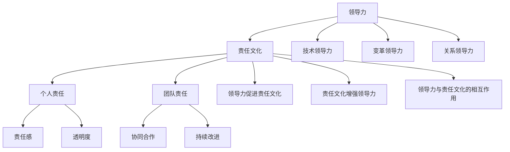

                 

### 领导力与责任文化的定义及重要性

#### 领导力的定义

领导力是指个体在团队中通过影响力、引导和激励来达成共同目标的能力。领导力不仅仅是指对权力的掌控，更重要的是对团队的带领和引领。领导力的核心在于激发团队成员的潜力，实现团队的高效协作和持续发展。

领导力可以分为多个层次，包括：

- **技术领导力**：基于专业知识和技能的领导力，主要体现在技术专家对团队的技术指导和决策中。
- **变革领导力**：推动团队变革、创新和进步的领导力，通常需要领导者具备强烈的愿景和执行力。
- **关系领导力**：基于建立和维护良好人际关系的领导力，强调领导者对团队成员的关心和支持。

#### 责任文化的定义

责任文化是一种价值观和行为准则，强调个体和团队对目标和成果的责任感。在责任文化中，每个人都清楚地了解自己的角色和责任，并承诺为实现共同目标而努力。

责任文化的主要特点包括：

- **透明度**：团队成员了解团队目标和责任分配，责任和成果对每个人都透明可见。
- **责任感**：每个人对自己的行为和结果负责，勇于承担失败和成功的责任。
- **协同合作**：团队成员之间相互依赖，共同承担责任，形成良好的协作氛围。
- **持续改进**：团队不断反思和改进，以提高责任感和绩效。

#### 领导力与责任文化的联系

领导力和责任文化之间存在着密切的联系。领导力是构建责任文化的基础，而责任文化则是领导力发挥作用的保障。

1. **领导力促进责任文化的形成**：领导者通过自身的榜样作用和明确的目标设定，激发团队成员的责任感。领导者的沟通、激励和监督能力对于建立责任文化至关重要。

2. **责任文化增强领导力的效果**：责任文化能够增强团队的凝聚力和执行力，使领导者的决策和指导更加有效。在责任文化中，团队成员更加主动、积极地参与到团队工作中，提高了整体绩效。

3. **领导力与责任文化的相互作用**：领导力和责任文化相互作用、相互促进。领导力的提升有助于构建更加健康的责任文化，而责任文化的形成又能进一步推动领导力的提升。

总之，领导力和责任文化是相辅相成的，共同构建一个高效、和谐的工作环境。在接下来的章节中，我们将深入探讨领导力的发展、责任文化的构建以及二者之间的互动关系。

### Mermaid 流程图：领导力与责任文化的核心概念架构

在这个流程图中，领导力（A）是核心概念，它通过不同的子类型（I、J、K）与责任文化（B）相联系。责任文化（B）又分解为个人责任（C）和团队责任（D），其中个人责任（C）强调责任感（E）和透明度（F），而团队责任（D）则关注协同合作（G）和持续改进（H）。此外，领导力与责任文化之间存在着双向的促进（L、M）和相互作用（N），形成了一个动态的互动关系。

### 领导力的发展

领导力的发展是一个持续的过程，它不仅依赖于个人的特质和能力，还需要不断地学习、实践和反思。下面，我们将从几个方面来探讨领导力的发展。

#### 个人特质与领导力

个人特质是领导力发展的基础。一些关键的特质包括：

- **自信**：自信的领导者能够赢得团队的信任和尊重，勇于承担责任并面对挑战。
- **沟通能力**：良好的沟通能力是领导者必备的技能，包括倾听、表达和反馈等方面。
- **决策能力**：领导者需要在复杂和不确定的环境中做出明智的决策，这需要他们具备良好的判断力和分析能力。
- **情感智力**：情感智力是指领导者理解和管理自己及他人的情绪的能力，这对于建立和维护团队关系至关重要。
- **适应性**：在快速变化的环境中，领导者需要具备快速适应和调整的能力。

#### 自我评估与反思

自我评估是领导力发展的重要环节。领导者可以通过以下方法进行自我评估：

- **360度反馈**：收集来自团队成员、上级和其他相关人员的反馈，以了解自己的优点和不足。
- **个人发展计划**：根据自我评估的结果，制定个人发展计划，设定目标和行动计划。
- **定期反思**：通过定期反思，领导者可以总结自己的经验和教训，不断提升自身的领导力。

#### 持续学习

学习是领导力发展的源泉。领导者需要不断学习新的知识和技能，以适应不断变化的环境和需求。以下是一些有效的学习方法：

- **阅读**：通过阅读相关的书籍、文章和案例研究，领导者可以获取丰富的知识和经验。
- **培训**：参加专业培训课程，了解最新的领导力理论和实践。
- **实践**：通过实际的工作和项目，领导者可以将理论知识应用到实践中，不断提升自己的领导能力。
- **导师制**：寻找一位经验丰富的导师，向他们请教问题并学习他们的领导方法。

#### 案例分析：乔布斯的领导力发展

乔布斯是现代最具影响力的领导者之一，他的领导力发展经历给我们提供了很多启示。

1. **早期经历**：乔布斯在年轻时就开始展现出色的领导才能。他在苹果公司的创立初期，通过敏锐的商业洞察力和对产品极致的追求，赢得了团队的信任和尊重。
2. **自我反思**：在1985年离开苹果后，乔布斯反思自己的领导风格和方法，意识到需要改进自己的沟通和团队合作能力。
3. **学习与成长**：乔布斯不断学习新的知识和技能，如设计、市场营销和人力资源管理等，并将这些知识应用到自己的工作中。
4. **回归苹果**：在1997年回归苹果后，乔布斯通过一系列创新和改革，带领苹果公司重新崛起，成为全球最具价值的公司之一。

乔布斯的领导力发展经历表明，领导力是一个持续的过程，需要不断地学习、实践和反思。通过不断地提升自己，领导者可以更好地引领团队，实现共同的目标。

总之，领导力的发展是一个多维度的过程，它需要领导者具备多种特质和能力，并通过自我评估、持续学习和实践来不断提升。在接下来的章节中，我们将进一步探讨如何构建和培养责任文化，以实现个人与团队的发展。

### 责任文化的构建

责任文化是一种组织价值观和行为准则，它强调个体和团队对目标和成果的责任感。构建一个健康的责任文化需要从多个方面进行努力，包括明确责任分配、建立有效的监督和反馈机制，以及培养团队成员的责任感。下面，我们将详细探讨这些方面。

#### 责任分配与明确

责任文化的首要任务是明确责任分配。这包括：

1. **角色定义**：为每个团队成员明确其角色和职责，确保每个人清楚自己的工作内容和目标。
2. **任务分解**：将大任务分解为小任务，明确每个小任务的负责人，确保任务的执行和监督。
3. **透明度**：确保团队成员了解整个项目的进展和责任分配，增加透明度，减少误解和冲突。

为了更好地实现责任分配，组织可以采用以下方法：

- **制定岗位职责说明书**：详细列出每个岗位的职责和权限，确保每个人都清楚自己的工作内容和目标。
- **项目任务分解图**：使用项目任务分解图（Work Breakdown Structure，WBS）将项目任务分解为可管理的部分，明确每个部分的负责人。
- **定期沟通**：定期召开会议，确保团队成员了解项目的最新进展和责任分配情况。

#### 责任监督与反馈

建立有效的责任监督和反馈机制是责任文化构建的关键。这包括：

1. **监督机制**：建立监督机制，确保每个任务都有人负责监督，确保任务的完成质量。
2. **反馈机制**：建立反馈机制，及时收集和传达团队成员的工作情况和绩效反馈，帮助他们改进和提高。

为了实现有效的监督和反馈，组织可以采用以下方法：

- **定期检查**：定期检查任务的进展情况，确保任务按计划进行，及时发现问题并解决。
- **绩效评估**：定期进行绩效评估，评估团队成员的工作绩效，提供具体的反馈和建议。
- **团队会议**：定期召开团队会议，讨论项目的进展、问题和解决方案，确保团队目标的一致性。

#### 责任激励与文化建设

除了监督和反馈，激励和文化建设也是构建责任文化的重要方面。这包括：

1. **激励制度**：建立激励制度，对表现出色的团队成员进行奖励和认可，激励他们保持高水平的责任心和绩效。
2. **文化建设**：营造积极向上的团队文化，强调责任、信任和协作，使团队成员在共同价值观的引导下，自觉承担起自己的责任。

为了实现有效的激励和文化建设，组织可以采用以下方法：

- **奖励与认可**：对表现出色的团队成员进行物质奖励和荣誉认可，提高他们的积极性和责任感。
- **团队建设活动**：定期组织团队建设活动，增强团队成员之间的信任和合作，提高团队的凝聚力和向心力。
- **价值观培训**：开展价值观培训，帮助团队成员理解和认同组织的核心价值观，培养他们的责任意识。

总之，构建责任文化需要从责任分配、监督与反馈、激励与文化建设等多个方面进行综合努力。通过明确的责任分配、有效的监督和反馈机制、合理的激励制度以及积极向上的文化建设，组织可以培养出一个充满责任感、高效协作的团队。

### 责任文化与团队绩效的关系

责任文化不仅对团队成员的行为和态度产生深远影响，还直接关联到团队的整体绩效。理解这种关系，有助于我们更好地认识到责任文化在团队管理中的重要性。

#### 责任文化提高团队执行力

责任文化强调个体和团队对目标的承诺和责任感，这种承诺和责任感转化为团队执行力。在责任文化中，每个成员都清楚自己的角色和责任，并自觉地为实现团队目标而努力。这种自觉性使得团队成员更加专注和投入，从而提高团队执行力。

- **案例研究**：在谷歌，责任文化被融入到公司的日常运营中。员工被赋予更多的自主权和责任，鼓励他们提出创意和解决问题。这种文化不仅激发了员工的积极性，还显著提高了团队的执行力，使谷歌成为全球最具创新力的公司之一。

#### 责任文化促进团队合作

责任文化鼓励团队成员之间建立信任和协作关系。在责任文化中，团队成员相互依赖，共同承担责任，形成良好的团队合作氛围。这种氛围有助于成员之间分享资源、知识和经验，从而提高团队的整体效能。

- **案例研究**：在《精益创业》一书中，作者埃里克·莱斯（Eric Ries）描述了精益创业公司如何通过责任文化实现高效的团队合作。团队成员共同承担责任，快速迭代产品，迅速适应市场变化，从而在竞争激烈的市场中取得成功。

#### 责任文化提升决策质量

责任文化鼓励团队成员参与决策过程，使决策更加民主和全面。在责任文化中，成员不仅了解自己的责任，还了解团队的整体目标和决策逻辑。这种透明度有助于提高决策的质量和可行性，减少决策失误。

- **案例研究**：在特斯拉，埃隆·马斯克（Elon Musk）通过建立开放和透明的决策文化，鼓励员工参与决策，提高决策的全面性和正确性。这种文化不仅提升了决策质量，还增强了员工对决策的认同感，从而提高了团队的执行力度。

#### 责任文化增强团队韧性

责任文化能够增强团队的韧性和适应力。在面对困难和挑战时，责任文化使团队成员能够保持积极的态度，共同克服困难，实现团队目标。

- **案例研究**：在2020年疫情期间，许多企业面临前所未有的挑战。然而，那些拥有强大责任文化的企业，如亚马逊和阿里巴巴，通过快速调整和适应，保持了业务的连续性和增长。这种韧性不仅源于企业的责任文化，还在于团队成员对责任和目标的深刻理解。

总之，责任文化通过提高团队执行力、促进团队合作、提升决策质量和增强团队韧性，显著提升了团队的整体绩效。理解这种关系，有助于我们在实际工作中更加重视责任文化的构建和培养。

### 从个人责任到团队责任的过渡

在领导力和责任文化的构建过程中，从个人责任向团队责任的过渡是一个关键且复杂的阶段。这一过渡不仅涉及到个人角色的转变，还需要组织在文化和结构上进行相应的调整。以下是这一过渡的具体步骤和注意事项。

#### 明确个人责任

在过渡过程中，首先需要明确每个团队成员的个人责任。这包括：

- **角色定位**：确保每个成员都清楚自己的角色和职责，明确其在团队中的定位。
- **目标设定**：为每个成员设定明确的目标和期望，确保这些目标与团队目标相一致。
- **资源提供**：为成员提供必要的资源和支持，帮助他们在执行个人责任时更加高效。

#### 建立团队意识

个人责任向团队责任的过渡要求成员从个人导向转向团队导向。为此，组织可以采取以下措施：

- **团队建设活动**：定期组织团队建设活动，增强成员之间的信任和合作，提高团队凝聚力。
- **团队目标设定**：确保团队目标明确、具体，并与个人目标紧密关联，使成员意识到自己在团队中的价值和作用。
- **共同决策**：鼓励成员参与团队决策，增强他们对团队目标的认同感和责任感。

#### 调整组织结构

为了更好地实现从个人责任到团队责任的过渡，组织需要在结构和流程上进行调整：

- **跨职能团队**：建立跨职能团队，使不同部门或职能的成员能够共同协作，提高整体效率。
- **扁平化管理**：减少管理层级，提高决策效率，使团队成员更容易了解和参与决策过程。
- **责任共担**：建立责任共担机制，使团队成员在遇到问题时能够共同承担责任，促进团队合作。

#### 激励机制

在过渡过程中，建立合理的激励机制是至关重要的。以下是一些有效的激励措施：

- **绩效评估**：制定科学的绩效评估体系，将个人绩效与团队绩效相结合，激励成员为团队目标努力。
- **奖励制度**：设立团队奖励制度，对在团队中表现出色的成员给予奖励，提高他们的积极性和责任感。
- **晋升机制**：建立与团队责任表现相关的晋升机制，激励成员不断提升自己的能力，为团队贡献更多。

#### 持续沟通和反馈

从个人责任到团队责任的过渡需要持续的沟通和反馈：

- **定期会议**：定期召开团队会议，讨论团队进展、问题和解决方案，确保团队成员对团队目标保持一致。
- **开放沟通**：鼓励成员在团队中开放沟通，分享自己的想法和意见，增强团队协作和信任。
- **反馈机制**：建立有效的反馈机制，及时收集和传达团队成员的工作情况和绩效反馈，帮助他们改进和提高。

#### 注意事项

在从个人责任到团队责任的过渡过程中，组织需要注意以下事项：

- **尊重个体差异**：尊重每个成员的个人差异和特长，合理安排工作，使每个成员都能在团队中发挥自己的优势。
- **避免过度依赖**：避免过度依赖个别成员，鼓励团队整体合作，防止因个人问题影响团队绩效。
- **持续培养**：持续培养团队成员的团队协作和责任感，使他们能够更好地适应团队环境，为团队目标努力。

通过明确个人责任、建立团队意识、调整组织结构、建立激励机制、持续沟通和反馈以及注意相关事项，组织可以顺利实现从个人责任到团队责任的过渡，构建一个高效、协作的团队。

### 建立团队责任文化的最佳实践

建立团队责任文化是一个复杂而持续的过程，需要组织在多个方面进行系统性的努力。以下是一些最佳实践，这些实践已被证明在构建团队责任文化方面非常有效。

#### 明确责任分配

明确的责任分配是团队责任文化的基础。组织应确保每个团队成员都清楚自己的角色、职责和目标。以下是一些具体做法：

- **岗位职责说明书**：为每个岗位制定详细的岗位职责说明书，明确其职责、工作内容和预期成果。
- **角色扮演**：通过角色扮演活动，帮助团队成员理解自己的职责和团队其他成员的角色，提高协作效率。
- **定期更新**：定期审查和更新岗位职责说明书，确保其与实际工作需求相匹配。

#### 建立信任与沟通

信任和沟通是团队责任文化的重要组成部分。建立信任和沟通机制有助于增强团队成员之间的合作和责任感。以下是一些具体做法：

- **开放沟通**：鼓励团队成员在任何时候都可以自由表达意见和反馈，建立开放和透明的沟通环境。
- **定期会议**：定期召开团队会议，讨论项目进展、问题和解决方案，确保团队成员对团队目标保持一致。
- **团队建设活动**：组织团队建设活动，增强团队成员之间的信任和合作，提高团队凝聚力。

#### 建立激励与反馈机制

有效的激励与反馈机制可以激励团队成员为实现团队目标而努力，同时帮助他们在责任文化的熏陶中不断成长。以下是一些具体做法：

- **绩效评估**：制定科学的绩效评估体系，将个人绩效与团队绩效相结合，激励团队成员为团队目标努力。
- **奖励制度**：设立团队奖励制度，对在团队中表现出色的成员给予奖励，提高他们的积极性和责任感。
- **反馈与辅导**：建立反馈与辅导机制，及时收集和传达团队成员的工作情况和绩效反馈，帮助他们改进和提高。

#### 培养团队领导力

团队领导力是团队责任文化的重要组成部分。培养团队成员的领导力有助于他们在团队中发挥更大的作用，同时推动团队责任文化的形成。以下是一些具体做法：

- **领导力培训**：组织领导力培训课程，帮助团队成员掌握领导力知识和技能。
- **角色示范**：通过领导者的示范作用，帮助团队成员了解和认同领导力的重要性和方法。
- **实践机会**：为团队成员提供实践领导力的机会，鼓励他们在实际工作中提升领导能力。

#### 持续培养与改进

团队责任文化的建立是一个持续的过程，需要组织不断培养和改进。以下是一些具体做法：

- **文化宣传**：通过内部宣传和教育活动，宣传团队责任文化的理念和重要性，提高全体成员的认识。
- **定期反思**：定期组织团队反思会议，总结团队的工作经验和教训，不断优化团队责任文化。
- **外部学习**：借鉴其他组织的成功经验，学习先进的管理理念和方法，为团队责任文化的建立提供参考。

通过以上最佳实践，组织可以有效地建立团队责任文化，促进团队成员之间的协作和责任感，提高团队的整体绩效。在接下来的章节中，我们将进一步探讨如何在实际工作中实施和评估责任文化。

### 实施责任文化的挑战与解决方案

在实施责任文化过程中，组织可能会面临一系列挑战，这些挑战包括文化变革、成员抵触和资源限制等。下面，我们将详细讨论这些挑战，并提出相应的解决方案。

#### 文化变革

文化变革是实施责任文化时最常见的挑战之一。传统的组织文化可能更加注重个人成就和竞争，而责任文化强调团队合作和共享责任。这种文化差异可能导致成员的抵触和误解。

**挑战**：成员可能对新的责任文化感到困惑或抵触，认为这是对个人权利的剥夺。

**解决方案**：

- **宣传和沟通**：通过内部宣传和教育活动，向全体成员解释责任文化的理念和重要性，消除误解和疑虑。
- **领导者的示范作用**：领导者应该通过自身的行动和示范，展示责任文化的价值，成为团队成员的榜样。
- **逐步实施**：避免一步到位，可以采取逐步推进的方式，逐步引导成员适应新的责任文化。

#### 成员抵触

在实施责任文化过程中，一些成员可能会表现出明显的抵触情绪。这可能是由于他们对变化的恐惧、对未知的担忧，或者认为新的责任文化对他们的个人利益构成威胁。

**挑战**：成员的抵触情绪可能导致团队分裂，影响责任文化的实施效果。

**解决方案**：

- **倾听和尊重**：领导者应该倾听成员的担忧和意见，尊重他们的感受，通过沟通和理解来缓解抵触情绪。
- **参与和反馈**：鼓励成员参与责任文化的构建和实施过程，让他们感到自己的意见被重视，增加他们的参与感和归属感。
- **提供培训和支持**：为成员提供相关的培训和指导，帮助他们适应新的责任文化，并提供必要的技术和支持。

#### 资源限制

实施责任文化需要一定的资源投入，包括时间、人力和资金。然而，许多组织可能面临资源紧张的情况，这可能导致责任文化的实施受阻。

**挑战**：资源限制可能导致责任文化的实施进程缓慢，甚至无法持续。

**解决方案**：

- **优先级管理**：在资源有限的情况下，明确责任文化的实施优先级，确保关键环节得到充分资源支持。
- **寻求外部资源**：通过合作伙伴、外部咨询机构等方式，寻求外部资源和支持，以弥补内部资源的不足。
- **灵活调整**：根据实际情况灵活调整责任文化的实施计划，确保在资源有限的情况下仍然能够持续推进。

通过以上解决方案，组织可以克服实施责任文化过程中遇到的挑战，推动责任文化的建立和持续发展。

### 责任文化的评估与改进

责任文化的评估与改进是确保责任文化有效实施和持续发展的重要环节。以下是一些关键指标和方法，用于评估责任文化的实施效果，并提出改进措施。

#### 关键指标

1. **责任意识**：评估团队成员对责任文化的理解和认同程度，包括他们对个人和团队责任的认知和承担情况。
2. **协作效率**：评估团队协作的效率和质量，包括团队成员之间的沟通、合作和共同完成任务的能力。
3. **工作满意度**：评估团队成员的工作满意度和积极性，包括他们对工作环境、团队氛围和责任文化的满意度。
4. **绩效表现**：评估团队的整体绩效表现，包括任务的完成度、质量和创新性。
5. **文化认同**：评估团队成员对组织文化的认同程度，包括他们对组织价值观、使命和愿景的认同感。

#### 评估方法

1. **问卷调查**：通过问卷调查，收集团队成员对责任文化的看法和建议，了解他们的责任意识和工作满意度。
2. **绩效评估**：定期进行团队绩效评估，分析团队成员的责任履行情况和团队协作效率。
3. **员工访谈**：与团队成员进行一对一访谈，深入了解他们对责任文化的实际感受和意见。
4. **团队会议**：定期召开团队会议，讨论责任文化的实施情况，收集和反馈团队成员的意见和反馈。

#### 改进措施

1. **加强培训**：针对责任文化实施过程中出现的问题，组织相关的培训课程，提高团队成员的责任意识和协作能力。
2. **优化流程**：对责任文化实施过程中的流程和机制进行优化，确保责任分配明确、监督和反馈机制有效。
3. **激励与奖励**：建立合理的激励与奖励制度，对在责任文化实施中表现优秀的团队成员给予认可和奖励，提高他们的积极性和责任感。
4. **文化宣传**：通过内部宣传和教育活动，持续宣传责任文化的理念和重要性，增强团队成员的文化认同感。

通过有效的评估与改进措施，组织可以确保责任文化的实施效果，推动团队的持续发展和进步。

### 总结

本文详细探讨了领导力与责任文化构建的重要性，并从个人发展、团队责任和实施挑战等多个方面进行了深入分析。领导力不仅是个人特质的体现，更是团队高效协作的核心。责任文化则通过明确的责任分配、监督与反馈、激励与文化建设，确保团队目标的实现和持续发展。

在实施责任文化过程中，组织需要面对文化变革、成员抵触和资源限制等挑战。通过有效的评估与改进措施，组织可以确保责任文化的实施效果，推动团队的持续进步。

总之，领导力与责任文化的构建是一个系统性工程，需要组织在多个方面进行努力。通过持续的学习、实践和反思，领导者可以提升自己的领导能力，同时培养出一个高效、协作的团队。这不仅有助于提高团队绩效，还能为组织的长远发展奠定坚实基础。

### 结论

通过对领导力与责任文化构建的深入探讨，我们了解到这两者之间的密切联系和相互作用。领导力的发展不仅仅是个人的成长，更是团队协作和目标实现的基石。而责任文化的构建则通过明确的责任分配、监督与反馈、激励与文化建设，确保团队目标的实现和持续发展。

在领导力的培养过程中，领导者需要不断提升自己的沟通能力、决策能力、情感智力等关键特质，并通过自我评估、持续学习和实践来不断优化自己的领导风格。同时，领导者还应注重团队成员的个人发展，为他们提供成长的机会和资源，形成良好的团队氛围。

责任文化的构建则需要组织在多个方面进行努力。通过明确责任分配、建立监督和反馈机制、优化流程和激励机制，组织可以培养出一个充满责任感、高效协作的团队。责任文化不仅提升了团队的执行力，还增强了团队成员之间的信任和合作，促进了团队的创新和进步。

在实际工作中，组织应重视领导力与责任文化的构建，通过持续的宣传、培训和反思，推动这两者在团队中的深入实施。通过有效的领导力和责任文化的结合，组织可以更好地应对市场变化和挑战，实现长远的发展和成功。

### 拓展阅读

对于希望深入了解领导力与责任文化的读者，以下是一些推荐书籍和资源：

1. **《领导力五要素》（The Five Dysfunctions of a Team）**：作者帕特里克·莱西奥尼（Patrick Lencioni），通过生动的寓言故事，详细阐述了团队中常见的问题和解决方法。

2. **《责任的力量》（The Power of Full Engagement）**：作者汤姆·拉思（Jim Loehr）和托尼·施瓦茨（Tony Schwartz），探讨了如何在个人和团队层面上实现高效的责任感和能量管理。

3. **《责任者思维》（The Servant Leader）**：作者詹姆斯·M·格里姆（James M. Grashow），介绍了服务型领导者的理念和实务，强调领导者应将团队成员的需求和成长置于首位。

4. **在线课程**：诸如Coursera、Udemy等在线教育平台提供了众多关于领导力和责任文化的课程，适合不同层次的读者学习。

5. **行业报告和案例研究**：阅读和分析相关行业报告和案例研究，可以了解不同组织在领导力与责任文化构建方面的成功经验和挑战。

通过阅读这些书籍和资源，读者可以进一步加深对领导力与责任文化的理解，为实际工作提供有益的启示和实践指导。

### 作者信息

作者：AI天才研究院/AI Genius Institute & 禅与计算机程序设计艺术 /Zen And The Art of Computer Programming

AI天才研究院（AI Genius Institute）致力于推动人工智能领域的创新和发展，培养世界级的人工智能专家。同时，作者还致力于将禅宗智慧与计算机编程相结合，通过《禅与计算机程序设计艺术》一书，探索编程中的冥想之道。

