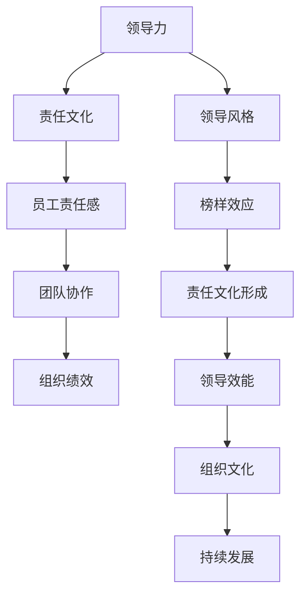

                 

### 引言

在现代企业的快速发展和变革中，领导力和责任文化的重要性日益凸显。领导力不仅是企业发展的核心动力，更是实现企业战略目标和可持续发展的重要保障。而责任文化则是一种深植于企业内部的文化价值观，它能够促进员工的主人翁精神，提高团队协作效率和创新能力。

本书《领导力与责任文化：培养主人翁精神》旨在探讨领导力和责任文化的深层内涵及其在实际应用中的具体实践。通过系统化地阐述领导力的基本原则、责任文化的构建方法以及如何培养员工的主人翁精神，本书旨在为企业领导者和管理者提供实用的理论指导和实践案例。

本文将从以下几个方面进行深入分析：

1. **领导力的基本理论和核心要素**：介绍领导力的定义、分类和发展历史，并探讨领导力与管理的区别。
2. **责任文化的构建和培养**：分析责任文化的概念和意义，详细讲解构建责任文化的步骤和方法。
3. **主人翁精神的培养和实际应用**：探讨主人翁精神在企业中的应用和培养方法，以及如何通过领导力和责任文化提升员工的自我驱动力。
4. **领导力与责任文化的实际应用案例**：分析国内外企业的成功和失败案例，总结经验教训。
5. **领导力与责任文化的跨文化应用**：探讨跨文化背景下领导力与责任文化的构建策略。
6. **领导力与责任文化的未来发展趋势**：展望数字化时代下领导力和责任文化的发展方向。

通过这些分析和探讨，我们希望能够为企业提供一套全面的领导力和责任文化培养方案，帮助企业在激烈的市场竞争中立于不败之地。

## 关键词

- 领导力
- 责任文化
- 主人翁精神
- 企业发展
- 组织管理
- 跨文化管理

## 摘要

本书《领导力与责任文化：培养主人翁精神》围绕领导力和责任文化的核心主题，从理论到实践，系统阐述了领导力的基本理论和核心要素，责任文化的构建方法，以及如何通过培养员工的主人翁精神提升企业的竞争力和创新能力。本书通过深入分析国内外企业的成功和失败案例，探讨了领导力与责任文化在实际管理中的应用，并提出了跨文化背景下领导力与责任文化的构建策略。未来，随着数字化的深入发展，领导力和责任文化也将迎来新的机遇和挑战。本书旨在为企业领导者和管理者提供实用的理论指导和实践参考，助力企业在快速变化的市场中实现可持续发展。

### 领导力的基本理论和核心要素

领导力是一种复杂而多维的概念，它在不同的文化和组织中有着不同的诠释。然而，其核心要素却具有普遍性，可以概括为影响力、沟通能力、决策能力和变革管理能力。

首先，影响力是领导力的核心之一。一个成功的领导者必须能够通过个人魅力、专业知识、价值观和道德标准来影响和激励团队成员。这种影响力不仅体现在日常工作中，更在于关键时刻的决策和行动上。一个领导者的影响力度，往往决定了团队的凝聚力和执行力。

其次，沟通能力是领导力不可或缺的一部分。有效的沟通不仅是信息传递的过程，更是建立信任、理解和支持的桥梁。领导者需要具备清晰表达自己的想法、倾听他人意见、理解团队需求和情感的能力。在全球化背景下，跨文化的沟通能力尤为重要，它可以帮助领导者更好地理解和协调多元团队的工作。

第三，决策能力是领导力的关键要素之一。领导者在面对复杂和不确定的情况时，需要快速做出明智的决策。这不仅要求领导者具备丰富的经验和知识，还需要他们具备前瞻性和创新思维。同时，领导者的决策过程需要透明和公正，以便获得团队成员的支持和信任。

最后，变革管理能力是领导力在当今快速变化环境中的一项重要能力。随着技术进步和市场变革的加速，企业需要不断地调整和变革以适应新的环境。领导者需要能够识别变革的必要性，制定合理的变革策略，并带领团队顺利度过变革期。这包括变革的规划和实施、变革过程中的沟通与激励，以及变革后的评估与调整。

领导力的分类可以根据不同的标准进行划分。一种常见的分类方式是根据领导者的行为和风格来划分，如服务型领导、变革型领导、授权型领导等。服务型领导强调领导者的服务精神，关注团队成员的需求和成长；变革型领导则强调通过变革推动组织的发展；授权型领导则注重赋予团队成员更多的自主权和责任。

另一种分类方式是根据领导力的情境来划分，如目标导向型领导、关系导向型领导等。目标导向型领导强调明确的目标设定和绩效导向，通过奖励和惩罚机制激励团队成员；关系导向型领导则更注重团队关系的建立和维护，通过情感和信任来推动团队工作。

此外，领导力的发展历史也是一个值得探讨的领域。从古代军事领导到现代商业领导，领导力的发展经历了多个阶段。早期的领导力主要依赖于个人的权威和武力；随着社会的发展，领导力逐渐向专业化和多元化转变；在当代，领导力更加注重团队合作、创新思维和跨文化管理。

总的来说，领导力是一个复杂而多维的概念，它不仅包括个人的能力和风格，还需要与组织情境和文化相匹配。了解领导力的基本理论和核心要素，可以帮助领导者更好地应对各种挑战，推动组织的持续发展和进步。

### 领导力与管理的区别

领导力与管理的区别在于它们的本质、目的和应用场景不同。首先，领导力是一种激励和引导团队成员的行为能力，而管理则是一种组织和协调资源以实现特定目标的过程。领导力更注重激发和发挥人的潜力，强调愿景、价值观和文化的重要性；而管理则更侧重于任务的执行、流程的控制和资源的优化。

其次，领导力通常与长期战略和变革相关，它关注如何引导团队朝着未来目标前进，并推动创新和持续改进；而管理则侧重于当前任务的执行和日常运营的维护。领导力常常需要面对不确定性和变化，强调灵活性和适应性；管理则更强调稳定性和可预测性。

在应用场景上，领导力更多地应用于组织的高层管理和变革过程中，它帮助领导者设定愿景、塑造文化、激励团队；而管理则广泛应用于组织的各个层次，包括日常运营、项目管理、流程优化等。有效的管理能够确保组织运作的高效和稳定，而卓越的领导力则能够推动组织的持续发展和突破。

总之，领导力与管理的区别在于它们在组织中扮演的不同角色和产生的不同影响。一个成功的组织需要两者相辅相成，共同推动组织的发展。

### 责任文化的概念与意义

责任文化是一种深植于企业内部的文化价值观，它强调员工在各自岗位上的责任感和使命感。这种文化不仅要求员工对自己的工作负责，还鼓励他们主动承担超出岗位职责的任务，为企业的发展贡献智慧和力量。责任文化的核心在于培养员工的自我驱动力和责任感，使其在工作中不仅追求绩效，更注重对整体团队的贡献。

责任文化的意义主要体现在以下几个方面：

首先，责任文化能够提升员工的职业素养和责任感。在一个具有强烈责任文化的企业中，员工会更加注重自身的行为和决策，对工作结果有更高的期待和追求。这种职业素养的提升不仅有助于提高个人绩效，还能增强团队的凝聚力和合作精神。

其次，责任文化有助于建立良好的企业文化。责任文化强调的是一种共同价值观，这种价值观能够引导员工形成共同的行为准则和道德标准。通过这种文化氛围的营造，企业能够形成积极向上的团队氛围，提升员工的工作满意度和忠诚度。

第三，责任文化能够促进企业的可持续发展。在一个具有强烈责任文化的企业中，员工更加愿意为企业的发展贡献自己的力量，这种主人翁精神能够激发企业的创新能力和市场竞争力。同时，责任文化还能够帮助企业应对外部挑战，提高企业的抗风险能力。

总的来说，责任文化不仅是一种企业管理理念，更是一种企业文化的核心组成部分。通过培养责任文化，企业能够形成强大的内在驱动力，推动组织的持续发展和进步。

### 构建责任文化的步骤和方法

构建责任文化是一个系统性的工程，需要从组织结构、制度设计、领导行为和文化传播等多个方面入手，以下是一些具体的步骤和方法：

**1. 建立明确的岗位职责和责任体系**

首先，企业需要明确每个岗位的职责和责任，确保每位员工都清楚自己的工作内容和期望的绩效标准。通过详细的岗位职责说明书和绩效评估体系，企业可以确保员工在工作中能够有明确的目标和责任。

**2. 设立责任管理制度**

建立一套完善的制度来规范员工的责任行为，包括奖惩机制、责任追究机制和责任转移机制等。通过制度设计，企业可以确保员工在承担责任时能够获得应有的回报和认可，同时对于不履行责任的行为进行适当的惩罚，以维护责任文化的严肃性。

**3. 提高员工的自我认知和责任感**

通过培训和教育，提高员工对责任文化的认知和理解，帮助他们树立正确的价值观和责任感。企业可以通过内部培训、研讨会和案例分析等方式，让员工了解责任文化的内涵和重要性，从而激发他们的自我驱动力。

**4. 营造积极的企业文化氛围**

在企业文化中融入责任文化的元素，通过企业价值观的传播和日常行为规范，营造一种积极向上、责任至上的文化氛围。企业可以通过内部刊物、员工大会和团队活动等方式，不断强化责任文化的影响力。

**5. 领导者的示范和引导作用**

领导者作为责任文化的践行者和传播者，需要以身作则，树立良好的榜样。领导者需要在日常工作中积极履行自己的责任，并对团队中的责任行为进行积极引导和激励。通过领导者的示范作用，可以影响和带动整个团队形成良好的责任文化。

**6. 强化沟通与反馈机制**

建立有效的沟通和反馈机制，让员工能够及时了解自己的责任履行情况，并得到及时的指导和支持。企业可以通过定期的绩效反馈、员工座谈会和匿名反馈等方式，确保员工的责任履行得到有效的监督和激励。

通过这些步骤和方法，企业可以逐步构建起一种健康、积极的责任文化，从而提升员工的职业素养和责任感，促进企业的持续发展和进步。

### 企业内部责任意识的培养

培养企业内部的责任意识是构建责任文化的重要一环。以下是一些具体的措施和方法，帮助企业提升员工的责任感：

**1. 建立明确的期望和目标**

企业首先需要明确每位员工的工作目标和期望，并通过岗位职责说明书和绩效评估体系将它们具体化。员工在清楚自己的职责和目标后，能够更加有针对性地履行责任。

**2. 强化培训和教育**

通过培训和教育，提高员工对责任文化的认知和理解。企业可以定期组织相关课程，如职业道德、团队合作和责任意识培训，帮助员工树立正确的价值观和责任感。

**3. 设立责任考核和激励机制**

建立一套完善的责任考核和激励机制，对员工的责任履行情况进行评估和反馈。通过奖励优秀的责任履行者，惩罚不履行责任的员工，企业可以有效地激发员工的责任心。

**4. 增强内部沟通和反馈**

营造开放、透明的沟通环境，让员工能够及时了解自己的责任履行情况，并得到有效的指导和帮助。企业可以通过定期的绩效反馈会议、员工座谈会和匿名反馈等方式，促进员工之间的沟通和合作。

**5. 领导者的示范作用**

领导者需要以身作则，树立良好的责任榜样。通过领导者的示范作用，可以影响和带动整个团队形成良好的责任文化。领导者需要在日常工作中积极履行自己的责任，并对团队中的责任行为进行积极引导和激励。

**6. 融入企业文化**

将责任文化融入企业价值观和行为规范，通过企业文化的传播和日常行为规范，营造一种积极向上、责任至上的文化氛围。企业可以通过内部刊物、员工大会和团队活动等方式，不断强化责任文化的影响力。

通过这些措施，企业可以逐步培养起员工的责任意识，形成一种健康、积极的责任文化，从而提升员工的职业素养和责任感，促进企业的持续发展和进步。

### 主人翁精神的重要性

主人翁精神是一种深植于个体内心的自我驱动力和责任感，它促使员工在职责之外主动承担更多的工作和责任，从而推动企业的整体发展和进步。这种精神不仅是员工个人成长的动力，更是企业持续创新和发展的基石。

首先，主人翁精神能够显著提升员工的自我驱动力。当员工感受到自己被信任和尊重，他们更有可能主动地追求卓越和进步。这种自我驱动力不仅体现在日常工作中的高效率和高质量，更体现在面对挑战和困难时的积极态度和创新能力。

其次，主人翁精神有助于提高团队的协作效率。具有主人翁精神的员工会更加注重团队合作，愿意在团队中发挥自己的优势和特长，从而提升团队的凝聚力和整体绩效。在一个充满主人翁精神的工作环境中，团队成员之间能够更加信任和依赖，减少内耗，提高协作效率。

此外，主人翁精神能够激发企业的创新活力。当员工拥有主人翁精神，他们不仅关注当前的工作任务，还会主动思考如何改进和创新，为企业的发展贡献智慧和创意。这种创新意识能够推动企业在激烈的市场竞争中保持领先地位，实现持续的发展和壮大。

总的来说，主人翁精神不仅是员工个人成长的动力，更是企业持续发展的关键。通过培养员工的主人翁精神，企业能够形成强大的内在驱动力，提升团队的协作效率，激发创新活力，从而在市场竞争中立于不败之地。

### 主人翁精神的培养方法

培养员工的主人翁精神是一个系统性工程，需要从多个方面进行努力。以下是一些具体的培养方法和策略：

**1. 明确目标和期望**

企业首先需要为每位员工设定清晰的目标和期望，确保员工明白自己的职责和贡献。通过明确的工作目标和绩效考核标准，员工能够更有针对性地发挥自己的能力和潜力，从而增强责任感和主人翁精神。

**2. 建立信任和尊重**

信任和尊重是培养主人翁精神的重要基石。企业需要通过领导者的示范作用和日常管理，建立一种相互信任和尊重的工作氛围。领导者应该给予员工更多的自主权，鼓励他们提出创新意见和解决方案，让员工感受到自己的价值和重要性。

**3. 提供发展机会和培训**

为员工提供持续的发展机会和培训是培养主人翁精神的有效途径。企业可以通过内部培训、职业发展规划和跨部门轮岗等方式，提升员工的技能和知识，帮助他们实现职业成长。这不仅能够增强员工的职业素养，还能激发他们的主人翁精神。

**4. 营造积极的工作环境**

一个积极向上的工作环境能够激发员工的主人翁精神。企业可以通过优化工作流程、改善工作条件和提供良好的工作氛围，提高员工的工作满意度和归属感。例如，定期组织团队建设活动、员工表彰大会和庆祝活动，增强员工的团队意识和责任感。

**5. 建立激励机制**

有效的激励机制能够激励员工发挥主人翁精神。企业可以通过奖励优秀员工、提供晋升机会和增加薪酬福利等方式，激励员工在工作中的积极表现。同时，建立公平、透明的奖励机制，确保每位员工的努力和贡献都能得到认可和回报，从而增强他们的责任感和归属感。

**6. 领导者的示范和引导**

领导者在培养员工主人翁精神中起着关键作用。领导者需要以身作则，树立良好的责任榜样，通过自己的言行影响和激励员工。领导者应该积极参与团队工作，关心员工的需求和成长，并在工作中给予员工充分的信任和支持。

通过这些培养方法和策略，企业可以逐步培养起员工的主人翁精神，提升团队的协作效率和创新能力，从而在激烈的市场竞争中立于不败之地。

### 主人翁精神在企业中的应用

主人翁精神在企业中的应用贯穿于企业的各个层面，不仅提升了员工的工作积极性和责任感，还促进了企业的整体绩效和可持续发展。以下是一些具体的应用案例和效果：

**1. 提升工作效率和质量**

在一个高度注重主人翁精神的企业中，员工普遍表现出较高的工作主动性和责任感。例如，某高科技企业的员工在了解到公司面临的市场挑战后，主动提出了多个创新方案，不仅提升了产品的市场竞争力，还显著提高了生产效率。通过这种主人翁精神，员工在解决问题的过程中不仅完成了自己的工作任务，还积极为团队和公司的发展贡献自己的智慧和力量。

**2. 强化团队合作和沟通**

主人翁精神能够显著提升团队的协作效率。在一个以主人翁精神为核心的企业文化中，员工更加愿意分享信息、协作解决问题。例如，某国际咨询公司通过强调主人翁精神，鼓励员工在项目中主动承担责任，不仅提高了项目的执行效率，还促进了团队内部的沟通和合作。团队成员在共同面对挑战和解决问题的过程中，建立了深厚的信任和合作关系，为企业创造了更大的价值。

**3. 促进创新和持续改进**

主人翁精神能够激发员工的创新意识和创造力。例如，某互联网公司在其企业文化中深深植入了主人翁精神，鼓励员工大胆尝试和探索。在这种文化氛围下，员工不仅关注自己的工作任务，还主动思考如何改进产品和服务，为公司带来了多个创新成果。这些创新不仅提升了公司的市场竞争力，还为公司的长期发展奠定了坚实基础。

**4. 增强客户满意度和忠诚度**

主人翁精神不仅体现在内部管理中，还能显著提升客户满意度和忠诚度。例如，某知名酒店通过培养员工的主人翁精神，让员工在服务过程中更加关注客户需求和体验。员工主动提供超出预期的服务，赢得了客户的广泛赞誉，大大提升了客户的满意度和忠诚度，为酒店创造了可观的商业价值。

**5. 促进企业的可持续发展**

主人翁精神有助于企业形成强大的内在驱动力，推动企业的持续发展和进步。例如，某环保公司在其企业文化中高度重视主人翁精神，鼓励员工在工作中积极承担社会责任和环境保护责任。这种主人翁精神不仅提升了公司的社会责任感，还促进了企业的可持续发展，为公司在市场中树立了良好的品牌形象。

通过以上案例，可以看出主人翁精神在企业中的应用不仅提升了员工的工作积极性和责任感，还显著提升了企业的整体绩效和竞争力。企业通过培养员工的主人翁精神，能够形成一种积极向上、创新进取的企业文化，为企业的长期发展注入持续动力。

### 领导力与责任文化的关系

领导力与责任文化之间存在着密切的联系和相互影响。首先，领导力为责任文化的形成提供了基础。一个有影响力的领导者能够通过其言行树立榜样，引导和推动企业建立责任文化。领导者的领导风格、价值观和决策方式直接影响员工的责任感和行为规范。

其次，责任文化反过来对领导力产生积极影响。在一个具有强烈责任文化的企业中，员工的责任感和自我驱动力会得到提升，这有助于领导者的工作更加顺畅和高效。责任文化能够减少内部摩擦和冲突，增强团队的凝聚力和执行力，从而为领导力的有效实施提供保障。

从理论上来说，领导力与责任文化之间的关系可以用以下 Mermaid 流程图表示：

在这个流程图中，领导力通过其风格和决策方式影响责任文化的形成，而责任文化进一步增强了员工的自我驱动力和团队协作，最终提升了组织绩效和持续发展能力。通过这种相互作用，领导力与责任文化共同构建了一个健康、积极的企业生态系统，为企业的长期成功提供了坚实基础。

### 领导力在责任文化中的作用

领导力在责任文化的构建和强化中发挥着关键作用，主要体现在以下几个方面：

首先，领导者作为企业文化的传播者和践行者，其言行直接影响员工的责任感。领导者的领导风格和决策方式不仅影响员工的行为规范，还塑造了企业的整体价值观。例如，一个以身作则、积极履行责任的领导者能够激励员工效仿，从而在企业内部形成一种积极的氛围。

其次，领导者的示范效应能够带动员工的积极性。当领导者通过实际行动展示其对责任文化的重视，员工会受到启发和激励，更加自觉地履行自己的职责。这种示范作用不仅提升了员工的责任感，还增强了团队的凝聚力和协作精神。

此外，领导者需要通过有效的沟通和激励措施，确保责任文化在企业内部得到广泛传播和认同。领导者可以通过定期的会议、培训和团队活动，向员工传达责任文化的重要性和期望，帮助他们理解并接受这种文化价值观。同时，领导者还需要通过奖励机制，对履行责任表现突出的员工进行表彰和激励，从而进一步巩固责任文化。

最后，领导者在责任文化的构建过程中需要具备前瞻性和创新思维。随着企业外部环境的不断变化，领导者需要不断调整和优化责任文化的实践方法，确保其能够适应新的挑战和需求。这种持续的创新和改进能力不仅有助于提升企业的竞争力，还能为责任文化的长远发展提供动力。

总的来说，领导力在责任文化的构建和强化中扮演着至关重要的角色。通过领导者的示范效应、有效的沟通和激励机制，企业能够逐步培养起一种健康的责任文化，为企业的持续发展和成功奠定坚实基础。

### 责任文化对领导力的影响

责任文化对领导力的影响是深远而多维的，它不仅改变了领导力的表现形式，还提升了领导者的效能。首先，责任文化强化了领导者的责任意识。在一个具有强烈责任文化的企业中，领导者不仅需要关注自身的工作绩效，还需要承担起对整个团队和组织发展负责的重任。这种责任意识使得领导者更加注重团队合作和长期目标，而不是短期的个人成就。

其次，责任文化提高了领导者的管理效能。在一个责任文化成熟的企业中，员工具有较高的责任感和自我驱动力，领导者不需要过多地干预日常事务，从而有更多的时间专注于战略规划和关键决策。这种环境下的领导者更注重培育人才、激发创新和推动变革，从而提升了整体管理效能。

此外，责任文化有助于构建信任和透明的工作氛围。责任文化强调透明和公正，领导者需要对自己的决策和行为负责，这有助于建立员工对领导的信任。信任是领导力的重要基础，一个充满信任的工作环境能够增强团队的凝聚力和合作精神，提高工作效率和创新能力。

最后，责任文化促进了领导者的持续成长。在一个注重责任的企业中，领导者需要不断学习和提升自己的能力，以应对不断变化的外部环境。这种持续的学习和改进不仅有助于领导者自身的成长，还能推动企业的整体发展。

总的来说，责任文化对领导力产生了积极而深远的影响，它不仅提升了领导者的责任意识和效能，还促进了企业的健康发展和持续创新。

### 领导力与责任文化的协同作用

领导力与责任文化的协同作用是推动企业可持续发展的重要动力。首先，领导力为责任文化的实施提供了方向和动力。一个有远见和领导力的领导者能够明确企业的愿景和目标，并通过有效的沟通和激励，使员工深刻理解并认同企业的责任文化。这种领导力的引导作用，不仅能够确保责任文化的有效传播，还能激发员工的主人翁精神，从而推动企业整体绩效的提升。

其次，责任文化为领导力的有效实施提供了基础和保障。在一个具有强烈责任文化的企业中，员工的责任感和自我驱动力会显著增强，这使得领导者能够更专注于战略规划和关键决策，而无需过多地干预日常事务。这种责任文化环境有助于提高领导者的管理效能，使其能够更有效地推动企业的变革和创新。

此外，领导力与责任文化的协同作用还体现在它们共同促进企业的可持续发展。领导力通过引领企业战略和推动组织变革，确保企业能够在不断变化的市场环境中保持竞争力；而责任文化则通过培养员工的自我驱动力和责任感，确保企业能够在内部形成强大的内在驱动力，从而实现长期稳定的发展。两者相互促进，共同为企业创造了持续发展的动力和基础。

具体来说，领导力与责任文化的协同作用可以表现在以下几个方面：

1. **共同推动创新**：领导力通过鼓励创新和变革，激发员工的创造力和创新意识；而责任文化则通过培养员工的自我驱动力和责任感，使创新成果能够得到有效落实和推广。

2. **提升团队协作**：领导力通过建立高效的沟通机制和团队合作模式，增强团队的凝聚力和协作效率；责任文化则通过培养员工的团队合作精神，使团队协作能够更加顺畅和高效。

3. **增强企业竞争力**：领导力通过战略规划和市场定位，提高企业的竞争力和市场占有率；责任文化则通过提升员工的职业素养和工作质量，增强企业的综合竞争力。

4. **实现长期发展**：领导力通过引领企业实现战略目标和持续改进，确保企业的长期发展；责任文化则通过培养员工的自我驱动力和责任感，为企业创造持续发展的内在动力。

总之，领导力与责任文化的协同作用不仅能够推动企业的短期发展，更能为企业的长期成功奠定坚实基础。通过二者的有机结合，企业能够实现更加高效、创新和可持续的发展，从而在激烈的市场竞争中立于不败之地。

### 领导力与责任文化在实际管理中的应用案例

为了更好地理解领导力与责任文化在实际管理中的应用，我们可以通过国内外几个成功的企业案例来进行详细分析。

#### 案例一：谷歌

谷歌以其独特的公司文化和强大的领导力著称，这种文化和领导力不仅推动了公司的技术创新，还促进了员工的自我驱动力和责任感。谷歌的领导力体现在其CEO拉里·佩奇和谢尔盖·布林对创新和员工自主性的高度重视。他们通过设立“20%时间”项目，允许员工将其工作时间的20%用于个人感兴趣的项目，这一举措不仅激发了员工的创造力，还培养了他们的责任感。

**分析**：
1. **领导力**：佩奇和布林通过领导力和个人魅力，激励员工追求卓越和创新，这种领导风格有助于构建责任文化。
2. **责任文化**：谷歌强调员工对项目的责任感和使命感，通过透明和公平的绩效考核机制，确保员工能够对自己的工作负责。

**效果**：这一领导力和责任文化的结合，使得谷歌在技术创新和公司发展方面取得了显著成就，成为全球科技行业的领军企业。

#### 案例二：阿里巴巴

阿里巴巴通过其创始人马云的领导力和独特的公司文化，成功地将责任文化融入企业的日常管理中。马云强调“客户第一、员工第二、股东第三”的价值观，使员工在为客户提供优质服务的同时，也能够承担起对团队和公司的责任。

**分析**：
1. **领导力**：马云通过其领导力和价值观的传播，建立了强大的企业文化，使员工在追求个人成长的同时，也注重团队和公司的利益。
2. **责任文化**：阿里巴巴通过设立员工股权激励计划，使员工能够感受到自己与公司共同成长的责任和使命感。

**效果**：这种领导力和责任文化的结合，使得阿里巴巴在电子商务领域取得了巨大成功，并在全球范围内建立了强大的品牌影响力。

#### 案例三：海尔

海尔通过其“人单合一”管理模式，实现了领导力与责任文化的有效结合。海尔的领导者张瑞敏通过强调员工的主观能动性和责任感，推动了企业的持续创新和发展。

**分析**：
1. **领导力**：张瑞敏通过其坚定的领导和变革精神，推动海尔从传统的制造企业转型为全球化的创新型企业。
2. **责任文化**：海尔通过建立明确的岗位职责和绩效评估体系，使员工能够对自己的工作负责，并通过股权激励等方式，增强员工的归属感和责任感。

**效果**：这种领导力和责任文化的结合，使得海尔在激烈的市场竞争中保持了持续的创新能力和市场竞争力。

#### 总结

通过以上案例分析，我们可以看到，领导力与责任文化的结合在企业实际管理中的应用，不仅能够激发员工的自我驱动力和责任感，还能够提升企业的整体绩效和竞争力。这些成功案例为其他企业提供了宝贵的经验和启示，证明了领导力与责任文化在企业可持续发展中的重要性。

### 领导力与责任文化在跨文化管理中的应用

在全球化背景下，跨文化管理日益成为企业发展的关键因素。领导力与责任文化在这一过程中发挥着至关重要的作用。以下将探讨领导力与责任文化在跨文化管理中的具体应用及其策略。

首先，领导者需要具备跨文化沟通能力。有效的跨文化沟通不仅能够消除误解和冲突，还能增强团队成员之间的信任和合作。领导者应学会如何在不同文化背景下进行有效沟通，理解并尊重不同文化中的价值观和行为规范。例如，在西方文化中，直接的沟通和明确的目标设定往往更为重要；而在东方文化中，间接沟通和关系建立则更加突出。领导者需要根据不同文化背景，灵活调整沟通策略，以确保信息传递的准确性和有效性。

其次，责任文化在跨文化管理中的应用需要考虑到不同文化对责任的不同理解。在一些文化中，责任可能更强调集体责任和义务，而在另一些文化中，责任则更多指向个人和自我驱动。例如，在亚洲文化中，团队合作和集体荣誉感往往更为重要；而在北美文化中，个人成就和自我实现则更为突出。为了在跨文化团队中培养责任感，企业需要制定一套灵活的责任体系，既能适应不同文化的特点，又能确保整体目标的实现。

此外，领导者需要关注跨文化团队中的冲突和分歧，通过有效的领导力和责任文化来化解这些冲突。跨文化团队中可能因为文化差异而产生误解和矛盾，领导者应积极引导团队成员进行开放和坦诚的沟通，通过建设性的对话解决冲突。同时，领导者需要建立一套公平和透明的责任追究机制，确保每位员工都能在公平的环境中履行自己的职责。

为了更好地实现领导力与责任文化的跨文化应用，企业可以采取以下策略：

1. **跨文化培训**：为领导者和员工提供跨文化管理培训，帮助大家了解不同文化的特点和沟通方式，增强跨文化沟通能力。

2. **建立多元化的团队**：通过建立多元化的团队，促进不同文化之间的交流和学习，提高团队的整体适应能力和创新能力。

3. **制定灵活的责任体系**：根据不同文化背景，制定灵活的责任体系，确保责任文化在不同文化背景下都能得到有效实施。

4. **鼓励开放和坦诚的沟通**：建立开放和坦诚的沟通文化，鼓励团队成员在遇到问题时积极寻求解决方案，而不是回避或隐藏。

5. **领导者的示范作用**：领导者需要以身作则，通过自己的言行展示跨文化管理的最佳实践，成为跨文化团队中的榜样。

通过这些策略，企业可以更好地实现领导力与责任文化的跨文化应用，提升跨文化团队的管理效能，促进企业的全球化发展。

### 数字化对领导力与责任文化的影响

随着数字化时代的到来，领导力和责任文化面临着前所未有的挑战和机遇。数字化技术的广泛应用不仅改变了企业的运营模式，也对领导力和责任文化产生了深远的影响。

首先，数字化技术的普及和深度应用，对领导者的角色和技能提出了新的要求。在数字化环境中，领导者需要具备更强的数据分析和决策能力，能够快速适应和应对市场变化。同时，数字化技术也使得领导者的沟通方式和管理方式发生了变化，领导者需要更多地依靠数字化工具和平台进行沟通和协作，这要求他们具备一定的技术素养和数字化领导能力。

其次，数字化对责任文化的影响主要体现在责任分配和责任监督方面。在传统的组织结构中，责任往往较为明确和固定，但在数字化环境下，任务和角色的边界变得模糊，员工的职责可能需要根据项目需求动态调整。这种变化要求企业建立一套适应数字化环境的责任文化，确保员工能够在快速变化的工作环境中，清晰了解自己的职责和任务，并能够灵活应对。

此外，数字化还促进了企业内部的信息透明度和问责机制。在数字化平台的支持下，企业可以实时监控和追踪员工的工作进展和绩效表现，这有助于提高员工的责任感和自律性。同时，数字化技术也为企业建立公平、透明的责任追究机制提供了可能，使得责任文化和问责机制更加规范和有效。

为了适应数字化时代的发展，企业需要采取以下措施来优化领导力和责任文化：

1. **提升领导者的数字化素养**：通过培训和实践，提升领导者的数字化技能和素养，使其能够更好地适应数字化环境。

2. **建立灵活的责任文化**：根据数字化环境的特点，重新审视和调整企业的责任文化，确保员工能够在动态变化中明确自己的职责和任务。

3. **加强信息透明度**：通过数字化工具，提高企业内部的信息透明度，让员工能够实时了解工作进展和绩效表现。

4. **完善问责机制**：利用数字化技术，建立更加规范和透明的责任追究机制，确保责任文化和问责机制的落地和执行。

5. **推动数字化转型**：积极推动企业的数字化转型，利用数字化技术提升企业的运营效率和管理效能。

通过这些措施，企业可以在数字化时代中优化领导力和责任文化，提升员工的自我驱动力和责任感，从而在激烈的市场竞争中立于不败之地。

### 领导力与责任文化的未来发展趋势

随着全球化和数字化进程的加速，领导力与责任文化在未来将面临诸多挑战和机遇，其发展趋势主要体现在以下几个方面：

首先，领导力的数字化转变将成为未来领导力发展的重要方向。随着大数据、人工智能和物联网等技术的广泛应用，领导者需要具备更强的数据分析和决策能力，能够快速适应和应对复杂的市场环境。数字化领导力不仅要求领导者具备技术素养，还需要他们能够在数字化环境中进行有效沟通和协作，推动企业的数字化转型和创新发展。

其次，责任文化的全球化趋势将日益显著。全球化背景下，企业需要面对多元化的文化和价值观，这要求责任文化不仅要适应不同文化背景，还需要具备全球视野和跨文化沟通能力。企业需要通过建立全球化责任体系，确保在全球范围内能够公平、透明地履行责任，提升企业的国际竞争力。

第三，可持续发展的责任文化将成为未来企业的重要价值观。在应对气候变化、资源短缺和社会责任等问题上，企业需要承担更多的社会责任。未来，企业将更加注重可持续发展，通过环保措施、社会责任项目和公益行动，提升企业的社会形象和品牌价值。

第四，领导力的个性化和多元化趋势也将逐步显现。未来，领导者将更加注重个性化和多元化，根据员工的个性和需求进行差异化管理和激励。同时，领导者的多样性也将成为企业竞争优势的重要来源，多元化背景的领导者能够带来不同的视角和创意，推动企业的创新和发展。

最后，领导力与责任文化的创新将继续是未来发展的关键。企业需要通过不断探索和实践，创新领导力和责任文化的理论和实践方法，以应对快速变化的市场环境和挑战。通过引入新的管理理念、技术和工具，企业可以不断提升领导力和责任文化的实施效果，为企业的可持续发展提供强有力的支持。

总的来说，未来领导力与责任文化的发展将更加注重数字化、全球化、可持续化和个性化，企业需要通过不断适应和创新，提升自身的领导力和责任文化水平，以应对未来的挑战和机遇。

### 总结与未来展望

通过对领导力与责任文化的深入探讨，我们可以看到，这两个要素在企业的可持续发展中具有至关重要的地位。领导力不仅为企业提供了战略方向和决策支持，还激发了员工的创新能力和团队协作精神；而责任文化则通过培养员工的自我驱动力和责任感，提升了企业的整体绩效和竞争力。

展望未来，随着全球化和数字化进程的加速，领导力与责任文化将面临新的机遇和挑战。企业需要不断创新和适应，以应对快速变化的市场环境和客户需求。具体建议如下：

1. **加强数字化领导力培训**：提升领导者的数字化素养和数据分析能力，以应对数字化时代的挑战。
2. **建立全球责任体系**：根据不同文化背景，制定灵活的责任文化，确保企业能够在全球范围内公平、透明地履行责任。
3. **推动可持续发展**：通过环保措施和社会责任项目，提升企业的社会形象和品牌价值。
4. **注重个性化和多元化**：根据员工的个性和需求进行差异化管理和激励，促进企业的创新和发展。

通过这些措施，企业可以不断提升领导力和责任文化水平，为未来的可持续发展奠定坚实基础。

### 拓展阅读

为了更深入地理解领导力与责任文化，以下是几本推荐阅读的书籍：

1. **《领导力五项修炼：从技术领导走向管理领导》** —— 作者：约翰·马登（John M. cadine）。
   - 内容摘要：本书详细阐述了从技术领导向管理领导转变的五项关键能力，包括建立信任、沟通技巧、决策能力、团队建设和战略思维。

2. **《责任驱动：从个体到组织的转变》** —— 作者：罗伯特·希斯（Robert H. Schaffer）。
   - 内容摘要：本书探讨了如何通过责任文化来提升组织的整体绩效和员工的工作满意度，提出了具体的实施策略和案例分析。

3. **《责任领导：如何在复杂世界中领导他人》** —— 作者：约翰·凯利（John Kelly）。
   - 内容摘要：本书从心理学和管理学的角度，分析了责任领导的重要性，并提供了实用的方法和工具，帮助领导者更好地履行责任，提升团队绩效。

4. **《企业文化与绩效：构建竞争优势》** —— 作者：詹姆斯·库泽斯（James M. Kouzes）和巴里·波斯纳（Barry Z. Posner）。
   - 内容摘要：本书详细阐述了企业文化对企业绩效的深远影响，提供了构建积极企业文化的策略和方法，帮助企业在激烈的市场竞争中脱颖而出。

通过阅读这些书籍，读者可以进一步深化对领导力与责任文化的理解，为实际管理工作提供有益的启示和指导。

### 附录

#### 附录A 领导力与责任文化相关术语解释

- **领导力**：指领导者通过影响和激励他人，实现组织目标的能力。包括影响力、沟通能力、决策能力和变革管理能力等。
- **责任文化**：一种深植于企业内部的文化价值观，强调员工在各自岗位上的责任感和使命感。
- **主人翁精神**：指员工在工作中的自我驱动力和责任感，表现为主动承担任务、追求卓越和乐于贡献。
- **绩效管理**：一种通过设定目标、评估绩效、反馈和激励，提升员工工作表现的管理方法。
- **团队建设**：通过共同活动和协作，增强团队成员之间的信任、沟通和合作，提高团队整体绩效。

#### 附录B 领导力与责任文化研究方法介绍

- **案例研究法**：通过深入研究特定企业的领导力和责任文化实践，分析其成功和失败的原因，为其他企业提供借鉴。
- **问卷调查法**：通过设计问卷，收集员工和管理者的看法和反馈，了解企业内部领导力和责任文化的现状。
- **实验研究法**：通过设置实验组和对照组，比较不同领导力和责任文化实践对企业绩效的影响。
- **文献综述法**：系统回顾和分析相关文献，总结领导力和责任文化的理论基础和实践经验。

#### 附录C 领导力与责任文化常用工具推荐

- **领导力评估工具**：如360度反馈、领导力行为量表等，用于评估领导者的能力和风格。
- **责任文化评估工具**：如企业价值观调查问卷、员工责任感评估工具等，用于评估企业内部责任文化的现状。
- **团队建设工具**：如团队角色分析、团队沟通技巧训练等，用于提升团队成员的协作能力和信任水平。
- **绩效管理系统**：如KPI（关键绩效指标）、Balanced Scorecard等，用于设定目标、评估绩效和反馈改进。

通过使用这些工具，企业可以更加科学和系统地推进领导力和责任文化的建设，提升组织绩效和竞争力。

### 作者信息

作者：AI天才研究院/AI Genius Institute & 禅与计算机程序设计艺术 /Zen And The Art of Computer Programming

