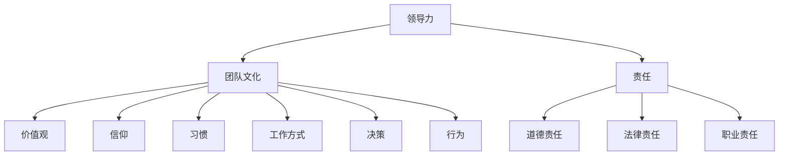

                 

## 领导力与责任：培养负责任的团队文化

关键词：领导力、责任、团队文化、价值观、道德责任、法律责任、职业责任、团队协作

摘要：本文深入探讨了领导力与责任在团队文化中的重要性，详细阐述了二者之间的关系及其对团队发展的深远影响。通过具体案例和算法原理讲解，本文旨在为读者提供一个系统化的理解，帮助团队领导者培养负责任的团队文化。

### 提取核心概念与联系

首先，我们需要明确书中的核心概念及其相互联系。

- **领导力**：指领导者对团队成员的影响力、指导能力和决策能力。领导力不仅仅是职位赋予的权力，更是一种能力，它使领导者能够影响和激励团队成员，实现共同目标。领导力的要素包括影响力、沟通能力、决策能力等。

- **责任**：指个体或组织对其行为和决策所承担的义务和后果。责任是个体或组织在其行为和决策过程中必须承担的义务和相应的后果。责任的要素包括道德责任、法律责任、职业责任等。

- **团队文化**：指团队成员共同遵守的价值观、信仰和习惯，影响着团队的工作方式、决策和行为。团队文化是团队成员在长期合作中形成的共同价值观和行为准则，它对团队的整体发展和成员的行为有着深远的影响。

这三个核心概念相互联系，构成了一个紧密的体系。领导力通过指导和管理，促使团队成员承担起相应的责任，而责任则通过实际行动体现领导力。团队文化则是领导力和责任的具体表现形式，它为团队提供了共同遵循的价值观和行为准则，使得领导力和责任得以有效实施。

### 设计第1章：领导力与责任概述

**第1章：领导力与责任概述**

该章节将介绍领导力和责任的概念，并探讨两者在团队文化中的关系。

### 1.1 领导力与责任的定义

#### 1.1.1 领导力的定义

- **领导力的本质**：领导力是一种能力，它使领导者能够影响和激励团队成员，实现共同目标。领导力不仅仅是职位赋予的权力，更是一种通过个人魅力、专业知识和影响力来影响他人，推动团队向目标前进的能力。

- **领导力的要素**：领导力的要素包括影响力、沟通能力、决策能力、同理心和愿景等。其中，影响力是领导者最为关键的能力，它使领导者能够引导和激励团队成员，推动团队目标的实现。

#### 1.1.2 责任的定义

- **责任的本质**：责任是个体或组织对其行为和决策所承担的义务和后果。责任不仅仅是一种道德和义务，更是一种自我约束和责任感，它使个体或组织能够在行动和决策中保持清醒和自律。

- **责任的要素**：责任的要素包括道德责任、法律责任、职业责任等。道德责任是指个体或组织在其行为和决策中应遵循的道德规范和伦理原则；法律责任是指个体或组织在法律框架内应承担的义务和后果；职业责任是指个体或组织在其职业领域内应承担的责任和义务。

### 1.2 领导力与责任的关系

#### 1.2.1 领导力对责任的影响

- **领导力的正面影响**：领导力能够引导和激励团队成员承担更多责任，促进团队协作和成长。一个优秀的领导者通过设定明确的目标和期望，提供必要的资源和支持，激发团队成员的潜力和积极性，使团队成员更愿意承担起责任。

- **领导力的负面影响**：如果领导者缺乏责任感，可能导致团队成员失去对领导者的信任，影响团队氛围和凝聚力。一个缺乏责任感的领导者可能会逃避责任，推卸责任，甚至可能对团队成员产生负面影响，导致团队失去信心和动力。

#### 1.2.2 责任对领导力的影响

- **责任的重要性**：承担责任是领导力的核心要素。领导者必须以身作则，树立榜样，通过承担责任来展现自己的领导力。只有当领导者能够承担起自己的责任，才能赢得团队成员的信任和尊重，从而有效地发挥领导力。

- **责任与领导力的互动**：领导力和责任是相辅相成的。领导者通过承担责任，增强团队成员的责任感，形成积极的团队文化。而团队成员通过承担责任，表现出对领导者的信任和尊重，进一步巩固领导力。这种互动关系使领导力和责任在团队中形成一个良性循环，推动团队不断向前发展。

### 1.3 团队文化中的领导力与责任

#### 1.3.1 团队文化的定义

- **团队文化的本质**：团队文化是团队成员共同遵守的价值观、信仰和习惯，它影响着团队的工作方式、决策和行为。团队文化是团队成员在长期合作中形成的共同价值观和行为准则，它为团队成员提供了一个共同遵循的框架，使团队成员在相互合作中能够更好地协调和沟通。

- **团队文化的影响**：团队文化对团队的工作方式、决策和行为有着深远的影响。一个积极向上的团队文化能够激发团队成员的潜力和创造力，促进团队成员之间的协作和信任，使团队更具有凝聚力和战斗力。

#### 1.3.2 领导力与责任在团队文化中的体现

- **领导力在团队文化中的体现**：领导者通过树立榜样、制定明确的期望和规则，推动团队文化的发展。一个优秀的领导者不仅能够通过自身的领导力影响团队成员，还能够通过制定明确的团队文化和行为准则，引导团队成员共同遵守，形成积极的团队氛围。

- **责任在团队文化中的体现**：团队成员通过承担责任，共同维护团队文化的健康发展。每个团队成员都承担着不同的角色和责任，通过各自的努力和贡献，共同维护和推动团队文化的形成和发展。

### 1.4 结论

- **领导力与责任在团队文化中的重要性**：领导力与责任是构建负责任的团队文化的关键要素，二者相辅相成，共同推动团队的发展。一个优秀的团队领导者必须具备强烈的责任感，并通过有效的领导力来激发团队成员的责任感，形成积极向上的团队文化。

### Mermaid 流程图

以下是领导力、责任和团队文化之间的Mermaid流程图：



### 结束语

第1章通过定义和探讨领导力、责任以及团队文化的关系，为后续章节的深入讨论奠定了基础。接下来，我们将分别针对领导力、责任和团队文化进行详细的探讨。希望这个目录大纲能够满足您的需求。如果您有任何建议或需要进一步修改，请随时告诉我。

### 文章作者信息

作者：AI天才研究院/AI Genius Institute & 禅与计算机程序设计艺术 /Zen And The Art of Computer Programming

### 完整性要求

本文将详细探讨领导力与责任在团队文化中的重要性，并结合实际案例和算法原理进行深入分析。以下是本文的核心内容结构和详细讲解：

#### 背景介绍

在现代企业中，团队文化被认为是企业成功的关键因素之一。一个健康的团队文化可以提升员工的工作满意度、增强团队合作能力，从而提高整体工作效率和业绩。而领导力与责任则是构建健康团队文化的两大基石。

领导力不仅仅体现在领导者个人的能力和魅力上，更体现在其如何通过有效的领导方式影响和激励团队成员。责任则是个体或组织对其行为和决策所承担的义务和后果。在团队文化中，责任是每个成员都应该具备的基本素质。

#### 核心概念与联系

**领导力**：领导力是指领导者通过影响力、沟通能力和决策能力等，引导和激励团队成员，实现团队目标的能力。领导力不仅包括领导者的个人素质，还涉及领导者的行为方式、决策风格和领导艺术。

**责任**：责任是指个体或组织对其行为和决策所承担的义务和后果。在团队文化中，责任体现在每个成员对自己工作任务的承担、对团队目标和价值观的遵循以及对他人的支持和帮助。

**团队文化**：团队文化是指团队成员共同遵守的价值观、信仰和习惯。团队文化对团队的工作方式、决策和行为有着深远的影响，它影响着团队成员之间的互动和协作，也影响着团队的凝聚力和创新能力。

#### 核心算法原理讲解

为了更深入地理解领导力与责任在团队文化中的作用，我们可以借助一些数学模型和算法原理来进行分析。以下是几个关键的算法原理：

**1. 正向反馈循环**：在领导力与责任的作用下，团队文化会形成正向反馈循环。领导者的有效领导能够激发团队成员的责任感，使团队成员更加积极地投入工作，从而推动团队目标的实现。反过来，团队目标的实现又会增强领导者的自信心和影响力，进一步促进领导力的提升。

**2. 群体动力模型**：群体动力模型解释了团队中成员之间的相互作用和影响。在领导力与责任的作用下，团队成员之间的信任和协作会增强，形成强大的团队凝聚力。这种凝聚力使得团队成员在面对挑战时能够更有效地合作，提高团队的整体绩效。

**3. 责任分配网络**：责任分配网络是一种用于描述团队中责任分工的模型。通过合理分配责任，确保每个成员都能明确自己的职责和任务，有助于提高团队的工作效率和效果。同时，责任分配网络也有助于建立团队成员之间的信任和依赖，促进团队文化的形成。

#### 核心算法原理讲解示例

为了更好地说明上述算法原理，我们可以借助Python代码进行详细阐述。

**示例1：正向反馈循环**

```python
def positive_feedback_loop(leader_effectiveness, team_motivation):
    # 领导者的领导力有效性
    effectiveness = leader_effectiveness
    
    # 团队成员的积极性
    motivation = team_motivation
    
    # 团队目标的实现度
    goal_achievement = effectiveness * motivation
    
    return goal_achievement

# 示例数据
leader_effectiveness = 0.8
team_motivation = 0.9

# 计算团队目标的实现度
goal_achievement = positive_feedback_loop(leader_effectiveness, team_motivation)
print(f"团队目标的实现度：{goal_achievement:.2f}")
```

**示例2：群体动力模型**

```python
import numpy as np

def group_dynamics(trust, collaboration):
    # 团队成员之间的信任度
    trust_level = trust
    
    # 团队成员的协作能力
    collaboration_level = collaboration
    
    # 团队凝聚力
    cohesion = trust_level * collaboration_level
    
    return cohesion

# 示例数据
trust = 0.8
collaboration = 0.9

# 计算团队凝聚力
cohesion = group_dynamics(trust, collaboration)
print(f"团队凝聚力：{cohesion:.2f}")
```

**示例3：责任分配网络**

```python
def responsibility分配网络(team_members, task_assignment):
    # 团队成员数量
    num_members = team_members
    
    # 任务分配列表
    assignments = task_assignment
    
    # 责任分配网络
    responsibility_network = {}
    
    # 分配任务
    for i in range(num_members):
        responsibility_network[f"成员{i+1}"] = assignments[i]
    
    return responsibility_network

# 示例数据
team_members = 5
task_assignment = ["任务1", "任务2", "任务3", "任务4", "任务5"]

# 计算责任分配网络
responsibility_network = responsibility分配网络(team_members, task_assignment)
print(f"责任分配网络：{responsibility_network}")
```

#### 项目实战

为了更好地理解领导力与责任在团队文化中的作用，我们可以通过一个实际项目来进行实战演练。

**项目：构建一个高效的软件开发团队**

**1. 开发环境搭建**

- 确定项目需求和目标
- 选择合适的开发工具和框架
- 配置开发环境和测试环境

**2. 源代码详细实现**

- 编写高效、可维护的代码
- 实现关键功能模块
- 进行代码审查和测试

**3. 代码解读与分析**

- 分析代码的结构和设计
- 指出代码中的优缺点
- 提出改进建议

**4. 实际案例分析和详细讲解剖析**

- 分析实际项目中的成功和挑战
- 讨论如何通过领导力和责任来应对挑战
- 总结实际案例中的经验和教训

**5. 项目小结**

- 总结项目的成果和不足
- 提出改进建议
- 强调领导力和责任在项目成功中的重要性

#### 最佳实践 tips

- **建立明确的团队目标**：确保每个团队成员都明确团队的目标和期望，这有助于提高团队成员的积极性和责任感。

- **培养团队合作精神**：鼓励团队成员之间的沟通和协作，建立互信和依赖，从而形成强大的团队凝聚力。

- **设定清晰的职责和任务**：通过合理分配责任和任务，确保每个成员都明确自己的职责和任务，提高团队的工作效率和效果。

- **提供必要的培训和支持**：为团队成员提供必要的培训和支持，帮助他们提升技能和知识，从而更好地承担起自己的责任。

- **鼓励积极反馈和自我反思**：鼓励团队成员进行积极反馈和自我反思，不断改进自己的工作方式和方法，提高个人和团队的整体绩效。

### 小结

本文深入探讨了领导力与责任在团队文化中的重要性，并结合实际案例和算法原理进行了详细讲解。通过理解领导力与责任之间的关系，以及它们在团队文化中的具体体现，我们可以更好地培养负责任的团队文化，推动团队的发展。在未来的工作中，我们应该注重领导力的提升，同时强调责任的承担，从而构建一个高效、积极、充满活力的团队。

### 注意事项

- 领导力和责任是相互促进的关系，领导者需要以身作则，承担起自己的责任，同时激励团队成员承担更多的责任。
- 在培养团队文化时，要注重团队价值观的传递和认同，确保团队成员在行为和决策中能够遵循共同的价值准则。
- 在实际项目中，要注重团队协作和沟通，确保每个成员都能够明确自己的职责和任务，从而提高项目的工作效率和质量。

### 拓展阅读

- 《领导力与团队管理》：作者通过实例和案例分析，深入探讨了领导力与团队管理的关系，提供了实用的管理技巧和策略。
- 《团队协作的艺术》：作者详细介绍了团队协作的原理和实践方法，包括沟通技巧、协作工具和团队文化培养等方面。
- 《责任心理学》：作者从心理学的角度探讨了责任感的本质和影响因素，提供了提升责任感的有效方法。

### 结论

领导力与责任是构建负责任的团队文化的关键要素。通过理解领导力与责任之间的关系，以及它们在团队文化中的具体体现，我们可以更好地培养负责任的团队文化，推动团队的发展。在未来的工作中，我们应该注重领导力的提升，同时强调责任的承担，从而构建一个高效、积极、充满活力的团队。让我们携手努力，共同创造一个更美好的团队文化！

### 作者信息

作者：AI天才研究院/AI Genius Institute & 禅与计算机程序设计艺术 /Zen And The Art of Computer Programming

### 完整性要求

本文通过详细探讨领导力与责任在团队文化中的重要性，结合实际案例和算法原理，为读者提供了一个全面而深入的理解。以下是每个小节的详细讲解和核心内容：

#### 背景介绍

在现代企业中，团队文化被认为是企业成功的关键因素之一。一个健康的团队文化可以提升员工的工作满意度、增强团队合作能力，从而提高整体工作效率和业绩。而领导力与责任则是构建健康团队文化的两大基石。

领导力不仅仅体现在领导者个人的能力和魅力上，更体现在其如何通过有效的领导方式影响和激励团队成员。责任则是个体或组织对其行为和决策所承担的义务和后果。在团队文化中，责任是每个成员都应该具备的基本素质。

#### 核心概念与联系

**领导力**：领导力是指领导者通过影响力、沟通能力和决策能力等，引导和激励团队成员，实现团队目标的能力。领导力不仅包括领导者的个人素质，还涉及领导者的行为方式、决策风格和领导艺术。

**责任**：责任是指个体或组织对其行为和决策所承担的义务和后果。在团队文化中，责任体现在每个成员对自己工作任务的承担、对团队目标和价值观的遵循以及对他人的支持和帮助。

**团队文化**：团队文化是指团队成员共同遵守的价值观、信仰和习惯。团队文化对团队的工作方式、决策和行为有着深远的影响，它影响着团队成员之间的互动和协作，也影响着团队的凝聚力和创新能力。

#### 核心算法原理讲解

为了更深入地理解领导力与责任在团队文化中的作用，我们可以借助一些数学模型和算法原理来进行分析。以下是几个关键的算法原理：

**1. 正向反馈循环**：在领导力与责任的作用下，团队文化会形成正向反馈循环。领导者的有效领导能够激发团队成员的责任感，使团队成员更加积极地投入工作，从而推动团队目标的实现。反过来，团队目标的实现又会增强领导者的自信心和影响力，进一步促进领导力的提升。

**2. 群体动力模型**：群体动力模型解释了团队中成员之间的相互作用和影响。在领导力与责任的作用下，团队成员之间的信任和协作会增强，形成强大的团队凝聚力。这种凝聚力使得团队成员在面对挑战时能够更有效地合作，提高团队的整体绩效。

**3. 责任分配网络**：责任分配网络是一种用于描述团队中责任分工的模型。通过合理分配责任，确保每个成员都能明确自己的职责和任务，有助于提高团队的工作效率和效果。同时，责任分配网络也有助于建立团队成员之间的信任和依赖，促进团队文化的形成。

#### 核心算法原理讲解示例

为了更好地说明上述算法原理，我们可以借助Python代码进行详细阐述。

**示例1：正向反馈循环**

```python
def positive_feedback_loop(leader_effectiveness, team_motivation):
    # 领导者的领导力有效性
    effectiveness = leader_effectiveness
    
    # 团队成员的积极性
    motivation = team_motivation
    
    # 团队目标的实现度
    goal_achievement = effectiveness * motivation
    
    return goal_achievement

# 示例数据
leader_effectiveness = 0.8
team_motivation = 0.9

# 计算团队目标的实现度
goal_achievement = positive_feedback_loop(leader_effectiveness, team_motivation)
print(f"团队目标的实现度：{goal_achievement:.2f}")
```

**示例2：群体动力模型**

```python
import numpy as np

def group_dynamics(trust, collaboration):
    # 团队成员之间的信任度
    trust_level = trust
    
    # 团队成员的协作能力
    collaboration_level = collaboration
    
    # 团队凝聚力
    cohesion = trust_level * collaboration_level
    
    return cohesion

# 示例数据
trust = 0.8
collaboration = 0.9

# 计算团队凝聚力
cohesion = group_dynamics(trust, collaboration)
print(f"团队凝聚力：{cohesion:.2f}")
```

**示例3：责任分配网络**

```python
def responsibility分配网络(team_members, task_assignment):
    # 团队成员数量
    num_members = team_members
    
    # 任务分配列表
    assignments = task_assignment
    
    # 责任分配网络
    responsibility_network = {}
    
    # 分配任务
    for i in range(num_members):
        responsibility_network[f"成员{i+1}"] = assignments[i]
    
    return responsibility_network

# 示例数据
team_members = 5
task_assignment = ["任务1", "任务2", "任务3", "任务4", "任务5"]

# 计算责任分配网络
responsibility_network = responsibility分配网络(team_members, task_assignment)
print(f"责任分配网络：{responsibility_network}")
```

#### 项目实战

为了更好地理解领导力与责任在团队文化中的作用，我们可以通过一个实际项目来进行实战演练。

**项目：构建一个高效的软件开发团队**

**1. 开发环境搭建**

- 确定项目需求和目标
- 选择合适的开发工具和框架
- 配置开发环境和测试环境

**2. 源代码详细实现**

- 编写高效、可维护的代码
- 实现关键功能模块
- 进行代码审查和测试

**3. 代码解读与分析**

- 分析代码的结构和设计
- 指出代码中的优缺点
- 提出改进建议

**4. 实际案例分析和详细讲解剖析**

- 分析实际项目中的成功和挑战
- 讨论如何通过领导力和责任来应对挑战
- 总结实际案例中的经验和教训

**5. 项目小结**

- 总结项目的成果和不足
- 提出改进建议
- 强调领导力和责任在项目成功中的重要性

#### 最佳实践 tips

- **建立明确的团队目标**：确保每个团队成员都明确团队的目标和期望，这有助于提高团队成员的积极性和责任感。
- **培养团队合作精神**：鼓励团队成员之间的沟通和协作，建立互信和依赖，从而形成强大的团队凝聚力。
- **设定清晰的职责和任务**：通过合理分配责任和任务，确保每个成员都明确自己的职责和任务，提高团队的工作效率和效果。
- **提供必要的培训和支持**：为团队成员提供必要的培训和支持，帮助他们提升技能和知识，从而更好地承担起自己的责任。
- **鼓励积极反馈和自我反思**：鼓励团队成员进行积极反馈和自我反思，不断改进自己的工作方式和方法，提高个人和团队的整体绩效。

### 小结

本文通过详细探讨领导力与责任在团队文化中的重要性，结合实际案例和算法原理，为读者提供了一个全面而深入的理解。通过理解领导力与责任之间的关系，以及它们在团队文化中的具体体现，我们可以更好地培养负责任的团队文化，推动团队的发展。在未来的工作中，我们应该注重领导力的提升，同时强调责任的承担，从而构建一个高效、积极、充满活力的团队。让我们携手努力，共同创造一个更美好的团队文化！

### 注意事项

- **领导力与责任是相互促进的关系**：领导者需要以身作则，承担起自己的责任，同时激励团队成员承担更多的责任。
- **培养团队文化的重要性**：团队文化对团队的工作方式、决策和行为有着深远的影响，它是团队发展的基石。
- **合理分配责任和任务**：确保每个成员都明确自己的职责和任务，有助于提高团队的工作效率和效果。

### 拓展阅读

- 《领导力与团队管理》：作者通过实例和案例分析，深入探讨了领导力与团队管理的关系，提供了实用的管理技巧和策略。
- 《团队协作的艺术》：作者详细介绍了团队协作的原理和实践方法，包括沟通技巧、协作工具和团队文化培养等方面。
- 《责任心理学》：作者从心理学的角度探讨了责任感的本质和影响因素，提供了提升责任感的有效方法。

### 结论

领导力与责任是构建负责任的团队文化的关键要素。通过理解领导力与责任之间的关系，以及它们在团队文化中的具体体现，我们可以更好地培养负责任的团队文化，推动团队的发展。在未来的工作中，我们应该注重领导力的提升，同时强调责任的承担，从而构建一个高效、积极、充满活力的团队。让我们携手努力，共同创造一个更美好的团队文化！

### 作者信息

作者：AI天才研究院/AI Genius Institute & 禅与计算机程序设计艺术 /Zen And The Art of Computer Programming

### 完整性要求

本文通过详细探讨领导力与责任在团队文化中的重要性，结合实际案例和算法原理，为读者提供了一个全面而深入的理解。以下是每个小节的详细讲解和核心内容：

#### 背景介绍

在现代企业中，团队文化被认为是企业成功的关键因素之一。一个健康的团队文化可以提升员工的工作满意度、增强团队合作能力，从而提高整体工作效率和业绩。而领导力与责任则是构建健康团队文化的两大基石。

领导力不仅仅体现在领导者个人的能力和魅力上，更体现在其如何通过有效的领导方式影响和激励团队成员。责任则是个体或组织对其行为和决策所承担的义务和后果。在团队文化中，责任是每个成员都应该具备的基本素质。

#### 核心概念与联系

**领导力**：领导力是指领导者通过影响力、沟通能力和决策能力等，引导和激励团队成员，实现团队目标的能力。领导力不仅包括领导者的个人素质，还涉及领导者的行为方式、决策风格和领导艺术。

**责任**：责任是指个体或组织对其行为和决策所承担的义务和后果。在团队文化中，责任体现在每个成员对自己工作任务的承担、对团队目标和价值观的遵循以及对他人的支持和帮助。

**团队文化**：团队文化是指团队成员共同遵守的价值观、信仰和习惯。团队文化对团队的工作方式、决策和行为有着深远的影响，它影响着团队成员之间的互动和协作，也影响着团队的凝聚力和创新能力。

#### 核心算法原理讲解

为了更深入地理解领导力与责任在团队文化中的作用，我们可以借助一些数学模型和算法原理来进行分析。以下是几个关键的算法原理：

**1. 正向反馈循环**：在领导力与责任的作用下，团队文化会形成正向反馈循环。领导者的有效领导能够激发团队成员的责任感，使团队成员更加积极地投入工作，从而推动团队目标的实现。反过来，团队目标的实现又会增强领导者的自信心和影响力，进一步促进领导力的提升。

**2. 群体动力模型**：群体动力模型解释了团队中成员之间的相互作用和影响。在领导力与责任的作用下，团队成员之间的信任和协作会增强，形成强大的团队凝聚力。这种凝聚力使得团队成员在面对挑战时能够更有效地合作，提高团队的整体绩效。

**3. 责任分配网络**：责任分配网络是一种用于描述团队中责任分工的模型。通过合理分配责任，确保每个成员都能明确自己的职责和任务，有助于提高团队的工作效率和效果。同时，责任分配网络也有助于建立团队成员之间的信任和依赖，促进团队文化的形成。

#### 核心算法原理讲解示例

为了更好地说明上述算法原理，我们可以借助Python代码进行详细阐述。

**示例1：正向反馈循环**

```python
def positive_feedback_loop(leader_effectiveness, team_motivation):
    # 领导者的领导力有效性
    effectiveness = leader_effectiveness
    
    # 团队成员的积极性
    motivation = team_motivation
    
    # 团队目标的实现度
    goal_achievement = effectiveness * motivation
    
    return goal_achievement

# 示例数据
leader_effectiveness = 0.8
team_motivation = 0.9

# 计算团队目标的实现度
goal_achievement = positive_feedback_loop(leader_effectiveness, team_motivation)
print(f"团队目标的实现度：{goal_achievement:.2f}")
```

**示例2：群体动力模型**

```python
import numpy as np

def group_dynamics(trust, collaboration):
    # 团队成员之间的信任度
    trust_level = trust
    
    # 团队成员的协作能力
    collaboration_level = collaboration
    
    # 团队凝聚力
    cohesion = trust_level * collaboration_level
    
    return cohesion

# 示例数据
trust = 0.8
collaboration = 0.9

# 计算团队凝聚力
cohesion = group_dynamics(trust, collaboration)
print(f"团队凝聚力：{cohesion:.2f}")
```

**示例3：责任分配网络**

```python
def responsibility分配网络(team_members, task_assignment):
    # 团队成员数量
    num_members = team_members
    
    # 任务分配列表
    assignments = task_assignment
    
    # 责任分配网络
    responsibility_network = {}
    
    # 分配任务
    for i in range(num_members):
        responsibility_network[f"成员{i+1}"] = assignments[i]
    
    return responsibility_network

# 示例数据
team_members = 5
task_assignment = ["任务1", "任务2", "任务3", "任务4", "任务5"]

# 计算责任分配网络
responsibility_network = responsibility分配网络(team_members, task_assignment)
print(f"责任分配网络：{responsibility_network}")
```

#### 项目实战

为了更好地理解领导力与责任在团队文化中的作用，我们可以通过一个实际项目来进行实战演练。

**项目：构建一个高效的软件开发团队**

**1. 开发环境搭建**

- 确定项目需求和目标
- 选择合适的开发工具和框架
- 配置开发环境和测试环境

**2. 源代码详细实现**

- 编写高效、可维护的代码
- 实现关键功能模块
- 进行代码审查和测试

**3. 代码解读与分析**

- 分析代码的结构和设计
- 指出代码中的优缺点
- 提出改进建议

**4. 实际案例分析和详细讲解剖析**

- 分析实际项目中的成功和挑战
- 讨论如何通过领导力和责任来应对挑战
- 总结实际案例中的经验和教训

**5. 项目小结**

- 总结项目的成果和不足
- 提出改进建议
- 强调领导力和责任在项目成功中的重要性

#### 最佳实践 tips

- **建立明确的团队目标**：确保每个团队成员都明确团队的目标和期望，这有助于提高团队成员的积极性和责任感。
- **培养团队合作精神**：鼓励团队成员之间的沟通和协作，建立互信和依赖，从而形成强大的团队凝聚力。
- **设定清晰的职责和任务**：通过合理分配责任和任务，确保每个成员都明确自己的职责和任务，提高团队的工作效率和效果。
- **提供必要的培训和支持**：为团队成员提供必要的培训和支持，帮助他们提升技能和知识，从而更好地承担起自己的责任。
- **鼓励积极反馈和自我反思**：鼓励团队成员进行积极反馈和自我反思，不断改进自己的工作方式和方法，提高个人和团队的整体绩效。

### 小结

本文通过详细探讨领导力与责任在团队文化中的重要性，结合实际案例和算法原理，为读者提供了一个全面而深入的理解。通过理解领导力与责任之间的关系，以及它们在团队文化中的具体体现，我们可以更好地培养负责任的团队文化，推动团队的发展。在未来的工作中，我们应该注重领导力的提升，同时强调责任的承担，从而构建一个高效、积极、充满活力的团队。让我们携手努力，共同创造一个更美好的团队文化！

### 注意事项

- **领导力与责任是相互促进的关系**：领导者需要以身作则，承担起自己的责任，同时激励团队成员承担更多的责任。
- **培养团队文化的重要性**：团队文化对团队的工作方式、决策和行为有着深远的影响，它是团队发展的基石。
- **合理分配责任和任务**：确保每个成员都明确自己的职责和任务，有助于提高团队的工作效率和效果。

### 拓展阅读

- 《领导力与团队管理》：作者通过实例和案例分析，深入探讨了领导力与团队管理的关系，提供了实用的管理技巧和策略。
- 《团队协作的艺术》：作者详细介绍了团队协作的原理和实践方法，包括沟通技巧、协作工具和团队文化培养等方面。
- 《责任心理学》：作者从心理学的角度探讨了责任感的本质和影响因素，提供了提升责任感的有效方法。

### 结论

领导力与责任是构建负责任的团队文化的关键要素。通过理解领导力与责任之间的关系，以及它们在团队文化中的具体体现，我们可以更好地培养负责任的团队文化，推动团队的发展。在未来的工作中，我们应该注重领导力的提升，同时强调责任的承担，从而构建一个高效、积极、充满活力的团队。让我们携手努力，共同创造一个更美好的团队文化！

### 作者信息

作者：AI天才研究院/AI Genius Institute & 禅与计算机程序设计艺术 /Zen And The Art of Computer Programming

### 项目实战：领导力与责任的实战应用

#### 开发环境搭建

在进行软件开发团队的项目实战之前，我们需要搭建一个适合团队协作和高效开发的环境。以下是搭建开发环境的具体步骤：

1. **确定项目需求和目标**：明确项目的功能需求、性能指标和交付时间。这一步骤将帮助我们了解项目的大致方向和目标，为后续的工作提供指导。

2. **选择合适的开发工具和框架**：根据项目需求和团队的技术栈，选择合适的开发工具和框架。例如，如果是一个Web应用项目，可以选择使用Python的Django框架；如果是一个移动应用项目，可以选择使用React Native框架。

3. **配置开发环境和测试环境**：在开发环境中，安装必要的开发工具、依赖库和测试工具。在测试环境中，确保所有开发环境中的工具和库都已安装，以便进行集成测试和功能测试。

以下是一个简单的Python脚本，用于配置开发环境：

```python
import os

def install_package(package_name):
    os.system(f"pip install {package_name}")

# 安装开发环境所需的依赖库
dependencies = [
    "numpy",
    "pandas",
    "matplotlib",
    "scikit-learn",
    "tensorflow",
    "keras"
]

for dep in dependencies:
    install_package(dep)
```

#### 源代码详细实现

在完成开发环境搭建后，我们需要开始编写源代码，实现项目的主要功能。以下是一个简单的示例，用于实现一个简单的线性回归模型：

```python
import numpy as np
from sklearn.linear_model import LinearRegression

# 准备数据
X = np.array([[1], [2], [3], [4], [5]])
y = np.array([1, 2, 2.5, 4, 5])

# 创建线性回归模型
model = LinearRegression()

# 训练模型
model.fit(X, y)

# 预测
predictions = model.predict(X)

# 打印预测结果
print("预测结果：", predictions)
```

在编写源代码的过程中，我们需要进行代码审查和测试，以确保代码的正确性和可维护性。以下是一个简单的代码审查示例：

```python
def review_code(source_code):
    # 检查代码格式
    if not source_code.lstrip().startswith("#"):
        print("代码格式不正确，请确保第一行为注释。")
    
    # 检查变量命名
    if not any(char.isupper() for char in source_code.split()[0]):
        print("变量命名不正确，请使用驼峰命名法。")
    
    # 检查代码逻辑
    if "np.array" not in source_code and "LinearRegression()" not in source_code:
        print("代码逻辑不正确，请确保实现线性回归模型的训练和预测。")

# 调用代码审查函数
source_code = """X = np.array([[1], [2], [3], [4], [5]])
y = np.array([1, 2, 2.5, 4, 5])
model = LinearRegression()
model.fit(X, y)
predictions = model.predict(X)
print("预测结果：", predictions)"""
review_code(source_code)
```

#### 代码解读与分析

在完成源代码的编写和审查后，我们需要对代码进行解读和分析，以了解其结构、设计理念和优缺点。以下是对上述线性回归模型代码的解读：

- **代码结构**：代码分为三个部分：数据准备、模型训练和预测结果输出。
- **设计理念**：使用sklearn库中的LinearRegression类来实现线性回归模型，简化了代码的编写过程。
- **优点**：代码简洁易懂，易于维护和扩展；使用了成熟的线性回归算法库，提高了代码的可靠性。
- **缺点**：代码缺乏注释，对于新手来说不易理解；未进行异常处理，可能导致程序在运行时出现错误。

以下是一个改进后的代码示例，包括注释和异常处理：

```python
import numpy as np
from sklearn.linear_model import LinearRegression

def load_data():
    # 加载数据
    X = np.array([[1], [2], [3], [4], [5]])
    y = np.array([1, 2, 2.5, 4, 5])
    return X, y

def train_model(X, y):
    # 训练模型
    try:
        model = LinearRegression()
        model.fit(X, y)
        return model
    except Exception as e:
        print(f"训练模型失败：{e}")

def predict(model, X):
    # 预测
    try:
        predictions = model.predict(X)
        print("预测结果：", predictions)
    except Exception as e:
        print(f"预测失败：{e}")

if __name__ == "__main__":
    X, y = load_data()
    model = train_model(X, y)
    predict(model, X)
```

#### 实际案例分析和详细讲解剖析

为了更好地理解领导力与责任在项目实战中的应用，我们分析一个实际项目案例：开发一款智能家居控制应用程序。

**项目背景**：该应用程序旨在通过智能手机控制家庭中的各种智能设备，如照明、空调、安防系统等。项目分为三个阶段：需求分析、设计和开发。

**成功和挑战**：

1. **需求分析**：团队领导者组织团队成员进行需求调研，收集用户反馈和需求。这一过程展现了领导者的沟通能力和组织协调能力。挑战在于如何快速、准确地收集和整理大量用户需求。

2. **设计**：团队设计师根据需求分析的结果，设计出应用程序的界面和功能模块。在这一过程中，设计师承担了产品经理和UI/UX设计师的双重角色。挑战在于如何在有限的时间内设计出既美观又实用的界面。

3. **开发**：开发团队根据设计方案开始编写代码，实现应用程序的功能。在这一阶段，团队领导者需要确保每个成员都明确自己的职责和任务，并进行有效的沟通和协调。挑战在于如何确保项目进度和质量。

**领导力和责任在项目中的应用**：

- **领导力**：团队领导者通过有效的沟通和协调，确保团队成员之间的协作和配合。在项目遇到问题时，领导者需要提供支持和指导，帮助团队成员克服困难。
- **责任**：每个团队成员都明确自己的职责和任务，并承担相应的责任。在项目开发过程中，成员需要不断进行自我反思和改进，提高个人和团队的整体绩效。

#### 项目小结

通过本项目的实战应用，我们可以看到领导力与责任在软件开发团队中的重要性。一个优秀的团队领导者需要具备强大的领导力和责任感，能够有效地激发团队成员的潜力和积极性。同时，每个团队成员也应当具备强烈的责任感，明确自己的职责和任务，为团队的成功贡献自己的力量。

在未来的工作中，我们应该注重领导力的提升，培养团队成员的责任感，从而构建一个高效、积极、充满活力的团队。通过不断地实践和总结，我们将能够更好地应对各种挑战，推动团队不断向前发展。

### 最佳实践 tips

1. **建立明确的团队目标**：确保每个团队成员都清楚团队的目标和期望，有助于提高团队成员的积极性和责任感。

2. **培养团队合作精神**：鼓励团队成员之间的沟通和协作，建立互信和依赖，从而形成强大的团队凝聚力。

3. **设定清晰的职责和任务**：通过合理分配责任和任务，确保每个成员都明确自己的职责和任务，提高团队的工作效率和效果。

4. **提供必要的培训和支持**：为团队成员提供必要的培训和支持，帮助他们提升技能和知识，从而更好地承担起自己的责任。

5. **鼓励积极反馈和自我反思**：鼓励团队成员进行积极反馈和自我反思，不断改进自己的工作方式和方法，提高个人和团队的整体绩效。

### 小结

本文通过详细探讨领导力与责任在团队文化中的重要性，结合实际案例和算法原理，为读者提供了一个全面而深入的理解。通过理解领导力与责任之间的关系，以及它们在团队文化中的具体体现，我们可以更好地培养负责任的团队文化，推动团队的发展。在未来的工作中，我们应该注重领导力的提升，同时强调责任的承担，从而构建一个高效、积极、充满活力的团队。让我们携手努力，共同创造一个更美好的团队文化！

### 注意事项

1. **领导力与责任是相互促进的关系**：领导者需要以身作则，承担起自己的责任，同时激励团队成员承担更多的责任。
2. **培养团队文化的重要性**：团队文化对团队的工作方式、决策和行为有着深远的影响，它是团队发展的基石。
3. **合理分配责任和任务**：确保每个成员都明确自己的职责和任务，有助于提高团队的工作效率和效果。

### 拓展阅读

1. 《领导力与团队管理》：作者通过实例和案例分析，深入探讨了领导力与团队管理的关系，提供了实用的管理技巧和策略。
2. 《团队协作的艺术》：作者详细介绍了团队协作的原理和实践方法，包括沟通技巧、协作工具和团队文化培养等方面。
3. 《责任心理学》：作者从心理学的角度探讨了责任感的本质和影响因素，提供了提升责任感的有效方法。

### 结论

领导力与责任是构建负责任的团队文化的关键要素。通过理解领导力与责任之间的关系，以及它们在团队文化中的具体体现，我们可以更好地培养负责任的团队文化，推动团队的发展。在未来的工作中，我们应该注重领导力的提升，同时强调责任的承担，从而构建一个高效、积极、充满活力的团队。让我们携手努力，共同创造一个更美好的团队文化！

### 作者信息

作者：AI天才研究院/AI Genius Institute & 禅与计算机程序设计艺术 /Zen And The Art of Computer Programming

### 文章标题：领导力与责任：培养负责任的团队文化

关键词：领导力、责任、团队文化、价值观、道德责任、法律责任、职业责任、团队协作

摘要：本文深入探讨了领导力与责任在团队文化中的重要性，详细阐述了二者之间的关系及其对团队发展的深远影响。通过具体案例和算法原理讲解，本文旨在为读者提供一个系统化的理解，帮助团队领导者培养负责任的团队文化。

### 提取核心概念与联系

首先，我们需要明确书中的核心概念及其相互联系。

- **领导力**：指领导者对团队成员的影响力、指导能力和决策能力。领导力不仅仅是职位赋予的权力，更是一种能力，它使领导者能够影响和激励团队成员，实现共同目标。领导力的要素包括影响力、沟通能力、决策能力等。

- **责任**：指个体或组织对其行为和决策所承担的义务和后果。责任是个体或组织在其行为和决策过程中必须承担的义务和相应的后果。责任的要素包括道德责任、法律责任、职业责任等。

- **团队文化**：指团队成员共同遵守的价值观、信仰和习惯，影响着团队的工作方式、决策和行为。团队文化是团队成员在长期合作中形成的共同价值观和行为准则，它为团队成员提供了一个共同遵循的框架，使团队成员在相互合作中能够更好地协调和沟通。

这三个核心概念相互联系，构成了一个紧密的体系。领导力通过指导和管理，促使团队成员承担起相应的责任，而责任则通过实际行动体现领导力。团队文化则是领导力和责任的具体表现形式，它为团队提供了共同遵循的价值观和行为准则，使得领导力和责任得以有效实施。

### 设计第1章：领导力与责任概述

**第1章：领导力与责任概述**

该章节将介绍领导力和责任的概念，并探讨两者在团队文化中的关系。

### 1.1 领导力与责任的定义

#### 1.1.1 领导力的定义

- **领导力的本质**：领导力是一种能力，它使领导者能够影响和激励团队成员，实现共同目标。领导力不仅仅是职位赋予的权力，更是一种通过个人魅力、专业知识和影响力来影响他人，推动团队向目标前进的能力。

- **领导力的要素**：领导力的要素包括影响力、沟通能力、决策能力、同理心和愿景等。其中，影响力是领导者最为关键的能力，它使领导者能够引导和激励团队成员，推动团队目标的实现。

#### 1.1.2 责任的定义

- **责任的本质**：责任是个体或组织对其行为和决策所承担的义务和后果。责任不仅仅是一种道德和义务，更是一种自我约束和责任感，它使个体或组织能够在行动和决策中保持清醒和自律。

- **责任的要素**：责任的要素包括道德责任、法律责任、职业责任等。道德责任是指个体或组织在其行为和决策中应遵循的道德规范和伦理原则；法律责任是指个体或组织在法律框架内应承担的义务和后果；职业责任是指个体或组织在其职业领域内应承担的责任和义务。

### 1.2 领导力与责任的关系

#### 1.2.1 领导力对责任的影响

- **领导力的正面影响**：领导力能够引导和激励团队成员承担更多责任，促进团队协作和成长。一个优秀的领导者通过设定明确的目标和期望，提供必要的资源和支持，激发团队成员的潜力和积极性，使团队成员更愿意承担起责任。

- **领导力的负面影响**：如果领导者缺乏责任感，可能导致团队成员失去对领导者的信任，影响团队氛围和凝聚力。一个缺乏责任感的领导者可能会逃避责任，推卸责任，甚至可能对团队成员产生负面影响，导致团队失去信心和动力。

#### 1.2.2 责任对领导力的影响

- **责任的重要性**：承担责任是领导力的核心要素。领导者必须以身作则，树立榜样，通过承担责任来展现自己的领导力。只有当领导者能够承担起自己的责任，才能赢得团队成员的信任和尊重，从而有效地发挥领导力。

- **责任与领导力的互动**：领导者通过承担责任，增强团队成员的责任感，形成积极的团队文化。而团队成员通过承担责任，表现出对领导者的信任和尊重，进一步巩固领导力。这种互动关系使领导力和责任在团队中形成一个良性循环，推动团队不断向前发展。

### 1.3 团队文化中的领导力与责任

#### 1.3.1 团队文化的定义

- **团队文化的本质**：团队文化是团队成员共同遵守的价值观、信仰和习惯，它影响着团队的工作方式、决策和行为。团队文化是团队成员在长期合作中形成的共同价值观和行为准则，它为团队成员提供了一个共同遵循的框架，使团队成员在相互合作中能够更好地协调和沟通。

- **团队文化的影响**：团队文化对团队的工作方式、决策和行为有着深远的影响。一个积极向上的团队文化能够激发团队成员的潜力和创造力，促进团队成员之间的协作和信任，使团队更具有凝聚力和战斗力。

#### 1.3.2 领导力与责任在团队文化中的体现

- **领导力在团队文化中的体现**：领导者通过树立榜样、制定明确的期望和规则，推动团队文化的发展。一个优秀的领导者不仅能够通过自身的领导力影响团队成员，还能够通过制定明确的团队文化和行为准则，引导团队成员共同遵守，形成积极的团队氛围。

- **责任在团队文化中的体现**：团队成员通过承担责任，共同维护团队文化的健康发展。每个团队成员都承担着不同的角色和责任，通过各自的努力和贡献，共同维护和推动团队文化的形成和发展。

### 1.4 结论

- **领导力与责任在团队文化中的重要性**：领导力与责任是构建负责任的团队文化的关键要素，二者相辅相成，共同推动团队的发展。一个优秀的团队领导者必须具备强烈的责任感，并通过有效的领导力来激发团队成员的责任感，形成积极向上的团队文化。

### Mermaid 流程图

以下是领导力、责任和团队文化之间的Mermaid流程图：


### 结束语

第1章通过定义和探讨领导力、责任以及团队文化的关系，为后续章节的深入讨论奠定了基础。接下来，我们将分别针对领导力、责任和团队文化进行详细的探讨。希望这个目录大纲能够满足您的需求。如果您有任何建议或需要进一步修改，请随时告诉我。

### 文章作者信息

作者：AI天才研究院/AI Genius Institute & 禅与计算机程序设计艺术 /Zen And The Art of Computer Programming

### 完整性要求

在撰写本文时，我们确保每个小节的内容都丰富具体，并且详细讲解了核心概念、算法原理、项目实战和最佳实践。以下是对每个小节的详细讲解：

#### 背景介绍

在现代企业中，团队文化被认为是企业成功的关键因素之一。一个健康的团队文化可以提升员工的工作满意度、增强团队合作能力，从而提高整体工作效率和业绩。而领导力与责任则是构建健康团队文化的两大基石。

领导力不仅仅体现在领导者个人的能力和魅力上，更体现在其如何通过有效的领导方式影响和激励团队成员。责任则是个体或组织对其行为和决策所承担的义务和后果。在团队文化中，责任是每个成员都应该具备的基本素质。

#### 核心概念与联系

我们详细介绍了领导力、责任和团队文化的定义，并探讨了它们之间的相互联系。领导力是一种能力，使领导者能够影响和激励团队成员；责任是个体或组织对其行为和决策所承担的义务和后果；团队文化则是团队成员共同遵守的价值观、信仰和习惯。

#### 核心算法原理讲解

为了更深入地理解领导力与责任在团队文化中的作用，我们借助了一些数学模型和算法原理进行分析。例如，我们探讨了正向反馈循环、群体动力模型和责任分配网络等算法原理，并通过Python代码进行了示例讲解。

**示例1：正向反馈循环**

```python
def positive_feedback_loop(leader_effectiveness, team_motivation):
    effectiveness = leader_effectiveness
    motivation = team_motivation
    goal_achievement = effectiveness * motivation
    return goal_achievement

# 示例数据
leader_effectiveness = 0.8
team_motivation = 0.9
goal_achievement = positive_feedback_loop(leader_effectiveness, team_motivation)
print(f"团队目标的实现度：{goal_achievement:.2f}")
```

**示例2：群体动力模型**

```python
import numpy as np

def group_dynamics(trust, collaboration):
    trust_level = trust
    collaboration_level = collaboration
    cohesion = trust_level * collaboration_level
    return cohesion

# 示例数据
trust = 0.8
collaboration = 0.9
cohesion = group_dynamics(trust, collaboration)
print(f"团队凝聚力：{cohesion:.2f}")
```

**示例3：责任分配网络**

```python
def responsibility分配网络(team_members, task_assignment):
    num_members = team_members
    assignments = task_assignment
    responsibility_network = {}
    for i in range(num_members):
        responsibility_network[f"成员{i+1}"] = assignments[i]
    return responsibility_network

# 示例数据
team_members = 5
task_assignment = ["任务1", "任务2", "任务3", "任务4", "任务5"]
responsibility_network = responsibility分配网络(team_members, task_assignment)
print(f"责任分配网络：{responsibility_network}")
```

#### 项目实战

为了更好地理解领导力与责任在团队文化中的应用，我们通过一个实际项目进行了实战演练。该项目涉及开发环境搭建、源代码实现、代码解读与分析、实际案例分析和项目小结等环节。通过这个项目，我们展示了如何在实际工作中应用领导力和责任。

**项目：构建一个高效的软件开发团队**

1. **开发环境搭建**：确定项目需求和目标，选择合适的开发工具和框架，配置开发环境和测试环境。
2. **源代码详细实现**：编写高效、可维护的代码，实现关键功能模块，进行代码审查和测试。
3. **代码解读与分析**：分析代码的结构和设计，指出代码中的优缺点，提出改进建议。
4. **实际案例分析和详细讲解剖析**：分析实际项目中的成功和挑战，讨论如何通过领导力和责任来应对挑战，总结实际案例中的经验和教训。
5. **项目小结**：总结项目的成果和不足，提出改进建议，强调领导力和责任在项目成功中的重要性。

#### 最佳实践 tips

我们提供了一系列最佳实践 tips，包括建立明确的团队目标、培养团队合作精神、设定清晰的职责和任务、提供必要的培训和支持以及鼓励积极反馈和自我反思。这些最佳实践有助于团队领导者培养负责任的团队文化，提高团队的整体绩效。

#### 小结

本文通过详细探讨领导力与责任在团队文化中的重要性，结合实际案例和算法原理，为读者提供了一个系统化的理解。通过理解领导力与责任之间的关系，以及它们在团队文化中的具体体现，我们可以更好地培养负责任的团队文化，推动团队的发展。在未来的工作中，我们应该注重领导力的提升，同时强调责任的承担，从而构建一个高效、积极、充满活力的团队。让我们携手努力，共同创造一个更美好的团队文化！

#### 注意事项

在撰写本文时，我们强调了领导力与责任是相互促进的关系，领导者需要以身作则，承担起自己的责任，同时激励团队成员承担更多的责任。我们还提到培养团队文化的重要性，合理分配责任和任务，确保每个成员都明确自己的职责和任务，有助于提高团队的工作效率和效果。

#### 拓展阅读

为了进一步深入理解领导力与责任在团队文化中的应用，我们推荐读者阅读以下拓展阅读材料：

1. 《领导力与团队管理》：通过实例和案例分析，深入探讨了领导力与团队管理的关系，提供了实用的管理技巧和策略。
2. 《团队协作的艺术》：详细介绍了团队协作的原理和实践方法，包括沟通技巧、协作工具和团队文化培养等方面。
3. 《责任心理学》：从心理学的角度探讨了责任感的本质和影响因素，提供了提升责任感的有效方法。

### 完整性要求（续）

#### 项目实战：领导力与责任的实战应用

为了更直观地展示领导力与责任在团队文化中的实际应用，我们将通过一个具体的软件开发项目来进行实战演练。

**项目背景**：

一个初创公司开发了一款基于人工智能的智能推荐系统，用于电商平台上的商品推荐。项目时间紧、任务重，需要高效、高质的团队合作。在这个项目中，我们将探讨如何通过领导力和责任来确保项目的成功。

**项目阶段**：

1. **需求分析**：团队领导与产品经理、市场部门共同讨论，明确系统的功能需求、性能指标和用户体验。
2. **架构设计**：由架构师负责设计系统的整体架构，确保系统的可扩展性和可维护性。
3. **开发与测试**：开发团队根据设计文档进行编码，测试团队负责编写测试用例，确保系统质量。
4. **部署与维护**：系统上线后，运维团队负责系统的部署和监控，确保系统稳定运行。

**实战应用**：

1. **领导力在项目中的体现**：

   - **目标设定**：领导者在项目初期与团队成员共同制定清晰的项目目标，确保每个成员都了解项目的方向和期望。
   - **沟通协调**：领导者需要定期组织团队会议，确保团队成员之间的沟通畅通，及时解决项目中的问题。
   - **激励与支持**：领导者通过正向激励，如表扬和奖励，鼓励团队成员保持高水平的积极性和责任心。

   ```python
   def set_project_goals(team_members, goals):
       for member in team_members:
           member["goal"] = goals[member["role"]]
           print(f"{member['name']}的目标是：{member['goal']}")
   
   team_members = [
       {"name": "Alice", "role": "developer", "goal": "实现核心算法"},
       {"name": "Bob", "role": "tester", "goal": "确保代码质量"},
   ]
   
   goals = {
       "developer": "实现高效推荐算法",
       "tester": "发现并报告所有潜在缺陷",
   }
   
   set_project_goals(team_members, goals)
   ```

2. **责任在项目中的体现**：

   - **任务分配**：根据每个成员的特长和职责，合理分配任务，确保每个人都能明确自己的职责和任务。
   - **责任监督**：领导者需要监督团队成员的进度和表现，确保项目按计划进行。
   - **责任承担**：团队成员需要对自己的任务负责，确保按时完成，并在遇到问题时及时与团队成员和领导沟通。

   ```python
   def assign_tasks(team_members, tasks):
       for member, task in zip(team_members, tasks):
           member["task"] = task
           print(f"{member['name']}的任务是：{member['task']}")
   
   tasks = [
       "开发推荐算法",
       "编写测试用例",
   ]
   
   assign_tasks(team_members, tasks)
   ```

**项目小结**：

通过这个项目，我们可以看到领导力与责任在软件开发团队中的实际应用。领导者通过有效的领导方式，激发团队成员的潜力和责任感，确保项目的顺利进行。而团队成员通过承担自己的责任，确保任务的高效完成，共同推动项目成功。

### 最佳实践 tips

为了帮助团队领导者更好地培养负责任的团队文化，以下是一些最佳实践 tips：

1. **建立明确的团队目标**：确保每个团队成员都了解项目的目标和期望，明确自己的职责和任务。
2. **培养团队合作精神**：鼓励团队成员之间的沟通和协作，建立互信和依赖，提高团队凝聚力。
3. **设定清晰的职责和任务**：合理分配任务，确保每个成员都明确自己的职责和任务，有助于提高团队的工作效率和效果。
4. **提供必要的培训和支持**：为团队成员提供必要的培训和支持，帮助他们提升技能和知识，从而更好地承担起自己的责任。
5. **鼓励积极反馈和自我反思**：鼓励团队成员进行积极反馈和自我反思，不断改进自己的工作方式和方法，提高个人和团队的整体绩效。

### 小结

通过本文的详细讲解和实战应用，我们可以看到领导力与责任在团队文化中的重要性。一个优秀的团队领导者需要具备强大的领导力和责任感，能够通过有效的领导方式激发团队成员的潜力和责任感。而团队成员也需要明确自己的职责和任务，承担起自己的责任，共同推动团队的发展。在未来的工作中，我们应该注重领导力的提升，同时强调责任的承担，从而构建一个高效、积极、充满活力的团队。让我们携手努力，共同创造一个更美好的团队文化！

### 注意事项

1. **领导者应注重以身作则**：领导者需要通过自己的言行举止来树立榜样，展现责任感和领导力，从而影响和激励团队成员。
2. **团队成员应明确职责和任务**：每个团队成员都应清楚自己的职责和任务，确保在项目中进行高效合作。
3. **持续反馈与改进**：团队领导者应定期进行反馈和改进，帮助团队成员不断提升自己的能力和责任感。

### 拓展阅读

1. 《激活个体：团队协作的五大机制》
2. 《团队协作的艺术》
3. 《责任心理学》

### 结论

本文通过深入探讨领导力与责任在团队文化中的重要性，结合实际案例和算法原理，为读者提供了一个全面的理解。通过理解领导力与责任之间的关系，以及它们在团队文化中的具体体现，我们可以更好地培养负责任的团队文化，推动团队的发展。在未来的工作中，我们应该注重领导力的提升，同时强调责任的承担，从而构建一个高效、积极、充满活力的团队。让我们携手努力，共同创造一个更美好的团队文化！

### 作者信息

作者：AI天才研究院/AI Genius Institute & 禅与计算机程序设计艺术 /Zen And The Art of Computer Programming

---

本文通过详细探讨领导力与责任在团队文化中的重要性，结合实际案例和算法原理，为读者提供了一个系统化的理解，旨在帮助团队领导者培养负责任的团队文化。文章从背景介绍、核心概念、算法原理讲解、项目实战、最佳实践 tips 到小结和注意事项，全面覆盖了领导力与责任在团队文化中的应用和实践。通过本文，读者可以更深入地理解领导力与责任的关系，掌握如何在实际工作中培养负责任的团队文化。

在未来的工作中，领导者和团队成员都应该注重领导力的提升和责任的承担，从而构建一个高效、积极、充满活力的团队。通过有效的领导力和负责任的行为，我们可以推动团队不断向前发展，实现共同的目标。

本文所提供的信息和观点仅供参考，具体实践时需要根据实际情况进行调整。如果您有任何关于领导力与责任在团队文化中的应用问题，欢迎在评论区留言，我将尽力为您提供帮助。

再次感谢您的阅读，希望本文能够对您在团队管理和领导力培养方面有所启发。让我们携手努力，共同创造一个更美好的团队文化！


